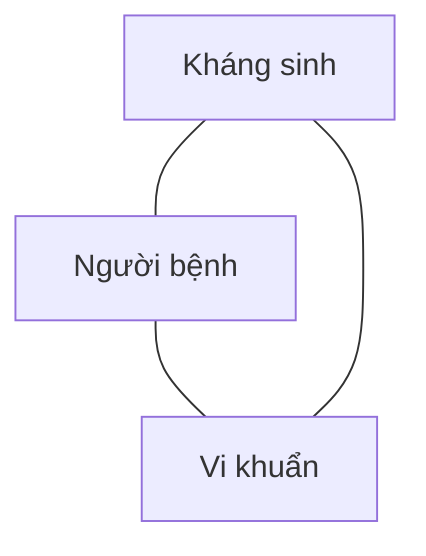
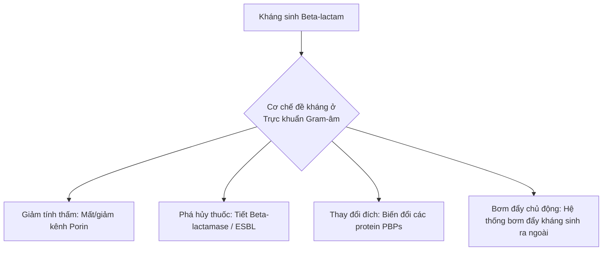

# HƯỚNG DẪN SỬ DỤNG KHÁNG SINH
*(Ban hành kèm theo Quyết định số 708/QĐ-BYT ngày 02/3/2015 của Bộ trưởng Bộ Y tế)*

**BỘ Y TẾ**
**NHÀ XUẤT BẢN Y HỌC**
*HÀ NỘI - 2015*

---

## BAN BIÊN SOẠN

* **Chủ biên:** PGS.TS. Nguyễn Thị Xuyên
* **Đồng chủ biên:**
  * PGS.TS. Lương Ngọc Khuê
  * GS.TS. Trần Quỵ
  * GS.TS. Hoàng Thị Kim Huyền
* **Ban biên soạn:**
  * GS.TS. Trần Quỵ
  * TS.BS. Phạm Ngọc Đông
  * GS.TS. Hoàng Thị Kim Huyền
  * TS.BS. Nguyễn Hải Anh
  * GS.TS. Nguyễn Lân Việt
  * TS.BS. Vũ Văn Giáp
  * GS.TS. Ngô Quý Châu
  * TS.BS. Nguyễn Thanh Hồi
  * GS.TS. Lê Quang Cường
  * TS.BS. Phan Thu Phương
  * GS.TS. Trần Hậu Khang
  * TS.BS. Vũ Trường Khanh
  * GS.TS. Đỗ Như Hơn
  * TS.BS. Trần Quý Tường
  * GS.TS. Nguyễn Gia Bình
  * TS.BS. Lê Thị Diễm Tuyết
  * GS.TS. Đào Văn Long
  * TS.BS. Lê Thị Kim Xuân
  * PGS.TS. Bạch Quốc Khánh
  * TS.DS. Nguyễn Thị Liên Hương
  * PGS.TS. Trần An
  * TS.DS. Phạm Thị Thúy Vân
  * PGS.TS. Chu Thị Hạnh
  * TS.DS. Vũ Thị Thu Hương
  * PGS.TS. Nguyễn Văn Kính
  * BSCKII. Huỳnh Phan Phúc Linh
  * PGS.TS. Nguyễn Hoàng Anh
  * ThS.DS. Cao Hưng Thái
  * PGS.TS.BSCKII. Vũ Bá Quyết
  * ThS.DS. Nguyễn Hằng Nga
  * PGS.TS. Đinh Thị Kim Dung
  * ThS.BS. Lưu Văn Ái
  * PGS.TS. Trương Thanh Hương
  * ThS.BS. Giang Thục Anh
  * PGS.TS. Bùi Vũ Huy
  * ThS.BS. Bùi Hải Bình
  * PGS.TS. Nguyễn Thị Ngọc Lan
  * ThS.BS. Nguyễn Đăng Tuân
  * PGS.TS. Đỗ Thị Liệu
  * ThS.BS. Lê Thị Ngọc Lan
  * PGS.TS. Đoàn Mai Phương
  * ThS. Vũ Quốc Đạt
  * PGS.TS. Nguyễn Hữu Sáu
  * ThS. Nguyễn Thị Thanh Huyền
  * PGS.TS. Phạm Thị Hồng Thi
  * ThS. Đoàn Thị Phương Lan
  * PGS.TS. Nguyễn Thị Vinh
  * ThS. Tạ Thị Diệu Ngân
  * TS.BS. Trần Thị Tô Châu
  * ThS. Nguyễn Kim Thư
  * TS.BS. Lê Xuân Cung
  * BS. Thẩm Trương Khánh Vân
* **Tổ thư ký và biên tập:**
  * ThS. Nguyễn Đức Tiến
  * ThS. Ngô Thị Bích Hà
  * ThS. Trương Lê Vân Ngọc
  * ThS. Nguyễn Thị Đại Phong
  * ThS. Nguyễn Thị Thủy
  * Bộ môn Dược lâm sàng - Trường Đại học Dược Hà Nội

---

**BỘ Y TẾ**  
Số: 708/QĐ-BYT  

**CỘNG HÒA XÃ HỘI CHỦ NGHĨA VIỆT NAM**  
**Độc lập - Tự do - Hạnh phúc**  

*Hà Nội, ngày 02 tháng 3 năm 2015*

## QUYẾT ĐỊNH
### Về việc ban hành tài liệu chuyên môn “Hướng dẫn sử dụng kháng sinh”

**BỘ TRƯỞNG BỘ Y TẾ**

- Căn cứ Luật khám bệnh, chữa bệnh năm 2009;
- Căn cứ Nghị định số 63/2012/NĐ-CP ngày 31/8/2012 của Chính phủ quy định chức năng, nhiệm vụ, quyền hạn và cơ cấu tổ chức của Bộ Y tế;
- Theo đề nghị của Cục trưởng Cục Quản lý Khám, chữa bệnh,

**QUYẾT ĐỊNH:**

**Điều 1.** Ban hành kèm theo Quyết định này tài liệu chuyên môn “Hướng dẫn sử dụng kháng sinh”.

**Điều 2.** Tài liệu “Hướng dẫn sử dụng kháng sinh” ban hành kèm theo Quyết định này được áp dụng tại các cơ sở khám bệnh, chữa bệnh.  
Căn cứ vào tài liệu này và điều kiện cụ thể của đơn vị, Giám đốc cơ sở khám bệnh, chữa bệnh xây dựng và ban hành tài liệu Hướng dẫn sử dụng kháng sinh phù hợp để thực hiện tại đơn vị.

**Điều 3.** Quyết định này có hiệu lực kể từ ngày ký ban hành.

**Điều 4.** Các ông, bà: Chánh Văn phòng Bộ, Chánh Thanh tra Bộ, Cục trưởng Cục Quản lý Khám, chữa bệnh, Cục trưởng và Vụ trưởng các Cục, Vụ thuộc Bộ Y tế, Giám đốc các bệnh viện, viện có giường bệnh trực thuộc Bộ Y tế, Giám đốc Sở Y tế các tỉnh, thành phố trực thuộc trung ương, Thủ trưởng Y tế các Bộ, Ngành và Thủ trưởng các đơn vị có liên quan chịu trách nhiệm thi hành Quyết định này./.

**Nơi nhận:**
- Như Điều 4;
- Bộ trưởng Bộ Y tế (để b/c);
- Các Thứ trưởng BYT;
- Bảo hiểm Xã hội Việt Nam (để phối hợp);
- Cổng thông tin điện tử BYT;
- Website Cục KCB;
- Lưu VT, KCB.

**KT. BỘ TRƯỞNG**  
**THỨ TRƯỞNG**  
*(Đã ký)*

---

## LỜI NÓI ĐẦU

Từ khi phát hiện ra kháng sinh Penicilline đến nay hàng trăm loại kháng sinh và các thuốc tương tự đã được phát minh và đưa vào sử dụng. Sự ra đời của kháng sinh đã đánh dấu một kỷ nguyên mới của y học về điều trị các bệnh nhiễm khuẩn, đã cứu sống hàng triệu triệu người khỏi các bệnh nhiễm khuẩn nguy hiểm. Kháng sinh còn được sử dụng rộng rãi trong trồng trọt, chăn nuôi gia súc, gia cầm và thủy sản,…

Tuy nhiên cũng do việc sử dụng rộng rãi, kéo dài và lạm dụng, chưa hợp lý, an toàn nên tình trạng kháng kháng sinh của các vi sinh vật (vi khuẩn, vi rút, ký sinh trùng, nấm,…) ngày một gia tăng. Mức độ kháng thuốc ngày càng trầm trọng làm ảnh hưởng đến hiệu quả điều trị, tiên lượng xấu, nguy cơ tử vong cao, thời gian điều trị kéo dài, chi phí điều trị tăng cao, ảnh hưởng đến sức khỏe người bệnh và cộng đồng.

Cùng với các nước trên thế giới, Việt Nam đã hưởng ứng tích cực lời kêu gọi của Tổ chức Y tế Thế giới “Không hành động hôm nay, ngày mai không có thuốc chữa” và “**Kế hoạch hành động quốc gia về chống kháng thuốc giai đoạn từ năm 2013 đến năm 2020**” đã được ban hành (Quyết định số 2174/QĐ-BYT ngày 21/6/2013) nhằm đẩy mạnh các hoạt động phòng, chống kháng thuốc góp phần nâng cao chất lượng, hiệu quả của công tác phòng, chống dịch bệnh, khám bệnh, chữa bệnh, bảo vệ, chăm sóc và nâng cao sức khỏe nhân dân.

Biên soạn tài liệu “**Hướng dẫn sử dụng kháng sinh**” là một trong nhiều nhiệm vụ của Kế hoạch hành động trên. Ban biên soạn được thành lập theo Quyết định số 4259/QĐ-BYT ngày 31/10/2012 gồm các chuyên gia đầu ngành về y và dược. Tài liệu cung cấp những kiến thức và kỹ năng cơ bản, cập nhật đồng thời phù hợp với thực tế của Việt Nam về việc sử dụng kháng sinh hợp lý, an toàn để ứng dụng trong công tác khám, chữa bệnh, phòng bệnh, bảo vệ chăm sóc và nâng cao sức khỏe nhân dân, góp phần hạn chế tình trạng kháng kháng sinh đang có nguy cơ gia tăng hiện nay.

Tài liệu gồm có 11 chương và 55 bài, bao gồm đại cương về kháng sinh và vi khuẩn, sử dụng kháng sinh trong các bệnh nhiễm khuẩn thường gặp (nhiễm khuẩn hô hấp, tim mạch, tiêu hóa, thận - tiết niệu,…).

Tài liệu đã được biên soạn công phu, chất lượng, cập nhật và thực tế Việt Nam, tuy nhiên cũng còn những thiếu sót. Rất mong các giáo sư, các chuyên gia và các đồng nghiệp, bạn đọc góp ý kiến bổ sung để tài liệu được hoàn chỉnh hơn.

Chúng tôi trân trọng cảm ơn sự chỉ đạo sát sao của PGS.TS. Nguyễn Thị Kim Tiến - Bộ trưởng Bộ Y tế, các Giáo sư, Phó Giáo sư, Tiến sỹ, Thạc sỹ, Bác sỹ, Dược sỹ, các thành viên Ban biên soạn, các chuyên gia đầu ngành của các chuyên khoa đã rất cố gắng, dành nhiều thời gian quý báu để biên soạn, sửa chữa, thẩm định cuốn sách này và trân trọng cảm ơn sự hỗ trợ của AstraZeneca cho việc tổ chức và in ấn để hoàn thiện hướng dẫn này. Đây là lần ấn bản đầu tiên của cuốn sách, chắc chắn còn nhiều thiếu sót, chúng tôi rất mong nhận được sự đóng góp từ Quý độc giả và đồng nghiệp để cuốn sách ngày một hoàn thiện.

**THAY MẶT BAN BIÊN SOẠN**  
**GS.TS. Trần Quỵ**

---

## MỤC LỤC

- [Lời nói đầu](#lời-nói-đầu) (Tr. 5)
- [Danh mục bảng](#danh-mục-bảng) (Tr. 10)
- [Danh mục hình vẽ](#danh-mục-hình) (Tr. 11)
- [Từ viết tắt tiếng Anh](#từ-viết-tắt-tiếng-anh) (Tr. 12)
- [Từ viết tắt tiếng Việt](#từ-viết-tắt-tiếng-việt) (Tr. 14)
- **[PHẦN I. ĐẠI CƯƠNG VỀ KHÁNG SINH VÀ VI KHUẨN HỌC](#phần-i-đại-cương-về-kháng-sinh-và-vi-khuẩn-học)** (Tr. 15)
  - **[Chương 1. Đại cương về kháng sinh](#chương-1-đại-cương-về-kháng-sinh)** (Tr. 17)
    - [Mở đầu](#mở-đầu) (Tr. 17)
    - [Các nhóm kháng sinh và tác dụng](#các-nhóm-kháng-sinh-và-tác-dụng) (Tr. 18)
    - [Cơ chế tác dụng của kháng sinh và phối hợp kháng sinh](#cơ-chế-tác-dụng-của-kháng-sinh-và-phối-hợp-kháng-sinh) (Tr. 29)
    - [Khái niệm dược động học/dược lực học (PK/PD) và ứng dụng](#khái-niệm-dược-động-họcdược-lực-học-pkpd-và-ứng-dụng) (Tr. 32)
    - [Các nguyên tắc sử dụng kháng sinh](#các-nguyên-tắc-sử-dụng-kháng-sinh) (Tr. 39)
  - **[Chương 2. Đại cương về vi khuẩn học](#chương-2-đại-cương-về-vi-khuẩn-học)** (Tr. 46)
    - [Đại cương về vi khuẩn học](#đại-cương-về-vi-khuẩn-học) (Tr. 46)
    - [Vai trò của vi sinh lâm sàng với sử dụng kháng sinh hợp lý](#vai-trò-của-vi-sinh-lâm-sàng-với-sử-dụng-kháng-sinh-hợp-lý) (Tr. 51)
    - [Sự đề kháng kháng sinh của vi khuẩn](#sự-đề-kháng-kháng-sinh-của-vi-khuẩn) (Tr. 55)
- **[PHẦN II. ĐIỀU TRỊ CÁC BỆNH NHIỄM KHUẨN](#phần-ii-điều-trị-các-bệnh-nhiễm-khuẩn)** (Tr. 61)
  - **[Chương 1. Nhiễm khuẩn hô hấp](#chương-1-nhiễm-khuẩn-hô-hấp)** (Tr. 63)
    - [Viêm phế quản cấp ở người lớn](#viêm-phế-quản-cấp-ở-người-lớn) (Tr. 63)
    - [Giãn phế quản](#giãn-phế-quản) (Tr. 67)
    - [Đợt cấp bệnh phổi tắc nghẽn mạn tính](#đợt-cấp-bệnh-phổi-tắc-nghẽn-mạn-tính) (Tr. 71)
    - [Viêm phổi mắc phải ở cộng đồng](#viêm-phổi-mắc-phải-ở-cộng-đồng) (Tr. 76)
    - [Sử dụng kháng sinh điều trị viêm phổi cộng đồng ở trẻ em](#sử-dụng-kháng-sinh-điều-trị-viêm-phổi-cộng-đồng-ở-trẻ-em) (Tr. 82)
    - [Viêm phổi bệnh viện](#viêm-phổi-bệnh-viện) (Tr. 93)
    - [Viêm phổi liên quan đến thở máy](#viêm-phổi-liên-quan-đến-thở-máy) (Tr. 100)
    - [Áp xe phổi](#áp-xe-phổi) (Tr. 109)
    - [Tràn mủ màng phổi](#tràn-mủ-màng-phổi) (Tr. 113)
  - **[Chương 2. Nhiễm khuẩn huyết và sốc nhiễm khuẩn](#chương-2-nhiễm-khuẩn-huyết-và-sốc-nhiễm-khuẩn)** (Tr. 117)
    - [Nhiễm khuẩn huyết và sốc nhiễm khuẩn](#nhiễm-khuẩn-huyết-và-sốc-nhiễm-khuẩn) (Tr. 117)
  - **[Chương 3. Nhiễm khuẩn tim mạch](#chương-3-nhiễm-khuẩn-tim-mạch)** (Tr. 124)
    - [Thấp tim](#thấp-tim) (Tr. 124)
    - [Viêm nội tâm mạc nhiễm khuẩn](#viêm-nội-tâm-mạc-nhiễm-khuẩn) (Tr. 128)
  - **[Chương 4. Nhiễm khuẩn da và mô mềm](#chương-4-nhiễm-khuẩn-da-và-mô-mềm)** (Tr. 132)
    - [Nhọt](#nhọt) (Tr. 132)
    - [Viêm nang lông](#viêm-nang-lông) (Tr. 135)
    - [Viêm mô bào](#viêm-mô-bào) (Tr. 138)
  - **[Chương 5. Nhiễm khuẩn tiêu hóa](#chương-5-nhiễm-khuẩn-tiêu-hóa)** (Tr. 141)
    - [Tiêu chảy do vi khuẩn](#tiêu-chảy-do-vi-khuẩn) (Tr. 141)
    - [Diệt *Helicobacter pylori* trong bệnh lý dạ dày tá tràng](#diệt-helicobacter-pylori-trong-bệnh-lý-dạ-dày-tá-tràng) (Tr. 145)
    - [Nhiễm khuẩn đường mật](#nhiễm-khuẩn-đường-mật) (Tr. 148)
    - [Áp xe gan do vi khuẩn](#áp-xe-gan-do-vi-khuẩn) (Tr. 152)
    - [Viêm tụy cấp có nhiễm khuẩn](#viêm-tụy-cấp-có-nhiễm-khuẩn) (Tr. 155)
    - [Viêm phúc mạc](#viêm-phúc-mạc) (Tr. 158)
  - **[Chương 6. Nhiễm khuẩn cơ - xương - khớp](#chương-6-nhiễm-khuẩn-cơ-xương-khớp)** (Tr. 162)
    - [Viêm khớp nhiễm khuẩn](#viêm-khớp-nhiễm-khuẩn) (Tr. 162)
    - [Viêm xương tủy nhiễm khuẩn](#viêm-xương-tủy-nhiễm-khuẩn) (Tr. 166)
    - [Viêm cơ, áp xe cơ nhiễm khuẩn](#viêm-cơ-áp-xe-cơ-nhiễm-khuẩn) (Tr. 170)
    - [Nhiễm khuẩn hạt tô phi](#nhiễm-khuẩn-hạt-tô-phi) (Tr. 174)
  - **[Chương 7. Nhiễm khuẩn sản phụ khoa và các bệnh lây truyền qua đường tình dục](#chương-7-nhiễm-khuẩn-sản-phụ-khoa-và-các-bệnh-lây-truyền-qua-đường-tình-dục)** (Tr. 178)
    - [Sử dụng kháng sinh trong dự phòng sản khoa](#sử-dụng-kháng-sinh-trong-dự-phòng-sản-khoa) (Tr. 178)
    - [Nhiễm trùng nặng do sản khoa](#nhiễm-trùng-nặng-do-sản-khoa) (Tr. 180)
    - [Viêm âm đạo - niệu đạo do vi khuẩn](#viêm-âm-đạo-niệu-đạo-do-vi-khuẩn) (Tr. 183)
    - [Bệnh giang mai](#bệnh-giang-mai) (Tr. 186)
    - [Bệnh lậu](#bệnh-lậu) (Tr. 195)
    - [Bệnh hạ cam](#bệnh-hạ-cam) (Tr. 199)
  - **[Chương 8. Nhiễm khuẩn mắt](#chương-8-nhiễm-khuẩn-mắt)** (Tr. 202)
    - [Các cấu trúc của mắt có liên quan đến các bệnh lý nhiễm khuẩn](#các-cấu-trúc-của-mắt-có-liên-quan-đến-các-bệnh-lý-nhiễm-khuẩn) (Tr. 202)
    - [Sử dụng kháng sinh trong nhãn khoa](#sử-dụng-kháng-sinh-trong-nhãn-khoa) (Tr. 203)
    - [Viêm kết mạc cấp](#viêm-kết-mạc-cấp) (Tr. 209)
    - [Viêm kết mạc do lậu cầu](#viêm-kết-mạc-do-lậu-cầu) (Tr. 211)
    - [Viêm giác mạc do vi khuẩn](#viêm-giác-mạc-do-vi-khuẩn) (Tr. 213)
    - [Bệnh mắt hột](#bệnh-mắt-hột) (Tr. 215)
    - [Viêm tổ chức hốc mắt](#viêm-tổ-chức-hốc-mắt) (Tr. 218)
    - [Viêm mủ nội nhãn sau vết thương xuyên nhãn cầu](#viêm-mủ-nội-nhãn-sau-vết-thương-xuyên-nhãn-cầu) (Tr. 222)
    - [Viêm bờ mi do vi khuẩn](#viêm-bờ-mi-do-vi-khuẩn) (Tr. 226)
    - [Viêm túi lệ](#viêm-túi-lệ) (Tr. 227)
  - **[Chương 9. Viêm màng não](#chương-9-viêm-màng-não)** (Tr. 229)
    - [Viêm màng não mủ](#viêm-màng-não-mủ) (Tr. 229)
  - **[Chương 10. Nhiễm khuẩn tiết niệu](#chương-10-nhiễm-khuẩn-tiết-niệu)** (Tr. 234)
    - [Viêm thận bể thận cấp](#viêm-thận-bể-thận-cấp) (Tr. 234)
    - [Sỏi thận tiết niệu nhiễm trùng](#sỏi-thận-tiết-niệu-nhiّم-trùng) (Tr. 240)
    - [Viêm niệu đạo cấp không do lậu](#viêm-niệu-đạo-cấp-không-do-lậu) (Tr. 245)
    - [Viêm bàng quang cấp](#viêm-bàng-quang-cấp) (Tr. 248)
  - **[Chương 11. Sử dụng kháng sinh cho người bệnh suy giảm miễn dịch](#chương-11-sử-dụng-kháng-sinh-cho-người-bệnh-suy-giảm-miễn-dịch)** (Tr. 252)
    - [Suy giảm miễn dịch (giảm bạch cầu hạt trung tính và sau ghép tủy)](#suy-giảm-miễn-dịch-giảm-bạch-cầu-hạt-trung-tính-và-sau-ghép-tủy) (Tr. 252)
- **[Phụ lục 1.]** Hướng dẫn xử trí viêm phổi cộng đồng ở trẻ em (*Guidelines for the management of community acquired pneumonia in children*) (Tr. 255)
- **[Phụ lục 2.]** Liều kháng sinh trong dự phòng phẫu thuật (Tr. 258)
- **[Phụ lục 3.]** Lựa chọn kháng sinh dự phòng phẫu thuật (Tr. 259)
- **[Phụ lục 4.]** Hướng dẫn tiêm/truyền một số loại kháng sinh (Tr. 262)

---

## DANH MỤC BẢNG

* **Bảng I.1.** Phân loại kháng sinh theo cấu trúc hóa học (Tr. 18)
* **Bảng I.2.** Phân nhóm kháng sinh Penicilin và phổ kháng khuẩn (Tr. 19)
* **Bảng I.3.** Các thế hệ Cephalosporin và phổ kháng khuẩn (Tr. 20)
* **Bảng I.4.** Kháng sinh Carbapenem và phổ tác dụng (Tr. 21)
* **Bảng I.5.** Các thế hệ kháng sinh nhóm Quinolon và phổ tác dụng (Tr. 27)
* **Bảng I.6.** Phân loại kháng sinh liên quan đến đặc tính dược lực học (Tr. 34)
* **Bảng I.7.** Phân loại kháng sinh theo chỉ số PK/PD (Tr. 36)
* **Bảng I.8.** Sinh khả dụng của một số kháng sinh đường uống (Tr. 42)
* **Bảng I.9.** Cơ quan bài xuất chính của một số kháng sinh (Tr. 44)
* **Bảng I.10.** Nguyên tắc MINDME trong sử dụng kháng sinh (Tr. 44)
* **Bảng II.1.** Lựa chọn kháng sinh trong điều trị viêm phế quản cấp (Tr. 65)
* **Bảng II.2.** Tỷ lệ mới mắc VPCĐ hàng năm ở trẻ < 5 tuổi theo khu vực trên thế giới (WHO) (Tr. 82)
* **Bảng II.3.** 15 nước có số trẻ mắc viêm phổi cao nhất (Tr. 83)
* **Bảng II.4.** 15 nước có số trẻ tử vong do viêm phổi cao nhất (Tr. 83)
* **Bảng II.5.** Tình hình kháng kháng sinh của ba vi khuẩn thường gặp gây viêm phổi ở trẻ em (Tr. 88)
* **Bảng II.6.** Lựa chọn kháng sinh điều trị theo kinh nghiệm (Tr. 95)
* **Bảng II.7.** Lựa chọn kháng sinh cho một số chủng vi khuẩn đa kháng thuốc (Tr. 97)
* **Bảng II.8.** Yếu tố nguy cơ và các vi sinh vật đặc biệt (Tr. 101)
* **Bảng II.9.** Liều dùng, đường dùng cụ thể của một số kháng sinh (Tr. 105)
* **Bảng II.10.** Lựa chọn kháng sinh theo kinh nghiệm (Tr. 121)
* **Bảng II.11.** Liều dùng - cách dùng của một số kháng sinh (Tr. 122)
* **Bảng II.12.** Nghỉ ngơi theo mức độ viêm (Tr. 125)
* **Bảng II.13.** Thuốc và cách sử dụng trong điều trị bệnh thấp tim (Tr. 126)
* **Bảng II.14.** Phân loại mức độ nặng của nhiễm khuẩn đường mật (Tr. 149)
* **Bảng II.15.** Các lựa chọn kháng sinh trong nhiễm khuẩn đường mật (Tr. 150)
* **Bảng II.16.** Các lựa chọn kháng sinh trong áp xe gan do vi khuẩn (Tr. 153)
* **Bảng II.17.** Điểm Balthazar đánh giá mức độ nặng trên CT (Tr. 156)
* **Bảng II.18.** Liều lượng và cách dùng kháng sinh điều trị viêm phúc mạc (Tr. 160)
* **Bảng II.19.** Phác đồ kháng sinh kinh nghiệm khi chưa có kết quả vi sinh (Tr. 231)
* **Bảng II.20.** Liều kháng sinh khuyến cáo trên người bệnh viêm màng não có chức năng gan thận bình thường (Tr. 231)
* **Bảng II.21.** Một số chủng vi khuẩn thường gặp ở người bệnh sốt giảm bạch cầu hạt trung tính (Tr. 254)

---

## DANH MỤC HÌNH

* **Hình I.1.** Liên quan giữa mật độ vi khuẩn (CFU) với thời gian ở các mức MIC khác nhau (Thử trên chủng *P. aeruginosa* ATCC27853 với tobramycin, ciprofloxacin và ticarcilin ở các nồng độ từ 1/4 MIC đến 64 MIC) (Tr. 35)
* **Hình I.2.** Các chỉ số PK/PD (Tr. 36)
* **Hình I.3.** Sơ đồ cấu tạo tế bào vi khuẩn (Tr. 47)
* **Hình I.4.** Vi hệ bình thường ở cơ thể người (Tr. 49)
* **Hình I.5.** Sự tác động (riêng rẽ/phối hợp) của beta-lactamase (cả ESBL), giảm tính thấm qua màng ngoài (porin), thay đổi PBPs và hệ thống bơm đẩy dẫn đến sự đề kháng beta-lactam ở trực khuẩn Gram-âm (Tr. 56)
* **Hình II.1.** Các cấu trúc của mắt có liên quan đến các bệnh lý nhiễm khuẩn (Tr. 202)

---

## TỪ VIẾT TẮT TIẾNG ANH

| Viết tắt | Nghĩa tiếng Anh / Giải thích |
| :--- | :--- |
| **A6AP** | Acid 6-aminopenicilanic |
| **A7AC** | Acid 7-aminocephalosporanic |
| **ADN** | Deoxyribonucleic acid |
| **ADR** | Adverse drug reaction (Tác dụng không mong muốn) |
| **AFB** | Acid Fast Bacillus (Nhuộm huỳnh quang tìm vi khuẩn kháng acid) |
| **BK** | Bacille de Koch (Vi khuẩn lao) |
| **CFU** | Colony forming unit (Khuẩn lạc) |
| **CK** | Creatine kinase |
| **CLSI** | Clinical and Laboratory Standards Institute (Viện Tiêu chuẩn Lâm sàng và Xét nghiệm) |
| **CPIS** | Clinical Pulmonary Infection Score (Điểm đánh giá nhiễm khuẩn phổi trên lâm sàng) |
| **CRP** | C-reactive protein (Protein phản ứng C) |
| **CT** | Computed tomography (Chụp cắt lớp vi tính) |
| **ESBL** | Extended spectrum beta-lactamase (Beta-lactamase phổ rộng) |
| **Hib** | *Haemophilus influenzae* type b (*Haemophilus influenzae* nhóm B) |
| **HIV** | Human immunodeficiency virus |
| **ICU** | Intensive care unit |
| **INR** | International normalized ratio (Tỉ số bình thường hóa quốc tế) |
| **KPC** | *Klebsiella pneumoniae* carbapenemase |
| **MBC** | Minimum Bactericidal Concentration (Nồng độ tối thiểu cần thiết để tiêu diệt vi khuẩn) |
| **MIC** | Minimum Inhibitory Concentration (Nồng độ ức chế tối thiểu) |
| **MDR** | Multi-drug resistant (Đa kháng) |
| **MRI** | Magnetic resonance imaging (Chụp cộng hưởng từ) |
| **MRSA** | Methicillin resistant *Staphylococcus aureus* (Tụ cầu kháng Methicilin) |
| **MSSA** | Methicillin sensitive *Staphylococcus aureus* (Tụ cầu nhạy cảm với Methicilin) |
| **PAE** | Post-Antibiotic Effect (Tác dụng hậu kháng sinh) |
| **PALE** | Post-Antibiotic Leukocyte Enhancement Effect (Hiệu quả bạch cầu sau kháng sinh) |
| **PaCO2** | Áp lực riêng phần của carbonic trong máu động mạch |
| **PaO2** | Áp lực riêng phần của oxy trong máu động mạch |
| **PCR** | Polymerase Chain Reaction (Phương pháp khuếch đại gen) |
| **PD** | Pharmacodynamics (Dược lực học) |
| **PDR** | Pan-drug resistant (Toàn kháng) |
| **PK** | Pharmacokinetics (Dược động học) |
| **SpO2** | Saturation of Peripheral Oxygen (Độ bão hòa oxy trong máu) |
| **TDM** | Therapeutic Drug Monitoring (Theo dõi nồng độ thuốc trong máu) |
| **TMP-SMX** | Trimethoprim/Sulfamethoxazole |
| **WHO** | World Health Organization (Tổ chức Y tế thế giới) |

---

## TỪ VIẾT TẮT TIẾNG VIỆT

| Viết tắt | Nghĩa tiếng Việt |
| :--- | :--- |
| **BV** | Bệnh viện |
| **CTM** | Công thức máu |
| **KC** | Khuyến cáo |
| **KSDP** | Kháng sinh dự phòng |
| **NCPT** | Nước cất pha tiêm |
| **NK** | Nhiễm khuẩn |
| **NKBV** | Nhiễm khuẩn bệnh viện |
| **NKN** | Nhiễm khuẩn nặng |
| **TB** | Tiêm bắp |
| **TCV** | Tụ cầu vàng |
| **TE** | Trẻ em |
| **TM** | Tĩnh mạch |
| **TTT** | Thổi tâm thu |

---

# PHẦN I. ĐẠI CƯƠNG VỀ KHÁNG SINH VÀ VI KHUẨN HỌC

## Chương 1. ĐẠI CƯƠNG VỀ KHÁNG SINH

### MỞ ĐẦU

Kháng sinh là một nhóm thuốc đặc biệt vì việc sử dụng chúng không chỉ ảnh hưởng đến người bệnh mà còn ảnh hưởng đến cộng đồng. Với những nước đang phát triển như Việt Nam, đây là một nhóm thuốc quan trọng vì bệnh lý nhiễm khuẩn nằm trong số những bệnh đứng hàng đầu cả về tỷ lệ mắc bệnh và tỷ lệ tử vong.

Sự lan tràn các chủng vi khuẩn kháng kháng sinh là vấn đề cấp bách nhất hiện nay. Sự xuất hiện các chủng vi khuẩn kháng ảnh hưởng đến hiệu quả điều trị và sức khỏe người bệnh. Việc hạn chế sự phát sinh của vi khuẩn kháng kháng sinh là nhiệm vụ không chỉ của ngành Y tế mà của cả cộng đồng nhằm bảo vệ nhóm thuốc này.

**Kháng sinh được định nghĩa:**
> *“Kháng sinh (antibiotics) là những chất kháng khuẩn (antibacterial substances) được tạo ra bởi các chủng vi sinh vật (vi khuẩn, nấm, Actinomycetes), có tác dụng ức chế sự phát triển của các vi sinh vật khác.”*

Hiện nay từ kháng sinh được mở rộng đến cả những chất kháng khuẩn có nguồn gốc tổng hợp như các **sulfonamid** và **quinolon**.

Để bảo đảm sử dụng thuốc hợp lý, cần nắm vững những kiến thức liên quan đến kháng sinh, vi khuẩn gây bệnh và người bệnh.

Trong tài liệu này, các thuốc kháng sinh được đề cập đến bao gồm tất cả các chất có tác dụng trên vi khuẩn gây bệnh. Những chất có tác dụng đến vi rút và nấm gây bệnh sẽ được đề cập đến ở tài liệu tiếp theo.

---

### CÁC NHÓM KHÁNG SINH VÀ TÁC DỤNG

Các nhóm kháng sinh được sắp xếp theo cấu trúc hoá học. Theo cách phân loại này, kháng sinh được chia thành các nhóm như sau (Bảng I.1):

#### Bảng I.1. Phân loại kháng sinh theo cấu trúc hóa học

| TT | Tên nhóm | Phân nhóm |
| :--- | :--- | :--- |
| 1 | **Beta-lactam** | - Các penicilin - Các cephalosporin - Các beta-lactam khác (Carbapenem, Monobactam) - Các chất ức chế beta-lactamase |
| 2 | **Aminoglycosid** | |
| 3 | **Macrolid** | |
| 4 | **Lincosamid** | |
| 5 | **Phenicol** | |
| 6 | **Tetracyclin** | - Thế hệ 1 - Thế hệ 2 |
| 7 | **Peptid** | - Glycopeptid - Polypeptid - Lipopeptid |
| 8 | **Quinolon** | - Thế hệ 1 - Các fluoroquinolon: Thế hệ 2, 3, 4 |
| 9 | **Các nhóm kháng sinh khác** | - Sulfonamid - Oxazolidinon - 5-nitroimidazol |

#### 1. KHÁNG SINH NHÓM BETA - LACTAM

Nhóm beta-lactam là một họ kháng sinh rất lớn, bao gồm các kháng sinh có cấu trúc hóa học chứa vòng beta-lactam. Khi vòng này liên kết với một cấu trúc vòng khác sẽ hình thành các phân nhóm lớn tiếp theo: nhóm penicilin, nhóm cephalosporin và các beta-lactam khác.

##### 1.1. Phân nhóm penicilin

* Các thuốc kháng sinh nhóm penicilin đều là dẫn xuất của **acid 6-aminopenicilanic** (viết tắt là **A6AP**). Trong các kháng sinh nhóm penicilin, chỉ có **penicilin G** là kháng sinh tự nhiên, được chiết xuất từ môi trường nuôi cấy *Penicillium*. Các kháng sinh còn lại đều là các chất bán tổng hợp.

- Sự thay đổi nhóm thế trong cấu trúc của penicilin bán tổng hợp dẫn đến sự thay đổi tính bền vững với các enzym penicilinase và beta-lactamase; thay đổi phổ kháng khuẩn cũng như hoạt tính kháng sinh trên các chủng vi khuẩn gây bệnh.
- Dựa vào phổ kháng khuẩn, có thể tiếp tục phân loại các kháng sinh nhóm penicilin thành các phân nhóm với phổ kháng khuẩn tương ứng như sau:
  - Các penicilin phổ kháng khuẩn hẹp.
  - Các penicilin phổ kháng khuẩn hẹp đồng thời có tác dụng trên tụ cầu.
  - Các penicilin phổ kháng khuẩn trung bình.
  - Các penicilin phổ kháng khuẩn rộng đồng thời có tác dụng trên trực khuẩn mủ xanh.
- Đại diện của mỗi phân nhóm và phổ kháng khuẩn tương ứng được trình bày trong **Bảng I.2**.

## 1.2. Phân nhóm cephalosporin
- **Cấu trúc hóa học** của các kháng sinh nhóm cephalosporin đều là dẫn xuất của **acid 7-aminocephalosporanic** (viết tắt là **A7AC**). Các cephalosporin khác nhau được hình thành bằng phương pháp bán tổng hợp. Sự thay đổi các nhóm thế sẽ dẫn đến thay đổi đặc tính và tác dụng sinh học của thuốc.
- Các cephalosporin bán tổng hợp tiếp tục được chia thành **bốn thế hệ**. Sự phân chia này không còn căn cứ trên cấu trúc hóa học mà chủ yếu dựa vào phổ kháng khuẩn của kháng sinh. Xếp theo thứ tự từ thế hệ 1 đến thế hệ 4, hoạt tính trên vi khuẩn Gram-dương giảm dần và hoạt tính trên vi khuẩn Gram-âm tăng dần. Phổ kháng khuẩn của một số cephalosporin trong từng thế hệ được trình bày trong **Bảng I.3**. Lưu ý thêm là tất cả các cephalosporin hầu như không có tác dụng trên *enterococci*, *Listeria monocytogenes*, *Legionella* spp., *S. aureus* kháng methicilin, *Xanthomonas maltophilia*, và *Acinetobacter* spp.

### Bảng I.2. Phân nhóm kháng sinh Penicilin và phổ kháng khuẩn

| Phân nhóm | Tên thuốc | Phổ kháng khuẩn |
| :--- | :--- | :--- |
| **Các penicilin phổ kháng khuẩn hẹp** | Penicilin G Penicilin V | Cầu khuẩn Gram-dương (trừ cầu khuẩn tiết penicilinase, do đó không có tác dụng trên phần lớn các chủng *S. aureus*). |
| **Các penicilin phổ kháng khuẩn hẹp đồng thời có tác dụng trên tụ cầu** | Methicilin Oxacilin Cloxacilin Dicloxacilin Nafcilin | Hoạt tính kháng khuẩn kém hơn trên các vi khuẩn nhạy cảm với penicilin G, nhưng do có khả năng kháng penicilinase nên có tác dụng trên các chủng tiết penicilinase như *S. aureus* và *S. epidermidis* chưa kháng methicilin. |
| **Các penicilin phổ kháng khuẩn trung bình** | Ampicilin Amoxicilin | Phổ kháng khuẩn mở rộng hơn so với penicilin G trên các vi khuẩn Gram-âm như *Haemophilus influenzae*, *E. coli*, và *Proteus mirabilis*. Các thuốc này không bền vững với enzym beta-lactamase nên thường được phối hợp với các chất ức chế beta-lactamase như acid clavulanic hay sulbactam. |
| **Các penicilin phổ kháng khuẩn rộng đồng thời có tác dụng trên trực khuẩn mủ xanh** | Carbenicilin Ticarcilin Mezlocilin Piperacilin | Phổ kháng khuẩn mở rộng hơn trên các chủng vi khuẩn Gram-âm như *Pseudomonas*, *Enterobacter*, *Proteus* spp. Có hoạt tính mạnh hơn so với ampicilin trên cầu khuẩn Gram-dương và *Listeria monocytogenes*, kém hơn piperacilin trên *Pseudomonas*. Có tác dụng mạnh trên các chủng *Pseudomonas*, *Klebsiella*, và một số chủng vi khuẩn Gram-âm khác. Piperacilin vẫn giữ được hoạt tính tương tự ampicilin trên tụ cầu Gram-dương và *Listeria monocytogenes*. |

### Bảng I.3. Các thế hệ Cephalosporin và phổ kháng khuẩn

| Thế hệ | Tên thuốc | Phổ kháng khuẩn |
| :--- | :--- | :--- |
| **Cephalosporin thế hệ 1** | Cefazolin Cephalexin Cefadroxil | Có hoạt tính mạnh trên các chủng vi khuẩn Gram-dương nhưng hoạt tính tương đối yếu trên các chủng vi khuẩn Gram-âm. Phần lớn cầu khuẩn Gram-dương nhạy cảm với cephalosporin thế hệ 1 (trừ *enterococci*, *S. epidermidis* và *S. aureus* kháng methicilin). Hầu hết các vi khuẩn kỵ khí trong khoang miệng nhạy cảm, nhưng với *B. fragilis* thuốc không có hiệu quả. Hoạt tính tốt trên các chủng *Moraxella catarrhalis*, *E. coli*, *K. pneumoniae*, và *P. mirabilis*. |
| **Cephalosporin thế hệ 2** | Cefoxitin Cefaclor Cefprozil Cefuroxim Cefotetan Ceforanid | Các cephalosporin thế hệ 2 có hoạt tính mạnh hơn trên vi khuẩn Gram-âm so với thế hệ 1 (nhưng yếu hơn nhiều so với thế hệ 3). Một số thuốc như cefoxitin, cefotetan cũng có hoạt tính trên *B. fragilis*. |
| **Cephalosporin thế hệ 3** | Cefotaxim Cefpodoxim Ceftibuten Cefdinir Cefditoren Ceftizoxim Ceftriaxon Cefoperazon Ceftazidim | Các cephalosporin thế hệ 3 nói chung có hoạt tính kém hơn thế hệ 1 trên cầu khuẩn Gram-dương, nhưng có hoạt tính mạnh trên vi khuẩn họ Enterobacteriaceae (mặc dù hiện nay các chủng vi khuẩn thuộc họ này đang gia tăng kháng thuốc mạnh mẽ do khả năng tiết beta-lactamase). Một số các thuốc như ceftazidim và cefoperazon có hoạt tính trên *P. aeruginosa* nhưng lại kém các thuốc khác trong cùng thế hệ 3 trên các cầu khuẩn Gram-dương. |
| **Cephalosporin thế hệ 4** | Cefepim | Cephalosporin thế hệ 4 có phổ tác dụng rộng hơn so với thế hệ 3 và bền vững hơn với các beta-lactamase (nhưng không bền với *Klebsiella pneumoniae* carbapenemase (KPC) nhóm A). Thuốc có hoạt tính trên cả các chủng Gram-dương, Gram-âm (bao gồm Enterobacteriaceae và *Pseudomonas*). |

## 1.3. Các beta-lactam khác

### a) Nhóm carbapenem
Nghiên cứu biến đổi cấu trúc hóa học của penicilin và cephalosporin đã tạo thành một nhóm kháng sinh beta-lactam mới, có phổ kháng khuẩn rộng, đặc biệt có hoạt tính rất mạnh trên vi khuẩn Gram-âm - đó là kháng sinh nhóm carbapenem. Tên thuốc và phổ tác dụng của một số kháng sinh trong nhóm này được trình bày trong **Bảng I.4**.

### Bảng I.4. Kháng sinh carbapenem và phổ tác dụng

| Tên kháng sinh | Phổ tác dụng |
| :--- | :--- |
| **Imipenem** | Thuốc có phổ tác dụng rất rộng trên cả vi khuẩn hiếu khí và kỵ khí. Các chủng vi khuẩn nhạy cảm bao gồm *streptococci* (kể cả phế cầu kháng penicilin), *enterococci* (nhưng không bao gồm *E. faecium* và các chủng kháng penicilin không do sinh enzym beta-lactamase), *Listeria*. Một vài chủng tụ cầu kháng methicilin có thể nhạy cảm với thuốc, nhưng phần lớn các chủng này đã kháng. Hoạt tính rất mạnh trên Enterobacteriaceae (trừ các chủng tiết carbapenemase KPC). Tác dụng được trên phần lớn các chủng *Pseudomonas* và *Acinetobacter*. Tác động trên nhiều chủng kỵ khí, bao gồm cả *B. fragilis*. Không bền vững đối với men DHP-1 tại thận nên cần phối hợp **cilastatin**. |
| **Meropenem** | Phổ tác dụng tương tự imipenem, có tác dụng trên một số chủng Gram-âm như *P. aeruginosa*, kể cả đã kháng imipenem. |
| **Doripenem** | Phổ tác dụng tương tự imipenem và meropenem. Tác dụng trên vi khuẩn Gram-dương tương tự imipenem, tốt hơn so với meropenem và ertapenem. |
| **Ertapenem** | Phổ tác dụng tương tự các carbapenem nhưng tác dụng trên các chủng *Pseudomonas* và *Acinetobacter* yếu hơn so với các thuốc cùng nhóm. |

### b) Nhóm monobactam
- Kháng sinh monobactam là kháng sinh mà công thức phân tử có chứa beta-lactam đơn vòng. Chất điển hình của nhóm này là **aztreonam**.
- Phổ kháng khuẩn của **aztreonam** khá khác biệt với các kháng sinh họ beta-lactam và có vẻ gần hơn với phổ của kháng sinh nhóm aminoglycosid. Thuốc chỉ có tác dụng trên vi khuẩn Gram-âm, không có tác dụng trên vi khuẩn Gram-dương và vi khuẩn kỵ khí. Tuy nhiên, hoạt tính rất mạnh trên Enterobacteriaceae và có tác dụng đối với *P. aeruginosa*.

### c) Các chất ức chế beta-lactamase
Các chất này cũng có cấu trúc beta-lactam, nhưng không có hoạt tính kháng khuẩn, mà chỉ có vai trò ức chế enzym beta-lactamase do vi khuẩn tiết ra. Các chất hiện nay được sử dụng trên lâm sàng là **acid clavulanic**, **sulbactam** và **tazobactam**.

## 1.4. Tác dụng không mong muốn (ADR) của các kháng sinh nhóm beta-lactam
- **Dị ứng** với các biểu hiện ngoài da như mày đay, ban đỏ, mẩn ngứa, phù Quincke gặp với tỷ lệ cao. Trong các loại dị ứng, **sốc phản vệ** là ADR nghiêm trọng nhất có thể dẫn đến tử vong.
- **Tai biến thần kinh** với biểu hiện kích thích, khó ngủ. **Bệnh não cấp** là ADR thần kinh trầm trọng (rối loạn tâm thần, nói sảng, co giật, hôn mê), tuy nhiên tai biến này thường chỉ gặp ở liều rất cao hoặc ở người bệnh suy thận do ứ trệ thuốc gây quá liều.
- Các ADR khác có thể gặp là gây **chảy máu** do tác dụng chống kết tập tiểu cầu của một số cephalosporin; **rối loạn tiêu hoá** do loạn khuẩn ruột với loại phổ rộng.

# 2. KHÁNG SINH NHÓM AMINOGLYCOSID
Các aminosid có thể là sản phẩm tự nhiên phân lập từ môi trường nuôi cấy các chủng vi sinh, cũng có thể là các kháng sinh bán tổng hợp. Các kháng sinh thuộc nhóm này bao gồm **kanamycin**, **gentamycin**, **netilmicin**, **tobramycin**, **amikacin**.

## 2.1. Phổ kháng khuẩn
Các kháng sinh nhóm aminoglycosid có phổ kháng khuẩn chủ yếu tập trung trên **trực khuẩn Gram-âm**, tuy nhiên phổ kháng khuẩn của các thuốc trong nhóm không hoàn toàn giống nhau. Kanamycin cũng như streptomycin có phổ hẹp nhất trong số các thuốc nhóm này, chúng không có tác dụng trên *Serratia* hoặc *P. aeruginosa*. Tobramycin và gentamycin có hoạt tính tương tự nhau trên các trực khuẩn Gram-âm, nhưng tobramycin có tác dụng mạnh hơn trên *P. aeruginosa* và *Proteus* spp., trong khi gentamycin mạnh hơn trên *Serratia*. Amikacin và trong một số trường hợp là netilmicin, vẫn giữ được hoạt tính trên các chủng kháng gentamycin vì cấu trúc của các thuốc này không phải là cơ chất của nhiều enzym bất hoạt aminoglycosid.

## 2.2. Tác dụng không mong muốn (ADR)
- **Giảm thính lực** và **suy thận** là hai loại ADR thường gặp nhất. Cả hai loại ADR này sẽ trở nên trầm trọng (điếc không hồi phục, hoại tử ống thận hoặc viêm thận kẽ) khi sử dụng ở người bệnh suy thận, người cao tuổi (chức năng thận giảm) hoặc dùng đồng thời với thuốc có cùng độc tính (vancomycin, furosemid…).
- **Nhược cơ** cũng là ADR có thể gặp khi sử dụng aminoglycosid do tác dụng ức chế dẫn truyền thần kinh – cơ. ADR này ít gặp nhưng tỷ lệ tăng lên khi sử dụng phối hợp với thuốc mềm cơ cura (do đó cần lưu ý ngừng kháng sinh trước ngày người bệnh cần phẫu thuật). Tác dụng **liệt cơ hô hấp** có thể gặp nếu tiêm tĩnh mạch trực tiếp do tạo nồng độ cao đột ngột trong máu; vì vậy kháng sinh này chỉ được truyền tĩnh mạch (truyền quãng ngắn) hoặc tiêm bắp.
- Những ADR thông thường như gây **dị ứng da** (ban da, mẩn ngứa) hoặc **sốc quá mẫn** cũng gặp với nhóm kháng sinh này.

# 3. KHÁNG SINH NHÓM MACROLID

## 3.1. Phân loại
Các macrolid có thể là sản phẩm tự nhiên phân lập từ môi trường nuôi cấy các chủng vi sinh, cũng có thể là các kháng sinh bán tổng hợp. Tùy theo cấu trúc hóa học, có thể chia kháng sinh nhóm macrolid thành ba phân nhóm:
- **Cấu trúc 14 nguyên tử carbon**: erythromycin, oleandomycin, roxithromycin, clarithromycin, dirithromycin.
- **Cấu trúc 15 nguyên tử carbon**: azithromycin.
- **Cấu trúc 16 nguyên tử carbon**: spiramycin, josamycin.

## 3.2. Phổ kháng khuẩn
- Macrolid có **phổ kháng khuẩn hẹp**, chủ yếu tập trung vào một số chủng vi khuẩn Gram-dương và một số vi khuẩn không điển hình.
- Macrolid có hoạt tính trên **cầu khuẩn Gram-dương** (liên cầu, tụ cầu), **trực khuẩn Gram-dương** (*Clostridium perfringens*, *Corynebacterium diphtheriae*, *Listeria monocytogenes*). Thuốc không có tác dụng trên phần lớn các chủng trực khuẩn Gram-âm đường ruột và chỉ có tác dụng yếu trên một số chủng vi khuẩn Gram-âm khác như *H. influenzae* và *N. meningitidis*, tuy nhiên lại có tác dụng khá tốt trên các chủng *N. gonorrhoeae*.
- Kháng sinh nhóm macrolid tác dụng tốt trên các **vi khuẩn nội bào** như *Campylobacter jejuni*, *M. pneumoniae*, *Legionella pneumophila*, *C. trachomatis*, *Mycobacteria* (bao gồm *M. scrofulaceum*, *M. kansasii*, *M. avium-intracellulare* – nhưng không tác dụng trên *M. fortuitum*).

## 3.3. Tác dụng không mong muốn (ADR)
- ADR thường gặp nhất là các tác dụng trên **đường tiêu hoá**: gây buồn nôn, nôn, đau bụng, ỉa chảy (gặp khi dùng đường uống), **viêm tĩnh mạch huyết khối** (khi tiêm tĩnh mạch). Thuốc bị chuyển hoá mạnh khi qua gan nên có thể gây **viêm gan** hoặc **ứ mật**. Có thể gây **điếc**, **loạn nhịp tim** nhưng với tỷ lệ thấp.
- Những ADR thông thường như gây **dị ứng da** (ban da, mẩn ngứa) hoặc **sốc quá mẫn** cũng gặp với nhóm kháng sinh này.

# 4. KHÁNG SINH NHÓM LINCOSAMID
Nhóm kháng sinh này bao gồm hai thuốc là **lincomycin** và **clindamycin**, trong đó lincomycin là kháng sinh tự nhiên, clindamycin là kháng sinh bán tổng hợp từ lincomycin.

## 4.1. Phổ kháng khuẩn
- Kháng sinh nhóm lincosamid có phổ kháng khuẩn tương tự như kháng sinh nhóm macrolid trên *pneumococci*, *S. pyogenes*, và *viridans streptococci*. Thuốc có tác dụng trên *S. aureus*, nhưng không có hiệu quả trên *S. aureus* kháng methicilin. Thuốc cũng không có tác dụng trên trực khuẩn Gram-âm hiếu khí.
- Khác với macrolid, kháng sinh lincosamid có tác dụng tốt trên một số chủng **vi khuẩn kỵ khí**, đặc biệt là *B. fragilis*. Thuốc có tác dụng tương đối tốt trên *C. perfringens*, nhưng có tác dụng khác nhau trên các chủng *Clostridium* spp. khác.
- Cũng khác với macrolid, kháng sinh nhóm này chỉ tác dụng yếu hoặc không có tác dụng trên các chủng **vi khuẩn không điển hình** như *M. pneumoniae* hay *Chlamydia* spp.

## 4.2. Tác dụng không mong muốn (ADR)
Tác dụng không mong muốn thường gặp nhất là gây **ỉa chảy**, thậm chí trầm trọng do bùng phát *Clostridium difficile*, gây **viêm đại tràng giả mạc** có thể tử vong. **Viêm gan**, **giảm bạch cầu đa nhân trung tính** cũng gặp nhưng hiếm và có thể hồi phục.

# 5. KHÁNG SINH NHÓM PHENICOL
Nhóm kháng sinh này bao gồm hai thuốc là **cloramphenicol** và **thiamphenicol**, trong đó cloramphenicol là kháng sinh tự nhiên, còn thiamphenicol là kháng sinh tổng hợp.

## 5.1. Phổ kháng khuẩn
- Kháng sinh nhóm phenicol có **phổ kháng khuẩn rộng**, bao gồm các cầu khuẩn Gram-dương, một số vi khuẩn Gram-âm như *H. influenzae*, *N. meningitidis*, *N. gonorrhoeae*, Enterobacteriaceae (*Escherichia coli*, *Klebsiella pneumoniae*, *Salmonella*, *Shigella*). Thuốc có tác dụng trên các chủng kỵ khí như *Clostridium* spp., *B. fragilis*. Thuốc cũng có tác dụng trên các chủng vi khuẩn không điển hình như *Mycoplasma*, *Chlamydia*, *Rickettsia*.
- Tuy nhiên, do đưa vào sử dụng đã rất lâu nên hiện nay phần lớn các chủng vi khuẩn gây bệnh đã kháng các thuốc nhóm phenicol với tỷ lệ cao, thêm vào đó nhóm thuốc này lại có **độc tính nghiêm trọng trên quá trình tạo máu** dẫn đến hiện tại thuốc không còn được sử dụng phổ biến trên lâm sàng.

## 5.2. Tác dụng không mong muốn (ADR)
Tác dụng phụ gây **bất sản tuỷ** dẫn đến thiếu máu trầm trọng gặp với cloramphenicol. **Hội chứng xám** (Grey-syndrome) gây tím tái, truỵ mạch và có thể tử vong, thường gặp ở trẻ sơ sinh, nhất là trẻ đẻ non. Hiện kháng sinh này ít được sử dụng do nguy cơ gây bất sản tuỷ có thể gặp ở mọi mức liều; tuy hiếm gặp nhưng rất nguy hiểm, dễ gây tử vong.

# 6. KHÁNG SINH NHÓM CYCLIN
Các thuốc nhóm này gồm cả các kháng sinh tự nhiên và kháng sinh bán tổng hợp. Các thuốc thuộc nhóm bao gồm: **chlortetracyclin**, **oxytetracyclin**, **demeclocyclin**, **methacyclin**, **doxycyclin**, **minocyclin**.

## 6.1. Phổ kháng khuẩn
- Các kháng sinh nhóm cyclin có **phổ kháng khuẩn rộng** trên cả các vi khuẩn Gram-âm và Gram-dương, cả vi khuẩn hiếu khí và kỵ khí. Thuốc cũng có tác dụng trên các chủng vi khuẩn gây bệnh không điển hình như *Rickettsia*, *Coxiella burnetii*, *Mycoplasma pneumoniae*, *Chlamydia* spp., *Legionella* spp., *Ureaplasma*,… Ngoài ra, thuốc cũng hiệu quả trên một số xoắn khuẩn như *Borrelia recurrentis*, *Borrelia burgdorferi* (gây bệnh Lyme), *Treponema pallidum* (giang mai), *Treponema pertenue*.
- Là kháng sinh được đưa vào điều trị từ rất lâu, hiện nay **tỷ lệ kháng tetracyclin** của vi khuẩn gây bệnh cũng rất cao. Một số cyclin sử dụng sau như doxycyclin hay minocyclin có thể tác dụng được trên một số chủng vi khuẩn đã kháng với tetracyclin.

### 6.2. Tác dụng không mong muốn (ADR)

ADR đặc trưng của nhóm là gắn mạnh vào xương và răng, gây chậm phát triển ở trẻ em, hỏng răng, biến màu răng; thường gặp với trẻ dưới 8 tuổi hoặc do người mẹ dùng trong thời kỳ mang thai. Tác dụng phụ trên đường tiêu hoá gây kích ứng, loét thực quản (nếu bị đọng thuốc tại đây), đau bụng, buồn nôn, nôn, ỉa chảy… hay gặp khi dùng đường uống. Độc tính trên thận hoặc trên gan, gây suy thận hoặc viêm gan, ứ mật. Tăng áp lực nội sọ có thể gặp ở trẻ nhỏ, đặc biệt nếu dùng phối hợp với vitamin A liều cao. Mẫn cảm với ánh sáng cũng là ADR phải lưu ý tuy hiếm gặp.

# 7. KHÁNG SINH NHÓM PEPTID

Các kháng sinh thuộc nhóm này có cấu trúc hóa học là các peptid. Dùng trong lâm sàng hiện nay có các phân nhóm:
- **Glycopeptid** (vancomycin, teicoplanin)
- **Polypeptid** (polymyxin, colistin)
- **Lipopeptid** (daptomycin)

## 7.1. Kháng sinh glycopeptid

Hiện nay có hai kháng sinh glycopeptid đang được sử dụng trên lâm sàng là **vancomycin** và **teicoplanin**. Đây là hai kháng sinh đều có nguồn gốc tự nhiên, có cấu trúc hóa học gần tương tự nhau. Hai kháng sinh này có phổ tác dụng cũng tương tự nhau, chủ yếu trên các chủng vi khuẩn Gram-dương (*S. aureus*, *S. epidermidis*, *Bacillus* spp., *Corynebacterium* spp...); phần lớn các chủng *Actinomyces* và *Clostridium* nhạy cảm với thuốc. Thuốc không có tác dụng trên trực khuẩn Gram-âm và *Mycobacteria*. Trên lâm sàng, hai thuốc này chủ yếu được sử dụng trong điều trị *S. aureus* kháng methicilin.

* **Tác dụng không mong muốn (ADR):**
  * **Vancomycin:** Tác dụng không mong muốn hay gặp nhất với vancomycin là viêm tĩnh mạch và phản ứng giả dị ứng. Với ADR gây viêm tắc tĩnh mạch, truyền thuốc chậm và pha loãng đúng cách sẽ giảm bớt đáng kể nguy cơ phản ứng này. Phản ứng giả dị ứng do vancomycin có khả năng gây độc trực tiếp trên tế bào mast, dẫn đến giải phóng ồ ạt histamin, dẫn đến các biểu hiện như ban đỏ dữ dội: **hội chứng cổ đỏ** (red-neck) hay **người đỏ** (red-man), tụt huyết áp, đau và co thắt cơ. ADR khác cũng cần lưu ý với vancomycin là độc tính trên tai và trên thận, thường liên quan với tăng quá mức nồng độ thuốc trong máu. Ngoài ra thuốc có thể gây ADR là biểu hiện của quá mẫn như phản ứng phản vệ, sốt, rét run, chóng mặt…
  * **Teicoplanin:** Tác dụng không mong muốn chính của thuốc là ban da, thường gặp hơn khi dùng với liều cao. ADR khác bao gồm phản ứng quá mẫn, sốt, giảm bạch cầu trung tính… Thuốc cũng có độc tính trên tai nhưng hiếm gặp.

## 7.2. Kháng sinh polypeptid

- Các kháng sinh được sử dụng trên lâm sàng thuộc nhóm này bao gồm **polymyxin B** (hỗn hợp của polymyxin B1 và B2) và **colistin** (hay còn gọi là polymyxin E). Các kháng sinh này đều có nguồn gốc tự nhiên, có cấu trúc phân tử đa peptid, với trọng lượng phân tử lên đến khoảng 1000 dalton. Phổ tác dụng của hai thuốc này tương tự nhau, chỉ tập trung trên trực khuẩn Gram-âm, bao gồm *Enterobacter*, *E. coli*, *Klebsiella*, *Salmonella*, *Pasteurella*, *Bordetella*, và *Shigella*. Thuốc cũng có tác dụng trên phần lớn các chủng *P. aeruginosa*, *Acinetobacter*.
- Các thuốc nhóm này có độc tính cao, đặc biệt là độc tính trên thận, vì vậy hiện nay polymyxin chỉ dùng ngoài, còn colistin chỉ có chỉ định hạn chế trong một số trường hợp vi khuẩn Gram-âm đa kháng, khi không dùng được các kháng sinh khác an toàn hơn.
- **Tác dụng không mong muốn (ADR):**
  Các thuốc nhóm polypeptid không được hấp thu nếu dùng ngoài trên da và niêm mạc nguyên vẹn, vì vậy không gây ADR toàn thân. Tuy nhiên, thuốc vẫn có thể gây một số ADR dạng quá mẫn khi dùng tại chỗ. Khi dùng đường tiêm, thuốc gây ức chế dẫn truyền thần kinh cơ, với các biểu hiện như yếu cơ hoặc nguy hiểm hơn là ngừng thở. Các ADR khác trên thần kinh khác bao gồm dị cảm, chóng mặt, nói lắp. Các thuốc nhóm này đều rất độc với thận, cần giám sát chặt chẽ, cố gắng tránh dùng cùng với các thuốc độc thận khác như kháng sinh aminoglycosid.

## 7.3. Kháng sinh lipopeptid

- Kháng sinh nhóm này được sử dụng trên lâm sàng là **daptomycin**, đây là kháng sinh tự nhiên chiết xuất từ môi trường nuôi cấy *Streptomyces roseosporus*.
- **Phổ kháng khuẩn:** Thuốc có tác dụng trên vi khuẩn Gram-dương hiếu khí và kỵ khí như *staphylococci*, *streptococci*, *Enterococcus*, *Corynebacterium* spp., *Peptostreptococcus*, *Propionibacteria*, *Clostridium perfringens*… Đặc biệt, thuốc có tác dụng trên các chủng vi khuẩn kháng vancomycin, tuy nhiên MIC trong các trường hợp này cao hơn so với trên các chủng nhạy cảm với vancomycin.
- **Tác dụng không mong muốn (ADR):**
  ADR cơ bản của thuốc này là gây tổn thương trên hệ cơ xương. Đã có báo cáo về các trường hợp tiêu cơ vân, tuy hiếm gặp. Tăng creatin kinase (CK) có thể xảy ra, nhưng nếu tăng CK đơn thuần thường không cần dừng thuốc, trừ khi tăng CK kèm theo các biểu hiện khác của bệnh lý cơ. Trong thử nghiệm lâm sàng pha 1 và pha 2, đã ghi nhận một vài trường hợp có biểu hiện của bệnh lý thần kinh cơ, tuy nhiên không gặp ADR này trong thử nghiệm lâm sàng pha 3.

# 8. KHÁNG SINH NHÓM QUINOLON

## 8.1. Phân loại và phổ kháng khuẩn

- Các kháng sinh nhóm quinolon không có nguồn gốc tự nhiên, toàn bộ được sản xuất bằng tổng hợp hóa học.
- Các kháng sinh trong cùng nhóm quinolon nhưng có phổ tác dụng không hoàn toàn giống nhau. Căn cứ vào phổ kháng khuẩn, theo một số tài liệu, quinolon tiếp tục được phân loại thành các thế hệ như tóm tắt trong Bảng I.5.

### Bảng I.5. Các thế hệ kháng sinh nhóm quinolon và phổ tác dụng

| Kháng sinh quinolon | Phổ tác dụng |
| :--- | :--- |
| **Thế hệ 1** Acid Nalidixic, Cinoxacin | Tác dụng ở mức độ trung bình trên các chủng trực khuẩn Gram-âm họ *Enterobacteriaceae*. |
| **Thế hệ 2** **Loại 1:** Lomefloxacin, Norfloxacin, Enoxacin | Các kháng sinh này vẫn thuộc nhóm fluoroquinolon (cấu trúc phân tử có flo), tuy nhiên phổ kháng khuẩn cũng chủ yếu chỉ tập trung trên các chủng trực khuẩn Gram-âm họ *Enterobacteriaceae*. |
| **Loại 2:** Ofloxacin, Ciprofloxacin | Fluoroquinolon, loại này có phổ kháng khuẩn mở rộng hơn loại 1 trên các vi khuẩn gây bệnh không điển hình. *Ciprofloxacin* còn có tác dụng trên *P. aeruginosa*. Không có tác dụng trên phế cầu và trên các vi khuẩn Gram-dương. |
| **Thế hệ 3** Levofloxacin, Sparfloxacin, Gatifloxacin, Moxifloxacin | Các fluoroquinolon thế hệ 3 vẫn có phổ kháng khuẩn trên *Enterobacteriaceae*, trên các chủng vi khuẩn không điển hình. Khác với thế hệ 2, kháng sinh thế hệ 3 có tác dụng trên phế cầu và một số chủng vi khuẩn Gram-dương, vì vậy đôi khi còn được gọi là các quinolon hô hấp. |
| **Thế hệ 4** Trovafloxacin | Kháng sinh này có hoạt phổ rộng, tác dụng trên *Enterobacteriaceae*, *P. aeruginosa*, vi khuẩn không điển hình, *S. aureus* nhạy cảm với methicilin, *streptococci*, vi khuẩn kỵ khí. |

## 8.2. Tác dụng không mong muốn (ADR)

ADR đặc trưng của nhóm là viêm gân, đứt gân Asin; tỷ lệ gặp tai biến tăng nếu sử dụng trên người bệnh suy gan và/hoặc suy thận, người cao tuổi hoặc dùng cùng corticosteroid. Biến dạng sụn tiếp hợp đã gặp trên động vật non, do đó cũng có thể gặp ở trẻ em tuổi phát triển nhưng rất hiếm. Tác dụng phụ trên thần kinh trung ương, gây nhức đầu, kích động, co giật, rối loạn tâm thần, hoang tưởng. Các ADR của nhóm kháng sinh này tương tự các cyclin là tác dụng trên đường tiêu hoá, gây buồn nôn, nôn, đau bụng, ỉa chảy hoặc gây suy gan, suy thận, mẫn cảm với ánh sáng.

# 9. CÁC NHÓM KHÁNG SINH KHÁC

## 9.1. Nhóm Co-trimoxazol

- **Co-trimoxazol** là dạng thuốc phối hợp giữa **sulfamethoxazol** với **trimethoprim**. Phổ kháng khuẩn của hai thành phần này tương tự nhau và sự phối hợp này mang lại tính hiệp đồng trên tác động ức chế tổng hợp acid folic của vi khuẩn. Phổ kháng khuẩn của Co-trimoxazol khá rộng trên nhiều vi khuẩn Gram-dương và Gram-âm, tuy nhiên *Pseudomonas aeruginosa*, *Bacteroides fragilis*, và *enterococci* thường kháng thuốc. Thêm vào đó, do đưa vào sử dụng đã khá lâu nên hiện nay Co-trimoxazol đã bị kháng với tỷ lệ rất cao.
- **Tác dụng không mong muốn (ADR):**
  ADR đặc trưng của các dẫn chất sulfonamid là các phản ứng dị ứng như mày đay, ngứa, phát ban, hội chứng Stevens-Johnson hoặc Lyell với các ban phỏng nước toàn thân, đặc biệt là loét hốc tự nhiên (miệng, bộ phận sinh dục, hậu môn) kèm theo các triệu chứng toàn thân trầm trọng như trụy tim mạch, sốt cao, thậm chí tử vong. Độc tính trên gan thận: gây tăng transaminase, viêm gan, vàng da, ứ mật hoặc suy thận cấp (thiểu niệu, vô niệu). Trên máu gây thiếu máu do tan máu gặp nhiều ở người thiếu men G6PD.

## 9.2. Nhóm oxazolidinon

- Đây là nhóm kháng sinh tổng hợp hóa học, với đại diện là **linezolid**. Thuốc có tác dụng trên vi khuẩn Gram-dương như *staphylococci*, *streptococci*, *enterococci*, cầu khuẩn Gram-dương kỵ khí, *Corynebacterium* spp., *Listeria monocytogenes*. Thuốc hầu như không có tác dụng trên vi khuẩn Gram-âm cả hiếu khí và kỵ khí. Trên lâm sàng, linezolid thường được chỉ định trong các trường hợp vi khuẩn Gram-dương đã kháng các thuốc kháng sinh khác như *S. pneumoniae* kháng penicilin, các chủng *staphylococci* kháng methicilin trung gian và kháng vancomycin, *enterococci* kháng vancomycin.
- **Tác dụng không mong muốn (ADR):**
  Thuốc được dung nạp tốt, có thể gặp một số tác dụng không mong muốn như rối loạn tiêu hóa, đau đầu, phát ban… Đáng lưu ý nhất là tác dụng ức chế tủy xương, với các biểu hiện thiếu máu, giảm bạch cầu, giảm tiểu cầu… Trong đó, xuất huyết giảm tiểu cầu hoặc số lượng tiểu cầu giảm xuống mức rất thấp có thể gặp với tỷ lệ tới 2,4% trên các người bệnh sử dụng linezolid, thường liên quan với độ dài đợt điều trị. Cần giám sát chặt chẽ tác dụng không mong muốn này.

## 9.3. Kháng sinh nhóm 5-nitro-imidazol

- Như tên gọi của nhóm thuốc, các thuốc nhóm này là dẫn xuất của **5-nitro-imidazol**, có nguồn gốc tổng hợp hóa học. Một số thuốc thường được sử dụng trong lâm sàng là **metronidazol**, **tinidazol**, **ornidazol**, **secnidazol**… Các thuốc này chủ yếu được chỉ định trong điều trị đơn bào (*Trichomonas*, *Chlamydia*, *Giardia*…) và hầu hết các vi khuẩn kỵ khí (*Bacteroides*, *Clostridium*…).
- **Tác dụng không mong muốn (ADR):**
  Thuốc có thể gây một số rối loạn tiêu hóa như nôn, buồn nôn, vị kim loại, chán ăn… Nước tiểu có thể bị sẫm màu do chất chuyển hóa có màu của thuốc. Thuốc có thể gây ADR trên thần kinh như bệnh thần kinh ngoại biên, co giật, đau đầu, mất phối hợp… nhưng hiếm gặp và thường liên quan đến dùng liều cao. Do tác dụng giống disulfiram, không nên uống rượu khi dùng thuốc.

# CƠ CHẾ TÁC DỤNG CỦA KHÁNG SINH VÀ PHỐI HỢP KHÁNG SINH

## 1. CƠ CHẾ TÁC DỤNG CỦA KHÁNG SINH

Sau khi vào tế bào, kháng sinh được đưa tới đích tác động - 4 thành phần cấu tạo cơ bản của tế bào (xem thêm bài “Đại cương về vi khuẩn học”, phần “Cấu tạo tế bào vi khuẩn”) và phát huy tác dụng: kìm hãm sự sinh trưởng và phát triển hoặc tiêu diệt vi khuẩn, đặc biệt có hiệu quả ở các vi khuẩn đang sinh trưởng và phát triển mạnh (giai đoạn 2/ log phase - phát triển theo cấp số nhân), bằng cách:

### a) Ức chế sinh tổng hợp vách tế bào vi khuẩn
Các kháng sinh nhóm beta-lactam, fosfomycin và vancomycin ngăn cản sinh tổng hợp lớp peptidoglycan nên không tạo được khung murein - tức là vách không được hình thành. Tế bào con sinh ra không có vách, vừa không sinh sản được vừa dễ bị tiêu diệt hoặc bị li giải, đặc biệt ở vi khuẩn Gram-dương. Như vậy, những kháng sinh này có tác dụng diệt khuẩn nhưng chỉ với những tế bào đang phát triển (degenerative bactericide).

### b) Gây rối loạn chức năng màng bào tương
Chức năng đặc biệt quan trọng của màng bào tương là thẩm thấu chọn lọc; khi bị rối loạn các thành phần (ion) bên trong tế bào bị thoát ra ngoài và nước từ bên ngoài ào ạt vào trong, dẫn tới chết, ví dụ polymyxin B, colistin. Với cơ chế tác động này, polymyxin có tác dụng diệt khuẩn tuyệt đối (absolute bactericide), tức là giết cả tế bào đang nhân lên và cả tế bào ở trạng thái nghỉ - không nhân lên.

### c) Ức chế sinh tổng hợp protein
Tham gia sinh tổng hợp protein ngoài ribosom còn có các ARN thông tin và các ARN vận chuyển. Điểm tác động là ribosom 70S của vi khuẩn: tại tiểu phần 30S ví dụ như aminoglycosid (nơi ARN thông tin trượt qua), tetracyclin (nơi ARN vận chuyển mang acid amin tới) hoặc tại tiểu phần 50S (nơi acid amin liên kết tạo polypeptid) như erythromycin, cloramphenicol, clindamycin. Kết quả là các phân tử protein không được hình thành hoặc được tổng hợp nhưng không có hoạt tính sinh học làm ngừng trệ quá trình sinh trưởng và phát triển.

### d) Ức chế sinh tổng hợp acid nucleic
Gồm ba cấp độ:
- Ngăn cản sự sao chép của ADN mẹ tạo ADN con, ví dụ do kháng sinh gắn vào enzym gyrase làm ADN không mở được vòng xoắn, như nhóm quinolon.
- Ngăn cản sinh tổng hợp ARN, ví dụ do gắn vào enzym ARN-polymerase như rifampicin.
- Ức chế sinh tổng hợp các chất chuyển hóa cần thiết cho tế bào: quá trình sinh tổng hợp acid folic – coenzym cần cho quá trình tổng hợp các purin và pyrimidin (và một số acid amin) bị ngăn cản bởi sulfamid và trimethoprim.

Như vậy, mỗi kháng sinh chỉ tác động lên một vị trí nhất định trong thành phần cấu tạo, ảnh hưởng đến một khâu nhất định trong các phản ứng sinh học khác nhau của tế bào vi khuẩn, dẫn đến ngừng trệ sinh trưởng và phát triển của tế bào.

Nếu vi khuẩn không bị li giải hoặc không bị nắm bắt (thực bào) và tiêu diệt, thì khi không còn tác động của kháng sinh (ngừng thuốc) vi khuẩn sẽ có thể hồi phục/ sống trở lại (reversible). Chỉ cần 1 tế bào sống sót, với tốc độ sinh sản nhanh chóng, sau vài giờ số lượng tế bào vi khuẩn đã không thể đếm được (ví dụ *E. coli* nếu 20 phút “đẻ 1 lứa” thì sau 5 giờ: từ 1 tế bào mẹ ban đầu phát triển thành 2^15 tế bào và sau 10 giờ là 2^30 – hơn 1 tỷ); sẽ nguy hiểm hơn nữa nếu tế bào sống sót đó đề kháng kháng sinh.

## 2. PHỐI HỢP KHÁNG SINH

Trong thực tế để nâng cao hiệu quả điều trị, một số trường hợp cần thiết chúng ta phải phối hợp kháng sinh.

### a) Cơ sở lí thuyết cho phối hợp kháng sinh
Cơ sở lí thuyết cho phối hợp kháng sinh là nhằm mục đích:
- **Làm giảm khả năng xuất hiện chủng đề kháng:** Với những đề kháng do đột biến thì phối hợp kháng sinh sẽ làm giảm xác suất xuất hiện một đột biến kép. Ví dụ: xác suất đột biến kháng streptomycin là 10^-7 và đột biến kháng rifampicin là 10^-9, thì xác suất đột biến đề kháng cả hai kháng sinh này là 10^-16. Đây chính là lí do phải phối hợp kháng sinh trong điều trị lao và phong; ngoài ra còn áp dụng cho một số bệnh phải điều trị kéo dài như viêm màng trong tim và viêm tủy xương.
- **Điều trị nhiễm khuẩn do nhiều loại vi khuẩn gây ra:** Ví dụ do cả vi khuẩn hiếu khí và kị khí thì phối hợp beta-lactam với metronidazol như trường hợp viêm phúc mạc, áp xe não, áp xe phổi, một số nhiễm khuẩn phụ khoa… Như vậy mỗi kháng sinh diệt một loại vi khuẩn, phối hợp kháng sinh sẽ diệt nhiều loại vi khuẩn hơn.
- **Làm tăng khả năng diệt khuẩn:** Ví dụ sulfamethoxazol và trimethoprim (trong Co-trimoxazol) tác động vào hai điểm khác nhau trong quá trình sinh tổng hợp acid folic hoặc cặp phối hợp kinh điển beta-lactam (penicilin hoặc cephalosporin) với aminoglycosid (gentamycin hoặc tobramycin hay amikacin).

### b) Kết quả của phối hợp kháng sinh
Mỗi kháng sinh đều có ít nhiều tác dụng không mong muốn; khi phối hợp thì những tác dụng phụ này cũng sẽ cộng lại hoặc tăng lên. Không nên hy vọng phối hợp thì hạ được liều lượng từng thuốc vì có thể dẫn đến nguy cơ xuất hiện vi khuẩn kháng kháng sinh.

Phối hợp kháng sinh có thể dẫn đến tác dụng cộng (addition) hoặc hiệp đồng (synergism) hoặc đối kháng (antagonism) hay không thay đổi (indifference) so với một thuốc đơn lẻ.
- **Tác dụng đối kháng:** Hai mà tác dụng không bằng một thuốc.
  - Phối hợp các kháng sinh có cùng một đích tác động sẽ có tác dụng đối kháng vì chúng đẩy nhau ra khỏi đích, ví dụ phối hợp erythromycin với clindamycin (hoặc lincomycin) và cloramphenicol.
  - Dùng tetracyclin cùng penicilin có thể dẫn đến tác dụng đối kháng, vì penicilin có tác dụng tốt trên những tế bào đang nhân lên, trong khi tetracyclin lại ức chế sự phát triển của những tế bào này.

- **Tác dụng hiệp đồng (đơn giản hóa có thể nói: 1+1 lớn hơn 2):**
  - **Trimethoprim và sulfamethoxazol** ức chế hai chặng khác nhau trên cùng một con đường tổng hợp coenzym - acid folic cần thiết cho vi khuẩn phát triển nên hai thuốc này có tác dụng hiệp đồng và được phối hợp thành một sản phẩm (Co-trimoxazol).
  - **Cặp phối hợp kinh điển:** một beta-lactam với một aminoglycosid cho kết quả hiệp đồng do beta-lactam làm mất vách tạo điều kiện cho aminoglycosid dễ dàng xâm nhập vào tế bào và phát huy tác dụng. Ví dụ phối hợp piperacilin với aminoglycosid điều trị nhiễm khuẩn nặng do trực khuẩn mủ xanh; penicilin với gentamycin nhằm diệt liên cầu.
  - **Phối hợp penicilin với một chất ức chế beta-lactamase** giúp cho penicilin không bị phân hủy và phát huy tác dụng; ví dụ phối hợp amoxicilin với acid clavulanic hoặc ampicilin với sulbactam hay ticarcilin với acid clavulanic. Acid clavulanic hoặc sulbactam đơn độc không có tác dụng của một kháng sinh, nhưng có ái lực mạnh với beta-lactamase do plasmid của tụ cầu và nhiều trực khuẩn đường ruột sinh ra.
  - **Phối hợp hai kháng sinh cùng ức chế sinh tổng hợp vách vi khuẩn**, nếu mỗi kháng sinh tác động vào một protein gắn penicilin (PBP) - enzym trong quá trình tổng hợp vách thì sẽ có tác dụng hiệp đồng; ví dụ phối hợp ampicilin (gắn PBP 1) với mecilinam (gắn PBP 2) hay ampicilin với ticarcilin.

### c) Chỉ dẫn chung cho phối hợp kháng sinh

- Phối hợp kháng sinh là cần thiết cho một số ít trường hợp như điều trị lao, phong, viêm màng trong tim, Brucellosis.
- Ngoài ra, có thể phối hợp kháng sinh cho những trường hợp: bệnh nặng mà không có chẩn đoán vi sinh hoặc không chờ được kết quả xét nghiệm; người suy giảm sức đề kháng; nhiễm khuẩn do nhiều loại vi khuẩn khác nhau.
- Khi phối hợp, cần dùng đủ liều và nên lựa chọn những kháng sinh có tính chất dược động học gần nhau hoặc có tác dụng hiệp đồng. Tác dụng kháng khuẩn *in vivo* (trong cơ thể) thay đổi tùy theo số lượng và tuổi (non - đang sinh sản mạnh hay già) của vi khuẩn gây bệnh cũng như các thông số dược động học của các kháng sinh được dùng phối hợp.
- Một số ví dụ: nhiễm khuẩn nặng do tụ cầu có thể dùng các phối hợp khác nhau như oxacilin (hoặc flucloxacilin) với acid fusidic hoặc cephalosporin thế hệ 1 với aminoglycosid hoặc aminoglycosid với clindamycin. Khi nhiễm vi khuẩn kị khí thì dùng metronidazol phối hợp để chữa viêm phúc mạc hay các nhiễm khuẩn ổ bụng; nếu nghi nhiễm vi khuẩn kị khí ở vùng đầu và đường hô hấp thì dùng cùng clindamycin (kháng sinh này có tác dụng tốt trên cả vi khuẩn Gram-dương và vi khuẩn kị khí).
- Quan sát *in vivo* cho thấy phần lớn các phối hợp kháng sinh có kết quả không khác biệt (indifferent) so với dùng một kháng sinh, trong khi đó các tác dụng không mong muốn do phối hợp lại thường gặp hơn; vì vậy cần thận trọng và giám sát tốt người bệnh khi kê đơn kháng sinh.

## KHÁI NIỆM DƯỢC ĐỘNG HỌC/DƯỢC LỰC HỌC (PK/PD) VÀ ỨNG DỤNG

### 1. MỘT SỐ KHÁI NIỆM LIÊN QUAN TỚI PK/PD CỦA KHÁNG SINH

Chỉ số liên kết đặc tính dược động học (Pharmacokinetics) và dược lực học (Pharmacodynamics), ký hiệu là **PK/PD**, được áp dụng để nâng cao tính hiệu quả và an toàn khi sử dụng kháng sinh. Đối với các kháng sinh, các nghiên cứu trước đây thường chỉ tập trung vào đặc tính dược lực học nghĩa là khả năng ức chế hoặc tiêu diệt vi khuẩn *in vitro*, từ đó xác định các giá trị **MIC/MBC** - nồng độ tối thiểu ức chế hoặc diệt vi khuẩn, làm cơ sở cho lựa chọn các mức liều. Các giá trị MIC/MBC là các chỉ số rất quan trọng để phản ánh hoạt lực của kháng sinh đối với vi khuẩn nhưng các trị số này đơn thuần từ nghiên cứu *in vitro*, không đủ để dự đoán hoạt tính đầy đủ của kháng sinh trên lâm sàng.

Hiệu quả kháng khuẩn trên lâm sàng phụ thuộc nhiều vào diễn biến nồng độ thuốc trong cơ thể người bệnh tức là vào đặc tính dược động học của kháng sinh. Các chỉ số PK/PD của kháng sinh được thiết lập trên cơ sở nồng độ thuốc trong huyết tương (giá trị đầu vào của dược động học) và nồng độ ức chế tối thiểu (giá trị đầu vào của dược lực học), nhờ đó đã phản ảnh chính xác hơn hiệu quả của thuốc *in vivo*, khắc phục được hạn chế trên.

#### Các thông số xác định hoạt tính kháng khuẩn *in vitro*

##### a) MIC và MBC

- **MIC (Minimum Inhibitory Concentration)** là nồng độ tối thiểu của kháng sinh có tác dụng ức chế sự tăng trưởng của vi khuẩn ở mức có thể quan sát được; **MBC (Minimum Bactericidal Concentration)** là nồng độ tối thiểu cần thiết để tiêu diệt vi khuẩn. Đây là các thông số chủ yếu được sử dụng để xác định hoạt tính kháng khuẩn *in vitro* đối với các chủng vi khuẩn. Khi tỷ lệ $\text{MBC}/\text{MIC} > 4$, kháng sinh có tác dụng kìm khuẩn, còn khi tỷ lệ này bằng 1, kháng sinh có tác dụng diệt khuẩn. Kháng sinh kìm khuẩn thường được sử dụng trong những trường hợp nhiễm khuẩn nhẹ và trung bình, trên cơ địa người bệnh có đủ sức đề kháng. Các nhóm kháng sinh có tác dụng kìm khuẩn là: macrolid, tetracyclin, phenicol, lincosamid. Kháng sinh diệt khuẩn được dùng cho các nhiễm khuẩn nặng, trên những người bệnh yếu, suy giảm miễn dịch. Các nhóm kháng sinh có tác dụng diệt khuẩn là: beta-lactam, aminoglycosid, fluoroquinolon, 5-nitro-imidazol, co-trimoxazol.
- **MIC và MBC** được xác định ngoài cơ thể (*in vitro*) nên các điều kiện tác động lên vi khuẩn có nhiều khác biệt với điều kiện nhiễm khuẩn trên lâm sàng, ví dụ:
  - **Điều kiện nuôi cấy vi khuẩn *in vitro*:** thường là hiếu khí, với môi trường lỏng có nồng độ protein thấp và ở pH 7,2 trong khi điều kiện tại vị trí nhiễm khuẩn trong cơ thể lại đa phần là môi trường kỵ khí, có pH acid và tại đây thuốc có thể ở dạng liên kết với protein của tổ chức.
  - **Thời gian xác định MIC và MBC:** là cố định kể từ khi ủ ấm (thường là từ 18-24 giờ) và nồng độ kháng sinh cũng không đổi trong suốt quá trình nuôi cấy trong khi nồng độ này biến đổi liên tục trong cơ thể.
  - **Mật độ vi khuẩn:** đưa vào nuôi cấy thường cố định ở mức $10^5$ CFU/ml, và thường không giống với mật độ vi khuẩn ở mô nhiễm khuẩn (thường từ $10^8 - 10^{10}$ CFU/g mô hoặc mủ) và việc nuôi cấy *in vitro* cũng tạo ra sự tăng trưởng vi khuẩn theo hàm mũ, khác với điều kiện nhiễm khuẩn trên lâm sàng, chủ yếu là vi khuẩn không tăng sinh và thường phối hợp với **tác dụng hậu kháng sinh (post-antibiotic effect = PAE)** nghĩa là khả năng ức chế sự phát triển của vi khuẩn kể cả khi không còn kháng sinh tại ổ nhiễm khuẩn.

*Như vậy, MIC và MBC xác định in vitro đơn thuần không dự đoán đầy đủ được hoạt tính của kháng sinh trên lâm sàng, nơi mà hoạt tính kháng khuẩn phụ thuộc vào diễn biến nồng độ thuốc theo thời gian.*

##### b) Tác dụng hậu kháng sinh - PAE (Post-Antibiotic Effect)

- **Tác dụng hậu kháng sinh** là một thông số dược lực học của kháng sinh. Đơn vị của PAE được tính theo đơn vị thời gian (giờ hoặc phút). PAE có thể được xác định trong mô hình *in vitro* hoặc *in vivo*. **PAE *in vitro*** là thuật ngữ mô tả tác dụng ức chế sự tăng sinh vi khuẩn sau khi vi khuẩn tiếp xúc với kháng sinh trong thời gian ngắn. PAE *in vitro* phản ánh thời gian cần thiết để vi khuẩn hồi phục về số lượng sau khi tiếp xúc với kháng sinh và được chứng minh bởi các nghiên cứu *in vitro* sử dụng mô hình động học tăng trưởng của vi khuẩn sau khi đã loại bỏ kháng sinh. Cơ chế của PAE có thể là:
  1. Vi khuẩn bị kháng sinh tác động nhưng chỉ bị thương tổn ở cấu trúc tế bào và sau đó có thể hồi phục lại mà không bị tiêu diệt;
  2. Kháng sinh vẫn duy trì ở vị trí gắn hoặc trong khoang bào tương;
  3. Vi khuẩn cần thời gian để tổng hợp enzym mới trước khi tăng trưởng trở lại.
- **Nhược điểm của đánh giá PAE *in vitro*** là giá trị này được xác định khi không có cơ chế phòng vệ của vật chủ, do đó có những phương pháp xác định **PAE *in vivo*** trên mô hình nhiễm khuẩn trên động vật. Trên mô hình *in vivo*, PAE phản ánh sự khác biệt về thời gian để một lượng vi khuẩn tăng thêm 10 lần ở nhóm thử (động vật được điều trị) so với thời gian tương ứng của nhóm chứng, tính từ lúc nồng độ thuốc ở huyết tương hoặc mô nhiễm khuẩn giảm xuống dưới MIC.

*Trong phần lớn các trường hợp, PAE in vivo kéo dài hơn các PAE in vitro do có tác dụng của các nồng độ dưới MIC hoặc có sự tham gia của bạch cầu và như vậy PAE dài hay ngắn phụ thuộc vào đặc tính của kháng sinh và loại vi khuẩn. Một số loại kháng sinh có thể làm tăng khả năng thực bào của các đại thực bào trong cơ thể vật chủ, làm cho vi khuẩn dễ bị tiêu diệt hơn (các macrolid, penem, fluoroquinolon), điều này cũng làm tăng PAE. Đặc tính này còn được gọi là PALE (Post-Antibiotic Leucocyte Enhancement Effect). Chính vì vậy, PAE in vitro thường ngắn hơn PAE in vivo. Thực tế thì tất cả các kháng sinh đều có PAE nhưng nếu thời gian kéo dài không đáng kể trong điều kiện in vitro và không có lợi thế về liên kết mạnh với protein huyết tương hoặc không có PALE thì PAE coi như không đáng kể.*

Theo đặc tính dược lực học này, kháng sinh được chia làm hai loại:
- **Loại không có PAE hoặc PAE rất ngắn:** Tiêu biểu cho loại này là các kháng sinh beta-lactam. Người ta cho rằng sở sỹ beta-lactam không có PAE vì cơ chế tác dụng diệt khuẩn liên quan đến sự biến dạng và vỡ vỏ tế bào vi khuẩn, chỉ xảy ra khi vi khuẩn có tiếp xúc với kháng sinh.
- **Loại có PAE trung bình hoặc kéo dài:** Tiêu biểu cho loại có PAE dài là các kháng sinh nhóm aminoglycosid, rifampicin, fluoroquinolon, glycopeptid, tetracyclin và imidazol. Một số kháng sinh khác cũng có đặc tính này là các macrolid, carbapenem, lincosamid nhưng ngắn hơn. Với aminoglycosid sở dĩ có PAE dài là do cơ chế ức chế tổng hợp protein của vi khuẩn kéo dài tạo khả năng ngăn cản kéo dài sự phát triển trở lại của vi khuẩn sau khi không còn tiếp xúc với kháng sinh nữa. Với một số kháng sinh khác thì PAE có được là nhờ có PALE hoặc nhờ khả năng gắn mạnh với protein tại tổ chức hoặc do phân bố mạnh tế bào vi khuẩn.

##### c) Đặc tính diệt khuẩn của kháng sinh

- **Đây là đặc tính có liên quan đến nồng độ thuốc trong máu**, theo đó kháng sinh có hai kiểu tác dụng chính:
  - **Kiểu diệt khuẩn phụ thuộc nồng độ (Concentration-dependent bactericidal activity):** Với loại này, tốc độ và mức độ diệt khuẩn phụ thuộc vào độ lớn của nồng độ kháng sinh trong máu. Aminoglycosid, fluoroquinolon, daptomycin, ketolid, metronidazol, amphotericin B có kiểu diệt khuẩn này.
  - **Kiểu diệt khuẩn phụ thuộc thời gian (Time-dependent bactericidal activity):** Với loại này, tốc độ và mức độ diệt khuẩn phụ thuộc chủ yếu vào thời gian vi khuẩn tiếp xúc với kháng sinh, ít phụ thuộc vào độ lớn của nồng độ thuốc trong máu. Khả năng diệt khuẩn đạt bão hòa khi nồng độ lớn hơn MIC khoảng bốn lần; khi tăng hơn nữa nồng độ, tốc độ và mức độ diệt khuẩn tăng không đáng kể. Nhóm beta-lactam, macrolid, clindamycin, glycopeptid, tetracyclin, linezolid có kiểu diệt khuẩn thuộc nhóm này.

**Bảng I.6. Phân loại kháng sinh liên quan đến đặc tính dược lực học**

| Không có PAE hoặc PAE ngắn | Có PAE trung bình hoặc kéo dài |
| :--- | :--- |
| Các Penicilin | Aminosid |
| Các Cephalosporin | Imidazol |
| Monobactam (Aztreonam) | Fluoroquinolon |
| | Glycopeptid |
| | Macrolid |
| | Tetracyclin |
| | Carbapenem |
| | Lincosamid |

- Các kiểu diệt khuẩn khác nhau được giải thích như Hình I.1.

**Hình I.1. Liên quan giữa mật độ vi khuẩn (CFU) với thời gian ở các mức MIC khác nhau**  
*(Thử trên chủng P. aeruginosa ATCC27853 với tobramycin, ciprofloxacin và ticarcilin ở các nồng độ từ 1/4 MIC đến 64 MIC)*

Hình I.1 biểu diễn tốc độ diệt khuẩn theo thời gian của ba kháng sinh tobramycin, ciprofloxacin và ticarcilin đại diện cho ba nhóm kháng sinh trên chủng *Pseudomonas aeruginosa* ATCC 27853 với các nồng độ tăng dần. Nhìn vào đồ thị có thể thấy: khi tăng nồng độ của tobramycin và ciprofloxacin, tốc độ và mức độ diệt khuẩn tăng nhanh, thể hiện bằng độ dốc đường diệt khuẩn giảm nhanh theo thời gian và do đó được gọi là các kháng sinh có kiểu diệt khuẩn phụ thuộc vào nồng độ. Với ticarcilin, chỉ có sự thay đổi độ dốc của đường cong diệt khuẩn khi nồng độ tăng từ 1 đến 4 lần MIC còn khi tăng nồng độ cao hơn (từ trên 4 lần đến 64 lần MIC) độ dốc đường cong chỉ tăng rất ít; do đó các kháng sinh nhóm này được gọi là các kháng sinh diệt khuẩn ít phụ thuộc nồng độ hay kháng sinh phụ thuộc thời gian (chỉ liên quan đến thời gian có nồng độ trên MIC từ 1-4 lần).

### 2. ỨNG DỤNG CHỈ SỐ PK/PD TRONG SỬ DỤNG KHÁNG SINH

#### a) Các chỉ số PK/PD

- **Chỉ số PK/PD đối với kháng sinh** được thiết lập trên cơ sở nồng độ thuốc trong huyết tương (PK) và nồng độ ức chế tối thiểu của kháng sinh đối với vi khuẩn (PD). Từ các nghiên cứu *in vitro*, có ba chỉ số PK/PD liên quan đến tác dụng của kháng sinh, đó là:
  - **$T > \text{MIC}$:** thời gian nồng độ kháng sinh duy trì ở mức cao hơn MIC.
  - **$C_{\text{peak}}/\text{MIC}$:** Tỷ lệ giữa nồng độ đỉnh của kháng sinh và MIC.
  - **$\text{AUC}_{0-24}/\text{MIC}$:** Tỷ lệ “diện tích dưới đường cong nồng độ - thời gian” trong 24 giờ và MIC (Bảng I.7).

**Bảng I.7. Phân loại kháng sinh theo chỉ số PK/PD**

| Chỉ số PK/PD liên quan đến hiệu quả | Phân loại kháng sinh | Nhóm đại diện |
| :--- | :--- | :--- |
| $T > \text{MIC}$ | Kháng sinh diệt khuẩn phụ thuộc thời gian và có tác dụng hậu kháng sinh ngắn hoặc không có | Beta-lactam |
| $C_{\text{peak}}/\text{MIC}$ và $\text{AUC}_{0-24}/\text{MIC}$ | Kháng sinh diệt khuẩn phụ thuộc nồng độ và có tác dụng hậu kháng sinh trung bình tới kéo dài | Aminoglycosid, fluoroquinolon, daptomycin, metronidazol |
| $\text{AUC}_{0-24}/\text{MIC}$ | Kháng sinh diệt khuẩn phụ thuộc thời gian và có tác dụng hậu kháng sinh trung bình | Macrolid, clindamycin, glycopeptid, tetracyclin |

**Hình I.2. Các chỉ số PK/PD**

- Trong nghiên cứu *in vitro* hoặc *in vivo* trên động vật, các nhóm kháng sinh được nghiên cứu nhiều nhất về độ lớn của các chỉ số PK/PD là nhóm kháng sinh beta-lactam, fluoroquinolon và aminoglycosid.
  - **Với nhóm kháng sinh aminoglycosid:** Dựa trên các nghiên cứu *in vitro*, hoạt tính diệt khuẩn tối ưu của nhóm kháng sinh này đạt được khi $C_{\text{peak}}/\text{MIC}$ khoảng 8-10.
  - **Nhóm beta-lactam:** $T > \text{MIC}$ là chỉ số dự báo hiệu quả điều trị của nhiều kháng sinh nhóm beta-lactam. Với penicilin và cephalosporin, $T > \text{MIC}$ cần chiếm 40-50% khoảng cách đưa thuốc. Với carbapenem, tác dụng kìm khuẩn và tác dụng diệt khuẩn gần đạt tối đa khi $T > \text{MIC}$ lần lượt là 20% và 40%.
  - **Nhóm fluoroquinolon:** Chỉ số PK/PD liên quan với hiệu quả của fluoroquinolon là $\text{AUC}_{0-24}/\text{MIC}$. Độ lớn của chỉ số này để tạo ra hiệu quả kìm khuẩn trên mô hình nhiễm khuẩn trên động vật là từ 25-50, thay đổi đối với các chủng gây bệnh thường gặp. Trên lâm sàng, giá trị $\text{AUC}_{0-24}/\text{MIC}$ của kháng sinh nhóm quinolon

cho dự báo hiệu quả điều trị tốt khác biệt giữa các nghiên cứu và thường trên 100 - 125 đối với các nhiễm khuẩn Gram-âm và trên 30 đối với vi khuẩn Gram-dương. Đồng thời chỉ số **Cpeak/MIC** từ 8 - 10 cũng dự báo hiệu quả điều trị tốt với nhóm kháng sinh này.

### b) Ứng dụng chỉ số PK/PD để thiết kế chế độ liều điều trị

- Từ những khuyến cáo trên, người ta đề xuất các mức liều dùng cho cả các kháng sinh cũ và mới, đặc biệt có ích với các chủng đề kháng, khi các mức liều thông thường không có hiệu quả. Để tối ưu hóa điều trị, tăng khả năng đạt chỉ số PK/PD khuyến cáo, trong một số trường hợp, phải thay đổi chế độ liều của kháng sinh và sự thay đổi này được áp dụng chủ yếu cho những trường hợp sau:
  - **Người bệnh có thay đổi thông số dược động học của kháng sinh** (người bệnh khoa điều trị tích cực, người bệnh bỏng nặng, béo phì, tiểu đường, người bệnh suy gan, suy thận, người già, trẻ sơ sinh và trẻ nhỏ...). Đây là những trường hợp có thay đổi dược động học (PK) dẫn đến thay đổi nồng độ thuốc trong máu. Lúc này việc hiệu chỉnh liều của thuốc sẽ được tính toán dựa vào các công thức hiệu chỉnh theo thông số dược động học của cá thể người bệnh hoặc dựa vào dược động học quần thể và cần giám sát điều trị thông qua theo dõi nồng độ thuốc trong máu (**Therapeutic Drug Monitoring – TDM**).
  - **Người bệnh mắc các bệnh lý nhiễm khuẩn nặng do các chủng vi khuẩn kháng thuốc**: nhiễm khuẩn huyết do trực khuẩn mủ xanh, viêm phổi bệnh viện do trực khuẩn Gram-âm, nhiễm khuẩn trên người bệnh có dụng cụ nhân tạo... Những trường hợp này MIC tăng cao nên mức liều dùng thông thường không đáp ứng hiệu quả điều trị, do đó cần tăng liều. Việc tăng liều nhằm đạt chỉ số PK/PD khuyến cáo.
- Cho đến nay, các phương pháp tối ưu hóa chế độ liều nhằm gia tăng hiệu quả điều trị của kháng sinh, gia tăng khả năng đạt được chỉ số PK/PD trong điều kiện có gia tăng tính kháng của các nhóm kháng sinh được tập trung chủ yếu vào hai nhóm kháng sinh **beta-lactam** và **aminoglycosid**.

### c) Ứng dụng chỉ số PK/PD để ngăn ngừa kháng thuốc

- Để ngăn ngừa đột biến kháng thuốc, quan trọng là đảm bảo nồng độ thuốc trong máu phù hợp để có được Cpeak/MIC và AUC/MIC như mong muốn. Các nghiên cứu cho thấy các giá trị PK/PD cần đạt được để ngăn ngừa chủng đột biến thường cao hơn giá trị để đạt hiệu quả điều trị.
- **Về AUC/MIC**:
  - Khi nghiên cứu chỉ số AUC/MIC của kháng sinh nhóm quinolon, một số nghiên cứu chỉ ra rằng có thể hạn chế kháng thuốc bằng cách tăng chỉ số này: chỉ số AUC/MIC đạt giá trị 100 đủ để ngăn chặn đột biến kháng thuốc, trong khi nếu chỉ số này từ 25 - 100 thì được coi là nằm trong cửa sổ chọn lọc kháng thuốc. Tuy nhiên, một nghiên cứu *in vitro* khác cho thấy AUC/MIC là 52 sẽ làm gia tăng chủng kháng, trong khi chỉ số này đạt giá trị 157 thì không thấy xuất hiện chủng kháng.
  - Một số nghiên cứu *in vitro* cũng chứng minh liều thấp kéo dài của vancomycin với AUC/MIC < 250 có liên quan đến sự phát triển đề kháng của các chủng *S. aureus* nhóm II không có gen điều hòa *agr*, tuy nhiên liều 750mg hoặc 1g tương ứng với tỷ số AUC/MIC là 382 hoặc 510 không cho thấy sự thay đổi trong tính kháng của chủng tụ cầu này. Dữ liệu này cũng chỉ ra khả năng tạo chủng đột biến do dùng liều thấp kéo dài vancomycin.
  - Tuy nhiên giá trị AUC/MIC để ngăn ngừa chủng kháng chưa thống nhất giữa các nghiên cứu và cần thêm các nghiên cứu lâm sàng để khẳng định giá trị này.
- **Về Cpeak/MIC**:
  - Một số nghiên cứu *in vitro* cho thấy chỉ số Cpeak/MIC < 8 đối với các quinolon được coi là một yếu tố nguy cơ gây phát triển các chủng vi khuẩn Gram-âm kháng kháng sinh, còn khi Cpeak/MIC > 10 lại có khả năng ức chế quần thể đột biến kháng thuốc và ngăn ngừa tử văn do phát triển chủng kháng trong điều trị.
  - Các nghiên cứu *in vitro* với enoxacin và netilmicin cũng cho thấy nếu Cpeak/MIC < 8 có khả năng làm tăng số chủng vi khuẩn đột biến kháng thuốc.
  - Như vậy, các nghiên cứu đã cho thấy Cpeak/MIC thực sự có vai trò tác động đến kháng thuốc trong liệu trình điều trị. Tuy nhiên, giá trị tối ưu của chỉ số này rất khác biệt giữa các nhóm kháng sinh và tuỳ thuộc vào từng cặp kháng sinh – vi khuẩn. Do vậy, cần thêm các nghiên cứu để làm rõ mối liên quan của các cơ chế kháng khác nhau với các thông số động học của thuốc để áp dụng tối ưu các mô hình dược lực học trong lĩnh vực này.

# CÁC NGUYÊN TẮC SỬ DỤNG KHÁNG SINH

## 1. LỰA CHỌN KHÁNG SINH VÀ LIỀU LƯỢNG

- **Lựa chọn thuốc kháng sinh** phụ thuộc hai yếu tố: người bệnh và vi khuẩn gây bệnh.
  - **Yếu tố liên quan đến người bệnh** cần xem xét bao gồm: lứa tuổi, tiền sử dị ứng thuốc, chức năng gan - thận, tình trạng suy giảm miễn dịch, mức độ nặng của bệnh, bệnh mắc kèm, cơ địa dị ứng… Nếu là phụ nữ: cần lưu ý đối tượng phụ nữ có thai, đang cho con bú để cân nhắc lợi ích/nguy cơ.
  - **Về vi khuẩn**: loại vi khuẩn, độ nhạy cảm với kháng sinh của vi khuẩn. Cần cập nhật tình hình kháng kháng sinh để có lựa chọn phù hợp. Cần lưu ý các biện pháp phối hợp để làm giảm mật độ vi khuẩn và tăng nồng độ kháng sinh tại ổ nhiễm khuẩn như làm sạch ổ mủ, dẫn lưu, loại bỏ tổ chức hoại tử… khi cần.
- **Chính sách kê đơn kháng sinh** nhằm giảm tỷ lệ phát sinh vi khuẩn kháng thuốc và đạt được tính kinh tế hợp lý trong điều trị. Với những kháng sinh mới, phổ rộng, chỉ định sẽ phải hạn chế cho những trường hợp có bằng chứng là các kháng sinh đang dùng đã bị kháng.
- **Liều dùng của kháng sinh** phụ thuộc nhiều yếu tố: tuổi người bệnh, cân nặng, chức năng gan - thận, mức độ nặng của bệnh. Do đặc điểm khác biệt về dược động học, liều lượng cho trẻ em, đặc biệt là trẻ sơ sinh và nhũ nhi có hướng dẫn riêng theo từng chuyên luận. Liều lượng trong các tài liệu hướng dẫn chỉ là gợi ý ban đầu. Không có liều chuẩn cho các trường hợp nhiễm khuẩn nặng. Kê đơn không đủ liều sẽ dẫn đến thất bại điều trị và tăng tỷ lệ vi khuẩn kháng thuốc. Ngược lại, với những kháng sinh có độc tính cao, phạm vi điều trị hẹp (ví dụ: các aminoglycosid, polypeptide), phải bảo đảm nồng độ thuốc trong máu theo khuyến cáo để tránh độc tính, do vậy, việc giám sát nồng độ thuốc trong máu nên được triển khai.

## 2. SỬ DỤNG KHÁNG SINH DỰ PHÒNG

- **Kháng sinh dự phòng (KSDP)** là việc sử dụng kháng sinh trước khi xảy ra nhiễm khuẩn nhằm mục đích ngăn ngừa hiện tượng này.
- **KSDP** nhằm giảm tần suất nhiễm khuẩn tại vị trí hoặc cơ quan được phẫu thuật, không dự phòng nhiễm khuẩn toàn thân hoặc vị trí cách xa nơi được phẫu thuật [10].

### a) Chỉ định sử dụng KSDP (Phụ lục 2, 3)

- Phẫu thuật được chia làm bốn loại: Phẫu thuật sạch, phẫu thuật sạch - nhiễm, phẫu thuật nhiễm và phẫu thuật bẩn (theo phụ lục…).
- KSDP được chỉ định cho tất cả các can thiệp phẫu thuật thuộc phẫu thuật sạch - nhiễm.
- Trong phẫu thuật sạch, liệu pháp kháng sinh dự phòng nên áp dụng với một số can thiệp ngoại khoa nặng, có thể ảnh hưởng tới sự sống còn và/hoặc chức năng sống (phẫu thuật chỉnh hình, phẫu thuật tim và mạch máu, phẫu thuật thần kinh, phẫu thuật nhãn khoa).
- Phẫu thuật nhiễm và phẫu thuật bẩn: kháng sinh đóng vai trò trị liệu. KSDP không ngăn ngừa nhiễm khuẩn mà ngăn ngừa nhiễm khuẩn đã xảy ra không phát triển.

### b) Lựa chọn kháng sinh dự phòng

- Kháng sinh có phổ tác dụng phù hợp với các chủng vi khuẩn chính thường gây nhiễm khuẩn tại vết mổ cũng như tình trạng kháng thuốc tại địa phương, đặc biệt trong từng bệnh viện.
- Kháng sinh ít hoặc không gây tác dụng phụ hay các phản ứng có hại, độc tính của thuốc càng ít càng tốt. Không sử dụng các kháng sinh có nguy cơ gây độc không dự đoán được và có mức độ gây độc nặng không phụ thuộc liều (Ví dụ: kháng sinh nhóm phenicol và sunfamid gây giảm bạch cầu miễn dịch dị ứng, hội chứng Lyell).
- Kháng sinh không tương tác với các thuốc dùng để gây mê (Ví dụ: polymyxin, aminosid).
- Kháng sinh ít có khả năng chọn lọc vi khuẩn đề kháng kháng sinh và thay đổi hệ vi khuẩn thường trú.
- Khả năng khuếch tán của kháng sinh trong mô tế bào phải cho phép đạt nồng độ thuốc cao hơn nồng độ kháng khuẩn tối thiểu của vi khuẩn gây nhiễm.
- Liệu pháp kháng sinh dự phòng có chi phí hợp lý, thấp hơn chi phí kháng sinh trị liệu lâm sàng.

### c) Liều kháng sinh dự phòng

- Liều KSDP tương đương liều điều trị mạnh nhất của kháng sinh đó (Phụ lục 2).

### d) Đường dùng thuốc

- **Đường tĩnh mạch**: Thường được lựa chọn do nhanh đạt nồng độ thuốc trong máu và mô tế bào.
- **Đường tiêm bắp**: Có thể sử dụng nhưng không đảm bảo về tốc độ hấp thu của thuốc và không ổn định.
- **Đường uống**: Chỉ dùng khi chuẩn bị phẫu thuật trực tràng, đại tràng.
- **Đường tại chỗ**: Hiệu quả thay đổi theo từng loại phẫu thuật (trong phẫu thuật thay khớp, sử dụng chất xi măng tẩm kháng sinh).

### e) Thời gian dùng thuốc

- Thời gian sử dụng kháng sinh dự phòng nên **trong vòng 60 phút** trước khi tiến hành phẫu thuật và gần thời điểm rạch da.
- **Cephalosporins** tiêm tĩnh mạch trong 3 - 5 phút ngay trước thủ thuật và đạt nồng độ cần thiết ở da sau vài phút.
- **Vancomycin và ciprofloxacin** cần phải được dùng trước **1 giờ** và **hoàn thành** việc truyền trước khi bắt đầu rạch da.
- **Clindamycin** cần được truyền xong trước 10 - 20 phút.
- **Gentamycin** cần được dùng một liều duy nhất 5 mg/kg để tối đa hóa sự thấm vào mô và giảm thiểu độc tính. Nếu người bệnh lọc máu hoặc ClCr < 20 ml/phút, dùng liều 2 mg/kg.
- Đối với phẫu thuật mổ lấy thai, KSDP có thể dùng trước khi rạch da hoặc sau khi kẹp dây rốn để giảm biến chứng nhiễm khuẩn ở mẹ.
- **Bổ sung liều trong thời gian phẫu thuật**:
  - Trong phẫu thuật tim kéo dài hơn 4 giờ, cần bổ sung thêm một liều kháng sinh.
  - Trong trường hợp mất máu với thể tích trên 1500ml ở người lớn, và trên 25ml/kg ở trẻ em, nên bổ sung liều KSDP sau khi bổ sung dịch thay thế.

### g) Lưu ý khi sử dụng KSDP

- Không dùng kháng sinh để dự phòng cho các nhiễm khuẩn liên quan đến chăm sóc sau mổ và những nhiễm khuẩn xảy ra trong lúc mổ.
- **Nguy cơ khi sử dụng KSDP**:
  - Dị ứng thuốc.
  - Sốc phản vệ.
  - Tiêu chảy do kháng sinh.
  - Nhiễm khuẩn do vi khuẩn *Clostridium difficile*.
  - Vi khuẩn đề kháng kháng sinh.
  - Lây truyền vi khuẩn đa kháng.

## 3. SỬ DỤNG KHÁNG SINH ĐIỀU TRỊ THEO KINH NGHIỆM

- **Điều trị kháng sinh theo kinh nghiệm** khi chưa có bằng chứng về vi khuẩn học do không có điều kiện nuôi cấy vi khuẩn (do không có Labo vi sinh, không thể lấy được bệnh phẩm), hoặc khi đã nuôi cấy mà không phát hiện được nhưng có bằng chứng lâm sàng rõ rệt về nhiễm khuẩn.
- **Phác đồ sử dụng kháng sinh theo kinh nghiệm** là lựa chọn kháng sinh có phổ hẹp nhất gần với hầu hết các tác nhân gây bệnh hoặc với các vi khuẩn nguy hiểm có thể gặp trong từng loại nhiễm khuẩn.
- Kháng sinh phải có khả năng đến được vị trí nhiễm khuẩn với nồng độ hiệu quả nhưng không gây độc.
- Trước khi bắt đầu điều trị, cố gắng lấy mẫu bệnh phẩm để phân lập vi khuẩn trong những trường hợp có thể để điều chỉnh lại kháng sinh phù hợp hơn.
- Nên áp dụng mọi biện pháp phát hiện nhanh vi khuẩn khi có thể (Xem *Chương II. Đại cương về vi khuẩn học*) để có được cơ sở đúng đắn trong lựa chọn kháng sinh ngay từ đầu.
- Nếu không có bằng chứng về vi khuẩn sau 48 giờ điều trị, cần đánh giá lại lâm sàng trước khi quyết định tiếp tục sử dụng kháng sinh.
- Cần thường xuyên cập nhật tình hình dịch tễ và độ nhạy cảm của vi khuẩn tại địa phương để lựa chọn được kháng sinh phù hợp.

## 4. SỬ DỤNG KHÁNG SINH KHI CÓ BẰNG CHỨNG VI KHUẨN HỌC

- Nếu có bằng chứng rõ ràng về vi khuẩn và kết quả của kháng sinh đồ, kháng sinh được lựa chọn là kháng sinh có hiệu quả cao nhất với độc tính thấp nhất và có phổ tác dụng hẹp nhất gần với các tác nhân gây bệnh được phát hiện.
- **Ưu tiên sử dụng kháng sinh đơn độc**.
- **Phối hợp kháng sinh chỉ cần thiết nếu**:
  - Chứng minh có nhiễm đồng thời nhiều loại vi khuẩn nên cần phối hợp mới đủ phổ tác dụng (đặc biệt những trường hợp nghi ngờ có vi khuẩn kỵ khí hoặc vi khuẩn nội bào).
  - Hoặc khi gặp vi khuẩn kháng thuốc mạnh, cần phối hợp để tăng thêm tác dụng.
  - Hoặc khi điều trị kéo dài, cần phối hợp để giảm nguy cơ kháng thuốc (ví dụ: điều trị lao, HIV…).

## 5. LỰA CHỌN ĐƯỜNG ĐƯA THUỐC

- **Đường uống** là đường dùng được ưu tiên vì tính tiện dụng, an toàn và giá thành rẻ. Cần lưu ý lựa chọn kháng sinh có sinh khả dụng cao và ít bị ảnh hưởng bởi thức ăn (Bảng I.8).
- **Sinh khả dụng từ 50% trở lên là tốt**, từ 80% trở lên được coi là hấp thu đường uống tương tự đường tiêm. Những trường hợp này chỉ nên dùng đường tiêm khi không thể uống được. Việc chọn kháng sinh mà khả năng hấp thu ít bị ảnh hưởng bởi thức ăn sẽ bảo đảm được sự tuân thủ điều trị của người bệnh tốt hơn và khả năng điều trị thành công cao hơn.
- **Đường tiêm** chỉ được dùng trong những trường hợp sau:
  - Khi khả năng hấp thu qua đường tiêu hoá bị ảnh hưởng (do bệnh lý đường tiêu hoá, khó nuốt, nôn nhiều…).
  - Khi cần nồng độ kháng sinh trong máu cao, khó đạt được bằng đường uống: điều trị nhiễm khuẩn ở các tổ chức khó thấm thuốc (viêm màng não, màng trong tim, viêm xương khớp nặng…), nhiễm khuẩn trầm trọng và tiến triển nhanh.
  - Tuy nhiên, cần xem xét chuyển ngay sang đường uống khi có thể.

**Bảng I.2. Sinh khả dụng của một số kháng sinh đường uống**

| Kháng sinh | Sinh khả dụng (%) | Ảnh hưởng của thức ăn đến hấp thu |
| :--- | :---: | :---: |
| Ampicilin | 40 | ↓ |
| Amoxicilin | 90 | ± |
| Lincomycin | 30 | ↓ |
| Clindamycin | 90 | ± |
| Erythromycin | 50 | ↓ |
| Azithromycin | 40 | ↓ |
| Tetracyclin | 50 | ↓ |
| Doxycyclin | 90 | ± |
| Pefloxacin | 90 | ± |
| Ofloxacin | 80 | ± |

*Ghi chú:*
- `↓`: Giảm hấp thu
- `±`: Không ảnh hưởng hoặc ảnh hưởng không đáng kể

## 6. ĐỘ DÀI ĐỢT ĐIỀU TRỊ

- **Độ dài đợt điều trị** phụ thuộc vào tình trạng nhiễm khuẩn, vị trí nhiễm khuẩn và sức đề kháng của người bệnh. Các trường hợp nhiễm khuẩn nhẹ và trung bình thường đạt kết quả sau 7 - 10 ngày nhưng những trường hợp nhiễm khuẩn nặng, nhiễm khuẩn ở những tổ chức mà kháng sinh khó thâm nhập (màng tim, màng não, xương-khớp…), bệnh lao… thì đợt điều trị kéo dài hơn nhiều. Tuy nhiên, một số bệnh nhiễm khuẩn chỉ cần một đợt ngắn như nhiễm khuẩn tiết niệu - sinh dục chưa biến chứng (khoảng 3 ngày, thậm chí một liều duy nhất).
- Sự xuất hiện nhiều kháng sinh có thời gian bán thải kéo dài đã cho phép giảm được đáng kể số lần dùng thuốc trong đợt điều trị, làm dễ dàng hơn cho việc tuân thủ điều trị của người bệnh; ví dụ: dùng azithromycin chỉ cần một đợt 3 – 5 ngày, thậm chí một liều duy nhất.
- **Không nên điều trị kéo dài** để tránh kháng thuốc, tăng tỷ lệ xuất hiện tác dụng không mong muốn và tăng chi phí điều trị.

## 7. LƯU Ý TÁC DỤNG KHÔNG MONG MUỐN VÀ ĐỘC TÍNH KHI SỬ DỤNG KHÁNG SINH

- Tất cả các kháng sinh đều có thể gây ra **tác dụng không mong muốn (ADR)**, do đó cần cân nhắc nguy cơ/lợi ích trước khi quyết định kê đơn. Mặc dù đa số trường hợp ADR sẽ tự khỏi khi ngừng thuốc nhưng nhiều trường hợp hậu quả rất trầm trọng, ví dụ khi gặp hội chứng Stevens - Johnson, Lyell… ADR nghiêm trọng có thể dẫn tới tử vong ngay là sốc phản vệ. Các loại phản ứng quá mẫn thường liên quan đến tiền sử dùng kháng sinh ở người bệnh, do đó phải khai thác tiền sử dị ứng, tiền sử dùng thuốc ở người bệnh trước khi kê đơn và phải luôn sẵn sàng các phương tiện chống sốc khi sử dụng kháng sinh.
- **Gan và thận** là hai cơ quan chính thải trừ thuốc, do đó sự suy giảm chức năng những cơ quan này dẫn đến giảm khả năng thải trừ kháng sinh, kéo dài thời gian lưu của thuốc trong cơ thể, làm tăng nồng độ dẫn đến tăng độc tính. Do đó phải thận trọng khi kê đơn kháng sinh cho người cao tuổi, người suy giảm chức năng gan - thận vì tỷ lệ gặp ADR và độc tính cao hơn người bình thường.
- **Vị trí bài xuất chính** chỉ nơi kháng sinh đi qua ở dạng còn hoạt tính. Từ Bảng I.9 cho thấy hai kháng sinh có thể ở cùng một nhóm nhưng đặc tính dược động học không giống nhau. Đặc điểm này giúp cho việc lựa chọn kháng sinh theo cơ địa người bệnh.
- Cần hiệu chỉnh lại liều lượng và/hoặc khoảng cách đưa thuốc theo chức năng gan - thận để tránh tăng nồng độ quá mức cho phép với những kháng sinh có độc tính cao trên gan và/hoặc thận.
- Với người bệnh suy thận, phải đánh giá chức năng thận theo độ thanh thải creatinin và mức liều tương ứng sẽ được ghi ở mục **“Liều dùng cho người bệnh suy thận”**.
- Với người bệnh suy gan, không có thông số hiệu chỉnh như với người bệnh suy thận mà phải tuân theo hướng dẫn của nhà sản xuất, thường là căn cứ vào mức độ suy gan theo phân loại Child-Pugh.

**Bảng I.3. Cơ quan bài xuất chính của một số kháng sinh**

| Kháng sinh | Vị trí bài xuất chính |
| :--- | :--- |
| Cefotaxim | Thận |
| Cefoperazol | Gan |
| Lincomycin | Gan |
| Clindamycin | Gan |
| Erythromycin | Gan |
| Azithromycin | Gan |
| Tetracyclin | Thận |
| Doxycyclin | Gan |
| Pefloxacin | Gan |
| Ofloxacin | Thận |

Những nội dung chính trong các nguyên tắc trên được tóm tắt thành nguyên tắc **MINDME** (Bảng I.10).

**Bảng I.10. Nguyên tắc MINDME trong sử dụng kháng sinh**

| Ký tự | Nguyên tắc tiếng Anh | Ý nghĩa tiếng Việt |
| :---: | :--- | :--- |
| **M** | *Microbiology guides wherever possible* | Theo chỉ dẫn vi khuẩn học bất kỳ khi nào có thể |
| **I** | *Indication should be evidence-based* | Chỉ định phải căn cứ trên bằng chứng |
| **N** | *Narrowest spectrum required* | Lựa chọn phổ hẹp nhất cần thiết |
| **D** | *Dosage appropriate to the site and type of infection* | Liều lượng phù hợp với loại nhiễm khuẩn và vị trí nhiễm khuẩn |
| **M** | *Minimum duration of therapy* | Thời gian điều trị tối thiểu cho hiệu quả |
| **E** | *Ensure monotherapy in most situations* | Bảo đảm đơn trị liệu trong hầu hết các trường hợp |

# KẾT LUẬN

Để điều trị thành công nhiễm khuẩn phụ thuộc nhiều yếu tố, bao gồm tình trạng bệnh lý, vị trí nhiễm khuẩn và sức đề kháng của người bệnh. Các kiến thức về phân loại kháng sinh, về PK/PD sẽ giúp cho việc lựa chọn kháng sinh và xác định lại chế độ liều tối ưu cho từng nhóm kháng sinh, là cơ sở để thực hiện các nguyên tắc sử dụng kháng sinh hợp lý. Đây cũng là những nội dung quan trọng đối với mỗi thầy thuốc để bảo đảm hiệu quả - an toàn - kinh tế và giảm tỷ lệ kháng kháng sinh trong điều trị.

# TÀI LIỆU THAM KHẢO

1. **Antibiotic Expert Group** (2010), "Principles of antimicrobial use", in: *Therapeutic Guidelines: Antibiotic*, Melbourne (pp. 1 – 28).
2. **Andes D., Craig W. A.** (2002), "Animal model pharmacokinetics and pharmacodynamics: A critical review", *Int J Antimicrob Agents*, 19(4): pp. 261-268.
3. **Bergman S. J., et al.** (2007), "Pharmacokinetic and pharmacodynamic aspects of antibiotic use in high-risk populations", *Infect Dis Clin North Am*, pp. 821-846.
4. **Bennett P. N., Brown M. J.** (2003), *Antibacterial drugs*, Churchill Livingstone.
5. **British National Formulary 64th** (2012), *Chapter 5. Infection – Antibacterial Drugs*, Royal Pharmaceutical Society.
6. **Goodman and Gilman's** (2011), *Pharmacology: General Principles of Antimicrobial Therapy*, The McGraw-Hill Companies.
7. **Jacobs M. R.** (2001), "Optimisation of antimicrobial therapy using pharmacokinetic and pharmacodynamic parameters", *Clin Microbiol Infect*, 7(11): 589-596.
8. **Lampiris H. W., Maddix D. S.** (2009), "Clinical Use of Antimicrobial Agents", in: *Basic and Clinical Pharmacology* (Bertram G. K., Masters S. B., Trevor A. J.), The McGraw-Hill Companies.
9. **Nightingale C. H., et al.** (2007), *Antimicrobial Pharmacodynamics in Theory and Clinical Practice*, Informa Healthcare, New York.
10. **Eugénie Bergogne-Bérézin, Pierre Dellamonica** (2004), *Antibiothérapie en pratique clinique*.
11. **Scottish Intercollegiate Guidelines Network** (2014), *Antibiotic prophylaxis in surgery*.

---

# Chương 2: ĐẠI CƯƠNG VỀ VI KHUẨN HỌC

Thế giới sinh vật bao gồm động vật, thực vật và sinh vật đơn bào (*protista*); vì kích thước nhỏ bé của chúng nên người ta thường gọi chung là **vi sinh vật**.

Dựa vào cấu tạo, chúng được chia thành hai loại:
- **Vi sinh vật bậc cao:** Là những tế bào có nhân thật (*Eucaryota*, giống tế bào động hoặc thực vật) bao gồm **nấm** và **động vật nguyên sinh**.
- **Vi sinh vật bậc thấp:** Có tiền nhân (*Procaryota*, không có màng nhân) bao gồm **vi khuẩn** và tảo lam (không gây bệnh).
- **Virus:** Là vi sinh vật nhỏ hơn và cấu tạo đơn sơ hơn nữa - tức không phải là tế bào mà chỉ là những hạt có chức năng sống - nhân lên (sinh sản) khi ở trong những tế bào sống.

Bài này chỉ giới thiệu về vi khuẩn.

## 1. KHÁI QUÁT VỀ VI KHUẨN

* **a) Độ lớn:** Rất nhỏ (đường kính thân thường từ $0{,}5$ đến $1$ µm và chiều dài từ $2$ đến $5$ µm); đơn vị tính độ lớn của vi khuẩn là micromet, viết tắt là **µm** ($10^{-6}$ m hay $10^{-3}$ mm).
* **b) Hình thể:** Có ba loại hình thể chính là:
  * **Hình cầu** (gọi là **cầu khuẩn**; ví dụ: tụ cầu, liên cầu, phế cầu, lậu cầu, não mô cầu…);
  * **Hình ống** (gọi là **trực khuẩn**; ví dụ: *E. coli*, mủ xanh, than, uốn ván…);
  * **Hình cong mềm mại xoắn lò xo** (gọi là **xoắn khuẩn**; ví dụ: giang mai…).
  * Ngoài ra, có một số hình dạng khác như: trực khuẩn ngắn gọi là **cầu trực khuẩn** như vi khuẩn dịch hạch, hoặc trực khuẩn cong cứng hình helix như *Helicobacter pylori*, hay hình dấu phẩy như vi khuẩn tả.
* **c) Tính chất bắt màu:** Vì vi khuẩn rất nhỏ nên phải nhuộm cho chúng có màu rực rỡ mới có thể phát hiện được hình thể của chúng dưới kính hiển vi phóng đại 1000 lần.
  * **Nhuộm Gram:** Là phương pháp nhuộm quan trọng, được áp dụng cho phần lớn các loại vi khuẩn và hỗ trợ đắc lực cho việc chẩn đoán và điều trị sớm bệnh nhiễm khuẩn. Nhuộm Gram vừa giúp ta nhận định được hình dạng của vi khuẩn, vừa phân biệt được nó là Gram-dương hay Gram-âm; từ đó ta có hướng chọn kháng sinh thích hợp để diệt vi khuẩn nghi ngờ là tác nhân gây bệnh. 
    * *Ví dụ:* Nếu tác nhân gây bệnh nghi ngờ là vi khuẩn Gram-dương thì nên chọn những kháng sinh có phổ tác dụng chọn lọc trên Gram-dương nhiều hơn như penicilin G hoặc cephalosporin thế hệ 1; ngược lại nếu vi khuẩn gây bệnh nghi ngờ là trực khuẩn Gram-âm thì nên chọn amoxicilin hay cephalosporin thế hệ 3 hoặc nhóm aminosid. Sự khác biệt cơ bản giữa vi khuẩn Gram-dương và Gram-âm là ở cấu trúc vách của tế bào (*cell wall*).
  * **Nhuộm Ziehl-Neelsen:** Là phương pháp nhuộm dành riêng cho các vi khuẩn kháng cồn và acid (do vách có chứa nhiều lipid và acid mycolic) như vi khuẩn lao, phong.
* **d) Tính chất chuyển hóa:** Dựa vào nhu cầu oxy tự do cho quá trình chuyển hóa, người ta chia vi khuẩn thành các loại sau:
  * **Hiếu khí bắt buộc** (*obligate aerobe*): Có oxy mới phát triển tốt, ví dụ trực khuẩn mủ xanh, phẩy khuẩn tả…
  * **Kị khí bắt buộc** (*obligate anaerobe*): Chỉ phát triển được trong điều kiện hoàn toàn hoặc gần như hoàn toàn không có oxy; thậm chí gặp oxy tự do là chết, ví dụ trực khuẩn uốn ván, hoại thư sinh hơi, *Bacteroides*…
  * **Hiếu kị khí tùy tiện** (*facultative anaerobe*): Phát triển được cả khi có hay không có oxy, ví dụ các trực khuẩn đường ruột (*E. coli*, thương hàn, lỵ…), tụ cầu, liên cầu…
  * **Vi hiếu khí** (*microaerophile*): Cần một lượng nhỏ $\text{O}_2$ và nhiều $\text{CO}_2$ hơn, ví dụ lậu cầu, phế cầu, trực khuẩn *Haemophilus influenzae*…

## 2. CẤU TẠO TẾ BÀO VI KHUẨN

**Hình I.3.** Sơ đồ cấu tạo tế bào vi khuẩn

* **Bốn thành phần cấu tạo quan trọng từ ngoài vào trong của tế bào vi khuẩn là:**
  * **Vách (cell wall):** Bộ khung murein của vách là do peptidoglycan tạo thành. Ở vi khuẩn Gram-dương bộ khung này gồm nhiều lớp peptidoglycan xếp lên nhau; ở Gram-âm chỉ là một lớp peptidoglycan nhưng lại được một màng ngoài có cấu tạo phức tạp bao bọc. Vách có nhiệm vụ: tạo hình dạng và bảo vệ cơ học cho tế bào và tham gia vào quá trình sinh sản (nhân lên) của tế bào.
  * **Màng bào tương (plasma membrane):** Có chức năng thẩm thấu chọn lọc.
  * **Bào tương (cytoplasm):** Với rất nhiều ribosome là nơi sinh tổng hợp protein - các enzym và thành tố thiết yếu cho quá trình sinh trưởng và phát triển của tế bào.
  * **Acid nucleic:** Gồm nhiễm sắc thể - vùng nhân (ADN) và các phân tử ADN ngoài nhân (plasmid); ADN chứa mật mã di truyền (gen) qui định các đặc tính của tế bào. Plasmid có thể tự truyền được các gen của nó từ tế bào này sang tế bào khác. 
    * *Đáng lưu ý là:* Trên nhiễm sắc thể và plasmid có thể tồn tại transposons - “gen nhảy” (đoạn ADN có thể nhảy từ nhiễm sắc thể vào plasmid và ngược lại hoặc từ plasmid này sang plasmid khác).
* **Bốn thành phần cấu tạo cơ bản nêu trên cũng chính là bốn vị trí tác động của thuốc kháng sinh trên tế bào vi khuẩn.**

## 3. HỆ VI KHUẨN Ở CƠ THỂ NGƯỜI BÌNH THƯỜNG

### a) Vi hệ bình thường ở người

* **Khái niệm:**
  * Những quần thể vi sinh vật cư trú trên da và niêm mạc các hốc tự nhiên của cơ thể người gọi là **vi hệ bình thường** (*normal microflora* – *normal microbiota*). Hầu hết những quần thể vi sinh vật đó là vi khuẩn nên người ta còn gọi chúng là **hệ vi khuẩn bình thường** (*normal bacterial flora*).
  * Trên da và niêm mạc các hốc tự nhiên - khoang rỗng có tiếp xúc với môi trường bên ngoài của cơ thể như miệng, mũi, họng, âm đạo… luôn có rất nhiều vi sinh vật cư trú; nó bao gồm: những vi sinh vật có mặt thường xuyên (*resident*) tại đó và những vi sinh vật chỉ có mặt thoáng qua (*transient*). 
  * Một số phần của cơ thể như máu, dịch não tủy, các mô, các cơ quan nội tạng do cấu trúc và hàng rào miễn dịch, ở điều kiện bình thường hoàn toàn không có vi sinh vật.
* **Số lượng:** Tùy từng vị trí trên cơ thể mà số lượng và chủng loại vi sinh vật có khác nhau (Hình I.4).
  * Số lượng các loài và số lượng cá thể của từng loài vi khuẩn thuộc vi hệ bình thường tại mỗi địa điểm thường đã không được nhìn nhận đúng. Trong thực tế, ví dụ:
    * Ở **da** có tới $10^6/\text{cm}^2$;
    * Trong **khoang miệng** có tới $10^9/\text{ml}$ nước bọt;
    * Ở **đại tràng** có tới $10^{11}/\text{gam}$ phân khô;
    * Trong **dịch âm đạo** có tới $10^7/\text{ml}$ dịch.
    * Số lượng vi khuẩn trong **tá tràng** (*duodenum*) và **hỗng tràng** (*jejunum*) có ít hơn, chỉ khoảng $< 10^4/\text{ml}$ và chủ yếu là *Streptococcus* và *Lactobacteria*.
  * **Về số lượng vi khuẩn kị khí so với vi khuẩn hiếu khí:** Ở chỗ nào vi khuẩn kị khí cũng nhiều hơn. Ví dụ, tỉ lệ vi khuẩn kị khí/vi khuẩn hiếu khí là:
    * **10/1** ở da, ở bộ phận sinh dục (ngoài), âm đạo, đường tiểu dưới;
    * **30/1** ở niêm mạc miệng;
    * **100 - 1000/1** ở đại tràng.
  * Trong cuộc sống chung, các loài vi khuẩn hiếu khí sử dụng oxy tạo ra môi trường vi khí hậu thuận lợi cho các vi khuẩn kị khí; vi khuẩn kị khí phát triển lại cung cấp cho vi khuẩn hiếu khí những sản phẩm chuyển hóa cần thiết, tạo ra sự hiệp đồng vi sinh (*microbial synergism*). Bằng nhiều cơ chế khác nhau, trong điều kiện bình thường các quần thể vi sinh vật sinh sống và phát triển ở trạng thái cân bằng sinh học tại nơi cư trú (Hình I.4).

**Hình I.4.** Vi hệ bình thường ở cơ thể người

### b) Vai trò của vi hệ bình thường

* Những vi sinh vật luôn cư trú trên bề mặt của cơ thể là những vi sinh vật hội sinh (*commensal*), chúng không hẳn có lợi và cũng không hẳn có hại. Chúng sinh sản nhiều hay ít phụ thuộc vào nhiều yếu tố sinh lí khác nhau như nhiệt độ, độ ẩm và một số chất dinh dưỡng hay ức chế nhất định. Cho sự sống của cơ thể thì không quan trọng, nhưng ở một số vùng của cơ thể thì vi hệ bình thường đóng vai trò nhất định trong việc giữ thăng bằng cho sức khỏe và chức năng bình thường của cơ thể.
* Ở trong đường ruột, các thành viên của vi hệ sinh tổng hợp vitamin K và hỗ trợ cho việc hấp thu thức ăn. Trên niêm mạc và da, các vi sinh vật cư trú thường xuyên có tác dụng ngăn cản sự tồn tại và xâm lấn của vi sinh vật gây bệnh, có thể do cơ chế “cạnh tranh sinh học”.
* Ở bất kì nơi cư trú nào cũng tồn tại những vi sinh vật có thể gây bệnh (*facultative pathogen*) khi có cơ hội, đó là khi môi trường thay đổi hoặc do bị chấn thương và chúng xâm nhập được vào mô hoặc vào máu. 
  * *Ví dụ:* Liên cầu cư trú ở họng và đường hô hấp trên; nhưng khi một số lượng lớn vi khuẩn vào máu (do tổn thương tại chỗ) có thể gây bệnh viêm nội tâm mạc (*endocarditis*). *Bacteroides* là “cư dân” ở đại tràng thì vô hại, nhưng nếu chúng xâm nhập vào ổ bụng hoặc do chấn thương chúng cùng các vi khuẩn khác xâm nhập vào mô sẽ gây nên những nhiễm khuẩn có mủ và có thể dẫn đến nhiễm khuẩn máu.
* Như vậy, các vi sinh vật thuộc vi hệ bình thường còn được coi là những **tác nhân gây bệnh cơ hội** (*opportunistic pathogens*). Cần chú ý điều này để chọn kháng sinh phù hợp khi dùng kháng sinh dự phòng trong các phẫu thuật sạch.
  * *Ví dụ:* Từ da, vi khuẩn đứng hàng đầu có thể gây nhiễm khuẩn sau mổ là tụ cầu vàng thì ta chọn cephalosporin thế hệ 1; từ đường tiêu hóa, thường là do các trực khuẩn Gram-âm (họ *Enterobacteriaceae*) thì chọn cephalosporin thế hệ 3.
* **Đáng lưu ý:** Mỗi một lần điều trị bằng kháng sinh là một lần tác động vào sự cân bằng của vi hệ bình thường: vi khuẩn nhạy cảm bị tiêu diệt, dưới áp lực chọn lọc, những vi sinh vật đề kháng kháng sinh (đang sử dụng) được giữ lại, sinh sản mạnh (quá sản) thay thế những vi khuẩn đã bị tiêu diệt, làm mất cân bằng cho đại sinh vật – cơ thể người. Mất cân bằng trong vi hệ bình thường cũng có thể phát triển thành bệnh.
  * *Ví dụ:* Rối loạn tiêu hóa sau khi dùng kháng sinh phổ rộng đường uống dài ngày, hoặc viêm đại tràng giả mạc do *Clostridium difficile*, hoặc bị viêm âm đạo do nấm sau khi đặt kháng sinh kháng khuẩn dài ngày.

> [!IMPORTANT]
> **Kết luận:** Chỉ dùng thuốc kháng khuẩn khi có nhiễm khuẩn do vi khuẩn gây ra và phải giám sát diễn biến ở người bệnh trong quá trình điều trị bằng kháng sinh (không chỉ theo dõi hiệu quả diệt vi khuẩn gây bệnh mà còn cả những ảnh hưởng không mong muốn của thuốc tới cơ thể và vi hệ bình thường)!

---

# VAI TRÒ CỦA VI SINH LÂM SÀNG VỚI SỬ DỤNG KHÁNG SINH HỢP LÝ

## I. MỘT SỐ KHÁI NIỆM

Nhiễm khuẩn - nhiễm vi sinh vật, trong đó có nhiễm khuẩn vẫn đang là bệnh hay gặp ở nước ta. Để điều trị bệnh nhiễm khuẩn chúng ta hiện đang có rất nhiều sản phẩm thuốc kháng khuẩn (*antibacterial antibiotics*) trên thị trường. Nhằm sử dụng kháng sinh hợp lý cho từng người bệnh, bác sĩ điều trị cần biết rõ tác nhân/vi khuẩn gây bệnh là gì và độ nhạy cảm của chúng với kháng sinh ra sao để có thể lựa chọn được loại thuốc có tác dụng tốt nhất trên vi khuẩn gây bệnh và ít gây tác dụng không mong muốn nhất cho người bệnh đó.

Xét nghiệm vi sinh y học phục vụ cho chẩn đoán và điều trị tại các bệnh viện, gọi là **vi sinh lâm sàng**. Không những thế, kết quả xét nghiệm vi sinh còn giúp ích cho việc phòng bệnh, đặc biệt quan trọng là nhiễm khuẩn bệnh viện.

**Kháng sinh điều trị** (*antibiotic therapy*) là đưa kháng sinh vào cơ thể nhằm diệt vi khuẩn gây bệnh trong cơ thể; như vậy xuất hiện mối quan hệ có tác dụng qua lại của ba yếu tố: cơ thể, vi khuẩn và kháng sinh.
* **Cơ thể:** Khả năng chống đỡ của cơ thể; bao gồm hệ miễn dịch dịch thể và miễn dịch tế bào.
* **Vi khuẩn gây bệnh:** Số lượng, độc lực và đường xâm nhập.
* **Kháng sinh:** Phổ tác dụng, dược động học và dược lực học.

Điều trị một người bệnh bị nhiễm khuẩn bằng kháng sinh thành open hay thất bại đều phải xem xét cả ba yếu tố trên.

* **Nguồn gốc vi sinh vật gây bệnh:** Vi sinh vật bao gồm (theo độ lớn giảm dần):
  * Động vật nguyên sinh (*protozoa*) ví dụ amíp;
  * Nấm (*fungi*) ví dụ *Candida albicans*;
  * Vi khuẩn (*bacteria*) ví dụ tụ cầu, *Escherichia coli*, …;
  * Virus (ví dụ sởi, cúm, bại liệt, …).
  
  Vi khuẩn gây bệnh có thể từ bên ngoài/môi trường (nước, đất/bụi, không khí) xâm nhập vào cơ thể hoặc từ bên trong/chính cơ thể mình, đó là hệ vi sinh vật bình thường (*normal microflora*) trên cơ thể người (xem bài *Đại cương về Vi khuẩn học*).

* **Xét nghiệm vi sinh lâm sàng:** Xét nghiệm vi sinh phục vụ chẩn đoán bệnh nhiễm khuẩn gồm có hai phương pháp:
  * **Chẩn đoán trực tiếp:** Tìm tác nhân/vi khuẩn gây bệnh.
  * **Chẩn đoán gián tiếp:** Tìm kháng thể trong huyết thanh người bệnh.
  
  Bài này tập trung giới thiệu phương pháp chẩn đoán trực tiếp.
  
  Sau khi nuôi cấy phân lập và xác định/định danh được vi khuẩn gây bệnh, phòng xét nghiệm (gọi tắt là Labo) vi sinh sẽ tiến hành tiếp kỹ thuật thử nghiệm độ nhạy cảm với kháng sinh (*Antibiotic Susceptibility Test*) gọi tắt là **kháng sinh đồ**, nhằm giúp bác sĩ chọn được thuốc thích hợp nhất cho điều trị.

## II. CHẨN ĐOÁN TRỰC TIẾP

### 1. Lấy bệnh phẩm

Tùy từng bệnh (có thể là dịch, mủ, máu, …) nhưng phải đảm bảo nguyên tắc **ba đúng**: đúng lúc, đúng vị trí và đúng kỹ thuật vô trùng.
* **Đúng lúc** (chưa dùng kháng sinh, lúc sốt cao, …) và **đúng vị trí** để đảm bảo trong bệnh phẩm có vi khuẩn gây bệnh.
* **Đúng kỹ thuật vô trùng** để đảm bảo bệnh phẩm không bị nhiễm tạp khuẩn, ví dụ từ da hoặc môi trường làm sai lệch kết quả xét nghiệm.

> [!NOTE]
> **Lưu ý:** Phải vận chuyển ngay đến Labo vi sinh hoặc cấy ngay vào môi trường bảo quản hay môi trường nuôi cấy và cũng vận chuyển sớm tới phòng xét nghiệm, nhằm giữ cho vi khuẩn sống.

### 2. Quy trình xét nghiệm

#### a) Chẩn đoán nhanh
* **Kinh điển:** Nhuộm soi trực tiếp tìm vi khuẩn dựa vào hình thể, độ lớn và tính chất bắt màu cũng như cách sắp xếp của chúng, bằng phương pháp nhuộm Gram cho hầu hết các loại vi khuẩn và nhuộm Ziehl-Neelsen cho các vi khuẩn kháng cồn và acid, ví dụ lao. Riêng vi khuẩn tả, có thể soi tươi để phát hiện vi khuẩn dựa vào tính chất di động điển hình của nó.
* **Hiện đại:** Nếu có điều kiện, có thể áp dụng một số kỹ thuật mới tìm vi khuẩn, ví dụ nhuộm huỳnh quang tìm vi khuẩn kháng acid - AFB (*acid fast bacillus*) dựa vào chất huỳnh quang gắn vào vỏ “sáp” hoặc dựa vào đoạn ADN đặc trưng như PCR (*Polymerase Chain Reaction*).
* **Đánh giá phương pháp:**
  * **Ưu điểm:** Nhanh có kết quả (sau khoảng 30 phút đến 2 giờ), rất hữu ích cho lâm sàng giúp điều trị kịp thời.
  * **Hạn chế:** Không hoàn toàn chính xác. 
    * Nhuộm soi có ưu điểm vượt trội là đơn giản, rẻ tiền, dễ áp dụng cho mọi phòng xét nghiệm nhưng nhược điểm là không chính xác, vì nhiều vi khuẩn có hình dạng và tính chất bắt màu giống nhau và không biết độ nhạy cảm của vi khuẩn với kháng sinh. Tuy nhiên, nhuộm soi trực tiếp có vai trò quan trọng đối với Labo vi sinh: Giúp lựa chọn môi trường nuôi cấy và phân lập thích hợp cho công đoạn xét nghiệm tiếp theo.
    * Kết quả nhuộm huỳnh quang hoặc PCR tuy chính xác hơn nhưng đòi hỏi trang thiết bị hiện đại và sinh phẩm không rẻ tiền.

#### b) Nuôi cấy: Gồm hai công đoạn
* **Nuôi cấy** trong môi trường phân lập hoặc tăng sinh tùy từng loại bệnh phẩm và vi khuẩn cần tìm để có dòng vi khuẩn thuần nhất.
* **Xác định:** Định danh vi khuẩn gây bệnh dựa vào các đặc tính sinh vật hóa học và kháng nguyên của nó.

#### c) Kháng sinh đồ
Kháng sinh đồ là kỹ thuật xác định độ nhạy cảm của vi khuẩn với kháng sinh *in vitro*.

Thực hiện kháng sinh đồ nhằm hai mục đích: **định tính** và **định lượng** mức độ nhạy cảm của vi khuẩn với kháng sinh, vì thế có hai kỹ thuật dựa trên hai nguyên lý khác nhau:

- **Kỹ thuật khoanh giấy kháng sinh khuếch tán (nhằm định tính)**: Mỗi khoanh giấy thấm một loại kháng sinh với hàm lượng nhất định; chúng sẽ tạo ra các vùng ức chế có đường kính khác nhau sau khi nuôi cấy vi khuẩn. Dựa vào đường kính của vùng ức chế đo được mà xếp loại **S** (nhạy cảm - *Susceptible*), **I** (trung gian - *Intermediate*) hay **R** (đề kháng - *Resistant*). WHO khuyến cáo tất cả các phòng xét nghiệm (Labo) vi sinh áp dụng kỹ thuật Kirby-Bauer đã được chuẩn hóa nhằm đạt sự đồng nhất về kỹ thuật. Nếu đảm bảo chất lượng, kết quả kháng sinh đồ của các Labo khác nhau (kể cả trong nước và nước ngoài) có thể so sánh được với nhau, được tổng hợp và phân tích để tìm ra đặc điểm và mức độ đề kháng của mỗi loài vi khuẩn ở từng bệnh viện, vùng hoặc quốc gia. Điều này giúp ích cho việc xây dựng phác đồ điều trị theo kinh nghiệm và cho công tác phòng bệnh.
- **Kỹ thuật pha loãng kháng sinh trong môi trường lỏng hoặc đặc (nhằm định lượng)**: Xác định nồng độ kháng sinh tối thiểu ức chế được sự phát triển của vi khuẩn (**MIC** - *Minimal Inhibitory Concentration*) hoặc nồng độ kháng sinh tối thiểu tiêu diệt vi khuẩn (**MBC** - *Minimal Bactericidal Concentration*).

**Ưu điểm** của phương pháp nuôi cấy gồm phân lập, định danh vi khuẩn và làm kháng sinh đồ là kết quả chính xác. Tuy nhiên, **nhược điểm** là cần nhiều thời gian. Ví dụ, đối với vi khuẩn phát triển nhanh từ một số bệnh phẩm, có thể sau 2 ngày mới có kết quả xét nghiệm; nhưng với những vi khuẩn phát triển chậm (ví dụ: vi khuẩn lao), hoặc có số lượng ít trong bệnh phẩm (ví dụ: cấy máu), hoặc do người bệnh đã sử dụng kháng sinh trước đó, thời gian cần thiết sẽ nhiều ngày hơn.

Cần nhiều thời gian và chậm có kết quả là lý do làm cho bác sĩ điều trị kém "mặn mà" với vi sinh lâm sàng khi chưa đánh giá đúng vai trò của xét nghiệm này. Tuy kết quả nuôi cấy và kháng sinh đồ có thể là chậm với chính người bệnh đó, nhưng đó là bằng chứng giúp nhà lâm sàng tích lũy kinh nghiệm cho việc điều trị những người bệnh tương tự sau đó. Đặc biệt, nó có ý nghĩa quan trọng cho công tác phòng bệnh, phòng dịch, nhất là nhiễm khuẩn bệnh viện.

---

## III. VAI TRÒ CỦA VI SINH LÂM SÀNG VỚI SỬ DỤNG KHÁNG SINH HỢP LÝ

Kết quả xét nghiệm vi sinh giúp:

### 1. Điều trị trực tiếp tác nhân gây bệnh cho từng người bệnh
Khi có kết quả xét nghiệm về vi khuẩn gây bệnh và kháng sinh đồ, bác sĩ điều trị sẽ chọn được thuốc phù hợp nhất cho từng người bệnh. Phù hợp nhất nghĩa là: thuốc có tác dụng tốt trên vi khuẩn gây bệnh và có ít tác dụng không mong muốn nhất cho người bệnh đó.

### 2. Thống kê, phân tích kết quả, tìm ra:
- Vi khuẩn gây bệnh hay gặp ở từng khoa, bệnh viện, địa phương.
- Mức độ nhạy cảm và đề kháng kháng sinh của từng loại vi khuẩn ở từng khoa, bệnh viện, địa phương và trên toàn quốc.

Từ kết quả thống kê và phân tích này, chúng ta có thể đưa ra phác đồ điều trị kinh nghiệm hiệu quả khi chưa hoặc không có kết quả xét nghiệm vi sinh cho từng cơ sở.

### 3. Giám sát nhiễm khuẩn bệnh viện
- Phát hiện vi sinh vật gây nhiễm khuẩn bệnh viện và mức độ đề kháng kháng sinh của chúng để có biện pháp phòng ngừa lây lan cũng như sử dụng kháng sinh hợp lý (diệt được vi khuẩn gây bệnh, ít tác dụng phụ nhất cho người bệnh, không làm gia tăng vi khuẩn đề kháng và không gây ra sự đề kháng của vi khuẩn).
- Phát hiện ổ dịch, đường lây truyền...

### 4. Cung cấp dữ liệu cho phòng bệnh
Theo dõi vi khuẩn gây bệnh truyền nhiễm, kết quả xét nghiệm vi sinh còn cung cấp dữ liệu quan trọng về nguồn lây, đường lây... cho dịch tễ học và làm cơ sở cho nghiên cứu sản xuất vắc-xin (vaccin) phòng bệnh.

> [!IMPORTANT]
> Mỗi bệnh viện muốn sử dụng kháng sinh hợp lý, đạt hiệu quả điều trị cao và giám sát tốt nhiễm khuẩn bệnh viện thì không thể không có kết quả xét nghiệm vi sinh lâm sàng đảm bảo chất lượng.

---

# SỰ ĐỀ KHÁNG KHÁNG SINH CỦA VI KHUẨN

## 1. PHÂN LOẠI ĐỀ KHÁNG

### a) Đề kháng giả
Đề kháng giả là trường hợp có biểu hiện đề kháng trên lâm sàng nhưng không phải là bản chất, tức là không có nguồn gốc di truyền. Khi vào trong cơ thể, tác dụng của kháng sinh phụ thuộc vào mối quan hệ tương tác giữa ba yếu tố: **Kháng sinh - Người bệnh - Vi khuẩn**.

Đề kháng giả có thể do một trong ba yếu tố hoặc có thể kết hợp hai hay thậm chí cả ba yếu tố. Vì vậy, nếu việc điều trị bằng kháng sinh không thành công, cần phải xem xét sự thất bại từ cả ba yếu tố này:
- **Do kháng sinh**: Lựa chọn kháng sinh không đúng để điều trị tác nhân gây bệnh, cách sử dụng không phù hợp về liều lượng, đường dùng, khoảng cách giữa các lần dùng, hoặc do sử dụng kháng sinh kém chất lượng, mất hoạt tính...
- **Do người bệnh**: Hệ thống miễn dịch bị suy giảm hoặc do vị trí ổ nhiễm khuẩn hạn chế khả năng khuếch tán của kháng sinh tới đó.
- **Do vi khuẩn**: Vi khuẩn đang ở trạng thái nghỉ, không nhân lên, không chuyển hóa nên không chịu tác dụng của kháng sinh (ví dụ: khi vi khuẩn lao ở trong các "hang" lao).

### b) Đề kháng thật
Có hai loại đề kháng thật là đề kháng tự nhiên và đề kháng thu được:
- **Đề kháng tự nhiên**: Do một số loài vi khuẩn vốn dĩ không chịu tác dụng của một số kháng sinh nhất định. 
  - *Ví dụ*: *Pseudomonas aeruginosa* không chịu tác dụng của penicillin G; *Staphylococcus aureus* không chịu tác dụng của colistin.
  - *Ví dụ*: Vi khuẩn không có vách tế bào như *Mycoplasma* không chịu tác dụng của các kháng sinh beta-lactam (vốn hoạt động bằng cách ức chế sinh tổng hợp vách tế bào).
- **Đề kháng thu được**: Do một biến cố di truyền (đột biến gen hoặc nhận được gen đề kháng từ vi khuẩn khác) khiến một vi khuẩn từ trạng thái nhạy cảm ban đầu trở thành có khả năng đề kháng kháng sinh. Các gen đề kháng này có thể nằm trên các thành phần di truyền của vi khuẩn bao gồm: **nhiễm sắc thể**, **plasmid** và **transposon**.

---

## 2. CƠ CHẾ ĐỀ KHÁNG KHÁNG SINH

Gen đề kháng hoạt động thông qua các cơ chế sau để giúp tế bào vi khuẩn không bị tiêu diệt bởi kháng sinh:
- **Làm giảm tính thấm của vách/màng ngoài và màng bào tương**: Khiến kháng sinh không thấm được vào tế bào vi khuẩn (ví dụ: đề kháng tetracyclin, oxacilin); hoặc làm mất khả năng vận chuyển qua màng (ví dụ: đề kháng streptomycin); hoặc/và tăng hoạt động của hệ thống bơm đẩy (efflux pump) chủ động đẩy kháng sinh ra khỏi tế bào.
- **Thay đổi đích tác động**: Làm cho kháng sinh không thể gắn vào đích để phát huy tác dụng.
  - *Ví dụ*: Đề kháng streptomycin, erythromycin do thay đổi cấu trúc ở ribosom.
  - *Ví dụ*: Thay đổi các protein gắn penicillin (**PBPs** - *Penicillin Binding Proteins*) dẫn đến đề kháng nhóm beta-lactam.
- **Thay đổi con đường trao đổi chất**: Tạo ra các enzym biến đổi (isoenzym) không còn ái lực với kháng sinh nữa (ví dụ: đề kháng sulfamid, trimethoprim).
- **Tạo ra enzym biến đổi hoặc phá hủy kháng sinh**: 
  - Tạo ra enzym biến đổi cấu trúc phân tử kháng sinh (như các *O-phosphotransferase*, *N-acetyltransferase* biến đổi phân tử aminoglycosid, hoặc *chloramphenicol acetyltransferase*).
  - Tạo ra enzym phá hủy cấu trúc phân tử kháng sinh (như các *beta-lactamase*).

> [!NOTE]
> Một vi khuẩn đề kháng kháng sinh thường phối hợp nhiều cơ chế riêng rẽ kể trên chứ không chỉ áp dụng một cơ chế duy nhất.
> 
> *Ví dụ*: Trực khuẩn Gram-âm đề kháng beta-lactam là do sự kết hợp của: sản sinh beta-lactamase (gồm cả beta-lactamase phổ rộng - **ESBL**), thay đổi đích tác động (PBPs), mất kênh porin (giảm tính thấm) và tăng hoạt động của hệ thống bơm đẩy kháng sinh ra ngoài.

Hiểu rõ về cơ chế tác dụng và cơ chế đề kháng kháng sinh của vi khuẩn gây bệnh sẽ giúp bác sĩ lựa chọn hoặc phối hợp kháng sinh thích hợp cho từng người bệnh, tránh quan điểm hoàn toàn sai lầm: *"không trúng con này thì trúng con khác"*.

**Hình I.5. Sự tác động (riêng rẽ/phối hợp) của beta-lactamase (cả ESBL), giảm tính thấm qua màng ngoài (porin), thay đổi PBPs và hệ thống bơm đẩy dẫn đến sự đề kháng beta-lactam ở trực khuẩn Gram-âm.**

---

## 3. XU HƯỚNG ĐỀ KHÁNG KHÁNG SINH CỦA VI KHUẨN

- Giám sát vi khuẩn kháng thuốc để có biện pháp phòng ngừa sự gia tăng đề kháng là hết sức cần thiết. Tuy nhiên, mô hình bệnh tật và xu hướng đề kháng kháng sinh của vi khuẩn có thể thay đổi khác nhau giữa các quốc gia, các khu vực, các vùng địa lý, thậm chí khác nhau giữa các bệnh viện và các khoa điều trị. Vì vậy, mỗi địa phương cần phải có được các số liệu về mức độ đề kháng kháng sinh của riêng mình.
- Để có số liệu về mức độ đề kháng kháng sinh, các cơ sở phải có phòng xét nghiệm vi sinh nuôi cấy được vi khuẩn và thực hiện được kỹ thuật kháng sinh đồ theo tài liệu hướng dẫn của **WHO** (Tổ chức Y tế Thế giới) và **CLSI** (Viện Chuẩn thức Lâm sàng và Xét nghiệm).
- Để có số liệu đảm bảo chất lượng và đáng tin cậy, các thử nghiệm luôn phải được tiến hành **nội kiểm hàng ngày** và **ngoại kiểm định kỳ**.
- Nếu kháng sinh đồ được thực hiện theo quy trình chuẩn, mỗi loài/họ vi khuẩn phải được thử nghiệm với những nhóm/thứ nhóm kháng sinh nhất định; mỗi nhóm/thứ nhóm thử nghiệm với một số kháng sinh đại diện. Xếp loại mức độ đề kháng của vi khuẩn theo *Clinical Microbiology and Infection (2012)* được định nghĩa như sau:
  - **Đa kháng - MDR (Multi-Drug Resistant)**: Không nhạy cảm với **≥ 1** kháng sinh trong **≥ 3** nhóm kháng sinh được thử (ví dụ: các chủng vi khuẩn sinh beta-lactamase phổ rộng - ESBL).
  - **Kháng mở rộng - XDR (Extensively Drug Resistant)**: Không nhạy cảm với **≥ 1** kháng sinh của tất cả các nhóm nhưng chỉ còn nhạy cảm với **≤ 2** nhóm được thử (ví dụ: *A. baumannii* chỉ còn nhạy cảm với colistin).
  - **Toàn kháng - PDR (Pan-Drug Resistant)**: Không nhạy cảm với tất cả các kháng sinh của tất cả các nhóm được thử.

Các số liệu nghiên cứu trong và ngoài nước cho thấy: Vi khuẩn ngày càng có xu hướng đề kháng kháng sinh nhanh hơn, nhiều hơn và đề kháng đồng thời nhiều kháng sinh ở mức độ cao.

### 3.1. Xu hướng đề kháng của các vi khuẩn Gram-âm
Hiện nay, vai trò gây bệnh của các vi khuẩn Gram-âm đang chiếm ưu thế với tỷ lệ khoảng 70%. Các vi khuẩn Gram-âm gây bệnh thường gặp là họ *Enterobacteriaceae* (*E. coli*, *Klebsiella pneumoniae*,...), *A. baumannii*, *P. aeruginosa*. 

Các vi khuẩn này có thể sinh beta-lactamase phổ rộng (ESBL) đề kháng tất cả các kháng sinh nhóm beta-lactam trừ carbapenem. Tuy nhiên, đến nay một số chủng đã có khả năng tiết ra carbapenemase đề kháng cả carbapenem, ví dụ chủng sinh **NDM-1** (*New Delhi Metallo-beta-lactamase*). Nhiều chủng vi khuẩn gây nhiễm khuẩn bệnh viện là đa kháng (MDR), thậm chí một số chủng *A. baumannii* và *P. aeruginosa* đã đạt mức kháng mở rộng (XDR) hoặc toàn kháng (PDR).

### 3.2. Xu hướng đề kháng kháng sinh của các vi khuẩn Gram-dương
Các vi khuẩn Gram-dương gây bệnh thường gặp là *S. aureus*, *Enterococcus*, *S. pneumoniae*. 
- Hiện nay, tỷ lệ *S. aureus* kháng penicillin (**PRSA** - *Penicillin-Resistant S. aureus*) chiếm khoảng 90%.
- Tụ cầu vàng kháng methicillin (**MRSA** - *Methicillin-Resistant S. aureus*) dao động từ 30-50%. MRSA đề kháng toàn bộ nhóm beta-lactam, kể cả carbapenem; vancomycin là kháng sinh chính được dùng để điều trị MRSA. Cho đến nay, chưa phát hiện chủng *S. aureus* đề kháng hoàn toàn với vancomycin. Tuy nhiên, nhiều nghiên cứu cho thấy tỷ lệ điều trị thất bại rất cao nếu giá trị MIC ≥ 1 mcg/ml do tụ cầu vàng dị kháng vancomycin trung gian (**hVISA** - *heterogeneous vancomycin-intermediate S. aureus*). hVISA có kiểu hình đề kháng vancomycin mặc dù MIC thực tế chỉ dao động từ 1-4 mcg/ml.
- Hiện nay, tỷ lệ liên cầu đường ruột kháng vancomycin (**VRE** - *Vancomycin-Resistant Enterococci*) vẫn ở mức thấp.
- Phế cầu kháng penicillin (**PRSP** - *Penicillin-Resistant S. pneumoniae*) có tỷ lệ dao động từ 10-20%.

---

## 4. BIỆN PHÁP PHÒNG NGỪA

### a) Tầm quan trọng của phòng ngừa đề kháng kháng sinh
Trong khi sự phát minh ra kháng sinh mới trên thế giới ngày càng giảm thì mức độ đề kháng kháng sinh ngày càng gia tăng, đặc biệt tại Việt Nam đã ở mức báo động. Nếu không có biện pháp phòng ngừa đề kháng và kéo dài tuổi thọ của kháng sinh sẽ dẫn đến những hậu quả khôn lường. 

Nhân ngày Sức khỏe Thế giới 7/4/2011, Tổ chức Y tế Thế giới đã đưa ra thông điệp hành động chống kháng thuốc toàn cầu: **"No action today, no cure tomorrow"** (Không hành động hôm nay, ngày mai không thuốc chữa).

### b) Nguyên nhân khiến tỷ lệ đề kháng kháng sinh tăng cao
Có nhiều nguyên nhân dẫn đến tình trạng kháng kháng sinh, trong đó việc **lạm dụng kháng sinh** trong cả ngành y tế và nông nghiệp là yếu tố quan trọng nhất.
- **Trong cộng đồng**: Người bệnh có thể tự ý mua và sử dụng kháng sinh không cần đơn của bác sĩ, tạo điều kiện chọn lọc ra các chủng vi khuẩn đề kháng mạnh.
- **Tại các bệnh viện**: Do tình trạng quá tải người bệnh; tỷ lệ bệnh nhân suy giảm miễn dịch nặng cao; nhiều thiết bị và kỹ thuật can thiệp mới được áp dụng; sự xâm nhập của vi khuẩn kháng thuốc từ cộng đồng; công tác kiểm soát nhiễm khuẩn, thực hành cách ly và tuân thủ quy trình chưa thực sự hiệu quả; lạm dụng kháng sinh dự phòng và điều trị bao vây theo kinh nghiệm; sử dụng kháng sinh nhiều theo vùng và theo thời gian.
- **Chi phí y tế**: Việc sử dụng kháng sinh không hợp lý và kém hiệu quả là nguyên nhân làm tăng đáng kể chi phí khám chữa bệnh. Tiền mua kháng sinh luôn chiếm tỷ trọng lớn, khoảng **50%** tổng kinh phí thuốc của các bệnh viện.

### c) Biện pháp hạn chế gia tăng đề kháng kháng sinh
Để hạn chế gia tăng đề kháng, giải pháp cốt lõi là **sử dụng kháng sinh hợp lý** và **kiểm soát nhiễm khuẩn tốt**:

#### Hạn chế gia tăng đề kháng bằng sử dụng kháng sinh hợp lý:
1. **Chỉ sử dụng kháng sinh khi thực sự có nhiễm khuẩn**. Không điều trị kháng sinh đối với các bệnh không do nhiễm khuẩn, ngay cả khi người bệnh yêu cầu.
2. **Lựa chọn đúng kháng sinh và đường dùng thích hợp**. Cần hiểu rõ mô hình và xu hướng đề kháng kháng sinh tại địa phương/cơ sở điều trị của mình.
3. **Sử dụng kháng sinh đúng liều lượng, đúng khoảng cách liều và đủ thời gian quy định**.
4. **Hiểu rõ thể trạng người bệnh**, đặc biệt đối với các đối tượng đặc biệt như phụ nữ có thai, người cao tuổi, bệnh nhân suy gan, suy thận...
5. **Tuân thủ các nguyên tắc phối hợp kháng sinh**. Tránh phối hợp bừa bãi hoặc quá nhiều kháng sinh vì có thể làm gia tăng độc tính, đối kháng dược lý và tăng nguy cơ đề kháng thuốc.
6. **Sử dụng kháng sinh dự phòng theo đúng nguyên tắc**.
7. **Có chiến lược xoay vòng kháng sinh hợp lý**.

#### Thực hiện tốt công tác kiểm soát nhiễm khuẩn:
- Ngăn ngừa lây truyền các chủng vi khuẩn đa kháng giữa các người bệnh, giữa người bệnh với nhân viên y tế, hoặc từ môi trường bệnh viện bằng cách nghiêm túc thực hiện **rửa tay** và **phòng ngừa cách ly** đối với các trường hợp nhiễm khuẩn do vi khuẩn đề kháng mạnh.
- Các cơ sở y tế cần thành lập **"Ban quản lý sử dụng kháng sinh"** (với sự tham gia của các nhà quản lý, bác sĩ lâm sàng, dược sĩ lâm sàng, bác sĩ vi sinh lâm sàng, kiểm soát nhiễm khuẩn) để phối hợp chặt chẽ các hoạt động, xây dựng và cập nhật hướng dẫn điều trị thích hợp.

---

## TÀI LIỆU THAM KHẢO

1. Atlas Ronald M. (1994), *Chapter 1: Microorganisms and Microbiology; Chapter 13: Nonspecific Host Defenses against microbial Infections: The immune Response in Microorganisms in our World*. Mosby Inc. St. Louis, Missouri, USA.
2. Bộ Y tế (2007), *Chương 1: Đại cương vi sinh y học* trong *Vi sinh vật y học*; Chủ biên Lê Huy Chính. Nhà xuất bản Y học. Hà Nội.
3. Bộ Y tế (2008), *Kỹ thuật cơ bản và đảm bảo chất lượng xét nghiệm vi sinh y học*; Chủ biên Đinh Hữu Dung. Nhà xuất bản Y học. Hà Nội.
4. Clinical and Laboratory Standards Institute (2012), *M02-A11 Performance Standards for Antimicrobial Disk Susceptibility Tests; Approved Standard – Eleventh Edition*. Wayne, Pennsylvania, USA.
5. Clinical and Laboratory Standards Institute (2012), *M07-A9 Methods for Dilution Antimicrobial Susceptibility Tests for Bacteria that Grow Aerobically; Approved Standard – Ninth Edition*. Wayne, Pennsylvania, USA.
6. Clinical and Laboratory Standards Institute (2014), *M100-S24 Performance Standards for Antimicrobial Susceptibility Testing; Twenty-Fourth International Supplement*. Wayne, Pennsylvania, USA.
7. Magiorakos A. P., A. Srinivasan, R. B. Carey, Y. Carmeli, M. E. Falagas, C. G. Giske, S. Harbarth, J. F. Hindler, G. Kahlmeter, B. Olsson-Liljequist, D. L. Paterson, L. B. Rice, J. Stelling, M. J. Struelens, A. Vatopoulos, J. T. Weber and D. L. Monnet (2012), *Multidrug-resistant, extensively drug-resistant and pandrug-resistant bacteria: an international expert proposal for interim standard definitions for acquired resistance*. Clin. Microbiol. Infect., 18:268-281.
8. Livermore David M. and Paterson David L. (2006), *Extended-Spectrum β-lactamases in Resistance*. Current Medicine Group. London, UK.
9. Vandepitte J., J. Verhaegen, K. Engbaek, P. Rohner, P. Piot and C. C. Heuck (2003), *Basic Laboratory Procedures in Clinical Bacteriology*, 2nd Edition. WHO, Geneva.

---

# PHẦN II. ĐIỀU TRỊ CÁC BỆNH NHIỄM KHUẨN

# CHƯƠNG 1. NHIỄM KHUẨN HÔ HẤP

## VIÊM PHẾ QUẢN CẤP Ở NGƯỜI LỚN

### 1. ĐẠI CƯƠNG
- **Viêm phế quản cấp** là tình trạng viêm nhiễm cấp tính của niêm mạc phế quản ở người trước đó không có tổn thương. Khi khỏi không để lại di chứng. Nguyên nhân thường do nhiễm virus, vi khuẩn hoặc cả hai loại.
- Đây là bệnh lý nhiễm khuẩn hô hấp thường gặp nhất trong thực hành lâm sàng. Nhiều trường hợp viêm phế quản cấp tự khỏi mà không cần điều trị.
- Viêm phế quản cấp cũng thường liên quan nhiều tới tình trạng dùng kháng sinh không phù hợp. Căn nguyên gây bệnh thường gặp nhất là do virus, tuy nhiên, nhiều nghiên cứu nhận thấy, có tới 70% số trường hợp viêm phế quản cấp được dùng kháng sinh.

### 2. CHẨN ĐOÁN
- Người bệnh thường không có sốt.
- Ho khan hoặc có thể có khạc đờm trắng, màu xanh, màu vàng, hoặc đục như mủ.
- Một số ít người bệnh có thể có khó thở.
- Hầu hết các biểu hiện lâm sàng của viêm phế quản cấp thường kéo dài chừng 1 tuần thì hết, tuy nhiên, ho có thể kéo dài đến 20 ngày.
- **X-quang phổi** có ít giá trị trong chẩn đoán xác định viêm phế quản cấp. Nên chỉ định chụp X-quang phổi cho các người bệnh khi có một trong các dấu hiệu:
  - Tuổi > 75;
  - Mạch > 100 lần/phút, thở > 24 lần/phút, hoặc nhiệt độ > 38°C;
  - Hoặc khám phổi thấy ran ẩm, nổ, hội chứng đông đặc.

### 3. CĂN NGUYÊN VI SINH
- Các căn nguyên thường gặp nhất gây viêm phế quản cấp là **virus**: *influenza A* và *B*, *parainfluenza*, *coronavirus (type 1-3)*, *rhinovirus*, *virus hợp bào hô hấp (respiratory syncytial virus)*, và *metapneumovirus* ở người; các **vi khuẩn điển hình**: *Streptococcus pneumoniae*, *Haemophilus influenzae*, *Moraxella catarrhalis*; **vi khuẩn không điển hình**: *Mycoplasma pneumoniae*, *Chlamydophila pneumoniae*. Trong đó, *M. pneumoniae* và *C. pneumoniae* thường liên quan đến viêm phế quản cấp ở người trước đó hoàn toàn khỏe mạnh (Mức độ A).
- Một số nguyên nhân khác:
  - Hít phải hơi độc: Khói thuốc lá, chlor, amoniac, acid, dung môi công nghiệp, hơi độc chiến tranh.
  - Yếu tố dị ứng: Viêm phế quản cấp xảy ra ở trẻ con giống như cơn hen phế quản, viêm phế quản cấp cũng hay xảy ra trên người hen, mày đay, phù Quincke.
- Các nguyên nhân thuận lợi của viêm phế quản cấp:
  - Thay đổi thời tiết, nhiễm lạnh đột ngột.
  - Cơ thể suy mòn, còi xương, suy dinh dưỡng ở trẻ em, suy giảm miễn dịch.
  - Ứ đọng phổi do suy tim.
  - Các bệnh của phổi như lao phổi và ung thư phổi.
  - Môi trường sống ẩm thấp nhiều khói bụi.

### 4. ĐIỀU TRỊ

#### 4.1. Điều trị bằng kháng sinh

##### a) Kháng sinh cho viêm phế quản cấp
- Hầu hết các trường hợp viêm phế quản cấp không cần dùng kháng sinh.
- Chỉ dùng kháng sinh cho những trường hợp:
  1. Cải thiện lâm sàng chậm, hoặc không cải thiện;
  2. Ho khạc đờm mủ, đờm màu vàng, hoặc màu xanh;
  3. Người bệnh có kèm bệnh tim, phổi, thận, gan, thần kinh cơ, suy giảm miễn dịch;
  4. Người bệnh > 65 tuổi có ho cấp tính kèm thêm 2 hoặc nhiều hơn các dấu hiệu sau; hoặc người bệnh trên 80 tuổi kèm thêm 1 hoặc nhiều hơn các dấu hiệu sau:
     - Nhập viện trong 1 năm trước;
     - Có đái tháo đường typ 1 hoặc typ 2;
     - Tiền sử suy tim sung huyết;
     - Hiện đang dùng corticoid uống.
- Thiếu bằng chứng về hiệu quả của điều trị kháng sinh thường quy cho viêm phế quản cấp.

##### b) Lựa chọn kháng sinh nào cho các trường hợp viêm phế quản cấp
- Nên chọn kháng sinh nhóm **macrolid** hoặc **doxycyclin** cho những trường hợp viêm phế quản cấp ở người trước đó hoàn toàn khỏe mạnh; kháng sinh nhóm **beta-lactam** phối hợp với chất ức chế beta-lactamase hoặc nhóm **quinolon** nên được lựa chọn ban đầu trong điều trị các trường hợp viêm phế quản cấp có tiền sử dùng kháng sinh trong vòng 3 tháng gần đây, hoặc viêm phế quản cấp ở người có tuổi cao, có bệnh mạn tính kèm theo.
- Khi hướng tới căn nguyên *Mycoplasma pneumoniae* hoặc *Chlamydophila pneumoniae*:
  - Người bệnh đôi khi có viêm phế quản cấp do *M. pneumoniae* hoặc *C. pneumoniae*. Hướng tới chẩn đoán những căn nguyên này khi người bệnh có ho kéo dài và triệu chứng đường hô hấp trên điển hình. Tuy nhiên, điểm hạn chế là thiếu các phương tiện để chẩn đoán thường quy.
  - Cả hai tác nhân này đều nhạy cảm với *tetracyclin*, *macrolid*, và *fluoroquinolon*. Trong thực hành lâm sàng, các kháng sinh này thường chỉ được khuyến cáo điều trị theo kinh nghiệm khi có những vụ dịch bùng phát.
  - *Influenza virus*: Không có thuốc điều trị đặc hiệu, trong trường hợp nặng có thể dùng các thuốc ức chế neuraminidase (oseltamivir hoặc zanamivir). Để đạt hiệu quả tối ưu, thuốc nên được dùng ngay trong vòng 48 giờ kể từ khi bắt đầu có triệu chứng.
  - *Thời gian dùng kháng sinh*: thường 7 - 10 ngày.

**Bảng II.1. Lựa chọn kháng sinh trong điều trị viêm phế quản cấp**

| Tình huống lâm sàng | Kháng sinh ưu tiên | Kháng sinh thay thế |
| :--- | :--- | :--- |
| **Viêm phế quản cấp ở người hoàn toàn khỏe mạnh** | Macrolid, doxycyclin | Beta-lactam |
| **Viêm phế quản cấp ở người có dùng kháng sinh trong vòng 3 tháng gần đây** | Beta-lactam phối hợp với chất ức chế beta-lactamase | Macrolid, doxycyclin |
| **Viêm phế quản cấp ở người có bệnh mạn tính** | Beta-lactam phối hợp với chất ức chế beta-lactamase, Quinolon | Macrolid, doxycyclin |

#### 4.2. Vai trò của thuốc giãn phế quản trong viêm phế quản cấp
Chỉ dùng thuốc giãn phế quản điều trị viêm phế quản cấp khi nghe phổi thấy ran rít, ngáy.

#### 4.3. Các điều trị triệu chứng khác
- Người bệnh nên uống nhiều nước giúp cải thiện việc ho, khạc đờm.
- Không có thử nghiệm lâm sàng nào ủng hộ việc sử dụng thuốc long đờm.
- Không hoặc có rất ít bằng chứng ủng hộ việc sử dụng thuốc giảm ho trong điều trị viêm phế quản cấp, do các thuốc giảm ho thường làm giảm việc bài tiết đờm, do vậy làm chậm sự phục hồi của người bệnh.
- Khi điều trị tối ưu mà người bệnh còn ho nhiều, cần lưu ý tình trạng co thắt phế quản, hoặc cần lưu ý thêm các bệnh lý kèm theo như trào ngược dạ dày thực quản hoặc bệnh chưa được chẩn đoán chính xác.

### 5. PHÒNG BỆNH
- Loại bỏ yếu tố kích thích: Không hút thuốc, tránh khói bụi trong, ngoài nhà, môi trường ô nhiễm, giữ ấm vào mùa lạnh.
- Tiêm vaccin phòng cúm, phế cầu, đặc biệt ở những trường hợp có bệnh phổi mạn tính, suy tim, cắt lách, tuổi $\ge$ 65.
- Điều trị các nhiễm khuẩn tai mũi họng, răng hàm mặt, tình trạng suy giảm miễn dịch.
- Vệ sinh răng miệng.

### TÀI LIỆU THAM KHẢO
1. Wenzel R.P, Fowler A.A 3rd. "Clinical practice. Acute bronchitis". *N Engl J Med* 2006. 355:2125.
2. Eun-Hyung Lee F, Treanor J. "Viral infection". *Textbook of Respiratory Medicine* 2010. Saunders, 5th edition. 661-698.
3. Gonzales R, Bartlett J.G, Besser R.E, et al. "Principles of appropriate antibiotic use for treatment of uncomplicated acute bronchitis: background". *Ann Intern Med* 2001; 134:521.
4. Petersen I, Johnson A.M, Islam A, et al. "Protective effect of antibiotics against serious complications of common respiratory tract infections: retrospective cohort study with the UK General Practice Research Database". *BMJ* 2007. 335:982.
5. Shehab N, Patel P.R, Srinivasan A, et al. "Emergency department visits for antibiotic-associated adverse events". *Clin Infect Dis* 2008. 47:735.
6. Smucny J, Fahey T, Becker L, et al. "Antibiotics for acute bronchitis". *Cochrane Database Syst Rev* 2004. CD000245.

---

## GIÃN PHẾ QUẢN

### 1. ĐẠI CƯƠNG
**Giãn phế quản** (Bronchiectasis) được định nghĩa là giãn không hồi phục một phần của cây phế quản, có thể giãn ở phế quản lớn trong khi phế quản nhỏ vẫn bình thường hoặc giãn ở phế quản nhỏ trong khi phế quản lớn bình thường.

### 2. NGUYÊN NHÂN
Bệnh có thể do nhiều nguyên nhân: giãn phế quản tiên phát hay bẩm sinh, giãn phế quản thứ phát do dị vật, u nội phế quản, sẹo cũ của các chấn thương, viêm nhiễm... Đợt bội nhiễm các loại vi khuẩn thường gặp: *Streptococcus pneumoniae*, *Klebsiella pneumoniae*, *Pseudomonas aeruginosa*, *Staphylococcus aureus*, *Escherichia coli*...

### 3. TRIỆU CHỨNG

#### 3.1. Lâm sàng

##### a) Triệu chứng toàn thân
Triệu chứng toàn thân phụ thuộc vào mức độ, nguyên nhân và biến chứng của bệnh. Có thể có sút cân, thiếu máu...

##### b) Triệu chứng cơ năng
- **Khạc đờm**: thường gặp, khạc đờm nhiều từ 500 - 1000 ml/24 giờ, đờm mủ, có khi hôi thối do vi khuẩn yếm khí. Khi để lắng đờm có ba lớp:
  - Lớp trên là bọt;
  - Lớp giữa là nhầy mủ;
  - Lớp dưới là mủ đục.
  Đợt cấp thường có sốt và khạc đờm nhiều.
- **Ho ra máu**: Tái phát nhiều lần, kéo dài trong many years.
- **Khó thở**: Biểu hiện của suy hô hấp, có thể có tím.
- **Đau ngực**: Là dấu hiệu sớm của nhiễm khuẩn phổi ở vùng giãn phế quản.

##### c) Triệu chứng thực thể
- Khám phổi thấy có ran ẩm, ran phế quản ở những vùng có tổn thương.
- Khám tai mũi họng: có thể thấy viêm mũi họng mạn tính, viêm xoang mạn tính.
- Móng tay khum, ngón dùi trống.

#### 3.2. Triệu chứng cận lâm sàng

##### a) X-quang phổi
Các tổn thương thường gặp:
- Các đám mờ hình ống biểu hiện của các phế quản bị lấp đầy chất nhầy.
- Thành phế quản tạo thành các đường song song (đường ray).
- Thể tích của thùy phổi có giãn phế quản nhỏ lại.
- Có các ổ sáng nhỏ giống hình ảnh tổ ong, có thể có ổ sáng với mực nước ngang kích thước thường không quá 2 cm.
- Hình ảnh viêm phổi tái diễn hàng năm xung quanh khu vực giãn phế quản.

##### b) Chụp phế quản cản quang
- Có thể thấy phế quản giãn hình trụ, hình túi, hình tràng hạt.

##### c) Soi phế quản
- Phát hiện dị vật, các phế quản bị gấp khúc, bị chít hẹp, xác định vị trí chảy máu và hút dịch phế quản tìm vi khuẩn.

##### d) Chụp cắt lớp vi tính
Lớp mỏng, độ phân giải cao (tiêu chuẩn vàng trong chẩn đoán xác định giãn phế quản). Các dấu hiệu có thể gặp:
- Đường kính trong của phế quản lớn hơn động mạch đi kèm.
- Các phế quản không nhỏ dần - quy định là khi một phế quản trên một đoạn dài 2 cm có đường kính tương tự phế quản đã phân chia ra phế quản đó.
- Các phế quản ở cách màng phổi thành ngực dưới 1 cm.
- Các phế quản đi sát vào màng phổi trung thất.
- Thành phế quản dày.

##### e) Các xét nghiệm khác
- Các xét nghiệm đờm tìm vi khuẩn, nấm, trực khuẩn kháng cồn, kháng toan.
- Làm điện tâm đồ để phát hiện sớm tâm phế mạn.

### 4. ĐIỀU TRỊ

#### 4.1. Điều trị nội khoa
- **Dẫn lưu đờm mủ phế quản**: hướng dẫn người bệnh cách ho khạc đờm và vỗ rung lồng ngực kết hợp với dẫn lưu theo tư thế.
- **Điều trị kháng sinh** trong đợt cấp tính của giãn phế quản có bội nhiễm.
- **Điều trị triệu chứng**:
  - Thuốc giãn phế quản khi nghe phổi có ran rít, ngáy.
  - Thở oxy trong đợt cấp khi có thiếu oxy máu.
  - Uống đủ nước, truyền dịch để làm loãng đờm.
  - Điều trị ho máu: Theo mức độ ho ra máu nhẹ, trung bình, nặng và rất nặng.

#### 4.2. Điều trị ngoại khoa
Cắt thùy phổi hoặc cắt một bên phổi.
- **Chỉ định**: Giãn phế quản khu trú một thùy, một bên phổi (chỉ số FEV1 > 50%), ho máu nhiều lần, tắc do khối u.
- **Chống chỉ định**: Giãn phế quản thể lan tỏa, có triệu chứng của suy hô hấp mạn tính.

#### 4.3. Điều trị kháng sinh (đợt cấp do nhiễm khuẩn)

##### 4.3.1. Lựa chọn kháng sinh ban đầu cho đợt cấp tính của giãn phế quản
Dùng đường uống hay đường tiêm tùy theo mức độ nhiễm khuẩn, tình hình kháng của vi khuẩn tại địa phương. Trường hợp nhiễm khuẩn nặng phải dùng phối hợp kháng sinh, thay đổi kháng sinh theo đáp ứng lâm sàng và kết quả kháng sinh đồ.

##### 4.3.2. Phối hợp kháng sinh
Thường dùng phối hợp nhóm beta-lactam kết hợp với nhóm aminoglycosid hoặc nhóm quinolon:
a) **Penicilin G** 1 triệu đơn vị, liều 10 - 50 triệu đơn vị/ngày tuỳ theo tình trạng và cân nặng của người bệnh, pha truyền tĩnh mạch chia 3 - 4 lần/ngày, kết hợp với:
- Một kháng sinh nhóm **aminoglycosid**:
  - *Gentamycin* 80mg: 3 - 5 mg/kg/ngày tiêm bắp 1 lần, hoặc
  - *Amikacin* 500mg: 15 mg/kg/ngày pha truyền tĩnh mạch trong 250ml natri clorid 0,9%.
- Hoặc kết hợp với một kháng sinh nhóm **quinolon**:
  - *Levofloxacin* 500mg - 750mg/ngày truyền tĩnh mạch, hoặc
  - *Moxifloxacin* 400mg/ngày, hoặc
  - *Ciprofloxacin* 800 mg/ngày.

b) Nếu nghi vi khuẩn tiết **beta-lactamase**, lựa chọn các kháng sinh sau và kết hợp với kháng sinh nhóm aminoglycosid như mục a:
- *Amoxicilin-clavulanat*: 3 - 6g chia 3 - 6 lần/ngày, tiêm tĩnh mạch, hoặc
- *Ampicilin-sulbactam*: 3 - 6g chia 3 - 6 lần/ngày, tiêm tĩnh mạch.

c) Nếu nghi vi khuẩn **Gram-âm** thì dùng cephalosporin thế hệ 3 kết hợp với kháng sinh nhóm aminoglycosid, lựa chọn:
- *Cefotaxim* 3 - 6 g/ngày, chia 2 đến 4 lần/ngày, hoặc
- *Ceftazidim* 3 - 6 g/ngày, cứ 8 đến 12 giờ/lần.

d) Nếu người bệnh khạc đờm mủ thối (**vi khuẩn kỵ khí**) thì kết hợp nhóm beta-lactam (với thuốc và liều như mục a, b, c ở trên) với metronidazol:
- Nhóm *amoxicilin-clavulanat* với *metronidazol* liều 1 - 1,5g chia 2 - 3 lần/ngày, truyền tĩnh mạch, hoặc
- *Penicilin G* + *metronidazol* 1 - 1,5g/ngày truyền tĩnh mạch.

e) Nếu do **nhiễm khuẩn mắc phải bệnh viện**, khi chưa có kết quả kháng sinh đồ:
- Có thể dùng kháng sinh:
  - *Ceftazidim* 3 - 6g chia 3 lần/ngày, hoặc
  - *Piperacilin-tazobactam* 4,5g x 3 lần/ngày, hoặc
  - *Imipenem* 2 - 4g chia 3 - 4 lần/ngày, hoặc
  - *Meropenem* 3 - 6g chia 3 - 4 lần/ngày.
- Kết hợp kháng sinh nhóm aminoglycosid hoặc quinolon, metronidazol như các mục ở trên. Điều chỉnh kháng sinh theo diễn biến lâm sàng và kết quả kháng sinh đồ.

f) Nếu nghi ngờ do **tụ cầu**:
- Lựa chọn:
  - *Oxacilin* 6 - 12g/ngày, hoặc
  - *Vancomycin* 1 - 2 g/ngày.
- Kết hợp với *amikacin* khi nghi do tụ cầu kháng thuốc.

##### 4.3.3. Thời gian dùng kháng sinh
- Thời gian dùng kháng sinh thông thường: 10 ngày đến 2 tuần.
- Những trường hợp giãn phế quản nặng, nhiễm vi khuẩn kháng thuốc (như trực khuẩn mủ xanh hoặc tụ cầu): Thường cần dùng kháng sinh dài ngày hơn, thời gian dùng kháng sinh có thể tới 3 tuần.
- **Chú ý**: Xét nghiệm creatinin máu hai lần trong một tuần đối với người bệnh có sử dụng thuốc nhóm aminoglycosid, vancomycin để phát hiện tác dụng gây suy thận của thuốc, đổi hoặc điều chỉnh liều nếu có suy thận.

##### 4.3.4. Nếu có hội chứng xoang phế quản
Hội chứng xoang phế quản (giãn phế quản và viêm đa xoang mạn tính): Uống *erythromycin* 10 mg/kg/ngày, chia hai lần, kéo dài từ 6 - 24 tháng. Không dùng đồng thời với các thuốc nhóm xanthin (theophylin) do nguy cơ gây rối loạn nhịp tim (xoắn đỉnh).

##### 4.3.5. Trường hợp tái phát thường xuyên
Với những trường hợp thường xuyên tái phát các đợt cấp tính (từ 2 lần trở lên trong 1 năm), có thể cân nhắc sử dụng phác đồ kháng sinh macrolid liều thấp (10 mg/kg), dài ngày.

### 5. DỰ PHÒNG
- Không hút thuốc lá, thuốc lào, tránh môi trường có nhiều bụi khói.
- Vệ sinh răng miệng, tai - mũi - họng.
- Điều trị triệt để các ổ nhiễm khuẩn vùng tai mũi họng, răng miệng, các bệnh về đường hô hấp.
- Tiêm phòng cúm hàng năm.
- Điều trị sớm lao sơ nhiễm ở trẻ em.
- Đề phòng và lấy sớm dị vật phế quản.
- Rèn luyện thân thể thường xuyên. Giữ ấm cổ ngực, đề phòng các đợt bội nhiễm khi đã bị giãn phế quản.

### TÀI LIỆU THAM KHẢO
1. Barker AF (2002), "Bronchiectasis", *N Engl J Med*, 346(18):1383-93.
2. Michael D. Iseman, Edward D. Chan (2010), “Bronchiectasis”, *Murray and Nadel’s Textbook of Respiratory Medicine*, 5th ed, Philadelphia, Pa: WB Saunders and Co, 1398-1417.
3. Morrissey D (2007), “Pathogenesis of Bronchiectasis”, *Clin Chest Med*, 28:289-296.
4. Rosen MJ (2006), “Chronic cough due to bronchiectasis: ACCP evidence-based clinical practice guidelines”, *Chest*, 129(1 Suppl):122S-131S.

---

## ĐỢT CẤP BỆNH PHỔI TẮC NGHẼN MẠN TÍNH

### TỪ VIẾT TẮT TRONG BÀI

| Từ viết tắt | Nghĩa tiếng Anh / tiếng Việt |
| :--- | :--- |
| **BiPAP** | Bilevel Positive Airway Pressure (Thông khí hai mức áp lực dương) |
| **BPTNMT** | Bệnh phổi tắc nghẽn mạn tính |
| **EPAP** | Expiratory Positive Airway Pressure (Áp lực dương thở ra) |
| **FiO2** | Fraction of inspired oxygen (Nồng độ oxy trong hỗn hợp khí thở vào) |
| **IPAP** | Inspiratory Positive Airway Pressure (Áp lực dương hít vào) |
| **PEEP** | Positive end-expiratory pressure (Áp lực dương cuối thì thở ra) |
| **TKNTKX** | Thông khí nhân tạo không xâm nhập |

### 1. ĐẠI CƯƠNG
**Đợt cấp bệnh phổi tắc nghẽn mạn tính** (BPTNMT) là một tình trạng bệnh từ giai đoạn ổn định trở nên xấu đi đột ngột ngoài những biến đổi thông thường hàng ngày và đòi hỏi thay đổi cách điều trị thường quy ở người bệnh đã được chẩn đoán BPTNMT.

### 2. CHẨN ĐOÁN

#### a) Chẩn đoán xác định
Người bệnh đã được chẩn đoán bệnh phổi tắc nghẽn mạn tính đột nhiên xuất hiện một trong ba triệu chứng theo phân loại của Anthonisen 1987:
- Tăng khó thở.
- Tăng số lượng đờm.
- Thay đổi màu sắc đờm: xanh, vàng và đờm mủ.

#### b) Chẩn đoán phân loại đợt cấp
- **Type I (mức độ nặng)**: Nếu có đầy đủ cả ba triệu chứng.
- **Type II (mức độ trung bình)**: Nếu có hai trong ba triệu chứng.
- **Type III (mức độ nhẹ)**: Nếu có một triệu chứng và kèm theo một trong các triệu chứng phụ sau:
  - Triệu chứng nhiễm khuẩn hô hấp trên trong vòng 5 ngày trước đó;
  - Sốt không do nguyên nhân khác;
  - Tăng ho hoặc khò khè hoặc tăng nhịp tim hay nhịp thở 20% so với trạng thái bình thường.

#### c) Chẩn đoán nguyên nhân gây đợt cấp

- Nguyên nhân trực tiếp thường gặp nhất gây đợt cấp là nhiễm khuẩn khí phế quản phổi cấp do virus hoặc vi khuẩn (các vi khuẩn thường gặp là *Streptococcus pneumoniae*, *Hemophilus influenzae* và *Moraxella catarrhalis*).
- Các nguyên nhân khác: Nhiễm lạnh, bụi ô nhiễm, khói, khí độc.
- Không rõ nguyên nhân: 1/3 các trường hợp.

## 3. ĐIỀU TRỊ

### a) Kháng sinh
- **Chỉ định dùng kháng sinh:** Theo hướng dẫn của GOLD 2013, khuyến cáo chỉ sử dụng kháng sinh trong các trường hợp sau:
  - Người bệnh typ I (Bằng chứng B).
  - Người bệnh typ II (Bằng chứng C).
  - Người bệnh cần thông khí nhân tạo (xâm nhập hoặc không xâm nhập) (Bằng chứng B).
- **Thời gian điều trị kháng sinh:** Thời gian dùng kháng sinh 5 - 10 ngày (Bằng chứng D).
- **Lựa chọn kháng sinh:** Lựa chọn kháng sinh theo mức độ nặng của đợt cấp BPTNMT và cân nhắc trên tính kháng của vi khuẩn tại địa phương. Đường dùng của kháng sinh (uống hoặc tĩnh mạch) tùy vào tình trạng người bệnh có uống được không và dược động học của kháng sinh. Các phác đồ kinh nghiệm có thể sử dụng như sau:
  - **Đợt cấp mức độ nhẹ:** Beta-lactam phối hợp với chất ức chế beta-lactamase (amoxicilin-clavulanat; ampicilin-sulbactam) 3g/ngày hoặc cefuroxim 1,5g/ngày hoặc moxifloxacin 400mg/ngày hoặc levofloxacin 750mg/ngày.
  - **Đợt cấp mức độ trung bình:** Cefotaxim 1g x 3 lần/ngày hoặc ceftriaxon 1g x 3 lần/ngày và phối hợp với amikacin 15mg/kg/ngày hoặc fluoroquinolon (ciprofloxacin 1g/ngày uống, levofloxacin 500mg/ngày uống hoặc truyền TM...).
  - **Đợt cấp mức độ nặng và nguy kịch:** Dùng kết hợp kháng sinh: nhóm cephalosporin thế hệ 3 (ceftazidim 3g/ngày) hoặc imipenem 50mg/kg/ngày kết hợp amikacin 15mg/kg/ngày hoặc ciprofloxacin 800mg/ngày truyền TM chia 2 lần, levofloxacin 750mg/ngày truyền TM.
  *(Lưu ý: Liều lượng ở trên cần cân nhắc điều chỉnh phù hợp theo chức năng thận của người bệnh).*
- Trong trường hợp không đáp ứng (vẫn sốt, đờm vẫn vàng, tình trạng khó thở không cải thiện...) cần phải cấy đờm làm kháng sinh đồ.

### b) Điều trị đợt cấp mức độ nhẹ
- Cho điều trị và tăng (nếu cần) liều thuốc giãn phế quản phun hít (ventolin, berodual, combivent) đến 4 - 6 lần/ngày.
- Dùng thuốc giãn phế quản đường uống nếu không có thuốc đường phun hít: salbutamol 4 mg x 4 viên/ngày chia 4 lần hoặc terbutalin 5 mg x 2 viên/ngày.
- Prednisolon uống 40 mg/ngày nếu tình trạng không cải thiện sau 1 giờ kể từ lúc tăng các loại thuốc giãn phế quản tác dụng nhanh.
- Sử dụng kháng sinh cho đợt cấp mức độ nhẹ xin xem ở mục a phía trên.

### c) Điều trị đợt cấp mức độ trung bình
- Tiếp tục các biện pháp điều trị đã nêu ở trên. Theo dõi mạch, huyết áp, nhịp thở, SpO₂.
- Thở oxy 1 - 2 lít/phút sao cho SpO₂ > 90% và thử lại khí máu sau 30 phút nếu có điều kiện.
- Tăng số lần xịt hoặc khí dung các thuốc giãn phế quản lên 6 - 8 lần với các thuốc giãn phế quản cường β₂-adrenergic phối hợp với kháng cholinergic (albuterol/ipratropium, fenoterol/ipratropium).
- Nếu không đáp ứng với các thuốc khí dung thì dùng salbutamol, terbutalin truyền tĩnh mạch với liều 0,5 - 2mg/giờ, điều chỉnh liều thuốc theo đáp ứng của người bệnh. Truyền bằng bơm tiêm điện hoặc bầu đếm giọt.
- Methylprednisolon: 2 mg/kg/ngày tiêm tĩnh mạch chia 2 lần.
- Nếu người bệnh chưa dùng theophylin, không có rối loạn nhịp tim và không có salbutamol hoặc terbutalin thì có thể dùng aminophylin 0,24g x 1 ống + 100 ml glucose 5% truyền tĩnh mạch trong 30 phút, sau đó chuyển sang liều duy trì. Tổng liều theophylin không quá 10mg/kg/24 giờ. Trong quá trình điều trị bằng theophylin cần lưu ý dấu hiệu ngộ độc của thuốc: buồn nôn, nôn, rối loạn nhịp tim, co giật, rối loạn tri giác.
- Thông khí nhân tạo không xâm nhập (TKNTKXN) (BiPAP) khi có ít nhất hai tiêu chuẩn sau:
  - Khó thở vừa tới nặng có co kéo cơ hô hấp phụ và hô hấp nghịch thường.
  - Toan hô hấp nặng (pH: 7,25 - 7,30) và PaCO₂ 45 - 65 mmHg.
  - Tần số thở > 25 lần/phút.
- Nếu sau 60 phút TKNTKXN, các thông số PaCO₂ tiếp tục tăng và PaO₂ tiếp tục giảm hoặc các triệu chứng lâm sàng tiếp tục xấu đi thì cần chuyển sang thông khí nhân tạo xâm nhập.
- Chống chỉ định TKNTKXN:
  - Ngừng thở, ngủ gà, rối loạn ý thức, không hợp tác.
  - Rối loạn huyết động: tụt huyết áp, loạn nhịp tim, nhồi máu cơ tim.
  - Nguy cơ hít phải dịch dạ dày, đờm nhiều, dính.
  - Mới phẫu thuật răng hàm mặt hoặc mổ dạ dày.
  - Bỏng, chấn thương đầu, mặt, béo phì quá nhiều.
- Sử dụng kháng sinh cho đợt cấp mức độ trung bình xin xem ở mục a phía trên.

### d) Đợt cấp bệnh phổi tắc nghẽn mạn tính có suy hô hấp nặng và nguy kịch
- Thở oxy qua gọng kính oxy, giữ SpO₂ 90% - 92%.
- Dùng thuốc giãn phế quản tại chỗ:
  - Thuốc cường β₂ giao cảm, khí dung qua mặt nạ 5 mg (salbutamol, terbutalin), nhắc lại tuỳ theo tình trạng bệnh nhân, có thể khí dung nhiều lần.
  - Thuốc kháng cholinergic: Ipratropium (0,5 mg) khí dung qua mặt nạ, nhắc lại nếu cần thiết.
- Kết hợp truyền tĩnh mạch các thuốc cường β₂ giao cảm (salbutamol, terbutalin):
  - Tốc độ khởi đầu 0,1 µg/kg/phút, điều chỉnh liều theo đáp ứng của người bệnh (tăng tốc độ truyền 5 - 10 phút/lần cho tới khi có đáp ứng).
  - Có thể dùng aminophylin 0,24g pha với 100ml dịch glucose 5%, truyền trong 30-60 phút, sau đó truyền duy trì với liều 0,5 mg/kg/giờ.
- Methylprednisolon 2 mg/kg/24 giờ tiêm tĩnh mạch chia 2 lần.

#### Thở máy không xâm nhập
- Nếu không có chống chỉ định.
- Thường lựa chọn phương thức BiPAP:
  - Bắt đầu với IPAP = 8 - 10 cmH₂O; EPAP = 4 - 5 cmH₂O.
  - FiO₂ điều chỉnh để có SpO₂ > 92%.
  - Điều chỉnh thông số: Tăng IPAP mỗi lần 2 cmH₂O.
- Mục tiêu: Người bệnh dễ chịu, tần số thở < 30/phút, SpO₂ > 92%, xét nghiệm không có nhiễm toan hô hấp.
- Nếu thông khí không xâm nhập không hiệu quả hoặc có chống chỉ định: Đặt ống nội khí quản và thông khí nhân tạo qua ống nội khí quản.

#### Thở máy xâm nhập
- Phương thức: Nên chỉ định thông khí nhân tạo hỗ trợ/điều khiển thể tích.
  - Vt = 5 - 8 ml/kg.
  - I/E = 1/3.
  - Trigger 3-4 lít/phút.
  - FiO₂ lúc đầu đặt 100%, sau đó điều chỉnh theo oxy máu.
  - PEEP = 5 cmH₂O hoặc đặt bằng 0,5 auto-PEEP.
- Các thông số được điều chỉnh để giữ Pplat < 30 cmH₂O, auto-PEEP không tăng, SpO₂ > 92%, pH máu trên 7,20. Duy trì tần số thở ở khoảng 20 lần/phút bằng thuốc an thần.
- Trong trường hợp người bệnh khó thở nhiều, không thở theo máy, có thể chuyển sang thông khí điều khiển (thể tích hoặc áp lực). Tuy nhiên việc dùng an thần liều cao hoặc giãn cơ có thể làm khó cai thở máy.
- Đánh giá tình trạng người bệnh hàng ngày để xem xét cai thở máy khi các yếu tố gây mất bù đã được điều trị ổn định.
- Sử dụng kháng sinh cho đợt cấp mức độ nặng và nguy kịch xin xem ở mục a phía trên.

#### Nếu người bệnh suy hô hấp nguy kịch
- Bóp bóng qua mặt nạ với oxy 100%.
- Đặt ống nội khí quản, thông khí nhân tạo xâm nhập.
- Hút đờm qua nội khí quản.
- Dùng thuốc giãn phế quản truyền tĩnh mạch.
- Tiêm tĩnh mạch corticoid.
- Dùng thuốc kháng sinh theo hướng dẫn trong mục a ở trên.

## TÀI LIỆU THAM KHẢO
1. Celli BR (2008), “Update on the management of COPD”, *Chest*, 133(6):1451-62.
2. Chronic Obstructive Pulmonary Disease (2010), *The Washington Manual of Medical Therapeutics* (33rd ed), Lippincott Williams & Wilkins, 271-282.
3. Maclay JD, Rabinovich RA, MacNee W (2009), “Update in chronic obstructive pulmonary disease 2008”, *Am J Respir Crit Care Med*, 179(7):533-41.
4. Robert A. Wise (2008), “Obstructive lung diseases”, *Fishman’s Pulmonary Diseases and Disorder* (4th ed), McGraw-Hill, 749–747.
5. Global Initiative for Chronic Obstructive Lung Disease (2013): *Management of COPD (Component 4: Manage Exacerbations)*, in: *Global Strategy for Diagnosis, Management, and Prevention of COPD* (Internet version, updated 2013). Available in http://www.goldcopd.org/guidelines-global-strategy-for-diagnosis-management.html
6. Stoller J.K. (2010): *Management of acute exacerbations of chronic obstructive pulmonary disease*. UpToDate online 18.3 [last updated: October 7, 2010], Available in: http://www.uptodate.com/online/content/topic.do?topicKey=copd/8006&selectedTitle=1~39&source=search_result

# VIÊM PHỔI MẮC PHẢI Ở CỘNG ĐỒNG

## 1. ĐẠI CƯƠNG
- Viêm phổi mắc phải ở cộng đồng (*community acquired pneumonia*) là tình trạng nhiễm khuẩn của nhu mô phổi xảy ra ở ngoài bệnh viện, bao gồm viêm phế nang, ống và túi phế nang, tiểu phế quản tận hoặc viêm tổ chức kẽ của phổi.
- Tác nhân gây viêm phổi có thể là các vi khuẩn, virus, ký sinh trùng, nấm, nhưng không phải do trực khuẩn lao.
- Tỉ lệ mắc chung của viêm phổi mắc phải ở cộng đồng khoảng 5,16 - 6,11/1000 người trong năm và tăng theo tuổi. Mùa hay gặp là mùa đông. Nam gặp nhiều hơn nữ. Tử vong do viêm phổi mắc phải ở cộng đồng hay gặp ở nhóm phải nhập viện điều trị, tỉ lệ tử vong chung lên tới 28% mỗi năm.

## 2. NGUYÊN NHÂN
- Nguyên nhân viêm phổi mắc phải ở cộng đồng tùy thuộc từng vùng địa lý, nhưng *Streptococcus pneumoniae* là nguyên nhân hay gặp nhất trên thế giới.
- **Vi khuẩn:** *S. pneumoniae*, *H. influenzae*, *M. pneumoniae*, *C. pneumoniae*, *Legionella*, *Klebsiella pneumoniae*, *Escherichia coli*, *Enterobacter*, *Serratia* spp., *Proteus* spp., và *Acinetobacter* spp., *Streptococcus* nhóm A, vi khuẩn kị khí, *Neisseria meningitidis*, *Francisella tularensis* (tularemia), *C. burnetii* (Q fever), và *Bacillus anthracis*.
- **Virus:** *Influenza virus*, *Parainfluenza virus*, *respiratory syncytial virus*, *Adenovirus*, *Human metapneumovirus*, *Severe acute respiratory syndrome* (SARS), *coronavirus* khác: *Human coronavirus*, HCoV-229E, HCoV-OC43, *Hantavirus*, *Avian influenza*, *Varicella*.
- **Nấm:** *Cryptococcus* spp., *Histoplasma capsulatum*, *Coccidioides* spp., *Aspergillus* spp., *Pneumocystis jirovecii*.

## 3. TRIỆU CHỨNG

### 3.1. Lâm sàng

#### a) Triệu chứng lâm sàng
- Khởi phát đột ngột với sốt cao 39 - 40°C, rét run.
- Đau ngực: Thường có, đôi khi là triệu chứng nổi bật, đau bên tổn thương.
- Ho mới xuất hiện, tăng dần, lúc đầu ho khan, về sau ho có đờm đặc, màu vàng, xanh hoặc máu gỉ sắt. Có khi nôn, chướng bụng, đau bụng.
- Khó thở: Thở nhanh, tím môi đầu chi.
- Khám:
  - Hội chứng nhiễm khuẩn: Sốt cao, hơi thở hôi, môi khô lưỡi bẩn.
  - Hội chứng đông đặc ở phổi, ran ẩm, ran nổ bên tổn thương.
  - Dấu hiệu gợi ý viêm phổi do phế cầu: Mụn Herpes ở mép, môi, cánh mũi…
  - Trường hợp đặc biệt: Người nghiện rượu có thể có lú lẫn, trẻ con có co giật, người cao tuổi triệu chứng thường không rầm rộ, có khi bắt đầu bằng lú lẫn, mê sảng (tỷ lệ tử vong cao do suy hô hấp cấp, hạ nhiệt độ).
  - Thể không điển hình: Biểu hiện ho khan, nhức đầu, đau cơ. Khám thường không rõ hội chứng đông đặc; thấy rải rác ran ẩm, ran nổ. X-quang phổi tổn thương không điển hình (mờ không đồng đều, giới hạn không rõ hình thuỳ).

#### b) Chẩn đoán mức độ nặng: CURB-65
- **C** (Confusion): Rối loạn ý thức.
- **U** (Urea): Ure > 7 mmol/L.
- **R** (Respiratory rate): Tần số thở ≥ 30 lần/phút.
- **B** (Blood pressure): Huyết áp:
  - Huyết áp tâm thu < 90 mmHg.
  - Hoặc huyết áp tâm trương ≤ 60 mmHg.
- **Tuổi**: ≥ 65 tuổi.

**Đánh giá:** Mỗi biểu hiện trên được tính 1 điểm, từ đó đánh giá mức độ nặng của viêm phổi và hướng xử trí như sau:

| Điểm CURB-65 | Phân loại mức độ | Hướng xử trí |
| :--- | :--- | :--- |
| **0 - 1 điểm** | Viêm phổi nhẹ | Có thể điều trị ngoại trú |
| **2 điểm** | Viêm phổi trung bình | Điều trị tại các khoa nội |
| **3 - 5 điểm** | Viêm phổi nặng | Điều trị tại khoa, trung tâm hô hấp, ICU |

### 3.2. Cận lâm sàng
- **Công thức máu:** Số lượng bạch cầu tăng > 10 Giga/lít, bạch cầu đa nhân trung tính tăng trên 75%. Khi số lượng bạch cầu giảm < 4,5 Giga/lít: Hướng tới viêm phổi do virus.
- **Tốc độ lắng máu và CRP:** Tốc độ lắng máu tăng, CRP tăng > 0,5.
- **Cấy máu hoặc đờm:** Có thể thấy vi khuẩn gây bệnh.
- **X-quang phổi:** Đám mờ hình tam giác đỉnh ở phía rốn phổi, đáy ở phía ngoài hoặc các đám mờ có hình phế quản hơi, có thể mờ góc sườn hoành.
- **Chụp cắt lớp vi tính ngực:** Có hội chứng lấp đầy phế nang với dấu hiệu phế quản hơi, thuỳ phổi viêm không giảm thể tích, bóng mờ phế nang hoặc mô kẽ, tổn thương mới xuất hiện ở một bên hoặc cả hai bên, có thể kèm theo tràn dịch màng phổi.

## 4. ĐIỀU TRỊ

### 4.1. Nguyên tắc chung
- Xử trí tuỳ theo mức độ nặng.
- Điều trị triệu chứng.
- Điều trị nguyên nhân: Lựa chọn kháng sinh theo căn nguyên gây bệnh, nhưng ban đầu thường theo kinh nghiệm lâm sàng, yếu tố dịch tễ, mức độ nặng của bệnh, tuổi người bệnh, các bệnh kèm theo, các tương tác, tác dụng phụ của thuốc.
- Thời gian dùng kháng sinh: Từ 7 đến 10 ngày nếu do các tác nhân gây viêm phổi điển hình, 14 ngày nếu do các tác nhân không điển hình, trực khuẩn mủ xanh.

### 4.2. Điều trị

#### a) Điều trị ngoại trú (CURB-65: 0-1 điểm)
- **Ở người bệnh khỏe mạnh không điều trị kháng sinh trong vòng 3 tháng gần đây:**
  - Amoxicilin 500 mg uống 3 lần/ngày. Hoặc amoxicilin 500 mg tiêm tĩnh mạch 3 lần/ngày, nếu người bệnh không uống được.
  - Hoặc macrolid: Erythromycin 2 g/ngày hoặc clarithromycin 500 mg x 2 lần/ngày.
  - Hoặc doxycyclin 200 mg/ngày sau đó dùng 100 mg/ngày.
- **Ở người bệnh có bệnh phối hợp** (như suy tim, suy hô hấp, suy thận, suy gan, bệnh tiểu đường, bệnh ác tính, nghiện rượu, suy giảm miễn dịch hoặc dùng thuốc ức chế miễn dịch) hoặc **có điều trị kháng sinh trong vòng 3 tháng gần đây:**
  - Fluoroquinolon (moxifloxacin 400 mg/ngày, gemifloxacin 500 - 700 mg/ngày, hoặc levofloxacin 500 - 750 mg/ngày).
  - Hoặc kết hợp một Beta-lactam có tác dụng trên phế cầu {Amoxicilin liều cao (1g x 3 lần/ngày) hoặc amoxicilin-clavulanat (1g x 3 lần/ngày), hoặc cefpodoxim (200 mg x 2 lần/ngày), hoặc cefuroxim (500 mg x 2 lần/ngày)} với một macrolid (azithromycin 500 mg/ngày trong ngày 1, tiếp theo 250 mg/ngày trong 4 ngày hoặc clarithromycin 500 mg x 2 lần/ngày) (có thể dùng doxycyclin thay thế cho macrolid).
- **Ở khu vực có tỉ lệ cao (≥ 25%) phế cầu đề kháng với macrolid (MIC ≥ 16 µg/ml) người bệnh không có bệnh phối hợp:** Sử dụng phác đồ trên.
- Đảm bảo cân bằng nước - điện giải và thăng bằng kiềm - toan.

#### b) Điều trị viêm phổi trung bình (CURB-65 = 2 điểm)
- **Kháng sinh:**
  - Amoxicilin 1g uống 3 lần/ngày phối hợp với clarithromycin 500 mg uống 2 lần/ngày.
  - Hoặc nếu người bệnh không uống được: Amoxicilin 1g tiêm tĩnh mạch 3 lần/ngày hoặc tiêm tĩnh mạch benzylpenicilin (penicilin G) 1 - 2 triệu đơn vị x 4 lần/ngày kết hợp với clarithromycin 500 mg tiêm tĩnh mạch 2 lần/ngày.
  - Hoặc một beta-lactam {cefotaxim (1g x 3 lần/ngày), ceftriaxon (1g x 2 lần/ngày), hoặc ampicilin-sulbactam (1,2g x 3 lần/ngày)} kết hợp với macrolid hoặc một fluoroquinolon đường hô hấp (liều dùng macrolid và quinolon tùy thuộc vào thuốc sử dụng).
  - Với người bệnh dị ứng penicilin, sử dụng một fluoroquinolon đường hô hấp và một aztreonam (liều dùng macrolid và quinolon tùy thuộc vào thuốc sử dụng).
  - Với trường hợp nghi do *Pseudomonas*: Sử dụng kháng sinh vừa có tác dụng với phế cầu và *Pseudomonas*: Các beta-lactam như piperacilin-tazobactam (4,5g x 3 lần/ngày), cefepim (1g x 3 lần/ngày), imipenem (1g x 3 lần/ngày), hoặc meropenem (1g x 3 lần/ngày) kết hợp với:
    - Hoặc ciprofloxacin (400 mg) hoặc levofloxacin (750 mg).
    - Hoặc một aminoglycosid (liều aminoglycosid phụ thuộc vào thuốc sử dụng) và azithromycin (0,5g/ngày).
    - Hoặc với một aminoglycosid và một fluoroquinolon có tác dụng với phế cầu (với người bệnh dị ứng penicilin thay kháng sinh nhóm beta-lactam bằng nhóm aztreonam) (liều dùng các thuốc phụ thuộc vào thuốc được lựa chọn).
  - Với trường hợp nghi do tụ cầu vàng kháng methicilin (MRSA): Xem xét thêm vancomycin (1g mỗi 12 giờ) hoặc linezolid (600 mg mỗi 12 giờ).
- Đảm bảo cân bằng nước - điện giải và thăng bằng kiềm - toan.
- Dùng thuốc hạ sốt khi nhiệt độ > 38,5°C.

#### c) Điều trị viêm phổi nặng (CURB-65 = 3 - 5 điểm)
- **Kháng sinh:**
  - Amoxicilin-clavulanat 1 - 2g tiêm tĩnh mạch 3 lần/ngày phối hợp với clarithromycin 500 mg tiêm tĩnh mạch 2 lần/ngày.
  - Hoặc benzylpenicilin (penicilin G) 1 - 2g tiêm tĩnh mạch 4 lần/ngày kết hợp với levofloxacin 500 mg đường tĩnh mạch 2 lần/ngày hoặc ciprofloxacin 400 mg đường tĩnh mạch 2 lần/ngày.
  - Hoặc cefuroxim 1,5g đường tĩnh mạch 3 lần/ngày hoặc cefotaxim 1g đường tĩnh mạch 3 lần/ngày hoặc ceftriaxon 2 g đường tĩnh mạch liều duy nhất kết hợp với clarithromycin 500 mg đường tĩnh mạch 2 lần/ngày.
  - Nếu nghi ngờ *Legionella*: Xem xét bổ sung levofloxacin (750 mg/ngày).
  - Với người bệnh dị ứng penicilin thì sử dụng một fluoroquinolon đường hô hấp và một aztreonam (liều dùng tùy thuộc thuốc sử dụng).
  - Với trường hợp nghi do *Pseudomonas*: Sử dụng kháng sinh vừa có tác dụng với phế cầu và *Pseudomonas*: Beta-lactam {piperacilin-tazobactam (4,5g x 3 lần/ngày), cefepim (1g x 3 lần/ngày), imipenem (1g x 3 lần/ngày), hoặc meropenem (1g x 3 lần/ngày)} kết hợp với:
    - Hoặc ciprofloxacin (400 mg) hoặc levofloxacin (750 mg).
    - Hoặc một aminoglycosid và azithromycin (0,5g/ngày).
- Đảm bảo cân bằng nước - điện giải và thăng bằng kiềm - toan.

Hoặc với một aminoglycosid và một fluoroquinolon có tác dụng với phế cầu (với người bệnh dị ứng penicilin thì thay kháng sinh nhóm beta-lactam bằng nhóm aztreonam) (Liều dùng các thuốc phụ thuộc vào thuốc được lựa chọn).
- Với trường hợp nghi do tụ cầu vàng kháng methicilin: Xem xét thêm vancomycin (1 g/12 giờ) hoặc linezolid (600 mg/12 giờ).
- Thở oxy, thông khí nhân tạo nếu cần, đảm bảo huyết động, điều trị các biến chứng nếu có.

### d) Điều trị một số viêm phổi đặc biệt (Phác đồ điều trị cho người bệnh nặng khoảng 60 kg)
- **Viêm phổi do *Pseudomonas aeruginosa*:**
  - Ceftazidim 2 g x 3 lần/ngày + gentamycin hoặc tobramycin hoặc amikacin với liều thích hợp.
  - *Liệu pháp thay thế:* Ciprofloxacin 500 mg x 2 lần/ngày + piperacilin 4 g x 3 lần/ngày + gentamycin hoặc tobramycin hoặc amikacin với liều thích hợp.
- **Viêm phổi do *Legionella*:**
  - Clarithromycin 0,5 g x 2 lần/ngày ± rifampicin 0,6 g x 1 - 2 lần/ngày x 14 - 21 ngày.
  - Hoặc fluoroquinolon (ciprofloxacin, ofloxacin, levofloxacin, moxifloxacin).
- **Viêm phổi do tụ cầu vàng:**
  - *Tụ cầu vàng nhạy cảm với methicilin:* Oxacilin 1 g x 2 lần/ngày ± rifampicin 0,6 g x 1 - 2 lần/ngày.
  - *Viêm phổi do tụ cầu vàng kháng với methicilin:* Vancomycin 1 g x 2 lần/ngày.
- **Viêm phổi do virus cúm:**
  - Điều trị triệu chứng là chính: Hạ sốt, giảm đau.
  - Oseltamivir.
  - Dùng kháng sinh khi có biểu hiện bội nhiễm vi khuẩn.
- **Một số viêm phổi khác:**
  - *Do nấm:* Dùng một số thuốc chống nấm như: Amphotericin B, itraconazol.
  - *Pneumocystis carinii:* Co-trimoxazol. Trong trường hợp suy hô hấp: Prednisolon (uống hoặc tĩnh mạch).
  - *Do amíp:* Metronidazol.

## 5. PHÒNG BỆNH
- Điều trị tốt các ổ nhiễm khuẩn tai mũi họng, răng hàm mặt.
- Tiêm vaccin phòng cúm mỗi năm một lần, phòng phế cầu 5 năm một lần cho những trường hợp có bệnh phổi mạn tính, suy tim, tuổi trên 65 hoặc đã cắt lách.
- Loại bỏ những yếu tố kích thích độc hại: Thuốc lá, thuốc lào.
- Giữ ấm cổ, ngực trong mùa lạnh.

---

## TÀI LIỆU THAM KHẢO
1. Armitage K, Woodhead M (2007), “New guidelines for the management of adult community-acquired pneumonia”, *Curr Opin Infect Dis*, 20(2):170-6.
2. Cunha BA (2007), “Severe Community-acquired Pneumonia in the Critical Care Unit”, *Infectious Disease in Critical Care Medicine* 2nd Ed, New York: Informa Healthcare, 157-168.
3. Cunha BA, Cunha BA (ed) (2008), *Pneumonia Essentials* 2nd Ed, Royal Oak, MI: Physicians Press, 55-63.
4. Thomas J. Marrie (2008), “Community-acquired pneumonia”, *Fishman’s Pulmonary Diseases and Disorder* (4th ed), McGraw-Hill, 2097–2115.
5. Lionel A. Mandell, Richard G. Wunderink, et al. (2007), “Infectious Diseases Society of America/American Thoracic Society Consensus Guidelines on the Management of Community-Acquired Pneumonia in Adults”, *Clinical Infectious Diseases* 2007; 44:S27–72.
6. Lim WS, Baudouin SV, George RC, et al (2009), “BTS guidelines for the management of community acquired pneumonia in adults: update 2009”, *Thorax*; 64 Suppl 3:iii1.

---

# SỬ DỤNG KHÁNG SINH ĐIỀU TRỊ VIÊM PHỔI CỘNG ĐỒNG Ở TRẺ EM

## 1. ĐẠI CƯƠNG
Viêm phổi cộng đồng (VPCĐ) hay còn gọi là viêm phổi mắc phải tại cộng đồng là nhiễm khuẩn cấp tính (dưới 14 ngày) gây tổn thương nhu mô phổi, kèm theo các dấu hiệu ho, khó thở nhịp thở nhanh và rút lõm lồng ngực, đau ngực... Các triệu chứng này thay đổi theo tuổi (Khuyến cáo 5.1 - Phụ lục 1).

Viêm phổi cộng đồng ở trẻ em là bệnh lý phổ biến có tỷ lệ mắc và tử vong cao, đặc biệt là trẻ dưới 5 tuổi.

Theo thống kê của WHO (năm 2000) trung bình mỗi trẻ mắc 0,28 đợt/trẻ/năm (9) (Bảng II.2).

**Bảng II.2. Tỷ lệ mới mắc VPCĐ hàng năm ở trẻ < 5 tuổi theo khu vực trên thế giới (WHO)**

| Địa dư | Số trẻ < 5 tuổi (triệu) | Tỷ lệ mới mắc (Đợt/trẻ/năm) | Số trẻ mắc/năm (triệu) |
| :--- | :---: | :---: | :---: |
| Châu Phi | 105,62 | 0,33 | 35,13 |
| Châu Mỹ | 75,78 | 0,10 | 7,84 |
| Trung Đông | 69,77 | 0,28 | 19,67 |
| Châu Âu | 51,96 | 0,06 | 3,03 |
| Đông Nam châu Á | 168,74 | 0,36 | 60,95 |
| Tây Thái Bình Dương | 133,05 | 0,22 | 29,07 |
| Các nước đang phát triển | 523,31 | 0,29 | 151,76 |
| Các nước phát triển | 81,61 | 0,05 | 4,08 |

Như vậy ở các nước đang phát triển có tỷ lệ mắc cao gấp 5 lần các nước phát triển. Nếu chọn 15 nước có tỷ lệ mắc viêm phổi hàng năm cao nhất thì đứng hàng đầu là Ấn Độ, Trung Quốc và Pakistan. Việt Nam đứng thứ 9 (9) (Bảng II.3).

Ước tính tử vong do viêm phổi ở trẻ em < 5 tuổi trên thế giới là 0,26 trẻ/1000 trẻ sơ sinh sống. Như vậy hàng năm có khoảng 1,8 triệu trẻ tử vong do viêm phổi (không kể viêm phổi sơ sinh: Ước tính khoảng 300.000 trẻ sơ sinh viêm phổi tử vong hàng năm) (15).

Sau đây là bảng thống kê 15 nước có tỷ lệ mắc và tử vong do viêm phổi cao nhất (Bảng II.3 và Bảng II.4).

**Bảng II.3. 15 nước có số trẻ mắc viêm phổi cao nhất**

| Tên nước | Số trẻ mới mắc (triệu) | Tỷ lệ đợt/trẻ/năm |
| :--- | :---: | :---: |
| Ấn Độ | 43,0 | 0,37 |
| Trung Quốc | 21,1 | 0,22 |
| Pakistan | 9,8 | 0,41 |
| Bangladesh | 6,4 | 0,41 |
| Nigeria | 6,1 | 0,34 |
| Indonesia | 6,0 | 0,28 |
| Ethiopia | 3,9 | 0,35 |
| CHDCND Congo | 3,9 | 0,39 |
| Việt Nam | 2,9 | 0,35 |
| Philippines | 2,7 | 0,27 |
| Sudan | 2,0 | 0,48 |
| Afghanistan | 2,0 | 0,45 |
| Tanzania | 1,9 | 0,33 |
| Myanma | 1,8 | 0,43 |
| Brazil | 1,8 | 0,11 |

**Bảng II.4. 15 nước có số trẻ tử vong do viêm phổi cao nhất**

| Tên nước | Số trẻ tử vong (nghìn) | Tỷ lệ tử vong/ 10.000 trẻ |
| :--- | :---: | :---: |
| Ấn Độ | 408 | 32,2 |
| Nigeria | 204 | 84,7 |
| CHDCND Congo | 126 | 110,1 |
| Ethiopia | 112 | 84,6 |
| Pakistan | 91 | 48,1 |
| Afghanistan | 87 | 185,9 |
| Trung Quốc | 74 | 8,6 |
| Bangladesh | 50 | 26,6 |
| Angola | 47 | 157,1 |
| Nigeria | 46 | 173,9 |
| Uganda | 38 | 67,6 |
| Tanzania | 36 | 52,6 |
| Mali | 32 | 147,8 |
| Kenya | 30 | 50,3 |
| Burkina Faso | 25 | 99,4 |

Ở Việt Nam theo thống kê của các cơ sở y tế viêm phổi là nguyên nhân hàng đầu mà trẻ em đến khám và điều trị tại các bệnh viện và cũng là nguyên nhân tử vong hàng đầu trong số tử vong ở trẻ em.

Theo số liệu báo cáo năm 2004 của UNICEF và WHO thì nước ta có khoảng 7,9 triệu trẻ < 5 tuổi và với tỷ lệ tử vong chung là 23‰ thì mỗi năm có khoảng 38.000 trẻ tử vong trong đó viêm phổi chiếm 12% trường hợp. Như vậy mỗi năm có khoảng 4500 trẻ < 5 tuổi tử vong do viêm phổi (5).

## 2. NGUYÊN NHÂN

### 2.1. Vi khuẩn
Nguyên nhân thường gặp gây viêm phổi ở trẻ em đặc biệt ở các nước đang phát triển là vi khuẩn. Vi khuẩn thường gặp nhất là *Streptococcus pneumoniae* (phế cầu) chiếm khoảng 30 - 35% trường hợp. Tiếp đến là *Hemophilus influenzae* (khoảng 10 – 30%), sau đó là các loại vi khuẩn khác (*Branhamella catarrhalis*, *Staphylococcus aureus*, *Streptococcus pyogenes*...) (5,16).
- Ở trẻ nhỏ < 2 tháng tuổi còn có thể do các vi khuẩn Gram âm đường ruột như *Klebsiella pneumoniae*, *E. coli*, *Proteus*...
- Ở trẻ lớn 5 - 15 tuổi có thể do *Mycoplasma pneumoniae*, *Chlamydia pneumoniae*, *Legionella pneumophila*... (thường gây viêm phổi không điển hình).

### 2.2. Virus
Những virus thường gặp gây viêm phổi ở trẻ em là virus hợp bào hô hấp (Respiratory Syncytial virus = RSV), sau đó là các virus cúm A, B, á cúm, Adenovirus, Metapneumovirus, Severe acute Respiratory Syndrome = SARS. Nhiễm virus đường hô hấp làm tăng nguy cơ viêm phổi do vi khuẩn hoặc có thể kết hợp viêm phổi do virus và vi khuẩn (tỷ lệ này vào khoảng 20 - 30%).

### 2.3. Ký sinh trùng và nấm
Viêm phổi ở trẻ em có thể do *Pneumocystis carinii*, *Toxoplasma*, *Histoplasma*, *Candida* spp...

## 3. CHẨN ĐOÁN
Chẩn đoán viêm phổi cộng đồng ở trẻ em chủ yếu dựa vào dấu hiệu lâm sàng kết hợp X-quang phổi và một số xét nghiệm khác nếu có điều kiện.

### 3.1. Dựa vào lâm sàng
Theo nghiên cứu của TCYTTG viêm phổi cộng đồng ở trẻ em thường có những dấu hiệu sau: (Khuyến cáo 5.1 - Phụ lục 1).
- **Sốt:** Dấu hiệu thường gặp nhưng độ đặc hiệu không cao vì sốt có thể do nhiều nguyên nhân. Sốt có thể có ở nhiều bệnh, chứng tỏ trẻ có biểu hiện nhiễm khuẩn trong đó có viêm phổi.
- **Ho:** Dấu hiệu thường gặp và có độ đặc hiệu cao trong các bệnh đường hô hấp trong đó có viêm phổi.
- **Thở nhanh:** Dấu hiệu thường gặp và là dấu hiệu sớm để chẩn đoán viêm phổi ở trẻ em tại cộng đồng vì có độ nhạy và độ đặc hiệu cao (Khuyến cáo 5.1 - Phụ lục 1).
  Theo TCYTTG ngưỡng thở nhanh của trẻ em được quy định như sau:
  - Đối với trẻ < 2 tháng tuổi: $\ge$ 60 lần/phút là thở nhanh.
  - Đối với trẻ 2 - 12 tháng tuổi: $\ge$ 50 lần/phút là thở nhanh.
  - Trẻ từ 1 - 5 tuổi: $\ge$ 40 lần/phút là thở nhanh.
- **Cần lưu ý:** Đếm nhịp thở khi trẻ nằm yên hoặc lúc ngủ, phải đếm trọn 1 phút. Đối với trẻ < 2 tháng tuổi phải đếm 2 lần vì trẻ nhỏ thở không đều, nếu cả 2 lần đếm mà nhịp thở đều $\ge$ 60 lần/phút thì mới có giá trị.
- **Rút lõm lồng ngực:** Là dấu hiệu của viêm phổi nặng. Để phát hiện dấu hiệu này cần nhìn vào phần dưới lồng ngực (1/3 dưới) thấy lồng ngực lõm vào khi trẻ thở vào. Nếu chỉ phần mềm giữa các xương sườn hoặc vùng trên xương đòn rút lõm thì chưa phải rút lõm lồng ngực.
- **Ở trẻ < 2 tháng tuổi:** Nếu chỉ rút lõm nhẹ thì chưa có giá trị vì lồng ngực ở trẻ nhỏ lứa tuổi này còn mềm, khi thở bình thường cũng có thể hơi bị rút lõm. Vì vậy ở lứa tuổi này khi rút lõm lồng ngực mạnh (lõm sâu và dễ nhìn thấy) mới có giá trị chẩn đoán (8).
- **Ran ẩm nhỏ hạt:** Nghe phổi có ran ẩm nhỏ hạt là dấu hiệu của viêm phổi tuy nhiên độ nhạy thấp so với viêm phổi được xác định bằng hình ảnh X-quang.

### 3.2. Hình ảnh X-quang phổi
Chụp X-quang phổi là phương pháp để xác định các tổn thương phổi trong đó có viêm phổi. Tuy nhiên không phải các trường hợp viêm phổi được chẩn đoán trên lâm sàng nào cũng có dấu hiệu tổn thương trên phim X-quang phổi tương ứng và ngược lại. Vì vậy không nhất thiết các trường hợp viêm phổi cộng đồng nào cũng cần chụp X-quang phổi mà chỉ chụp X-quang phổi khi cần thiết (trường hợp viêm phổi nặng cần điều trị tại bệnh viện) (Khuyến cáo 5.2 - Phụ lục 1).

### 3.3. Các xét nghiệm cận lâm sàng khác (nếu có điều kiện)
Cấy máu, cấy dịch tỵ hầu, đờm, dịch màng phổi, dịch khí - phế quản qua ống nội khí quản, qua nội soi phế quản để tìm vi khuẩn gây bệnh, làm kháng sinh đồ; xét nghiệm PCR tìm nguyên nhân virus, nguyên nhân gây viêm phổi không điển hình như *M. pneumoniae*, *Chlamydia*...
- Các xét nghiệm này chỉ có thể làm được tại các bệnh viện có điều kiện (Khuyến cáo 5.4 và khuyến cáo 5.5 - Phụ lục 1).

## 4. PHÂN LOẠI THEO MỨC ĐỘ NẶNG NHẸ (THEO PHÂN LOẠI CỦA TCYTTG)

### 4.1. Không viêm phổi (Ho, cảm lạnh)
- Trẻ có các dấu hiệu sau:
  - Ho
  - Chảy mũi
  - Ngạt mũi
  - Sốt hoặc không
- Và không có các dấu hiệu sau:
  - Thở nhanh
  - Rút lõm lồng ngực
  - Thở rít khi nằm yên
  - Và các dấu hiệu nguy hiểm khác

### 4.2. Viêm phổi (viêm phổi nhẹ)
- Trẻ có các triệu chứng:
  - Ho hoặc khó thở nhẹ
  - Sốt
  - Thở nhanh
  - Có thể nghe thấy ran ẩm hoặc không
- Không có các triệu chứng của viêm phổi nặng như:
  - Rút lõm lồng ngực
  - Phập phồng cánh mũi
  - Thở rên: ở trẻ < 2 tháng tuổi
  - Tím tái và các dấu hiệu nguy hiểm khác
- **Lưu ý:** Đối với trẻ nhỏ < 2 tháng tuổi tất cả các trường hợp viêm phổi ở lứa tuổi này đều là nặng và phải vào bệnh viện để điều trị và theo dõi.

### 4.3. Viêm phổi nặng
- Trẻ có các dấu hiệu:
  - Ho
  - Thở nhanh hoặc khó thở
  - Rút lõm lồng ngực
  - Phập phồng cánh mũi
  - Thở rên (trẻ < 2 tháng tuổi)
  - Có thể có dấu hiệu tím tái nhẹ
  - Có ran ẩm hoặc không
  - X-quang phổi có thể thấy tổn thương hoặc không
- Không có các dấu hiệu nguy hiểm của viêm phổi rất nặng (Tím tái nặng, suy hô hấp nặng, không uống được, ngủ li bì khó đánh thức, co giật hoặc hôn mê...).

### 4.4. Viêm phổi rất nặng
- Trẻ có thể có các triệu chứng của viêm phổi hoặc viêm phổi nặng.
- Có thêm một trong các dấu hiệu nguy hiểm sau đây:
  - Tím tái nặng
  - Không uống được
  - Ngủ li bì khó đánh thức
  - Thở rít khi nằm yên
  - Co giật hoặc hôn mê
  - Tình trạng suy dinh dưỡng nặng

Cần theo dõi thường xuyên để phát hiện các biến chứng, nghe phổi để phát hiện ran ẩm nhỏ hạt, tiếng thổi ống, rì rào phế nang giảm, tiếng cọ màng phổi... Và chụp X-quang phổi để phát hiện các tổn thương nặng của viêm phổi và biến chứng như tràn dịch màng phổi, tràn khí màng phổi, áp xe phổi... để điều trị kịp thời.

## 5. ĐIỀU TRỊ
Điều trị viêm phổi do vi khuẩn chủ yếu là sử dụng kháng sinh sau đó là các điều trị hỗ trợ khác.

### 5.1. Vì sao phải dùng kháng sinh cho tất cả các trẻ viêm phổi
- Về nguyên tắc viêm phổi do vi khuẩn bắt buộc phải dùng kháng sinh điều trị, viêm phổi do virus đơn thuần thì kháng sinh không có tác dụng. Tuy nhiên trong thực tế rất khó phân biệt viêm phổi do vi khuẩn hay virus hoặc có sự kết hợp giữa virus với vi khuẩn kể cả dựa vào lâm sàng, X-quang hay xét nghiệm khác.
- Ngay cả khi cấy vi khuẩn âm tính cũng khó có thể loại trừ được viêm phổi do vi khuẩn. Vì vậy WHO khuyến cáo nên dùng kháng sinh để điều trị cho tất cả các trường hợp viêm phổi ở trẻ em. (Khuyến cáo 5.6 - Phụ lục 1).

### 5.2. Cơ sở để lựa chọn kháng sinh trong điều trị viêm phổi ở cộng đồng
Việc lựa chọn kháng sinh trong điều trị viêm phổi lý tưởng nhất là dựa vào kết quả nuôi cấy vi khuẩn và làm kháng sinh đồ để chọn kháng sinh thích hợp. Tuy nhiên trong thực tế khó thực hiện vì:
- Việc lấy bệnh phẩm để nuôi cấy vi khuẩn và làm kháng sinh đồ rất khó khăn, đặc biệt là tại cộng đồng.
- Thời gian chờ kết quả xét nghiệm mới quyết định điều trị là không kịp thời, nhất là những trường hợp viêm phổi nặng cần điều trị cấp cứu.

Vì vậy việc lựa chọn kháng sinh điều trị viêm phổi ở trẻ em chủ yếu dựa vào đặc điểm lâm sàng, lứa tuổi, tình trạng miễn dịch, mức độ nặng nhẹ của bệnh cũng như tình hình kháng kháng sinh của các vi khuẩn gây bệnh thường gặp để có quyết định thích hợp.
- **Theo tuổi và nguyên nhân:**
  - Đối với trẻ sơ sinh và < 2 tháng tuổi: Nguyên nhân thường gặp là liên cầu B, tụ cầu, vi khuẩn Gram-âm, phế cầu (*S. pneumoniae*) và *H. influenzae*.
  - Trẻ từ 2 tháng đến 5 tuổi nguyên nhân hay gặp là phế cầu (*S. pneumoniae*) và *H. influenzae*.
  - Trẻ trên 5 tuổi ngoài *S. pneumoniae* và *H. influenzae* còn có thêm *Mycoplasma pneumoniae*, *Chlamydia pneumoniae*, *Legionella pneumophila*... (6).
- **Theo tình trạng miễn dịch:** Trẻ bị suy giảm miễn dịch bẩm sinh hay mắc phải đặc biệt là trẻ bị HIV - AIDS thường bị viêm phổi do ký sinh trùng như *Pneumocystis carinii*, *Toxoplasma*, do nấm như *Candida* spp, *Cryptococcus* spp, hoặc do virus như *Cytomegalovirus*, *Herpes simplex* hoặc do vi khuẩn như *S. aureus*, các vi khuẩn Gram-âm và *Legionella* spp.
- **Theo mức độ nặng nhẹ của bệnh:** Các trường hợp viêm phổi nặng và rất nặng (suy hô hấp, sốc, tím tái, bỏ bú, không uống được, ngủ li bì khó đánh thức, co giật, hôn mê hoặc tình trạng suy dinh dưỡng nặng... thường là do các vi khuẩn Gram-âm hoặc tụ cầu nhiều hơn là do phế cầu và *H. influenzae*.
- **Theo mức độ kháng thuốc:** Mức độ kháng kháng sinh tùy theo từng địa phương, từng vùng (thành thị có tỷ lệ kháng kháng sinh cao hơn ở nông thôn, ở bệnh viện tỷ lệ kháng thuốc cao hơn ở cộng đồng, ở nơi lạm dụng sử dụng kháng sinh có tỷ lệ kháng thuốc cao hơn nơi sử dụng kháng sinh an toàn và hợp lý...) (6).

Ở Việt Nam tình hình kháng kháng sinh của ba vi khuẩn thường gặp gây viêm phổi ở trẻ em (xem Bảng II.5 - ASTS 2003 - 2004).

Mặc dù nghiên cứu trong phòng xét nghiệm thì tỷ lệ kháng kháng sinh của các vi khuẩn gây viêm phổi ở trẻ em là khá cao, nhưng trong thực tế lâm sàng nghiên cứu y học bằng chứng thì một số kháng sinh như penicilin, ampicilin, gentamycin và chloramphenicol... vẫn có tác dụng trong điều trị viêm phổi cộng đồng, kể cả Co-trimoxazol (1,4). Vì vậy các thầy thuốc cần phân tích các đặc điểm nói trên để lựa chọn kháng sinh phù hợp.

**Bảng II.5. Tình hình kháng kháng sinh của ba vi khuẩn thường gặp gây viêm phổi ở trẻ em**

| Kháng sinh | *S. pneumoniae* (%) | *H. influenzae* (%) | *M. catarrhalis* (%) |
| :--- | :---: | :---: | :---: |
| Penicilin | 8,4% | - | - |
| Ampicilin | 0 | 84,6 | 24,2 |
| Cephalothin | 14,5 | 64,3 | 6,8 |
| Cefuroxime | - | 50,0 | 1,7 |
| Erythromycin | 64,6 | 13,2 | 17,3 |
| Cefotaxim | 0 | 2,6 | 4,9 |
| Gentamycin | - | 35,1 | 8,3 |
| Cotrimoxazole | 62,9 | 88,6 | 65,8 |
| Chloramphenicol | 31,9 | 73,2 | 65,8 |

### 5.3. Hướng lựa chọn kháng sinh trong điều trị viêm phổi trẻ em

#### a) Viêm phổi trẻ sơ sinh và dưới 2 tháng tuổi
- Ở trẻ sơ sinh và dưới 2 tháng tuổi, tất cả các trường hợp viêm phổi đều là nặng và phải đưa trẻ đến bệnh viện để theo dõi và điều trị:
  - **Benzylpenicillin** 50 mg/kg/ngày (TM) chia 4 lần hoặc
  - **Ampicillin** 100 - 150 mg/kg/ngày kết hợp với **gentamicin** 5 - 7,5 mg/kg/ngày (TB hoặc TM) dùng 1 lần trong ngày. Một đợt điều trị từ 5 - 10 ngày.
- Trong trường hợp viêm phổi rất nặng có thể dùng:
  - **Cefotaxim** 100 - 150 mg/kg/ngày (tiêm TM) chia 3 - 4 lần trong ngày.

#### b) Viêm phổi ở trẻ từ 2 tháng đến 5 tuổi
- **Viêm phổi (không nặng):**
  Kháng sinh uống vẫn đảm bảo an toàn và hiệu quả trong điều trị viêm phổi cộng đồng ở trẻ em, kể cả một số trường hợp nặng. *(Khuyến cáo 5.8 - Phụ lục 1)*. Lúc đầu có thể dùng:
  - **Co-trimoxazol** 50 mg/kg/ngày chia 2 lần (uống) ở nơi vi khuẩn *S. pneumoniae* chưa kháng nhiều với thuốc này.
  - **Amoxicillin** 45 mg/kg/ngày (uống) chia làm 3 lần. Theo dõi 2 - 3 ngày nếu tình trạng bệnh đỡ thì tiếp tục điều trị đủ từ 5 - 7 ngày. Thời gian dùng kháng sinh cho trẻ viêm phổi ít nhất là 5 ngày. *(Khuyến cáo 5.10 - Phụ lục 1)*. Nếu không đỡ hoặc nặng thêm thì điều trị như viêm phổi nặng.
  Ở những nơi tình trạng kháng kháng sinh của vi khuẩn *S. pneumoniae* cao có thể tăng liều lượng **amoxicillin** lên 75 mg/kg/ngày hoặc 90 mg/kg/ngày chia 2 lần trong ngày.
  - Trường hợp vi khuẩn *H. influenzae* và *B. catarrhalis* sinh beta-lactamase cao có thể thay thế bằng **amoxicillin-clavulanat**.

- **Viêm phổi nặng:**
  - **Benzylpenicillin** 50 mg/kg/lần (TM) ngày dùng 4 - 6 lần.
  - **Ampicillin** 100 - 150 mg/kg/ngày.
  Theo dõi sau 2 - 3 ngày nếu đỡ thì tiếp tục điều trị đủ 5 - 10 ngày. Nếu không đỡ hoặc nặng thêm thì phải điều trị như viêm phổi rất nặng. Trẻ đang được dùng kháng sinh đường tiêm để điều trị viêm phổi cộng đồng có thể chuyển sang đường uống khi có bằng chứng bệnh đã cải thiện nhiều và tình trạng chung trẻ có thể dùng thuốc được theo đường uống. *(Khuyến cáo 5.9 - Phụ lục 1)*.

- **Viêm phổi rất nặng:**
  - **Benzylpenicillin** 50 mg/kg/lần (TM) ngày dùng 4 - 6 lần phối hợp với **gentamicin** 5 - 7,5 mg/kg/ngày (TB hoặc TM) dùng 1 lần trong ngày.
  - Hoặc **chloramphenicol** 100 mg/kg/ngày (tối đa không quá 2 g/ngày). Một đợt dùng từ 5 - 10 ngày. Theo dõi sau 2 - 3 ngày nếu đỡ thì tiếp tục điều trị cho đủ 7 - 10 ngày hoặc có thể dùng **ampicillin** 100 - 150 mg/kg/ngày kết hợp với **gentamicin** 5 - 7,5 mg/kg/ngày (TB hoặc TM) dùng 1 lần trong ngày.
  Nếu không đỡ, hãy đổi hai công thức trên cho nhau hoặc dùng **cefuroxim** 75 - 150 mg/kg/ngày (TM) chia 3 lần. *(6)*
  - Nếu nghi ngờ viêm phổi do tụ cầu hãy dùng:
    - **Oxacillin** 100 mg/kg/ngày (TM hoặc TB) chia 3 - 4 lần kết hợp với **gentamicin** 5 - 7,5 mg/kg/ngày (TB hoặc TM) dùng 1 lần trong ngày.
    - Nếu không có **oxacillin**, thay bằng: **Cephalothin** 100 mg/kg/ngày (TM hoặc TB) chia 3 - 4 lần kết hợp với **gentamicin** liều như trên.
    Nếu tụ cầu kháng methicillin cao có thể sử dụng:
    - **Vancomycin** 10 mg/kg/lần ngày 4 lần. *(12) (Khuyến cáo 5.8 - Phụ lục 1)*.

#### c) Viêm phổi ở trẻ trên 5 tuổi
Ở lứa tuổi này, nguyên nhân chủ yếu gây viêm phổi thường gặp vẫn là *S. pneumoniae* và *H. influenzae*. Sau đó là các vi khuẩn gây viêm phổi không điển hình là *Mycoplasma pneumoniae*, *Chlamydia pneumoniae* và *Legionella pneumophila*... Vì vậy có thể dùng các kháng sinh sau:
- **Benzylpenicillin**: 50 mg/kg/lần (TM) ngày 4 - 6 lần.
- **Hoặc cephalothin**: 50 - 100 mg/kg/ngày (TM hoặc TB) chia làm 3 - 4 lần.
- **Hoặc cefuroxim**: 50 - 75 mg/kg/ngày (TM hoặc TB) chia làm 3 lần.
- **Hoặc ceftriaxon**: 50 - 100 mg/kg/ngày (TM hoặc TB) chia làm 1 - 2 lần.

Nếu nơi có tỷ lệ *H. influenzae* sinh beta-lactamase cao thì có thể thay thế bằng **amoxicillin-clavulanat** hoặc **ampicillin-sulbactam** (Unasyn) TB hoặc TM. *(6, 12)*.

Nếu là nguyên nhân do các vi khuẩn *Mycoplasma*, *Chlamydia*, *Legionella*... gây viêm phổi không điển hình có thể dùng:
- **Erythromycin**: 40 - 50 mg/kg/ngày chia 4 lần uống trong 10 ngày. *(13)*.
- **Hoặc azithromycin**: 10 mg/kg trong ngày đầu, sau đó 5 mg/kg trong 4 ngày tiếp theo. Trong một số trường hợp có thể dùng tới 7 - 10 ngày. *(11) (Khuyến cáo 5.7 - Phụ lục 1)*.

---

### 6. PHÒNG BỆNH
- Vệ sinh môi trường nhà ở sạch sẽ.
- Tránh đun bếp than, giảm khói bếp, khói thuốc lá trong nhà.
- Giảm tỷ lệ mang vi khuẩn ở tỵ hầu, phòng và điều trị kịp thời các trường hợp viêm mũi, họng, cảm cúm...
- Tăng cường vệ sinh tay.
- Bảo đảm tiêm vaccine phòng bệnh cho trẻ em theo chương trình tiêm chủng. Các vaccine cần thiết để phòng các bệnh đường hô hấp ở trẻ em là *H. influenzae* typ b (Hib), ho gà, phế cầu, cúm...

---

### TÀI LIỆU THAM KHẢO

1. Igor Rudan et al. Epidemiology and Etiology of childhood pneumonia. *Bulletin of the World Health Organization*, Volume 86, Number 5, May 2008, 321-416.
2. Nguyễn Tiến Dũng, Hoàng Kim Huyền, Phan Quỳnh Lan. Nghiên cứu dịch tễ học và sử dụng kháng sinh trong điều trị viêm phổi trẻ em dưới 5 tuổi tại Khoa Nhi Bệnh viện Bạch Mai. *Y học thực hành*, số 391, 2000, tr. 166-169.
3. Trần Quỵ, N.T. Dũng, N.V. Tiêm, Kiều Mạnh Thắng. Kháng sinh trong điều trị viêm phổi tại cộng đồng. *Kỷ yếu công trình nghiên cứu khoa học Bệnh viện Bạch Mai (1991-1992)*, T1, tr. 113–119.
4. Trần Quỵ, Nguyễn Tiến Dũng. Đặc điểm lâm sàng và sử dụng kháng sinh trong điều trị viêm phổi ở trẻ 2 tháng – 1 tuổi. *Đề tài nhánh cấp nhà nước KY01-06 – 03B – 1995*.
5. UNICEF/WHO. *Pneumonia: The forgotten killer of children* - 2006.
6. Cameron Grant. *Pneumonia acute in infants and children: Starship children's health clinical Guideline* – Reviewed September 2005.
7. British Thoracic Society Standards of Care Committee. British Thoracic Society Guidelines for the management of community acquired pneumonia in childhood. *Thorax* 2002; 57 Suppl 1: i1-24.
8. WHO. *Antibiotics in the treatment of acute respiratory infections in young children*. WHO/ARI 90.10.
9. Nelson John D. Community acquired pneumonia in children: guidelines for treatment. *Pediatr. Infect. Dis. J.*, Volume 19 (3), March 2000, 251-253.
10. Watanabe K, Anh ĐĐ, Hương Ple T et al. Drug resistant pneumococci in children with acute lower respiratory infection in Vietnam. *Pediatr. Int.* 2008 Aug; 50(4): 514-8.
11. Lee P.I, Wu M.H, Huang L.M, et al. An open randomized comparative study of clarithromycin and erythromycin in the treatment of children with community acquired pneumonia. *J. Microbiol. Immunol. Infect.* 2008 Feb; 41(1): 54-61.
12. Kogan R, Martinez MA, Rubilar L et al. Comparative randomized trial of azithromycin versus erythromycin and amoxicillin for treatment of community acquired pneumonia in children. *Pediatr. Pulmonol.* 2003 Feb; 35(2): 91-8.
13. McIntosh K. Community-acquired pneumonia in children. *N. Engl. J. Med.* 2002; 346: 429-37.
14. Harris M, Clark J, Coote N, et al. British Thoracic Society Standards of Care Committee. British Thoracic Society guidelines for the management of community acquired pneumonia in children: update 2011. *Thorax* 2011 Oct; 66 Suppl 2: ii1-23.
15. Hazir T, Fox LM, Nisar YB et al. New outpatient short-course home oral therapy for severe pneumonia study group: ambulatory short-course high-dose oral amoxicillin for treatment of severe pneumonia in children: a randomized equivalency trial. *Lancet* 2008 Jan 5; 371(9606): 49-56.
16. Nguyễn Tiến Dũng, Trần Quỵ, May Mya Sein. Nghiên cứu tác dụng của Cefuroxim sodium tiêm và Cefuroxim acetyl uống trong điều trị viêm phổi mắc phải tại cộng đồng ở trẻ em. *Y học Việt Nam* 1997; 7(218): 21-26.
17. Đỗ Thanh Xuân. Nghiên cứu đặc điểm lâm sàng và điều trị viêm phổi do vi khuẩn kháng kháng sinh ở trẻ em. *Luận án tiến sĩ y học năm 2000*.
18. Anh ĐĐ, Hương Ple T, Watanabe K et al. Increased rate of intense nasopharyngeal bacterial colonization of Vietnamese children with radiological pneumonia. *Tohoku J. Exp. Med.* 2007 Oct; 213(2): 167-72.
19. Sinha A, Levine O, Knoll MD et al. Cost-effectiveness of pneumonia conjugate vaccination in the prevention of child mortality: an international economic analysis. *Lancet* 2007; 369: 359-69.
20. World Health Organization. *The global burden of disease: 2004 update*. Geneva: World Health Organization, 2008. http://www.who.int/evidence/bod.
21. Hội Lao và Bệnh phổi Việt Nam. *Hướng dẫn xử trí các bệnh nhiễm khuẩn hô hấp dưới không do lao*. Nhà xuất bản Y học – 2012, trang 111-133.

---

# VIÊM PHỔI BỆNH VIỆN

### DANH MỤC CÁC TỪ VIẾT TẮT TRONG BÀI

| Từ viết tắt | Nghĩa đầy đủ |
| :--- | :--- |
| **VPBV** | Viêm phổi bệnh viện |
| **NKQ** | Nội khí quản |
| **VPTM** | Viêm phổi liên quan đến thở máy |
| **VPCSYT** | Viêm phổi liên quan đến chăm sóc y tế |

---

### 1. ĐẠI CƯƠNG
- **Viêm phổi bệnh viện (VPBV)** bao gồm các khái niệm: Viêm phổi mắc phải bệnh viện (*nosocomial pneumonia* hoặc *hospital-acquired pneumonia*), viêm phổi liên quan đến chăm sóc y tế (*healthcare-associated pneumonia*), viêm phổi liên quan đến thở máy (*ventilator-associated pneumonia*).
- **Viêm phổi bệnh viện (VPBV)** là tổn thương nhiễm khuẩn phổi xuất hiện sau khi người bệnh nhập viện ít nhất 48 giờ mà trước đó không có biểu hiện triệu chứng hoặc ủ bệnh tại thời điểm nhập viện.
- Trường hợp người bệnh đã được đặt ống nội khí quản (NKQ), thở máy sau 48 giờ xuất hiện viêm phổi được định nghĩa là **viêm phổi liên quan đến thở máy (VPTM)**.
- **Viêm phổi liên quan đến chăm sóc y tế (VPCSYT)** là loại viêm phổi tiến triển có thể tại bệnh viện hoặc ngoài bệnh viện. Các người bệnh đó chỉ cần có tiền sử tiếp xúc với các chăm sóc y tế có nguy cơ mang vi khuẩn đa kháng thuốc:
  - Nằm viện trong vòng 90 ngày.
  - Nằm điều trị tại các trung tâm điều dưỡng.
  - Chạy thận nhân tạo tại nhà.
  - Tiếp xúc với thành viên trong gia đình có chứa vi khuẩn đa kháng.
- Dựa theo nhiều khuyến cáo trên thế giới, VPBV được chia ra làm hai nhóm chính:
  - **Nhóm I**: VPBV khởi phát sớm (< 5 ngày) và không có yếu tố nguy cơ nhiễm vi khuẩn đa kháng (MDR).
  - **Nhóm II**: VPBV khởi phát muộn (≥ 5 ngày) và/hoặc có yếu tố nguy cơ nhiễm vi khuẩn MDR.

### 2. NGUYÊN NHÂN
- Nguyên nhân gây bệnh khá đa dạng, thường do nhiều loại vi khuẩn và chúng hay kết hợp với nhau, hiếm khi nguyên nhân là virus và nấm nếu người bệnh không bị suy giảm miễn dịch. Có hai nhóm vi khuẩn gây bệnh thường gặp:
  - Nhóm gồm các **vi khuẩn Gram-âm hiếu khí kháng nhiều thuốc** như *Pseudomonas aeruginosa*, *Escherichia coli*, *Enterobacteriaceae*, *Klebsiella pneumoniae* và *Acinetobacter baumannii*.
  - Nhóm **MRSA** (*S. aureus* kháng methicillin), nhóm **vi khuẩn Gram-dương** như *Staphylococcus aureus*.
  Viêm phổi do *S. aureus* gặp nhiều hơn ở bệnh nhân bị đái tháo đường, chấn thương sọ não, điều trị tại ICU. Ngoài ra, một số vi khuẩn thuộc các chủng *Streptococcus*, *Staphylococcus* coagulase âm tính (-), *Neisseria* và *Corynebacterium* hội sinh ở vùng miệng hầu cũng có thể gây bệnh. Những vi khuẩn này có thể gây nhiễm khuẩn trên các người bệnh thiếu hụt miễn dịch, khi hàng rào miễn dịch bị tổn thương.
- **Viêm phổi khởi phát sớm** thường là các chủng vi khuẩn ngoài bệnh viện: *Streptococcus pneumoniae*, *Haemophilus influenzae*, *S. aureus* nhạy cảm với methicillin (MSSA)…
- **Viêm phổi khởi phát muộn** thường là các vi khuẩn bệnh viện và đa kháng thuốc: *Pseudomonas aeruginosa*, *Escherichia coli*, *Enterobacter*, *Klebsiella pneumoniae* và *Acinetobacter baumannii*, *S. aureus* kháng methicillin...
- **Viêm phổi liên quan đến chăm sóc y tế** thường là những trường hợp có nguy cơ nhiễm vi khuẩn đa kháng.

### 3. TRIỆU CHỨNG

#### a) Lâm sàng
- Sốt > 38°C hoặc < 35°C.
- Tăng số lượng dịch tiết phế quản như mủ.

#### b) Cận lâm sàng
- Bạch cầu máu ngoại vi trên 10.000/mm³ hoặc dưới 5.000/mm³. Tuy nhiên, ở các người bệnh có suy giảm miễn dịch hoặc đang được điều trị hóa chất, corticoid, bệnh máu… bạch cầu có thể không tăng mặc dù người bệnh có nhiễm khuẩn nặng.
- Các thay đổi trên X-quang: Hình ảnh thâm nhiễm phế nang, hình ảnh bóng mờ, hang, mờ rãnh liên thùy, xẹp phổi và các thâm nhiễm không đối xứng trên nền phổi có tổn thương đối xứng trước đó.

#### c) Phân loại mức độ nặng
- **Viêm phổi bệnh viện mức độ nhẹ, vừa**: Không có các biểu hiện sau: tụt huyết áp, không phải đặt nội khí quản, không có hội chứng nhiễm khuẩn huyết, không có tình trạng tiến triển nặng lên nhanh của tổn thương trên X-quang phổi, không có biểu hiện suy đa phủ tạng.
- **Viêm phổi bệnh viện mức độ nặng**: Có các biểu hiện nói trên và có *S. aureus* kháng methicillin (MRSA).

### 4. ĐIỀU TRỊ BẰNG KHÁNG SINH

#### a) Nguyên tắc chung
- Xử trí tùy theo mức độ nặng. Những trường hợp viêm phổi bệnh viện nặng cần được điều trị tại khoa Hồi sức tích cực (ICU).
- Lựa chọn kháng sinh ban đầu thường dựa theo các yếu tố nguy cơ của viêm phổi mắc phải ở bệnh viện, mô hình vi khuẩn gây bệnh thường gặp tại địa phương, mức độ nặng của bệnh, tuổi người bệnh, các bệnh kèm theo, các tương tác và tác dụng phụ của thuốc.
- Cần phối hợp kháng sinh cho các trường hợp nghi ngờ nhiễm khuẩn do các vi khuẩn đa kháng hoặc các trường hợp VPBV nặng.
- Xem xét chiến lược điều trị xuống thang ngay sau khi có kết quả kháng sinh đồ.

#### b) Lựa chọn kháng sinh điều trị theo kinh nghiệm
- Kháng sinh có thể được lựa chọn theo **Bảng II.6** và **Bảng II.7**.
- Thời gian điều trị thường từ 10 - 14 ngày, thời gian điều trị có thể kéo dài hơn đến 21 ngày nếu nhiễm các vi khuẩn kháng thuốc như: *P. aeruginosa*, *Acinetobacter* sp., *Stenotrophomonas maltophilia* và MRSA hoặc người bệnh có triệu chứng kéo dài: sốt > 38°C, còn đờm mủ, X-quang cải thiện chậm…
- Khi đã xác định được căn nguyên gây bệnh thì điều trị theo kháng sinh đồ.
- Nghi nhiễm vi khuẩn đa kháng khi:
  - Điều trị kháng sinh trong vòng 90 ngày trước.
  - Nằm viện ≥ 5 ngày.
  - Ở những nơi có tỷ lệ kháng kháng sinh cao trong cộng đồng hay trong bệnh viện.
  - Viêm phổi liên quan đến chăm sóc y tế.
- Viêm phổi mắc phải ở bệnh viện cần được điều trị nội trú tại các bệnh viện tỉnh và bệnh viện trung ương.

### Bảng II.6. Lựa chọn kháng sinh điều trị theo kinh nghiệm

| Phân loại | Nguyên nhân chính | Kháng sinh ưu tiên |
| :--- | :--- | :--- |
| **VPBV sớm** (Không có nguy cơ nhiễm vi khuẩn kháng thuốc) | *S. pneumoniae*, *Streptococcus* spp., MSSA, *H. influenzae*, *E. coli*, *Klebsiella* spp., *Enterobacter*, *Proteus* spp. và *Serratia* spp. | - **Cephalosporin thế hệ III**: Ceftriaxon 1 - 2 g mỗi 24 giờ TM hoặc Cefotaxim 1 - 2 g mỗi 8 giờ TM - **Hoặc Cephalosporin thế hệ IV**: Cefepim 1 - 2 g mỗi 12 giờ TM - **Hoặc Beta-lactam/chất ức chế beta-lactamase**: Piperacilin-tazobactam 4,5 g mỗi 8 giờ TM - **Hoặc Fluoroquinolon**: Levofloxacin 750 mg mỗi 24 giờ TM hoặc Moxifloxacin 400 mg mỗi 24 giờ TM |
| **VPBV muộn** (Có nguy cơ nhiễm vi khuẩn đa kháng) mức độ nhẹ và vừa | *S. pneumoniae*, *Streptococcus* spp., MSSA, *H. influenzae*, *E. coli*, *Klebsiella* spp., *Enterobacter*, *Proteus* spp. và *Serratia* spp., *P. aeruginosa*, *Acinetobacter* spp. (Có thể gặp MRSA) | - **Cephalosporin thế hệ III**: Ceftriaxon 1 - 2 g mỗi 24 giờ TM hoặc Cefotaxim 1 - 2 g mỗi 8 giờ TM - **Hoặc Cephalosporin thế hệ IV**: Cefepim 1 - 2 g mỗi 8 - 12 giờ TM - **Hoặc Beta-lactam/chất ức chế beta-lactamase**: Piperacilin-tazobactam 4,5 g mỗi 6 giờ TM - **Hoặc Carbapenem**: Imipenem 500 mg mỗi 8 giờ truyền TM hoặc Meropenem 500 mg mỗi 8 giờ đường TM - **Hoặc Fluoroquinolon**: Levofloxacin 750 mg mỗi 24 giờ TM hoặc Moxifloxacin 400 mg mỗi 24 giờ TM - **Phối hợp hoặc không**: Vancomycin 1 g mỗi 12 giờ TM hoặc Linezolid 600 mg mỗi 12 giờ TM (nếu có hoặc nghi ngờ MRSA) |
| **VPBV muộn nặng** (Phải điều trị tại ICU) | *S. pneumoniae*, *Streptococcus* spp., MRSA, *H. influenzae*, *E. coli*, *Klebsiella* spp., *Enterobacter*, *Proteus* spp. và *Serratia* spp., *P. aeruginosa*, *Acinetobacter* spp., *Legionella* spp. | - **Cephalosporin kháng *Pseudomonas***: Ceftazidim 2 g mỗi 8 giờ hoặc Cefepim 1 - 2 g mỗi 8 - 12 giờ TM - **Hoặc Beta-lactam/chất ức chế beta-lactamase**: Piperacilin-tazobactam 4,5 g mỗi 6 giờ TM - **Hoặc Carbapenem**: Imipenem 500 mg - 1 g mỗi 6 giờ truyền TM hoặc Meropenem 1 g mỗi 8 giờ đường TM - **Phối hợp với**:   + **Fluoroquinolon**: Ciprofloxacin 400 mg mỗi 8 giờ TM hoặc Levofloxacin 750 mg mỗi 24 giờ TM   + **Hoặc Aminoglycosid**: Gentamycin hoặc Tobramycin 5 - 7 mg/kg mỗi 24 giờ TM hoặc Amikacin 15 - 20 mg/kg mỗi 24 giờ TM - **Phối hợp hoặc không**: Vancomycin 1 g mỗi 12 giờ TM hoặc Linezolid 600 mg mỗi 12 giờ TM (nếu có hoặc nghi ngờ MRSA) |

##### Bảng II.7. Lựa chọn kháng sinh cho một số chủng vi khuẩn đa kháng thuốc

| Chủng vi khuẩn | Thuốc ưu tiên | Thuốc thay thế |
| :--- | :--- | :--- |
| **_S. aureus_ kháng methicillin (MRSA)** | Vancomycin hoặc teicoplanin | Linezolid |
| **_K. pneumoniae_ và các _Enterobacteriaceae_ khác (ngoại trừ _Enterobacter_) sinh ESBL** | Carbapenem (imipenem, meropenem) ± aminoglycosid | Piperacillin-tazobactam ± aminoglycosid |
| **_Enterobacter_** | Carbapenem (imipenem, meropenem), beta-lactam – chất ức chế beta-lactamase (piperacillin-tazobactam, ticarcillin-clavulanat), cefepim, ± fluoroquinolon, aminoglycosid | Cephalosporin thế hệ 3 + aminoglycosid |
| **MDR _P. aeruginosa_** | Carbapenem hoặc piperacillin-tazobactam + aminoglycosid hoặc fluoroquinolon (ciprofloxacin) | Polymyxin B hoặc colistin |
| **MDR _Acinetobacter_** | Carbapenem phối hợp với colistin | Cefoperazon-sulbactam phối hợp với colistin |
| **Các chủng siêu kháng thuốc** | Các phối hợp có thể: - Carbapenem + ampicillin-sulbactam - Doxycyclin + amikacin - Colistin + rifampicin ± ampicillin-sulbactam | |

> [!NOTE]
> Khi sử dụng kết hợp với thuốc nhóm aminoglycosid cần theo dõi chức năng thận của người bệnh 2 lần/tuần.

## 5. DỰ PHÒNG

- Tôn trọng nguyên tắc vệ sinh: Rửa tay kỹ bằng xà phòng, khử trùng tay bằng cồn trước và sau khi thăm khám người bệnh, trước lúc làm thủ thuật nhằm tránh lây nhiễm chéo. Tuân thủ tuyệt đối nguyên tắc vô trùng khi làm các thủ thuật. Cách ly sớm các người bệnh nhiễm vi khuẩn đa kháng thuốc.
- Theo dõi chặt chẽ tình trạng nhiễm khuẩn trong khoa, trong bệnh viện nhằm phát hiện những chủng vi khuẩn kháng thuốc để đưa ra hướng dẫn điều trị kháng sinh hợp lý cho các trường hợp nghi ngờ có viêm phổi mắc phải ở bệnh viện.
- Nên chỉ định thông khí nhân tạo không xâm nhập sớm nhằm hạn chế các trường hợp phải đặt nội khí quản, thông khí nhân tạo xâm nhập - nguyên nhân hàng đầu gây viêm phổi mắc phải ở bệnh viện.
- Nên đặt nội khí quản, ống thông dạ dày theo đường miệng hơn là đường mũi, nhằm tránh nguy cơ viêm xoang từ đó có thể giảm nguy cơ viêm phổi bệnh viện.
- Nên hút liên tục dịch ở hạ họng, trên thanh quản. Nên bơm bóng ống nội khí quản khoảng 20 cmH₂O để ngăn dịch hầu họng xuống đường hô hấp dưới.
- Cần thận trọng đổ nước ở các bình chứa nước đọng trên đường ống thở tránh để nước đọng ở đó chảy vào dây ống thở qua việc khí dung thuốc. Đảm bảo dụng cụ, nguyên tắc vô trùng khi hút đờm qua nội khí quản hoặc ống mở khí quản.
- Cố gắng cai thở máy sớm, giảm tối thiểu thời gian lưu ống nội khí quản và thông khí nhân tạo xâm nhập.
- Người bệnh nên được nằm ở tư thế đầu cao (30° - 45°) để tránh nguy cơ sặc phải dịch đường tiêu hóa đặc biệt ở những người bệnh ăn qua ống thông dạ dày.
- Vỗ rung hằng ngày đối với các người bệnh phải nằm lâu.
- Vệ sinh răng miệng thường xuyên cho những người bệnh rối loạn ý thức, hôn mê, thở máy kéo dài.

## TÀI LIỆU THAM KHẢO

1. Cunha BA (2010), *Pneumonia Essentials* 3rd Ed, Royal Oak, MI: Physicians Press, 111-118.
2. Ferrer M, Liapikou A, Valencia M, et al (2010), "Validation of the American Thoracic Society-Infectious Diseases Society of America guidelines for hospital-acquired pneumonia in the intensive care unit", *Clin Infect Dis*, 50(7):945.
3. Jean Chastre, Charles-Eduoard Luyt (2010), "Ventilator-Associated Pneumonia", *Murray and Nadel’s Textbook of Respiratory Medicine* (5th ed), Saunders.
4. Coleman Rotstein, Gerald Evans, Abraham Born, Ronald Grossman, R Bruce Light, Sheldon Magder, Barrie McTaggart, Karl Weiss (2008), "Clinical practice guidelines for hospital-acquired pneumonia and ventilator-associated pneumonia in adults" *AMMI Canada guidelines*.
5. ATS (2005), "Guidelines for the Management of Adults with Hospital-acquired, Ventilator-associated, and Healthcare-associated Pneumonia" *Am J Respir Crit Care Med* Vol 171. pp 388–416.

# VIÊM PHỔI LIÊN QUAN ĐẾN THỞ MÁY

## 1. ĐẠI CƯƠNG

- **Định nghĩa:** Viêm phổi liên quan đến thở máy (Ventilator Associated Pneumonia - VAP), được định nghĩa là nhiễm khuẩn nhu mô phổi xảy ra sau 48 giờ kể từ khi người bệnh được thở máy (qua ống nội khí quản, hoặc canuyn mở khí quản), người bệnh không trong thời kỳ ủ bệnh tại thời điểm bắt đầu được thở máy.
- Là bệnh lý nhiễm khuẩn bệnh viện rất thường gặp trong khoa hồi sức, với tỷ lệ 8-10% người bệnh điều trị tại khoa hồi sức, và 27% trong số người bệnh được thở máy.
- Tỷ lệ tử vong khoảng 20 - 50% theo nhiều nghiên cứu, thậm chí có thể tới 70% khi nhiễm các vi khuẩn đa kháng.
- Làm tăng tỷ lệ tử vong, kéo dài thời gian thở máy, thời gian nằm viện và tăng chi phí điều trị.

## 2. NGUYÊN NHÂN VÀ CÁC YẾU TỐ NGUY CƠ

### 2.1. Nguyên nhân

- Các vi sinh vật gây bệnh rất thay đổi phụ thuộc vào đặc điểm người bệnh trong từng khoa hồi sức, phương tiện chẩn đoán, thời gian nằm viện cũng như thời gian nằm điều trị tại khoa hồi sức, quy trình kiểm soát nhiễm khuẩn và các chính sách sử dụng kháng sinh tại đơn vị đó.
- Các nguyên nhân hay gặp trong viêm phổi liên quan đến thở máy sớm (< 5 ngày): Tụ cầu nhạy methicillin, *Streptococcus pneumoniae*, *Haemophilus influenzae*.
- Viêm phổi liên quan đến thở máy muộn (≥ 5 ngày): Tụ cầu kháng methicillin, *P. aeruginosa*, *Acinetobacter baumannii*, *Stenotrophomonas maltophilia*.
- Người bệnh đã dùng kháng sinh trước đó: Tụ cầu kháng methicillin, *P. aeruginosa*, *Acinetobacter baumannii* và các vi khuẩn Gram-âm đa kháng khác. Ngoài ra gần đây nấm là nguyên nhân rất đáng chú ý gây viêm phổi bệnh viện, đặc biệt ở những người bệnh có cơ địa suy giảm miễn dịch, sử dụng kháng sinh phổ rộng dài ngày.

### 2.2. Các yếu tố nguy cơ của viêm phổi liên quan đến thở máy

#### a) Yếu tố liên quan đến người bệnh
- Tuổi ≥ 60.
- Mức độ nặng của bệnh.
- Suy tạng.
- Dinh dưỡng kém hoặc giảm albumin máu.
- Đau bụng thượng vị hoặc có phẫu thuật vùng ngực.
- Hội chứng suy hô hấp cấp tiến triển.
- Bệnh phổi mạn tính.
- Bệnh lý thần kinh cơ.
- Chấn thương, bỏng.
- Hôn mê, suy giảm ý thức.
- Hít phải lượng thể tích lớn.
- Có vi khuẩn khu trú ở đường hô hấp trên.
- Vi khuẩn khu trú ở dạ dày và độ pH dịch vị.
- Viêm xoang.

#### b) Yếu tố liên quan đến các biện pháp can thiệp
- Thời gian thở máy.
- Đặt lại nội khí quản.
- Thay đổi hệ thống dây thở thường xuyên.
- Đặt ống thông dạ dày.
- Theo dõi thường xuyên áp lực nội sọ.
- Dùng thuốc an thần, giãn cơ.
- Dùng thuốc kháng H2, thuốc kháng acid.
- Truyền > 4 đơn vị máu.
- Tư thế đầu, nằm ngửa.
- Vận chuyển ra ngoài khoa hồi sức.

#### c) Các yếu tố khác
- Mùa: Mùa thu, mùa đông.

### 2.3. Yếu tố nguy cơ và các vi sinh vật đặc biệt

##### Bảng II.8. Yếu tố nguy cơ và các vi sinh vật đặc biệt

| Vi sinh vật | Yếu tố nguy cơ |
| :--- | :--- |
| **_Haemophilus influenzae_**, **_Moraxella catarrhalis_**, **_Streptococcus pneumoniae_** | Bệnh phổi tắc nghẽn mạn tính, viêm phổi liên quan đến thở máy đợt sớm (xuất hiện sớm < 5 ngày sau khi được thở máy) |
| **_P. aeruginosa_**, **_Acinetobacter baumannii_** | Điều trị bằng corticoid, suy dinh dưỡng, bệnh phổi (giãn phế quản, xơ nang phổi), viêm phổi liên quan đến thở máy muộn, có dùng kháng sinh trước đó |
| **Tụ cầu** | Hôn mê, chấn thương sọ não, phẫu thuật thần kinh, đái tháo đường, suy thận mạn, cúm |
| **Vi khuẩn kỵ khí** | Hít phải |
| **_Legionella_** | Hóa trị liệu, điều trị corticoid, bệnh lý ác tính, suy thận, giảm bạch cầu, lây nhiễm từ hệ thống nước bệnh viện |
| **_Aspergillus_** | Điều trị bằng corticoid, thuốc độc tế bào, bệnh phổi tắc nghẽn mạn tính |
| **_Candida albicans_** | Suy giảm miễn dịch, thuốc độc tế bào, sử dụng corticoid, kháng sinh phổ rộng dài ngày, người bệnh có lưu các ống thông mạch máu dài ngày... |
| **Influenza virus** | Mùa đông, suy giảm miễn dịch, bệnh lý mạn tính tiềm ẩn, sống ở nơi có dịch cúm lưu hành... |
| **Virus hợp bào hô hấp** | Suy giảm miễn dịch, bệnh tim hoặc phổi mạn tính |

## 3. TRIỆU CHỨNG

### 3.1. Lâm sàng

Các triệu chứng xuất hiện sau 48 giờ kể từ khi được thở máy (qua ống nội khí quản hoặc qua canuyn mở khí quản).
- Dịch phế quản có mủ, đặc và số lượng nhiều hơn.
- Sốt > 38ºC hoặc < 35,5ºC.
- Nghe phổi có ran bệnh lý.

### 3.2. Cận lâm sàng

- X-quang có đám thâm nhiễm mới, tồn tại dai dẳng, hoặc thâm nhiễm tiến triển thêm sau 48 giờ kể từ khi thở máy.
- Tăng bạch cầu > 10 G/l hoặc giảm bạch cầu < 4 G/l.
- Procalcitonin tăng cao hơn.
- Cấy dịch hút phế quản > 10⁵ CFU/ml, hoặc
- Cấy dịch rửa phế quản phế nang > 10⁴ CFU/ml, hoặc
- Cấy mẫu bệnh phẩm chải phế quản có bảo vệ > 10³ CFU/ml.
- Giảm oxy hóa máu: Đánh giá dựa vào SpO₂ (độ bão hòa oxy mạch nảy), hoặc chỉ số PaO₂/FiO₂ khi có kết quả khí máu động mạch.

## 4. ĐIỀU TRỊ BẰNG KHÁNG SINH

### 4.1. Nguyên tắc lựa chọn kháng sinh

- Xem xét kỹ các yếu tố sau để lựa chọn kháng sinh thích hợp:
  - Cơ địa người bệnh, các yếu tố nguy cơ và bệnh lý kèm theo.
  - Các kháng sinh đã dùng trước đó.
  - Mức độ tổn thương phổi.
  - Dịch tễ học, mức độ nhạy cảm của các chủng vi khuẩn tại từng khoa, bệnh viện.
  - Viêm phổi bệnh viện sớm hay muộn.
- Kháng sinh lựa chọn theo kinh nghiệm cần được cho sớm (tốt nhất sau khi lấy các bệnh phẩm như dịch phế quản, máu… làm xét nghiệm vi sinh), đúng - đủ liều, sau đó điều chỉnh theo đáp ứng lâm sàng và kết quả xét nghiệm vi sinh.

### 4.2. Xử trí ban đầu và vận chuyển cấp cứu

- Người bệnh mắc viêm phổi liên quan đến thở máy thường đang được điều trị tại các cơ sở Hồi sức – Cấp cứu. Trường hợp đang được điều trị hoặc chăm sóc dài ngày tại các cơ sở y tế khác, người bệnh cần được vận chuyển sớm và an toàn đến các khoa Hồi sức cấp cứu để được điều trị và theo dõi sát.
- Trước khi vận chuyển, cần chỉ định sớm kháng sinh theo kinh nghiệm liều đầu tiên (dựa trên cơ địa và định hướng sơ bộ trên lâm sàng). Ngoài ra, người bệnh phải được đánh giá cụ thể tình trạng hô hấp để chỉ định phương thức thở máy phù hợp.
- Trong quá trình vận chuyển phải đảm bảo mạch, huyết áp và tình trạng hô hấp ổn định (dịch truyền, thông khí với máy thở vận chuyển chuyên dụng hoặc bóp bóng qua ống nội khí quản/canuyn mở khí quản). Tên, liều và thời gian sử dụng thuốc kháng sinh phải được ghi đầy đủ trong tóm tắt bệnh án chuyển viện (hoặc giấy chuyển viện).

### 4.3. Điều trị kháng sinh tại bệnh viện

#### a) Kháng sinh điều trị viêm phổi bệnh viện trong trường hợp không có nguy cơ nhiễm vi khuẩn đa kháng
- Điều trị kháng sinh kinh nghiệm với: Tụ cầu nhạy với methicillin, *Streptococcus pneumoniae*, *Haemophilus influenzae*, vi khuẩn Gram-âm đường ruột nhạy với kháng sinh.
- Lựa chọn một trong số các kháng sinh:
  - Ceftriaxone.
  - Quinolon (levofloxacin, moxifloxacin, ciprofloxacin).
  - Ampicillin-sulbactam hoặc ertapenem.

#### b) Viêm phổi liên quan đến thở máy có nguy cơ nhiễm các vi sinh vật đa kháng
- **Các yếu tố nguy cơ nhiễm vi sinh vật đa kháng thuốc:**
  - Người bệnh đã từng nhập viện > 2 ngày trong vòng 90 ngày gần đây.
  - Nằm điều trị ở các cơ sở chăm sóc dài ngày.
  - Lọc máu chu kỳ trong vòng 30 ngày.
  - Đang điều trị tiêm truyền tại nhà.
  - Có người thân trong gia đình bị nhiễm vi khuẩn đa kháng.
  - Điều trị kháng sinh trong vòng 90 ngày gần đây.
  - Đang nằm viện > 5 ngày (không nhất thiết điều trị tại khoa Hồi sức).
  - Đang điều trị tại bệnh viện hoặc môi trường khác có lưu hành vi khuẩn có tính đề kháng cao.
  - Người bệnh có bệnh lý suy giảm miễn dịch, hoặc đang dùng thuốc gây suy giảm miễn dịch.
- **Điều trị tập trung vào các tác nhân:** Tụ cầu kháng methicillin, *P. aeruginosa*, *Acinetobacter*, *Klebsiella*, *Enterobacter*, *Serratia*, *Stenotrophomonas*, *Burkholderia cepacia*.
- **Lựa chọn phối hợp thuốc:** Lựa chọn một loại kháng sinh nhóm A kết hợp với một kháng sinh nhóm B; cân nhắc thêm nhóm C hoặc D, tùy theo định hướng tác nhân gây bệnh (nếu vi khuẩn sinh ESBL: Carbapenem kết hợp với fluoroquinolon).
  - **Nhóm A:**
    - Cephalosporin kháng trực khuẩn mủ xanh (cefepim, ceftazidim).
    - Carbapenem kháng trực khuẩn mủ xanh (imipenem, meropenem).
    - Beta-lactam có hoạt tính ức chế beta-lactamase (piperacillin-tazobactam).
  - **Nhóm B:**
    - Fluoroquinolon kháng trực khuẩn mủ xanh (ciprofloxacin, levofloxacin).
    - Aminoglycosid (amikacin, gentamycin, tobramycin).
  - **Nhóm C (nếu nghi ngờ tụ cầu kháng methicillin):**
    - Linezolid.
    - Vancomycin.
    - Teicoplanin.
  - **Nhóm D (nếu nghi ngờ nhiễm nấm):**
    - Khi sử dụng kháng sinh phổ rộng > 7 ngày, hoặc cơ địa suy giảm miễn dịch.
    - Thuốc chống nấm: Fluconazol, itraconazol, amphotericin B, caspofungin. Điều chỉnh liều theo kết quả vi sinh vật và đáp ứng lâm sàng.

> [!IMPORTANT]
> - Người bệnh suy thận cần điều chỉnh theo mức lọc cầu thận, kết quả định lượng kháng sinh trong máu (nếu có) và tình trạng người bệnh.
> - Nếu viêm phổi liên quan đến thở máy muộn, đã được khẳng định hoặc có nguy cơ nhiễm vi khuẩn Gram-âm đa kháng: Colistin kết hợp với carbapenem, fluoroquinolon, rifampicin…

#### c) Theo dõi và thời gian điều trị kháng sinh
- Tiến hành điều trị theo kinh nghiệm dựa trên định hướng ban đầu, đánh giá lại sau 48 – 72 giờ, hay tới khi có kết quả nuôi cấy vi sinh.
- Liệu trình kháng sinh phải được xem xét lại tại các thời điểm sau 3 ngày, 5 ngày, 7 ngày điều trị. Đáp ứng tốt: Điểm CPIS (Clinical Pulmonary Infection Score) giảm, cải thiện sốt, cải thiện tỷ lệ PaO₂/FiO₂, bạch cầu giảm, procalcitonin giảm, tính chất đờm mủ giảm, tổn thương trên phim X-quang phổi có cải thiện.
- Đánh giá và theo dõi hàng ngày về các triệu chứng lâm sàng, xét nghiệm máu, xét nghiệm vi sinh:
  - Triệu chứng lâm sàng cải thiện nhanh, kết quả nuôi cấy vi khuẩn âm tính: Xem xét ngừng kháng sinh hoặc rút ngắn liệu trình kháng sinh.
  - Khi đã có kết quả cấy xác định được vi khuẩn gây bệnh và các triệu chứng lâm sàng có cải thiện: Điều chỉnh phác đồ kháng sinh (liệu pháp “điều trị xuống thang”) dựa trên kết quả vi sinh vật và độ nhạy cảm của vi khuẩn. Cân nhắc làm lại xét nghiệm vi sinh định kỳ, để có bằng chứng về hiệu quả điều trị.
  - Không thấy có dấu hiệu cải thiện tình trạng nhiễm khuẩn phổi: Loại trừ các biến chứng (ví dụ: Áp xe, tràn mủ màng phổi…) và các nguyên nhân khác (kể cả nguyên nhân nhiễm khuẩn và không nhiễm khuẩn). Ngoài ra, phải đánh giá lại đối với các vi khuẩn gây bệnh kháng kháng sinh mà phác đồ kháng sinh ban đầu không bao phủ được, hoặc nồng độ kháng sinh chưa thỏa đáng. Cân nhắc làm lại các xét nghiệm vi sinh nếu cần thiết.
- Thời gian điều trị ngắn (khoảng 7 - 10 ngày): Tụ cầu, *Haemophilus influenzae*.
- Thời gian điều trị dài (ít nhất 14 - 21 ngày):
  - Tổn thương nhiều thùy.
  - Cơ địa suy dinh dưỡng.
  - Có tổn thương dạng ổ, dạng khoang.
  - Viêm phổi có hoại tử do vi khuẩn Gram-âm.
  - Kết quả định danh vi khuẩn: *P. aeruginosa*, *Acinetobacter* spp.

### 4.4. Liều dùng, đường dùng cụ thể của một số kháng sinh

- Liều dùng và đường dùng cụ thể của một số kháng sinh được thể hiện trong Bảng II.9.

##### Bảng II.9. Liều dùng, đường dùng cụ thể của một số kháng sinh

| Loại kháng sinh | Cách sử dụng |
| :--- | :--- |
| **Ceftriaxon** | 1 - 2g x 1 lần/ngày, tối đa 4g chia 2 lần/ngày. Dùng đường tĩnh mạch. |
| **Cefepim** | 1 - 2g mỗi 8 giờ, tối đa 6g/ngày. Nhiễm khuẩn đe dọa tính mạng: 2g mỗi 8 giờ. Dùng đường tĩnh mạch. |
| **Ceftazidim** | 1 - 2g mỗi 8 giờ. Dùng đường tĩnh mạch. |
| **Ampicillin-sulbactam** | 1,5 - 3g mỗi 6 giờ, dùng đường tĩnh mạch. Tối đa 4,5g mỗi 6 giờ. |
| **Imipenem** | 0,5 - 1g mỗi 6 giờ, tối đa 4g/ngày, truyền tĩnh mạch trong 3 - 4 giờ. |
| **Meropenem** | 0,5 - 1g mỗi 8 giờ, tối đa 2g mỗi 8 giờ, đường tĩnh mạch. |
| **Piperacillin-tazobactam** | 4,5g mỗi 6 giờ, truyền tĩnh mạch. |
| **Levofloxacin** | 750 mg/ngày, truyền tĩnh mạch. |
| **Moxifloxacin** | 400mg/ngày, truyền tĩnh mạch. |
| **Ciprofloxacin** | 400mg mỗi 8 - 12 giờ, tối đa 1200mg/ngày, truyền tĩnh mạch. |
| **Amikacin** | Liều thường dùng 15 - 20 mg/kg x 1 lần/ngày, truyền tĩnh mạch. Nhiễm khuẩn nặng có thể tăng đến 28 mg/kg/ngày, phải giám sát nồng độ đáy (< 1 µg/ml). |
| **Tobramycin** | Liều thường dùng 3 - 5 mg/kg x 1 lần/ngày, truyền tĩnh mạch. Nhiễm khuẩn nặng có thể tăng đến 7 mg/kg, phải giám sát nồng độ đáy (< 1 µg/ml). |
| **Gentamycin** | Liều thường dùng 3 - 5 mg/kg x 1 lần/ngày, truyền tĩnh mạch. Nhiễm khuẩn nặng có thể tăng đến 7mg/kg, phải giám sát nồng độ đáy (< 1 µg/ml). |
| **Linezolid** | 600mg x 2 lần/ngày, dùng đường uống hoặc đường tĩnh mạch. |
| **Teicoplanin** | Liều dùng: Khởi đầu 400mg/12 giờ x 3 liều đầu; liều duy trì 400mg/24 giờ; truyền tĩnh mạch trong 30 phút |
| **Vancomycin** | Liều dùng 1g/12 giờ. Nhiễm khuẩn nặng có thể tăng đến 1,5g/12 giờ trên người bệnh có độ thanh thải creatinin ≥ 90ml/phút, nên giám sát nồng độ đáy (từ 10 - 20 µg/ml). |
| **Fluconazol** | Liều đầu 400mg/ngày, sau đó duy trì 200mg/ngày, đường truyền, hoặc uống. |
| **Itraconazol** | 200mg/12 giờ trong 2 ngày đầu (4 liều), truyền tĩnh mạch, sau đó 200mg/ngày trong 12 ngày, truyền trong 1 giờ. |
| **Amphotericin B** *(dạng desoxycholate)* | Truyền tĩnh mạch, liều ngày đầu 0,1 - 0,3 mg/kg/ngày, tăng liều 5 - 10mg/ngày cho tới liều 0,5 - 1mg/kg/ngày. |
| **Caspofungin** | Truyền tĩnh mạch chậm trong khoảng 1 giờ, liều nạp duy nhất (ngày thứ nhất của đợt điều trị) 70mg; sau đó mỗi ngày 50mg. |

**Thuốc khác: Colistin**
- Chỉ định trong viêm phổi liên quan đến thở máy muộn, đã được khẳng định hoặc có nguy cơ nhiễm vi khuẩn Gram-âm đa kháng.
- Không được sử dụng colistin đơn độc, nên phối hợp với các kháng sinh khác như carbapenem, rifampicin, fluoroquinolon…, kể cả khi vi khuẩn đã đề kháng với các kháng sinh này bởi vì tác dụng hiệp đồng đã được chứng minh.
- Phải dùng liều nạp, dùng 1 lần/ngày.
- Liều duy trì phải chia nhiều lần trong ngày, thường chia 2 - 3 lần/ngày.
- Liều dùng cụ thể cần căn cứ trên lâm sàng và MIC của vi khuẩn.

## 5. TIÊN LƯỢNG VÀ BIẾN CHỨNG

### 5.1. Tiên lượng
Nặng nếu người bệnh có nguy cơ nhiễm các vi sinh vật đa kháng thuốc:
- Người bệnh đã từng nhập viện > 2 ngày trong vòng 90 ngày gần đây.
- Nằm điều trị ở các cơ sở chăm sóc dài ngày.
- Lọc máu chu kỳ trong vòng 30 ngày.
- Đang điều trị tiêm truyền tại nhà.
- Có người thân trong gia đình bị nhiễm vi khuẩn đa kháng.
- Điều trị kháng sinh trong vòng 90 ngày gần đây.
- Viêm phổi bệnh viện muộn (≥ 5 ngày).
- Đang nằm viện > 5 ngày (không nhất thiết điều trị tại khoa Hồi sức).
- Đang điều trị tại bệnh viện hoặc môi trường khác có lưu hành vi khuẩn có tính đề kháng cao.
- Người bệnh có bệnh lý suy giảm miễn dịch, hoặc đang dùng thuốc gây suy giảm miễn dịch.

### 5.2. Biến chứng
- Áp xe phổi.
- Hội chứng suy hô hấp cấp tiến triển (**ARDS** - *acute respiratory distress syndrome*).
- Viêm mủ màng phổi.
- Nhiễm khuẩn huyết.
- Sốc nhiễm khuẩn.

## 6. DỰ PHÒNG

### 6.1. Viêm phổi do hít phải
- Ưu tiên sử dụng thở máy không xâm nhập nếu không có chống chỉ định.
- Rút ngắn thời gian thở máy.
- Dùng ống hút đờm kín và thay định kỳ.
- Hút đờm dưới thanh môn liên tục.
- Tư thế nửa ngồi (45º).
- Tránh tình trạng tự rút ống.
- Duy trì áp lực bóng chèn (cuff) tối ưu.
- Tránh tình trạng căng giãn dạ dày quá mức.
- Tránh thay đường ống dây thở không cần thiết.
- Làm ẩm bằng **HME** (*Heat and Moisture Exchangers*).
- Tránh ứ đọng nước đường thở.
- Tránh vận chuyển người bệnh khi không cần thiết.

### 6.2. Viêm phổi do các vi khuẩn cư trú (*colonization*) gây bệnh
- Rửa tay thường quy đúng kỹ thuật và có hiệu quả.
- Tập huấn và đảm bảo đủ số lượng nhân viên, đặc biệt là điều dưỡng chú ý công tác chăm sóc vệ sinh răng miệng, tư thế người bệnh.
- Tránh sử dụng kháng sinh không cần thiết.
- Dự phòng loét dạ dày do stress.
- Đặt nội khí quản đường miệng.
- Sử dụng kháng sinh ngắn ngày.

### TÀI LIỆU THAM KHẢO
1. Nguyễn Quốc Anh, Ngô Quý Châu (2011), “Viêm phổi liên quan đến thở máy”, *Hướng dẫn chẩn đoán và điều trị bệnh nội khoa*. Nhà xuất bản Y học, Tr. 96-9.
2. Nguyễn Ngọc Quang (2011), “Nghiên cứu tình hình và hiệu quả điều trị viêm phổi liên quan đến thở máy”. *Luận văn tốt nghiệp bác sỹ nội trú bệnh viện*. Trường Đại học Y Hà Nội.
3. Bùi Hồng Giang (2013), “Nghiên cứu đặc điểm vi khuẩn và điều trị nhiễm khuẩn bệnh viện tại khoa Hồi sức tích cực, bệnh viện Bạch Mai năm 2012”. *Luận văn tốt nghiệp Thạc sỹ Y học*. Trường Đại học Y Hà Nội.
4. Alp E, Voss A (2006), “Ventilator-associated pneumonia and infection control”, *Annals of Clinical Microbiology and Antimicrobials*, Pp. 5-7.
5. *Antibiotic Essentials 2010*. Physicians’ Press.
6. *Australian Medicines Handbook* (2009), Anti-infectives.
7. Chastre J., Fagon J.Y. (2002), “Ventilator-associated pneumonia”, *American Journal of Respiratory and Critical Care Medicine*, Vol 165 (7), Pp. 867-903.
8. Koenig S.M., Truwit J.D. (2006), “Ventilator-associated pneumonia: Diagnosis, treatment and prevention”, *Clinical Microbiology Review*, Oct, Pp. 637-57.
9. Kollef M.H., Isakow W. (2012), “Ventilator-associated pneumonia”, *The Washington Manual of Critical Care*. second edition.
10. Pelleg A.Y., Hooper D.C. (2010), “Hospital Acquired- Infections due to gram-negative bacteria”, *New England Journal of Medicine* (362), Pp. 1804-13.
11. *The Sanford Guide to Antimicrobial Therapy 2010*.
12. *Therapeutic Guidelines Antibiotic 2010*, “Respiratory tract infections: pneumonia”, version 14, Melbourne.

# ÁP XE PHỔI

## 1. ĐẠI CƯƠNG
Áp xe phổi là ổ mủ trong nhu mô phổi do viêm nhiễm hoại tử cấp tính không phải lao, sau khi ộc mủ tạo thành hang. Áp xe phổi có thể có một hoặc nhiều ổ. Khi điều trị nội khoa quá 6 tuần thất bại thì gọi là áp xe phổi mạn tính.

## 2. CHẨN ĐOÁN

### 2.1. Chẩn đoán xác định

#### 2.1.1. Triệu chứng lâm sàng
- **Sốt**: 38,5 °C - 39 °C hoặc cao hơn, có thể kèm rét run hoặc không.
- **Đau ngực** bên tổn thương, có thể có đau bụng ở những người bệnh áp xe phổi thùy dưới.
- **Ho khạc đờm có mủ**: Đờm thường có mùi hôi hoặc thối, có thể khạc mủ số lượng nhiều (ộc mủ), đôi khi có thể khạc ra mủ lẫn máu hoặc thậm chí có ho máu nhiều, có khi chỉ ho khan.
- **Khó thở**: Có thể có biểu hiện suy hô hấp: thở nhanh, tím môi, đầu chi, PaO₂ giảm, SaO₂ giảm.
- **Khám phổi**: Có thể thấy ran ngáy, ran nổ, ran ẩm, có khi thấy hội chứng hang, hội chứng đông đặc.

#### 2.1.2. Cận lâm sàng
- **Công thức máu**: Thường thấy số lượng bạch cầu > 10 G/l, tốc độ máu lắng tăng.
- **X-quang phổi**: Hình hang thường có thành tương đối đều với mức nước hơi. Có thể có một hay nhiều ổ áp xe, một bên hoặc hai bên.
- Cần chụp phim X-quang phổi nghiêng (có khi phải chụp cắt lớp vi tính) để xác định chính xác vị trí ổ áp xe giúp chọn phương pháp dẫn lưu mủ phù hợp.
- **Cấy máu** tìm vi khuẩn trong trường hợp sốt > 38,5 °C và làm kháng sinh đồ (nếu có điều kiện).
- **Nhuộm soi trực tiếp và nuôi cấy vi khuẩn** từ đờm, dịch phế quản hoặc mủ ổ áp xe. Làm kháng sinh đồ nếu thấy vi khuẩn.

### 2.2. Chẩn đoán nguyên nhân
- Việc xác định căn nguyên phải dựa vào xét nghiệm vi sinh vật đờm, dịch phế quản, máu hoặc bệnh phẩm khác.
- Các tác nhân gây áp xe phổi thường là *Staphylococcus aureus*, *Klebsiella pneumoniae*, *Pseudomonas aeruginosa*, *E. coli*, *Proteus*, vi khuẩn kỵ khí, *Streptococcus pneumoniae*, *Haemophilus influenzae*. Một số trường hợp do nấm, ký sinh trùng (amíp). Tuy nhiên phải nhấn mạnh rằng áp xe phổi thường là tình trạng nhiễm nhiều loại vi khuẩn cùng lúc (*polymicrobial infections*).
- Cần tìm các yếu tố thuận lợi như nghiện rượu, suy giảm miễn dịch do HIV hoặc các thuốc ức chế miễn dịch, tìm các ổ nhiễm khuẩn nguyên phát: răng hàm mặt, tai mũi họng,…

## 3. ĐIỀU TRỊ

### 3.1. Điều trị nội khoa

#### 3.1.1. Điều trị kháng sinh

##### a) Nguyên tắc dùng kháng sinh
- Dùng kháng sinh sớm ngay khi có chẩn đoán.
- Phối hợp từ hai kháng sinh, theo đường tĩnh mạch hoặc tiêm bắp.
- Nếu đờm có mùi thối dùng kháng sinh diệt vi khuẩn kỵ khí: Metronidazol 500 mg x 2 lọ/ngày truyền tĩnh mạch chia sáng, tối.
- Liều cao ngay từ đầu.
- Sử dụng thuốc ngay sau khi lấy được bệnh phẩm chẩn đoán vi sinh vật.
- Thay đổi kháng sinh dựa theo diễn biến lâm sàng và kháng sinh đồ nếu có.

##### b) Thời gian điều trị kháng sinh
- Thời gian dùng kháng sinh ít nhất 4 tuần (có thể kéo dài đến 6 tuần tuỳ theo lâm sàng và X-quang phổi).

##### c) Các loại kháng sinh có thể dùng như sau
- **Penicilin G**: 10 - 50 triệu đơn vị tuỳ theo tình trạng và cân nặng của người bệnh (trong trường hợp người bệnh không có điều kiện chi trả để sử dụng các thuốc khác), pha truyền tĩnh mạch chia 3 - 4 lần/ngày; hoặc **amoxicilin-clavulanat** hoặc **ampicilin-sulbactam**, liều dùng 3 - 6 g/ngày, kết hợp với một kháng sinh nhóm aminoglycosid:
  - **Gentamycin**: 3 - 5 mg/kg/ngày tiêm bắp 1 lần hoặc
  - **Amikacin**: 15 mg/kg/ngày tiêm bắp 1 lần hoặc pha truyền tĩnh mạch trong 250 ml dung dịch natri clorid 0,9%.
- Nếu nghi vi khuẩn tiết beta-lactamase thì thay Penicilin G bằng **amoxicilin-clavulanat** hoặc **ampicilin-sulbactam**, liều dùng 3 - 6 g/ngày.
- Nếu nghi ngờ áp xe phổi do **vi khuẩn Gram-âm** thì dùng cephalosporin thế hệ 3 như **cefotaxim** 3 - 6 g/ngày hoặc **ceftazidim** 3 - 6 g/ngày, kết hợp với kháng sinh nhóm aminoglycosid với liều tương tự như đã nêu ở trên.
- Nếu nghi ngờ áp xe phổi do **vi khuẩn kỵ khí** thì:
  - Kết hợp nhóm beta-lactam-clavulanat với **metronidazol** liều 1 - 1,5 g/ngày, truyền tĩnh mạch chia 2 - 3 lần/ngày, hoặc
  - **Penicilin G** 10 - 50 triệu đơn vị kết hợp **metronidazol** 1 - 1,5 g/ngày truyền tĩnh mạch, hoặc
  - **Penicilin G** 10 - 50 triệu đơn vị kết hợp **clindamycin** 1,8 g/ngày truyền tĩnh mạch.
- Nếu nghi ngờ áp xe phổi do **tụ cầu**: **Oxacilin** 6 - 12 g/ngày hoặc **vancomycin** 1 - 2 g/ngày, kết hợp với **amikacin** khi nghi do tụ cầu kháng thuốc.
- Nếu áp xe phổi do **amíp**: Dùng **metronidazol** 1,5 g/ngày, truyền tĩnh mạch chia 3 lần/ngày kết hợp với kháng sinh khác.
- **Chú ý**: Xét nghiệm creatinin máu hai lần trong một tuần đối với người bệnh có sử dụng thuốc nhóm aminoglycosid để phát hiện sớm biến chứng suy thận do thuốc.

##### d) Đáp ứng với phác đồ và thời gian điều trị
- Người bệnh áp xe phổi thường sẽ có cải thiện lâm sàng sau 3 - 4 ngày dùng phác đồ kháng sinh đầu tiên (như giảm sốt). Cắt sốt sau khoảng 7 đến 10 ngày. Nếu sau thời gian này mà người bệnh vẫn sốt chứng tỏ người bệnh chậm đáp ứng với phác đồ đầu và cần phải xét nghiệm vi sinh tìm nguyên nhân.
- Thời gian dùng kháng sinh ít nhất 4 tuần (có thể kéo dài đến 6 tuần tuỳ theo lâm sàng và X-quang phổi).
- Một số chuyên gia khuyến cáo rằng nên tiếp tục dùng kháng sinh cho tới khi trên phim X-quang không còn tổn thương hoặc chỉ còn những vết tổn thương nhỏ và ổn định.

#### 3.1.2. Dẫn lưu ổ áp xe
- **Dẫn lưu tư thế, vỗ rung lồng ngực**: Dựa vào phim chụp X-quang phổi thẳng nghiêng hoặc chụp cắt lớp vi tính lồng ngực chọn tư thế người bệnh để dẫn lưu tư thế kết hợp với vỗ rung lồng ngực. Dẫn lưu tư thế nhiều lần/ngày, để người bệnh ở tư thế sao cho ổ áp xe được dẫn lưu tốt nhất, lúc đầu trong thời gian ngắn vài phút, sau kéo dài dần thời gian tùy thuộc vào khả năng chịu đựng của người bệnh có thể đến 15 - 20 phút/lần. Vỗ rung dẫn lưu tư thế mỗi ngày 2 - 3 lần.
- **Nội soi phế quản ống mềm**: Có thể nội soi phế quản ống mềm để hút mủ ở phế quản dẫn lưu ổ áp xe. Soi phế quản ống mềm còn giúp phát hiện các tổn thương gây tắc nghẽn phế quản và gắp bỏ dị vật phế quản nếu có.
- **Chọc dẫn lưu mủ qua thành ngực**: Áp dụng đối với những ổ áp xe phổi ở ngoại vi, ổ áp xe không thông với phế quản; ổ áp xe ở sát thành ngực hoặc dính với màng phổi. Sử dụng ống thông cỡ 7 - 14F, đặt vào ổ áp xe để hút dẫn lưu mủ qua hệ thống hút liên tục.

#### 3.1.3. Các điều trị khác
- Đảm bảo chế độ dinh dưỡng cho người bệnh.
- Đảm bảo cân bằng nước điện giải, thăng bằng kiềm toan.
- Giảm đau, hạ sốt.

### 3.2. Điều trị phẫu thuật
Mổ cắt phân thùy phổi hoặc thùy phổi hoặc cả một bên phổi tuỳ theo mức độ lan rộng với thể trạng người bệnh và chức năng hô hấp trong giới hạn cho phép (**FEV₁** > 1 lít so với số lý thuyết) khi có các chỉ định sau:
- Ổ áp xe > 10 cm.
- Áp xe phổi mạn tính điều trị nội khoa không kết quả.
- Ho ra máu tái phát hoặc ho máu nặng đe doạ tính mạng.
- Áp xe phối hợp với giãn phế quản khu trú nặng.
- Có biến chứng rò phế quản - khoang màng phổi.

## 4. PHÒNG BỆNH
- Vệ sinh răng miệng, mũi, họng.
- Điều trị tốt các nhiễm khuẩn răng, hàm, mặt, tai, mũi, họng. Thận trọng khi tiến hành các thủ thuật ở các vùng này để tránh các mảnh tổ chức rơi vào khí phế quản.
- Khi cho người bệnh ăn bằng ống thông dạ dày phải theo dõi chặt chẽ, tránh để sặc thức ăn.
- Phòng ngừa các dị vật rơi vào đường thở.

### TÀI LIỆU THAM KHẢO
1. Antoni Torres, Rosario Menéndez, Richard Wunderink (2010), “Pyogenic Bacterial Pneumonia and Lung Abscess”, *Murray and Nadel’s Textbook of Respiratory Medicine* (5th ed), Saunders.
2. *Guidelines for antimicrobial usage*. Cleveland Clinic, 2011-2012.
3. Jay A. Fishman (2008), “Aspiration, empyema, lung abscesses and anaerobic infections”, *Fishman’s Pulmonary Diseases and Disorder* (4th ed), McGraw-Hill, 2141–2161.
4. "Lung abscess". *The Merck Manual* (18th ed), Gary Zelko, 437-439.
5. Tice AD, Rehm SJ, Dalovisio JR, et al (2004), “Practice guidelines for outpatient parenteral antimicrobial therapy, IDSA guidelines”, *Clin Infect Dis*, 38(12):1651-72.
6. Áp xe phổi. “Hướng dẫn và điều trị bệnh nội khoa”. Nhà xuất bản Y học 2011: 354-358.

# TRÀN MỦ MÀNG PHỔI

## 1. ĐẠI CƯƠNG
Tràn mủ màng phổi (*empyema*) là sự tích tụ mủ trong khoang màng phổi. Bệnh nếu không được chẩn đoán và điều trị sớm sẽ diễn biến xấu hoặc để lại di chứng nặng cho người bệnh.

## 2. NGUYÊN NHÂN
Bệnh có thể do nhiều nguyên nhân: Viêm màng phổi, viêm phổi, áp xe phổi, phẫu thuật lồng ngực, chấn thương ngực, áp xe dưới hoành (áp xe gan, viêm phúc mạc khu trú...) vỡ vào khoang màng phổi hoặc kết hợp nhiều yếu tố gây nên.
Vi khuẩn thường gặp: *Streptococcus pneumoniae*, *Staphylococcus aureus*, *Escherichia coli*, *Klebsiella pneumoniae*, *Haemophilus influenzae*..., có thể do nấm hoặc amíp.

## 3. TRIỆU CHỨNG

### 3.1. Lâm sàng
- Người bệnh có thể có tiền sử bệnh trước đó: Viêm phổi, áp xe phổi hoặc phẫu thuật lồng ngực...
- **Sốt**: Đột ngột sốt cao, dao động. Sốt nhẹ kéo dài thường xảy ra ở người suy giảm miễn dịch hoặc đã dùng kháng sinh.
- Ho khan hoặc khạc đờm, mủ.
- Khó thở.
- Đau ngực bên tổn thương.
- **Thăm khám**: Hội chứng nhiễm khuẩn, thiếu máu, dấu hiệu mất nước (da khô, tiểu ít...).
- **Khám phổi**: Có thể thấy thành ngực bên bệnh lý phồng, kém hoặc không di động, gõ đục, rung thanh giảm hoặc mất, rì rào phế nang giảm.
- **Chọc thăm dò dịch màng phổi**: Điển hình thấy mủ, đôi khi có màu đục, vàng, xanh hoặc màu nâu; mùi thối (gợi ý vi khuẩn kỵ khí) hoặc không.

### 3.2. Cận lâm sàng
- **Xét nghiệm máu**: Số lượng bạch cầu máu ngoại vi tăng, tỷ lệ bạch cầu đa nhân trung tính tăng, CRP tăng.
- **Chụp X-quang lồng ngực**: Có hình ảnh tràn dịch màng phổi.
- **Siêu âm khoang màng phổi**: Hình ảnh tràn dịch, dịch tăng tỷ trọng, hình ảnh tràn dịch với nhiều vách ngăn.
- **Chụp cắt lớp vi tính (CT scan)**: Giúp xác định rõ vị trí, mức độ bệnh, tổn thương nhu mô phổi, vị trí và đường vào ổ mủ màng phổi đặc biệt trong trường hợp tràn mủ màng phổi khu trú, đa ổ.
- **Xét nghiệm dịch màng phổi**:
  - Tế bào học: Nhiều bạch cầu đa nhân (thường > 60%), có tế bào thoái hóa.
  - Vi sinh vật học: Soi tươi, nhuộm Gram, cấy dịch màng phổi tìm vi khuẩn gây bệnh và làm kháng sinh đồ.
- **Cấy máu**: Tìm vi khuẩn gây bệnh.

## 4. ĐIỀU TRỊ

### 4.1. Nguyên tắc điều trị
- Mọi trường hợp chẩn đoán mủ màng phổi phải được điều trị nội trú tại bệnh viện, ở các khoa có điều kiện đặt ống dẫn lưu màng phổi.
- Dẫn lưu mủ sớm, hút áp lực âm liên tục và rửa màng phổi hàng ngày với Natri clorua 0,9%. Khi mủ đặc, dẫn lưu kém, hoặc có hình ảnh vách hóa khoang màng phổi có chỉ định bơm **streptokinase** vào khoang màng phổi.
- Kháng sinh đường toàn thân.
- **Điều trị triệu chứng**: Giảm đau, hạ sốt, đảm bảo dinh dưỡng, bồi phụ nước điện giải.
- Phát hiện và điều trị các ổ nhiễm khuẩn nguyên phát, các bệnh phối hợp nếu có.
- Có thể nội soi can thiệp khoang màng phổi sớm để giải phóng ổ mủ, bơm rửa khoang màng phổi, phát hiện và xử lý lỗ rò phế quản - màng phổi và có thể bóc vỏ màng phổi qua nội soi.
- Vật lý trị liệu phục hồi chức năng hô hấp sớm.

### 4.2. Điều trị kháng sinh

#### a) Nguyên tắc dùng kháng sinh
- Dùng kháng sinh theo kinh nghiệm ngay sau khi lấy bệnh phẩm chẩn đoán vi sinh vật.
- Phối hợp từ hai kháng sinh trở lên, theo đường tĩnh mạch hoặc tiêm bắp.
- Liều cao ngay từ đầu.
- Thay đổi kháng sinh dựa theo diễn biến lâm sàng và kháng sinh đồ nếu có.
- Thời gian dùng kháng sinh từ 4 - 6 tuần.

#### b) Các loại kháng sinh có thể dùng khi chưa có kết quả xét nghiệm vi sinh vật và kháng sinh đồ như sau:
- **Penicilin G** 1 triệu đơn vị, liều 10 - 50 triệu đơn vị/ngày tuỳ theo tình trạng và cân nặng của người bệnh, pha truyền tĩnh mạch chia 3 - 4 lần/ngày, kết hợp với một kháng sinh nhóm aminoglycosid:
  - **Gentamycin** 80 mg: 3 - 5 mg/kg/ngày tiêm bắp 1 lần.
- **Hoặc amikacin** 500mg: 15 mg/kg/ngày tiêm bắp 1 lần hoặc pha truyền tĩnh mạch trong 250ml Natri clorid 0,9%.
- **Hoặc kết hợp với một kháng sinh nhóm quinolon**:
    - **Levofloxacin** 750mg/ngày truyền tĩnh mạch.
    - **Moxifloxacin** 400mg/ngày.
    - **Ciprofloxacin** 800mg/ngày.
- **Nếu nghi vi khuẩn tiết beta-lactamase**, lựa chọn các kháng sinh sau và kết hợp với kháng sinh nhóm aminoglycosid như ở trên:
    - **Amoxicilin-clavulanat**: 3 - 6g/ngày, tiêm tĩnh mạch chia 3 - 6 lần.
    - **Hoặc ampicilin-sulbactam**: 3 - 6g/ngày, tiêm tĩnh mạch chia 3 - 6 lần.
- **Nếu nghi ngờ do vi khuẩn Gram-âm** thì dùng cephalosporin thế hệ 3 kết hợp với kháng sinh nhóm aminoglycosid, lựa chọn:
    - **Cefotaxim** 3 - 6 g/ngày, tiêm tĩnh mạch chia 3 đến 6 lần.
    - **Hoặc ceftazidim** 3 - 6 g/ngày, tiêm tĩnh mạch chia 3 đến 6 lần.
- **Nếu nghi ngờ do vi khuẩn kỵ khí** lựa chọn kết hợp kháng sinh nhóm beta-lactam như trên với metronidazol hoặc clindamycin:
    - **Metronidazol** liều 1 - 1,5g/ngày, truyền tĩnh mạch chia 2 - 3 lần/ngày.
    - **Hoặc clindamycin** 1,8g/ngày truyền tĩnh mạch chia 3 lần.
- **Nếu tràn mủ màng phổi do nhiễm khuẩn mắc phải bệnh viện**, khi chưa có kết quả kháng sinh đồ có thể dùng kháng sinh:
    - **Ceftazidim** 3 - 6g/ngày chia 3 - 6 lần.
    - **Hoặc piperacilin-tazobactam** 4,5g x 3 lần/ngày.
    - **Hoặc imipenem** 2 - 4g/ngày chia 4 lần/ngày.
    - **Hoặc meropenem** 3 - 6g/ngày chia 3 - 6 lần/ngày.
    - *Kết hợp* kháng sinh nhóm aminoglycosid hoặc quinolon, metronidazol với liều lượng như trên. Điều chỉnh kháng sinh theo diễn biến lâm sàng và kết quả kháng sinh đồ.
- **Nếu nghi ngờ do tụ cầu**, lựa chọn:
    - **Oxacilin** 6 - 12g/ngày.
    - **Hoặc vancomycin** 1 - 2 g/ngày.
    - *Kết hợp* với amikacin (15 mg/kg/ngày) khi nghi do tụ cầu kháng thuốc.
- **Nếu do amíp** thì dùng metronidazol 1,5g/ngày, truyền tĩnh mạch chia 3 lần mỗi ngày kết hợp với kháng sinh khác.
- **Chú ý**: Xét nghiệm creatinin máu 2 lần trong một tuần đối với người bệnh có sử dụng thuốc nhóm aminoglycosid để theo dõi tác dụng phụ trên thận và điều chỉnh liều thuốc kháng sinh.

### 4.3. Đánh giá điều trị
- **Tiến triển tốt**: Người bệnh hết sốt, lượng mủ qua ống dẫn lưu giảm, tổn thương trên X-quang phổi thuyên giảm thì tiếp tục kháng sinh cho đủ 4 - 6 tuần.
- **Tiến triển không tốt**: Còn sốt, ống dẫn lưu màng phổi ra mủ kéo dài, X-quang phổi không cải thiện thì thay kháng sinh (dựa vào kết quả cấy vi khuẩn mủ màng phổi và kháng sinh đồ nếu có), tìm các ổ mủ khác trong khoang màng phổi chưa được dẫn lưu.

## 5. DỰ PHÒNG
- Điều trị tốt các ổ nhiễm khuẩn tai mũi họng, răng hàm mặt.
- Tiêm vaccin phòng cúm mỗi năm 1 lần, phòng phế cầu 5 năm 1 lần cho những trường hợp có bệnh phổi mạn tính, suy tim, tuổi trên 65 hoặc đã cắt lách.
- Không hút thuốc lá, thuốc lào.
- Giữ ấm cổ, ngực trong mùa lạnh.

## TÀI LIỆU THAM KHẢO
1. Tràn mủ màng phổi. *Hướng dẫn chẩn đoán và điều trị bệnh nội khoa*. Nhà xuất bản Y học, 2011, 383-386.
2. *Guidelines for antimicrobial usage*. Cleveland Clinic, 2011-2012.
3. Sahn SA (2007). "Diagnosis and management of parapneumonic effusions and empyema", *Clin Infect Dis*, 45(11):1480-6.
4. Davies HE, Davies RJ, Davies CW. BTS Pleural Disease Guideline Group. Management of pleural infection in adults: British Thoracic Society Pleural Disease Guideline 2010. *Thorax*. 2010;65(Suppl 2):ii41–ii53.
5. Ahmed AE, Yacoub TE. *Empyema thoracis*. *Clin Med Insights Circ Respir Pulm Med*. 2010 Jun 17;4:1-8.

# CHƯƠNG 2: NHIỄM KHUẨN HUYẾT VÀ SỐC NHIỄM KHUẨN

## 1. ĐẠI CƯƠNG
- **Nhiễm khuẩn huyết** là một bệnh nhiễm khuẩn cấp tính, gây ra do vi khuẩn lưu hành trong máu gây ra các triệu chứng lâm sàng đa dạng, suy đa tạng, sốc nhiễm khuẩn với tỉ lệ tử vong rất cao (từ 20 - 50%), trong đó sốc nhiễm khuẩn là biểu hiện nặng của nhiễm khuẩn huyết.
- **Các yếu tố nguy cơ**:
    - Người già, trẻ sơ sinh/đẻ non.
    - Người sử dụng thuốc ức chế miễn dịch, như sử dụng corticoid kéo dài, các thuốc chống thải ghép, hoặc đang điều trị hóa chất và tia xạ.
    - Người bệnh có bệnh lý mạn tính, như tiểu đường, HIV/AIDS, xơ gan, bệnh van tim và tim bẩm sinh, bệnh phổi mạn tính, suy thận mạn tính.
    - Người bệnh cắt lách, nghiện rượu, có bệnh máu ác tính, giảm bạch cầu hạt.
    - Người bệnh có đặt các thiết bị hoặc dụng cụ xâm nhập như đinh nội tủy, catheter, đặt ống nội khí quản…

## 2. NGUYÊN NHÂN
- Nhiễm khuẩn huyết do vi khuẩn xâm nhập trực tiếp vào máu hoặc từ các ổ nhiễm khuẩn ở mô và cơ quan như: da, mô mềm, cơ, xương khớp, hô hấp, tiêu hóa…
- **Các vi khuẩn thường gây nhiễm khuẩn huyết**:
    - **Một số vi khuẩn Gram-âm gây nhiễm khuẩn huyết thường gặp**: Vi khuẩn Gram-âm đường ruột họ *Enterobacteriaceae* (bao gồm *Salmonella*, *Escherichia coli*, *Klebsiella*, *Serratia*, và các vi khuẩn *Enterobacter*…); *Pseudomonas aeruginosa*; *Burkholderia pseudomallei*.
    - **Một số vi khuẩn Gram-dương gây bệnh thường gặp**: *Streptococcus pneumoniae*, *Staphylococcus aureus*, *Streptococcus suis*…
    - **Các vi khuẩn kị khí thường gặp**: *Clostridium perfringens* và *Bacteroides fragilis*.

## 3. TRIỆU CHỨNG - CHẨN ĐOÁN

### 3.1. Nhiễm khuẩn huyết
Chẩn đoán dựa trên triệu chứng lâm sàng và chẩn đoán xác định dựa trên kết quả cấy máu.

#### a) Lâm sàng
- **Sốt và các triệu chứng toàn thân**:
    - Sốt là triệu chứng rất thường gặp, có thể kèm theo rét run hoặc không. Trong những trường hợp nặng, người bệnh có thể hạ thân nhiệt.
    - Nhịp tim nhanh, thở nhanh, có thể thay đổi tình trạng ý thức.
    - Phù, gan lách to.
- **Triệu chứng ổ nhiễm khuẩn khởi điểm**:
    - **Nhiễm khuẩn tiêu hóa**: Áp xe gan, viêm túi mật, viêm ruột, viêm đại tràng, thủng ruột hay các ổ áp xe khác.
    - **Nhiễm khuẩn sinh dục tiết niệu**: Viêm đài bể thận, áp xe thận, sỏi thận có biến chứng, áp xe tuyến tiền liệt.
    - **Nhiễm khuẩn vùng tiểu khung**: Viêm phúc mạc vùng tiểu khung, áp xe buồng trứng - vòi trứng.
    - **Nhiễm khuẩn hô hấp dưới**: Viêm phổi, viêm mủ màng phổi, áp xe phổi…
    - **Nhiễm khuẩn mạch máu** do các đường truyền tĩnh mạch, các catheter mạch máu, thiết bị nhân tạo nhiễm khuẩn.
    - **Nhiễm khuẩn tim mạch**: Viêm nội tâm mạc nhiễm khuẩn, áp xe cơ tim, áp xe cạnh van tim.
    - Các nhiễm khuẩn da và niêm mạc.
- **Triệu chứng rối loạn chức năng cơ quan**: Suy gan, suy thận…
- **Biến chứng**: Sốc nhiễm khuẩn, suy đa tạng.

#### b) Xét nghiệm
- **Cấy máu dương tính** là tiêu chuẩn vàng để chẩn đoán nhiễm khuẩn huyết. Tuy nhiên, cần lưu ý là kết quả cấy máu âm tính cũng không loại trừ được nhiễm khuẩn huyết, có khoảng 60% nhiễm khuẩn huyết có kết quả cấy máu âm tính.
  *Khuyến cáo*: Nên cấy máu 02 lần (đối với cả nuôi cấy hiếu khí và kỵ khí) trước khi điều trị kháng sinh với thể tích máu tối thiểu là 10 ml/mẫu. Tuy nhiên tránh để việc lấy bệnh phẩm trì hoãn việc sử dụng kháng sinh > 45 phút. Nếu lấy 2 mẫu máu đồng thời thì cần lấy ở 2 vị trí khác nhau. Trong trường hợp có catheter mạch máu đã đặt quá 48 giờ, cần lấy ít nhất một mẫu bệnh phẩm qua catheter này.
- **Xét nghiệm huyết học**: Số lượng bạch cầu máu ngoại vi > 12 G/l hoặc < 4 G/l hoặc tỉ lệ bạch cầu non > 10%, giảm tiểu cầu (< 100 G/L), rối loạn đông máu (INR > 1.5 hoặc aPTT > 60 giây).
- **Xét nghiệm sinh hóa**: Giảm oxy máu động mạch: PaO₂/FiO₂ < 300, creatinin tăng, tăng bilirubin máu, tăng men gan, protein phản ứng C (CRP) thường > 150 mg/l, tăng procalcitonin > 1,5 ng/ml.
- **Các xét nghiệm khác** đánh giá tổn thương cơ quan theo vị trí nhiễm khuẩn khởi điểm như xét nghiệm dịch não tủy, tổng phân tích nước tiểu, X-quang ngực, siêu âm…

### 3.2. Sốc nhiễm khuẩn
Chẩn đoán xác định khi có các tiêu chuẩn sau:
- Nhiễm khuẩn nặng, rối loạn chức năng các cơ quan.
- **Tụt huyết áp**: HA tâm thu < 90 mmHg, HA trung bình < 70 mmHg, HA tâm thu giảm > 40 mmHg hoặc huyết áp giảm dưới 2 lần độ lệch chuẩn so với giá trị bình thường của lứa tuổi đó và không hồi phục khi bù đủ dịch hoặc cần phải dùng thuốc vận mạch.

## 4. ĐIỀU TRỊ

### 4.1. Điều trị kháng sinh

#### 4.1.1. Nguyên tắc
- **Điều trị sớm ngay trong giờ đầu** khi nghĩ đến nhiễm khuẩn huyết và sốc nhiễm khuẩn sau khi đã cấy máu.
- **Sử dụng liệu pháp kinh nghiệm** theo chiến lược xuống thang: dùng kháng sinh phổ rộng bao phủ được tác nhân gây bệnh (phối hợp kháng sinh nếu cần), kháng sinh thấm tốt vào tổ chức bị bệnh và sử dụng kháng sinh theo kháng sinh đồ theo hướng kháng sinh phổ hẹp nhạy cảm với vi khuẩn gây bệnh.
- **Ưu tiên sử dụng kháng sinh đường tĩnh mạch**.

#### 4.1.2. Liệu pháp kháng sinh theo kinh nghiệm

##### a) Đối với các người bệnh chưa xác định được ổ nhiễm khuẩn trước đó trên lâm sàng và không có nguy cơ nhiễm khuẩn bệnh viện
- **Với người bệnh có đáp ứng miễn dịch bình thường**: Tùy thuộc vào thông tin vi khuẩn và nhạy cảm kháng sinh tùy từng đơn vị có thể lựa chọn sau đây:
    - **Sử dụng kháng sinh phổ rộng đường tĩnh mạch sớm ngay trong giờ đầu**: Phối hợp một kháng sinh nhóm penicilin phổ rộng (piperacilin-tazobactam) hoặc cephalosporin thế hệ ba (ceftriaxon, cefotaxim, ceftazidim, cefoperazol...) hoặc thế hệ bốn (cefepim, cefpirom) phối hợp với một kháng sinh nhóm quinolon (ciprofloxacin, levofloxacin hoặc moxifloxacin) hoặc với một kháng sinh nhóm aminoglycosid (amikacin, netilmicin...)
    - **Nếu nghi ngờ tác nhân gây bệnh là *S. aureus* (tụ cầu vàng)**, cân nhắc sử dụng các kháng sinh chống tụ cầu như oxacilin, cloxacilin, cefazolin (khi nghi ngờ nhiễm tụ cầu vàng nhạy methicilin, MSSA) hoặc vancomycin, teicoplanin hoặc daptomycin (đối với trường hợp nghi nhiễm tụ cầu kháng methicilin, MRSA).
    - **Nếu nghi ngờ tác nhân gây bệnh là vi khuẩn kỵ khí**, cân nhắc sử dụng metronidazol.

- **Với các người bệnh có giảm bạch cầu hạt, suy giảm miễn dịch**:
    - Cần dùng kháng sinh phổ rộng đường tĩnh mạch nếu số lượng bạch cầu hạt < 0,5 x 10⁹/L hoặc dự đoán sẽ giảm < 0,5 x 10⁹/L ở các người bệnh có số lượng bạch cầu hạt < 1 x 10⁹/L.
    - Phối hợp một kháng sinh nhóm carbapenem (ertapenem, imipenem-cilastatin, doripenem, meropenem) hoặc kháng sinh nhóm penicilin phổ rộng (piperacilin-tazobactam) với một kháng sinh nhóm quinolon (ciprofloxacin, levofloxacin hoặc moxifloxacin) hoặc với một kháng sinh nhóm aminoglycosid (amikacin, netilmicin).
    - Tùy theo điều kiện của cơ sở điều trị, có thể sử dụng liệu pháp kháng sinh theo kinh nghiệm như phần a, mục 4.1.2.
    - Nếu người bệnh vẫn sốt kéo dài tới 96 giờ khi đã dùng liệu pháp kháng sinh kinh nghiệm ban đầu, cần tìm kiếm các nguyên nhân nhiễm khuẩn bệnh viện và cân nhắc bổ sung thuốc kháng nấm phù hợp.

##### b) Đối với các người bệnh chưa xác định được ổ nhiễm khuẩn khởi điểm nhưng có yếu tố nguy cơ nhiễm khuẩn bệnh viện
- Cần dựa vào thông tin vi khuẩn học và nhạy cảm kháng sinh của từng bệnh viện để lựa chọn kháng sinh kinh nghiệm cho phù hợp:
    - Có thể phối hợp một kháng sinh có tác dụng chống *P. aeruginosa* nhóm carbapenem (imipenem-cilastatin, doripenem, meropenem) hoặc kháng sinh nhóm penicilin phổ rộng như piperacilin-tazobactam với một kháng sinh nhóm quinolon (ciprofloxacin, levofloxacin hoặc moxifloxacin) hoặc với một kháng sinh nhóm aminoglycosid (amikacin, netilmicin) hoặc với fosfomycin. Chú ý cần chỉnh liều các kháng sinh theo độ thanh thải creatinin.
    - Nếu nghi ngờ tác nhân gây bệnh là *S. aureus* (tụ cầu vàng) kháng methicilin (MRSA), cần cân nhắc sử dụng thêm vancomycin, teicoplanin hoặc daptomycin.
    - Nếu nghi ngờ tác nhân vi khuẩn Gram-âm đa kháng (kháng carbapenem): Phối hợp kháng sinh nhóm carbapenem có tác dụng chống *A. baumannii* và/hoặc kháng sinh nhóm penicilin phổ rộng phối hợp với các chất ức chế beta-lactamase (piperacilin-tazobactam hoặc ampicilin-sulbactam) với colistin để tăng tác dụng hiệp đồng.

##### c) Đối với các người bệnh có ổ nhiễm khuẩn chỉ điểm
- Khi chưa xác định được căn nguyên gây bệnh, cần sử dụng kháng sinh theo kinh nghiệm. Khi có kết quả nuôi cấy, chuyển dùng kháng sinh phổ hẹp nhạy cảm với vi khuẩn gây bệnh khi có kết quả cấy vi khuẩn và kháng sinh đồ. Cần chỉnh liều kháng sinh theo độ thanh thải creatinin ở các người bệnh có suy thận.
- **Nhiễm khuẩn đường mật hay tiêu hóa**:
    - **Nhiễm khuẩn gan mật**: *K. pneumoniae* là vi khuẩn chính gây nhiễm khuẩn huyết và áp xe gan ở Việt Nam. Sử dụng kháng sinh nhóm cephalosporin thế hệ 3 hoặc 4, hoặc carbapenem (nếu người bệnh có nguy cơ nhiễm vi khuẩn sinh beta-lactamase phổ rộng – ESBL) phối hợp với một kháng sinh nhóm aminoglycosid (amikacin, netilmicin) hoặc metronidazol khi nghi ngờ vi khuẩn kỵ khí.
    - **Nhiễm khuẩn ống tiêu hóa**: Sử dụng kháng sinh nhóm cephalosporin thế hệ 3 hoặc 4, hoặc carbapenem hoặc quinolon (ciprofloxacin) phối hợp với metronidazol (khi nghi ngờ vi khuẩn kỵ khí).
- **Nhiễm khuẩn đường hô hấp**: Xem thêm bài *Viêm phổi mắc phải ở cộng đồng* và *Viêm phổi liên quan đến thở máy*.
- **Nhiễm khuẩn tim mạch**: Xem thêm bài *Viêm nội tâm mạc nhiễm khuẩn*. Nếu nghi ngờ tác nhân gây bệnh là *S. aureus* (tụ cầu vàng), cân nhắc sử dụng các kháng sinh chống tụ cầu như oxacilin, cloxacilin, cefazolin (đối với tụ cầu vàng nhạy methicilin, MSSA) hoặc vancomycin, teicoplanin, daptomycin (đối với trường hợp tụ cầu kháng methicilin, MRSA) đường tĩnh mạch.
- **Nhiễm khuẩn liên quan đến các dụng cụ mạch máu**: Xem thêm phần nhiễm khuẩn có yếu tố nguy cơ nhiễm khuẩn bệnh viện. Nếu nghi ngờ do tụ cầu vàng kháng methicilin (MRSA), cần dùng vancomycin, linezolid, teicoplanin hoặc daptomycin.
- **Nhiễm khuẩn sinh dục ở nữ giới**: Dùng ceftriaxon tĩnh mạch 1g hàng ngày phối hợp với azithromycin tĩnh mạch 500mg hàng ngày và metronidazol 1g/ngày. Nếu nghi ngờ có liên quan đến nhiễm khuẩn bệnh viện dùng kháng sinh nhóm carbapenem (imipenem-cilastatin, meropenem) hoặc piperacilin-tazobactam phối hợp với azithromycin và metronidazol, nếu nghi ngờ do vi khuẩn đa kháng thuốc phối hợp colistin.
- **Nhiễm khuẩn da**: Tham khảo phần sử dụng kháng sinh cho nhiễm khuẩn da và mô mềm. Nếu nghi ngờ tác nhân gây bệnh là *S. aureus* (tụ cầu vàng), cân nhắc sử dụng các kháng sinh chống tụ cầu như oxacilin, cloxacilin, cefazolin (đối với tụ cầu vàng nhạy methicilin, MSSA) hoặc vancomycin, teicoplanin hoặc daptomycin (đối với trường hợp tụ cầu kháng methicilin, MRSA). Đối với những người bệnh tổn thương da (ví dụ do bỏng), cần cân nhắc nguy cơ nhiễm khuẩn bệnh viện và sử dụng các kháng sinh có tác dụng diệt *P. aeruginosa*.

#### 4.1.3. Lựa chọn kháng sinh dựa theo thông tin vi khuẩn gây bệnh
Kháng sinh được lựa chọn dựa trên thông tin về vi khuẩn gây bệnh được thể hiện trong Bảng II.10.

##### Bảng II.10. Lựa chọn kháng sinh theo kinh nghiệm

| Vi khuẩn | Kháng sinh lựa chọn | Kháng sinh thay thế |
| :--- | :--- | :--- |
| **Vi khuẩn Gram-âm đường ruột họ *Enterobacteriaceae* (không sinh ESBL)** | **Ceftriaxone** 2 g/lần, tiêm tĩnh mạch chậm mỗi 12 giờ/lần | - **Các kháng sinh cephalosporin thế hệ 3 và 4 khác** - **Các kháng sinh nhóm fluoroquinolon** (ví dụ: Ciprofloxacin 400 mg x 2 - 3 lần/ngày, tối đa không quá 1200 mg/ngày, truyền tĩnh mạch) |
| **Vi khuẩn Gram-âm đường ruột họ *Enterobacteriaceae* (sinh ESBL)** | - **Ertapenem** 1 g/lần/ngày, truyền tĩnh mạch trong 3-4 giờ - **Meropenem** 1 g/lần, truyền tĩnh mạch 8 giờ/lần - **Doripenem** 500 mg/lần, truyền tĩnh mạch 8 giờ/lần | **Imipenem-cilastatin** 500 mg/lần, truyền tĩnh mạch mỗi 6 giờ/lần |
| ***Pseudomonas aeruginosa*** | - **Ceftazidime** 2 g/lần, tiêm tĩnh mạch chậm mỗi 8 giờ/lần - **Cefepim** 2 g/lần, tiêm tĩnh mạch chậm mỗi 8 giờ/lần - **Piperacillin-tazobactam** 4,5 g/lần, tiêm tĩnh mạch mỗi 6 giờ/lần | - **Ciprofloxacin** 400 - 1200 mg/ngày - **Imipenem-cilastatin** 1 g/lần, truyền tĩnh mạch mỗi 6 - 8 giờ/lần - **Meropenem** 1 g/lần, đường tĩnh mạch mỗi 8 giờ/lần |
| ***Burkholderia pseudomallei*** | - **Ceftazidime** 2 g/lần, tiêm tĩnh mạch chậm mỗi 8 giờ/lần - **Meropenem** 1 g/lần, đường tĩnh mạch 8 giờ/lần | **Imipenem-cilastatin** 1 g/lần, truyền tĩnh mạch 8 giờ/lần |
| ***Streptococcus pneumoniae*** | **Ceftriaxone** 2 g/lần, tiêm tĩnh mạch chậm mỗi 12 giờ/lần | - **Levofloxacin** 750 mg/ngày - **Vancomycin** 1 g/lần, truyền tĩnh mạch |

| Vi khuẩn | Kháng sinh lựa chọn | Kháng sinh thay thế |
| :--- | :--- | :--- |
| *[Tiếp tục từ trang trước]* | ... mạch mỗi 6 giờ/lần | Cefotaxime 2 g/lần tiêm tĩnh mạch cách mỗi 12 giờ |
| **Staphylococcus aureus** *(nhạy Methicilin)* | Oxacilin 100 - 200 mg/kg/ngày chia tiêm tĩnh mạch chậm cách 6 giờ/lần | Vancomycin 1 g/lần truyền tĩnh mạch cách mỗi 12 giờ |
| **Staphylococcus aureus** *(kháng Methicilin)* | Vancomycin 1 g/lần truyền tĩnh mạch cách mỗi 12 giờ | Daptomycin 4 - 6 mg/kg/ngày |
| **Streptococcus suis** | Ampicilin: 2g/lần, tiêm tĩnh mạch mỗi 6 giờ/lần. Trẻ em: 200 - 250 mg/kg/ngày | Ceftriaxon: 2g/lần, tiêm tĩnh mạch 12h/lần. Trẻ em: 100 mg/kg/ngày |
| **Clostridium perfringens** | Penicilin 3 - 4 triệu đơn vị tiêm tĩnh mạch cách 4 giờ/lần    **hoặc**    Metronidazole truyền tĩnh mạch liều tấn công 15 mg/kg, sau đó sử dụng liều duy trì 7,5 mg/kg trong 1 giờ cách mỗi 6 giờ/lần | Clindamycin truyền tĩnh mạch 6 - 9 g/ngày chia liều cách mỗi 8 giờ/lần |
| **Bacteroides fragilis** | Metronidazole truyền tĩnh mạch liều tấn công 15 mg/kg, sau đó sử dụng liều duy trì 7,5 mg/kg trong 1 giờ cách mỗi 6 giờ/lần | |

#### 4.1.4. Cách dùng cụ thể các loại kháng sinh
Liều dùng và cách dùng của một số kháng sinh được thể hiện trong Bảng II.11.

**Bảng II.11. Liều dùng - cách dùng của một số kháng sinh**

| Loại kháng sinh | Cách sử dụng |
| :--- | :--- |
| **Ceftriaxon** | 1 - 2 g x 1 lần/ngày (hoặc chia 2 liều), tối đa 4 g/ngày. |
| **Cefepim** | 1 - 2 g mỗi 12 giờ, tối đa 6 g/ngày. Nhiễm khuẩn đe dọa tính mạng: 2 g mỗi 8 - 12 giờ. |
| **Ceftazidim** | 1 - 2 g mỗi 8 - 12 giờ. |
| **Ampicilin-sulbactam** | 1,5 - 3 g mỗi 6 giờ, đường tĩnh mạch. |
| **Ertapenem** | 1 g x 1 lần/ngày, truyền tĩnh mạch trong 3 - 4 giờ. |
| **Imipenem** | 0,5 g - 1 g mỗi 6 giờ, tối đa 4 g/ngày, truyền tĩnh mạch trong 3 - 4 giờ. |
| **Meropenem** | 1 g mỗi 8 giờ, tối đa 2 g mỗi 8 giờ, đường tĩnh mạch. |
| **Piperacilin-tazobactam** | 4,5 g mỗi 8 giờ, truyền tĩnh mạch. |
| **Levofloxacin** | 500 - 750 mg/ngày, truyền tĩnh mạch. |
| **Moxifloxacin** | 400 mg/ngày, truyền tĩnh mạch. |
| **Ciprofloxacin** | 400 mg x 2 đến 3 lần/ngày, tối đa không quá 1200 mg/ngày, truyền tĩnh mạch. |
| **Amikacin** | 16 - 24 mg/kg x 1 lần/ngày, truyền tĩnh mạch\*. |
| **Tobramycin** | 4 - 7 mg/kg x 1 lần/ngày, truyền tĩnh mạch. |
| **Gentamycin** | 4 - 7 mg/kg x 1 lần/ngày, truyền tĩnh mạch. |
| **Linezolid** | 600 mg x 1 lần/ngày. |

\* *Liều dùng có thể thay đổi tùy theo kết quả theo dõi nồng độ thuốc trong máu (TDM)*

#### 4.2. Xử trí ổ nhiễm khuẩn khởi điểm
- Dẫn lưu ổ áp xe, dẫn lưu màng phổi, màng tim, dẫn lưu túi mật, lấy sỏi đường mật khi có tắc mật…
- Rút các dụng cụ/thiết bị y khoa là đường vào của nhiễm khuẩn nếu có chỉ định.

#### 4.3. Điều trị hỗ trợ và hồi sức
- Đề phòng và điều trị sốc nhiễm khuẩn.
- Đảm bảo hô hấp: Đảm bảo thông khí, thở oxy, đặt ống nội khí quản và thông khí nhân tạo khi cần thiết.
- Điều chỉnh cân bằng nước, điện giải và thăng bằng kiềm toan.
- Điều trị suy thận: Truyền đủ dịch, lợi tiểu.
- Lọc máu liên tục khi có chỉ định.
- Điều trị xuất huyết và đông máu rải rác trong lòng mạch.
- Hạ sốt, dinh dưỡng nâng cao thể trạng.
- Chăm sóc vệ sinh, chống loét.

**TÀI LIỆU THAM KHẢO**
1. Dellinger, R.P., et al., *Surviving Sepsis Campaign: international guidelines for management of severe sepsis and septic shock, 2012*. Intensive Care Med, 2013. 39(2): p. 165-228.
2. De Kraker, M.E., et al., *The changing epidemiology of bacteraemias in Europe: trends from the European Antimicrobial Resistance Surveillance System*. Clin Microbiol Infect, 2013. 19(9): p. 860-8.
3. Martin, G.S., *Sepsis, severe sepsis and septic shock: changes in incidence, pathogens and outcomes*. Expert Rev Anti Infect Ther, 2012. 10(6): p. 701-6.
4. Marin H. Kollef and Scott T. Micek (2012), "Severe septic and Septic shock", *The Washington Manual of Critical Care*, 3rd Edition 2012, P 11-18.
5. The GARP Vietnam National Working Group, *Situation Analysis Reports: Antibiotic use and resistance in Vietnam*. 2010.

---

# Chương 3: NHIỄM KHUẨN TIM MẠCH

## THẤP TIM

### 1. ĐỊNH NGHĨA
- **Thấp tim** là một bệnh viêm cấp tính có tính chất toàn thân (có liên quan đến miễn dịch) chỉ xảy ra sau một hay nhiều đợt viêm họng do liên cầu beta tan huyết nhóm A theo phân loại của Lancefield. Bệnh biểu hiện bằng một hội chứng bao gồm: Viêm đa khớp, viêm tim, múa giật (chorea), hạt dưới da, ban đỏ vòng.
- Bệnh thấp tim đã được biết đến từ thế kỷ 17. Năm 1944, J. Duckett Jones đưa ra bảng hướng dẫn chẩn đoán thấp tim. Năm 1988, WHO đã công nhận bảng tiêu chuẩn chẩn đoán thấp tim của Jones đã được sửa đổi.
- Hiện nay trên thế giới bệnh thấp tim đã được giải quyết ở các nước phát triển. Các nước khác tỷ lệ bệnh vẫn còn cao. Ở Việt Nam tỷ lệ thấp tim ở trẻ em dưới 16 tuổi là 0,45%.

### 2. NGUYÊN NHÂN
- Do vi khuẩn **Liên cầu beta tan huyết nhóm A** gây ra.

### 3. TRIỆU CHỨNG
#### a) Lâm sàng
- **Viêm họng**: Hay gặp trước đó 1 - 2 tuần.
  - *Toàn thân*: Người bệnh có sốt nhẹ hoặc sốt cao; toàn thân mệt mỏi, ăn uống kém; có thể ho, đau ngực...
- **Viêm van tim**: Hay gặp mới xuất hiện thổi tâm thu ở mỏm do hở van hai lá; thổi tâm trương ở giữa mỏm (thổi Carey Coombs), có thể do tăng cường độ tiếng T3; thổi tâm trương ở đáy tim do hở van động mạch chủ.
- **Viêm cơ tim**: Nhịp tim thường nhanh, tương ứng với tăng 1°C - nhịp tim tăng 30 đến 35 chu kỳ/phút, có thể có ngoại tâm thu nhĩ hoặc thất, có thể có tiếng ngựa phi ở mỏm hoặc trong mỏm.
- **Viêm màng ngoài tim**: Tiếng tim mờ, có thể nghe thấy tiếng cọ màng tim.
- **Viêm khớp**: Thường hay gặp ở các khớp nhỡ hoặc khớp lớn như: Đầu gối, cổ chân, khuỷu tay, cổ tay... khớp đau di chuyển, hạn chế vận động, sưng - nóng - đỏ.
  - *Đặc điểm của viêm khớp*: Đáp ứng rất nhanh với salicylat, khi khỏi không để lại di chứng, không điều trị cũng tự khỏi sau 4 tuần.
- **Múa giật (Sydenham)**: Do tổn thương thần kinh trung ương. Người bệnh có những động tác ở một hoặc hai chi với đặc điểm: Biên độ rộng, đột ngột, không có ý thức, tăng lên khi thức và giảm hoặc hết động tác nếu tập trung vào một việc nào đó hoặc khi ngủ. Thường hết múa giật sau 4 - 6 tuần.
- **Ban vòng (ban Besnier)**: Vòng ban hồng, xếp thành quầng có đường kính của viền 1 - 2 mm, hay gặp ở thân, mạn sườn, gốc chi, không có ở mặt. Ban mất đi sau vài ngày.
- **Hạt Meynet**: Là những hạt nổi dưới da có đường kính khoảng 5 - 10 mm, dính trên nền xương (khuỷu, gối...) ấn không đau, xuất hiện cùng viêm khớp và viêm tim, mất đi sau vài tuần.
- **Suy tim** (trong trường hợp thấp tim nặng): Người bệnh khó thở, ho khan, phù, gan to, tĩnh mạch cổ nổi, phổi có ran ẩm...

#### b) Cận lâm sàng
- **Máu**:
  - Công thức máu: Bạch cầu tăng, máu lắng tăng; sợi huyết tăng; Protein C tăng.
  - *Antistreptolysin O*: Tăng cao > 200 đơn vị Todd. Tăng nhiều sau nhiễm liên cầu beta tan huyết nhóm A sau 2 tuần, kéo dài 3 - 5 tuần rồi giảm dần.
- **Điện tâm đồ**: Bloc nhĩ - thất cấp I hay gặp. Có thể gặp bloc nhĩ - thất cấp II, III. Nhịp nhanh xoang. Ngoại tâm thu nhĩ, ngoại tâm thu thất...
- **Chụp tim phổi**: Có thể thấy tim to, rốn phổi đậm...
- **Siêu âm tim**: Hình ảnh HoHL, HoC, có thể có dịch màng tim...

### 4. ĐIỀU TRỊ THẤP TIM
#### a) Nguyên tắc điều trị
- Điều trị triệu chứng; điều trị nguyên nhân; phòng bệnh.

#### b) Điều trị cụ thể
- Điều trị đợt thấp tim: Nghỉ ngơi, kháng sinh, chống viêm, điều trị triệu chứng.
- **Nghỉ ngơi**:

**Bảng II.12. Nghỉ ngơi theo mức độ viêm**

| STT | Mức độ | Nghỉ trên giường | Đi lại trong phòng |
| :--- | :--- | :--- | :--- |
| 1 | Không viêm tim | 2 tuần | 2 tuần |
| 2 | Viêm tim, tim không to | 4 tuần | 4 tuần |
| 3 | Viêm tim, tim to | 6 tuần | 6 tuần |
| 4 | Viêm tim, suy tim | Khi hết suy tim | 3 tháng |

- **Kháng sinh điều trị bệnh thấp tim**:
  - Cần điều trị ngay, đủ liều và đủ thời gian để diệt được liên cầu. Hiện nay, penicilin vẫn là thuốc thường dùng vì có hiệu quả nhất, chưa thấy có sự kháng penicilin của liên cầu, đồng thời thuốc có giá thành thấp và sẵn có trên thị trường thuốc. Các thuốc kháng sinh dòng beta-lactam cũng có hiệu quả cao trong điều trị liên cầu. Khi bị dị ứng với penicilin có thể dùng erythromycin (nhưng có khoảng 10% liên cầu kháng erythromycin).
  - Thuốc và cách sử dụng trong điều trị bệnh thấp tim:

**Bảng II.13. Thuốc và cách sử dụng trong điều trị bệnh thấp tim**

| STT | Kháng sinh | Liều lượng | Cách dùng | Ghi chú |
| :--- | :--- | :--- | :--- | :--- |
| 1 | **Benzathin penicilin** | - < 30 kg: 600.000 đv   - Từ 30 kg trở lên: 1.200.000 đv | Tiêm bắp sâu (tiêm mông) một lần duy nhất. | Hiệu quả nhất (>97%). |
| 2 | **Penicilin V** | - < 30 kg: 500 mg/24 giờ   - Từ 30 kg trở lên: 1 g/24 giờ | Uống 2 lần/24 giờ. Uống đủ 10 ngày. | Hiệu quả như tiêm. |
| 3 | **Erythromycin** | - < 30 kg: 500 mg   - Từ 30 kg trở lên: 1 g | Uống 2 lần/24 giờ. Uống đủ 10 ngày. | Dùng khi dị ứng với Penicilin. Tác dụng tốt (>70%). |

- **Chống viêm**: Tùy theo mức độ của bệnh:
  - *Viêm đa khớp*:
    - Aspirin 100 mg/kg/ngày x 6 ngày.
    - Aspirin 75 mg/kg/ngày x 2 tuần.
  - *Viêm tim*: Prednisolon 1 - 2 mg/kg/ngày x 2 - 3 tuần, nếu máu lắng giảm thì bắt đầu giảm liều 1 - 2 mg/tuần.
- **Điều trị triệu chứng**:
  - *Điều trị suy tim*:
    - Trợ tim: Digoxin 0,25 mg/ngày;
    - Lợi tiểu: Furosemid 40 mg x 1 - 2 viên/ngày (chú ý: bù Kali).
  - *Giãn mạch (thuốc ức chế men chuyển)*: Perindopril 4 mg x 1 viên/ngày hoặc enalapril 5 mg x 1 viên/ngày hoặc captopril 25 mg x 1 viên/ngày.
  - *Múa vờn*: Phenobarbital: 16 - 32 mg/kg/ngày; haloperidol: 0,03 - 1 mg/kg/ngày; chlorpromazin: 0,5 mg/kg/ngày.

### 5. PHÒNG BỆNH
- **Phòng thấp tái phát hay phòng thấp cấp II** (cho người bệnh đã được chẩn đoán bị bệnh thấp tim). Theo khuyến cáo của Tổ chức Y tế Thế giới: hiện nay vẫn chưa có vaccin phòng bệnh thấp tim. Đặc điểm của vi khuẩn liên cầu beta tan huyết nhóm A là rất hay kháng thuốc nếu dùng một loại thuốc kéo dài nhiều năm. Khuyến cáo chỉ dùng hai loại thuốc để phòng bệnh thấp tim tái phát đó là: penicilin (ưu tiên số 1) và erythromycin (nếu dị ứng với penicilin).
- **Benzathin penicilin (tiêm)**: 1.200.000 đv cho người bệnh > 30 kg; 600.000 đv cho người bệnh < 30 kg. Tiêm bắp sâu (tiêm mông), 28 ngày tiêm một lần.
  - *Hoặc*: **Penicilin V (uống)**: 0,5 g/24 giờ cho người bệnh < 30 kg; 1 g/24 giờ cho người bệnh từ 30 kg trở lên. Uống hàng ngày.
  - *Hoặc*: **Erythromycin (uống)**: 0,5 g/24 giờ cho người bệnh < 30 kg; 1 g/24 giờ cho người bệnh từ 30 kg trở lên. Uống hàng ngày.
- **Thời gian phòng thấp**:
  - *Thấp tim chưa có biến chứng van tim*: Phòng thấp tim tái phát ít nhất là 5 năm và ít nhất đến năm 18 tuổi.
  - *Thấp tim có biến chứng van tim*: Phòng thấp tim tái phát kéo dài ít nhất đến năm 45 tuổi.
- **Chú ý**: Khi đang tiêm phòng thấp cấp II, nên chuyển thuốc tiêm thành thuốc uống trong các trường hợp sau:
  - Người bệnh đang bị suy tim nặng;
  - Người bệnh đang bị một bệnh cấp tính khác như: Hen phế quản, viêm phế quản, suy gan, suy thận...;
  - Người bệnh có chỉ định nong van, mổ sửa van, mổ thay van...;
  - Người bệnh đang mang thai (phòng trường hợp cấp cứu sốc phản vệ do penicilin khó thành công).

**TÀI LIỆU THAM KHẢO**
1. *Hướng dẫn chẩn đoán và điều trị bệnh nội khoa*. NXBYH, 2011.
2. *Thấp tim và bệnh tim do thấp*, NXBYH, 2002.
3. *Therapeutic Antibiotic Guidelines* 2010 version 14.

---

## VIÊM NỘI TÂM MẠC NHIỄM KHUẨN

### 1. ĐỊNH NGHĨA
**Viêm nội tâm mạc bán cấp nhiễm khuẩn (infective endocarditis)** là tình trạng viêm nội tâm mạc có loét và sùi, thường xảy ra (nhưng không phải bắt buộc) trên một nội tâm mạc đã có tổn thương bẩm sinh hoặc mắc phải từ trước.

### 2. NGUYÊN NHÂN
- Trong đa số trường hợp, vi khuẩn gây bệnh là **liên cầu khuẩn**.
- Những loại vi khuẩn và tác nhân gây bệnh khác:
  - **Tụ cầu khuẩn**: Đáng chú ý là hay gặp trong những trường hợp nhiễm khuẩn huyết do tụ cầu sau nạo phá thai, các tổn thương thường hay gặp ở van ba lá.
  - **Não mô cầu, phế cầu, lậu cầu**.
  - **Trực khuẩn**: *Klebsiella pneumoniae*, *Salmonella*, *Brucella*, *Corynebacterium*, *Vibrio foetus*.
  - **Các loại nấm**: *Actinomyces*, *Candida albicans*: Thường hay gây bệnh trên những cơ thể suy giảm miễn dịch, đã từng được điều trị ở những liệu pháp kháng sinh quá dài. Tiên lượng của những loại này rất tồi.

### 3. TRIỆU CHỨNG
#### 3.1. Lâm sàng
- Sốt dai dẳng trên một người bệnh có bệnh tim.
- Lách to, móng tay khum, ngón tay dùi trống.
- Tuy nhiên, trên thực tế, để có thể chẩn đoán và điều trị sớm ta nên nghĩ đến viêm nội tâm mạc bán cấp nhiễm khuẩn trước một người bệnh tim có sốt dai dẳng trên 1 tuần mà không có lý do và cho cấy máu ngay.

#### 3.2. Các xét nghiệm cận lâm sàng
##### a) Cấy máu tìm vi khuẩn gây bệnh
- Cần phải cấy máu nhiều lần trước khi cho kháng sinh.
- Cố gắng cấy máu khi người bệnh đang sốt vì lúc đó khả năng dương tính thường cao hơn.

##### b) Các xét nghiệm máu khác
- Tốc độ lắng máu bao giờ cũng tăng cao.
- **Công thức máu**:
  - Số lượng hồng cầu thường giảm nhẹ.
  - Số lượng bạch cầu tăng vừa, nhất là bạch cầu đa nhân trung tính.

##### c) Xét nghiệm nước tiểu
Ngoài protein niệu người ta thấy trong khoảng 70 - 80% các trường hợp có đái ra máu vi thể, được xác định thông qua xét nghiệm cặn Addis.

##### d) Siêu âm tim
Nếu nhìn thấy rõ các tổn thương sùi thì chúng ta có thể chẩn đoán xác định bệnh (dù là có cấy máu âm tính). Nhưng nếu không thấy rõ các tổn thương sùi thì chúng ta cũng không được loại trừ chẩn đoán, vì có thể chùm tia siêu âm chưa quét được đúng vùng tổn thương, hoặc là tổn thương sùi còn quá nhỏ nên chưa phát hiện được trên siêu âm. Đôi khi siêu âm tim còn phát hiện được hiện tượng đứt các dây chằng, cột cơ hoặc thủng các vách tim, là những biến chứng có xảy ra trong nội tâm mạc bán cấp nhiễm khuẩn.

### 4. ĐIỀU TRỊ

#### 4.1. Điều trị khi chưa có kết quả cấy máu
Điều trị kháng sinh sớm (ngay sau khi cấy máu ba lần) với mục đích là diệt khuẩn ở tổn thương sùi. Dùng kháng sinh có tác dụng diệt khuẩn, liều cao, phối hợp hai kháng sinh; nên dùng đường tĩnh mạch; thời gian từ 4 - 6 tuần. Lựa chọn kháng sinh tốt nhất nên dựa vào kết quả cấy máu và kháng sinh đồ.

#### 4.2. Trong khi chờ đợi kết quả cấy máu
##### a) Viêm nội tâm mạc nhiễm khuẩn van tự nhiên: một trong ba lựa chọn sau:
- Ampicilin - sulbactam: 12 g/24 giờ, chia 4 lần, tiêm TM x 4 - 6 tuần và gentamycin sulfat 3 mg/kg/24 giờ chia 3 lần tiêm TM/TB x 5 - 14 ngày.
- Vancomycin 30 mg/kg/24 giờ chia 2 lần pha với 200 ml NaCl 0,9% hoặc glucose 5% truyền TM ít nhất là trong 60 phút x 4 - 6 tuần và gentamycin sulfat 3 mg/kg/24 giờ chia 3 lần tiêm TM/TB x 5 - 14 ngày và ciprofloxacin 1000 mg/24 giờ uống x 4 - 6 tuần hoặc 800 mg/24 giờ chia 2 lần truyền TM x 4 - 6 tuần.
  - *Chú ý*:
    - Vancomycin dùng cho người bệnh có dị ứng penicilin.
    - Trẻ em không được vượt quá liều lượng thuốc cho một người lớn bình thường.
- Ampicilin-sulbactam 300 mg/kg/24 giờ chia 4 - 6 lần tiêm tĩnh mạch và gentamycin sulfat 3 mg/kg/24 giờ chia 3 lần tiêm TM/TB x 5 - 14 ngày, và vancomycin 40 mg/kg/24 giờ chia 2 - 3 lần truyền tĩnh mạch như trên, và ciprofloxacin 20 - 30 mg/24 giờ chia 2 lần truyền tĩnh mạch hoặc uống.

##### b) Viêm nội tâm mạc nhiễm khuẩn van nhân tạo xảy ra < 1 năm sau phẫu thuật thay van tim
- **Người lớn**: Phối hợp bốn loại kháng sinh sau:
  - Vancomycin 30 mg/kg/24 giờ chia 2 lần truyền tĩnh mạch như trên x 6 tuần.
  - Gentamycin sulfat 3 mg/kg/24 giờ chia 3 lần tiêm TM/TB x 2 tuần.
  - Cefepim 6 g/24 giờ chia 3 lần tiêm tĩnh mạch chậm x 6 tuần.
  - Rifampin 900 mg/24 giờ chia 3 lần uống hoặc hòa với Glucose 5% truyền TM x 6 tuần.
- **Trẻ em (TE)**: Phối hợp bốn loại kháng sinh sau:
  - Cefepim 150 mg/kg/24 giờ chia 3 lần tiêm tĩnh mạch chậm (TE > 2 tháng).
  - Rifampin 20 mg/kg/24 giờ chia 3 lần uống hoặc truyền tĩnh mạch (hòa với dung dịch Glucose 5%).
  - Vancomycin liều lượng và đường dùng như trên.
  - Gentamycin liều lượng và đường dùng như trên.

##### c) Viêm nội tâm mạc nhiễm khuẩn van nhân tạo xảy ra > 1 năm sau phẫu thuật thay van tim:
Điều trị như viêm nội tâm mạc van tự nhiên, thời gian 6 tuần.

#### 4.3. Điều trị khi có kết quả cấy máu
Phối hợp kháng sinh đặc hiệu theo kháng sinh đồ, thời gian điều trị là từ 4 - 6 tuần, riêng với aminosid thời gian điều trị nên ngắn nhất nếu có thể (5 - 14 ngày) không quá 14 ngày.

### 5. KHÁNG SINH PHÒNG BỆNH

#### 5.1. Bệnh tim có nguy cơ cao mắc viêm nội tâm mạc nhiễm khuẩn (VNTMNK)
- Van nhân tạo (van sinh học, van cơ học, homograffes).
- Tiền sử VNTMNK (ngay cả khi không có bệnh tim).
- Bệnh tim bẩm sinh tím: chưa phẫu thuật hoặc đã phẫu thuật tạm thời.
- Shunt chủ phổi nhân tạo.
- Bệnh van tim: hở van động mạch chủ, hở van hai lá, hẹp van động mạch chủ. Hẹp van hai lá đơn thuần hiếm khi gặp VNTMNK.

#### 5.2. Bệnh tim có nguy cơ
- Sa van hai lá có hở van và dày van.
- Van động mạch chủ hai lá (Bicuspidie).
- Bệnh tim bẩm sinh không tím chưa phẫu thuật (trừ thông liên nhĩ).
- Bệnh cơ tim tắc nghẽn.

#### 5.3. Kháng sinh dự phòng cho các thủ thuật răng miệng: chỉ một liều 30 - 60 phút trước thủ thuật
##### a) Không dị ứng penicilin, ampicilin
- **Đường uống**: amoxicilin 2 g (TE: 50 mg/kg).
- **Không uống được**:
  - Ampicilin 2 g tiêm TM/TB (TE: 50 mg/kg tiêm TM/TB)
  - Hoặc cefazolin hoặc ceftriaxon 1 g tiêm TM/TB (TE: 50 mg/kg tiêm TM/TB).

##### b) Dị ứng với penicilin hoặc ampicilin
- **Đường uống**:\n
- **Cephalexin** 2g (TE: 50 mg/kg), hoặc thay bằng cephalosporin thế hệ 1 / thế hệ 2 khác. Không dùng cephalosporin cho người bệnh có tiền sử sốc phản vệ, phù mạch, mày đay do penicilin/ampicilin.
- Hoặc **clindamycin** 600 mg/ngày (TE > 1 tháng: 20 mg/kg, uống trong bữa ăn).
- Hoặc **azithromycin** / **clarithromycin** 500mg (TE: 15 mg/kg).
- **Không uống được**:
  - **Cefazolin** / **ceftriaxon** 1 g tiêm TM/TB (TE: 50 mg/kg).
  - Hoặc **clindamycin** 600 mg tiêm TM/TB (TE > 1 tháng: 20 mg/kg, tiêm TM/TB).

### 5.4. Kháng sinh dự phòng cho các thủ thuật đường sinh dục - tiết niệu, tiêu hoá, hô hấp
*Chỉ một liều ngay trước thủ thuật hoặc khi gây tê.*
- **Không dị ứng penicilin**: **Ampicilin** / **amoxicilin** 1g tiêm tĩnh mạch (TE < 5 tuổi: 250 mg; 5 - 10 tuổi: 500 mg) và **gentamycin** 1,5 mg/kg tiêm tĩnh mạch.
- **Dị ứng penicilin**: **Teicoplanin** (trừ trẻ sơ sinh) 400 mg tiêm tĩnh mạch (TE < 14 tuổi: 6 mg/kg) và **gentamycin** 1,5 mg/kg tiêm tĩnh mạch.

### 5.5. Kháng sinh dự phòng cho thủ thuật đặt ống qua mũi
*Chỉ một liều ngay trước thủ thuật hoặc khi gây tê:*
- **Không dị ứng penicilin**: **Flucloxacilin** 1g tiêm tĩnh mạch (TE < 4 tuổi: 50 mg/kg).
- **Dị ứng penicilin**: **Clindamycin** 600 mg tiêm tĩnh mạch (TE < 5 tuổi: 50 mg; 5 - 10 tuổi: 75 mg; 10 - 16 tuổi: 300 mg).

### TÀI LIỆU THAM KHẢO
1. *Bệnh học nội khoa*. Nhà xuất bản Y học 1990.
2. Ariel COHEN. *Cardiologie et pathologie vasculaire*, ESTEM-Med-line 1991.
3. Larry M. Baddour. "Infective Endocarditis: Diagnosis, Antimicrobial Therapy, and Management of Complication". *Circulation* 2005; 111: 3167-3184. DOI: 10.1161/CIRCULATIONAHA.105.165563.
4. Walter Wilson. "Prevention of Infective Endocarditis. Guidelines From the American Heart Association". *Circulation* 2007; 116: 1736-1754. DOI: 10.1161/CIRCULATIONAHA.106.183095.

---

# CHƯƠNG 4. NHIỄM KHUẨN DA VÀ MÔ MỀM

## NHỌT

### 1. ĐỊNH NGHĨA
- **Nhọt** (Furuncle) là tình trạng viêm cấp tính gây hoại tử nang lông và tổ chức xung quanh.
- Bệnh thường gặp về mùa hè, nam nhiều hơn nữ. Mọi lứa tuổi đều có thể mắc bệnh, tuy nhiên bệnh thường gặp hơn ở trẻ em.

### 2. NGUYÊN NHÂN
- Nguyên nhân gây bệnh là **tụ cầu vàng** (*S. aureus*). Bình thường vi khuẩn này sống ký sinh trên da nhất là các nang lông ở các nếp gấp như rãnh mũi má, rãnh liên mông… hoặc các hốc tự nhiên như lỗ mũi. 
- Khi các nang lông bị tổn thương kết hợp với những điều kiện thuận lợi như tình trạng miễn dịch kém, suy dinh dưỡng, người bệnh mắc bệnh tiểu đường… vi khuẩn phát triển và gây bệnh.

### 3. TRIỆU CHỨNG
#### a) Lâm sàng
- Biểu hiện ban đầu là **sẩn nhỏ, màu đỏ** ở nang lông sưng nề, chắc, tấy đỏ. Sau 2 ngày đến 3 ngày, tổn thương lan rộng hóa mủ tạo thành **ổ áp xe** ở giữa hình thành ngòi mủ. 
- **Đau nhức** là triệu chứng cơ năng thường gặp nhất là ở các vị trí mũi, vành tai, đôi khi làm cho trẻ quấy khóc nhiều. 
- Vị trí thường gặp là ở đầu, mặt, cổ, lưng, mông và chân, tay. Số lượng tổn thương có thể ít hoặc nhiều, kèm theo các triệu chứng toàn thân như sốt, mệt mỏi, hội chứng nhiễm khuẩn.
- Bệnh có thể khỏi nhưng có thể kéo dài thành nhiều đợt liên tiếp.
- Biến chứng **nhiễm khuẩn huyết** có thể gặp nhất là ở những người bệnh suy dinh dưỡng. Nhọt ở vùng môi trên, má có thể dẫn đến **viêm tĩnh mạch xoang hang** và nhiễm khuẩn huyết nặng.
- **Nhọt cụm** (còn gọi là nhọt bầy hay hậu bối) là tình trạng nhiễm khuẩn cấp tính ở da gồm một số nhọt xếp thành đám. Bệnh thường gặp ở những người bị suy dinh dưỡng, giảm miễn dịch hoặc mắc các bệnh mạn tính như tiểu đường, hen phế quản, lao phổi.
- Chẩn đoán chủ yếu dựa vào lâm sàng. Ở giai đoạn sớm cần chẩn đoán phân biệt với viêm nang lông, Herpes da lan tỏa, trứng cá và viêm tuyến mồ hôi mủ.

#### b) Cận lâm sàng
- Tăng bạch cầu trong máu ngoại vi.
- Máu lắng tăng.
- Procalcitonin có thể tăng, nhất là ở những người bệnh có nhiều tổn thương.
- **Xét nghiệm mô bệnh học**: Ổ áp xe ở nang lông, cấu trúc nang lông bị phá vỡ, giữa là tổ chức hoại tử, xung quanh thâm nhập nhiều các tế bào viêm chủ yếu là bạch cầu đa nhân trung tính.
- Nuôi cấy mủ có tụ cầu vàng phát triển.

### 4. ĐIỀU TRỊ BẰNG KHÁNG SINH
- **Vệ sinh cá nhân**: Rửa tay thường xuyên tránh tự lây nhiễm ra các vùng da khác bằng xà phòng Lifebuoy, Septivon…
- **Giai đoạn sớm chưa có mủ**: Tránh nặn, kích thích vào tổn thương.
- **Giai đoạn có mủ**: Cần phẫu thuật rạch rộng làm sạch tổn thương.
- Cần kết hợp **điều trị tại chỗ** và **kháng sinh toàn thân**.
- **Dung dịch sát khuẩn**: Sát khuẩn ngày 2 - 4 lần trong thời gian 10 - 15 ngày. Có thể dùng một trong các dung dịch sát khuẩn sau:
  - Povidon-iodin 10%
  - Hexamidin 0,1%
  - Chlorhexidin 4%
- **Thuốc kháng sinh bôi tại chỗ**: Bôi thuốc lên tổn thương sau khi sát khuẩn, thời gian điều trị từ 7 - 10 ngày. Dùng một trong các thuốc sau:
  - Kem hoặc mỡ **acid fusidic** 2%, bôi 1 - 2 lần/ngày.
  - Mỡ **neomycin**, bôi 2 - 3 lần/ngày.
  - Kem **silver sulfadiazin** 1%, bôi 1 - 2 lần/ngày.
  - Mỡ **mupirocin** 2%, bôi 3 lần/ngày.
  - **Erythromycin**, bôi 1 - 2 lần/ngày.
  - **Clindamycin**, bôi 1 - 2 lần/ngày.
- **Kháng sinh toàn thân**: Dùng một trong các kháng sinh sau:
  - **Penicilin M** (cloxacilin) 2g/ngày.
  - **Amoxicilin-clavulanat**:
    - Trẻ em: 80 mg/kg/ngày chia 3 lần.
    - Người lớn: 1,5 - 2 g/ngày chia 2 lần.
  - **Roxithromycin** viên 150mg:
    - Trẻ em: 5 - 8 mg/kg/ngày chia 2 lần.
    - Người lớn: 2 viên/ngày chia 2 lần.
  - **Azithromycin**: 500 mg ngày đầu tiên, sau đó 250 mg/ngày x 4 ngày.
  - **Pristinamycin**:
    - Trẻ em: 50 mg/kg/ngày, chia 2 lần.
    - Người lớn: 2 - 3 g/ngày, chia 2 lần.
  - **Acid fusidic** viên 250 mg:
    - Trẻ em: Liều 30 - 50 mg/kg/ngày, chia 2 lần.
    - Người lớn: 1 - 1,5 g/ngày, chia 2 lần.
  - **Thời gian điều trị**: Từ 7 - 10 ngày.

### 5. PHÒNG BỆNH
- Vệ sinh cá nhân sạch sẽ: cắt móng tay, rửa tay hàng ngày.
- Tránh sử dụng các sản phẩm gây kích ứng da.
- Nâng cao thể trạng.

### TÀI LIỆU THAM KHẢO
1. Charles A. Gropper, Karthik Krishnamurthy (2010), "Furunculosis", *Treatment of skin diseases*, Saunders Elsevier, Third Edition, pp. 262-263.
2. Dega H. (2001), "Folliculites, furoncles et anthrax à staphylocoque doré", *Thérapeutique dermatologique*, Médecine-science – Flammarion, pp. 288-293.
3. Noah Craft (2012), "Superficial cutaneous infections and pyodermas", *Fitzpatrick’s Dermatology in General Medicine*, McGraw-Hill, Eighth Edition, Volume 2, pp. 2128-2147.
4. Phạm Thiệp, Vũ Ngọc Thúy (2002), *Thuốc, biệt dược và cách sử dụng*, Nhà xuất bản Y học.

---

## VIÊM NANG LÔNG

### 1. ĐỊNH NGHĨA
**Viêm nang lông** (Folliculitis) là tình trạng viêm nông ở một hoặc nhiều nang lông ở bất kỳ vùng da nào trừ lòng bàn tay và bàn chân. Bệnh gặp ở bất kỳ lứa tuổi nào, nhất là thanh thiếu niên và người trẻ.

### 2. NGUYÊN NHÂN
#### a) Nguyên nhân
Chủ yếu là **tụ cầu vàng** (*S. aureus*) và **trực khuẩn mủ xanh** (*P. aeruginosa*). Ngoài ra còn có thể do các nguyên nhân khác như:
- **Nấm**: *Trichophyton rubrum* hoặc *Malassezia folliculitis* (*Pityrosporum folliculitis*).
- **Virus**: *Herres simplex* thường gây viêm nang lông vùng quanh miệng.
- **Viêm nang lông không do vi khuẩn**:
  - *Pseudo-folliculitis*: Hay gặp ở vùng cằm do cạo râu gây hiện tượng lông chọc thịt.
  - Viêm nang lông tăng bạch cầu ái toan: Thường gặp ở những người suy giảm miễn dịch.
  - Viêm nang lông decalvans: Hay gặp vùng da đầu gây rụng tóc vĩnh viễn.
  - Viêm nang lông ở những người công nhân tiếp xúc với dầu mỡ như thợ lọc dầu, thợ máy, công nhân xăng dầu…

#### b) Một số yếu tố thuận lợi
- **Các yếu tố tại chỗ**:
  - Mặc quần áo quá chật.
  - Da ẩm ướt.
  - Tăng tiết mồ hôi.
  - Gãi cào.
  - Cạo râu.
  - Nhổ lông.
  - Các thuốc hoặc mỹ phẩm gây kích ứng.
  - Dùng thuốc bôi corticoid lâu ngày.
- **Toàn thân**:
  - Béo phì.
  - Tiểu đường.
  - Giảm miễn dịch bẩm sinh hay mắc phải.
  - Suy thận, chạy thận nhân tạo.
  - Thiếu máu do thiếu sắt đôi khi kết hợp đối với những trường hợp viêm nang lông mạn tính.

### 3. TRIỆU CHỨNG
#### a) Lâm sàng
- Tổn thương cơ bản là những **sẩn nhỏ ở nang lông**, trên có vảy tiết, không đau. Viêm nang lông có thể xuất hiện ở bất kỳ vùng da nào của cơ thể, trừ ở lòng bàn tay bàn chân. 
- Vị trí thường gặp nhất là ở đầu, mặt, cổ, lưng, mặt ngoài cánh tay, đùi, sinh dục, cẳng tay và cẳng chân... sau vài ngày tiến triển, tổn thương có thể khỏi không để lại sẹo. 
- Số lượng tổn thương nhiều hay ít tùy theo từng trường hợp. Hầu hết các trường hợp chỉ có một vài tổn thương đơn độc và dễ dàng bỏ qua. Nhiều người bệnh có nhiều thương tổn, tái phát nhiều lần làm ảnh hưởng đến sức khỏe và chất lượng cuộc sống.
- Một số biến chứng có thể gặp như **chàm hóa**, hoặc viêm lan tỏa xuống phía dưới nang lông hình thành **nhọt**, **viêm mô bào** hoặc **nhiễm khuẩn huyết**.

#### b) Cận lâm sàng
- Nuôi cấy vi khuẩn có thể thấy vi khuẩn tụ cầu vàng hoặc trực khuẩn mủ xanh.
- Soi nấm trực tiếp nhuộm Parker có thể thấy nấm *Malassezia*.

### 4. ĐIỀU TRỊ
- **a) Loại bỏ các yếu tố thuận lợi.**
- **b) Vệ sinh cá nhân**: Rửa tay thường xuyên tránh tự lây nhiễm ra các vùng da khác bằng xà phòng Lifebuoy, Septivon…
- **c) Tránh cào gãi, kích thích vào tổn thương.**
- **d) Đối với những trường hợp nhẹ**: Chỉ cần dùng dung dịch sát khuẩn kết hợp với kháng sinh bôi tại chỗ.
  - **Dung dịch sát khuẩn**: Có thể dùng một trong các dung dịch sát khuẩn sau:
    - Povidon-iodin 10%
    - Hexamidin 0,1%
    - Chlorhexidin 4%
    - *Cách dùng*: Sát khuẩn ngày 2 - 4 lần trong thời gian 10 - 15 ngày.
  - **Thuốc kháng sinh bôi tại chỗ**: Dùng một trong các thuốc sau:
    - Kem hoặc mỡ **acid fusidic** 2%, bôi 1 - 2 lần/ngày.
    - Mỡ **neomycin**, bôi 2 - 3 lần/ngày.
    - Kem **silver sulfadiazine** 1%, bôi 1 - 2 lần/ngày.
    - Mỡ **mupirocin** 2%, bôi 3 lần/ngày.
    - **Erythromycin** 1 - 2 lần/ngày.
    - **Clindamycin** 1 - 2 lần/ngày.
    - *Cách dùng*: Bôi thuốc lên tổn thương sau khi sát khuẩn, thời gian điều trị từ 7 - 10 ngày.
- **e) Trường hợp nặng**: Cần phối hợp điều trị tại chỗ kết hợp với toàn thân bằng một trong các kháng sinh sau:
  - **Penicilin M** (cloxacilin) 2g/ngày.
  - **Amoxicilin - clavulanat**:
    - Trẻ em: 80mg/kg/ngày chia 3 lần.
    - Người lớn: 1,5 - 2 g/ngày chia 2 lần.
  - **Roxithromycin** viên 150mg:
    - Trẻ em: 5 - 8mg/kg/ngày chia 2 lần.
    - Người lớn: 2 viên/ngày chia 2 lần.
  - **Azithromycin**: 500mg ngày đầu tiên sau đó 250mg/ngày x 4 ngày.
  - **Pristinamycin**:
    - Trẻ em: 50mg/kg/ngày chia 2 lần.
    - Người lớn: 2 - 3g/ngày chia 2 lần.
  - **Acid fusidic** viên 250mg:
    - Trẻ em: Liều 30 - 50mg/kg/ngày chia 2 lần.
    - Người lớn: 1 - 1,5 g/ngày chia 2 lần.
  - **Thời gian điều trị**: Từ 7 - 10 ngày.

### 5. PHÒNG BỆNH
- Vệ sinh cá nhân.
- Tránh các yếu tố thuận lợi như môi trường nóng ẩm, các hóa chất dầu mỡ.
- Điều trị sớm khi có tổn thương ở da.
- Trường hợp tái phát cần lưu ý vệ sinh tốt loại bỏ các ổ vi khuẩn trên da như vùng rãnh mũi má, rãnh liên mông…

### TÀI LIỆU THAM KHẢO
1. Dega H. (2001), "Folliculites, furoncles et anthrax à staphylocoque doré", *Thérapeutique dermatologique*, Médecine-science – Flammarion, pp. 288-293.
2. Noah Craft (2012), "Superficial cutaneous infections and pyodermas", *Fitzpatrick’s Dermatology in General Medicine*, McGraw-Hill, Eighth Edition, Volume 2, pp. 2128-2147.
3. Phạm Thiệp, Vũ Ngọc Thúy (2002), *Thuốc, biệt dược và cách sử dụng*, Nhà xuất bản Y học.
4. Rebecca Kleinerman, Robert Phelps (2010), "Folliculitis", *Treatment of Skin Diseases*, Saunders Elsevier, Third Edition, pp. 255-257.

---

## VIÊM MÔ BÀO

### 1. ĐỊNH NGHĨA
**Viêm mô bào** (Cellulitis) là tình trạng viêm khu trú hoặc lan tỏa do nhiễm khuẩn cấp tính, bán cấp hoặc mạn tính tổ chức liên kết của da.

### 2. NGUYÊN NHÂN
- Nguyên nhân gây bệnh thường do **liên cầu nhóm A**. **Tụ cầu vàng** có thể gây viêm mô bào đơn thuần hay kết hợp with liên cầu.
- Một số vi khuẩn khác cũng có thể là nguyên nhân gây bệnh như *S. pneumoniae*, *H. influenzae*.
- Viêm mô tế bào do *A. hydrophila* có thể lây nhiễm từ nước hoặc đất. *P. aeruginosa*, *Campylobacter*, *V. alginolyticus*, *P. multocida* cũng đã được báo cáo là nguyên nhân gây bệnh nhưng rất hiếm gặp.

### 3. TRIỆU CHỨNG
#### a) Lâm sàng
- Các triệu chứng lâm sàng thường xuất hiện đột ngột. Một vùng da của cơ thể trở nên sưng, nóng, đỏ và đau, giới hạn không rõ có tính chất lan tỏa. Giữa tổn thương có thể có bọng nước, xuất huyết. Người bệnh có biểu hiện các triệu chứng toàn thân như sốt, mệt mỏi. Các biểu hiện này giảm nhanh chóng khi được điều trị.
- Trường hợp nặng có thể có hoại tử, áp xe dưới da, viêm cơ, cân cơ, nhiễm khuẩn huyết và những nhiễm khuẩn nặng khác có thể xảy ra, nhất là ở những người suy giảm miễn dịch, mắc bệnh tiểu đường hoặc trẻ em.
- Cẳng chân là vị trí thường gặp nhất. Sang chấn nhỏ ngay cả những tổn thương nông, bề mặt, hoặc loét, viêm kẽ đều là cửa ngõ để vi khuẩn thâm nhập vào cơ thể và gây bệnh.
- Ở vùng mặt, bệnh thường xảy ra sau sang chấn tại chỗ. Tuy nhiên một số trường hợp vi khuẩn gây bệnh từ ổ viêm xoang. Trường hợp viêm mô tế bào quanh mắt, ngoài những biểu hiện ở da, người bệnh có thể bị liệt nhãn cầu, mất thị lực, tắc tĩnh mạch xoang hang, áp xe quanh ổ mắt, áp xe não hoặc viêm não.
- Viêm mô tế bào vùng mặt ở trẻ nhỏ, thường kết hợp với viêm tai giữa cùng bên do *H. influenzae* nhóm B. Người bệnh thường có biểu hiện toàn thân mệt mỏi, da vùng má, quanh mắt sưng nề, chắc màu đỏ tím.
- Những trường hợp tái phát nhiều lần, các triệu chứng ban đầu không thể hiện rõ và gây ra tình trạng tổn thương bạch mạch lâu dài gây hiện tượng phù bạch mạch và suy tĩnh mạch.
- Viêm mô tế bào đặc biệt ở chi dưới cần lưu ý chẩn đoán phân biệt với **viêm tắc tĩnh mạch sâu**: Siêu âm Doppler hoặc chụp mạch giúp chẩn đoán phân biệt. Định lượng protein trong dịch chọc hút từ tổn thương có giá trị chẩn đoán. Trong viêm tắc tĩnh mạch lượng protein khoảng 5,5g/l, trong viêm mô tế bào rất cao, thường trên 10g/l.
- Ngoài ra, viêm mô tế bào cần phân biệt với **viêm quầng** là tình trạng nhiễm khuẩn ở lớp bì với biểu hiện là mảng da đỏ, giới hạn rõ, bờ nổi cao. Tuy nhiên, đôi khi cả hai bệnh này phối hợp với nhau rất khó phân biệt.

#### b) Cận lâm sàng
- Nuôi cấy bệnh phẩm từ dịch tổ chức hoặc vết trợt loét. Ngoài ra, cấy máu hoặc các bệnh phẩm từ vết loét, nứt, sang chấn ở xa vị trí tổn thương cũng có giá trị để xác định nguyên nhân gây bệnh. Tuy nhiên, các xét nghiệm nuôi cấy thường cho tỉ lệ dương tính không cao, chỉ khoảng 1/5 trường hợp có vi khuẩn mọc. Định lượng kháng thể kháng liên cầu trong máu có thể có ý nghĩa trong chẩn đoán hồi cứu.
- Các xét nghiệm khác có thể thấy bạch cầu tăng trong máu, máu lắng tăng, procalcitonin tăng trong máu.

### 4. ĐIỀU TRỊ
- **a) Cần chỉ định kháng sinh sớm, đúng và đủ liều** bằng đường tiêm bắp hoặc tĩnh mạch đối với các trường hợp nặng, nhất là nghi ngờ có nhiễm khuẩn huyết, viêm khớp, viêm cân cơ. Kháng sinh đường uống có thể dùng đối với những trường hợp nhẹ. Có thể chọn một trong số các phác đồ kháng sinh sau:
  - **Penicilin G** viên 1 triệu đơn vị:
    - Trẻ em: 100.000 UI/kg/ngày.
    - Người lớn: 3 - 4 triệu đơn vị/ngày.
    - Tiêm tĩnh mạch mỗi 6 giờ đối với những trường hợp nặng. Thời gian điều trị ít nhất là 10 ngày.
  - **Amoxicilin - clavulanat**:
    - Trẻ em: 80mg/kg/ngày chia ba lần.
    - Người lớn: 1,5 - 2 g amoxicilin mỗi ngày chia ba lần.
    - Thời gian điều trị ít nhất là 10 ngày.
  - **Ceftriaxon**:
    - Người lớn và trẻ trên 12 tuổi: 1 - 2g x 1 lần/ngày, trường hợp nặng có thể tăng đến 4g/lần/ngày.
    - Trẻ dưới 12 tuổi: 20 - 80mg/kg x 1 lần/ngày.
    - Tiêm tĩnh mạch chậm (hoà 1g với 10mL nước cất) hay truyền tĩnh mạch (hoà 2g trong 40mL dung dịch không chứa Ca như NaCl 0,9% hay Dextrose 5%).
    - Thời gian điều trị ít nhất là 10 ngày.
  - **Roxithromycin** viên 150mg:
    - Trẻ em: 5 - 8mg/kg/ngày chia 2 lần.
    - Người lớn: 2 viên/ngày chia 2 lần.
    - Thời gian điều trị ít nhất là 10 ngày.
- **b) Trường hợp có viêm tắc tĩnh mạch**: Cần kết hợp với thuốc chống đông. Ngoài kháng sinh toàn thân, cần tích cực nâng cao thể trạng, cân bằng nước, điện giải…
- **c) Trường hợp tái phát**: Có thể dùng penicilin từ 500mg đến 2g/ngày trong thời gian lâu hơn để phòng tái phát.

### TÀI LIỆU THAM KHẢO
1. Adam D. Lipworth, Arturo P. Saavedra et al. (2012), "Non-necrotizing infections of the dermis and subcutaneous fat. Cellulitis and erysipelas", *Fitzpatrick’s Dermatology in General Medicine*, McGraw-Hill, Eighth Edition, Volume 2, p. 2169.
2. Adrian H. M. Heagerty (2010), "Cellulitis and erysipelas", *Treatment of Skin Diseases*, Saunders Elsevier, Third Edition, pp. 132-134.
3. Bourgault Villada, Chosidow O. (2001), "Erysipèle", *Thérapeutique dermatologique*, Médecine-science – Flammarion, pp. 235-237.
4. Phạm Thiệp, Vũ Ngọc Thúy (2002), *Thuốc, biệt dược và cách sử dụng*, Nhà xuất bản Y học.

# Chương 5: NHIỄM KHUẨN TIÊU HÓA

## TIÊU CHẢY DO VI KHUẨN

**Từ viết tắt trong bài:**
* **EIEC**: *Enteroinvasive E. coli* (*E. coli* xâm nhập)
* **EHEC**: *Enterohemorrhagic E. coli* (*E. coli* gây xuất huyết đường ruột)
* **EPEC**: *Enteropathogenic E. coli* (*E. coli* gây bệnh)
* **ETEC**: *Enterotoxigenic E. coli* (*E. coli* sinh độc tố ruột)

### 1. ĐẠI CƯƠNG
* **Tiêu chảy do vi khuẩn** là bệnh thường gặp ở mọi lứa tuổi, liên quan mật thiết đến vệ sinh an toàn thực phẩm. Biểu hiện lâm sàng chung thường thấy là: sốt, nôn, đau bụng, và tiêu chảy nhiều lần/ngày.
* Trường hợp tiêu chảy nặng có thể gây **mất nước** hoặc **nhiễm khuẩn nhiễm độc toàn thân**, dẫn tới tử vong, đặc biệt ở trẻ em và người già.

### 2. CĂN NGUYÊN THƯỜNG GẶP
* **Tiêu chảy do độc tố vi khuẩn**: *Vibrio cholerae*, *E. coli*, *Clostridium difficile*, tụ cầu.
* **Tiêu chảy do bản thân vi khuẩn (tiêu chảy xâm nhập)**: *Shigella*, *Salmonella*, *E. coli*, *Campylobacter*, *Yersinia*…

### 3. CHẨN ĐOÁN
Dựa vào lâm sàng và xét nghiệm.

#### a) Lâm sàng
Biểu hiện đa dạng tùy thuộc vào căn nguyên gây bệnh:
* Nôn và buồn nôn.
* Tiêu chảy nhiều lần, tính chất phân phụ thuộc vào căn nguyên gây bệnh:
  * **Tiêu chảy do độc tố vi khuẩn**: Phân có nhiều nước, không có bạch cầu hoặc hồng cầu trong phân.
  * **Tiêu chảy do vi khuẩn xâm nhập**: Phân thường có nhầy, đôi khi có máu.
* Biểu hiện toàn thân:
  * Có thể sốt hoặc không sốt.
  * Tình trạng nhiễm độc: Mệt mỏi, nhức đầu, có thể có hạ huyết áp.
  * Tình trạng mất nước.

#### b) Lâm sàng một số căn nguyên thường gặp
* **Tiêu chảy do lỵ trực khuẩn (hội chứng lỵ)**: Sốt cao, đau bụng quặn từng cơn, mót rặn, đi ngoài phân lỏng lẫn nhầy máu.
* **Tiêu chảy do tả**: Khởi phát rất nhanh trong vòng 24 giờ, tiêu chảy dữ dội và liên tục 20-50 lần/ngày, phân toàn nước như nước vo gạo, không sốt, không mót rặn, không đau quặn bụng.
* **Tiêu chảy do độc tố tụ cầu**: Thời gian ủ bệnh ngắn 1-6 giờ, buồn nôn, nôn, tiêu chảy nhiều nước nhưng không sốt.
* **Tiêu chảy do *E. coli***:
  * **Tiêu chảy do *E. coli* sinh độc tố ruột (ETEC)**: đi ngoài phân lỏng không nhầy máu, không sốt. Bệnh thường tự khỏi.
  * **Tiêu chảy do *E. coli* (EIEC, EPEC, EHEC)**: sốt, đau quặn bụng, mót rặn, phân lỏng có thể lẫn nhầy máu (hội chứng lỵ).
* **Tiêu chảy do *Salmonella***: Tiêu chảy, sốt cao, nôn và đau bụng.

#### c) Xét nghiệm
* **Công thức máu**: Số lượng bạch cầu tăng hay giảm tùy căn nguyên.
* **Xét nghiệm sinh hoá máu**: Đánh giá rối loạn điện giải, suy thận kèm theo.
* **Xét nghiệm phân**:
  * **Soi phân**: Tìm xem có hồng cầu, bạch cầu, các đơn bào ký sinh, nấm, trứng ký sinh trùng...
  * **Cấy phân** tìm vi khuẩn gây bệnh.

---

### 4. ĐIỀU TRỊ

#### 4.1. Nguyên tắc
* Điều trị kháng sinh tùy căn nguyên. Cần dự đoán căn nguyên và điều trị ngay. Điều chỉnh lại kháng sinh nếu cần sau khi có kết quả cấy phân.
* Đánh giá tình trạng mất nước và bồi phụ nước điện giải.
* Điều trị triệu chứng.

#### 4.2. Sử dụng kháng sinh trong tiêu chảy nhiễm khuẩn do một số căn nguyên thường gặp
* Kháng sinh thường hiệu quả trong trường hợp tiêu chảy xâm nhập.
* Thường dùng kháng sinh đường uống. Kháng sinh đường truyền chỉ dùng trong trường hợp nặng có nhiễm khuẩn toàn thân.
* Liều dùng kháng sinh ở đây chủ yếu áp dụng cho người lớn. Đối với trẻ em, tham khảo thêm **“Hướng dẫn xử trí tiêu chảy ở trẻ em” (Bộ Y tế 2009)**.

##### a) Tiêu chảy do *E. coli* (ETEC, EHEC), *Campylobacter*, *Yersinia*, *Salmonella*, *Vibrio* spp.
* **Thuốc ưu tiên**: Kháng sinh nhóm quinolon (uống hoặc truyền) x 5 ngày (người > 12 tuổi):
  * **Ciprofloxacin** 0,5 g x 2 lần/ngày.
  * Hoặc **norfloxacin** 0,4 g x 2 lần/ngày.
* **Thuốc thay thế**:
  * **Ceftriaxon** đường tĩnh mạch (TM) 50 - 100 mg/kg/ngày x 5 ngày.
  * **TMP-SMX** 0,96g x 2 lần/ngày x 5 ngày.
  * **Doxycyclin** 100 mg x 2 lần/ngày x 5 ngày.

##### b) Tiêu chảy do *Clostridium difficile*
* **Thuốc ưu tiên**: **Metronidazol** 250 mg (uống) mỗi 6 giờ x 7 - 10 ngày.
* **Thuốc thay thế**: **Vancomycin** 250 mg (uống) mỗi 6 giờ x 7 - 10 ngày.

##### c) Tiêu chảy do *Shigella* (lỵ trực khuẩn)
* **Thuốc ưu tiên**: Quinolon (uống hoặc truyền TM) x 5 ngày (người > 12 tuổi):
  * **Ciprofloxacin** 0,5 g x 2 lần/ngày.
  * Hoặc **norfloxacin** 0,4 g x 2 lần/ngày.
* **Thuốc thay thế**:
  * **Ceftriaxon** (TM) 50-100 mg/kg/ngày x 5 ngày.
  * Hoặc **azithromycin** (uống) 0,5 g/ngày x 3 ngày (ưu tiên cho phụ nữ có thai) hoặc **azithromycin** (uống) 10 mg/kg/ngày x 3 ngày (cho trẻ em < 12 tuổi).

##### d) Tiêu chảy do thương hàn (*Salmonella typhi*, *paratyphi*)
* **Thuốc ưu tiên**: Quinolon (uống hoặc truyền) x 10-14 ngày (người lớn > 12 tuổi):
  * **Ciprofloxacin** 0,5 g x 2 lần/ngày.
  * Hoặc **norfloxacin** 0,4 g x 2 lần/ngày.
* **Thuốc thay thế**: **Ceftriaxon** (TM) 50 - 100 mg/kg/lần x 1 lần/ngày x 10 - 14 ngày.

##### e) Tiêu chảy do vi khuẩn tả
* Hiện nay vi khuẩn tả đã kháng lại các kháng sinh thông thường, thuốc được lựa chọn hiện nay là:
* **Nhóm Quinolon** (uống) x 3 ngày (người > 12 tuổi):
  * **Ciprofloxacin** 0,5 g x 2 lần/ngày.
  * Hoặc **norfloxacin** 0,4 g x 2 lần/ngày.
  * Hoặc **azithromycin** (uống) 0,5 g/ngày x 3 ngày (ưu tiên cho phụ nữ có thai) hoặc **azithromycin** (uống) 10 mg/kg/ngày x 3 ngày (cho trẻ em < 12 tuổi).
* **Thuốc thay thế**:
  * **Erythromycin** 1g/ngày uống chia 4 lần/ngày (trẻ em 40 mg/kg/ngày), dùng trong 3 ngày.
  * Hoặc **doxycyclin** 300 mg liều duy nhất (dùng trong trường hợp vi khuẩn còn nhạy cảm).

#### 4.3. Điều trị triệu chứng

##### a) Đánh giá và xử trí tình trạng mất nước
* Phải đánh giá ngay và kịp thời xử trí tình trạng mất nước khi người bệnh đến viện và song song với việc tìm căn nguyên gây bệnh.
  * **Người bệnh mất nước độ I, uống được**: bù dịch bằng đường uống, dùng dung dịch **ORESOL**.
  * **Người bệnh mất nước từ độ II trở lên, không uống được**: bù dịch bằng đường tĩnh mạch. Dung dịch được lựa chọn: **Ringer Lactat** hoặc **Ringer Acetat**. Ngoài ra: **NaCl 0,9%**, **Glucose 5%** với tỷ lệ 1:1.

##### b) Điều trị hỗ trợ
* Giảm co thắt: **Spasmaverin**.
* Làm săn niêm mạc ruột: **dioctahedral smectit**.
* Không lạm dụng các thuốc cầm tiêu chảy như **loperamid**.

### 5. PHÒNG BỆNH
* Tăng cường vệ sinh an toàn thực phẩm.
  * Ăn chín, uống nước đã đun sôi.
  * Rửa tay trước khi ăn và sau khi đi vệ sinh.
  * Cải thiện hệ thống cấp thoát nước.
* Điều trị dự phòng khi ở trong vùng có dịch.

### TÀI LIỆU THAM KHẢO
1. Cunha, B.A (2006), *Antimicrobial therapy 2006*, Philadelphia, PA: Saunders. xiv, p. [1049]-1289.
2. Kasper, D.L., A.S. Fauci, and T.R. Harrison (2010), *Harrison's infectious diseases*, 1294 p., McGraw-Hill Medical, New York.
3. Mandell, G.L., J.E. Bennett, and R. Dolin (2010), *Mandell, Douglas, and Bennett's principles and practice of infectious diseases*. 7th ed 2010, Philadelphia, PA: Churchill Livingstone/Elsevier.
4. Papadakis, M., et al. (2013), *Current Medical Diagnosis and Treatment 2013*, McGraw-Hill Medical Publishing Division McGraw-Hill Companies, The Distributor: New York.
5. *Antibiotic Essentials 2011*.

---

# DIỆT HELICOBACTER PYLORI TRONG BỆNH LÝ DẠ DÀY TÁ TRÀNG

**Từ viết tắt trong bài:**
* **H.p**: *Helicobacter pylori*
* **PPI**: *Proton pump inhibitor* (Thuốc ức chế bơm proton)
* **RBC**: *Ranitidin bismuth citrate*

### 1. ĐẠI CƯƠNG
Vi khuẩn *Helicobacter pylori* (*H.p*) từ lâu đã được phát hiện sống tại lớp nhày ngay sát lớp biểu mô niêm mạc dạ dày. 60 - 90% loét dạ dày tá tràng là do *H.p*. Từ năm 2005, Tổ chức Y tế Thế giới chính thức xếp *H.p* là nguyên nhân gây ra ung thư dạ dày. Vi khuẩn *H.p* còn gây ra một số bệnh khác tại dạ dày như chứng khó tiêu chức năng. Ngoài ra, *H.p* còn gây bệnh tại ngoài cơ quan tiêu hóa như bệnh giảm tiểu cầu tiên phát.

### 2. CHỈ ĐỊNH DIỆT H.P TRONG BỆNH DẠ DÀY TÁ TRÀNG
* **Có nhiễm *H.p* gây ra các bệnh lý dạ dày tá tràng**:
  * Loét dạ dày.
  * Loét hành tá tràng.
  * Chứng khó tiêu chức năng.
  * Ung thư dạ dày đã phẫu thuật hoặc cắt bớt niêm mạc.
* **Dự phòng ung thư dạ dày**:
  * Những người có bố, mẹ, anh em ruột bị ung thư dạ dày.
  * Khối u dạ dày: adenoma, polyp tăng sản đã cắt.
  * Viêm teo toàn bộ niêm mạc dạ dày.
  * Viêm teo lan hết toàn bộ niêm mạc thân vị dạ dày.
  * Người có nhiễm *H.p* mà quá lo lắng về *H.p* gây ung thư dạ dày.

### 3. CÁC PHƯƠNG PHÁP CHẨN ĐOÁN NHIỄM H.P
* **Test nhanh urease**: Khi nội soi, độ nhạy > 98% và độ đặc hiệu 99%.
* **Test thở**: Sử dụng carbon phóng xạ $^{13}\text{C}$, độ nhạy 95% và độ đặc hiệu 96%.
* **Nuôi cấy**.
* **Mô bệnh học**: Độ nhạy > 95% và độ đặc hiệu > 95%.
* **Kháng thể kháng *H.p* trong huyết thanh**.
* **Xét nghiệm tìm kháng nguyên *H.p* trong phân**.
* Trong thực tiễn lâm sàng chỉ dùng **test nhanh urease** and **test thở** để chẩn đoán và theo dõi điều trị nhiễm *H.p*. **Nuôi cấy vi khuẩn** dùng để làm kháng sinh đồ trong trường hợp kháng kháng sinh.

### 4. ĐIỀU TRỊ

#### a) Nguyên tắc
* Cần bắt buộc làm xét nghiệm *H.p* trước.
* Sử dụng kháng sinh đường uống, không dùng kháng sinh đường tiêm.
* Phải điều trị phối hợp thuốc giảm tiết acid với ít nhất hai loại kháng sinh.
* Không dùng một loại kháng sinh đơn thuần.

#### b) Phác đồ lựa chọn đầu tiên
Chỉ ở nơi kháng clarithromycin < 20%. Khi dùng 14 ngày hiệu quả hơn 7 ngày:
* **Thuốc ức chế bơm proton (PPI)** và 2 trong 3 kháng sinh:
  * **Clarithromycin** 500 mg x 2 lần/ngày.
  * **Amoxicilin** 1000 mg x 2 lần/ngày.
  * **Metronidazol** 500 mg x 2 lần/ngày.

#### c) Phác đồ 4 thuốc thay thế
Khi có kháng kháng sinh hoặc tại vùng có tỉ lệ kháng clarithromycin trên 20%, dùng 14 ngày bao gồm:
* **Thuốc ức chế bơm proton (PPI)**.
* **Colloidal bismuth subsalicylat/subcitrat** 120 mg x 4 lần/ngày.
* Hoặc thay PPI + bismuth bằng **RBC** (ranitidin bismuth citrat).
* **Metronidazol** 500 mg x 2 lần/ngày.
* **Tetracyclin** 1000 mg x 2 lần/ngày.

Nếu không có Bismuth có thể dùng phác đồ kế tiếp hoặc phác đồ 3 kháng sinh:
* **Phác đồ ba kháng sinh** dùng 14 ngày:
  * PPI.
  * **Clarithromycin** 500 mg x 2 lần/ngày.
  * **Amoxicilin** 1000 mg x 2 lần/ngày.
  * **Metronidazol** 500 mg x 2 lần/ngày.
* **Phác đồ kế tiếp**:
  * 5 - 7 ngày: PPI + **amoxicilin** 500mg x 2 viên x 2 lần/ngày.
  * Tiếp theo: PPI + **clarithromycin** + **metronidazol** hoặc **tinidazol** trong 5 - 7 ngày.

Trong trường hợp *H.p* vẫn kháng thuốc có thể dùng phác đồ thay thế sau dùng 14 ngày:
* PPI.
* **Levofloxacin** 500mg x 1 viên x 1 lần/ngày.
* **Amoxicilin** 500mg x 2 viên x 2 lần/ngày.

#### d) Trường hợp các phác đồ trên không hiệu quả cần nuôi cấy vi khuẩn và làm kháng sinh đồ.

### TÀI LIỆU THAM KHẢO
1. P Malfertheiner, F Megraud, C O’Morain, F Bazzoli, E El-Omar, D Graham, R Hunt, T Rokkas, N Vakil, E J Kuipers, The European Helicobacter Study Group (EHSG). *Current concepts in the management of Helicobacter pylori infection: the Maastricht III Consensus Report*. Gut 2007;56:772–781.
2. Peter Malfertheiner, Francis Megraud, Colm A O’Morain, John Atherton, Anthony T R Axon, Franco Bazzoli, Gian Franco Gensini, Javier P Gisbert, David Y Graham, Theodore Rokkas, Emad M El-Omar, Ernst J Kuipers, The European Helicobacter Study Group (EHSG). *Management of Helicobacter pylori infection the Maastricht IV/Florence Consensus Report*. Gut 2012;61:646-664.
3. Wenming Wu, Yunsheng Yang, and Gang Sun. *Review Article: Recent Insights into Antibiotic Resistance in Helicobacter pylori Eradication*. Gastroenterology Research and Practice, Volume 2012 (2012).

---

# NHIỄM KHUẨN ĐƯỜNG MẬT

### 1. ĐẠI CƯƠNG
**Nhiễm khuẩn đường mật (biliary infection)** là tình trạng viêm đường mật do vi khuẩn, thường gặp ở người có tắc nghẽn đường mật do các nguyên nhân như: sỏi đường mật, ung thư đường mật, u đầu tụy, …; sau nối mật ruột.

### 2. NGUYÊN NHÂN

#### a) Nguyên nhân
* Hay gặp là các vi khuẩn Gram-âm từ đường ruột như: *Escherichia coli*, *Klebsiella*, *Enterococcus*, *Enterobacter*. Các vi khuẩn Gram-âm khác như: *Streptococcus*, *Pseudomonas*, và *Proteus* ít gặp hơn.
* Các vi khuẩn kỵ khí: *Clostridium* và *Bacteroides*, thường gặp vi khuẩn kỵ khí khi nhiễm khuẩn đường mật nặng. Trong trường hợp nhiễm khuẩn đường mật nặng thường nhiễm nhiều loại vi khuẩn trong đó có vi khuẩn kỵ khí.
* Nhiễm khuẩn đường mật tại cộng đồng hay gặp là do *E. coli*, *Klebsiella* và *Enterococcus*. Nhiễm khuẩn đường mật tại bệnh viện thường là do *Staphylococcus aureus* kháng methicilin, *Enterococcus* kháng vancomycin và *Pseudomonas*.

#### b) Các yếu tố thuận lợi
Các yếu tố gây tắc nghẽn đường mật:
* Các nguyên nhân lành tính: Sỏi mật, giun chui ống mật.
* Các nguyên nhân ác tính: Ung thư đường mật, u bóng vater, u đầu tụy.
* Sau nối mật ruột.

### 3. TRIỆU CHỨNG

#### a) Lâm sàng
* Biểu hiện chính là các triệu chứng: **Đau**, **sốt** và **vàng da**.
* Tiền sử: Có bệnh lý gây tắc nghẽn đường mật như: sỏi mật, giun chui ống mật…
* Sốt cao 39 - 40°C, có những cơn rét run.
* Vàng da tăng dần từ từ nhưng cũng có thể vàng da tăng rất nhanh trong trường hợp tắc mật cấp như kẹt sỏi ở bóng Vater.
* Đau âm ỉ vùng hạ sườn phải, có thể có cơn đau quặn mật.
* Gan to, mềm, đau tức khi khám.
* Rối loạn tiêu hóa: Chán ăn, rối loạn phân.
* Có thể có túi mật to.
* Trường hợp nặng có sốc, tinh thần chậm chạp, người bệnh có thể biểu hiện lú lẫn.

#### b) Cận lâm sàng
* **Xét nghiệm máu**:
  * Biểu hiện viêm nhiễm: Bạch cầu tăng, chủ yếu là bạch cầu đa nhân trung tính; máu lắng tăng, CRP tăng, Procalcitonin tăng.
  * Ứ mật: Tăng bilirubin, chủ yếu là bilirubin trực tiếp.
  * Có thể biểu hiện suy gan, suy thận trong trường hợp nhiễm khuẩn nặng.
  * Cấy máu có thể thấy vi khuẩn do nhiễm khuẩn huyết.
* **Chẩn đoán hình ảnh** giúp thăm dò hình thái cũng như nguyên nhân gây tắc mật: Siêu âm, CT, MRI, nội soi siêu âm và nội soi chụp mật tụy ngược dòng (ERCP). Cho thấy có giãn đường mật trong và ngoài gan, có thể thấy khí trong đường mật, nguyên nhân gây tắc mật. Ngày nay, nội soi chụp mật tụy ngược dòng ít dùng để chẩn đoán, mà chủ yếu dùng để điều trị nguyên nhân gây tắc mật.

#### c) Mức độ nặng
* Mức độ nặng của nhiễm khuẩn đường mật:

**Bảng II.14. Phân loại mức độ nặng của nhiễm khuẩn đường mật**

| Mức độ | Biểu hiện suy tạng | Đáp ứng điều trị ban đầu |
| :--- | :--- | :--- |
| **Nhẹ (I)** | Không | Có |
| **Trung bình (II)** | Không | Không |
| **Nặng (III)** | Có | Không |

* **Điều trị ban đầu** bao gồm: Kháng sinh và điều trị hỗ trợ.
* **Suy tạng**:
  * **Tim mạch**: Huyết áp tụt phải dùng thuốc vận mạch.
  * **Thần kinh**: Rối loạn ý thức.
  * **Hô hấp**: $\text{PaO}_2/\text{FiO}_2 < 300$.
  * **Gan**: Chỉ số $\text{INR} > 1,5$.
  * **Thận**: $\text{Creatinin} > 2,0\text{ mg/dl}$ ($> 152\ \mu\text{mol/l}$).
  * **Máu**: $\text{Tiểu cầu} < 100.000\text{ G/l}$.

### 4. ĐIỀU TRỊ BẰNG KHÁNG SINH

#### a) Nguyên tắc
* Chọn kháng sinh bài tiết tốt vào đường mật.
* Phối hợp với kháng sinh điều trị vi khuẩn kỵ khí khi có nhiễm khuẩn đường mật nặng.
* Nếu có tắc nghẽn đường mật phải đảm bảo lưu thông đường mật bằng dẫn lưu qua da, đặt stent qua chụp mật tụy ngược dòng hoặc phẫu thuật.
* Tốt nhất là điều trị theo kháng sinh đồ, tuy nhiên, trong khi chờ kết quả kháng sinh đồ có thể điều trị theo kinh nghiệm.
* Kháng sinh cephalosporin thế hệ ba và aminoglycosid có tác dụng tốt với các vi khuẩn Gram-âm.
* Kháng sinh metronidazol có tác dụng tốt với vi khuẩn kỵ khí.

#### b) Cụ thể
* Các lựa chọn kháng sinh trong nhiễm khuẩn đường mật thể hiện trong **Bảng II.15**.
* **Thể nhẹ**: điều trị 5 - 7 ngày.
  * Hay dùng loại **ampicilin-sulbactam**: tiêm tĩnh mạch 1,5 - 3g/6 giờ.
  * Có thể dùng các cephalosporin thế hệ 1: **Cefazolin** hoặc thế hệ 2: **Cefmetazol**, **cefotiam**, oxacephem (ví dụ **flomoxef**) và thế hệ 3.
* **Thể trung bình và nặng**: điều trị 7 - 14 ngày, có thể điều trị dài hơn tùy thuộc vào đáp ứng trên lâm sàng.

### 5. DỰ PHÒNG
* Điều trị sỏi mật và nguyên nhân gây tắc nghẽn đường mật.
* Tẩy giun định kỳ đối với trường hợp do giun.

**Bảng II.15. Các lựa chọn kháng sinh trong nhiễm khuẩn đường mật**

| Lựa chọn | Nhóm thuốc / Kháng sinh | Liều lượng & Cách dùng |
| :--- | :--- | :--- |
| **Lựa chọn số 1** | **Kháng sinh penicillin kết hợp với chất ức chế beta-lactamase có hoạt phổ rộng** | - **Ampicilin-sulbactam** TM 1,5 - 3g/6 giờ. - **Piperacilin-tazobactam** TM 4,5 g/6 giờ. |
| | **Aminoglycosid** | - **Gentamycin** TB hoặc pha loãng tiêm tĩnh mạch 80 mg/8 giờ. - **Amikacin** TB hoặc TM 5 mg/kg/8 giờ. - **Tobramycin** TB hoặc TM 1 mg/kg/8 giờ. |
| | **Các cephalosporin thế hệ 3, 4** | - **Cefoperazon-sulbactam** TM 2g/12 giờ. - **Ceftriaxon** TM 2 - 4g/1 lần/24 giờ. - **Ceftazidim** TM 1 - 2 g/12 giờ. - **Cefepim** TM 1 - 2 g/12 giờ. |
| | **Monobactam** | - **Aztreonam** 1 - 2 g/12 giờ. |
| | *Lưu ý kỵ khí* | Nếu có nhiễm khuẩn kỵ khí dùng một trong bốn loại kháng sinh trên + **metronidazol** TM 500 mg/8 giờ. |
| **Lựa chọn số 2** | **Fluoroquinolon** | - **Ciprofloxacin** 500mg uống hoặc TM/12 giờ. - **Levofloxacin** 500mg uống hoặc TM/24 giờ. - **Moxifloxacin** uống hoặc TM 400 mg/24 giờ. |
| | *Lưu ý kỵ khí* | Nếu có nhiễm khuẩn kỵ khí dùng một trong ba loại fluoroquinolon trên + **metronidazol** TM 500 mg/8 giờ. |
| | **Carbapenem** | - **Meropenem** TM 1g/8 giờ. - **Imipenem-cilastatin** TM 1 - 2 g/12 giờ. - **Doripenem** TM 0,5g/8 giờ. |

*Chú thích: TB: Tiêm bắp; TM: Tĩnh mạch*

### TÀI LIỆU THAM KHẢO
1. Joseph S. Solomkin, John E. Mazuski, Ellen J. Baron, Robert G. Sawyer, Avery B. Nathens, Joseph T. DiPiro, Timothy Buchman, E. Patchen Dellinger, John Jernigan, Sherwood Gorbach, Anthony W. Chow, and John Bartlett. *Guidelines for the Selection of Anti-infective Agents for Complicated Intra-abdominal Infections*. CID 2003:37 (15 October).
2. Atsushi Tanaka, Tadahiro Takada, Yoshifumi Kawarada, Yuji Nimura, Masahiro Yoshida, Fumihiko Miura, Masahiko Hirota, Keita Wada, Toshihiko Mayumi, Harumi Gomi, Joseph S. Solomkin, Steven M. Strasberg, Henry A. Pitt, Jacques Belghiti, Eduardo de Santibanes, Robert Padbury, Miin-Fu Chen, Giulio Belli, Chen-Guo Ker, Serafin C. Hilvano, Sheung-Tat Fan, and Kui-Hin Liau. *Antimicrobial therapy for acute cholangitis: Tokyo Guidelines*. J Hepatobiliary Pancreat Surg (2007) 14:59–67.
3. Massimo Sartelli. *A focus on intra-abdominal infections*. World Journal of Emergency Surgery 2010, 5:9.

# ÁP XE GAN DO VI KHUẨN

## 1. ĐẠI CƯƠNG
Áp xe gan do vi khuẩn (*pyogenic liver abscess*) là tổn thương mủ tại gan gây ra do vi khuẩn. Bệnh thường gặp ở người có bệnh lý đường mật từ trước hoặc trên người bệnh bị bệnh mạn tính như đái tháo đường, đang dùng các thuốc giảm miễn dịch hoặc bệnh ác tính.

## 2. NGUYÊN NHÂN
### a) Đường dẫn tới áp xe gan
- **Bệnh lý đường mật**: Hay gặp nhất, thường do tắc mật và gây viêm đường mật dẫn tới áp xe gan.
- **Đường tĩnh mạch cửa**: Từ các viêm nhiễm tại vùng bụng như viêm túi thừa, viêm ruột thừa, viêm mủ bể thận. Vi khuẩn theo đường tĩnh mạch cửa gây áp xe gan.
- **Đường động mạch gan**: Vi khuẩn từ máu đến do nhiễm khuẩn toàn thân như viêm nội tâm mạc, viêm đường tiết niệu.
- **Không rõ đường vào**: Khoảng 50% số người bệnh không rõ đường vào, thường gặp áp xe gan ở người bị đái tháo đường hoặc có bệnh ác tính.

### b) Các loại vi khuẩn
- *Escherichia coli*.
- *Klebsiella pneumoniae*.
- Các chủng *Bacteroides*.
- Các chủng *Streptococcus*.
- Hay gặp nhất là *E. coli* và *K. pneumoniae*.

## 3. TRIỆU CHỨNG
### a) Lâm sàng
- Đau hạ sườn phải đau âm ỉ, có thể có cơn đau quặn mật như trong sỏi đường mật.
- Sốt cao 39 - 40 °C, có rét run.
- Gan to mềm và đau khi thăm khám.
- Vàng da khi có bệnh lý gây tắc mật.
- Có thể có ỉa lỏng, mệt mỏi chán ăn.

### b) Cận lâm sàng
- **Xét nghiệm**:
  - Biểu hiện viêm nhiễm: Bạch cầu tăng đặc biệt bạch cầu đa nhân trung tính, máu lắng tăng, CRP tăng, Procalcitonin tăng.
  - Cấy mủ từ ổ áp xe có thể thấy vi khuẩn.
  - Cấy máu có thể thấy vi khuẩn trong trường hợp có nhiễm khuẩn huyết.
- **Chẩn đoán hình ảnh**: Trên siêu âm là khối giảm âm hoặc hỗn hợp âm trong trường hợp chưa hóa mủ hoàn toàn. CT hoặc cộng hưởng từ có hình ảnh ổ áp xe. Ngoài ra có thể phát hiện thấy nguyên nhân gây tắc mật như sỏi mật, giun trong đường mật.

## 4. ĐIỀU TRỊ BẰNG KHÁNG SINH
### a) Nguyên tắc
- Tốt nhất là lựa chọn theo kháng sinh đồ.
- Trong khi chờ đợi nên dùng kháng sinh có hoạt phổ rộng, nếu người bệnh nặng sử dụng ngay kháng sinh có tác dụng mạnh và có hoạt phổ rộng như carbapenem.
- Kháng sinh cephalosporin thế hệ ba và aminoglycosid có tác dụng tốt với các vi khuẩn Gram-âm.
- Kháng sinh metronidazol có tác dụng tốt với vi khuẩn kỵ khí.
- Thời gian dùng kháng sinh từ 2 - 4 tuần.
- Cần chọc hút ổ áp xe để nuôi cấy vi khuẩn, chọc hút mủ hoặc dẫn lưu khi ổ áp xe lớn trên 5 cm. Nếu chọc hút mủ và dẫn lưu thất bại, tiến hành phẫu thuật để dẫn lưu.
- Nếu có tắc nghẽn đường mật phải đảm bảo lưu thông đường mật bằng dẫn lưu qua da, đặt stent qua chụp mật tụy ngược dòng hoặc phẫu thuật.
- Kiểm soát tốt đường huyết nếu có đái tháo đường.
- Điều trị ổ vi khuẩn nguyên phát nếu có.

### b) Cụ thể
Các kháng sinh được sử dụng trong áp xe gan do vi khuẩn được thể hiện ở Bảng II.16.

**Bảng II.16. Các lựa chọn kháng sinh trong áp xe gan do vi khuẩn**

| Lựa chọn | Nhóm kháng sinh | Kháng sinh và liều dùng |
| :--- | :--- | :--- |
| **Lựa chọn số 1** | Kháng sinh penicillin kết hợp với chất ức chế beta-lactamase có hoạt phổ rộng | - Ampicillin-sulbactam đường tĩnh mạch (TM) 1,5 - 3 g/6 giờ. - Piperacillin-tazobactam TM 4,5 g/6 giờ. |
| | Aminoglycosid | - Gentamicin tiêm bắp (TB) hoặc pha loãng tiêm tĩnh mạch 80 mg/8 giờ. - Amikacin TB hoặc TM 5 mg/kg/8 giờ. - Tobramycin TB hoặc TM 1 mg/kg/8 giờ. |
| | Các cephalosporin thế hệ 3, 4 | - Cefoperazone-sulbactam TM 2 g/12 giờ. - Ceftriaxone TM 2 - 4 g/1 lần/24 giờ. - Ceftazidime TM 1 - 2 g/12 giờ. - Cefepime TM 1 - 2 g/12 giờ. |
| | Monobactam | - Aztreonam 1 - 2 g/12 giờ. |
| | *Phối hợp kỵ khí* | *Nếu có nhiễm khuẩn kỵ khí: Dùng một trong bốn loại kháng sinh trên + Metronidazol TM 500 mg/8 giờ.* |
| **Lựa chọn số 2** | Fluoroquinolon | - Ciprofloxacin 500 mg uống hoặc TM/12 giờ. - Levofloxacin 500 mg uống hoặc TM/24 giờ. - Moxifloxacin uống hoặc TM 400 mg/24 giờ. |
| | *Phối hợp kỵ khí* | *Nếu có nhiễm khuẩn kỵ khí: Dùng một trong ba loại fluoroquinolon trên + Metronidazol TM 500 mg/8 giờ.* |
| | Carbapenem | - Meropenem TM 1 g/8 giờ. - Imipenem-cilastatin TM 1 - 2 g/12 giờ. - Doripenem TM 0,5 g/8 giờ. |

### TÀI LIỆU THAM KHẢO
1. Joseph S. Solomkin, John E. Mazuski, Ellen J. Baron, Robert G. Sawyer, Avery B. Nathens, Joseph T. DiPiro, Timothy Buchman, E. Patchen Dellinger, John Jernigan, Sherwood Gorbach, Anthony W. Chow, and John Bartlett. *Guidelines for the Selection of Anti-infective Agents for Complicated Intra-abdominal Infections*. CID 2003:37 (15 October).
2. Ajaz A Malik, Shams UL Bari, Khawaja Abdul Rouf, Khurshid Alam Wani. *Pyogenic liver abscess: Changing patterns in approach*. World J Gastrointest Surg 2010 December 27; 2(12): 395-401.
3. Massimo Sartelli. *A focus on intra-abdominal infections*. World Journal of Emergency Surgery 2010, 5:9.
4. Fung CP, Lin YT, Lin JC, Chen TL, Yeh KM, Chang FY, Chuang HC, Wu HS, Tseng CP, Siu LK. *Klebsiella pneumoniae in gastrointestinal tract and pyogenic liver abscess*. Emerg Infect Dis. 2012 Aug;18(8):1322-5.

---

# VIÊM TỤY CẤP CÓ NHIỄM KHUẨN

## 1. ĐẠI CƯƠNG
Viêm tụy cấp là tình trạng viêm cấp tính của nhu mô tụy. Có thể có những biến chứng nặng và gây tỉ lệ tử vong cao. Viêm tụy cấp có hai thể: thể phù nề và viêm tụy cấp hoại tử, khoảng 1/3 số trường hợp viêm tụy cấp là thể hoại tử. Viêm tụy cấp nhiễm khuẩn chủ yếu gặp trong trường hợp viêm tụy cấp hoại tử nặng hoặc do giun và sỏi mật.

## 2. NGUYÊN NHÂN
- Rượu.
- Sỏi mật.
- Rối loạn chuyển hóa: Tăng triglycerid, tăng calci máu, viêm tụy cấp do di truyền.
- Sau chụp mật tụy ngược dòng (ERCP).
- Loét hành tá tràng.
- Các nguyên nhân ác tính như: u tụy, u bóng Vater.
- Thuốc: Steroid, sulfonamid, furosemid, thiazid.
- Nhiễm khuẩn và ký sinh trùng: Giun, sởi, virus *Coxsackievirus*, *Mycoplasma pneumoniae*, sán lá gan nhỏ.
- Tụy phân chia (*divisum*), nang ống mật chủ.
- Nguyên nhân hay gặp nhất gây viêm tụy là do rượu và sỏi mật. Viêm tụy cấp nhiễm khuẩn hay gặp nguyên nhân là do sỏi mật và giun hoặc viêm tụy cấp hoại tử nặng do các nguyên nhân.

## 3. TRIỆU CHỨNG
### a) Lâm sàng
- Đột ngột đau bụng dữ dội tại vùng thượng vị, đau thường lan ra sau lưng.
- Buồn nôn, nôn.
- Sốt: Sốt cao rét run.
- Có thể có ỉa chảy, hay gặp trong trường hợp viêm tụy nặng.
- Trường hợp nặng có thể biểu hiện có sốc hoặc suy các tạng: khó thở, mạch nhanh, huyết áp tụt, đái ít.
- **Dấu hiệu Grey Turner**: Những mảng bầm tím trên da tại mạng sườn, gặp trong viêm tụy nặng.
- **Dấu hiệu Cullen**: Những mảng bầm tím trên da ở vùng quanh rốn, gặp trong viêm tụy nặng.
- Trong viêm tụy có thể có vàng da do tắc mật: Sỏi, giun hoặc do chèn ép của tụy vào ống mật chủ.

### b) Cận lâm sàng
- **Xét nghiệm**:
  - Amylase máu tăng, lipase máu tăng.
  - Xét nghiệm cho thấy có biểu hiện viêm và nhiễm khuẩn: bạch cầu tăng đặc biệt đa nhân trung tính, CRP tăng, Procalcitonin tăng.
  - $pO_2$ giảm, creatinin tăng, calci máu giảm, đường máu tăng, AST tăng.
- **Cấy vi khuẩn**: Thấy có vi khuẩn từ dịch chọc hút qua da dưới hướng dẫn của siêu âm hoặc CT, hoặc chọc hút dưới siêu âm nội soi. Đối với nhiễm khuẩn Gram-dương hay gặp là tụ cầu.
- **Chẩn đoán hình ảnh**: Trên siêu âm thường khó quan sát. Trên CT hoặc cộng hưởng từ (MRI) thấy tụy phù nề hoặc hoại tử, có thể thấy nguyên nhân như sỏi ống mật chủ, giun…

**Bảng II.17. Điểm Balthazar đánh giá mức độ nặng trên CT**

| Thang điểm Balthazar | Tụy trên CT | Điểm số | Mức độ hoại tử của tụy | Điểm số |
| :--- | :--- | :---: | :--- | :---: |
| **A** | Bình thường | 0 | Không hoại tử | 0 |
| **B** | Tụy to toàn bộ hoặc từng phần | 1 | Hoại tử $\le$ 30% | 2 |
| **C** | Tụy to và có dịch quanh tụy | 2 | Hoại tử 30 - 50% | 4 |
| **D** | Có một ổ dịch duy nhất | 3 | Hoại tử > 50% | 6 |
| **E** | Có từ hai ổ dịch trở lên | 4 | | |

## 4. ĐIỀU TRỊ BẰNG KHÁNG SINH
### a) Nguyên tắc
- **Cấy vi khuẩn**: Chọc hút dịch hoại tử qua da dưới hướng dẫn của siêu âm hoặc CT, hoặc chọc hút dưới siêu âm nội soi.
- Dẫn lưu dịch hoại tử bị nhiễm khuẩn qua da hoặc qua dạ dày, chỉ phẫu thuật trong trường hợp các biện pháp dẫn lưu này không có hiệu quả hoặc không có khả năng tiến hành.
- Điều trị nguyên nhân nhiễm khuẩn do tắc mật như: sỏi mật, giun chui ống mật hoặc ống tụy.
- Điều trị kháng sinh dự phòng trong viêm tụy cấp hoại tử mức độ nhiều (trên 30%) là vấn đề đang còn bàn luận.

### b) Cụ thể
- Tốt nhất là dựa theo kết quả kháng sinh đồ. Trong khi chờ kết quả kháng sinh đồ có thể dùng:
  - **Carbapenem**: Imipenem/cilastatin hoặc meropenem tiêm tĩnh mạch 1 g/8 giờ.
  - Hoặc **ciprofloxacin** 400 mg tĩnh mạch/12 giờ phối hợp **metronidazol** 500 mg tĩnh mạch/8 giờ.

### TÀI LIỆU THAM KHẢO
1. Markus W. Buchler, Beat Gloor, Christophe A. Müller, Helmut Friess, Christian A. Seiler, and Waldemar Uhl. *Acute Necrotizing Pancreatitis: Treatment Strategy According to the Status of Infection*. ANNALS OF SURGERY, Vol. 232, No. 5, 619–626.
2. UK Working Party on Acute Pancreatitis. *UK guidelines for the management of acute pancreatitis*. Gut 2005;54 (Suppl III):iii1–iii9.
3. Peter A. Banks, Martin L. Freeman, and the Practice Parameters Committee of the American College of Gastroenterology. *Practice Guidelines in Acute Pancreatitis*. Am J Gastroenterol 2006;101:2379–2400.
4. Kun Jiang, Wei Huang, Xiao-Nan Yang, and Qing Xia. *Present and future of prophylactic antibiotics for severe acute pancreatitis*. World J Gastroenterol. 2012 January 21; 18(3): 279–284.

---

# VIÊM PHÚC MẠC

## 1. ĐẠI CƯƠNG
- Viêm phúc mạc (VPM) là tình trạng viêm của phúc mạc do vi khuẩn gây nên.
- Viêm phúc mạc có thể khu trú hoặc toàn thể.
- Nguyên nhân thường do nhiễm khuẩn từ ống tiêu hóa, chấn thương bụng hoặc là viêm phúc mạc tiên phát.

## 2. PHÂN LOẠI VÀ CĂN NGUYÊN GÂY BỆNH
### 2.1. Viêm phúc mạc tiên phát
- Là viêm phúc mạc lan tỏa do vi khuẩn không do vỡ các tạng rỗng trong ổ bụng, bao gồm các viêm phúc mạc tự phát ở trẻ em, người lớn, người mắc bệnh lao, xơ gan.
- Căn nguyên vi khuẩn thường gặp là *E. coli*, phế cầu hoặc liên cầu. Ở trẻ em, viêm phúc mạc tự phát do vi khuẩn có thể là biến chứng của hội chứng thận hư và căn nguyên thường gặp là phế cầu.

### 2.2. Viêm phúc mạc thứ phát
- Là viêm phúc mạc khu trú hoặc lan tỏa xảy ra sau thủng, vỡ hoặc chấn thương các tạng trong ổ bụng, bao gồm: thủng dạ dày ruột, hoại tử thành ruột, VPM tiểu khung, bục miệng nối, chỗ khâu sau phẫu thuật, sau chấn thương kín hoặc vết thương hở của ổ bụng.
- Căn nguyên vi khuẩn thường gặp là *E. coli*, *Klebsiella pneumoniae*, *B. fragilis*, ngoài ra có thể gặp các chủng *Streptococcus*, *Enterococcus*, hoặc *Clostridium*.

### 2.3. Viêm phúc mạc thì ba
- Là viêm phúc mạc tiên phát hoặc thứ phát đã được điều trị nhưng vẫn tiếp tục tồn tại các triệu chứng hoặc tái xuất hiện lại các triệu chứng của viêm phúc mạc.
- Thường hay xảy ra trên cơ địa rối loạn đáp ứng miễn dịch của cơ thể.
- Căn nguyên gây viêm phúc mạc thứ phát là trực khuẩn mủ xanh, vi khuẩn Gram-âm đường ruột kháng thuốc, có thể là nấm *C. albicans*.

### 2.4. Viêm phúc mạc sau thẩm phân phúc mạc
- Căn nguyên hay gặp nhất là tụ cầu kháng methicillin, trực khuẩn mủ xanh.

## 3. LÂM SÀNG VÀ XÉT NGHIỆM
### 3.1. Lâm sàng
- **Viêm phúc mạc tiên phát do vi khuẩn** (*Spontaneous bacterial peritonitis* - SBP):
  - Thường xảy ra ở người bệnh cổ trướng do mắc bệnh gan mạn tính.
  - Biểu hiện lâm sàng có thể khác nhau từ không triệu chứng cho đến nhiễm khuẩn nặng cần cấp cứu ngay với tỷ lệ tử vong cao.
  - Các triệu chứng lâm sàng gồm: Sốt, rét run, buồn nôn, nôn, có thể có các triệu chứng suy giảm chức năng gan (thay đổi ý thức, đau bụng, xuất huyết tiêu hóa...).
- **Viêm phúc mạc thứ phát**:
  - Các triệu chứng lâm sàng gồm đau bụng, nôn và buồn nôn, trướng bụng, bụng có co cứng và có cảm ứng phúc mạc, kèm theo có sốt cao rét run, dấu hiệu nhiễm độc. Trường hợp nặng hơn có thể có sốc hoặc rối loạn ý thức.

### 3.2. Xét nghiệm
- Số lượng bạch cầu tăng cao, tỷ lệ đa nhân trung tính tăng cao, CRP tăng.
- Số lượng hồng cầu, hematocrit tăng do hiện tượng cô đặc máu, có thể giảm do nhiễm độc gây vỡ hồng cầu.
- Urê và creatinin máu tăng.
- Điện giải đồ thay đổi.
- **Siêu âm**: Thấy dịch trong lòng ruột, các quai ruột giãn chứa dịch và hơi. Ngoài ra có thể thấy được các nguyên nhân gây viêm phúc mạc như tình trạng của đường mật, thấy đường nứt vỡ gan lách.
- **Chụp ổ bụng ở tư thế đứng trên phim thẳng**: Có thể thấy mờ vùng thấp, quai ruột giãn, thành ruột dày. Ngoài ra có thể thấy được các dấu hiệu đặc hiệu cho từng nguyên nhân gây viêm phúc mạc như liềm hơi dưới hoành trong thủng ổ loét dạ dày tá tràng, hình mức nước, mức hơi trong tắc ruột.

### 3.3. Chẩn đoán xác định
- **Chọc dịch ổ bụng** là xét nghiệm quan trọng để chẩn đoán. Đôi khi chọc ra có thể thấy mủ hoặc dịch mật đục chảy ra tùy theo nguyên nhân gây viêm phúc mạc.
- Tăng số lượng bạch cầu trong dịch màng bụng (trên 500 tế bào/mm³) và/hoặc số lượng bạch cầu trung tính trên 250 tế bào/mm³.
- Soi và cấy dịch màng bụng có thể cho kết quả vi khuẩn gây bệnh.

## 4. ĐIỀU TRỊ
### 4.1. Viêm phúc mạc nguyên phát
- **Điều trị kháng sinh theo kinh nghiệm**: Ceftriaxone hoặc cefotaxime hoặc quinolone (moxifloxacin hoặc levofloxacin).
- Nếu nghi ngờ nhiễm *E. coli* hoặc *Klebsiella pneumoniae* kháng thuốc có thể sử dụng một trong các thuốc sau: doripenem, ertapenem, imipenem, meropenem, ciprofloxacin, moxifloxacin.
- Khi có kết quả cấy dịch hoặc cấy máu dương tính thì điều trị theo kháng sinh đồ.
- Thời gian điều trị từ 5 - 14 ngày tùy thuộc đáp ứng của người bệnh.
- **Điều trị hỗ trợ**: Chọc dịch màng bụng, truyền albumin tĩnh mạch 1,5 g/kg trong 6 giờ đầu sau đó là 1 g/kg ở ngày thứ 3 (cho người bệnh xơ gan có nhiễm khuẩn dịch cổ trướng).
- **Điều trị dự phòng viêm phúc mạc tiên phát** ở các người bệnh xơ gan đang có xuất huyết tiêu hóa trên do tăng áp lực tĩnh mạch cửa hoặc người bệnh xơ gan có protein dịch cổ trướng thấp (< 1g/dL).
  - *Dự phòng trên người bệnh xơ gan có xuất huyết tiêu hóa trên*: Dùng trong 7 ngày một trong các thuốc: Norfloxacin uống (400 mg x 2 lần/ngày) nếu bệnh nhân uống được, bệnh gan nhẹ, hoặc ciprofloxacin truyền tĩnh mạch (400 mg x 2 lần/ngày) nếu bệnh nhân không uống được hoặc ceftriaxone đường tĩnh mạch (1 g/lần/ngày) trên người bệnh xơ gan tiến triển hoặc nơi có tỷ lệ kháng quinolone cao.
  - *Trên người bệnh có protein dịch cổ trướng thấp (< 1g/dL)*: Dùng dài hạn norfloxacin 400 mg/ngày.
- **Điều trị dự phòng dài hạn viêm phúc mạc** được chỉ định sau một đợt viêm phúc mạc tiên phát, chọn ưu tiên norfloxacin 400 mg/ngày. Kháng sinh thay thế: Ciprofloxacin uống 750 mg/tuần hoặc Co-trimoxazole 960 mg/ngày.

### 4.2. Viêm phúc mạc thứ phát
- Có thể sử dụng một trong các thuốc sau: Ticarcillin-clavulanate hoặc piperacillin-tazobactam hoặc ertapenem kết hợp với metronidazole.
- Trường hợp nặng có thể dùng imipenem hoặc doripenem hoặc meropenem kết hợp với metronidazole.
- **Điều trị hỗ trợ**: Dẫn lưu ổ áp xe, phẫu thuật lại ổ bụng kết hợp với hồi sức nội khoa chống sốc, thở oxy, điều trị suy các tạng (nếu có).
- Khi có kết quả cấy dịch ổ bụng hoặc cấy máu thì điều trị theo kháng sinh đồ.

**Bảng II.18. Liều lượng và cách dùng kháng sinh điều trị viêm phúc mạc**

| Tên kháng sinh | Liều dùng và cách sử dụng |
| :--- | :--- |
| **Ciprofloxacin** | Truyền TM 400 mg, mỗi 12 giờ |
| **Levofloxacin** | Truyền TM 750 mg, mỗi 24 giờ |
| **Moxifloxacin** | Truyền TM 400 mg, mỗi 12 - 24 giờ |
| **Ceftriaxone** | Tiêm TM 1 - 2 g, mỗi 12 giờ - 24 giờ |
| **Cefotaxime** | Tiêm TM 1 - 2 g, mỗi 6 - 8 giờ |
| **Ertapenem** | Truyền TM 1 g, mỗi 24 giờ |
| **Piperacillin-tazobactam** | Truyền TM 4,5 g, mỗi 8 giờ |
| **Imipenem-cilastatin** | Truyền TM 500 mg, mỗi 6 giờ hoặc 1 g mỗi 8 giờ |
| **Meropenem** | Tiêm/truyền TM 1 g, mỗi 8 giờ |
| **Doripenem** | Truyền TM 500 mg, mỗi 8 giờ |
| **Metronidazole** | Truyền TM 500 mg, mỗi 8 - 12 giờ |

*Chú thích: TM: Tĩnh mạch; h hoặc giờ: giờ.*

### TÀI LIỆU THAM KHẢO
1. Cesar Alaniz, Randolph E. Regal. *Spontaneous Bacterial Peritonitis. A Review of Treatment Options*. Pharmacy and Therapeutics. 2009 April; 34(4): 204–210.
2. Bruce M Lo, Thomas E Herchline. *Spontaneous Bacterial Peritonitis Organism-Specific Therapy*. http://emedicine.medscape.com/article/2014916-overview
3. Joseph S. Solomkin, John E. Mazuski, John S. Bradley et al. *Diagnosis and Management of Complicated Intra-abdominal Infection in Adults and Children: Guidelines by the Surgical Infection Society and the Infectious Diseases Society of America*. Clinical Infectious Diseases. 2010; 50:133–64.
4. Beth Piraino, George R. Bailie, Judith Bernardini et al. *Peritoneal dialysis-related infections recommendations: 2005 Update*. Peritoneal Dialysis International. Vol. 25, pp. 107–131.
5. Dietmar H. Wittmann, Moshe Schein, Robert E. Condon. *Management of Secondary Peritonitis*. Annals of Surgery. 1996, Vol. 224, No. 1, 10-18.
6. José Such, Bruce A. Runyon. *Spontaneous Bacterial Peritonitis*. Clinical Infectious Diseases. 1998; 27:669–76.
7. Bruce A. Runyon. *Management of Adult Patients with Ascites Due to Cirrhosis: An Update*. Hepatology. 2009. Vol. 49, No. 6. 2087-2107.

# Chương 6: NHIỄM KHUẨN CƠ - XƯƠNG - KHỚP

## VIÊM KHỚP NHIỄM KHUẨN

### 1. ĐẠI CƯƠNG
**Viêm khớp nhiễm khuẩn** (*septic arthritis*) hay **viêm khớp sinh mủ** (*pyogenic/suppurative arthritis*) là viêm khớp do vi khuẩn sinh mủ không đặc hiệu (không phải do lao, phong, nấm, ký sinh trùng hay virus) gây nên.

### 2. NGUYÊN NHÂN
Phân làm hai nhóm nguyên nhân chính theo tác nhân gây bệnh:
* **a) Viêm khớp nhiễm khuẩn do lậu cầu (*gonococcal bacterial/suppurative arthritis*):** Lậu cầu khuẩn (*N. gonorrhoeae*), chiếm tới 70-75% nhiễm khuẩn khớp ở người lớn dưới 40 tuổi.
* **b) Viêm khớp nhiễm khuẩn không do lậu cầu (*nongonococcal bacterial/suppurative arthritis*):** Nguyên nhân hay gặp nhất là do vi khuẩn Gram-dương đặc biệt là tụ cầu vàng (50-70% trường hợp), liên cầu (20%), phế cầu... Vi khuẩn Gram-âm ít gặp hơn (15-20%): *E. coli*, thương hàn, trực khuẩn mủ xanh, *Haemophilus influenzae*; vi khuẩn kỵ khí chiếm khoảng 5% trường hợp. Có khoảng 5-10% trường hợp nhiễm đồng thời nhiều loại vi khuẩn, đây là loại nhiễm khuẩn khớp thường gặp sau chấn thương.

### 3. TRIỆU CHỨNG - CHẨN ĐOÁN
#### a) Lâm sàng
Thường xảy ra cấp tính, gồm hai bệnh cảnh viêm khớp nhiễm khuẩn không phải do lậu cầu và do lậu cầu.
* **Viêm khớp nhiễm khuẩn không do lậu cầu:** thường xảy ra ở một khớp đơn độc (90% trường hợp), hay gặp nhất là khớp gối.
  * *Triệu chứng tại khớp:* Sưng nóng đỏ đau, có thể tràn dịch khớp, co cơ, hạn chế vận động.
  * *Hội chứng nhiễm khuẩn:* Sốt, kèm rét run, môi khô lưỡi bẩn, hơi thở hôi.
* **Nhiễm khuẩn khớp do lậu cầu:** Có hai bệnh cảnh lâm sàng trong nhiễm khuẩn do lậu cầu:
  * *Hội chứng nhiễm khuẩn lậu cầu phát tán:* Sốt, rét run, ban đỏ và mụn mủ ngoài da cùng các triệu chứng viêm khớp, triệu chứng tại bộ phận sinh dục như đái buốt, đái rắt, đái máu - mủ… Viêm nhiều khớp nhỏ có tính chất di chuyển kèm viêm bao hoạt dịch - gân.
  * *Viêm khớp thực sự do lậu cầu:* Thường tổn thương một khớp đơn độc như háng, gối, cổ tay, cổ chân với triệu chứng sưng nóng đỏ đau, có thể tràn dịch khớp. Có thể kèm theo viêm nhiễm ở đường tiết niệu, sinh dục như đái buốt, đái rắt, đái máu - mủ…

#### b) Cận lâm sàng
* **Xét nghiệm tế bào máu ngoại vi:** Thường có số lượng bạch cầu tăng cao, tỷ lệ bạch cầu trung tính tăng; tốc độ máu lắng, CRP (protein C phản ứng) thường tăng.
* **Procalcitonin:** thường tăng khi có nhiễm khuẩn nặng, đặc biệt là nhiễm khuẩn huyết.
* **Xét nghiệm dịch khớp:** Lấy bệnh phẩm đếm tế bào, soi tươi, nhuộm Gram, nuôi cấy dịch khớp tìm vi khuẩn gây bệnh.
* **Cấy máu** tìm vi khuẩn gây bệnh.
* **Chẩn đoán hình ảnh:** Chụp X-quang quy ước, siêu âm khớp, chụp cắt lớp vi tính, chụp cộng hưởng từ, chụp xạ hình xương tùy trường hợp.

#### c) Chẩn đoán xác định
Khi có ít nhất 1 trong 2 tiêu chuẩn:
* Xét nghiệm dịch khớp có mủ (bạch cầu đa nhân trung tính thoái hóa hoặc tế bào dịch khớp cao trên 100.000/ml với trên 80% là bạch cầu đa nhân trung tính) hoặc tìm thấy vi khuẩn qua soi tươi, nhuộm Gram.
* Cấy máu hoặc dịch khớp dương tính với vi khuẩn.

Kết hợp với ít nhất 1 trong 2 tiêu chuẩn:
* Lâm sàng viêm khớp điển hình.
* Dấu hiệu X-quang viêm khớp điển hình: hình ảnh soi gương.

### 4. ĐIỀU TRỊ

#### 4.1. Nguyên tắc
* Chẩn đoán và chỉ định kháng sinh sớm; thực hiện ngay cấy máu, cấy dịch khớp, soi tươi dịch nhuộm Gram tìm vi khuẩn trước khi cho kháng sinh.
* Lựa chọn kháng sinh ban đầu dựa vào kinh nghiệm, tình hình kháng kháng sinh tại cộng đồng, bệnh viện; kết quả nhuộm Gram (âm hay dương), lứa tuổi, đường lây nhiễm để dự đoán vi khuẩn gây bệnh.
* Cần dùng ít nhất một thuốc kháng sinh đường tĩnh mạch. Thời gian điều trị kháng sinh thường từ 4-6 tuần.
* Dẫn lưu mủ khớp, bất động khớp, can thiệp ngoại khoa khi cần thiết.

#### 4.2. Điều trị cụ thể

##### 4.2.1. Điều trị kháng sinh
**a) Trường hợp viêm khớp nhiễm khuẩn không do lậu cầu**
* **Khi chưa có kết quả cấy máu, dịch:** Dùng ngay kháng sinh oxacilin hoặc nafcilin 2g đường tĩnh mạch (TM) mỗi 6 giờ một lần (8g/ngày), hoặc clindamycin 2,4g TM/ngày chia 4 lần.
* **Trường hợp soi tươi nhuộm Gram dịch khớp phát hiện cầu khuẩn Gram-dương:** Oxacilin hoặc nafcilin 2g mỗi 6 giờ một lần (8g/ngày), hoặc clindamycin 2,4g TM/ngày chia 4 lần. Nếu tại cộng đồng hay bệnh viện nghi ngờ nhiễm tụ cầu vàng kháng kháng sinh: Vancomycin 2g/ngày chia hai lần pha truyền tĩnh mạch hoặc daptomycin 4 - 6 mg/kg cân nặng đường TM 1 lần/ngày hoặc teicoplanin 6mg/kg 1 lần/ngày trong những ngày đầu, sau đó giảm còn 3mg/kg TM hoặc TB.
* **Trường hợp nghi nhiễm trực khuẩn mủ xanh:** cần phối hợp ceftazidim 2g/lần x 2-3 lần/ ngày với kháng sinh nhóm aminoglycosid (như gentamycin 5 mg/kg/ngày hoặc amikacin 15mg/kg/ngày tiêm bắp hoặc pha truyền TM 1 lần/ngày).
* **Trường hợp cấy máu, dịch khớp dương tính thì điều trị theo kháng sinh đồ** (hoặc tiếp tục duy trì kháng sinh theo như điều trị ban đầu nếu thấy đáp ứng tốt):
  * *Nhiễm khuẩn do tụ cầu vàng nhạy cảm với kháng sinh:* dùng oxacilin, hoặc nafcilin, hoặc clindamycin (liều như trên); tụ cầu vàng kháng methicilin thì dùng vancomycin, hoặc daptomycin, hoặc teicoplanin (liều như trên) trong 4 tuần.
  * *Nhiễm khuẩn do phế cầu hoặc liên cầu do vi khuẩn nhạy với penicilin:* Penicilin G 2 triệu đơn vị TM mỗi 4 giờ trong 2 tuần.
  * *Nhiễm khuẩn do H. influenzae và S. pneumoniae tiết beta-lactamase:* Ceftriaxon 1 - 2 g một lần /ngày, hoặc cefotaxim 1 g 3 lần/ngày trong 2 tuần.
  * *Phần lớn các nhiễm vi khuẩn Gram-âm đường ruột:* Kháng sinh cephalosporin thế hệ 3 hoặc 4 đường TM trong 3 - 4 tuần, hoặc thuốc nhóm fluoroquinolon như levofloxacin 500mg đường tĩnh mạch hoặc uống mỗi 24 giờ.
  * *Nhiễm khuẩn do trực khuẩn mủ xanh:* Phối hợp kháng sinh nhóm aminoglycosid với ceftazidim 1g mỗi 8 giờ (hoặc với mezlocilin 3g tĩnh mạch mỗi 4 giờ). Thời gian dùng trong khoảng 2 tuần, sau đó dùng kháng sinh nhóm fluoroquinolon như ciprofloxacin 500 mg uống 2 lần/ngày đơn độc hoặc phối hợp với ceftazidim.

**b) Điều trị viêm khớp do lậu cầu**
* **Trường hợp lậu cầu nhạy cảm penicilin:** có thể dùng amoxicilin uống 1500 mg/ngày chia 3 lần, hoặc dùng ciprofloxacin uống 1000 mg chia hai lần/ngày (ngoại trú) trong 7 ngày.
* **Trường hợp nghi ngờ lậu cầu kháng penicilin:** Khởi đầu ceftriaxon 1g tiêm bắp hoặc tiêm tĩnh mạch mỗi 24 giờ trong 7 ngày, sau đó chuyển dùng ciprofloxacin uống 500 mg hai lần/ngày; hoặc spectinomycin 2g tiêm bắp mỗi 12 giờ/ngày trong 7 ngày.
* **Khi nghi ngờ bội nhiễm *Chlamydia trachomatis*:** Phối hợp kháng sinh uống doxycyclin 100mg 2 lần/ngày hoặc tetracyclin 500mg 4 lần/ngày hoặc erythromycin 500mg 4 lần/ ngày trong 7 ngày.

##### 4.2.2. Các biện pháp khác có thể phối hợp với điều trị kháng sinh
* Hút, dẫn lưu khớp khi có viêm khớp có dịch mủ.
* **Nội soi khớp rửa khớp:** Trong trường hợp sau 5- 7 ngày điều trị đúng thuốc kết hợp hút, dẫn lưu dịch khớp nhiều lần thất bại; hoặc nhiễm khuẩn khớp dịch mủ đặc hay có vách ngăn không hút được dịch khớp.
* **Phẫu thuật mở khớp** lấy bỏ tổ chức nhiễm khuẩn khi kèm nhiễm khuẩn phần mềm lân cận, nhiễm khuẩn sụn khớp hay xương; nhiễm khuẩn ở khớp nhân tạo (đa số trường hợp phải lấy bỏ khớp nhân tạo, dùng kháng sinh đường tĩnh mạch ít nhất 4-6 tuần, sau đó mới xem xét có làm lại khớp nhân tạo khác hoặc không); nhiễm khuẩn khớp ở sâu khó hút như khớp háng; nhiễm khuẩn khớp háng ở trẻ em (là biện pháp tốt nhất để tránh tổn thương làm hư hại chỏm xương đùi).

### 5. PHÒNG BỆNH
Thực hiện vô trùng tuyệt đối khi làm các thủ thuật, phẫu thuật tiến hành tại khớp. Điều trị tốt các nhiễm khuẩn tại các cơ quan khác, đặc biệt tại da, phần mềm và xương. Đối với bệnh lậu phòng bằng cách thực hiện hành vi tình dục an toàn.

### TÀI LIỆU THAM KHẢO
1. Lê Ngọc Trọng, Đỗ Kháng Chiến (chủ biên); “Viêm khớp mủ và viêm khớp do lậu”; *Hướng dẫn điều trị, tập II: hướng dẫn điều trị một số bệnh nhiễm khuẩn thường gặp*; Nhà xuất bản Y học, 2006; trang 24-28.
2. Goldenberg D, “Bacterial Arthritis”, *Textbook of Rheumatology*, fourth Edition, Vol 2; W.B Saunder Company, 2003; p 1449-1466.
3. Goldenberg D, Sexton D; “Septic arthritis in adults”; *Uptodate 19.3*, 2011.
4. Hedstrom S, Lidgren L; “Septic arthritis and osteomyelitis”; *Rheumatology 2th Edition*, Vol 2; Mosby, 2000; p 6/2.1- 6/2.10.
5. Madoff Lawrence; “Infectious Arthritis”; *Harisson’s Principles of internal medicine 17th Edition*, Vol II; Mac Graw Hill, 2008, p2169-2175.
6. Osmon DR, Steckelberg JM; “Osteomyelitis, Infectious arthritis and Prosthetic-joint infection”; *Current diagnosis and treatment in infectious diseases*, 1th Edition; MacGraw-Hill/Appleton and Lange, 2001; p 160-168.

---

## VIÊM XƯƠNG TỦY NHIỄM KHUẨN

### 1. ĐẠI CƯƠNG
**Viêm xương tủy** (*Osteomyelitis*), hay còn gọi là **cốt tủy viêm**, là một bệnh nhiễm khuẩn của xương (vỏ hoặc tủy xương), có thể là cấp tính hoặc mạn tính, do nhiều loại vi sinh vật gây nên, nhưng thường gặp nhất là vi khuẩn.

### 2. NGUYÊN NHÂN
**a) Nguyên nhân**
* Vi khuẩn hay gặp nhất là tụ cầu vàng (*Staphylococcus aureus*).
* Các vi khuẩn thường gặp khác bao gồm liên cầu tan huyết nhóm B, các chủng *Pseudomonas*, *E. coli* và các trực khuẩn đường ruột khác và một số loại vi khuẩn khác.

**b) Yếu tố nguy cơ:** Nhiễm khuẩn da kéo dài, bệnh tiểu đường không được kiểm soát, máu lưu thông kém (xơ cứng động mạch), các yếu tố nguy cơ cho máu lưu thông kém (huyết áp cao, hút thuốc lá, cholesterol máu cao và bệnh tiểu đường), suy giảm miễn dịch, khớp giả, việc sử dụng thuốc tiêm tĩnh mạch, ung thư.

**c) Phân loại**
* Viêm xương tủy cấp tính: Từ đường máu và từ đường kế cận.
* Viêm xương tủy mạn tính: Xảy ra sau viêm xương tủy cấp tính đường máu.

### 3. TRIỆU CHỨNG - CHẨN ĐOÁN
#### a) Lâm sàng
* **Viêm xương tủy đường máu:** Biểu hiện hội chứng viêm (sốt, rét run, mệt mỏi…). Biểu hiện đau không rõ ràng, thường chỉ thấy hơi sưng nề tại vùng đau. Muộn hơn thấy có khối sưng, nóng, đỏ, đau rõ, giống như một viêm cơ, vùng khớp lân cận sưng nề. Chọc dò có thể thấy mủ, nuôi cấy vi khuẩn thấy đa số là tụ cầu vàng.
* **Viêm xương tủy đường kế cận:** Sau mổ, sau gãy xương hở... từ ngày thứ 4, 5 trở đi, người bệnh tiếp tục sốt cao, rét run. Đau nhức tại ổ gãy hoặc tại vết thương, đau ngày càng tăng. Căng nề, tấy đỏ lan tỏa tại vết thương hay vết mổ, chảy mủ thối qua vết thương, vết mổ.
* **Viêm xương tủy mạn tính:** Xảy ra sau viêm xương tủy cấp tính không được điều trị triệt để, bệnh tái phát từng đợt với đặc trưng là lỗ rò và xương chết.

#### b) Cận lâm sàng
* **Xét nghiệm máu:** Trong viêm xương tủy cấp thường có tăng bạch cầu (viêm xương tủy mạn tính bạch cầu máu thường bình thường). Tốc độ máu lắng và protein C phản ứng (CRP) thường tăng cao.
* **X-quang:** Hình ảnh phá hủy xương và phản ứng màng xương. Tổn thương trên X-quang thường chỉ rõ khi nhiễm khuẩn đã có từ 10-14 ngày. X-quang bình thường không loại trừ chẩn đoán viêm tủy xương.
* **Xạ hình xương:** Có ích trong chẩn đoán sớm viêm xương tủy cấp. Thường làm xạ hình xương ba pha. Thuốc sử dụng là Technetium-99, được tích lũy trong vị trí gia tăng lưu lượng máu và hình thành xương phản ứng.
* **Chụp cắt lớp vi tính (CT scan) và chụp cộng hưởng từ (MRI):** rất có giá trị trong chẩn đoán và đánh giá của viêm tủy xương.
* **Định danh vi khuẩn:**
  * *Sinh thiết mô xương viêm* là tiêu chuẩn vàng để chẩn đoán viêm tủy xương và để lựa chọn một loại kháng sinh phù hợp.
  * Cần thiết phải cấy máu, cấy mủ hoặc các vật cấy ghép vào cơ thể và cần nuôi cấy trên môi trường kỵ khí.

### 4. ĐIỀU TRỊ

#### 4.1. Nguyên tắc chung
Chẩn đoán bệnh sớm, dùng kháng sinh (liều cao, đường tĩnh mạch, kết hợp kháng sinh, kéo dài ít nhất 6 tuần), cần cấy máu hoặc mô để định danh vi khuẩn trước khi dùng kháng sinh, dẫn lưu mủ và tổ chức hoại tử, loại bỏ các vật cấy ghép vào cơ thể.

#### 4.2. Điều trị cụ thể

##### 4.2.1. Kháng sinh
**a) Giai đoạn đầu: Lựa chọn kháng sinh dựa theo kinh nghiệm.**
* **Tụ cầu vàng (*Staphylococcus aureus*) - là nguyên nhân hàng đầu:**
  * *Tụ cầu vàng nhạy cảm với methicilin (MSSA):* Nafcilin hoặc oxacilin 2g tiêm mạch mỗi 6 giờ 1 lần (8g/ngày).
  * *Tụ cầu vàng kháng methicilin (MRSA):* Vancomycin 1g pha truyền tĩnh mạch mỗi 12 giờ, hoặc daptomycin 4 - 6 mg/kg cân nặng đường tĩnh mạch 1 lần/ngày, hoặc teicoplanin 6mg/kg 1 lần/ngày trong những ngày đầu, sau đó giảm còn 3mg/kg tĩnh mạch hoặc tiêm bắp; hoặc linezolid 600mg mỗi 12 giờ tiêm tĩnh mạch, hoặc uống rifampicin 300mg uống 2 lần/ngày.
  * *Nếu dị ứng hoặc không đáp ứng các kháng sinh trên:* Clindamycin 6mg/kg (600 - 900mg) tiêm tĩnh mạch mỗi 8 giờ, hoặc levofloxacin 750mg uống mỗi 24 giờ ± rifampicin 300mg uống 2 lần/ngày, hoặc acid fucidic 500mg tiêm tĩnh mạch mỗi 8 giờ kết hợp với rifampicin 300mg uống 2 lần/ngày.
* **Trường hợp do trực khuẩn mủ xanh (*P. aeruginosa*):** Cần phối hợp ceftazidim 2g/lần x 2 - 3 lần/ ngày (hoặc với mezlocilin 3g tĩnh mạch mỗi 4 giờ) với kháng sinh nhóm aminoglycosid (như gentamycin 5 mg/kg/ngày hoặc amikacin 15mg/kg/ngày tiêm bắp hoặc pha truyền tĩnh mạch 1 lần/ngày). Thời gian dùng trong khoảng 2 tuần, sau đó dùng kháng sinh nhóm fluoroquinolon như ciprofloxacin 500 mg uống 2 lần/ngày đơn độc hoặc phối hợp với ceftazidim liều như trên.
* **Trường hợp nhiễm nhiều vi khuẩn (*S. aureus*, vi khuẩn Gram-âm, *P. aeruginosa*) hay gặp trong viêm xương dài sau đóng đinh nội tủy:** Vancomycin 1g tiêm tĩnh mạch mỗi 12 giờ phối hợp ceftazidim 2g/lần x 2 - 3 lần/ ngày. Hoặc thay thế bằng linezolid 600mg (tĩnh mạch hoặc uống) 2 lần/ngày phối hợp ceftazidim 2g/lần x 2 - 3 lần/ ngày.
* **Phần lớn các nhiễm vi khuẩn Gram-âm đường ruột:** Kháng sinh cephalosporin thế hệ 3 hoặc 4 đường tĩnh mạch trong 3 - 4 tuần, hoặc thuốc nhóm fluoroquinolon như levofloxacin 500mg đường tĩnh mạch hoặc uống mỗi 24 giờ.
* **Lưu ý:** Trường hợp viêm xương mạn tính, viêm xương trên cơ địa đái tháo đường: cần thiết có bằng chứng của vi khuẩn học và kháng sinh đồ để điều trị.

**b) Giai đoạn sau:** Tùy theo đáp ứng lâm sàng và kết quả kháng sinh đồ.

##### 4.2.2. Các biện pháp phối hợp
* **Bất động:** Bó bột được chỉ định rộng rãi cho mọi viêm xương tủy cấp tính, nhằm phòng gãy xương bệnh lý và giúp cho quá trình chống đỡ của cơ thể tốt hơn.
* **Dinh dưỡng:** Đảm bảo chế độ ăn uống đủ chất dinh dưỡng.
* **Phẫu thuật:** Rạch rộng tháo mủ, loại bỏ hoại tử. Tiến hành đục xương đến tận xương lành (chỗ xương có rỉ máu). Tháo bỏ các vật cấy ghép hoặc thậm chí phải cắt bỏ chi để ngăn chặn nhiễm khuẩn lan rộng thêm. Có thể truyền kháng sinh tại chỗ. Lấp đầy ổ khuyết xương là điều cần thiết và bắt buộc trong phẫu thuật điều trị viêm xương.

### 5. DỰ PHÒNG
Viêm xương tủy nếu không điều trị kịp thời hoặc điều trị không đầy đủ sẽ tiến triển mạn tính rất khó điều trị dứt bệnh. Vì vậy nhằm phòng chống viêm xương tủy, việc quản lý thích hợp các vết thương và chăm sóc y tế kịp thời các bệnh nhiễm khuẩn là rất cần thiết và cần được tuân thủ nghiêm ngặt.

### TÀI LIỆU THAM KHẢO
1. Chihara S, Segreti J. *Osteomyelitis*. Dis Mon. Jan 2010;56(1):5-31.
2. Calhoun JH, Manring MM. *Adult osteomyelitis*. Infect Dis Clin North Am. 2005;19(4):765–86.
3. Aloui N, Nessib N, Jalel C, et al. *[Acute osteomyelitis in children: early MRI diagnosis]*. J Radiol. Apr 2004;85(4 Pt 1):403-8.
4. Joseph M. Fritz, Jay R. McDonald. *Osteomyelitis: Approach to Diagnosis and Treatment*. Phys Sportsmed. 2008; 36(1): nihpa 116823.

---

## VIÊM CƠ, ÁP XE CƠ NHIỄM KHUẨN

### 1. ĐỊNH NGHĨA
**Viêm cơ nhiễm khuẩn** (*Infectious myositis*) là tổn thương viêm hoặc áp xe tại cơ vân do vi khuẩn gây nên.

### 2. NGUYÊN NHÂN
**Vi khuẩn gây bệnh**
* Nguyên nhân thường gặp nhất là tụ cầu vàng.
* Các loại vi khuẩn khác: Liên cầu, lậu cầu, phế cầu, não mô cầu, *Burkholderia pseudomallei*, vi khuẩn Gram-âm và các vi khuẩn kỵ khí khác.

### 3. TRIỆU CHỨNG - CHẨN ĐOÁN
#### a) Triệu chứng lâm sàng
* **Vị trí tổn thương:** Có thể gặp ở bất kỳ vị trí nào.
* **Số lượng:** Thường ở một cơ. Ở những người bệnh nhiễm khuẩn huyết hoặc ở cơ địa suy giảm miễn dịch có thể tổn thương ở nhiều cơ.
* **Viêm cơ thắt lưng chậu:** thường xảy ra sau các nhiễm khuẩn đường tiết niệu sinh dục hoặc phẫu thuật ở vùng bụng, thường do vi trùng lao hoặc do vi trùng sinh mủ. Trên lâm sàng, người bệnh thường đau ở vùng hạ sườn. Người bệnh thường không duỗi được chân bên có cơ bị viêm, khám khớp háng bình thường.
* **Tính chất:**
  * *Giai đoạn đầu (1 - 2 tuần đầu):* Sưng cơ, ấn chắc, có thể đỏ hoặc đau nhẹ.
  * *Giai đoạn 2 (tuần 2 - 4):* Cơ sưng tấy đỏ rất đau, bùng nhùng khi ấn, chọc hút ra mủ.
  * *Giai đoạn 3:* Có thể xuất hiện các biến chứng như áp xe xa, sốc nhiễm khuẩn...
* **Biểu hiện toàn thân:** Hội chứng nhiễm khuẩn thường rõ:
  * Sốt cao 39 - 40 ºC, sốt liên tục, dao động.
  * Gầy sút, mệt mỏi, môi khô, lưỡi bẩn.

#### b) Các thăm dò cận lâm sàng
* **Xét nghiệm:**
  * *Xét nghiệm máu:* Tế bào máu ngoại vi có thể tăng số lượng bạch cầu, tăng tỷ lệ bạch cầu đoạn trung tính; tăng tốc độ máu lắng, tăng CRP, tăng fibrinogen, tăng globulin. Procalcitonin máu có thể tăng trong trường hợp nhiễm khuẩn nặng.
  * *Cấy máu:* có thể dương tính.

- **Chọc hút ổ mủ**: Chọc mù hoặc dưới hướng dẫn của siêu âm lấy mủ xét nghiệm:
  - *Tế bào học*: Thấy nhiều bạch cầu đa nhân trung tính thoái hóa (tế bào mủ).
  - *Các xét nghiệm vi sinh*: Soi tươi, nhuộm Gram, nuôi cấy, BK, PCR lao. Có thể phân lập được vi khuẩn qua soi trực tiếp hoặc nuôi cấy mủ.
- **Chẩn đoán hình ảnh**:
  - *Siêu âm cơ*: Có thể thấy các hình ảnh cơ tăng thể tích, mất cấu trúc sợi cơ, các ổ có cấu trúc siêu âm hỗn hợp, áp xe cơ.
  - *X-quang quy ước*:
    - *Tổn thương các cơ ở chi*: Chụp chi có cơ tổn thương có thể thấy hình ảnh viêm xương màng xương kết hợp.
    - *Tổn thương cơ thắt lưng chậu*: Vùng cột sống thắt lưng có thể thấy rõ bóng cơ thắt lưng chậu, bóng khí. Hình ảnh calci hóa tại vùng áp xe gợi ý vi khuẩn lao.
  - *Chụp cắt lớp vi tính*: Được chỉ định với cơ thắt lưng chậu cho phép phát hiện sớm tổn thương với độ nhạy cao. Nếu thấy khí tại vùng cơ, tức là đã có áp xe.
  - *Cộng hưởng từ*: Chỉ định trong trường hợp viêm hoặc áp xe cơ ở chi hoặc cơ thắt lưng chậu: Giảm tín hiệu trên T1, tăng tín hiệu trên T2 thành ổ khu trú trên cơ.

### c) Chẩn đoán xác định
- Dựa vào lâm sàng (các dấu hiệu tại chỗ và toàn thân).
- Xét nghiệm bilan nhiễm trùng.
- Chẩn đoán hình ảnh (siêu âm, chụp cắt lớp vi tính, hoặc chụp cộng hưởng từ).
- Nuôi cấy phân lập vi khuẩn.

## 4. ĐIỀU TRỊ

### a) Nguyên tắc điều trị
- Dùng kháng sinh sớm (ngay sau khi làm các xét nghiệm vi sinh), liều cao, đường tĩnh mạch (sau có thể chuyển đường uống), đủ thời gian (4 - 6 tuần). Lựa chọn kháng sinh dựa theo kháng sinh đồ.
- Khi chưa có kết quả vi sinh, lựa chọn kháng sinh theo kinh nghiệm dựa trên bệnh cảnh lâm sàng:
  - Kháng sinh sử dụng đầu tiên nên hướng tới tụ cầu vàng. Nếu nghi ngờ tụ cầu vàng kháng methicilin, xem xét sử dụng vancomycin.
  - Với cơ địa suy giảm miễn dịch, nên sử dụng kháng sinh phổ rộng bao trùm trực khuẩn Gram-âm và vi khuẩn kỵ khí, chẳng hạn vancomycin và một kháng sinh nhóm carbapenem hoặc piperacilin-tazobactam. Đối với vi khuẩn kỵ khí, có thể dùng clindamycin.
- Kết hợp chọc hút dẫn lưu mủ hoặc phẫu thuật dẫn lưu ổ mủ (giai đoạn 2, 3).
- Điều trị triệu chứng và nâng cao thể trạng, chống sốc nhiễm khuẩn (nếu có).

### b) Điều trị cụ thể
- Khi chưa có kết quả cấy máu, dịch: Dùng ngay kháng sinh oxacilin hoặc nafcilin 2g đường tĩnh mạch (TM) mỗi 6 giờ một lần (8g/ngày), hoặc clindamycin 2,4g TM/ngày chia 4 lần.
- Đối với tụ cầu còn nhạy cảm với methicilin:
  - Cefazolin 1g TM mỗi 8 giờ x 2 tuần.
  - Hoặc levofloxacin 750mg TM mỗi 24 giờ x 2 tuần.
  - Hoặc moxifloxacin 400mg TM mỗi 24 giờ x 2 tuần.
  - Hoặc ampicilin-sulbactam 3g TM mỗi 6 giờ x 2 tuần.
  
  *Sau đó chuyển sang:*
  - Cephalexin 500mg uống mỗi 6 giờ x 2 tuần.
  - Hoặc điều trị phối hợp clindamycin 300mg uống mỗi 6 giờ x 2 tuần với levofloxacin 750mg uống mỗi 24 giờ x 2 tuần hoặc moxifloxacin 400mg uống mỗi 24 giờ x 2 tuần.
- Nếu nghi ngờ tụ cầu (*Staphylococcus aureus*) kháng methicilin:
  - Vancomycin 1g TM mỗi 12 giờ x 2 tuần.
  - Hoặc linezolid 600mg TM mỗi 12 giờ x 2 tuần.
  - Hoặc daptomycin 4mg/kg TM mỗi 24 giờ x 2 tuần.
  
  *Sau đó chuyển sang:*
  - Linezolid 600mg uống mỗi 12 giờ x 2 tuần.
  - Hoặc minocyclin 100mg uống mỗi 12 giờ x 2 tuần.
- Nếu nghi ngờ nhiễm Gram-dương khác:
  - Cefazolin TM 3g/ngày chia 3 lần trong 2-3 tuần, sau đó dùng cephalexin 4g/ngày chia 4 lần (4 - 6 tuần).
  - Hoặc clindamycin TM 1800 mg/ngày, chia 3 lần trong 2-3 tuần; sau đó duy trì bằng uống clindamycin 1800 mg/ngày, chia 3 lần trong 4 - 6 tuần.
  - Hoặc lincomycin TM 1800 mg/ngày, chia 3 lần (2 - 3 tuần); sau đó duy trì bằng uống lincomycin 1800 mg/ngày, chia 3 lần trong 4 - 6 tuần.
- Nếu nghi ngờ nhiễm liên cầu (*Streptococcus* group A):
  - Penicilin G TM 2 - 4 triệu IU mỗi 4-6 giờ, sau chuyển sang penicilin V uống.
  - Hoặc ceftriaxon TM 1 - 2 g/24 giờ.
- Nếu nghi nhiễm khuẩn trực khuẩn mủ xanh cần phối hợp ceftazidim 2g/lần x 2-3 lần/ngày (hoặc với mezlocilin 3g tĩnh mạch mỗi 4 giờ) với kháng sinh nhóm aminoglycosid (như gentamycin 5 mg/kg/ngày hoặc amikacin 15mg/kg/ngày tiêm bắp hoặc pha truyền TM 1 lần/ngày).
- Phần lớn các nhiễm vi khuẩn Gram-âm đường ruột: Kháng sinh cephalosporin thế hệ 3 hoặc 4 đường TM trong 3 - 4 tuần, hoặc thuốc nhóm fluoroquinolon như levofloxacin 500mg đường tĩnh mạch hoặc uống mỗi 24 giờ.

## 5. DỰ PHÒNG
- Đảm bảo nguyên tắc vô trùng khi làm thủ thuật hoặc tiêm chích.
- Điều trị tốt các ổ nhiễm ban đầu ở da như mụn nhọt, vết loét...
- Kiểm soát tốt các bệnh lý mạn tính như đái tháo đường, các bệnh lý tự miễn.

## TÀI LIỆU THAM KHẢO
1. Nguyễn Thị Ngọc Lan. *Viêm cơ do vi khuẩn*, Bệnh học cơ xương khớp nội khoa, NXB Giáo dục Việt Nam, 2010: 239-246.
2. Acunha B. *Antibiotic essentials 2008*. Eighth edition - Physician's Press.
3. Gilbert DN, Modeellering RC, Eliopoulous GM, et al. *The Sandford Guide to Antimicrobial therapy 2011*, 41st Edition.
4. Roberts JR, Hedges JR. *Clinical Procedures in Emergency Medicine*. 5th ed. 2009.
5. Kroshinsky D, Grossman ME, Fox LP. Approach to the patient with presumed cellulitis. *Semin Cutan Med Surg*. Sep 2007;26(3):168-78.
6. Stryjewski ME, Chambers HF. Skin and soft-tissue infections caused by community-acquired methicillin-resistant *Staphylococcus aureus*. *Clin Infect Dis*. Jun 1 2008;46 Suppl 5:S368-77.

---

# NHIỄM KHUẨN HẠT TÔ PHI

## 1. ĐẠI CƯƠNG
Nhiễm khuẩn hạt tô phi (*septic tophi*) là một trong những biến chứng hiếm gặp của bệnh gút mạn tính ở các nước phát triển song lại khá phổ biến ở Việt Nam do bệnh thường được chẩn đoán muộn, người bệnh không tuân thủ điều trị. Có tới gần 9% số người bệnh điều trị nội trú tại khoa Cơ - Xương - Khớp Bệnh viện Bạch Mai trong khoảng thời gian 1991 - 2000 mắc bệnh gút, trong đó 85% ở giai đoạn mạn tính, tỷ lệ hạt tô phi vỡ có thể kèm theo nhiễm khuẩn khá cao. Do hạt tô phi chứa tinh thể urat nên khi vỡ, rất khó xác định tình trạng nhiễm khuẩn kèm theo nếu chỉ xem xét về mặt đại thể. Vì vậy, việc cấy bệnh phẩm và lựa chọn kháng sinh rất quan trọng. Ngoài ra, việc điều trị bệnh gút kèm theo cũng rất cần thiết.

## 2. NGUYÊN NHÂN
Trong số 57 trường hợp hạt tophi vỡ được xét nghiệm vi khuẩn học tại khoa Cơ - Xương - Khớp Bệnh viện Bạch Mai, chỉ có 44,4% số mẫu phân lập được vi khuẩn với tỷ lệ nhiễm khuẩn như sau: 75% là tụ cầu vàng (*Staphylococcus aureus*), tỷ lệ nhiễm *E. coli*, *Klebsiella pneumoniae* tương tự nhau (12,5%).

## 3. TRIỆU CHỨNG - CHẨN ĐOÁN

### a) Lâm sàng
- Trên cơ sở người bệnh bị bệnh gút mạn tính có hạt tô phi ở những vị trí dễ cọ xát như bàn chân, bàn tay, lâu ngày dẫn đến loét và dò, chảy dịch, vỡ ra, là đường cho vi khuẩn xâm nhập gây nhiễm khuẩn hạt tô phi.
- Triệu chứng tại chỗ: Hạt tô phi dò, vỡ, chảy ra chất dịch màu trắng đục, có thể lẫn mủ màu vàng đục, không mùi hoặc có mùi hôi.
- Các khớp lân cận có thể sưng, nóng, đỏ, đau biểu hiện một cơn gút cấp kèm theo.
- Hội chứng nhiễm khuẩn: Sốt, kèm rét run, môi khô lưỡi bẩn, hơi thở hôi.

### b) Cận lâm sàng
- Xét nghiệm tế bào máu ngoại vi: Thường có số lượng bạch cầu tăng cao, tỷ lệ bạch cầu trung tính tăng; tốc độ máu lắng, CRP (protein C phản ứng) thường tăng.
- Procalcitonin thường tăng khi có nhiễm khuẩn nặng, đặc biệt là nhiễm khuẩn huyết.
- Xét nghiệm dịch chảy ra từ hạt tô phi: Lấy bệnh phẩm đếm tế bào, soi tươi, nhuộm Gram, nuôi cấy dịch khớp tìm vi khuẩn gây bệnh.
- Cấy máu tìm vi khuẩn gây bệnh.
- Chẩn đoán hình ảnh: Chụp X-quang quy ước, siêu âm khớp, chụp cắt lớp vi tính, chụp cộng hưởng từ...
- Cần chú ý nguyên tắc: Khi có biểu hiện sưng nóng đỏ đau ở khớp hoặc hạt tô phi ở người bệnh đã có chẩn đoán xác định bệnh gút thì bao giờ cũng phải lưu ý có bị nhiễm khuẩn kèm theo hay không.

## 4. ĐIỀU TRỊ
Do tình trạng nhiễm khuẩn hạt tô phi không phổ biến ở các nước phát triển nên các dữ liệu về kinh nghiệm điều trị bệnh rất hạn chế. Tại Bệnh viện Bạch Mai, tất cả các vi khuẩn phân lập được kháng lại kháng sinh nhóm β-lactam. Ngay cả các kháng sinh thuộc nhóm ức chế β-lactamase cũng bị kháng từ 75 - 100%. Các kháng sinh có thể lựa chọn thuộc nhóm glycopeptid (vancomycin), quinolon (levofloxacin), oxacilin, linezolid...

### 4.1. Nguyên tắc điều trị
- Thực hiện ngay cấy máu, cấy dịch vỡ từ hạt tô phi, soi tươi dịch nhuộm Gram tìm vi khuẩn trước khi cho kháng sinh.
- Lựa chọn kháng sinh ban đầu dựa vào kinh nghiệm, tình hình kháng kháng sinh tại cộng đồng, bệnh viện; kết quả nhuộm Gram (âm hay dương), lứa tuổi, đường lây nhiễm để dự đoán vi khuẩn gây bệnh. Nên bắt đầu bằng ít nhất một kháng sinh đường tĩnh mạch, với thời gian dùng từ 2 - 4 tuần.
- Luôn kết hợp điều trị tại chỗ: Rửa vết loét, thay băng, hoặc chích rạch mở rộng, làm sạch tổ chức nhiễm khuẩn, can thiệp ngoại khoa khi cần thiết.

### 4.2. Điều trị cụ thể

#### a) Điều trị kháng sinh
- Khi chưa có kết quả cấy máu, dịch: Dùng ngay kháng sinh oxacilin hoặc nafcilin 2g đường tĩnh mạch (TM) mỗi 6 giờ một lần (8g/ngày), hoặc clindamycin 2,4g TM/ngày chia 4 lần.
- Trường hợp soi tươi nhuộm Gram dịch nhiễm khuẩn phát hiện cầu khuẩn Gram-dương: Cho oxacilin hoặc nafcilin 2g mỗi 6 giờ một lần (8g/ngày), hoặc clindamycin đường tĩnh mạch 2,4g/ngày chia 4 lần. Nếu tại cộng đồng hay bệnh viện nghi ngờ nhiễm tụ cầu vàng kháng kháng sinh: Vancomycin 2g/ngày chia hai lần pha truyền tĩnh mạch.
- Trường hợp nghi nhiễm trực khuẩn mủ xanh cần phối hợp ceftazidim 2g/lần x 2 - 3 lần/ngày với kháng sinh nhóm aminoglycosid (như gentamycin 5 mg/kg/ngày hoặc amikacin 15mg/kg/ngày tiêm bắp hoặc pha truyền TM 1 lần/ngày).
- Trường hợp cấy máu, dịch vỡ hạt tô phi dương tính thì điều trị theo kháng sinh đồ (hoặc tiếp tục duy trì kháng sinh theo như điều trị ban đầu nếu thấy đáp ứng tốt):
  - Nhiễm khuẩn do tụ cầu vàng nhạy cảm với kháng sinh thì dùng oxacilin, hoặc nafcilin, hoặc clindamycin (liều như trên), tụ cầu vàng kháng methicilin thì dùng vancomycin (liều như trên) trong 4 tuần.
  - Nhiễm khuẩn do phế cầu hoặc liên cầu do vi khuẩn nhạy với penicilin: penicilin G 2 triệu đơn vị đường tĩnh mạch mỗi 4 giờ trong 2 tuần.
  - Nhiễm khuẩn do *H. influenzae* và *S. pneumoniae* kháng penicilin: Ceftriaxon 1 - 2g một lần/ngày, hoặc cefotaxim 1g 3 lần/ngày trong 2 tuần.
  - Phần lớn các nhiễm vi khuẩn Gram-âm đường ruột: Kháng sinh thế hệ 2 hoặc 3 dùng đường tĩnh mạch trong 3 - 4 tuần, hoặc thuốc nhóm fluoroquinolon như levofloxacin 500mg đường tĩnh mạch hoặc uống mỗi 24 giờ.
  - Nếu nhiễm khuẩn trực khuẩn mủ xanh cần phối hợp ceftazidim (hoặc với mezlocilin) với kháng sinh nhóm aminoglycosid như trên.

#### b) Các biện pháp khác có thể phối hợp với điều trị kháng sinh
- Rửa sạch vùng tổn thương tại chỗ bằng nước muối sinh lý hoặc dung dịch iod pha loãng; sau đó có thể đắp gạc tẩm dung dịch muối natri clorua 10% vừa có tác dụng chống nhiễm khuẩn, vừa tạo điều kiện mọc tổ chức hạt tại chỗ.
- Thực hiện tiểu phẫu thuật rạch rộng ổ tổn thương, làm sạch các tổ chức tinh thể urat lắng đọng, lấy bỏ tổ chức nhiễm khuẩn khi có kèm nhiễm khuẩn phần mềm lân cận.
- Phẫu thuật loại bỏ tổ chức sụn, xương khi có nhiễm khuẩn sụn khớp hay xương kèm theo.
- Điều trị khống chế cơn gút cấp và khi cơn gút cấp ổn định cho các thuốc hạ acid uric máu, đảm bảo hạ acid uric máu xuống dưới 350 µmol/l.
- Nâng cao thể trạng.

## 5. DỰ PHÒNG
- Phòng và điều trị tốt bệnh gút, tránh để bệnh chuyển giai đoạn mạn tính có hạt tô phi hoặc hạt tô phi to ra.
- Khi đã có hạt tô phi, đặc biệt ở những vị trí dễ cọ xát cần phòng chống nguy cơ loét bằng cách đi giầy dép mềm, tránh gây rò, vỡ; nếu cần có thể cắt hạt tô phi dự phòng nếu to, dễ vỡ hoặc ở vị trí hay cọ xát (bàn, ngón chân).
- Thực hiện vô trùng tuyệt đối khi làm các thủ thuật, phẫu thuật tiến hành gần vị trí hạt tô phi. Điều trị tốt các nhiễm khuẩn tại các cơ quan khác, đặc biệt tại da, phần mềm và xương.

## TÀI LIỆU THAM KHẢO
1. Trần Thu Giang, Nguyễn Thị Ngọc Lan, Nguyễn Thị Ngọc Mai. Đặc điểm lâm sàng, cận lâm sàng nhiễm khuẩn hạt tô phi ở người bệnh gút tại khoa Cơ Xương Khớp bệnh viện Bạch Mai. *Tạp chí Nội khoa Việt Nam*, số tháng 10/2013, trang 169-174.
2. Trần Thu Giang, Nguyễn Thị Ngọc Lan, Nguyễn Thị Ngọc Mai. Nhận xét thực trạng điều trị nhiễm khuẩn hạt tô phi ở người bệnh gút tại khoa Cơ Xương Khớp bệnh viện Bạch Mai. *Tạp chí Nội khoa Việt Nam*, số tháng 10/2013, trang 175-181.
3. K.H.Yu, S.F.Luo, L.B.Liou, Y.J.Wu, W.P.Tsai, J.Y.Chen, H.H.Ho. Concomitant septic and gouty arthritis - an analysis of 30 cases. *Rheumatology* 2003; 42: 1062-1066.

---

# CHƯƠNG 7: NHIỄM KHUẨN SẢN PHỤ KHOA VÀ CÁC BỆNH LÂY TRUYỀN QUA ĐƯỜNG TÌNH DỤC

## SỬ DỤNG KHÁNG SINH TRONG DỰ PHÒNG SẢN KHOA

### 1. ĐẠI CƯƠNG
- Kháng sinh dự phòng là sử dụng kháng sinh để phòng tránh nhiễm khuẩn tại vị trí phẫu thuật. Kháng sinh dự phòng cũng có nghĩa là khác với việc sử dụng kháng sinh để điều trị sớm các nhiễm khuẩn đã có.
- Chỉ định: Áp dụng cho các thủ thuật có nguy cơ rõ ràng sẽ nhiễm khuẩn.
- Chống chỉ định: Các tổn thương bẩn, các bệnh nội khoa không được kiểm soát, các dập nát mô không cắt lọc được tốt.
- Nguyên lý của kháng sinh dự phòng trong mổ lấy thai là làm giảm số lượng vi khuẩn hiện diện tại thời điểm phẫu thuật về mức mà hệ miễn dịch có thể vượt qua được. Các thủ thuật sản khoa hay gặp thường ngày là: Mổ lấy thai, đẻ thủ thuật, kiểm soát tử cung bằng tay, vết rách tầng sinh môn…

### 2. CÁC THỦ THUẬT SẢN KHOA ĐƯỢC CÂN NHẮC DÙNG KHÁNG SINH

#### a) Mổ lấy thai
- Yếu tố nguy cơ quan trọng nhất đối với nhiễm khuẩn hậu sản là mổ lấy thai. Mổ lấy thai làm tăng nguy cơ nâng lên từ 5 - 20 lần so với đẻ đường âm đạo. Một nghiên cứu của CDC cho thấy nhiễm khuẩn vết mổ lấy thai đến 30 ngày sau mổ là 8,9%.
- Các nhiễm khuẩn sau mổ lấy thai bao gồm: viêm niêm mạc tử cung, viêm đường tiết niệu, nhiễm khuẩn vết mổ. Việc sử dụng kháng sinh dự phòng đã được chứng minh làm giảm nguy cơ nhiễm khuẩn ở các ca mổ lấy thai. Việc dùng kháng sinh dự phòng cũng có hiệu quả như việc dùng kháng sinh đa liều điều trị trên nhóm người bệnh được lựa chọn. Lợi ích khác của kháng sinh dự phòng trong mổ lấy thai là tiết kiệm chi phí và rút ngắn thời gian nằm viện.
- Nhiều tác giả lựa chọn thời điểm tiêm sau khi kẹp dây rốn vì lo sợ kháng sinh vào máu của trẻ sơ sinh có thể gây ra một số bất lợi. Nhưng để đạt được nồng độ kháng sinh tại vị trí vết mổ trước khi rạch da thì cần tiêm kháng sinh dự phòng trước 30 phút. Trong một nghiên cứu đối với cefazolin cho thấy tiêm kháng sinh trước khi rạch da làm giảm nguy cơ nhiễm khuẩn cho mẹ hơn là sau khi kẹp dây rốn nhưng không có bất lợi cho thai.
- Lựa chọn kháng sinh: Kháng sinh có phổ bao phủ được các chủng thường gặp khi phẫu thuật vùng chậu (liên cầu, trực khuẩn đường ruột, tụ cầu và các loại vi khuẩn kỵ khí).

#### b) Đẻ thủ thuật
- Tổng quan của Cochrane 2004 cho thấy không có sự khác biệt về tỷ lệ viêm niêm mạc tử cung và thời gian nằm viện giữa nhóm dùng kháng sinh dự phòng và không điều trị, không đủ cơ sở dữ liệu để khuyến cáo dùng kháng sinh dự phòng sau đẻ thủ thuật.

#### c) Kiểm soát tử cung
- WHO gợi ý nên dùng kháng sinh dự phòng sau kiểm soát buồng tử cung nhưng không có bằng chứng cụ thể nào về giá trị của việc dùng kháng sinh dự phòng cho các trường hợp này.

#### d) Rách tầng sinh môn độ III và IV
- Một nghiên cứu thử nghiệm ngẫu nhiên công bố năm 2008 cho thấy tiêm tĩnh mạch liều duy nhất cefotetan, cefoxitin làm giảm tỷ lệ nhiễm khuẩn vết thương rõ rệt (8% so với 24%). Kết quả này gợi ý lợi ích của việc dùng kháng sinh dự phòng để làm giảm biến chứng nhiễm khuẩn vết thương.
- Liều của kháng sinh dự phòng đối với người béo phì: Với người có BMI > 35, dùng liều kháng sinh gấp đôi so với những người có BMI < 35.

### 3. SỬ DỤNG KHÁNG SINH DỰ PHÒNG
- Đối với mổ lấy thai: Cần phát hiện và điều trị các nhiễm khuẩn âm đạo như: *bacterial vaginosis*, *Chlamydia* trước.
- Kháng sinh cefazolin 1g tĩnh mạch trước khi rạch da 15 - 30 phút, người nặng ≥ 80kg thì dùng 2g cefazolin.

### TÀI LIỆU THAM KHẢO
1. *Therapeutic guidelines: Antibiotic*. Therapeutic Guidelines Limited 2010. Version 14.
2. *Hướng dẫn điều trị tập II* – BYT 2006.
3. Julie Van Schalkwyk, et al. Antibiotic prophylaxis in obstetric procedure. *SOGC Clinical Practice Guideline*. No 247, september 2010.

# NHIỄM TRÙNG NẶNG DO SẢN KHOA

## 1. ĐẠI CƯƠNG
- **Nhiễm khuẩn hậu sản** là một trong năm tai biến sản khoa nguy hiểm thường gặp, đặc biệt ở các nơi có trình độ và cơ sở vật chất yếu kém. Sự xuất hiện của kháng sinh và sự ra đời các dòng và thế hệ kháng sinh mới đã góp phần làm giảm bớt các hậu quả của nó. Tuy nhiên các nhiễm khuẩn nặng vẫn còn và là nguyên nhân dễ dẫn đến tử vong mẹ nếu không chẩn đoán và điều trị kịp thời.
- **Nguyên nhân của các nhiễm khuẩn sản khoa** gồm: Sót rau, nhiễm khuẩn ối, thủ thuật ở trong tử cung không đảm bảo vô khuẩn...
- Các **thủ thuật sản khoa** có thể gây nhiễm khuẩn nặng như: Sẩy thai, sau đẻ, mổ lấy thai.
- **Vi khuẩn gây bệnh** hay gặp: *E. coli*, *S. aureus*, *S. pyogenes*, *C. perfringens*, *C. sordellii*...
- **Nhiễm khuẩn hậu sản** có thể gây ra các tình trạng nhiễm khuẩn nặng bao gồm: Viêm tử cung toàn bộ, nhiễm khuẩn máu, viêm phúc mạc...

## 2. TRIỆU CHỨNG

### a) Viêm tử cung toàn bộ
- Là biến chứng của viêm niêm mạc tử cung hoặc bế sản dịch.
- Sốt cao, mệt mỏi, khó chịu.
- Sản dịch ít hoặc không có. Khi nắn tử cung có sản dịch chảy ra thối, đen (đặc biệt ngày thứ 8, thứ 10).
- Nắn tử cung đau.
- Tiến triển thành viêm phúc mạc, nhiễm khuẩn huyết.

### b) Viêm phúc mạc toàn bộ
- Xảy ra sau viêm niêm mạc tử cung, viêm tử cung toàn bộ, viêm phúc mạc tiểu khung hay viêm phần phụ.
- **Thời gian**: Sau đẻ hoặc mổ đẻ 7 - 10 ngày.
- **Toàn thân**: Dấu hiệu nhiễm khuẩn, nhiễm độc.
- **Nôn, đau khắp bụng**: Tắc ruột hoặc bán tắc ruột.
- Ỉa chảy phân khắm.
- **Thực thể**: Bụng chướng, phản ứng phúc mạc.
- **Cận lâm sàng**: X-quang bụng không chuẩn bị có hình ảnh mức nước – hơi.
- **Tiên lượng**: Chẩn đoán và mổ sớm thì tiên lượng tốt, nếu mổ chậm thì tiên lượng xấu và có thể tử vong.

### c) Nhiễm khuẩn huyết
- Thứ phát sau nhiễm khuẩn hậu sản chủ yếu từ vùng rau bám ở tử cung.
- **Toàn thân**: Sốt cao liên tục hoặc dao động hoặc kéo dài, mệt mỏi, suy sụp, lờ đờ. Có thể sốc, hôn mê, thiểu niệu, khó thở, vàng da.
- Sản dịch hôi, có máu và mủ. Tử cung to, co hồi chậm và ấn đau.
- Gan lách to, bụng chướng…
- **Chẩn đoán xác định**: Cấy máu (lúc sốt cao), cấy sản dịch từ buồng tử cung, cấy nước tiểu.
- Hồng cầu giảm, bạch cầu tăng cao hoặc giảm.
- **Tiên lượng**: Nặng, nguy cơ tử vong cao.

## 3. ĐIỀU TRỊ

### 3.1. Nguyên tắc
- Cấy máu, cấy sản dịch và cấy nước tiểu trước khi điều trị kháng sinh.
- Kháng sinh phối hợp phổ rộng khi chưa có kháng sinh đồ. Nếu có kháng sinh đồ thì điều trị theo kháng sinh đồ.
- Bù dịch.
- Sử dụng vận mạch nếu huyết áp hạ không phục hồi sau khi bù dịch.
- Thở oxy.
- Giải quyết ổ nhiễm khuẩn.

### 3.2. Sử dụng kháng sinh

#### a) Phối hợp ba loại kháng sinh
- Ceftriaxon 1g tĩnh mạch / 24 giờ.
- Azithromycin 500mg tĩnh mạch / 24 giờ.
- Metronidazol 500mg tĩnh mạch / 12 giờ.

#### b) Nếu dị ứng penicilin
- **Phối hợp thuốc**:
  - Gentamycin tĩnh mạch 4 - 6 mg/kg cho liều đầu tiên, liều tiếp theo dựa vào độ thanh thải của thận.
  - Clindamycin 600mg tĩnh mạch / 8 giờ.
- **Hoặc phối hợp thuốc**:
  - Gentamycin tĩnh mạch 4 - 6 mg/kg cho liều đầu tiên, liều tiếp theo dựa vào độ thanh thải của thận.
  - Lincomycin 600mg tĩnh mạch mỗi 8 giờ.

### 3.3. Ngoại khoa
- Loại bỏ ổ nhiễm khuẩn. Khi nhiệt độ trở lại bình thường, tiến hành cắt tử cung bán phần.
- Đối với viêm phúc mạc toàn thể: Mổ lau rửa ổ bụng, cắt tử cung bán phần và dẫn lưu ổ bụng.

## 4. DỰ PHÒNG
- Chú ý công tác vô khuẩn khi thăm khám và thủ thuật điều trị tích cực các nhiễm khuẩn hậu sản.

### TÀI LIỆU THAM KHẢO
1. *Therapeutic guidelines: Antibiotic*. Therapeutic Guidelines Limited 2010. version 14.
2. *Hướng dẫn điều trị tập II* – BYT 2006.
3. Trường đại học Y Hà Nội: *Bài giảng sản phụ khoa*. NXB y học 2002.
4. David E. Soper. *Early recognition of serious infections in obstetrics and gynecology*. Clinical obstetrics and Gynecology. Vol 55, No 4, p858-63.

---

# VIÊM ÂM ĐẠO - NIỆU ĐẠO DO VI KHUẨN

## 1. ĐẠI CƯƠNG
- **Viêm âm đạo** (*vaginitis*) là bệnh thường gặp nhất trong các viêm nhiễm đường sinh dục ở phụ nữ. Bệnh tác động nhiều đến đời sống và sinh hoạt của người phụ nữ và để lại nhiều di chứng và biến chứng ảnh hưởng đến khả năng sinh sản và các vấn đề sức khỏe lâu dài. Do cấu trúc về giải phẫu niệu đạo gần với âm đạo nên các tác nhân gây bệnh từ âm đạo dễ xâm nhập vào niệu đạo và gây viêm niệu đạo.
- **Tác nhân gây viêm âm đạo - niệu đạo** có thể có nhiều loại: vi khuẩn, ký sinh trùng và virus. Viêm âm đạo - niệu đạo do vi khuẩn thường gặp nhất là *N. gonorrhoeae*, sau đó là *C. trachomatis* và *M. genitalium*. Ngoài ra hiếm gặp do tác nhân vi khuẩn thông thường.
- Có nhiều loại vi khuẩn gây viêm âm đạo và cũng tạo ra các hình thái bệnh khác nhau, cách chẩn đoán và điều trị cũng khác nhau.

## 2. CÁC LOẠI VIÊM ÂM ĐẠO - NIỆU ĐẠO DO VI KHUẨN

### 2.1. Viêm âm đạo do tạp khuẩn

#### a) Tác nhân
- Thường gặp tụ cầu vàng gây bệnh, *E. coli*, các trực khuẩn Gram-âm, liên cầu tan huyết $\beta$ và các vi khuẩn đường ruột.
- Hay gặp ở người mãn kinh hoặc ở trẻ gái trước dậy thì hoặc ở phụ nữ bị cắt hai buồng trứng.

#### b) Lâm sàng
- Âm hộ viêm, đỏ, ngứa, sung huyết.
- Khí hư vàng như mủ, có thể lẫn ít máu.
- Âm đạo sung huyết, đỏ.

#### c) Cận lâm sàng (Xét nghiệm khí hư)
- pH > 5.
- Khí hư nhiều bạch cầu đa nhân.
- Nhuộm Gram không thấy tác nhân gây bệnh đặc hiệu.
- Cấy khí hư xác định vi khuẩn gây bệnh.

#### d) Điều trị
- Nên xét nghiệm tìm nguyên nhân và điều trị theo kháng sinh đồ.

### 2.2. Viêm âm đạo do Bacterial vaginosis

#### a) Tác nhân
- Là loại viêm âm đạo do các vi khuẩn kỵ khí: *Mobiluncus*, *Mycoplasma hominis*, *Bacteroides* species, *G. vaginalis*.

#### b) Lâm sàng
- Khí hư nhiều, loãng màu trắng hoặc xám, mùi hôi khó chịu đặc biệt sau giao hợp.
- Ngứa và khó chịu âm hộ - âm đạo.

#### c) Cận lâm sàng (Soi tươi khí hư)
- pH âm đạo > 4,5.
- Test sniff (+).
- Clue cells chiếm $\ge$ 20% tế bào biểu mô âm đạo.

#### d) Điều trị
- **Sử dụng các kháng sinh sau**:
  - Metronidazol 400mg uống / 12h x 07 ngày.
  - Hoặc gel metronidazol 0,75% bôi âm đạo trước lúc ngủ x 5 ngày.
  - Hoặc gel clindamycin 2% bôi âm đạo trước lúc ngủ x 7 ngày.
- **Với phụ nữ có thai**:
  - Clindamycin 300mg uống / 12 giờ x 7 ngày.
  - Hoặc gel clindamycin 2% bôi âm đạo trước lúc ngủ x 7 ngày.

### 2.3. Viêm âm đạo - niệu đạo do Chlamydia, lậu và M. genitalium

#### a) Tác nhân
- *Chlamydia*.
- Lậu (*N. gonorrhoeae*).
- *M. genitalium*.

#### b) Lâm sàng
- Tiết dịch niệu đạo.
- Đái buốt, đái khó, ra máu.
- Ngứa rát âm đạo, đau khi giao hợp, khí hư nhiều và hôi.
- Viêm cổ tử cung.

#### c) Cận lâm sàng (Bệnh phẩm dịch tiết lỗ niệu đạo, cổ tử cung)
- **Đối với *Chlamydia*:**
  - Bằng phản ứng miễn dịch chẩn đoán *Chlamydia* nhanh là đơn giản, rẻ tiền, cho kết quả nhanh và chính xác.
  - Kỹ thuật ELISA.
  - Nuôi cấy là tiêu chuẩn vàng để chẩn đoán *Chlamydia*.
- **Đối với *N. gonorrhoeae*:**
  - Soi tươi và nhuộm Gram thấy song cầu hình hạt cà phê Gram-âm nằm trong tế bào bạch cầu.
  - Trường hợp mạn tính không tìm thấy song cầu bằng soi nhuộm thì nuôi cấy trong môi trường Thayer-Martin.
- **Đối với *M. genitalium*:**
  - Chẩn đoán khó hơn.
  - Bệnh phẩm: dịch ở thành âm đạo và nước tiểu đầu dòng.
  - Phương pháp chẩn đoán bằng PCR.

#### d) Điều trị
- **Nguyên nhân do *Chlamydia*:**
  - Doxycyclin 100mg / 12h x 10 ngày.
  - Hoặc azithromycin 1g liều duy nhất.
- **Nguyên nhân do *N. gonorrhoeae*:**
  - Ceftriaxon 500mg tĩnh mạch liều duy nhất.
  - Phối hợp với một trong hai loại sau:
    - Hoặc azithromycin 1g uống liều duy nhất.
    - Hoặc doxycyclin 100mg / 12h x 10 ngày.
- **Nguyên nhân do *M. genitalium*:**
  - Azithromycin 250mg / 24h x 5 ngày.
  - Hoặc doxycyclin 100mg / 12h x 7 ngày.
  - Hoặc khi điều trị như trên không khỏi hẳn: moxifloxacin 400mg / 24h x 10 ngày.

### TÀI LIỆU THAM KHẢO
1. *Therapeutic guidelines: Antibiotic*. Therapeutic Guidelines Limited 2010. version 14.
2. *Hướng dẫn điều trị tập II* – BYT 2006.
3. Trường đại học Y Hà Nội: *Bài giảng sản phụ khoa*. NXB Y học 2002.

---

# BỆNH GIANG MAI

## TỪ VIẾT TẮT TRONG BÀI

| Từ viết tắt | Nghĩa đầy đủ |
| :--- | :--- |
| **NTLQĐTD** | Nhiễm khuẩn lây truyền qua đường tình dục |
| **RPR** | Rapid Plasma Reagin |
| **VDRL** | Venereal Disease Research Laboratory |
| **TPI** | Treponema Pallidum Immobilisation's Test (phản ứng bất động xoắn khuẩn) |
| **FTA** | Fluorescent Treponema Antibody's Test (Phản ứng miễn dịch huỳnh quang có triệt hút) |
| **FTAabs** | Fluorescent Treponema Antibody Absorption's Test |
| **TPHA** | Treponema Pallidum Hemagglutination Assay |
| **đv** | đơn vị |

## 1. ĐẠI CƯƠNG
Bệnh giang mai (*Syphilis*) là bệnh lây truyền qua đường tình dục do xoắn khuẩn nhạt, tên là *Treponema pallidum* gây nên. Bệnh có thể gây thương tổn ở da - niêm mạc và nhiều tổ chức, cơ quan của cơ thể như cơ, xương khớp, tim mạch và thần kinh. Bệnh lây truyền chủ yếu qua quan hệ tình dục và có thể lây truyền qua đường máu, lây truyền từ mẹ sang con. Bệnh có thể gây hậu quả trầm trọng như giang mai thần kinh, giang mai tim mạch, giang mai bẩm sinh.

### 1.1. Dịch tễ học bệnh
- Theo ước tính của Tổ chức Y tế Thế giới (WHO) hằng năm ở khu vực châu Á - Thái Bình Dương có trên 35 triệu trường hợp mới mắc các nhiễm khuẩn lây truyền qua đường tình dục (NTLQĐTD) trong đó giang mai chiếm 2%.
- Ở Việt Nam: Thời kỳ Pháp tạm chiếm, bệnh giang mai đứng hàng thứ hai sau bệnh lậu. Sau 1954, ở miền Bắc đã bắt đầu tiến hành công cuộc phòng chống bệnh hoa liễu, tỷ lệ bệnh giảm mạnh và đến 1964 bệnh có xu hướng được thanh toán. Từ 1965, do chiến tranh, sinh hoạt xã hội có nhiều xáo trộn và biến động nên các bệnh hoa liễu lại tăng lên. Đặc biệt từ năm 1975 sau khi giải phóng miền Nam, thống nhất đất nước bệnh tăng rõ rệt do sự giao lưu hai miền. Theo thống kê hàng năm, bệnh giang mai chiếm khoảng 2 - 5% tổng số NTLQĐTD.

### 1.2. Tác nhân gây bệnh
- Bệnh gây nên do xoắn khuẩn nhạt có tên khoa học là *Treponema pallidum* do hai nhà khoa học là Schaudinn và Hoffman tìm ra năm 1905. Đây là một loại xoắn khuẩn hình lò xo có từ 6 - 14 vòng xoắn, đường kính không quá $0{,}5\ \mu\text{m}$, dài từ $6 - 15\ \mu\text{m}$. Xoắn khuẩn có thể có ba kiểu di động: Di động theo trục dọc giúp xoắn khuẩn tiến hoặc lùi, di động qua lại như quả lắc đồng hồ và di động lượn sóng.
- Xoắn khuẩn giang mai rất yếu, ra ngoài cơ thể chỉ sống được vài giờ, chết nhanh chóng ở nơi khô; ở nơi ẩm ướt có thể sống được hai ngày. Nó có thể sống rất lâu ở nhiệt độ lạnh. Ở $56^\circ\text{C}$ chết trong vòng 15 phút. Nhiệt độ thích hợp là $37^\circ\text{C}$. Xà phòng và các chất sát khuẩn có thể diệt được xoắn khuẩn trong vài phút.

### 1.3. Cách lây truyền
- Xoắn khuẩn xâm nhập vào cơ thể người lành qua giao hợp đường âm đạo, đường hậu môn hoặc đường miệng. Ngoài ra bệnh có thể lây gián tiếp qua các đồ dùng, vật dụng bị nhiễm xoắn trùng. Lây qua các vết xước trên da – niêm mạc khi thầy thuốc tiếp xúc mà không có bảo hiểm. Lây do truyền máu: truyền máu hoặc tiêm chích mà bơm kim tiêm không vô khuẩn. Lây từ mẹ sang con, thường sau tháng thứ 3 của thai kỳ và gây bệnh giang mai bẩm sinh.

### 1.4. Phân loại: có thể chia bệnh giang mai thành hai loại.

#### a) Giang mai mắc phải (*acquired syphilis*)
Mắc bệnh do quan hệ tình dục với người bệnh, gồm các thời kỳ sau:
- **Giang mai mới và lây** ($\le 2$ năm), gồm:
  - **Giang mai thời kỳ I**: Thời gian ủ bệnh khoảng 3 - 4 tuần và diễn biến trong 2 - 3 tháng.
  - **Giang mai thời kỳ II sơ phát và tái phát**: Với biểu hiện là đào ban giang mai, mảng niêm mạc và sau đó có thể xuất hiện những thương tổn giang mai thâm nhiễm sâu hơn vào da. Các đợt phát xen kẽ với các đợt ẩn bệnh. Thường diễn biến trong 2 năm.
  - **Giang mai kín sớm**: Các thương tổn giang mai biến mất, không có triệu chứng thực thể và cơ năng. Thời gian thường trong vòng hai năm đầu.
- **Giang mai muộn và không lây** ($> 2$ năm): Thường xuất hiện từ năm thứ ba trở đi, gồm các giai đoạn:
  - **Giang mai kín muộn**: Trên da không có thương tổn, có thể kéo dài vài tháng hay rất nhiều năm (có thể 10 - 20 năm hoặc lâu hơn). Chỉ phát hiện bằng phản ứng huyết thanh hoặc có khi đẻ ra một em bé bị giang mai bẩm sinh thì người mẹ mới được phát hiện ra mắc bệnh.
  - **Giang mai thời kỳ III**: Xuất hiện có thể hàng chục năm sau mắc bệnh. Thương tổn ăn sâu vào tổ chức dưới da, niêm mạc; cơ quan vận động (cơ, xương, khớp); phủ tạng như tim mạch và thần kinh.

#### b) Giang mai bẩm sinh (*Congenital syphilis*)
- **Giang mai bẩm sinh sớm**: Xuất hiện trong hai năm đầu sau khi sinh. Các thương tổn giống như giang mai mắc phải ở thời kỳ II.
- **Giang mai bẩm sinh muộn**: Xuất hiện từ năm thứ hai sau khi sinh. Thương tổn giống giang mai thời kỳ III.
- **Di chứng của giang mai bẩm sinh**: Gồm các sẹo, dị hình như trán dô, trán dô + mũi tẹt tạo thành yên ngựa, xương chày cong hình lưỡi kiếm, tam chứng Hutchinson (răng Hutchinson, điếc nhất thời, lác quy tụ…) do thai nhi đã mắc giang mai từ trong bào thai.

---

## 2. CÁC BIỂU HIỆN LÂM SÀNG

### 2.1. Giang mai thời kỳ I

#### a) Săng (*chancre*)
- Thương tổn đơn độc, số lượng thường chỉ có một, xuất hiện ngay tại nơi xoắn khuẩn xâm nhập vào cơ thể. Săng giang mai thường xuất hiện khoảng 3 - 4 tuần (từ 10 – 90 ngày) sau lây nhiễm.
- **Săng có đặc điểm**: Là vết trợt nông, chỉ mất một phần thượng bì, hình tròn hay bầu dục, không có bờ nổi gờ lên hoặc lõm xuống, bề mặt bằng phẳng, màu đỏ thịt tươi. Nền của săng giang mai thường rắn, cứng như tờ bìa, đó là đặc điểm quan trọng giúp phân biệt các vết trợt khác. Săng giang mai không ngứa, không đau, không có mủ, không điều trị cũng tự khỏi. Thường kèm theo viêm hạch vùng lân cận.
- **Vị trí khu trú**: Săng thường thấy ở bộ phận sinh dục ($> 90\%$ các trường hợp).
  - **Ở nữ giới**: Săng thường xuất hiện ở môi lớn, môi bé, mép sau âm hộ, lỗ niệu đạo, cổ tử cung.
  - **Ở nam giới**: Săng thường ở quy đầu, rãnh quy đầu, thân dương vật, miệng sáo, dây hãm, bìu, xương mu, bẹn. Với những người quan hệ tình dục qua hậu môn, săng có thể ở trực tràng hoặc quanh hậu môn. Săng còn có thể xuất hiện ở một số vị trí khác như: môi, lưỡi, amidan (do quan hệ miệng - sinh dục), khoeo chân, ngón tay (thường ở nữ hộ sinh), trán, vú v.v...

#### b) Hạch
- Vài ngày sau khi có săng ở bộ phận sinh dục, các hạch vùng bẹn thường bị viêm, họp thành chùm trong đó có một hạch to hơn các hạch khác gọi là **"hạch chúa"**. Hạch rắn, không đau, không hóa mủ, không dính vào nhau và vào tổ chức xung quanh, di động dễ.
- Nếu không được điều trị, 75% các trường hợp có săng sẽ tự khỏi sau 6 - 8 tuần làm người bệnh tưởng đã khỏi bệnh. Tuy nhiên, khi đó xoắn khuẩn vẫn tồn tại trong cơ thể và có thể truyền bệnh sang người khác. Nếu được điều trị đúng và đầy đủ thì bệnh có thể khỏi hoàn toàn ở giai đoạn này mà không chuyển sang giai đoạn tiếp theo.

### 2.2. Giang mai thời kỳ II
- Thời kỳ thứ II bắt đầu khoảng 6 - 8 tuần sau khi có săng. Đây là giai đoạn xoắn khuẩn vào máu và đi đến tất cả các cơ quan trong cơ thể nên thương tổn có tính chất lan tràn, ăn nông hời hợt trên mặt da, có rất nhiều xoắn khuẩn trên thương tổn nên thời kỳ này rất lây, nguy hiểm nhiều cho xã hội hơn là bản thân người bệnh. Bệnh tiến triển thành nhiều đợt, dai dẳng từ 1 - 2 năm. Các phản ứng huyết thanh trong giai đoạn này dương tính rất mạnh.

- **Giang mai thời kỳ II** có thể chia thành: giang mai thời kỳ II sơ phát và giang mai thời kỳ II tái phát.

### a) Giang mai II sơ phát
Có các triệu chứng sau:
- **Đào ban (Roseole):** Là những vết màu hồng tươi như cánh đào, bằng phẳng với mặt da, hình bầu dục, số lượng có thể ít hoặc nhiều. Sờ mềm, không thâm nhiễm, không ngứa, không đau. Khu trú chủ yếu ở hai bên mạng sườn, mặt, lòng bàn tay/chân. Đào ban xuất hiện ở da đầu gây rụng tóc. Đào ban tồn tại một thời gian không điều trị gì cũng mất đi để lại vết nhiễm sắc tố loang lổ.
- **Mảng niêm mạc:** Là vết trợt rất nông của niêm mạc, không có bờ, có thể nhỏ bằng hạt đỗ hay đồng xu. Bề mặt thường trợt ướt, đôi khi hơi nổi cao, sần sùi hoặc nứt nẻ đóng vảy tiết, chứa nhiều xoắn khuẩn nên rất lây. Vị trí thường gặp ở các niêm mạc mép, lỗ mũi, hậu môn, âm hộ, rãnh quy đầu.
- **Vết loang trắng đen:** Là những di tích còn lại của đào ban, sẩn tạo thành các vết loang trắng đen loang lổ. Nếu thương tổn tập trung ở cổ thì gọi là "vòng vệ nữ".
- **Viêm hạch lan tỏa:** Có thể thấy hạch ở bẹn, nách, cổ, dưới hàm, ụ ròng rọc. Hạch to nhỏ không đều, không đau, không dính vào nhau. Trong hạch có nhiều xoắn khuẩn.
- **Nhức đầu:** Thường hay xảy ra về ban đêm.
- **Rụng tóc:** Rụng đều, làm tóc bị thưa dần, còn gọi là rụng tóc kiểu "rừng thưa".

### b) Giang mai II tái phát
- Thời kỳ này bắt đầu khoảng tháng thứ 4 đến tháng 12 kể từ khi mắc giang mai I. Các triệu chứng của giang mai II sơ phát tồn tại trong một thời gian rồi lại mất đi cho dù không điều trị. Qua một thời gian im lặng lại phát ra các thương tổn da, niêm mạc. Đó chính là giang mai thời kỳ II tái phát. Số lượng thương tổn ít hơn, nhưng tồn tại dai dẳng hơn.
- **Các thương tổn giang mai II tái phát:**
  - **Đào ban tái phát:** Ít vết hơn, nhưng kích thước mỗi vết lại to hơn, khu trú vào một vùng và hay sắp xếp thành hình vòng.
  - **Sẩn giang mai:** Trên các vùng da khác nhau, xuất hiện những sẩn, nổi cao hơn mặt da, rắn chắc, màu đỏ hồng, hình bán cầu, xung quanh có viền vảy. Các sẩn giang mai rất đa dạng về hình thái: sẩn dạng vảy nến, dạng trứng cá, dạng thủy đậu, dạng loét… Các sẩn thường to hơn bình thường, có chân bè rộng, bề mặt phẳng và ướt, có khi xếp thành vòng xung quanh hậu môn, âm hộ. Các sẩn này chứa rất nhiều xoắn khuẩn và rất lây, được gọi là **sẩn phì đại** hay **sẩn sùi**.
  - **Sẩn ở lòng bàn tay, bàn chân:** Các sẩn giang mai có bề mặt phẳng, bong vảy da hoặc dày sừng, bong vảy theo hướng ly tâm nên thường tạo thành viền vảy mỏng ở xung quanh, gọi là **"viền vảy Biette"**.
- **Biểu hiện khác của giang mai thời kỳ II:** Có thể thấy viêm mống mắt, viêm gan, viêm họng khàn tiếng, viêm màng xương, đau nhức xương cơ đùi về đêm, viêm thận, biểu hiện thần kinh (đau, nhức đầu).

## 2.3. Giang mai thời kỳ III
- Thời kỳ này thường bắt đầu vào năm thứ ba của bệnh. Ngày nay ít gặp giang mai thời kỳ III vì người bệnh thường được phát hiện và điều trị sớm bằng penicilin. Ở thời kỳ này thương tổn có tính chất khu trú, mang tính phá hủy tổ chức, gây nên những di chứng không hồi phục, thậm chí tử vong cho người bệnh. Đối với xã hội, thời kỳ này ít nguy hiểm vì khả năng lây lan trong cộng đồng bị hạn chế.
- **Các thương tổn giang mai III:**
  - **Đào ban giang mai III:** Là những vết màu hồng, sắp xếp thành nhiều vòng cung, tiến triển rất chậm, tự khỏi, không để lại sẹo.
  - **Củ giang mai:** Thương tổn ở trung bì, nổi lên thành hình bán cầu có đường kính khoảng 5 - 20 mm, giống như hạt đỗ xanh. Các củ có thể đứng riêng rẽ hoặc tập trung thành đám, nhưng thường sắp xếp thành hình nhẫn, hình cung hoặc vằn vèo. Cũng có khi loét ra và đóng vảy tiết đen.
  - **Gôm giang mai (Gomme):** Gôm giang mai là thương tổn đặc trưng của giang mai thời kỳ III. Gôm là một thương tổn chắc ở hạ bì, tiến triển qua bốn giai đoạn: Bắt đầu là những cục cứng dưới da sờ giống như hạch, dần dần các cục này to ra, mềm dần và vỡ chảy ra dịch dính giống như nhựa cao su tạo thành vết loét, vết loét dần dần lên da non rồi thành sẹo. Gôm có thể nhiều hoặc ít và có thể khu trú vào bất kỳ chỗ nào. Vị trí thường gặp là mặt, da đầu, mông, đùi, mặt ngoài phần trên cẳng chân, v.v... Ở niêm mạc, vị trí thông thường là miệng, môi, vòm miệng, lưỡi, mũi, hầu...
- Nếu không được điều trị, các thương tổn của giang mai III có thể phát ra liên tiếp hết chỗ này đến chỗ khác và dai dẳng hàng năm. Đồng thời có thể xâm nhập vào phủ tạng, khi vỡ ra gây phá hủy tổ chức, tàn phế cho người bệnh.
- Ngoài thương tổn ở da/niêm mạc, giang mai thời kỳ III cũng thường khu trú vào phủ tạng như:
  - **Tim mạch:** Gây phình động mạch, hở động mạch chủ.
  - **Mắt:** Viêm củng mạc, viêm mống mắt.
  - **Thần kinh:** Viêm màng não cấp, gôm ở màng não, tủy sống gây tê liệt.

## 2.4. Giang mai bẩm sinh
Trước đây quan niệm là giang mai di truyền. Hiện nay, người ta xác định giang mai không phải là bệnh di truyền mà do mẹ mắc bệnh giang mai lây cho thai nhi. Sự lây truyền thường xảy ra từ tháng thứ 4 - 5 của thai kỳ, do màng rau thai mỏng đi, máu mẹ dễ dàng trao đổi với máu thai nhi, nhờ vậy xoắn khuẩn giang mai sẽ xâm nhập vào thai nhi qua rau thai rồi gây bệnh. Như vậy, người cha không thể truyền bệnh trực tiếp cho thai nhi được mà phải thông qua bệnh giang mai của người mẹ.

Tùy theo mức độ nhiễm xoắn khuẩn từ người mẹ vào bào thai mà có thể xảy ra các trường hợp sau: Có thể sảy thai hoặc thai chết lưu, trẻ đẻ non và có thể tử vong. Nếu nhiễm xoắn khuẩn nhẹ hơn nữa, em bé mới sinh ra trông có vẻ bình thường, sau vài ngày hoặc 6 - 8 tuần lễ thấy xuất hiện các thương tổn giang mai, khi đó gọi là giang mai bẩm sinh sớm. Giang mai bẩm sinh có thể xuất hiện muộn hơn khi trẻ trên 2 tuổi, khi 5 - 6 tuổi hoặc lớn hơn gọi là giang mai bẩm sinh muộn.

- **Giang mai bẩm sinh sớm:** Thường xuất hiện trong 2 năm đầu, nhưng thường gặp nhất vẫn là 3 tháng đầu. Các biểu hiện thường mang tính chất của giang mai thời kỳ II mắc phải ở người lớn. Có thể có các triệu chứng sau:
  - **Phỏng nước lòng bàn tay/chân:** Thường gặp hơn là triệu chứng bong vảy ở lòng bàn tay, chân, sổ mũi, khụt khịt mũi, viêm xương sụn, giả liệt Parrot.
  - **Giả liệt Parrot:** Thường xuất hiện trong 6 tháng đầu của trẻ sau sinh, có thể gặp chứng viêm xương sụn ở các xương dài với các biểu hiện: xương to, đau các đầu xương làm trở ngại vận động các chi, vì vậy gọi là "giả liệt Parrot".
  - **Toàn thân:** Trẻ đẻ ra nhỏ hơn bình thường, da nhăn nheo như ông già, bụng to, tuần hoàn bàng hệ, gan to, lách to. Trẻ có thể sụt cân nhanh, chết bất thình lình.
- **Giang mai bẩm sinh muộn:** Xuất hiện sau đẻ 3 - 4 năm hoặc khi đã trưởng thành. Các triệu chứng của giang mai bẩm sinh muộn thường mang tính chất của giang mai thời kỳ III mắc phải ở người lớn. Các triệu chứng thường gặp là:
  - **Viêm giác mạc kẽ:** Thường xuất hiện lúc dậy thì, bắt đầu bằng các triệu chứng nhức mắt, sợ ánh sáng ở một bên, về sau cả hai bên, có thể dẫn đến mù.
  - **Lác quy tụ.**
  - **Điếc cả hai tai:** Bắt đầu từ 10 tuổi, thường kèm theo viêm giác mạc kẽ.
  - **Di chứng khác:** Cũng có khi trên lâm sàng, người ta không phát hiện được các dấu hiệu của giang mai bẩm sinh sớm, giang mai bẩm sinh muộn mà chỉ thấy thủng vòm miệng, mũi tẹt, trán dô, xương chày hình lưỡi kiếm... Đấy chính là các di chứng của giang mai bẩm sinh do các thương tổn giang mai ở bào thai đã liền sẹo để lại.

# 3. CHẨN ĐOÁN GIANG MAI

## 3.1. Chẩn đoán xác định
- Khai thác tiền sử.
- Lâm sàng: Theo các giai đoạn.
- Xét nghiệm.

## 3.2. Các xét nghiệm

### a) Tìm xoắn khuẩn
Ở các thương tổn như săng, mảng niêm mạc, sẩn hoặc hạch. Có thể soi tìm xoắn khuẩn trên kính hiển vi nền đen thấy xoắn khuẩn giang mai dưới dạng lò xo, di động hoặc nhuộm thấm bạc Fontana Tribondeau.

### b) Các phản ứng huyết thanh
- **Phản ứng không đặc hiệu:** Kháng thể là một kháng thể kháng lipid không đặc hiệu có tên là **Reagin**. Các phản ứng bao gồm: **RPR** (Rapid Plasma Reagin), **VDRL** (Venereal Disease Research Laboratory). Hiện nay phản ứng RPR hoặc VDRL thường sử dụng vì các ưu điểm:
  - Phản ứng dương tính sớm.
  - Kỹ thuật đơn giản nên có thể sử dụng như phản ứng sàng lọc, lồng ghép khám sức khỏe hàng loạt.
  - Là phản ứng không đặc hiệu nhưng có giá trị chẩn đoán.
- **Các phản ứng đặc hiệu:** Kháng nguyên là xoắn khuẩn gây bệnh giang mai, kháng thể đặc hiệu.
  - **T.P.I (Treponema Pallidum Immobilisation Test):** Phản ứng bất động xoắn khuẩn.
  - **F.T.A (Fluorescent Treponema Antibody Test):** Phản ứng miễn dịch huỳnh quang có triệt hút.
  - **F.T.A abs (Fluorescent Treponema Antibody Absorption Test).**
  - **T.P.H.A (Treponema Pallidum Hemagglutination Assay).**

# 4. ĐIỀU TRỊ

## 4.1. Nguyên tắc
- Điều trị sớm và đủ liều để khỏi bệnh, ngăn chặn lây lan, đề phòng tái phát và di chứng.
- Điều trị đồng thời cho cả bạn tình của người bệnh.
- **Penicilin** là thuốc được lựa chọn, cho đến nay chưa có trường hợp nào xoắn khuẩn giang mai kháng penicilin.

## 4.2. Penicilin

### 4.2.1. Cơ chế tác dụng
- Penicilin có tác dụng diệt xoắn khuẩn.
- Tác dụng diệt xoắn khuẩn chủ yếu xảy ra trong giai đoạn xoắn khuẩn sinh sản, phân chia.
- Chu kỳ sinh sản của xoắn khuẩn là 30 - 33 giờ/lần. Ở giang mai sớm, xoắn khuẩn càng sinh sản và phát triển mạnh thì tác dụng của penicilin càng cao. Ngược lại, ở giang mai muộn, nhịp độ sinh sản và phát triển của xoắn khuẩn chậm thì dùng penicilin càng kém hiệu quả. Vì vậy, cần kéo dài thời gian dùng penicilin hơn.
- Nồng độ ức chế tối thiểu là 0,03 đv/ml huyết thanh. Nhưng nồng độ điều trị phải là 0,07 - 0,2 đv/ml huyết thanh. Nồng độ cao của penicilin không có tác dụng diệt xoắn khuẩn mà còn ức chế sự sinh sản của xoắn khuẩn nên chỉ loại penicilin chậm tiêu là thích hợp nhất.

### 4.2.2. Phác đồ điều trị
Tùy theo bệnh giang mai mới mắc hay đã mắc lâu mà áp dụng phác đồ thích hợp.

#### a) Điều trị giang mai I
Áp dụng 1 trong 3 phác đồ theo thứ tự ưu tiên:
- **Benzathin penicilin G:** 2.400.000 đơn vị tiêm bắp sâu liều duy nhất, chia làm 2, mỗi bên mông 1.200.000 đơn vị.
- Hoặc **penicilin procain G:** Tổng liều 15.000.000 đơn vị. Mỗi ngày tiêm 1.000.000 đơn vị, chia 2 lần, sáng 500.000 đơn vị, chiều 500.000 đơn vị.
- Hoặc **benzyl penicilin G** hòa tan trong nước. Tổng liều 30.000.000 đơn vị. Ngày tiêm 1.000.000 đơn vị chia làm nhiều lần, cứ 2 - 3 giờ tiêm 1 lần, mỗi lần 100.000 - 150.000 đơn vị.

#### b) Điều trị giang mai II sơ phát, giang mai kín sớm
Áp dụng 1 trong 3 phác đồ theo thứ tự ưu tiên:
- **Benzathin penicilin G:** Tổng liều 4.800.000 đơn vị tiêm bắp sâu, trong 2 tuần liên tiếp. Mỗi tuần tiêm 2.400.000 đơn vị, chia làm 2, mỗi bên mông 1.200.000 đơn vị.
- Hoặc **penicilin procain G:** Tổng liều 15.000.000 đơn vị. Mỗi ngày tiêm 1.000.000 đơn vị, chia 2 lần, sáng 500.000 đơn vị, chiều 500.000 đơn vị.
- Hoặc **benzyl penicilin G** hòa tan trong nước. Tổng liều 30.000.000 đơn vị. Ngày tiêm 1.000.000 đơn vị chia làm nhiều lần, cứ 2 - 3 giờ tiêm 1 lần, mỗi lần 100.000 - 150.000 đơn vị.
*\* Nếu dị ứng với penicilin thì thay thế bằng: tetracyclin 2g/ngày × 15 ngày hoặc erythromycin 2g/ngày × 15 ngày.*

#### c) Điều trị giang mai II tái phát, phụ nữ có thai, giang mai III, giang mai kín muộn, giang mai bẩm sinh muộn ở người lớn
Áp dụng một trong ba phác đồ theo thứ tự ưu tiên:
- **Benzathin penicilin G:** Tổng liều 9.600.000 đơn vị, tiêm bắp sâu trong 4 tuần liên tiếp. Mỗi tuần tiêm 2.400.000 đơn vị, chia làm 2, mỗi bên mông 1.200.000 đơn vị, hoặc
- **Penicilin procain G:** Tổng liều 30.000.000 đơn vị. Mỗi ngày tiêm 1.000.000 đơn vị, chia 2 lần, sáng 500.000 đơn vị, chiều 500.000 đơn vị, hoặc
- **Benzyl penicilin G** hòa tan trong nước: Tổng liều 30.000.000 đơn vị. Ngày tiêm 1.000.000 đơn vị chia làm nhiều lần, cứ 2 - 3 giờ tiêm 1 lần, mỗi lần 100.000 - 150.000 đơn vị.
*\* Nếu người bệnh dị ứng với penicilin:* Có thể thay thế bằng tetracyclin 2 - 3g/ngày trong 15 - 20 ngày. Phụ nữ có thai dùng erythromycin 2 - 3g/ngày trong 15 - 20 ngày.

#### d) Điều trị giang mai bẩm sinh
- **Đối với giang mai bẩm sinh sớm (trẻ ≤ 2 tuổi):**
  - Nếu dịch não tủy bình thường: **Benzathin penicilin G** 50.000 đv/kg cân nặng, tiêm bắp liều duy nhất.
  - Nếu dịch não tủy bất thường: **Benzyl penicilin G** 50.000 đv/kg cân nặng tiêm tĩnh mạch hoặc tiêm bắp 2 lần/ngày trong 10 ngày hoặc **procain penicilin G** 50.000 đv/kg cân nặng tiêm bắp trong 10 ngày.
- **Đối với giang mai muộn (trẻ > 2 tuổi):** **Benzyl penicilin G** 20.000 - 30.000 đv/kg/ngày tiêm tĩnh mạch hoặc tiêm bắp chia 2 lần, trong 14 ngày.
*\* Nếu người bệnh dị ứng với penicilin:* Erythromycin 7,5 - 12,5 mg/kg, uống 4 lần/ngày trong 30 ngày.

*Lưu ý:*
- Điều trị có hiệu quả khi định lượng hiệu giá kháng thể sau điều trị giảm xuống.
- Xét nghiệm lại RPR nên được tiến hành vào tháng thứ 3, 6 và 12 sau khi hoàn thành điều trị.
- Phần lớn các trường hợp giang mai có HIV sẽ đáp ứng tốt với phác đồ điều trị chuẩn.

# 5. PHÒNG BỆNH
- Tuyên truyền, giáo dục y tế cho cộng đồng thấy được nguyên nhân, cách lây truyền, biến chứng và cách phòng bệnh.
- Tập huấn chuyên môn cho các bác sĩ đa khoa, chuyên khoa da liễu và sản phụ khoa để khống chế đến mức tối đa lậu mắt ở trẻ sơ sinh.
- Hướng dẫn tình dục an toàn: Chung thủy một vợ, một chồng. Tình dục không xâm nhập. Sử dụng bao cao su khi quan hệ tình dục: Dùng đúng cách và thường xuyên, đặc biệt các đối tượng có nguy cơ cao như gái mại dâm, "khách làng chơi". Thực hiện chương trình 100% sử dụng bao cao su khi quan hệ tình dục với đối tượng gái mại dâm.

## TÀI LIỆU THAM KHẢO
1. Kenneth A. Katz. (2012), *Fitzpatrick’s Dermatology in General Medicine*, McGraw-Hill, Eighth Edition, Volume 2, pp. 2471-2492.
2. King K. Holmes, P. Frederick Sparling et al. (2012), *Sexually Transmitted Diseases*, McGraw-Hill, Fourth Edition, pp. 627-545.
3. Miguel Sanchez. (2010), *Syphilis, Treatment of Skin Diseases*, Saunders Elsevier, Third Edition, pp. 730-735.
4. Phạm Văn Hiển, Trịnh Quân Huấn, Nguyễn Duy Hưng và cộng sự (2003), *Xử trí các bệnh lây truyền qua đường tình dục*, Nhà xuất bản Y học.
5. *Sexually Transmitted Diseases Treatment Guidelines* (2010), CDC, Vol. 59/No. RR-12, pp. 26-40.

# BỆNH LẬU

## 1. ĐẠI CƯƠNG
- Bệnh lậu (**Gonorrhea**) là bệnh lây truyền qua đường tình dục thường gặp. Bệnh do song cầu khuẩn Gram-âm có tên là **Neisseria gonorrhoeae** gây nên.
- Những năm gần đây bệnh lậu có xu hướng tăng. Theo ước tính của Tổ chức Y tế Thế giới (WHO) hằng năm trên toàn thế giới có khoảng 62 triệu người bệnh lậu / 390 triệu người bệnh mắc các bệnh lây truyền qua đường tình dục.
- Bệnh thường gặp ở người trẻ tuổi, tỷ lệ bệnh ở thành thị nhiều hơn nông thôn. Biểu hiện chủ yếu ở bộ phận sinh dục, nhưng cũng có thể ở các vị trí khác như họng, hậu môn. Bệnh lậu ở nam thường có triệu chứng, ở phụ nữ thường không có triệu chứng hoặc triệu chứng không rõ ràng.
- Bệnh có thể phối hợp với một số tác nhân gây viêm niệu đạo khác, trong đó thường gặp nhất là **Chlamydia trachomatis** và các tác nhân khác như trùng roi, **Ureaplasma**, **Mycoplasma**.

## 2. NGUYÊN NHÂN

### a) Tác nhân gây bệnh
Song cầu khuẩn lậu được Neisser tìm ra năm 1879, có tên khoa học là **Neisseria gonorrhoeae**. Song cầu khuẩn lậu có đặc điểm:
- Hình hạt cà phê, sắp xếp thành từng cặp.
- Bắt màu Gram-âm nằm trong bạch cầu đa nhân.
- Dài khoảng $1,6\,\mu\text{m}$, rộng $0,8\,\mu\text{m}$, khoảng cách giữa hai vi khuẩn $0,1\,\mu\text{m}$.
- Nuôi cấy trên môi trường thạch máu hoặc dịch cổ trướng phát triển nhanh. Hiện nay thường nuôi cấy trên môi trường Thayer-Martin và làm kháng sinh đồ.
- Sức đề kháng yếu: Ra khỏi cơ thể chỉ tồn tại một vài giờ.

### b) Cách lây truyền
- Hầu hết các trường hợp mắc lậu là do quan hệ tình dục với người bị bệnh qua đường âm đạo, hậu môn và đường miệng.
- Một số ít trường hợp có thể mắc lậu do dùng chung chậu, khăn hoặc qua quần áo nhiễm lậu cầu khuẩn.
- Mẹ mắc lậu, nếu không được điều trị có thể gây viêm kết mạc mắt do lậu cho trẻ sơ sinh khi sinh đẻ.

## 3. TRIỆU CHỨNG

### 3.1. Bệnh lậu ở nam giới

#### a) Lậu cấp tính
- **Ủ bệnh:** Trung bình 3 - 5 ngày, có thể sớm nhất là 1 ngày, chậm nhất là 2 tuần. Thời gian này người bệnh dù không có triệu chứng gì nhưng vẫn có khả năng lây lan cho người khác.
- **Triệu chứng lâm sàng:**
  - Biểu hiện sớm nhất là cảm giác khó chịu dọc niệu đạo kèm đái rắt.
  - Mủ có thể tự chảy ra hoặc đi tiểu ra mủ.
  - Đái buốt, đái rắt.
  - Miệng sáo, quy đầu viêm đỏ, có mủ chảy ra tự nhiên hoặc chảy ra khi vuốt dọc từ gốc dương vật.
  - Toàn thân: Có thể sốt, mệt mỏi.

#### b) Lậu mạn tính
- Thường do lậu cấp tính không được điều trị hoặc điều trị không đúng. Biểu hiện lâm sàng thường khó nhận biết làm người bệnh không biết mình bị bệnh.
- Có thể thấy các triệu chứng sau:
  - Có giọt mủ vào buổi sáng khi chưa đi tiểu gọi là **"giọt mủ ban mai"**.
  - Đái buốt không rõ ràng. Người bệnh có cảm giác nóng rát, dấm dứt dọc niệu đạo.
  - Đái rắt do viêm niệu đạo sau.
  - Có thể có các biến chứng như viêm mào tinh hoàn, viêm tinh hoàn, viêm tuyến tiền liệt, viêm túi tinh…

### 3.2. Bệnh lậu ở nữ

#### a) Lậu cấp tính
- Thời kỳ ủ bệnh ở nữ thường kéo dài hơn, trung bình 5 - 7 ngày. Biểu hiện lâm sàng thường âm thầm không rõ ràng.
- Khám bộ phận sinh dục thấy:
  - Mủ ở âm hộ, lỗ niệu đạo viêm đỏ có thể có mủ chảy ra, các lỗ tuyến Skène, Bartholin đỏ.
  - Cổ tử cung viêm đỏ có mủ nhầy màu vàng hoặc vàng xanh.

#### b) Lậu mạn tính
- Triệu chứng nghèo nàn. Ra "khí hư" giống bất cứ viêm nhiễm nào ở bộ phận sinh dục.
- Tuy nhiên, có thể đưa đến nhiều biến chứng như: Viêm niêm mạc tử cung, áp xe phần phụ, viêm tắc vòi trứng, viêm vùng hố chậu có thể gây vô sinh, chửa ngoài tử cung.

### 3.3. Lậu ở một số vị trí khác
- **Lậu hầu họng:** Do quan hệ sinh dục - miệng, biểu hiện lâm sàng là đau họng, ngứa họng. Khám thấy họng đỏ, có mủ, viêm họng cấp hoặc mạn tính, có thể kèm giả mạc.
- **Lậu hậu môn - trực tràng:** Ở nam do quan hệ sinh dục - hậu môn. Ở nữ giới có thể do quan hệ tình dục qua hậu môn hoặc do mủ chảy từ âm hộ xuống hậu môn. Biểu hiện lâm sàng: Người bệnh mót rặn, buồn đại tiện liên tục, lúc đầu còn có phân sau đó chỉ ra chất nhầy hoặc không.

- **Lậu mắt**: Lậu mắt ở trẻ sơ sinh thường xuất hiện sau đẻ 1 - 3 ngày. Có thể bị một hoặc cả hai mắt. Mắt sưng nề không mở được, có rất nhiều mủ từ mắt chảy ra, kết mạc, giác mạc viêm đỏ và có thể loét. Lậu mắt ở người lớn có thể lây do dùng chung khăn, chậu rửa mặt với người bị nhiễm lậu hoặc do chính người bệnh gây ra khi đi tiểu mủ dính vào tay rồi dụi lên mắt. Biểu hiện: viêm kết mạc, giác mạc có mủ, mắt sưng nề.

### 3.4. Xét nghiệm
- Nhuộm Gram thấy song cầu Gram âm trong và ngoài bạch cầu đa nhân trung tính.
- Nuôi cấy trên môi trường Thayer-Martin và làm kháng sinh đồ.
- PCR (Polymerase Chain Reaction).
- Cần làm các xét nghiệm để phát hiện các bệnh khác phối hợp như nhiễm *Chlamydia*, trùng roi, giang mai, nhiễm HIV.

---

## 4. ĐIỀU TRỊ

### 4.1. Nguyên tắc
- Điều trị sớm.
- Điều trị đúng phác đồ.
- Điều trị cả bạn tình.
- Tuân thủ chế độ điều trị: Không quan hệ tình dục, không làm việc nặng, tránh thức khuya, không uống rượu bia và chất kích thích, không làm thủ thuật tiết niệu trong thời gian điều trị.
- Điều trị đồng thời *Chlamydia*.

### 4.2. Phác đồ

#### a) Lậu cấp tính
- **Sử dụng kháng sinh**:
  - Cefixim uống 400mg liều duy nhất.
  - Hoặc ceftriaxon 250mg tiêm liều duy nhất.
  - Hoặc spectinomycin 2g tiêm bắp liều duy nhất.
- **Điều trị đồng thời *Chlamydia* với các thuốc sau**:
  - Azithromycin 1g liều duy nhất.
  - Hoặc doxycyclin 100mg x 2 lần/ngày x 7 ngày.
  - Hoặc tetracyclin 500mg x 4 lần/ngày x 7 ngày.
  - Hoặc erythromycin 500mg x 4 lần/ngày x 7 ngày.
  - Hoặc clarithromycin 250mg x 2 lần/ngày x 7 ngày.
- Không dùng doxycyclin và tetracyclin cho phụ nữ có thai và cho con bú, trẻ dưới 7 tuổi.
- Điều trị bạn tình giống như điều trị cho người bệnh.

#### b) Lậu mạn tính
- **Có biến chứng sinh dục tiết niệu**: Ceftriaxon 1g/ngày x 5 - 7 ngày. Phối hợp với điều trị *Chlamydia* như phác đồ trên.
- **Có biến chứng nhiễm lậu toàn thân, viêm màng não**: Cần cho người bệnh nằm điều trị nội trú. Ceftriaxon 1 - 2g/ngày. Tiêm bắp hoặc tĩnh mạch x 10 - 14 ngày. Phối hợp với điều trị *Chlamydia* như phác đồ trên.
- **Lậu mắt ở trẻ sơ sinh**: Ceftriaxon 50mg/kg tiêm bắp liều duy nhất, tối đa không quá 125mg. Rửa mắt bằng nước muối sinh lý. Điều trị lậu cho bố mẹ. Phòng ngừa lậu mắt ở trẻ sơ sinh: rửa sạch mắt trẻ ngay sau khi đẻ. Nhỏ mắt bằng dung dịch nitrat bạc 1%.

## 5. PHÒNG BỆNH
- Tuyên truyền, giáo dục y tế cho cộng đồng thấy được nguyên nhân, cách lây truyền, biến chứng và cách phòng bệnh.
- Tập huấn chuyên môn cho các bác sĩ đa khoa, chuyên khoa da liễu và sản phụ khoa để khống chế đến mức tối đa lậu mắt ở trẻ sơ sinh.
- **Hướng dẫn tình dục an toàn**: Chung thủy một vợ, một chồng. Tình dục không xâm nhập. Sử dụng bao cao su khi quan hệ tình dục: dùng đúng cách và thường xuyên, đặc biệt các đối tượng có nguy cơ cao như gái mại dâm, "khách làng chơi". Thực hiện chương trình 100% sử dụng bao cao su khi quan hệ tình dục với đối tượng gái mại dâm.

### TÀI LIỆU THAM KHẢO
1. King K, Homes P., Frederick Sparling et al. (2012), *Sexually Transmitted Diseases*, McGraw Hill, Fourth Edition.
2. Patrice Morel (2010), "Gonorrhea", *Treatment of Skin Diseases*, Saunders Elsevier, Third Edition, pp. 268-270.
3. Phạm Văn Hiển, Trịnh Quân Huấn, Nguyễn Duy Hưng và cộng sự (2003), *Xử trí các bệnh lây truyền qua đường tình dục*, Nhà xuất bản Y học.
4. *Sexually Transmitted Diseases Guideline* (2010), CDC Vol. 59/No RR-12, pp. 49-55.
5. Ted Rosen (2012), "Fitzpatrick’s Dermatology in General Medicine", McGraw Hill, Eighth Edition, Volume 2, pp. 2514-2519.

---

# BỆNH HẠ CAM

## 1. ĐẠI CƯƠNG
- **Hạ cam (Chancroid)** là một bệnh nhiễm khuẩn cấp tính, lây truyền qua đường tình dục. Biểu hiện đặc trưng của bệnh là một vết loét đau nơi vi khuẩn xâm nhập, thường là vùng sinh dục ngoài và viêm hạch bẹn mủ. Căn nguyên của bệnh là trực khuẩn Gram âm có tên là *Haemophilus ducreyi*. Bệnh hạ cam có đồng yếu tố dịch tễ học trong lây truyền HIV, làm tăng khả năng lây truyền HIV từ 5 - 9 lần hoặc cao hơn nữa.
- Bệnh có trên toàn cầu, nhưng gặp nhiều ở các nước đang phát triển, đặc biệt ở châu Phi. Việt Nam hiện nay hiếm gặp. Nam bị bệnh nhiều hơn nữ, viêm hạch bạch huyết cũng hay gặp ở nam. Lây truyền từ người này sang người khác qua giao hợp với người có *H. ducreyi* ở vết loét.

## 2. NGUYÊN NHÂN
- Tác nhân gây bệnh là trực khuẩn Gram âm có tên là *Haemophilus ducreyi*. Bệnh lây qua tiếp xúc trực tiếp, chủ yếu lây qua quan hệ tình dục. Trực khuẩn hạ cam có thể tự lây nhiễm từ thương tổn ra vùng da niêm mạc lành nên người bệnh thường có nhiều thương tổn.

## 3. TRIỆU CHỨNG

### a) Lâm sàng
- **Thời gian ủ bệnh**: Thường 3 - 10 ngày và không có tiền triệu.
- **Triệu chứng khởi phát**:
  - Nam giới thường đi khám chữa vì vết loét thường đau hoặc viêm đau hạch bẹn.
  - Phụ nữ triệu chứng thường không rõ, biểu hiện tùy thuộc vị trí săng khu trú: đau khi đi tiểu, đau khi đi đại tiện, chảy máu trực tràng, đau khi giao hợp hoặc ra khí hư.
- **Đặc điểm vết loét**: Biểu hiện đầu tiên là sẩn mềm, xung quanh có quầng đỏ. Sau khoảng 24 - 48 giờ tiến triển thành mụn mủ rồi trợt và loét. Vết loét thường mềm và đau. Bờ vết loét rõ, xói mòn và không cứng. Nền vết loét phủ bởi dịch tiết mủ hoại tử màu vàng hoặc xám, dưới là tổ chức hạt mủ, dễ chảy máu. Thường có phù nề xung quanh tổn thương. Số lượng vết loét có thể chỉ có một nhưng thường nhiều do tự lây nhiễm, nữ thường bị nhiều vết loét hơn nam. Kích thước các vết loét từ 2 - 10mm, các vết loét có thể liên kết thành một vết loét lớn hoặc thành hình rắn bò.
- **Khu trú**: Nam hay bị vết loét ở bao quy đầu, rãnh quy đầu, thân dương vật. Nữ có ở chạc âm hộ, môi lớn, môi nhỏ, tiền đình âm đạo, âm vật, cổ tử cung, hậu môn… Các vị trí ngoài sinh dục như vú, ngón tay, đùi, niêm mạc miệng cũng có thể gặp.
- **Hạch bẹn**: Viêm đau thường ở một bên và 1 - 2 tuần sau khi thương tổn đầu tiên xuất hiện. Hạch sưng đỏ, đau, nóng rồi dần dần trở nên mềm lùng nhùng và vỡ tự nhiên. Mủ đặc sánh như kem, nam bị nhiều hơn nữ. Tỷ lệ người bệnh bị sưng hạch bẹn khoảng 1/3.
- **Triệu chứng toàn thân**: Có thể sốt nhẹ, mệt mỏi. Tuy vậy, *H. ducreyi* không gây nhiễm khuẩn toàn thân hoặc lây truyền sang các cơ quan xa. Bội nhiễm các vi khuẩn kỵ khí có thể gây loét hoại thư và phá hủy cơ quan sinh dục. Trên những người bệnh HIV/AIDS thì vết loét lớn hơn, lâu lành hơn và ít bị viêm hạch bạch huyết nặng như người bình thường.
- **Ở trẻ sơ sinh**: Bệnh hạ cam không thấy gây bệnh cho trẻ sơ sinh dù người mẹ đang bị bệnh.
- **Tiến triển**: Vết loét tiến triển tốt sau 1 tuần điều trị, hạch bẹn khỏi chậm hơn. Do có một tỷ lệ nhất định (khoảng 10 - 15%) người bệnh đồng thời mắc cả giang mai, hoặc herpes và hạ cam nên cần xét nghiệm huyết thanh trong vòng 3 tháng. Cần xét nghiệm HIV cho người bệnh vì giống như các bệnh có loét sinh dục, khả năng lây truyền HIV rất cao.

### b) Xét nghiệm
- **Bệnh phẩm**: Lấy ở đáy vết loét.
  - **Nhuộm Gram**: Trực khuẩn bắt màu Gram âm giống như đàn cá bơi nhưng khó nhận biết do lẫn nhiều vi khuẩn khác.
  - **Nuôi cấy**: Trên môi trường thạch giàu dinh dưỡng có hemoglobin và huyết thanh. Vi khuẩn mọc sau 2 - 4 ngày, có thể đến 7 ngày.
  - **PCR**: Là xét nghiệm mới có độ nhạy và đặc hiệu cao.

## 4. ĐIỀU TRỊ
- Hiện nay, trực khuẩn hạ cam đã kháng lại một số thuốc như ampicilin, sulfamid, chloramphenicol, tetracyclin, kanamycin, streptomycin, ciprofloxacin, erythromycin và co-trimoxazol.
- **Các thuốc được khuyến cáo điều trị hiện nay**:
  - Ceftriaxon 250mg tiêm bắp liều duy nhất.
  - Hoặc azithromycin 1g liều duy nhất.
  - Hoặc spectinomycin 2g tiêm bắp liều duy nhất.
  - Hoặc erythromycin 500mg uống 4 lần/ngày trong 7 ngày.
- Bệnh thường đỡ sau 2 - 3 ngày điều trị và khỏi sau khoảng 1 tuần. Hạch bẹn sưng thường khỏi chậm hơn, có thể phải chọc hút qua da lành để hút mủ trong hạch.
- Các phác đồ trên cũng áp dụng điều trị cho người bệnh có phối hợp nhiễm HIV, tuy nhiên thời gian điều trị thường lâu hơn và thất bại điều trị có thể xảy ra với tất cả các loại thuốc.
- Xét nghiệm HIV và giang mai cần được làm ngay, nếu kết quả âm tính cần cho xét nghiệm lại sau 3 tháng.

## 5. PHÒNG BỆNH
- Tuyên truyền, giáo dục y tế cho cộng đồng thấy được nguyên nhân, cách lây truyền, biến chứng và cách phòng bệnh.
- Tập huấn chuyên môn cho các bác sĩ đa khoa, chuyên khoa da liễu và sản phụ khoa để khống chế đến mức tối đa lậu mắt ở trẻ sơ sinh.
- **Hướng dẫn tình dục an toàn**: Chung thủy một vợ, một chồng. Tình dục không xâm nhập. Sử dụng bao cao su khi quan hệ tình dục: dùng đúng cách và thường xuyên, đặc biệt các đối tượng có nguy cơ cao như gái mại dâm, "khách làng chơi". Thực hiện chương trình 100% sử dụng bao cao su khi quan hệ tình dục với đối tượng gái mại dâm.

### TÀI LIỆU THAM KHẢO
1. King K, Homes P., Frederick Sparling et al. (2012), *Sexually Transmitted Diseases*, McGraw Hill, Fourth Edition.
2. Patricia A. Henry, Glenn C. Newell (2010), "Chancroid", *Treatment of Skin Diseases*, Saunders Elsevier, Third Edition, pp. 135-136.
3. Phạm Văn Hiển, Trịnh Quân Huấn, Nguyễn Duy Hưng và cộng sự (2003), *Xử trí các bệnh lây truyền qua đường tình dục*, Nhà xuất bản Y học.
4. *Sexually Transmitted Diseases Guideline* (2010), CDC Vol. 59/No RR-12, pp. 19-20.
5. Stephan Lautenschlager (2012), "Fitzpatrick’s Dermatology in General Medicine", McGraw Hill, Eighth Edition, Volume 2, pp. 2501-2509.

---

# Chương 8: NHIỄM KHUẨN MẮT

## CÁC CẤU TRÚC CỦA MẮT CÓ LIÊN QUAN ĐẾN CÁC BỆNH LÝ NHIỄM KHUẨN

*(Tuyến Zeis)*  
*(Tuyến sụn mi)*  

**Hình II.1.** Các cấu trúc của mắt có liên quan đến các bệnh lý nhiễm khuẩn.

---

# SỬ DỤNG KHÁNG SINH TRONG NHÃN KHOA

Nhìn chung, mọi khuyến cáo áp dụng cho kháng sinh toàn thân cũng áp dụng cho kháng sinh dùng trong nhãn khoa.

Điểm khác biệt khi sử dụng kháng sinh trong nhãn khoa so với trong các bệnh lý khác chủ yếu liên quan đến đường dùng thuốc. Và điều mà mọi nhà nhãn khoa đều quan tâm khi sử dụng kháng sinh là đặc điểm của kháng sinh trong mắt và khả năng thấm của kháng sinh vào các tổ chức nhãn cầu.

## 1. ĐƯỜNG DÙNG KHÁNG SINH TRONG NHÃN KHOA

Khuyến cáo chung về lựa chọn đường dùng kháng sinh trong nhãn khoa:
- **Ưu tiên** điều trị bằng đường tra mắt.
- Chỉ khi điều trị bằng đường tra mắt kém hiệu quả, hoặc đối với nhiễm khuẩn nặng, cần phối hợp thêm phương pháp truyền rửa tại mắt, tiêm tại mắt hoặc các phương pháp điều trị toàn thân [1].

### 1.1. Điều trị tại chỗ
Điều trị tại chỗ bao gồm: Tra thuốc tại mắt, tiêm tại mắt, truyền rửa tại mắt.

#### 1.1.1. Tra thuốc tại mắt
- **Chỉ định**: Điều trị các nhiễm khuẩn tại mắt.
- **Ưu, nhược điểm**:
  - **Ưu điểm**:
    - Kháng sinh tập trung chủ yếu tại mắt, ít hấp thu vào tuần hoàn nên hạn chế được tác dụng phụ toàn thân.
    - Thuận tiện, dễ sử dụng, người bệnh có thể tự sử dụng tại nhà theo sự hướng dẫn của thầy thuốc.
  - **Nhược điểm**:
    - Thuốc nhanh chóng bị rửa trôi, đặc biệt với thuốc tra mắt dạng lỏng.
    - Một số kháng sinh khó vượt qua được hàng rào sinh lý để tiếp cận tổ chức bị viêm.
- **Hai dạng thuốc tra mắt kháng sinh thường gặp**:
  - **Thuốc tra mắt dạng lỏng**: Phải dùng nhiều lần trong ngày và không nên chớp mắt nhiều sau khi tra thuốc. Đối với thuốc ở dạng dịch treo, khi sử dụng phải lắc đều lọ thuốc để bảo đảm các thành phần thuốc được đưa vào mắt.
  - **Thuốc mỡ**: Có thời gian tồn tại ở mắt dài hơn và khả năng thấm qua giác mạc cao hơn so với thuốc nước nên có thể giảm tần suất dùng thuốc, thường được dùng trước khi đi ngủ [1,2].
- **Các kháng sinh tan trong lipid** (như cloramphenicol, các tetracyclin, các fluoroquinolon) dễ dàng xâm nhập biểu mô giác mạc hơn các kháng sinh tan trong nước [4].
- **Nếu phải phối hợp nhiều loại thuốc tra mắt** thì cần tra các thuốc dạng lỏng trước, thuốc dạng mỡ sau. Các thuốc tra cách nhau ít nhất 5 phút để tránh sự rửa trôi [4].

#### 1.1.2. Tiêm tại mắt
- **Chỉ định**: Phối hợp với đường tra mắt nhằm đưa lượng kháng sinh nhiều hơn vào vị trí nhiễm khuẩn trong mắt.
- **Ưu, nhược điểm**:
  - **Ưu điểm**: Có thể đạt nồng độ cao của kháng sinh tại vị trí nhiễm khuẩn.
  - **Nhược điểm**: Có thể xảy ra nhiều biến chứng hơn.
- **Các phương pháp tiêm tại mắt**:
  - **Tiêm dưới kết mạc**:
    - Để điều trị các bệnh phần trước của nhãn cầu và cũng được áp dụng khi kết thúc cuộc mổ để chống viêm nội nhãn. Một số loại thuốc không thấm được vào nhãn cầu qua con đường tra mắt, khi được tiêm dưới kết mạc có thể khuếch tán vào mắt qua vùng rìa giác mạc hoặc củng mạc.
    - Lượng thuốc dùng tiêm dưới kết mạc khoảng 0,25 ml đến 1 ml.
  - **Tiêm cạnh nhãn cầu**:
    - Phương pháp này đặc biệt hữu ích với các thuốc ít tan trong lipid (như penicilin), không thấm vào tổ chức nhãn cầu nếu dùng đường tra mắt.
    - Có thể tiêm lidocain trước hoặc cùng lúc với tiêm kháng sinh để giảm khó chịu cho người bệnh. Thuốc tê không làm giảm hoạt lực của thuốc kháng sinh.
  - **Tiêm trong tiền phòng**: Dùng trong những trường hợp viêm màng bồ đào nặng, nhiễm khuẩn nội nhãn hoặc trong phẫu thuật [1,2].
  - **Tiêm trong dịch kính**:
    - Đưa thuốc trực tiếp vào trong nhãn cầu để điều trị nhiễm khuẩn nội nhãn nặng.
    - Lượng thuốc được dùng rất nhỏ (0,1 - 0,2ml), với nồng độ thấp vì nồng độ cao sẽ rất độc cho thủy tinh thể và võng mạc (nồng độ cho từng loại thuốc được dựa trên các nghiên cứu lâm sàng cụ thể).
    - Có thể tiêm lặp lại sau 48 - 72 giờ, tùy theo đáp ứng lâm sàng [2,5].

#### 1.1.3. Phương pháp truyền rửa tại mắt
Áp dụng cho một số trường hợp nhiễm khuẩn nặng (chẳng hạn viêm loét giác mạc do trực khuẩn mủ xanh), để đưa kháng sinh vào mắt được liên tục, rửa trôi các chất hoại tử và vi khuẩn gây bệnh [1].

### 1.2. Điều trị toàn thân (uống, tiêm bắp, tiêm tĩnh mạch...)
- **Chỉ định**:
  - Được áp dụng khi thuốc tra kém hiệu quả, đối với các nhiễm khuẩn nặng hoặc bệnh ở mắt có căn nguyên toàn thân.
  - Áp dụng đối với các thuốc có khả năng xâm nhập tốt qua hàng rào máu - mắt khi dùng toàn thân.
  - Điều trị các nhiễm khuẩn trong hốc mắt hoặc phần phụ của mắt (mi mắt, tuyến lệ và ống lệ mũi) vì hàng rào máu - mắt không tồn tại ở các cấu trúc này, do đó các kháng sinh dùng toàn thân sẽ dễ dàng tiếp cận với các vị trí viêm.
- **Nhược điểm**:
  - Thuốc vào mắt rất ít do bị cản trở bởi hàng rào máu - mắt.
  - Tác dụng phụ nhiều và nặng hơn so với khi dùng đường tra mắt.
- **Khả năng xâm nhập của thuốc qua hàng rào máu - mắt phụ thuộc vào**:
  - **Khả năng tan trong lipid**: Các thuốc dễ tan trong lipid dễ dàng đi qua được hàng rào máu - mắt. Ví dụ: Cloramphenicol, dễ tan trong lipid, thấm gấp 20 lần so với penicilin, là thuốc ít tan trong lipid. Fluoroquinolon xâm nhập tốt qua hàng rào máu - mắt.
  - **Nồng độ thuốc liên kết với protein huyết tương**: Chỉ ở dạng tự do, thuốc mới đi qua được hàng rào máu - mắt. Ví dụ: Các sulfonamid tan trong lipid nhưng khả năng xâm nhập kém do liên kết cao với protein huyết tương (trên 90%) [3].
  - **Tình trạng viêm của mắt**: Ở mắt nhiễm khuẩn, hàng rào máu - mắt bị phá vỡ, các kháng sinh có thể vào mắt được dễ dàng hơn khi dùng theo đường toàn thân [5].
- **Điều trị toàn thân bao gồm**:
  - **Đường uống**.
  - **Tiêm bắp**: Được dùng khi có bệnh lý tại các mô mềm hoặc các mô có nhiều mạch như tiêm kháng sinh điều trị các viêm mi, hốc mắt, màng bồ đào...
  - **Tiêm tĩnh mạch**: Thường tiêm tĩnh mạch kháng sinh điều trị viêm nội nhãn [2].

## 2. CÁC KHÁNG SINH THƯỜNG DÙNG TRONG NHÃN KHOA

### 2.1. Kháng sinh nhóm Beta-lactam
- Khả năng thấm qua hàng rào máu - mắt kém. Tuy nhiên, khả năng thấm tăng ở mắt bị viêm và khi uống cùng probenecid.
- **Kháng sinh penicilin**:
  - **Phổ tác dụng**: Phổ kháng khuẩn rộng, nhưng hiệu quả tốt nhất trên vi khuẩn Gram dương.
  - Không bền vững trong dạng dung dịch và khó thấm qua giác mạc nên không được pha chế để tra mắt.
  - Hay gây dị ứng nên hiện nay ít dùng [2].
- **Kháng sinh cephalosporin**:
  - **Phổ tác dụng**: Tương tự penicilin.
  - Không có chế phẩm tra mắt nhưng cephalosporin có thể được dùng để điều trị loét giác mạc do vi khuẩn dưới dạng thuốc tra mắt được pha chế theo đơn (0,5%) từ thuốc tiêm khi cần thiết.
  - Cefotaxim thấm qua hàng rào máu - mắt tốt hơn so với các cephalosporin khác [3].

### 2.2. Các sulfonamid
- **Phổ tác dụng**: Kháng sinh kìm khuẩn, phổ kháng khuẩn rộng trên cả vi khuẩn Gram dương và Gram âm. Hiệu quả tăng khi phối hợp với trimethoprim.
- Dung dịch tra mắt sulfacetamid (10 - 30%) thấm qua biểu mô giác mạc tốt.
- **Chế phẩm**: Sulfacetamid dạng bào chế có cả dung dịch, mỡ tra mắt, đơn độc hoặc phối hợp với corticoid. Do tỷ lệ kháng thuốc cao và gây nhiều tác dụng không mong muốn khi tra mắt (kích ứng, phù hốc mắt,...) nên hiện nay ít sử dụng. Hơn nữa, nó còn tương kỵ với các thuốc tê tra mắt như procain và tetracain [2,3].

### 2.3. Các tetracyclin
- **Phổ tác dụng**: Phổ rộng, ưu thế trên vi khuẩn Gram âm. Hiện nay hiệu quả điều trị của nhóm này giảm mạnh, tỷ lệ kháng thuốc tăng nên hầu như không còn được lựa chọn để điều trị nhiễm khuẩn. Tuy nhiên, tetracyclin vẫn hiệu quả trong điều trị và phòng ngừa viêm kết mạc sơ sinh, phối hợp đường uống trong điều trị nhiễm *Chlamydia* tại mắt và điều trị chức năng tuyến mi mắt.
- Tetracyclin thấm tốt qua biểu mô giác mạc khi tra mắt.
- **Chế phẩm**: Viên nén, nang 250mg; thuốc mỡ tra mắt nồng độ 1% [2,3].

### 2.4. Cloramphenicol
- **Phổ tác dụng**: *Rickettsia*, *Chlamydia*, *Mycoplasma*... (*P. aeruginosa* kháng thuốc này).
- Cloramphenicol thấm tốt qua biểu mô giác mạc khi tra mắt, qua được hàng rào máu - mắt khi dùng toàn thân. Chỉ định dùng toàn thân chỉ áp dụng khi nhiễm khuẩn nặng đe doạ tính mạng mà vi khuẩn kháng lại hết các thuốc ít độc khác.
- **Chế phẩm**: Tại mắt, cloramphenicol có dạng mỡ, dung dịch tra mắt 0,4%, hiệu quả cao trong điều trị nhiễm khuẩn ngoài nhãn cầu [2,3].

### 2.5. Các aminoglycosid (neomycin, gentamycin, tobramycin, amikacin...)
- **Phổ tác dụng**: Phổ rộng, nhưng tác dụng mạnh hơn trên vi khuẩn Gram âm.
- Kém hấp thu khi qua đường tiêu hóa nhưng hấp thu tốt khi tiêm tĩnh mạch, tiêm bắp. Không dễ dàng xâm nhập hàng rào máu - mắt nhưng có thể dùng tra mắt dạng nước, mỡ hoặc tiêm cạnh nhãn cầu.

- **Độc tính cao** cho thính lực và tiền đình nên hạn chế sử dụng toàn thân. Khi tra tại mắt trong thời gian dài có thể gây độc với biểu mô giác mạc, trợt biểu mô dạng đốm, chậm liền biểu mô, thiếu máu, phù kết mạc... **Amikacin** ít độc hơn so với các aminoglycosid khác.
- **Các chế phẩm:**
  - **Neomycin:** dung dịch, mỡ tra mắt, đơn độc hoặc phối hợp kháng sinh polymyxin B hoặc với corticoid...
  - **Gentamycin:** ống tiêm 40mg/1ml, 80mg/2ml; dung dịch hoặc mỡ tra mắt nồng độ 0,3%. Trên lâm sàng, đôi khi sử dụng gentamycin ống tiêm để pha chế thành dung dịch truyền rửa tại mắt cho những trường hợp nhiễm khuẩn giác mạc nặng do trực khuẩn mủ xanh.
  - **Tobramycin:** dung dịch hoặc mỡ tra mắt nồng độ 0,3%, đơn độc hoặc phối hợp với corticoid.
  - **Amikacin:** Không có chế phẩm thuốc tra mắt trên thị trường. Trên lâm sàng, đôi khi sử dụng ống tiêm pha thành dung dịch tra mắt nồng độ 10 - 20mg/ml; chế phẩm thuốc tiêm dùng tiêm nội nhãn trong điều trị viêm mủ nội nhãn do vi khuẩn hoặc loét giác mạc do vi khuẩn, phối hợp với kháng sinh penicillin kháng penicillinase hoặc cephalosporin hoặc vancomycin. [2,3]

### 2.6. Các fluoroquinolon
**Norfloxacin, ofloxacin, pefloxacin, levofloxacin, ciprofloxacin, enoxacin, lomefloxacin, temafloxacin, fleroxacin, tosufloxacin,...**

- **Phổ tác dụng:** Phổ rộng, tác dụng lên các vi khuẩn Gram dương và Gram âm.
- Ít gây độc với biểu mô giác mạc hơn so với kháng sinh aminoglycosid (ngoại trừ ciprofloxacin gây lắng đọng trắng trên giác mạc).
- Khả năng thấm qua giác mạc tốt khi dùng đường tra mắt (nồng độ ofloxacin trong thủy dịch cao hơn so với các thuốc khác), khả năng xâm nhập qua hàng rào máu – mắt tốt khi dùng đường toàn thân.
- **Chế phẩm:** Trên thị trường có lưu hành các chế phẩm dung dịch, mỡ tra mắt ofloxacin 0,3%; dung dịch tra mắt ciprofloxacin 0,3%, levofloxacin 0,5%, moxifloxacin 0,5%, gatifloxacin 0,3%... [2,3].

### 2.7. Các macrolid

- **Erythromycin:**
  - **Phổ tác dụng:** Phổ rộng nhưng ưu thế trên vi khuẩn Gram dương, tuỳ tác nhân mà có tác dụng diệt khuẩn hoặc kìm khuẩn.
  - Có thể đưa thuốc theo đường uống hoặc tra mắt song khả năng thấm qua hàng rào máu mắt kém. Thường được chỉ định điều trị các nhiễm khuẩn mạn tính mi mắt hoặc dùng thay thế tetracyclin trong trường hợp người bệnh dị ứng với tetracyclin hoặc trẻ em, đặc biệt có tác dụng điều trị trong bệnh mắt hột và viêm kết mạc do *Chlamydia*.
  - **Chế phẩm:** viên bao phim tan trong ruột hoặc dạng ester hóa, thuốc mỡ tra mắt. [2,3]
- **Azithromycin:**
  - Điều trị mắt hột ở người lớn, viêm kết mạc do *Chlamydia*...
  - **Chế phẩm:** Không có chế phẩm dạng tra mắt. [2]

### 2.8. Các kháng sinh khác

- **Vancomycin:**
  - **Phổ tác dụng:** Hiệu lực rất mạnh trên vi khuẩn Gram dương.
  - Dùng điều trị các nhiễm khuẩn ở người bệnh bị dị ứng hoặc không đáp ứng với kháng sinh nhóm penicillin hoặc cephalosporin và điều trị các tụ cầu kháng methicillin.
  - **Chế phẩm:** Trên thị trường không có chế phẩm tra mắt. Trên lâm sàng, đôi khi sử dụng thuốc tiêm vancomycin pha thành dung dịch tra mắt với nồng độ 50 mg/ml trong điều trị viêm giác mạc nhiễm khuẩn, 5 mg/ml để điều trị viêm kết mạc mi mắt do tụ cầu nhạy cảm; bột pha tiêm 500mg, 1g. [2,3]
- **Polymyxin B:**
  - **Phổ tác dụng:** Là kháng sinh diệt khuẩn, vi khuẩn Gram âm nhạy cảm bao gồm *Enterobacter*, *Klebsiella*, *P. aeruginosa*...
  - Dùng tra mắt hoặc tiêm mắt để điều trị loét giác mạc.
  - **Chế phẩm:** dạng tra mắt phối hợp với kháng sinh hoặc kháng viêm khác (neomycin, corticoid...) [2]
- **Bacitracin:**
  - **Phổ tác dụng:** Chủ yếu tác dụng trên vi khuẩn Gram dương.
  - Chủ yếu điều trị viêm bờ mi.
  - **Chế phẩm:** dạng mỡ tra mắt, đơn độc hoặc phối hợp với polymyxin và neomycin. [2]

## TÀI LIỆU THAM KHẢO
1. Bộ Y tế (2006), *Nhãn khoa*, Nhà xuất bản Giáo dục.
2. Đỗ Như Hơn, *Nhãn khoa Tập 3* (2012), Nhà xuất bản Y học.
3. American Academy of Ophthalmology, *Fundamentals and Principles of Ophthalmology*, Section 2 (2004-2005).
4. Joseph Francis Duane, *Duane’s Ophthalmology*, 2006 Edition.
5. Roger G. Finch, *Antibiotic and Chemotherapy*, 9th Edition.

# VIÊM KẾT MẠC CẤP

## 1. ĐẠI CƯƠNG
- **Viêm kết mạc cấp** (*Acute conjunctivitis*) là tình trạng viêm cấp tính của kết mạc, thường do nhiễm khuẩn (do virus, vi khuẩn) hoặc do dị ứng.
- Viêm kết mạc cấp có nhiều hình thái:
  - **Viêm kết mạc cấp tiết tố mủ do vi khuẩn:** Đây là hình thái viêm kết mạc dạng nhú tối cấp.
  - **Viêm kết mạc cấp tiết tố màng do vi khuẩn:** Là loại viêm kết mạc cấp tiết tố có màng phủ trên diện kết mạc, có màu trắng xám hoặc trắng ngà.
  - **Viêm kết mạc do virus:** Là viêm kết mạc có kèm nhú, nhiều tiết tố và/hoặc có giả mạc, bệnh thường kèm sốt nhẹ và các biểu hiện cảm cúm, có hạch trước tai, thường phát triển thành dịch.

## 2. NGUYÊN NHÂN
- **Viêm kết mạc cấp tiết tố mủ do vi khuẩn:** Thường gặp do lậu cầu (*Neisseria gonorrhoeae*), hiếm gặp do não cầu (*Neisseria meningitidis*).
- **Viêm kết mạc cấp tiết tố màng do vi khuẩn:** Thường gặp do vi khuẩn bạch hầu (*Corynebacterium diphtheriae*) và liên cầu (*Streptococcus pyogenes*).
- **Viêm kết mạc do virus:** Do *Adenovirus*, *Enterovirus*...

## 3. TRIỆU CHỨNG

### 3.1. Lâm sàng

#### a) Tại mắt
- Bệnh xuất hiện lúc đầu ở một mắt, sau đó lan sang hai mắt. Thời gian ủ bệnh từ vài giờ đến vài ngày.
- **Viêm kết mạc tiết tố màng do vi khuẩn:**
  - Xuất tiết nhiều nhất vào ngày thứ 5 của bệnh.
  - Có thể có màng tiết tố dai.
  - Có thể viêm giác mạc chấm biểu mô.
- **Viêm kết mạc do lậu cầu:** Mủ nhiều nhất vào ngày thứ 5. Bệnh diễn biến rất nhanh:
  - Mi phù nề.
  - Kết mạc cương tụ, phù nề mạnh. Có nhiều tiết tố mủ bẩn, hình thành rất nhanh sau khi lau sạch.
  - Nếu không điều trị kịp thời, giác mạc bị thâm nhiễm rộng, tiến triển thành áp xe giác mạc và có thể hoại tử thủng giác mạc.

#### b) Toàn thân
- Có thể có hạch trước tai.
- Sốt nhẹ.

### 3.2. Cận lâm sàng
- **Nhuộm soi:** Nhuộm Gram.
- Nuôi cấy và làm kháng sinh đồ.

## 4. ĐIỀU TRỊ BẰNG KHÁNG SINH

### 4.1. Tại mắt
- Bóc màng hàng ngày.
- Rửa mắt liên tục bằng nước muối sinh lý 0,9% để loại trừ tiết tố hoặc mủ.
- Trong những ngày đầu bệnh diễn biến nhanh, tra kháng sinh nhiều lần trong ngày theo kháng sinh đồ hoặc theo kết quả soi nhuộm vi khuẩn. Trong trường hợp không hoặc chưa có xét nghiệm, nên chọn kháng sinh có phổ rộng như thuốc nhóm quinolon (ofloxacin, levofloxacin, ciprofloxacin, moxifloxacin…) hoặc các thuốc phối hợp nhiều loại kháng sinh như gramicidin / neomycin sulfat / polymyxin B sulfat… (15 - 30 phút/lần). Khi bệnh thuyên giảm có thể giảm số lần tra mắt.
- Thận trọng khi dùng corticoid: prednisolon acetat, fluorometholon tra 1 - 2 lần/ngày, 1 giọt/lần.
- Dinh dưỡng giác mạc và nước mắt nhân tạo.

### 4.2. Toàn thân
*(Chỉ dùng trong bệnh tiến triển nặng thường do lậu cầu, bạch hầu).* Có thể dùng một trong các loại kháng sinh sau khi bệnh tiến triển nặng, kèm theo triệu chứng toàn thân:
- **Cephalosporin thế hệ 3:** ceftriaxon, ceftazidim...
  - **Người lớn:**
    - Nếu giác mạc chưa loét: Liều duy nhất 1 gram tiêm bắp.
    - Nếu giác mạc bị loét: 1 gram x 3 lần / ngày tiêm tĩnh mạch.
  - **Trẻ em:** Liều duy nhất 125mg tiêm bắp hoặc 25mg/kg cân nặng 2 - 3 lần/ngày x 7 ngày tiêm bắp.
- **Fluoroquinolon** (ciprofloxacin 0,5 gram hoặc ofloxacin 0,4 gram): Uống 2 viên/ngày x 5 ngày. Chống chỉ định dùng cho trẻ em dưới 16 tuổi.
- **Thuốc nâng cao thể trạng:** Vitamin C, B1...

## 5. PHÒNG BỆNH
- Điều trị bệnh lậu đường sinh dục (nếu có).
- Vệ sinh và tra thuốc sát khuẩn/kháng sinh cho trẻ sơ sinh ngay khi đẻ ra.
- Vô khuẩn trong sản khoa.
- Tiêm phòng đầy đủ các bệnh theo đúng quy định cho trẻ.
- Nếu bị bệnh cần điều trị tích cực tránh lây lan thành dịch.

# VIÊM KẾT MẠC DO LẬU CẦU

## 1. ĐẠI CƯƠNG
**Viêm kết mạc do lậu cầu** (*Gonococcal conjunctivitis*) là một bệnh tiến triển nặng nề, có nguy cơ gây tổn hại giác mạc. Đây là loại bệnh nhiễm khuẩn mắt - sinh dục, khởi phát cấp tính, trong vòng 12 đến 48 giờ. Bệnh cần được đặc biệt quan tâm bởi nguy cơ tiến triển nhanh phá hủy giác mạc dẫn đến thủng giác mạc và có thể gây viêm nội nhãn.

## 2. NGUYÊN NHÂN
Tác nhân gây bệnh là song cầu hình hạt cà phê (*Neisseria gonorrhoeae*) là loại tác nhân nguy hiểm, có độc tính mạnh.

## 3. TRIỆU CHỨNG

### a) Lâm sàng
Viêm kết mạc do lậu cầu khởi phát rất rầm rộ, với các biểu hiện sau đây:
- Mi sưng nề, phù kết mạc, nhú kết mạc, xuất hiện hạch trước tai.
- Xuất tiết, tiết mủ rất nhiều, chảy trào ra khe mi, đây là dấu hiệu đặc trưng của bệnh.
- Loét giác mạc có thể xảy ra trong vòng một vài giờ, ở trung tâm hoặc chu biên. Những ổ loét này có thể kết nối lại với nhau thành các ổ áp xe hình nhẫn.

### b) Cận lâm sàng
- **Nhuộm soi:** Tiết tố mủ kết mạc sẽ thấy song cầu khuẩn Gram-âm hình hạt cà phê.
- **Nuôi cấy:** Trên môi trường thạch máu và chocolate hoặc môi trường Thayer-Martin để trong tủ ấm điều kiện nhiệt độ 37°C trong 5 đến 10% CO₂.

## 4. ĐIỀU TRỊ BẰNG KHÁNG SINH
Điều trị đặc hiệu với loại vi khuẩn lậu cầu bao gồm điều trị toàn thân và tại chỗ.

- **Điều trị toàn thân:**
  - Bằng Procain penicillin 1,5g tiêm bắp một ngày trong 3 ngày. Trẻ em dùng 50mg/kg cân nặng/ngày tiêm bắp trong 3 ngày.
  - Tra tại chỗ penicillin G đã được dùng trong nhiều năm. Tuy nhiên do tình trạng kháng thuốc đối với các loại beta lactam và nguy cơ phản ứng thuốc của nhóm penicillin, nên sử dụng các loại kháng sinh thay thế bao gồm các loại cephalosporin có men beta-lactamase bền vững.
  - **Cephalosporin thế hệ 3:**
    - **Ceftriaxone:** người lớn tiêm bắp 1g một liều duy nhất. Nếu có tổn thương giác mạc hoặc nguy cơ xâm nhập vào giác mạc thì cần phải nhập viện và điều trị ceftriaxone 1g tiêm tĩnh mạch ngày 1 hoặc hai lần, thời gian kéo dài tùy thuộc vào đáp ứng của bệnh (trung bình là 7 ngày). Trẻ em và trẻ sơ sinh: 25 mg/kg/ngày 1 lần.
    - **Cefotaxime:** Liều cho người lớn là 1g tiêm bắp hoặc tĩnh mạch liều duy nhất. Liều cho trẻ em là 25mg/kg cân nặng/ngày tiêm tĩnh mạch hoặc tiêm bắp (tối đa là 1g). Có thể sử dụng một liều duy nhất nếu không thấy có các nguy cơ phát tán bệnh như nhiễm khuẩn huyết, hoặc viêm đa khớp, viêm màng não.
  - Nếu người bệnh dị ứng với penicillin có thể sử dụng ciprofloxacin 500 mg uống một liều duy nhất hoặc ofloxacin 400mg uống một liều.

- **Tại mắt:**
  - Rửa mắt bằng nước muối sinh lý 0,9% hàng giờ cho đến khi hết tiết tố.
  - **Fluoroquinolon:** Dung dịch ciprofloxacin 0,3% tra 2 giờ một lần.
  - **Aminoglycosid:** Tobrex 0,3%, mỡ bacitracin hoặc mỡ erythromycin.
  - Trong trường hợp có tổn thương giác mạc, tra ciprofloxacin 0,3%, gentamycin 0,3% hoặc tobramycin 0,3% mỗi giờ một lần.
  - Theo dõi hàng ngày cho đến khi bệnh có tiến triển tốt và các triệu chứng rút lui.

## 5. DỰ PHÒNG
- Viêm kết mạc do lậu cầu hoàn toàn có thể đề phòng được để tránh các tổn hại nặng nề ở giác mạc. Phương pháp Crede (1881) dùng argyrol 3% (Nitrat bạc) ngay sau khi sinh. Có thể dùng mỡ erythromycin và tetracyclin.
- Điều trị bệnh lậu đường sinh dục nếu có.

## TÀI LIỆU THAM KHẢO
1. *Harley’s Pediatric Ophthalmology* (1998), 4th edition.
2. Jack J. Kanski, *Clinical Ophthalmology* (2008), third edition.
3. Myron Yanoff, Jay S. Duker, *Ophthalmology* (2004).

# VIÊM GIÁC MẠC DO VI KHUẨN

## 1. ĐỊNH NGHĨA
**Viêm giác mạc do vi khuẩn** (*bacterial keratitis*) là hiện tượng thâm nhiễm tế bào viêm trên giác mạc do vi khuẩn, có thể gây hoại tử mất tổ chức giác mạc. Đây là một nguyên nhân thường gặp gây mù loà.

## 2. NGUYÊN NHÂN
Các loại vi khuẩn thường gặp gây viêm loét giác mạc:
- **Vi khuẩn Gram-dương:** Tụ cầu (*Staphylococcus aureus*), phế cầu (*Streptococcus pneumoniae*), *Staphylococcus epidermidis*, *Mycobacterium*, *Nocardia*…
- **Vi khuẩn Gram-âm:** Trực khuẩn mủ xanh (*Pseudomonas aeruginosa*), *Moraxella*, trực khuẩn cúm (*Haemophilus influenzae*)…

## 3. TRIỆU CHỨNG

### a) Lâm sàng
- **Triệu chứng cơ năng:**
  - Đau nhức mắt, cộm chói, sợ ánh sáng, chảy nước mắt.
  - Nhìn mờ hơn, có thể chỉ cảm nhận được ánh sáng.
- **Triệu chứng thực thể:**
  - Kết mạc cương tụ rìa.
  - Trên giác mạc có một ổ loét ranh giới không rõ, đáy ổ loét thường phủ một lớp hoại tử bẩn. Khi nhuộm giác mạc bằng fluorescein 2% ổ loét sẽ bắt màu xanh, nếu ổ loét hoại tử nhiều sẽ có màu vàng xanh.
  - Giác mạc xung quanh ổ loét bị thẩm lậu.
  - Mống mắt cũng có thể bị phù nề, mất sắc bóng. Đồng tử thường co nhỏ, có thể dính vào mặt trước thể thuỷ tinh, tuy nhiên khó quan sát.

### b) Cận lâm sàng
Lấy bệnh phẩm là chất nạo ổ loét để làm các xét nghiệm sau:
- **Soi tươi:** Thấy có vi khuẩn.
- **Soi trực tiếp:** Xác định vi khuẩn Gram-dương hay Gram-âm.
- **Nuôi cấy vi khuẩn:** Xác định được các loại vi khuẩn gây bệnh: Tụ cầu, liên cầu, trực khuẩn mủ xanh... Nếu có điều kiện có thể kết hợp làm kháng sinh đồ để xác định kháng sinh điều trị phù hợp.

## 4. ĐIỀU TRỊ BẰNG KHÁNG SINH

### a) Nguyên tắc chung
- Cần phải tìm được vi khuẩn gây bệnh và điều trị bằng kháng sinh nhạy cảm với loại vi khuẩn đó (dựa vào kháng sinh đồ), nếu không xác định được loại vi khuẩn gây bệnh cần phải dùng kháng sinh phổ rộng.
- Điều trị bằng thuốc tra mắt là chính, có thể kết hợp với dùng đường toàn thân.
- Phối hợp điều trị triệu chứng và biến chứng.

### b) Điều trị cụ thể
- **Thuốc tra mắt:**
  - Nếu do vi khuẩn Gram-âm: Dùng tobramycin, neomycin sulfat, polymyxin B.
  - Nếu do vi khuẩn Gram-dương: Dùng nhóm fluoroquinolon thế hệ 2 (ofloxacin) hoặc thế hệ 3 (levofloxacin) hoặc thế hệ 4 (moxifloxacin, gatifloxacin). Nhóm này có phổ kháng khuẩn rộng nên có thể dùng điều trị cả vi khuẩn Gram-âm.
  - **Cách dùng:** Ngày đầu có thể tra mắt liên tục cách nhau 30 phút, những ngày sau tra mắt 10 lần/ngày.
- **Thuốc uống:** Có thể dùng một trong các loại kháng sinh sau:
  - Cefuroxim axetil 250 mg: Ngày uống 2-3 viên chia 2 lần, trong 5 - 7 ngày.
  - Ofloxacin 0,2 g: Ngày uống 2 viên chia 2 lần, trong 5 - 7 ngày.
  - Trường hợp nặng có thể dùng phối hợp hai nhóm thuốc.
- **Truyền rửa mắt liên tục** trong những trường hợp nặng bằng kháng sinh + Ringer lactat. Thường dùng: Gentamycin 80 mg x 2 ống pha với 100 ml Ringer lactat truyền rửa mắt 1-2 lần/ngày.

## 5. DỰ PHÒNG
- Luôn giữ gìn mắt sạch sẽ, tránh những chấn thương vào mắt.
- Khi bị chấn thương trên giác mạc cần phải phát hiện và điều trị kịp thời bằng các thuốc sát khuẩn tra mắt để phòng biến chứng viêm loét giác mạc do vi khuẩn.
- Cần phải điều trị các bệnh mắt là yếu tố thuận lợi gây viêm loét giác mạc: lông quặm, lông xiêu, hở mi…

# BỆNH MẮT HỘT

## 1. ĐẠI CƯƠNG
- **Bệnh mắt hột** (*Trachoma*) là một bệnh viêm mạn tính của kết mạc và giác mạc. Tác nhân gây bệnh là *Chlamydia trachomatis*. Trong giai đoạn hoạt tính, bệnh thể hiện đặc trưng bằng sự có mặt của hột, kèm theo thâm nhiễm tỏa lan mạch, phì đại nhú ở kết mạc và sự phát triển các mạch máu trên giác mạc.
- Bệnh thường xuất hiện ở lứa tuổi trẻ và kéo dài do bị tái nhiễm.
- Bệnh mắt hột liên quan chặt chẽ với điều kiện vệ sinh cá nhân và môi trường nên thường gặp ở những vùng nông thôn nghèo và vệ sinh kém. Bệnh mắt hột vẫn còn là nguyên nhân gây mù lòa.

## 2. NGUYÊN NHÂN
Do vi khuẩn *Chlamydia trachomatis* có nhiều typ huyết thanh: A, B, C, D, E, K, F, G, H, I, J.
- *Chlamydia trachomatis* typ huyết thanh A, B hoặc C: Lây truyền theo đường từ mắt sang mắt, lây truyền bệnh cho người khác và gây tiếp nhiễm cho người đã có bệnh.
- *Chlamydia trachomatis* typ huyết thanh D, E, K, F, G, H, I: Lây truyền qua quan hệ tình dục, lây từ mẹ sang trẻ sơ sinh.

## 3. TRIỆU CHỨNG

### a) Lâm sàng
- **Tiêu chuẩn chẩn đoán bệnh mắt hột trên lâm sàng:** Có bốn tiêu chuẩn:
  - Có hột trên kết mạc sụn mi trên. Vị trí: Vùng trung tâm (Hột vùng góc: không có giá trị chẩn đoán, hột bờ trên sụn: nghi ngờ).
  - Sẹo điển hình trên kết mạc sụn mi trên. Sẹo có thể là những đoạn xơ trắng nhỏ, hình hoa khế hay hình sao, sẹo có thể là những dải dài cắt qua mạch máu.
  - Hột ở vùng rìa cực trên hoặc di chứng hột (lõm hột).
  - Màng máu ở vùng rìa trên giác mạc.

  *(*) Cần có 2 trong 4 tiêu chuẩn chẩn đoán. Ở những vùng mắt hột nặng, tỷ lệ cao chỉ cần 1 trong 4 tiêu chuẩn.*

- **Phân loại bệnh mắt hột theo Tổ chức Y tế Thế giới (WHO):**
  - **TF:** Viêm mắt hột - hột.
    - Có ít nhất 5 hột trên kết mạc sụn mi trên.
    - Đường kính của hột ít nhất từ 0,5 mm.
  - **TI:** Viêm mắt hột mạch - thâm nhiễm.
    - Kết mạc sụn mi trên thâm nhiễm, dày đỏ. Thâm nhiễm che mờ trên nửa hệ mạch máu kết mạc sụn.
  - **TS:** Sẹo kết mạc.
    - Sẹo trên kết mạc, các đoạn xơ trắng nhỏ, dải sẹo, hình sao, hình mạng lưới.
  - **TT:** Quặm, lông xiêu.
    - Có ít nhất một lông mi cọ vào nhãn cầu hoặc có bằng chứng người bệnh mới nhổ lông xiêu.
  - **CO:** Sẹo giác mạc.
    - Sẹo đục trên giác mạc che lấp một phần hay toàn bộ đồng tử.
  - **Giai đoạn TF, TI:** Là giai đoạn mắt hột hoạt tính, có khả năng lây lan.
  - **Giai đoạn TS, TT, CO:** Là giai đoạn mắt hột di chứng.

### b) Cận lâm sàng
- **Chẩn đoán tế bào học:** Chích hột hoặc nạo nhẹ ở kết mạc sụn mi trên làm tế bào học có thể thấy:
  - CPH (+).
  - Tế bào lympho các cỡ (non, nhỡ, già).
  - Đại thực bào Leber.
  - Thoái hóa của tế bào.
- **Nuôi cấy *Chlamydia* mắt hột:** Có thể nuôi cấy *Chlamydia* trong túi lòng đỏ trứng hoặc cấy vào các tế bào.

## 4. ĐIỀU TRỊ BẰNG KHÁNG SINH
- Chỉ dùng trong giai đoạn bệnh mắt hột hoạt tính.
- Cần điều trị cho người bệnh và cả gia đình của người bệnh bị mắt hột hoạt tính.
- **Thuốc tra mắt:** Thuốc mỡ: Mỡ Tetracyclin 1% buổi tối trước khi đi ngủ liên tục trong 6 tuần.
- **Thuốc uống:** Azithromycin: Uống 1 liều duy nhất, uống 1 lần/năm, uống 1 lần mỗi ngày, uống 1 giờ trước bữa ăn hoặc 2 giờ sau khi ăn.
  - **Liều lượng:**
    - Người lớn trên 16 tuổi: 1 lần 1g (4 viên 0,25g)/năm x 2 năm.
    - Trẻ em từ 1 - 4 tuổi: 20mg/1 kg cân nặng (uống thuốc nước).
    - Trẻ em từ 5 - 15 tuổi: 20mg/1kg cân nặng (uống thuốc viên).
  - **Chống chỉ định:**
- Phụ nữ có thai, cho con bú.
- Trẻ dưới 1 tuổi và cân nặng dưới 8 kg.
- Người suy gan, suy thận nặng.

## 5. DỰ PHÒNG
Theo Tổ chức Y tế thế giới: dự phòng mắt hột theo chiến lược **SAFE**:
- **S (Surgery):** Mổ quặm sớm, không để biến chứng gây mù.
- **A (Antibiotic):** Điều trị kháng sinh những trường hợp mắt hột hoạt tính, nhằm tiêu diệt ổ nhiễm khuẩn và hạn chế lây lan.
- **F (Facial cleanliness):** Rửa mặt hàng ngày bằng nước sạch.
- **E (Environment):** Cải thiện vệ sinh môi trường, cung cấp nước sạch.

---

# VIÊM TỔ CHỨC HỐC MẮT

## 1. ĐẠI CƯƠNG
**Viêm tổ chức hốc mắt** (*orbital cellulitis*) là viêm của phần mô mềm trong hốc mắt. Viêm tổ chức hốc mắt gặp ở cả trẻ em và người lớn.
- Ở trẻ em dưới 5 tuổi thì hay phối hợp với viêm đường hô hấp trên.
- Ở trẻ em trên 5 tuổi hay phối hợp với viêm xoang.
- Ở người lớn hay gặp ở những người đái tháo đường, suy giảm miễn dịch hay do dị vật nằm trong hốc mắt.

Viêm tổ chức hốc mắt có thể được chia thành:
- **Viêm phần trước vách** (*preseptal*): có những dấu hiệu như sưng, nóng, đỏ, đau phần mô mềm nhưng viêm không lan đến xương hốc mắt, thị lực và vận nhãn thường bình thường.
- **Viêm tổ chức trong hốc mắt sau vách** (*postseptal*): ảnh hưởng đến thị lực, có thể lan vào màng xương và xương hốc mắt. [1,3]

## 2. NGUYÊN NHÂN

### a) Nguyên nhân
- **Do vi khuẩn:** Thường gặp là *Staphylococcus aureus* (tụ cầu vàng), *Streptococcus pneumoniae*, nhóm *Streptococcus anginosus/milleri* (nhóm liên cầu) hay *Haemophilus influenzae* typ b (Hib) (liên cầu tan huyết nhóm b), vi khuẩn Gram-âm...
- **Do nấm:** Trong những trường hợp sử dụng thuốc ức chế miễn dịch, corticosteroid kéo dài, suy giảm miễn dịch.
- **Do virus.**
- **Do ký sinh trùng.**

### b) Các yếu tố thuận lợi
- Ở trẻ em hay gặp do viêm đường hô hấp trên, viêm xoang.
- Ở người lớn hay gặp ở những người đái tháo đường, suy giảm miễn dịch.
- Có thể gặp do những nguyên nhân lan truyền trực tiếp từ những cấu trúc như nhãn cầu, mi và phần phụ cận của nhãn cầu cũng như các xoang lân cận.
- Do chấn thương xuyên làm tổn thương vách hốc mắt, đặc biệt những chấn thương có dị vật hốc mắt.
- Những phẫu thuật như phẫu thuật giảm áp hốc mắt, phẫu thuật mi, phẫu thuật lác, nội nhãn... Viêm tổ chức hốc mắt cũng có thể gặp sau viêm nội nhãn sau phẫu thuật. [1]

## 3. TRIỆU CHỨNG

### a) Lâm sàng
- Xuất hiện đau đột ngột, đau ở vùng hốc mắt. Đau khi vận động nhãn cầu, liếc mắt, đau đầu, mệt mỏi, sốt...
- Mi phù.
- Phù kết mạc và sung huyết kết mạc.
- Lồi mắt: Lồi mắt có thể lồi thẳng trục hoặc không thẳng trục.
- Song thị.
- Sụp mi.
- Hạn chế vận nhãn hoặc liệt vận nhãn.
- Giảm thị lực nhiều mức độ khác nhau, nếu viêm gần đỉnh hốc mắt có thể có giảm thị lực trầm trọng.
- Có thể có viêm hắc mạc hoặc viêm thị thần kinh.
- Có thể tăng nhãn áp do chèn ép.
- Những triệu chứng hô hấp hay xoang.

### b) Cận lâm sàng
- **Chụp X-quang hoặc chụp CT:** Hình ảnh viêm tổ chức hốc mắt, hình ảnh viêm xoang. Có thể thấy hình ảnh viêm xoang với những xương và màng xương đẩy về phía hốc mắt.
- **Hình ảnh ổ áp-xe cạnh màng xương:** Điển hình trên CT là hình ảnh tổn thương cạnh xoang mờ, có bờ xung quanh mềm mại và có thể có khí bên trong.
- **Trong trường hợp chấn thương:** Có thể xác định được dị vật hốc mắt.
- **Siêu âm:** Có giá trị trong một số trường hợp chẩn đoán xác định và chẩn đoán phân biệt như có viền dịch quanh nhãn cầu.
- **Công thức máu:** Bạch cầu đa nhân trung tính tăng cao, CRP tăng trong nhiễm khuẩn.
- **Xét nghiệm vi sinh:** Lấy bệnh phẩm ở hốc mắt hoặc mủ ở ổ áp-xe làm xét nghiệm soi tươi, soi trực tiếp, nuôi cấy vi khuẩn để chẩn đoán nguyên nhân và để điều trị.
- Lấy bệnh phẩm ở xoang hay vùng mũi họng.
- Cấy máu nếu nghi ngờ hoặc có nhiễm khuẩn huyết.

## 4. ĐIỀU TRỊ BẰNG KHÁNG SINH

### a) Nguyên tắc chung
- Phải điều trị cấp cứu viêm tổ chức hốc mắt cấp tính để phòng biến chứng viêm màng não, tắc xoang hang và nhiễm khuẩn huyết.
- Người bệnh phải được điều trị cấp cứu tích cực.
- Điều trị theo kháng sinh đồ.
- Tìm các ổ viêm phối hợp như viêm xoang, viêm đường hô hấp trên để điều trị.

### b) Điều trị cụ thể
- Kháng sinh đường tĩnh mạch liều cao, phổ rộng trong giai đoạn sớm và kháng sinh đặc hiệu sau khi đã nuôi cấy phân lập được vi khuẩn.
- Trong thời gian chờ đợi nuôi cấy vi khuẩn có thể dùng kháng sinh phổ rộng như: [1,2,4]
  - **Nhóm Cephalosporin thế hệ 3:**
    - **Cefotaxim:** 2g (ở trẻ em: 50mg/kg cân nặng) đường tĩnh mạch 3 lần/ngày (8 tiếng 1 lần)
    - Hoặc **Ceftazidim:** 1g (ở trẻ em: 30-50 mg/kg cân nặng) đường tĩnh mạch 3 lần/ngày.
  - **Hoặc phối hợp Ceftriaxon** 2g (ở trẻ em: 50 mg/kg cân nặng) đường tĩnh mạch/ngày phối hợp với **Di/flucloxacilin** 2g (trẻ em: 50mg/kg cân nặng) đường tĩnh mạch 4 lần/ngày (6 tiếng 1 lần).
  - **Tiếp theo:** **Amoxicilin-clavulanat** 875 + 125 mg (trẻ em: 22,5 + 3,2 mg/kg) đường uống, ngày 2 lần trong 10 ngày.
  - Đối với những trường hợp người bệnh bị quá mẫn với penicilin hay nghi ngờ hoặc nuôi cấy có kháng methicilin thì cần hội chẩn với các chuyên khoa như lây, vi sinh.
  - **Nhóm Glycopeptid (Vancomycin):** 1g truyền tĩnh mạch chậm 12 giờ/lần. Ở trẻ em: 10 mg/kg truyền tĩnh mạch chậm 12 giờ/lần.
- Khi xác định được nguyên nhân và có nuôi cấy vi khuẩn và kháng sinh đồ thì điều trị theo nguyên nhân và theo kháng sinh đồ.
  - **Chống viêm:** Steroid đường uống và đường tĩnh mạch: Methylprednisolon 1mg/kg cân nặng.
  - **Điều trị phối hợp** những trường hợp viêm xoang, viêm đường hô hấp, đái tháo đường.
  - **Điều trị ngoại khoa:** Khi đã xác định được ổ áp-xe: Chích dẫn lưu ổ áp-xe và xoang viêm. Nếu do nguyên nhân chấn thương có dị vật hốc mắt phải lấy hết dị vật.

## 5. DỰ PHÒNG
- Điều trị những viêm nhiễm của mi, viêm phần trước vách phòng lan vào tổ chức hốc mắt.
- Phòng những bệnh như hô hấp, viêm xoang ở trẻ em. Khi trẻ mắc bệnh cần được điều trị và theo dõi cẩn thận để những biến chứng không xảy ra.
- Theo dõi và điều trị tốt những người có bệnh mạn tính như đái tháo đường, viêm xoang, viêm răng…
- Khi có viêm tổ chức hốc mắt phòng các biến chứng xảy ra.

## TÀI LIỆU THAM KHẢO
1. Buchanan MA., Muen W, Heinz P., (2012) “Management of periorbital and orbital cellulitis”, *Paediatrics and Child Health*, Volume 22, Issue 2, February 2012, Pages 72-77.
2. Meara D.J (2012) “Sinonasal Disease and Orbital Cellulitis in Children”, *Oral and Maxillofacial Surgery Clinics of North America*, Volume 24, Issue 3, August 2012, Pages 487-496.
3. Decock C, Claerhout I, Kestelyn P, Van Aken EH., (2010) “Orbital cellulitis as complication of endophthalmitis after cataract surgery”. *J Cataract Refract Surg.* Apr;36(4):673-5.
4. Jack Rootman., (2003) “Diseases of the Orbit: A Multidisciplinary Approach” *Wolters Kluwer Health*: page 473.
5. Jimmy D. Bartlett, Siret D. Jaanus., (2008) “Clinical Ocular Pharmacology” book, *Elsevier Health Sciences*: page 183.
6. Lee S., Yen MT., (2011) “Management of preseptal and orbital cellulitis”, *Saudi Journal of Ophthalmology*, Volume 25, Issue 1, January-March 2011, Pages 21-29.
7. Vairaktaris E, et al (2009) “Orbital cellulitis, orbital subperiosteal and intraorbital abscess. Report of three cases and review of the literature”, *Journal of Cranio-Maxillofacial Surgery*, Volume 37, Issue 3, April 2009, Pages 132-136.

---

# VIÊM MỦ NỘI NHÃN SAU VẾT THƯƠNG XUYÊN NHÃN CẦU

## 1. ĐẠI CƯƠNG
**Viêm mủ nội nhãn** (VMNN) (*Endophthalmitis due to penetrating ocular trauma*) là tình trạng viêm của các khoang nội nhãn (dịch kính hay thủy dịch) thường do nhiễm khuẩn. Khi tình trạng viêm không chỉ dừng ở các cấu trúc nội nhãn mà lan ra tất cả các lớp vỏ của nhãn cầu gọi là **viêm toàn nhãn**.

## 2. NGUYÊN NHÂN
Tác nhân gây bệnh qua vết thương xuyên nhãn cầu có thể là vi khuẩn, ký sinh trùng, nấm hay virus. Tác nhân gây bệnh xâm nhập qua vết thương nhãn cầu hở gây nên tình trạng VMNN.

## 3. TRIỆU CHỨNG
Người bệnh có tiền sử bị chấn thương.

### 3.1. Lâm sàng
Đau mắt, đau quanh vùng hố mắt. Giảm thị lực nhanh. Sợ ánh sáng, đau đầu, buồn nôn. Mi mắt sưng phù. Nhãn cầu có thể lồi. Nhãn áp có thể tăng. Kết mạc phù nề, cương tụ mạnh. Giác mạc phù, thâm nhiễm viêm, tủa sau giác mạc, hoặc áp xe giác mạc. Tiền phòng có Tyndall, xuất tiết hoặc mủ. Đồng tử giãn kém hoặc không giãn với Atropin, mất phản xạ trực tiếp với ánh sáng. Mất ánh hồng đồng tử. Dịch kính vẩn đục, có mủ, hoặc có bóng khí. Võng mạc có xuất tiết hay hoại tử. Toàn thân có thể sốt, mệt mỏi…

### 3.2. Cận lâm sàng
- **Xét nghiệm vi sinh:** Lấy bệnh phẩm nội nhãn bao gồm thủy dịch hay dịch kính để làm soi tươi, soi trực tiếp, nuôi cấy vi khuẩn và kháng sinh đồ.
- **Siêu âm:** Siêu âm B cho phép đánh giá tình trạng dịch kính võng mạc, xác định sự tồn tại của dị vật nội nhãn và giúp cho việc theo dõi và điều trị bệnh.
- **Chụp X-quang, chụp CT scanner hốc mắt:** Giúp xác định dị vật nội nhãn.

## 4. ĐIỀU TRỊ BẰNG KHÁNG SINH
- Điều trị VMNN sau vết thương xuyên nhãn cầu là sự phối hợp của ba khâu: **kháng sinh**, **corticoid** và **cắt dịch kính**.
- Kháng sinh được chỉ định ngay khi bắt đầu nghi ngờ có VMNN. Lựa chọn kháng sinh theo kháng sinh đồ là tốt nhất nhưng kháng sinh đồ chỉ có được sau vài ngày (nếu có thể) dẫn tới việc điều trị muộn. Vì vậy thường bắt đầu điều trị với kháng sinh phổ rộng hay phối hợp kháng sinh. Để đạt được hiệu quả điều trị, kháng sinh phải có khả năng thấm tốt vào buồng dịch kính với nồng độ tiêu diệt được mầm bệnh mà không gây độc cho các mô nội nhãn. 
- **Đường dùng:** Toàn thân (tiêm, uống), tiêm nội nhãn, tiêm cạnh nhãn cầu, tiêm dưới kết mạc, tra tại chỗ. Trong đó, tiêm kháng sinh nội nhãn là cách dùng hiệu quả nhất.

### 4.1. Các loại kháng sinh diệt vi khuẩn

#### a) Vancomycin
Tác dụng tốt trên các vi khuẩn Gram-dương.
- **Đối với người lớn:**
  - Tra tại chỗ: 50mg/ml, tra mắt 1 giờ/1 lần.
  - Tiêm nội nhãn: 1mg/0,1ml.
  - Tiêm dưới kết mạc hoặc tiêm cạnh nhãn cầu: 25 mg/0,5 ml.
  - Liều toàn thân: Truyền tĩnh mạch chậm liều duy nhất 25mg/kg đến 1,5g (trẻ em < 12 tuổi: 30mg/kg đến 1,5g).
- **Đối với trẻ em:**
  - Tra tại chỗ, tiêm nội nhãn, tiêm dưới kết mạc hoặc cạnh nhãn cầu: Liều như người lớn.
  - Liều toàn thân: Truyền tĩnh mạch chậm (trẻ em < 12 tuổi): 30mg/kg đến 1,5g/ngày chia làm nhiều lần.

#### b) Ceftazidim
Là kháng sinh đầu tay để tiêm nội nhãn trên các vi khuẩn Gram-âm.
- **Đối với người lớn:**
  - Tra tại chỗ: 50mg/ml, tra mắt 1 giờ/1 lần.
  - Tiêm nội nhãn: 2,25mg/0,1ml.
  - Tiêm dưới kết mạc hoặc tiêm cạnh nhãn cầu: 100 mg/0,5 ml.
  - Liều toàn thân: Truyền tĩnh mạch chậm 500mg, 1g hay 2g cứ mỗi 12 giờ.
- **Đối với trẻ em:**
  - Tra tại chỗ, tiêm nội nhãn, tiêm dưới kết mạc hoặc cạnh nhãn cầu: Liều như người lớn.
  - Liều toàn thân: Liều thông thường cho trẻ em trên 2 tháng tuổi là 30-100mg/kg/ngày chia làm 2-3 lần.

#### c) Amikacin
Là kháng sinh thường được lựa chọn thứ hai sau ceftazidim để tiêm nội nhãn chống lại các vi khuẩn Gram-âm, đặc biệt là đối với các chủng kháng gentamycin và tobramycin. Đặc biệt, amikacin có tác dụng tốt trên trực khuẩn mủ xanh.
- **Đối với người lớn:**
  - Tra tại chỗ: 8mg/ml, tra mắt 1 giờ/1 lần.
  - Tiêm nội nhãn: 0,4 mg/0,1ml.
  - Liều toàn thân: Truyền tĩnh mạch chậm 15mg/kg/ngày chia 2-3 lần trong ngày.
- **Đối với trẻ em (trừ trẻ sơ sinh và trẻ đẻ non):** Liều như người lớn.

#### d) Ciprofloxacin
Fluoroquinolon có tác dụng trên *Pseudomonas*, liên cầu, tụ cầu da và tụ cầu kháng methicilin và hầu hết các loại vi khuẩn Gram-âm khác nhưng không có tác dụng đối với các loài vi khuẩn kỵ khí.
- **Đối với người lớn:**
  - Tra tại chỗ: 4 lần/ngày cho đến 1 giờ/1 lần.
  - Liều toàn thân: Uống 500mg - 750 mg liều duy nhất. (Trẻ em: 20mg/kg đến 750mg).
- **Đối với trẻ em:**
  - Liều toàn thân: Uống 20mg/kg/ngày đến 750mg/ngày.

### 4.2. Các loại kháng sinh chống nấm

#### a) Kháng sinh chống nấm thuộc nhóm polyen: Amphotericin B
Thuốc có tác dụng tốt với *Candida*, *Cryptococcus* và các chủng *Aspergillus*. Khả năng ngấm nội nhãn của thuốc rất kém khi thuốc được dùng theo đường toàn thân.
- **Đối với người lớn:** Amphotericin B tiêm nội nhãn với liều 5 - 10 µg.
- **Đối với trẻ em:** Không được ghi nhận.

#### b) Kháng sinh chống nấm thuộc nhóm Imidazol

##### Fluconazol
Thuốc có tác dụng tốt chống *Candida*, *Cryptococcus* và các chủng *Aspergillus*. Thấm nội nhãn tốt khi dùng đường toàn thân.
- **Đối với người lớn:**
  - Liều tấn công: 400 mg/1 lần/1 ngày.
  - Liều duy trì: 200 mg/1 lần/ngày.
- **Đối với trẻ em:**
  - Liều tấn công: 12 mg/kg/1 lần/1 ngày.
  - Liều duy trì: 6mg/kg/1 lần/ngày.
  - Tổng liều: không vượt quá 600 mg/ngày.

##### Ketoconazol
Là kháng sinh chống nấm có tác dụng chống lại *Blastomyces*, *Dermatitidis*, *C. immitis*, *Candida* và các chủng *Fusarium*. Bên cạnh đó thuốc cũng có một vài tác động chống lại các chủng *Aspergillus*.
- **Đối với người lớn:** Uống 200 mg - 400 mg/ngày chia 1-2 lần.
- **Đối với trẻ em:**
  - Dưới 2 tuổi: không được chỉ định.
  - Trên 2 tuổi: 3,3 - 6,6 mg/kg/ngày chia 1 - 2 lần.

##### Itraconazol
- **Đối với người lớn:** Liều uống 200mg - 400mg/1 lần/ngày.
- **Đối với trẻ em:** Không được ghi nhận.

##### Voriconazol
Được sử dụng để điều trị ban đầu cho các trường hợp nhiễm nấm *Aspergillus* và các trường hợp nhiễm khuẩn do *Fusarium* hoặc *Scedosporium apiospermum*.
- **Đối với người lớn:**
  - Liều tấn công: Truyền tĩnh mạch chậm trong vòng 2 giờ 6mg/kg/12 giờ trong 24 giờ đầu tiên.
  - Liều duy trì: Truyền tĩnh mạch chậm trong vòng 2 giờ 4mg/kg/12 giờ rồi chuyển sang uống 200 mg/12 giờ. Đối với người dưới 40kg, liều duy trì trung bình là 100 mg - 150 mg/12 giờ.
- **Đối với trẻ em:**
  - Dưới 12 tuổi: Không được ghi nhận.
  - Trên 12 tuổi: Liều như người lớn tuy các số liệu báo cáo còn rất hạn chế.

## 5. DỰ PHÒNG
Khâu đóng vết thương càng sớm càng tốt. Sử dụng kháng sinh liều cao, phổ rộng ngay sau khi bị chấn thương. Đối với các vết thương có nguy cơ gây VMNN cao như người bệnh đến muộn sau 24 giờ, có dị vật nội nhãn, có đục vỡ thể thủy tinh, vết thương lớn hơn 8mm… có thể tiêm kháng sinh nội nhãn để dự phòng.

## TÀI LIỆU THAM KHẢO
1. Ferenc Kuhn, (2008), *Ocular trauma*. Chapter 2.17 : “Endophthalmitis”. Pages 437-448. Springer.
2. Dave E. L., (2003), *Ophthalmic care of the combat casualty*. Chapter 17: “Posttraumatic endophthalmitis”. Pages 281-290. *Textbooks of military medicine*. Published by the Office of the surgeon general department of the army-United State of America.
3. Englander M., Chen T.C., Paschalis E.L., Miller J.W., Kim I.K., “Intravitreal injections at the Massachusetts Eye and Ear infirmary: analysis of treatment indications and postinjection endophthalmitis rates”. *Br. J. Ophthalmol.*, Apr 2013; 97 (4), pages 460-465.
4. Faghihi H., Hajizadeh F., Esfahani M.R., et al., “Posttraumatic endophthalmitis: Report No 2”. *Retina*. (2012); 32 (1). Pages 146-151.

---

# VIÊM BỜ MI DO VI KHUẨN

## 1. ĐẠI CƯƠNG
**Viêm bờ mi do vi khuẩn** (*Bacterial blepharitis*) là nhiễm khuẩn bờ mi gây ra bởi vi khuẩn, gây ra các biểu hiện kích thích của các bộ phận ngoài nhãn cầu.

## 2. NGUYÊN NHÂN
Thường gặp do tụ cầu (*Staphylococcus*).

## 3. TRIỆU CHỨNG

### a) Lâm sàng
Thường gặp ở người trẻ, biểu hiện lâm sàng bao gồm:
- Ngứa bờ mi, cảm giác dị vật, bỏng rát.
- Tiết tố dạng vảy cứng đọng quanh hàng chân lông mi ở bờ mi trước, có thể loét nhỏ bờ mi trước khi vảy cứng đã được lấy đi.
- Có hiện tượng giãn mạch ngoại vi của bờ mi trước và sau do phản ứng viêm.
- Bạc lông mi, rụng lông, lông xiêu nhiều mức độ.
- Thường kèm theo khô mắt tùy thuộc mức độ nặng và thời gian viêm ở bờ mi.

Một số trường hợp có phối hợp viêm mạn tính bờ mi do viêm tắc tuyến Meibomius: giãn mạch bờ mi ở nửa sau, bờ mi dày và lỗ ống tuyến Meibomius bị đẩy lùi ra sau.

### b) Cận lâm sàng
Nuôi cấy bệnh phẩm bờ mi thấy có tụ cầu.

## 4. ĐIỀU TRỊ
- **Chăm sóc bờ mi hàng ngày:** Cần duy trì kéo dài (ít nhất 1 - 2 tháng):
  - Dùng tăm bông ẩm tẩm dung dịch dầu gội đầu của trẻ sơ sinh pha loãng chà dọc bờ mi, lấy sạch vảy bám, thực hiện 2 lần/ngày.
  - Bôi mỡ kháng sinh vào hai bờ mi sau khi đã làm sạch: dùng Cloramphenicol 1%, Polymyxin B hoặc Fluoroquinolon, bôi 2 lần/ngày.
- **Bổ sung nước mắt nhân tạo** cho các người bệnh khô mắt (Systane, Refresh Tears).
- Với trường hợp có phản ứng viêm mạnh ở bờ mi có thể phối hợp tra thuốc chống viêm corticoid (prednisolon acetat, flumetholon, loteprenol), cần lưu ý giảm liều và tránh dùng kéo dài.
- Trong trường hợp viêm mạn tính bờ mi do tắc tuyến Meibomius, thường hay phối hợp trên cơ địa bệnh trứng cá đỏ (*blepharitis associated with rosacea*): chăm sóc bờ mi hàng ngày bằng chườm ấm và mát xa bờ mi, uống Doxycyclin 50-100 mg hàng ngày (trẻ em > 8 tuổi: 1,25 - 2,5 mg/kg cho đến 50 mg, bệnh không gặp ở trẻ < 8 tuổi), kéo dài 1 - 2 tháng hoặc dài hơn phụ thuộc đáp ứng lâm sàng.

## 5. PHÒNG BỆNH
Giữ vệ sinh mi, tránh tiếp xúc với môi trường bụi và ô nhiễm. Sau khi tiếp xúc với môi trường bụi bẩn nên tra rửa mắt bằng dung dịch NaCl 0,9%, lau sạch tiết tố và bụi bám ở bờ mi và chân lông mi.

# VIÊM TÚI LỆ

### 1. ĐẠI CƯƠNG
Viêm túi lệ (*Dacryocystitis*) là tình trạng viêm mạn tính hoặc cấp tính tại túi lệ. Đây là bệnh lý thường gặp trong nhãn khoa, xảy ra thứ phát sau tắc ống lệ mũi bẩm sinh hoặc mắc phải.

### 2. NGUYÊN NHÂN
Tác nhân vi sinh vật thường gặp gây viêm túi lệ khá đa dạng. Các vi sinh vật có thể gây viêm túi lệ bao gồm vi khuẩn Gram-dương như *Staphylococcus epidermidis*, *Staphylococcus aureus*, *Streptococcus pneumoniae*; vi khuẩn Gram-âm như *Pseudomonas aeruginosa*, *Haemophilus influenzae*, *Proteus*, kể cả vi khuẩn kị khí như *Propionibacterium acnes*.

### 3. TRIỆU CHỨNG
#### a) Lâm sàng
- Viêm túi lệ biểu hiện ở hình thái mạn tính hoặc có những đợt viêm cấp tính.
- **Viêm túi lệ mạn tính**:
  - Chảy nước mắt thường xuyên, có thể kèm chảy mủ nhầy.
  - Dính mi mắt do các chất tiết nhầy.
  - Vùng túi lệ có khối nề, căng, ấn vào có mủ nhầy trào ra ở góc trong mắt.
  - Viêm kết mạc góc trong.
  - Bơm lệ đạo: Nước trào qua lỗ lệ đối diện có nhầy mủ kèm theo.
- **Viêm túi lệ cấp tính**:
  - Có tiền sử chảy nước mắt, hoặc chảy nước mắt kèm nhầy mủ.
  - Đau nhức vùng túi lệ, có thể đau tăng lên khi liếc mắt vì phản ứng viêm có thể tác động đến cơ chéo dưới. Đau có thể lan ra nửa đầu cùng bên, đau tai hoặc đau răng.
  - Vùng túi lệ sưng, nóng, đỏ.
  - Túi lệ giãn rộng, lan ra phía dưới ngoài hoặc một phần ở phía trên.
  - Nếu quá trình nhiễm khuẩn nặng hơn, gây áp xe túi lệ.
  - Giai đoạn muộn hơn, có thể gây dò mủ ra ngoài da. Mủ nhầy thoát từ túi lệ ra ngoài qua lỗ dò này.
  - Toàn thân: Mệt mỏi, sốt, có thể có hạch trước tai.

#### b) Cận lâm sàng
Thông thường, các trường hợp viêm túi lệ có thể được chẩn đoán dễ dàng dựa vào các triệu chứng lâm sàng mà không cần đến các xét nghiệm chẩn đoán khác. Tuy nhiên trong một số trường hợp, chụp phim cắt lớp vùng túi lệ và hốc mắt sẽ cho thấy rõ hình ảnh túi lệ bị viêm hay u túi lệ.

### 4. ĐIỀU TRỊ BẰNG KHÁNG SINH
- Điều trị bằng kháng sinh được áp dụng cho các trường hợp viêm túi lệ cấp để giải quyết tình trạng nhiễm khuẩn cấp tính. Tốt nhất là lấy mủ từ túi lệ để nuôi cấy, tìm tác nhân gây bệnh và dùng kháng sinh theo kết quả kháng sinh đồ. Nếu không có kháng sinh đồ, có thể dùng các kháng sinh phổ rộng tại mắt và toàn thân.
- **Tại mắt**: Tra kháng sinh moxifloxacin nhỏ mắt 6 - 8 lần/ngày. Có thể dùng các kháng sinh quinolon khác như gatifloxacin, levofloxacin.
- **Toàn thân**:
  - Uống cefuroxim 500 - 1000 mg/ngày tùy theo mức độ viêm nặng hay nhẹ. Với trẻ em, dùng liều 15 mg/kg cân nặng, uống 2 lần/ngày, với tổng liều không quá 500 mg/ngày.
  - Có thể dùng: Amoxicilin-clavulanat: Người lớn uống 1 viên 500 mg/125 mg (amoxicilin-clavulanat) x 3 lần/ngày. Trẻ em dùng liều 40 - 80 mg/kg/ngày, chia 3 lần/ngày.
  - Thời gian dùng kháng sinh từ 7 - 10 ngày tùy theo mức độ đáp ứng kháng sinh và mức độ nhiễm khuẩn cấp tính.
- **Các điều trị phối hợp**: Có thể phải chích tháo mủ túi lệ, giảm phù nề, giảm đau.
- Sau khi qua đợt viêm cấp, bệnh chuyển sang trạng thái viêm mạn tính. Để điều trị các trường hợp viêm túi lệ mạn tính, cần phải làm cho đường lệ thông sang mũi bằng bơm thông lệ đạo hoặc mổ nối thông túi lệ mũi. Nếu không khỏi, cần phải cắt túi lệ để loại trừ hoàn toàn viêm túi lệ mạn tính.

### 5. DỰ PHÒNG
Điều trị sớm các trường hợp tắc ống lệ mũi là biện pháp có hiệu quả để phòng viêm túi lệ mạn tính. Các trường hợp viêm túi lệ mạn tính được điều trị sớm thì sẽ tránh được biến chứng viêm túi lệ cấp tính.

### TÀI LIỆU THAM KHẢO
1. Alain Ducasse, J.-P. Adenis, B. Fayet, J.-L. George, J.-M. Ruban (2006) "Les voies lacrymales", Masson.
2. Jeffrey Jay Hurwitz (1996); *The Lacrimal System*. Lippincott-Raven Publisher.
3. Jack J. Kanski, *Clinical Ophthalmology* (2008), Third edition.
4. J. Royer, J.P. Adenis (1982), "L'appareil lacrymal", Masson.
5. Jane Olver (2002): *Colour Atlas of Lacrimal Surgery*. Elsevier.

---

# Chương 9: VIÊM MÀNG NÃO
## VIÊM MÀNG NÃO MỦ

### TỪ VIẾT TẮT TRONG BÀI
| Viết tắt | Nghĩa đầy đủ |
| :--- | :--- |
| **VMNM** | Viêm màng não mủ |
| **DNT** | Dịch não tủy |
| **ANC** | Absolute Neutrophil Count (Số lượng tuyệt đối của bạch cầu hạt trung tính) |
| **MASCC** | Multinational Association for Supportive Care in Cancer |
| **IDSA** | Infectious Diseases Society of America |

### 1. ĐẠI CƯƠNG
- Viêm màng não mủ (VMNM) là tình trạng nhiễm khuẩn cấp tính của màng não do căn nguyên vi khuẩn gây nên.
- Trên lâm sàng, bệnh biểu hiện bằng triệu chứng sốt và có hội chứng màng não, đôi khi có biểu hiện của ổ nhiễm khuẩn khởi điểm (đường vào). Hiện nay, việc điều trị VMNM vẫn còn phức tạp và tiên lượng dè dặt.

### 2. NGUYÊN NHÂN
Căn nguyên hay gặp ở trẻ em là *Haemophilus influenzae* typ b (*Hib*), phế cầu và não mô cầu; ở người trưởng thành là phế cầu, não mô cầu và liên cầu. Ngoài ra, cần chú ý căn nguyên *Listeria monocytogenes* có thể gặp ở trẻ sơ sinh và người già.

### 3. CHẨN ĐOÁN
#### 3.1. Lâm sàng
Bệnh khởi phát và diễn biến từ vài giờ đến vài ngày, với biểu hiện:
a) **Sốt**
b) **Hội chứng màng não**
- **Cơ năng**: Nhức đầu, nôn vọt, táo bón (trẻ em thường tiêu chảy).
- **Thực thể**: Có một hoặc nhiều dấu hiệu:
  - Gáy cứng.
  - Kernig (hoặc Brudzinski).
  - Tăng cảm giác (sợ ánh sáng - nằm tư thế cò súng).
  - Thay đổi ý thức (kích thích, ngủ gà, lú lẫn...).
  - Các dấu hiệu ít gặp hơn: Liệt khu trú, co giật, phù gai thị, tăng huyết áp, nhịp tim chậm (liên quan với phù não nặng).
c) **Dấu hiệu gợi ý căn nguyên**: Ban hoại tử, chấn thương hoặc phẫu thuật sọ não, khuyết tật Tai - Mũi - Họng.
d) **Các cơ địa đặc biệt** như trẻ sơ sinh, suy giảm miễn dịch, kiệt bạch cầu, có bệnh kèm theo, thường có bệnh cảnh lâm sàng nặng hơn.

#### 3.2. Cận lâm sàng
a) **Xét nghiệm máu**: Các chỉ số viêm tăng (như bạch cầu, CRP và procalcitonin).
b) **Dịch não tủy (DNT)**:
- Màu sắc thường không trong (ám khói, thậm chí đục) và áp lực tăng.
- Số lượng bạch cầu và tỷ lệ bạch cầu trung tính tăng, có thể có bạch cầu đa nhân thoái hóa.
- Protein tăng (> 1 g/l), Glucose < 2,2 mmol/l; tỉ lệ Glucose DNT/máu < 0,3.
- Xác định vi khuẩn: Dựa vào nhuộm Gram (dương tính 60 - 90%), cấy, PCR.
c) **Xét nghiệm để hỗ trợ chẩn đoán**: X-quang phổi, chụp CT và MRI sọ não, cấy máu, sinh hóa máu và các xét nghiệm khác tùy thuộc vào cơ địa (bệnh kèm theo...).

### 4. ĐIỀU TRỊ
#### 4.1. Nguyên tắc điều trị
- Điều trị kháng sinh kịp thời theo phác đồ kinh nghiệm và đổi kháng sinh thích hợp khi có kết quả kháng sinh đồ.
- Điều trị hỗ trợ tích cực.
- Phát hiện và xử trí sớm các biến chứng.

#### 4.2. Điều trị ban đầu
- **Kháng sinh**: Dùng theo phác đồ kinh nghiệm khi chưa có kết quả vi sinh (xem Bảng II.19).
- **Liều kháng sinh**: Khuyến cáo trên người bệnh viêm màng não có chức năng gan thận bình thường (xem Bảng II.20).
- **Các điều trị phối hợp và chú ý**:
  - **Hạ nhiệt**: Bằng paracetamol 15 mg/kg/lần, không quá 60 mg/kg/ngày.
  - **Dexamethason**: 0,6 mg/kg/ngày, tiêm 4 ngày (cùng hoặc trước kháng sinh 15 phút).
  - **Chống phù não**: Manitol 1 g/kg/6 giờ, nằm đầu cao 30°, bù nước và điện giải.
  - **Phòng co giật**: Bằng Barbituric 5 - 20 mg/kg/ngày (uống). Cắt cơn giật bằng diazepam 0,1 mg/kg (pha với 2 ml NaCl 0,9%) tiêm tĩnh mạch đến khi ngừng giật.
  - **Lưu ý**: Không khuyến cáo dùng meropenem cho trẻ dưới 3 tháng tuổi.

##### Bảng II.19. Phác đồ kháng sinh kinh nghiệm khi chưa có kết quả vi sinh

| Lứa tuổi | Căn nguyên thường gặp | Kháng sinh ưu tiên | Kháng sinh thay thế |
| :--- | :--- | :--- | :--- |
| **0 - 4 tuần tuổi** | Vi khuẩn đường ruột, *S. agalactiae*, *Listeria*. | Cefotaxim + Ampicilin\* | Ampicilin + Aminoglycosid\*\* |
| **1 tháng - 3 tháng** | *Hib*, phế cầu, não mô cầu, *S. agalactiae*, *E. coli*, *Listeria*. | Ampicilin\* + Ceftriaxon (hoặc Cefotaxim) | Vancomycin + Ceftriaxon (hoặc Cefotaxim) |
| **3 tháng - 18 tuổi** | *Hib*, phế cầu, não mô cầu. | Ceftriaxon (hoặc Cefotaxim) | Vancomycin + Ceftriaxon (hoặc Cefotaxim) |
| **18 - 50 tuổi** | Phế cầu, liên cầu, não mô cầu. | Ceftriaxon (hoặc Cefotaxim) | Vancomycin + Ceftriaxon (hoặc Cefotaxim) |
| **Trên 50 tuổi** | Phế cầu, não mô cầu, *Listeria*, kị khí Gram-âm. | Ceftriaxon (hoặc Cefotaxim) | Ampicilin\* + Ceftriaxon (hoặc Cefotaxim) |
| **Suy giảm miễn dịch** | Phế cầu, não mô cầu, *Listeria*, kị khí Gram-âm. | Ampicilin + Ceftazidim | Vancomycin + Ampicilin\* + Ceftazidim |
| **Chấn thương, phẫu thuật, dò DNT** | Phế cầu, tụ cầu, kị khí Gram-âm. | Ceftazidim + Vancomycin | Ceftazidim + Vancomycin hoặc Meropenem |

*Chú ý:*
- `*` Chọn Ampicilin khi nghi ngờ *Listeria*.
- `**` Aminoglycosid (gentamycin hoặc amikacin).

##### Bảng II.20. Liều kháng sinh khuyến cáo trên người bệnh viêm màng não có chức năng gan thận bình thường

| Thuốc kháng sinh | Trẻ sơ sinh 0–7 ngày (a) | Trẻ sơ sinh 8–28 ngày (a) | Trẻ em | Người lớn |
| :--- | :--- | :--- | :--- | :--- |
| **Amikacin** (b) | 15 - 20 mg/kg (12) | 30 mg/kg (8) | 20 - 30 mg/kg (8) | 15 mg/kg (8) |
| **Ampicilin** | 150 mg/kg (8) | 200 mg/kg (6 - 8) | 300 mg/kg (6) | 12 g (4) |
| **Cefepim** | — | — | 150 mg/kg (8) | 6 g (8) |
| **Cefotaxim** | 100 - 150 mg/kg (8 - 12) | 150 - 200 mg/kg (6 - 8) | 225 - 300 mg/kg (6 - 8) | 8 - 12 g (4 - 6) |
| **Ceftazidim** | 100 - 150 mg/kg (8 - 12) | 150 mg/kg (8) | 150 mg/kg (8) | 6 g (8) |
| **Ceftriaxon** | — | — | 80 - 100 mg/kg (12 - 24) | 4 g (12 - 24) |
| **Chloramphenicol** (c) | 25 mg/kg (24) | 50 mg/kg (12 - 24) | 75 - 100 mg/kg (6) | 4 - 6 g (6) |
| **Ciprofloxacin** (d) | — | — | — | 800 - 1200 mg (8 - 12) |
| **Gentamycin** (b) | 5 mg/kg (12) | 7,5 mg/kg (8) | 7,5 mg/kg (8) | 5 mg/kg (8) |
| **Meropenem** (d, g) | — | — | 30 – 120 mg/kg (8) | 6 g (8) |
| **Oxacilin** | 75 mg/kg (8 - 12) | 150 - 200 mg/kg (6 - 8) | 200 mg/kg (6) | 9 - 12 g (4) |
| **Penicilin G** | 0,15 mU/kg (8 - 12) | 0,2 mU/kg (6 - 8) | 0,3 mU/kg (4 - 6) | 24 mU (4) |
| **Rifampin** (e) | — | 10 - 20 mg/kg (12) | 10 - 20 mg/kg (12 - 24) | 600 mg (24) |
| **Tobramycin** (b) | 5 mg/kg (12) | 7,5 mg/kg (8) | 7,5 mg/kg (8) | 5 mg/kg (8) |
| **Vancomycin** (f) | 20 - 30 mg/kg (8 - 12) | 30 - 45 mg/kg (6 - 8) | 60 mg/kg (6) | 30 - 45 mg/kg (8 - 12) |

*Chú thích:*
- `a`: Trẻ sơ sinh non tháng - nhẹ cân (< 2 kg) được khuyến cáo dùng liều thấp hơn và khoảng cách dài hơn.
- `b`: Cần giám sát nồng độ đỉnh và nồng độ đáy (nếu có điều kiện).
- `c`: Viêm màng não do phế cầu được khuyến cáo dùng liều cao hơn.
- `d`: Chỉ sử dụng khi các kháng sinh khác không hiệu quả.
- `e`: Liều tối đa trong ngày là 600 mg.
- `f`: Nồng độ duy trì thấp nhất trong máu là 15-20 mg/ml (nếu có điều kiện).
- `g`: Không khuyến cáo sử dụng Meropenem cho trẻ dưới 3 tháng tuổi.

#### 4.3. Theo dõi điều trị
- **Khi có kết quả nhuộm Gram**, cần điều chỉnh ngay kháng sinh phù hợp:
  - Cầu khuẩn Gram-dương: Ceftriaxon hoặc Cefotaxim + Vancomycin.
  - Cầu khuẩn Gram-âm: Penicilin G.
  - Trực khuẩn Gram-dương: Ampicilin + Aminoglycosid.
  - Trực khuẩn Gram-âm: Ceftriaxon + Aminoglycosid.
- **Khi có kết quả cấy**: Thay đổi kháng sinh theo kháng sinh đồ.
- **Nếu không có kết quả cấy**, hoặc lâm sàng không cải thiện, cần xét nghiệm lại dịch não tủy sau 48 giờ điều trị. Dịch não tủy không cải thiện cần đổi sang phác đồ thay thế.
- **Hội chẩn ngoại**: Nếu có khuyết tật, biến chứng (khi bệnh đã ổn định), hoặc chấn thương.

#### 4.4. Thời gian điều trị
- Não mô cầu: 7 ngày.
- *Hib*: 10 ngày.
- Phế cầu: 14 ngày.
- Các trực khuẩn và vi khuẩn kị khí Gram-âm, liên cầu, tụ cầu: 3 tuần.
- Hoặc trung bình: Đủ 10 - 14 ngày và đã hết sốt 3 ngày.

### 5. PHÒNG BỆNH
- **Hóa dự phòng**: Cho người tiếp xúc trực tiếp với người bệnh (chăm sóc).
  - *Hib*: Uống Rifampicin 20 mg/kg/ngày (trẻ sơ sinh 10 mg/kg/ngày) x 4 ngày, hoặc tiêm bắp Ceftriaxon cho trẻ em 125 mg/ngày, người lớn 250 mg/ngày trong 2 ngày.
  - Não mô cầu: Rifampicin 10 mg/kg/ngày x 2 ngày, hoặc tiêm bắp Ceftriaxon 125 mg cho trẻ em, người lớn 250 mg một lần duy nhất.
  - *Chú ý*: Không dùng Rifampicin cho phụ nữ có thai.
- **Tiêm phòng**:
  - Vắc-xin *Hib*: Trẻ < 1 tuổi: Tiêm 2 liều cách nhau 2 tháng; 1 – 5 tuổi: tiêm 1 liều.
  - Não mô cầu nhóm A và C: Tiêm trong vùng đang có dịch xảy ra.

---

# Chương 10: NHIỄM KHUẨN TIẾT NIỆU
## VIÊM THẬN BỂ THẬN CẤP

### TỪ VIẾT TẮT TRONG BÀI
| Viết tắt | Nghĩa đầy đủ |
| :--- | :--- |
| **UIV** | Chụp niệu đồ tĩnh mạch |
| **UPR** | Chụp thận ngược dòng |
| **VK** | Vi khuẩn |
| **VTBT** | Viêm thận bể thận |

### 1. ĐẠI CƯƠNG
- Viêm thận bể thận cấp (VTBT cấp) là tình trạng nhiễm khuẩn cấp tính các đài thận, bể thận, niệu quản và nhu mô thận, hay còn gọi là nhiễm khuẩn đường tiết niệu trên.
- Nhiễm khuẩn cấp tính do vi khuẩn gây nên theo đường ngược dòng từ bàng quang lên niệu quản rồi đến đài bể thận, hoặc do đường máu đưa đến khi có nhiễm khuẩn huyết. Vi khuẩn gây bệnh thường gặp là Gram-âm.

### 2. NGUYÊN NHÂN
#### a) Vi khuẩn gây bệnh
- **Vi khuẩn Gram-âm**: Thường gặp nhất là *E. coli* (70 - 80%), *Klebsiella*, *Proteus mirabilis*, *Enterobacter*...
- **Vi khuẩn Gram-dương**: Ít gặp (dưới 10%): *Enterococcus*, *Staphylococcus*...

#### b) Nguyên nhân thuận lợi
- Nhiễm khuẩn tiết niệu ngược dòng gặp trong trường hợp trào ngược bàng quang – niệu quản, sau khi soi bàng quang - niệu quản, chụp thận ngược dòng (UPR).
- Sau phẫu thuật hệ tiết niệu.
- Tắc nghẽn đường tiết niệu do sỏi, khối u, hội chứng chỗ nối, xơ sau phúc mạc, hẹp bể thận niệu quản và có thai...
- Có ổ viêm khu trú: Viêm bàng quang, viêm tuyến tiền liệt, viêm trực tràng, viêm ruột thừa, viêm phần phụ...

### 3. CHẨN ĐOÁN
#### a) Lâm sàng
Bệnh thường xuất hiện đột ngột với những biểu hiện sau:
- **Hội chứng nhiễm khuẩn**: Sốt cao rét run, có thể thành cơn 39 - 40°C, kèm theo đau đầu và mệt mỏi, môi khô lưỡi bẩn, có thể mất nước do sốt cao. Nếu không phát hiện và điều trị kịp thời sẽ bị sốc nhiễm khuẩn.
- **Hội chứng bàng quang cấp**: Đái buốt, đái rắt, đái khó, đái máu, đái đục, đái mủ là những dấu hiệu sớm trước khi có biểu hiện VTBT cấp.
- **Đau**: Đau hông lưng, mạng sườn nhiều, có cảm ứng khi sờ vào, thường đau một bên, hiếm khi hai bên. Có thể xuất hiện cơn đau quặn thận.
- **Vỗ hông lưng (+)**: Dấu hiệu lâm sàng hay gặp trong VTBT cấp.
- **Chạm thận, bập bềnh thận (+/-)**: Có thể sờ thấy thận to.

#### b) Cận lâm sàng
- **Công thức máu**: Số lượng bạch cầu tăng rõ rệt, đặc biệt tăng bạch cầu đa nhân trung tính.
- **Cấy máu cấp**: Nếu sốt cao > 39 - 40°C kèm theo rét run. Hay gặp các trường hợp nhiễm khuẩn tiết niệu do vi khuẩn Gram-âm như *E. coli*, ít gặp hơn là *Enterobacter*, *Klebsiella*, *Proteus* và *Pseudomonas*.
- **Xét nghiệm đánh giá chức năng thận** (Mức lọc cầu thận) để giúp điều chỉnh liều kháng sinh phù hợp.
- **Protein niệu**: < 1 g/24 giờ.
- **Tế bào niệu**: Có tế bào mủ, nhiều tế bào bạch cầu, hồng cầu.
- **Cấy vi khuẩn niệu (+)**: ≥ 100.000 vi khuẩn/ml nước tiểu (giữa dòng), cũng có khi (-). Trường hợp cơn đau không điển hình, cần phải cấy vi khuẩn niệu để xác định chẩn đoán và có kháng sinh đồ cho điều trị.
- **Siêu âm**: Phát hiện dễ dàng các dấu hiệu giãn đài bể thận, giãn niệu quản, hình ảnh sỏi thận - tiết niệu, khối u chèn ép... là nguyên nhân gây VTBT cấp.
- **Chụp bụng không chuẩn bị**: Nếu nghi ngờ có sỏi thận tiết niệu.
- **Chụp niệu đồ tĩnh mạch (UIV)**: Tiến hành sau khi tình trạng sốt nhiễm khuẩn đã ổn định để tìm kiếm nguyên nhân và vị trí gây tắc nghẽn đường tiết niệu.
- **Chụp bàng quang**: Tiến hành sau khi tình trạng nhiễm khuẩn đã được giải quyết nếu nghi ngờ có trào ngược bàng quang - thận.
- Trong những trường hợp khó, có thể phải chỉ định **chụp bể thận ngược dòng**, **chụp CT** hoặc **chụp MRI** hệ thận tiết niệu để tìm nguyên nhân gây viêm thận bể thận cấp.

### 4. ĐIỀU TRỊ BẰNG KHÁNG SINH
#### 4.1. Nguyên tắc điều trị
Nếu sốt cao rét run cần điều trị nội trú, các trường hợp nhẹ có thể điều trị và theo dõi ngoại trú. Cần cấy vi khuẩn niệu, máu (nếu có sốt cao) trước khi bắt đầu dùng kháng sinh. Trong khi chờ đợi kết quả cấy vi khuẩn có thể bắt đầu dùng kháng sinh ngay. Nếu sau 3 - 5 ngày điều trị, triệu chứng lâm sàng không đỡ cần điều chỉnh kháng sinh theo kết quả cấy vi khuẩn và kháng sinh đồ.

#### 4.2. Điều trị cụ thể
##### a) Kháng sinh đường uống
Một trong những thuốc kháng sinh được lựa chọn đầu tiên đối với VTBT không biến chứng trong 7 - 14 ngày bằng đường uống nếu triệu chứng không nặng:
- **Amoxicilin**: 500 mg x 3 lần/ngày, tối đa 6 g/ngày.
- **Amoxicilin-clavulanat**: 500/62,5 mg x 3 viên/ngày, chia 3 lần.
- **Cephalosporin (thế hệ 2, thế hệ 3)**: Cefuroxim 250 mg x 2 viên/ngày, chia 2 lần cách nhau 12 giờ.
- **Trimethoprim - sulfamethoxazol**: 80/400 mg x 4 viên chia 2 lần cách nhau 12 giờ.
- **Fluoroquinolon**: Nhóm này cần lưu ý không sử dụng cho phụ nữ có thai và đang cho con bú, không sử dụng cho trẻ em < 15 tuổi, cần giảm liều ở người bệnh suy thận. Thận trọng với người bệnh suy gan:
  - Ciprofloxacin: 250 mg - 500 mg x 2 viên, chia 2 lần, hoặc
  - Norfloxacin: 400 mg x 2 viên, chia 2 lần, hoặc
  - Ofloxacin: 200 mg x 2 viên, chia 2 lần.
- **Kết hợp giảm đau chống co thắt**: Drotaverin, hyoscin, metamizol...
- **Uống nhiều nước** hoặc truyền dịch đủ để đảm bảo lượng nước tiểu nhiều ≥ 1500 - 2000 ml/24 giờ.
- Nếu tình trạng lâm sàng không tiến triển tốt (hội chứng nhiễm khuẩn rõ, vẫn sốt, tiểu đục, đau, mất nước...) nên chuyển vào điều trị nội trú hoặc lên tuyến trên.

##### b) Kháng sinh đường tiêm
- **Amoxicilin hoặc ampicilin**: 1 g x 4 lọ/ngày chia 4 lần tiêm tĩnh mạch x 10 - 14 ngày.
- Hoặc **amoxicilin - clavulanat**: 875/125 mg x 2 lần/ngày tiêm tĩnh mạch (TM).
- Hoặc **ampicilin-sulbactam**: 1500 mg x 4 lần/ngày tiêm TM.
- Hoặc **cephalosporin (thế hệ 2, thế hệ 3)**: 10 - 14 ngày
  - Cefuroxim: 750 mg x 3 lần/ngày tiêm TM.
  - Hoặc cefotaxim: 1 g x 3 lần/ngày tiêm TM.
  - Hoặc ceftriaxon: 1 g - 2 g/ngày tiêm TM.
  - Hoặc cefoperazon: 1 - 2 g x 2 lần/ngày tiêm TM.
- Hoặc:
  - Imipenem-cilastatin: 250 - 500 mg x 4 - 3 lần/ngày.
  - Hoặc meropenem: 500 mg x 3 lần/ngày.
  - Hoặc ertapenem: 1000 mg x 1 lần/ngày.

Hoặc:
- **Fluoroquinolon**:
  - Ciprofloxacin 200 mg - 400 mg x 2 lần/ngày.
  - Hoặc levofloxacin 250 mg - 750 mg x 1 lần/ngày.
  Đối với fluoroquinolon, có thể truyền 3 ngày, sau đó chuyển sang đường uống tiếp.
  *Cần lưu ý:* Thuốc có thể gây ra rối loạn tiêu hóa như nôn, buồn nôn và không được dùng cho phụ nữ có thai, trẻ em dưới 15 tuổi.
- Kết hợp một thuốc trong các thuốc trên với aminoglycosid tiêm tĩnh mạch (TM) hoặc tiêm bắp (TB): Gentamycin hoặc tobramicin 3 - 5 mg/kg/24h, amikacin 15 mg/kg/24 giờ. Thận trọng với người già, cần giảm 1/2 liều ở người suy thận có mức lọc cầu thận dưới 30 ml/ph.
- Nếu cấy nước tiểu có trực khuẩn Gram-âm (-): Cephalosporin thế hệ 3 hoặc fluoroquinolon.
- Nếu cấy nước tiểu có vi khuẩn Gram-dương (+): Amoxicilin/ampicilin 1g x 6 lần/ngày tiêm TM. Có thể kết hợp với nhóm aminoglycosid để ngăn chặn nguy cơ nhiễm vi khuẩn đường ruột trong khi chờ đợi kết quả cấy máu, nước tiểu và có kháng sinh đồ.
- Nếu không có biến chứng, hết sốt, từ ngày thứ 10 đến ngày thứ 14 chuyển sang kháng sinh đường uống. Kháng sinh duy trì trong 3 tuần kể cả khi diễn biến lâm sàng đã được cải thiện nhanh chóng. Cần cấy nước tiểu kiểm tra lại sau một tuần ngừng thuốc.
- Nếu vẫn sốt, vi khuẩn niệu tồn tại 48 giờ đến 72 giờ, hoặc tiếp tục có dấu hiệu nhiễm khuẩn sau 3 ngày điều trị, cần tìm kiếm tắc nghẽn, ổ nhiễm khuẩn lan rộng hoặc hình thành ổ áp xe thận. Siêu âm, chụp cắt lớp (CT) thận có thể phát hiện được vị trí tắc nghẽn và ổ áp xe quanh thận để có chỉ định ngoại khoa dẫn lưu.

### 4.3. Ngoài các thuốc kháng sinh cần phối hợp thêm
- Bù đủ dịch bằng đường uống và/hoặc đường truyền tĩnh mạch: NaCl 0,9% hoặc Ringer 5%, Glucose 5% đảm bảo lượng nước tiểu > 50 ml/giờ.
- Giảm đau, giãn cơ trơn khi đau:
  - Phloroglucinol hydrat, trimethylphloroglucinol: viên uống - đặt, ống tiêm x 4 lần/ngày.
  - Papaverin hydrochlorid: viên uống, ống tiêm x 2 - 3 lần/ngày.
  - Tiemonium metylsulfat: viên uống, ống tiêm x 1 - 3 lần/ngày.

### 4.4. Một số trường hợp không điển hình
- Cấy vi khuẩn không mọc: do tắc nghẽn nước tiểu hoàn toàn vi khuẩn không di chuyển được hoặc đã dùng kháng sinh trước đó. Chỉ định chụp UIV cấp có thể được đặt ra để xác minh chẩn đoán.
- Diễn biến lâm sàng không thuận lợi mặc dù đã điều trị: tình trạng toàn thân không cải thiện hơn, chưa cắt sốt có chỉ định chụp UIV cấp để xem xét điều trị can thiệp ngoại khoa.

### 4.5. Một số trường hợp cần lưu ý
- **VTBT cấp ở người có thai:**
  - Thường gặp ở 3 tháng cuối.
  - Thận trọng khi sử dụng thuốc kháng sinh. Có thể dùng nhóm sulfamid, penicilin (amoxicilin).
  - Không chỉ định chụp X-quang.
  - Trường hợp đài bể thận giãn kèm theo không đáp ứng thuốc cần xem xét chụp UIV để tìm nguyên nhân gây tắc nghẽn cơ giới và thận trọng chỉ định ngoại khoa.
  - Mọi thăm dò hình thái khác chỉ tiến hành sau khi đẻ.
- **VTBT cấp tái phát nhiều lần:**
  - Mỗi lần tái phát sẽ làm biến dạng đài thận, tái phát nhiều lần sẽ gây xơ hóa và teo nhu mô thận.
  - Nên điều trị kháng sinh kéo dài để dự phòng tái phát và tìm nguyên nhân.
- **VTBT cấp vô niệu:**
  - Có thể do tắc nghẽn ở thận duy nhất có chức năng hoạt động hoặc do sốc nhiễm khuẩn.
  - Cả hai trường hợp đều rất nặng và tiên lượng tử vong cao.
  - Giải quyết nguyên nhân tắc nghẽn là chỉ định cấp cứu.

### 4.6. Theo dõi sau giai đoạn điều trị
- Nếu đáp ứng thuốc tốt và không còn triệu chứng lâm sàng, cấy vi khuẩn sau 5 ngày ngừng thuốc nếu không mọc coi như đã khỏi.
- Nếu không đáp ứng tốt, sau 2 tuần điều trị cần thiết: X-quang, cấy lại nước tiểu để xét can thiệp sỏi và áp xe quanh thận nếu có.
- Nếu không có bất thường ở hệ tiết niệu: điều trị lại bằng kháng sinh khác phối hợp trong 2 tuần.
- Nếu người bệnh tái phát với vi khuẩn cùng loại: tiếp tục điều trị trong 6 tuần.

### 4.7. Điều trị dự phòng
- Cần điều trị triệt để khi có nhiễm khuẩn tiết niệu dưới.
- Điều trị sớm các nguyên nhân gây nhiễm khuẩn tiết niệu, gây tắc nghẽn đường tiết niệu.
- Uống đủ nước hàng ngày, không nhịn tiểu.

### TÀI LIỆU THAM KHẢO
1. Canbaz S, Peksen Y, Sunbul M et coll. Antibiotic prescribing and urinary tract infection. *Int J Antimicrob Agents* 2002; 20: 407-11.
2. Kawashima A, Sandler CM, Goldman SM. Imaging in acute renal infection. *Brit J Urol* 2000; 86 Suppl. 1:70-9.
3. Krieger JN. Urinary tract infections: What’s new?. *J Urol.* 2002; 168: 2351–8.
4. Pangon B, Chaplain C: Pyélonéphrite aiguë: bactériologie et évolution des résistances. *Pathologie Biologie* 2003; 51: 503–7.
5. Urinary tract infections: The Merck Manual eighteenth edition 2006: 1968–1975 Recommendations.
6. Jurgen Floege, Richard J.Johnson, John Feehally. *Comprehensive Clinical Nephrology* 2010: 629-640.

---

# SỎI THẬN TIẾT NIỆU NHIỄM TRÙNG

Sỏi thận tiết niệu khá thường gặp, được phát hiện ngày càng nhiều. Tỷ lệ người bệnh suy thận do sỏi cũng khá cao. Sỏi thận và niệu quản chiếm đa số (90%), trong đó sỏi calci chiếm chủ yếu 80%, sỏi uric chiếm 10 - 15%. Nam giới gặp nhiều hơn nữ, gấp ba lần. Chế độ ăn uống chứa nhiều protein động vật, nhiều calci, oxalat... là yếu tố nguy cơ tạo sỏi.

## 1. NGUYÊN NHÂN
Có nguyên nhân tại chỗ và nguyên nhân toàn thể.

### a) Nguyên nhân tại chỗ:
Yếu tố thuận lợi cho tắc nghẽn nước tiểu.
- **Do bẩm sinh:** Trào ngược bàng quang - niệu quản, bệnh lý chỗ nối bể thận - niệu quản, túi thừa hệ tiết niệu, thận móng ngựa, đa nang…
- **Do mắc phải:** Chít hẹp đài thận, hẹp niệu quản, hẹp niệu đạo, phì đại tuyến tiền liệt, bệnh lý cổ bàng quang…

### b) Nguyên nhân toàn thể:
Do các rối loạn chuyển hóa gây ra sỏi calci, sỏi uric, sỏi oxalat, sỏi cystin. Một số trường hợp do nguyên nhân di truyền.

### c) Do vi khuẩn:
Nhiễm khuẩn tiết niệu do các vi khuẩn tiết ra men urease làm phân huỷ ure tạo thành amoniac, amoniac bị phân huỷ sẽ gây kiềm hoá nước tiểu từ đó dễ tạo thành sỏi (sỏi Struvit).

## 2. CHẨN ĐOÁN

### 2.1. Chẩn đoán xác định
Chẩn đoán xác định dựa vào tiền sử bệnh, các biểu hiện lâm sàng, xét nghiệm sinh hóa máu và nước tiểu, các thăm dò cận lâm sàng như siêu âm, X-quang bụng, UIV, CT scan, chụp bể thận ngược dòng, xuôi dòng.

#### a) Lâm sàng
- Khai thác tiền sử, diễn biến bệnh, tiền sử gia đình...
- **Triệu chứng toàn thân:**
  - Sốt kèm rét run, có thể sốt cao 39 - 40 °C trong viêm thận - bể thận cấp, có thể sốc nhiễm khuẩn.
- **Triệu chứng cơ năng:** Đau là triệu chứng điển hình của sỏi thận tiết niệu do sỏi gây tắc nghẽn và di chuyển. Hỏi bệnh sẽ phát hiện:
  - **Đau thận:** Đau thắt lưng, đau âm ỉ vùng thắt lưng (sỏi thận).
  - **Đau niệu quản:** Cơn đau quặn thận lan xuống dưới kèm dấu hiệu về tiểu tiện (sỏi niệu quản).
  - **Đau bàng quang:** Ít gặp, thường thành cơn kèm theo dấu hiệu nhiễm khuẩn và rối loạn tiểu tiện, có thể lan xuống niệu đạo (sỏi bàng quang).
  - **Đái máu:** Đại thể, vi thể, thường kèm theo đau.
  - **Rối loạn tiểu tiện:** Đái buốt, rắt, đái mủ…
  - **Dấu hiệu tắc nghẽn:** Đái khó ngắt quãng, tắc, thận to ứ nước.
- **Triệu chứng thực thể:**
  - Chạm thận, bập bềnh thận (+/-).
  - Vỗ hông lưng (+/-).

#### b) Cận lâm sàng
- **Công thức máu:** Bạch cầu tăng, chủ yếu đa nhân tăng.
- **Protein niệu:** Protein niệu < 1g/24 giờ khi viêm thận bể thận cấp.
- **Tế bào niệu:** Hồng cầu niệu, bạch cầu niệu thường gặp, có thể thấy cặn calci, phosphat, urat…
- **Cấy vi khuẩn niệu:** (+) khi có nhiễm khuẩn. Thường gặp *E. coli*, *Proteus*, *Klebsiella*…
- **Siêu âm:** Phát hiện được sỏi cản quang và không cản quang ở vị trí nhu mô thận, đài bể thận, niệu quản 1/3 trên và 1/3 dưới. Phát hiện được tình trạng sỏi gây tắc nghẽn, thận to (hình ảnh ứ nước, ứ mủ bể thận, niệu quản giãn, máu cục bể thận…).
- **Chụp X-quang bụng không chuẩn bị:** Có thể thấy sỏi cản quang ở hệ tiết niệu.
- **Chụp UIV:** Không thực hiện khi đang nhiễm khuẩn nặng, hoặc khi có suy thận cấp.
- **Chụp ngược dòng (UPR):** Nếu không phát hiện được nguyên nhân gây ứ nước thận cần chụp UPR, nhưng cảnh báo nguy cơ gây nhiễm khuẩn sau thủ thuật.
- **Chụp bể thận xuôi dòng:** Tiến hành khi UPR không thực hiện được ở người bệnh có ứ nước bể thận.
- **Chụp cắt lớp vi tính (CT):** Phân biệt sỏi gây nhiễm khuẩn áp xe nhu mô thận, bể thận hay khối u thận tiết niệu.
- **Cấy máu:** Nếu sốt cao > 38 °C kèm rét run, thường gặp vi khuẩn Gram-âm như *E. coli* hoặc Gram-dương.

### 2.2. Chẩn đoán phân biệt
Một số triệu chứng lâm sàng và cận lâm sàng có thể gặp trong các bệnh khác.
- **Phân biệt đái máu:** Do sỏi, khối u, lao tiết niệu, viêm bàng quang.
- **Phân biệt trên X-quang:** Cản quang ngoài hệ thận tiết niệu, vôi hóa do lao, giãn đài bể thận do nguyên nhân không phải do sỏi tiết niệu.
- **Phân biệt biến chứng:** Vô niệu và nhiễm khuẩn tiết niệu do nguyên nhân khác.
- **Phân biệt đau:** Do sỏi thận tiết niệu, viêm túi mật, ruột thừa, viêm tụy, viêm buồng trứng, nang buồng trứng.

## 3. ĐIỀU TRỊ
- Sỏi thận - tiết niệu có thể gây ra nhiều biến chứng như nhiễm khuẩn tiết niệu, viêm thận bể thận cấp - mạn tính, nặng có thể dẫn đến nhiễm khuẩn huyết; đái máu, vô niệu và suy thận cấp.
- **Nguyên tắc điều trị:**
  - Điều trị triệu chứng.
  - Điều trị triệt để.

### 3.1. Điều trị triệu chứng
- **Hạ sốt:** Paracetamol 500mg x 1 - 2 viên/lần khi sốt cao > 38 °C. Thận trọng có thể gây suy gan cấp do thuốc.
- **Điều trị nhiễm khuẩn tiết niệu** (tiểu buốt, rắt, có thể đục): Kháng sinh uống:
  - Trimethoprim - sulfamethoxazol: 80/400 mg x 4 viên chia 2 lần cách nhau 12 giờ x 3 ngày, lưu ý phản ứng dị ứng chậm.
  - Hoặc nitrofurantoin 100 mg x 4 lần/ngày x 7 ngày.
  - Hoặc amoxicilin: 250 - 500 mg x 3 - 6 viên/ngày, chia 3 lần.
  - Amoxicilin-clavulanat: 500 mg x 3 viên/ngày, chia 3 lần x 3 ngày. Nếu không uống được và tình trạng nặng có thể chuyển đường tiêm tĩnh mạch (TM): 1 g x 2 lọ/ngày, chia 2 lần.
  - Hoặc cephalexin 500mg x 4 viên chia 4 lần/ngày x 10 ngày.
- **Giảm đau giãn cơ trơn khi có cơn đau quặn thận:**
  - Drotaverin 40mg x 3 viên/ngày chia 3 lần đường uống.
  - Spasmaverin 40mg x 4 viên/ngày đường uống, hoặc x 4 ống/ngày đường tiêm.

### 3.2. Điều trị khi có biến chứng
#### a) Thuốc giảm đau
- Phloroglucinol 40 mg x 4 viên/ngày chia 3 - 4 lần khi đau, đường uống, hoặc x 4 ống/ngày đường tiêm.
- Tiemonium 5mg x 1 ống/lần nếu cơn đau quặn thận, đường tiêm.

#### b) Kháng sinh
- Amoxicilin hoặc ampicilin 1 g x 4 lọ/ngày chia 4 lần tiêm tĩnh mạch x 10 - 14 ngày.
- Hoặc cephalosporin (thế hệ 2, thế hệ 3): 10 - 14 ngày.
  - Cefuroxim 250mg x 2 lần/ngày đường uống, hoặc cefuroxim đường tiêm TM.
  - Hoặc cefotaxim 1g x 3 lần/ngày tiêm TM.
  - Hoặc ceftriaxon 1g/ngày tiêm TM.
- Hoặc Fluoroquinolon đường uống: trong 3 - 7 ngày, có thể tới 10 ngày.
  - Ciprofloxacin 250mg - 500 mg x 2 lần/ngày.
  - Hoặc norfloxacin 400 mg x 2 lần/ngày.
  - Hoặc ofloxacin 200mg x 2 lần/ngày.
  *Có thể truyền 3 ngày, sau đó chuyển sang đường uống tiếp.*
  *Cần lưu ý:* Thuốc có thể gây ra rối loạn tiêu hóa như nôn, buồn nôn và không được dùng cho phụ nữ có thai, trẻ em dưới 15 tuổi.
- **Viêm thận – bể thận cấp** (sốt cao rét run, bạch cầu máu cao, tiểu buốt rắt đục, đau hố thận, cấy vi khuẩn máu and niệu dương tính...): Xem bài *Viêm thận bể thận cấp*.

#### c) Cầm máu khi có đái máu toàn bãi
- Transamin 500 mg x 2 - 4 viên chia 2 lần đường uống, nếu đái máu nặng chuyển sang tiêm tĩnh mạch.

#### d) Truyền máu cấp cứu
Nếu đái máu nhiều gây tụt huyết áp.

#### e) Điều trị suy thận cấp
Nếu vô niệu cần lọc máu cấp cứu, không trì hoãn khi kali máu ≥ 6,5 mmol/l.

### 3.3. Điều trị nguyên nhân: Giải phóng tắc và bán tắc do sỏi
- **Tán sỏi:**
  - Tán ngoài cơ thể: Sỏi < 2 cm ở bể thận, đoạn đầu và cuối niệu quản.
  - Tán sỏi nội soi qua da: Nhiều sỏi bể thận.
  - Tán sỏi nội soi laser: Qua đường nội soi bàng quang - niệu quản và bể thận.
- **Lấy sỏi nội soi:** Sỏi nhỏ ở niệu quản đoạn dưới, ở bàng quang, ở niệu đạo.
- **Mổ lấy sỏi:** Chỉ mổ mở khi sỏi to hoặc sỏi san hô bể thận. Mổ nội soi qua da, qua niệu quản áp dụng nhiều ở các nước.

## 4. TIẾN TRIỂN VÀ BIẾN CHỨNG
Tùy thuộc vào kích thước, vị trí của sỏi có thể gặp các biến chứng sau:

### a) Biến chứng cơ học do sỏi di chuyển
- Vô niệu - suy thận cấp: Tắc nghẽn cả hai bên.
- Vỡ bể thận hoặc niệu quản do ứ nước: Ít gặp.

### b) Biến chứng nhiễm khuẩn
Viêm thận bể thận cấp, mạn tính, ứ mủ bể thận, hoại tử thận, hoại tử núm thận, suy thận.
- **Nhiễm khuẩn tại nhu mô thận:** Viêm thận bể thận cấp biểu hiện sốt cao, đau thắt lưng. Nguy cơ nhiễm khuẩn huyết hoặc làm hỏng thận do ứ mủ bể thận nếu không điều trị kịp thời.
- **Nhiễm khuẩn tiết niệu không có biểu hiện toàn thân:** Sỏi kèm theo nhiễm khuẩn tiết niệu, cấy vi khuẩn dương tính, không có sốt, không có hội chứng bàng quang cấp.

## 5. DỰ PHÒNG
- **Với bất kỳ loại sỏi nào cũng cần:**
  - Uống nhiều nước, đảm bảo lượng nước tiểu khoảng 1,5 đến 2 lít/ngày.
  - Điều trị các đợt nhiễm khuẩn, viêm thận bể thận.
- **Đối với sỏi calci:**
  - Nước dùng cho ăn uống ít thành phần calci.
  - Hạn chế ăn thức ăn có nhiều calci.
  - Một số thuốc như allopurinol điều trị kéo dài cần được theo dõi cẩn thận.
- **Dự phòng sỏi uric:**
  - Duy trì pH niệu kiềm.
  - Cho uống bicarbonat natri 5 - 10g/ngày.
  - Cho allopurinol 100 - 300 mg/ngày nếu có tăng acid uric máu.

### TÀI LIỆU THAM KHẢO
1. Canbaz S, Peksen Y, Sunbul M et al. Antibiotic prescribing and urinary tract infection. *Int J Antimicrob Agents* 2002.
2. Krieger JN. Urinary tract infections: What’s new?. *J Urol.* 2002.
3. Urinary tract infections: The Merck Manual eighteenth edition 2006.
4. Jurgen Floege, Richard J.Johnson, John Feehally. *Comprehensive Clinical Nephrology*. Elsevier 2010 Four edition.
5. M.Akimoto, E.Higashihara, H.Kumon et al. *Treatment of urolithiasis*. Springer 2001.

---

# VIÊM NIỆU ĐẠO CẤP KHÔNG DO LẬU

Viêm niệu đạo cấp có thể do nguyên nhân nhiễm khuẩn, ký sinh trùng, virus hoặc nguyên nhân cơ học.
Viêm niệu đạo cấp có thể là tổn thương đơn độc hoặc phối hợp với viêm bàng quang, viêm thận bể thận, viêm tiền liệt tuyến, viêm tinh hoàn và mào tinh hoàn.

## 1. NGUYÊN NHÂN
- Nguyên nhân viêm niệu đạo được chia làm hai nhóm: Viêm niệu đạo do lậu và không do lậu.
- Các nguyên nhân gây viêm niệu đạo không do lậu thường gặp là:
  - *Chlamydia trachomatis*
  - *Mycoplasma*
  - *Trichomonas vaginalis*
  - *Candida albicans*
  - *Herpes simplex virus*
  - *Streptococcus*
  - *Staphylococcus saprophyticus*
  - *Escherichia coli*.

## 2. CHẨN ĐOÁN XÁC ĐỊNH

### a) Lâm sàng
- Chẩn đoán xác định có viêm niệu đạo dễ, chủ yếu dựa vào lâm sàng. Soi và cấy dịch niệu đạo để biết loại vi khuẩn, nấm giúp lựa chọn kháng sinh.
  - Có tiền sử mới có quan hệ tình dục từ vài ngày đến vài tuần hoặc không.
  - Xuất hiện chảy mủ, dịch niệu đạo.
  - Đái buốt hoặc nóng rát khi đi tiểu.

### b) Xét nghiệm
- Soi dịch niệu đạo: Nhiều bạch cầu, có thể thấy vi khuẩn, nấm.
- Cấy dịch niệu đạo hoặc nước tiểu đầu bãi: Có vi khuẩn, nấm.
- Đối với *Chlamydia*: Chẩn đoán xác định có thể dựa vào phản ứng huyết thanh dương tính, vì nuôi cấy khó khăn.

## 3. ĐIỀU TRỊ
Tùy từng tác nhân gây bệnh mà vấn đề lựa chọn thuốc điều trị có khác nhau.

### a) Điều trị người bệnh nhiễm Chlamydia
- Có thể lựa chọn một trong các thuốc sau:
  - Doxycyclin 100 mg/lần, uống 2 lần/ngày, khoảng cách giữa các lần đưa thuốc là 12 giờ, thời gian dùng thuốc 1 tuần.
  - Ofloxacin 300 mg/lần, uống 2 lần/ngày, khoảng cách giữa các lần đưa thuốc là 12 giờ, thời gian dùng thuốc 1 tuần.
  - Erythromycin 500 mg/lần, uống 4 lần/ngày, khoảng cách giữa các lần đưa thuốc là 6 giờ, thời gian dùng thuốc 1 tuần.
- Điều trị cho cả người cùng quan hệ tình dục và người bệnh.

### b) Điều trị người bệnh nhiễm Trichomonas
- Thuốc lựa chọn là metronidazol:
  - Metronidazol 500 mg/lần, uống 2 lần/ngày, khoảng cách giữa các lần đưa thuốc là 12 giờ, thời gian dùng thuốc 7 ngày.
- Điều trị cho cả người cùng quan hệ tình dục và người bệnh.

### c) Điều trị người bệnh viêm niệu đạo do nấm
- Nấm *Candida albicans* rất thường gặp gây viêm âm đạo. Tuy nhiên viêm niệu đạo do nấm ít gặp.
- Thuốc điều trị chống nấm có thể lựa chọn là:
  - Fluconazol viên 50 mg, 150 mg.
  - Itraconazol viên 100 mg.
  - Ketoconazol viên 200 mg.
- Các thuốc chống nấm hiếm khi gây dị ứng. Tác dụng độc với gan, thận đã được ghi nhận. Vì vậy cần theo dõi chức năng gan, thận khi dùng thuốc.

### d) Điều trị viêm niệu đạo do các vi khuẩn thông thường
- Lựa chọn điều trị tương tự như điều trị viêm bàng quang cấp. Tốt nhất là điều trị dựa vào kháng sinh đồ. Nếu không có kết quả cấy vi khuẩn: Lựa chọn một trong các thuốc trong nhóm kháng sinh fluoroquinolon, beta-lactam, trimethoprim-sulfamethoxazol với liệu trình ngắn từ 3 - 5 ngày.
- Cần giữ vệ sinh bộ phận sinh dục ngoài và điều trị phối hợp viêm âm đạo.

### e) Điều trị viêm niệu đạo cấp phối hợp với viêm tiền liệt tuyến, viêm tinh hoàn
Những tình trạng viêm phối hợp này thường nặng hơn so với viêm niệu đạo cấp thông thường. Điều trị như điều trị viêm tiền liệt tuyến, viêm tinh hoàn.

## 4. TIÊN LƯỢNG
Viêm niệu đạo cấp thường khỏi hẳn nếu được điều trị từ sớm và đúng. Nếu không được điều trị từ sớm có thể dẫn tới viêm bàng quang hoặc viêm thận bể thận.

### TÀI LIỆU THAM KHẢO
1. Bệnh học nội khoa tập 1, *Nhà xuất bản Y học*. 2012.
2. Hướng dẫn điều trị nhiễm khuẩn đường tiết niệu ở Việt Nam, *Hội thận học Việt Nam*, 2013.
3. Robert B. Taylor. *Manual of Family Practice*, Little Brown and Company, Boston Massachusetts, 1997.
4. Massry and Glassock’s. *Text book of Nephrology*. Fourth edition. Lippincott Williams and Wilkins. 2002.
5. *Therapeutic Guidelines Antibiotic*. Version 14. Therapeutic Guidelines Limited, Melbourne. 2010.
6. Grabe M., Bjerklund – Johansen T.E., H Botto et al. *Guidelines on Urological Infections*. European Association of Urology. 2012.

# VIÊM BÀNG QUANG CẤP

Viêm bàng quang cấp là tình trạng nhiễm khuẩn cấp tính tại bàng quang. Biểu hiện lâm sàng thường có hội chứng bàng quang rõ với đái buốt, đái rắt, có thể có đái máu, đái mủ ở cuối bãi. Xét nghiệm nước tiểu có bạch cầu niệu và vi khuẩn niệu. Bệnh thường gặp ở nữ với tỷ lệ nữ/nam = 9/1.

## 1. NGUYÊN NHÂN GÂY BỆNH

### a) Các loại vi khuẩn thường gặp
Vi khuẩn Gram-âm chiếm khoảng 90%, vi khuẩn Gram-dương chiếm khoảng 10%. Thường gặp là:
- ***Escherichia coli***: 70 - 80% số người bệnh.
- ***Proteus mirabilis***: 10 - 15% số người bệnh.
- ***Klebsiella***: 5 - 10% số người bệnh.
- ***Staphylococcus saprophyticus***: 5 - 10% số người bệnh.
- ***Pseudomonas aeruginosa***: 1 - 2% số người bệnh.
- ***Staphylococcus aureus***: 1 - 2% số người bệnh.

### b) Nguyên nhân thuận lợi
- Phì đại lành tính hoặc u tuyến tiền liệt.
- Sỏi, u bàng quang.
- Hẹp niệu đạo, hẹp bao quy đầu.
- Đái tháo đường.
- Có thai.
- Đặt sonde dẫn lưu bàng quang hoặc can thiệp bàng quang, niệu đạo.

## 2. CHẨN ĐOÁN

### 2.1. Chẩn đoán xác định
Dựa vào lâm sàng và cận lâm sàng.

#### a) Lâm sàng
- Có hội chứng bàng quang rõ với đái buốt, đái rắt, có thể đái máu, đái mủ cuối bãi.
- Có thể có đau nhẹ vùng trên khớp mu khi bàng quang căng.
- Đôi khi triệu chứng không điển hình, chỉ có nóng rát khi đi tiểu hoặc đái rắt.
- Thường không sốt hoặc chỉ sốt nhẹ (nhiệt độ < 38 °C).

#### b) Cận lâm sàng
- **Xét nghiệm nước tiểu**:
  - Bạch cầu niệu dương tính từ (++) đến (+++) (≥ 10^4 bạch cầu/ml), có bạch cầu đa nhân thoái hóa.
  - Vi khuẩn niệu ≥ 10^5/ml nước tiểu. Tuy nhiên chỉ cần cấy nước tiểu khi có nguyên nhân thuận lợi, điều trị thông thường không đáp ứng, tái phát hoặc nam giới.
  - Không có protein niệu trừ khi có đái máu, đái mủ đại thể.
- **Xét nghiệm máu**:
  - Thường không cần xét nghiệm.
  - Bạch cầu máu thường không cao.

## 3. ĐIỀU TRỊ

### 3.1. Nguyên tắc điều trị
- Điều trị chống nhiễm khuẩn.
- Điều trị loại bỏ nguyên nhân thuận lợi.
- Điều trị dự phòng tái phát.

### 3.2. Điều trị cụ thể

#### a) Thể viêm bàng quang cấp thông thường
Có thể dùng một trong những thuốc sau:
- **Trimethoprim - sulfamethoxazol**: viên 80/400 mg, uống 1 viên/lần, 2 lần/ngày cách nhau 12 giờ trong 3 - 5 ngày.
- **Cephalexin**: viên 500 mg, uống 1 viên/lần, 2 lần/ngày cách nhau 12 giờ trong 5 ngày.
- **Nitrofurantoin**: viên 100 mg, uống 1 viên/lần, 2 lần/ngày cách nhau 12 giờ trong 5 ngày.
- **Amoxicilin-clavulanat**: viên 500/125 mg, uống 1 viên/lần, 2 lần/ngày cách nhau 12 giờ trong 5 ngày.
- Nhóm **fluoroquinolon** không phải là lựa chọn đầu tay trừ khi điều trị các kháng sinh khác đã thất bại. Thuốc thường được chọn là **norfloxacin** 400 mg, uống mỗi lần 1 viên cách nhau 12 giờ trong 3 - 5 ngày.

#### b) Viêm bàng quang cấp ở phụ nữ có thai
Có thể dùng một trong những thuốc sau:
- **Cephalexin**: Viên 500 mg, uống 1 viên/lần, 2 lần/ngày cách nhau 12 giờ trong 5 - 7 ngày.
- **Nitrofurantoin**: Viên 100 mg, uống 1 viên/lần, 2 lần/ngày trong 5 - 7 ngày.
- **Amoxicilin-clavulanat**: Viên 500/125 mg, uống 1 viên/lần, 2 lần/ngày trong 5 - 7 ngày.
- Nếu cấy có vi khuẩn niệu (+), lựa chọn theo kháng sinh đồ, vẫn cần chú ý thuốc chống chỉ định ở phụ nữ có thai.

#### c) Viêm bàng quang cấp ở nam giới
- Điều quan trọng là cần tìm nguyên nhân liên quan như viêm tuyến tiền liệt, viêm tinh hoàn, mào tinh hoàn… để có lựa chọn kháng sinh và thời gian điều trị cho thích hợp. Khi chưa rõ có nguyên nhân liên quan, thời gian dùng thuốc cũng nên kéo dài hơn.
- Điều trị thông thường như sau:
  - **Trimethoprim - sulfamethoxazol**: Viên 80/400 mg, uống 1 viên/lần, 2 lần/ngày trong 14 ngày.
  - **Cephalexin**: Viên 500 mg, uống 1 viên/lần, 2 lần/ngày trong 14 ngày.
  - **Amoxicilin-clavulanat**: Viên 500/125 mg, uống 1 viên/lần, 2 lần/ngày trong 14 ngày.
  - Nếu phát hiện được các nguyên nhân như: viêm tuyến tiền liệt cấp hoặc mạn tính… sẽ có phác đồ điều trị riêng.

#### d) Điều trị viêm bàng quang cấp có nguyên nhân thuận lợi
- Loại bỏ các nguyên nhân gây tắc đường bài niệu.
- Thời gian dùng kháng sinh nên kéo dài từ 7 - 10 ngày.

#### đ) Uống đủ nước
Nên uống đủ nước để lượng nước tiểu ít nhất đạt > 1,5 lít/24 giờ. Không nhịn tiểu quá 6 giờ.

#### e) Tác dụng phụ và tương tác thuốc
- **Nhóm fluoroquinolon**: Không dùng nhóm quinolon cho phụ nữ có thai, cho con bú, trẻ em dưới 15 tuổi, người có tiền sử co giật và có tiền sử dị ứng với thuốc. Thận trọng khi dùng pefloxacin ở người bệnh có suy gan nặng.
- **Nhóm beta-lactam**: Thuốc có khả năng gây sốc phản vệ nên chống chỉ định khi có tiền sử dị ứng với penicilin hoặc các thuốc trong nhóm. Giảm liều khi mức lọc cầu thận < 30 ml/phút đối với những sản phẩm có acid clavulanic và sulbactam.
- **Nhóm aminoglycosid**: Thuốc gây độc với thận và tai. Vì vậy cần theo dõi chức năng thận và giảm liều khi có suy thận.
- **Nhóm sulfamid**: Thuốc ít có tác dụng phụ. Đôi khi có phản ứng dị ứng nặng kiểu hội chứng Steven-Johnson, giảm bạch cầu hạt. Chống chỉ định dùng thuốc khi có suy gan, suy thận nặng, phụ nữ có thai, quá mẫn cảm với thuốc.

## 4. TIÊN LƯỢNG

- **Đối với thể viêm bàng quang cấp thông thường**: Có tiên lượng tốt, bệnh thường khỏi hẳn sau một liệu trình kháng sinh ngắn phù hợp. Tuy nhiên vi khuẩn vẫn có khả năng ngược dòng lên niệu quản, bể thận, thận gây viêm thận, bể thận cấp, một tình trạng cấp cứu nội khoa. Bệnh cũng có thể tái phát. Nếu viêm tái phát từ 4 lần trở lên trong 1 năm thì cần có thái độ điều trị dự phòng. Khi viêm kéo dài hoặc hay tái phát để lại nhiều sẹo xơ được chẩn đoán là viêm bàng quang mạn tính.
- **Đối với thể viêm bàng quang cấp có nguyên nhân thuận lợi biến chứng**: Tiên lượng dè dặt hơn. Bên cạnh việc điều trị kháng sinh chống nhiễm khuẩn, cần điều trị loại bỏ nguyên nhân thuận lợi nếu có thể điều trị được thì mới có tiên lượng tốt. Liệu pháp kháng sinh chống nhiễm khuẩn đòi hỏi dài ngày hơn.

## TÀI LIỆU THAM KHẢO

1. Bệnh học nội khoa tập 1, Nhà xuất bản Y học. 2012.
2. Hướng dẫn điều trị nhiễm khuẩn đường tiết niệu ở Việt Nam, Hội thận học Việt Nam, 2013.
3. Robert B. Taylor, *Manual of Family Practice*, Little Brown and Company, Boston Massachusetts, 1997.
4. Massry and Glassock’s. *Text book of Nephrology*. Fourth edition. Lippincott Williams and Wilkins. 2002.
5. *Therapeutic Guidelines Antibiotic*. Version 14. Therapeutic Guidelines Limited, Melbourne. 2010.
6. Grabe M., Bjerklund – Johansen T.E., H Botto et al. *Guidelines on Urological Infections*. European Association of Urology. 2012.

# CHƯƠNG 11. SỬ DỤNG KHÁNG SINH CHO NGƯỜI BỆNH SUY GIẢM MIỄN DỊCH

## SUY GIẢM MIỄN DỊCH (GIẢM BẠCH CẦU HẠT TRUNG TÍNH VÀ SAU GHÉP TỦY)

### 1. ĐỊNH NGHĨA

- Hóa trị liệu và ghép tế bào gốc tạo máu cho người bệnh ung thư gây ra tình trạng giảm bạch cầu hạt trung tính, làm tăng nguy cơ nhiễm khuẩn nặng ở những người bệnh này. Mức độ cũng như thời gian giảm bạch cầu hạt trung tính phụ thuộc vào độ mạnh của phác đồ hóa trị liệu. Giảm bạch cầu hạt trung tính sâu, kéo dài thường gặp ở các người bệnh ghép tế bào gốc đồng loại (giai đoạn trước mọc mảnh ghép) và người bệnh lơ xê mi (*leukemia*) cấp điều trị hóa chất phác đồ tấn công.
- **Sốt**: Khi nhiệt độ đo ở miệng của người bệnh > 38 °C tại một thời điểm bất kỳ hoặc > 38 °C liên tục ít nhất một giờ đồng hồ.
- **Giảm bạch cầu hạt trung tính**: Số lượng tuyệt đối của bạch cầu hạt trung tính (*Absolute Neutrophil Count* - ANC) < 500 tế bào/µl.

### 2. TRIỆU CHỨNG LÂM SÀNG

- Ở những người bệnh giảm bạch cầu hạt trung tính, đáp ứng viêm thường không đầy đủ, do đó tình trạng nhiễm khuẩn nặng có thể chỉ biểu hiện bằng các triệu chứng dấu hiệu kín đáo.
- Sốt có thể là dấu hiệu duy nhất của nhiễm khuẩn trên các người bệnh này. Ít nhất 50% người bệnh sốt giảm bạch cầu hạt trung tính có nhiễm khuẩn kín đáo hoặc biểu hiện rõ trên lâm sàng. Ít nhất 20% người bệnh giảm bạch cầu hạt trung tính < 100 tế bào/µl bị nhiễm khuẩn huyết. Tình trạng nhiễm khuẩn có thể tiến triển rất nhanh, dẫn đến tụt huyết áp và/hoặc các biến chứng đe dọa tính mạng người bệnh. Việc phát hiện sớm nhiễm khuẩn ở người bệnh giảm bạch cầu hạt trung tính và sử dụng kháng sinh theo kinh nghiệm sớm, thích hợp là vô cùng quan trọng nhằm tránh quá trình tiến triển thành nhiễm khuẩn nặng và sốc nhiễm khuẩn.
- Bạch cầu hạt trung tính giảm càng nặng thì nguy cơ nhiễm khuẩn càng cao. Người bệnh có ANC giảm < 500 tế bào/µl có nguy cơ nhiễm khuẩn cao hơn rõ rệt so với khi ANC < 1000 tế bào/µl, và khi ANC < 100 tế bào/µl thì nguy cơ nhiễm khuẩn nặng cao hơn nhiều so với người bệnh có ANC < 500 tế bào/µl. Thời gian giảm bạch cầu hạt trung tính cũng là một yếu tố quan trọng liên quan chặt chẽ với tình trạng nhiễm khuẩn nặng. Những người bệnh giảm bạch cầu hạt trung tính > 7 ngày có nguy cơ nhiễm khuẩn cao hơn nhiều nhóm giảm dưới 7 ngày.
- Trước một người bệnh có sốt giảm bạch cầu hạt trung tính, cần thăm khám kỹ càng các cơ quan dễ bị nhiễm khuẩn: Miệng, họng, thực quản, phổi, vùng hậu môn sinh dục, da và vị trí đường vào của catheter.

### 3. PHÂN TẦNG NGUY CƠ

- Việc phân tầng nguy cơ là cần thiết, giúp cho người bác sỹ tiên lượng, quyết định biện pháp và thời gian điều trị thích hợp.
- **Nhóm nguy cơ thấp**: Người bệnh có ANC < 500 tế bào/µl trong thời gian không quá 7 ngày và không có các bệnh lý khác kèm theo hoặc không có biểu hiện rối loạn chức năng gan, thận.
- **Nhóm nguy cơ cao**: Người bệnh có một trong các tiêu chuẩn sau:
  - Người bệnh có ANC < 500 tế bào/µl kéo dài trên 7 ngày.
  - Có bệnh lý khác kèm theo.
  - Có rối loạn chức năng gan, thận.
  - Điểm MASCC < 21 điểm (*Multinational Association for Supportive Care in Cancer*).
- Những người bệnh thuộc nhóm nguy cơ cao bắt buộc phải được điều trị kháng sinh đường tĩnh mạch và theo dõi sát trong thời gian nằm viện.

### 4. CÁC XÉT NGHIỆM CẦN THIẾT

- **Cấy máu khi sốt**: Trước khi sử dụng kháng sinh, cấy từ hai vị trí (một vị trí ở tĩnh mạch ngoại biên, một vị trí từ catheter nếu có).
- **Cấy nước tiểu, cấy dịch** nếu nghi ngờ nguồn nhiễm khuẩn.
- **Tổng phân tích tế bào máu**.
- **Chức năng gan, thận, điện giải đồ**.
- **Thăm dò chẩn đoán hình ảnh**: Chụp X-quang phổi, chụp cắt lớp vi tính nếu cần.

### 5. ĐIỀU TRỊ KHÁNG SINH

#### a) Nguyên tắc
Phải coi tình trạng nhiễm khuẩn trên người bệnh giảm bạch cầu hạt trung tính như một cấp cứu nội khoa. Sử dụng kháng sinh phổ rộng, liều cao càng sớm càng tốt, lý tưởng nhất là trong vòng 60 phút khi có dấu hiệu sốt hoặc nhiễm khuẩn (điều chỉnh liều theo chức năng gan thận). Mục tiêu là phải bao phủ được hầu hết các tác nhân vi khuẩn gây bệnh. Khi có kết quả nuôi cấy vi khuẩn, cần điều chỉnh kháng sinh theo kháng sinh đồ.

##### Bảng II.21. Một số chủng vi khuẩn thường gặp ở người bệnh sốt giảm bạch cầu hạt trung tính

| Gram-âm | Gram-dương |
| :--- | :--- |
| *Escherichia coli* | Coagulase-negative staphylococci |
| *Klebsiella* spp. | *Staphylococcus aureus* |
| *Enterobacter* | *Enterococcus* spp. |
| *Pseudomonas aeruginosa* | Viridans group streptococci |
| *Acinetobacter* spp. | *Streptococcus pneumoniae* |
| *Proteus* spp. | *Streptococcus pyogenes* |
| *Stenotrophomonas maltophilia* | *Listeria monocytogenes* |

#### b) Phác đồ sử dụng kháng sinh cho người bệnh sốt giảm bạch cầu hạt trung tính có nguy cơ cao (theo khuyến cáo của IDSA - Infectious Diseases Society of America)

- **Có thể khởi đầu bằng một trong các thuốc sau**:
  - **Ceftazidim**: 2g mỗi 8 giờ.
  - **Cefepim**: 2g mỗi 8 giờ.
  - **Piperacilin-tazobactam**: 4,5g mỗi 6 giờ.
  - **Imipenem-cilastatin**: 500mg mỗi 6 giờ hoặc 1g mỗi 8 giờ.
  - **Meropenem**: 1g mỗi 8 giờ.
- **Hoặc kết hợp thêm với một trong các nhóm**:
  - **Aminoglycosid**: Amikacin, gentamycin, tobramycin (cần lưu ý giảm liều đối với các người bệnh suy thận, liều cụ thể căn cứ vào độ thanh thải creatinin).
  - **Fluoroquinolon**: Ciprofloxacin 400 mg mỗi 8 giờ, levofloxacin 750 mg mỗi 24 giờ, moxifloxacin 400 mg mỗi 24 giờ.
  - **Vancomycin**: 1g mỗi 12 giờ (dùng trong trường hợp nhiễm khuẩn da, phần mềm, chân catheter, viêm phổi, nhiễm khuẩn huyết liên quan đến vi khuẩn Gram-dương).
  - **Teicoplanin**: 400mg mỗi 12 giờ cho trường hợp nhiễm khuẩn nặng do vi khuẩn Gram-dương, đặc biệt là tụ cầu vàng kháng methicilin và cephalosporin.
  - **Colistin**: 6.000.000 đơn vị (tương đương 200mg colistin base) mỗi 8 giờ (đối với nhiễm khuẩn nặng đe dọa tính mạng do vi khuẩn Gram-âm kháng với nhóm carbapenem).

#### c) Thời gian sử dụng kháng sinh
- Nếu xác định được ổ nhiễm khuẩn và nguyên nhân gây bệnh: dùng kháng sinh theo hướng dẫn riêng cho từng loại vi khuẩn (ví dụ nhiễm khuẩn huyết do *E. coli* cần dùng kháng sinh tối thiểu 14 ngày). Nên tiếp tục cho kháng sinh đến khi số lượng bạch cầu hạt trung tính > 500 tế bào/µl.
- Nếu không xác định được ổ nhiễm khuẩn và xét nghiệm vi khuẩn học âm tính: dùng kháng sinh đến khi người bệnh hết sốt được tối thiểu 48 giờ và số lượng bạch cầu hạt trung tính tăng > 500 tế bào/µl hoặc chuyển sang uống dự phòng bằng fluoroquinolon cho đến khi có sự hồi phục của tủy xương.

# PHỤ LỤC 1. HƯỚNG DẪN XỬ TRÍ VIÊM PHỔI CỘNG ĐỒNG Ở TRẺ EM (Guidelines for the management of community acquired pneumonia in children)

## 1. Khuyến cáo 5.1: Chẩn đoán viêm phổi ở trẻ em
Trẻ bị viêm phổi cộng đồng thường có sốt, thở nhanh, khó thở, ho, khò khè hoặc đau ngực. Các triệu chứng này thay đổi theo tuổi (Khuyến cáo C). Trẻ >3 tuổi thở nhanh cũng có giá trị chẩn đoán viêm phổi (Khuyến cáo B). Thở nhanh thường kết hợp với thiếu oxy (Khuyến cáo B).

Tiêu chuẩn chẩn đoán lâm sàng viêm phổi cộng đồng là sốt, ho với thở nhanh và/hoặc rút lõm lồng ngực (Khuyến cáo C).

## 2. Khuyến cáo 5.2: X-quang ngực
Không cần chụp X-quang ngực thường quy để chẩn đoán viêm phổi cộng đồng\n
(Khuyến cáo A). Trẻ viêm phổi nhưng không cần nhập viện điều trị thì không cần chụp X-quang ngực (Khuyến cáo A). Ở những nơi có điều kiện thì có thể chụp phổi thẳng cho trẻ viêm phổi cần nhập viện (Khuyến cáo C). Chụp phổi nghiêng không cần thực hiện thường quy (Khuyến cáo B). Không cần chụp X-quang lại để theo dõi trẻ bị viêm phổi cộng đồng khi trẻ đã khỏe mạnh và khỏi bệnh. Nên chụp X-quang lại cho trẻ viêm phổi có hình ảnh tổn thương trên diện rộng, viêm phổi dạng hình tròn, xẹp phổi hoặc triệu chứng vẫn dai dẳng kéo dài mặc dầu đã điều trị đúng (Khuyến cáo B).

### 3. Khuyến cáo 5.3:
Trẻ viêm phổi có nhiều dấu hiệu, triệu chứng biểu hiện ở mức độ nặng:
- Nếu trẻ có các yếu tố nguy cơ và/ hoặc mắc các bệnh mạn tính kèm theo thì cần cho trẻ nhập viện (Khuyến cáo C).
- Trẻ có SpO₂ < 92% cần phải nhập viện (Khuyến cáo B).
- Gõ đục và tiếng thở giảm khi nghe phổi là biểu hiện có biến chứng tràn dịch màng phổi. Vì vậy cần chuyển trẻ đến bệnh viện (Khuyến cáo B).
- Hướng dẫn gia đình chăm sóc trẻ tại nhà, đặc biệt là cách phát hiện các dấu hiệu bệnh nặng lên để kịp thời đưa trẻ đến bệnh viện (Khuyến cáo C).
- Trẻ viêm phổi điều trị tại cộng đồng hoặc bệnh viện đều phải đánh giá lại nếu các triệu chứng vẫn tồn tại hoặc không đáp ứng với điều trị (Khuyến cáo B).
- Những trẻ viêm phổi điều trị tại cộng đồng cần phải khám đánh giá lại sau 2 ngày hoặc bất cứ lúc nào nếu bệnh nặng hơn hoặc trẻ vẫn sốt dai dẳng hoặc bà mẹ lo lắng nhiều về bệnh của trẻ (Khuyến cáo B).
- Trẻ đang được điều trị tại bệnh viện nếu có các biểu hiện như: Trẻ vẫn sốt sau 48 giờ, nhịp thở nhanh hơn hoặc trẻ có tình trạng li bì hoặc kích thích hơn cần phải thăm khám đánh giá lại toàn diện quá trình chẩn đoán và điều trị (Khuyến cáo B).

### 4. Khuyến cáo 5.4:
Chẩn đoán nguyên nhân vi sinh vật gây bệnh cần phải thực hiện mỗi khi có thể làm được trong mọi trường hợp trừ khi không có điều kiện như trường hợp điều trị tại cộng đồng.

Các phương pháp chẩn đoán nguyên nhân bao gồm: Cấy máu, cấy dịch tỵ hầu, đờm, dịch màng phổi, cấy dịch khí phế quản qua ống nội khí quản, soi phế quản tìm vi khuẩn gây bệnh, xét nghiệm PCR tìm nguyên nhân virus gây bệnh ở tỵ hầu, đờm, huyết thanh chẩn đoán tìm nguyên nhân vi khuẩn không điển hình như *Mycoplasma pneumoniae* và *Chlamydia* (Khuyến cáo C). Các xét nghiệm tìm vi khuẩn không điển hình *Mycoplasma pneumoniae* và *Chlamydia pneumoniae* chỉ thực hiện khi nghi ngờ có nhiễm các vi khuẩn này. Các xét nghiệm virus học chỉ thực hiện khi có dịch đặc biệt nghiêm trọng như H1N1, H5N1... (Khuyến cáo C).

### 5. Khuyến cáo 5.5:
Các xét nghiệm các chất phản ứng ở pha cấp không được dùng để phân biệt giữa viêm phổi do vi khuẩn hay do virus và không nên làm thường quy (Khuyến cáo A). Xét nghiệm CRP không có ích trong quản lý viêm phổi không biến chứng (Khuyến cáo A). Xét nghiệm công thức máu, số lượng bạch cầu và các chất phản ứng ở pha cấp như CRP, PCT, ML cho các trường hợp viêm phổi nặng cần điều trị nội trú để theo dõi diễn biến lâm sàng (Khuyến cáo A).

### 6. Khuyến cáo 5.6:
Cần phải điều trị kháng sinh cho tất cả các trẻ được chẩn đoán viêm phổi bởi vì không thể phân biệt được trường hợp nào là viêm phổi do vi khuẩn hay do virus (Khuyến cáo C).

### 7. Khuyến cáo 5.7:
Amoxicilin là thuốc uống được chọn ban đầu vì thuốc còn tác dụng tốt với các tác nhân chủ yếu gây viêm phổi cộng đồng ở trẻ em, thuốc dung nạp tốt và rẻ. Các thuốc thay thế được sử dụng là amoxicilin-clavulanat, cefuroxim, cefaclor, erythromycin, azithromycin (Khuyến cáo B). Có thể cho thêm macrolid ở bất cứ tuổi nào nếu không đáp ứng với điều trị ban đầu (Khuyến cáo C) hoặc nghi ngờ viêm phổi do *Mycoplasma* hoặc *Chlamydia* hoặc trong trường hợp bệnh rất nặng (Khuyến cáo C).

### 8. Khuyến cáo 5.8:
Kháng sinh uống an toàn và hiệu quả cho viêm phổi cộng đồng ở trẻ em ngay cả một số trường hợp nặng (Khuyến cáo A). Kháng sinh tiêm dùng cho các trường hợp có biến chứng hoặc có dấu hiệu của nhiễm khuẩn huyết hoặc không dung nạp (ví dụ nôn) hoặc có vấn đề về hấp thu thuốc qua đường uống (Khuyến cáo A).

Kháng sinh đường tĩnh mạch cho viêm phổi nặng gồm amoxicilin, amoxicilin-clavulanat, ampicilin, penicilin, cefuroxim, cefotaxime, ceftriaxone, gentamycin hoặc amikacin. Oxacilin kết hợp gentamycin dùng cho các trường hợp viêm phổi nghi do *S. aureus*. Chỉ dùng vancomycin thay thế khi có bằng chứng hoặc nghi ngờ *S. aureus* đã kháng lại oxacilin (Khuyến cáo C).

### 9. Khuyến cáo 5.9:
Bệnh nhi đang được dùng kháng sinh đường tĩnh mạch để điều trị viêm phổi cộng đồng có thể chuyển sang đường uống khi có các bằng chứng bệnh đã cải thiện nhiều và tình trạng chung của trẻ có thể dùng thuốc được theo đường uống (Khuyến cáo C).

### 10. Khuyến cáo 5.10:
Thời gian dùng kháng sinh cho trẻ viêm phổi ít nhất là 5 ngày.

### 11. Khuyến cáo 5.11:
Nếu trẻ vẫn sốt và tình trạng chung không tốt lên sau 48 giờ điều trị cần phải khám đánh giá lại và chụp X-quang phổi để phát hiện các biến chứng (Khuyến cáo C). Nếu tràn dịch, tràn khí màng phổi ở mức độ ít thì không cần điều trị ngoại khoa. Nếu tràn dịch nhiều và có suy hô hấp cần phải dẫn lưu màng phổi (Khuyến cáo C).

### 12. Khuyến cáo 5.12:
Liệu pháp oxy cần phải tiến hành khi SpO₂ < 92% (đo khi người bệnh thở khí trời). Nếu không đo được SpO₂ thì dựa vào tiêu chuẩn thở oxy của Tổ chức Y tế Thế giới (Khuyến cáo B).

**Ghi chú:**
Nội dung khuyến cáo và cấp độ khuyến cáo dựa trên nghiên cứu mức độ bằng chứng (Evidence level) theo bảng sau đây:

| Mức độ / Giá trị | Ý nghĩa | Bằng chứng |
| :--- | :--- | :--- |
| **Mức độ I hay A** | Mạnh | Bằng chứng có được từ nghiên cứu ngẫu nhiên có đối chứng hay tổng quan hệ thống (systematic review of studies) |
| **Mức độ II hay B** | Trung bình | Bằng chứng có được từ nghiên cứu không chọn ngẫu nhiên (nghiên cứu Cohort, nghiên cứu bệnh chứng, nghiên cứu loại ca…) |
| **Mức độ III hay C** | Nhẹ | Bằng chứng có được từ nghiên cứu từng ca, kể cả những dữ liệu về nhạy cảm kháng sinh mà không gắn với mô tả lâm sàng. |

## Phụ lục 2: LIỀU KHÁNG SINH TRONG DỰ PHÒNG PHẪU THUẬT

| Thuốc | Liều thường dùng | Điều chỉnh liều trong thủ thuật |
| :--- | :--- | :--- |
| **Cefazolin** | `< 120 kg`: 2 g `≥ 120 kg`: 3 g | Mỗi 4 giờ (mỗi 2 giờ đối với phẫu thuật tim) |
| **Cefotetan** | `< 120 kg`: 2 g `≥ 120 kg`: 3 g | Mỗi 6 giờ |
| **Clindamycin** | 600 mg | Mỗi 6 giờ |
| **Ciprofloxacin** | 400 mg | Mỗi 8 giờ |
| **Gentamycin** | 5 mg/kg | Không |
| **Metronidazol** | 500 mg | Mỗi 12 giờ |
| **Vancomycin** | `< 70 kg`: 1 g `71 - 99 kg`: 1,25 g `> 100 kg`: 1,5 g | Mỗi 12 giờ |

## Phụ lục 3: LỰA CHỌN KHÁNG SINH DỰ PHÒNG PHẪU THUẬT

| Các loại phẫu thuật – thủ thuật | Khuyến cáo dự phòng | Kháng sinh thay thế nếu dị ứng Penicillin |
| :--- | :--- | :--- |
| **Các phẫu thuật, thủ thuật tiết niệu** | | |
| Sinh thiết tuyến tiền liệt qua trực tràng | Cefazolin | Ciprofloxacin [1] HOẶC gentamycin [2] |
| Phẫu thuật qua niệu đạo (Ví dụ: Cắt tuyến tiền liệt qua niệu đạo - TURP, cắt u bàng quang qua niệu đạo - TURBT, nội soi niệu quản, nội soi bàng quang niệu quản) | Cefazolin [2] | Gentamycin |
| Tán sỏi | Cefazolin [2] | Gentamycin |
| Cắt thận hoặc cắt bỏ tuyến tiền liệt triệt căn | Cefazolin | Clindamycin |
| Cắt bàng quang triệt căn; phẫu thuật hồi tràng; cắt bàng quang và tuyến tiền liệt hoặc cắt bàng quang, niệu đạo, âm đạo, tử cung và các mô ở thành tiểu khung | Cefotetan [2] | Clindamycin VÀ gentamycin |
| Liên quan dương vật hoặc các phẫu thuật thay thế bộ phận giả khác | [Cefazolin HOẶC vancomycin] VÀ gentamycin [2] | [Clindamycin HOẶC vancomycin] VÀ gentamycin [2] |
| **Phẫu thuật tim** | | |
| Mở xương ức đường giữa, ghép tim [3] | Cefazolin | Vancomycin |
| Mở xương ức đường giữa, ghép tim ở người bệnh có tiền sử dùng dụng cụ hỗ trợ thất (VAD) hoặc có tụ cầu vàng kháng methicillin (MRSA) xâm nhập/nhiễm khuẩn [3] | Cefazolin VÀ vancomycin | Vancomycin |
| Đặt máy tạo nhịp hoặc máy khử rung tim (ICD) | Cefazolin | Clindamycin HOẶC vancomycin |
| Đặt máy tạo nhịp hoặc máy khử rung tim (ICD) ở người bệnh có tụ cầu vàng kháng methicillin (MRSA) xâm nhập/nhiễm khuẩn | Cefazolin VÀ vancomycin | Vancomycin |
| Đặt các dụng cụ hỗ trợ thất (VAD) | Cefazolin | Vancomycin |
| Đặt các dụng cụ hỗ trợ thất (VAD) ở người bệnh có tụ cầu vàng kháng methicillin (MRSA) xâm nhập/nhiễm khuẩn | Cefazolin VÀ vancomycin | Vancomycin |
| Đặt các dụng cụ hỗ trợ thất (VAD) ngực hở đến khi đóng ngực | Cefazolin VÀ vancomycin đến khi đóng ngực | Vancomycin VÀ ciprofloxacin đến khi đóng ngực |
| **Phẫu thuật mạch máu** | | |
| Thủ thuật mạch cảnh và mạch cánh tay đầu không đặt graft | Không khuyến cáo dự phòng | Không khuyến cáo dự phòng |
| Thủ thuật mạch chi trên có đặt graft và thủ thuật mạch chi dưới | Cefazolin | Clindamycin HOẶC vancomycin |
| Thủ thuật liên quan động mạch chủ bụng hoặc rạch da vùng bẹn | Cefotetan [2] | Vancomycin + gentamycin |
| **Phẫu thuật lồng ngực** | | |
| Cắt thùy phổi, cắt phổi, mở ngực, nội soi lồng ngực hỗ trợ video | Cefazolin | Clindamycin |
| Các phẫu thuật thực quản | Cefotetan | Clindamycin |
| **Phẫu thuật thần kinh** | | |
| Mở hộp sọ, đặt dẫn lưu dịch não tủy, cấy bơm dưới mạc tủy | Cefazolin | Clindamycin |
| Mở cung sau đốt sống | Cefazolin | Clindamycin |
| Gắn đốt sống | Cefazolin | Clindamycin HOẶC vancomycin |
| Gắn đốt sống ở người bệnh có tụ cầu vàng kháng methicillin (MRSA) xâm nhập/nhiễm khuẩn | Cefazolin VÀ vancomycin | Vancomycin |
| Các thủ thuật qua xương bướm | Ceftriaxone | Moxifloxacin 400mg trong 60 phút |
| **Phẫu thuật chỉnh hình** | | |
| Các phẫu thuật sạch vùng bàn tay, gối hoặc bàn chân, nội soi khớp | Không khuyến cáo dự phòng | Không khuyến cáo dự phòng |
| Thay khớp toàn bộ | Cefazolin | Vancomycin |
| Thay khớp toàn bộ ở người bệnh có tụ cầu vàng kháng methicillin (MRSA) xâm nhập/nhiễm khuẩn | Cefazolin VÀ vancomycin | Vancomycin |
| Nắn xương gãy bên ngoài hoặc cố định bên trong | Cefazolin | Clindamycin HOẶC vancomycin |
| Cắt cụt chi dưới | Cefotetan [2] | Clindamycin VÀ gentamycin |
| Gắn đốt sống | Cefazolin | Clindamycin HOẶC vancomycin |
| Gắn đốt sống ở người bệnh có tụ cầu vàng kháng methicillin (MRSA) xâm nhập/nhiễm khuẩn | Cefazolin VÀ vancomycin | Vancomycin |
| Mở cung sau đốt sống | Cefazolin | Clindamycin |
| **Phẫu thuật chung** | | |
| Thủ thuật xâm nhập vào đường tiêu hóa trên, cầu nối dạ dày, cắt tụy tá tràng, cắt thần kinh phế vị chọn lọc cao, nội soi cuộn đáy vị Nissen | Cefotetan [2] | Clindamycin ± gentamycin |
| Thủ thuật đường mật (Ví dụ: cắt túi mật, mở thông mật, ruột) | Cefotetan [2] | Clindamycin ± gentamycin |
| Cắt gan | Cefotetan [2] | Clindamycin ± gentamycin |
| Phẫu thuật Whipple hoặc cắt tụy | Cefotetan | Clindamycin VÀ ciprofloxacin |
| Ruột non | Cefotetan [2] | Clindamycin VÀ gentamycin |
| Mở dạ dày ra da qua nội soi (PEG) | Cefazolin HOẶC cefotetan [2] | Clindamycin ± gentamycin |
| Cắt ruột thừa (nếu biến chứng hoặc hoại tử, điều trị như viêm phúc mạc thứ phát) | Cefotetan [2] | Clindamycin VÀ gentamycin |
| Đại trực tràng, chấn thương bụng hở | Cefotetan [2] | Clindamycin VÀ gentamycin |
| Mổ thoát vị bẹn | Cefazolin | Clindamycin |
| Thoát vị bẹn có biến chứng, mổ cấp cứu hoặc tái phát | Cefotetan [2] | Clindamycin ± gentamycin |
| Cắt tuyến vú | Không khuyến cáo dự phòng | Không khuyến cáo dự phòng |
| Cắt tuyến vú có nạo vét hạch | Cefazolin | Clindamycin VÀ gentamycin |
| **Phẫu thuật sản khoa** | | |
| Mổ đẻ Cesarean | Cefazolin [2] | Clindamycin VÀ gentamycin |
| Cắt tử cung (đường âm đạo hoặc bụng) | Cefazolin HOẶC cefotetan [2] | Clindamycin VÀ gentamycin |
| Phẫu thuật ung thư | Cefotetan [2] | Clindamycin VÀ gentamycin |
| Phẫu thuật sa bàng quang hoặc sa trực tràng | Cefazolin | Clindamycin |
| **Phẫu thuật vùng đầu và mặt** | | |
| Cắt tuyến mang tai, cắt tuyến giáp, cắt amydal | Không khuyến cáo dự phòng | Không khuyến cáo dự phòng |
| Phẫu thuật tạo hình có thay thế các bộ phận | Cefazolin | Clindamycin |
| Cắt VA, tạo hình mũi, phẫu thuật giảm thể tích khối u hoặc gãy xương hàm dưới | Cefotetan HOẶC clindamycin | Clindamycin |
| Đại phẫu vùng cổ | Cefazolin | Clindamycin |
| **Phẫu thuật tạo hình** | | |
| Phẫu thuật sạch có yếu tố nguy cơ hoặc hỗn hợp sạch – nhiễm bẩn | Cefazolin | Clindamycin |
| Đặt/cấy/tất cả vạt ghép mô | Cefazolin | Clindamycin |
| Tạo hình mũi | Không dự phòng HOẶC cefazolin | Không dự phòng HOẶC clindamycin |
| **Phẫu thuật ghép tạng vùng bụng** | | |
| Ghép tụy hoặc tụy/thận | Cefotetan | Clindamycin VÀ ciprofloxacin |
| Ghép thận/người cho sống | Cefazolin | Clindamycin |
| Ghép gan | Cefotetan | Clindamycin VÀ ciprofloxacin |
| **Thủ thuật X – quang can thiệp** | | |
| Đường mật/đường tiêu hóa; nút hóa chất/cắt gan dưới da (tiền sử phẫu thuật/đặt dụng cụ đường mật; mở thông manh tràng) | Cefotetan | Dị ứng Penicilin: clindamycin VÀ gentamycin |
| Nút hóa chất; gây tắc động mạch trong u xơ tử cung; cắt gan/thận/phổi qua da [5]; nút dị dạng mạch | Không khuyến cáo dự phòng | Không khuyến cáo dự phòng |
| Thủ thuật tiết niệu (trừ cắt thận) | Cefazolin | Dị ứng Penicilin: gentamycin |
| Chụp/gây tắc mạch bạch huyết [6] | Cefazolin | Dị ứng Penicilin: clindamycin |
| Đặt ống thông (Ví dụ: tĩnh mạch trung tâm); thủ thuật can thiệp động/tĩnh mạch | Không khuyến cáo dự phòng | Không khuyến cáo dự phòng |
| Đặt buồng tiêm cấy dưới da (Ví dụ Mediport®) | Cefazolin | Dị ứng Penicilin: clindamycin |

### Dự phòng trong sinh thiết tuyến tiền liệt dựa vào kết quả soi trực tràng

| Trường hợp | Điều trị dự phòng trước thủ thuật [7] | Lựa chọn kháng sinh đường uống sau thủ thuật [8] |
| :--- | :--- | :--- |
| Nhạy cảm Ciprofloxacin | Ciprofloxacin 750 mg đường uống 2 giờ trước thủ thuật | Ciprofloxacin 500 mg đường uống mỗi 12 giờ sau thủ thuật. Nếu mức lọc cầu thận < 30 ml/min không cần dùng liều sau thủ thuật. |
| Kháng Ciprofloxacin, nhạy cảm TMP/SMX | TMP/SMX 160mg/800mg x 1 viên 1 giờ trước thủ thuật và 1 viên trước 3 giờ | TMP/SMX 160mg/800mg x 1 viên đường uống mỗi 12 giờ sau thủ thuật. Nếu mức lọc cầu thận < 30 ml/min không cần dùng liều sau thủ thuật. |
| Kháng Ciprofloxacin và TMP/SMX, nhạy cảm Cefazolin | Cefazolin 2 g đường tĩnh mạch nhanh (3 - 5 phút) trong vòng 1 giờ trước thủ thuật | Cefpodoxime 100 mg đường uống một liều duy nhất **HOẶC** cefdinir 300 mg đường uống một liều duy nhất |
| Kháng Ciprofloxacin, TMP/SMX, Cefazolin | Gentamycin 5 mg/kg đường tĩnh mạch một liều duy nhất trong 30-60 phút **HOẶC** ceftriaxone 1 g đường tĩnh mạch trong 30 phút nếu nhạy cảm | Không cần thêm liều vì gentamycin và ceftriaxone duy trì mức khả dụng trong 24 giờ |

**Chú thích:**
- [1] Nếu có soi trực tràng trước phẫu thuật, xem *Dự phòng trong sinh thiết tuyến tiền liệt dựa vào kết quả soi trực tràng*.
- [2] Không kê thêm liều gentamycin sau phẫu thuật để dự phòng.
- [3] Phẫu thuật ngực hở, tiếp tục dùng kháng sinh dự phòng đến khi đóng ngực.
- [4] Các khuyến cáo đưa ra dành cho các người bệnh không có dữ liệu xác đáng về vi sinh có thể gợi ý tình trạng kháng thuốc.
- [5] Điều trị trước bằng kháng sinh có thể được cân nhắc cho người bệnh viêm phổi tắc nghẽn mạn tính hoặc tiền sử viêm phổi sau tắc nghẽn tái phát.
- [6] Mạch bạch huyết hoặc người bệnh có da bị hoại tử trước khi đặt graft mạch cần dùng kháng sinh dự phòng là cefazolin.
- [7] Mọi liều cho chức năng thận bất kỳ.
- [8] SCIP không yêu cầu kháng sinh sau thủ thuật.

## Phụ lục 4: HƯỚNG DẪN TIÊM/TRUYỀN MỘT SỐ LOẠI KHÁNG SINH

| TT | Tên hoạt chất - nồng độ | Tiêm bắp | Tiêm tĩnh mạch | Truyền tĩnh mạch | Dung môi tương hợp | Chú ý |
| :--- | :--- | :--- | :--- | :--- | :--- | :--- |
| 1 | **Aztreonam** (bột pha tiêm 500mg, 1g, 2g) | Pha 1g với ít nhất 3ml NCPT/nước kìm khuẩn/NaCl 0,9% | **Cách pha:** Hòa tan trong 6 - 10ml NCPT. **Tốc độ:** Tiêm trong 3 - 5 phút. | **Cách pha:** Pha 1g với 3ml NCPT, pha loãng tiếp với 50ml dung môi tương hợp (nồng độ không vượt quá 2%) hoặc dùng chai truyền pha sẵn. **Tốc độ:** Truyền trong 20 - 60 phút. | NaCl 0,9%, Gluc 5%, Gluc-NaCl, Hartmann's, Ringer's | Khi pha, cần lắc mạnh ngay lập tức. Dung dịch Aztreonam có nồng độ > 2% phải sử dụng ngay trừ khi hoàn nguyên/pha loãng bằng NCPT và NaCl 0,9%. |
| 2 | **Azithromycin** (bột pha tiêm 500mg) | *Không áp dụng* | *Không áp dụng* | **Cách pha:** Hòa tan trong 4,8ml NCPT, pha loãng với dung môi tương hợp đến nồng độ 1 - 2 mg/ml. **Tốc độ:** Truyền trong ≥ 60 phút. | NaCl 0,9%, Gluc 5%, Hartmann's | Dung dịch sau khi pha ổn định 24 giờ ở nhiệt độ phòng (25°C) và 7 ngày trong tủ lạnh. |
| 3 | **Ampicillin** (bột pha tiêm 125mg, 250mg, 500mg, 1g, 2g) | **Cách pha:** Hòa tan 125mg/1ml; 250mg/1ml; 500mg/2ml; 1g/4ml; 2g/8ml NCPT | **Cách pha:** Hòa tan 125mg, 250mg, 500mg trong 5ml NCPT. Hòa tan 1g/7,4ml; 2g/14,8ml NCPT hoặc NaCl 0,9%. **Tốc độ:** Tiêm trong 3 - 5 phút. | **Cách pha:** Hòa tan 125mg, 250mg, 500mg/5ml NCPT, pha loãng tiếp trong 100ml NaCl 0,9%. **Tốc độ:** Truyền trong 30 - 60 phút. | Nên dùng NaCl 0,9% [1] | Dung dịch đã pha nên sử dụng ngay, có thể bảo quản ở 2 - 8°C trong 24 giờ [2]. |
| 4 | **Ampicillin - sulbactam** (bột pha tiêm 1,5g hoặc 3g) | **Cách pha:** Hòa tan 1,5g/3,2ml NCPT hoặc lidocaine HCl 0,5% hoặc 2% | **Cách pha:** Hòa tan 1,5g/3,2ml NCPT. **Tốc độ:** Tiêm trong 10 - 15 phút. | **Cách pha:** Hòa tan 1,5g/3,2ml NCPT, pha loãng tiếp trong 50 - 100ml dung môi tương hợp. **Tốc độ:** Truyền trong 15 - 30 phút. | NCPT, NaCl 0,9% | **Tiêm bắp:** Sử dụng ngay trong vòng 1 giờ sau pha. **Tiêm tĩnh mạch:** Sử dụng trong vòng 8 giờ sau pha (pha loãng ngay sau khi hòa tan). |
| 5 | **Amoxicillin** (bột pha tiêm 250mg, 500mg, 1g) | *Không áp dụng* | **Cách pha:** Hòa tan 250mg/5ml NCPT, 500mg, 1g. **Tốc độ:** Tiêm trong 3 - 4 phút. | **Cách pha:** Pha loãng tiếp trong 50 - 100ml NaCl 0,9%. **Tốc độ:** Truyền trong 30 - 60 phút. | NaCl 0,9% | Lắc mạnh khi hòa tan, dùng ngay sau khi pha, có thể bảo quản ở 2 - 8°C trong 24 giờ [2]. |
| 6 | **Amoxicillin - clavulanate** (bột pha tiêm 600mg, 1,2g) | *Không áp dụng* | **Cách pha:** Hòa tan 600mg/10ml; 1,2g/20ml NCPT. **Tốc độ:** Tiêm trong 3 - 4 phút. | **Cách pha:** Pha 600mg/50ml hoặc 1,2g/100ml với NCPT hoặc NaCl 0,9%. **Tốc độ:** Truyền trong 30 - 40 phút. | NaCl 0,9% | Nên truyền trong vòng 3 - 4 giờ sau khi pha loãng ở 25°C, bảo quản được ở 5°C trong 8 giờ. |
| 7 | **Amikacin** (ống dung dịch tiêm truyền TM 250mg/ml) | * | **Cách pha:** * **Tốc độ:** Tiêm chậm trong 2 - 3 phút. | **Cách pha:** Pha loãng dung dịch chứa 500mg với 50 - 100ml hoặc 200ml dung môi tương hợp. **Tốc độ:** Truyền trong 30 - 60 phút (trẻ sơ sinh: 1 - 2 giờ). | NaCl 0,9%, Ringer hoặc Ringer lactated | Bảo quản được ở 2 - 8°C trong 24 giờ [2]. |
| 8 | **Bleomycin sulfate** (bột pha tiêm 15 - 30 UI) | **Cách pha:** Pha 15 UI với 1 - 5ml NCPT hoặc NaCl 0,9% hoặc nước kìm khuẩn. | **Cách pha:** Pha 15 UI với 5ml NaCl 0,9% hoặc NCPT. **Tốc độ:** Tiêm trong 10 phút. | *Không áp dụng* | NaCl 0,9%, Gluc 5%, Ringer lactate, Hartmann's | Ổn định trong dung môi NaCl 0,9% trong 24 giờ. |
| TT | Tên hoạt chất - nồng độ | Tiêm bắp | Tiêm tĩnh mạch - Cách pha | Tiêm tĩnh mạch - Tốc độ | Truyền tĩnh mạch - Cách pha | Truyền tĩnh mạch - Tốc độ | Dung môi tương hợp | Chú ý |
| :--- | :--- | :--- | :--- | :--- | :--- | :--- | :--- | :--- |
| **9** | **Cloxacillin** 250mg, 500mg, 1g, 2g bột pha tiêm | 250mg/1,9ml; 500mg/4,8ml trong dung môi tương hợp | NCPT 500mg/1,7ml; 250mg/4,9ml; 1g/3,4ml hoặc pha loãng | 2 - 4 phút | Pha loãng đến nồng độ 1 - 2 mg/ml trong dung môi tương hợp | 30 - 40 phút | **NaCl 0,9%** | Lắc kỹ khi pha; Dung dịch sau hoàn nguyên (125 - 250 mg/ml) ổn định trong 24 giờ ở nhiệt độ phòng (≤ 25°C); Dung dịch truyền sau pha loãng ổn định trong vòng 12 giờ ở nhiệt độ dưới 25°C. |
| **10** | **Clindamycin**\* ống tiêm 2-, 4-, 6ml | \* chỉ nên tiêm bắp ở liều ≤ 600mg | x | x | Liều < 900mg: pha loãng / 50ml dung môi tương hợp; \* liều ≥ 900mg: 100ml dung môi tương hợp | 10 - 60 phút, tốc độ không quá 30mg/phút [1] hoặc truyền liên tục 0,75 - 1,25mg/phút [1] | **NaCl 0,9%** | Dùng ngay sau khi pha, bảo quản được ở 2 - 8°C trong 24 giờ; Có thể pha loãng. |
| **11** | **Clarithromycin** lọ bột pha tiêm 500mg | x | x | x | Hòa tan: 10ml NCPT hoặc dung môi tương hợp đến nồng độ 500mg/5ml. Pha loãng: 250ml NaCl 0,9% (hoặc dung môi tương hợp đến nồng độ 2mg/ml) [2] | ≥ 60 phút [2] | **Glu 5%**, **NaCl 0,9%**, **Glu 5% - NaCl 0,9%**, **Ringer lactate** | Sử dụng ngay sau khi pha hoặc pha loãng; Dung dịch truyền, sau pha loãng (2mg/ml), nên sử dụng trong vòng 6 giờ bảo quản ở nhiệt độ phòng (25°C) hoặc 24 - 48 giờ nếu bảo quản dưới 5°C [1]. |
| **12** | **Ciprofloxacin** chai truyền pha sẵn 2mg/ml hoặc ống dung dịch 10mg/ml | x | x | x | Pha loãng trong dung môi tương hợp đến 1mg - 2mg/ml | ≥ 60 phút | **Glu 5%**, **NaCl 0,9%**, **Ringer's**, **Hartmann's** [2] | Dùng ngay sau khi mở, nếu dùng không hết phải bỏ đi. |
| **13** | **Chloramphenicol** 1g bột pha tiêm | x | Hòa tan: 9,2ml NCPT hoặc Glu 5% | ≥ 1 phút | Pha loãng: 100ml NaCl 0,9% [2] | ≥ 10 phút [2] | **Glu 5%**, **NaCl 0,9%**, **Ringer's**, **Hartmann's** [2] | Dung dịch pha truyền có thể bảo quản ở nhiệt độ phòng trong 24 giờ [2]. |
| **14** | **Cefuroxime** bột pha tiêm 250mg, 750mg, 1.5g | Hòa tan 750mg / 6 đến 10ml NCPT (hỗn dịch) [2] | Liều ≤ 750mg pha với 3ml NCPT [2] hoặc 750mg / 6 đến 10ml NCPT [2] | 3 - 5 phút [2] | Pha loãng: 50 - 100ml NaCl 0,9% [2] | ≥ 30 phút [2] | **Glu 5%**, **NaCl 0,9%**, **Ringer's**, **NaCl-Glu**, **Hartmann's** [2] | Sử dụng ngay sau khi mở hoặc pha loãng, có thể bảo quản ở 2 - 8°C [2] trong 24 giờ [2]. |
| **15** | **Ceftriaxone** bột pha tiêm 250mg, 500mg, 1g, 2g | \* Pha mỗi 250mg với 1ml lidocaine; \* Liều > 1g nên được tiêm ở hai vị trí khác nhau [2] | Hòa tan 1g trong 10ml NCPT [2] | 2 - 4 phút [2] | Pha loãng: 50 - 100ml dung môi tương hợp [2] | ≥ 30 phút [2] | **Glu 5%**, **NaCl 0,9%**, **NaCl-Glu** [2] | Sử dụng ngay sau khi mở hoặc pha loãng, có thể bảo quản ở 2 - 8°C trong 24 giờ [2]. |
| **16** | **Ceftazidime** bột pha tiêm 500mg, 1g, 2g | 500mg / 1,5ml NCPT, nước kìm khuẩn hoặc lidocain 1% | Hòa tan mỗi 500mg/5ml NCPT | 3 - 5 phút | Hòa tan mỗi 1g/10ml NCPT; pha loãng đến nồng độ 10mg/ml | 15 - 30 phút | **Glu 5%**, **NaCl 0,9%**, **Ringer lactate** | Khi hòa tan, sẽ tạo thành CO2, cần chờ 1 - 2 phút để loại hết CO2 trước khi sử dụng, sử dụng ngay sau khi pha, có thể bảo quản ở 2 - 8°C trong 24 giờ. |
| **17** | **Cefoxitin** bột pha tiêm 1g, 2g | x | 1g/10ml dung môi tương hợp hoặc 2g/10 - 20ml dung môi tương hợp | 3 - 5 phút | Pha loãng dung dịch hoàn nguyên trong 50 - 100ml dung môi tương hợp | x | **Glu 5%**, **NaCl 0,9%**, **NaCl-Glu**, **Ringer's**, **Hartmann's** [2] | x |
| **18** | **Cefotetan** bột pha tiêm 1g, 2g | 1g/2ml, 2g/3ml NCPT, nước kìm khuẩn, hoặc lidocain 0,5 - 1% | Hòa tan mỗi 1g/10ml dung môi tương hợp | 3 - 5 phút | Pha loãng dung dịch hoàn nguyên trong 50 - 100ml NaCl 0,9%, Glu 5% | 20 - 60 phút | **Glu 5%**, **NaCl 0,9%** hoặc **Ringer lactate**, **NaCl 0,9%** | Dung dịch có nồng độ 10 - 40mg/ml bảo quản được trong 24 giờ ở điều kiện thường và 96 giờ trong tủ lạnh. |
| **19** | **Cefotaxime** bột pha tiêm 500mg, 1g, 2g | \* Pha 500mg/2ml, 1g/3ml, 2g/5ml NCPT; \* Liều trên 2g nên được tiêm ở hai vị trí khác nhau | Hòa tan: 4ml hoặc 10ml NCPT | 3 - 5 phút | Pha loãng: 50 - 100ml Glu 5% hoặc NaCl 0,9% [2] | 20 - 60 phút [2] | **Glu 5%**, **NaCl 0,9%** | Sử dụng ngay sau khi mở hoặc pha loãng, có thể bảo quản ở 2 - 8°C trong 24 giờ [2]. |
| **20** | **Cefepime HCl** bột pha tiêm 500mg, 1g, 2g | Hòa tan 500mg/1,3ml, 1g/2,4ml NCPT, nước kìm khuẩn, NaCl 0,9%, Glu 5%, Lidocaine HCl 0,5 - 1% | x | x | Pha loãng dung dịch hoàn nguyên trong dung môi tương hợp | ≥ 30 phút | **Glu 5%**, **NaCl 0,9%**, **Glu-NaCl** [2] | Dung dịch sau khi pha loãng bảo quản được ở nhiệt độ phòng trong 24 giờ hoặc bảo quản lạnh trong 1 tuần. |
| **21** | **Cefazolin** bột pha tiêm 500mg, 1g | 500mg/2ml NCPT hoặc 1g/2,5ml NCPT | 5ml NCPT | 3 - 5 phút | Pha loãng trong 50 - 100ml dung môi tương hợp | Truyền liên tục | **Glu 5%**, **NaCl 0,9%**, **Ringer lactate** | Dung dịch sau khi pha bảo quản được ở nhiệt độ phòng trong 24 giờ hoặc bảo quản lạnh trong 10 ngày. |
| **22** | **Doxycycline hyclate** bột pha tiêm 100mg, 200mg | x | x | x | Hòa tan: mỗi 100mg/10ml NCPT. Pha loãng: đến nồng độ 0.1 - 1mg/ml với dung môi tương hợp | 1 - 4 giờ | **NaCl 0,9%**, **Glu 5%**, **Ringer lactate**, **G5%/Ringer lactate** | Dung dịch pha truyền có thể bảo quản 2 - 8°C, tránh ánh sáng trong 72 giờ hoặc ổn định trong 48 giờ ở nhiệt độ phòng (25°C); Quá trình truyền cần hoàn tất trong 12 giờ. |
| **23** | **Daptomycin** bột pha tiêm 250mg, 500mg | x | Hòa tan: mỗi 250mg/5ml hoặc 500mg/10ml NaCl 0,9% [2] | ≥ 2 phút [2] | Pha loãng: với NaCl 0,9% đến nồng độ ≤ 20mg/ml | ≥ 30 phút | **NaCl 0,9%**, **Glu 5%**, **Ringer lactate** | Sau khi hòa tan để tiêm tĩnh mạch, để yên trong khoảng 10 phút để tạo dung dịch trong suốt. Dung dịch đã hòa tan hoặc pha loãng có thể bảo quản ở điều kiện thường trong 12 giờ và bảo quản tủ lạnh trong 40 giờ. |
| **24** | **Erythromycin** Bột pha tiêm 500mg, 1g | x | x | x | Hòa tan: mỗi 500mg/10ml NCPT. Pha loãng: 100ml NaCl 0,9% [2] | 20 - 60 phút | **NaCl 0,9%**, **Ringer** | \* Hòa tan ngay sau khi cho NCPT vào ống thuốc, dung dịch đã pha có thể bảo quản ở nhiệt độ phòng trong 24 giờ hoặc ở 2 - 15°C trong 14 ngày. |
| **25** | **Fosfomycin** bột pha tiêm 1g | x | x | x | Pha loãng dung dịch hoàn nguyên 10ml NCPT với ít nhất 250ml dung môi tương hợp | Tối thiểu 15 phút | **NaCl 0,9%**, **Ringer lactate**, **Glu 5%** | x |
| **26** | **Floxacillin** bột pha tiêm 250mg, 500mg, 1g | 250mg/1,5ml; 500mg/2ml; 1g/2,5ml NCPT | Hòa tan mỗi 250mg/5ml NCPT | 3 - 4 phút | Pha loãng dung dịch hoàn nguyên trong dung môi tương hợp, thường dùng 100ml NaCl 0,9% [2] | 30 - 60 phút [2]; Có thể truyền liên tục [1] | **NaCl 0,9%**, **dextrose 5%** | Tiêm trong vòng 30 phút sau khi hòa tan, có thể bảo quản trong tủ lạnh trong 24 giờ. |
| **27** | **Gentamycin** ống dung dịch tiêm 40mg/ml | \* (Dùng trực tiếp); Liều ≥ 4ml nên tiêm ở các vị trí khác nhau | x | 3 - 5 phút [2] | Pha loãng: 50 - 200ml NaCl 0,9% hoặc Glu 5% | 0,5 - 2 giờ | **NaCl 0,9%**, **Gluc 5%**, **Gluc-NaCl**, **Hartmann’s** [2] | Dùng ngay sau khi pha, có thể bảo quản ở 2 - 8°C trong 24 giờ; dung dịch sau pha loãng ổn định trong 24 giờ ở nhiệt độ phòng (25°C) [1]. |
| **28** | **Imipenem-cilastatin** bột pha tiêm 500mg mỗi hoạt chất | 500mg/2ml Lidocain 1% | x | x | Hòa tan: 10ml NaCl 0,9%, pha loãng: chứa 250mg - 500mg mỗi hoạt chất trong 100ml NaCl 0,9% | 250 - 500mg: 20 - 30 phút [2] | **NaCl 0,9%**, **Glu 5%**, **NaCl-Glu**, **Ringer lactate** | Không đun nóng để hòa tan, chế phẩm tiêm bắp: dùng ngay trong vòng 1 giờ sau khi pha, dung dịch truyền: bảo quản được ở điều kiện thường trong 4 giờ, ở điều kiện 4°C trong 24 giờ. |
| **29** | **Kanamycin** ống dung dịch 1g/3ml | \* | x | x | Pha loãng: NaCl 0,9% hoặc Glu 5% đến nồng độ 2,5 - 5mg/ml | 30 - 60 phút | **NaCl 0,9%**, **Glu 5%** | x |
| **30** | **Lincomycin** ống dung dịch 300mg Lincomycin base/ml | \* | x | x | Pha loãng: ≤ 1g/100ml dung môi tương hợp | ≥ 60 phút | **NaCl 0,9%**, **Glu 5%** | x |
| **31** | **Levofloxacin** dịch truyền pha sẵn 5mg/ml hoặc ống dung dịch 25mg/ml | x | x | x | \* Dịch truyền pha sẵn 5mg/ml; Pha loãng ống dung dịch với dung môi thích hợp đến nồng độ 5mg/ml | ≥ 60 phút cho liều 500mg; ≥ 90 phút cho liều 750mg | **NaCl 0,9%**, **Glu 5%** | Dùng ngay sau khi mở, nếu không dùng hết phải bỏ phần còn lại đi; Dung dịch sau pha loãng ở 5mg/ml ổn định trong vòng 72 giờ ở nhiệt độ ≤ 25°C hoặc 14 ngày ở 5°C [1]. |
| **32** | **Metronidazole** dịch truyền pha sẵn 5mg/ml | x | x | x | Không cần pha loãng | ≥ 60 phút hoặc truyền tĩnh mạch liên tục | **NaCl 0,9%**, **Glu 5%**, **NaCl-Glu** [2] | Không bảo quản lạnh để tránh kết tinh, dùng ngay sau khi mở, nếu không dùng hết phải bỏ đi. |
| **33** | **Meropenem** bột pha tiêm 500mg, 1g | x | Hòa tan mỗi 500mg/10ml NCPT | 3 - 5 phút | Pha dung dịch tiêm truyền bằng cách hòa tan thuốc meropenem trong dung dịch tiêm truyền NaCl 0,9% hoặc dung dịch tiêm truyền glucose (dextrose) 5% để thu được dung dịch cuối có nồng độ từ 1 đến 20 mg/ml. | 15 - 30 phút | **NaCl 0,9%**, **Glu 5%** | Dung dịch sau khi pha nên được sử dụng ngay lập tức. Về mặt ổn định lý hóa: - Dung dịch tiêm pha trong NCPT có thể bảo quản ở 25°C trong 3 giờ, ở nhiệt độ lạnh (2 - 8°C) trong 16 giờ. - Dung dịch tiêm truyền pha trong NaCl 0,9% có thể bảo quản ở 25°C trong 3 giờ, ở nhiệt độ lạnh (2 - 8°C) trong 24 giờ. - Dung dịch tiêm truyền pha trong Glucose (dextrose) 5% nên được sử dụng ngay lập tức. Không nên trộn với các thuốc khác. |
| **34** | **Oxacillin** bột pha tiêm 1g, 2g | 1g/5,7ml và 2g/11,5ml NCPT hoặc NaCl 0,45% - 0,9% | Pha mỗi 1g trong 10ml NCPT hoặc NaCl 0,45% - 0,9% | ≥ 10 phút | Pha loãng trong dung môi tương hợp đến nồng độ 0,5 - 40mg/ml | x | **NaCl 0,9%**, **Glu 5%** | Dung dịch hoàn nguyên ổn định trong 3 ngày ở điều kiện thường và 1 tuần trong tủ lạnh. |
| **35** | **Ofloxacin** dịch truyền pha sẵn 2mg/ml | x | x | x | Không cần pha loãng | 200mg: 30 phút; 400mg: 60 phút | **NaCl 0,9%**, **Glu 5%** | Dùng ngay sau khi mở, nếu dùng không hết phải bỏ đi. |
| **36** | **Polymyxin B** ống dung dịch 500.000 UI/10ml | x | x | x | Thêm 2ml NCPT, NaCl 0,9% hoặc procain HCl 1%. Pha loãng: 300 - 500ml Glu 5% | 60 - 90 phút | **NaCl 0,9%**, **Glu 5%**, **Ringer** | Dung dịch hoàn nguyên nên được bỏ đi sau 72 giờ. |
| **37** | **Piperacillin** bột pha tiêm 2g, 3g, 4g | 1g/2ml bằng NCPT, nước kìm khuẩn, Lidocain HCl 0,5 - 1% | Pha đến nồng độ 1g/2,5ml bằng NCPT, NaCl 0,9%, Glu 5%, Glu-NaCl | 3 - 5 phút | Pha loãng dung dịch hoàn nguyên trong ít nhất 50ml dung môi tương hợp | 20 - 30 phút | **NCPT**, **NaCl 0,9%**, **Glu 5%**, **Glu 5%-NaCl 0,9%** | Không tiêm bắp hơn 2g piperacillin ở cùng một vị trí. |
| **38** | **Piperacillin - tazobactam** Bột pha tiêm 2,5g hoặc 4,5g | x | 2,5g/10ml hoặc 4,5g/20ml NCPT hoặc NaCl 0,9% [2] | 3 - 5 phút | Pha loãng dung dịch hoàn nguyên trong ít nhất 50ml dung môi tương hợp | ≥ 30 phút [2] | **Glu 5%**, **NaCl 0,9%**, **Ringer lactate** [2] | Quá trình hòa tan có thể mất đến 10 phút, dung dịch hoàn nguyên nên được bỏ đi sau 24 giờ ở nhiệt độ phòng và sau 48 giờ ở 2 - 8°C. |
| **39** | **Benzylpenicillin sodium** bột pha tiêm 600 mg (500.000 UI) hoặc 1,2 g (1.000.000 UI) | 600mg/1,6ml NCPT; \* chỉ tiêm bắp cho liều dưới 1,2g [2] | mỗi 600mg/5ml NCPT hoặc NaCl 0,9% [2] | 5 phút [2] | Pha loãng dung dịch hoàn nguyên trong 100ml NaCl 0,9% [2] | 30 - 60 phút [2] | **NaCl 0,9%**, **Glu 5%**, **Ringer lactate** | Dung dịch hoàn nguyên ổn định từ 3 - 7 ngày trong tủ lạnh, dịch pha truyền ổn định 24 giờ ở nhiệt độ phòng. Sử dụng ngay sau khi pha [2]. |
| **40** | **Rifampicin** bột pha tiêm 600mg | x | x | x | Hòa tan: 10ml NCPT. Pha loãng: 500ml Glu 5% hoặc NaCl 0,9% | 3h | **NaCl 0,9%**, **Glu 5%** [2] | Dung dịch hoàn nguyên ổn định trong 24 giờ ở nhiệt độ phòng. Dịch truyền đã pha nên sử dụng ngay [2]. |
| **41** | **Streptomycin** bột pha tiêm 1g, ống dung dịch tiêm 1g/2,5ml | Hòa tan trong NCPT: 4,2ml tạo dung dịch 200mg/ml; 3,2ml tạo dung dịch 250mg/ml; 1,8ml tạo dung dịch 400mg/ml [2] | x | x | x | x | **NaCl 0,9%**, **Glu 5%** [2] | Dung dịch hoàn nguyên có thể bảo quản ở nhiệt độ phòng trong 24 giờ [2]. |
| **42** | **Co-trimoxazole** ống dung dịch tiêm 10, 20, 30ml | x | x | x | Pha loãng mỗi 5ml trong 125ml Glu 5% (có thể trong 75ml Glu 5% nếu phải hạn chế dịch truyền) | 60 - 90 phút | **NCPT** | Sử dụng ngay sau khi pha [2]. |
| **43** | **Tobramycin** ống dung dịch 40mg/ml | Rút ra liều thích hợp [2] | x | 3 - 5 phút | Pha loãng: 50 - 100ml NaCl 0,9%, Glu 5% [2] | 20 - 60 phút | **Glu 5%**, **NaCl 0,9%**, **Glu-NaCl** [2] | Dùng ngay sau khi mở, có thể bảo quản ở 2 - 8°C trong 24 giờ [2]. |
| **44** | **Ticarcillin clavulanat** bột pha tiêm 3,1g | x | x | x | Hòa tan: 13ml NCPT hoặc NaCl 0,9%. Pha loãng: đến nồng độ Ticarcillin 10 - 100mg/ml trong dung môi tương hợp | ≥ 30 phút [2] | **Glu 5%**, **NaCl 0,9%** | Dung dịch hoàn nguyên ổn định ở nhiệt độ phòng trong 6 giờ và ở 4°C trong 72 giờ. |
| **45** | **Vancomycin** bột pha tiêm 500mg, 1g | x | x | x | - Truyền ngắt quãng: hòa tan mỗi 500mg/10ml NCPT, pha loãng mỗi 500mg trong 100ml NaCl 0,9% hoặc Glu 5% [2] - Truyền liên tục: pha thuốc với nồng độ 2,5 - 5 mg/ml trong NaCl 0,9% hoặc Glu 5% | - Truyền ngắt quãng: ≥ 60 phút - Truyền liên tục: 24 giờ | **NaCl 0,9%**, **Glu 5%** | Sử dụng ngay sau khi pha, có thể bảo quản ở 2 - 8°C trong 24 giờ [2]. |
| **46** | **Moxifloxacin** 400mg/250ml | x | x | x | Không cần pha loãng | Truyền trên 60 phút | **Glu 5%** | x |
| **47** | **Netilmicin** [4] | Có thể tiêm | Tiêm tĩnh mạch chậm | 3 - 5 phút | 50 đến 200 mL NS hoặc D5W [4] | Truyền 30 phút đến 2 tiếng | **Glu 5%**, **NaCl 0,9%** | x |
| **48** | **Colistin**, lọ 150 mg | Hòa tan bằng 2 ml NCPT | Hòa tan bằng 2 ml NCPT | 3 - 5 phút | Hoàn nguyên bằng 2 ml NCPT sau đó pha loãng trong 50 ml dung môi tương hợp | Truyền tĩnh mạch liên tục sau khi tiêm tĩnh mạch 1 - 2 giờ (1/2 liều: tiêm tĩnh mạch, còn 1/2 liều: truyền tĩnh mạch liên tục) | **1/2 NS**, **D5NS**, **D5W**, **LR** [4] | Dung dịch sau hoàn nguyên nên bảo quản trong tủ lạnh và cần được sử dụng trong 24 giờ; hoặc 8 giờ nếu để ở nhiệt độ phòng (25°C). |
| **49** | **Cefoperazone** [3] | Tiêm bắp sâu [3] | x | x | x | Truyền tĩnh mạch gián đoạn khoảng 15 - 30 phút, hoặc liên tục [3] | **NaCl 0,9%**, **Glu 5%**, **Ringer lactate** | Khi nồng độ hòa tan vượt quá 333mg/ml, cần lắc mạnh và lâu. Dung dịch đã pha ổn định trong 24 giờ ở nhiệt độ phòng và trong 5 ngày nếu bảo quản trong tủ lạnh [3]. |
| **50** | **Cefamandole sodium** [3] | Tiêm bắp sâu [3] | x | x | x | Truyền tĩnh mạch liên tục hoặc gián đoạn | x | Ở các nồng độ 2mg hay 20mg/ml, cefamandol ổn định về mặt vật lý trong 24 giờ ở nhiệt độ phòng hoặc 96 giờ ở 5°C trong dung dịch vô khuẩn [3]. |

**Tài liệu tham khảo:**
* [1] Handbook on injectable drugs
* [2] Injectable drugs guide
* [3] Dược thư quốc gia
* [4] Micromedex

**Chú thích:**
* **x**: Đường dùng không khuyến cáo sử dụng
* **\***: Dùng trực tiếp
* **NCPT**: Nước cất pha tiêm
* **Glu**: Glucose
