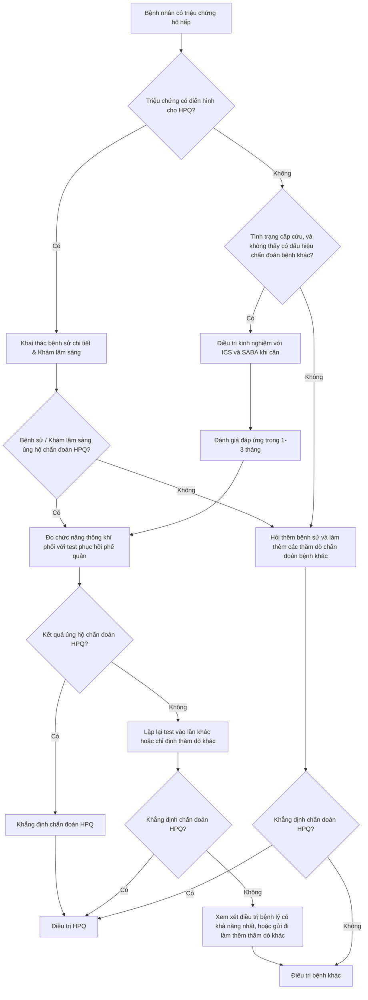

# BÁC SĨ HẠNG III (Y KHOA)

## 1. THÔNG TƯ SỐ 51/2017/TT-BYT NGÀY 29/12/2017 HƯỚNG DẪN PHÒNG, CHẨN ĐOÁN VÀ XỬ TRÍ PHẢN VỆ

Căn cứ Luật khám bệnh, chữa bệnh năm 2009;

Căn cứ Nghị định số 75/2017/NĐ-CP ngày 20 tháng 6 năm 2017 của Chính phủ quy định chức năng, nhiệm vụ, quyền hạn và cơ cấu tổ chức của Bộ Y tế;

Theo đề nghị của Cục trưởng Cục Quản lý Khám, chữa bệnh, Bộ trưởng Bộ Y tế ban hành Thông tư Hướng dẫn phòng, chẩn đoán và xử trí phản vệ.

### Điều 1. Phạm vi điều chỉnh và đối tượng áp dụng
- Thông tư này hướng dẫn về phòng, chẩn đoán và xử trí phản vệ.
- Thông tư này áp dụng đối với cơ sở khám bệnh, chữa bệnh, người hành nghề khám bệnh, chữa bệnh và cơ quan, tổ chức, cá nhân có liên quan.

### Điều 2. Giải thích từ ngữ
- **Phản vệ**: là một phản ứng dị ứng, có thể xuất hiện ngay lập tức từ vài giây, vài phút đến vài giờ sau khi cơ thể tiếp xúc với dị nguyên gây ra các bệnh cảnh lâm sàng khác nhau, có thể nghiêm trọng dẫn đến tử vong nhanh chóng.
- **Dị nguyên**: là yếu tố lạ khi tiếp xúc có khả năng gây phản ứng dị ứng cho cơ thể, bao gồm thức ăn, thuốc và các yếu tố khác.
- **Sốc phản vệ**: là mức độ nặng nhất của phản vệ do đột ngột giãn toàn bộ hệ thống mạch và co thắt phế quản có thể gây tử vong trong vòng một vài phút.

### Điều 3. Ban hành kèm theo Thông tư này các hướng dẫn phòng, chẩn đoán và xử trí phản vệ sau đây
- Hướng dẫn chẩn đoán phản vệ tại **Phụ lục I**.
- Hướng dẫn chẩn đoán mức độ phản vệ tại **Phụ lục II**.
- Hướng dẫn xử trí cấp cứu phản vệ tại **Phụ lục III**.
- Hướng dẫn xử trí phản vệ trong một số trường hợp đặc biệt tại **Phụ lục IV**.
- Hộp thuốc cấp cứu phản vệ và trang thiết bị y tế tại **Phụ lục V**.
- Hướng dẫn khai thác tiền sử dị ứng tại **Phụ lục VI**.
- Mẫu thẻ theo dõi dị ứng tại **Phụ lục VII**.
- Hướng dẫn chỉ định làm test da tại **Phụ lục VIII**.
- Quy trình kỹ thuật test da tại **Phụ lục IX**.
- Sơ đồ chẩn đoán và xử trí phản vệ tại **Phụ lục X**.

### Điều 4. Nguyên tắc dự phòng phản vệ
Cơ sở khám bệnh, chữa bệnh, bác sĩ, nhân viên y tế phải bảo đảm các nguyên tắc dự phòng phản vệ sau đây:
- Chỉ định đường dùng thuốc phù hợp nhất, chỉ tiêm khi không sử dụng được đường dùng khác.
- Không phải thử phản ứng cho tất cả thuốc trừ trường hợp có chỉ định của bác sĩ theo quy định tại Phụ lục VIII ban hành kèm theo Thông tư này.
- Không được kê đơn thuốc, chỉ định dùng thuốc hoặc dị nguyên đã biết rõ gây phản vệ cho người bệnh. Trường hợp không có thuốc thay thế phù hợp mà cần dùng thuốc hoặc dị nguyên đã gây phản vệ cho người bệnh phải hội chẩn chuyên khoa dị ứng - miễn dịch lâm sàng hoặc do bác sĩ đã được tập huấn về phòng, chẩn đoán và xử trí phản vệ để thống nhất chỉ định và phải được sự đồng ý bằng văn bản của người bệnh hoặc đại diện hợp pháp của người bệnh.
- Việc thử phản ứng trên người bệnh với thuốc hoặc dị nguyên đã từng gây dị ứng cho người bệnh phải được tiến hành tại chuyên khoa dị ứng - miễn dịch lâm sàng hoặc do các bác sĩ đã được tập huấn về phòng, chẩn đoán và xử trí phản vệ thực hiện.
- Tất cả trường hợp phản vệ phải được báo cáo về Trung tâm Quốc gia về Thông tin Thuốc và Theo dõi phản ứng có hại của thuốc hoặc Trung tâm Khu vực Thành phố Hồ Chí Minh về Thông tin Thuốc và Theo dõi phản ứng có hại của thuốc theo mẫu báo cáo phản ứng có hại của thuốc hiện hành theo quy định tại Phụ lục V ban hành kèm theo Thông tư 22/2011/TT-BYT ngày 10 tháng 6 năm 2011 của Bộ trưởng Bộ Y tế về quy định tổ chức và hoạt động của khoa Dược bệnh viện.
- Bác sĩ, người kê đơn thuốc hoặc nhân viên y tế khác có thẩm quyền phải khai thác kỹ tiền sử dị ứng thuốc, dị nguyên của người bệnh trước khi kê đơn thuốc hoặc chỉ định sử dụng thuốc theo quy định tại Phụ lục VI ban hành kèm theo Thông tư này.
- Tất cả thông tin liên quan đến dị ứng, dị nguyên phải được ghi vào sổ khám bệnh, bệnh án, giấy ra viện, giấy chuyển viện.
- Khi đã xác định được thuốc hoặc dị nguyên gây phản vệ, bác sĩ, nhân viên y tế phải cấp cho người bệnh thẻ theo dõi dị ứng ghi rõ tên thuốc hoặc dị nguyên gây dị ứng theo hướng dẫn tại Phụ lục VII ban hành kèm theo Thông tư này, giải thích kỹ và nhắc người bệnh cung cấp thông tin này cho bác sĩ, nhân viên y tế mỗi khi khám bệnh, chữa bệnh.

### Điều 5. Chuẩn bị, dự phòng cấp cứu phản vệ
- **Adrenalin** là thuốc thiết yếu, quan trọng hàng đầu, sẵn có để sử dụng cấp cứu phản vệ.
- Nơi có sử dụng thuốc, xe tiêm phải được trang bị và sẵn sàng hộp thuốc cấp cứu phản vệ. Thành phần hộp thuốc cấp cứu phản vệ theo quy định tại **mục I Phụ lục V** ban hành kèm theo Thông tư này.
- Cơ sở khám bệnh, chữa bệnh phải có hộp thuốc cấp cứu phản vệ và trang thiết bị y tế theo quy định tại **mục II Phụ lục V** ban hành kèm theo Thông tư này.
- Bác sĩ, nhân viên y tế phải nắm vững kiến thức và thực hành được cấp cứu phản vệ theo phác đồ.
- Trên các phương tiện giao thông công cộng (máy bay, tàu thủy, tàu hỏa), cần trang bị hộp thuốc cấp cứu phản vệ theo hướng dẫn tại **mục I Phụ lục V** ban hành kèm theo Thông tư này.

### Điều 6. Xử trí phản vệ
- **Adrenalin** là thuốc quan trọng hàng đầu để tiêm bắp ngay cho người bị phản vệ khi được chẩn đoán phản vệ từ độ II trở lên.
- Bác sĩ, y sỹ, điều dưỡng viên, hộ sinh viên, kỹ thuật viên phải xử trí cấp cứu phản vệ theo quy định tại **Phụ lục III, Phụ lục IV** ban hành kèm theo Thông tư này.
- Đối với người có tiền sử phản vệ có sẵn adrenalin mang theo người thì người bệnh hoặc người khác không phải là nhân viên y tế được phép sử dụng thuốc trong trường hợp khẩn cấp để tiêm bắp cấp cứu khi không có nhân viên y tế.

### Điều 7. Hiệu lực thi hành
- Thông tư này có hiệu lực từ ngày 15 tháng 02 năm 2018.
- Thông tư số 08/1999/TT-BYT ngày 4 tháng 5 năm 1999 của Bộ trưởng Bộ Y tế về hướng dẫn phòng và cấp cứu sốc phản vệ hết hiệu lực kể từ ngày Thông tư này có hiệu lực thi hành.

### Điều 8. Điều khoản tham chiếu
- Trong trường hợp các văn bản quy phạm pháp luật và các quy định được viện dẫn trong Thông tư này có sự thay đổi, bổ sung hoặc thay thế thì áp dụng theo văn bản quy phạm pháp luật, quy định mới.

### Điều 9. Trách nhiệm thi hành
Trách nhiệm của người đứng đầu, người phụ trách chuyên môn của cơ sở khám bệnh, chữa bệnh:
- Tổ chức thực hiện nghiêm Thông tư này tại cơ sở khám, chữa bệnh.
- Ban hành hướng dẫn, quy chế, quy trình cụ thể để áp dụng tại cơ sở khám bệnh, chữa bệnh trên cơ sở hướng dẫn của Thông tư này.
- Đào tạo, tập huấn, phổ biến Thông tư này cho người hành nghề, nhân viên y tế thuộc cơ sở khám, chữa bệnh quản lý.

- Cục trưởng Cục Quản lý Khám, chữa bệnh chịu trách nhiệm tổ chức triển khai, kiểm tra, đánh giá việc thực hiện Thông tư này.
- Chánh Văn phòng Bộ, Chánh Thanh tra Bộ, Tổng cục trưởng, Vụ trưởng, Cục trưởng thuộc Bộ Y tế, Giám đốc Sở Y tế các tỉnh, thành phố trực thuộc Trung ương, thủ trưởng Y tế Bộ, ngành, cơ quan tổ chức, cá nhân có liên quan chịu trách nhiệm thực hiện Thông tư này.
- Trong quá trình thực hiện, nếu có khó khăn, vướng mắc, đề nghị các đơn vị, địa phương phản ánh kịp thời về Cục Quản lý Khám, chữa bệnh, Bộ Y tế để được hướng dẫn, xem xét và giải quyết./.

---

# PHỤ LỤC I: HƯỚNG DẪN CHẨN ĐOÁN PHẢN VỆ
*(Ban hành kèm theo Thông tư số 51/2017/TT-BYT ngày 29 tháng 12 năm 2017 của Bộ trưởng Bộ Y tế)*

## I. Chẩn đoán phản vệ

### 1. Triệu chứng gợi ý
Nghĩ đến phản vệ khi xuất hiện ít nhất một trong các triệu chứng sau:
- Mày đay, phù mạch nhanh.
- Khó thở, tức ngực, thở rít.
- Đau bụng hoặc nôn.
- Tụt huyết áp hoặc ngất.
- Rối loạn ý thức.

### 2. Các bệnh cảnh lâm sàng

- **Bệnh cảnh lâm sàng 1**: Các triệu chứng xuất hiện trong vài giây đến vài giờ ở da, niêm mạc (mày đay, phù mạch, ngứa...) và có ít nhất 1 trong 2 triệu chứng sau:
  - Các triệu chứng hô hấp (khó thở, thở rít, ran rít).
  - Tụt huyết áp (HA) hay các hậu quả của tụt HA (rối loạn ý thức, đại tiện, tiểu tiện không tự chủ...).

- **Bệnh cảnh lâm sàng 2**: Ít nhất 2 trong 4 triệu chứng sau xuất hiện trong vài giây đến vài giờ sau khi người bệnh tiếp xúc với yếu tố nghi ngờ:
  - Biểu hiện ở da, niêm mạc: mày đay, phù mạch, ngứa.
  - Các triệu chứng hô hấp (khó thở, thở rít, ran rít).
  - Tụt huyết áp hoặc các hậu quả của tụt huyết áp (rối loạn ý thức, đại tiện, tiểu tiện không tự chủ...).
  - Các triệu chứng tiêu hóa (nôn, đau bụng...).

- **Bệnh cảnh lâm sàng 3**: Tụt huyết áp xuất hiện trong vài giây đến vài giờ sau khi tiếp xúc với yếu tố nghi ngờ mà người bệnh đã từng bị dị ứng:
  - **Trẻ em**: Giảm ít nhất 30% huyết áp tâm thu (HA tối đa) hoặc tụt huyết áp tâm thu so với tuổi (huyết áp tâm thu < 70 mmHg).
  - **Người lớn**: Huyết áp tâm thu < 90 mmHg hoặc giảm 30% giá trị huyết áp tâm thu nền.

### 3. Chẩn đoán phân biệt
- **Các trường hợp sốc**: Sốc tim, sốc giảm thể tích, sốc nhiễm khuẩn.
- **Tai biến mạch máu não**.
- **Các nguyên nhân đường hô hấp**: COPD, cơn hen phế quản, khó thở thanh quản (do dị vật, viêm).
- **Các bệnh lý ở da**: Mày đay, phù mạch.
- **Các bệnh lý nội tiết**: Cơn bão giáp trạng, hội chứng carcinoid, hạ đường máu.
- **Các ngộ độc**: Rượu, opiat, histamin.

---

# PHỤ LỤC II: HƯỚNG DẪN CHẨN ĐOÁN MỨC ĐỘ PHẢN VỆ
*(Ban hành kèm theo Thông tư số 51/2017/TT-BYT ngày 29 tháng 12 năm 2017 của Bộ trưởng Bộ Y tế)*

Phản vệ được phân thành 4 mức độ như sau (*lưu ý: mức độ phản vệ có thể nặng lên rất nhanh và không theo tuần tự*):

- **Nhẹ (độ I)**: Chỉ có các triệu chứng da, tổ chức dưới da và niêm mạc như mày đay, ngứa, phù mạch.
- **Nặng (độ II)**: Có từ 2 biểu hiện ở nhiều cơ quan:
  - Mày đay, phù mạch xuất hiện nhanh.
  - Khó thở nhanh nông, tức ngực, khàn tiếng, chảy nước mũi.
  - Đau bụng, nôn, ỉa chảy.
  - Huyết áp chưa tụt hoặc tăng, nhịp tim nhanh hoặc loạn nhịp.
- **Nguy kịch (độ III)**: Biểu hiện ở nhiều cơ quan với mức độ nặng hơn như sau:
  - **Đường thở**: Tiếng rít thanh quản, phù thanh quản.
  - **Thở**: Thở nhanh, khò khè, tím tái, rối loạn nhịp thở.
  - **Rối loạn ý thức**: Vật vã, hôn mê, co giật, rối loạn cơ tròn.
  - **Tuần hoàn**: Sốc, mạch nhanh nhỏ, tụt huyết áp.
- **Ngừng tuần hoàn (độ IV)**: Biểu hiện ngừng hô hấp, ngừng tuần hoàn.

---

# PHỤ LỤC III: HƯỚNG DẪN XỬ TRÍ CẤP CỨU PHẢN VỆ
*(Ban hành kèm theo Thông tư số 51/2017/TT-BYT ngày 29 tháng 12 năm 2017 của Bộ trưởng Bộ Y tế)*

## I. Nguyên tắc chung
- Tất cả trường hợp phản vệ phải được phát hiện sớm, xử trí khẩn cấp, kịp thời ngay tại chỗ và theo dõi liên tục ít nhất trong vòng 24 giờ.
- Bác sĩ, điều dưỡng, hộ sinh viên, kỹ thuật viên, nhân viên y tế khác phải xử trí ban đầu cấp cứu phản vệ.
- **Adrenalin** là thuốc thiết yếu, quan trọng hàng đầu cứu sống người bệnh bị phản vệ, phải được tiêm bắp ngay khi chẩn đoán phản vệ từ độ II trở lên.
- Ngoài hướng dẫn này, đối với một số trường hợp đặc biệt còn phải xử trí theo hướng dẫn tại **Phụ lục IV** ban hành kèm theo Thông tư này.

## II. Xử trí phản vệ nhẹ (độ I)
*(Dị ứng nhưng có thể chuyển thành nặng hoặc nguy kịch)*
- Sử dụng thuốc methylprednisolon hoặc diphenhydramin uống hoặc tiêm tùy tình trạng người bệnh.
- Tiếp tục theo dõi ít nhất 24 giờ để xử trí kịp thời.

## III. Phác đồ xử trí cấp cứu phản vệ mức nặng và nguy kịch (độ II, III)
Phản vệ độ II có thể nhanh chóng chuyển sang độ III, độ IV. Vì vậy, phải khẩn trương, xử trí đồng thời theo diễn biến bệnh:
1. Ngừng ngay tiếp xúc với thuốc hoặc dị nguyên (nếu có).
2. Tiêm hoặc truyền adrenalin (theo mục IV dưới đây).
3. Cho người bệnh nằm tại chỗ, đầu thấp, nghiêng trái nếu có nôn.
4. Thở oxy: người lớn 6–10 lít/phút, trẻ em 2–4 lít/phút qua mặt nạ hở.
5. Đánh giá tình trạng hô hấp, tuần hoàn, ý thức và các biểu hiện ở da, niêm mạc của người bệnh.
6. Ép tim ngoài lồng ngực và bóp bóng (nếu ngừng hô hấp, tuần hoàn).
7. Đặt nội khí quản hoặc mở khí quản cấp cứu (nếu khó thở thanh quản).
8. Thiết lập đường truyền adrenalin tĩnh mạch với dây truyền thông thường nhưng kim tiêm to (cỡ 14 hoặc 16G) hoặc đặt catheter tĩnh mạch và một đường truyền tĩnh mạch thứ hai để truyền dịch nhanh (theo mục IV dưới đây).
9. Hội ý với các đồng nghiệp, tập trung xử lý, báo cáo cấp trên, hội chẩn với bác sĩ chuyên khoa cấp cứu, hồi sức và/hoặc chuyên khoa dị ứng (nếu có).

## IV. Phác đồ sử dụng adrenalin và truyền dịch
**Mục tiêu**: Nâng và duy trì ổn định HA tối đa của người lớn lên ≥ 90 mmHg, trẻ em ≥ 70 mmHg và không còn các dấu hiệu về hô hấp như thở rít, khó thở; dấu hiệu về tiêu hóa như nôn mửa, ỉa chảy.

### 1. Thuốc adrenalin 1 mg = 1 ml = 1 ống, tiêm bắp:
- **Trẻ sơ sinh hoặc trẻ < 10 kg**: 0,2 ml (tương đương 1/5 ống).
- **Trẻ khoảng 10 kg**: 0,25 ml (tương đương 1/4 ống).
- **Trẻ khoảng 20 kg**: 0,3 ml (tương đương 1/3 ống).
- **Trẻ > 30 kg**: 0,5 ml (tương đương 1/2 ống).
- **Người lớn**: 0,5–1 ml (tương đương 1/2–1 ống).

### 2. Theo dõi và xử trí tiếp theo:
- Theo dõi huyết áp 3–5 phút/lần.
- Tiêm nhắc lại adrenalin liều như khoản 1 mục IV mỗi 3–5 phút/lần cho đến khi huyết áp và mạch ổn định.
- Nếu mạch không bắt được và huyết áp không đo được, các dấu hiệu hô hấp và tiêu hóa nặng lên sau 2–3 lần tiêm bắp như khoản 1 mục IV hoặc có nguy cơ ngừng tuần hoàn phải:
  - **Nếu chưa có đường truyền tĩnh mạch**: Tiêm tĩnh mạch chậm dung dịch adrenalin 1/10.000 (1 ống adrenalin 1 mg pha với 9 ml nước cất = pha loãng 1/10). Liều adrenalin tiêm tĩnh mạch chậm trong cấp cứu phản vệ chỉ bằng 1/10 liều adrenalin tiêm tĩnh mạch trong cấp cứu ngừng tuần hoàn.
    - **Liều dùng**:
      - *Người lớn*: 0,5–1 ml (dung dịch pha loãng 1/10.000 = 50–100 µg) tiêm trong 1–3 phút, sau 3 phút có thể tiêm tiếp lần 2 hoặc lần 3 nếu mạch và huyết áp chưa lên. Chuyển ngay sang truyền tĩnh mạch liên tục khi đã thiết lập được đường truyền.
      - *Trẻ em*: Không áp dụng tiêm tĩnh mạch chậm.
  - **Nếu đã có đường truyền tĩnh mạch**: Truyền tĩnh mạch liên tục adrenalin (pha adrenalin với dung dịch natri clorid 0,9%) cho người bệnh kém đáp ứng với adrenalin tiêm bắp và đã được truyền đủ dịch.
    - Bắt đầu bằng liều **0,1 µg/kg/phút**, cứ 3–5 phút điều chỉnh liều adrenalin tùy theo đáp ứng của người bệnh.
    - Đồng thời với việc dùng adrenalin truyền tĩnh mạch liên tục, truyền nhanh dung dịch natri clorid 0,9%: **1.000 ml - 2.000 ml** ở người lớn; **10 - 20 ml/kg** trong 10 - 20 phút ở trẻ em, có thể nhắc lại nếu cần thiết.
    - Khi đã có đường truyền tĩnh mạch adrenalin với liều duy trì huyết áp ổn định thì có thể theo dõi mạch và huyết áp 1 giờ/lần đến 24 giờ.

### Bảng tham khảo cách pha loãng adrenalin với dung dịch NaCl 0,9% và tốc độ truyền tĩnh mạch chậm
*(Pha 01 ống adrenalin 1 mg với 250 ml NaCl 0,9% -> 1 ml dung dịch pha loãng có 4 µg adrenalin)*

| Cân nặng người bệnh (kg) | Liều truyền tĩnh mạch adrenalin khởi đầu (0,1 µg/kg/phút) | Tốc độ (giọt/phút) với kim tiêm 1 ml = 20 giọt |
| :--- | :--- | :--- |
| Khoảng 80 | 2 ml | 40 giọt |
| Khoảng 70 | 1,75 ml | 35 giọt |
| Khoảng 60 | 1,50 ml | 30 giọt |
| Khoảng 50 | 1,25 ml | 25 giọt |
| Khoảng 40 | 1 ml | 20 giọt |
| Khoảng 30 | 0,75 ml | 15 giọt |
| Khoảng 20 | 0,5 ml | 10 giọt |
| Khoảng 10 | 0,25 ml | 5 giọt |

## V. Xử trí tiếp theo

### 1. Hỗ trợ hô hấp, tuần hoàn:
Tùy mức độ suy tuần hoàn, hô hấp có thể sử dụng một hoặc các biện pháp sau đây:
- **a) Thở oxy qua mặt nạ**: 6–10 lít/phút cho người lớn, 2–4 lít/phút ở trẻ em.
- **b) Bóp bóng AMBU** có oxy.
- **c) Đặt ống nội khí quản** thông khí nhân tạo có oxy nếu thở rít tăng lên không đáp ứng với adrenalin.
- **d) Mở khí quản** nếu có phù thanh môn - hạ họng không đặt được nội khí quản.
- **đ) Truyền tĩnh mạch chậm**: aminophyllin 1 mg/kg/giờ hoặc salbutamol 0,1 µg/kg/phút hoặc terbutalin 0,1 µg/kg/phút (tốt nhất là qua bơm tiêm điện hoặc máy truyền dịch).
- **e) Có thể thay thế aminophyllin** bằng salbutamol 5 mg khí dung qua mặt nạ hoặc xịt họng salbutamol 100 µg (người lớn: 2–4 nhát/lần, trẻ em: 2 nhát/lần, 4–6 lần trong ngày).

### 2. Nếu không nâng được huyết áp theo mục tiêu:
Sau khi đã truyền đủ dịch và adrenalin, có thể truyền thêm dung dịch keo (huyết tương, albumin hoặc bất kỳ dung dịch cao phân tử nào sẵn có).

### 3. Thuốc khác:
- **Methylprednisolon** 1–2 mg/kg ở người lớn, tối đa 50 mg ở trẻ em hoặc **hydrocortison** 200 mg ở người lớn, tối đa 100 mg ở trẻ em, tiêm tĩnh mạch (có thể tiêm bắp ở tuyến cơ sở).
- **Kháng histamin H1** như diphenhydramin tiêm bắp hoặc tĩnh mạch: người lớn 25–50 mg và trẻ em 10–25 mg.
- **Kháng histamin H2** như ranitidin: ở người lớn 50 mg, ở trẻ em 1 mg/kg pha trong 20 ml Dextrose 5% tiêm tĩnh mạch trong 5 phút.
- **Glucagon**: sử dụng trong các trường hợp tụt huyết áp và nhịp chậm không đáp ứng với adrenalin.
  - *Liều dùng*: người lớn 1–5 mg tiêm tĩnh mạch trong 5 phút, trẻ em 20–30 µg/kg, tối đa 1 mg, sau đó duy trì truyền tĩnh mạch 5–15 µg/phút tùy theo đáp ứng lâm sàng.
  - *Lưu ý*: Bảo đảm đường thở tốt vì glucagon thường gây nôn.
- **Phối hợp thuốc vận mạch khác**: Có thể phối hợp thêm các thuốc vận mạch khác: dopamin, dobutamin, noradrenalin truyền tĩnh mạch khi người bệnh có sốc nặng đã được truyền đủ dịch và adrenalin mà huyết áp không lên.

## VI. Theo dõi
1. **Trong giai đoạn cấp**: Theo dõi mạch, huyết áp, nhịp thở, SpO2 và tri giác 3–5 phút/lần cho đến khi ổn định.
2. **Trong giai đoạn ổn định**: Theo dõi mạch, huyết áp, nhịp thở, SpO2 và tri giác mỗi 1–2 giờ trong ít nhất 24 giờ tiếp theo.
3. Tất cả các người bệnh phản vệ cần được theo dõi ở cơ sở khám bệnh, chữa bệnh đến ít nhất 24 giờ sau khi huyết áp đã ổn định và đề phòng phản vệ pha 2.
4. **Ngừng cấp cứu**: Nếu sau khi cấp cứu ngừng tuần hoàn tích cực không kết quả.

---

# PHỤ LỤC IV: HƯỚNG DẪN XỬ TRÍ PHẢN VỆ TRONG MỘT SỐ TRƯỜNG HỢP ĐẶC BIỆT
*(Ban hành kèm theo Thông tư số 51/2017/TT-BYT ngày 29 tháng 12 năm 2017 của Bộ trưởng Bộ Y tế)*

## I. Phản vệ trên đối tượng sử dụng thuốc đặc biệt

### 1. Phản vệ trên người đang dùng thuốc chẹn thụ thể Beta:
- **Đặc điểm**: Đáp ứng của người bệnh này với adrenalin thường kém, làm tăng nguy cơ tử vong.
- **Điều trị**: Về cơ bản giống như phác đồ chung xử trí phản vệ, cần theo dõi sát huyết áp, truyền tĩnh mạch adrenalin và có thể truyền thêm các thuốc vận mạch khác.
- **Thuốc giãn phế quản**: Nếu thuốc cường beta-2 đáp ứng kém, nên dùng thêm kháng cholinergic: ipratropium (0,5 mg khí dung hoặc 2 nhát đường xịt).
- **Glucagon**: Xem xét dùng glucagon khi không có đáp ứng với adrenalin.

### 2. Phản vệ trong khi gây mê, gây tê phẫu thuật:
- **Đặc điểm**: Những trường hợp này thường khó chẩn đoán phản vệ vì người bệnh đã được gây mê, an thần, các biểu hiện ngoài da có thể không xuất hiện nên không đánh giá được các dấu hiệu chủ quan.
- **Đánh giá**: Cần đánh giá kỹ triệu chứng trong khi gây mê, gây tê phẫu thuật như huyết áp tụt, nồng độ oxy máu giảm, mạch nhanh, biến đổi trên monitor theo dõi, ran rít mới xuất hiện.
- **Tryptase**: Ngay khi nghi ngờ phản vệ, có thể lấy máu định lượng tryptase tại thời điểm chẩn đoán và mức tryptase nền của bệnh nhân.

Chú ý khai thác kỹ tiền sử dị ứng trước khi tiến hành gây mê, gây tê phẫu thuật để có biện pháp phòng tránh.

> [!NOTE]
> Một số thuốc gây tê là những hoạt chất ưa mỡ (lipophilic) có độc tính cao khi vào cơ thể gây nên một tình trạng ngộ độc nặng giống như phản vệ có thể tử vong trong vài phút, cần phải điều trị cấp cứu bằng thuốc kháng độc (nhũ dịch lipid) kết hợp với adrenalin vì không thể biết được ngay cơ chế phản ứng là nguyên nhân ngộ độc hay dị ứng.

đ) **Dùng thuốc kháng độc là nhũ dịch lipid tiêm tĩnh mạch** như Lipofundin 20%, Intralipid 20% tiêm nhanh tĩnh mạch, có tác dụng trung hòa độc chất do thuốc gây tê tan trong mỡ vào tuần hoàn. Liều lượng như sau:
- **Người lớn:** Tổng liều 10 ml/kg, trong đó bolus 100 ml, tiếp theo truyền tĩnh mạch 0,2 - 0,5 ml/kg/phút.
- **Trẻ em:** Tổng liều 10 ml/kg, trong đó bolus 2 ml/kg, tiếp theo truyền tĩnh mạch 0,2 - 0,5 ml/kg/phút.
- *Trường hợp nặng, nguy kịch có thể tiêm 2 lần bolus cách nhau vài phút.*

**Phản vệ với thuốc cản quang:**  
Phản vệ với thuốc cản quang xảy ra chủ yếu theo cơ chế không dị ứng. Khuyến cáo sử dụng thuốc cản quang có áp lực thẩm thấu thấp và không ion hóa (tỷ lệ phản vệ thấp hơn).

### Các trường hợp đặc biệt khác

#### 1. Phản vệ do gắng sức
Là dạng phản vệ xuất hiện sau hoạt động gắng sức.
- **Triệu chứng điển hình:** Người bệnh cảm thấy mệt mỏi, kiệt sức, nóng bừng, đỏ da, ngứa, mày đay, có thể phù mạch, khò khè, tắc nghẽn đường hô hấp trên, trụy mạch.
- **Yếu tố kích thích:** Một số bệnh nhân thường chỉ xuất hiện triệu chứng khi gắng sức có kèm thêm các yếu tố đồng kích thích khác như: thức ăn, thuốc chống viêm giảm đau không steroid, rượu, phấn hoa.
- **Xử trí:**
  - Người bệnh phải ngừng vận động ngay khi xuất hiện triệu chứng đầu tiên.
  - Người bệnh nên mang theo người hộp thuốc cấp cứu phản vệ hoặc bơm tiêm adrenalin định liều chuẩn (EpiPen, AnaPen...).
  - Điều trị theo Phụ lục III ban hành kèm theo Thông tư này.
  - Gửi khám chuyên khoa Dị ứng - Miễn dịch lâm sàng sàng lọc nguyên nhân.

#### 2. Phản vệ vô căn
Phản vệ vô căn được chẩn đoán khi xuất hiện các triệu chứng phản vệ mà không xác định được nguyên nhân.
- **Điều trị:** Theo Phụ lục III ban hành kèm theo Thông tư này.
- **Điều trị dự phòng:** Được chỉ định cho các bệnh nhân thường xuyên xuất hiện các đợt phản vệ (> 6 lần/năm hoặc > 2 lần/2 tháng). Điều trị dự phòng theo phác đồ:
  - Prednisolon 60 - 100 mg/ngày x 1 tuần, sau đó:
  - Prednisolon 60 mg/cách ngày x 3 tuần, sau đó:
  - Giảm dần liều Prednisolon trong vòng 2 tháng.
  - Kháng H1: Cetirizin 10 mg/ngày, Loratadin 10 mg/ngày...

---

# PHỤ LỤC V
### HỘP THUỐC CẤP CỨU PHẢN VỆ VÀ TRANG THIẾT BỊ Y TẾ
*(Ban hành kèm theo Thông tư số 51/2017/TT-BYT ngày 29 tháng 12 năm 2017 của Bộ trưởng Bộ Y tế)*

#### I. Thành phần hộp thuốc cấp cứu phản vệ:

| STT | Nội dung | Đơn vị | Số lượng |
| :---: | :--- | :---: | :---: |
| 1 | Phác đồ, sơ đồ xử trí cấp cứu phản vệ (Phụ lục III, Phụ lục X) | Bản | 01 |
| 2 | Bơm kim tiêm vô khuẩn: | | |
| | - Loại 10ml | Cái | 02 |
| | - Loại 5ml | Cái | 02 |
| | - Loại 1ml | Cái | 02 |
| | - Kim tiêm 14-16G | Cái | 02 |
| 3 | Bông tiệt trùng tẩm cồn | Gói/Hộp | 01 |
| 4 | Dây garo | Cái | 02 |
| 5 | Adrenalin 1mg/1ml | Ống | 05 |
| 6 | Methylprednisolone 40mg | Lọ | 02 |
| 7 | Diphenhydramin 10mg | Ống | 05 |
| 8 | Nước cất 10ml | Ống | 03 |

#### II. Trang thiết bị y tế và thuốc tối thiểu cấp cứu phản vệ tại cơ sở khám bệnh, chữa bệnh:
1. Oxy.
2. Bóng AMBU và mặt nạ người lớn và trẻ nhỏ.
3. Bơm xịt Salbutamol.
4. Bộ đặt nội khí quản và/hoặc bộ mở khí quản và/hoặc mask thanh quản.
5. Nhũ dịch Lipid 20% lọ 100ml (02 lọ) đặt trong tủ thuốc cấp cứu tại nơi sử dụng thuốc gây tê, gây mê.
6. Các thuốc chống dị ứng đường uống.
7. Dịch truyền: Natriclorid 0,9%./.

---

# PHỤ LỤC VI
### HƯỚNG DẪN KHAI THÁC TIỀN SỬ DỊ ỨNG
*(Ban hành kèm theo Thông tư số 51/2017/TT-BYT ngày 29 tháng 12 năm 2017 của Bộ trưởng Bộ Y tế)*

*Lưu ý khai thác thông tin trên thẻ dị ứng của người bệnh nếu có (xem mẫu thẻ theo quy định tại Phụ lục VII ban hành kèm theo Thông tư này).*

| STT | Nội dung | Có/Không | Tên thuốc, dị nguyên gây dị ứng | Biểu hiện lâm sàng - xử trí |
| :---: | :--- | :---: | :--- | :--- |
| 1 | Loại thuốc hoặc dị nguyên nào đã gây dị ứng? | | | |
| 2 | Dị ứng với loại côn trùng nào? | | | |
| 3 | Dị ứng với loại thực phẩm nào? | | | |
| 4 | Dị ứng với các tác nhân khác: phấn hoa, bụi nhà, hóa chất, mỹ phẩm...? | | | |
| 5 | Tiền sử cá nhân có bệnh dị ứng nào? (viêm mũi dị ứng, hen phế quản...) | | | |
| 6 | Tiền sử gia đình có bệnh dị ứng nào? (Bố mẹ, con, anh chị em ruột, có ai bị các bệnh dị ứng trên không). | | | |

---

# PHỤ LỤC VII
### MẪU THẺ THEO DÕI DỊ ỨNG
*(Ban hành kèm theo Thông tư số 51/2017/TT-BYT ngày 29 tháng 12 năm 2017 của Bộ trưởng Bộ Y tế)*

#### (Mặt trước)
**BỆNH VIỆN:** …………….  
**Khoa/Trung tâm:** …………….  

## THẺ DỊ ỨNG
**Họ tên:** …………….  
**Nam** [ ] / **Nữ** [ ] &nbsp;&nbsp;&nbsp;&nbsp; **Tuổi:** …………².  
**Số CMND hoặc thẻ căn cước hoặc số định danh công dân:** …………….  

| Dị nguyên/thuốc | Nghi ngờ | Chắc chắn | Biểu hiện lâm sàng |
| :--- | :---: | :---: | :--- |
| ……………. | [ ] | [ ] | ………………………… |
| ……………. | [ ] | [ ] | ………………………… |
| ……………. | [ ] | [ ] | ………………………… |
| ……………. | [ ] | [ ] | ………………………… |
| ……………. | [ ] | [ ] | ………………………… |

**Bác sĩ xác nhận chẩn đoán ký:**  
**ĐT:** ……………………………………  
**Họ và tên:** …………………………  
**Ngày cấp thẻ:** ……………………………  

#### (Mặt sau)
### Ba điều cần nhớ

1. **Các dấu hiệu nhận biết phản vệ:** Sau khi tiếp xúc với dị nguyên có một trong những triệu chứng sau đây:
   - **Miệng, họng:** Ngứa, phù môi, lưỡi, khó thở, khàn giọng.
   - **Da:** Ngứa, phát ban, đỏ da, phù nề.
   - **Tiêu hóa:** Nôn, tiêu chảy, đau bụng.
   - **Hô hấp:** Khó thở, tức ngực, thở rít, ho.
   - **Tim mạch:** Mạch yếu, choáng váng.
2. **Luôn mang Adrenalin theo người.**
3. **Khi có dấu hiệu phản vệ:**
   - *"Tiêm bắp Adrenalin ngay lập tức"*
   - *"Gọi 115 hoặc đến cơ sở khám, chữa bệnh gần nhất"*

---

# PHỤ LỤC VIII
### HƯỚNG DẪN CHỈ ĐỊNH LÀM TEST DA (Gồm test lẩy da và test nội bì)
*(Ban hành kèm theo Thông tư số 51/2017/TT-BYT ngày 29 tháng 12 năm 2017 của Bộ trưởng Bộ Y tế)*

1. Không thử phản ứng (test) cho tất cả các loại thuốc trừ những trường hợp có chỉ định theo quy định tại khoản 2 dưới đây.
2. Phải tiến hành test da trước khi sử dụng thuốc hoặc dị nguyên nếu người bệnh có tiền sử dị ứng với thuốc hoặc dị nguyên có liên quan (thuốc, dị nguyên cùng nhóm hoặc có phản ứng chéo) và nếu người bệnh có tiền sử phản vệ với nhiều dị nguyên khác nhau.
3. Khi thử test phải có sẵn các phương tiện cấp cứu phản vệ. Việc làm test da theo quy định tại Phụ lục IX ban hành kèm theo Thông tư này.
4. Nếu người bệnh có tiền sử dị ứng với thuốc hoặc dị nguyên và kết quả test da (lẩy da hoặc nội bì) dương tính thì không được sử dụng thuốc hoặc dị nguyên đó.
5. Nếu người bệnh có tiền sử dị ứng thuốc hoặc dị nguyên và kết quả test lẩy da âm tính với dị nguyên đó thì tiếp tục làm test nội bì.
6. Nếu người bệnh có tiền sử dị ứng thuốc và kết quả test lẩy da và nội bì âm tính với thuốc hoặc dị nguyên, trong trường hợp cấp cứu phải sử dụng thuốc (không có thuốc thay thế) cần cân nhắc làm test kích thích và/hoặc giải mẫn cảm nhanh với thuốc tại chuyên khoa dị ứng hoặc các bác sĩ đã được tập huấn về dị ứng-miễn dịch lâm sàng tại cơ sở y tế có khả năng cấp cứu phản vệ và phải được sự đồng ý của người bệnh hoặc đại diện hợp pháp của người bệnh bằng văn bản.
7. Sau khi tình trạng dị ứng ổn định được 4-6 tuần, khám lại chuyên khoa dị ứng-miễn dịch lâm sàng hoặc các chuyên khoa đã được đào tạo về dị ứng-miễn dịch lâm sàng cơ bản để làm test xác định nguyên nhân phản vệ./.

---

# PHỤ LỤC IX
### QUY TRÌNH KỸ THUẬT TEST DA
*(Ban hành kèm theo Thông tư số 51/2017/TT-BYT ngày 29 tháng 12 năm 2017 của Bộ trưởng Bộ Y tế)*

### TEST LẨY DA
1. Giải thích cho người bệnh hoặc đại diện hợp pháp của người bệnh và ký xác nhận vào mẫu phiếu đề nghị thử test.
2. Chuẩn bị phương tiện (kim lẩy da, bơm kim tiêm vô trùng, dung dịch histamin 1mg/ml, thước đo kết quả, hộp cấp cứu phản vệ, thuốc hoặc dị nguyên được chuẩn hóa).
3. Sát trùng vị trí thử test (những vị trí rộng rãi không có tổn thương da như mặt trước trong cẳng tay, lưng), đợi khô.
4. Nhỏ các giọt dung dịch cách nhau 3-5cm, đánh dấu tránh nhầm lẫn:
   - 1 giọt dung dịch natriclorid 0,9% (chứng âm).
   - 1 giọt dung dịch thuốc hoặc dị nguyên nghi ngờ.
   - 1 giọt dung dịch histamin 1mg/ml (chứng dương).
5. Kim lẩy da cắm vào giữa giọt dung dịch trên mặt da tạo một góc 45° rồi lẩy nhẹ (không chảy máu), nếu là loại kim nhựa 1 đầu có hãm, chỉ cần ấn thẳng kim qua giọt dung dịch vuông góc với mặt da, dùng giấy hoặc bông thấm giọt dung dịch sau khi thực hiện kỹ thuật.
6. Đọc kết quả sau 20 phút, kết quả dương tính khi xuất hiện sẩn ở vị trí dị nguyên lớn hơn 3mm hoặc trên 75% so với chứng âm.

### TEST NỘI BÌ
1. Giải thích cho bệnh nhân hoặc đại diện hợp pháp của bệnh nhân và ký xác nhận vào mẫu phiếu đề nghị thử test.
2. Chuẩn bị dụng cụ (dung dịch natriclorid 0,9%, bơm kim tiêm vô trùng loại 1ml, thước đo kết quả, hộp cấp cứu phản vệ, thuốc hoặc dị nguyên được chuẩn hóa).
3. Sát trùng vị trí thử test (những vị trí rộng rãi không có tổn thương da như mặt trước trong cẳng tay, lưng...), đợi khô.
4. Dùng bơm tiêm 1ml tiêm trong da các điểm cách nhau 3-5cm, mỗi điểm 0,02 - 0,05ml tạo một nốt phồng đường kính 3mm theo thứ tự:
   - Điểm 1: dung dịch natriclorid 0,9% (chứng âm).
   - Điểm 2: dung dịch thuốc hoặc dị nguyên đã chuẩn hóa.
5. Đọc kết quả sau 20 phút, kết quả dương tính khi xuất hiện sẩn ở vị trí dị nguyên ≥ 3mm hoặc trên 75% so với chứng âm./.

---

# PHỤ LỤC X
### SƠ ĐỒ CHẨN ĐOÁN VÀ XỬ TRÍ PHẢN VỆ
*(Ban hành kèm theo Thông tư số 51/2017/TT-BYT ngày 29 tháng 12 năm 2017 của Bộ trưởng Bộ Y tế)*

#### I. Sơ đồ chi tiết về chẩn đoán và xử trí phản vệ
*(Sơ đồ này được ban hành chi tiết dưới dạng sơ đồ hình vẽ đính kèm Thông tư)*

#### II. Sơ đồ tóm tắt về chẩn đoán và xử trí phản vệ

> [!NOTE]
> Sơ đồ chi tiết về chẩn đoán và xử trí phản vệ và Sơ đồ xử trí cấp cứu ban đầu phản vệ đề nghị in trên khổ giấy lớn A1 hoặc A2 và dán hoặc treo tại vị trí thích hợp các nơi sử dụng thuốc của cơ sở khám bệnh, chữa bệnh./.

---

# 2. QUYẾT ĐỊNH SỐ 4815/QĐ-BYT
### NGÀY 20/11/2020 VỀ VIỆC BAN HÀNH TÀI LIỆU CHUYÊN MÔN “HƯỚNG DẪN CHẨN ĐOÁN VÀ ĐIỀU TRỊ VIÊM PHỔI MẮC PHẢI CỘNG ĐỒNG Ở NGƯỜI LỚN”

## BỘ TRƯỞNG BỘ Y TẾ

- Căn cứ Luật Khám bệnh, chữa bệnh năm 2009;
- Căn cứ Nghị định số 75/2017/NĐ-CP ngày 20 tháng 6 năm 2017 của Chính phủ quy định chức năng, nhiệm vụ, quyền hạn và cơ cấu tổ chức của Bộ Y tế;
- Theo đề nghị của Cục trưởng Cục Quản lý khám, chữa bệnh,

### QUYẾT ĐỊNH:

- **Điều 1.** Ban hành kèm theo Quyết định này tài liệu chuyên môn “Hướng dẫn chẩn đoán và điều trị viêm phổi mắc phải cộng đồng ở người lớn”.
- **Điều 2.** Tài liệu chuyên môn “Hướng dẫn chẩn đoán và điều trị viêm phổi mắc phải cộng đồng ở người lớn” được áp dụng tại các cơ sở khám bệnh, chữa bệnh trong cả nước.
- **Điều 3.** Quyết định này có hiệu lực kể từ ngày ký, ban hành.
- **Điều 4.** Các ông, bà: Chánh Văn phòng Bộ, Chánh Thanh tra Bộ, Tổng Cục trưởng, Cục trưởng và Vụ trưởng các Tổng cục, Cục, Vụ thuộc Bộ Y tế, Giám đốc Sở Y tế các tỉnh, thành phố trực thuộc trung ương, Giám đốc các Bệnh viện trực thuộc Bộ Y tế, Thủ trưởng Y tế các ngành chịu trách nhiệm thi hành Quyết định này./.

| Nơi nhận: | KT. BỘ TRƯỞNG **THỨ TRƯỞNG** |
| :--- | :--- |
| - Như Điều 4; - Bộ trưởng (để báo cáo); - Các Thứ trưởng; - Cổng thông tin điện tử Bộ Y tế; Website Cục KCB; - Lưu: VT, KCB. | *(Đã ký)*  **Nguyễn Trường Sơn** |

---

# HƯỚNG DẪN CHẨN ĐOÁN VÀ ĐIỀU TRỊ VIÊM PHỔI MẮC PHẢI CỘNG ĐỒNG Ở NGƯỜI LỚN

## Chương 1: TỔNG QUAN VIÊM PHỔI MẮC PHẢI CỘNG ĐỒNG

### 1.1. Định nghĩa
**Viêm phổi mắc phải cộng đồng (VPMPCĐ)** là tình trạng nhiễm trùng của nhu mô phổi xảy ra ở cộng đồng, bên ngoài bệnh viện, bao gồm viêm phế nang, ống và túi phế nang, tiểu phế quản tận hoặc viêm tổ chức kẽ của phổi. Đặc điểm chung có hội chứng đông đặc phổi và bóng mờ đông đặc phế nang hoặc tổn thương mô kẽ trên phim X-quang phổi.

Bệnh thường do vi khuẩn, virus, nấm và một số tác nhân khác, nhưng không do trực khuẩn lao. Đây là bệnh lý thường gặp trong thực hành lâm sàng nội khoa, nhi khoa. Trong hướng dẫn này chúng tôi chỉ đề cập tới viêm phổi ở người lớn, còn viêm phổi ở trẻ em xin tham khảo ở các tài liệu khác.

### 1.2. Dịch tễ học VPMPCĐ
VPMPCĐ là một căn bệnh phổ biến ảnh hưởng đến khoảng 450 triệu người mỗi năm và xảy ra ở tất cả các nơi trên thế giới. Đây là một trong những nguyên nhân chính gây tử vong ở các nhóm tuổi gây 4 triệu ca tử vong (7% tổng số tử vong trên thế giới) hàng năm. Tỷ lệ tử vong cao nhất ở trẻ em dưới năm tuổi và người lớn > 75 tuổi. Theo WHO (2015) viêm phổi là căn nguyên gây tử vong đứng hàng thứ 3 sau đột quỵ và nhồi máu cơ tim.

Tỷ lệ mắc VPMPCĐ ở các nước đang phát triển cao hơn gấp 5 lần so với các nước phát triển. Ở Việt Nam, VPMPCĐ là một bệnh lý nhiễm khuẩn thường gặp nhất trong các bệnh nhiễm khuẩn trên thực hành lâm sàng, chiếm 12% các bệnh phổi. Tại khoa Hô Hấp bệnh viện Bạch Mai theo thống kê từ 1996 - 2000: viêm phổi chiếm 9,57%, đứng hàng thứ tư sau các bệnh: bệnh phổi tắc nghẽn mạn tính, lao, ung thư phổi [1]. Năm 2014, tỷ lệ mắc viêm phổi ở nước ta là 561/100.000 người dân, đứng hàng thứ hai sau tăng huyết áp, tỷ lệ tử vong do viêm phổi là 1,32/100.000 người dân, đứng hàng đầu trong các nguyên nhân gây tử vong [2].

### 1.3. Nguyên nhân và các yếu tố thuận lợi
Các nguyên nhân gây viêm phổi thường gặp là: *Streptococcus pneumoniae*, *Haemophilus influenzae*, *Staphylococcus aureus*, *Moraxella catarrhalis*, *Legionella pneumophila*, *Chlamydia pneumoniae*, *Mycoplasma pneumoniae*, trực khuẩn Gram âm (*Pseudomonas aeruginosae*, *E. coli*…) [3]. Các virus như virus cúm thông thường và một số virus mới xuất hiện như virus cúm gia cầm, SARS-CoV... cũng có thể gây nên viêm phổi nặng, lây lan nguy hiểm.

Bệnh thường xảy ra về mùa đông hoặc khi tiếp xúc với lạnh. Tuổi cao, nghiện rượu, suy giảm miễn dịch là các yếu tố nguy cơ viêm phổi.

Chấn thương sọ não, hôn mê, mắc các bệnh phải nằm điều trị lâu, nằm viện trước đó, có dùng kháng sinh trước đó, giãn phế quản là các yếu tố nguy cơ viêm phổi do các vi khuẩn Gram âm và *Pseudomonas aeruginosae* (*P. aeruginosae*). Động kinh, suy giảm miễn dịch, suy tim, hút thuốc lá, nghiện rượu, bệnh phổi tắc nghẽn mạn tính, cắt lách, bệnh hồng cầu hình liềm là các yếu tố nguy cơ viêm phổi do *S. pneumoniae*. Các trường hợp biến dạng lồng ngực, gù, vẹo cột sống; bệnh tai mũi họng như viêm xoang, viêm amidan; tình trạng vệ sinh răng miệng kém, viêm lợi dễ bị nhiễm các vi khuẩn yếm khí.

Viêm phổi do các virus (nhất là virus cúm) chiếm khoảng 10% các bệnh nhân (BN). Các BN viêm phổi virus nặng thường bị bội nhiễm vi khuẩn.

### 1.4. Cơ chế bệnh sinh

#### 1.4.1. Quá trình lây nhiễm
Do sự xâm nhập và phát triển quá mức của vi sinh vật gây bệnh trong nhu mô phổi, kết hợp với sự phá vỡ các cơ chế bảo vệ tại chỗ gây viêm và sản xuất dịch tiết trong phế nang, đưa ra khái niệm cơ bản về viêm phổi “đông đặc phế nang”. Viêm phổi chủ yếu xảy ra ở một thùy phổi. Có thể gây tổn thương nhiều thùy khi vi khuẩn theo dịch viêm lan đến thùy phổi khác theo đường phế quản. Viêm có thể lan trực tiếp đến màng phổi, màng tim gây mủ màng phổi, màng ngoài tim. Mức độ nặng của viêm phổi phụ thuộc vào mầm bệnh và các yếu tố liên quan đến cơ địa người bệnh.

#### 1.4.2. Đường lây nhiễm
Các tác nhân gây viêm phổi có thể xâm nhập vào phổi theo những đường vào sau đây:
- **Đường hô hấp:** Hít phải vi khuẩn ở môi trường bên ngoài. Hít phải vi khuẩn từ ổ nhiễm khuẩn của đường hô hấp trên.
- **Đường máu:** Thường gặp sau nhiễm khuẩn huyết do *Staphylococcus aureus* (*S. aureus*), viêm nội tâm mạc nhiễm khuẩn, viêm tĩnh mạch nhiễm khuẩn v.v...
- **Nhiễm khuẩn theo đường kế cận phổi (hiếm gặp):** Màng ngoài tim, trung thất…
- **Đường bạch huyết:** Một số vi khuẩn (*Pseudomonas aeruginosae* / *P. aeruginosae*, *Klebsiella pneumoniae*, *S. aureus*) có thể tới phổi theo đường bạch huyết, chúng thường gây viêm phổi hoại tử và áp xe phổi, với nhiều ổ nhỏ đường kính dưới 2cm.

### 1.5. Giải phẫu bệnh
Mô bệnh học trong viêm phổi được nghiên cứu rộng rãi dưới 2 thể chính: viêm phế quản phổi/viêm phổi phân thùy hoặc viêm phổi thùy.

#### 1.5.1. Viêm phổi thùy
Tổn thương có thể là một phân thùy, một thùy hay nhiều thùy hoặc có khi cả hai bên phổi, thường gặp nhất là thùy dưới phổi phải. Theo sự mô tả của Laennec thì có các giai đoạn:
- **Giai đoạn sung huyết:** Vùng phổi tổn thương bị sung huyết nặng, các mao mạch giãn ra, hồng cầu, bạch cầu và fibrin thoát vào trong lòng phế nang, trong dịch này có chứa nhiều vi khuẩn.
- **Giai đoạn gan hóa đỏ:** Trong một đến 3 ngày tổ chức phổi bị tổn thương có màu đỏ sẫm và chắc như gan, trong tổ chức này có thể có xuất huyết.
- **Giai đoạn gan hóa xám:** Tổn thương phổi có màu nâu xám chứa hồng cầu, bạch cầu, vi khuẩn và tổ chức hoại tử.
- **Giai đoạn lui bệnh:** Trong lòng phế nang còn ít dịch loãng, có ít bạch cầu.

#### 1.5.2. Viêm phế quản phổi
Các tổn thương rải rác cả hai phổi, vùng thương tổn xen lẫn với vùng phổi lành, các tiểu phế quản tổn thương nặng nề hơn, các vùng tổn thương không đều nhau và khi khỏi có thể để lại xơ. Đôi khi, các thể viêm phổi nặng có thể dẫn đến sự hình thành áp xe phổi, phá vỡ hoàn toàn các mô và hình thành các túi chứa mủ ở các vùng trọng tâm của phổi. Ngoài ra, nhiễm trùng có thể lan đến màng phổi tích tụ chất tiết fibrin và mủ lấp đầy khoang màng phổi.

#### Những điểm cần nhớ:
- **Viêm phổi mắc phải cộng đồng** là tình trạng nhiễm trùng của nhu mô phổi xảy ra trong cộng đồng bên ngoài bệnh viện. Đặc điểm chung là có hội chứng đông đặc phổi và đông đặc phế nang hoặc tổn thương mô kẽ trên phim X-quang phổi.
- **Căn nguyên gây bệnh** thường do vi khuẩn (*Streptococcus pneumoniae*, *Haemophilus influenzae*, *Staphylococcus aureus*, *Moraxella catarrhalis*, *Legionella pneumophila*, *Chlamydia pneumoniae*, *Mycoplasma pneumoniae*, trực khuẩn Gram âm (*P. aeruginosae*, *E. coli*…)), virus và một số tác nhân khác, nhưng không do trực khuẩn lao.
- **Các yếu tố nguy cơ:** Tuổi cao, suy giảm miễn dịch, nghiện rượu bia, hút thuốc, bệnh phổi tắc nghẽn mạn tính…
- **Tác nhân gây viêm phổi** qua các đường: Hô hấp, máu, bạch huyết, kế cận phổi.
- **Viêm phổi thùy** có thể ở một phân thùy, một thùy hay nhiều thùy, trải qua các giai đoạn sung huyết, gan hóa đỏ, gan hóa xám và lui bệnh.
- **Viêm phế quan phổi** (Viêm phế quản phổi) tổn thương rải rác hai phổi xen kẽ với vùng phổi lành, không đều nhau và có thể để lại xơ.

## Chương 2: CĂN NGUYÊN GÂY BỆNH VÀ CÁC PHƯƠNG PHÁP VI SINH CHẨN ĐOÁN

## 2.1. Tổng quan về căn nguyên gây viêm phổi mắc phải cộng đồng

Các căn nguyên vi khuẩn gây **VPMPCĐ** thường gặp bao gồm: *Streptococcus pneumoniae*, *Haemophilus influenzae*, *Staphylococcus aureus*, *Mycoplasma pneumoniae*, *Streptococcus pyogenes*, *Legionella* spp., *Chlamydophila* và *Moraxella catarrhalis*. Influenza A virus, Influenza B virus, RSV, Adenovirus và các Coronavirus thường là căn nguyên virus hàng đầu gây **VPMPCĐ** [4].

Do các dữ liệu về căn nguyên gây **VPMPCĐ** trước kia chủ yếu dựa vào nuôi cấy kinh điển có hoặc không kết hợp với phương pháp huyết thanh học nên còn những điểm hạn chế. Các nghiên cứu trong hơn một thập kỷ qua ứng dụng nhiều tiến bộ của kỹ thuật sinh học phân tử với độ nhạy, độ đặc hiệu cao cho chẩn đoán cùng với việc sử dụng vaccine phòng *S. pneumoniae* rộng rãi đã làm thay đổi sự hiểu biết về các căn nguyên gây **VPMPCĐ** [5, 6].

## 2.2. Đặc điểm của các căn nguyên gây VPMPCĐ

### 2.2.1. Căn nguyên vi khuẩn

Nhiều nghiên cứu về các bệnh nhân **VPMPCĐ** cho thấy hầu hết căn nguyên phát hiện được là vi khuẩn.

- ***S. pneumoniae*:** Chiếm 75% trong số các tác nhân gây **VPMPCĐ** ở thời kỳ tiền kháng sinh [3, 7]. Gần đây chỉ còn chiếm khoảng 5-15% căn nguyên phát hiện được ở Mỹ [8, 9], nhưng có thể cao hơn ở một số nước khác [10]. Thực tế, tỷ lệ **VPMPCĐ** do *S. pneumoniae* được cho là cao hơn các số liệu có từ nghiên cứu vì người ta cho rằng có nhiều ca **VPMPCĐ** do *S. pneumoniae* có kết quả nuôi cấy âm tính. Lý do mà *S. pneumoniae* vẫn được cho là tác nhân gây **VPMPCĐ** thường gặp vì ở những bệnh nhân **VPMPCĐ** có cấy máu dương tính thì đến 58-81% phân lập được *S. pneumoniae* [11, 12]. Theo ước tính trong nghiên cứu phân tích gộp thì cứ mỗi ca viêm phổi có nhiễm trùng huyết do *S. pneumoniae* sẽ có ít nhất thêm ba ca viêm phổi do *S. pneumoniae* mà không kèm theo có nhiễm trùng huyết [13].
- ***H. influenzae*:** Là một tác nhân quan trọng gây viêm phổi ở người già và ở những bệnh nhân có bệnh lý nền ở phổi như bệnh lý xơ nang phổi, bệnh phổi tắc nghẽn mạn tính.
- ***M. pneumoniae*:** Là căn nguyên gây viêm phổi không điển hình phổ biến nhất, chiếm khoảng 15% các ca viêm phổi được điều trị tại các cơ sở cấp cứu nhưng chẩn đoán chủ yếu dựa trên phương pháp huyết thanh học. Tuy nhiên, các nghiên cứu về huyết thanh học có thể ước tính tỷ lệ mắc cao hơn so với thực tế. Tỷ lệ nhiễm *M. pneumoniae* cao nhất ở trẻ em lứa tuổi đến trường, ở nhóm tân binh và sinh viên [14].
- ***C. pneumoniae*:** Tỷ lệ **VPMPCĐ** do *C. pneumoniae* khác nhau ở các nghiên cứu khác nhau, từ 0-20% [15-17]. Phương pháp chẩn đoán huyết thanh học không phân biệt được tình trạng đã nhiễm hay đang nhiễm *C. pneumoniae*. Các nghiên cứu gần đây sử dụng kỹ thuật sinh học phân tử phát hiện được *C. pneumoniae* dưới 1% các ca **VPMPCĐ** [8, 10]. Không như các nhiễm trùng hô hấp khác có đỉnh mắc vào các tháng mùa đông, nhiễm trùng *C. pneumoniae* không khác biệt theo mùa.
- ***Legionella*:** Chiếm khoảng 1-10% các căn nguyên gây **VPMPCĐ**. Nhiễm trùng *Legionella* thường xảy ra do tiếp xúc với các dụng cụ chứa các giọt nhỏ mang vi khuẩn như vòi hoa sen, máy phun sương, tháp giải nhiệt của hệ thống điều hòa, vùng xoáy nước, vòi phun [18].
- **Trực khuẩn Gram âm:** Đặc biệt là *K. pneumoniae*, *E. coli*, *Enterobacter* spp., *Serratia* spp., *Proteus* spp., *P. aeruginosae* và *Acinetobacter* spp. là các căn nguyên gây **VPMPCĐ** hiếm gặp ngoại trừ ở nhóm bệnh nhân viêm phổi nặng cần nhập viện điều trị tại khoa Điều trị tích cực (ICU). *K. pneumoniae* chiếm khoảng 6% căn nguyên **VPMPCĐ** tại các nước châu Á nhưng hiếm gặp hơn ở các khu vực khác [19]. Chỉ nên nghĩ đến căn nguyên *K. pneumoniae* ở bệnh nhân **VPMPCĐ** có kèm các bệnh lý nền như COPD, đái tháo đường và nghiện rượu [20]. Yếu tố nguy cơ **VPMPCĐ** do *P. aeruginosae* bao gồm tình trạng giãn phế quản và sử dụng kháng sinh nhiều lần hoặc sử dụng glucocorticoids kéo dài ở những bệnh nhân có cấu trúc phổi bất thường khác như COPD, xơ phổi, tình trạng suy giảm miễn dịch như giảm bạch cầu, nhiễm trùng HIV, ghép tạng và cấy ghép tế bào gốc [9, 21].
- ***M. catarrhalis*:** Gây viêm đường hô hấp dưới ở những bệnh nhân người lớn có COPD và ở những bệnh nhân suy giảm miễn dịch. Nhiều bệnh nhân nhiễm *M. catarrhalis* bị suy dinh dưỡng. *M. catarrhalis* thường gặp là đồng tác nhân gây viêm phổi [22].
- ***S. aureus*:** Chiếm khoảng 3% trong số các căn nguyên gây **VPMPCĐ** ở bệnh nhân nội trú với tỷ lệ mắc khác nhau ở các quốc gia và các lục địa khác nhau [23]. Trong đó, MRSA chiếm đến 51%. **VPMPCĐ** do *S. aureus* thường gặp ở người già, những bệnh nhân sau nhiễm cúm và thường có biểu hiện viêm phổi hoại tử nặng. Một số nghiên cứu cho thấy xu hướng dẫn đến viêm phổi hoại tử do *S. aureus* có thể liên quan đến độc tố PVL (*Panton-Valentine leucocidin*) là một độc tố gây phá hủy tế bào bạch cầu và hoại tử mô. Sự có mặt của gen mã hóa cho độc tố PVL là một đặc điểm đặc trưng của các chủng MRSA mắc phải tại cộng đồng [24, 25].
- **Các vi khuẩn khác:**
  - ***S. pyogenes*:** Có thể gây viêm phổi kịch phát hóa mủ sớm ở bệnh nhân trẻ, miễn dịch bình thường [26].
  - **Vi khuẩn kị khí:** Gây viêm phổi có thể do hít phải và thường liên quan đến các nhiễm trùng hoại tử đa căn nguyên. Nên nghĩ đến các căn nguyên kị khí khi thấy đờm có mùi thối hoặc dịch mủ thối, nhiễm trùng có liên quan đến hít phải hoặc nhiễm trùng hoại tử. Hầu hết các nhiễm trùng đều do đa căn nguyên, trong đó chủ yếu là các vi khuẩn kị khí như *Bacteroides melanigenicus*, *Fusobacterium* spp., *Peptostreptococcus* spp. và/hoặc *Streptococcus* ở miệng (*Streptococcus milleri*) [27].
  - ***Neisseria meningitidis*:** Là căn nguyên gây **VPMPCĐ** không phổ biến. Viêm phổi do *N. meningitidis* không có đặc điểm lâm sàng khác biệt nhưng cần báo cáo và được dự phòng nhiễm trùng huyết hoặc viêm màng não.
  - ***Burkholderia pseudomallei*:** Là một căn nguyên **VPMPCĐ** quan trọng ở các nước thuộc vùng dịch tễ như Đông Nam Á và Bắc Úc. Vi khuẩn có mặt phổ biến trong đất và nước bề mặt ở các vùng dịch tễ lưu hành cho nên các nước trong khu vực dịch tễ cần đặc biệt lưu ý đến căn nguyên *B. pseudomallei* [28].

### 2.2.2. Căn nguyên virus

Tỷ lệ các căn nguyên virus được báo cáo ở các nghiên cứu khác nhau rất khác nhau, phụ thuộc vào kỹ thuật chẩn đoán được sử dụng. Các nghiên cứu sử dụng kỹ thuật PCR, đặc biệt là multiplex PCR, có thể đưa ra tỷ lệ virus gây **VPMPCĐ** cao hơn so với thực tế vì các virus hô hấp có thể có mặt ở đường hô hấp trên nhưng không gây bệnh. Tăm bông ngoáy dịch tỵ hầu của người khỏe mạnh cho kết quả 20-30% dương tính với các virus đường hô hấp khi sử dụng kỹ thuật PCR [29].

*Influenza virus*, RSV, *Parainfluenza virus* và *Adenovirus* vẫn là các căn nguyên virus phổ biến nhất gây **VPMPCĐ** ở người lớn. Các virus khác có thể gặp như *Rhinovirus*, *Coronavirus* và *Metapneumovirus* người (hMPV). Nghiên cứu sử dụng kỹ thuật multiplex PCR phát hiện thấy 30/32 bệnh nhân có *Rhinovirus* hoặc *Coronavirus* cùng với tác nhân khác đồng thời cũng được phát hiện. Hai loại virus này có thể không phải là tác nhân gây viêm phổi nhưng nó gây tổn thương hàng rào bảo vệ của đường hô hấp trên nên các tác nhân khác có điều kiện để xâm nhập và gây bệnh cho đường hô hấp dưới [30].

Tuy nhiên, một số nghiên cứu khác lại cho rằng *Rhinovirus* thực sự là căn nguyên gây **VPMPCĐ** ở người lớn vì tỷ lệ phát hiện được virus này ở nhóm bệnh nhân **VPMPCĐ** cao hơn có ý nghĩa thống kê so với nhóm không triệu chứng [31]. Mặc dù các virus hô hấp được tìm thấy phổ biến ở trong dịch tỵ hầu của bệnh nhân **VPMPCĐ** nhưng vai trò gây bệnh riêng thực sự của virus cũng chưa thực sự rõ ràng. Sự có mặt của các virus này có thể tạo cơ hội cho các nhiễm trùng do căn nguyên khác, cũng có thể là căn nguyên gây viêm đường hô hấp dưới hoặc chỉ là sự cư trú. **VPMPCĐ** do virus có đồng nhiễm vi khuẩn chiếm khoảng 20-40% và thường nặng hơn, phải nằm viện lâu hơn những ca bệnh chỉ do vi khuẩn [32, 33].

- **Influenza A virus và Influenza B virus:** Có thể gây viêm phổi cấp tính và gây dịch trên toàn thế giới, chủ yếu trong mùa đông. Các virus cúm gia cầm như H5N1 và H7N9 Avian Influenza là các tác nhân mới nổi gây bệnh cho người. Các virus cúm thường gây nhiễm trùng đường hô hấp trên nhưng có thể gây viêm phổi tiên phát và có thể đưa đến viêm phổi thứ phát do vi khuẩn. Viêm phổi tiên phát do virus cúm do virus trực tiếp gây nhiễm trùng tại phổi và bệnh cảnh lâm sàng rất nặng, thường gặp ở nhóm bệnh nhân có các bệnh lý nền mạn tính (hen, COPD, tim bẩm sinh, bệnh lý mạch vành, đái tháo đường…). Các bệnh nhân nhiễm trùng virus cúm nặng thường bội nhiễm vi khuẩn, hay gặp nhất là viêm phổi do *S. pneumoniae*, *S. aureus* và *S. pyogenes*.
- **Parainfluenza virus:** Là tác nhân quan trọng ở bệnh nhân suy giảm miễn dịch, có thể gây ra các nhiễm trùng đường hô hấp dưới nguy hiểm, đe dọa đến tính mạng.
- **RSV:** Có thể gây ra các bệnh lý đường hô hấp cấp tính mọi lứa tuổi nhưng đặc biệt gây **VPMPCĐ** nặng ở người già và những người suy giảm miễn dịch (người cấy ghép tủy...).
- **hMPV:** Có thể gây nhiễm trùng hô hấp trên và hô hấp dưới ở mọi lứa tuổi nhưng biểu hiện triệu chứng lâm sàng thường gặp ở trẻ em hoặc người già. Đây là một căn nguyên mới nổi gây **VPMPCĐ** ở người lớn.
- **MERS-CoV:** Là một *Coronavirus* mới nổi gây nhiễm trùng hô hấp nặng ở Saudi Arabia năm 2012. Hầu hết các ca nhiễm MERS-CoV có đặc tính lây truyền trực tiếp từ người sang người rất hạn chế nhưng cũng có hiện tượng siêu lây truyền được ghi nhận trong vụ dịch MERS ở Hàn Quốc năm 2015.
- **SARS-CoV-2:** Tháng 12 năm 2019, *Coronavirus* mới có tên gọi SARS-CoV-2 lần đầu tiên xuất hiện tại Vũ Hán, Trung Quốc. Với khả năng lây nhiễm cao, thời gian ủ bệnh kéo dài, SARS-CoV-2 đã gây đại dịch trên toàn thế giới, gây ảnh hưởng nặng nề về y tế và kinh tế của các quốc gia trên toàn thế giới [34]. (Tham khảo chi tiết tại *"Hướng dẫn chẩn đoán và điều trị viêm đường hô hấp cấp do SARS-CoV-2 (COVID-19)"* của Bộ Y tế).
- **Rhinovirus:** Là một trong số các tác nhân phổ biến gây nhiễm trùng hô hấp (35-50%). Ngày càng có nhiều bằng chứng nghiên cứu cho thấy vai trò gây **VPMPCĐ** của virus này [31, 35].
- **Các virus khác:** Cũng có thể gặp như các *Coronavirus* khác (HCoV), *Hantavirus*, *Varicella-zoster virus*.

### 2.2.3. Căn nguyên nấm

Nấm rất hiếm khi gây **VPMPCĐ** ở những người có hệ miễn dịch bình thường, nhưng có một số loài nấm như (*Histoplasma capsulatum*, *Coccidioides* spp., *Blastomyces dermatitidis*) có thể gây viêm phổi cho cả bệnh nhân suy giảm miễn dịch và cả người có hệ miễn dịch bình thường sống hoặc đến các khu vực dịch tễ của các loài nấm đó [36]. (Tham khảo tài liệu *"Hướng dẫn chẩn đoán nhiễm nấm xâm lấn"*).

### 2.2.4. Tình hình kháng thuốc của một số vi khuẩn gây VPMPCĐ

Trong các tác nhân gây **VPMPCĐ**, có khoảng 6% là các vi khuẩn đa kháng thuốc. Vi khuẩn đa kháng thuốc thường gặp nhất là *S. aureus* và *P. aeruginosae*. Nghiên cứu gần đây của châu Âu cho thấy có đến 3,3–7,6% căn nguyên đa kháng phân lập được từ các ca **VPMPCĐ**, trong đó phổ biến nhất là MRSA. Vì khuyến cáo hiện nay điều trị **VPMPCĐ** theo kinh nghiệm là sử dụng β-lactam cùng nhóm thuốc macrolide hoặc quinolone, nhưng với MRSA thì không phù hợp nên các chẩn đoán vi sinh về căn nguyên gây bệnh là rất quan trọng cho việc chọn lựa kháng sinh phù hợp [37].

*P. aeruginosae* không phải căn nguyên gây **VPMPCĐ** thường gặp nhưng ở những bệnh nhân **VPMPCĐ** phải điều trị tại các khoa hồi sức tích cực thì *P. aeruginosae* chiếm 1,8–8,3% và tỷ lệ gây tử vong là 50–100%. Sử dụng kháng sinh từ trước được cho là yếu tố nguy cơ đưa đến **VPMPCĐ** do *P. aeruginosae* đa kháng thuốc [38].

Khi vắc-xin phòng *S. pneumoniae* được đưa vào sử dụng dẫn đến sự lưu hành của các serotype thay đổi. Các serotype có vắc-xin dự phòng giảm đi nhưng các serotype trước kia hiếm gặp lại trở nên phổ biến. Cùng với sự thay đổi này là sự gia tăng đề kháng của *S. pneumoniae* với một số nhóm kháng sinh như cephalosporin, macrolide và fluoroquinolone trên toàn thế giới trong hai thập kỷ gần đây [6].

Tỷ lệ kháng macrolide khoảng 20–40% nhưng sự đề kháng này ít gây ảnh hưởng đến kết quả điều trị vì macrolide đơn trị liệu thường không được khuyến cáo [5]. Tỷ lệ *S. pneumoniae* đề kháng fluoroquinolone được báo cáo ở châu Âu (5,2%) cao hơn ở Mỹ (1,2%) và ở châu Á (2,4%). Đề kháng fluoroquinolone hiếm gặp ở các chủng gây bệnh cho trẻ em nhưng cao hơn ở người lớn, đặc biệt cao ở người già trên 64 tuổi có kèm các bệnh lý phổi tắc nghẽn [6].

Trong nghiên cứu đa trung tâm SOAR cho thấy *S. pneumoniae* còn nhạy cảm cao (>70%) với penicillin tiêm [39-42]. Hiện nay, 20-30% các chủng *S. pneumoniae* đa kháng thuốc, đặc biệt tăng nhanh ở các serotype không có vắc-xin. Trong số các serotype đa kháng, hay gặp nhất là serotype 19A và mới nổi lên một số serotype khác nữa là 6B, 6C, 14, 15B/C, 19F và 23A [43, 44].

### 2.2.5. Căn nguyên gây VPMPCĐ ở Việt Nam

Nghiên cứu tại Bệnh viện Khánh Hòa trên 154 bệnh nhân **VPMPCĐ** phải nhập viện bằng phương pháp nuôi cấy cho thấy các căn nguyên vi khuẩn thường gặp nhất là *H. influenzae*, *S. pneumoniae*, *M. catarrhalis*, *P. aeruginosae*, *S. aureus* và *K. pneumoniae*. Bằng phương pháp PCR cho kết quả không như nuôi cấy, trong đó chủ yếu phát hiện được *H. influenzae* và *S. pneumoniae*. Các căn nguyên virus phát hiện được bao gồm Influenza A virus, Influenza B virus, *Rhinovirus*, *Adenovirus* và RSV [45].

Nghiên cứu tiến hành ở 142 bệnh nhân **VPMPCĐ** được điều trị tại Bệnh viện Nhiệt đới Trung ương, Bệnh viện Đa khoa Đống Đa và Bệnh viện Đức Giang lại thấy *M. pneumoniae* (16,2%), *K. pneumoniae* (14,8%), *C. pneumoniae* (10,6%) và *S. pneumoniae* (9,9%) là các căn nguyên chiếm tỷ lệ cao nhất [46].

Một nghiên cứu đa trung tâm thu thập từ 11 bệnh viện lớn trên phạm vi toàn quốc tiến hành thu thập 289 chủng *S. pneumoniae* và 195 chủng *H. influenzae* trong vòng 3 năm từ 2009-2011, trong đó khoảng 60% chủng được thu thập từ bệnh nhân nhi. Các chủng *S. pneumoniae* còn nhạy cảm cao với penicillin tiêm (86,9%) nhưng đã đề kháng cao với nhóm macrolide (>90%) và trên 95% các chủng *H. influenzae* còn nhạy cảm với amoxicillin/clavulanic acid khi sử dụng tiêu chuẩn phiên giải CLSI của Mỹ; nhưng nếu sử dụng tiêu chuẩn phiên giải EUCAST của châu Âu thì tỷ lệ nhạy cảm với kháng sinh tương ứng của các chủng vi khuẩn này thấp hơn [42].

Các nghiên cứu được thực hiện chủ yếu dựa trên bằng chứng nuôi cấy nên chỉ phát hiện được các tác nhân có thể nuôi cấy được. Có một nghiên cứu gần đây sử dụng kỹ thuật nuôi cấy và real-time PCR phát hiện tác nhân gây **VPMPCĐ** ở những bệnh nhân điều trị ngoại trú tại 4 bệnh viện ở Thành phố Hồ Chí Minh. Kết quả cho thấy *H. influenzae* (63,1%) và *S. pneumoniae* (25,5%) vẫn là những căn nguyên hàng đầu phân lập được, nhưng với thử nghiệm real-time PCR lại phát hiện được *S. pneumoniae* chiếm tỷ lệ cao nhất (71,3%) và 21,7% là các tác nhân virus như *Rhinovirus*, *Influenza virus* và *Parainfluenza virus*. Những trường hợp **VPMPCĐ** trong nghiên cứu này thấy một tỷ lệ rất lớn các trường hợp nhiễm đa tác nhân (76,4%) [47].

Căn nguyên vi khuẩn không điển hình gây **VPMPCĐ** đã được phát hiện ở 215/722 (29,78%) bệnh nhi điều trị tại Bệnh viện Nhi Trung ương. Trong đó, chủ yếu là *M. pneumoniae* (81,4%) [48].

Các nghiên cứu về căn nguyên **VPMPCĐ** cũng như mức độ nhạy cảm với kháng sinh được công bố hầu như là các nghiên cứu thu thập từ các bệnh nhân **VPMPCĐ** được đến khám và điều trị tại các bệnh viện Trung ương hoặc tuyến tỉnh lớn, và số lượng chủng thu thập được trong các nghiên cứu không đủ lớn để đại diện cho quần thể căn nguyên gây **VPMPCĐ** nên thực sự chưa hẳn đã phản ánh đúng về thực trạng của căn nguyên gây **VPMPCĐ**. Hơn nữa, các kết quả về mức độ nhạy cảm với kháng sinh phụ thuộc nhiều vào phương pháp làm kháng sinh đồ cũng như tiêu chuẩn lựa chọn để phiên giải kết quả nên cũng có sự khác biệt không nhỏ giữa các nghiên cứu. Do vậy, rất cần có các nghiên cứu được thiết kế chặt chẽ cũng như thống nhất về phương pháp để có được hình ảnh căn nguyên **VPMPCĐ** chính xác hơn.

## 2.3. Các phương pháp vi sinh chẩn đoán VPMPCĐ

Mặc dù có sự đồng thuận cao về lý thuyết là điều trị sẽ tốt nhất khi xác định được căn nguyên gây bệnh, nhưng về thực hành còn nhiều tranh cãi về giá trị của các xét nghiệm chẩn đoán căn nguyên **VPMPCĐ** do độ nhạy của các xét nghiệm và tỷ lệ lợi ích/chi phí xét nghiệm thấp [49]. Vì vậy, trong khuyến cáo của Hội Truyền nhiễm và Hội Lồng ngực Mỹ thống nhất không xét nghiệm vi sinh thường quy cho chẩn đoán **VPMPCĐ** mà chỉ sử dụng chẩn đoán cho những bệnh nhân **VPMPCĐ** phải nhập viện và cho những bệnh nhân ngoại trú mà kết quả chẩn đoán có thay đổi phác đồ điều trị [21, 50].

### 2.3.1. Chọn lựa xét nghiệm dựa trên đặc điểm bệnh nhân

- Với các bệnh nhân **VPMPCĐ** ngoại trú, không khuyến cáo nhuộm Gram đờm, cấy đờm và cấy máu để phục vụ chẩn đoán.
- Với những bệnh nhân **VPMPCĐ** phải nằm điều trị nội trú, nên lấy đờm nhuộm Gram và cấy, cấy máu trước khi bắt đầu liệu pháp điều trị khi:
  - (i) Bệnh nhân được phân loại là **VPMPCĐ** nặng, đặc biệt là khi bệnh nhân có đặt nội khí quản; hoặc
  - (ii) Khi bệnh nhân được điều trị theo kinh nghiệm theo hướng MRSA hoặc *P. aeruginosae*; hoặc
  - (iii) Bệnh nhân trước đó đã nhiễm trùng MRSA hoặc *P. aeruginosae*, đặc biệt là những trường hợp đã nhiễm trùng hô hấp với các căn

nguyên này trước đó; hoặc (iv) bệnh nhân đã nằm viện và dùng kháng sinh đường tiêm có thể trong giai đoạn nằm viện hoặc không trong vòng 90 ngày gần đây.
- Trong những trường hợp bệnh nhân VPMPCĐ có yếu tố dịch tễ nghi ngờ nhiễm trùng *Legionella* như liên quan đến vụ dịch *Legionella* hoặc mới đi du lịch hoặc ở những bệnh nhân VPMPCĐ nặng nên làm thử nghiệm tìm kháng nguyên *Legionella* trong nước tiểu và cấy hoặc làm xét nghiệm sinh học phân tử tìm *Legionella* từ các bệnh phẩm dịch tiết đường hô hấp.
- Ở những cộng đồng có *Influenza virus* lưu hành, nên thực hiện xét nghiệm sinh học phân tử phát hiện nhanh *Influenza virus* hơn là dùng các xét nghiệm test nhanh phát hiện kháng nguyên *Influenza virus*.

### 2.3.2. Các kỹ thuật xét nghiệm

**Cấy máu**: Lý tưởng nhất là lấy được máu trước khi bệnh nhân dùng kháng sinh. Nếu bệnh nhân đã dùng kháng sinh, nên lấy ngay trước khi dùng liều kháng sinh tiếp theo. Thời điểm tốt nhất để lấy máu là khi bệnh nhân có cơn gai rét hoặc ở đỉnh sốt. Cấy máu nên cấy 2 chai mỗi lần (một chai hiếu khí, một chai kị khí), mỗi chai cấy 8 - 10 ml máu với người lớn, thể tích máu lấy ở trẻ em tuỳ theo cân nặng [51].

**Bệnh phẩm đờm**: Có thể chỉ định nhuộm Gram và nuôi cấy nhưng tỷ lệ phát hiện được căn nguyên gây bệnh (10 - 86%) rất khác nhau ở các nghiên cứu khác nhau [50]. Phải lấy được tối thiểu 1 - 2 ml đờm có nhày hoặc nhày máu, tốt nhất là lấy vào buổi sáng sớm. Bệnh phẩm đờm đạt chất lượng cho nuôi cấy khi không hoặc ít tạp nhiễm vi hệ họng miệng (đánh giá dựa trên tiêu chuẩn đờm soi có ít hơn 10 tế bào biểu mô / 1 vi trường hoặc có trên 25 tế bào bạch cầu đa nhân / 1 vi trường). Các bệnh phẩm sau khi lấy phải được vận chuyển đến phòng xét nghiệm càng sớm càng tốt, không muộn hơn 2 tiếng [51].

Độ nhạy của nhuộm Gram khác nhau tuỳ thuộc căn nguyên vi khuẩn và các nghiên cứu (15 - 100%). Kết quả nuôi cấy đờm được phiên giải dựa trên mức độ vi khuẩn mọc (ít, trung bình, nhiều, rất nhiều tương ứng với giá trị cấy bán định lượng 1+, 2+, 3+ và 4+), sự phù hợp với lâm sàng và mối liên quan với kết quả nhuộm Gram. Những vi khuẩn được coi là căn nguyên gây bệnh thường có mặt ở mức trung bình hoặc nhiều trên đĩa nuôi cấy và trên tiêu bản nhuộm Gram. Tuy nhiên, *Legionella* spp., *B. anthracis*, *B. pseudomallei*, *M. pneumoniae*, *C. pneumoniae* và *C. psittaci* cho dù số lượng bao nhiêu cũng là căn nguyên gây bệnh vì không bao giờ có sự cư trú trên đường hô hấp của các căn nguyên này [50].

**Xét nghiệm kháng nguyên trong nước tiểu**: Là phương pháp chẩn đoán bổ sung hoặc thay thế để phát hiện *S. pneumoniae* và *Legionella*. So với nuôi cấy, xét nghiệm kháng nguyên nhạy và đặc hiệu hơn, có thể áp dụng cho những bệnh nhân không thể ho khạc đờm được, cho kết quả nhanh và không bị ảnh hưởng khi đã điều trị kháng sinh. Tuy nhiên, xét nghiệm kháng nguyên chẩn đoán *S. pneumoniae* có độ nhạy và đặc hiệu có thể thấp hơn ở những bệnh nhân không kèm nhiễm trùng huyết. Vì chỉ phát hiện kháng nguyên mà không phân lập vi khuẩn nên không làm được kháng sinh đồ. Xét nghiệm phát hiện kháng nguyên của *Legionella* chỉ chẩn đoán được cho *Legionella* serotype 1 là serotype chiếm đến 80% các bệnh Legionnaires ở cộng đồng nhưng nhiễm trùng bệnh viện lại thường do serotype khác [52].

Các tác nhân virus và vi khuẩn không điển hình có thể được chẩn đoán bằng nuôi cấy, test nhanh phát hiện kháng nguyên, phát hiện kháng thể đặc hiệu hoặc bằng kỹ thuật sinh học phân tử. Bệnh phẩm xét nghiệm cho virus thường dùng là dịch tỵ hầu lấy bằng tăm bông mềm hoặc dịch ngoáy họng lấy bằng tăm bông cứng. Nếu cho xét nghiệm test nhanh ngay có thể dùng trực tiếp tăm bông lấy bệnh phẩm. Nếu làm xét nghiệm nuôi cấy hoặc sinh học phân tử, tăm bông lấy bệnh phẩm cần được bảo quản trong môi trường vận chuyển cho virus.

Xét nghiệm sinh học phân tử nhanh, nhạy, đặc hiệu hơn nuôi cấy đặc biệt là ở những bệnh nhân đã điều trị kháng sinh nhưng lại hạn chế rất nhiều khi áp dụng bệnh phẩm không vô trùng như bệnh phẩm đường hô hấp vì loại bệnh phẩm này thường bị tạp nhiễm các vi khuẩn vi hệ đường hô hấp trên. Mặc dù có thể cung cấp cả các thông tin về gen kháng thuốc nhưng các thông tin này cũng không đầy đủ hết, nhất là ở các vi khuẩn Gram âm [49].

PCR phát hiện đơn tác nhân hoặc PCR phát hiện đồng thời nhiều căn nguyên gây VPMPCĐ bao gồm cả virus và vi khuẩn đã được sử dụng rộng rãi. Nên sử dụng PCR định tính hoặc bán định lượng và kết quả xét nghiệm nên được cân nhắc là vi hệ đường hô hấp hay căn nguyên gây bệnh thực sự. Một số xét nghiệm sinh học phân tử mới hơn có thể phát hiện được đồng thời vài chục tác nhân VPMPCĐ cũng đã được phê duyệt cho chẩn đoán. Mỗi phương pháp xét nghiệm đều có ưu, nhược điểm riêng. Kết hợp nhiều phương pháp chẩn đoán sẽ giúp định danh được tác nhân gây bệnh nhanh hơn, chính xác hơn và hỗ trợ hiệu quả hơn cho điều trị VPMPCĐ.

Sự phát triển và ứng dụng ngày càng nhiều phương pháp sinh học phân tử trong chẩn đoán VPMPCĐ trở thành xu thế mới và đã giúp cải thiện chẩn đoán tác nhân gây bệnh rất nhiều. Tuy nhiên, khái niệm phổi hoàn toàn vô trùng đã thay đổi kể từ khi có những hiểu biết mới về vi hệ trong phổi. Vi hệ phổi có chứa cả nhiều vi khuẩn được coi là gây VPMPCĐ phổ biến như *S. pneumoniae* và *Mycoplasma* spp. [5] và VPMPCĐ có thể xảy ra khi mất cân bằng vi hệ của phổi là những thách thức rất lớn cho thực hành chẩn đoán vi sinh và cho vấn đề điều trị.

Khi đã nuôi cấy và xác định được tác nhân vi khuẩn gây VPMPCĐ, **kháng sinh đồ** là xét nghiệm cần thiết để xác định mức độ nhạy cảm với kháng sinh của vi khuẩn gây bệnh, đặc biệt cho những trường hợp VPMPCĐ nặng phải nhập viện hoặc ở những bệnh nhân phải nằm tại khoa hồi sức tích cực. Có hai phương pháp kháng sinh đồ phổ biến là kháng sinh đồ định tính và kháng sinh đồ định lượng. Kháng sinh đồ định tính cho biết chủng vi khuẩn nhạy cảm (S), đề kháng (R) hay đề kháng trung gian (I) với một kháng sinh nào đó. Kháng sinh đồ định lượng ngoài cho biết mức độ nhạy cảm, đề kháng hay đề kháng trung gian, còn cho biết giá trị nồng độ ức chế tối thiểu của kháng sinh (MIC). Kháng sinh đồ định lượng đặc biệt có giá trị trong những trường hợp cần hiệu chỉnh liều cho bệnh nhân hay là cá thể hoá điều trị và những trường hợp kháng sinh có liều độc và liều điều trị gần nhau.

Có những vấn đề liên quan đến kháng sinh đồ mà các bác sĩ lâm sàng cũng cần biết đó là kết quả kháng sinh đồ bị ảnh hưởng bởi rất nhiều yếu tố như sự chính xác của kết quả định danh vi khuẩn, chất lượng của xét nghiệm kháng sinh đồ và tiêu chuẩn lựa chọn để phiên giải kết quả. Hiện nay, có hai hệ thống phiên giải kháng sinh đồ phổ biến trên thế giới là hệ thống phiên giải của Mỹ (CLSI - Clinical Laboratory Standard Institute) và của châu Âu (EUCAST - European Committee on Antimicrobial Susceptibility Testing) được cập nhật hàng năm. Hai hệ thống hướng dẫn phiên giải kết quả kháng sinh đồ không hoàn toàn trùng khít nhau, vẫn có những khác biệt do tiêu chuẩn phiên giải của mỗi hệ thống được xây dựng dựa trên các nghiên cứu thực nghiệm. Mỗi hệ thống phiên giải đều có ưu, nhược điểm riêng. Các phòng xét nghiệm vi sinh lâm sàng ở Việt Nam hiện nay hầu hết đều lựa chọn hướng dẫn CLSI để phiên giải kết quả. Do vậy, khi tham khảo các nghiên cứu khác nhau về mức độ nhạy cảm với kháng sinh, các bác sĩ lâm sàng cũng nên biết kỹ thuật kháng sinh đồ nào được thực hiện và tiêu chuẩn phiên giải nào được sử dụng để có được nhận định chính xác về các kết quả nghiên cứu.

### 2.4. Chẩn đoán tác nhân gây bệnh dựa trên kinh nghiệm

Khi xét nghiệm vi sinh không được thực hiện vì không cần thiết/không khả thi hoặc khi xét nghiệm vi sinh đã được thực hiện nhưng kết quả chưa có hoặc âm tính, việc chẩn đoán tác nhân gây bệnh hoàn toàn phải dựa trên kinh nghiệm (Kết quả nghiên cứu dịch tễ về chủng loại vi khuẩn thường gây viêm phổi trong những bối cảnh lâm sàng riêng biệt).

Chẩn đoán tác nhân vi khuẩn gây viêm phổi theo kinh nghiệm căn cứ vào:
1. **Mức độ nặng viêm phổi**: điều trị ngoại trú, điều trị nội trú tại khoa hô hấp, điều trị nội trú tại khoa Điều trị tích cực.
2. **Cơ địa bệnh nhân**: bao gồm tuổi, thói quen sinh hoạt, bệnh đồng mắc (tại phổi và toàn thân).

#### Bảng 2.1. Tác nhân thường gặp gây VPMPCĐ

| VPMPCĐ mức độ nhẹ, điều trị ngoại trú | VPMPCĐ mức độ trung bình, điều trị nội trú khoa hô hấp | VPMPCĐ mức độ nặng, điều trị nội trú khoa Điều trị tích cực |
| :--- | :--- | :--- |
| - *Mycoplasma pneumoniae* - *Streptococcus pneumoniae* - *Chlamydia pneumoniae* - *Haemophilus influenzae* - Virus hô hấp | - *Streptococcus pneumoniae* - *Mycoplasma pneumoniae* - *Chlamydia pneumoniae* - *Haemophilus influenzae* - Nhiễm trùng phối hợp - Vi khuẩn Gram âm đường ruột - Vi khuẩn kỵ khí (viêm phổi hít) - Virus hô hấp - *Legionella* spp. | - *Streptococcus pneumoniae* - Vi khuẩn Gram âm đường ruột - *Staphylococcus aureus* - *Legionella* spp. - *Mycoplasma pneumoniae* - Virus hô hấp - *Pseudomonas aeruginosa* |

Khi đánh giá trên từng trường hợp cụ thể, cân nhắc toàn bộ các yếu tố vừa kể trên có thể giúp chẩn đoán tác nhân vi khuẩn. Tập hợp các yếu tố giúp tiên đoán một tác nhân vi khuẩn nào đó được gọi là các yếu tố nguy cơ để nhiễm vi khuẩn đó (Bảng 2.2).

#### Bảng 2.2. Yếu tố nguy cơ nhiễm các tác nhân viêm phổi

| Tác nhân | Yếu tố nguy cơ |
| :--- | :--- |
| ***Streptococcus pneumoniae*** | - **Tuổi – Giới**: giới nam; tuổi < 2 hoặc > 65. - **Thói quen sinh hoạt**: nghiện rượu, hút thuốc lá. - **Bệnh đồng mắc**: bệnh gan mạn, bệnh thận mạn, suy tim ứ huyết, suy dinh dưỡng, bệnh tâm thần, bệnh phổi tắc nghẽn mạn tính, suy giảm miễn dịch, nhiễm HIV, ghép tạng. |
| ***Haemophilus influenzae*** | - Bệnh phổi mạn tính. - Bệnh ác tính. - Nhiễm HIV. - Nghiện rượu. - Hút thuốc lá. |
| ***Staphylococcus aureus*** | - Bệnh phổi tắc nghẽn mạn tính, ung thư phổi, bệnh xơ nang. - Bệnh nội khoa mạn tính: đái tháo đường, suy thận. - Nhiễm virus: *Influenza*, sởi. |
| ***Klebsiella pneumoniae*** | - Điều trị tại Khoa điều trị tích cực, đặt nội khí quản. - Nguy cơ hít sặc dịch từ đường tiêu hóa: tai biến mạch não, động kinh, gây mê. - Nghiện rượu. - Bệnh phổi mạn tính, đái tháo đường. - Sử dụng kháng sinh trước đó. |
| ***Pseudomonas aeruginosa*** | - Bệnh phổi cấu trúc như bệnh xơ nang, giãn phế quản, bệnh phổi tắc nghẽn mạn tính nặng ($FEV_1$ < 30%). - Điều trị kháng sinh thường xuyên trước đó, đặc biệt là kháng sinh phổ rộng. |
| ***Acinetobacter baumannii*** | - Nghiện rượu, tuổi già, bệnh nội khoa nặng. |
| **Vi khuẩn kỵ khí** | - Bệnh phổi: ung thư phổi, giãn phế quản, nhồi máu phổi, viêm phổi hít. - Nhiễm khuẩn kỵ khí vùng hầu họng. |

### 2.5. Tóm tắt về tác nhân VPMPCĐ và các phương pháp chẩn đoán vi sinh [53]

#### Bảng 2.3. Tóm tắt về tác nhân VPMPCĐ và các phương pháp chẩn đoán vi sinh

| Tác nhân | Phương pháp chẩn đoán | Bệnh phẩm tối ưu | Điều kiện vận chuyển và bảo quản tối ưu |
| :--- | :--- | :--- | :--- |
| ***Streptococcus pneumoniae*** | - Nhuộm Gram, nuôi cấy - Phát hiện kháng nguyên trong nước tiểu | - Đờm, dịch hút phế quản - Nước tiểu | - Nhiệt độ phòng: tối đa 2 giờ, hoặc 4°C: tối đa 24 giờ - Nhiệt độ phòng: tối đa 24 giờ, hoặc 2 – 8°C: tối đa 14 ngày |
| ***Staphylococcus aureus*** ***Haemophilus influenzae*** **Enterobacteriaceae** ***Pseudomonas aeruginosa*** | - Nhuộm Gram, nuôi cấy | - Đờm, dịch hút phế quản | - Nhiệt độ phòng: tối đa 2 giờ, hoặc 4°C: tối đa 24 giờ |
| ***Legionella* spp.** | - Phát hiện kháng nguyên trong nước tiểu - Nuôi cấy trên môi trường chọn lọc - Sinh học phân tử | - Nước tiểu - Đờm, dịch hút phế quản - Đờm, dịch hút phế quản | - Nhiệt độ phòng: tối đa 24 giờ, hoặc 2 – 8°C: tối đa 14 ngày - Nhiệt độ phòng: tối đa 2 giờ, hoặc 4°C: tối đa 24 giờ - Nhiệt độ phòng: tối đa 2 giờ, hoặc 4°C: tối đa 24 giờ |
| ***Mycoplasma pneumoniae*** | - Sinh học phân tử - Phát hiện IgM, IgG | - Tăm bông ngoáy họng, tăm bông thấm dịch tỵ hầu, dịch hút phế quản, dịch rửa phế quản phế nang - Huyết thanh | - Môi trường vận chuyển M4 ở 4°C: tối đa 48 giờ, hoặc -70°C: trên 48 giờ - Nhiệt độ phòng: tối đa 24 giờ, hoặc 4°C: trên 24 giờ |
| ***Chlamydia pneumoniae*** | - Sinh học phân tử - Phát hiện hiệu giá IgM, động lực kháng thể IgG (hai mẫu huyết thanh lấy cách nhau 2-3 tuần) | - Tăm bông thấm dịch tỵ hầu, dịch súc họng, đờm, dịch hút phế quản - Huyết thanh | - Môi trường vận chuyển M4 ở 4°C: tối đa 48 giờ, hoặc -70°C: trên 48 giờ - Nhiệt độ phòng: tối đa 24 giờ, hoặc 4°C: trên 24 giờ |
| **Influenza virus A, B** **Adenovirus** **Parainfluenza virus** **RSV** **hMPV** **Coronavirus** **Rhinovirus** | - Test nhanh phát hiện kháng nguyên - Nuôi cấy virus - Sinh học phân tử | - Dịch mũi, tăm bông ngoáy họng, tăm bông thấm dịch tỵ hầu, dịch hút phế quản | - Bảo quản, vận chuyển trong môi trường vận chuyển virus:   + Nhiệt độ phòng: tối đa dưới 2 giờ   + 4°C: tối đa 5 ngày   + -70°C: trên 5 ngày |

### Những điểm cần nhớ

- Vi khuẩn gây viêm phổi thường gặp là: *Streptococcus pneumoniae*, *Haemophilus influenzae*, *Staphylococcus aureus*, *Mycoplasma pneumoniae*, *Streptococcus pyogenes*, *Legionella* spp., *Chlamydophila* và *Moraxella catarrhalis*.
- Virus gây viêm phổi thường gặp là *Influenza A virus*, *Influenza B virus*, *RSV*, *Adenovirus* và các *Coronavirus*.
- Không khuyến cáo nhuộm Gram đờm và cấy đờm, cấy máu cho bệnh nhân ngoại trú.
- Bệnh nhân VPMPCĐ nội trú cần lấy đờm nhuộm Gram và cấy, cấy máu trước khi dùng kháng sinh.
- Cấy máu tốt nhất trước khi dùng kháng sinh, khi bệnh nhân có cơn gai rét hoặc $\ge 38,5^\circ\text{C}$. Mỗi lần cấy 2 chai, 8 - 10 ml máu/chai ở người lớn.
- Bệnh phẩm đờm: lấy tối thiểu 1 - 2 ml có nhày hoặc nhày máu, sau khi lấy cần vận chuyển đến phòng xét nghiệm trong vòng 2 tiếng. Kết quả nuôi cấy đờm được phiên giải dựa trên mức độ vi khuẩn mọc (1+, 2+, 3+, 4+), sự phù hợp lâm sàng và mối liên quan với nhuộm Gram.
- Các tác nhân virus và vi khuẩn không điển hình có thể được chẩn đoán bằng nuôi cấy, test nhanh phát hiện kháng nguyên, phát hiện kháng thể đặc hiệu hoặc bằng kỹ thuật sinh học phân tử.
- Kháng sinh đồ định tính cho biết chủng vi khuẩn nhạy cảm (S), đề kháng (R) hay đề kháng trung gian (I) với một kháng sinh nào đó. Kháng sinh đồ định lượng ngoài cho biết mức độ nhạy cảm, đề kháng hay đề kháng trung gian, còn cho biết giá trị nồng độ ức chế tối thiểu của kháng sinh (MIC), có thể giúp hiệu chỉnh liều kháng sinh.
- Khi không có kết quả vi sinh hoặc kết quả âm tính, chẩn đoán vi sinh dựa trên kinh nghiệm: nghiên cứu dịch tễ học, mức độ nặng viêm phổi, cơ địa bệnh nhân bao gồm tuổi, thói quen sinh hoạt, bệnh đồng mắc (tại phổi và toàn thân).

# Chương 3: CHẨN ĐOÁN VIÊM PHỔI MẮC PHẢI CỘNG ĐỒNG

## 3.1. Chẩn đoán xác định viêm phổi

### 3.1.1. Lâm sàng

- **Triệu chứng cơ năng**:
  - Xuất hiện cấp tính trong vài ngày.
  - Triệu chứng điển hình: sốt cao, rét run, ho khạc đờm mủ, đau ngực kiểu màng phổi (nếu có tổn thương màng phổi).
- **Triệu chứng thực thể**:
  - *Hội chứng nhiễm trùng*: sốt, môi khô, lưỡi bẩn... Trên bệnh nhân cao tuổi, bệnh nhân suy giảm miễn dịch các biểu hiện ban đầu của viêm phổi có thể không rầm rộ.
  - *Hội chứng đông đặc* (rung thanh tăng, gõ đục, rì rào phế nang giảm), có thể nghe thấy ran nổ nếu tổn thương nhiều ở phổi.
  - *Viêm phổi do tác nhân vi khuẩn điển hình*: phần lớn bệnh nhân sốt cao $> 39^\circ\text{C}$, rét run kèm theo bệnh nhân xuất hiện ho khan lúc đầu sau ho khạc đờm mủ, có thể khạc đờm màu rỉ sắt và đau ngực vùng tổn thương. Tuy nhiên người lớn tuổi có thể không có sốt; bệnh nhân có thể có biểu hiện tím tái, khó thở, nhịp thở nhanh $> 30$ lần/phút...
  - *Viêm phổi do tác nhân vi khuẩn không điển hình*: phần lớn xảy ra trên người lớn tuổi và trẻ em với các triệu chứng âm thầm hơn bao gồm: sốt nhẹ, đau đầu, ho khan, cảm giác mệt mỏi như triệu chứng nhiễm virus. Khám không rõ hội chứng đông đặc, thấy rải rác ran nổ. Tuy nhiên các triệu chứng lâm sàng không đặc hiệu cho thể bệnh.

### 3.1.2. Xét nghiệm máu

- Công thức máu có tăng số lượng bạch cầu ($> 10\text{ Giga/lít}$), tăng ưu thế tế bào đa nhân trung tính, hoặc số lượng bạch cầu giảm ($< 4,4\text{ Giga/lít}$). Tốc độ máu lắng tăng.
- Dấu ấn viêm: tăng CRP, tăng procalcitonin.

### 3.1.3. X-quang phổi

- X-quang phổi là cận lâm sàng quan trọng trong bệnh viêm phổi. Hình ảnh tổn thương trên X-quang phổi của VPMPCĐ:
  - *Tổn thương phế nang*: hình mờ tương đối đồng nhất chiếm một thùy hoặc phân thùy phổi và có hình ảnh phế quản hơi. Các trường hợp ít điển hình hơn cho thấy các hình mờ này không chiếm một thùy hoặc phân thùy hoặc có thể kèm theo xẹp phổi do dịch tiết gây tắc nghẽn các phế quản.

- **Tổn thương phế quản phổi**: Tổn thương mờ rải rác, không đồng nhất, những tổn thương mờ này có thể chồng lên nhau tạo thành những hình mờ đậm hơn.
- **Tổn thương mô kẽ**: Hình ảnh mờ dạng lưới hoặc lưới nốt khắp cả hai bên phổi, đôi khi tiến triển thành những hình mờ rải rác thường xuất hiện ở thùy dưới.
- **Thâm nhiễm dạng nốt**: Hình mờ tròn giới hạn rõ với đường kính lớn hơn 1 cm trên phim X-quang phổi.

- Trên lâm sàng có những trường hợp viêm phổi không phát hiện tổn thương trên X-quang phổi, chẩn đoán viêm phổi nếu bệnh nhân có những triệu chứng lâm sàng phù hợp và có thể tiến hành chụp X-quang phổi lần hai sau 24 - 48 giờ.
- Hình ảnh trên X-quang phổi cũng có giới hạn trong chẩn đoán viêm phổi:
  - **Chẩn đoán dưới mức viêm phổi hay thậm chí âm tính giả**:
    1. Béo phì, khí phế thũng, bất thường cấu trúc phổi làm che mờ tổn thương viêm phổi;
    2. Viêm phổi giai đoạn quá sớm;
    3. Mất nước nặng, giảm bạch cầu hạt nặng làm tổn thương viêm không thể lộ rõ;
    4. Nhiễm *P. jirovecii* trên bệnh nhân suy giảm miễn dịch vì tổn thương chủ yếu mô kẽ phổi nên có thể không thể hiện rõ trên X-quang phổi.
  - **Chẩn đoán quá mức viêm phổi hay thậm chí là dương tính giả**:
    1. Phù phổi trong suy tim ứ huyết, hẹp hai lá;
    2. Nhồi máu phổi;
    3. Hội chứng suy hô hấp cấp tính ARDS;
    4. Chảy máu phế nang;
    5. Ung thư phế quản hoặc ung thư di căn phổi;
    6. Xẹp phổi;
    7. Viêm phổi sau xạ trị;
    8. Viêm nhu mô phổi không do nhiễm trùng (viêm mạch máu phổi, viêm phế nang do dị ứng, viêm mô kẽ phổi do miễn dịch bao gồm phản ứng thuốc);
    9. Tăng tế bào ái toan ở phổi;
    10. Viêm tiểu phế quản tắc nghẽn.

### 3.1.4. Chụp cắt lớp vi tính ngực
- Chụp cắt lớp vi tính ngực được chỉ định ở bệnh nhân VPMPCĐ trong những trường hợp sau:
  - Viêm phổi nặng và diễn biến phức tạp.
  - Viêm phổi ở bệnh nhân suy giảm miễn dịch.
  - Viêm phổi tái phát hoặc không điều trị dứt điểm được.
  - Bệnh nhân nghi ngờ mắc viêm phổi trên lâm sàng nhưng hình ảnh X-quang phổi không rõ tổn thương.
- Các dạng tổn thương của VPMPCĐ trên phim chụp cắt lớp vi tính:
  - **Tổn thương phế nang**: Các đám mờ đồng nhất ở nhiều phân thùy hoặc toàn bộ thùy phổi, có dấu hiệu phế quản hơi (dạng viêm phổi thùy). Có thể gặp hình ảnh xẹp các phân thùy và hạ phân thùy do tắc nghẽn đường dẫn khí có kích thước nhỏ.
  - **Tổn thương phế quản phổi**: Nhiều đám mờ thâm nhiễm và rải rác ở các phân thùy phổi, phân bố không đồng nhất xen lẫn nhau giữa phần phổi lành và vùng phổi tổn thương (dạng phế quản phế viêm).
  - **Tổn thương mô kẽ**: Tổn thương dày thành phế quản, tổn thương mô kẽ dạng nốt không đều hoặc dạng lưới.
- Một số hình ảnh đặc biệt tổn thương trên phim chụp cắt lớp vi tính ngực theo căn nguyên vi sinh:
  - **Viêm phổi do *S. pneumoniae***: Tổn thương là các vùng đông đặc đồng nhất, có hình phế quản hơi, giới hạn ở một thùy phổi, có thể kèm theo tràn dịch và tràn mủ màng phổi.
  - **Viêm phổi do *S. aureus***: Gây các tổn thương dạng viêm phế quản phổi với hình ảnh nhiều đám mờ đông đặc phổi. Tổn thương thường gặp dạng hang, có thể kèm theo tràn dịch và tràn mủ màng phổi.
  - **Viêm phổi do *Klebsiella***: Thường gặp ở thùy trên, có hình ảnh đông đặc phổi, có hình ảnh phế quản hơi, tổn thương thường gây xuất tiết nhiều đẩy lồi rãnh liên thùy về phía phổi lành, thường tạo hang, có kèm theo tràn dịch và tràn mủ màng phổi nhiều hơn so với *S. pneumoniae*.
  - **Viêm phổi do *Legionella***: Các tổn thương đông đặc lan tỏa, ở một thùy hoặc nhiều thùy phổi thường kèm tràn dịch màng phổi ít, hiếm khi gặp tổn thương dạng áp xe.
  - **Viêm phổi do *Haemophilus influenzae***: Tổn thương dưới dạng viêm phế quản phổi rải rác nhiều phân thùy phổi hai bên.
  - **Viêm phổi do virus**: Ở người lớn, tổn thương dạng đám mờ phế nang ở thùy dưới hai bên hay dạng kính mờ. Ở trẻ em gặp dạng nốt lưới lan tỏa. Một số trường hợp tổn thương phổi tiến triển rất nhanh gây suy hô hấp cấp.
  - **Viêm phổi do virus SARS-CoV-2**: Tổn thương xuất hiện hai bên phổi, thường gặp nhiều ổ, phân bố nhiều ở ngoại vi, dưới màng phổi và đáy phổi (tập trung nhiều ở phân thùy sau). Tổn thương dạng kính mờ tăng dần, tiến triển đám mờ kèm theo dày vách liên thùy, vách trong tiểu thùy và dày dạng lưới. Chụp cắt lớp vi tính ngực có thể đánh giá được mức độ nghiêm trọng và theo dõi tiến triển của bệnh nhân mắc VPMPCĐ do virus SARS-CoV-2.

### 3.1.5. Siêu âm lồng ngực
Ngày nay, siêu âm lồng ngực đã được chấp thuận là xét nghiệm cận lâm sàng được chỉ định trong chẩn đoán viêm phổi vì tính chính xác trong chẩn đoán, thuận tiện và chi phí thấp. Những đặc điểm của viêm phổi trên siêu âm lồng ngực là các hình ảnh tổn thương đông đặc có di động theo nhịp thở, có thể thấy hình ảnh khí trong phế quản và hình ảnh tràn dịch màng phổi. Siêu âm lồng ngực còn có vai trò trong theo dõi đáp ứng điều trị, như bệnh thuyên giảm nếu những hình ảnh đông đặc nhỏ hơn và giảm dần sự hiện diện và số lượng của dịch khoang màng phổi trong quá trình điều trị.

## 3.2. Chẩn đoán mức độ nặng VPMPCĐ
- Mức độ nặng của viêm phổi có ý nghĩa quyết định:
  - Nơi điều trị: Ngoại trú; khoa Nội hoặc khoa Hô hấp; Khoa Điều trị tích cực.
  - Chọn phác đồ điều trị kháng sinh theo kinh nghiệm.

### 3.2.1. Thang điểm CURB-65 của BTS
- Các chỉ số trong thang điểm:
  - **C** (*Confusion*) – Lú lẫn;
  - **U** (*Uremia*) – Ure máu > 7 mmol/L;
  - **R** (*Respiratory rate*) – Tần số thở > 30 lần/phút;
  - **B** (*Blood pressure*) – Huyết áp < 90/60 mmHg;
  - **65** (*Age*) – Tuổi > 65.
- Ý nghĩa lâm sàng thang điểm CURB-65:
  - Tiên lượng tử vong trong 30 ngày cho bệnh nhân có điểm số CURB-65 lần lượt là: nhóm 1 (0 – 1 điểm): 1,5%; nhóm 2 (2 điểm): 9,2%; nhóm 3 (3 – 5 điểm): 22%.
  - Điều trị ngoại trú được chỉ định cho nhóm 1; điều trị nội trú ngắn hạn hoặc điều trị ngoại trú có kiểm soát được chỉ định cho nhóm 2; điều trị nội trú được chỉ định cho nhóm 3 trong đó điều trị tại khoa ICU được chỉ định cho nhóm 3 nhưng có điểm CURB-65 từ 4 - 5.
  - Thang điểm CURB-65 đơn giản, dễ nhớ, chỉ có một thông số cận lâm sàng là Ure vì thế rất tiện dụng để sử dụng trong chẩn đoán mức độ nặng VPMPCĐ tại lần khám đầu tiên tại phòng khám ngoại trú.

### 3.2.2. Chỉ số tiên lượng nặng viêm phổi PSI (Pneumonia Severity Index)
- Các yếu tố nguy cơ được dùng để đánh giá mức độ nặng (Bảng 3.1) gồm:
  1. Tuổi;
  2. Đặc điểm dân số học (giới tính, nơi ở);
  3. Bệnh đồng mắc (ung thư, bệnh gan, suy tim ứ huyết, bệnh mạch máu não, bệnh thận);
  4. Đặc điểm khám lâm sàng (tri giác, tần số thở, huyết áp, thân nhiệt, mạch);
  5. Kết quả xét nghiệm (pH máu, BUN, natri máu, đường máu, Hct, PaO₂, tràn dịch màng phổi trên X-quang hay siêu âm).

#### Bảng 3.1. Chỉ số tiên lượng nặng viêm phổi mắc phải cộng đồng (PSI)

| Tiêu chí | Điểm |
| :--- | :---: |
| **Đặc điểm dân số học** | |
| - Nam | Tuổi (tính bằng năm) |
| - Nữ | Tuổi (tính bằng năm) – 10 |
| - Nằm ở nhà dưỡng lão/điều dưỡng | Tuổi (tính bằng năm) + 10 |
| **Bệnh đồng mắc** | |
| - Bệnh ung thư | + 30 |
| - Bệnh gan | + 20 |
| - Suy tim ứ huyết | + 10 |
| - Bệnh mạch máu não | + 10 |
| - Bệnh thận | + 10 |
| **Triệu chứng thực thể** | |
| - Thay đổi tri giác | + 20 |
| - Tần số thở ≥ 30 lần/phút | + 20 |
| - Huyết áp tâm thu < 90 mmHg | + 20 |
| - Thân nhiệt < 35°C hoặc ≥ 40°C | + 15 |
| - Mạch ≥ 125 lần/phút | + 10 |
| **Kết quả xét nghiệm** | |
| - pH < 7,35 | + 30 |
| - BUN > 10,7 mmol/L | + 20 |
| - Hematocrit < 30% | + 10 |
| - Na⁺ máu < 130 mEq/L | + 20 |
| - Đường máu > 13,9 mmol/L | + 10 |
| - PaO₂ < 60 mmHg hoặc SpO₂ < 90% | + 10 |
| - Tràn dịch màng phổi | + 10 |

**Ý nghĩa lâm sàng thang điểm PSI:**

| Điểm PSI | FINE | Tiên lượng tử vong 30 ngày | Điều trị |
| :---: | :---: | :---: | :--- |
| < 70 | I - II | < 1% | Ngoại trú |
| 71 - 90 | III | 2,8% | Nội trú ngắn hạn |
| 91 - 130 | IV | 8,2 - 9,3% | Nội trú |
| > 130 | V | 27 - 31,3% | ICU |

- *Lưu ý*: Tiêu chuẩn PSI nhìn chung phức tạp, cần nhiều thông số cận lâm sàng, điểm tổng cộng đòi hỏi phải tính toán phức tạp vì thế trên thực hành lâm sàng không được ứng dụng nhiều bằng thang điểm CURB-65.

### 3.2.3. Tiêu chuẩn nhập khoa Điều trị tích cực của ATS
- Các tiêu chí dùng trong đánh giá nhập khoa Điều trị tích cực của VPMPCĐ gồm 2 tiêu chuẩn chính và 9 tiêu chuẩn phụ:
  - **Tiêu chuẩn chính**:
    1. Suy hô hấp cần phải thông khí cơ học.
    2. Sốc nhiễm khuẩn cần phải dùng thuốc vận mạch.
  - **Tiêu chuẩn phụ**:
    1. Tần số thở > 30 lần/phút.
    2. PaO₂/FiO₂ < 250.
    3. Tổn thương nhiều thùy phổi trên phim X-quang.
    4. Lú lẫn, mất định hướng.
    5. Ure máu (BUN > 20 mg/dL).
    6. Bạch cầu máu < 4.000/mm³.
    7. Giảm tiểu cầu (< 100.000/mm³).
    8. Hạ thân nhiệt (< 36°C).
    9. Hạ huyết áp cần phải bù dịch tích cực.
- **Ý nghĩa lâm sàng**: Chỉ định nhập khoa Điều trị tích cực cho bệnh nhân có ≥ 3 tiêu chuẩn phụ hay ≥ 1 tiêu chuẩn chính.

## 3.3. Chẩn đoán tác nhân gây viêm phổi
### 3.3.1. Chẩn đoán xác định tác nhân gây viêm phổi dựa trên kết quả vi sinh
- Tính tin cậy của kết quả vi sinh thay đổi tùy theo bệnh phẩm và phương pháp cấy.
- **Chẩn đoán xác định tác nhân "chắc chắn" khi**:
  - Cấy máu dương tính.
  - Cấy dịch, mủ của phổi/màng phổi, chọc hút xuyên thành ngực dương tính.
  - Hiện diện *P. jirovecii* trong đờm, hay dịch rửa phế quản phế nang lấy qua nội soi phế quản.
  - Phân lập được *Legionella pneumophila* trong bệnh phẩm đường hô hấp.
  - Hiệu giá kháng thể kháng *M. pneumoniae*, *C. pneumoniae*, *L. pneumophila* trong máu tăng gấp ≥ 4 lần qua hai lần xét nghiệm.
  - Kháng nguyên của *S. pneumoniae* (nước tiểu, máu), *L. pneumophila* (nước tiểu) dương tính.
- **Chẩn đoán tác nhân có "khả năng" khi**:
  - Vi khuẩn phân lập được khi cấy đờm là vi khuẩn gây bệnh thường gặp + phát triển mạnh + kết quả soi đờm phù hợp.
  - Vi khuẩn phân lập được khi cấy đờm không phải là loại vi khuẩn gây bệnh thường gặp + phát triển yếu + kết quả soi đờm phù hợp.

#### Bảng 3.2. Khuyến cáo đánh giá vi sinh trên bệnh nhân VPMPCĐ

| Đối tượng điều trị | Khuyến cáo xét nghiệm vi sinh |
| :--- | :--- |
| **Viêm phổi điều trị ngoại trú** | - Không cần xét nghiệm vi sinh. - Nhuộm Gram và cấy đờm được chỉ định cho bệnh nhân có nguy cơ cao nhiễm vi khuẩn đa kháng hoặc các tác nhân không thường gặp. |
| **Viêm phổi điều trị nội trú** | - Cấy máu 2 lần. - Nhuộm Gram và cấy một mẫu đờm đạt tiêu chuẩn. - Kháng nguyên nước tiểu chẩn đoán *Legionella pneumophila* (vùng dịch tễ hoặc khi có dịch). - Nhuộm kháng cồn - acid và cấy đờm tìm lao nếu lâm sàng hay X-quang phổi nghi ngờ lao. - Soi và cấy đờm tìm nấm, huyết thanh chẩn đoán nấm nếu lâm sàng hay X-quang phổi nghi ngờ. - Soi đờm tìm *P. jirovecii* nếu lâm sàng hay X-quang phổi nghi ngờ. - Huyết thanh chẩn đoán *M. pneumoniae*, *C. pneumoniae*, *Legionella* spp., virus hô hấp (vùng dịch tễ hoặc khi có dịch). - Cấy dịch màng phổi nếu có tràn dịch màng phổi. |
| **Viêm phổi điều trị tại khoa Điều trị tích cực** | - Nhuộm Gram và cấy một mẫu đờm đạt tiêu chuẩn, dịch phế quản, hoặc bệnh phẩm lấy qua chải phế quản qua nội soi phế quản có bảo vệ hoặc rửa phế quản – phế nang. - Các kỹ thuật khác như viêm phổi điều trị nội trú. |

### 3.3.2. Chẩn đoán tác nhân gây bệnh dựa trên kinh nghiệm
Việc chẩn đoán căn nguyên có ý nghĩa quan trọng trong việc lựa chọn phác đồ điều trị cho bệnh nhân. Tuy nhiên, khi xét nghiệm vi sinh không được thực hiện vì không cần thiết/không khả thi, hoặc khi xét nghiệm vi sinh đã được thực hiện nhưng kết quả chưa có hoặc âm tính thì chẩn đoán tác nhân gây bệnh phải dựa vào kinh nghiệm của bác sĩ lâm sàng. Chi tiết xin xem mục 2.4 chương 2.

## 3.4. Chẩn đoán phân biệt
### 3.4.1. Lao phổi
- Tiền sử tiếp xúc với người mắc lao.
- Ho khạc đờm kéo dài, có thể ho ra máu, sốt nhẹ về chiều, gầy sút cân.
- X-quang phổi có tổn thương nghi lao (nốt, thâm nhiễm, hang xơ). Có khi không điển hình nhất là ở người suy giảm miễn dịch (HIV/AIDS, dùng corticoid kéo dài).
- Chẩn đoán xác định: Tìm thấy trực khuẩn kháng cồn, kháng toan (AFB) trong đờm hoặc dịch phế quản qua soi trực tiếp, nuôi cấy MGIT dương tính.

### 3.4.2. Tắc động mạch phổi
- Có yếu tố nguy cơ: Bệnh nhân sau đẻ, sau phẫu thuật ở vùng tiểu khung, sau chấn thương, gãy xương, bất động lâu ngày, viêm tắc tĩnh mạch chi dưới, dùng thuốc tránh thai.
- Đau ngực dữ dội, ho ra máu, khó thở, có thể có dấu hiệu sốc.
- Điện tâm đồ có thể thấy dấu hiệu tâm phế cấp: S sâu ở D1, Q sâu ở D3, trục phải, block nhánh phải.
- Khí máu có thể thấy tăng thông khí: PaO₂ giảm và PaCO₂ giảm.
- D-dimer máu tăng cao.
- Chụp cắt lớp vi tính có tiêm thuốc cản quang tĩnh mạch có thể phát hiện vị trí động mạch phổi bị tắc.

### 3.4.3. Ung thư phổi
- Thường gặp ở người > 50 tuổi, có tiền sử nghiện thuốc lá.
- Ho khạc đờm lẫn máu, gầy sút cân.
- X-quang phổi có đám mờ.
- Chụp cắt lớp vi tính ngực, soi phế quản và sinh thiết giúp chẩn đoán xác định.
- Nên chú ý những trường hợp nghi ngờ hoặc sau khi điều trị hết nhiễm khuẩn mà tổn thương phổi không cải thiện sau 1 tháng hoặc viêm phổi tái phát ở cùng một vị trí.

### 3.4.4. Giãn phế quản bội nhiễm
- Bệnh nhân có tiền sử ho khạc đờm mủ kéo dài, có sốt.
- Khám phổi: Có ran ẩm, ran nổ cố định.
- Cần chụp phim cắt lớp vi tính lồng ngực lớp mỏng 1 mm độ phân giải cao để chẩn đoán.

### 3.4.5. Viêm phổi với cơ chế tự miễn do dùng thuốc
- Hỏi kỹ tiền sử dùng thuốc, đặc biệt chú ý tới các thuốc hay gây viêm phổi như cordarone...
- Các triệu chứng sẽ giảm hoặc mất đi khi ngừng thuốc sớm.

### 3.4.6. Phù phổi bán cấp không điển hình
- Điều trị thuốc lợi tiểu.
- Chụp lại phim X-quang phổi đánh giá tổn thương.

### 3.4.7. Viêm phổi do hít (Hay gặp: viêm phổi do sặc dầu)
- Gặp ở những người dùng thuốc nhỏ mũi có tinh dầu, giọt dầu lọt vào phổi. Người hít phải xăng, dầu hỏa, dầu mazút.
- Sau khi bị sặc, bệnh nhân sốt rất cao 39 – 40°C kéo dài 1 – 2 tuần lễ, đau ngực dữ dội, ho sặc sụa. Sau vài ngày ho khạc đờm có máu và mủ.
- Khám: Hội chứng đông đặc phổi.
- X-quang phổi: Có hình mờ đều thùy dưới hoặc một bên phổi, có khi cả hai bên.

### 3.4.8. Hội chứng Loeffler
- Là thâm nhiễm phổi mau bay.
- Có hội chứng đông đặc, có tăng bạch cầu ái toan trong máu và trong đờm.
- Nguyên nhân: Do giun đũa trong chu kỳ phát triển đi qua phổi gây viêm phổi.
- Nghe phổi: Có thể thấy tiếng cọ màng phổi.
- X-quang phổi: Có nhiều dải mờ đa dạng và biến mất sau một tuần lễ.

## 3.5. Chẩn đoán biến chứng
Viêm phổi có thể gây các biến chứng tại phổi, trong lồng ngực và biến chứng xa.

### 3.5.1. Biến chứng tại phổi:
- Bệnh có thể lan rộng ra hai hoặc nhiều thùy phổi, bệnh nhân khó thở nhiều hơn, tím môi; mạch nhanh, bệnh nhân có thể tử vong trong tình trạng suy hô hấp, sốc nhiễm khuẩn.
- **Xẹp một thùy phổi**: Tắc phế quản do đờm.
- **Áp xe phổi**: Rất thường gặp, do dùng kháng sinh không đủ liều lượng, bệnh nhân sốt dai dẳng, khạc nhiều đờm có mủ. X-quang phổi có 1 hoặc nhiều hình hang với mức nước, mức hơi.

### 3.5.2. Biến chứng trong lồng ngực:
- **Tràn khí màng phổi, trung thất**: Thường do nguyên nhân *S. aureus*.
- **Tràn dịch màng phổi**: Viêm phổi dưới màng gây tràn dịch màng phổi, nước vàng chanh, nhẹ, chóng khỏi - thường do *S. pneumoniae*.
- **Tràn mủ màng phổi**: Bệnh nhân sốt dai dẳng, chọc dò màng phổi có mủ, thường xảy ra trong trường hợp viêm phổi màng phổi, hoặc do chọc dò màng phổi gây bội nhiễm.
- **Viêm màng ngoài tim**: Triệu chứng đau vùng trước tim, nghe có tiếng cọ màng tim, thường là viêm màng ngoài tim có mủ.

### 3.5.3. Biến chứng xa:
- **Viêm nội tâm mạc cấp tính do *S. pneumoniae***: Biến chứng này hiếm gặp, bệnh nhân có cơn sốt rét run, lách to.
- **Viêm khớp do *S. pneumoniae***: Gặp ở người trẻ tuổi, thường chỉ bị một khớp sưng, đỏ, nóng, đau.
- **Viêm màng não do *S. pneumoniae***: Là biến chứng hiếm gặp, nước nước não tủy chứa nhiều *S. pneumoniae*, glucose giảm, có ít bạch cầu đa nhân.
- **Viêm phúc mạc**: Thường gặp ở trẻ em. Sốc nhiễm trùng, mê sảng ở người nghiện rượu...
- **Nhiễm khuẩn huyết**: Vi khuẩn vào máu, có thể gây ra các ổ áp xe nhỏ ở các cơ quan, nội tạng khác.
- **Sốc nhiễm khuẩn**: Trường hợp nặng, thường xảy ra ở những bệnh nhân có cơ địa đặc biệt như đái tháo đường, suy thận, suy tim… tình trạng sốc kéo dài có thể gây hội chứng suy đa phủ tạng.

## 3.6. Một số thể viêm phổi
### 3.6.1. Viêm phổi do *S. aureus*
- **Tiền sử**: Nhiễm trùng ngoài da, đặt catheter tĩnh mạch trung tâm…
- **Lâm sàng**: Khởi đầu đột ngột, sốt cao, rét run, mạch nhanh, khó thở, đau ngực, toàn thân suy sụp nhanh. Ho khạc đờm nhầy mủ vàng. Khám phổi có ran ẩm, ran nổ rải rác, gõ đục.
- **X-quang phổi**: Tổn thương phổi nhiều nơi và biến đổi nhanh, có nhiều ổ áp xe nhỏ ở hai phổi.
- **Chẩn đoán xác định**: Nhờ cấy đờm, cấy máu tìm thấy *S. aureus*.

### 3.6.2. Viêm phổi do *Klebsiella pneumoniae*
- Bệnh xảy ra ở người già yếu, nghiện rượu.
- **Lâm sàng**: Toàn thân mệt lả, có thể kèm theo nhiễm khuẩn huyết, sốc nhiễm khuẩn. Sốt nhẹ, ho khạc đờm vàng hoặc xanh hoặc đờm mủ.
- **X-quang phổi**: Tổn thương lan rộng nhiều thùy, có nhiều ổ áp xe nhỏ, rồi tạo nên ổ áp xe lớn, thành mỏng, có mức nước. Thường có dịch mủ màng phổi kèm theo.

### 3.6.3. Viêm phổi do *Pseudomonas aeruginosa*
- Viêm phổi này gặp 6 – 11% mắc ở cộng đồng. Tỷ lệ tử vong cao: 31 – 90%.
- *Pseudomonas* có ngoại độc tố A là loại độc tố mạnh.
- **Chẩn đoán**: Dựa vào tình trạng bệnh nhân nhiễm độc: Vẻ mặt lo âu, lú lẫn, sốt cao, rét run, mạch chậm. Ho khạc đờm xanh hoặc vàng. Bạch cầu tăng cao. Rất hay gặp viêm phổi có tràn dịch màng phổi.
- **X-quang phổi**: Tổn thương thâm nhiễm lan tỏa hai bên phổi, thường kèm theo tràn dịch màng phổi và có nhiều ổ áp xe nhỏ ở phổi.

### 3.6.4. Viêm phổi do *Burkholderia pseudomallei*:
- **B. pseudomallei** sống trong đất và nước bề mặt ở các quốc gia khu vực Đông Nam Á và Bắc Australia. Bệnh thường gặp vào mùa mưa. Tại Việt Nam, bệnh gặp tỷ lệ cao từ tháng 9 đến tháng 11.
- **Phương thức lây truyền** chủ yếu qua da khi tiếp xúc với đất hoặc nước bị nhiễm *B. pseudomallei* ở các vùng nhiệt đới.
- **Các yếu tố nguy cơ** quan trọng nhất của melioidosis là đái tháo đường, nghiện rượu, bệnh thận mạn tính và bệnh phổi mạn tính.
- **Biểu hiện lâm sàng** bao gồm các thể cấp tính, bán cấp và mạn tính:
  - *Biểu hiện cấp tính* bao gồm sốt cao, ho, khạc đờm mủ, đau ngực kiểu màng phổi, ớn lạnh, sốt rét, suy hô hấp tiến triển nhanh, có thể kèm theo nhiễm khuẩn huyết; ở các trường hợp nặng có thể xuất hiện sốc nhiễm khuẩn, suy đa tạng và tử vong.
  - *Thể diễn biến bán cấp hoặc mạn tính* thường gặp ở những bệnh nhân không nằm trong vùng dịch tễ, melioidosis xuất hiện sau khi bệnh nhân đã rời khỏi khu vực bệnh lưu hành; các triệu chứng có thể gặp như ho, khạc đờm mủ, ho máu, sút cân và ra mồ hôi ban đêm, những đặc điểm này dễ nhầm với lao phổi. Melioidosis mạn tính tiến triển thường chậm, các triệu chứng có thể kéo dài từ 1 đến nhiều tháng.
- **X-quang phổi**: tổn thương rất đa dạng. Tổn thương phổi cấp tính có thể gặp: đông đặc một hoặc nhiều thùy, thâm nhiễm rải rác, kính mờ, áp xe phổi, tràn dịch màng phổi, hạch trung thất, tổn thương hoại tử dạng hang; các tổn thương có thể tiến triển rất nhanh. Trường hợp melioidosis mạn tính có thể gặp các tổn thương dạng hang, đông đặc hoặc thâm nhiễm thùy trên, các dải xơ, các nốt thâm nhiễm nhỏ giống tổn thương do lao, có hạch trung thất nhưng hiếm khi canxi hóa và tràn dịch màng phổi đơn thuần.

#### 3.6.5. Viêm phổi ở người suy giảm miễn dịch
- Người thiếu gamma globulin máu dễ bị viêm phổi do *S. pneumoniae*, *Haemophilus influenzae*.
- Khi giảm bạch cầu trung tính máu, thường bị viêm phổi do *P. aeruginosa* và *S. aureus*.
- Khi suy giảm miễn dịch qua trung gian tế bào mà số lượng CD4 < 200/mL hay bị viêm phổi do *P. jirovecii*.
- Người nhiễm HIV hay bị viêm phổi do *P. jirovecii*, do *S. pneumoniae* và *H. influenzae*.

### Những điểm cần nhớ:
1. Viêm phổi mắc phải ở cộng đồng với các biểu hiện triệu chứng lâm sàng và cận lâm sàng đa dạng, các triệu chứng biểu hiện từ mức độ nhẹ đến nặng, tùy thuộc vào căn nguyên vi sinh, cơ địa của bệnh nhân...
2. Trên thực hành lâm sàng cần áp dụng các thang điểm đánh giá mức độ nặng để phân loại mức độ nặng và đánh giá tiên lượng bệnh nhân VPMPCĐ.
3. Đánh giá mức độ nặng của bệnh có vai trò quan trọng quyết định nơi điều trị của bệnh nhân (ngoại trú, nhập viện khoa nội, khoa điều trị tích cực) và phác đồ kháng sinh ban đầu điều trị theo kinh nghiệm.
4. Các kỹ thuật chẩn đoán hình ảnh như chụp X-quang ngực, chụp cắt lớp vi tính ngực và siêu âm lồng ngực là các xét nghiệm cận lâm sàng được chỉ định trong chẩn đoán xác định, đánh giá mức độ nặng, xác định biến chứng, định hướng căn nguyên vi sinh và theo dõi đáp ứng điều trị của VPMPCĐ.
5. Chẩn đoán định hướng các tác nhân vi sinh gây VPMPCĐ theo kinh nghiệm dựa vào kết quả nghiên cứu dịch tễ về chủng loại vi khuẩn thường gây VPMPCĐ tại địa phương, bệnh cảnh lâm sàng, mức độ nặng của bệnh và cơ địa của bệnh nhân.
6. Các chỉ định xét nghiệm tìm căn nguyên vi sinh được chỉ định with các trường hợp bệnh nhân VPMPCĐ cần nhập viện điều trị tại khoa nội hoặc khoa điều trị tích cực.

# CHƯƠNG 4: DƯỢC LÝ LÂM SÀNG SỬ DỤNG KHÁNG SINH HỢP LÝ TRONG ĐIỀU TRỊ VIÊM PHỔI CỘNG ĐỒNG

## 4.1. Lựa chọn kháng sinh dựa trên phổ kháng khuẩn
Việc lựa chọn kháng sinh cần dựa trên tác nhân gây bệnh kết hợp với phổ kháng khuẩn của các loại kháng sinh, từ đó định hướng phác đồ kháng sinh theo kinh nghiệm. Do các tác nhân vi khuẩn gây ra VPMPCĐ thường đồng mắc với virus và hiện không có các test chẩn đoán nhanh và chính xác bệnh có nguyên nhân đơn độc do virus hay không, nên bắt đầu phác đồ kháng sinh theo kinh nghiệm sớm ngay khi nghi ngờ tác nhân vi khuẩn hoặc vi khuẩn đồng mắc với virus.

Các vi khuẩn gây bệnh VPMPCĐ thường gặp bao gồm *Streptococcus pneumoniae*, *Haemophilus influenzae*, *Moraxella catarrhalis* và các vi khuẩn nội bào, trong đó thường gặp nhất là *Streptococcus pneumoniae*. Tương ứng, ba nhóm kháng sinh phổ biến trong điều trị VPMPCĐ bao gồm: $\beta$-lactam, macrolide và fluoroquinolon (FQ). Tình trạng gia tăng đề kháng làm hoạt tính của $\beta$-lactam bị suy giảm nhưng đây vẫn là nhóm kháng sinh thể hiện hoạt tính mạnh với *S. pneumoniae* và phần lớn các phác đồ VPMPCĐ theo kinh nghiệm đều bao phủ vi khuẩn này.

Khi nghi ngờ căn nguyên gây bệnh là các vi khuẩn nội bào bao gồm *Mycoplasma pneumoniae*, *Chlamydia pneumoniae* và *Legionella* spp., có thể sử dụng kháng sinh macrolide (ví dụ: azithromycin, clarithromycin) hoặc doxycyclin đơn độc có hoạt tính mạnh trên các vi khuẩn không điển hình. Phác đồ kháng sinh penicillin phổ hẹp trên *S. pneumoniae* hoặc vi khuẩn nội bào không phù hợp ở những bệnh nhân có bệnh lý đồng mắc (bệnh lý tim, phổi, gan, thận mạn tính, đái tháo đường, nghiện rượu, bệnh lý ác tính) hoặc có các yếu tố nguy cơ kháng thuốc. Ở những đối tượng này, *H. influenzae* và *M. catarrhalis* (thường sinh enzym $\beta$-lactamase), trực khuẩn Gram âm và *S. aureus* là các nguyên nhân thường gặp gây ra VPMPCĐ, vì vậy phác đồ điều trị VPMPCĐ theo kinh nghiệm cần có phổ kháng khuẩn rộng hơn. Theo đó, kháng sinh $\beta$-lactam kết hợp với chất ức chế $\beta$-lactamase (ví dụ: amoxicillin/clavulanat, ampicillin/sulbactam) hoặc kháng sinh cephalosporin phổ rộng (cefpodoxim, cefdinir, cefotaxim, ceftriaxon) thường được khuyến cáo kết hợp với kháng sinh macrolide/doxycyclin để bao phủ các tác nhân gây bệnh không điển hình.

Kháng sinh FQ hô hấp (levofloxacin, moxifloxacin) có phổ kháng khuẩn rộng bao phủ được cả *S. pneumoniae* và vi khuẩn không điển hình, tuy nhiên cần dự trữ nhóm kháng sinh này, không nên lựa chọn cho các bệnh nhân ngoại trú không có bệnh nền mắc kèm, không có các yếu tố nguy cơ nhiễm *S. pneumoniae* kháng thuốc hoặc có tiền sử sử dụng kháng sinh trong thời gian gần đây để giảm nguy cơ kháng thuốc.

Ở những bệnh nhân VPMPCĐ nặng cần điều trị nội trú, ngoài các tác nhân gây bệnh thường gặp, có thể cần cân nhắc đến vai trò của vi khuẩn đa kháng thuốc như *S. aureus* (MRSA) và *P. aeruginosa*. Trong trường hợp này, phác đồ điều trị kinh nghiệm cần bổ sung kháng sinh có phổ tác dụng trên MRSA (vancomycin, teicoplanin hoặc linezolid), kháng sinh $\beta$-lactam có hoạt tính trên *P. aeruginosa* (ceftazidim, cefepim, piperacillin/tazobactam, imipenem, doripenem hoặc meropenem) phối hợp với các kháng sinh nhóm khác có hoạt tính trên vi khuẩn này (ciprofloxacin, levofloxacin, tobramycin hoặc amikacin). Các vi khuẩn đa kháng thuộc họ *Enterobacteriaceae* như *K. pneumoniae* cũng có thể là căn nguyên trong một số ít ca VPMPCĐ, phác đồ hướng đến vi khuẩn Gram âm đường ruột (ertapenem, imipenem hoặc meropenem) hoặc trực khuẩn *P. aeruginosa* (carbapenem nhóm 2, aminoglycosid) thường cũng bao phủ được các tác nhân này.

## 4.2. Lựa chọn và tối ưu hóa chế độ liều dựa trên đặc điểm dược động học/dược lực học và chức năng thận của bệnh nhân
Tối ưu hóa chế độ liều kháng sinh dựa trên đặc điểm dược động học/dược lực học (PK/PD) góp phần tăng hiệu quả điều trị và giảm nguy cơ kháng thuốc. Dựa vào các đặc điểm PK/PD, các kháng sinh điều trị VPMPCĐ được chia làm ba nhóm: phụ thuộc thời gian, phụ thuộc nồng độ và phụ thuộc vào tổng lượng thuốc vào cơ thể.

### Bảng 4.1. Phân loại nhóm kháng sinh theo đặc điểm PK/PD và đề xuất chiến lược tối ưu liều

| Nhóm kháng sinh theo đặc điểm PK/PD | Thông số PK/PD đặc trưng | Nhóm kháng sinh hoặc thuốc cụ thể | Chiến lược tối ưu hóa sử dụng |
| :--- | :--- | :--- | :--- |
| **Phụ thuộc thời gian** | Tỷ lệ % giữa thời gian nồng độ kháng sinh trong máu vượt quá giá trị MIC so với khoảng thời gian đưa liều (%T > MIC) | <ul><li>$\beta$-lactam</li><li>Linezolid</li></ul> | <ul><li>Tăng liều</li><li>Tăng tần suất đưa thuốc trong ngày</li><li>Cân nhắc truyền liên tục trong trường hợp nhiễm khuẩn nặng hoặc trên bệnh nhân nặng</li></ul> |
| **Phụ thuộc nồng độ** | Tỷ lệ giữa nồng độ tối đa của thuốc trong máu so với giá trị MIC ($C_{\max}$/MIC) | Aminoglycosid | Sử dụng liều tối đa có hiệu quả và giảm thiểu độc tính. |
| **Phụ thuộc vào tổng lượng thuốc vào cơ thể** | Tỷ lệ giữa tổng lượng thuốc trong cơ thể (tính bằng AUC) so với giá trị MIC (AUC/MIC) | <ul><li>Fluoroquinolon</li><li>Macrolide</li><li>Vancomycin</li></ul> | Tăng liều tổng lượng thuốc vào cơ thể |

Chế độ liều kháng sinh còn cần được cân nhắc dựa trên chức năng thận của bệnh nhân. Việc hiệu chỉnh liều đặc biệt quan trọng với các kháng sinh có khoảng điều trị hẹp, những bệnh nhân đang sử dụng đồng thời các thuốc khác cũng có độc tính trên thận hoặc đang có các bệnh lý thận hoặc bệnh nền tăng nguy cơ độc tính trên thận. Thông tin chi tiết về liều dùng và hiệu chỉnh liều ở bệnh nhân suy thận của các kháng sinh sử dụng trong điều trị VPMPCĐ được trình bày trong **Phụ lục 1**.

## 4.3. Lựa chọn kháng sinh dựa trên khả năng xâm nhập vào cơ quan đích
Khả năng xâm nhập của kháng sinh vào cơ quan đích cũng là yếu tố ảnh hưởng đến việc lựa chọn kháng sinh mặc dù thông số này không dễ dàng xác định trên bệnh nhân. Khả năng này phụ thuộc vào đặc điểm của kháng sinh (ví dụ: tính thân lipid, kích thước phân tử thuốc) và đặc điểm của mô đích (như hệ tưới máu tại mô đích, có hoặc không có tình trạng viêm, áp xe). Trong VPMPCĐ, cơ quan đích kháng sinh cần xâm nhập là dịch lót biểu mô phế nang (ELF) (với vi khuẩn ngoại bào) và đại thực bào phế nang (AM) (với vi khuẩn nội bào). Chi tiết tỷ lệ nồng độ kháng sinh trong ELF so với nồng độ trong huyết tương được trình bày trong **Phụ lục 2**.

## 4.4. Cân nhắc về tương tác thuốc khi lựa chọn kháng sinh
Hai nhóm kháng sinh được kê đơn phổ biến trong điều trị VPMPCĐ là macrolide và FQ đều tiềm tàng nguy cơ tương tác với nhiều nhóm thuốc khác, thông qua cơ chế tương tác dược động học và dược lực học. Linezolid là một chất ức chế yếu monoaminoxidase (MAO) cũng có khả năng cao gặp tương tác khi kết hợp với các thuốc tác động trên hệ serotonergic, dẫn đến nguy cơ xảy ra hội chứng serotonin.

Chi tiết các cặp tương tác thuốc cần lưu ý liên quan đến kháng sinh điều trị VPMPCĐ, cùng hậu quả và cách xử trí của các cặp tương tác này được trình bày trong **Phụ lục 3**.

## 4.5. Nguyên tắc chuyển đổi kháng sinh đường tĩnh mạch sang đường uống
Bệnh nhân VPMPCĐ điều trị nội trú có thể chuyển đổi kháng sinh đường tĩnh mạch sang các kháng sinh đường uống tương đương sau khi có cải thiện về mặt lâm sàng hoặc cắt sốt. Chuyển đổi đường tĩnh mạch (IV) sang đường uống (PO) giúp giảm chi phí điều trị, giảm thời gian nằm viện, giảm các tai biến liên quan đến việc sử dụng thuốc qua đường tĩnh mạch và dễ sử dụng hơn cho bệnh nhân.

Các điều kiện lâm sàng của bệnh nhân cho phép chuyển đổi từ đường tĩnh mạch sang đường uống bao gồm:
- Nhiệt độ $\le 37,8^\circ\text{C}$
- Nhịp tim $\le 100$ lần/phút
- Nhịp thở $\le 24$ lần/phút
- Huyết áp tâm thu $\ge 90$ mmHg
- Bão hòa oxy máu động mạch ($\text{SaO}_2$) $\ge 90\%$ hoặc $\text{PO}_2 \ge 60$ mmHg ở điều kiện khí phòng
- Có khả năng ăn uống
- Sức khỏe tâm thần bình thường

Hướng dẫn chi tiết về liều dùng của kháng sinh khi chuyển đổi đường tiêm/đường uống được trình bày trong **Bảng 4.2**.

### Bảng 4.2. Hướng dẫn chuyển đổi đường tiêm/đường uống với một số kháng sinh

| Kháng sinh tĩnh mạch (IV) | Kháng sinh đường uống (PO) |
| :--- | :--- |
| Levofloxacin 500 mg mỗi 12 giờ hoặc 750 mg mỗi 24 giờ | Levofloxacin 500 mg mỗi 12 giờ hoặc 750 mg mỗi 24 giờ |
| Moxifloxacin 400 mg mỗi 24 giờ | Moxifloxacin 400 mg mỗi 24 giờ |
| Ciprofloxacin 400 mg mỗi 12 giờ | Ciprofloxacin 500 mg mỗi 12 giờ |
| Linezolid 600 mg mỗi 12 giờ | Linezolid 600 mg mỗi 12 giờ |
| Clarithromycin 500 mg mỗi 12 giờ | Clarithromycin 500 mg mỗi 12 giờ |
| Azithromycin 500 mg mỗi 24 giờ | Azithromycin 500 mg mỗi 24 giờ |
| Ampicillin 1 - 2 g mỗi 6 giờ | Amoxicillin 500 mg - 1000 mg mỗi 8 giờ |
| Ampicillin/sulbactam (liều theo ampicillin) | Amoxicillin/acid clavulanic (liều theo ampicillin) |
| Cefuroxim 750 mg - 1,5 g mỗi 8 giờ | Cefuroxim axetil 500 mg - 1 g mỗi 12 giờ |
| Cloxacillin 1 g mỗi 6 giờ | Cloxacillin 500 mg mỗi 6 giờ |
| Ceftazidim hoặc cefepim (2 g mỗi 8 giờ) | Ciprofloxacin (750 mg mỗi 12 giờ) hoặc levofloxacin (500 mg mỗi 12 giờ hoặc 750 mg mỗi 24 giờ) |
| Ceftriaxon 1 - 2 g mỗi 24 giờ | Ciprofloxacin 500 - 750 mg mỗi 12 giờ hoặc amoxicillin/acid clavulanic 875/125 mg mỗi 12 giờ |
| Clindamycin 600 mg mỗi 8 giờ | Clindamycin 300 - 450 mg mỗi 6 giờ |
| Vancomycin (liều theo khuyến cáo) | Linezolid 600 mg mỗi 12 giờ |
| Metronidazol 500 mg mỗi 12 giờ | Metronidazol 500 mg mỗi 12 giờ |
| Gentamicin 5 mg/kg mỗi 24 giờ | Ciprofloxacin 500 mg mỗi 12 giờ (750 mg mỗi 12 giờ cho *P. aeruginosa*) |
| Tobramycin 5 mg/kg mỗi 24 giờ | Ciprofloxacin 750 mg mỗi 12 giờ (cho *P. aeruginosa*) |

Đối với kháng sinh thuộc nhóm 1, 2: có thể sử dụng đường uống với các nhiễm khuẩn không đe dọa tính mạng, bệnh nhân có huyết động ổn định và không có vấn đề về hấp thu, mặt khác có thể sử dụng trong chuyển tiếp đường tiêm/đường uống nếu đáp ứng điều kiện lâm sàng.

Đối với kháng sinh thuộc nhóm 3, 4: có thể chuyển tiếp đường tiêm/đường uống theo nguyên tắc: nhiễm khuẩn cơ bản đã được giải quyết bằng kháng sinh đường tiêm ban đầu, do đó nồng độ kháng sinh trong huyết thanh khi dùng đường uống dù thấp hơn so với khi dùng đường tĩnh mạch nhưng cũng có thể tiếp tục duy trì hiệu quả của liệu pháp kháng sinh.

### Những điểm cần nhớ:
- Lựa chọn kháng sinh theo kinh nghiệm dựa trên tác nhân gây bệnh kết hợp với phổ kháng khuẩn của kháng sinh và khả năng xâm nhập cơ quan đích (dịch lót biểu mô phế nang và đại thực bào phế nang).
- Tối ưu hóa chế độ liều kháng sinh dựa trên đặc điểm dược động học/dược lực học (PK/PD). Các kháng sinh được chia làm 3 nhóm: phụ thuộc thời gian ($\beta$-lactam, linezolid), phụ thuộc nồng độ (aminoglycoside) và phụ thuộc tổng lượng thuốc vào cơ thể (fluoroquinolon, macrolide, vancomycin). Chế độ liều cần hiệu chỉnh dựa trên chức năng thận.
- Lưu ý các tương tác thuốc của kháng sinh với các nhóm khác khi dùng, đặc biệt là FQ và macrolide.
- Chuyển đổi kháng sinh đường tĩnh mạch sang đường uống khi có cải thiện về mặt lâm sàng hoặc cắt sốt.

# CHƯƠNG 5: ĐIỀU TRỊ VIÊM PHỔI MẮC PHẢI CỘNG ĐỒNG

## 5.1. Mục tiêu điều trị
- Đạt hiệu quả lâm sàng
- Giảm tử vong
- Tránh kháng thuốc

Nhiều hướng dẫn điều trị VPMPCĐ trên thế giới phân tầng bệnh nhân dựa vào yếu tố nguy cơ mắc vi khuẩn kháng thuốc, bệnh đồng mắc, khả năng vi khuẩn gây bệnh và mức độ nặng của bệnh.

## 5.2. Nguyên tắc điều trị kháng sinh
- Cần điều trị kháng sinh sớm trong 4 giờ đầu nhập viện dựa theo kinh nghiệm, khi có kết quả nuôi cấy và kháng sinh đồ cần điều chỉnh theo kháng sinh đồ và đáp ứng lâm sàng của bệnh nhân. Tránh dùng kháng sinh phổ rộng nếu không cần thiết.
- Sử dụng kháng sinh theo dược động học và dược lực học, hiệu chỉnh liều theo mức lọc cầu thận.
- Lấy bệnh phẩm (nhuộm Gram và cấy đờm, cấy máu) trước khi điều trị kháng sinh ở bệnh nhân nhập viện.
- Nên chọn thuốc diệt khuẩn, đặc biệt đối với bệnh nhân có bệnh lý nền nặng và/hoặc suy giảm miễn dịch.
- Bệnh nhân nhập viện nên bắt đầu với kháng sinh đường truyền tĩnh mạch, đủ liều. Sau vài ngày có thể chuyển sang uống nếu có đáp ứng lâm sàng.
- Thời gian điều trị tùy theo bệnh cảnh lâm sàng và X-quang, thường 3-5 ngày sau khi hết sốt đối với *S. pneumoniae*. Thời gian điều trị kháng sinh trung bình từ 7 – 10 ngày đối với VPMPCĐ không biến chứng. Nếu do *Legionella*, *Chlamydia* thời gian tối thiểu 2-3 tuần. BN sử dụng thuốc ức chế miễn dịch và điều trị lâu dài corticoid: > 14 ngày.
- Đánh giá điều trị sau 48-72h, nếu tình trạng lâm sàng không cải thiện hoặc xấu hơn cần thay đổi phác đồ.
- Chuyển sang đường uống khi bệnh nhân cải thiện ho, khó thở, hết sốt 2 lần cách 8 giờ và bệnh nhân uống được.
- Xuất viện: khi ổn định lâm sàng và chuyển sang kháng sinh uống cho đủ liệu trình.

## 5.3. Điều trị ban đầu theo kinh nghiệm
Điều trị kháng sinh ban đầu theo kinh nghiệm nên hướng đến những tác nhân thường gặp ngoài cộng đồng như *S. pneumoniae*, *H. influenzae* và...
*M. catarrhalis*. Kháng sinh có hiệu quả là beta-lactam/ức chế beta-lactamase +/- macrolide hay quinolone hô hấp (levofloxacin, moxifloxacin). Trước khi lựa chọn phác đồ điều trị cần đánh giá và phân loại bệnh nhân theo các mức độ nặng và nhóm nguy cơ (Xem chi tiết trong **Chương 3: Chẩn đoán viêm phổi mắc phải cộng đồng**).

### 5.3.1. Bệnh nhân VPMPCĐ mức độ nhẹ, điều trị ngoại trú

**Những nguyên nhân thường gặp**: *S. pneumoniae*, *M. pneumoniae*, *C. pneumoniae* (một mình hay nhiễm trùng kết hợp), *H. influenzae*, virus hô hấp.

* **Bệnh nhân < 65 tuổi, không có bệnh đi kèm, không dùng kháng sinh trong 3 tháng trước**:
  Ampicillin hay amoxicillin hướng đến *S. pneumoniae* hoặc macrolid thế hệ mới khi chưa loại trừ *M. pneumoniae*. Có thể dùng:
  - Amoxicillin 1g x 3 lần/ngày hoặc
  - Doxycycline 100mg x 2 lần/ngày hoặc
  - Macrolid: Azithromycin (uống hoặc IV) 500mg ngày đầu, sau đó 250mg ở những ngày tiếp theo hoặc Clarithromycin (uống hoặc IV) 500mg 2 lần/ngày hoặc Clarithromycin phóng thích chậm 1g 1 lần/ngày.
  
  Nếu nhiều khả năng *H. influenzae* nên dùng beta-lactam + ức chế beta-lactamase đường uống vì gần 50% *H. influenzae* tiết beta-lactamase tại Việt Nam [68]. Nhóm bệnh nhân này hạn chế dùng quinolone hô hấp ngoại trừ bệnh nhân dị ứng với beta-lactam hay macrolid.

* **Bệnh nhân > 65 tuổi, có bệnh đồng mắc (bệnh tim, phổi, bệnh gan, bệnh thận mạn tính, ung thư), suy giảm miễn dịch, đã dùng kháng sinh 3 tháng trước hoặc nguy cơ *S. pneumoniae* kháng thuốc hoặc trong vùng *S. pneumoniae* kháng macrolid cao (MIC ≥ 16 µg/mL)**:
  Những nguyên nhân thường gặp trong nhóm bệnh nhân này ngoài những vi khuẩn thông thường trên cần lưu ý đến vi khuẩn gram âm đường ruột, *S. pneumoniae*, *M. pneumoniae*, *C. pneumoniae*, nhiễm trùng phối hợp (vi khuẩn không điển hình hay virus), *H. influenzae*, *K. pneumoniae*, virus hô hấp.
  
  Kháng sinh chọn lựa gồm: phối hợp beta-lactam/ức chế beta-lactamase + macrolid thế hệ mới hoặc Quinolone hô hấp đơn trị liệu.
  
  Những bệnh nhân này nếu toàn trạng suy kiệt, X-quang ngực có những tổn thương nặng (thâm nhiễm > 1 thùy, tổn thương hoại tử, tổn thương tiến triển trong 48 - 72 giờ) thì nên cho bệnh nhân nhập viện điều trị nội trú với kháng sinh đường tĩnh mạch, mặc dù thang điểm PSI hay CURB-65 chưa đủ tiêu chuẩn nhập viện.

### 5.3.2. Bệnh nhân VPMPCĐ mức độ trung bình, nhập viện
Nhóm bệnh nhân nhập viện được chia làm 2 nhóm, nằm tại khoa nội/hô hấp/truyền nhiễm và ICU.

#### 5.3.2.1. Nhóm bệnh nhân nằm tại khoa nội/khoa hô hấp/truyền nhiễm
**Những tác nhân thường gặp**: *S. pneumoniae*, *H. influenzae*, *M. pneumoniae*, *C. pneumoniae*, nhiễm trùng kết hợp, Gram âm đường ruột, vi khuẩn yếm khí do hít, virus, *Legionella*.

Điều trị phối hợp beta-lactam +/- ức chế beta-lactamase kết hợp macrolide (Azithromycin, Clarithromycin) TM hoặc quinolone hô hấp (levofloxacin, moxifloxacin) TM (khi đã loại trừ lao khi nhập viện). Cần xét nghiệm chẩn đoán lao cho những trường hợp nghi ngờ.

Chưa có bằng chứng đủ mạnh chứng minh phác đồ kết hợp beta-lactam +/- ức chế beta-lactamase phối hợp macrolid hay fluoroquinolone hơn hẳn beta-lactam +/- ức chế beta-lactamase hay quinolone đơn thuần.

Nên lưu ý tác nhân vi khuẩn gram âm đường ruột (lưu ý bao gồm *P. aeruginosa* nếu có yếu tố nguy cơ nhiễm tác nhân này) và điều trị nên bao phủ luôn tác nhân không điển hình. Nên dùng kháng sinh đường tiêm beta-lactam/ức chế beta-lactamase kết hợp macrolide hay quinolone.

#### 5.3.2.2. Nhóm bệnh nhân nhập ICU
Những trường hợp rất nặng, cần nằm ICU có nguy cơ tử vong cao như có suy hô hấp cần thở máy hay sốc nhiễm khuẩn. Vi khuẩn gây bệnh cần hết sức lưu ý nguy cơ nhiễm *S. aureus* và *P. aeruginosa*.

Kháng sinh cần sử dụng là carbapenem thế hệ 1 (không bao phủ *Pseudomonas*) hay thế hệ 2 kết hợp Fluoroquinolone hay macrolide +/- thuốc bao phủ *S. aureus* nếu chưa loại trừ (vancomycin, teicoplanin, linezolid).

Khi nghi ngờ *P. aeruginosa*, nên phối hợp beta-lactam +/- ức chế beta-lactamase chống *Pseudomonas* kết hợp quinolone chống *Pseudomonas* hay aminoglycosid (Bảng 5.1).

### Bảng 5.1. Những điểm cần nhớ trong điều trị VPMPCĐ

| Nhóm bệnh nhân | Phác đồ điều trị khuyến cáo |
| :--- | :--- |
| **Bệnh nhân VPMPCĐ mức độ nhẹ ngoại trú** | - **Amoxicillin** đơn thuần hay kết hợp với ức chế beta-lactamase (nếu nghi ngờ *H. influenzae*, *M. catarrhalis*): ampicillin-sulbactam, amoxicillin-clavulanic acid/sulbactam. Nếu nhiều khả năng vi khuẩn không điển hình thì chọn **azithromycin** hay **clarithromycin**. - **Quinolone hô hấp** (levofloxacin, moxifloxacin) nếu dị ứng với beta-lactam. - Nếu nghi ngờ *S. pneumoniae* kháng thuốc: **amoxicillin** liều cao hoặc **quinolone hô hấp**. - **BN lớn tuổi có bệnh đồng mắc, suy giảm miễn dịch**: kết hợp **beta-lactam/ức chế beta-lactamase** và **macrolid** hay **quinolone hô hấp** đơn trị, Cefdinir, Cefpodoxime. |
| **Bệnh nhân VPMPCĐ mức độ trung bình, nội trú, không nằm ICU** | - **Quinolone hô hấp** (moxifloxacin, levofloxacin). - **Beta-lactam +/- ức chế beta-lactamase** (cefotaxime, ceftriaxone, ampicillin/amoxicillin + clavulanic acid/sulbactam, ertapenem) + **macrolide/quinolone TTM**. *(Lưu ý: Những bệnh nhân có nguy cơ nhiễm P. aeruginosa cần chọn những beta-lactam chống Pseudomonas).* |
| **Bệnh nhân VPMPCĐ mức độ nặng, nằm ICU** | - **Beta-lactam phổ rộng +/- ức chế beta-lactamase**, ertapenem, ceftazidime, ceftriaxone, cefepime... kết hợp **quinolone** hay **macrolide TTM**. - **Nếu có nguy cơ nhiễm *Pseudomonas*:**   + 1 beta-lactam chống *Pseudomonas* [piperacillin/tazobactam, ceftazidime, cefepime, imipenem, meropenem, doripenem] + ciprofloxacin hoặc levofloxacin.   + beta-lactams kể trên + 1 aminoglycoside và azithromycin/clarithromycin.   + beta-lactams kể trên + quinolone (levofloxacin hay ciprofloxacin). - **Nếu có nguy cơ nhiễm *S. aureus* kháng methicillin cộng đồng (CA-MRSA):** Thêm Vancomycin, Teicoplanin, hay Linezolid. |

### 5.4. Khi có kết quả vi sinh và kháng sinh đồ: điều trị theo kháng sinh đồ [21, 63, 64, 66]
*(Chi tiết liều dùng và hiệu chỉnh liều theo mức lọc cầu thận xin xem thêm phụ lục 1)*

Những thuốc còn hiệu quả cho từng tác nhân gây bệnh:

#### a) *S. pneumoniae*:
- **Penicillin G**: 1 - 3 triệu đv x 3 - 4 lần/ngày TTM.
- **Ampicillin**: 2g x 6 lần/ngày TTM.
- **Amoxicillin/clavulanic acid** (Amox/clav.acid): 1g x 3 lần/ngày uống.
- **Ampicillin/sulbactam**: 1,5 - 3g x 4 lần/ngày TTM.
- **Amoxicillin/sulbactam**: 1g x 2 lần/ngày TTM.
- **Ceftriaxone**: 1 - 2g 1 lần/ngày TTM.
- **Ceftazidime**: 1g x 3 - 4 lần/ngày, 2g x 3 lần/ngày TTM.
- **Ertapenem**: 1g x 1 lần/ngày TTM.
- **Moxifloxacin**: 400mg: 1 lọ/ngày TTM.
- **Levofloxacin**: 750mg/ngày TTM (trường hợp nặng có thể dùng 500mg x 2 lần/ngày TTM).

#### b) *H. influenzae*, *M. catarrhalis*:
- **Amoxicillin/clavulanic acid** (Amox/clav.acid): 1g x 3 lần/ngày uống.
- **Ampicillin/sulbactam**: 1,5 - 3g x 4 lần/ngày TTM.
- **Amoxicillin/sulbactam**: 1g x 2 lần/ngày TTM.
- **Ceftriaxone**: 1 - 2g TTM 1 lần/ngày.
- **Ceftazidime**: 1g x 3 - 4 lần/ngày, 2g x 3 lần/ngày TTM.
- **Ertapenem**: 1g x 1 lần/ngày TTM.
- **Moxifloxacin**: 400mg: 1 lọ/ngày TTM.
- **Levofloxacin**: 750mg/ngày TTM (trường hợp nặng có thể dùng 500mg x 2 lần/ngày TTM).

#### c) *K. pneumoniae*:
- **Ceftriaxone**: 1 - 2g TTM 1 lần/ngày.
- **Ceftazidime**: 1g x 3 - 4 lần/ngày, 2g x 2 lần/ngày TTM.
- **Cefepime**: 1 - 2g x 3 lần/ngày TTM.
- **Ertapenem**: 1g x 1 lần/ngày TTM.
- **Levofloxacin**: 750mg/ngày TTM (trường hợp nặng có thể dùng 500mg x 2 lần/ngày TTM).
- **Amikacin**: 15 - 20mg/kg/24h TTM (không dùng đơn trị liệu).
- **Imipenem**: 0,5g x 4 lần/ngày hoặc 1g x 3 lần/ngày TTM.
- **Meropenem**: 1g x 3 lần/ngày TTM khi chưa loại trừ vi khuẩn sinh ESBL.

#### d) *P. aeruginosa*:
*Phối hợp 2 kháng sinh beta-lactam và quinolone hoặc aminoglycoside:*
- **Levofloxacin**: 750mg/ngày TTM (trường hợp nặng có thể dùng 500mg x 2 lần/ngày TTM).
- **Ciprofloxacin**: 400mg: 1 lọ x 3 lần/ngày TTM.
- **Imipenem**: 0,5g x 4 lần/ngày hoặc 1g x 3 lần/ngày TTM.
- **Meropenem**: 1g x 3 lần/ngày TTM.
- **Ceftazidime**: 1g x 3 - 4 lần/ngày, 2g x 3 lần/ngày TTM.
- **Piperacillin/tazobactam**: 4,5g x 4 lần/ngày TTM.
- **Amikacin**: 15 - 20mg/kg/24h TTM (không dùng đơn trị liệu).

#### e) *S. aureus*:
- **S. aureus nhạy methicillin (MSSA)**: Sử dụng beta-lactam kết hợp aminoglycoside hoặc quinolone.
- **S. aureus kháng methicillin (MRSA)**:
  - **Vancomycin**: 15 - 30mg/kg mỗi 12h TTM, cân nhắc liều nạp 25 - 30mg/kg trong trường hợp nặng.
  - **Teicoplanin**: Liều tải 12mg/kg mỗi 12h x 3 liều → duy trì 12mg/kg/24h TTM.
  - **Linezolid**: 600mg x 2 lần/ngày TTM.

#### f) Vi khuẩn không điển hình (*Legionella pneumophila*, *Mycoplasma pneumoniae*, *Chlamydia pneumoniae*):
*Macrolid thế hệ mới hoặc Quinolone hô hấp:*
- **Azithromycin**: (uống hoặc TTM) hoặc
- **Clarithromycin**: (uống hoặc TTM) hoặc
- **Moxifloxacin**: 400mg x 1 lọ/ngày TTM x 1 - 2 tuần hoặc
- **Levofloxacin**: 750mg/ngày TTM x 1 - 2 tuần hoặc
- **Doxycycline**: 200mg TTM mỗi 12h x 3 ngày, sau đó 100mg TTM mỗi 12h x 4 - 11 ngày.

#### g) *Burkholderia pseudomallei*:
* **Giai đoạn tấn công**: Kéo dài ít nhất hai tuần, sử dụng các thuốc đường tĩnh mạch. Trường hợp viêm phổi nặng hoặc viêm phổi phải nằm điều trị tại ICU, hạch trung thất, viêm phổi có kèm theo áp xe các cơ quan, viêm khớp nhiễm khuẩn, viêm tủy xương, melioidosis thần kinh, thời gian có thể kéo dài 4 - 8 tuần hoặc dài hơn. Sử dụng một trong các phác đồ sau:
  - **Ceftazidime**: 50 mg/kg đến 2g tĩnh mạch mỗi 6h.
  - **Meropenem**: 25 mg/kg đến 1g tĩnh mạch mỗi 8h.
  - **Imipenem**: 25 mg/kg đến 1g tĩnh mạch mỗi 6h.
* **Pha thải sạch**: Thực hiện ngay sau pha tấn công, thời gian kéo dài 3 tháng. Trường hợp viêm phổi có kèm theo viêm tủy xương, melioidosis thần kinh, thời gian kéo dài 6 tháng, sử dụng các thuốc kháng sinh đường uống, một trong các phác đồ sau:
  - **Biseptol** (trimethoprim-sulfamethoxazole): Hiệu chỉnh liều theo tuổi và cân nặng:
    - *Trẻ em*: 6mg/kg tính theo trimethoprim hoặc đến tối đa 240mg/liều x 2 lần/ngày.
    - *Người lớn*:
      1. Cân nặng 40 - 60 kg: liều 240mg x 2 lần/ngày tính theo trimethoprim.
      2. Cân nặng > 60kg: liều 320mg x 2 lần/ngày tính theo trimethoprim.
    - Nên bổ sung thêm acid folic đường uống 0,1mg/kg đến tối đa 5mg/ngày.
  - **Doxycycline**: 100mg x 2 lần/ngày.
  - **Amoxicillin-clavulanate**: (20mg amoxicillin + 5mg clavulanate)/kg x 3 lần/ngày. *(Phác đồ amoxicillin-clavulanate ưu tiên cho phụ nữ mang thai và trẻ em < 8 tuổi hoặc trong trường hợp không dung nạp với trimethoprim-sulfamethoxazole có thể thay bằng doxycycline).*

#### h) Viêm phổi do virus cúm:
Ở bệnh nhân viêm phổi do cúm (A hoặc B) ngoại trú hoặc nội trú đều có chỉ định dùng thuốc kháng virus. Các thuốc dùng trong 48h đầu sau khi có triệu chứng sẽ làm giảm mức độ nặng của bệnh và triệu chứng.
- **Thuốc**: Oseltamivir 75mg x 2 viên/ngày uống chia 2 lần. Trường hợp nặng có thể dùng liều gấp đôi.
- **Lưu ý**: Nên dùng kháng sinh đi kèm liệu pháp kháng virus vì bội nhiễm vi khuẩn sau đó sẽ làm nặng hơn tình trạng viêm phổi. *S. aureus* là vi khuẩn thường gặp ở bệnh nhân viêm phổi do cúm, tiếp đến là *H. influenzae*, *Streptococcus* nhóm A.

#### i) Viêm phổi do SARS-CoV-2:
Tham khảo hướng dẫn Chẩn đoán và điều trị SARS-CoV-2 của Bộ Y tế 2020.

### 5.5. Xuất viện
- Bệnh nhân hết sốt, dấu hiệu sinh tồn ổn định trong 48 giờ, ăn, uống được, không có bệnh lý khác hoặc tình trạng tâm thần cần theo dõi tại bệnh viện.
- Tiếp tục điều trị kháng sinh sau xuất viện đối với những bệnh nhân bị viêm phổi do *S. pneumoniae* biến chứng nhiễm khuẩn huyết, *S. aureus*, vi khuẩn gram âm, *Legionella*, viêm phổi biến chứng từ viêm nội tâm mạc, áp xe phổi, mủ màng phổi.
- Chuyển kháng sinh sang đường uống theo mục 4.5 (Chương 4).

### 5.6. Xử trí khi bệnh nhân không đáp ứng với điều trị
- **Xem lại chẩn đoán**: Cần loại trừ các căn nguyên khác có triệu chứng giống viêm phổi nhưng không phải viêm phổi (ung thư phổi, tắc động mạch phổi, dị vật đường thở, xẹp phổi...).
- **Lưu ý biến chứng của viêm phổi** như tràn dịch màng phổi biến chứng, mủ màng phổi, nhiễm khuẩn huyết...
- **Điều trị sai tác nhân gây bệnh**, vi khuẩn kháng thuốc, không bao phủ hết các tác nhân gây bệnh...
- **Nhuộm Gram và cấy vi khuẩn lại** + kháng sinh đồ (KSĐ), cấy máu, cấy dịch viêm (màng phổi, màng não, dịch khớp...), xét nghiệm tìm vi khuẩn lao, cấy nấm...

**Lưu đồ 1**: Hướng dẫn xử trí khi đáp ứng kém với điều trị

---

### Những điểm cần nhớ
- **Mục tiêu điều trị VPMPCĐ**: Đạt hiệu quả lâm sàng, giảm tử vong và tránh kháng thuốc.
- **Điều trị kháng sinh sớm** trong 4 giờ đầu nhập viện theo kinh nghiệm, điều chỉnh kháng sinh dựa vào đáp ứng lâm sàng, kết quả nuôi cấy và kháng sinh đồ. Sử dụng kháng sinh theo dược động học, dược lực học và hiệu chỉnh liều theo mức lọc cầu thận.
- **Điều trị VPMPCĐ mức độ nhẹ, ngoại trú**: Hướng tới căn nguyên *S. pneumoniae*, *M. pneumoniae*, *C. pneumoniae*, *H. influenzae*, virus hô hấp.
  - **Amoxicillin** đơn thuần hay kết hợp với ức chế beta-lactamase (nếu nghi ngờ *H. influenzae*, *M. catarrhalis*): ampicillin-sulbactam, amoxicillin-clavulanic acid/sulbactam. Nếu nhiều khả năng vi khuẩn không điển hình thì chọn **azithromycin** hay **clarithromycin**.
  - **Quinolone hô hấp** (levofloxacin, moxifloxacin) nếu dị ứng với beta-lactam.
  - Nếu nghi ngờ *S. pneumoniae* kháng thuốc: **amoxicillin** liều cao hoặc **quinolone hô hấp**.
  - **BN lớn tuổi có bệnh đồng mắc, suy giảm miễn dịch**: Kết hợp beta-lactam/ức chế beta-lactamase và macrolid hay quinolone hô hấp đơn trị, Cefdinir, Cefpodoxime.
- **Điều trị VPMPCĐ mức độ trung bình, nhập viện khoa nội/hô hấp/truyền nhiễm**: Hướng tới căn nguyên *S. pneumoniae*, *H. influenzae*, *M. pneumoniae*, *C. pneumoniae*, nhiễm trùng kết hợp, Gram âm đường ruột, vi khuẩn yếm khí do hít, virus, *Legionella*. Điều trị phối hợp beta-lactam +/- ức chế beta-lactamase kết hợp macrolide (Azithromycin, Clarithromycin) TM hoặc quinolone hô hấp (levofloxacin, moxifloxacin) TM (khi đã loại trừ lao khi nhập viện).
- **Điều trị VPMPCĐ mức độ nặng, nằm ICU**:
  - **Beta-lactam phổ rộng +/- ức chế beta-lactamase**, ertapenem, ceftazidime, ceftriaxone, cefepime... kết hợp **quinolone** hay **macrolide TTM**.
  - **Nếu có nguy cơ nhiễm *Pseudomonas***:
    - 1 beta-lactam chống *Pseudomonas* [piperacillin/tazobactam, ceftazidime, cefepime, imipenem, meropenem, doripenem] + ciprofloxacin hoặc levofloxacin.
    - beta-lactams kể trên + 1 aminoglycoside và azithromycin/clarithromycin.
    - beta-lactams kể trên + quinolone (levofloxacin hay ciprofloxacin).
  - **Nếu có nguy cơ nhiễm *S. aureus* kháng methicillin cộng đồng (CA-MRSA)**: Thêm Vancomycin, Teicoplanin, hay Linezolid.
- **Điều trị *Burkholderia pseudomallei***:
  - **Giai đoạn tấn công**: Ít nhất 2 tuần, đường tĩnh mạch: Ceftazidime (50 mg/kg đến 2g tĩnh mạch mỗi 6h) hoặc Meropenem (25 mg/kg đến 1g tĩnh mạch mỗi 8h) hoặc Imipenem (25 mg/kg đến 1g tĩnh mạch mỗi 6h).
  - **Pha thải sạch**: Ngay sau pha tấn công, kéo dài 3 tháng, nếu có viêm tủy xương, thần kinh thì kéo dài 6 tháng; đường uống: Biseptol hoặc Doxycycline hoặc Amoxicillin-clavulanate.
- **Xuất viện khi**: Hết sốt, dấu hiệu sinh tồn ổn định trong 48 giờ, ăn uống được, không có bệnh lý khác hoặc tình trạng tâm thần cần theo dõi tại bệnh viện; chuyển kháng sinh đường uống đủ liệu trình.

---

# Chương 6: PHÒNG BỆNH VIÊM PHỔI MẮC PHẢI CỘNG ĐỒNG

## 6.1. Các biện pháp dự phòng chung
- Điều trị triệt để các ổ nhiễm khuẩn vùng tai mũi họng, răng miệng.
- Điều trị quản lý tốt bệnh lý nền của bệnh nhân: Đái tháo đường, bệnh phổi tắc nghẽn mạn tính, bệnh gan thận mạn tính.
- Loại bỏ những kích thích có hại: thuốc lá, thuốc lào, bia rượu.
- Giữ ấm cổ ngực trong mùa lạnh.
- Gây miễn dịch bằng tiêm chủng vắc-xin chống virus, vi khuẩn.

## 6.2. Tiêm phòng cúm
Cúm A và B là cúm mùa, gây ra các vụ dịch trong những năm gần đây (H5N1, H1N1, H7N9...). Do virus cúm mùa có khả năng đột biến gen cao vì vậy tiêm phòng cúm hàng năm đóng vai trò quan trọng ngăn ngừa nhiễm cúm.
Tiêm phòng cúm đóng vai trò quan trọng trong việc phòng bệnh viêm phổi, đặc biệt là ở người lớn tuổi có suy giảm miễn dịch. Tiêm phòng cúm được khuyến cáo ở những người trên 50 tuổi, bệnh nhân có bệnh lý tim và phổi mạn tính, đái tháo đường, suy thận nặng hoặc suy giảm miễn dịch.

**Chỉ định tiêm phòng cúm**:
- Tuổi trên 50.
- Sống tại nhà dưỡng lão.
- Mắc bệnh tim phổi mạn tính, bệnh chuyển hóa mạn tính.
- Suy giảm miễn dịch.
- Bệnh nhân từ 6 tháng đến 18 tuổi dùng aspirin kéo dài.
- Nhân viên y tế, chủ yếu để tránh lây cúm cho các bệnh nhân có nguy cơ cao.
- Người thường xuyên tiếp xúc với người có nguy cơ cao.

## 6.3. Tiêm phòng *S. pneumoniae*
Tiêm vắc-xin phòng *S. pneumoniae* phòng tránh được 60 - 70% VPMPCĐ ở bệnh nhân suy giảm miễn dịch. Theo khuyến cáo của BTS:

**Chỉ định tiêm phòng *S. pneumoniae***:
- Bệnh tim phổi mạn tính.
- Đái tháo đường.
- Nghiện rượu.
- Bệnh gan mạn tính.
- Dò dịch não tủy.
- Bệnh hồng cầu hình liềm.
- Cắt lách.
- Tình trạng suy giảm miễn dịch: nhiễm HIV, suy thận mạn, dùng thuốc ức chế miễn dịch...

Khi tiêm lần đầu lúc dưới 65 tuổi, lần tiêm nhắc lại sẽ thực hiện sau 5 năm, nếu lần đầu tiêm sau tuổi 65 không cần tiêm nhắc lại.
Đối với bệnh hồng cầu hình liềm, cắt lách, tình trạng suy giảm miễn dịch...: nếu tiêm mũi đầu khi dưới 10 tuổi thực hiện tiêm nhắc lại sau 3 năm, còn nếu tiêm mũi đầu trên 10 tuổi thực hiện tiêm nhắc lại sau 5 năm.
## 6.4. Cai thuốc lá

Hút thuốc lá chủ động hoặc thụ động được chứng minh là yếu tố nguy cơ của **VPMPCĐ**. Mặt khác, chúng ta biết rằng hút thuốc gây ra những thay đổi về hình thái biểu mô của niêm mạc phế quản, suy giảm tế bào lông chuyển và tế bào tiết nhầy, tạo điều kiện cho sự xuất hiện và lây lan của vi khuẩn trên niêm mạc phế quản. Trong cai thuốc lá, việc tư vấn cho người bệnh đóng vai trò then chốt, các thuốc hỗ trợ cai giúp người bệnh cai dễ dàng hơn.

### 6.4.1. Chiến lược tư vấn người bệnh cai thuốc lá

* **Sử dụng lời khuyên 5A**:
  * **Ask (Hỏi)**: Xem tình trạng hút thuốc của người bệnh để có kế hoạch phù hợp.
  * **Advise (Khuyên)**: Đưa ra lời khuyên phù hợp và đủ sức thuyết phục người bệnh bỏ hút thuốc.
  * **Assess (Đánh giá)**: Xác định nhu cầu cai thuốc thực sự của người bệnh.
  * **Assist (Hỗ trợ)**: Giúp người bệnh xây dựng kế hoạch cai thuốc, tư vấn, hỗ trợ và chỉ định thuốc hỗ trợ cai nghiện thuốc lá nếu cần.
  * **Arrange (Sắp xếp)**: Có kế hoạch theo dõi, hỗ trợ trực tiếp hoặc gián tiếp để người bệnh cai được thuốc và tránh tái nghiện.
* **Sử dụng tư vấn sâu**: Khi lời khuyên 5A chưa đạt hiệu quả cai thuốc, có thể tiến hành tư vấn sâu cho bệnh nhân giúp tăng tỷ lệ cai thuốc lá thành công.

### 6.4.2. Thuốc hỗ trợ cai thuốc lá

Dùng thuốc hỗ trợ cai thuốc lá giúp giảm nhẹ hội chứng cai thuốc, làm tăng tỷ lệ cai thuốc thành công. Các thuốc có thể chỉ định: nicotine thay thế, bupropion, varenicline.

* **Nicotine thay thế**:
  * **Chống chỉ định tương đối**: Ở bệnh nhân tim mạch có nguy cơ cao (vừa nhồi máu cơ tim cấp).
  * **Các dạng thuốc**: Dạng xịt mũi, họng, viên ngậm, viên nhai, miếng dán da.
  * **Thời gian dùng thuốc**: Tùy thuộc vào mức độ nghiện thuốc lá (mức độ phụ thuộc nicotine): thông thường từ 2 - 4 tháng, có thể kéo dài hơn.
  * **Tác dụng phụ**: Gây kích ứng da khi dán, khi uống có thể gây khô miệng, nấc, khó tiêu,...
* **Bupropion**:
  * **Chống chỉ định**: Không dùng cho bệnh nhân động kinh, rối loạn tâm thần, rối loạn hành vi ăn uống, dùng thuốc nhóm IMAO, đang điều trị cai nghiện rượu, suy gan nặng.
  * **Thời gian điều trị**: 7 - 9 tuần, có thể kéo dài 6 tháng.
  * **Liều cố định**: Không vượt quá 300 mg/ngày:
    * Tuần đầu: 150 mg/ngày uống buổi sáng.
    * Từ tuần 2 - 9: 300 mg/ngày chia 2 lần.
  * **Tác dụng phụ**: Mất ngủ, khô miệng, nhức đầu, kích động, co giật.
* **Varenicline**:
  * **Chống chỉ định tương đối**: Khi suy thận nặng (thanh thải Creatinine < 30 ml/phút).
  * **Thời gian điều trị**: 12 tuần, có thể kéo dài đến 6 tháng.
  * **Liều điều trị**:
    * Ngày 1 đến 3: 0,5 mg/ngày uống buổi sáng.
    * Ngày 4 đến 7: 1 mg/ngày chia 2 lần sáng-chiều.
    * Tuần 2 đến 12: 2 mg/ngày chia 2 lần sáng-chiều.
  * **Tác dụng phụ**: Buồn nôn, rối loạn giấc ngủ, ác mộng, trầm cảm, thay đổi hành vi.

### Những điểm cần nhớ

Để dự phòng **VPMPCĐ** cần:
* Điều trị triệt để các ổ nhiễm khuẩn vùng tai mũi họng, răng miệng, quản lý triệt để các bệnh lý nền của bệnh nhân.
* Giữ ấm cổ ngực trong mùa lạnh, loại bỏ kích thích có hại: rượu bia, thuốc lá.
* Tiêm phòng cúm 1 năm/lần ở người > 50 tuổi, chỉ định ở người mắc bệnh lý tim phổi mạn tính, đái tháo đường, suy thận nặng, suy giảm miễn dịch.
* Tiêm phòng phế cầu: 5 năm/lần khi tiêm lần đầu dưới 65 tuổi, nếu lần đầu tiêm > 65 tuổi thì không cần nhắc lại, chỉ định ở người mắc bệnh tim phổi mạn, đái tháo đường, nghiện rượu, bệnh gan mạn tính, dò dịch não tủy, cắt lách, suy giảm miễn dịch.
* Tư vấn cai thuốc lá với chiến lược tư vấn ngắn 5A (Hỏi – Khuyên – Đánh giá – Hỗ trợ – Sắp xếp) hoặc tư vấn sâu. Trong các trường hợp nghiện thuốc lá thực thể mức độ nặng, có thể dùng thuốc hỗ trợ cai thuốc, bao gồm nicotin thay thế, Bupropion hoặc Varenicline.

# PHỤ LỤC

## PHỤ LỤC 1. LIỀU THƯỜNG DÙNG VÀ HIỆU CHỈNH LIỀU KHÁNG SINH Ở BỆNH NHÂN SUY THẬN

| TT | Tên thuốc | Đường dùng | Liều thường dùng | Clcr > 50 - 90 ml/phút | Clcr 10 - 50 ml/phút | Clcr < 10 ml/phút |
| :--- | :--- | :--- | :--- | :--- | :--- | :--- |
| **β-lactam** |||||||
| 1 | **Amoxicillin** | Uống | 1 g mỗi 8h | 500 mg mỗi 8h | 500 mg mỗi 12h | 500 mg mỗi 24h |
| 2 | **Amoxicillin/clavulanat** | Uống | • 500/125 mg mỗi 8h • 875/125 mg mỗi 12h • 2 g/125 mg mỗi 12h | • 500/125 mg mỗi 8h • 875/125 mg mỗi 12h • 2 g/125 mg mỗi 12h | • 500/125 mg mỗi 12h • Không dùng cho Clcr < 30 ml/phút • Không dùng cho Clcr < 30 ml/phút | • 500/125 mg mỗi 24h • Không dùng cho Clcr < 30 ml/phút • Không dùng cho Clcr < 30 ml/phút |
| 3 | **Ampicillin/sulbactam** | IV | 1,5 - 3 g mỗi 6h | 1,5 - 3 g mỗi 6h | 1,5 - 3 g mỗi 8 - 12h | 1,5 - 3 g mỗi 24h |
| 4 | **Cefuroxim** | Uống IV | • 500 mg mỗi 12h • 0,75 - 1,5 g mỗi 8h | • 500 mg mỗi 12h • 0,75 - 1,5 g mỗi 8h | • 500 mg mỗi 12h • 750 mg mỗi 12h khi MLCT từ 10 - 20 ml/phút | • 250 mg mỗi 24h • 750 mg mỗi 24h khi MLCT < 10 ml/phút |
| 5 | **Cefprozil** | Uống | 500 mg mỗi 12h | 500 mg mỗi 12h | 500 mg mỗi 24h | 250 mg mỗi 12h |
| 6 | **Cefpodoxim** | Uống | 200 mg mỗi 12h | 200 mg mỗi 12h | 200 mg mỗi 12h | 200 mg mỗi 24h |
| 7 | **Cefdinir** | Uống | 300 mg mỗi 12h | 300 mg mỗi 12h | 300 mg mỗi 12h | 300 mg mỗi 24h |
| 8 | **Cefotaxim** | IV | 1 - 2 g mỗi 8h | 1 - 2 g mỗi 8 - 12h | 1 - 2 g mỗi 12 - 24h | 1 - 2 g mỗi 24h |
| 9 | **Ceftriaxon** | IV | 1 - 2 g mỗi 24h | Không cần hiệu chỉnh liều | Không cần hiệu chỉnh liều | Không cần hiệu chỉnh liều |
| 10 | **Ceftazidim** | IV | 2 g mỗi 8h | 2 g mỗi 12h | 2 g mỗi 24h | 2 g mỗi 24 - 48h |
| 11 | **Cefepim** | IV | 2 g mỗi 8h | • Clcr > 60 ml/phút: 2 g mỗi 8 - 12h | • Clcr 30 - 60 ml/phút: 2 g mỗi 12h | • Clcr 11 - 29 ml/phút: 2 g mỗi 24h • Clcr < 11 ml/phút: 1 g mỗi 24h |
| 12 | **Piperacillin/tazobactam** | IV | 4,5 g mỗi 6h | • Clcr > 40 ml/phút: 4,5 g mỗi 6h | • Clcr 20 - 40 ml/phút: 3,375 g mỗi 6h | • Clcr < 20 ml/phút: 2,25 g mỗi 6h |
| 13 | **Imipenem** | IV | 500 mg mỗi 6h (trường hợp nặng cân nhắc 1 g mỗi 8h, tối đa 1 g mỗi 6h) | 250 - 500 mg mỗi 6 - 8h | 250 mg mỗi 8 - 12h | 125 - 250 mg mỗi 12h |
| 14 | **Meropenem** | IV | 1 g mỗi 8h (trường hợp nặng, nhiễm *Pseudomonas aeruginosa* giảm nhạy cảm, cân nhắc 2 g mỗi 8h) | 1 g mỗi 8h | • Clcr 25 - 50 ml/phút: 1 g mỗi 12h • Clcr 10 - 25 ml/phút: 500 mg mỗi 12h | • Clcr < 10 ml/phút: 500 mg mỗi 24h |
| 15 | **Ertapenem** | IV | 1 g mỗi 24h | 1 g mỗi 24h | • Clcr ≥ 30 ml/phút: 1 g mỗi 24h • Clcr < 30 ml/phút: 500 mg mỗi 24h | 500 mg mỗi 24h |
| **Aminoglycosid** | | | | | | |
| 16 | **Amikacin** | IV | 15 - 20 mg/kg mỗi 24h | • Clcr 60 - 80 ml/phút: 12 mg/kg mỗi 24h • Clcr 40 - 60 ml/phút: 7,5 mg/kg mỗi 24h | • Clcr 30 - 40 ml/phút: 4 mg/kg mỗi 24h • Clcr 20 - 30 ml/phút: 7,5 mg/kg mỗi 48h • Clcr 10 - 20 ml/phút: 4 mg/kg mỗi 48h | • Clcr 0 - 10 ml/phút: 3 mg/kg mỗi 72 giờ (sau lọc máu) |
| 17 | **Gentamicin** | IV | 5 - 7 mg/kg mỗi 24h | • Clcr 60 - 80 ml/phút: 4 mg/kg mỗi 24h • Clcr 40 - 60 ml/phút: 3,5 mg/kg mỗi 24h | • Clcr 30 - 40 ml/phút: 2,5 mg/kg mỗi 24h • Clcr 20 - 30 ml/phút: 4 mg/kg mỗi 48h • Clcr 10 - 20 ml/phút: 3 mg/kg mỗi 48h | • Clcr 0 - 10 ml/phút: 2 mg/kg mỗi 72 giờ (sau lọc máu) |
| 18 | **Tobramycin** | IV | 5 - 7 mg/kg mỗi 24h | • Clcr 60 - 80 ml/phút: 4 mg/kg mỗi 24h • Clcr 40 - 60 ml/phút: 3,5 mg/kg mỗi 24h | • Clcr 30 - 40 ml/phút: 2,5 mg/kg mỗi 24h • Clcr 20 - 30 ml/phút: 4 mg/kg mỗi 48h • Clcr 10 - 20 ml/phút: 3 mg/kg mỗi 48h | • Clcr 0 - 10 ml/phút: 2 mg/kg mỗi 72 giờ (sau lọc máu) |
| **Fluoroquinolon** | | | | | | |
| 19 | **Ciprofloxacin** | IV Uống | • 400 mg mỗi 8 - 12h • 500 - 750 mg mỗi 12h | • 400 mg mỗi 8 - 12h • 500 - 750 mg mỗi 12h | • Clcr 30 - 50 ml/phút: 400 mg mỗi 12h hoặc 250 - 500 mg mỗi 12h | • Clcr < 30 ml/phút: 400 mg mỗi 24h hoặc 250 - 500 mg mỗi 24h |
| 20 | **Moxifloxacin** | Uống, IV | 400 mg mỗi 24h | 400 mg mỗi 24h | 400 mg mỗi 24h | 400 mg mỗi 24h (Không cần hiệu chỉnh liều) |
| 21 | **Levofloxacin** | Uống, IV | • Dạng 750 mg: 750 mg mỗi 24h • Dạng 500 mg: 500 mg mỗi 12h | • 750 mg mỗi 24h • 500 mg mỗi 12h | • Clcr 20 - 49 ml/phút:   + Dạng 750 mg: 750 mg mỗi 48h   + Dạng 500 mg: Liều đầu 500 mg, các liều sau 250 mg mỗi 12h | • Clcr < 20 ml/phút:   + Dạng 750 mg: 750 mg x 1 liều đầu, sau đó 500 mg mỗi 48h   + Dạng 500 mg: Liều đầu 500 mg, các liều sau 125 mg mỗi 12h |
| **Macrolid** | | | | | | |
| 22 | **Erythromycin** | Uống | 500 mg mỗi 6h, tối đa 4 g/ngày | Không cần hiệu chỉnh liều cho bệnh nhân suy thận | Không cần hiệu chỉnh liều cho bệnh nhân suy thận | Không cần hiệu chỉnh liều cho bệnh nhân suy thận |
| 23 | **Clarithromycin** | Uống, IV | 500 mg mỗi 12h | 500 mg mỗi 12h | 500 mg mỗi 12 - 24h | 500 mg mỗi 24h |
| 24 | **Azithromycin** | Uống, IV | 250 - 500 mg mỗi 24h | Không cần hiệu chỉnh liều cho bệnh nhân suy thận | Không cần hiệu chỉnh liều cho bệnh nhân suy thận | Không cần hiệu chỉnh liều cho bệnh nhân suy thận |
| **Các nhóm khác** | | | | | | |
| 25 | **Vancomycin** | IV | 15 - 30 mg/kg mỗi 12h (không quá 2 g/lần) (cân nhắc liều nạp 25 - 30 mg/kg trong trường hợp nặng) | 15 - 30 mg/kg mỗi 12h | 15 mg/kg mỗi 24 - 48h (hoặc 24 - 96h) | 7,5 mg/kg mỗi 48 - 96h (hoặc 48 - 72h) |
| 26 | **Teicoplanin** | IV | Liều tải: 12 mg/kg mỗi 12h x 3 liều, sau đó duy trì 12 mg/kg mỗi 24h | Liều duy trì: 12 mg/kg mỗi 24h | Liều duy trì: 12 mg/kg mỗi 48h | Liều duy trì: 12 mg/kg mỗi 72h |
| 28 | **Linezolid** | Uống, IV | 600 mg mỗi 12h | Không cần hiệu chỉnh liều cho bệnh nhân suy thận | Không cần hiệu chỉnh liều cho bệnh nhân suy thận | Không cần hiệu chỉnh liều cho bệnh nhân suy thận |
| 29 | **Doxycyclin** | Uống | 100 mg mỗi 12h | Không cần hiệu chỉnh liều cho bệnh nhân suy thận | Không cần hiệu chỉnh liều cho bệnh nhân suy thận | Không cần hiệu chỉnh liều cho bệnh nhân suy thận |

*(với vancomycin: theo dõi chức năng thận thường xuyên, cân nhắc hiệu chỉnh liều thông qua định lượng nồng độ thuốc trong máu nếu điều kiện cho phép)*

## PHỤ LỤC 2. NỒNG ĐỘ KHÁNG SINH TRONG HUYẾT TƯƠNG VÀ TRONG ELF CỦA MỘT SỐ KHÁNG SINH

| STT | Kháng sinh | Chế độ liều | Tỷ lệ nồng độ thuốc trong ELF : nồng độ trong huyết tương | Khả năng đạt đích dược lực học trong ELF |
| :--- | :--- | :--- | :--- | :--- |
| 1 | **Piperacilin/tazobactam** | • 4,5 g mỗi 8h • 4,5 g (liều tải); 13,5 g/ngày (truyền liên tục) • 4,5 g (liều tải); 18 g/ngày (truyền liên tục) | • 0,57 • 0,46 • 0,43 | • Thấp • Trung bình (MIC < 8 mg/L) • Trung bình (MIC < 16 mg/L) |
| 2 | **Ceftazidim** | 2 g (liều tải); 4 g/ngày (truyền liên tục) | 0,218 | Thấp (MIC > 2 mg/L) |
| 3 | **Cefepim** | 2 g (liều tải); 4 g/ngày (truyền liên tục) | 1,048 | Thấp (MIC > 4 mg/L) |
| 4 | **Ertapenem** | 1 g/ngày | 0,30 | Trung bình (với các vi khuẩn nhạy cảm) |
| 5 | **Meropenem** | • 0,5 g mỗi 8h x 4 liều • 1 g mỗi 8h x 4 liều • 2 g mỗi 8h x 4 liều | • 0,49 - 0,80 • 0,32 - 0,53 • 1 giờ: 0,1; 3 giờ: 0,2 | • Thấp • Thấp • Thấp |
| 6 | **Azithromycin** | • 500 mg (liều đầu), 250 mg x 4 liều (uống) • 500 mg/ngày x 5 liều | • 4 giờ: 6,4; 8 giờ: 13,2; 12 giờ: 12,6; 24 giờ: 31,3 • 4 giờ: 4,6; 12 giờ: 5,1; 24 giờ: 20,4 | • Trung bình (MIC < 1 mg/L) • Cao |
| 7 | **Levofloxacin** | • 750 mg/ngày x 5 liều (IV) • 500 mg liều đơn (uống) • 500 mg/ngày x 2 ngày (IV) • 500 mg mỗi 12h x 2 ngày (IV) | • 4 giờ: 0,9; 12 giờ: 0,5 • 1 giờ: 0,8 ± 0,4; 4 giờ: 0,6 ± 0,5; 8 giờ: 0,7 ± 0,3; 12 giờ: 0,5 ± 0,6; 24 giờ: 1,0 ± 0,9 • 1 giờ: 1,3 ± 3,1; 24 giờ: 1,2 ± 3,6 • 1 giờ: 1,3 ± 4,6; 12 giờ: 1,1 ± 4,0 | • Trung bình (MIC ≤ 1 mg/L) • Thấp • Trung bình (MIC ≤ 1 mg/L) • Cao (MIC > 1 mg/L) |
| 8 | **Vancomycin** | • 15 mg/kg (tối thiểu 5 ngày) (IV) • 30 mg/kg/ngày (IV) • 1 g mỗi 12h x 9 liều (IV) | • 0,2 • 0,0 • 0,7 ± 0,7 | • Thấp • Thấp • Thấp (MIC > 1 mg/L) |
| 9 | **Tobramycin** | 7 - 10 mg/kg/ngày x 2 liều | 0,1 ± 0,0 | Thấp |
| 10 | **Gentamicin** | 240 mg/ngày x 1 liều | 1 giờ: 0,3 ± 0,1; 2 giờ: 0,9 ± 0,1; 4 giờ: 1,1 ± 0,3; 6 giờ: 0,7 ± 0,2 | Thấp |
| 11 | **Linezolid** | • 600 mg mỗi 12h x 2 ngày (IV) • 600 mg (liều tải), 1200 mg/ngày (truyền liên tục) x 2 ngày | • 1 giờ: 1,1 ± 0,3; 12 giờ: 1,0 ± 0,3 • 1,0 (0,8 - 1,1) | • Trung bình (MIC < 4 mg/L) • Trung bình (MIC < 4 mg/L) |

## PHỤ LỤC 3. DANH MỤC TƯƠNG TÁC THUỐC CẦN LƯU Ý CỦA CÁC KHÁNG SINH

| STT | Cặp thuốc tương tác | Hậu quả | Xử trí |
| :--- | :--- | :--- | :--- |
| **Fluoroquinolon** ||||
| 1 | **Ciprofloxacin** + **Xanthin** (aminophylin, theophylin) | Tăng nguy cơ độc tính của xanthin (đánh trống ngực, nhịp tim nhanh, buồn nôn, run, co giật). | Nên tránh phối hợp. Nếu phối hợp: giảm liều theophylin xuống còn 1/2 - 2/3 liều thông thường. Theo dõi nguy cơ độc tính của xanthin. Thận trọng với norfloxacin, ofloxacin. Nếu phải dùng kháng sinh quinolon: cân nhắc dùng levofloxacin, moxifloxacin (tương tác ít có ý nghĩa lâm sàng). |
| 2 | **Ciprofloxacin** + **Warfarin**, acenocoumarol | Tăng nguy cơ xuất huyết. | Theo dõi chặt chẽ INR để điều chỉnh liều warfarin phù hợp. |
| 3 | **Moxifloxacin** + **Amisulprid**, amitriptylin, clorpromazin, hydroxyzin, amiodaron | Tăng nguy cơ kéo dài khoảng QT. | **CHỐNG CHỈ ĐỊNH** phối hợp. |
| 4 | **Fluoroquinolon** + **Antacid, kẽm, sắt, sucralfat** | Giảm hiệu quả của kháng sinh. | Nên tránh phối hợp. Nếu phối hợp: sử dụng fluoroquinolon trước 1 - 2 giờ hoặc tối thiểu 4 giờ sau khi dùng các chế phẩm chứa kẽm, sắt hoặc antacid. Theo dõi các dấu hiệu giảm hiệu quả điều trị của kháng sinh. |
| **Macrolid** ||||
| 5 | **Clarithromycin** + **Digoxin** | Tăng nguy cơ độc tính của digoxin (buồn nôn, nôn, loạn nhịp tim). | Nên tránh phối hợp. Thay clarithromycin bằng azithromycin. Nếu phối hợp: nên giảm liều digoxin. Theo dõi nguy cơ độc tính của digoxin. Thận trọng với erythromycin. |
| 6 | **Clarithromycin** + **Ticagrelor** | Tăng nguy cơ xuất huyết. | **CHỐNG CHỈ ĐỊNH** phối hợp. Nếu phối hợp, cân nhắc dùng macrolid khác (azithromycin, erythromycin) (tương tác không có ý nghĩa lâm sàng). |
| 7 | **Clarithromycin** + **Salmeterol** | Tăng nguy cơ biến cố tim mạch (đánh trống ngực, tăng nhịp tim). | **CHỐNG CHỈ ĐỊNH** phối hợp. Nếu phối hợp: cân nhắc dùng macrolid khác (azithromycin, erythromycin) (tương tác không có ý nghĩa lâm sàng). |
| 8 | **Erythromycin** + **Xanthin** (aminophylin, theophylin) | Tăng nguy cơ độc tính của xanthin (đánh trống ngực, nhịp tim nhanh, buồn nôn, run, co giật). | Giảm 25% liều theophylin khi bắt đầu sử dụng erythromycin. Theo dõi nguy cơ độc tính của xanthin. Thận trọng với clarithromycin. Nếu phải dùng kháng sinh macrolid: cân nhắc dùng azithromycin (tương tác ít có ý nghĩa lâm sàng). |
| 9 | **Macrolid** (erythromycin, clarithromycin) + **Alcaloid nấm cựa gà** [1] | Tăng nguy cơ độc tính của alcaloid nấm cựa gà (nôn, buồn nôn, hoại tử đầu chi, thiếu máu cục bộ do co thắt mạch). | **CHỐNG CHỈ ĐỊNH** phối hợp. Thay erythromycin, clarithromycin bằng azithromycin. |
| 10 | **Macrolid** (erythromycin, clarithromycin) + **Carbamazepin** | Tăng nguy cơ độc tính của carbamazepin (chóng mặt, nhìn đôi, mất điều hòa vận động, rối loạn tâm thần). | Nên tránh phối hợp. Thay erythromycin, clarithromycin bằng azithromycin. Nếu phối hợp: giảm liều carbamazepin xuống còn 1/2 - 2/3 liều thông thường và hiệu chỉnh liều theo đáp ứng lâm sàng. Theo dõi nguy cơ độc tính của carbamazepin. |
| 11 | **Macrolid** (erythromycin, clarithromycin) + **Chẹn kênh canxi** (nimodipin, nifedipin, lercanidipin, felodipin, diltiazem) | Tăng tác dụng hạ huyết áp. | Lercanidipin – erythromycin, clarithromycin: **CHỐNG CHỈ ĐỊNH** phối hợp. Các cặp tương tác còn lại: nên tránh phối hợp. Nếu phối hợp: nên giảm liều các thuốc chẹn kênh canxi và hiệu chỉnh liều theo đáp ứng lâm sàng. Thận trọng với các thuốc chẹn kênh canxi khác (amlodipin, lacidipin). |
| 12 | **Macrolid** (erythromycin, clarithromycin) + **Colchicin** | Tăng nguy cơ độc tính của colchicin (tiêu chảy, nôn, đau bụng, sốt, xuất huyết, giảm toàn thể huyết cầu, các dấu hiệu độc tính trên cơ như đau cơ, mỏi cơ hoặc yếu cơ, nước tiểu sẫm màu, dị cảm, trường hợp nặng có thể gây suy đa tạng và tử vong). | Ở bệnh nhân suy gan hoặc suy thận: **CHỐNG CHỈ ĐỊNH** phối hợp. Ở bệnh nhân chức năng gan, thận bình thường: nên tránh phối hợp. Nếu phối hợp: giảm liều colchicin. Dùng liều tiếp theo của colchicin sau 3 ngày. Theo dõi nguy cơ độc tính của colchicin. Thận trọng với azithromycin. |
| 13 | **Macrolid** (erythromycin, clarithromycin) + **Statin** (atorvastatin, simvastatin) | Tăng nguy cơ bệnh cơ hoặc tiêu cơ vân cấp (đau cơ, mỏi cơ, yếu cơ). | Erythromycin, clarithromycin - simvastatin: **CHỐNG CHỈ ĐỊNH** phối hợp. Erythromycin, clarithromycin - atorvastatin: nên tránh phối hợp. Nếu phối hợp: liều atorvastatin không vượt quá 20 mg/ngày. Theo dõi nguy cơ bệnh cơ hoặc tiêu cơ vân cấp. Thay atorvastatin, simvastatin bằng fluvastatin, rosuvastatin hoặc thay erythromycin, clarithromycin bằng azithromycin. |
| 14 | **Macrolid** (erythromycin, clarithromycin) + **Ivabradin** | Tăng nguy cơ chậm nhịp tim. | **CHỐNG CHỈ ĐỊNH** phối hợp. |
| **Các nhóm khác** ||||
| 15 | **Linezolid** + **Amitriptylin** | Tăng nguy cơ hội chứng serotonin (sốt cao, rối loạn nhận thức, tăng phản xạ, mất phối hợp, rung giật cơ, cứng cơ, co giật, nhịp tim nhanh, tăng huyết áp, tăng thân nhiệt, vã mồ hôi, ảo giác, thao cuồng). | **CHỐNG CHỈ ĐỊNH** phối hợp. |
| 16 | **Linezolid** + **Mirtazapin** | Tăng nguy cơ hội chứng serotonin. | **CHỐNG CHỈ ĐỊNH** phối hợp. |
| 17 | **Linezolid** + **SSRIs** (Các thuốc ức chế tái hấp thu serotonin chọn lọc) | Tăng nguy cơ hội chứng serotonin. | **CHỐNG CHỈ ĐỊNH** phối hợp. |
| 18 | **Linezolid** + **Sumatriptan** | Tăng nguy cơ hội chứng serotonin. | **CHỐNG CHỈ ĐỊNH** phối hợp. |
| 19 | **Doxycyclin** + **Retinoid** (isotretinoin, tretinoin) | Tăng nguy cơ tăng áp nội sọ lành tính. | **CHỐNG CHỈ ĐỊNH** phối hợp. |
| 20 | **Carbapenem** + **Acid valproic / natri valproat** | Giảm nồng độ valproat, mất tác dụng chống co giật. | Tránh phối hợp. Nếu phối hợp, theo dõi nồng độ valproat khi bắt đầu dùng carbapenem. Tăng liều valproat khi phối hợp hai thuốc và giảm liều valproat khi ngừng carbapenem. |

[1] **Alcaloid nấm cựa gà**: ergotamin, dihydroergotamin, ergometrin, methylergonovin, nicergolin…

# KHÁM BỘ MÁY TIÊU HOÁ

## 1. Triệu chứng cơ năng

* **Đau bụng**: Hỏi vị trí đau, đặc điểm đau, cường độ đau, hướng lan...
* **Nôn, buồn nôn**.
* **Rối loạn về sự thèm ăn**: Đầy bụng, khó tiêu, sợ mỡ...
* **Rối loạn đại tiện**: Táo bón, ỉa lỏng...

## 2. Khám thực thể

Trong quá trình khám lâm sàng bộ máy tiêu hoá ta có thể chia ra:
* **Phần tiêu hoá trên**: Miệng, họng, thực quản.
* **Phần tiêu hoá giữa**: Dạ dày, ruột non, đại tràng, gan, mật và tuỵ tạng (tất cả đều nằm trong ổ bụng, đòi hỏi một phương pháp thăm khám chung là khám bụng).
* **Phần tiêu hoá dưới**: Hậu môn và trực tràng.

### 2.1. Khám phần tiêu hoá trên

* **Khám môi**:
  * *Bình thường*: Môi màu hồng, mềm mại, cân đối.
  * *Bệnh lý*: Môi tím trong suy tim, suy hô hấp (hen, giãn phế nang…). Môi nhợt trong bệnh thiếu máu.
* **Khám lưỡi**:
  * *Bình thường*: Lưỡi màu hồng, hơi ướt, các gai lưỡi rõ.
  * *Bệnh lý*:
    * Trắng bẩn hoặc đỏ và khô trong những bệnh nhiễm khuẩn.
    * Vàng (nhất là mặt dưới lưỡi) trong những bệnh gây vàng da.
    * Nhợt nhạt, mất gai lưỡi trong thiếu máu.

### 2.2. Khám tiêu hoá giữa (khám bụng)

#### Nguyên tắc:
* Phải khám thật nhẹ nhàng từ nông tới sâu, chỗ lành trước, chỗ đau sau.
* Phải đặt sát cả hai bàn tay vào thành bụng, không nên chỉ dùng năm đầu ngón tay.
* Phải khám nơi đủ ánh sáng, trời lạnh phải khám trong buồng ấm. Xoa tay trước khi khám, giải thích cho người bệnh yên tâm.

#### Tư thế của bệnh nhân và thầy thuốc:
* **Bệnh nhân**: Nằm ngửa, hai tay duỗi thẳng, chân co, miệng há thở đều và sâu để thành bụng được mềm, cởi áo hoặc vén áo lên ngực, nới bớt rút quần.
* **Thầy thuốc**: Ngồi bên phải ngang hông bệnh nhân.

#### 2.2.1. Nhìn
* *Bình thường*: Bụng thon đều, thành bụng ngang với xương ức, cử động nhịp nhàng theo nhịp thở, rốn lõm. Người béo hay phụ nữ đẻ nhiều bụng bè ra, ở người phụ nữ đã đẻ trên da bụng có vết rạn da.
* *Bệnh lý*:
  * **Những thay đổi về hình thái**:
    * Bụng lõm hình lòng thuyền do suy mòn, trong lao màng bụng.
    * Bụng căng phình: Do chướng hơi, do có khối u, do có dịch (khi nằm

...bụng bè ra, lúc đứng bụng xệ xuống).
- **Những thay đổi về cử động của thành bụng**: Thành bụng co cứng không cử động theo nhịp thở, dấu hiệu rắn bò...

### 2.2.2. Sờ nắn
- Dùng hai bàn tay áp sát thành bụng, day theo một vòng ngược chiều kim đồng hồ, bảo bệnh nhân hít sâu và thở đều.
- Sờ các cơ quan trong ổ bụng như gan, lách, các khối u; mô tả vị trí, hình dạng, kích thước, mật độ, di động hay không, đau hay không đau.
- **Bình thường**: Thành bụng mềm mại, không đau, không sờ thấy lách, thận, gan, không sờ thấy u hoặc cục bất thường ở bụng, ấn vào các điểm đặc biệt không đau.
- **Bệnh lý**:
  - **Những thay đổi ở thành bụng**:
    - *Thành bụng phù nề*: Khám thấy dày và ấn vào có vết lõm.
    - *Thành bụng căng*: Có nước hoặc có hơi.
    - *Thành bụng co cứng và có phản ứng*: Khi ấn vào thì thành bụng co lại, đồng thời người bệnh kêu đau, gạt tay ta ra không cho khám. Gặp trong viêm màng bụng do bất cứ nguyên nhân gì (thủng dạ dày, thủng ruột thừa).
  - **Những điểm đau cần chú ý**:
    - *Điểm đau túi mật*: Chỗ bờ ngoài cơ thẳng to phải gặp bờ sườn bên phải.
    - *Điểm đau Mac Burney*: Điểm chia 1/3 ngoài và 2/3 trong của đường giữa rốn và gai chậu trước trên bên phải. Đau khi viêm ruột thừa.
    - *Điểm cạnh ức phải*: Cách điểm mũi ức 2 cm về phía bên phải, thường gặp đau trong giun chui ống mật.

### 2.2.3. Gõ
Bệnh nhân nằm ngửa, nghiêng phải hoặc nghiêng trái. Thầy thuốc ấn tay trái vào bụng, chỉ có ngón giữa là tiếp xúc với bụng. Gõ vào khoảng gian đốt giữa của ngón bằng ngón giữa bàn tay phải. Khi gõ, chỉ sử dụng lực cổ tay.
- **Bình thường**: Gõ bụng trong đều, vùng gan đục, vùng túi hơi dạ dày vang (khoảng Traube).
- **Bệnh lý**:
  - *Gõ vang toàn bộ*: Bụng chướng hơi.
  - *Gõ vùng đục trước gan mất*: Thủng dạ dày, thủng ruột.
  - *Gõ đục toàn bộ hay đục ở vùng thấp*: Bụng có nước.

### 2.2.4. Nghe
- **Trong hẹp môn vị**: Lắc người bệnh vào lúc sáng sớm lúc đói nghe thấy tiếng óc ách của dạ dày.
- **Nghe mạch máu**: Dùng ống nghe dọc theo đường đi của động mạch, tĩnh mạch trong bụng. Nghe thấy tiếng thổi trong trường hợp hẹp hoặc viêm tắc động mạch chủ, động mạch thận… (nghe cả phía trước và phía sau).

## 2.3. Khám tiêu hóa dưới (thăm trực tràng)
- **Tư thế bệnh nhân**:
  - Nằm phủ phục.
  - Hoặc nằm ngửa hai chân co và dạng rộng (tư thế sản khoa), thầy thuốc đứng bên phải bệnh nhân.
  - Hoặc nằm nghiêng chân dưới duỗi, chân trên co.
  
  Thầy thuốc dùng ngón tay trỏ có bao cao su thấm dầu nhờn (dầu Parafin) cho trơn, đưa nhẹ nhàng và từ từ vào hậu môn người bệnh, thăm sự chứa đựng bên trong trực tràng, tình trạng niêm mạc và thành trước, sau và hai bên trực tràng.
- **Bình thường**:
  - Trực tràng rỗng, không đau khi ấn vào các túi cùng màng bụng (túi cùng Douglas/Dougla), niêm mạc mềm mại trơn, khi rút tay ra không có máu và mủ theo ra.
  - Nam giới ở phía trước sờ thấy tuyến tiền liệt nhỏ bằng hạt đào, mật độ hơi chắc và không đau.
- **Bệnh lý**: Khi thăm trực tràng bệnh nhân đau (tiếng kêu Douglas/Dougla), có máu hoặc mủ theo tay; sờ thấy tuyến tiền liệt to, bệnh nhân đau.

## 3. Các phương pháp cận lâm sàng
- **Xét nghiệm máu**: Thăm dò chức năng gan.
- **Chụp X-quang**: Dạ dày, đại tràng, chụp gan...
- **Siêu âm**: Gan, túi mật...
- **Nội soi**: Dạ dày, tá tràng, đại tràng, trực tràng…

# 4. THĂM KHÁM BỘ MÁY TUẦN HOÀN

## 1. Triệu chứng cơ năng

### 1.1. Đau ngực
Đau vùng trước tim, đau âm ỉ, có khi đau nhói, đau thắt từng cơn, có thể lan lên vai rồi ra cánh tay.
Các triệu chứng kèm theo đau ngực: Khó thở, vã mồ hôi, choáng váng, xỉu, mệt…

### 1.2. Khó thở
Là trạng thái người bệnh cảm thấy không thoải mái, không dễ dàng trong động tác hô hấp. Có 3 mức độ/giai đoạn khó thở:
- **Khó thở khi gắng sức**: Bệnh nhân không thấy khó chịu, chỉ khi gắng sức mới khó thở (mang vác nặng, lên cầu thang…); khó thở càng rõ khi cố gắng càng nhiều.
- **Khó thở thường xuyên**: Luôn cảm thấy khó thở, khi nằm càng khó thở, khi ngồi dậy thấy dễ thở hơn. Tư thế bệnh nhân luôn phải ngồi dựa vào tường, vào ghế để thở, có khi nằm phủ phục.
- **Khó thở xuất hiện từng cơn**: Khi suy tim cấp đưa đến những cơn khó thở đột ngột như:
  - *Cơn hen tim*: Bệnh nhân như nghẹt thở, thở nhanh nông, tim nhịp nhanh, khám không có dấu hiệu về hen mà có dấu hiệu của suy tim trái.
  - *Phù phổi cấp*: Khó thở đột ngột, dữ dội, đau tức ngực, phải ngồi dậy để thở, khạc ra nhiều bọt hồng, khám có dấu hiệu suy tim trái.

### 1.3. Hồi hộp trống ngực
Là cảm giác tim đập mạnh như trống đánh trong lồng ngực hoặc cảm giác tim đập dồn dập trong lồng ngực.

### 1.4. Phù
Là do ứ trệ tuần hoàn. Thường bắt đầu ở vùng thấp, phù tăng về chiều, thường phù tím, phù mềm, ấn lõm. Phù có thể giảm khi ăn nhạt, nằm nghỉ, gác cao chân.

### 1.5. Ho
Có thể ho khan, ho ra máu: Lượng máu thường ít, khi nghỉ ngơi thường bớt đi.

### 1.6. Ngất
Là sự mất tri giác trong một thời gian ngắn đồng thời cũng giảm hoạt động hô hấp và tuần hoàn trong khoảng thời gian đó.
Khi khám bệnh nhân thấy:
- Mặt nhợt nhạt, chân tay bất động.
- Thở yếu hoặc ngừng thở.
- Tim đập nhẹ hoặc ngừng đập, mạch không sờ thấy.
*Nếu không cấp cứu kịp thời, bệnh nhân có thể tử vong.*

### 1.7. Một số biểu hiện khác
- **Mệt**: Thường do giảm cung lượng tim làm cơ lực giảm sút.
- **Đái ít**: Thường xảy ra ở người suy tim, dịch ứ trệ gây phù.
- **Tê các ngón, đau chi**: Do rối loạn chức năng động mạch làm co thắt mạch máu ở các ngón, nếu đi xa có cảm giác chuột rút ở bắp chân, đau bắp chân phải xoa bóp cho đỡ đau.

## 2. Khám thực thể hệ tuần hoàn

### 2.1. Khám toàn trạng
- **Thể trạng**:
  - Thể trạng gầy, vẻ mệt nhọc.
  - Phù hai chân hoặc toàn thân.
- **Da và niêm mạc**: Quan sát thấy tím môi và đầu chi hoặc toàn thân; da lạnh và ẩm.
- **Các chi**: Móng tay khum, ngón tay dùi trống, phù chi.
- **Đo huyết áp động mạch chi**.

### 2.2. Khám mạch máu
- **Tĩnh mạch**: Làm **dấu hiệu phản hồi gan - tĩnh mạch cổ**: Để bệnh nhân nằm đầu cao chếch một góc 45°, dùng bàn tay ép vào vùng mạng sườn phải bệnh nhân trong khoảng 30-40 giây. Dấu hiệu dương tính là khi ta ép vào vùng gan, tĩnh mạch cổ giãn to ra và chậm về trạng thái ban đầu khi ta bỏ tay không ép. Gặp trong suy tim phải.
- **Động mạch ngoại biên**: Cần bắt mạch kiểm tra xem:
  - Có mạch đập hay không?
  - Biên độ mạnh hay yếu?
  - Tần số bao nhiêu lần/phút?
  - Thành mạch cứng hay mềm?

### 2.3. Khám tim
- **Nhìn**:
  - **Bình thường**: Lồng ngực hai bên cân đối, mỏm tim đập thường ở khoang liên sườn 5 đường giữa đòn trái.
  - **Bệnh lý**:
    - Lồng ngực trái biến dạng, nhô cao trong trường hợp bệnh tim từ nhỏ.
    - Khi tim trái to ra mỏm tim đập ở thấp và ngoài đường giữa đòn trái.
    - Mỏm tim đập mạnh trong hở van động mạch chủ.
- **Sờ**:
  - Xác định vị trí mỏm tim đập, nếu tim to mỏm tim cũng thay đổi vị trí.
  - Xác định rung miu, nếu có thì ở thì nào, tâm thu hay tâm trương?
- **Gõ**: Nhằm xác định diện đục của tim.
  - **Bình thường**: Bờ phải của diện đục tim không vượt quá bờ phải xương ức 0,5 cm, bên trái không vượt quá đường giữa đòn trái.
  - **Bệnh lý**: Nếu tim to, diện đục của tim sẽ rộng hơn bình thường hoặc về bên phải hoặc về bên trái hoặc cả hai bên.
- **Nghe tim**: Thường nghe ở các vị trí:
  1. Liên sườn II cạnh ức phải: Ổ nghe van động mạch chủ.
  2. Liên sườn II cạnh ức trái: Ổ nghe van động mạch phổi.
  3. Liên sườn III cạnh ức trái: Ổ van động mạch chủ phụ (ổ Erb).
  4. Cạnh mũi ức bên trái: Ổ nghe van ba lá.
  5. Mỏm tim: Ổ nghe van hai lá. Mỏm tim còn là nơi để xác định chính xác tần số tim.

  **Những điểm cần ghi nhận khi nghe tim**:
  - Có tiếng tim (T1, T2) đập không? Cường độ mạnh (rõ) hay yếu (mờ)?
  - Đếm tần số? Phát hiện tần số tim bất thường như chậm dưới 60 lần/phút, hoặc nhanh trên 100 lần/phút?
  - Nhịp tim đều hay không đều? Bình thường khoảng thời gian giữa các tiếng tim tương đối đều nhau.
  - Những tiếng bất thường: Loạn nhịp hoàn toàn, tiếng ngựa phi, các tiếng thổi (cần xác định là thổi ở thì nào tâm thu hay tâm trương? Vị trí nghe thấy âm thổi? Cường độ âm thổi? Hướng lan?).
    
    *Tiếng thổi chia làm 2 loại*:
    - **Tiếng thổi thực tổn**: Các van tim bị hở hoặc hẹp (hở van hai lá, hở van động mạch chủ…).
    - **Tiếng thổi chức năng**: Do các lỗ van rộng ra mà không có tổn thương, do tim giãn ra (thiếu máu).

## 3. Khám cận lâm sàng
- Chụp X-quang tim - phổi (thẳng - nghiêng).
- Điện tâm đồ (ECG).
- Siêu âm tim.
- Phương pháp thông tim huyết động.

# 5. THĂM KHÁM HỆ TIẾT NIỆU

## 1. Giải phẫu hệ thống tiết niệu

### 1.1. Đại thể
Hệ tiết niệu gồm 2 thận, 2 niệu quản, bàng quang, niệu đạo.

### 1.2. Vi thể
- Thận gồm vỏ thận và tủy thận.
- Hệ thống thu gom nước tiểu: Đài thận đổ vào bể thận.
- Mỗi thận chứa 1 triệu đơn vị chức năng (Nephron) gọi là tiểu thận.
- Tiểu thận gồm: Cầu thận, ống thận, ống lượn gần, quai Henle, ống lượn xa, ống góp.
- Cả 2 thận mỗi phút nhận khoảng 20-25% cung lượng máu từ tim ra.

### 1.3. Chức năng chính của thận
- Lọc máu qua cầu thận.
- Tái hấp thu và bài tiết ở ống thận.
- Điều hoà nước và điện giải, thăng bằng kiềm toan.
- Sản xuất nội tiết tố tham gia quá trình tạo hồng cầu.
- Thận giúp hoạt hoá Vitamin D.

## 2. Triệu chứng cơ năng của bệnh lý hệ tiết niệu

### 2.1. Đau bụng
- Đau đột ngột ở vùng hố thận, đau từng cơn, đau lan xuống phía dưới. Ngoài ra có thể sốt nhẹ, nôn, bụng chướng.
- **Nguyên nhân**: Do sỏi thận, sỏi niệu quản là chính.

### 2.2. Đái dắt
- Là tình trạng đái nhiều lần trong ngày, mỗi lần đái lượng nước tiểu rất ít. Người bệnh vừa mới đi đái xong lại muốn đi tiếp.
- **Nguyên nhân**:
  - Viêm bàng quang do sỏi, vi khuẩn.
  - Viêm tuyến tiền liệt ở nam giới.

### 2.3. Đái buốt
- Là cảm giác đau tức ở niệu đạo mỗi khi đi đái.
- **Nguyên nhân**:
  - Viêm niệu đạo, viêm bàng quang.
  - Sỏi bàng quang, niệu đạo.
  - Viêm hoặc u tuyến tiền liệt.

### 2.4. Đái ra máu
- Là trong nước tiểu có hồng cầu.
- **Nguyên nhân**:
  - **Niệu đạo**: Chấn thương niệu đạo ở tư thế ngồi.
  - **Bàng quang**: Viêm, sỏi, ung thư bàng quang.
  - **Thận**: Sỏi, lao, ung thư thận, thận đa nang.
  - **Các bệnh về máu**: Suy tủy, bạch cầu cấp tính.

### 2.5. Đái ra mủ
- Là hiện tượng có mủ trong nước tiểu (mủ là bạch cầu đa nhân thoái hóa).
- **Nguyên nhân**:
  - Viêm niệu đạo bàng quang.
  - Viêm mủ đài bể thận.

### 2.6. Bí đái
- Là hiện tượng bệnh nhân mót đái nhưng không đái được, nước tiểu có nhiều ở bàng quang không tống ra ngoài được.
- **Nguyên nhân**:
  - Hẹp niệu đạo do dị dạng.
  - Sỏi bàng quang, niệu đạo.
  - Viêm hoặc ung thư tuyến tiền liệt ở nam, khối u cổ tử cung hoặc tử cung ở nữ.
  - Chấn thương cột sống, lao cột sống, viêm não, viêm hoặc u tủy sống.

### 2.7. Vô niệu
- Là hiện tượng sau 1 ngày hoặc vài ngày bệnh nhân không tiểu được, đặt sonde bàng quang không có nước tiểu hoặc lượng nước tiểu dưới 100 ml/24h.
- **Nguyên nhân**:
  - Sỏi thận làm tắc niệu quản.
  - Viêm ống thận cấp do ngộ độc, truyền nhầm nhóm máu.
  - Suy thận cấp, suy thận mạn.
  - Trụy tim mạch, suy tim nặng.

## 3. Khám thực thể

### 3.1. Khám thận
- **Nhìn**: Ở hố thắt lưng xem có sưng không, có thấy khối u gồ lên không.
- **Sờ nắn**: Nhằm phát hiện thận to.
  - **Tư thế bệnh nhân**: Cho bệnh nhân nằm ngửa, hai chân duỗi thẳng, thở đều, bụng mềm, thầy thuốc ngồi bên phải hay bên trái bệnh nhân tuỳ theo khám thận phải hay thận trái. Dùng một hoặc cả 2 bàn tay ấn thật sâu về phía sau để tìm khối u ở sâu.
  - **Tìm dấu hiệu chạm thận**: Dùng 1 bàn tay đặt phía sau vùng hố thắt lưng, còn bàn tay kia ở trên bụng và áp sát vào nhau. Nếu thận to sẽ có cảm giác chắc chắc ở bàn tay, đó là dấu hiệu chạm thận dương tính (+).
  - **Dấu hiệu bập bềnh thận**: Người bệnh nằm ngửa, chân duỗi thẳng, một tay đặt phía hố thắt lưng, một tay để lên bụng vùng mạng sườn. Tay trên để yên, tay dưới hất mạnh lên, rồi ngược lại. Tay dưới để yên, tay trên ấn xuống, khi thận to có cảm giác chạm vào bàn tay giữ nguyên, đó là dấu hiệu bập bềnh thận (+).
  - **Ấn các điểm**:
    - **Điểm sườn lưng**: Điểm gặp nhau của bờ dưới xương sườn XII và bờ ngoài khối cơ lưng.
    - **Điểm sườn sống**: Góc xương sườn XII và cột sống.

### 3.2. Khám các điểm niệu quản
- **Điểm niệu quản trên (điểm cạnh rốn)**: Kẻ một đường ngang qua rốn gặp bờ ngoài cơ thẳng to, đó là 2 điểm niệu quản trên.
- **Điểm niệu quản giữa**: Kẻ ngang qua 2 gai chậu trước trên chia 3 phần, đoạn 1/3 ngoài là 2 điểm niệu quản giữa.
- **Điểm niệu quản dưới**: Thăm khám trực tràng hay âm đạo mới thấy.

### 3.3. Khám bàng quang
- **Bình thường**: Không có cầu bàng quang, nên khám không thấy bàng quang.
- **Bệnh lý**: Khi ứ nước tiểu ở bàng quang, khám thấy cầu bàng quang.
  - **Nhìn**: Ở hạ vị nổi lên một khối u tròn nhỏ bằng quả cam, to lên tận rốn.
  - **Sờ**: Khối u tròn, căng, không di động.
  - **Gõ**: Đục.
  - **Thông đái**: Ra nhiều nước tiểu, sau thông đái thì hết cầu bàng quang.

### 3.4. Khám niệu đạo
Xem có tấy đỏ hoặc có mủ ở lỗ niệu đạo không.

### 3.5. Khám tuyến tiền liệt
Thăm trực tràng: Cho bệnh nhân nằm ngửa, cho ngón tay vào trực tràng theo hướng lên trên khoảng 12 giờ sẽ thấy một khối nhỏ hơi lồi lên mặt trên của trực tràng đó là tuyến tiền liệt.
- **Bình thường**: Tuyến tiền liệt nhỏ gồm 2 thùy, nằm ở cổ bàng quang ôm lấy niệu đạo.
- **Bệnh lý**:
  - Nếu là ung thư tuyến tiền liệt: Thăm trực tràng thấy to, cứng, ấn đau, sờ thấy nhân.
  - Nếu viêm tuyến tiền liệt: Sờ thấy mềm và rất đau.

## 4. Khám toàn thân
- **Khám phù**: Tìm dấu hiệu ấn lõm ở những vùng da trên nền xương cứng.
- **Khám tim mạch**: Bắt mạch, đo huyết áp.
- **Khám thiếu máu**: Chú ý màu da và niêm mạc.
- **Soi đáy mắt**: Xem có xuất huyết võng mạc, phù gai thị.

# 6. THĂM KHÁM BỘ MÁY HÔ HẤP

## 1. Các triệu chứng cơ năng

### 1.1. Ho
- **Định nghĩa**: Là một động tác thở mạnh và đột ngột. Động tác này có tính chất phản xạ để tống dị vật (thức ăn hoặc các chất dịch của phổi), các chất kích thích ra khỏi đường hô hấp. Người ta có thể chủ động ho, nhưng trong đa số trường hợp ho xảy ra ngoài ý muốn. Ho có thể là tự nhiên hay do kích thích.
- **Khi khai thác về ho, cần hỏi**:
  - Ho xuất hiện tự nhiên hay sau kích thích (gắng sức, thay đổi tư thế...).
  - Ho nhiều hay ít (thỉnh thoảng hay ho thường xuyên); ho từng tiếng hay từng cơn (ho thúng thắng hay ho từng cơn)?
  - Ho khan hay có đờm?
  - Ho về đêm hay ban ngày?
- **Nguyên nhân**:
  - **Ở trẻ nhỏ**: Viêm mũi họng, viêm amidan, VA…
  - **Ở người lớn**: Viêm họng cấp hoặc mạn; viêm phế quản; viêm phổi; lao phổi; bụi phổi…

### 1.2. Khạc đờm
Đờm là chất tiết của đường thở từ hốc mũi tới phế nang và đẩy ra ngoài sau khi ho.
**Tính chất của đờm**:
- **Đờm trong, lỏng**: Là chất tiết của thanh mạc thường gặp trong hen phế quản.
- **Đờm tơ huyết và hồng cầu thoát ra từ các huyết quản ở vách phế nang bị viêm**: Đờm thường quánh dính, có màu rỉ sắt.
- **Đờm nhầy mủ, màu vàng xanh**: Gặp nhiều nhất trong giãn phế quản, lao hang.
- **Đờm dính máu**: Là do vỡ mạch máu đường hô hấp (đỏ tươi, màu gỉ sắt, màu mận chín…).
- **Đờm tanh và thối**: Áp-xe (Abcess) phổi, viêm mủ màng phổi…

### 1.3. Khó thở
- **Định nghĩa**: Là cảm giác thở khó khăn nặng nhọc, là triệu chứng chủ quan do bệnh nhân cảm thấy và cũng là triệu chứng do thầy thuốc khám và phát hiện ra.
- **Phân loại khó thở**:
  - **Khó thở nhanh**: Nhịp thở 30-40 lần/phút (viêm phổi, lao phổi, phù phổi cấp...).
  - **Khó thở chậm**: Nhịp thở 10-12 lần/phút (hen phế quản, khí phế thũng...).
  - **Khó thở không đều**: Dựa vào thời gian giữa thì hít vào và thở ra, thường có 2 rối loạn hay gặp:
    - *Nhịp thở Cheyne - Stokes*: Sau mấy động tác thở, nhịp thở yếu dần rồi ngừng thở 10-30 giây, sau đó thở mạnh dần cho đến khi nhịp thở bình thường.
    - *Nhịp thở Kussmaul*: Bệnh nhân hít sâu, ngừng thở rồi lại thở ra, lại ngừng thở, lại hít sâu - ngừng thở.

### 1.4. Đau ngực
- **Định nghĩa**: Là cảm giác đau ở lồng ngực, là triệu chứng chủ quan hay gặp trong các bệnh về hô hấp (lao phổi, u phổi, viêm phổi...).
- **Khi thăm khám cần hỏi những đặc điểm sau**:
  - **Vị trí đau**: Đau một điểm cố định hay đau lan rộng, đau một bên hay hai bên lồng ngực.
  - **Tính chất đau**: Dữ dội, đột ngột hay âm ỉ, kéo dài; đau khi thay đổi tư thế, khi ho hay thở mạnh?
  - **Các triệu chứng kèm theo**: Sốt, ho, khó thở, khạc đờm...

### 1.5. Các dấu hiệu toàn thân
- **Sốt**: Sốt từ từ tăng dần hoặc sốt dao động hoặc sốt cao đột ngột…
- **Mệt nhọc, ăn kém, gầy sút cân**.
- **Rối loạn giấc ngủ**: Mất ngủ, khó ngủ…

## 2. Khám thực thể

### 2.1. Khám toàn trạng
- **Tư thế người bệnh**: Tốt nhất là tư thế ngồi. Người bệnh cởi áo tới thắt lưng, hai cánh tay nên để buông thõng hoặc vòng qua đầu gối. Nếu người bệnh không ngồi được có thể khám tư thế nằm nghiêng.
- **Da và niêm mạc**:
  - Da và niêm mạc tím, kèm khó thở, phù gặp ở người tâm phế mạn.
  - **Phù**: Ấn vào da thấy lõm, có thể phù toàn thân, phù áo khoác...
- **Hệ thống hạch**: Cần tìm hạch to ở hố trên đòn, hố nách, hạch cổ. Hạch to có thể do viêm cấp hay mạn tính như lao, do ung thư hạch hoặc di căn của một ung thư (ung thư phế quản, dạ dày…).
- **Các móng và ngón tay, chân**: Móng tay, móng chân khum như mặt kính đồng hồ, có khi cả đầu ngón tay, ngón chân đều tròn bè như dùi trống, thường gặp trong bệnh tim - phổi mạn tính, trong hội chứng Pierre Marie (u phổi).
- **Vẻ mặt**:
  - **Khó thở**: Cánh mũi phập phồng, mồm có thể há ra khi hít vào, môi tím, cơ ức - đòn - chũm co kéo làm lõm hố trên ức.
  - **Bộ mặt VA**: Mặt ngơ ngác, miệng thường xuyên hơi há, lỗ mũi hếch lên sang hai bên, hai gò má hẹp lại vì xương hàm trên kém phát triển.

### 2.2. Khám lồng ngực
* **Nhìn**:
  - **Bình thường**: Lồng ngực hai bên cân đối, khoang liên sườn không giãn rộng, cử động lồng ngực nhịp nhàng với nhịp thở đều và rõ.
  - **Bệnh lý**:
    - Lồng ngực mất cân xứng: Giãn to một bên, xẹp một bên, lồng ngực hình thùng...
    - Cử động lồng ngực yếu hoặc mất.
    - Khoang liên sườn giãn rộng: Tràn dịch, tràn khí màng phổi...
    - **Quan sát nhịp thở**: Bình thường người lớn thở 16 - 20 lần/phút. Những thay đổi bất thường về nhịp thở: Tần số, biên độ, nhịp… trên lâm sàng gọi là khó thở (thở có tiếng khò khè và nhìn sẽ thấy co kéo trên và dưới ức, khoảng gian sườn kém di động).
* **Sờ**:
  - **Bình thường**: Khi áp lòng bàn tay thầy thuốc lên lồng ngực bệnh nhân bảo bệnh nhân đếm 1, 2, 3 thấy rung thanh dội vào lòng bàn tay đều và rõ.
  - **Bệnh lý**:
    - Rung thanh giảm hoặc mất: Trong các bệnh tràn dịch màng phổi, viêm phế quản...
    - Rung thanh tăng: Trong các trường hợp đông đặc nhu mô phổi: Viêm phổi, nhồi máu động mạch phổi...
* **Gõ**:
  - **Phương pháp gõ trực tiếp**: Dùng các ngón tay gấp khum lại, hoặc lòng bàn tay mở rộng.
  - **Phương pháp gõ gián tiếp**: Bàn tay trái, nhất là ngón giữa, áp chặt vào lồng ngực và trên các khoảng liên sườn. Ngón gõ của bàn tay phải gập cong lại, sao cho đốt thứ ba gõ thẳng góc lên ngón giữa bàn tay trái.
  - **Thay đổi bệnh lý**: Thay đổi cường độ: Cường độ tăng, gõ vang, cường
độ giảm, gõ đục, đục ít hay hoàn toàn.
* **Gõ thấy vang**: Giãn phế nang, tràn khí màng phổi.
* **Gõ thấy đục**: Viêm phổi, tràn dịch màng phổi…
* **Nghe**:
  * **Bình thường**: Rì rào phế nang nghe êm dịu, liên tục trong toàn bộ thì hô hấp.
  * **Bệnh lý**:
    * Rì rào phế nang giảm hoặc mất (tràn dịch, tràn khí màng phổi...).
    * Tiếng thở thô ráp, tiếng ran rít, ran ngáy, ran nổ, ran ẩm (viêm phế quản, viêm phổi...).

# 7. CẤP CỨU BAN ĐẦU: CẤP CỨU NGƯỜI BỊ NGỪNG HÔ HẤP, NGỪNG TUẦN HOÀN

## 1. Cấp cứu người bị ngừng hô hấp (thổi ngạt)

### 1.1. Mục đích
Cung cấp dưỡng khí cho người bị ngừng hô hấp bằng cách người cấp cứu thổi trực tiếp hơi của mình qua miệng hoặc qua mũi người bị nạn.

### 1.2. Nguyên nhân
Có nhiều nguyên nhân khác nhau như sập nhà, điện giật, thắt cổ tự tử, chết đuối, tai nạn giao thông, tai nạn lao động… gây cho nạn nhân bị ngừng thở đột ngột.

### 1.3. Các dấu hiệu và triệu chứng của ngừng hô hấp
- Da và sắc mặt tím tái nhợt nhạt.
- Cơ thể nằm lịm bất động, gọi không thấy đáp ứng.
- Lồng ngực không di động.
- Đồng tử giãn.

### 1.4. Xử trí

#### 1.4.1. Phương châm
Can thiệp nhanh, tại chỗ, cấp cứu liên tục.

#### 1.4.2. Dụng cụ
- Dụng cụ mở miệng: Đè lưỡi, kìm mở miệng.
- Gạc miếng, khăn hoặc vải sạch, gối, chăn.
- Khay quả đậu hoặc túi nilon.

#### 1.4.3. Kỹ thuật kiểm tra hơi thở
- Áp má cấp cứu viên vào vùng miệng nạn nhân không nghe thấy hoặc cảm nhận thấy hơi thở của nạn nhân (hoặc dùng vật mỏng nhẹ như tóc, mảng nilon nhỏ đặt vào mũi nạn nhân không thấy di động. Hoặc dùng gương soi áp vào mũi, miệng nạn nhân không thấy gương mờ do hơi nước).
- Quan sát các cử động vùng ngực không thấy di động.
- Kết hợp kiểm tra mạch đập (tiếng tim). Xem, nghe và cảm nhận trong 5 giây trước khi quyết định là nạn nhân còn thở hay không.

#### 1.4.4. Khai thông đường thở
- **Đặt nạn nhân**: Nằm ngửa ưỡn cổ, ở nơi thoáng khí, trên nền phẳng cứng.
- Một tay cấp cứu viên đặt trên trán của nạn nhân đẩy trán ra phía sau, tay kia đẩy cằm lên trên sao cho đầu ngửa, ưỡn cổ tối đa hoặc dùng một tay cấp cứu viên đỡ dưới gáy nạn nhân, tay kia đè và đẩy mạnh xuống dưới lên trán nạn nhân (động tác này có tác dụng đẩy gốc lưỡi khỏi chèn vào vùng hầu họng). Trong khi thổi ngạt đầu luôn giữ ở tư thế này.
  > [!NOTE]
  > **Chú ý**: Khi có nghi ngờ chấn thương cột sống cổ thì chỉ nâng hàm dưới lên, tránh di chuyển đầu cổ nhiều.
- **Lấy dị vật đường thở**:
  - Móc sạch đờm dãi, dị vật, tháo răng giả (nếu có).
  - Làm thủ thuật Heimlich nếu nghi ngờ có dị vật đường hô hấp.
- Nới rộng quần áo nạn nhân.

#### 1.4.5. Hỗ trợ hô hấp
* **Thổi ngạt miệng - miệng**:
  * Cấp cứu viên quỳ ngang đầu nạn nhân hoặc đứng nếu nạn nhân nằm trên giường.
  * Giữ nạn nhân nằm ngửa, ưỡn cổ tối đa.
  * Một tay cấp cứu viên đặt trên trán của nạn nhân đẩy trán ra phía sau, tay kia đẩy cằm lên trên sao cho đầu ngửa, ưỡn cổ tối đa hoặc dùng một tay cấp cứu viên đỡ dưới gáy nạn nhân, tay kia đè và đẩy mạnh xuống dưới lên trán nạn nhân (động tác này có tác dụng đẩy gốc lưỡi khỏi chèn vào vùng hầu họng). Trong khi thổi ngạt đầu luôn giữ ở tư thế này.
  * Phủ gạc miếng, khăn hoặc vải sạch lên miệng nạn nhân.
  * Cấp cứu viên hít vào thật sâu rồi áp miệng mình vào miệng nạn nhân, đồng thời bịt mũi nạn nhân (khi thổi), thổi mạnh 5 lần liên tiếp, kết hợp quan sát lồng ngực nạn nhân nếu phồng lên khi thổi và thổi xong lồng ngực lại xẹp xuống là thổi có hiệu quả.
  * Sau 5 lần thổi liên tiếp ở trên, tạm thời bỏ miệng của cấp cứu viên ra khỏi miệng của nạn nhân, bỏ tay bịt mũi, kiểm tra xem nạn nhân đã tự thở được chưa.
  * Nếu nạn nhân chưa tự thở được thì kiểm tra lại tư thế và tiếp tục thổi 10 - 12 lần/phút với người lớn, (20 lần/phút đối với trẻ từ 1-8 tuổi, thổi nhanh và nhẹ hơn với tần số 30 lần/phút đối với trẻ bé và trẻ sơ sinh).
  * Khi nạn nhân tự thở được cho nạn nhân nằm ở tư thế thoải mái.
* **Thổi ngạt miệng - mũi**:
  Trường hợp không mở được miệng nạn nhân ra hoặc miệng nạn nhân có thương tích nặng, không thể áp môi kín vào nhau được hoặc trường hợp ngạt nước thì phải áp dụng thổi ngạt miệng - mũi.
  * Đặt nạn nhân nằm ngửa ưỡn cổ tối đa.
  * Một tay cấp cứu viên giữ đầu nạn nhân ngửa hẳn ra phía sau.
  * Tay kia đỡ dưới cằm đẩy lên để nạn nhân ngậm kín môi vào.
  * Cấp cứu viên hít thật sâu rồi ngậm môi kín quanh mũi nạn nhân, thổi mạnh từ từ cho tới khi ngực nạn nhân căng lên, thổi như vậy liên tục 4 lần.
  * Bỏ miệng của cấp cứu viên ra khỏi mũi nạn nhân, kiểm tra xem nạn nhân thở được chưa.
  * Nếu nạn nhân chưa tự thở được thì kiểm tra lại tư thế và tiếp tục thổi 10 - 12 lần/phút với người lớn, (20 lần/phút đối với trẻ từ 1-8 tuổi, thổi nhanh và nhẹ hơn với tần số 30 lần/phút đối với trẻ bé và trẻ sơ sinh).
  * Khi nạn nhân tự thở được cho nạn nhân nằm ở tư thế thoải mái.
* **Nếu có điều kiện tốt nhất dùng bóng Ambu**:
  * Chụp Ambu kín mũi, miệng nạn nhân (đầu nhỏ chụp lên sống mũi).
  * Tay trái giữ Ambu và nâng cằm để đầu ngửa tối đa.
  * Tay phải bóp bóng.

## 2. Cấp cứu người bị ngừng tuần hoàn (ép tim ngoài lồng ngực)

### 2.1. Mục đích
Là một cấp cứu nhằm kích thích để tim đập lại khi tim ngừng đập, giúp cho sự lưu thông máu giữa tim, phổi, não và các tổ chức khác của cơ thể.

### 2.2. Xác định ngừng tim
- Nạn nhân ngất, da xanh tím, bắt mạch bẹn không có, nạn nhân ngừng thở, đồng tử giãn.
- Để đầu nạn nhân nằm ngửa ra sau, cấp cứu viên ngồi cạnh một bên nạn nhân, dùng 3 đầu ngón tay kiểm tra động mạch cảnh (tại bờ trên cơ ức đòn chũm) hoặc động mạch bẹn không thấy đập hoặc áp tai trực tiếp lên vùng tim không thấy tim đập. Bắt mạch trong 10 giây trước khi quyết định là mạch còn đập hay không.

### 2.3. Xử trí
- **Nguyên tắc**: Can thiệp ngay, vừa can thiệp vừa gọi người tiếp ứng.
- Đặt nạn nhân nằm ngửa trên mặt phẳng cứng.
- Cấp cứu viên quỳ bên cạnh ngang ngực nạn nhân.
- Kiểm tra động mạch ngoài lồng ngực như sau; nếu không thấy đập, tiến hành ép tim:
  - **Xác định vị trí đặt tay trên xương ức**: Dùng hai ngón tay kéo từ bờ sườn bên trái đến mũi ức, xong đặt tay sát hai ngón tay để ép.
  - Hai tay để thẳng, đặt 1 gốc bàn tay lên nửa dưới xương ức, gốc bàn tay thứ 2 đặt chồng lên bàn tay kia (không đè vào mũi xương ức).
  - Dùng lực toàn thân ấn thẳng góc xuống xương ức đảm bảo cho xương ức lún sâu về phía xương cột sống 5 - 6 cm, nhịp nhàng liên tục với tần số 100 - 120 lần/phút.
  - **Nếu nạn nhân là trẻ em**: Cấp cứu viên dùng một gốc bàn tay để ép tim, lún sâu về phía cột sống > 1/3 đường kính trước sau của ngực, nhịp nhàng với tần số 100 – 120 lần/phút.
  - **Nếu nạn nhân là trẻ sơ sinh**: Cấp cứu viên đặt 2 ngón tay trên xương ức, dưới đường thẳng giữa 2 núm vú hoặc vòng 2 bàn tay quanh ngực nạn nhân với 2 ngón cái đặt nằm cạnh nhau trên xương ức và dưới đường thẳng giữa 2 núm vú, ấn sâu về phía xương sống 1/3 đường kính trước sau của ngực, nhịp nhàng liên tục với tần số 100 - 120 lần/phút.

  > [!IMPORTANT]
  > **Chú ý**:
  > - Không đè các ngón tay lên xương sườn vì có thể làm gãy xương sườn và không đè vào mũi ức để tránh làm dập gan và gây chảy máu trong.
  > - Không nhấc gốc bàn tay hoặc ngón tay (trẻ sơ sinh) khỏi xương ức sau khi ấn.

## 3. Cấp cứu người ngừng hô hấp, ngừng tuần hoàn (kết hợp giữa ép tim và thổi ngạt)

### 3.1. Mục đích
Là một kích thích nhằm kích thích tim đập lại, cung cấp dưỡng khí để phổi thở lại trong trường hợp nạn nhân vừa bị ngừng tim, vừa bị ngừng hô hấp.

### 3.2. Tiến hành

#### 3.2.1. Phương pháp chỉ có một người cấp cứu
- Khai thông đường thở (giống phần 1.4.4).
- Cấp cứu viên quỳ ngang vai nạn nhân.
- Ép tim 15 lần thì thổi ngạt 2 lần, sau mỗi 2 phút kiểm tra lại mạch bẹn, mạch cảnh xem mạch đập đã đập trở lại chưa.
- Nếu chưa, tiếp tục ép tim, thổi ngạt.
- Nếu mạch đập trở lại nhưng nạn nhân vẫn chưa tự thở được thì tiếp tục thổi ngạt.
- Vận chuyển người bệnh bằng xe ô tô, xe cứu thương tới ngay cơ sở y tế gần nhất.

#### 3.2.2. Phương pháp có 2 người cùng cấp cứu
- Khai thông đường thở.
- Người thứ nhất thổi ngạt 5 lần.
- Người thứ hai ép tim 15 lần.
- Ép tim 15 lần thì thổi ngạt 2 lần, sau mỗi 2 phút kiểm tra lại mạch bẹn, mạch cảnh xem mạch đập đã đập trở lại chưa.
- Nếu chưa, tiếp tục ép tim, thổi ngạt.
- Nếu mạch đập trở lại nhưng nạn nhân vẫn chưa tự thở được thì tiếp tục thổi ngạt.
- Vận chuyển người bệnh bằng xe ô tô, xe cứu thương tới ngay cơ sở y tế gần nhất.

# 8. TĂNG HUYẾT ÁP

## 1. Đại cương

### 1.1. Dịch tễ học
Tăng huyết áp (THA) là một vấn đề rất thường gặp trong cộng đồng và hiện đã trở thành một vấn đề xã hội. Ở các nước phát triển, tỷ lệ THA ở người lớn (> 18 tuổi) theo định nghĩa của JNC VI là khoảng gần 30% dân số và có trên một nửa dân số > 50 tuổi có THA. Tỷ lệ người mắc THA ngày càng tăng và tuổi bị mắc mới cũng ngày một trẻ.

Vào năm 2000, theo ước tính của Tổ chức Y tế Thế giới (WHO), toàn thế giới có tới 972 triệu người bị THA và con số này được ước tính là khoảng 1,56 tỷ người vào năm 2025. Các yếu tố nguy cơ của lối sống như lười vận động, ăn không hợp lí với chế độ ăn quá nhiều chất béo, ăn mặn, hút thuốc lá... là những nguyên nhân dẫn đến sự gia tăng gánh nặng này.

Một vấn đề khá quan trọng nữa là tỷ lệ người mắc THA ngày một tăng nhanh chóng ở các nước đang phát triển (châu Á, châu Phi). Theo thống kê tại Hoa Kỳ năm 2006, có khoảng 74,5 triệu người Mỹ bị THA; nghĩa là cứ 3 người lớn có 1 người bị THA. Ngay tại Việt Nam, thống kê mới nhất năm 2008 cho thấy tỷ lệ THA ở người lớn là 25,1%.

THA đã và đang trở thành nguy cơ hàng đầu của các biến chứng tim mạch. Vào năm 2002, WHO đã ghi nhận trong báo cáo sức khỏe hàng năm và liệt kê THA là "kẻ giết người số 1". Nói một cách ngắn gọn, đối với người bị THA, nguy cơ bị đột quỵ (tai biến mạch não) tăng gấp 4 lần, nguy cơ bị nhồi máu cơ tim tăng gấp 2 lần nếu so với người không bị THA. Nguy cơ tử vong sẽ tăng gấp đôi khi số huyết áp tăng mỗi 20 mmHg đối với huyết áp tâm thu và tăng 10 mmHg đối với huyết áp tâm trương. Năm 2008 có khoảng 16,5 triệu người chết vì THA trên toàn thế giới.

Tăng huyết áp có liên quan đến:
- **Tuổi**: Tuổi càng cao thì càng nguy cơ bị bệnh tăng huyết áp. Nếu ở lứa tuổi trẻ số người có bệnh tăng huyết áp chiếm tỷ lệ 1 - 2% thì ở người cao tuổi tỷ lệ mắc bệnh tăng đến 18,2 - 38% (thậm chí đến 50,2%). Trên 40 tuổi số người tăng huyết áp cao gấp 10 lần so với khi dưới 40 tuổi.
- **Sự phát triển công nghiệp**: Ở đô thị và nơi có nhịp sống căng thẳng, tỷ lệ mắc bệnh tăng huyết áp cao hơn. Tương tự, ở các nước phát triển có mức sống cao và ở thành thị tỷ lệ mắc bệnh tăng huyết áp nhiều hơn ở nông thôn.

### 1.2. Định nghĩa
Tăng huyết áp là một hội chứng lâm sàng do nhiều nguyên nhân khác nhau gây nên, nói lên tình trạng gia tăng áp lực máu trong các động mạch của đại tuần hoàn.

- **Tăng huyết áp**: Cho đến nay, Tổ chức Y tế Thế giới và Hội THA Quốc tế đã thống nhất gọi là THA khi huyết áp tâm thu ≥ 140 mmHg và/hoặc huyết áp tâm trương ≥ 90 mmHg (Huyết áp động mạch tối đa còn gọi là huyết áp tâm thu, huyết áp động mạch tối thiểu còn gọi là huyết áp tâm trương).
- **Tiền tăng huyết áp**: Kết hợp HA bình thường và bình thường cao, nghĩa là HATT từ 120 - 139 mmHg và HATTr từ 80 - 89 mmHg.
- **Tăng huyết áp áo choàng trắng**: Là giá trị huyết áp cao được đo tại cơ sở y tế nhưng không đáp ứng các tiêu chuẩn chẩn đoán tăng huyết áp khi đo ngoài cơ sở y tế.
- **Tăng huyết áp ẩn**: Nghĩa là giá trị huyết áp cao được đo ngoài cơ sở y tế nhưng không đáp ứng các tiêu chuẩn chẩn đoán tăng huyết áp khi đo tại cơ sở y tế.
- **Tăng huyết áp ác tính**: Là những thay đổi sinh lý bệnh cụ thể có thể liên quan đến tăng huyết áp nặng, bao gồm xuất huyết võng mạc, quáng gà hoặc phù gai thị, triệu chứng liên quan đến bệnh não và xơ hóa thận cấp tính. Tăng huyết áp ác tính thường liên quan đến huyết áp tâm trương trên 120 mmHg. Tuy nhiên, nó có thể xảy ra khi huyết áp tâm trương dưới 100 mmHg ở những bệnh nhân có huyết áp bình thường trước đó nhưng mắc tăng huyết áp cấp tính do tiền sản giật hoặc viêm cầu thận cấp.
- **Tăng huyết áp cấp cứu**: Là tình trạng tăng huyết áp nặng (thường là huyết áp tâm trương trên 110 mmHg) có kèm theo bằng chứng tổn thương cấp tính cơ quan đích. Tăng huyết áp cấp cứu có thể đe dọa đến tính mạng và cần được điều trị ngay lập tức, thông thường sử dụng thuốc qua đường tiêm truyền trong môi trường được theo dõi sát.
- **Tăng huyết áp khẩn cấp**: Là tình trạng tăng huyết áp nặng (thường là huyết áp tâm trương trên 110 mmHg) ở bệnh nhân không có triệu chứng. Không có bằng chứng về lợi ích của việc hạ huyết áp nhanh chóng ở những bệnh nhân không có triệu chứng, không có bằng chứng tổn thương cơ quan đích và có ít nguy cơ ngắn hạn.

### 1.3. Phân loại

* **a. Dựa theo định nghĩa**:
  - **Tăng huyết áp giới hạn**: Khi trị số huyết áp trong khoảng 140/90 < HA < 160/95 mmHg.
  - **Tăng huyết áp tâm thu**: Khi huyết áp động mạch tối đa (PAs) lớn hơn 160 mmHg và huyết áp động mạch tối thiểu (PAd) nhỏ hơn 90 mmHg.
  - **Tăng huyết áp tâm trương**: Khi huyết áp động mạch tối đa (PAs) thấp hơn 140 mmHg và huyết áp động mạch tối thiểu (PAd) cao hơn 95 mmHg.

* **b. Dựa vào tình trạng biến thiên của trị số huyết áp**:
  - **Tăng huyết áp thường xuyên**: Có thể phân thành tăng huyết áp ác tính và tăng huyết áp lành tính.
  - **Tăng huyết áp cơn**: Trên cơ sở huyết áp bình thường hoặc gần bình thường, bệnh xuất hiện với những cơn cao vọt, những lúc này thường có tai biến.
  - **Tăng huyết áp dao động**: Con số huyết áp có thể lúc tăng, lúc không tăng.

* **c. Dựa vào nguyên nhân**:
  - **Tăng huyết áp nguyên phát** (không có nguyên nhân): Ở người cao tuổi.
  - **Tăng huyết áp thứ phát** (có nguyên nhân): Phần lớn ở trẻ em và người trẻ tuổi.

## 2. Nguyên nhân và cơ chế bệnh sinh

### 2.1. Nguyên nhân

* **Tăng huyết áp nguyên phát**: Chiếm gần 90% trường hợp bị tăng huyết áp (theo Gifford - Weiss).
* **Tăng huyết áp thứ phát**:
  - **Bệnh thận**: Viêm cầu thận cấp, viêm cầu thận mạn hai bên do mắc phải, thận đa nang, ứ nước bể thận, u thận làm tiết renin, hẹp động mạch thận...
  - **Nội tiết**: Bệnh vỏ tuyến thượng thận, hội chứng Cushing, hội chứng Conn, u sản xuất quá thừa các Corticosteroid khác (Corticosterone, desoxycortisone), sai lạc trong sinh tổng hợp Corticosteroid. Bệnh tủy thượng thận, u tủy thượng thận (Pheochromocytome).
  - **Bệnh tim mạch**: Bệnh hẹp eo động mạch chủ, viêm hẹp động mạch chủ bụng cho xuất phát động mạch thận, hở van động mạch chủ.
  - **Thuốc**: Các hormone ngừa thai, cam thảo, carbenoxolone, A.C.T.H, Corticoides, Cyclosporine, các chất gây chán ăn, các IMAO, chất chống trầm cảm vòng.
  - **Nhiễm độc thai nghén**.
  - **Các nguyên nhân khác**: Bệnh cường giáp, bệnh Beri-beri, bệnh Paget xương, bệnh đa hồng cầu, toan hô hấp, tăng áp sọ não...

* **Một số yếu tố nguy cơ**:
  - **Yếu tố di truyền**: Bệnh tăng huyết áp có tính gia đình.
  - **Yếu tố ăn uống**: Ăn nhiều muối, ăn ít protit, uống nhiều rượu, uống nước mềm ít Ca++, Mg++, K+. Trong đó nổi bật và được thừa nhận là sự liên quan giữa ion Na+ và tần suất bệnh tăng huyết áp. Ion Na+ làm tăng huyết áp qua trung gian gia tăng thể tích máu và nhất là qua sự co thắt mạch máu.
  - **Yếu tố tâm lý xã hội**: Có tình trạng căng thẳng (stress) thường xuyên.

### 2.2. Cơ chế bệnh sinh của tăng huyết áp

* **Cơ chế bệnh sinh của tăng huyết áp nguyên phát**:
  Tăng huyết áp động mạch thường kèm theo những biến đổi về sinh lý bệnh liên quan đến hệ thần kinh giao cảm, thận, renin-angiotensin và các cơ chế huyết động, dịch thể khác.
  
  - **Biến đổi về huyết động**: Tần số tim tăng, lưu lượng tim tăng dần, thời kỳ đầu có hiện tượng co mạch để phân bổ lại máu lưu thông từ ngoại vi về tim phổi do đó sức cản mạch máu cũng tăng dần. Tim có những biểu hiện tăng hoạt động bù trừ và dẫn đến dày thất trái. Huyết áp và sức cản ngoại biên toàn bộ tăng dần. Lưu lượng tim và lưu lượng tâm thu càng giảm, cuối cùng đưa đến suy tim.
    Trong các biến đổi về huyết động, hệ thống động mạch thường bị tổn thương sớm cả toàn bộ. Trước kia người ta nghĩ chỉ có các tiểu động mạch bị biến đổi co mạch làm gia tăng sức cản ngoại biên. Hiện nay, người ta thấy các mạch máu lớn cũng có vai trò về huyết động học trong tăng huyết áp. Chức năng ít được biết đến của các động mạch lớn là làm giảm đi các xung động và lưu lượng máu do tim bóp ra. Do đó thông số về độ giãn động mạch (compliance artérielle) biểu thị tốt khả năng của các động mạch. Sự giảm thông số này cho thấy độ cứng của các động mạch lớn, là diễn biến của tăng huyết áp lên các động mạch và về lâu dài sẽ làm tăng công tim dẫn đến phì đại thất trái. Đồng thời việc gia tăng nhịp đập (hyperpulsatilité) động mạch đưa đến sự hư hỏng các cấu trúc đàn hồi sinh học (bioelastomeres) của vách động mạch.
    Tại thận, tăng sức cản mạch thận, giảm lưu lượng máu tại thận, chức năng thận suy giảm tuy trong thời gian đầu tốc độ lọc cầu thận và hoạt động chung của thận vẫn còn duy trì.
    Tại não, lưu lượng vẫn giữ được thăng bằng trong một giới hạn nhất định ở thời kỳ có tăng huyết áp rõ. Khi huyết áp tăng, sức cản ngoại biên tăng, thể tích huyết tương có xu hướng giảm cho đến khi thận suy, thể tích dịch trong máu tăng có thể tăng đưa đến phù.
  
  - **Biến đổi về thần kinh**: Thời kỳ đầu ảnh hưởng của hệ giao cảm biểu hiện ở sự tăng tần số tim và sự tăng lưu lượng tim. Sự hoạt động của hệ thần kinh giao cảm còn biểu hiện ở lượng Catecholamine trong huyết tương và dịch não tủy như adrenaline, noradrenaline, tuy vậy nồng độ các chất này cũng rất thay đổi trong bệnh tăng huyết áp. Hệ thần kinh tự động giao cảm được điều khiển bởi hệ thần kinh trung ương hành não - tủy sống và cả hai hệ này liên hệ nhau qua trung gian các thụ cảm áp lực. Trong tăng huyết áp, các thụ cảm áp lực được điều chỉnh đến mức cao nhất và với ngưỡng nhạy cảm cao nhất.
  
  - **Biến đổi về dịch thể**:

### Hệ Renin-Angiotensin-Aldosterone (RAA)
Hiện nay đã được chứng minh có vai trò quan trọng do ngoài tác dụng ngoại vi còn có tác dụng trung ương ở não gây tăng huyết áp qua các thụ thể angiotensin II (UNGER-1981, M. PINT, 1982). Có tác giả chia tăng huyết áp nguyên phát dựa vào nồng độ renin cao, thấp trong huyết tương, có sự tỷ lệ nghịch giữa nồng độ renin-angiotensin II trong huyết tương và tuổi. Angiotensin II được tổng hợp từ angiotensinogen ở gan và dưới tác dụng renin sẽ tạo thành angiotensin I rồi chuyển thành angiotensin II là một chất co mạch rất mạnh và làm tăng tiết aldosterone.

Sự phóng thích renin được điều khiển qua ba yếu tố:
- Áp lực tưới máu thận
- Lượng Na+ đến từ ống lượn xa
- Hệ thần kinh giao cảm

Sự thăm dò hệ R.A.A dựa vào sự định lượng renin trực tiếp trong huyết tương hay gián tiếp qua phản ứng miễn dịch và angiotensin II, nhưng tốt nhất là qua tác dụng của các chất ức chế men chuyển.

- **Vasopressin (ADH)**: Có vai trò khá rõ ràng trong cơ chế sinh bệnh tăng huyết áp: tác dụng trung ương làm giảm huyết áp (qua trung gian sự tăng tính nhạy cảm thần kinh trung ương đối với phản xạ áp từ xoang động mạch cảnh và quai động mạch chủ), tác dụng ngoại vi co mạch (trực tiếp và qua hoạt hóa các sợi adrenergic) (J.F. Liard, 1982; B. Bohns, 1982).
- **Chất Prostaglandin**: Tác dụng trung ương làm tăng huyết áp, tác dụng ngoại vi làm giảm huyết áp (F.H. UNGER, 1981; M.A. Petty, 1982).
- **Các hệ khác**:
  - Ngoài ra, còn có vai trò của hệ **Kalli-Krein Kinin (K.K.K)** trong bệnh tăng huyết áp và một số hệ có vai trò chưa rõ như: hệ **Angiotensin trong não** và các **encephaline**, hệ **cường dopamine** biến đổi hoạt động thụ cảm áp lực.
  - Một cơ chế điều hòa liên quan đến các **thụ thể Imidazolique** ở trung ương và ngoại biên đã được ghi nhận từ những năm 80 với sự xuất hiện thuốc huyết áp tác dụng lên thụ cảm Imidazole gây giãn mạch.

**Cơ chế bệnh sinh của tăng huyết áp thứ phát**: Tùy vào nguyên nhân gây bệnh.

---

### 3. Triệu chứng

#### 3.1. Cơ năng
Đa số bệnh nhân tăng huyết áp không có triệu chứng gì cho đến khi phát hiện bệnh. Đau đầu vùng chẩm là triệu chứng thường gặp. Các triệu chứng khác có thể gặp là xoàng, hồi hộp, mệt, khó thở, mờ mắt... Không đặc hiệu. Một số triệu chứng khác của tăng huyết áp tùy vào nguyên nhân tăng huyết áp hoặc biến chứng tăng huyết áp.

#### 3.2. Thực thể
- **Đo huyết áp**: Là động tác quan trọng, cần bảo đảm một số quy định. Băng cuốn tay phải phủ được 2/3 chiều dài cánh tay, bờ dưới băng quấn trên khuỷu tay 2 cm. Nếu dùng máy đo thủy ngân, nếu dùng loại lò xo phải điều chỉnh 6 tháng 1 lần. Khi đo cần bắt mạch trước. Nên bơm đến khoảng 30 mmHg trên mức áp lực đã làm mất mạch (thường trên 200 mmHg) xả xẹp nhanh ghi áp lực khi mạch tái xuất hiện, xả xẹp hết. Đặt ống nghe lên động mạch cánh tay, bơm nhanh bao hơi đến mức 30 mmHg trên áp lực đã ghi, xả chậm từ từ với tốc độ 2 mmHg trong 1 giây (hay mỗi nhịp đập). Huyết áp tâm trương nên chọn lúc mất mạch (pha V Korotkoff). Ở trẻ em và phụ nữ có thai nên chọn pha IV Korotkoff. Nếu đo lại lần 2 cần chờ 30 giây. Nếu loạn nhịp tim phải đo lại lần 3 và lấy trung bình cộng của các trị số. Phải đo huyết áp nhiều lần, trong 5 ngày liền. Đo huyết áp cả chi trên và chi dưới, cả tư thế nằm và đứng. Thông thường chọn huyết áp tay trái làm chuẩn.

#### 3.3. Cận lâm sàng
Cần đơn giản, mục đích để đánh giá nguy cơ tim mạch, tổn thương thận và tìm nguyên nhân.

* **Bilan tối thiểu (theo Tổ chức Y tế thế giới)**:
  - **Máu**: Kali máu, Creatinine máu, Cholesterol máu, Đường máu, Hematocrite, Acid Uric máu.
  - **Nước tiểu**: Hồng cầu, Protein.
  - Nếu có điều kiện nên làm thêm: soi đáy mắt, điện tim, X-quang tim, siêu âm...
* **Các xét nghiệm hay trắc nghiệm đặc biệt** (đối với tăng huyết áp thứ phát hay tăng huyết áp khó xác định):
  - **Bệnh mạch thận**: Cần chụp U.I.V nhanh, thận đồ, trắc nghiệm Saralasin.
  - **U tủy thượng thận (Pheochromocytome)**: Định lượng Catecholamine nước tiểu trong 24 giờ, trắc nghiệm Régitine.

---

### 4. Chẩn đoán

#### 4.1. Chẩn đoán xác định
Chẩn đoán THA cần dựa vào:
- Trị số HA tăng;
- Đánh giá cao nguy cơ tim mạch toàn thể thông qua tìm kiếm các yếu tố nguy cơ, tổn thương cơ quan đích, bệnh lý hoặc dấu chứng lâm sàng kèm theo;
- Xác định nguyên nhân thứ phát gây THA.

Quá trình chẩn đoán bao gồm các bước chính như sau:
- Đo HA nhiều lần;
- Khai thác tiền sử;
- Khám thực thể;
- Thực hiện các khám nghiệm cận lâm sàng cần thiết.

\* **Chẩn đoán xác định THA**: Đo HA thấy tăng.

#### 4.2. Chẩn đoán giai đoạn tăng huyết áp
**Phân loại tăng huyết áp ở người từ 18 tuổi trở lên (theo JNC VI)**

| Phân loại | HA tâm thu (mmHg) | HA tâm trương (mmHg) |
| :--- | :--- | :--- |
| **Bình thường** | | |
| - Tối ưu | < 120 | < 80 |
| - Bình thường | 120 - < 130 | 80 - < 85 |
| - Bình thường cao | 130 - 139 | 85 - 89 |
| **Tăng huyết áp** | | |
| - Giai đoạn I | 140 - 159 | 90 - 99 |
| - Giai đoạn II | 160 - 179 | 100 - 109 |
| - Giai đoạn III | ≥ 180 | ≥ 110 |
| **Tăng huyết áp tâm thu đơn độc** | ≥ 140 | < 90 |

*Chú ý:*
- Khi HATT và HATTr nằm ở hai mức độ khác nhau thì chọn phân độ ở nhóm cao hơn (chọn mức độ cao hơn).
- THA tâm thu đơn độc cũng được đánh giá theo mức độ 1, 2 hay 3 theo giá trị của HATT nếu HATTr < 90 mmHg.
- Áp lực mạch đập (hiệu số HATT và HATTr): tối ưu là 40 mmHg, nếu trên 61 mmHg có thể xem là một yếu tố tiên lượng nặng cho bệnh nhân.
- Nếu khi đo ngay lần đầu thấy huyết áp lớn hơn 160/100 mmHg thì có thể xác định là bị tăng huyết áp, nếu không thì nên thăm khám lại để khẳng định.

#### 4.3. Thái độ đối với bệnh nhân tăng huyết áp khi đo lần đầu (theo JNC VI)

| HA tối đa (mmHg) | HA tối thiểu (mmHg) | Thái độ |
| :--- | :--- | :--- |
| < 130 | < 85 | Kiểm tra lại trong 2 năm |
| 130 – 139 | 85 – 89 | Kiểm tra lại trong 1 năm |
| 140 – 159 | 90 – 99 | Khẳng định lại trong vòng 2 tháng |
| 160 – 179 | 100 – 109 | Đánh giá và điều trị trong vòng 1 tháng |
| ≥ 180 | ≥ 110 | Lập tức đánh giá và điều trị ngay hoặc trong vòng 1 tuần tùy tình hình lâm sàng |

---

### 5. Tiến triển và biến chứng

- **Tim**:
  - *Cấp*: Phù phổi cấp, nhồi máu cơ tim cấp.
  - *Mạn*: Dày thất trái, suy vành mạn, suy tim...
- **Não**:
  - *Cấp*: Xuất huyết não, tắc mạch não, tai biến mạch máu não thoáng qua, bệnh não do tăng huyết áp...
  - *Mạn*: Tai biến mạch máu não, tai biến mạch máu não thoáng qua.
- **Thận**: Đái máu, đái ra protein, suy thận...
- **Mắt**: Soi đáy mắt có thể thấy: các mạch máu co nhỏ, dấu hiệu bắt chéo động mạch/tĩnh mạch, xuất huyết, xuất tiết võng mạc, phù gai thị…

---

### 6. Điều trị

#### 6.1. Trị số huyết áp mục tiêu (Theo JNC 8)
Ngưỡng huyết áp cần điều trị thuốc và mục đích điều trị theo Phân hội Tăng huyết áp và Hội Tim mạch học Việt Nam 2022 (VSH/VNHA) như sau:
- Đối với các trường hợp HA bình thường cao (130-139/85-89 mmHg): điều trị bằng thuốc ngay nếu có nguy cơ cao, có bệnh tim mạch xơ vữa, đái tháo đường, bệnh thận mạn, đích điều trị là < 130/80 mmHg.
- Các trường hợp THA (HATT ≥ 140 mmHg và/hoặc HATTr ≥ 90 mmHg): điều trị bằng thuốc ngay cho tất cả các trường hợp, đích điều trị là < 140/80 mmHg nếu không có bệnh đồng mắc, < 130/80 mmHg nếu có bệnh đồng mắc (bệnh tim mạch xơ vữa, đái tháo đường, bệnh thận mạn, thiếu máu não thoáng qua, suy tim).
- Đối với người cao tuổi: ngưỡng HA cần điều trị là ≥ 140/90 mmHg đối với tuổi từ 70-79, ≥ 160/90 mmHg đối với người ≥ 80 tuổi, đích HA cần đạt là ≤ 140/80 mmHg, có thể giảm thấp hơn nếu bệnh nhân dung nạp được.

#### 6.2. Chiến lược điều trị

##### 6.2.1. Thay đổi lối sống
- Ăn hạn chế muối: 5-6 gam mỗi ngày.
- Hạn chế đạm và mỡ.
- Ăn tăng thêm rau, trái cây, và các sản phẩm ít chất béo.
- Giảm chỉ số khối cơ thể (BMI) xuống < 25 kg/m² và vòng bụng < 90 cm với nam giới và < 80 cm với nữ giới, trừ khi có chống chỉ định.
- Tập thể dục đều đặn, ít nhất 30 phút với mức độ gắng sức trung bình mỗi ngày, 5-7 ngày mỗi tuần.
- Cai thuốc lá.

##### 6.2.2. Thuốc
Thường dùng hạ áp theo 6 nhóm sau:

* **Nhóm thuốc lợi tiểu**:
Gồm có hydrochlorothiazide, indapamid, furosemid, spironolacton, amilorid, triamteren…
Cơ chế của thuốc là làm giảm sự ứ nước trong cơ thể, tức làm giảm sức cản của mạch ngoại vi đưa đến làm hạ huyết áp. Dùng đơn độc khi bị cao huyết áp nhẹ, dùng phối hợp với thuốc khác khi bệnh cao huyết áp nặng thêm.
Tác dụng phụ thường gặp là giảm kali huyết, giảm natri huyết (hiếm khi nghiêm trọng, gặp ở người lớn tuổi gây ra những triệu chứng trên hệ thần kinh như nhầm lẫn và hồi phục khi ngưng thuốc), tăng acid uric huyết, tăng cholesterol và triglycerid, kháng insulin hoặc không dung nạp glucose đều có thể xảy ra.

| Nhóm | Tên biệt dược (tên thương mại) | Liều dùng (mg/ngày) | Số lần/ngày |
| :--- | :--- | :--- | :--- |
| **Lợi tiểu thiazide** | Chlorothiazide (Diuril) | 125 - 500 | 1 - 2 |
| | Chlorthalidone (Hygroton) | 12.5 - 25 | 1 |
| | Hydrochlorothiazide (Hypothiazide) | 12.5 - 50 | 1 |
| | Polythiazide (Renese) | 2 - 4 | 1 |
| | Indapamide (Lozol, Natrilix, Fludex) | 1.25 - 2.5 | 1 |
| | Metolazone (Mykrox) | 0.5 - 1 | 1 |
| | Metolazone (Zaroxolyn) | 2.5 - 5 | 1 |
| **Lợi tiểu quai** | Bumetanide (Bumex) | 0.5 - 2 | 2 |
| | Furosemide (Lasix) | 20 - 80 | 2 |
| | Torsemide (Demadex) | 2.5 - 10 | 1 |
| **Lợi tiểu giữ kali** | Amiloride (Midamor) | 5 - 10 | 1 - 2 |
| | Triamterene (Dyrenium) | 50 - 100 | 1 - 2 |
| **Kháng Aldosterone** | Eplerenone | 50 - 100 | 1 |
| | Spironolactone (Aldactone) | 20 - 50 | 1 |

* **Nhóm thuốc tác động lên thần kinh trung ương**:
Gồm có reserpin, methyldopa, clonidin…
Cơ chế của thuốc là hoạt hóa một số tế bào thần kinh gây hạ huyết áp. Hiện nay ít dùng do tác dụng phụ gây trầm cảm, khi ngừng thuốc đột ngột sẽ làm tăng vọt huyết áp.
Tác dụng phụ thường là hạ huyết áp thế đứng, khô miệng, ngủ gật, táo bón, tim đập chậm (clonidine và guanfacine), liệt dương, rối loạn hệ thống miễn dịch (methyldopa).

* **Nhóm thuốc chẹn beta**:
Gồm có propranolol, pindolol, nadolol, timolol, metoprolol, atenolol…
Cơ chế của thuốc là ức chế thụ thể beta-giao cảm ở tim, mạch ngoại vi, do đó làm chậm nhịp tim và hạ huyết áp. Thuốc dùng cho bệnh nhân có kèm đau thắt ngực hoặc nhức nửa đầu.
Chống chỉ định đối với người có kèm hen suyễn, suy tim, nhịp tim chậm.

*- Thuốc chẹn beta giao cảm kinh điển:*
| Tên biệt dược (tên thương mại) | Chọn lọc tim | Thời gian bán hủy (giờ) | Tan trong mỡ | Thải trừ qua | Liều điều trị |
| :--- | :--- | :--- | :--- | :--- | :--- |
| **Propranolol (Inderal)** | 0 | 1 - 6 | +++ | Gan | Bắt đầu liều 10-40 mg dùng 2 lần/ngày. Trung bình 160-320 mg/ngày chia 1-2 lần. |
| **Atenolol (Tenormin)** | + | 6 - 7 | 0 | Thận | 50-100 mg dùng 1 lần/ngày. |
| **Bisoprolol (Concor)** | +++ | 9 - 12 | + | Gan, thận | 2.5-20 mg dùng 1 lần/ngày. |
| **Metoprolol (Betaloc)** | ++ | 3 - 7 | + | Gan | 50-200 mg/ngày dùng 1-2 lần. |

*- Thuốc chẹn beta giao cảm thế hệ mới (giãn mạch):*
| Tên biệt dược (tên thương mại) | Chọn lọc tim | Thời gian bán hủy (giờ) | Tan trong mỡ | Thải trừ qua | Liều điều trị |
| :--- | :--- | :--- | :--- | :--- | :--- |
| **Carvedilol (Dilatrend)** | 0 | 6 | + | Gan | 12.5-25 mg dùng 2 lần/ngày. |
| **Nebivolol (Nebilet)** | ++++ | 10 | +++ | Gan, thận | 5 mg dùng 1 lần/ngày (2.5 mg cho người bệnh thận và người già). |

* **Nhóm thuốc đối kháng canxi**:
Gồm có nifedipin, nicardipin, amlodipin, felidipin, isradipin, verapamil, diltiazem…
Cơ chế của thuốc là chặn dòng ion canxi không cho đi vào tế bào cơ trơn của các mạch máu gây giãn mạch và từ đó làm hạ huyết áp. Dùng tốt cho bệnh nhân có kèm đau thắt ngực, hiệu quả đối với bệnh nhân cao tuổi, không ảnh hưởng đến chuyển hóa đường, mỡ trong cơ thể.
- **Tác dụng**: Thuốc chẹn kênh calci có thể làm giảm 10-20% chỉ số huyết áp, mang lại hiệu quả tương đương với thuốc lợi tiểu, ACEI.
- **Tác dụng phụ**: Thuốc có tác dụng giãn mạch mạnh, đặc biệt là dihydropyridine, có thể là nguyên nhân của chứng đau đầu, đỏ bừng mặt, đánh trống ngực. Ngoài ra thuốc còn gây phù chi dưới và việc sử dụng ở phụ nữ mang thai vẫn còn đang tranh cãi. Nifedipine còn gây tăng sản lợi và verapamil gây táo bón trên bệnh nhân.

| Nhóm | Tên biệt dược (tên thương mại) | Liều dùng (mg/ngày) | Số lần/ngày |
| :--- | :--- | :--- | :--- |
| **Chẹn kênh canxi không dihydropyridine** | Diltiazem phóng thích chậm (Cardizem CD, Dilacor XR) | 180 - 360 | 1 |
| | Diltiazem phóng thích chậm (Cardiazem LA) | 120 - 360 | 1 |
| | Verapamil phóng thích trung bình | 80 - 320 | 2 |
| | Verapamil tác dụng kéo dài (Calan SR, Isoptin SR) | 120 - 360 | 1 - 2 |
| | Verapamil (Covera-HS) | 120 - 360 | 1 |
| **Chẹn kênh canxi dihydropyridine** | Amlodipine (Amlor) | 5 - 10 | 1 |
| | Felodipine (Plendil) | 5 - 10 | 1 |

* **Nhóm thuốc ức chế men chuyển**:
Gồm có captopril, enalapril, benazepril, lisinopril…, cơ chế của thuốc là ức chế một enzyme có tên là men chuyển angiotensin (angiotensin converting enzyme, viết tắt ACE). Chính nhờ men chuyển angiotensin xúc tác mà chất sinh học angiotensin I biến thành angiotensin II và chính chất sau này gây co thắt mạch làm tăng huyết áp (THA). Nếu men chuyển ACE bị thuốc ức chế tức làm cho không hoạt động được sẽ không sinh ra angiotensin II, sẽ có hiện tượng giãn mạch và làm hạ huyết áp. Là thuốc được chọn khi người bị kèm hen suyễn (chống chỉ định với chẹn beta), đái tháo đường (lợi tiểu, chẹn beta).
- **Tác dụng phụ**: làm tăng kali huyết và gây ho khan.

| Tên biệt dược (tên thương mại) | Thời gian bán hủy (giờ) | Liều dùng |
| :--- | :--- | :--- |
| **Losartan (Cozaar)** | 6 - 9 | 25-100 mg chia 1-2 lần/ngày, thường khởi đầu với liều 50 mg, giảm nửa liều nếu có thiếu dịch hoặc bệnh gan. |
| **Irbesartan (Aprovel)** | 11 - 15 | 150-300 mg dùng 1 lần/ngày, giảm nửa liều nếu có thiếu dịch, không thay đổi liều với bệnh gan trung bình hay bệnh thận nặng. |
| **Valsartan (Diovan)** | 6 | 80-320 mg dùng 1 lần/ngày, giảm nửa liều nếu có thiếu dịch, suy gan, suy thận. |
| **Telmisartan (Micardis)** | 24 | 40-80 mg dùng 1 lần/ngày, không dùng thấp hơn liều 40 mg/ngày khi có thiếu dịch hoặc suy gan. |

---

#### 6.4. Tăng huyết áp trên những bệnh nhân đặc biệt

##### 6.4.1. Bệnh nhân lớn tuổi
Đối với bệnh nhân lớn tuổi, ngưỡng HA ở người cao tuổi điều trị hạ áp phụ thuộc vào tình trạng của từng cá thể bệnh nhân. Nói chung ngưỡng HA điều trị ở bệnh nhân 70-79 tuổi là ≥ 140/90 mmHg. Ngưỡng HA ở bệnh nhân rất già ≥ 80 tuổi là ≥ 160/90 mmHg, với điều kiện dung nạp tốt. HA mục tiêu của bệnh nhân ≥ 70 tuổi thường là ≤ 140/80 mmHg, và có thể giảm thấp hơn nếu bệnh nhân dung nạp được. Những nhóm thuốc được ưu tiên trong chỉ định ban đầu là lợi tiểu thiazide hoặc dihydropyridine tác dụng kéo dài. Khởi đầu với 1 thuốc và liều thấp, tối đa là 3 thuốc ở bệnh nhân > 80 tuổi. Lưu ý nguy cơ hạ huyết áp và té ngã. Trường hợp có sốt và tiêu chảy, cần xem xét lại thuốc điều trị.

##### 6.4.2. THA và tiểu đường
Giảm huyết áp kèm theo kiểm soát đường huyết chặt chẽ giúp cho những bệnh nhân giảm được những biến chứng vi mạch và mạch máu lớn. Các nhóm thuốc trên đều có thể sử dụng trên bệnh nhân tiểu đường type 2. Ngoài ra thuốc ức chế men chuyển trên bệnh nhân type I, thuốc ARA II trên bệnh nhân type II cho thấy tác động bảo vệ cầu thận từ giai đoạn microalbumin niệu.

##### 6.4.3. THA và bệnh lý tim mạch
Những bệnh nhân THA mạch vành ổn định, khuyến cáo trị liệu hàng đầu là thuốc chẹn beta và chẹn kênh calci tác dụng kéo dài. Trong trường hợp suy tim do rối loạn chức năng tâm thu bởi THA, thuốc được ưu tiên là thuốc ức chế men chuyển và ARA II, thuốc lợi tiểu quai hoặc thiazide và một vài thuốc chẹn beta với liều tăng dần.

##### 6.4.4. THA và bệnh thận
Trong trường hợp bệnh nhân bệnh thận hoặc suy thận với độ thanh thải < 60 ml/phút, việc kiểm soát huyết áp là không thể thiếu nhằm đạt mức huyết áp mục tiêu < 130/80 mmHg và mức protein niệu < 0.5 g/ngày. Nên phối hợp trị liệu: một ACEI hoặc ARA II kết hợp với lợi tiểu thiazide và lợi tiểu quai khi bệnh nhân bị suy thận nặng, độ lọc cầu thận < 30 ml/phút.

##### 6.4.5. Tăng huyết áp ở phụ nữ mang thai
**Tăng huyết áp thai kỳ**: Tăng huyết áp thai kỳ được định nghĩa là:
- Tăng huyết áp khởi phát sau tuần lễ thứ 20 của thai kỳ.
- Không có dấu hiệu nào khác gợi ý tiền sản giật (Các dấu hiệu của tiền sản giật: suy thận, tăng transaminase huyết thanh; cơn co giật, nhức đầu, rối loạn thị giác kéo dài, đột quỵ, phù phổi, thai chậm tăng trưởng trong tử cung, rau bong non).
- Huyết áp trở về bình thường trong vòng 3 tháng sau sinh.

Theo định nghĩa, huyết áp trở về bình thường trong vòng 3 tháng sau sinh và người bệnh có thể ngưng dùng các thuốc chống tăng huyết áp. Nếu tình trạng tăng huyết áp còn tồn tại trong vòng 3 tháng, nên nghĩ đến một chẩn đoán khác – chẳng hạn như tăng huyết áp mạn tính (vô căn hay thứ phát). Cần tăng cường theo dõi do nguy cơ bị tái phát ở lần mang thai tới.

**Bảng 1: Thuốc chống tăng huyết áp tương đối an toàn trong thai kỳ**
| Thuốc chống THA | Nhóm | Liều khởi đầu | Liều tối đa | Phản ứng có hại |
| :--- | :--- | :--- | :--- | :--- |
| **Labetalol** | Ức chế thụ thể β | 100-200 mg x 2 lần/ngày | 400 mg x 3 lần/ngày | Nhịp tim chậm, co thắt phế quản,... |
| **Oxprenolol** | Ức chế thụ thể β | 40-80 mg x 2 lần/ngày | 80-160 mg x 2 lần/ngày | Nhịp tim chậm, co thắt phế quản |
| **Nifedipine** | Ức chế kênh canxi | 10 mg x 2 lần/ngày hoặc 30 mg/ngày dạng phóng thích có kiểm soát | 20-40 mg x 2 lần/ngày hoặc 120 mg/ngày dạng phóng thích có kiểm soát | Nhức đầu nặng, phù ngoại biên |
| **Methyldopa** | Tác động lên thần kinh trung ương | 250 mg x 2 lần/ngày | 500 mg x 4 lần/ngày | Nhức đầu, khô miệng, sung huyết mũi, thiếu máu tán huyết, trầm cảm |
| **Hydralazine** | Thuốc giãn mạch | 25 mg x 2 lần/ngày | 50-200 mg/ngày | Đỏ bừng mặt, nhức đầu, hội chứng giống lupus |
| **Prazosin** | Ức chế thụ thể α | 0.5 mg x 2 lần/ngày | 3 mg/ngày | Hạ huyết áp tư thế |

\* **Các thuốc chống tăng huyết áp sau sinh**:
Việc lựa chọn các thuốc chống tăng huyết áp phụ thuộc vào ý định cho con bú sữa mẹ. Nếu người mẹ mong muốn cho con bú, xem xét khả năng thuốc có đi qua sữa mẹ hay không. Đa số các thuốc sử dụng an toàn trong thai kỳ bài tiết vào sữa mẹ với lượng nhỏ và có thể dùng trong thời kỳ cho con bú.

**Bảng 2: Các thuốc chống tăng huyết áp trong thời kỳ cho con bú sữa mẹ**
| Nhóm | Thuốc được xem là an toàn | Tránh dùng – Có thể gây nguy hại, không có hay ít dữ liệu |
| :--- | :--- | :--- |
| **Thuốc ức chế thụ thể beta** | Propranolol, metoprolol, labetalol | Tránh dùng atenolol, không có dữ liệu đối với các thuốc ức chế thụ thể beta khác. |
| **Thuốc ức chế kênh canxi** | Nifedipine | Ít dữ liệu đối với diltiazem và verapamil – các thuốc ức chế kênh canxi khác có thể an toàn. |
| **Thuốc ức chế men chuyển** | Captopril, enalapril | Các thuốc ức chế men chuyển khác. |
| **Thuốc đối kháng thụ thể angiotensin II** | Không | Không có dữ liệu. |
| **Thuốc lợi tiểu thiazide** | Không | Ít dữ liệu. |
| **Thuốc khác** | Methyldopa, hydralazine | Ít dữ liệu đối với prazosin, xem xét các thuốc thay thế. |

---

### 7. Dự phòng

### 7.1. Dự phòng cấp I
Đối với những người chưa bị tăng huyết áp, cần lưu ý vấn đề sinh hoạt hàng ngày, nhất là các thói quen có hại sức khỏe; phải khám định kỳ để phát hiện tăng huyết áp hay các bệnh liên quan. Cần chú ý đến những người có yếu tố nguy cơ mắc bệnh cao, cho dù những lần đầu chưa phát hiện tăng huyết áp nhưng cần trao đổi, tuyên truyền để phối hợp dự phòng cùng nhân viên y tế tuyến trước.

### 7.2. Dự phòng cấp II
Đối với người đã tăng huyết áp, cần phải chặt chẽ hơn nữa trong chế độ ăn uống, nghỉ ngơi, theo dõi huyết áp đều đặn và có kế hoạch điều trị ngoại trú để theo dõi tiến triển, tác dụng phụ của thuốc. Cần chú ý yếu tố kinh tế trong điều trị vì đây là một liệu trình lâu dài, tốn kém.

### 8. Tiên lượng
Tiên lượng bệnh nhân thường phụ thuộc vào:
- **Trị số huyết áp**: Trị số huyết áp càng cao thì tỷ lệ tử vong càng lớn.
- **Các biến chứng**: Là yếu tố tiên lượng gần rất quan trọng, nhất là khi có biến chứng.
- **Về tiên lượng xa**: Cholesterol máu có vị trí quan trọng vì dễ đưa đến xơ vữa động mạch vành, nhồi máu cơ tim sau này.

---

## 9. VIÊM PHẾ QUẢN MẠN

### 1. Định nghĩa
Viêm phế quản mạn tính là một tình trạng viêm tăng tiết nhầy mạn tính của niêm mạc phế quản, gây ho và khạc đờm liên tục hoặc tái phát từng đợt: mỗi đợt kéo dài khoảng 3 tuần, ít nhất 3 tháng trong một năm và ít nhất là 2 năm liền.

### 2. Nguyên nhân
- **Hút thuốc lá, thuốc lào**: Khói thuốc lá làm giảm vận động lông mao của tế bào lông chuyển của niêm mạc phế quản, làm phì đại và tăng tiết của tuyến dịch nhầy, giảm chức năng đại thực bào của phế nang, kích thích co thắt cơ trơn phế quản.
- **Nghề nghiệp**: Những người tiếp xúc với bụi vô cơ, bụi hữu cơ như công nhân mỏ than, công nhân luyện kim, thợ cán bông…
- **Nhiễm khuẩn**: Vi khuẩn, virus, những ổ viêm nhiễm ở đường hô hấp trên và viêm phế quản cấp là cơ sở thuận lợi cho viêm phế quản mạn tính phát triển.
- **Yếu tố thuận lợi**: Cơ địa dị ứng, khí hậu ẩm ướt, lạnh, cuộc sống nghèo nàn, lạc hậu… là những yếu tố làm cho bệnh dễ phát triển.

### 3. Triệu chứng
#### 3.1. Lâm sàng
- **Ho có đờm**: Đờm nhầy trong, dính; khi có bội nhiễm thì đờm đục. Đờm khạc nhiều vào buổi sáng sớm, trên 200ml/24h. Các đợt ho đờm thường xảy ra lặp đi lặp lại, ban đầu 4 - 5 lần một năm, lúc đầu mỗi lần 10 - 15 ngày, về sau các đợt ho và khạc đờm thường xuyên và kéo dài hơn.
- **Khó thở**: Là một triệu chứng quan trọng. Khó thở khi gắng sức, về sau khó thở thường xuyên, tím tái.
- **Triệu chứng khác**: Bệnh nhân gầy sút, xanh xao, buồn ngủ lơ mơ suốt ngày, tim đập nhanh...
- **Khám phổi**: Rung thanh giảm, rì rào phế nang giảm, nghe có ran rít, ran ngáy và ran ẩm.

#### 3.2. Cận lâm sàng
- **Xét nghiệm đờm**: Soi trực tiếp và cấy thấy vi khuẩn.
- **X-quang phổi**: Rốn phổi đậm.
- **Soi phế quản**: Niêm mạc nhạt màu, nhiều chất nhầy.

### 4. Chẩn đoán
#### 4.1. Chẩn đoán xác định
Dựa vào tiêu chuẩn trong định nghĩa và triệu chứng lâm sàng, cận lâm sàng.

#### 4.2. Chẩn đoán phân biệt
- **Lao phổi**: Ho kéo dài, X-quang có hình ảnh đám mờ ở phổi.
- **Giãn phế quản**: Ho và khạc đờm nhiều, nhưng < 200ml/24 giờ.
- **Hen phế quản**: Cần chẩn đoán phân biệt với viêm phế quản mạn tính tắc nghẽn; dùng test xịt Salbutamol 200 - 300 mcg và đo FEV1, nếu FEV1 tăng không quá 15% là viêm phế quản mạn tính tắc nghẽn.
- **Ung thư phế quản**: Ho kéo dài, X-quang có hình ảnh u hoặc hạch chèn ép.
- **Khí phế thũng**: Khi viêm phế quản mạn tính chưa biến chứng khí phế thũng.

### 5. Tiến triển, biến chứng
- **Tiến triển**: Bệnh tiến triển trong nhiều năm (5 - 20 năm) xen kẽ nhiều đợt kịch phát.
- **Biến chứng**:
  - Bội nhiễm phổi.
  - Giãn phế quản, phế nang.
  - Tâm phế mạn.

### 6. Điều trị
#### 6.1. Chế độ nghỉ ngơi, ăn uống
- Nghỉ ngơi, giữ ấm cổ ngực.
- Tránh xa nơi bụi bặm, bỏ thuốc lá, thuốc lào.
- Đảm bảo ăn uống nóng, hợp vệ sinh, không ăn thức ăn gây ho.

#### 6.2. Chế độ thuốc
##### Trong đợt cấp của viêm phế quản mạn:
- Dùng kháng sinh khi có bội nhiễm (giống như điều trị viêm phế quản cấp).
- Long đờm nhóm Acetylcystein: Acetylcystein 200mg x 2 - 4 gói/24h.
- Chống co thắt phế quản: Uống Salbutamol hoặc uống Theophylin:
  - Salbutamol 4mg x 4 - 6 viên/24h.
  - Hoặc tiêm, truyền Salbutamol kết hợp khí dung.
- Chống viêm bằng nhóm Corticoid: Xịt Pulmicort hoặc uống Prednisolon 30 mg/ngày, giảm liều dần, hoặc tiêm tĩnh mạch Solumedron 40mg x 1 - 2 lọ/24h.

##### Ngoài đợt cấp:
Chủ yếu là các biện pháp phòng bệnh và hạn chế tái phát.

### 7. Phòng bệnh
- Bỏ hút thuốc, tránh lạnh, tránh bụi.
- Phòng chống nhiễm khuẩn đường hô hấp trên bằng súc họng, nhỏ mũi.
- Ăn uống đủ chất, tăng cường thể lực.
- Có biện pháp bảo hộ lao động cho những người tiếp xúc với khói bụi.
- Đối với người già và trẻ em cần giữ ấm chân, cổ, ngực nhất là khi ngủ và lúc ra ngoài trời.

---

## 10. HEN PHẾ QUẢN

### 1. Định nghĩa và phân loại
#### 1.1. Định nghĩa
Hen phế quản (HPQ) là một bệnh có đặc điểm là viêm mạn tính niêm mạc phế quản làm tăng phản ứng của phế quản thường xuyên với nhiều tác nhân kích thích, dẫn đến co thắt lan tỏa cơ trơn phế quản. Sự co thắt phế quản không cố định, thường có thể hồi phục tự nhiên hoặc sau khi dùng thuốc giãn phế quản.

Trên lâm sàng, HPQ biểu hiện với các triệu chứng như thở khò khè, khó thở, nặng ngực và ho. Bệnh biến đổi theo mùa, nặng khi tiếp xúc yếu tố nguy cơ hoặc thay đổi thời tiết. Các triệu chứng này có liên quan với sự biến đổi của luồng không khí thở ra do tình trạng tắc nghẽn đường thở (phù nề niêm mạc, co thắt cơ trơn, tăng tiết đờm).

#### 1.2. Phân loại
Hen phế quản được phân làm 4 loại:
- **Hen ngoại sinh** (hen dị ứng)
- **Hen nội sinh** (hen nhiễm trùng)
- **Hen phối hợp** (giữa hai thể trên)
- **Hen ác tính**: Là cơn hen nặng kéo dài > 24h, bệnh nhân có thể tử vong do thiếu oxy, ứ trệ Cacbonic, toan hô hấp.

### 2. Nguyên nhân
Chưa rõ, nhưng những yếu tố làm khởi phát cơn hen thường thấy là:
- **Dị ứng**: 
  - Hít phải những chất và mùi gây kích thích như phấn hoa, sơn, lông gia cầm, khói thuốc lá...
  - Thức ăn: Trứng, tôm, cua; vi khuẩn, nấm.
  - Thuốc: Vaccine, Penicillin...
- **Nhiễm khuẩn**: Thường là những ổ nhiễm khuẩn đường hô hấp trên như viêm xoang, viêm amidan, viêm VA ở trẻ em…
- **Yếu tố vật lý**: Thay đổi thời tiết, nhiệt độ, gió mùa, độ ẩm...
- **Do gắng sức**: Sau những gắng sức như chạy, bơi làm xuất hiện cơn hen, thường xảy ra ở trẻ em và người trẻ. Cơ chế chưa rõ ràng, người ta cho rằng khi gắng sức làm thay đổi nhiệt độ và áp suất của khí thở vào gây kích thích niêm mạc phế quản.
- **Stress tinh thần**.

### 3. Triệu chứng
#### 3.1. Triệu chứng lâm sàng cơn hen điển hình
- **Triệu chứng cơ năng**:
  - **Khó thở**: Có thể có triệu chứng báo hiệu (hắt hơi, sổ mũi, ho khan, tức ngực). Sau đó bắt đầu khó thở: khó thở từng cơn, khó thở chậm, khó thở thì thở ra và có tiếng cò cử. Cơn nặng phải ngồi chống tay, há miệng thở, mệt nhọc, vã mồ hôi, tiếng nói ngắt quãng. Cơn có thể kịch phát hoặc liên tục kéo dài 10 - 30 phút, có khi hàng giờ, hàng ngày.
  - **Cơn khó thở giảm dần** và kết thúc là cơn ho khạc đờm trắng, dính quánh; nếu bội nhiễm thì đờm nhầy mủ màu vàng hoặc xanh, càng khạc đờm ra bệnh nhân càng dễ chịu.
- **Triệu chứng thực thể**:
  - **Khám trong cơn hen**: Phổi gõ vang, rì rào phế nang giảm, có ran rít, ran ngáy ở khắp 2 phổi. Tim nhịp nhanh, có thể có loạn nhịp; huyết áp tăng.
  - **Ngoài cơn**: Không thấy gì đặc biệt.

#### 3.2. Cận lâm sàng
- **X-quang phổi trong cơn hen**: Phổi tăng sáng, khoang liên sườn giãn, vòm hoành hạ thấp.
- **Xét nghiệm đờm**: Có bạch cầu ái toan, bạch cầu đa nhân trung tính, đại thực bào, tinh thể Charcot-Leyden.
- **Đo khí máu (nếu cơn hen nặng)**:
  - $PaO_2$: Giảm, có khi dưới 70 mmHg.
  - $PaCO_2$: Tăng, trên 50 mmHg.
  - $SaO_2$: Giảm.
  - pH máu giảm khi có toan hô hấp.
- **Đo chức năng thông khí phổi**: Giúp khẳng định khả năng hồi phục phế quản, biểu hiện bằng tăng > 15% (hoặc > 200ml) FEV1, hoặc lưu lượng đỉnh (LLĐ) sau hít 400mcg salbutamol 10 đến 20 phút.

### 4. Chẩn đoán
#### 4.1. Chẩn đoán xác định
Dựa vào hai đặc điểm cơ bản của HPQ:
1. Bệnh sử của các triệu chứng hô hấp như thở khò khè, khó thở, tức ngực và ho. Các biểu hiện bệnh biến đổi theo thời gian, mức độ nặng.
2. Giới hạn luồng khí thở ra biến đổi, được khẳng định ít nhất một lần.

##### Sơ đồ tiếp cận chẩn đoán Hen phế quản trên lâm sàng:

#### 4.2. Chẩn đoán phân biệt
- **Bệnh phổi tắc nghẽn mạn tính (COPD)**: Tiền sử thường hút thuốc lá, thuốc lào, ho khạc đờm kéo dài, khó thở liên tục, thăm dò CNTK phổi có rối loạn thông khí (RLTK) tắc nghẽn không hồi phục hoàn toàn với các thuốc giãn phế quản.
- **Suy tim**: Suy tim trái do tăng huyết áp, hẹp van hai lá. Hỏi tiền sử, khám lâm sàng, chụp X-quang tim phổi, điện tâm đồ sẽ giúp xác định chẩn đoán.
- **Bất thường hoặc tắc đường hô hấp**: Do nhuyễn sụn phế quản, u thanh - khí - phế quản, hẹp khí phế quản do chèn ép, xơ, dị dạng quai động mạch chủ, dị vật. Lâm sàng: khó thở, tiếng rít cố định không đáp ứng với thuốc giãn phế quản, hình ảnh đặc trưng trên hô hấp ký.
- **Trào ngược dạ dày thực quản (GERD)**: Với ho, khó thở hay xuất hiện khi nằm, cúi người về phía trước. Soi dạ dày thực quản giúp xác định chẩn đoán.
- **Rò thực quản - khí quản**: Ho, khó thở hay xuất hiện, tăng lên khi ăn uống. Soi, chụp thực quản - dạ dày có cản quang giúp xác định chẩn đoán.
- **Giãn phế quản**: Thường có ho khạc đờm từ nhiều năm với những đợt đờm nhầy mủ. Chụp X-quang tim phổi chuẩn hoặc chụp cắt lớp vi tính (CT scanner) sẽ xác định bệnh.

### 5. Biến chứng
- Nhiễm khuẩn phổi.
- Giãn phế quản, phế nang.
- Lao phổi kết hợp.
- **Biến chứng mạn tính**: Khí phế thũng, biến dạng lồng ngực, suy hô hấp mạn, tâm phế mạn.

### 6. Điều trị
#### 6.1. Trong cơn hen
- **Tư thế**: Nằm đầu cao, thở oxy.
- **Xử trí thuốc duy trì/cắt cơn**:
  - Dùng đơn thuần corticoid phun hít: Tăng liều gấp 4 lần;
  - Dùng duy trì ICS/formoterol: Tăng liều gấp 4. Liều tối đa formoterol: 72 mcg/ngày;
  - Dùng duy trì ICS/LABA khác: Tăng tới liều cao, hoặc xem xét bổ sung thêm một ICS để đạt liều ICS gấp 4 lần;
  - Dùng duy trì và giảm triệu chứng ICS/formoterol: Tiếp tục dùng liều duy trì. Tăng liều cắt cơn khi cần (cho tới đạt tối đa formoterol 72 mcg/ngày).
- **Các thuốc giãn phế quản**: Salbutamol, Ventolin, Terbutalin (Bricanyl)… dùng dạng uống, khí dung, tiêm.
  - *Ví dụ*: Ventolin xịt 1 - 3 nhát/lần khi lên cơn. Hoặc: Salbutamol 2 - 4 mg x 1 - 3 viên/lần uống khi lên cơn. Theophylin viên 0,1g uống mỗi lần từ 1 - 3 viên khi lên cơn.
- **Corticoid đường toàn thân**: Methylprednisolon 40 - 50 mg/ngày, dùng trong 5 - 7 ngày.
- **Các điều trị khác**:
  - Giảm ho, loãng đờm: Nhóm Acetylcystein.
  - Điều chỉnh nước và điện giải.
  - Dùng kháng sinh nếu có nhiễm khuẩn.

#### 6.2. Ngoài cơn hen
Chủ yếu là các biện pháp phòng và hạn chế bệnh tái phát.

##### Phòng cơn hen tái phát:
- Khuyên bệnh nhân tránh những yếu tố gây dị ứng, những yếu tố gây stress.
- Điều trị triệt để những ổ nhiễm khuẩn đường hô hấp trên.
- Bỏ thuốc lá, thuốc lào.
- Giữ ấm về mùa lạnh.
- Tăng cường bồi dưỡng, luyện tập thể dục để nâng cao sức khỏe.
- Thay đổi nơi làm việc và sinh sống phù hợp nếu có thể.
- Sử dụng thuốc giãn phế quản tại nhà theo hướng dẫn.

---

## 11. VIÊM RUỘT THỪA CẤP

Viêm ruột thừa là một bệnh cấp cứu ngoại khoa gặp ở mọi lứa tuổi, đứng hàng đầu trong các trường hợp cấp cứu về bụng. Nếu chẩn đoán muộn và mổ muộn, bệnh sẽ gây nhiều biến chứng nguy hiểm và có thể tử vong. Vì thế khi chẩn đoán xác định hoặc nghi ngờ viêm ruột thừa phải chuyển sớm bệnh nhân lên tuyến trên để điều trị.

### 1. Nguyên nhân
Viêm ruột thừa có thể do các nguyên nhân sau:
- **Do nhiễm khuẩn**: Vi khuẩn thường gặp là *E. coli*, liên cầu khuẩn, vi khuẩn yếm khí.
- **Do giun đũa** chui vào hoặc do sỏi phân.
- **Do co thắt mạch máu** nuôi dưỡng ruột thừa dẫn tới thiếu dinh dưỡng tại ruột thừa gây viêm.

### 2. Triệu chứng
#### 2.1. Triệu chứng toàn thân
Bệnh nhân có hội chứng nhiễm trùng:
- Sốt $38^\circ\text{C}$ đến $38.5^\circ\text{C}$.
- Mạch nhanh, môi khô, lưỡi bẩn.

#### 2.2. Triệu chứng cơ năng
- **Đau**: Đau âm ỉ, liên tục và khu trú ở hố chậu phải; đôi khi gặp những bệnh nhân lúc đầu đau ở thượng vị hoặc đau quanh rốn, sau đó mới khu trú ở hố chậu phải.
- **Tiêu hóa**: Đôi khi có buồn nôn, bí trung đại tiện, ít khi gặp ỉa lỏng.

#### 2.3. Triệu chứng thực thể
Phải thăm khám nhẹ nhàng từ chỗ không đau đến chỗ đau, có thể thấy:
- **Hố chậu phải đau**: Ấn tay vào hố chậu đau, nhất là điểm ruột thừa (**Điểm MacBurney**: là điểm giữa đường nối từ rốn đến gai chậu trước trên bên phải).
- **Phản ứng thành bụng** vùng hố chậu phải: Triệu chứng này thường thấy và có giá trị lớn.
- **Thăm trực tràng, âm đạo**: Ấn ngón tay vào thành bên phải của trực tràng hay âm đạo bệnh nhân đau.

#### 2.4. Triệu chứng cận lâm sàng
- **Xét nghiệm máu**: Số lượng bạch cầu tăng cao, bạch cầu đa nhân trung tính tăng trên 70%.
- **Siêu âm**: Thấy hình ảnh ruột thừa phình to, lòng ruột thừa giãn, xung quanh có nhiều dịch.

### 3. Chẩn đoán
#### 3.1. Chẩn đoán xác định
- Có hội chứng nhiễm khuẩn.
- Đau khu trú tại hố chậu phải.
- Điểm MacBurney đau.
- Có phản ứng thành bụng vùng hố chậu phải.
- Siêu âm: Thấy hình ảnh ruột thừa viêm.

#### 3.2. Chẩn đoán phân biệt
- **Các bệnh về tiết niệu**: Cơn đau do sỏi niệu quản phải, viêm đường tiết niệu, cơn đau quặn thận phải.
- **Các bệnh về sản khoa**: Chửa ngoài tử cung vỡ, u nang buồng trứng xoắn, viêm phần phụ.
- **Các bệnh về tiêu hóa**: Viêm phúc mạc do thủng dạ dày - tá tràng, viêm đại tràng co thắt, thủng ruột do thương hàn, viêm túi thừa Meckel.
- **Với các bệnh khác**: Viêm cơ đáy chậu bên phải, viêm cơ thành bụng.

### 5. Biến chứng
#### 5.1. Viêm phúc mạc
Bệnh nhân viêm ruột thừa không được điều trị, diễn biến tự nhiên vỡ gây viêm phúc mạc, thường xuất hiện sau 48h. Biểu hiện:
- Sốt cao, môi khô, lưỡi bẩn, mạch nhanh > 120 lần/phút.
- Đau vùng hố chậu phải lan ra khắp ổ bụng, kèm theo bí trung đại tiện.
- Bụng chướng, có cảm ứng phúc mạc rõ, bệnh nhân đau khắp bụng nhưng đau nhất ở vùng hố chậu phải.
- Thăm túi cùng Douglas đau.
- Xét nghiệm: Bạch cầu tăng trên 10.000 /mm³ máu.

#### 5.2. Áp xe ruột thừa
Ruột thừa viêm vỡ ra được mạc nối và các quai ruột tới bao bọc lại tạo thành mủ (Viêm phúc mạc khu trú). Thường gặp sau 3 - 5 ngày.
- Khám thấy hố chậu phải có khối lồi lên, ranh giới rõ, mềm, không di động, gõ đục, ấn rất đau, da bụng vùng áp xe có thể nề.
- Ổ áp xe có thể vỡ vào bụng tạo nên viêm phúc mạc, vỡ ra tạo nên rò mủ hoặc vỡ vào các tạng lân cận.
- Xét nghiệm: Bạch cầu tăng trên 10.000 /mm³ máu.

#### 5.3. Đám quánh ruột thừa
Thường gặp ở những người trẻ, sức đề kháng tốt hoặc bệnh nhân đã dùng kháng sinh. Gặp sau 4 - 5 ngày không được điều trị, được ruột non và mạc nối lớn tới bao bọc lại.
- Bệnh nhân sốt nhẹ, bụng hơi chướng gõ vang, đau tức vùng hố chậu phải.
- Sờ thấy một mảng cứng như "mo cau", ranh giới không rõ, ấn đau tức, gõ đục, dính với thành bụng và tổ chức xung quanh.
- Đám quánh ruột thừa có thể áp xe hóa.

### 6. Xử trí
Viêm ruột thừa cấp cần phải chẩn đoán sớm và xử trí kịp thời bằng phẫu thuật, nếu muộn bệnh nhân sẽ tử vong do nhiễm trùng, nhiễm độc hoặc để lại nhiều biến chứng.

**Không nên:**
- Không tiêm thuốc giảm đau.
- Không tiêm vào vùng đau.
- Không thụt tháo phân.

**Nên:**
- Giải thích cho bệnh nhân và người nhà bệnh nhân, chuyển nhanh đến tuyến có khả năng phẫu thuật.

---

## 12. SUY TIM

### 1. Định nghĩa
Suy tim là tình trạng bệnh lý trong đó khả năng cung cấp máu của tim không đủ đáp ứng nhu cầu của cơ thể về mặt oxy và dinh dưỡng.

### 2. Nguyên nhân
#### 2.1. Gây suy tim trái
- Tăng huyết áp.
- Một số bệnh van tim như hở hoặc hẹp van động mạch chủ, hở van hai lá.
- Một số rối loạn nhịp tim, bệnh tim bẩm sinh (hẹp eo động mạch chủ, còn ống động mạch…).

#### 2.2. Gây suy tim phải
- Các bệnh phổi mạn tính và dị dạng lồng ngực, cột sống.
- Một số bệnh tim mạch như: Hẹp van hai lá, thông liên nhĩ, thông liên thất, tổn thương van 3 lá...

#### 2.3. Gây suy tim toàn bộ
- Gồm các nguyên nhân đưa đến suy tim trái và phải.
- Bệnh Basedow, thiếu Vitamin B1, thiếu máu nặng…

### 3. Triệu chứng
#### 3.1. Suy tim trái
##### Cơ năng:
- **Khó thở**: Là triệu chứng hay gặp nhất, khó thở ngày một tăng dần từ khó thở gắng sức đến khó thở thường xuyên, hay có cơn khó thở kịch phát về đêm.
- **Ho**: Có thể ho khan, có khi ho ra máu.
- **Mệt nhọc**: Do giảm cung lượng tim làm giảm tưới máu tổ chức.

##### Thực thể:
- **Nghe tim thấy**: Mỏm tim đập lệch về bên trái ngoài đường giữa đòn trái; tần số tim nhanh, có thể có tiếng ngựa phi trái; thường có tiếng thổi tâm thu ở mỏm.
- **Nghe phổi**: Thường có ran ẩm ở hai đáy phổi.

##### Cận lâm sàng:
- **X-quang**: Hình tim to, nhất là cung dưới trái. Hai phổi mờ nhất là vùng rốn phổi.
- **Điện tâm đồ**: Trục trái, dày nhĩ trái, dày thất trái.
- **Siêu âm tim**: Kích thước các buồng tim trái giãn to, có thể thấy được nguyên nhân gây suy tim.

#### 3.2. Suy tim phải
##### Cơ năng:
- **Khó thở**: Khó thở thường xuyên, ngày một nặng dần, không có cơn kịch phát.
- **Đau tức hạ sườn phải**: Do gan to ứ huyết.

##### Thực thể:
- **Biểu hiện ứ máu ở ngoại biên**: Gan to, tĩnh mạch cổ nổi, dấu hiệu phản hồi gan - tĩnh mạch cổ dương tính, phù và đái ít, tím da và niêm mạc.
- **Tim**: Tần số tim nhanh, có tiếng bệnh lý tại tim.

- **Cận lâm sàng**:
  - **X-quang**: Có thể thấy cung dưới phải giãn, mỏm tim nâng lên cao, cung động mạch phổi giãn to.
  - **Điện tâm đồ**: Trục phải, dày nhĩ phải, dày thất phải.
  - **Siêu âm tim**: Kích thước thất phải giãn to.

### 3.3. Suy tim toàn bộ
Bệnh nhân sẽ có triệu chứng kết hợp của cả 2 loại trên.

### 4. Phân giai đoạn suy tim
Theo AHA/ACC, suy tim chia làm 4 giai đoạn A, B, C, D:
- **Giai đoạn A**: Có nguy cơ suy tim nhưng chưa có tổn thương cấu trúc, không có triệu chứng.
- **Giai đoạn B**: Có tổn thương cấu trúc nhưng không có triệu chứng.
- **Giai đoạn C**: Có tổn thương cấu trúc kèm theo tiền sử hoặc hiện tại có triệu chứng suy tim.
- **Giai đoạn D**: Suy tim nặng kháng trị cần điều trị đặc biệt.

**Phân độ chức năng của suy tim theo Hiệp hội Tim mạch New York (NYHA)**, áp dụng trong giai đoạn suy tim C và D: dựa vào mức độ nặng của triệu chứng cơ năng và mức hoạt động thể lực chia 4 độ:
- **NYHA I**: Không hạn chế, vận động thể lực thông thường không gây mệt, khó thở hay hồi hộp.
- **NYHA II**: Hạn chế nhẹ vận động thể lực. Bệnh nhân khỏe khi nghỉ ngơi, hoạt động thể lực thông thường dẫn đến mệt, hồi hộp, khó thở.
- **NYHA III**: Hạn chế nhiều vận động thể lực. Dù bệnh nhân khỏe khi nghỉ ngơi, nhưng chỉ cần vận động nhẹ đã mệt, hồi hộp, khó thở.
- **NYHA IV**: Triệu chứng xuất hiện ngay cả khi nghỉ.

**Phân loại suy tim**: Hiện nay, trong thực hành lâm sàng, chủ yếu phân loại suy tim theo phân suất tống máu, chia 3 loại:
- **Suy tim phân suất tống máu giảm**: EF ≤ 40%
- **Suy tim phân suất tống máu giảm nhẹ hay trung gian**: EF 41 - 49%
- **Suy tim phân suất tống máu bảo tồn**: EF ≥ 50%

### 5. Điều trị suy tim
#### 5.1. Nguyên tắc điều trị
- Giảm gánh nặng làm việc cho tim bằng chế độ nghỉ ngơi.
- Tăng sức co bóp cơ tim bằng các thuốc trợ tim.
- Giảm ứ máu ngoại biên bằng chế độ ăn nhạt, thuốc lợi tiểu, dùng giãn mạch.
- Giải quyết nguyên nhân: Điều trị tăng HA, sửa chữa van tim, thay van tim.

#### 5.2. Điều trị cụ thể
- **Chế độ nghỉ ngơi, ăn uống**:
  - Chế độ hoạt động của người bệnh tùy thuộc vào mức độ suy tim. Khi có suy tim nặng phải nghỉ ngơi tuyệt đối tại giường bệnh, khi ổn định có thể hoạt động nhẹ nhàng tránh gắng sức.
  - Không lo lắng, suy nghĩ căng thẳng.
  - Chế độ ăn nhạt là cần thiết với bệnh nhân suy tim ở mọi giai đoạn: nếu suy tim độ I và II ăn dưới 2 gam muối/ngày, nếu suy tim độ III, IV ăn dưới 0,5 gam muối/ngày.
  - Không dùng chất kích thích: Rượu, cà phê, thuốc lá...
- **Chế độ thuốc**:
  - **Các thuốc giúp cải thiện tiên lượng** (bao gồm 4 trụ cột chính sau đây):
    - *Nhóm ức chế men chuyển/ức chế thụ thể/ARNI*: Perindopril, Enalapril, Captopril, Lisinopril, Candesartan, Losartan, Valsartan, Sacubitril/Valsartan.
    - *Nhóm thuốc chẹn beta giao cảm* (gồm 4 thuốc sau đây): Metoprolol, Bisoprolol, Carvedilol, Nebivolol.
    - *Nhóm kháng aldosteron*: Spironolactone.
    - *Nhóm SGLT2i*: Dapagliflozin, Empagliflozin.
  - **Nhóm các thuốc giúp cải thiện triệu chứng**:
    - *Các nhóm thuốc lợi tiểu*: Lợi tiểu quai, lợi tiểu thiazid…
    - *Thuốc trợ tim*: Digoxin.
    - *Các thuốc giãn tĩnh mạch* làm giảm tiền gánh.
    - *Các amin giống giao cảm*: Dopamin, Dobutamin.
    - *Các thuốc khác*: Chống đông, các thuốc điều trị nguyên nhân…
- **Các điều trị khác**: Điều trị bằng thiết bị hỗ trợ (cấy máy tạo nhịp, máy tái đồng bộ cơ tim, máy phá rung…), ghép tim.

---

# 13. XƠ GAN

## 1. Đại cương
- Gan là tuyến lớn nhất của cơ thể, có màu đỏ nâu, mặt nhẵn, mật độ mềm, gan người lớn nặng khoảng 1,2 - 1,5 kg.
- Gan có nhiều chức năng quan trọng: Chuyển hoá gluxit, chuyển hoá protit, chuyển hoá lipit, chức năng chống độc, chức năng đông máu…
- **Xơ gan** là hậu quả của tình trạng tế bào gan bị thoái hoá, hoại tử, ngược lại tổ chức xơ phát triển rất mạnh. Gan xơ rất cứng, mặt lần sần da cóc (nhân xơ), màu gan vàng nhạt, loang lổ, khối lượng gan nhỏ lại có khi chỉ còn 200 - 300 gam.

## 2. Nguyên nhân thường gặp của xơ gan
- **Do viêm gan virus**: Nhất là virus viêm gan B và C là nguyên nhân chính dẫn đến xơ gan ở nước ta.
- **Viêm gan do rượu**: Mỗi ngày uống 200 ml liên tục ít nhất trong 2 năm sẽ dẫn đến viêm gan và sau đó là xơ gan.
- **Viêm gan mạn tính tự miễn hay viêm gan mạn tính tiến triển**: Cơ thể sinh ra kháng thể chống lại gan.
- **Do tắc mật lâu ngày**: Sỏi mật, teo đường mật.
- **Do suy dinh dưỡng**: Ăn uống thiếu thốn nhất là thiếu protit.
- **Xơ gan do sán lá gan, rối loạn chuyển hoá sắt, đồng.**

## 3. Chẩn đoán
### 3.1. Triệu chứng lâm sàng
Xơ gan thường tiến triển qua 2 giai đoạn:

#### 3.1.1. Giai đoạn tiềm tàng hay còn bù:
- **Rối loạn tiêu hoá**: Ăn kém, khó tiêu, chướng bụng, đầy hơi, đi ngoài phân sống hoặc nát.
- **Phù**: Phù nhẹ ở cả mặt và chi, tái phát nhiều lần, có thể kèm theo đái ít.
- **Đau hoặc cảm giác nặng nề** hạ sườn phải.
- **Da**: Trứng cá mọc nhiều, da xạm lại, các vết sẹo cũng sạm lại, có sao mạch hoặc giãn mạch, lòng bàn tay đỏ. Các triệu chứng ở da là những triệu chứng rất hay gặp.
- **Toàn thân**: Gầy sút, mệt mỏi.
- **Khám có thể thấy**: Vàng da, vàng mắt nhẹ hoặc đậm; Gan to, chắc; Lách to.

#### 3.1.2. Giai đoạn mất bù (Biểu hiện bởi 2 hội chứng)
- **Hội chứng tăng áp lực tĩnh mạch cửa**:
  - **Cổ trướng**: Cổ trướng tự do, thường nhiều dịch (3 - 10 lít), dịch màu vàng chanh, Rivalta (-), Albumin < 30 g/L.
  - **Tuần hoàn bàng hệ**: Xuất hiện những tĩnh mạch nổi lên ở da bụng, thường xuất hiện cùng với cổ trướng.
  - **Lách** ngày càng to.
  - **Giãn tĩnh mạch thực quản**: Phát hiện bằng chụp X-quang thực quản, nội soi thực quản bằng ống soi mềm.
- **Hội chứng suy tế bào gan**:
  - Thể trạng gầy sút, suy nhược, chán ăn, chậm tiêu, sút cân.
  - Phù và cổ trướng.
  - **Vàng da**: Lúc đầu kín đáo, về sau ngày càng đậm.
  - Chảy máu cam, chảy máu chân răng, chảy máu dưới da…

### 3.2. Cận lâm sàng
- **Xét nghiệm máu**:
  - Hồng cầu giảm, bạch cầu tăng.
  - Các xét nghiệm men gan bị rối loạn rõ rệt:
    - **SGOT** (Serum Glutamic Oxaloacetic Transaminase): Bình thường là < 37 U/L nhưng khi bị xơ gan sẽ tăng rất cao.
    - **SGPT** (Serum Glutamic Pyruvic Transaminase): Bình thường là < 40 U/L nhưng khi bị xơ gan sẽ tăng rất cao.
    - **Bilirubin**: Nếu có tăng cao là gan suy nặng.
    - **Protit máu giảm, Albumin máu giảm nặng**.
    - **Tỷ lệ prothrombin giảm** (Bình thường: 80 - 100%).
- **Siêu âm gan**: Thấy kích thước gan to và sáng hoặc gan bị teo nhỏ, bờ không đều. Có thể có dịch cổ trướng.
- **Soi ổ bụng**: Thấy màu sắc gan thay đổi, mặt gan mất tính chất nhẵn bóng, có thể mấp mô, bờ gan sắc mỏng.
- **Soi thực quản**: Có thể thấy giãn tĩnh mạch thực quản trong giai đoạn xơ gan mất bù.

## 4. Tiến triển và biến chứng
- **Tiến triển**:
  - **Giai đoạn còn bù**: Tiến triển chậm trong nhiều năm, có khi hàng chục năm, vài chục năm.
  - **Giai đoạn mất bù**: Nhanh hơn, thời gian ngắn hơn, trung bình 3 - 4 năm. Tuy nhiên tiến triển nhanh hay chậm còn phụ thuộc vào nguyên nhân và biến chứng.
- **Biến chứng**:
  - Chảy máu tiêu hoá do vỡ tĩnh mạch thực quản.
  - Hôn mê gan.
  - Ung thư hoá.
  - Nhiễm trùng.
  - Suy kiệt.

## 5. Điều trị
### 5.1. Chế độ nghỉ ngơi, ăn uống
- Không lao động nặng. Nghỉ ngơi khi có đợt tiến triển bệnh.
- Ăn tăng đạm (chỉ hạn chế đạm khi có đe dọa hôn mê gan), tăng đường và tăng vitamin, hạn chế mỡ, hạn chế muối hoặc ăn nhạt khi có phù và cổ trướng.
- Không được uống rượu, không dùng các thuốc hoặc hóa chất độc với gan.

### 5.2. Chế độ thuốc (Điều trị nội khoa)
- **Thuốc nâng đỡ tế bào gan**: Các axit amin, nước nhân trần, actiso; các vitamin B1, B6, B12, C, K liều cao.
- **Tùy từng trường hợp cụ thể có thể cho**:
  - **Thuốc lợi tiểu**: Trofurid 40mg x 1 - 2 viên/ngày.
  - **Truyền Albumin**.
  - **Chọc hút dịch cổ trướng** nếu nhiều dịch.
  - **Nếu có giãn TMTQ**: Dùng thuốc làm giảm ALTMTQ (uống Nitroglycerin hoặc truyền tĩnh mạch Sandostatin) hoặc thắt vòng nối cao su.

### 5.3. Điều trị ngoại khoa
- Cắt lách, nối cửa - chủ hoặc lách - thận.
