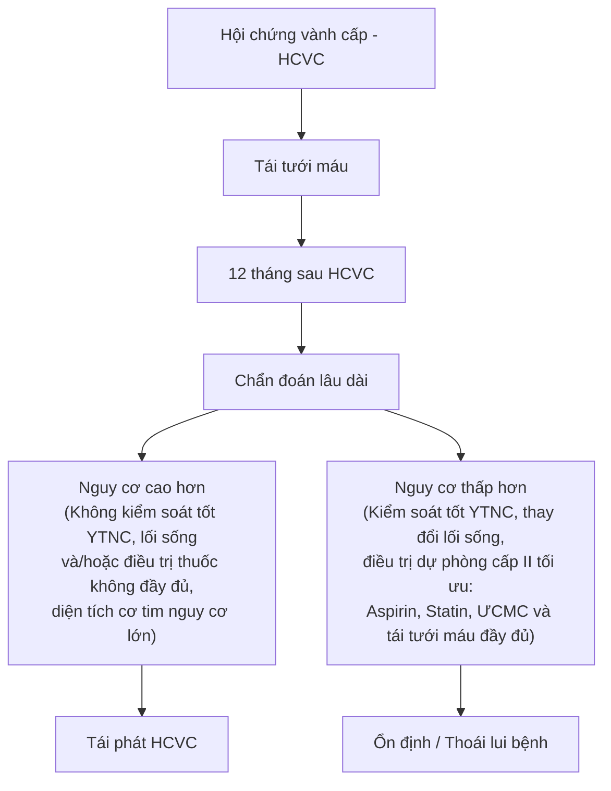
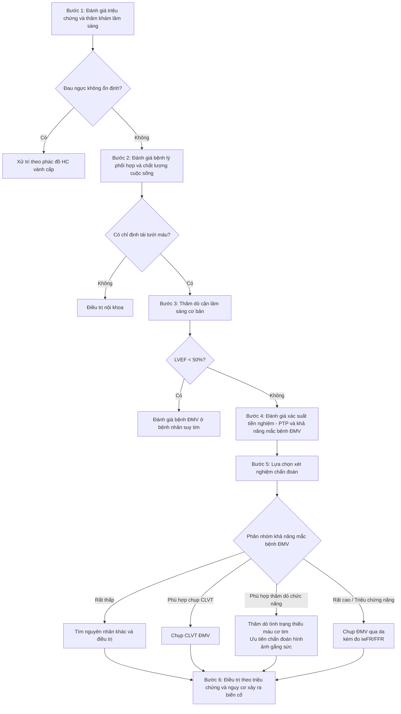
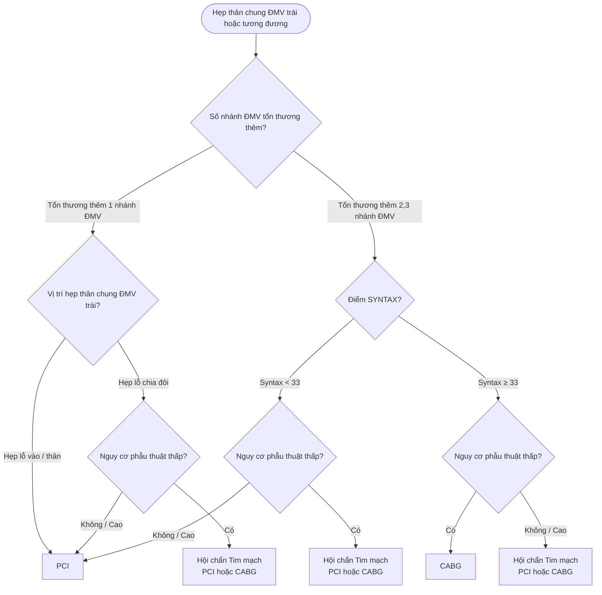

# BỘ Y TẾ

**CỘNG HÒA XÃ HỘI CHỦ NGHĨA VIỆT NAM**  
**Độc lập - Tự do - Hạnh phúc**  

---

Hà Nội, ngày 19 tháng 5 năm 2023  

## QUYẾT ĐỊNH
### Về việc ban hành tài liệu chuyên môn "Hướng dẫn chẩn đoán và điều trị Hội chứng mạch vành mạn"

**BỘ TRƯỞNG BỘ Y TẾ**

- Căn cứ Luật Khám bệnh, chữa bệnh;
- Căn cứ Nghị định số 95/2022/NĐ-CP ngày 15/11/2022 của Chính phủ quy định chức năng, nhiệm vụ, quyền hạn và cơ cấu tổ chức của Bộ Y tế;
- Theo đề nghị của Cục trưởng Cục Quản lý khám, chữa bệnh.

**QUYẾT ĐỊNH:**

**Điều 1.** Ban hành kèm theo Quyết định này tài liệu chuyên môn “Hướng dẫn chẩn đoán và điều trị Hội chứng mạch vành mạn”.

**Điều 2.** Tài liệu chuyên môn “Hướng dẫn chẩn đoán và điều trị Hội chứng mạch vành mạn” được áp dụng tại các cơ sở khám bệnh, chữa bệnh trong cả nước.

**Điều 3.** Các ông, bà: Chánh Văn phòng Bộ, Chánh thanh tra Bộ, Cục trưởng và Vụ trưởng các Cục, Vụ thuộc Bộ Y tế, Giám đốc Sở Y tế các tỉnh, thành phố trực thuộc trung ương, Giám đốc các Bệnh viện trực thuộc Bộ Y tế, Thủ trưởng Y tế các ngành chịu trách nhiệm thi hành Quyết định này./.

| Nơi nhận: | KT. BỘ TRƯỞNG <br> **THỨ TRƯỞNG** |
| :--- | :--- |
| - Như Điều 3;<br>- Bộ trưởng (để báo cáo);<br>- Các Thứ trưởng;<br>- Cổng thông tin điện tử Bộ Y tế; Website Cục KCB;<br>- Lưu: VT, KCB. | <br><br>*(Đã ký)*<br><br>**Trần Văn Thuấn** |

---

# HƯỚNG DẪN CHẨN ĐOÁN VÀ ĐIỀU TRỊ HỘI CHỨNG ĐỘNG MẠCH VÀNH MẠN
*(Ban hành kèm theo Quyết định số 2248/QĐ-BYT ngày 19 tháng 5 năm 2023)*

**Hà Nội, 2023**

---

## DANH SÁCH BAN BIÊN SOẠN
### “HƯỚNG DẪN CHẨN ĐOÁN VÀ ĐIỀU TRỊ HỘI CHỨNG ĐỘNG MẠCH VÀNH MẠN”

- TS. Phan Tuấn Đạt
- PGS. TS. Nguyễn Tá Đông
- TS. Trần Thị Hải Hà
- PGS. TS. Châu Ngọc Hoa
- TS. Nguyễn Thị Thu Hoài
- PGS. TS. Đỗ Quang Huân
- PGS. TS. Phạm Mạnh Hùng
- PGS. TS. Đinh Thị Thu Hương
- TS. Nguyễn Cửu Lợi
- GS. TS. Huỳnh Văn Minh
- GS. TS. Võ Thành Nhân
- TS. Phan Đình Phong
- GS. TS. Đặng Vạn Phước
- PGS. TS. Nguyễn Ngọc Quang
- PGS. TS. Hoàng Văn Sỹ
- TS. Nguyễn Quốc Thái
- PGS. TS. Hoàng Anh Tiến
- PGS. TS. BS. Hồ Huỳnh Quang Trí
- GS. TS. Nguyễn Lân Việt
- PGS. TS. Phạm Nguyễn Vinh
- PGS. TS. Nguyễn Thị Bạch Yến
- ThS. Đỗ Minh Hùng
- ThS. Hoàng Thị Thu Hương

**Thư ký biên soạn:**
- TS. Phan Tuấn Đạt
- ThS. Trương Lệ Vân Ngọc
- DS. Đỗ Thị Ngát

---

## MỤC LỤC

- DANH SÁCH BAN BIÊN SOẠN
- MỤC LỤC
- DANH MỤC KÝ HIỆU VÀ CHỮ VIẾT TẮT
- DANH MỤC BẢNG
- DANH MỤC HÌNH
- **1. ĐẠI CƯƠNG**
  - 1.1. Định nghĩa, thuật ngữ
  - 1.2. Các bệnh cảnh lâm sàng của HCMVM
- **2. LÂM SÀNG VÀ CẬN LÂM SÀNG**
  - 2.1. Triệu chứng cơ năng
  - 2.2. Khám lâm sàng
  - 2.3. Các thăm dò cận lâm sàng
- **3. TIẾP CẬN CHẨN ĐOÁN**
- **4. ĐIỀU TRỊ**
  - 4.1. Mục tiêu điều trị
  - 4.2. Thay đổi lối sống
  - 4.3. Các thuốc điều trị
  - 4.4. Chiến lược điều trị tái thông động mạch vành
  - 4.5. Theo dõi và quản lý lâu dài người bệnh có hội chứng động mạch vành mạn
- TÀI LIỆU THAM KHẢO

---

## DANH MỤC KÝ HIỆU VÀ CHỮ VIẾT TẮT

| Ký hiệu / Viết tắt | Tiếng Anh | Tiếng Việt |
| :--- | :--- | :--- |
| **CABG** | Coronary Artery Bypass Grafting | Phẫu thuật bắc cầu nối chủ vành |
| **EF** | Ejection Fraction | Phân suất tống máu |
| **ESC** | European Society of Cardiology | Hội Tim mạch học Châu Âu |
| **FFR** | Fractional Flow Reserve | Phân suất dự trữ lưu lượng mạch vành |
| **iFR** | Instantaneous wave-free ratio | Phân suất dự trữ lưu lượng mạch vành tương đương không cần giãn mạch tối đa |
| **IVUS** | Intravascular Ultrasound | Siêu âm trong lòng mạch |
| **PCI** | Percutaneous Coronary Intervention | Can thiệp động mạch vành qua da |
| **PTP** | Pre-test Probability | Xác suất tiền nghiệm / Dự báo khả năng mắc bệnh động mạch vành trước test |

---

## DANH MỤC BẢNG

- **Bảng 1.** Phân loại mức độ đau thắt ngực ổn định: theo Hội Tim mạch Canada 1976 [2]
- **Bảng 2.** Đánh giá xác suất tiền nghiệm (PTP) ở người bệnh có triệu chứng đau thắt ngực
- **Bảng 3.** Định nghĩa nguy cơ cao đối với các phương pháp thăm dò ở người bệnh mắc bệnh động mạch vành mạn
- **Bảng 4.** Khuyến cáo về thay đổi lối sống ở người bệnh hội chứng động mạch vành mạn
- **Bảng 5.** Lựa chọn thuốc trong điều trị chống huyết khối kép khi kết hợp với aspirin 75-100 mg/ngày ở người bệnh có nguy cơ tắc mạch cao^a hoặc trung bình^b, và ^c

## DANH MỤC HÌNH

- **Hình 1.** Tiến triển liên tục giữa các pha cấp và mạn của bệnh động mạch vành và phụ thuộc vào việc kiểm soát các yếu tố nguy cơ cũng như thực hành điều trị có đầy đủ hay không mà diễn tiến của bệnh rất khác nhau
- **Hình 2.** Điện tâm đồ người bệnh hội chứng động mạch vành mạn (Có ST dẹt, thẳng đuỗn tại các chuyển đạo DIII, aVF.)
- **Hình 3.** Phim chụp động mạch vành cho thấy hẹp nhiều lỗ vào và đoạn đầu của động mạch liên thất trước trên góc chụp chếch chân
- **Hình 4.** Hình ảnh siêu âm trong lòng mạch trước và sau đặt stent
- **Hình 5.** Các bước chẩn đoán bệnh động mạch vành
- **Hình 6.** Xác định khả năng thực mắc bệnh động mạch vành
- **Hình 7.** Lựa chọn thăm dò chẩn đoán ở người bệnh nghi ngờ mắc bệnh ĐMV
- **Hình 8.** Chiến lược điều trị lâu dài chống thiếu máu cục bộ ở người bệnh hội chứng động mạch vành mạn tùy theo đặc điểm người bệnh và các bệnh đồng mắc
- **Hình 9.** Sơ đồ lựa chọn điều trị với người bệnh tiến hành chụp ĐMV chọn lọc qua đường ống thông
- **Hình 10.** Lựa chọn PCI hoặc CABG trên người bệnh có tổn thương nhiều thân động mạch vành
- **Hình 11.** Lựa chọn PCI hoặc CABG trên người bệnh có tổn thương thân chung ĐMV trái

---

# 1. ĐẠI CƯƠNG

Trong hướng dẫn này, ban biên soạn dựa trên các đồng thuận, khuyến cáo mới nhất của Hội Tim Mạch Châu Âu (ESC 2019 - 2022), Hội Tim mạch Hoa Kỳ và Trường môn Tim Mạch Hoa Kỳ (2020 - 2022).

## 1.1. Định nghĩa, thuật ngữ

**Hội chứng động mạch vành mạn (HCMVM)** *(Chronic coronary syndrome - CCS)* là thuật ngữ được đưa ra tại Hội Nghị Tim Mạch Châu Âu (ESC) 2019, thay cho tên gọi trước đây là đau thắt ngực ổn định, bệnh động mạch vành (ĐMV) ổn định, bệnh cơ tim thiếu máu cục bộ mạn tính hoặc suy vành.

Hội chứng động mạch vành mạn là bệnh lý liên quan đến **sự ổn định tương đối** khi không có sự nứt vỡ đột ngột hoặc sau giai đoạn cấp hoặc sau khi đã được can thiệp/phẫu thuật. Khi mảng xơ vữa tiến triển dần gây hẹp lòng ĐMV một cách đáng kể (thường là hẹp trên 70% đường kính lòng mạch) thì có thể gây ra triệu chứng, điển hình nhất là đau thắt ngực/khó thở khi người bệnh gắng sức và đỡ khi nghỉ.

Trong quá trình phát triển của mảng xơ vữa, một số trường hợp có thể xuất hiện những biến cố cấp tính do sự nứt vỡ mảng xơ vữa, dẫn tới hình thành huyết khối gây hẹp hoặc tắc lòng mạch một cách nhanh chóng được gọi là **hội chứng động mạch vành cấp (HCMVC)**.

Do quá trình diễn tiến động của bệnh lý mạch vành và cơ chế sinh lý bệnh không chỉ là tổn thương mạch vành thượng tâm mạc mà có cả cơ chế tổn thương hệ vi tuần hoàn vành, co thắt mạch... Do vậy, hiện nay thuật ngữ “Hội chứng động mạch vành mạn” được chính thức công bố.

Quá trình này có thể thay đổi bằng cách điều chỉnh lối sống, sử dụng thuốc và các biện pháp xâm lấn giúp bệnh ổn định hoặc thoái lui (Hình 1).

---



**Hình 1.** Tiến triển liên tục giữa các pha cấp và mạn của bệnh động mạch vành và phụ thuộc vào việc kiểm soát các yếu tố nguy cơ cũng như thực hành điều trị có đầy đủ hay không mà diễn tiến của bệnh rất khác nhau.

## 1.2. Các bệnh cảnh lâm sàng của HCMVM

HCMVM có **6 bệnh cảnh lâm sàng**:
- Người bệnh nghi ngờ có bệnh ĐMV với triệu chứng đau thắt ngực ổn định và/hoặc khó thở.
- Người bệnh mới khởi phát triệu chứng suy tim/giảm chức năng thất trái và nghi ngờ có bệnh lý bệnh ĐMV.
- Người bệnh có tiền sử hội chứng động mạch vành cấp hoặc được tái thông ĐMV trong vòng 1 năm, có hoặc không có triệu chứng.
- Người bệnh sau hội chứng động mạch vành cấp hoặc được tái thông ĐMV trên 1 năm.
- Người bệnh đau thắt ngực nghi ngờ do bệnh lý vi mạch hoặc co thắt ĐMV.
- Người bệnh không triệu chứng, khám sàng lọc phát hiện ra bệnh động mạch vành.

---

# 2. LÂM SÀNG VÀ CẬN LÂM SÀNG

Trong phần này, sẽ chủ yếu đề cập đến người bệnh trong bệnh cảnh đầu tiên là trường hợp có triệu chứng cần tiếp cận chẩn đoán. Các trường hợp khác thì tùy...

## 2.1. Triệu chứng cơ năng

Trong chẩn đoán bệnh động mạch vành, cơn đau thắt ngực là triệu chứng lâm sàng quan trọng nhất (xác định người bệnh đau ngực kiểu động mạch vành). Cần lưu ý là một số trường hợp người bệnh bị bệnh động mạch vành lại không có cơn đau ngực điển hình mà có các triệu chứng khác như khó thở, mệt… hoặc hoàn toàn không có triệu chứng gì (bệnh động mạch vành thầm lặng). Với những bệnh cảnh khác, như suy tim, sau can thiệp, hoặc do sàng lọc… thì các triệu chứng tương tự...

### 2.1.1. Cơn đau thắt ngực

* **Vị trí:**
  - Thường ở sau xương ức và là một vùng (chứ không phải một điểm), đau có thể lan lên cổ, vai, tay, hàm, thượng vị, sau lưng…
  - Hay gặp hơn cả là hướng lan lên vai trái rồi lan xuống mặt trong tay trái, có khi xuống tận các ngón tay 4, 5.
* **Hoàn cảnh xuất hiện:**
  - Thường xuất hiện khi gắng sức, xúc cảm mạnh, gặp lạnh, sau bữa ăn nhiều hoặc hút thuốc lá và nhanh chóng giảm/biến mất trong vòng vài phút khi các yếu tố trên giảm.
  - Cơn đau có thể xuất hiện tự nhiên. Một số trường hợp cơn đau thắt ngực có thể xuất hiện về đêm, khi thay đổi tư thế, hoặc khi kèm cơn nhịp nhanh.
* **Tính chất:**
  - Hầu hết các người bệnh mô tả cơn đau thắt ngực như thắt lại, bó nghẹt, hoặc bị đè nặng trước ngực và đôi khi cảm giác buốt giá, bỏng rát.
  - Một số người bệnh có kèm theo khó thở, mệt lả, đau đầu, buồn nôn, vã mồ hôi...
* **Thời gian:**
  - Thường kéo dài khoảng vài phút (3 - 5 phút), có thể dài hơn nhưng thường không quá 20 phút (nếu đau kéo dài hơn và xuất hiện ngay cả khi nghỉ thì cần nghĩ đến cơn đau thắt ngực không ổn định hoặc nhồi máu cơ tim).
  - Những cơn đau xảy ra do xúc cảm thường kéo dài hơn là đau do gắng sức.
  - Những cơn đau mà chỉ kéo dài dưới 1 phút thì nên tìm những nguyên nhân khác...

---

### 2.1.2. Một số trường hợp đặc biệt:

* **Khó thở:** Ở những người bệnh có nguy cơ bệnh động mạch vành cao, đây được coi là triệu chứng có giá trị và được khuyến cáo như là một triệu chứng gợi ý HCMVM bên cạnh triệu chứng đau thắt ngực.
* Ở một số trường hợp, người bệnh có thể không biểu hiện rõ cơn đau mà chỉ cảm giác tức nặng ngực, khó chịu ở ngực, một số khác lại cảm giác như...
* Ngược lại, một số trường hợp lại có cơn đau giả thắt ngực (nhất là ở nữ giới)...
* Một số khác lại đau ngực khi hoạt động gắng sức những lần đầu, sau đó, đỡ đau khi hoạt động lặp lại với cường độ tương tự (hiện tượng “hâm nóng” - warming up).

### 2.1.3. Phân loại đau thắt ngực

- **Đau thắt ngực điển hình kiểu động mạch vành** bao gồm 3 yếu tố:
  - Đau thắt ngực sau xương ức với tính chất và thời gian điển hình.
  - Xuất hiện/tăng lên khi gắng sức hoặc xúc cảm.
  - Đỡ đau khi nghỉ hoặc dùng nitroglycerin nhanh xịt/ngậm dưới lưỡi trong vòng 5 phút.
- **Đau thắt ngực không điển hình:** Chỉ gồm 2 yếu tố trên.
- **Không giống đau thắt ngực:** Chỉ có một hoặc không có yếu tố nào nói trên.

### Bảng 1. Phân loại mức độ đau thắt ngực ổn định (theo Hội Tim mạch Canada - CCS 1976)

| Độ | Đặc điểm | Chú thích |
| :---: | :--- | :--- |
| **I** | Đau thắt ngực xảy ra khi làm việc nặng hoặc gắng sức nhiều hoặc các hoạt động thể lực bình thường nhưng thời gian kéo dài | Đau thắt ngực chỉ xuất hiện khi hoạt động thể lực rất mạnh, nhanh (đi bộ, leo cầu thang) |
| **II** | Đau thắt ngực xảy ra khi hoạt động thể lực ở mức độ trung bình | Ít hạn chế các hoạt động thường ngày khi chúng được tiến hành nhanh, sau bữa ăn, trong trời lạnh, trong gió, trong trạng thái căng thẳng hay vài giờ sau khi thức dậy; nhưng vẫn thực hiện được leo dốc, leo cao được hơn 1 tầng gác với tốc độ bình thường và trong điều kiện bình thường. |
| **III** | Đau thắt ngực xảy ra khi hoạt động thể lực ở mức độ nhẹ | Khó khăn khi đi bộ dài từ 1 - 2 dãy nhà hoặc leo cao 1 tầng gác với tốc độ và điều kiện bình thường. |
| **IV** | Đau thắt ngực xảy ra khi nghỉ ngơi | Không cần gắng sức để khởi phát cơn đau thắt ngực. |

---

## 2.2. Khám lâm sàng

* **Phần hỏi bệnh:** Cần hỏi kỹ tiền sử bản thân và tiền sử gia đình (có người bị bệnh động mạch vành, đã từng đặt stent ĐMV, tăng huyết áp, đái tháo đường, rối loạn lipid máu, …).
* **Khám lâm sàng:** Khám lâm sàng trong HCMVM giúp phát hiện các yếu tố nguy cơ gây bệnh, các biến chứng, phân tầng nguy cơ, các bệnh đồng mắc cũng như chẩn đoán phân biệt. Không có dấu hiệu thực tổn nào đặc hiệu trong HCMVM. Cần thăm khám toàn diện:
  - **Đếm mạch / nhịp tim:** Nếu thiếu máu cơ tim thành dưới sẽ làm chậm nhịp tim do thiếu máu nút nhĩ thất. Nhịp nhanh lúc nghỉ: thường là do hoạt hóa hệ thần kinh giao cảm, nhưng cũng có thể là biểu hiện rối loạn nhịp tim do thiếu máu.
  - **Đo huyết áp:** Cần thiết để chẩn đoán tăng huyết áp, hoặc hạ huyết áp (do suy tim hoặc quá liều thuốc).
  - **Khám tim:** Tìm các dấu hiệu do giãn thất trái, nghe tim thấy tiếng thổi bất thường do giãn buồng tim, hẹp van động mạch chủ, hở hai lá (do rối loạn chức năng cơ nhú), bất thường bẩm sinh của tim…
  - **Tìm kiếm các dấu hiệu suy tim:** Khó thở, tĩnh mạch cổ nổi, gan to, chân phù, tràn dịch ở các màng.

Tìm kiếm các dấu hiệu của bệnh động mạch ngoại vi đi kèm: Sờ tìm khối phình động mạch chủ bụng, bắt mạch cảnh và mạch chi, nghe mạch cảnh, mạch thận, mạch đùi. Đánh giá nuôi dưỡng chi dưới.

Tìm các dấu hiệu tích tụ cholesterol trên da như u xanthoma trên mi mắt, trên da, trên gân đặc biệt gân Achilles, gợi ý tới tăng cholesterol máu tính chất gia đình xảy ra cả ở người trẻ, làm tăng nguy cơ bệnh mạch vành, bệnh lý xơ vữa mạch máu...

Có thể phát hiện các dấu hiệu để chẩn đoán phân biệt như: Tiếng cọ trong viêm màng ngoài tim, các dấu hiệu tràn khí màng phổi, viêm khớp ức sườn...

### a. Các thăm dò cận lâm sàng cơ bản
- Xét nghiệm hs Troponin để loại trừ hội chứng động mạch vành cấp.
- Tổng phân tích tế bào máu, chú ý hemoglobin.
- Xét nghiệm creatinin và đánh giá chức năng thận.
- Bilan lipid máu (LDL-C, cholesterol toàn phần, HDL-C; Triglycerid).
- Sàng lọc đái tháo đường type 2 ở người bệnh nghi ngờ hoặc đã có HCMVM với HbA1c, đường máu lúc đói. Nghiệm pháp dung nạp đường nếu HbA1c và đường máu lúc đói không kết luận được.
- Đánh giá chức năng tuyến giáp nếu lâm sàng nghi ngờ bệnh lý tuyến giáp.

### b. Điện tâm đồ
- **Điện tâm đồ lúc nghỉ:** Được chỉ định cho tất cả người bệnh HCMVM:
  - Có tới > 60% số người bệnh HCMVM có điện tâm đồ bình thường.
  - Một số người bệnh có sóng Q (chứng tỏ có NMCT cũ).
  - Một số người bệnh khác có ST chênh xuống, cứng, thẳng đuỗn.
  - Điện tâm đồ còn giúp phát hiện các tổn thương khác như phì đại thất trái, block nhánh, hội chứng tiền kích thích, rối loạn nhịp, rối loạn dẫn truyền…
- **Điện tâm đồ trong cơn đau:** Có thể thấy sự thay đổi sóng T và đoạn ST (ST chênh xuống, sóng T âm). Tuy nhiên, nếu điện tâm đồ bình thường cũng không thể loại trừ được chẩn đoán có HCMVM. Thay đổi đoạn ST trong cơn nhịp nhanh trên thất không nên được xem như bằng chứng bệnh lý ĐMV.

> **Hình 2.** Điện tâm đồ người bệnh hội chứng động mạch vành mạn (Có ST dẹt, thẳng đuỗn tại các chuyển đạo DIII, aVF.)

### c. X-quang tim phổi thẳng
- X-quang giúp đánh giá mức độ giãn các buồng tim, ứ trệ tuần hoàn phổi hoặc để phân biệt với các nguyên nhân khác gây đau ngực.
- Cần chụp X-quang ngực cho người bệnh có triệu chứng đau ngực không điển hình, có dấu hiệu/triệu chứng suy tim hoặc nghi ngờ bệnh lý động mạch chủ, bệnh lý hô hấp.

### d. Siêu âm tim
- Siêu âm Doppler tim và 2D qua thành ngực đánh giá cấu trúc và chức năng tim, giúp chẩn đoán phân biệt với một số bệnh tim khác cũng có thể gây đau ngực (bệnh van tim, bệnh cơ tim phì đại có tắc nghẽn đường ra thất trái, viêm màng ngoài tim...).
- Đánh giá vùng thiếu máu cơ tim (giảm vận động vùng) khi siêu âm tim, có thể tiến hành trong cơn đau ngực hoặc ngay sau cơn đau ngực.
- Siêu âm Doppler mô và đánh giá sức căng cơ tim cũng có thể giúp phát hiện suy tim với EF bảo tồn, giải thích cho những triệu chứng liên quan đến gắng sức của người bệnh.

## 2.3.2. Các thăm dò đặc hiệu giúp chẩn đoán

### a. Điện tâm đồ gắng sức
Hiện nay, vai trò của điện tâm đồ gắng sức trong chẩn đoán bệnh động mạch vành bị giảm xuống so với các khuyến cáo và hướng dẫn trước đây do độ nhạy và độ đặc hiệu thấp hơn so với các phương pháp khác, nhưng đây vẫn là một thăm dò kinh điển và dễ thực hiện trong hoàn cảnh thực tế tại cơ sở và đặc biệt nó có vai trò giúp đánh giá khả năng dung nạp với gắng sức trên lâm sàng.
- Giúp đánh giá dung nạp gắng sức, triệu chứng, rối loạn nhịp, đáp ứng huyết áp và nguy cơ biến cố của người bệnh. Điều này giúp phân tầng nguy cơ để quyết định biện pháp điều trị và theo dõi điều trị.
- Có thể xem xét như thăm dò thay thế để xác định/loại trừ bệnh ĐMV khi không có sẵn các phương pháp chẩn đoán hình ảnh không xâm lấn.
- Xem xét ở người bệnh đang điều trị để đánh giá hiệu quả điều trị triệu chứng và tình trạng thiếu máu cơ tim.
- Không nên thực hiện để chẩn đoán ở người bệnh với ST chênh xuống ≥ 0,1 mV trên điện tâm đồ khi nghỉ hoặc khi đang điều trị Digitalis.

### b. Siêu âm tim gắng sức
Siêu âm tim gắng sức là biện pháp chẩn đoán hình ảnh không xâm lấn có độ nhạy và độ đặc hiệu cao trong chẩn đoán HCMVM dựa trên vùng thiếu máu cơ tim bộc lộ trong lúc người bệnh gắng sức. Biện pháp này được khuyến cáo ưu tiên lựa chọn trong chẩn đoán và theo dõi HCMVM.

Nguyên lý của phương pháp là phân tích hình ảnh gắng sức dựa trên so sánh vận động vùng khi nghỉ và trong quá trình gắng sức. Đánh giá bán định lượng bằng chỉ số vận động vùng thành tim. Phương pháp mới trong đánh giá vận động vùng bằng Doppler mô và đánh dấu mô cơ tim (speckle tracking) dựa trên sức căng và tốc độ căng cơ tim. Chú ý, rối loạn vận động vùng xảy ra trong vòng vài giây của thiếu máu cấp tính và giai đoạn hồi phục xảy ra trong vòng 2 đến 3 phút. Do vậy, cần đánh giá khẩn trương trong hay ngay sau gắng sức (ghi lại hình ảnh).

Các hình thức siêu âm tim gắng sức: Siêu âm gắng sức có thể bằng thể lực hoặc bằng thuốc phụ thuộc vào khả năng gắng sức của người bệnh, trang thiết bị và trình độ của cơ sở y tế và mục đích của siêu âm gắng sức. Độ nhạy của siêu âm gắng sức phụ thuộc vào chất lượng hình ảnh và trình độ kinh nghiệm của người làm siêu âm.

### c. Chụp cắt lớp vi tính động mạch vành
Là biện pháp chẩn đoán hình ảnh giải phẫu tổn thương động mạch vành được khuyến cáo mức độ ngày một cao hiện nay.

Chụp CLVT động mạch vành được thực hiện bằng cách tiêm thuốc cản quang có chứa iod vào tĩnh mạch ngoại biên. Khi nồng độ thuốc cản quang trong động mạch chủ đạt đến mức độ nhất định, máy sẽ quét và hình ảnh được ghi nhận. Các hình ảnh được phân tích bằng phần mềm máy tính, cho phép tái tạo hình ảnh 2D và dựng hình ảnh 3D của động mạch vành, các buồng tim, cũng như cho biết các thông số thể tích.

Ngày nay, với các thế hệ máy chụp nhiều lớp cắt (multi slice CT: 64, 128, 256 và 328 dãy) có thể dựng hình và cho phép chẩn đoán chính xác mức độ tổn thương hẹp cũng như calci hoá ĐMV.

Với độ nhạy và độ đặc hiệu khá cao và tính chất không xâm lấn, chụp CLVT ĐMV nên xem xét như phương pháp thăm dò không xâm lấn được ưu tiên để đánh giá tổn thương giải phẫu ĐMV, khi các biện pháp không xâm lấn khác không cho ra kết quả rõ ràng.

**Không khuyến cáo chụp CLVT ĐMV khi:** Vôi hóa mạch vành lan tỏa, nhịp tim không đều, béo phì, không thể phối hợp nín thở hoặc bất kỳ tình trạng nào ảnh hưởng đến chất lượng hình ảnh.

*Cần lưu ý vôi hóa động mạch vành phát hiện trên cắt lớp vi tính không đồng nghĩa người bệnh có bệnh động mạch vành.*

## 2.3.3. Chụp ĐMV qua da và các thăm dò đi kèm với chụp ĐMV

### a. Chụp ĐMV qua da
Là phương pháp thăm dò xâm lấn quan trọng giúp chẩn đoán xác định có hẹp ĐMV hay không, mức độ hẹp, vị trí hẹp của từng nhánh ĐMV và dòng chảy trong lòng ĐMV. Chụp ĐMV chỉ cho phép đánh giá về hình ảnh trong lòng ĐMV chứ không cho phép đánh giá chức năng dòng chảy ĐMV và tưới máu cơ tim.

Chụp ĐMV qua da chỉ được chỉ định một cách chặt chẽ và khi có chỉ định tái thông động mạch vành. Do vậy, đây là biện pháp chỉ định ở người bệnh có khả năng cao mắc bệnh ĐMV, triệu chứng nặng không kiểm soát được với điều trị nội khoa hoặc đau ngực điển hình khi gắng sức nhẹ và đánh giá lâm sàng cho thấy nguy cơ biến cố cao. Chụp ĐMV nhằm chẩn đoán xác định bệnh đơn thuần chỉ khi các biện pháp thăm dò hình ảnh và/hoặc chức năng không xâm lấn khác không thể tiến hành hoặc không cho ra kết luận được.

> **Hình 3.** Phim chụp động mạch vành cho thấy hẹp nhiều lỗ vào và đoạn đầu của động mạch liên thất trước trên góc chụp chếch chân *(Nguồn: Viện Tim mạch Việt Nam)*

### b. Siêu âm trong lòng mạch (Intravascular Ultrasound – IVUS)
Là kỹ thuật sử dụng nguyên lý siêu âm với đầu dò siêu âm gắn ở đầu ống thông (catheter) được đưa vào trong lòng ĐMV. Hình ảnh ĐMV được khảo sát là mặt cắt ngang ĐMV, cho phép xác định chính xác diện tích lòng mạch chỗ hẹp nhất, diện tích lòng mạch tham chiếu, gánh nặng mảng xơ vữa, bản chất của mảng xơ vữa,… để từ đó đưa ra quyết định điều trị có nên can thiệp đặt stent ĐMV hay không. IVUS cũng cho phép đánh giá ước lượng kích cỡ stent (đường kính, độ dài) để chỉ dẫn đặt stent ĐMV, đánh giá sau khi đặt stent ĐMV để đạt kết quả tối ưu nhất.

Hiện nay, chỉ định làm IVUS trong chụp và can thiệp ĐMV được đồng thuận: hẹp vừa ĐMV cần xác định rõ diện tích lòng mạch hẹp nhất, khi tổn thương hẹp vừa hoặc có chỉ định can thiệp ở thân chung ĐMV trái, đánh giá tổn thương tái hẹp ở người bệnh đã đặt stent, hình ảnh mảng xơ vữa khó đánh giá trên chụp mạch cản quang…, đặc biệt IVUS giúp hướng dẫn can thiệp đặt stent tối ưu nhất là những tổn thương khó và phức tạp…

> **Hình 4.** Hình ảnh siêu âm trong lòng mạch trước và sau đặt stent *(Nguồn: Viện Tim mạch Việt Nam)*

### c. Đo phân suất dự trữ lưu lượng vành (FFR)
Chụp ĐMV không đánh giá được sinh lý dòng chảy ĐMV bị hẹp. Siêu âm nội mạch có thể cung cấp những thông tin về kích thước lòng mạch và thành phần của mảng xơ vữa, tuy nhiên lại không cung cấp thông tin nào về ảnh hưởng của mảng xơ vữa lên huyết động dòng chảy mạch vành. Hiểu rõ những tác động sinh lý lên dòng chảy tại vùng tổn thương quan sát được trên chụp ĐMV có ý nghĩa hướng dẫn trong can thiệp ĐMV qua da.

Phân suất dự trữ lưu lượng mạch vành (FFR) có tương quan với áp lực tưới máu cơ tim đoạn xa của mạch vành khi giãn tối đa (sử dụng adenosin hoặc papaverin). FFR là tỷ số giữa lưu lượng lúc giãn mạch tối đa qua ĐMV bị hẹp với lưu lượng tối đa lý thuyết.

Do đó những thông tin thu được từ FFR cho phép chẩn đoán xem tại chỗ hẹp mạch vành đó có gây giảm tưới máu cơ tim (thiếu máu cơ tim và triệu chứng đau ngực), từ đó có thể quyết định việc tái thông động mạch vành. Hiện nay, chỉ định tối ưu cho việc sử dụng FFR là công cụ để chẩn đoán, đánh giá những tổn thương mạch vành hẹp mức độ vừa (hẹp 40-70%) trên hình ảnh chụp mạch vành qua đường ống thông, có độ nhạy cao với ngưỡng chỉ định là từ dưới 0,8. Có thể sử dụng thông số IwFR (không cần dùng thuốc giãn mạch tối đa) với ngưỡng là dưới 0,89. Kỹ thuật này còn được sử dụng để tối ưu kết quả đặt stent mạch vành.

Khi tổn thương hẹp ĐMV trong HCMVM mà chưa có bằng chứng chứng minh thiếu máu cơ tim trước đó trên các biện pháp thăm dò không chảy máu (siêu âm gắng sức, xạ đồ tưới máu cơ tim, MRI…), và đặc biệt khi có nhiều tổn thương, vai trò của FFR là rất quan trọng để đưa ra quyết định có can thiệp vị trí hẹp đó hay không.

## 2.3.4. Một số thăm dò khác

### a. Xạ hình tưới máu cơ tim
Dùng chất phóng xạ đặc hiệu (thường dùng chất Thallium 201 hoặc Technetium 99m) gắn với cơ tim để đo được mức độ tưới máu cơ tim bằng kỹ thuật planar hoặc SPECT (Positron Emission Computed Tomography - Chụp cắt lớp bằng bức xạ đơn photon), chất đánh dấu phóng xạ được dùng là Rubidium 82.

Vùng giảm tưới máu cơ tim và đặc biệt là khi gắng sức (thể lực hoặc thuốc) có giá trị chẩn đoán và định khu ĐMV bị tổn thương. Độ nhạy và độ đặc hiệu của phương pháp này trong chẩn đoán ĐMV khá cao (89% và 76%). Độ nhạy và độ đặc hiệu của phương pháp có thể bị giảm ở những người bệnh béo phì, bệnh hẹp cả ba nhánh ĐMV, block nhánh trái, nữ giới,…

Ngoài ra, phương pháp chẩn đoán này còn giúp đánh giá khả năng sống còn, sự thiếu máu và chức năng cơ tim trong rối loạn chức năng thất trái do thiếu máu cục bộ. Đây là một biện pháp không xâm lấn kinh điển trong chẩn đoán bệnh tim thiếu máu cục bộ. Tuy nhiên, cần có trang thiết bị và kinh nghiệm của thầy thuốc.

### b. Chụp cộng hưởng từ tim
Cộng hưởng từ tim được chỉ định cho những trường hợp nghi ngờ bệnh động mạch vành mà trên siêu âm tim chưa cho được kết luận rõ ràng. Là biện pháp có độ nhạy và độ đặc hiệu khá cao trong chẩn đoán HCMVM.

Cộng hưởng từ tim cho những thông tin hữu ích về giải phẫu tim, chức năng tim, kết hợp với các thuốc như dobutamin hoặc adenosin cho phép đánh giá mức độ tưới máu cơ tim, vận động vùng, các vùng thiếu máu cơ tim khi gắng sức và khả năng sống còn cơ tim với những trường hợp sau NMCT. Nhược điểm của phương pháp này là giá thành cao, thời gian thực hiện lâu, thường chỉ có trang bị ở những trung tâm lớn, cần lưu ý chỉ định chụp ở những người bệnh đã có cấy ghép các thiết bị kim loại (ví dụ như máy tạo nhịp tim).

# TIẾP CẬN CHẨN ĐOÁN
Chiến lược tiếp cận chẩn đoán người bệnh đau thắt ngực hoặc có triệu chứng tương tự (tức nặng ngực, khó chịu ở ngực, khó thở…) có nghi ngờ bệnh ĐMV gồm 6 bước. Vì quá trình diễn tiến của HCMVM là động và bản thân điều trị cũng là một quá trình trong hệ thống, do vậy sơ đồ sau là quá trình 6 bước tiếp cận một người bệnh HCMVM.



### Sơ đồ: Các bước chẩn đoán bệnh động mạch vành (Hình 5)
- **Đau ngực không ổn định?** -> Xử trí theo phác đồ Hội chứng mạch vành cấp
- **Không có chỉ định tái tưới máu** -> Điều trị nội khoa
- **Đánh giá bệnh ĐMV ở bệnh nhân suy tim** -> Khi LVEF < 50%
- **Nguyên nhân đau ngực không do BĐMV?** -> Tìm nguyên nhân và điều trị
- **Không có chỉ định thăm dò** (Khả năng mắc bệnh ĐMV rất thấp) -> Tìm nguyên nhân khác và điều trị
- **Lựa chọn xét nghiệm chẩn đoán dựa trên khả năng mắc bệnh ĐMV, kinh nghiệm của cơ sở y tế và cơ sở vật chất:**
  - Chụp CLVT ĐMV
  - Thăm dò tình trạng thiếu máu cơ tim (Ưu tiên chẩn đoán hình ảnh)
  - Chụp ĐMV qua da (kèm iwFR/FFR)
- **Khả năng mắc bệnh ĐMV:** Từ rất thấp đến rất cao
- **BƯỚC 6:** Điều trị theo triệu chứng và nguy cơ xảy ra biến cố

---

### Bước 1: Đánh giá triệu chứng và thăm khám lâm sàng
- Khai thác tiền sử bệnh lý tim mạch và các yếu tố nguy cơ.
- Đặc điểm của cơn đau thắt ngực: Có phải cơn đau thắt ngực kiểu mạch vành không, điển hình hay không điển hình, ổn định hay không ổn định.
- Chú ý một số triệu chứng tương tự cũng cần nghĩ đến bệnh lý ĐMV như: cảm giác nặng ngực, cảm giác khó chịu ở ngực, khó thở… khi gắng sức.
- Phân biệt đau ngực do các nguyên nhân khác: Thiếu máu, huyết áp cao, bệnh lý van tim, bệnh lý màng ngoài tim, bệnh cơ tim phì đại, các rối loạn nhịp tim.
- Chú ý phân biệt tình trạng thiếu máu do hẹp ĐMV thượng tâm mạc và co thắt ĐMV hay bệnh vi mạch. Khi triệu chứng không điển hình thì có thể cần làm thêm nghiệm pháp gắng sức đánh giá tình trạng thiếu máu cơ tim hay hình ảnh học ĐMV.
- Nếu đánh giá là cơn đau thắt ngực nặng, kéo dài tính chất không ổn định thì xử trí như với hội chứng động mạch vành cấp. Nếu loại trừ hoặc không nghĩ đến thì chuyển tiếp sang Bước 2.

### Bước 2: Đánh giá các bệnh lý phối hợp và chất lượng cuộc sống
Trước khi tiến hành bất kỳ thăm dò gì cần đánh giá tổng quan người bệnh về tình hình sức khỏe nói chung, gánh nặng bệnh tật kèm theo và chất lượng cuộc sống. Nếu người bệnh quá nặng, giai đoạn cuối các bệnh lý, kỳ vọng sống thấp… và khả năng chụp và tái thông ĐMV không đem lại lợi ích thì nên hạn chế các thăm dò sâu hơn và có thể bắt đầu điều trị nội khoa.

Nếu không phải đau thắt ngực do bệnh động mạch vành thì có thể làm thêm các thăm dò để chẩn đoán đau ngực do các bệnh lý khác như dạ dày ruột, hô hấp, cơ xương khớp. Tuy nhiên, các người bệnh này vẫn nên được đánh giá nguy cơ tim mạch tổng thể (ví dụ theo thang điểm SCORE 2).

### Bước 3: Thăm dò cận lâm sàng
Các thăm dò cơ bản với người bệnh nghi ngờ có bệnh lý động mạch vành bao gồm: sinh hóa máu, điện tâm đồ lúc nghỉ, điện tâm đồ 24 giờ (nếu cần), siêu âm tim, X-quang ngực.

### Bước 4: Đánh giá xác suất tiền nghiệm (PTP) và khả năng thực mắc bệnh động mạch vành

#### Đánh giá xác suất tiền nghiệm (PTP)
Trước khi làm thăm dò cận lâm sàng (test) chẩn đoán bệnh, cần dự báo xác suất (khả năng bị bệnh trước khi tiến hành các test chẩn đoán) mắc bệnh động mạch vành dựa trên các yếu tố lâm sàng như: Tính chất đau thắt ngực có điển hình hay không (hoặc khó thở), giới, tuổi và yếu tố nguy cơ tim mạch đi kèm. Xác suất này dựa trên các nghiên cứu quan sát lâm sàng cỡ mẫu lớn có hiệu chỉnh.

**Bảng 2. Đánh giá xác suất tiền nghiệm (PTP) ở người bệnh có triệu chứng đau thắt ngực**

### Bảng: Xác suất tiền nghiệm (PTP) dựa trên tuổi, giới và triệu chứng (%)

| Tuổi (năm) | Đau thắt ngực điển hình | Đau thắt ngực không điển hình | Không phải đau thắt ngực | Khó thở |
| :--- | :---: | :---: | :---: | :---: |
| | **Nam / Nữ** | **Nam / Nữ** | **Nam / Nữ** | **Nam / Nữ** |
| **30–39** | 3% / 5% | 4% / 3% | 1% / 1% | 0% / 3% |
| **40–49** | 22% / 10% | 10% / 6% | 3% / 2% | 12% / 3% |
| **50–59** | 32% / 13% | 17% / 6% | 11% / 3% | 20% / 9% |
| **60–69** | 44% / 16% | 26% / 11% | 22% / 6% | 27% / 14% |
| **70+** | 52% / 27% | 34% / 19% | 24% / 10% | 32% / 12% |

*\*PTP: Pre-test probability (Xác suất tiền nghiệm)*

*   **Nhóm có PTP > 15%:** Xếp vào nhóm có khả năng bị bệnh ĐMV trước khi tiến hành các thăm dò là cao, lựa chọn các thăm dò không xâm lấn phù hợp nhất (sơ đồ 11.6).
*   **Nhóm có PTP từ 5 - 15%:** Nhóm có khả năng bị bệnh ĐMV trước khi tiến hành các thăm dò là vừa, các thăm dò chẩn đoán không xâm lấn có thể cân nhắc sau khi xác định khả năng mắc bệnh động mạch vành (xem thêm ở phần sau).
*   **Nhóm có PTP < 5%:** Dự báo khả năng thấp mắc bệnh động mạch vành, các thăm dò chẩn đoán không xâm lấn chỉ nên được thực hiện khi có lý do khác bắt buộc (ví dụ trước phẫu thuật).

#### Khả năng thực mắc bệnh động mạch vành

Xác suất mắc bệnh ĐMV sẽ tăng lên khi sự có mặt các yếu tố nguy cơ tim mạch (tiền sử gia đình mắc bệnh tim mạch, rối loạn lipid máu, đái tháo đường, tăng huyết áp, hút thuốc và yếu tố lối sống khác).

Dựa trên triệu chứng lâm sàng kết hợp với: Các yếu tố nguy cơ tim mạch, thay đổi điện tâm đồ khi nghỉ, vôi hóa động mạch vành trên CLVT... giúp bổ sung ước đoán bệnh ĐMV chính xác hơn khi so sánh với PTP (tuổi, giới và triệu chứng) đơn thuần.

Do vậy, sau khi ước lượng PTP thì đánh giá khả năng thực của người đó mắc bệnh ĐMV như thế nào, có thể tăng lên hoặc giảm đi, từ đó có quyết định thăm dò phù hợp để chẩn đoán bệnh ĐMV (Hình 6).

**Hình 6. Xác định khả năng thực mắc bệnh động mạch vành**

*   **Khởi điểm:** PTP dựa trên tuổi, giới và triệu chứng.
*   **Các yếu tố làm tăng khả năng thực mắc bệnh động mạch vành:**
    *   Yếu tố nguy cơ tim mạch.
    *   Thay đổi điện tâm đồ khi nghỉ (sóng Q, thay đổi ST-T).
    *   Giảm chức năng thất trái.
    *   Điện tâm đồ gắng sức bất thường.
    *   Vôi hóa động mạch vành trên phim chụp CLVT.
*   **Các yếu tố làm giảm khả năng thực mắc bệnh động mạch vành:**
    *   Điện tâm đồ gắng sức bình thường.
    *   Không có vôi hóa trên phim chụp CLVT động mạch vành (Điểm Agatston = 0).

---

### Bước 5: Lựa chọn thăm dò chẩn đoán phù hợp

Tùy thuộc vào điều kiện tại khu vực, chẩn đoán có thể bắt đầu từ 1 trong 3 lựa chọn:
1.  **Thăm dò không xâm lấn** (đánh giá chức năng)
2.  **Chụp cắt lớp vi tính (CLVT) ĐMV** (đánh giá giải phẫu)
3.  **Chụp ĐMV qua da** (thăm dò xâm lấn)

Qua mỗi lựa chọn, những thông tin về giải phẫu và chức năng sẽ giúp chẩn đoán và lựa chọn chiến lược điều trị.

#### Các tiêu chí lựa chọn ưu tiên:

*   **Thăm dò không xâm lấn:** Cân nhắc ưu tiên nếu:
    *   Nguy cơ mắc bệnh ĐMV cao.
    *   Có thể cần tái tưới máu.
    *   Kinh nghiệm và cơ sở vật chất cho phép.
    *   Cần đánh giá sống còn cơ tim.
*   **Chụp ĐMV qua da:** Cân nhắc ưu tiên nếu:
    *   Nguy cơ mắc bệnh ĐMV cao và không đáp ứng với điều trị nội khoa.
    *   Đau thắt ngực điển hình khi gắng sức nhẹ và điện tâm đồ gắng sức cho thấy nguy cơ xảy ra biến cố cao.
    *   Rối loạn chức năng thất trái gợi ý bệnh ĐMV.

#### Hướng xử trí:
*   Nếu **hẹp > 90% ĐMV** hoặc có tương quan với tình trạng thiếu máu cơ tim: Tiến hành **Tái tưới máu**.
*   Nếu cần đánh giá thêm: Tiến hành **Đánh giá chức năng**.
*   Ngược lại: Tiến hành **Điều trị nội khoa [b]**.

**Hình 7. Lựa chọn thăm dò chẩn đoán ở người bệnh nghi ngờ mắc bệnh ĐMV**

---

### Bước 6: Điều trị theo triệu chứng và phân tầng nguy cơ

Phân tầng nguy cơ giúp đưa ra thái độ điều trị thích hợp và tiên lượng bệnh. Những người bệnh thuộc nhóm nguy cơ cao (tỉ lệ tử vong do tim mạch > 3%/năm) là những người sẽ được hưởng lợi nhiều nhất khi tiến hành chụp và tái thông động mạch vành. Do vậy, để quyết định phương án điều trị cần phân tầng nguy cơ người bệnh dựa trên triệu chứng của người bệnh và sự đáp ứng với điều trị nội khoa tối ưu (Bảng 3).

### Bảng 3. Định nghĩa nguy cơ cao đối với các phương pháp thăm dò ở người bệnh mắc bệnh động mạch vành mạn

| Phương pháp thăm dò | Tiêu chuẩn xác định nguy cơ cao (Tử vong tim mạch > 3%/năm) |
| :--- | :--- |
| **Điện tâm đồ gắng sức** | Tử vong tim mạch > 3%/năm theo thang điểm Duke. |
| **SPECT hoặc PET** | Vùng thiếu máu cơ tim $\ge$ 10%. |
| **Siêu âm tim gắng sức** | Giảm hoặc không vận động $\ge$ 3/16 vùng cơ tim khi gắng sức. |
| **Cộng hưởng từ tim (CHT) gắng sức** | Giảm tưới máu $\ge$ 2/16 vùng cơ tim khi gắng sức hoặc $\ge$ 3 vùng rối loạn chức năng khi dùng dobutamine. |
| **Chụp CLVT ĐMV hoặc chụp ĐMV qua da** | Bệnh 3 thân ĐMV có hẹp đoạn gần, tổn thương LM hoặc đoạn gần LAD. |
| **Thăm dò chức năng xâm lấn** | FFR $\le$ 0,8; iwFR $\le$ 0,89. |

*\*Chú thích:*
- **ĐTĐ:** Điện tâm đồ
- **CHT:** Cộng hưởng từ
- **CLVT:** Cắt lớp vi tính
- **ĐMV:** Động mạch vành
- **SPECT:** Chụp cắt lớp bằng bức xạ đơn photon
- **PET:** Cắt lớp phát xạ Positron
- **FFR:** Phân suất dự trữ lưu lượng mạch vành
- **iwFR:** Phân suất dự trữ lưu lượng mạch vành tương đương không cần giãn mạch tối đa (Instantaneous wave-free ratio)
- **LM:** Thân chung ĐMV trái (Left Main)
- **LAD:** Động mạch liên thất trước

---

## 4. ĐIỀU TRỊ

Hai mục tiêu điều trị chính ở người bệnh HCMVM là:
1.  **Phòng ngừa biến cố tim mạch:** Tập trung chủ yếu vào giảm tỷ lệ biến cố cấp (Hội chứng mạch vành cấp) và xuất hiện rối loạn chức năng tâm thất, thông qua các thuốc, can thiệp và thay đổi lối sống.
2.  **Giảm triệu chứng đau thắt ngực do gắng sức** (cải thiện chất lượng cuộc sống) thông qua giảm triệu chứng do thiếu máu cục bộ cơ tim. Có nhiều loại thuốc để điều trị triệu chứng đau thắt ngực nhanh chóng cũng như lâu dài, lựa chọn và phối hợp thuốc phù hợp.

**Điều trị tối ưu** có thể được định nghĩa là kiểm soát được các triệu chứng và phòng ngừa các biến cố tim mạch liên quan đến HCMVM với sự tuân thủ điều trị tối đa.

### 4.2. Thay đổi lối sống

Thực hiện các hành vi lối sống lành mạnh (bao gồm ngừng hút thuốc, hoạt động thể chất theo khuyến cáo, chế độ ăn uống lành mạnh, và duy trì cân nặng hợp lý) làm giảm nguy cơ tử vong và các biến cố tim mạch, đồng thời giúp dự phòng thứ phát các biến cố tim mạch. Các bằng chứng cho thấy các lợi ích này xuất hiện sau khoảng 6 tháng từ khi có biến cố.

#### Bảng 4. Khuyến cáo về thay đổi lối sống ở người bệnh hội chứng động mạch vành mạn

| Yếu tố về lối sống | Khuyến cáo chi tiết |
| :--- | :--- |
| **Ngừng hút thuốc** | Sử dụng chiến lược thay đổi hành vi và sử dụng thuốc để giúp người bệnh bỏ thuốc. Tránh hút thuốc thụ động. |
| **Chế độ ăn uống lành mạnh** | - Chế độ ăn nhiều rau xanh, trái cây và các loại ngũ cốc.<br>- Hạn chế chất béo bão hòa ở mức < 10% tổng lượng ăn vào.<br>- Hạn chế đồ uống có cồn < 100g/tuần hoặc 15g/ngày. |
| **Hoạt động thể chất** | Hàng ngày, hoạt động thể chất ở mức trung bình trong 30-60 phút, nhưng dù không đều đặn thì vẫn có lợi. |
| **Cân nặng khỏe mạnh tối ưu** | Đạt và duy trì cân nặng tối ưu ($\text{BMI} < 25 \text{ kg/m}^2$) hoặc giảm cân bằng cách giảm lượng ăn vào theo khuyến cáo và hoạt động thể chất. |
| **Khác** | Uống thuốc theo đúng đơn. |

*   **Sinh hoạt tình dục:** Có nguy cơ thấp đối với người bệnh ổn định, không có triệu chứng khi hoạt động ở mức độ thấp-trung bình.

---

### Các thuốc phòng ngừa biến cố tim mạch ở người bệnh HCMVM

*   **Aspirin:** Vẫn là nền tảng trong điều trị phòng ngừa biến cố huyết khối động mạch. Thuốc hoạt động thông qua ức chế không hồi phục cyclooxygenase (COX-1). Aspirin 75 - 100 mg/24h được chỉ định ở những người bệnh có tiền sử NMCT hoặc tái thông ĐMV; hoặc nên chỉ định ở người bệnh không có tiền sử NMCT hoặc tái thông ĐMV nhưng có bằng chứng hình ảnh rõ ràng của bệnh ĐMV.
*   **Clopidogrel:** Clopidogrel 75 mg/24h ở người bệnh HCMVM trong tình huống nói trên để thay cho aspirin; có thể cân nhắc lựa chọn clopidogrel thay vì dùng aspirin ngay từ đầu.
*   **Kháng huyết khối kép:** Dùng aspirin kết hợp với thuốc chống huyết khối thứ 2 (kháng kết tập tiểu cầu hoặc thuốc chống đông đường uống khác) hoặc clopidogrel kết hợp thuốc chống đông đường uống trong phòng ngừa thứ phát nên cân nhắc ở người bệnh có **nguy cơ tắc mạch cao** và **không có nguy cơ chảy máu cao**.

#### Bảng 5. Lựa chọn thuốc trong điều trị chống huyết khối kép khi kết hợp với aspirin 75-100 mg/ngày ở người bệnh có nguy cơ tắc mạch cao ᵃ hoặc trung bình ᵇ, và không có nguy cơ chảy máu cao ᶜ

| Thuốc | Liều dùng | Chỉ định | Thận trọng |
| :--- | :--- | :--- | :--- |
| **Clopidogrel** | 75 mg x 1 lần/ngày | Sau NMCT dung nạp tốt với liệu pháp kháng kết tập tiểu cầu kép trên 12 tháng. | |
| **Prasugrel** | 10 mg x 1 lần/ngày hoặc 5 mg x 1 lần/ngày nếu < 60 kg hoặc > 75 tuổi | Sau can thiệp do NMCT dung nạp tốt với liệu pháp kháng kết tập tiểu cầu kép trên 12 tháng. | Người bệnh trên 75 tuổi. |
| **Rivaroxaban** | 2,5 mg x 2 lần/ngày ᵈ | Sau NMCT > 1 năm hoặc bệnh nhiều thân mạch vành. | MLCT 15 - 29 mL/ph/1,73m². |
| **Ticagrelor** | 60 mg x 2 lần/ngày | Bệnh nhân sau NMCT dung nạp tốt với liệu pháp kháng kết tập tiểu cầu kép trên 12 tháng. | |

*\*Chú thích:* NMCT: Nhồi máu cơ tim, MLCT: Mức lọc cầu thận.

*   **(a) Nguy cơ tắc mạch cao:** Được định nghĩa khi có tổn thương động mạch vành lan tỏa nhiều nhánh với ít nhất một trong các tình trạng sau: đái tháo đường cần dùng thuốc; NMCT tái phát; bệnh động mạch ngoại biên hoặc bệnh thận mạn với mức lọc cầu thận 15-59 mL/phút/1,73 m².
*   **(b) Nguy cơ tắc mạch trung bình:** Khi có ít nhất một trong các tình trạng sau: tổn thương động mạch vành lan tỏa nhiều nhánh, đái tháo đường cần dùng thuốc, NMCT tái phát, bệnh động mạch ngoại biên hoặc bệnh thận mạn với mức lọc cầu thận 15-59 mL/phút/1,73 m².
*   **(c) Nguy cơ chảy máu cao:** Được định nghĩa khi có tiền sử xuất huyết nội sọ hoặc đột quỵ do thiếu máu cục bộ, tiền sử bệnh lý nội sọ khác, xuất huyết tiêu hóa gần đây hoặc thiếu máu do có thể mất máu đường tiêu hóa, bệnh lý đường tiêu hóa khác liên quan đến tăng nguy cơ chảy máu, suy gan, chảy máu tạng hoặc rối loạn đông máu, tuổi già hoặc sức yếu, hoặc suy thận cần lọc máu hoặc với mức lọc cầu thận thấp.
*   **(d) Ở nhóm người bệnh có nguy cơ tắc mạch cao:** Rivaroxaban liều thấp (2,5 mg x 2 lần/ngày) kết hợp với aspirin có thể giúp giảm nguy cơ biến cố tim mạch ở người bệnh HCMVM (sau NMCT > 1 năm hoặc bệnh nhiều thân mạch vành) hoặc bệnh động mạch ngoại biên mạn tính.

---

*   **Statin (hoặc thuốc hạ lipid máu):** Statin được chỉ định cho tất cả người bệnh HCMVM với mục tiêu giảm LDL-C $\ge$ 50% so với mức nền (khi người bệnh chưa được điều trị bằng bất kỳ thuốc hạ lipid máu nào) và đích LDL-C < 1,4 mmol/L (< 55 mg/dL).
    *   Nếu mục tiêu không đạt được với liều tối đa dung nạp được của statin, khuyến cáo phối hợp thêm ezetimibe hoặc phối hợp thêm với thuốc ức chế thụ thể PCSK9.

#### c. Thuốc ức chế hệ Renin - Angiotensin - Aldosterone
*   Thuốc ức chế men chuyển (ƯCMC) nên được sử dụng ở tất cả người bệnh HCMVM có tăng huyết áp, đái tháo đường, phân suất tống máu thất trái (EF) $\le$ 40%, bệnh thận mạn, trừ khi có chống chỉ định.
*   Thuốc ƯCMC nên cân nhắc ở người bệnh HCMVM có nguy cơ rất cao biến cố tim mạch.
*   Thuốc ức chế thụ thể (ƯCTT) được khuyến cáo ở người bệnh HCMVM khi không dung nạp với ƯCMC.

#### d. Các thuốc khác
*   Nếu người bệnh HCMVM có kèm theo rung nhĩ: Có chỉ định dùng kéo dài thuốc chống đông đường uống (DOAC) hoặc chống đông kháng vitamin K (VKA) (duy trì PT% > 70%) nếu $\text{CHA}_2\text{-DS}_2\text{-VASc} \ge 3$ điểm ở nữ, $\ge 2$ điểm ở nam.
*   Nếu người bệnh có nguy cơ xuất huyết tiêu hóa cao, thuốc ức chế bơm proton (PPI) được khuyến cáo sử dụng đồng thời với liệu pháp chống ngưng tập tiểu cầu hoặc chống đông.

#### Những điều trị KHÔNG được khuyến cáo do không có lợi ích làm giảm nguy cơ tử vong và nhồi máu cơ tim:
*   Liệu pháp hormone bằng estrogen.
*   Vitamin C, vitamin E, beta-carotene.
*   Điều trị tăng homocysteine với folate hoặc vitamin B6, B12.
*   Liệu pháp chống oxy hóa.
*   Điều trị với tỏi, coenzyme Q10, Selenium hoặc Crom…
*   Dipyridamole KHÔNG khuyến cáo ở người bệnh HCMVM.

---

### Thuốc điều trị triệu chứng đau thắt ngực

#### a. Nitrat
*   **Cơ chế:** Giãn hệ động mạch vành và hệ tĩnh mạch, giảm triệu chứng đau thắt ngực dựa trên cơ chế giải phóng nitric oxide (NO) và giảm tiền gánh.
*   **Nitroglycerin xịt/ngậm dưới lưỡi** (liều 0,3 - 0,6 mg mỗi 5 phút, cho đến tối đa 1,2 mg trong 15 phút): Tác dụng tức thời dùng trong cơn đau ngực cấp hoặc dự phòng đau thắt ngực sau các hoạt động gắng sức, cảm xúc mạnh hay thời tiết lạnh…
*   **Các nitrat tác dụng dài:** Thuốc sẽ mất hiệu quả nếu sử dụng thường xuyên trong thời gian dài mà không có khoảng nghỉ hoặc giảm liều nitrat trong khoảng 10 đến 14 giờ.
*   **Lưu ý:** Không được dùng cùng các thuốc ức chế PDE-2 [sic] (ví dụ: Sildenafil) [Chú thích lâm sàng: Bản gốc ghi PDE-2, tuy nhiên Sildenafil thực chất là chất ức chế PDE-5]..

#### b. Thuốc chẹn beta giao cảm
*   **Cơ chế của thuốc giảm triệu chứng đau ngực và thiếu máu cơ tim khi gắng sức thông qua:**
    *   Giảm tiêu thụ oxy cơ tim do giảm nhịp tim, giảm co bóp cơ tim và giảm hậu gánh.
    *   Giảm tái cấu trúc cơ tim do giảm sức căng thành thất trái.
    *   Kéo dài thời kỳ tâm trương, tăng tưới máu động mạch vành, làm tăng cung cấp oxy cơ tim.
*   **Lợi ích lâu dài:** Lợi ích của việc điều trị chẹn beta giao cảm lâu dài đã được chứng minh trên người bệnh HCMVM do giảm gánh nặng thiếu máu cục bộ, cải thiện sống còn ở người bệnh có giảm chức năng thất trái hoặc tiền sử nhồi máu cơ tim.
*   **Chỉ định:** Chẹn beta giao cảm nên được dùng ở tất cả người bệnh có giảm chức năng tâm thu thất trái (EF $\le$ 40%) hoặc tiền sử nhồi máu cơ tim, trừ khi có chống chỉ định. Các thuốc đã được chứng minh làm giảm nguy cơ tử vong: Metoprolol succinate, carvedilol, bisoprolol.
*   **Lưu ý khi sử dụng:**
    *   Với việc giảm triệu chứng, thuốc chẹn beta giao cảm nên là lựa chọn tiêu chuẩn cho nhiều đối tượng người bệnh HCMVM, nhưng cần hết sức lưu ý các chống chỉ định và cần theo dõi khi sử dụng lâu dài.
    *   Chú ý các chống chỉ định của thuốc: hen phế quản, co thắt phế quản, nhịp tim chậm, co thắt động mạch vành.

#### c. Thuốc chẹn kênh canxi (CCB)
*   **Phân loại:** Gồm 2 nhóm dihydropyridine (amlodipine, felodipine, lacidipine, nifedipine) và nondihydropyridine (diltiazem và verapamil).
*   **Cơ chế:** Cải thiện cung cấp oxy cơ tim do giảm sức cản mạch vành, tăng dòng chảy động mạch hệ thống. Làm giảm nhu cầu oxy cơ tim bằng cách giảm co bóp cơ tim, giảm sức cản mạch hệ thống và giảm huyết áp.
*   **Lợi ích:** Các thuốc chẹn kênh canxi chưa được chứng minh làm giảm đáng kể tỷ lệ tử vong và mắc bệnh trên người bệnh HCMVM.
*   **Chỉ định:** Thuốc được chỉ định điều trị triệu chứng ở người bệnh không có suy tim đi kèm. Nhịp tim nhanh thì nên sử dụng nhóm nondihydropyridine, nhịp tim bình thường hoặc chậm thì nên dùng nhóm dihydropyridine.

#### d. Ivabradine
Ivabradine ức chế chuyên biệt kênh $I_f$ ở nút xoang quả tim, từ đó làm giảm tần số tim và kiểm soát triệu chứng đau thắt ngực. Phối hợp sớm Ivabradine với thuốc chẹn beta giao cảm đã được chứng minh giúp cải thiện triệu chứng thiếu máu cơ tim hơn so với việc tăng liều chẹn beta giao cảm. Thuốc có thể sử dụng kết hợp cùng hoặc thay thế thuốc chẹn beta giao cảm khi không dung nạp với thuốc chẹn beta.

#### e. Trimetazidine
Thuốc ức chế quá trình beta oxy hóa các acid béo bằng cách ức chế các enzym 3-ketoacyl-CoA thiolase chuỗi dài ở tế bào thiếu máu cục bộ. Năng lượng thu được trong quá trình oxy hóa glucose cần tiêu thụ oxy ít hơn so với quá trình beta oxy hóa. Việc thúc đẩy oxy hóa glucose sẽ giúp tối ưu các quá trình năng lượng tế bào, do đó duy trì được chuyển hóa năng lượng thích hợp trong thời gian thiếu máu. Ở những người bệnh thiếu máu cơ tim cục bộ, trimetazidine hoạt động như một chất chuyển hóa, giúp bảo tồn mức năng lượng phosphat cao nội bào trong tế bào cơ tim. Trimetazidine có tác dụng chống thiếu máu cơ tim cục bộ nhưng không ảnh hưởng đến huyết động.

#### f. Nicorandil
Nicorandil là một dẫn xuất nitrat của nicotinamide được sử dụng để phòng ngừa và điều trị đau thắt ngực lâu dài, có thể kết hợp với thuốc chẹn beta giao cảm.

#### g. Ranolazine
Ranolazine ức chế dòng natri chậm tế bào cơ tim ($I_{Na}$), từ đó tái cân bằng điện giải tế bào cơ tim (một yếu tố duy trì hoạt động cơ tim đã không được cân bằng khi có thiếu máu cục bộ). Do vậy, thuốc làm giảm triệu chứng đau thắt ngực. *Chú ý: Không dùng thuốc ở những người bệnh có hội chứng QT kéo dài.*

#### Phân loại các nhóm thuốc điều trị đau thắt ngực theo ảnh hưởng huyết động:
*   **Các thuốc có ảnh hưởng đến huyết động:** Chẹn beta giao cảm; chẹn kênh calci (canxi).
*   **Các thuốc ảnh hưởng nhịp tim:** Chẹn beta giao cảm; chẹn kênh calci (canxi); ức chế kênh f (ivabradine).
*   **Các thuốc tác động lên chuyển hóa tế bào cơ tim (không ảnh hưởng đến huyết động, nhịp tim):** Trimetazidine; ranolazine.

---

### 4.3.2.2. Chiến lược tiếp cận điều trị thuốc chống đau thắt ngực trong HCMVM

*   Chiến lược tiếp cận điều trị thuốc chống đau thắt ngực trong HCMVM nên được xem xét cá thể hóa và tùy thuộc đặc điểm cá thể người bệnh và các bệnh đồng mắc.
*   Hiện nay, việc điều trị có thể bắt đầu bằng sử dụng một thuốc hoặc kết hợp hơn một thuốc ngay từ đầu. Việc lựa chọn thuốc kết hợp tùy thuộc mức độ đau ngực và tình trạng người bệnh. Ưu tiên lựa chọn phối hợp một thuốc có tác động huyết động/nhịp tim với một thuốc tác động lên chuyển hóa tế bào cơ tim.
*   Để điều trị cắt cơn đau thắt ngực nhanh: Nitroglycerin dạng ngậm hoặc xịt dưới lưỡi được chỉ định sử dụng.
*   Trong điều kiện tiêu chuẩn, với người bệnh không có các bệnh lý đặc biệt đi kèm hoặc không có chống chỉ định, các thuốc như chẹn beta giao cảm và/hoặc chẹn kênh calci nên được ưu tiên lựa chọn.
*   Khi người bệnh có những tình trạng đặc biệt hoặc các bệnh đi kèm, cần lựa chọn thuốc phù hợp nhất. **Hình 8** là gợi ý lựa chọn thuốc và phối hợp thuốc theo các tình huống lâm sàng thường gặp ở người bệnh HCMVM.

### **Hình 8. Chiến lược điều trị lâu dài chống thiếu máu cục bộ ở người bệnh hội chứng động mạch vành mạn tùy theo đặc điểm người bệnh và các bệnh đồng mắc**

#### **Bảng 1: Lựa chọn phối hợp thuốc chống thiếu máu cục bộ theo đặc điểm lâm sàng (Phần 1 - Đặc điểm bệnh nhân)**

| Phân nhóm chỉ định | Tần số tim ≥ 80 lần/phút | Rung nhĩ | Suy tim / RLCN thất trái | Huyết áp thấp | Tăng huyết áp | Nhịp chậm < 50 lần/phút |
| :--- | :--- | :--- | :--- | :--- | :--- | :--- |
| **Ưu tiên chỉ định** | BB, VER, DILT, IVAB | BB, VER, DILT | BB, BB – IVAB | | BB, DHP, VER, DILT, NITR, NIC | |
| **Có thể chỉ định** | | | | TRIM, RAN, IVAB | | DHP, NIC, NITR, TRIM, RAN |
| **Có thể phối hợp** | TRIM, RAN | TRIM, RAN | TRIM, NITR, RAN | TRIM, IVAB, RAN, NITR | TRIM, RAN, IVAB | |
| **Chống chỉ định / Thận trọng** | DHP, NITR, NIC | DHP, NITR, NIC, IVAB | DHP, VER, DILT, NIC | BB, VER, DILT, DHP, NITR, NIC | | BB, VER, DILT, IVAB |

#### **Bảng 2: Lựa chọn phối hợp thuốc chống thiếu máu cục bộ theo đặc điểm lâm sàng (Phần 2 - Bệnh đồng mắc)**

| Phân nhóm chỉ định | Đái tháo đường | Đau thắt ngực vi mạch | Co thắt mạch vành | Rối loạn dẫn truyền nhĩ thất | Bệnh động mạch ngoại biên | COPD | Bệnh thận mạn |
| :--- | :--- | :--- | :--- | :--- | :--- | :--- | :--- |
| **Ưu tiên chỉ định** | | TRIM, RAN | DHP, VER, DILT, NITR, NIC | | | | |
| **Có thể chỉ định** | RAN, VER, IVAB, TRIM, DILT, NITR | BB, VER, DILT, NITR, NIC, IVAB | | DHP, NITR, IVAB | TRIM, RAN, IVAB, VER, DILT | IVAB, VER, DILT, RAN, TRIM, NITR, NIC, Sel-BB | BB, VER, DILT, NITR, NIC, IVAB |
| **Có thể phối hợp** | | | IVAB, RAN, TRIM | | | | |
| **Chống chỉ định / Thận trọng** | BB | | BB | BB, VER, DILT | BB, DHP, NITR | Non Sel-BB | TRIM, RAN |

* **Chú thích các chữ viết tắt:**
  * **BB**: Chẹn beta (Beta-blocker)
  * **Sel-BB**: Chẹn beta chọn lọc $\beta_1$
  * **Non Sel-BB**: Chẹn beta không chọn lọc
  * **DHP**: Chẹn kênh Canxi nhóm dihydropyridine
  * **DILT**: Diltiazem
  * **VER**: Verapamil
  * **IVAB**: Ivabradine
  * **NIC**: Nicorandil
  * **NITR**: Nitrates
  * **RAN**: Ranolazine
  * **TRIM**: Trimetazidine

---

### 4.4. Chiến lược điều trị tái thông động mạch vành
Với người bệnh HCMVM, điều trị nội khoa tối ưu là chìa khóa giúp giảm triệu chứng, làm ngừng sự tiến triển bệnh lý xơ vữa và phòng ngừa biến cố tắc mạch do xơ vữa. Nếu như các khuyến cáo trước đây đưa ra chỉ định tái thông động mạch vành như một lựa chọn hàng hai sau khi đã điều trị nội khoa tối ưu mà người bệnh vẫn xuất hiện triệu chứng và/hoặc với mục đích cải thiện tiên lượng; thì khuyến cáo mới nhất hiện nay đã mở rộng chỉ định hơn dựa trên các thăm dò chức năng xâm lấn (FFR).

Quyết định tái thông bằng can thiệp ĐMV qua da (PCI) hoặc bắc cầu nối chủ vành (CABG) dựa trên biểu hiện lâm sàng (có triệu chứng hay không) và bằng chứng thiếu máu cơ tim cục bộ. Nếu không có bằng chứng thiếu máu cơ tim, chỉ định tái thông dựa vào đánh giá tổn thương giải phẫu mạch vành và mức độ hẹp phù hợp.

Lựa chọn tái thông động mạch vành bằng CABG hay PCI phụ thuộc vào đặc điểm tổn thương động mạch vành, nguy cơ phẫu thuật của người bệnh và dự đoán khả năng tái thông hoàn toàn. Ngoài ra, cần cân nhắc thêm đến chỉ số lợi ích - nguy cơ và các biến chứng xung quanh thủ thuật (biến cố mạch não, truyền máu, suy thận, rối loạn nhịp mới, nhiễm trùng…), các bệnh đồng mắc, cũng như mong muốn của người bệnh.

#### **Hình 9. Sơ đồ lựa chọn điều trị với người bệnh tiến hành chụp ĐMV chọn lọc qua đường ống thông**

```mermaid
flowchart TD
    Start([Người bệnh tiến hành chụp ĐMV chọn lọc qua đường ống thông]) --> Q1{Tổn thương thân chung ĐMV trái (LM)<br>có chỉ định tái thông?}
    
    Q1 -- Có --> Revascularization[Cân nhắc tái thông ĐMV cùng với điều trị nội khoa]
    
    Q1 -- Không --> Q2{Triệu chứng đau thắt ngực?}
    
    %% Có triệu chứng
    Q2 -- Có --> Q3{Ghi nhận có<br>thiếu máu cơ tim?}
    Q3 -- Có --> Revascularization
    Q3 -- Không --> Q4{Xác định tổn thương có<br>FFR ≤ 0,8 hoặc IwFR ≤ 0,89?}
    Q4 -- Có --> Revascularization
    Q4 -- Không --> OMT[Điều trị nội khoa tối ưu]
    
    %% Không triệu chứng
    Q2 -- Không --> Q5{Ghi nhận có<br>thiếu máu cơ tim?}
    
    Q5 -- Có --> Q6{Vùng thiếu máu rộng<br> >10% thất trái?}
    Q6 -- Có --> Revascularization
    Q6 -- Không --> Q4
    
    Q5 -- Không --> Q7{Phù hợp giải phẫu để tái tưới máu PCI/CABG<br>VÀ có ít nhất một trong các yếu tố:<br>- FFR ≤ 0,8 hoặc IwFR ≤ 0,89 ở mạch lớn<br>- LVEF ≤ 35% do bệnh ĐMV<br>- Bệnh nhiều thân ĐMV?}
    Q7 -- Có --> Revascularization
    Q7 -- Không --> OMT
```

* **Chú thích:**
  * **FFR**: Fractional Flow Reserve (Phân suất dự trữ lưu lượng mạch vành)
  * **LVEF**: Phân suất tống máu thất trái (Left Ventricular Ejection Fraction)
  * **IwFR**: Instantaneous wave-free ratio (Chỉ số sóng tức thì không triệu chứng)
  * **ĐMV**: Động mạch vành
  * **PCI**: Can thiệp ĐMV qua da (Percutaneous Coronary Intervention)
  * **CABG**: Bắc cầu nối chủ vành (Coronary Artery Bypass Grafting)
  * **LM**: Thân chung ĐMV trái (Left Main)

---

#### **Hình 10. Lựa chọn PCI hoặc CABG trên người bệnh có tổn thương nhiều thân động mạch vành**

```mermaid
flowchart TD
    Start([Tổn thương nhiều thân ĐMV]) --> Q1{Số nhánh ĐMV tổn thương?}
    
    Q1 -- "1 hoặc 2 thân ĐMV" --> Q2{Tổn thương đoạn gần<br>Động mạch liên thất trước (LAD)?}
    Q2 -- Không --> PCI[PCI]
    Q2 -- Có --> HeartTeam1[Hội chẩn Tim mạch<br>PCI hoặc CABG]
    
    Q1 -- "3 thân ĐMV" --> Q4{Điểm SYNTAX?}
    Q4 -- "Syntax < 23" --> Q5{Nguy cơ phẫu thuật thấp?}
    Q5 -- Có --> HeartTeam2[Hội chẩn Tim mạch<br>PCI hoặc CABG]
    Q5 -- Không --> PCI
    
    Q4 -- "Syntax ≥ 23" --> Q6{Nguy cơ phẫu thuật thấp?}
    Q6 -- Có --> CABG[CABG]
    Q6 -- Không --> HeartTeam3[Hội chẩn Tim mạch<br>PCI hoặc CABG]
```

---

#### **Hình 11. Lựa chọn PCI hoặc CABG trên người bệnh có tổn thương thân chung ĐMV trái**



---

### 4.5. Theo dõi và quản lý lâu dài người bệnh có hội chứng động mạch vành mạn
Người bệnh đã được chẩn đoán hội chứng động mạch vành mạn cần được điều trị và theo dõi lâu dài bởi vì sau một thời gian ổn định, người bệnh cũng có thể gặp phải các biến cố tim mạch hoặc phải trải qua các can thiệp khác dù có hay không có triệu chứng.

#### 4.5.1. Người bệnh ổn định sau hội chứng động mạch vành cấp hoặc sau tái thông động mạch vành < 1 năm
* Sau khi được tái thông mạch vành hoặc sau hội chứng mạch vành cấp (< 1 năm), người bệnh nên được theo dõi chặt chẽ, bởi vì đây là những đối tượng nguy cơ gặp các biến cố cao hơn và cần phải thay đổi các thuốc trong quá trình điều trị. Vì thế, người bệnh được khuyến cáo nên khám lại ít nhất trong tháng đầu và mỗi 3-6 tháng sau đó trong năm đầu tiên.
* Các người bệnh có rối loạn chức năng thất trái trước khi can thiệp hoặc sau hội chứng mạch vành cấp, cần đánh giá lại chức năng thất trái sau 4-8 tuần. Chức năng tim có thể được cải thiện nhờ tái thông ĐMV nhưng cũng có thể xấu đi do các vấn đề tim mạch đồng mắc.
* Các biện pháp đánh giá tình trạng thiếu máu cơ tim không xâm lấn cũng có thể tiến hành sau can thiệp để loại trừ hoặc ghi nhận tình trạng thiếu máu cơ tim còn tồn tại, là cơ sở cho những lần thăm khám tiếp theo.

#### 4.5.2. Người bệnh ổn định sau hội chứng động mạch vành cấp hoặc tái thông động mạch vành > 1 năm
Người bệnh cần được đánh giá tối thiểu mỗi 6 tháng về tình trạng lâm sàng, mức độ tuân thủ điều trị, cũng như các nguy cơ tim mạch. Người bệnh với điểm nguy cơ tăng lên cần được kiểm tra kỹ hơn và điều trị chặt chẽ hơn.
Các chỉ định thăm khám và xét nghiệm định kỳ bao gồm:
* **Sinh hóa máu**: Bao gồm các chỉ số lipid máu, chức năng gan thận, tổng phân tích tế bào máu nên được thực hiện tối thiểu mỗi 6 tháng.
* **ECG 12 chuyển đạo**: Cần làm mỗi lần thăm khám để theo dõi nhịp tim, phát hiện các rối loạn nhịp, phát hiện tình trạng thiếu máu cơ tim/nhồi máu cơ tim thầm lặng.
* **Siêu âm tim**: Để đánh giá chức năng thất trái (tâm thu và tâm trương), các đường kính và tình trạng van tim mỗi lần thăm khám.
* **Chụp CLVT mạch vành**: Không được khuyến cáo trừ khi cần theo dõi tình trạng cầu nối mạch vành.

---

### TÀI LIỆU THAM KHẢO
1. Phạm Mạnh Hùng (2019). *Lâm sàng tim mạch học*. NXB Y học.
2. Campeau L. The Canadian Cardiovascular Society grading of angina pectoris revisited 30 years later. *Can J Cardiol*. 2002 Apr;18(4):371-9.
3. Knuuti J., Wijns W., Saraste A. et al (2019). 2019 ESC Guidelines for the diagnosis and management of chronic coronary syndromes: The Task Force for the diagnosis and management of chronic coronary syndromes of the European Society of Cardiology (ESC). *Eur Heart J*.
4. Quyết định số 5332/QĐ-BYT ngày 23/12/2020 của Bộ Y tế V/v Ban hành tài liệu chuyên môn "Thực hành chẩn đoán và điều trị bệnh động mạch vành".
5. Jennifer S. Lawton, Jacqueline E. Tamis-Holland, Sripal Bangalore, et al. 2021 ACC/AHA/SCAI Guideline for Coronary Artery Revascularization: A Report of the American College of Cardiology/American Heart Association Joint Committee on Clinical Practice Guidelines. *J Am Coll Cardiol*. 2022 Jan, 79 (2) e21–e129.
6. Visseren FLJ, Mach F, Smulders YM, et al; ESC National Cardiac Societies; ESC Scientific Document Group. 2021 ESC Guidelines on cardiovascular disease prevention in clinical practice. *Eur Heart J*. 2021 Sep 7;42(34):3227-3337. doi: 10.1093/eurheartj/ehab484. Erratum in: *Eur Heart J*. 2022 Sep 09; PMID: 34458905.\n