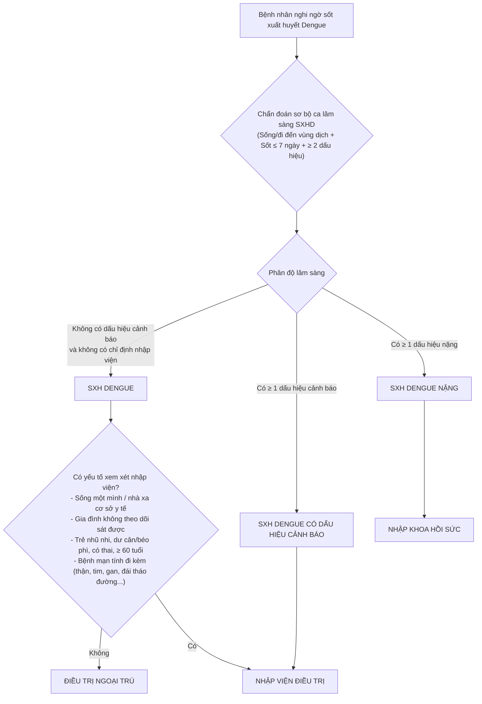
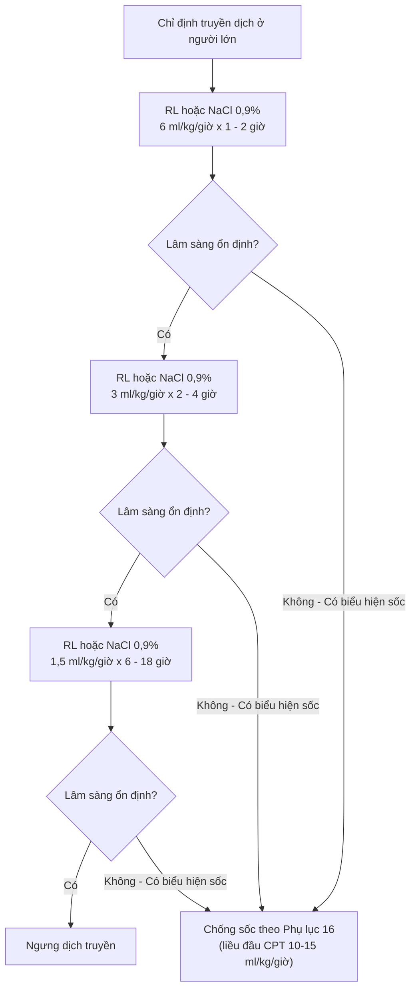
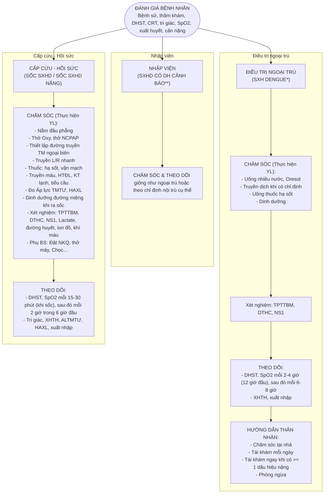
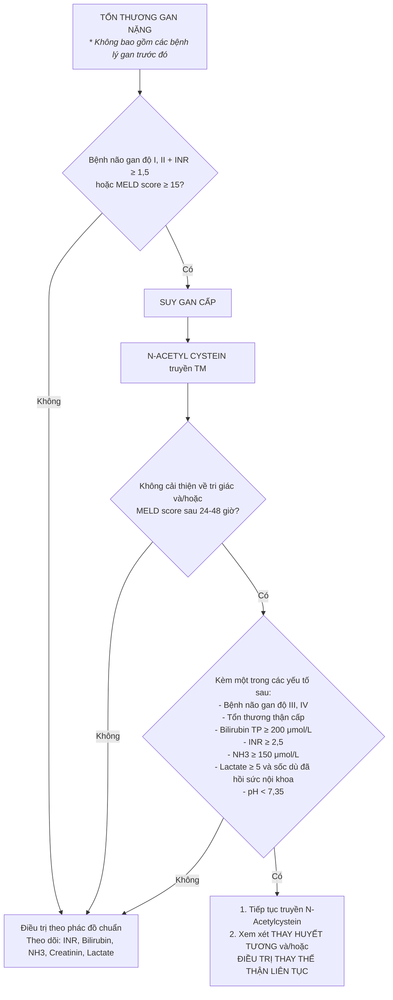

BỘ Y TẾ

Số:          /QĐ-BYT

CỘNG HÒA XÃ HỘI CHỦ NGHĨA VIỆT NAM
Độc lập - Tự do - Hạnh phúc

Hà Nội, ngày        tháng      năm 2023

### QUYẾT ĐỊNH
#### Về việc ban hành Hướng dẫn chẩn đoán, điều trị Sốt xuất huyết Dengue

##### BỘ TRƯỞNG BỘ Y TẾ
- Căn cứ Luật Khám bệnh, chữa bệnh năm 2009;
- Căn cứ Nghị định số 95/2022/NĐ-CP ngày 15 tháng 11 năm 2022 của Chính phủ quy định chức năng, nhiệm vụ, quyền hạn và cơ cấu tổ chức của Bộ Y tế;
- Theo đề nghị của Cục trưởng Cục Quản lý khám, chữa bệnh - Bộ Y tế.

##### QUYẾT ĐỊNH:

**Điều 1.** Ban hành kèm theo Quyết định này “Hướng dẫn chẩn đoán và điều trị Sốt xuất huyết Dengue” thay thế “Hướng dẫn chẩn đoán và điều trị Sốt xuất huyết Dengue” ban hành kèm theo Quyết định số 3705/QĐ-BYT ngày 22/8/2019 của Bộ Y tế.

**Điều 2.** Hướng dẫn chẩn đoán, điều trị Sốt xuất huyết Dengue được áp dụng tại các cơ sở khám bệnh, chữa bệnh trong cả nước.

**Điều 3.** Quyết định này có hiệu lực kể từ ngày ký ban hành.

**Điều 4.** Các ông, bà: Chánh Văn phòng Bộ, Cục trưởng Cục Quản lý Khám, chữa bệnh, Chánh Thanh tra Bộ, các Vụ trưởng, Cục trưởng của các Vụ/Cục thuộc Bộ Y tế; Giám đốc các cơ sở khám bệnh, chữa bệnh trực thuộc Bộ Y tế; Giám đốc Sở Y tế các tỉnh, thành phố trực thuộc Trung ương; Thủ trưởng Y tế các Bộ, ngành; Thủ trưởng các đơn vị có liên quan chịu trách nhiệm thi hành Quyết định này./.

**Nơi nhận:**
- Như Điều 4;
- Bộ trưởng (để báo cáo);
- Các Thứ trưởng (để phối hợp chỉ đạo);
- Lưu: VT, KCB.

**KT. BỘ TRƯỞNG**  
**THỨ TRƯỞNG**  
*(Đã ký)*  
**Trần Văn Thuấn**

---

# HƯỚNG DẪN CHẨN ĐOÁN, ĐIỀU TRỊ SỐT XUẤT HUYẾT DENGUE
*(Ban hành kèm theo Quyết định số          /QĐ-BYT, ngày      tháng    năm 2023 của Bộ trưởng Bộ Y tế)*

Hà Nội, 2023

---

## DANH SÁCH BAN BIÊN SOẠN
## “HƯỚNG DẪN CHẨN ĐOÁN, ĐIỀU TRỊ SỐT XUẤT HUYẾT DENGUE”

**Chỉ đạo biên soạn:**
- GS.TS. Trần Văn Thuấn - Thứ trưởng Bộ Y tế

**Chủ biên:**
- GS.TS. Nguyễn Văn Kính - Phó Chủ tịch thường trực Tổng Hội Y học Việt Nam, nguyên Giám đốc Bệnh viện Bệnh Nhiệt đới Trung ương

**Đồng chủ biên:**
- PGS.TS. Lương Ngọc Khuê - Cục trưởng Cục Quản lý Khám, chữa bệnh

**Tham gia biên soạn:**
- TS. Nguyễn Trọng Khoa - Phó Cục trưởng Cục Quản lý Khám, chữa bệnh
- TS. Vương Ánh Dương - Phó Cục trưởng Cục Quản lý Khám, chữa bệnh
- PGS.TS. Tăng Chí Thượng - Giám đốc Sở Y tế TP. Hồ Chí Minh
- TS. Nguyễn Văn Vĩnh Châu - Phó Giám đốc Sở Y tế TP. Hồ Chí Minh
- PGS.TS. Trần Minh Điển - Giám đốc Bệnh viện Nhi Trung ương
- PGS.TS. Nguyễn Thanh Hùng - Giám đốc Bệnh viện Nhi đồng 1 TP. Hồ Chí Minh
- BSCKII. Nguyễn Thành Dũng - Giám đốc Bệnh viện Bệnh nhiệt đới TP. Hồ Chí Minh
- BSCKII. Trịnh Hữu Tùng - Giám đốc Bệnh viện Nhi đồng 2 TP. Hồ Chí Minh
- GS.TS. Tạ Văn Trầm - Giám đốc Bệnh viện đa khoa Tiền Giang
- TTND.BS. Bạch Văn Cam - Phó Chủ tịch Hội Hồi sức cấp cứu Việt Nam
- BSCKII. Nguyễn Hồng Hà - Phó Chủ tịch Hội Truyền nhiễm Việt Nam
- BSCKII. Nguyễn Minh Tiến - Phó Giám đốc Bệnh viện Nhi đồng Thành phố
- ThS. Nguyễn Trần Nam - Phó Giám đốc Bệnh viện Nhi đồng Thành phố
- TS. Nguyễn Văn Hảo - Nguyên Trưởng khoa Hồi sức cấp cứu người lớn Bệnh viện Bệnh nhiệt đới TP. Hồ Chí Minh, Trưởng Bộ môn Nhiễm Đại học Y dược TP. Hồ Chí Minh
- TS. Nguyễn Minh Tuấn - Trưởng khoa Sốt xuất huyết Bệnh viện Nhi đồng 1
- TS. Nguyễn Văn Lâm - Giám đốc Trung tâm Bệnh nhiệt đới, Bệnh viện Nhi Trung ương
- TS. Phan Tứ Quí - Trưởng khoa Cấp cứu - Hồi sức tích cực - Chống độc Trẻ em, Bệnh viện Bệnh nhiệt đới TP. Hồ Chí Minh
- PGS.TS. Đông Thị Hoài Tâm - Bộ môn Nhiễm Trường Đại học Y dược TP. Hồ Chí Minh
- TS. Tạ Thị Diệu Ngân - Bộ môn Truyền nhiễm Trường Đại học Y Hà Nội
- BSCKII. Phan Vĩnh Thọ - Trưởng khoa Cấp cứu, Bệnh viện Bệnh nhiệt đới TP. Hồ Chí Minh
- TS. Dương Thị Bích Thủy - Nguyên Phó Trưởng khoa Cấp cứu - Hồi sức tích cực - Chống độc Người lớn, Bệnh viện Bệnh nhiệt đới TP. Hồ Chí Minh
- BSCKII. Đỗ Châu Việt - Trưởng khoa Nhiễm Bệnh viện Nhi đồng 2 TP. Hồ Chí Minh
- ThS. Lê Quốc Thịnh - Trưởng khoa Vi sinh Bệnh viện Nhi đồng 1 TP. Hồ Chí Minh
- PGS.TS. Phạm Văn Quang - Trưởng khoa Hồi sức tích cực Bệnh viện Nhi đồng 1 TP. Hồ Chí Minh
- BS. Đinh Tấn Phương - Trưởng khoa Cấp cứu Bệnh viện Nhi đồng 1 TP. Hồ Chí Minh
- PGS.TS. Phùng Nguyễn Thế Nguyên - Trưởng khoa Hồi sức nhiễm Bệnh viện Nhi đồng 1 TP. Hồ Chí Minh
- BSCKII. Cao Đức Phương - Chuyên viên chính phòng Nghiệp vụ - Bảo vệ sức khỏe cán bộ, Cục Quản lý Khám, chữa bệnh
- ThS. Đỗ Thị Huyền Trang - Cục Quản lý Khám, chữa bệnh

---

## MỤC LỤC

- HƯỚNG DẪN CHẨN ĐOÁN, ĐIỀU TRỊ SỐT XUẤT HUYẾT DENGUE ........................................................... 7
- I. ĐẠI CƯƠNG ........................................................................................... 7
- II. DIỄN BIẾN LÂM SÀNG BỆNH SỐT XUẤT HUYẾT DENGUE ....................................................... 7
  - 1. Giai đoạn sốt ......................................................................................... 7
    - 1.1. Lâm sàng ........................................................................................... 7
    - 1.2. Cận lâm sàng ..................................................................................... 7
  - 2. Giai đoạn nguy hiểm .......................................................................... 8
    - 2.1. Lâm sàng ........................................................................................... 8
  - 3. Giai đoạn hồi phục .............................................................................. 9
    - 3.1. Lâm sàng ........................................................................................... 9
    - 3.2. Cận lâm sàng ..................................................................................... 9
- III. CHẨN ĐOÁN VÀ PHÂN ĐỘ ............................................................................................... 9
  - 1. Chẩn đoán căn nguyên vi rút Dengue ................................................ 10
    - 1.1. Xét nghiệm huyết thanh .................................................................. 10
    - 1.2. Xét nghiệm PCR, phân lập vi rút ................................................... 10
  - 2. Chẩn đoán phân biệt ........................................................................... 10
- IV. ĐIỀU TRỊ ........................................................................................... 10
- PHỤ LỤC 1: CÁC GIAI ĐOẠN LÂM SÀNG CỦA SỐT XUẤT HUYẾT DENGUE ............................. 1
- PHỤ LỤC 2: PHÂN ĐỘ SỐT XUẤT HUYẾT DENGUE .................................................................. 1
- PHỤ LỤC 3: SƠ ĐỒ PHÂN NHÓM ĐIỀU TRỊ NGƯỜI BỆNH SỐT XUẤT HUYẾT DENGUE ......... 1
- PHỤ LỤC 4: SƠ ĐỒ XỬ TRÍ SỐT XUẤT HUYẾT DENGUE CÓ DẤU HIỆU CẢNH BÁO Ở TRẺ EM . 2
- PHỤ LỤC 5: SƠ ĐỒ XỬ TRÍ SỐT XUẤT HUYẾT DENGUE CÓ DẤU HIỆU CẢNH BÁO Ở TRẺ THIẾU NIÊN . 3
- PHỤ LỤC 6: SƠ ĐỒ XỬ TRÍ SXHD CÓ DẤU HIỆU CẢNH BÁO Ở NGƯỜI LỚN .......................... 4
- PHỤ LỤC 7: ĐIỀU TRỊ SUY HÔ HẤP CẤP ...................................................................................... 1
- PHỤ LỤC 8: SƠ ĐỒ TRUYỀN DỊCH TRONG SỐC SỐT XUẤT HUYẾT DENGUE Ở TRẺ EM .......... 1
- PHỤ LỤC 9: CÂN NẶNG HIỆU CHỈNH .......................................................................................... 1
- PHỤ LỤC 10: ĐIỀU KIỆN CHUYỂN TỪ CAO PHÂN TỬ SANG DUNG DỊCH ĐIỆN GIẢI VÀ NGƯỢC LẠI . 1
- PHỤ LỤC 11: SƠ ĐỒ XỬ TRÍ SỐC SỐT XUẤT HUYẾT DENGUE Ở TRẺ THIẾU NIÊN 13-16 TUỔI . 1
- PHỤ LỤC 12: SƠ ĐỒ TRUYỀN DỊCH TRONG SỐC SỐT XUẤT HUYẾT DENGUE NẶNG Ở TRẺ EM . 1
- PHỤ LỤC 13: TIÊU CHUẨN HỘI CHẨN .......................................................................................... 2
- PHỤ LỤC 14: MẪU GIẤY TÓM TẮT ĐIỀU TRỊ SỐT XUẤT HUYẾT DENGUE KÈM THEO GIẤY CHUYỂN TUYẾN . 3
- PHỤ LỤC 15: SỬ DỤNG THUỐC VẬN MẠCH TRONG SỐC SỐT XUẤT HUYẾT DENGUE Ở TRẺ EM . 4
- PHỤ LỤC 16.1: SƠ ĐỒ TRUYỀN DỊCH TRONG SỐC SỐT XUẤT HUYẾT DENGUE Ở NGƯỜI LỚN . 1
- PHỤ LỤC 16.2: SƠ ĐỒ TRUYỀN DỊCH TRONG SỐC SỐT XUẤT HUYẾT DENGUE NẶNG Ở NGƯỜI LỚN . 2
- PHỤ LỤC 17: HƯỚNG DẪN XỬ TRÍ SỐC SXHD THỂ XUẤT HUYẾT NẶNG VÀ CHỈ ĐỊNH TRUYỀN MÁU, CHẾ PHẨM MÁU . 1
- PHỤ LỤC 18: LƯU ĐỒ XỬ TRÍ SỐC SXHD KHÔNG ĐÁP ỨNG DỊCH TRUYỀN .......................... 1
- PHỤ LỤC 19: NUÔI DƯỠNG NGƯỜI BỆNH SỐT XUẤT HUYẾT DENGUE ................................. 1
- PHỤ LỤC 20: CÁC DẤU HIỆU CẦN THEO DÕI KHI HỒI SỨC SỐC SỐT XUẤT HUYẾT DENGUE ... 1
- PHỤ LỤC 21: PHÁT HIỆN VÀ XỬ TRÍ SỐT XUẤT HUYẾT DENGUE Ở TUYẾN CƠ SỞ KHI CÓ DỊCH . 2
- PHỤ LỤC 22: HƯỚNG DẪN CHĂM SÓC SỐT XUẤT HUYẾT DENGUE TRẺ EM (< 16 TUỔI) ..... 3
- PHỤ LỤC 23: HƯỚNG DẪN CHĂM SÓC SỐT XUẤT HUYẾT DENGUE NGƯỜI LỚN (≥ 16 TUỔI) ... 1
- PHỤ LỤC 24: LƯU Ý MỘT SỐ QUY TRÌNH KỸ THUẬT TRONG CHĂM SÓC SỐT XUẤT HUYẾT DENGUE . 1
- PHỤ LỤC 25: HƯỚNG DẪN TƯ VẤN BÀ MẸ VỀ SỐT XUẤT HUYẾT DENGUE .......................... 1
- PHỤ LỤC 26: LƯU ĐỒ XỬ TRÍ SUY GAN CẤP Ở BỆNH NHÂN SỐT XUẤT HUYẾT DENGUE NẶNG . 1

---

BỘ Y TẾ

CỘNG HÒA XÃ HỘI CHỦ NGHĨA VIỆT NAM  
Độc lập – Tự do – Hạnh phúc  

# HƯỚNG DẪN CHẨN ĐOÁN, ĐIỀU TRỊ SỐT XUẤT HUYẾT DENGUE
*(Ban hành kèm theo Quyết định số           /QĐ-BYT, ngày     tháng    năm 2023 của Bộ trưởng Bộ Y tế)*

## I. ĐẠI CƯƠNG

**Sốt xuất huyết Dengue** là bệnh truyền nhiễm gây dịch do vi rút Dengue gây nên. Vi rút Dengue có 4 typ huyết thanh là **DEN-1**, **DEN-2**, **DEN-3** và **DEN-4**. Vi rút truyền từ người bệnh sang người lành do muỗi đốt. Muỗi *Aedes aegypti* là côn trùng trung gian truyền bệnh chủ yếu.

Bệnh xảy ra quanh năm, thường gia tăng vào mùa mưa. Bệnh gặp ở cả trẻ em và người lớn. Đặc điểm của sốt xuất huyết Dengue là sốt, xuất huyết và thoát huyết tương, có thể dẫn đến sốc giảm thể tích tuần hoàn, rối loạn đông máu, suy tạng, nếu không được chẩn đoán sớm và xử trí kịp thời dễ dẫn đến tử vong.

## II. DIỄN BIẾN LÂM SÀNG BỆNH SỐT XUẤT HUYẾT DENGUE

Bệnh sốt xuất huyết Dengue có biểu hiện lâm sàng đa dạng, diễn biến nhanh chóng từ nhẹ đến nặng. Bệnh thường khởi phát đột ngột và diễn biến qua ba giai đoạn: **giai đoạn sốt**, **giai đoạn nguy hiểm** và **giai đoạn hồi phục**.

Phát hiện sớm bệnh và hiểu rõ những vấn đề lâm sàng trong từng giai đoạn của bệnh giúp chẩn đoán sớm, điều trị đúng và kịp thời, nhằm cứu sống người bệnh.

### 1. Giai đoạn sốt

#### 1.1. Lâm sàng
- Sốt cao đột ngột, liên tục.
- Nhức đầu, chán ăn, buồn nôn.
- Da xung huyết.
- Đau cơ, đau khớp, nhức hai hố mắt.
- Nghiệm pháp dây thắt dương tính.
- Thường có chấm xuất huyết ở dưới da, chảy máu chân răng hoặc chảy máu mũi.

#### 1.2. Cận lâm sàng
- Hematocrit (Hct) bình thường.
- Số lượng tiểu cầu bình thường hoặc giảm dần (nhưng còn trên 100.000/mm3).
- Số lượng bạch cầu thường giảm.

### 2. Giai đoạn nguy hiểm: thường vào ngày thứ 3 - 7 của bệnh

#### 2.1. Lâm sàng
a) Người bệnh có thể còn sốt hoặc đã giảm sốt.  
b) Có thể có các biểu hiện sau:
- **Đau bụng nhiều**: đau bụng nhiều và liên tục hoặc tăng cảm giác đau nhất là ở vùng gan.
- Vật vã, lừ đừ, li bì.
- **Gan to** > 2cm dưới bờ sườn, có thể đau.
- Nôn ói.
- **Biểu hiện thoát huyết tương** do tăng tính thấm thành mạch (thường kéo dài 24 - 48 giờ):
  + Tràn dịch màng phổi, mô kẽ (có thể gây suy hô hấp), màng bụng, phù nề mi mắt.
  + Nếu thoát huyết tương nhiều sẽ dẫn đến sốc với các biểu hiện vật vã, bứt rứt hoặc li bì, lạnh đầu chi, mạch nhanh nhỏ, huyết áp kẹt (hiệu số huyết áp tối đa và tối thiểu ≤ 20mmHg) hoặc tụt huyết áp, không đo được huyết áp, mạch không bắt được, da lạnh, nổi vân tím (sốc nặng), tiểu ít.
- **Xuất huyết**:
  + **Xuất huyết dưới da**: Nốt xuất huyết rải rác hoặc chấm xuất huyết thường ở mặt trước hai cẳng chân và mặt trong hai cánh tay, bụng, đùi, mạn sườn hoặc mảng bầm tím.
  + **Xuất huyết niêm mạc** như chảy máu chân răng, chảy máu mũi, nôn ra máu, đi ngoài (tiêu) phân đen hoặc máu, xuất huyết âm đạo hoặc tiểu máu.
  + **Xuất huyết nặng**: chảy máu mũi nặng (cần nhét bấc hoặc gạc cầm máu), xuất huyết âm đạo nặng, xuất huyết trong cơ và phần mềm, xuất huyết đường tiêu hóa và nội tạng (phổi, não, gan, lách, thận), thường kèm theo tình trạng sốc, giảm tiểu cầu, thiếu oxy mô và toan chuyển hóa có thể dẫn đến suy đa phủ tạng và đông máu nội mạch nặng. Xuất huyết nặng cũng có thể xảy ra ở người bệnh dùng các thuốc kháng viêm như acetylsalicylic acid (aspirin), ibuprofen hoặc dùng corticoid, tiền sử loét dạ dày - tá tràng, viêm gan mạn.
- Một số trường hợp nặng có thể có biểu hiện **suy tạng** như tổn thương gan nặng/suy gan, thận, tim, phổi, não. Những biểu hiện nặng này có thể xảy ra ở người bệnh có hoặc không có sốc do thoát huyết tương:
  + Tổn thương gan nặng/suy gan cấp, men gan AST, ALT ≥ 1000 U/L.
  + Tổn thương/suy thận cấp.
  + Rối loạn tri giác (sốt xuất huyết Dengue thể não).
  + Viêm cơ tim, suy tim, hoặc suy chức năng các cơ quan khác.

#### 2.2. Cận lâm sàng
- **Cô đặc máu** khi Hematocrit tăng > 20% so với giá trị ban đầu của người bệnh hoặc so với giá trị trung bình của dân số ở cùng lứa tuổi.  
  *Ví dụ: Hct ban đầu là 35%, SXHD có tình trạng cô đặc máu khi Hct hiện tại đo được là 42% (tăng 20% so với ban đầu).*
- **Số lượng tiểu cầu giảm** (< 100.000/mm3).
- AST, ALT thường tăng.
- Trường hợp nặng có thể có rối loạn đông máu.
- Siêu âm hoặc X-quang có thể phát hiện tràn dịch màng bụng, màng phổi.

### 3. Giai đoạn hồi phục: thường vào ngày thứ 7 - 10 của bệnh

#### 3.1. Lâm sàng
- Người bệnh hết sốt, toàn trạng tốt lên, thèm ăn, huyết động ổn định và tiểu nhiều.
- Có thể phát ban hồi phục hoặc ngứa ngoài da.
- Có thể có nhịp tim chậm, không đều, có thể có suy hô hấp do quá tải dịch truyền.

#### 3.2. Cận lâm sàng
- Hematocrit trở về bình thường hoặc có thể thấp hơn do hiện tượng pha loãng máu khi dịch được tái hấp thu trở lại.
- Số lượng bạch cầu máu thường tăng lên sớm sau giai đoạn hạ sốt.
- Số lượng tiểu cầu dần trở về bình thường, muộn hơn so với số lượng bạch cầu.
- AST, ALT có khuynh hướng giảm.

*(Xem Phụ lục 1: Các giai đoạn lâm sàng của sốt xuất huyết Dengue)*

## III. CHẨN ĐOÁN VÀ PHÂN ĐỘ

Bệnh sốt xuất huyết Dengue được chia làm 3 mức độ (theo Tổ chức Y tế Thế giới năm 2009):
- Sốt xuất huyết Dengue.
- Sốt xuất huyết Dengue có dấu hiệu cảnh báo.
- Sốt xuất huyết Dengue nặng.

*(Xem Phụ lục 2: Phân độ sốt xuất huyết Dengue)*

**Lưu ý:** Trong quá trình diễn biến, bệnh có thể chuyển từ mức độ nhẹ sang mức độ nặng, vì vậy khi thăm khám cần phân độ lâm sàng để tiên lượng bệnh và có kế hoạch xử trí thích hợp.

### 1. Chẩn đoán căn nguyên vi rút Dengue

#### 1.1. Xét nghiệm huyết thanh
- **Xét nghiệm nhanh**: tìm kháng nguyên NS1 từ ngày 1 đến ngày 7 của bệnh (ưu tiên trong 5 ngày đầu).
- **Xét nghiệm ELISA hoặc test nhanh**: tìm kháng thể IgM, IgG từ ngày thứ 5 của bệnh nếu NS1 âm tính.

#### 1.2. Xét nghiệm PCR, phân lập vi rút
Lấy máu trong giai đoạn sốt (thực hiện ở các cơ sở xét nghiệm có điều kiện).

### 2. Chẩn đoán phân biệt
- Sốt phát ban do vi rút.
- Tay chân miệng.
- Sốt mò.
- Sốt rét.
- Nhiễm khuẩn huyết do liên cầu lợn, não mô cầu, vi khuẩn gram âm,...
- Sốc nhiễm khuẩn.
- Các bệnh máu.
- Bệnh lý ổ bụng cấp,...

## IV. ĐIỀU TRỊ

### A. Điều trị sốt xuất huyết Dengue

Phần lớn các trường hợp đều được điều trị ngoại trú và theo dõi tại y tế cơ sở, chủ yếu là điều trị triệu chứng và phải theo dõi chặt chẽ phát hiện sớm sốc xảy ra để xử trí kịp thời.

#### * Xem xét chỉ định nhập viện trong các trường hợp sau:
- Sống một mình.
- Nhà xa cơ sở y tế, không thể nhập viện kịp thời khi bệnh trở nặng.
- Gia đình không có khả năng theo dõi sát.
- Trẻ nhũ nhi.
- Dư cân, béo phì.
- Phụ nữ có thai.
- Người lớn tuổi (≥ 60 tuổi).
- Bệnh mạn tính đi kèm (thận, tim, gan, hen, COPD kém kiểm soát, đái tháo đường, thiếu máu tan máu...).

*(Xem Phụ lục 3: Sơ đồ phân nhóm điều trị người bệnh sốt xuất huyết Dengue)*

### 1. Điều trị triệu chứng
- Nếu sốt cao ≥ 38,5°C, cho thuốc hạ nhiệt, nới lỏng quần áo và lau mát bằng nước ấm.
- Thuốc hạ nhiệt chỉ được dùng là **paracetamol đơn chất**, liều dùng từ **10 - 15mg/kg** cân nặng/lần, cách nhau mỗi **4 - 6 giờ**.

#### * Chú ý:

+ Tổng liều **paracetamol** không quá 60mg/kg cân nặng/24 giờ.
+ Không dùng **aspirin** (acetylsalicylic acid), **analgin**, **ibuprofen** để điều trị vì có thể gây xuất huyết, toan máu.

2. **Bù dịch sớm bằng đường uống**: Khuyến khích người bệnh uống nhiều nước **oresol** hoặc nước trái cây (nước dừa, cam, chanh,...) hoặc nước cháo loãng với muối.
   - Không ăn uống những thực phẩm có màu nâu hoặc đỏ như xá xị, sô cô la,...
   - Lượng dịch khuyến cáo: uống theo nhu cầu cơ bản, khuyến khích uống nhiều.

3. **Theo dõi**:
   a) Tái khám và làm xét nghiệm hàng ngày. Nếu xuất hiện dấu hiệu cảnh báo cho nhập viện điều trị.
   b) Người bệnh đến khám lại ngay khi có một trong các dấu hiệu sau:
      - Người bệnh thấy khó chịu hơn mặc dù sốt giảm hoặc hết sốt.
      - Không ăn, uống được.
      - Nôn ói nhiều.
      - Đau bụng nhiều.
      - Tay chân lạnh, ẩm.
      - Mệt lả, bứt rứt.
      - Chảy máu mũi, miệng hoặc xuất huyết âm đạo.
      - Không tiểu trên 6 giờ.
      - Biểu hiện hành vi thay đổi như lú lẫn, tăng kích thích, vật vã hoặc li bì.

## B. Điều trị sốt xuất huyết Dengue có dấu hiệu cảnh báo

### B1. Đối với người bệnh trẻ em (< 16 tuổi)

1. **Điều trị sốt xuất huyết Dengue có dấu hiệu cảnh báo**: Người bệnh được cho nhập viện điều trị.
   1.1. **Điều trị triệu chứng**: hạ sốt.
   1.2. **Bù dịch sớm bằng đường uống** nếu bệnh nhân còn khả năng uống được.
   1.3. **Theo dõi** mạch, HA, những dấu hiệu cảnh báo, lượng dịch đưa vào, nước tiểu và Hct mỗi 4 - 6 giờ.
   1.4. **Chỉ định truyền dịch**:
        a) Khi có ít nhất 1 trong các dấu hiệu sau:
           - Lừ đừ.
           - Không uống được nước.
           - Nôn ói nhiều.
           - Đau bụng nhiều.
           - Có dấu hiệu mất nước.
           - Hct tăng cao.
        b) Dịch truyền bao gồm: **Ringer lactate**, **Ringer acetate**, **NaCl 0,9%**.
   1.5. **Phương thức truyền dịch**:
        - Truyền **Ringer lactate**, **Ringer acetate** hoặc **NaCl 0,9%** 6 - 7ml/kg/giờ trong 1 - 3 giờ, sau đó 5ml/kg/giờ trong 2 - 4 giờ. Theo dõi lâm sàng, Hct mỗi 2 - 4 giờ.
        - Nếu mạch, HA ổn định, Hct giảm, nước tiểu ≥ 0,5 - 1ml/kg/giờ: giảm tốc độ truyền **Ringer lactate**, **Ringer acetate** hoặc **NaCl 0,9%** 3ml/kg/giờ trong 2 - 4 giờ. Nếu lâm sàng tiếp tục cải thiện, có thể ngưng dịch sau 24 - 48 giờ.
        - Nếu mạch nhanh, HA tụt hoặc kẹt, Hct tăng: điều trị toan, xuất huyết, hạ đường huyết, hạ calci huyết nếu có và truyền dịch tiếp tục như sau:
          + Khi tổng dịch truyền > 60ml/kg: chuyển sang **cao phân tử** truyền tĩnh mạch 10 - 20ml/kg/giờ trong 1 giờ. Sau đó tiếp tục truyền dịch theo phác đồ điều trị như sốc SXHD.
          + Khi tổng dịch truyền ≤ 60ml/kg: tăng tốc độ truyền **Ringer lactate**, **Ringer acetate** hoặc **NaCl 0,9%** 10 - 20ml/kg/giờ trong 1 giờ. Sau đó tiếp tục truyền dịch theo phác đồ điều trị như sốc SXHD.

> [!NOTE]
> **Lưu ý:**
> - Nếu SXHD cảnh báo kèm chi lạnh, ẩm, thời gian làm đầy mao mạch ≥ 3 giây, lừ đừ hay vật vã, bứt rứt; huyết áp bình thường hoặc hiệu áp = 25 mmHg: điều trị như sốc SXHD.
> - Nếu SXHD cảnh báo kèm chi lạnh (mát), mạch nhanh, HA bình thường: truyền **Ringer lactate**, **Ringer acetate** hoặc **NaCl 0,9%** 10ml/kg/giờ trong 1 giờ, sau đó đánh giá lại.
>   + Nếu cải thiện lâm sàng, tay chân ấm, mạch chậm lại, HA bình thường: tiếp tục **Ringer lactate**, **Ringer acetate** hoặc **NaCl 0,9%** tốc độ 6 - 7ml/kg/giờ x 1 - 3 giờ sau đó 5ml/kg/giờ x 2 - 4 giờ và xử trí tiếp theo như phác đồ SXHD cảnh báo.
>   + Nếu có sốc: truyền **Ringer lactate**, **Ringer acetate** hoặc **NaCl 0,9%** 20ml/kg/giờ trong 1 giờ và xử trí tiếp sau đó như phác đồ sốc SXHD.
> - Thời gian truyền dịch: thường là không quá 24 - 48 giờ.

- **Phụ lục 4**: Sơ đồ xử trí sốt xuất huyết Dengue có dấu hiệu cảnh báo ở trẻ em.
- **Phụ lục 5**: Sơ đồ xử trí sốt xuất huyết Dengue có dấu hiệu cảnh báo ở trẻ thiếu niên.

### B2. Đối với người bệnh người lớn (≥ 16 tuổi)

1. **Điều trị sốt xuất huyết Dengue có dấu hiệu cảnh báo**: người bệnh được cho nhập viện điều trị.
   1.1. **Điều trị triệu chứng**: hạ sốt.
   1.2. **Bù dịch sớm bằng đường uống** nếu bệnh nhân còn khả năng uống được.
   1.3. **Theo dõi** mạch, HA, những dấu hiệu cảnh báo, lượng dịch đưa vào, nước tiểu và Hct mỗi 4 - 6 giờ.
   1.4. **Chỉ định truyền dịch**: xem xét truyền dịch khi người bệnh nôn nhiều, không uống được và Hct cao hoặc có dấu mất nước.
   1.5. **Phương thức truyền dịch**:
        Truyền **Ringer lactate**, **Ringer acetate** hoặc **NaCl 0,9%** 6ml/kg/giờ trong 1 - 2 giờ, sau đó 3ml/kg/giờ trong 2 - 4 giờ. Theo dõi lâm sàng, Hct mỗi 2 - 4 giờ. Trong quá trình theo dõi:
        - Nếu mạch, HA ổn định, Hct giảm, nước tiểu ≥ 0,5 - 1ml/kg/giờ: giảm tốc độ truyền **Ringer lactate**, **Ringer acetate** hoặc **NaCl 0,9%** 1,5ml/kg/giờ trong 6 - 18 giờ. Nếu lâm sàng tiếp tục cải thiện, có thể ngưng dịch sau 12 - 24 giờ.

- **Phụ lục 6**: Sơ đồ xử trí SXHD có dấu hiệu cảnh báo ở người lớn.

Nếu bệnh nhân có biểu hiện sốc (mạch nhanh, nhẹ, khó bắt, huyết áp kẹt, tụt, khó đo và Hct tăng): truyền dịch chống sốc như phác đồ điều trị sốc SXHD ở người lớn với liều chống sốc đầu tiên là **cao phân tử** 10 - 15ml/kg/giờ. Chú ý điều trị toan hóa máu, xuất huyết, hạ đường huyết, hạ calci huyết nếu có.

## C. Điều trị sốt xuất huyết Dengue nặng: người bệnh phải được nhập viện điều trị cấp cứu.

### C1. Điều trị sốt xuất huyết Dengue nặng trẻ em

#### C1.1. Điều trị sốc sốt xuất huyết Dengue

##### C1.1.1. Chuẩn bị các dịch truyền sau:
- **Ringer lactate**.
- **Ringer acetate** trong trường hợp có tổn thương gan nặng hoặc suy gan cấp.
- Dung dịch mặn đẳng trương (**NaCl 0,9%**).
- Dung dịch cao phân tử (**dextran 40** hoặc **70**, **hydroxyethyl starch** (HES 200.000 dalton)).
- Dung dịch **albumin**.

##### C1.1.2. Thở oxy qua gọng mũi 1 - 6 lít/phút.
Tất cả các người bệnh có sốc cần thở oxy gọng kính.

- **Phụ lục 7**: Điều trị suy hô hấp cấp.

##### C1.1.3. Bù dịch nhanh
- **Phụ lục 8**: Sơ đồ truyền dịch trong sốc sốt xuất huyết Dengue ở trẻ em.

> [!NOTE]
> **Lưu ý:** Đối với trẻ dư cân hoặc béo phì, sử dụng cân nặng hiệu chỉnh để truyền dịch.
> - **Phụ lục 9**: Cân nặng hiệu chỉnh để truyền dịch sốt xuất huyết Dengue ở trẻ em dư cân hoặc béo phì.

Trong 1 giờ đầu, phải thay thế nhanh chóng lượng huyết tương mất đi bằng:
- **Ringer lactate** hoặc **NaCl 0,9%** 20 ml/kg/giờ.
- **Ringer lactate** hoặc **NaCl 0,9%** 20 ml/kg/30 phút trường hợp tụt HA nặng (HATT: trẻ < 10 tuổi < (70 + 2 x tuổi) mmHg, trẻ ≥ 10 tuổi < 90 mmHg).

Sau đó đánh giá lại lâm sàng, Hct:
a) **Nếu cải thiện lâm sàng** (mạch giảm, HA bình thường, hết kẹt):
   - Tiếp tục truyền **Ringer lactate** hoặc **NaCl 0,9%** tốc độ 10ml/kg/giờ x 1 - 2 giờ. Nếu người bệnh cải thiện lâm sàng và hematocrit giảm, giảm tốc độ **Ringer lactate** hoặc **NaCl 0,9%** 7,5ml/kg/giờ trong 1 - 2 giờ, sau đó 5ml/kg/giờ x 3 - 4 giờ, tiếp theo giảm còn 3ml/kg/giờ x 4 - 6 giờ.
   - Nếu bệnh nhân sau đó ra sốc (mạch bình thường, HA bình thường, nước tiểu ≥ 0,5ml/kg/giờ) và hematocrit bình thường, có thể xem xét ngưng dịch truyền sau 24 - 48 giờ.

b) **Nếu không cải thiện lâm sàng** (mạch nhanh, nhẹ, HA còn tụt, kẹt hiệu áp < 20mmHg):
   b.1) **Nếu hematocrit còn tăng cao hoặc ≥ 40%**:
        - Chuyển sang truyền **cao phân tử** (CPT) 10 - 20ml/kg/giờ trong 1 giờ. Cao phân tử được chọn trong SXHD là **Dextran 40**, **Dextran 70** hoặc **6% HES 200**. Tác dụng phụ của HES là rối loạn đông máu, tổn thương gan, thận đặc biệt là khi tổng liều > 60ml/kg.
        - Trường hợp không có Dextran 40, Dextran 70 hoặc 6% HES 200, có thể thay thế bằng dung dịch **6% HES 130** hoặc **Gelatin**, nhưng cần theo dõi sát đáp ứng điều trị (cải thiện lâm sàng, Hct) vì khả năng tăng thể tích ít và thời gian lưu trong lòng mạch ngắn. Nếu diễn tiến lâm sàng không thuận lợi hoặc không giảm được tốc độ cao phân tử đến liều 5ml/kg/giờ, Hct tăng cao, cần hội chẩn, xét nghiệm Albumin máu và xem xét chỉ định truyền dung dịch **Albumin** (trang 10).
        - Nếu cải thiện lâm sàng, hematocrit giảm: giảm tốc độ CPT dần 10ml/kg/giờ x 1 giờ, sau đó 7,5ml/kg/giờ x 1 - 2 giờ, tiếp đến là 5ml/kg/giờ x 1 - 2 giờ. Đánh giá lâm sàng, Hct sau mỗi lần chuyển tốc độ truyền.
          + Nếu ra sốc và Hct bình thường: chuyển sang điện giải **Ringer lactate** hay **NaCl 0,9%** 5ml/kg/giờ trong 3 - 4 giờ, sau đó 3ml/kg/giờ x 4 - 6 giờ. Phải theo dõi sát dấu hiệu sinh tồn mỗi giờ và lập lại hematocrit sau 1 giờ trong 2 giờ đầu, sau đó là mỗi 4 - 6 giờ. Có thể xem xét ngưng dịch truyền sau 24 - 48 giờ.
          + Nếu không cải thiện lâm sàng, mạch nhanh, HA còn tụt hoặc kẹt: lặp lại truyền CPT 10 - 20ml/kg/giờ trong 1 giờ. Nếu chưa có catheter động mạch nên xét nghiệm khí máu tĩnh mạch để xác định toan máu dựa vào pH và HCO3- và xét nghiệm đường huyết, điện giải đồ, lactate máu. Điều trị toan, xuất huyết, hạ đường huyết, hạ Calci huyết nếu có. Đo HA động mạch xâm lấn (động mạch cổ tay), đo áp lực tĩnh mạch trung tâm (CVP) và xử trí như sốc SXHD nặng.

###### Đo áp lực tĩnh mạch trung tâm (CVP)
*   **Vị trí**: Tĩnh mạch được chọn đo CVP trong SXHD là tĩnh mạch nền ở khuỷu tay (không dùng tĩnh mạch cảnh trong, tĩnh mạch dưới đòn do nguy cơ xuất huyết) bằng phương pháp Seldinger cải tiến dưới hướng dẫn siêu âm để tăng tỉ lệ thành công, ít biến chứng, hoặc sử dụng kỹ thuật bộc lộ tĩnh mạch để đặt CVP.
*   **Phương pháp đo**: Có thể qua cột nước hoặc monitor. Nếu có điều kiện, nên đo CVP qua monitor để theo dõi liên tục.
*   **Chỉ định đo CVP**:
    + Quá tải, nghi ngờ quá tải.
    + Sốc kéo dài, sốc không đáp ứng với bù dịch ≥ 60ml/kg cân nặng.
    + Tái sốc.
    + Sốc kèm bệnh lý tim, phổi, thận.
    + Sốc ở trẻ nhũ nhi, béo phì.
*   **Phân tích kết quả CVP**:
    + Thấp khi CVP ≤ 5cmH2O, cao khi CVP ≥ 15cmH2O.
    + Xử trí luôn phải kết hợp giữa lâm sàng, hematocrit và CVP.
*   Khi có tĩnh mạch trung tâm nên xét nghiệm **ScvO2** để đánh giá sử dụng O2. Trị số ScvO2 bình thường là ≥ 70%.
*   Nếu không đo được CVP thì dùng siêu âm khảo sát sự thay đổi đường kính của tĩnh mạch chủ dưới theo nhịp thở để giúp đánh giá thể tích dịch nội mạch.
    - Nếu đường kính của tĩnh mạch chủ dưới nhỏ và xẹp cả 2 thì hô hấp là thiếu dịch.
    - Nếu đường kính của tĩnh mạch chủ dưới to và căng cả 2 thì hô hấp là dư dịch.

   b.2) **Nếu hematocrit ≤ 35% hoặc giảm 20% so với ban đầu**:
        - Cần phải thăm khám để phát hiện xuất huyết nội và truyền máu, tốt nhất là truyền hồng cầu lắng 5ml/kg hoặc máu toàn phần 10ml/kg, tốc độ truyền tùy tình trạng chảy máu và hematocrit, thường trong 1 - 2 giờ, song song đó truyền CPT 10ml/kg/giờ. Xem xét truyền huyết tương đông lạnh để cầm máu (xem phần điều trị xuất huyết nặng). Sau 1 giờ, đánh giá lại tình trạng lâm sàng, hematocrit.
        - Nếu cải thiện lâm sàng, hematocrit > 35%:
          + Tiếp tục giảm dần CPT 7,5ml/kg/giờ x 1 - 2 giờ, sau đó 5ml/kg/giờ x 1 - 2 giờ. Sau đó đánh giá lại tình trạng lâm sàng, hematocrit.
          + Nếu ra sốc (tỉnh táo, tay chân ấm, thời gian đổ đầy mao mạch < 2 giây, mạch và huyết áp bình thường theo tuổi, nước tiểu ≥ 0,5 - 1ml/kg/giờ, Hematocrit bình thường và CVP 10 - 15cmH2O, ScvO2 ≥ 70%, Lactate máu bình thường < 2mmol/L, khí máu pH và HCO3- bình thường nếu có): chuyển sang điện giải **Ringer lactate** hay **NaCl 0,9%** 5ml/kg/giờ trong 3 - 4 giờ, sau đó 3ml/kg/giờ x 4 - 6 giờ, có thể xem xét ngưng dịch truyền sau 24 - 48 giờ.
          - **Phụ lục 10**: Điều kiện chuyển từ dung dịch CPT sang dung dịch điện giải và ngược lại.
          + Nếu còn sốc, lặp lại truyền CPT 10 - 20ml/kg/giờ trong 1 giờ, đo HA động mạch xâm lấn, áp lực tĩnh mạch trung tâm và xử trí như sốc SXHD nặng.
        - Nếu không cải thiện lâm sàng, mạch nhanh, HA còn tụt hoặc kẹt, hematocrit còn tăng cao: lặp lại truyền CPT 10 - 20ml/kg/giờ trong 1 giờ, điều trị toan, xuất huyết, hạ đường huyết, hạ Calci huyết nếu có. Đo HA động mạch xâm lấn, áp lực tĩnh mạch trung tâm và xử trí như sốc SXHD nặng.

*   **Sốc SXH Dengue ở trẻ thiếu niên 13 - 16 tuổi**:
    - Trẻ thiếu niên có đặc điểm sinh lý giống với người lớn, có tình trạng thất thoát huyết tương ít hơn trẻ em nên lượng dịch truyền có thể ít hơn nhằm tránh tình trạng quá tải dịch.
    - Sử dụng cân nặng theo hướng dẫn của Bộ Y tế cho trẻ béo phì.
    - Trong 1 giờ đầu, truyền **Ringer lactate** hoặc **NaCl 0,9%** 20ml/kg/giờ sau đó đánh giá lại lâm sàng, Hct.
      + Nếu cải thiện về lâm sàng và hematocrit: giảm dịch như phác đồ dành cho trẻ em với thời gian duy trì ở mỗi mức dịch bằng 1/2 trẻ nhỏ; sau đó duy trì 1,5 ml/kg/giờ trong 12 - 18 giờ.
      + Nếu không cải thiện lâm sàng and hematocrit còn cao hoặc ≥ 40%: chuyển sang dung dịch cao phân tử với tốc độ như trẻ em, nhưng thời gian giảm 1/2 so với trẻ em.
      + Nếu không cải thiện lâm sàng và hematocrit < 35% hay giảm 20% so với ban đầu: điều trị như trẻ em.
    - **Phụ lục 11**: Sơ đồ xử trí sốc SXHD ở trẻ thiếu niên 13 - 16 tuổi.

*   **Sốt SXH Dengue ở trẻ mắc thalassemia**:
    - So với trẻ bình thường bị SXHD, bệnh nhân thalassemia khi bị SXHD:
      + Có Hct nền thấp, vì thế cô đặc máu khi Hct tăng 20% so với Hct nền.
      + Tổn thương cơ tim, suy tim, gan nhiều hơn.
      + Sốc SXHD ở trẻ thalassemia thường nặng.
    - Điều trị SXHD ở bệnh nhân thalassemia:
      + SXHD, SXHD có dấu hiệu cảnh báo: truyền máu sớm, duy trì Hct 25% đến 30% và sử dụng dung dịch **Natri chlorua 0,9%**, **Ringer acetate** khi có chỉ định do thường có tổn thương gan.
      + Sốc SXHD:
        * Lựa chọn ban đầu là **Natri chlorua 0,9%**, **Ringer acetate**.
        * Trường hợp sốc nặng: tốc độ dịch chống sốc ban đầu là 15 - 20ml/kg/15 - 30 phút và theo dõi sát tình trạng quá tải, suy hô hấp.
        * Truyền máu sớm khi Hct dưới 30% sau khi bù dịch chống sốc.
        * Đo CVP, huyết áp xâm lấn, siêu âm bụng, tim, phổi, X-quang phổi, khí máu động mạch, ion đồ, men tim, chức năng gan, thận, chức năng đông máu, đo cung lượng tim (nếu có).
        * Xem xét thuốc vận mạch khi bù đủ dịch mà huyết áp còn thấp.

*   **Đối với nhũ nhi ≤ 12 tháng tuổi**:
    - Phát hiện sốc thường trễ do ít nghĩ đến chẩn đoán SXHD và khó đo huyết áp.
    - Hematocrit bình thường có thể ở mức thấp (30 - 35%) do có thiếu máu sinh lý.
    - Chú ý lượng dịch và tốc độ dịch truyền để tránh nguy cơ dư dịch, suy hô hấp.
    - Do ở trẻ nhũ nhi rất khó đo áp lực tĩnh mạch trung tâm nên xem xét dùng siêu âm khảo sát sự thay đổi đường kính của tĩnh mạch chủ dưới theo nhịp thở để giúp đánh giá thể tích dịch nội mạch thay cho CVP.

#### C1.2. Điều trị sốc sốt xuất huyết Dengue nặng
Trường hợp người bệnh vào viện trong tình trạng sốc nặng (mạch quay không bắt được, huyết áp không đo được (HA=0)) hoặc tụt huyết áp nặng (HA tâm thu < 70mmHg ở trẻ > 1 tuổi) hoặc hiệu áp ≤ 10mmHg thì phải xử trí rất khẩn trương.
- Để người bệnh nằm đầu thấp.
- Thở oxy.
- Truyền dịch nhanh: dùng bơm tiêm to bơm trực tiếp vào tĩnh mạch **Ringer lactate** hoặc **NaCl 0,9%** với tốc độ 20ml/kg cân nặng trong vòng 15 phút.

- **Phụ lục 12**: Sơ đồ truyền dịch trong sốc sốt xuất huyết Dengue nặng ở trẻ em.

> [!NOTE]
> **Lưu ý:** Đối với trẻ dư cân hoặc béo phì, sử dụng cân nặng hiệu chỉnh để truyền dịch (**Phụ lục 9**: Cân nặng hiệu chỉnh để truyền dịch sốt xuất huyết Dengue ở trẻ em dư cân hoặc béo phì).

Sau đó đánh giá lại mạch và huyết áp người bệnh, có 3 khả năng xảy ra:
a) **Nếu mạch rõ, huyết áp bình thường hết kẹt**: cho dung dịch CPT 10ml/kg cân nặng/giờ trong 1 giờ. Sau đó nếu cải thiện lâm sàng và Hct giảm ≤ 10% so với ban đầu thì giảm tốc độ truyền CPT 7,5ml/kg/giờ trong 1 - 2 giờ, sau đó 5ml/kg/giờ trong 1 - 2 giờ. Sau đó nếu ra sốc và Hct bình thường sẽ chuyển sang truyền dung dịch điện giải **Ringer lactate** hoặc **NaCl 0,9%** 5ml/kg/giờ trong 2 - 4 giờ, tiếp đến là 2 - 3ml/kg/giờ trong 24 - 36 giờ. Xem xét ngưng dịch sau 24 - 48 giờ nếu mạch, huyết áp, Hct bình thường hoặc nước tiểu ≥ 0,5ml/kg/giờ.

b) **Nếu mạch nhanh, huyết áp còn kẹt hoặc huyết áp hạ**: truyền dung dịch CPT 15 - 20ml/kg cân nặng/giờ, có 2 khả năng xảy ra:
   b.1) Nếu cải thiện lâm sàng thì xử trí theo (a).
   b.2) Nếu không cải thiện lâm sàng, kiểm tra Hct:
        *   **Nếu Hct cao hay > 40%**: truyền CPT 10 - 20ml/kg/giờ.
            - Nếu cải thiện lâm sàng thì xử trí theo (a).
            - Nếu còn sốc (sốc thất bại bù dịch):
              + Hội chẩn khoa, hội chẩn bệnh viện hoặc hội chẩn tuyến trên.
              + Điều trị toan, xuất huyết, hạ đường huyết, hạ Calci máu nếu có.
              + Xem xét đặt nội khí quản giúp thở.
              + Xét nghiệm Hct, đo áp lực tĩnh mạch trung tâm (CVP), đo HA động mạch xâm lấn và đánh giá chức năng tim nếu được.
              - **Phụ lục 13**: Tiêu chuẩn hội chẩn.
              - **Phụ lục 14**: Mẫu giấy tóm tắt kèm theo giấy chuyển tuyến trong sốc sốt xuất huyết Dengue.

        *   **Sau đó có 3 khả năng xảy ra**:
            + **CVP ≤ 15cmH2O**: truyền CPT 10 - 20ml/kg/giờ, hoặc chỉ định truyền dung dịch **Albumin** khi tổng lượng CPT ≥ 60ml/kg và đang chống sốc CPT ≥ 5 - 10ml/kg/giờ kèm Albumin < 2,5g/dL hoặc người bệnh suy gan nặng, suy thận, ARDS. Nồng độ dung dịch Albumin: 5% hoặc 10%. Nên dùng dung dịch **Albumin 10%** trong trường hợp sốc nặng kèm Albumin máu rất thấp dưới 1 g/dL.
              
              Hiệu quả của truyền phối hợp: giảm tổng lượng và tốc độ truyền cao phân tử, tăng áp lực keo, giảm tác dụng không mong muốn của cao phân tử.
              
              *   *Cách pha nồng độ Albumin 5%*: 1 lọ Albumin 20% 50ml + 150ml Normal saline = 200ml Albumin 5%.
              *   *Cách pha nồng độ Albumin 10%*: 1 lọ Albumin 20% 50ml + 50ml Normal saline = 100ml Albumin 10%.
              *   *Liều Albumin (g)* = [nồng độ Albumin cần đạt (g/dl) - nồng độ Albumin hiện tại (g/dl)] x thể tích huyết tương (0,8 x cân nặng (kg)).
              
              Chỉ nên truyền dung dịch Albumin phối hợp với cao phân tử khi huyết động học không ổn định. Hạn chế phối hợp Albumin và cao phân tử trong trường hợp suy gan, suy thận.
              Tốc độ truyền Albumin 5 - 20ml/kg/giờ tùy thuộc theo tình trạng huyết động học của bệnh nhân. Trường hợp truyền phối hợp Albumin với cao phân tử thì tổng tốc độ dịch nên ≤ 20ml/kg/giờ, nhất là khi sử dụng Albumin 10% để tránh quá tải.
              Đánh giá lâm sàng, Hct, Albumin máu sau truyền Albumin mỗi 4 - 6 giờ. Có thể lập lại truyền Albumin nếu nồng độ Albumin máu thấp < 2,5 g/dl và bệnh nhân vẫn còn thất thoát dịch.
            + **CVP > 15cmH2O, Hct cao kèm sức co bóp cơ tim bình thường**: thử dịch truyền với CPT 5 - 10ml/kg/giờ. Sau đó nếu cải thiện sẽ truyền CPT 5ml/kg/giờ. Nếu có dấu hiệu quá tải, ngưng dịch và cho thuốc tăng co cơ tim **Dobutamin** liều 3 - 10µg/kg/phút.
            + **CVP > 15cmH2O kèm sức co cơ tim giảm**: truyền Dopamin liều 5 - 10
... µg/kg/phút có thể kết hợp truyền CPT. Nếu có dấu hiệu quá tải, ngưng dịch và cho thuốc tăng co cơ tim Dobutamin liều 3 - 10 µg/kg/phút. Nếu còn sốc kèm giảm sức co cơ tim thì phối hợp thêm Adrenaline liều 0,05 - 0,3 µg/kg/phút hoặc phối hợp Noradrenaline liều 0,05 - 1 µg/kg/phút trong trường hợp giảm kháng lực mạch máu. Điều trị toan, hạ Calci nếu có.

**Phụ lục 15: Sử dụng thuốc vận mạch trong sốc SXHD**

* **Nếu Hct thấp (< 35%) hoặc giảm > 20% so với ban đầu:**
  - Cần phải thăm khám để phát hiện xuất huyết nội và truyền máu, tốt nhất là truyền hồng cầu lắng (HCL) 5 ml/kg hoặc máu toàn phần 10 ml/kg. Tốc độ truyền tùy tình trạng chảy máu và hematocrit, thường trong 1 - 2 giờ, song song đó truyền CPT 10 ml/kg/giờ. Xem xét truyền huyết tương đông lạnh để cầm máu (xem phần điều trị xuất huyết nặng). Sau 1 giờ, nếu cải thiện lâm sàng và Hct thì xử trí theo (a).
  - Nếu mạch, huyết áp vẫn không đo được: bơm tĩnh mạch trực tiếp dung dịch cao phân tử 20 ml/kg cân nặng/15 phút. Nên đo CVP để có phương hướng xử trí. Sau đó nếu đo được huyết áp và mạch rõ, thì xử trí theo (a). Nếu không cải thiện thì xử trí theo (b.2).

* **Những lưu ý khi truyền dịch:**
  - Ngừng truyền dịch tĩnh mạch khi huyết áp và mạch trở về bình thường, tiểu nhiều. Nói chung không cần thiết bù dịch sau khi hết sốc 24 giờ.
  - Cần chú ý đến sự tái hấp thu huyết tương từ ngoài lòng mạch trở lại lòng mạch (biểu hiện bằng huyết áp, mạch bình thường và hematocrit giảm), cần theo dõi triệu chứng phù phổi cấp nếu còn tiếp tục truyền dịch. Khi có hiện tượng bù dịch quá tải gây suy tim hoặc phù phổi cấp cần phải dùng thuốc lợi tiểu như furosemide 0,5 - 1 mg/kg cân nặng/lần (tĩnh mạch). Trong trường hợp sau khi sốc hồi phục mà huyết áp kẹt nhưng chi ấm mạch chậm, rõ, tiểu nhiều thì không truyền dịch, nhưng vẫn lưu kim tĩnh mạch, theo dõi tại phòng cấp cứu.

* **Tiêu chuẩn ngưng truyền dịch:**
  - Lâm sàng ổn định, chi ấm, mạch rõ, HA ổn định, tiểu khá.
  - Hct ổn định.
  - Thời điểm ngưng truyền dịch thường 24 giờ sau khi hết sốc và bệnh nhân có các dấu hiệu của giai đoạn hồi phục, thường là sau ngày 6 - 7. Tổng dịch truyền thường 120 - 150 ml/kg trong trường hợp sốc SXHD. Trường hợp sốc SXHD nặng, thời gian truyền dịch và thể tích dịch truyền có thể nhiều hơn.
  - Ngưng dịch truyền khi có dấu hiệu quá tải hoặc dọa phù phổi.
  - Đối với người bệnh đến trong tình trạng sốc, đã được chống sốc từ tuyến trước thì điều trị như một trường hợp không cải thiện (tái sốc), cần lưu ý đến số lượng dịch đã được truyền từ tuyến trước để tính toán lượng dịch sắp đưa vào.
  - Nếu diễn tiến không thuận lợi, nên tiến hành:
    - Đo CVP để bù dịch theo CVP hoặc dùng vận mạch nếu CVP cao.
    - Theo dõi sát mạch, huyết áp, nhịp thở, da, niêm mạc, tìm xuất huyết nội để chỉ định truyền máu kịp thời.
    - Thận trọng khi tiến hành thủ thuật tại các vị trí khó cầm máu như tĩnh mạch cổ, tĩnh mạch dưới đòn, động mạch bẹn, đùi.
  - Nếu huyết áp kẹt, nhất là sau một thời gian đã trở lại bình thường cần phân biệt các nguyên nhân sau:
    - Hạ đường huyết.
    - Tái sốc do không bù đắp đủ lượng dịch tiếp tục thoát mạch.
    - Xuất huyết nội.
    - Quá tải do truyền dịch hoặc do tái hấp thu.
  - Khi điều trị sốc, cần phải chú ý đến điều chỉnh rối loạn điện giải và thăng bằng kiềm toan: hạ natri máu thường xảy ra ở hầu hết các trường hợp sốc nặng kéo dài và đôi khi có toan chuyển hoá. Do đó cần phải xác định mức độ rối loạn điện giải và nếu có điều kiện thì đo các khí trong máu ở người bệnh sốc nặng và người bệnh sốc không đáp ứng nhanh chóng với điều trị.

### C.1.3. Điều trị xuất huyết nặng

- Nhịn ăn uống.
- Tránh đặt sonde dạ dày ngoại trừ xuất huyết tiêu hóa ồ ạt thì nên đặt qua đường miệng.
- Vitamin K1 tĩnh mạch liều 1 mg/kg/ngày, tối đa 20 mg/ngày.
- Omeprazol 1 mg/kg truyền tĩnh mạch hoặc các thuốc ức chế bơm Proton khác (PPI): Pantoprazol, Esomeprazol nếu nghi viêm loét dạ dày.
- Truyền máu và chế phẩm máu.

#### a) Truyền máu
- Khi người bệnh có sốc nghi mất máu cần phải tiến hành xác định nhóm máu để truyền máu khi cần.
- **Chỉ định truyền máu:**
  - Hct ≤ 35% kèm sốc thất bại hoặc đáp ứng kém với bù dịch ≥ 40 ml/kg.
  - Hct giảm nhanh > 20% kèm sốc thất bại hoặc đáp ứng kém với bù dịch.
  - Hct ≤ 40% kèm đang xuất huyết ồ ạt.
- Truyền hồng cầu lắng hoặc máu toàn phần trong đó ưu tiên hồng cầu lắng.
  - Hồng cầu lắng 5 - 10 ml/kg, hoặc
  - Máu toàn phần (mới lấy < 7 ngày) 10 - 20 ml/kg.

#### b) Truyền huyết tương tươi đông lạnh
- **Chỉ định truyền huyết tương tươi đông lạnh:** rối loạn đông máu nặng (PT > 2 lần bình thường hoặc INR > 1,5) kèm ít nhất 1 tiêu chuẩn:
  - Đang xuất huyết nặng.
  - Có chỉ định chọc màng phổi, màng bụng.
  - Truyền máu khối lượng lớn (≥ 1/2 thể tích máu).
- **Liều:** 10 - 20 ml/kg/2 - 4 giờ.

#### c) Truyền kết tủa lạnh
- **Chỉ định truyền kết tủa lạnh:** đang xuất huyết nặng kèm Fibrinogen < 1 g/L.
- **Liều:** 1 túi/6 kg (1 túi chứa 150 mg Fibrinogen).

#### d) Truyền tiểu cầu
- **Chỉ định truyền tiểu cầu:**
  - Tiểu cầu < 5.000/mm³ (xem xét tùy từng trường hợp).
  - Tiểu cầu < 50.000/mm³ kèm đang xuất huyết nặng hoặc có chỉ định chọc màng phổi, màng bụng.
- **Liều:** 1 đơn vị tiểu cầu đậm đặc/5 kg hoặc 1 đơn vị tiểu cầu chiết tách/10 kg truyền trong 1 - 2 giờ.

### C.1.4. Điều trị toan chuyển hóa, hạ đường huyết, hạ Calci huyết, hạ Natri máu

- **Toan chuyển hóa** (pH < 7,35 và/hoặc HCO3- < 17): Natri bicarbonate 4,2% 2 ml/kg tĩnh mạch chậm.
- **Hạ đường huyết** (đường huyết < 40 mg/dl): Dextrose 30% 1 - 2 ml/kg tĩnh mạch chậm.
- **Hạ Calci huyết** (Calci ion hóa < 1 mmol/L): Calci clorua 10% 0,1 - 0,2 ml/kg (tối đa 2 - 5 ml/liều), pha loãng trong Dextrose 5% 10 - 20 ml tĩnh mạch chậm 5 - 10 phút.
- **Hạ Natri máu nặng kèm rối loạn tri giác** (Natri máu < 125 mEq/l): Natri clorua 3% 4 ml/kg truyền tĩnh mạch trong 30 phút, lặp lại khi cần.

### C.1.5. Điều trị suy tạng nặng

#### a) Tổn thương gan, suy gan cấp

**Phân độ tổn thương gan cấp trong SXHD:**

| Phân độ | AST, ALT (U/L) | Bệnh lý não gan |
| :--- | :--- | :--- |
| **Nhẹ** | 120 - < 400 | Không |
| **Trung bình** | 400 - < 1000 | Không |
| **Nặng hoặc suy gan cấp** | ≥ 1000 | Có hoặc không |

**Điều trị tổn thương gan cấp trung bình:**
- Nhập viện điều trị.
- Tránh dùng các thuốc hại gan.
- Truyền dịch nếu có chỉ định:
  - Tránh dùng dung dịch Ringer lactate, paracetamol trong trường hợp tổn thương gan mức độ trung bình, nặng.
  - Dung dịch được chọn: NaCl 0,9% hoặc Ringer acetate, Dextrosaline. Hạn chế dùng dung dịch HES.

**Điều trị tổn thương gan nặng, suy gan cấp:**
*(Điều trị tương tự tổn thương gan trung bình kèm)*
- Hỗ trợ hô hấp khi cần.
- Điều trị hạ đường huyết nếu có.
- Hạn chế dịch 2/3 - 3/4 nhu cầu.
- Điều trị rối loạn điện giải nếu có.
- Vitamin K1 1 mg/kg tĩnh mạch chậm, tối đa 20 mg/ngày.
- Điều trị rối loạn đông máu: truyền huyết tương đông lạnh.
- Kháng sinh khi nghi ngờ nhiễm khuẩn.

**Trong bệnh lý não gan:**
- Xem xét truyền tĩnh mạch N-acetylcystein khi suy gan cấp nếu có điều kiện:
  - **Tấn công**: 150 mg/kg truyền tĩnh mạch (TTM) trong 1 giờ.
  - **Duy trì**: 50 mg/kg TTM in 4 giờ, sau đó 100 mg/kg TTM trong 16 giờ. Sau đó tiếp tục TTM 6,25 mg/kg/giờ trong 48 - 72 giờ.
- Lactulose.
- Thụt tháo.
- Lọc máu liên tục CVVHDF khi suy đa cơ quan hoặc thất bại điều trị nội khoa.
- Thay huyết tương (ưu tiên thể tích cao) khi thất bại với lọc máu liên tục hoặc tổn thương gan nặng, diễn tiến nhanh.
- Điều trị tăng áp lực nội sọ (nếu có): Mannitol 20% liều 0,5 g/kg/lần TTM nhanh 30 phút, lặp lại mỗi 8 giờ, có thể phối hợp xen kẽ Natri clorua 3% 4 ml/kg/30 phút, lặp lại mỗi 8 giờ.

*Lưu ý:* Điều trị hỗ trợ tổn thương gan cần lưu ý chống sốc tích cực nếu có, hô hấp hỗ trợ sớm nếu sốc không cải thiện, theo dõi điện giải đồ, đường huyết nhanh, khí máu động mạch, amoniac máu, lactate máu, đông máu toàn bộ mỗi 4 - 6 giờ để điều chỉnh kịp thời các bất thường nếu có.

#### b) Tổn thương thận cấp

**Chẩn đoán tổn thương thận cấp:**
- Tiểu ít < 0,5 ml/kg/giờ, và
- Creatinine máu tăng ≥ 1,5 - 2 lần trị số bình thường hoặc độ thanh thải Creatinine (eCrCl) giảm ≥ 50%.

**Điều trị:**
- **Chống sốc:** dịch truyền, vận mạch, hạn chế dùng HES, xem xét chỉ định dùng Albumin.
- **Điều trị bảo tồn tổn thương thận:** hạn chế dịch nhập, tránh thuốc tổn thương thận.
- Theo dõi cân nặng và cân bằng dịch xuất - nhập.
- Xem xét chọc dẫn lưu ổ bụng khi có tăng áp lực ổ bụng nặng (áp lực bàng quang > 27 cmH2O).
- **Thận nhân tạo** (lọc máu chu kỳ) khi suy thận cấp kèm quá tải hoặc hội chứng ure huyết, toan chuyển hóa nặng, tăng kali máu thất bại điều trị nội khoa ở bệnh nhân huyết động ổn định.
- **Lọc máu liên tục** khi suy thận cấp hoặc tổn thương đa cơ quan ở bệnh nhân huyết động không ổn định.

#### c) Sốt xuất huyết Dengue thể não

**Chẩn đoán:** Rối loạn tri giác, co giật hoặc có dấu thần kinh khu trú, loại trừ các nguyên nhân khác: hạ đường huyết, rối loạn điện giải, kiềm toan, giảm oxy máu nặng, xuất huyết não, màng não, viêm não, màng não do nguyên nhân khác.

**Điều trị:**
- Đầu cao 30°.
- Thở oxy.
- **Chống co giật** (nếu có): Diazepam 0,2 mg/kg tĩnh mạch chậm, có thể bơm qua đường hậu môn 0,5 mg/kg khi không tiêm tĩnh mạch được. Nếu không hiệu quả lặp lại liều thứ 2 sau 10 phút, tối đa 3 liều. Nếu thất bại, thêm Phenobarbital 10 - 20 mg/kg TTM trong 15 - 30 phút.
- **Điều trị hạ đường huyết** (nếu có): Dextrose 30% 1 - 2 ml/kg (trẻ < 1 tuổi: Dextrose 10% 2 ml/kg).
- Điều chỉnh rối loạn điện giải - toan kiềm.
- **Chống phù não** (chỉ định khi lâm sàng bệnh nhân có dấu hiệu tăng áp lực nội sọ): phản xạ mắt búp bê, dấu hiệu mất vỏ (tay co chân duỗi) hoặc mất não (duỗi tứ chi), đồng tử dãn một hoặc hai bên, phù gai thị, thở Cheyne-Stokes hay cơn ngừng thở hoặc tam chứng Cushing (mạch chậm, huyết áp cao, nhịp thở bất thường).
- **Điều trị tăng áp lực nội sọ:** Mannitol 20% liều 0,5 g/kg/lần TTM nhanh 30 phút, lặp lại mỗi 8 giờ, có thể phối hợp xen kẽ Natri clorua 3% 4 ml/kg/30 phút, lặp lại mỗi 8 giờ.
- Đặt nội khí quản thở máy: tăng thông khí giữ PaCO2 30 - 35 mmHg.
- Thuốc hạ nhiệt đặt hậu môn: paracetamol 10 - 15 mg/kg/lần, ngày 4 lần nếu có sốt.

#### d) Viêm cơ tim, suy tim

- Đo CVP để đánh giá thể tích tuần hoàn.
- Xét nghiệm: X-quang ngực, đo điện tâm đồ, siêu âm tim, điện giải đồ.
- Điều trị: vận mạch noradrenalin, dobutamin, dopamine, adrenalin, milrinon. Xem xét chỉ định ECMO.

### C.1.6. Dư dịch

#### a) Chẩn đoán: khám lâm sàng tìm dấu hiệu
- **Dư dịch ngoài lòng mạch:** phù nhẹ mi mắt, mặt, chi, bụng báng, không phù phổi.
- **Dư dịch trong và ngoài lòng mạch kèm quá tải dịch, hoặc phù phổi:** phù nhẹ mi mắt, mặt, chi, bụng báng to, thở nhanh, tĩnh mạch cổ nổi, gan to, có thể kèm phù phổi (khó thở, ran rít, trào bọt hồng, phổi có ran ẩm, nổ, nhịp tim Gallop).
- X-quang phổi, đo và theo dõi áp lực tĩnh mạch trung tâm.

#### b) Điều trị

**Dư dịch, không phù phổi, kèm sốc N4 - N5:**
- Hct cao: truyền cao phân tử hoặc Albumin 5% 10 ml/kg/1 - 2 giờ.
- Hct bình thường hoặc thấp: truyền máu, hồng cầu lắng 5 ml/kg/1 giờ.

**Quá tải dịch, không phù phổi kèm huyết động học bình thường và Hct bình thường hoặc thấp ở ngày tái hấp thu (N6 - N7):**
*(Thường do Hct bị pha loãng do tái hấp thu)*
- Giảm tốc độ dịch truyền.
- Nằm đầu cao thở NCPAP hoặc thở máy không xâm lấn.
- Sử dụng vận mạch dopamine hoặc dobutamine.
- Xem xét furosemide vào N7 của bệnh, liều thấp 0,5 mg/kg tĩnh mạch chậm sau đó xem xét truyền furosemide liên tục.
- Theo dõi sát, xem xét ngưng dịch.

**Phù phổi:**
- Ngưng dịch.
- Nằm đầu cao thở NCPAP hoặc thở máy không xâm lấn hoặc xâm lấn.
- Dobutamine 5 - 10 μg/kg/phút.
- Furosemide 0,5 - 1 mg/kg tĩnh mạch chậm lặp lại sau 1 giờ khi cần và tình trạng huyết động cho phép.

*Lưu ý:* Khi có tràn dịch màng bụng, màng phổi gây khó thở, SpO2 giảm xuống dưới 92%, nên cho người bệnh thở NCPAP trước. Nếu không cải thiện mới xem xét chỉ định chọc hút để giảm bớt dịch màng bụng, màng phổi.

## C.2. Điều trị sốt xuất huyết Dengue nặng người lớn

Người bệnh phải được nhập viện điều trị cấp cứu.

### C.2.1. Điều trị sốc sốt xuất huyết Dengue

#### C.2.1.1. Thở oxy qua gọng mũi
- Sử dụng liều 1 - 6 lít/phút khi SpO2 < 95%.

#### C.2.1.2. Bù dịch nhanh theo phác đồ
**Phụ lục 16.1: Sơ đồ truyền dịch trong sốc sốt xuất huyết Dengue ở người lớn.**
Trong 1 giờ đầu, phải thay thế nhanh chóng lượng huyết tương mất đi bằng Ringer lactate hoặc NaCl 0,9% 15 ml/kg/giờ sau đó đánh giá lại lâm sàng, Hct.

**a) Nếu cải thiện lâm sàng** (mạch giảm, HA bình thường, hiệu áp > 20 mmHg):
Tiếp tục truyền Ringer lactate hoặc NaCl 0,9% tốc độ 10 ml/kg/giờ x 2 giờ. Nếu người bệnh cải thiện lâm sàng và hematocrit giảm, giảm tốc độ Ringer lactate hoặc NaCl 0,9% 6 ml/kg/giờ trong 2 giờ, sau đó 3 ml/kg/giờ trong 5 - 7 giờ, sau đó 1,5 ml/kg/giờ trong 12 giờ. Ngưng dịch truyền nếu lâm sàng ổn định.

**b) Nếu không cải thiện lâm sàng** (mạch nhanh, nhẹ, HA còn tụt, hiệu áp < 20 mmHg):
- **b.1) Nếu hematocrit giảm > 20% hematocrit lúc vào sốc, hoặc hematocrit < 35%:** xử trí như xuất huyết nặng (xem *Phụ lục 17: Hướng dẫn xử trí sốc SXHD thể xuất huyết nặng và chỉ định truyền máu, chế phẩm máu*).
- **b.2) Nếu hematocrit tăng, không đổi, hoặc giảm < 20% hematocrit lúc vào sốc:** chuyển sang truyền cao phân tử (CPT) 10 - 15 ml/kg/giờ trong 1 giờ (xem nhánh (*) *Phụ lục 16.1*).
  - **Nếu cải thiện lâm sàng:** tiếp tục Ringer lactate hoặc NaCl 0,9% tốc độ 10 ml/kg/giờ trong 2 giờ, sau đó 6 ml/kg/giờ trong 2 giờ, sau đó 3 ml/kg/giờ trong 5 - 7 giờ, sau đó 1,5 ml/kg/giờ trong 12 giờ. Đánh giá lâm sàng, hematocrit sau mỗi lần chuyển tốc độ truyền. Xem xét ngưng dịch truyền sau 24 - 48 giờ nếu lâm sàng ổn định.
  - **Nếu không cải thiện lâm sàng:** đánh giá lại hematocrit như trên, chú ý liều CPT lặp lại lần 2 là 10 ml/kg/giờ. Nếu vẫn không cải thiện lâm sàng: xử trí như sốc SXHD không đáp ứng dịch truyền (xem *Phụ lục 18: Lưu đồ xử trí sốc SXHD không đáp ứng dịch truyền*).

**Lưu ý:**
- Tất cả sự thay đổi tốc độ truyền phải dựa vào mạch, huyết áp, lượng bài tiết nước tiểu, tình trạng tim phổi, hematocrit mỗi 1 hoặc 2 giờ một lần và CVP hoặc các chỉ số đánh giá huyết động học khác (nếu có).
- Hematocrit nền ở nam 15 - 40 tuổi là 43%, ở nữ 15 - 40 tuổi là 38%.
- Trong trường hợp tổn thương gan, chống chỉ định sử dụng Ringer lactate chỉ có tính tương đối, ưu tiên dùng Ringer acetate nếu men gan AST, ALT ≥ 1000 IU/L.
- Trường hợp tái sốc (tình trạng sốc trở lại sau khi huyết động ổn định hơn 6 giờ) cần được đánh giá hematocrit như trên để xử lý truyền dịch. Tuy nhiên thời gian truyền dịch có thể ngắn hơn tùy vào thời điểm tái sốc, lâm sàng và diễn tiến hematocrit.
- Cân nặng (CN) chống sốc ở người lớn (xem *Phụ lục 9*):
  - **BMI < 25 kg/m²:** sử dụng CN thực.
  - **BMI ≥ 25 kg/m²:** sử dụng CN hiệu chỉnh.
    - CN lý tưởng (kg):
      - Nữ: 45,5 + 0,91 x (chiều cao (cm) - 152,4).
      - Nam: 50,0 + 0,91 x (chiều cao (cm) - 152,4).
    - CN hiệu chỉnh = CN lý tưởng + 0,4 x (CN thực - CN lý tưởng).

### C.2.2. Điều trị sốc sốt xuất huyết Dengue nặng

Trường hợp bệnh nhân nhập viện trong tình trạng sốc nặng (mạch không bắt được (M = 0) và HA không đo được (HA = 0)) thì khẩn trương truyền nhanh Ringer lactate hoặc NaCl 0,9% 15 ml/kg trong vòng 15 phút, rồi chuyển sang truyền cao phân tử 15 ml/kg/giờ trong 1 giờ, sau đó đánh giá lại lâm sàng và Hct.
- **a) Nếu cải thiện lâm sàng** (mạch giảm, HA bình thường, hiệu áp > 20 mmHg) thì chuyển sang truyền Ringer lactate hoặc NaCl 0,9% 15 ml/kg/giờ x 1 giờ (xem *Phụ lục 16.2*).
- **b) Nếu không cải thiện lâm sàng** thì tiếp tục truyền cao phân tử 15 ml/kg/giờ x 1 giờ (xem nhánh (*) *Phụ lục 16.2*).

### C.2.3. Điều trị tái sốc

- Sử dụng cao phân tử để chống sốc, liều từ 10 - 15 ml/kg/giờ. Sau đó:
  - Nếu huyết động cải thiện: chuyển sang Ringer lactate hoặc NaCl 0,9% tốc độ 10 ml/kg/giờ x 1 giờ, sau đó giảm liều còn 6 ml/kg/giờ, sau đó 3 ml/kg/giờ, sau đó 1,5 ml/kg/giờ. Lưu ý thời gian duy trì các liều trên có thể giảm tùy thuộc vào lâm sàng, diễn tiến Hct và giai đoạn sốc.
- Xem xét truyền phối hợp Albumin khi bệnh nhân có albumin máu ≤ 2,5 g/dL kèm một trong các tình huống sau:
  - Sốc SXHD có huyết động không ổn định ≥ 6 giờ chống sốc.
  - Sốc SXHD có huyết động không ổn định sau truyền dịch 40 - 60 ml/kg.
  - Sốc SXHD tái sốc ≥ 2 lần.
- Sử dụng Albumin truyền tĩnh mạch liều 1 g/kg trong 4 - 6 giờ. Nếu diễn tiến lâm sàng không thuận lợi, cần kiểm tra lại Albumin máu trước khi quyết định truyền thêm Albumin.

### C.2.4. Điều trị xuất huyết nặng

#### a) Các tình huống gợi ý xuất huyết nặng
- Bệnh nhân có xuất huyết lượng lớn hoặc tiến triển kèm huyết động không ổn định.
- Sau khi điều trị chống sốc nhưng huyết động không ổn định kèm hematocrit giảm nhanh (> 20% so với hematocrit lúc vào sốc) hoặc hematocrit < 35%.
- Sốc không cải thiện sau khi truyền dịch 40 - 60 ml/kg.
- Hematocrit thấp khi vào sốc.
- Toan chuyển hóa kéo dài hoặc tiến triển xấu mặc dù huyết áp tâm thu bình thường, đặc biệt khi có đau bụng, chướng bụng.

#### b) Chỉ định truyền máu, chế phẩm máu
- Xem *Phụ lục 17: Hướng dẫn xử trí sốc SXHD thể xuất huyết nặng và chỉ định truyền máu, chế phẩm máu*.

### C.2.5. Điều trị suy tạng nặng

#### C.2.5.1. Tổn thương gan nặng, suy gan cấp
- Theo dõi hỗ trợ hô hấp sớm và chống phù não.
- Tránh dùng các thuốc gây tổn thương gan.
- Điều trị hạ đường huyết, rối loạn điện giải nếu có.
- Điều chỉnh rối loạn đông máu theo chỉ định (xem *Phụ lục 17*).
- Kháng sinh khi nghi ngờ nhiễm khuẩn.
- Điều trị bệnh lý não gan:
  - Lactulose và/hoặc thụt tháo.
  - Kháng sinh: metronidazol hoặc rifaximin.
- Xem xét truyền tĩnh mạch N-acetylcystein khi bệnh nhân có biểu hiện suy gan cấp, gồm một trong các tình huống sau:
  - Có bệnh cảnh não gan và INR ≥ 1,5.
  - MELD score ≥ 15.
- Sử dụng N-acetylcystein liều 100 mg/kg/24 giờ pha trong 1000 ml Glucose 5% hoặc Natriclorid 0,9%, sử dụng 3 - 5 ngày.\n
* **Lưu ý:** Phản ứng phản vệ khi sử dụng N-acetylcystein, không nên sử dụng N-acetylcystein ở phụ nữ có thai hoặc cơ địa thiếu men G6PD.  
- Xem xét thay huyết tương và/hoặc điều trị thay thế thận liên tục khi bệnh nhân thất bại điều trị với N-acetylcystein sau 24 - 48 giờ (không cải thiện về tri giác và/hoặc MELD score) hoặc có biểu hiện suy gan cấp kèm một trong các yếu tố như tổn thương thận cấp, Bilirubin toàn phần ≥ 200 µmol/L, INR ≥ 2,5, NH₃ ≥ 150 mmol/L, lactate máu ≥ 5 mmol/L kèm sốc không đáp ứng hồi sức nội khoa hoặc pH < 7,35 (xem Phụ lục 26).

#### C.2.5.2. Tổn thương thận cấp
- Chẩn đoán tổn thương thận cấp theo tiêu chuẩn KDIGO 2012 khi có 01 trong các tiêu chuẩn sau:
  + Creatinin máu tăng ≥ 0,3 mg% (26,5 µmol/L) trong 48 giờ. 
  + Creatinin máu tăng ≥ 1,5 lần giá trị nền hoặc trong 07 ngày trước đó. 
  + Nước tiểu < 0,5 ml/kg/giờ trong 06 giờ. 
- Điều trị: 
  + Chống sốc nếu có. 
  + Cân bằng dịch xuất - nhập. 
  + Tránh thuốc gây tổn thương thận. 
  + Xem xét chỉ định điều trị thay thế thận trong các tình huống sau: 
    * Bệnh nhân có toan chuyển hóa mất bù (pH < 7,35 và HCO₃⁻ < 17) kèm một trong các yếu tố như Lactate động mạch ≥ 4 mmol/L, Lactate động mạch tăng hơn so với trị số trước đó, huyết động không ổn định hoặc tổn thương tạng khác (gan, thận, tim…).
    * Bệnh nhân cần truyền dịch, máu và/hoặc chế phẩm máu nhưng có nguy cơ phù phổi cao (tràn dịch đa màng lượng lớn, PaO₂/FiO₂ ≤ 300 hoặc SpO₂/FiO₂ ≤ 315, A-aDO₂ ≥ 250 hoặc có dấu hiệu suy tim cấp) mà thất bại hoặc không thể điều trị nội khoa (thuốc lợi tiểu, dãn mạch).
    * Bệnh nhân tổn thương thận cấp có biến chứng không đáp ứng điều trị nội khoa. 

#### C.2.5.3. Sốt xuất huyết Dengue thể não
- Chẩn đoán: Rối loạn tri giác, co giật hoặc có dấu thần kinh khu trú, loại trừ các nguyên nhân khác như hạ đường huyết, rối loạn điện giải, kiềm toan, giảm oxy máu nặng, xuất huyết brain, màng não, viêm brain, màng não do nguyên nhân khác.
- Điều trị: 
  + Đầu cao 30°. 
  + Thở oxy nếu có giảm oxy máu. 
  + Đặt nội khí quản bảo vệ đường thở các trường hợp mê sâu. 
  + Chống co giật (nếu có). 
  + Điều trị hạ đường huyết, rối loạn điện giải, kiềm toan (nếu có). 
  + Hạ sốt (nếu có). 

#### C.2.5.4. Viêm cơ tim, suy tim
- Chẩn đoán: Đau ngực, khó thở, tim nhanh, sốc, tăng men tim, thay đổi điện tâm đồ, hình ảnh học (siêu âm, X-quang). 
- Điều trị: 
  + Theo dõi và hỗ trợ hô hấp sớm. 
  + Đo CVP hoặc các biện pháp đánh giá huyết động khác để hỗ trợ điều chỉnh huyết động nếu có rối loạn. 
  + Sử dụng vận mạch: Noradrenalin, dobutamin, dopamine, adrenalin. 
  + Chú ý điều chỉnh điện giải.  
  + Xem xét chỉ định ECMO. 

### C.2.6. Điều trị SXHD ở phụ nữ có thai (PNCT)

#### 1. Đặc điểm SXHD ở PNCT so với phụ nữ không mang thai
- Thay đổi sinh lý 3 tháng cuối: Mạch nhanh (tăng 10 - 15 lần/phút), huyết áp thấp (HA tâm thu giảm 5 - 10 mmHg), tăng cân nhanh và Hct giảm. 
- Thường diễn biến nặng hơn, nhiều biến chứng, sinh non, nhẹ cân, nhất là xuất huyết khi sinh và sau sinh.  
- Biến chứng xuất huyết nặng thường gặp khi sinh hoặc phẫu thuật ở giai đoạn nguy hiểm từ ngày 3 đến ngày 6 do giảm tiểu cầu.  
- SXHD không phải là lý do chấm dứt thai kỳ. 
- Trẻ sơ sinh có thể mắc SXHD do mẹ lây truyền. 

*Lưu ý dung tích hồng cầu (Hct) thay đổi sinh lý như sau:*
| 3 tháng đầu | 3 tháng giữa | 3 tháng cuối |
| :---: | :---: | :---: |
| 31 - 41% | 30 - 39% | 28 - 40% |

#### 2. Điều trị SXHD ở PNCT
| Mức độ | Điều trị |
| :--- | :--- |
| **SXHD** | - Tương tự phụ nữ không mang thai.<br>- Nhập bệnh viện Sản, Sản Nhi hoặc bệnh viện đa khoa.<br>- Xét nghiệm công thức máu và Hct ở ngày 1 hoặc ngày 2 để phát hiện sớm biểu hiện cô đặc máu (nghi SXHD nếu tiểu cầu giảm kèm Hct tăng >10%).<br>- Hct tăng khi > 38 - 40% (nếu không có Hct nền ở ngày 1 hoặc ngày 2). |
| **SXHD cảnh báo** | - Tương tự phụ nữ không mang thai.<br>- Nhập bệnh viện Sản, Sản Nhi hoặc bệnh viện đa khoa.<br>- Đau bụng cần phân biệt với đau bụng do chuyển dạ. Tránh chuyển dạ hoặc can thiệp phẫu thuật trong giai đoạn này.<br>- Do mang thai nên khó phát hiện tràn dịch màng bụng. |
| **Sốc SXHD** | - Nhập viện cấp cứu tại bệnh viện Sản, Sản Nhi hoặc bệnh viện đa khoa.<br>- Hội chẩn chuyên gia SXHD.<br>- Truyền dịch chống sốc tương tự phụ nữ không mang thai.<br>- Tính cân nặng khi truyền dịch:<br>&nbsp;&nbsp;▪ Đối với PNCT 3 tháng đầu và 3 tháng giữa: sử dụng cân nặng chống sốc như người lớn bình thường.<br>&nbsp;&nbsp;▪ Đối với PNCT 3 tháng cuối: sử dụng cân nặng hiệu chỉnh để chống sốc (với cân nặng thực là cân nặng tại thời điểm nhập viện).<br>- Cần chẩn đoán phân biệt tình trạng giảm tiểu cầu với các bệnh lý khác liên quan đến sản khoa như hội chứng HELLP, bệnh gan thoái hóa mỡ cấp, nhiễm trùng...<br>- Theo dõi sát tim thai. |
| **Xuất huyết nặng** | - Nhập viện cấp cứu tại bệnh viện Sản, Sản Nhi hoặc bệnh viện đa khoa.<br>- Hội chẩn chuyên gia SXHD.<br>- Truyền máu và chế phẩm máu tương tự phụ nữ không mang thai.<br>- Mục tiêu duy trì Hct ≥ 35%.<br>- Cần loại trừ các bệnh lý của sản khoa gây xuất huyết như nhau bong non, nhau tiền đạo, nhau cài răng lược, thai ngoài tử cung vỡ, vỡ tử cung, vỡ mạch máu bất thường... |

#### 3. Can thiệp sản khoa
- Nếu có chỉ định bắt buộc cần chấm dứt thai kỳ thì có thể cân nhắc trong giai đoạn đầu của bệnh (≤ 3 ngày đầu) khi tiểu cầu ≥ 130.000/mm³.  
- Trong giai đoạn nguy hiểm:
  * Tránh khởi phát chuyển dạ hoặc mổ lấy thai. Tốt nhất là nên trì hoãn cho đến giai đoạn hồi phục bằng thuốc cắt cơn co tử cung (nếu không có chống chỉ định sản khoa).
  * Khi tính mạng mẹ bị đe dọa cần hội chẩn đa chuyên khoa để đưa ra quyết định chấm dứt thai kỳ.
  * Nếu có chỉ định do thai cần hội chẩn đa chuyên khoa để đưa ra quyết định có can thiệp hay không.
- Nếu có dấu hiệu chuyển dạ cần:
  * Dự trù máu, truyền máu khi có chỉ định. 
  * Truyền tiểu cầu đậm đặc trong vòng 6 giờ trước khi chuyển dạ và trong khi sinh, duy trì số lượng tiểu cầu > 50.000/mm³ nếu sinh đường âm đạo và > 75.000/mm³ nếu mổ lấy thai.  
- Nếu thai lưu:
  * Cần loại trừ các bệnh lý không thể trì hoãn khởi phát chuyển dạ như tiền sản giật, sản giật, hội chứng HELLP, nhiễm trùng, xuất huyết do nguyên nhân sản khoa.
  * Có thể trì hoãn chấm dứt thai kỳ ≥ 1 tuần nếu tổng trạng sản phụ tốt, ối còn, không kèm các nguyên nhân trên. Lưu ý, nếu trì hoãn chấm dứt thai kỳ > 48 giờ, cần xét nghiệm đông máu ≥ 2 lần/tuần. 

#### 4. Trẻ sinh từ mẹ bị SXHD
- Trẻ sinh từ mẹ SXHD có thể mắc SXHD ngay do mẹ lây truyền trước hoặc khi sinh (tỉ lệ khoảng 6%). Trẻ cần được xét nghiệm công thức máu và huyết thanh chẩn đoán.
- Phần lớn SXHD ở trẻ sơ sinh là thể bệnh nhẹ, sốt thường xuất hiện sớm (từ ngày 1 đến ngày 6 sau sinh), vì thế trẻ cần được theo dõi sát trong những ngày đầu tiên.
- Tiếp tục cho bú mẹ. 
- Chuyển khoa sơ sinh khi trẻ có dấu hiệu nặng, suy hô hấp.  

### C.2.7. Can thiệp ngoại khoa
Đối với các tình huống ngoại khoa, cần hội chẩn bác sĩ chuyên khoa ngoại và truyền tiểu cầu đậm đặc trong vòng 6 giờ trước và trong khi can thiệp ngoại khoa với mục tiêu số lượng tiểu cầu > 75.000/mm³.

---

### D. Các vấn đề khác

#### 1. Nuôi dưỡng người bệnh sốt xuất huyết Dengue
Nuôi dưỡng người bệnh sốt xuất huyết Dengue theo **Phụ lục 19**.

#### 2. Chăm sóc và theo dõi người bệnh sốc
- Giữ ấm. 
- Khi đang có sốc cần theo dõi mạch, huyết áp, nhịp thở từ 15 - 30 phút/lần (ở trẻ em); 30 - 60 phút/lần ở người lớn. 
- Đo hematocrit sau 1 giờ bù dịch chống sốc và sau đó mỗi 1 - 2 giờ 1 lần, trong 6 giờ đầu của sốc. Sau đó 4 giờ 1 lần cho đến khi sốc ổn định. 
- Ghi nhận lượng nước xuất và nhập trong 24 giờ. 
- Đo lượng nước tiểu. 
- Theo dõi tình trạng thoát dịch vào màng bụng, màng phổi, màng tim. 
- Xét nghiệm lactate máu, đường huyết, điện giải đồ. 
- Xét nghiệm khí máu động mạch khi có suy hô hấp, tái sốc, sốc kéo dài, tổn thương gan nặng / suy gan. 

*Xem chi tiết tại **Phụ lục 20: Các dấu hiệu cần theo dõi khi hồi sức sốc SXHD**.*

#### 3. Tiêu chuẩn cho người bệnh xuất viện
- Hết sốt ít nhất 2 ngày. 
- Tỉnh táo. 
- Ăn uống được. 
- Mạch, huyết áp bình thường. 
- Không khó thở hoặc suy hô hấp do tràn dịch màng bụng hay màng phổi. 
- Không xuất huyết tiến triển. 
- AST, ALT < 400 U/L. 
- Hct trở về bình thường và số lượng tiểu cầu có khuynh hướng hồi phục > 50.000/mm³. 

*Xem thêm các Phụ lục hướng dẫn liên quan:*
- **Phụ lục 21:** Phát hiện và xử trí SXHD ở tuyến cơ sở khi có dịch. 
- **Phụ lục 22:** Hướng dẫn chăm sóc SXHD trẻ em (< 16 tuổi). 
- **Phụ lục 23:** Hướng dẫn chăm sóc SXHD người lớn (≥ 16 tuổi). 
- **Phụ lục 24:** Lưu ý một số quy trình kỹ thuật trong chăm sóc SXHD. 
- **Phụ lục 25:** Hướng dẫn tư vấn bà mẹ về sốt xuất huyết Dengue. 

#### 4. Phòng bệnh
- Thực hiện công tác giám sát, phòng chống sốt xuất huyết Dengue theo quy định của Bộ Y tế. 
- Vắc-xin phòng bệnh đang tiếp tục được đánh giá. 
- Biện pháp phòng bệnh chủ yếu là kiểm soát côn trùng trung gian truyền bệnh như tránh muỗi đốt, diệt bọ gậy (loăng quăng), diệt muỗi trưởng thành, vệ sinh môi trường loại bỏ ổ chứa nước đọng. 

---

### PHỤ LỤC 1: CÁC GIAI ĐOẠN LÂM SÀNG CỦA SỐT XUẤT HUYẾT DENGUE
*(Ban hành kèm theo Quyết định số 2760/QĐ-BYT ngày 04 tháng 7 năm 2023 của Bộ trưởng Bộ Y tế)*

*(Sơ đồ theo dõi các ngày diễn biến của bệnh: Ngày 1 - Ngày 9)*

---

### PHỤ LỤC 2: PHÂN ĐỘ SỐT XUẤT HUYẾT DENGUE
*(Ban hành kèm theo Quyết định số 2760/QĐ-BYT ngày 04 tháng 7 năm 2023 của Bộ trưởng Bộ Y tế)*

| Phân độ | Triệu chứng lâm sàng, cận lâm sàng |
| :--- | :--- |
| **SXHD** | Sống/đi đến vùng có dịch. Sốt ≤ 7 ngày và có 2 trong các dấu hiệu sau:<br>- Buồn nôn, nôn.<br>- Phát ban.<br>- Đau cơ, đau khớp, nhức hai hố mắt.<br>- Xuất huyết da hoặc dấu hiệu dây thắt (+).<br>- Hct bình thường hoặc tăng.<br>- Bạch cầu bình thường hoặc giảm.<br>- Tiểu cầu bình thường hoặc giảm. |
| **SXHD có dấu hiệu cảnh báo** | Ít nhất 1 trong các dấu hiệu sau:<br>- Vật vã, lừ đừ, li bì.<br>- Đau bụng nhiều và liên tục hoặc tăng cảm giác đau vùng gan.<br>- Nôn ói nhiều ≥ 3 lần/1 giờ hoặc ≥ 4 lần/6 giờ.<br>- Xuất huyết niêm mạc: chảy máu chân răng, mũi, nôn ra máu, tiêu phân đen hoặc có máu, xuất huyết âm đạo hoặc tiểu máu.<br>- Gan to > 2cm dưới bờ sườn.<br>- Tiểu ít.<br>- Hct tăng kèm tiểu cầu giảm nhanh.<br>- AST/ALT ≥ 400 U/L*.<br>- Tràn dịch màng phổi, màng bụng trên siêu âm hoặc X-quang.<br><br>*(*) Nếu có điều kiện thực hiện.* |
| **SXHD nặng** | Ít nhất 1 trong các dấu hiệu sau:<br>**1. Thoát huyết tương nặng dẫn tới:**<br>- Sốc SXHD, sốc SXHD nặng.<br>- Ứ dịch, biểu hiện suy hô hấp.<br>**2. Xuất huyết nặng**<br>**3. Suy các tạng:**<br>- Gan: AST hoặc ALT ≥ 1000 U/L.<br>- Thần kinh trung ương: rối loạn ý thức.<br>- Tim và các cơ quan khác. |

---

### PHỤ LỤC 3: SƠ ĐỒ PHÂN NHÓM ĐIỀU TRỊ NGƯỜI BỆNH SỐT XUẤT HUYẾT DENGUE
*(Ban hành kèm theo Quyết định số 2760/QĐ-BYT ngày 04 tháng 7 năm 2023 của Bộ trưởng Bộ Y tế)*



#### Chi tiết tiêu chuẩn phân nhóm:
* **Các dấu hiệu cảnh báo:**
  - Vật vã, lừ đừ, li bì.
  - Đau bụng nhiều và liên tục hoặc tăng cảm giác đau vùng gan.
  - Nôn ói nhiều ≥ 3 lần/1 giờ hoặc ≥ 4 lần/6 giờ.
  - Xuất huyết niêm mạc: chảy máu chân răng, mũi, nôn ra máu, tiêu phân đen hoặc có máu, xuất huyết âm đạo hoặc tiểu máu.
  - Gan to > 2 cm dưới bờ sườn.
  - Tiểu ít.
  - Hct tăng kèm tiểu cầu giảm nhanh.
  - AST/ALT ≥ 400 U/L.
  - Tràn dịch màng phổi, màng bụng trên siêu âm hoặc X-quang.

* **Các yếu tố xem xét nhập viện (đối với nhóm SXH Dengue):**
  - Sống một mình.
  - Nhà quá xa cơ sở y tế, không thể nhập viện kịp thời khi bệnh trở nặng.
  - Gia đình không có khả năng theo dõi sát.
  - Trẻ nhũ nhi.
  - Dư cân, béo phì.
  - Phụ nữ có thai.
  - Người lớn tuổi (≥ 60 tuổi).
  - Bệnh mạn tính đi kèm (thận, tim, gan, hen, COPD kém kiểm soát, đái tháo đường, thiếu máu tan máu…).

* **Các dấu hiệu SXH Dengue nặng:**
  1. Thoát huyết tương nặng dẫn tới:
     - Sốc SXHD, sốc SXHD nặng.
     - Ứ dịch, biểu hiện suy hô hấp.
  2. Xuất huyết nặng: Được đánh giá bằng lâm sàng.
  3. Suy các tạng:
     - Gan: AST hoặc ALT ≥ 1000 U/L.
     - Thần kinh trung ương: Rối loạn tri giác.
     - Tim và các cơ quan khác.

---

### PHỤ LỤC 4: SƠ ĐỒ XỬ TRÍ SỐT XUẤT HUYẾT DENGUE CÓ DẤU HIỆU CẢNH BÁO Ở TRẺ EM
*(Ban hành kèm theo Quyết định số 2760/QĐ-BYT ngày 04 tháng 7 năm 2023 của Bộ trưởng Bộ Y tế)*

```mermaid
flowchart TD
    Start["Sốt xuất huyết Dengue có dấu hiệu cảnh báo ở trẻ em"] --> Inpatient["Nhập viện điều trị"]
    
    Inpatient --> Indication{"Có ≥ 1 trong các dấu hiệu cần truyền dịch?<br>• Lừ đừ<br>• Có dấu hiệu mất nước<br>• Không uống được nước / nôn ói nhiều / đau bụng<br>• Hct tăng cao"}
    
    Indication -->|Không| OralHydration["Uống nhiều nước, theo dõi lâm sàng,<br>dấu hiệu cảnh báo, lượng dịch nhập,<br>nước tiểu và Hct mỗi 4-6 giờ"]
    
    OralHydration --> CheckWorse{"Lâm sàng xấu đi?"}
    CheckWorse -->|Không| ContinueOral["Tiếp tục uống nhiều nước"]
    CheckWorse -->|Có| FluidStart["Bắt đầu truyền dịch:<br>RL hoặc NaCl 0,9%<br>6-7 ml/kg/giờ x 1-3 giờ"]
    
    Indication -->|Có| FluidStart
    
    FluidStart --> Assess1{"Đánh giá lâm sàng và Hct mỗi 2-4 giờ"}
    
    Assess1 -->|Cải thiện lâm sàng| FluidStep2["RL hoặc NaCl 0,9%<br>5 ml/kg/giờ x 2-4 giờ"]
    Assess1 -->|Lâm sàng không cải thiện| AssessUnstable{"Đánh giá huyết động"}
    
    AssessUnstable -->|Tay chân mát, mạch nhanh, HA bình thường| FluidStepUp1["RL hoặc NaCl 0,9%<br>10 ml/kg/giờ hoặc 10-20 ml/kg/giờ x 1 giờ"]
    AssessUnstable -->|Mạch nhanh, HA tụt hoặc kẹp, Hct tăng| ShockScheme["Xem sơ đồ sốc SXH Dengue"]
    
    FluidStep2 --> Assess2{"Đánh giá lâm sàng"}
    FluidStep2 -->|Cải thiện lâm sàng| FluidStep3["RL hoặc NaCl 0,9%<br>3 ml/kg/giờ x 2-4 giờ"]
    
    FluidStep3 --> Assess3{"Cải thiện lâm sàng, Hct bình thường,<br>nước tiểu ≥ 0,5 ml/kg/giờ"}
    Assess3 -->|Có (sau 24-48 giờ)| StopFluid["NGƯNG DỊCH TRUYỀN"]
    
    FluidStepUp1 --> AssessStepUp1{"Cải thiện lâm sàng, Hct giảm,<br>nước tiểu ≥ 0,5 ml/kg/giờ?"}
    AssessStepUp1 -->|Có| FluidStep2
    AssessStepUp1 -->|Không| FluidColloid["CPT (Cao phân tử)<br>10-20 ml/kg/giờ x 1 giờ"]
    
    FluidColloid --> AssessColloid{"Cải thiện lâm sàng?"}
    AssessColloid -->|Có| FluidStep2
    AssessColloid -->|Không| ICU_Rx["Điều trị toan chuyển hóa, xuất huyết,<br>hạ đường huyết, hạ Calci nếu có<br>và xem phác đồ sốc SXHD"]
```

*Chú thích:*
- **M**: mạch, **HA**: Huyết áp, **CPT**: Cao phân tử (Dextran hoặc HES 200/0,5), **RL**: Ringer lactate, **LS**: Lâm sàng.

---

### PHỤ LỤC 5: SƠ ĐỒ XỬ TRÍ SỐT XUẤT HUYẾT DENGUE CÓ DẤU HIỆU CẢNH BÁO Ở TRẺ THIẾU NIÊN (Trẻ từ 13 - 16 tuổi)
*(Ban hành kèm theo Quyết định số 2760/QĐ-BYT ngày 04 tháng 7 năm 2023 của Bộ trưởng Bộ Y tế)*

```mermaid
flowchart TD
    Start["Sốt xuất huyết Dengue có dấu hiệu cảnh báo trẻ 13-16 tuổi"] --> Inpatient["Nhập viện điều trị"]
    
    Inpatient --> Indication{"Có ≥ 1 trong các dấu hiệu cần truyền dịch?<br>• Lừ đừ<br>• Có dấu hiệu mất nước<br>• Không uống được nước / nôn ói nhiều / đau bụng<br>• Hct tăng cao"}
    
    Indication -->|Không| OralHydration["Uống nhiều nước, theo dõi lâm sàng,<br>dấu hiệu cảnh báo, lượng dịch nhập,<br>nước tiểu và Hct mỗi 4-6 giờ"]
    
    OralHydration --> CheckWorse{"Lâm sàng xấu đi?"}
    CheckWorse -->|Không| ContinueOral["Tiếp tục uống nhiều nước"]
    CheckWorse -->|Có| FluidStart["Bắt đầu truyền dịch:<br>RL hoặc NaCl 0,9%<br>6-7 ml/kg/giờ x 1-2 giờ"]
    
    Indication -->|Có| FluidStart
    
    FluidStart --> Assess1{"Theo dõi lâm sàng, Hct mỗi 1-2 giờ"}
    
    Assess1 -->|Cải thiện lâm sàng| FluidStep2["RL hoặc NaCl 0,9%<br>5 ml/kg/giờ x 1-2 giờ"]
    Assess1 -->|Lâm sàng không cải thiện| AssessUnstable{"Đánh giá huyết động"}
    
    AssessUnstable -->|Tay chân mát, mạch nhanh, HA bình thường| FluidStepUp1["RL hoặc NaCl 0,9%<br>10 ml/kg/giờ hoặc 10-20 ml/kg/giờ x 1 giờ"]
    AssessUnstable -->|Mạch nhanh, HA tụt hoặc kẹt, Hct tăng| ShockScheme["Xem sơ đồ sốc sốt xuất huyết Dengue"]
    
    FluidStep2 --> Assess2{"Đánh giá lâm sàng"}
    FluidStep2 -->|Cải thiện lâm sàng| FluidStep3["RL hoặc NaCl 0,9%<br>3 ml/kg/giờ x 2-4 giờ"]
    
    FluidStep3 -->|M, HA ổn định, Hct giảm, nước tiểu ≥ 0,5 ml/kg/giờ| FluidStep4["RL hoặc NaCl 0,9%<br>1,5 ml/kg/giờ x 4-12 giờ"]
    
    FluidStep4 --> Assess4{"Cải thiện lâm sàng, Hct bình thường,<br>nước tiểu ≥ 0,5 ml/kg/giờ, ăn uống được"}
    Assess4 -->|Có (sau 12-24 giờ)| StopFluid["NGƯNG DỊCH TRUYỀN"]
    
    FluidStepUp1 --> AssessStepUp1{"Cải thiện lâm sàng, Hct giảm,<br>nước tiểu ≥ 0,5 ml/kg/giờ?"}
    AssessStepUp1 -->|Có| FluidStep2
    AssessStepUp1 -->|Không| FluidColloid["CPT (Cao phân tử)<br>10-20 ml/kg/giờ x 1 giờ"]
    
    FluidColloid --> AssessColloid{"Cải thiện lâm sàng?"}
    AssessColloid -->|Có| FluidStep2
    AssessColloid -->|Không| ICU_Rx["Điều trị toan, xuất huyết, hạ đường huyết,<br>hạ calci nếu có và xem phác đồ sốc SXHD"]
```

*Chú thích:*
- **M**: Mạch, **HA**: Huyết áp, **CPT**: Cao phân tử (Dextran hoặc HES 200/0,5), **RL**: Ringer lactate, **LS**: Lâm sàng.

---

### PHỤ LỤC 6: SƠ ĐỒ XỬ TRÍ SXHD CÓ DẤU HIỆU CẢNH BÁO Ở NGƯỜI LỚN
*(Ban hành kèm theo Quyết định số 2760/QĐ-BYT ngày 04 tháng 7 năm 2023 của Bộ trưởng Bộ Y tế)*

#### Chi tiết chỉ định truyền dịch ở người lớn:
Sốt xuất huyết Dengue có dấu hiệu cảnh báo có chỉ định truyền dịch khi:
1. Nôn ói nhiều, không uống được và Hct cao.
2. Nôn ói nhiều, không uống được và có dấu hiệu mất nước.

#### Sơ đồ truyền dịch:


*Chú thích:*
- **CPT**: Cao phân tử, **RL**: Ringer lactate.

---

### PHỤ LỤC 7: ĐIỀU TRỊ SUY HÔ HẤP CẤP
*(Ban hành kèm theo Quyết định số 2760/QĐ-BYT ngày 04 tháng 7 năm 2023 của Bộ trưởng Bộ Y tế)*

Suy hô hấp cấp thường gặp trong sốc nặng, sốc kéo dài.

#### 1. Nguyên nhân
(1) Toan chuyển hóa.  
(2) Quá tải, phù phổi.  
(3) Tràn dịch màng phổi - màng bụng lượng nhiều.  
(4) Hội chứng suy hô hấp cấp tiến triển (ARDS).  
(5) SXHD thể não.  

#### 2. Triệu chứng
Bệnh nhân có dấu hiệu thở nhanh, rút lõm ngực, tím tái, SpO₂ < 92%.

#### 3. Điều trị
- **Thở oxy:** Tất cả các người bệnh có sốc cần thở oxy gọng kính.
- **Điều trị quá tải, phù phổi nếu có** (xem phần điều trị dư dịch, phù phổi).
- **Điều trị toan chuyển hóa nặng nếu có:** Natri bicarbonate 4,2% 2 ml/kg tĩnh mạch chậm.
- **Thở không xâm lấn áp lực dương liên tục qua mũi (NCPAP)** hoặc thở máy không xâm lấn khi thất bại oxy (không áp dụng cho xuất huyết thể não). Thông số ban đầu: Áp lực 4 - 6 cmH₂O và FiO₂ 40 - 60%, sau đó tăng dần áp lực lên 10 cmH₂O và FiO₂ 100%.
- **Đặt nội khí quản thở máy khi:**
  * **Sốc SXHD kèm suy hô hấp:**
    + Thất bại với CPAP + dẫn lưu dịch màng bụng theo chỉ định.
    + Phù phổi/quá tải + thất bại CPAP, vận mạch.
    + ARDS + thất bại CPAP.
    + Thất bại CPAP kèm tràn dịch màng bụng hoặc màng phổi lượng nhiều vào ngày 3, ngày 4, đầu ngày 5 của bệnh.
    + Đang thở CPAP + tổn thương gan nặng (men gan tăng > 1000 U/L hoặc tăng dần).
    + Đang sốc còn thở nhanh, rút lõm ngực với NCPAP kể cả khi SpO₂ ≥ 95% (tốc độ dịch ≥ 7 ml/kg/giờ trong nhiều giờ).
  * **SXHD thể não kèm suy hô hấp:**
    + Suy hô hấp thất bại với thở oxy.
    + Ngưng thở hoặc cơn ngưng thở.

* **Thông số ban đầu của máy thở:**
  - **Chế độ:** Kiểm soát áp lực (Pressure Control).
  - **Tần số thở:**
    + Trẻ nhũ nhi: 25 - 30 lần/phút.
    + Trẻ nhỏ: 20 - 25 lần/phút.
    + Trẻ lớn: 16 - 20 lần/phút.
  - **Tỷ lệ I/E:** 1/2.
  - **PEEP:** 6 - 8 cmH₂O.
  - **IP:** *(Thông tin bị thiếu/chưa hoàn thành trong nguồn văn bản gốc)*

*(Tiếp tục Phụ lục 7)*

- **IP**: 10 - 20 cmH2O (Điều chỉnh để đạt thể tích khí lưu thông: 6 - 8 ml/kg).
- Khi có tăng áp lực ổ bụng nặng, có thể tăng PEEP ≤ áp lực ổ bụng (thường = 1/2 ALOB).
- PIP = IP + PEEP ≤ 30 + 1/2 áp lực ổ bụng (cmH2O).
- **ARDS**: xem xét thở máy với chiến lược bảo vệ phổi (Vt 6 ml/kg, PEEP 8 - 16 cmH2O).

* **Chọc hút màng bụng và chọc hút màng phổi**:
  - Cần hạn chế do nguy cơ xuất huyết ổ bụng, tràn máu màng phổi nặng có thể tử vong.
  - Phải điều chỉnh rối loạn đông máu trước khi chọc: truyền huyết tương tươi, kết tủa lạnh, tiểu cầu để phòng ngừa biến chứng chảy máu khi chọc hút.

* **Chọc hút - dẫn lưu màng bụng**:
  - **Chỉ định**:
    1. Suy hô hấp thất bại với thở NCPAP kèm tràn dịch màng bụng lượng nhiều có dấu hiệu chèn ép (siêu âm bụng: dịch ổ bụng nhiều, cơ hoành nâng cao, kém hoặc không di động) và áp lực ổ bụng cao > 27 cmH2O.
    2. Bệnh nhân thở máy: Áp lực ổ bụng > 34 cmH2O kèm áp lực tưới máu ổ bụng < 60 mmHg và thông số thở máy cao (PEEP: 14 - 16 cmH2O kèm IP: 28 - 30 cmH2O mà Vt < 6 ml/kg).
  - **Kỹ thuật**: Đo áp lực ổ bụng gián tiếp bằng phương pháp đo áp lực bàng quang qua cột nước hoặc monitor:
    - *Tư thế*: nằm ngửa, đầu cao.
    - *Vị trí*: đường giữa, 2 - 3 cm dưới rốn.
    - *Thực hiện*: Đâm kim luồn số 16 - 18G có gắn ống tiêm 20 ml thẳng góc với mặt da, vừa đâm vừa hút đến khi thấy dịch chảy ra ống tiêm. Gỡ ống tiêm, rút nòng kim cùng lúc đẩy nhẹ catheter vào sâu trong khoang màng bụng. Gắn ba chia và ống tiêm.
    - *Dẫn lưu*: Hút dịch qua ống tiêm sau đó có thể gắn vào hệ thống dẫn lưu ổ bụng kín (dùng túi dẫn lưu kín nước tiểu).
    - *Ngừng dẫn lưu*: Ngừng dẫn lưu khi không hoặc ít dịch chảy ra.
    - *Kết thúc*: Rút kim luồn, ấn chặt 5 - 10 phút sau đó băng ép để dịch không rỉ qua vết thương.

* **Chọc hút màng phổi**:
  - **Chỉ định**: tràn dịch màng phổi lượng nhiều có dấu hiệu chèn ép phổi (phế âm giảm hoặc mất hẳn, X-quang: mờ hơn 1/2 hoặc toàn bộ phế trường, siêu âm: lượng dịch màng phổi nhiều hoặc phổi bị co nhỏ lại) gây suy hô hấp.
  - **Kỹ thuật**: đòi hỏi bác sĩ nhiều kinh nghiệm vì tai biến tràn máu màng phổi, có thể đặt nội khí quản thở máy nếu có điều kiện.
    - *Tư thế*: nằm đầu cao.
    - *Vị trí*: khoang liên sườn 4 - 5 đường nách giữa, ngang vú.
    - *Thực hiện*: Đâm kim luồn số 18 - 20G, có gắn ống tiêm 20 ml thẳng góc với mặt da, bờ trên xương sườn dưới (để tránh tổn thương mạch máu và thần kinh nằm ở bờ dưới xương sườn) vừa đâm vừa hút đến khi thấy dịch chảy ra ống tiêm. Gỡ ống tiêm. Rút nòng kim cùng lúc đẩy nhẹ catheter vào sâu trong khoang màng phổi. Gắn ba chia và ống tiêm.
    - *Dẫn lưu*: Hút dịch chậm qua ống tiêm.
    - *Ngừng hút*: Ngừng hút dịch khi không hoặc ít dịch chảy ra.
    - *Lưu ý*: Không dẫn lưu màng phổi.

---

# PHỤ LỤC 8: SƠ ĐỒ TRUYỀN DỊCH TRONG SỐC SỐT XUẤT HUYẾT DENGUE Ở TRẺ EM
*(Ban hành kèm theo Quyết định số           /QĐ-BYT ngày      tháng     năm 2023 của Bộ trưởng Bộ Y tế)*

### Lâm sàng ban đầu:
Mạch nhanh, HA tụt hoặc kẹt ≤ 20 mmHg * (hoặc Mạch nhanh, HA kẹt 25 mmHg: xử trí như sốc SXH Dengue).

### Xử trí ban đầu:
**Thở oxy** và truyền dịch điện giải:
- **RL hoặc NaCl 0,9% 20 ml/kg/giờ trong 1 giờ**.
- Trường hợp tụt HA nặng (HATT: trẻ < 10 tuổi < 70 + (2 x tuổi) mmHg, trẻ ≥ 10 tuổi < 90 mmHg): truyền **RL hoặc NaCl 0,9% 20 ml/kg trong 30 phút**.

Sau 1 giờ truyền dịch điện giải 20 ml/kg:

### PHÂN NHÁNH 1: CÓ CẢI THIỆN LÂM SÀNG + HCT GIẢM (Hct còn cao hoặc ≥ 40%)
1. Truyền **RL hoặc NaCl 0,9% 10 ml/kg/giờ x 1 - 2 giờ**.
2. Nếu tiếp tục cải thiện lâm sàng + Hct giảm:
   - Truyền **RL hoặc NaCl 0,9% 7,5 ml/kg/giờ x 1 - 2 giờ**.
3. Nếu tiếp tục cải thiện:
   - Truyền **RL hoặc NaCl 0,9% 5 ml/kg/giờ x 3 - 4 giờ**.
4. Nếu tiếp tục cải thiện:
   - Truyền **RL hoặc NaCl 0,9% 3 ml/kg/giờ x 4 - 6 giờ**.
5. Nếu **RA SỐC + Hct bình thường**:
   - **NGƯNG DỊCH** sau 24 - 48 giờ.

### PHÂN NHÁNH 2: KHÔNG CẢI THIỆN LÂM SÀNG (Mạch nhanh, HA tụt hoặc kẹp, Hct cao)
1. Chuyển sang truyền **Cao phân tử (CPT) 10 - 20 ml/kg/giờ x 1 giờ**.
2. Đánh giá sau 1 giờ truyền CPT:
   - **Trường hợp A: Có cải thiện lâm sàng và Hct giảm**:
     - Giảm CPT xuống **7,5 ml/kg/giờ x 1 - 2 giờ** -> **5 ml/kg/giờ x 1 - 2 giờ**.
     - Nếu cải thiện ổn định: Chuyển sang dịch điện giải **RL hoặc NaCl 0,9% 5 ml/kg/giờ** -> **3 ml/kg/giờ** -> **NGƯNG DỊCH**.
   - **Trường hợp B: Không cải thiện lâm sàng**:
     - Đánh giá Hct:
       - **Nếu Hct ≤ 35% hoặc giảm > 20% so với ban đầu** (nghi ngờ xuất huyết nội):
         - Truyền **Hồng cầu lắng 5 ml/kg** hoặc **máu toàn phần 10 ml/kg trong 1 - 2 giờ** và **CPT 10 ml/kg/giờ x 1 giờ ± Huyết tương tươi**.
         - Đồng thời kiểm tra và xử trí: Toan chuyển hóa, xuất huyết tiêu hóa, hạ đường huyết (ĐH), hạ Ca nếu có.
       - **Nếu Hct vẫn cao**:
         - Truyền **CPT 10 - 20 ml/kg/giờ**, tiến hành đo CVP, HAĐMXL.
         - Xem sơ đồ điều trị sốc SXH Dengue nặng (Phụ lục 12).

### CHÚ THÍCH:
- **CPT**: Cao phân tử
- **CVP**: Áp lực tĩnh mạch trung tâm
- **HAĐMXL**: Huyết áp động mạch xâm lấn
- **RL**: Ringer lactate
- **HCL**: Hồng cầu lắng
- **ĐH**: Đường huyết
- **HA**: Huyết áp
- **LS**: Lâm sàng
- **Hct**: Hematocrit
- **HATT**: Huyết áp tâm thu
- **(*)**: Mạch nhanh, HA kẹt 25 mmHg: xử trí như sốc SXH Dengue.
- **Tiêu chuẩn Cải thiện lâm sàng**: mạch giảm, HA bình thường, hiệu áp > 20 mmHg.
- **Tiêu chuẩn Ra sốc**: mạch bình thường, HA bình thường, nước tiểu ≥ 0,5 ml/kg/giờ.

---

# PHỤ LỤC 9: CÂN NẶNG HIỆU CHỈNH
*(Ban hành kèm theo Quyết định số        /QĐ-BYT ngày     tháng    năm 2023 của Bộ trưởng Bộ Y tế)*

## 1. CÂN NẶNG HIỆU CHỈNH Ở TRẺ EM DƯ CÂN HOẶC BÉO PHÌ
*(dựa theo hướng dẫn của CDC 2014)*

**Khuyến cáo:** Áp dụng tính cân nặng bù dịch cho trẻ em dư cân, béo phì này chỉ ước tính cho những giờ đầu và nên đo áp lực tĩnh mạch trung tâm để theo dõi trong khi bù dịch.

| Tuổi (năm) | Nam (kg) | Nữ (kg) |
| :---: | :---: | :---: |
| 2 | 13 | 12 |
| 3 | 14 | 14 |
| 4 | 16 | 16 |
| 5 | 18 | 18 |
| 6 | 21 | 20 |
| 7 | 23 | 23 |
| 8 | 26 | 26 |
| 9 | 29 | 29 |
| 10 | 32 | 33 |
| 11 | 36 | 37 |
| 12 | 40 | 42 |
| 13 | 45 | 46 |
| 14 | 51 | 49 |
| 15 | 56 | 52 |
| 16 | 61 | 54 |

## 2. CÂN NẶNG CHỐNG SỐC SỐT XUẤT HUYẾT Ở NGƯỜI LỚN
*(Không có nội dung chi tiết trong phụ lục này)*

---

# PHỤ LỤC 10: ĐIỀU KIỆN CHUYỂN TỪ CAO PHÂN TỬ SANG DUNG DỊCH ĐIỆN GIẢI VÀ NGƯỢC LẠI
*(Ban hành kèm theo Quyết định số      /QĐ-BYT ngày    tháng     năm 2023 của Bộ trưởng Bộ Y tế)*

## 1. Điều kiện chuyển từ dung dịch CPT sang dung dịch điện giải
Khi đang truyền CPT tốc độ **5 ml/kg/giờ trong 1 - 2 giờ**, kèm theo các điều kiện sau:

### a) Lâm sàng:
- Người bệnh tỉnh táo.
- Huyết động học ổn định:
  - Tay chân ấm, thời gian đổ đầy mao mạch (CRT) bình thường < 2 giây.
  - Mạch, HA bình thường theo tuổi.
  - Huyết áp trung bình (MAP):
    - Trẻ ≤ 1 tuổi: ≥ 50 mmHg
    - Trẻ ≤ 10 tuổi: ≥ 60 mmHg
    - Trẻ > 10 tuổi: ≥ 65 mmHg
  - Nước tiểu > 0,5 ml/kg/giờ (±).
  - ALTMTT (CVP) đạt 10 - 15 cmH2O * (nếu đo).

### b) Xét nghiệm:
- Hematocrit giảm về trị số bình thường hoặc hết cô đặc máu.
- ScvO2 ≥ 70% * (±).
- Lactate máu bình thường < 2 mmol/L * (±).
- Khí máu: pH và HCO3- bình thường * (±).

*(*) Ít nhất phải có 1 tiêu chuẩn trong các tiêu chuẩn có dấu (*).*

### Lưu ý khi chuyển sang truyền điện giải:
1. Truyền RL hoặc NaCl 0,9% tốc độ ít nhất bằng với tốc độ cao phân tử đang điều trị trong 2 giờ, sau đó sẽ giảm tốc độ nếu đáp ứng tốt.
2. Phải theo dõi sát dấu hiệu sinh tồn mỗi giờ và lặp lại hematocrit sau 1 giờ, trong 2 giờ, sau đó mỗi 4 - 6 giờ.

## 2. Điều kiện chuyển trở lại dung dịch CPT
- Người bệnh tái sốc.
- Hematocrit tăng cao trở lại (> 10% so với trị số ngay trước đó) kèm huyết động học không ổn định.

---

# PHỤ LỤC 11: SƠ ĐỒ XỬ TRÍ SỐC SỐT XUẤT HUYẾT DENGUE Ở TRẺ THIẾU NIÊN 13-16 TUỔI
*(Ban hành kèm theo Quyết định số           /QĐ-BYT ngày    tháng     năm 2023 của Bộ trưởng Bộ Y tế)*

## SƠ ĐỒ XỬ TRÍ SỐC SXH DENGUE Ở TRẺ 13-16 TUỔI
**Đối tượng áp dụng:** Trẻ em từ 13 đến 16 tuổi.
*Lưu ý:* Béo phì, dư cân: dùng cân nặng hiệu chỉnh theo Bộ Y tế (Phụ lục 9).

**Lâm sàng ban đầu:** Mạch nhanh, HA tụt hoặc kẹt ≤ 20 mmHg * (hoặc Mạch nhanh, HA kẹt 25 mmHg: xử trí như sốc SXH Dengue).

**Xử trí ban đầu:** **Thở oxy** và truyền dịch điện giải:
- **RL hoặc NaCl 0,9% 20 ml/kg/giờ x 1 giờ**.

Sau 1 giờ truyền dịch điện giải:

### PHÂN NHÁNH 1: CÓ CẢI THIỆN LÂM SÀNG + HCT GIẢM
1. Truyền **RL hoặc NaCl 0,9% 10 ml/kg/giờ x 1 giờ**.
2. Nếu tiếp tục cải thiện lâm sàng + Hct giảm:
   - Truyền **RL hoặc NaCl 0,9% 7,5 ml/kg/giờ x 1 giờ**.
3. Nếu tiếp tục cải thiện:
   - Truyền **RL hoặc NaCl 0,9% 5 ml/kg/giờ x 1 giờ**.
4. Nếu tiếp tục cải thiện:
   - Truyền **RL hoặc NaCl 0,9% 3 ml/kg/giờ x 4 - 6 giờ**.
5. Nếu tiếp tục cải thiện:
   - Truyền **RL hoặc NaCl 0,9% 1,5 ml/kg/giờ x 12 - 18 giờ**.
6. Nếu **RA SỐC + Hct bình thường**:
   - **NGƯNG DỊCH** sau 24 giờ.

### PHÂN NHÁNH 2: KHÔNG CẢI THIỆN LÂM SÀNG (Mạch nhanh, HA tụt hoặc kẹt, Hct cao)
1. Chuyển sang truyền **Cao phân tử (CPT) 10 ml/kg/giờ x 1 giờ**.
2. Đánh giá sau 1 giờ truyền CPT:
   - **Trường hợp A: Có cải thiện lâm sàng và Hct giảm**:
     - Giảm CPT xuống **7,5 ml/kg/giờ x 1 - 2 giờ** -> **5 ml/kg/giờ x 1 - 2 giờ**.
     - Nếu cải thiện ổn định: Chuyển sang dịch điện giải **RL hoặc NaCl 0,9% 5 ml/kg/giờ** -> **3 ml/kg/giờ** -> **1,5 ml/kg/giờ** -> **NGƯNG DỊCH**.
   - **Trường hợp B: Không cải thiện lâm sàng**:
     - Đánh giá Hct:
       - **Nếu Dung tích hồng cầu (DTHC/Hct) ≤ 35% hoặc giảm > 20% so với ban đầu** (nghi ngờ xuất huyết):
         - Truyền **Hồng cầu lắng 5 ml/kg** hoặc **máu toàn phần 10 ml/kg trong 1 - 2 giờ** và **CPT 10 ml/kg/giờ x 1 giờ ± Huyết tương tươi**.
         - Điều trị các biến chứng kèm theo: Toan, xuất huyết tiêu hóa, hạ đường huyết (ĐH), hạ Ca nếu có.
       - **Nếu Hct vẫn cao hoặc ≥ 40%**:
         - Truyền **CPT 10 - 20 ml/kg/giờ**, tiến hành đo CVP, HAĐMXL.
         - Xem sơ đồ điều trị sốc SXHD nặng (Phụ lục 12).

### CHÚ THÍCH:
- **CPT**: Cao phân tử
- **CVP**: Áp lực tĩnh mạch trung tâm
- **HAĐMXL**: Huyết áp động mạch xâm lấn
- **RL**: Ringer lactate
- **HCL**: Hồng cầu lắng
- **HA**: Huyết áp
- **LS**: Lâm sàng
- **Hct / DTHC**: Hematocrit / Dung tích hồng cầu
- **(*)**: Mạch nhanh, HA kẹt 25 mmHg: xử trí như sốc SXH Dengue.
- **Tiêu chuẩn Cải thiện lâm sàng**: Mạch giảm, HA bình thường, hiệu áp > 20 mmHg.
- **Tiêu chuẩn Ra sốc**: Mạch bình thường, HA bình thường, nước tiểu ≥ 0,5 ml/kg/giờ.

---

# PHỤ LỤC 12: SƠ ĐỒ TRUYỀN DỊCH TRONG SỐC SỐT XUẤT HUYẾT DENGUE NẶNG Ở TRẺ EM
*(Ban hành kèm theo Quyết định số           /QĐ-BYT ngày      tháng     năm 2023 của Bộ trưởng Bộ Y tế)*

- **Albumin 5% hoặc 10%**: 5 - 20 ml/kg/giờ.

---

# PHỤ LỤC 13: TIÊU CHUẨN HỘI CHẨN
*(Ban hành kèm theo Quyết định số          /QĐ-BYT ngày     tháng     năm 2023 của Bộ trưởng Bộ Y tế)*

## 1. Chỉ định hội chẩn tại khoa, hội chẩn bệnh viện
- Sốc SXH Dengue nặng.
- Tái sốc.
- SXH Dengue cảnh báo kèm hematocrit tiếp tục tăng sau bù dịch điện giải theo phác đồ.
- Sốc SXH Dengue thất bại với bù dịch điện giải giờ đầu.
- Khó thở xuất hiện khi truyền dịch.
- Hematocrit tăng quá cao ≥ 50% hoặc ≤ 35%.
- Xuất huyết tiêu hóa: nôn ra máu, đi ngoài ra máu.
- Có tổn thương gan (men gan ≥ 400 U/l).
- Rối loạn tri giác.
- Chẩn đoán phân biệt nhiễm khuẩn huyết.
- Nhũ nhi < 1 tuổi hoặc dư cân.
- Bệnh lý tim, phổi, thận mãn tính.
- Bác sĩ lo lắng hoặc không an tâm khi điều trị.

## 2. Chỉ định hội chẩn với bệnh viện tuyến trên
- Sốc kéo dài thất bại với cao phân tử > 100 ml/kg và thuốc vận mạch, tăng co cơ tim.
- Tái sốc nhiều lần (≥ 2 lần).
- Suy hô hấp thất bại với thở máy.
- Hội chứng ARDS.
- Suy thận cấp.
- Suy gan cấp.
- Hôn mê / co giật.
- Xuất huyết tiêu hóa nặng thất bại với bù máu và sản phẩm máu.
- Có chỉ định lọc máu.
- Trước chuyển đến bệnh viện tuyến trên.
- Theo ý kiến hội chẩn cần tham vấn tuyến trên.

---

# PHỤ LỤC 14: MẪU GIẤY TÓM TẮT ĐIỀU TRỊ SỐT XUẤT HUYẾT DENGUE KÈM THEO GIẤY CHUYỂN TUYẾN
*(Ban hành kèm theo Quyết định số           /QĐ-BYT ngày      tháng     năm 2023 của Bộ trưởng Bộ Y tế)*

## GIẤY TÓM TẮT ĐIỀU TRỊ SỐT XUẤT HUYẾT DENGUE
**Họ tên bệnh nhân:** ………………………………

| Ngày giờ | Lâm sàng | | | | | | Xét nghiệm | | | Xử trí | | |
| :--- | :--- | :--- | :--- | :--- | :--- | :--- | :--- | :--- | :--- | :--- | :--- | :--- |
| | **Mạch** *(lần/ph)* | **HA** *(mmHg)* | **Nhịp thở** *(lần/ph)* | **Nước tiểu** *(ml)* | **SpO2** *(%)* | **CVP** *(cmH2O)* | **Hct** *(%)* | **Lactate** *(mmol/L)* | **Khác** *(ghi rõ)* | **Hỗ trợ hô hấp** | **Dịch truyền** *(loại, tốc độ)* | **Máu, thuốc** |
| | | | | | | | | | | | | |
| | | | | | | | | | | | | |

*Ghi chú:*
- Giấy chuyển tuyến bệnh viện sử dụng mẫu theo quy định hiện hành.
- Đánh dấu “✓” nếu không có thông tin.

---

# PHỤ LỤC 15: SỬ DỤNG THUỐC VẬN MẠCH TRONG SỐC SỐT XUẤT HUYẾT DENGUE Ở TRẺ EM
*(Ban hành kèm theo Quyết định số           /QĐ-BYT ngày    tháng    năm 2023 của Bộ trưởng Bộ Y tế)*

- Khi sốc kéo dài, cần phải đo CVP hoặc siêu âm đo sự thay đổi kích thước đường kính tĩnh mạch chủ dưới theo nhịp thở hoặc đo cung lượng tim (nếu có) để quyết định thái độ xử trí.
- Nếu đã truyền dịch đầy đủ mà huyết áp vẫn chưa lên và áp lực tĩnh mạch trung tâm (CVP) đã trên 10 cmH2O hoặc đường kính tĩnh mạch chủ dưới căng to suốt chu kỳ thở hoặc %PPV/SVV < 15% (khi đo cung lượng tim trên bệnh nhân thở máy không có nhịp tự thở) thì truyền thuốc vận mạch.
  - **Dopamin** là thuốc vận mạch được chọn lựa đầu tiên trong điều trị sốc SXHD kéo dài ở trẻ em. Liều Dopamin: **5 - 10 µg/kg/phút**.
  - **Dobutamin** được chỉ định trong trường hợp suy tim do quá tải hoặc thất bại với Dopamin. Liều Dobutamin: **3 - 10 µg/kg/phút**.
  - Nếu thất bại với Dopamin và Dobutamin thì nên đo cung lượng tim (nếu có) để hướng dẫn sử dụng vận mạch:
    - Phối hợp **Noradrenalin 0,05 - 0,3 µg/kg/phút** khi giảm kháng lực mạch máu hệ thống.
    - Phối hợp **Adrenalin 0,05 - 0,3 µg/kg/phút** khi giảm co cơ tim, giảm cung lượng tim.

---

# PHỤ LỤC 16.1: SƠ ĐỒ TRUYỀN DỊCH TRONG SỐC SỐT XUẤT HUYẾT DENGUE Ở NGƯỜI LỚN
*(Ban hành kèm theo Quyết định số          /QĐ-BYT ngày    tháng    năm 2023 của Bộ trưởng Bộ Y tế)*

## SỐC SXH DENGUE Ở NGƯỜI LỚN
Khi bệnh nhân bị sốc sốt xuất huyết Dengue, tiến hành truyền dịch chống sốc. Trong quá trình điều trị, theo dõi sát lâm sàng (LS) và Hematocrit (Hct) để điều chỉnh dịch truyền:

### 1. Khi có cải thiện lâm sàng và Hct giảm:
- Tiếp tục giảm dần tốc độ dịch truyền theo phác đồ.
- Đánh giá mạch, huyết áp, nước tiểu, Hct định kỳ để quyết định ngưng dịch truyền khi người bệnh ra sốc ổn định.

### 2. Khi có cải thiện lâm sàng nhưng Hct có xu hướng tăng:
- Đánh giá mạch, huyết áp mỗi giờ.
- Kiểm tra động học Hct và lactate máu (có thể sử dụng giá trị lactate tĩnh mạch, thường cao hơn lactate động mạch từ 0,5 - 1 mmol/L).
- Kiểm tra và điều trị biến chứng ABCS (Toan máu, Xuất huyết, Hạ canxi máu, Hạ đường huyết).
- Hội chẩn chuyên gia SXHD để quyết định thay đổi điều trị.

### 3. Khi không cải thiện lâm sàng (Mạch nhanh nhẹ, HA còn tụt, hiệu áp < 20 mmHg):
- **Trường hợp nghi ngờ hoặc có xuất huyết nặng**:
  - Truyền **Hồng cầu lắng 5 - 10 ml/kg** hoặc **máu toàn phần 10 - 20 ml/kg** trong vòng 1 - 2 giờ.
  - Xem chi tiết tại Phụ lục 17.
- **Trường hợp không đáp ứng dịch truyền (không do xuất huyết)**:
  - Tiến hành hội chẩn chuyên gia SXHD.
  - Xem Phụ lục 18: Lưu đồ xử trí sốc SXHD không đáp ứng dịch truyền.

---

# PHỤ LỤC 16.2: SƠ ĐỒ TRUYỀN DỊCH TRONG SỐC SỐT XUẤT HUYẾT DENGUE NẶNG Ở NGƯỜI LỚN
*(Ban hành kèm theo Quyết định số             /QĐ-BYT ngày    tháng    năm 2023 của Bộ trưởng Bộ Y tế)*

## SỐC SXH DENGUE NẶNG Ở NGƯỜI LỚN (Mạch = 0, Huyết áp = 0)
Trong trường hợp sốc sốt xuất huyết Dengue nặng, tiến hành hồi sức tích cực bằng dịch truyền cao phân tử (CPT) và theo dõi sát:

### 1. Khi có cải thiện lâm sàng và Hct giảm:
- Điều chỉnh giảm dần tốc độ truyền dịch (từ CPT sang điện giải như Ringer Lactate/NaCl 0,9%) theo phác đồ.

### 2. Khi có cải thiện lâm sàng nhưng Hct có xu hướng tăng:
- Đánh giá mạch, huyết áp mỗi giờ.
- Kiểm tra động học Hct và lactate máu (có thể sử dụng lactate tĩnh mạch).
- Kiểm tra và điều trị biến chứng ABCS.
- Hội chẩn chuyên gia SXHD để quyết định thay đổi điều trị.

### 3. Khi không cải thiện lâm sàng (Mạch nhanh nhẹ hoặc bằng 0, HA tụt hoặc bằng 0):
- **Nếu có xuất huyết**:
  - Truyền **Hồng cầu lắng 5 - 10 ml/kg** hoặc **máu toàn phần 10 - 20 ml/kg** trong vòng 1 - 2 giờ.
  - Xem chi tiết tại Phụ lục 17.
- **Nếu không đáp ứng dịch truyền**:
  - Hội chẩn chuyên gia SXHD.
  - Xem Phụ lục 18: Lưu đồ xử trí sốc SXHD không đáp ứng dịch truyền.

---

### *LƯU Ý CHUNG CHO PHỤ LỤC 16.1 & 16.2:*
- **Cải thiện lâm sàng (LS)**: Mạch giảm, HA bình thường, hiệu áp > 20 mmHg.
- **Không cải thiện LS**: Mạch nhanh nhẹ, HA còn tụt, hiệu áp < 20 mmHg.
- **ABCS**: A-Acidosis (toan máu); B-Bleeding (xuất huyết); C-Calcium (canxi máu); S-Sugar (đường máu).
- **Lactate**: Có thể sử dụng giá trị lactate tĩnh mạch (lactate tĩnh mạch cao hơn lactate động mạch từ 0,5 - 1 mmol/L).
- **Ký hiệu viết tắt**: LS: lâm sàng, CPT: cao phân tử, RL: Ringer lactate.

---

# PHỤ LỤC 17: HƯỚNG DẪN XỬ TRÍ SỐC SXHD THỂ XUẤT HUYẾT NẶNG VÀ CHỈ ĐỊNH TRUYỀN MÁU, CHẾ PHẨM MÁU
*(Ban hành kèm theo Quyết định số       /QĐ-BYT ngày    tháng    năm 2023 của Bộ trưởng Bộ Y tế)*

## 1. Xử trí sốc SXHD có xuất huyết
- Tiếp tục chống sốc bằng dung dịch điện giải (trong khi chờ có hồng cầu lắng).
- Truyền hồng cầu lắng **5 - 10 ml/kg** hoặc máu toàn phần **10 - 20 ml/kg** trong vòng **1 - 2 giờ**.
- Điều chỉnh rối loạn đông máu (RLĐM).
- Xử trí cầm máu: băng ép tại chỗ, nhét bấc hoặc gạc mũi trước/sau, nội soi can thiệp cầm máu dạ dày, tá tràng...
- Xem xét sử dụng thuốc ức chế bơm proton nếu người bệnh có biểu hiện gợi ý xuất huyết tiêu hóa trên hoặc có tiền sử viêm loét dạ dày tá tràng.
- Xem xét sử dụng Vitamin K nếu người bệnh có biểu hiện suy gan nặng.

## 2. Chỉ định truyền máu và chế phẩm máu

| Máu và các chế phẩm máu | Chỉ định | Mục tiêu cần đạt |
| :--- | :--- | :--- |
| **Huyết tương tươi đông lạnh** | - RLĐM (PT hay aPTT > 1,5) và đang xuất huyết nặng;<br>- RLĐM + chuẩn bị làm thủ thuật. | PT/PTc < 1,5 |
| **Kết tủa lạnh** | Xuất huyết nặng + Fibrinogen < 1 g/l | Fibrinogen > 1 g/l |
| **Tiểu cầu (TC)** | - Tiểu cầu < 50.000/mm³ + xuất huyết nặng.<br>- Tiểu cầu < 5.000/mm³, chưa xuất huyết: xem xét tùy từng trường hợp cụ thể.<br>- Tiểu cầu < 30.000/mm³ + chuẩn bị làm thủ thuật xâm lấn (trừ ca cấp cứu). | - TC > 50.000/mm³<br>- TC > 30.000/mm³ |
| **Hồng cầu lắng, máu toàn phần** | - Đang xuất huyết nặng/kéo dài.<br>- Sốc không cải thiện sau bù dịch 40 - 60 ml/kg + Hct < 35% hoặc Hct giảm nhanh > 20% so với trị số đầu. | Hct 35 - 40% |

## 3. Lưu đồ xử trí xuất huyết tiêu hóa trên

### XỬ TRÍ BAN ĐẦU:
- Thiết lập 2 đường truyền tĩnh mạch (TM).
- Đảm bảo SpO2 ≥ 94%.
- Sử dụng thuốc ức chế bơm proton (PPI) (1).
- Xem xét nội soi.

### ĐÁNH GIÁ HUYẾT ĐỘNG:
- **Nếu huyết động ổn định**: Tiến hành xem xét nội soi.
- **Nếu huyết động không ổn định hoặc xuất huyết tiêu hóa (XHTH) trên đang tiến triển**:
  - Truyền tĩnh mạch (TM) **500 - 1000 ml dịch tinh thể trong 15 - 30 phút**.
  - Truyền hồng cầu (HC) lắng **5 - 10 ml/kg trong 1 - 2 giờ**.
  - **MỤC TIÊU ĐIỀU TRỊ**: Cải thiện lâm sàng (LS), Hct ≥ 35%, lactate máu giảm (2).

### CHỈ ĐỊNH NỘI SOI CAN THIỆP:
Chỉ định nội soi can thiệp khi có ít nhất 1 trong các tình huống sau:
- Không đạt MỤC TIÊU ĐIỀU TRỊ sau ≥ 6 - 12 giờ hồi sức nội khoa.
- Cần truyền ≥ 4 đơn vị hồng cầu lắng nhưng Hct vẫn có xu hướng giảm.
- Có tiền căn XHTH trên hoặc viêm loét dạ dày - tá tràng.

### ĐIỀU KIỆN THỰC HIỆN NỘI SOI CAN THIỆP:
- Tiểu cầu (TC) ≥ 50.000/mm³ và INR < 1.5.
- Nếu TC từ 20.000 - 50.000/mm³: Truyền tiểu cầu trước và trong lúc nội soi.
- Nếu INR từ 1,5 - 2,5: Truyền huyết tương tươi đông lạnh (HTĐL) trước và trong lúc nội soi.
- Đảm bảo huyết áp (HA) ≥ 90/60 mmHg.
- Đặt nội khí quản (NKQ) bảo vệ đường thở nếu bệnh nhân còn ói máu, rối loạn tri giác hoặc nhịp thở bất thường.

### KẾT QUẢ NỘI SOI CAN THIỆP:
- **Thành công**: Tiếp tục điều trị nội khoa.
- **Không thành công**:
  - Nếu tổn thương khu trú: Hội chẩn can thiệp nội mạch hoặc phẫu thuật.
  - Nếu tổn thương lan tỏa: Tiếp tục điều trị nội khoa.

### Ghi chú:
- (1) **PPI** (Omeprazole, Pantoprazole, Esomeprazole) bolus 80 mg, sau đó tiêm tĩnh mạch (TM) 40 mg mỗi 12 giờ trong 3 ngày.
- (2) Nếu không đạt **MỤC TIÊU ĐIỀU TRỊ**, tiếp tục truyền máu ± chế phẩm máu và tiến hành nội soi can thiệp.

### Nguồn tài liệu tham khảo:
1. ACG Clinical Guideline: Upper Gastrointestinal and Ulcer Bleeding 2021
2. Gralnek IM et al. Endoscopic diagnosis and management of nonvariceal upper gastrointestinal hemorrhage (NVUGIH): European Society of Gastrointestinal Endoscopy (ESGE) Guideline - Update 2021. Endoscopy. 2021 Mar;53(3):300-332. doi: 10.1055/a-1369-5274. Epub 2021 Feb 10. PMID: 33567467.
3. Uptodate: Approach to acute upper gastrointestinal bleeding in adults (Last updated: Aug 01, 2022)

---

# PHỤ LỤC 18: LƯU ĐỒ XỬ TRÍ SỐC SXHD KHÔNG ĐÁP ỨNG DỊCH TRUYỀN (PHẦN ĐẦU)

- Đánh giá đáp ứng dịch truyền:
  - $\Delta$CVP tăng ≥ 5 cmH2O; hoặc các chỉ số đánh giá huyết động học khác gợi ý kém đáp ứng với liệu pháp truyền dịch nhanh.
- Phản hồi: Có / Không
- Cải thiện lâm sàng (LS): Có / Không

# LƯU ĐỒ XỬ TRÍ SỐC SXHD KHÔNG ĐÁP ỨNG DỊCH TRUYỀN
*(Ban hành kèm theo Quyết định số 2760/QĐ-BYT ngày 04 tháng 07 năm 2023 của Bộ trưởng Bộ Y tế)*

## 1. Đánh giá và can thiệp ban đầu
- Đo **HAĐMXL** (Huyết áp động mạch xâm lấn).
- Đo **CVP** (Áp lực tĩnh mạch trung ương) hoặc sử dụng các phương pháp đánh giá huyết động học khác.
- **Test dịch:** Cao phân tử (CPT) 5 ml/kg/30 phút.

## 2. Hướng xử trí tiếp theo khi sốc sốt xuất huyết Dengue (SXHD) không đáp ứng dịch truyền
- Xem xét chuyển dung dịch điện giải hoặc tiếp tục truyền cao phân tử (CPT) tùy theo lâm sàng, Hct, giai đoạn sốc.
- Sử dụng thuốc vận mạch: **Noradrenaline**.
- Xem xét bù albumin (*) nếu **albumin ≤ 2,5 g/l**.
- Xem xét những nguyên nhân gây sốc khác.
- Kiểm tra các chỉ số: Hct, ECG, Troponin I, siêu âm tim, KMĐM (Khí máu động mạch), lactate máu, đường máu và Canxi máu.
- Điều trị **ABCS** (nếu có).
- Hội chẩn chuyên gia sốt xuất huyết Dengue.

---

### * Ghi chú:
- **(*) Liều albumin:** 1g/kg TTM trong 4 - 6 giờ. Kiểm tra lại sau truyền.
- **ABCS:**
  - **A** - Acidosis (Toan máu)
  - **B** - Bleeding (Xuất huyết)
  - **C** - Calcium (Ca máu)
  - **S** - Sugar (Đường máu)

---

# PHỤ LỤC 19: NUÔI DƯỠNG NGƯỜI BỆNH SỐT XUẤT HUYẾT DENGUE
*(Ban hành kèm theo Quyết định số 2760/QĐ-BYT ngày 04 tháng 07 năm 2023 của Bộ trưởng Bộ Y tế)*

## 1. Nhu cầu dinh dưỡng cho người bệnh sốt xuất huyết Dengue

### 1.1. Đặc điểm
- Tăng quá trình dị hóa, tăng sử dụng năng lượng, mất các chất dinh dưỡng.
- Chán ăn, tiêu hóa chậm (đặc biệt là người bệnh biến chứng xuất huyết tiêu hóa), không ăn bằng miệng được (người bệnh biến chứng não).
- Cách ăn tùy thuộc diễn biến của bệnh.

### 1.2. Chế độ ăn
- **Năng lượng (E):**
  - $E = \text{Nhu cầu sinh lý} + (20\% - 60\%)\text{ nhu cầu sinh lý}$ hoặc
  - $E = \text{Nhu cầu sinh lý} \times K\ (1,2 - 1,6)$.
- **Protein:** Thường nhu cầu cao hơn bình thường nhưng khả năng ăn uống không đáp ứng được nên trong giai đoạn cấp thăng bằng Nitơ thường âm tính. Tỉ lệ Protein trong khẩu phần tùy thuộc vào tình trạng bệnh lý của người bệnh:

| Mức nhiễm khuẩn | Tổng E : nitơ | Kcal do protein so với tổng E |
| :--- | :---: | :---: |
| Nặng | 100:1 | 25% |
| Vừa | 120:1 | 21% |
| Nhẹ | 150:1 | 16% |

- Nên dùng Protein có giá trị sinh học cao: trứng, sữa, thịt, cá.
- **Lipid và cacbohydrat:** Là nguồn cung cấp năng lượng chủ yếu, tăng tỉ lệ đường đơn, đôi (nước đường, nước trái cây) và lipid thực vật.
- **Đủ nước, giàu sinh tố và muối khoáng:** Nước trái cây, rau quả, mật ong.
- **Bữa ăn:** Chia nhỏ làm nhiều bữa trong ngày (trẻ em: 6 - 8 bữa/ngày, người lớn: 4 - 6 bữa/ngày).
- **Thực phẩm:** Mềm, lỏng, nhiều nước, không màu như sữa, bột, cháo mì, phở.

## 2. Chế độ ăn theo thể lâm sàng và biến chứng

### 2.1. Sốt xuất huyết Dengue không biến chứng
- Hạn chế ăn kiêng, nên ăn thức ăn lỏng hoặc mềm.
- Chế độ ăn chủ yếu là sữa, nước đường, nước trái cây, tăng dần năng lượng bằng cháo thịt, súp, sữa chua, phở, cơm mềm có canh tùy theo nhu cầu ăn uống của người bệnh.
- Tăng đường đơn giản: fructose, saccharose như mật ong, trái cây, mía, nếu không có bệnh tiểu đường kèm theo.
- Khuyến khích trẻ ăn nhiều bằng những món ăn hấp dẫn hơn là ép ăn những gì trẻ không thích.

### 2.2. Sốc sốt xuất huyết Dengue
- Trong giai đoạn hồi sức sốc, chú ý theo dõi đường huyết. Điều trị Glucose ưu trương tĩnh mạch khi có hạ đường huyết.
- Khi bệnh nhân ra sốc, cho ăn sớm qua đường miệng với thức ăn lỏng. Xem xét dinh dưỡng tĩnh mạch một phần khi cung cấp không đủ năng lượng.

### 2.3. Sốt xuất huyết Dengue có xuất huyết tiêu hóa
- Nhịn ăn, nuôi bằng đường tĩnh mạch cho đến khi hết xuất huyết tiêu hóa.
- **Chú ý:**
  - Dung dịch nuôi chủ yếu là Glucose 5 - 10% và Acid amin 10%.
  - Khả năng cung cấp chỉ đạt khoảng 50% nhu cầu.
  - Cần quan tâm tới sự quá tải và toan chuyển hóa.
  - Khi có dấu hiệu xuất huyết ổn định: thử cho ăn lại bằng nước đường lạnh một ngày, sau đó thay dần bằng những thức ăn mềm lạnh, đơn giản tới nhiều chất để theo dõi sự tái xuất huyết.

### 2.4. Sốt xuất huyết Dengue có biến chứng gan
- Chế độ ăn viêm gan:
  - Đạm bình thường là 1,1 - 1,3 g/kg cân nặng, giảm lipid dưới 15% so với tổng E (nếu không có suy giảm).
  - Giảm đạm (nếu có hôn mê gan): giảm Protein còn 0,3 → 0,6 g/kg cân nặng, giảm lipid dưới 10% so với tổng E.

### 2.5. Sốt xuất huyết Dengue có biến chứng não (Hôn mê)
- Nuôi ăn qua ống thông và phối hợp với đường tĩnh mạch.
- Chú ý cần thận trọng khi chỉ định đặt ống thông dạ dày và nếu thời gian hôn mê lâu (> 7 ngày) thì phải nuôi dưỡng đủ nhu cầu theo lứa tuổi, khi người bệnh hồi tỉnh tập ăn bằng miệng.

### 2.6. Giai đoạn hồi phục
- Tăng lượng, tăng đạm, ăn bù một bữa một ngày như tăng bữa phụ (chè, cháo, sữa chua, trái cây).
- Vẫn nên ăn thực phẩm mềm sau 3 ngày để phòng xuất huyết tiêu hóa.

---

# PHỤ LỤC 20: CÁC DẤU HIỆU CẦN THEO DÕI KHI HỒI SỨC SỐC SỐT XUẤT HUYẾT DENGUE
*(Ban hành kèm theo Quyết định số 2760/QĐ-BYT ngày 04 tháng 07 năm 2023 của Bộ trưởng Bộ Y tế)*

1. **Mạch**
2. **Huyết áp (HA)**
3. **Hiệu áp** (mục tiêu là duy trì hiệu áp ở mức ≥ 30 mmHg suốt giai đoạn nguy hiểm).
4. **Thời gian đổ đầy mao mạch (CRT)**
5. **Độ ấm/lạnh của chi**
6. **Nhịp thở**
7. **Dung tích hồng cầu (Hct):**
   - Nếu sau truyền dịch chống sốc mà lâm sàng cải thiện thì sau 2 giờ thử lại Hct, nếu không cải thiện thì thử lại ngay sau 1 giờ.
   - Khi bệnh nhân ra sốc, theo dõi Hct mỗi 2 - 4 giờ và sau đó có thể cách mỗi 4 - 6 giờ.
8. **Nước tiểu (ml/kg/giờ)** theo cân nặng như lúc tính để truyền dịch (mục tiêu là lưu lượng nước tiểu từ 0,5 - 1 ml/kg/giờ).

---

# PHỤ LỤC 21: PHÁT HIỆN VÀ XỬ TRÍ SỐT XUẤT HUYẾT DENGUE Ở TUYẾN CƠ SỞ KHI CÓ DỊCH
*(Ban hành kèm theo Quyết định số 2760/QĐ-BYT ngày 04 tháng 07 năm 2023 của Bộ trưởng Bộ Y tế)*

## Nghi ngờ SXH Dengue
**Định nghĩa:** Sốt cao liên tục ≤ 7 ngày và có hoặc không dấu hiệu xuất huyết hoặc dây thắt dương tính.

### Quy trình xử trí:
1. **Kiểm tra Hct, tiểu cầu, xét nghiệm AST, ALT** (nếu có điều kiện).
2. **Đánh giá tình trạng lâm sàng:**

#### Hướng 1: Không có dấu hiệu cảnh báo hoặc dấu hiệu nặng
- **Điều trị ngoại trú:**
  - Dặn dò uống nhiều nước.
  - Theo dõi sát các dấu hiệu cảnh báo.
  - Tái khám mỗi ngày đến khi hết sốt 2 ngày.
  - Dặn dò dấu hiệu nặng cần khám ngay.

#### Hướng 2: Có dấu hiệu cảnh báo hoặc dấu hiệu nặng (Mạch nhanh, HA tụt hoặc kẹp; hoặc Mạch = 0, HA = 0)
- **Xử trí cấp cứu bằng dịch truyền:**
  - **Trường hợp mạch nhanh, HA tụt hoặc kẹp:** Truyền **RL (Ringer lactate)** hoặc **NaCl 0,9% 20 ml/kg/giờ**, trong 1 giờ.
  - **Trường hợp mạch = 0, HA = 0:** Truyền **RL (Ringer lactate)** hoặc **NaCl 0,9% 20 ml/kg/15 phút**.
- **Đánh giá lại sau truyền dịch:**
  - **Nếu huyết áp đo được, mạch rõ:**
    - Chuyển đến bệnh viện gần nhất (tiếp tục truyền dịch trong lúc chuyển).
  - **Nếu không đáp ứng (huyết áp không đo được, mạch không rõ):**
    - Chuyển nhanh đến bệnh viện gần nhất (tiếp tục truyền dịch trong lúc chuyển).

---

### * Ghi chú:
- **M:** Mạch
- **Hct:** Dung tích hồng cầu
- **HA:** Huyết áp
- **CSYT:** Cơ sở y tế
- **XN:** Xét nghiệm
- **RL:** Ringer lactate
- **TDMB:** Tràn dịch màng bụng
- **TDMP:** Tràn dịch màng phổi (*)

---

# PHỤ LỤC 22: HƯỚNG DẪN CHĂM SÓC SỐT XUẤT HUYẾT DENGUE TRẺ EM (< 16 TUỔI)
*(Ban hành kèm theo Quyết định số 2760/QĐ-BYT ngày 04 tháng 07 năm 2023 của Bộ trưởng Bộ Y tế)*

## 1. Đại cương

### 1.1. Bệnh sốt xuất huyết Dengue
- **Sốt xuất huyết Dengue (SXHD)** là bệnh nhiễm trùng cấp tính do vi rút Dengue gây ra qua trung gian truyền bệnh là muỗi vằn (*Aedes aegypti*).
- Vi rút gây bệnh SXHD có 4 tuýp: **DEN-1, DEN-2, DEN-3 và DEN-4**.
- Bệnh SXHD gặp ở cả trẻ em và người lớn, trong đó trẻ em gặp nhiều nhất.
- Bệnh xảy ra quanh năm nhưng thường bùng phát thành dịch lớn vào mùa mưa, nhất là vào các tháng 7, 8, 9, 10.
- Bệnh SXHD diễn tiến theo 3 giai đoạn:
  1. **Giai đoạn sốt:** Thường trong 3 ngày đầu.
  2. **Giai đoạn nguy hiểm:** Từ ngày 3 đến ngày 7.
  3. **Giai đoạn hồi phục:** Từ ngày 7 đến ngày 10 của bệnh.
- Biến chứng nặng gây tử vong là sốc vào khoảng 20-25%, thường xảy ra vào ngày 4 và 5 của bệnh.
- **Chăm sóc điều dưỡng** rất quan trọng khi trẻ điều trị ngoại trú và nhập viện. Điều dưỡng hướng dẫn bà mẹ chăm sóc trẻ bệnh tại nhà và giúp phát hiện sớm các dấu hiệu tiến triển nặng, thực hiện tốt các y lệnh bác sĩ và theo dõi người bệnh để báo bác sĩ xử trí kịp thời các trường hợp nhập viện.

### 1.2. Phân độ trẻ bệnh sốt xuất huyết Dengue
Bệnh sốt xuất huyết Dengue được phân làm 3 mức độ:

| Tiêu chí | SXHD | SXHD cảnh báo | SXHD nặng |
| :--- | :--- | :--- | :--- |
| **Dấu hiệu lâm sàng** | Sốt ≤ 7 ngày và có ≥ 2 dấu hiệu sau:<br>1. Buồn nôn, nôn.<br>2. Phát ban.<br>3. Đau cơ, đau khớp, nhức hai hố mắt.<br>4. Xuất huyết da hoặc dấu hiệu dây thắt (Lacet) (+) | Có ≥ 1 dấu hiệu sau:<br>1. Vật vã, lừ đừ.<br>2. Đau bụng nhiều và liên tục.<br>3. Nôn ói nhiều *.<br>4. Xuất huyết niêm mạc **.<br>5. Gan to > 2cm dưới bờ sườn.<br>6. Tiểu ít. | Có ≥ 1 dấu hiệu sau:<br>1. Sốc SXHD ***.<br>2. Sốc SXHD nặng ****.<br>3. Suy hô hấp.<br>4. Xuất huyết nặng.<br>5. Suy gan.<br>6. Rối loạn tri giác. |
| **Xét nghiệm NS1 (N1-N5) hoặc IgM (>N5)** | (+) | (+) | (+) |
| **HCT** | Bình thường hoặc tăng | Tăng nhanh | Tăng |
| **Tiểu cầu** | Bình thường hoặc giảm | Giảm nhanh | Giảm |
| **Khác** | | - AST/ALT ≥ 400U/L<br>- Tràn dịch màng phổi, màng bụng trên siêu âm hoặc X-quang | Suy gan: AST hoặc ALT ≥ 1000U/L |

- **(\*) Nôn ói nhiều:** ≥ 3 lần/1 giờ hoặc ≥ 4 lần/6 giờ.
- **(\*\*) Xuất huyết niêm mạc:** Chảy máu chân răng, mũi, ói máu, tiêu phân đen, xuất huyết âm đạo hoặc tiểu máu.
- **(\*\*\*) Sốc SXHD:** Mạch nhanh, HA tụt hoặc kẹp (hiệu áp ≤ 20 mmHg).
- **(\*\*\*\*) Sốc SXHD nặng:** Mạch = 0, HA = 0.

### 1.3. Điều trị SXHD theo phân độ

| Tiêu chí | SXHD | SXHD cảnh báo | SXHD nặng |
| :--- | :--- | :--- | :--- |
| **Nơi điều trị** | Điều trị ngoại trú | Nhập viện | Nhập khoa cấp cứu Hồi sức |
| **Điều trị** | Hướng dẫn thân nhân chăm sóc tại nhà:<br>- Uống nhiều nước Oresol<br>- Uống hạ sốt theo toa<br>- Dinh dưỡng đầy đủ<br>- Tái khám mỗi ngày<br>- Dấu hiệu nặng cần tái khám ngay *<br>- Phòng ngừa | - Uống nhiều nước Oresol<br>- Truyền dịch khi có chỉ định **<br>- Uống thuốc hạ sốt<br>- Dinh dưỡng | - Điều trị sốc SXHD<br>- Thở oxy, thở NCPAP<br>- Truyền L/R nhanh (Trẻ béo phì sử dụng cân nặng hiệu chỉnh để truyền dịch ***)<br>- Thuốc vận mạch<br>- Truyền máu, HTĐL, kết tủa lạnh, tiểu cầu<br>- Đo ALTMTT, huyết áp xâm lấn<br>- Phụ bác sĩ đặt NKQ, thở máy, chọc MP/MB<br>- Dinh dưỡng đường miệng khi ra sốc |

- **(\*) Dấu hiệu nặng cần đưa trẻ đến CSYT khám lại ngay (khi có ≥ 1 trong các dấu hiệu sau):**
  1. Mệt lả, bứt rứt, khó chịu hơn mặc dù sốt giảm hoặc hết sốt.
  2. Không ăn, uống được.
  3. Nôn ói nhiều.
  4. Đau bụng nhiều.
  5. Tay chân lạnh, ẩm.
  6. Chảy máu mũi, miệng hoặc xuất huyết âm đạo.
  7. Không tiểu trên 6 giờ.
- **(\*\*) Chỉ định truyền dịch trong SXHD có dấu hiệu cảnh báo (khi có ≥ 1 trong các dấu hiệu sau):**
  1. Lừ đừ.
  2. Không uống được nước.
  3. Nôn ói nhiều.
  4. Đau bụng nhiều.
  5. Có dấu hiệu mất nước.
  6. Hct tăng cao.
- **(\*\*\*) Cân nặng hiệu chỉnh ở trẻ béo phì để tính liều truyền dịch:**

| Tuổi (năm) | Nam (kg) | Nữ (kg) |
| :---: | :---: | :---: |
| 2 | 13 | 12 |
| 3 | 14 | 14 |
| 4 | 16 | 16 |
| 5 | 18 | 18 |
| 6 | 21 | 20 |
| 7 | 23 | 23 |
| 8 | 26 | 26 |
| 9 | 29 | 29 |
| 10 | 32 | 33 |
| 11 | 36 | 37 |
| 12 | 40 | 42 |
| 13 | 45 | 46 |
| 14 | 51 | 49 |
| 15 | 56 | 52 |
| 16 | 61 | 54 |

### 1.4. Dấu hiệu ra sốc và các chỉ số sinh tồn theo lứa tuổi
- **Dấu hiệu ra sốc:** Tỉnh táo, tay chân ấm, CRT < 2 giây, mạch và HA bình thường theo lứa tuổi, nước tiểu ≥ 0,5 ml/kg/giờ.
- **Mạch, huyết áp bình thường theo tuổi:**

| Tuổi | Nhịp tim (lần/phút) | Huyết áp tâm thu (mmHg) |
| :--- | :---: | :---: |
| < 1 tuổi | 110 - 160 | 70 - 90 |
| 2 - 5 tuổi | 95 - 140 | 80 - 100 |
| 5 - 12 tuổi | 80 - 120 | 90 - 110 |
| > 12 tuổi | 60 - 100 | 100 - 120 |

## 2. Theo dõi, đánh giá tình trạng người bệnh sốt xuất huyết Dengue

### 2.1. Hỏi bệnh
- Ngày xuất hiện triệu chứng sốt.
- Dấu hiệu xuất huyết: ban máu, bầm máu, nôn (ói) máu, tiêu máu (đi ngoài ra máu).
- Triệu chứng RLTH: đau bụng, nôn ói.
- Triệu chứng RLTG: lừ đừ, bứt rứt.
- Số lượng dịch đã uống hoặc truyền.
- Bệnh nền kèm theo: béo phì, tim bẩm sinh, Thalassemie.
- Lượng nước tiểu.
- Dịch tễ: trong gia đình hoặc hàng xóm có người nhiễm SXH.
- Tiền sử: dị ứng, tiêm chủng.

### 2.2. Thăm khám
- Cân nặng, chiều cao.
- Dấu hiệu sinh tồn: mạch, huyết áp, nhiệt độ, nhịp thở, thời gian đổ đầy mao mạch, độ bão hòa oxy ($SpO_2$).
- Đánh giá tình trạng mất nước.
- Tri giác theo 4 mức độ AVPU:

| Mức độ tri giác | Dấu hiệu |
| :---: | :--- |
| **A** | Tỉnh táo |
| **V** | Trả lời câu hỏi |
| **P** | Đáp ứng với kích thích đau |
| **U** | Hôn mê |

- **Hô hấp:** Nhịp thở, kiểu thở, tím tái, khó thở, độ bão hòa oxy ($SpO_2$).
- **Tim mạch:** Mạch, nhịp mạch, độ nảy của mạch, chi ấm hay lạnh, thời gian đổ đầy mao mạch CRT (bình thường CRT ≤ 2 giây, sốc CRT > 3 giây), huyết áp.
- **Dấu hiệu chảy máu:**
  - Dấu hiệu dây thắt (Lacet) dương tính, kỹ thuật thực hiện dấu hiệu dây thắt (Lacet):
    - Đo huyết áp, giữ HA ở mức trung bình giữa HA tối đa và HA tối thiểu trong 5 phút sau đó xả áp suất tháo băng quấn.
    - Đọc kết quả: quan sát mặt trước cẳng tay.
    - Nghiệm pháp dương tính: có trên 20 chấm xuất huyết/6,25 $cm^2$.
  - Bầm tím vết tiêm, chảy máu mũi, chảy máu chân răng, nôn (ói) máu (số lượng, tính chất), tiêu ra máu (số lượng, tính chất).
- **Tiêu hóa:** Đau bụng, nôn ói, tiêu chảy.

## 3. Kế hoạch chăm sóc bệnh nhi sốt xuất huyết Dengue
Cho người bệnh nghỉ ngơi tại giường.

### 3.1. Nguy cơ giảm thể tích tuần hoàn do thiếu dịch hậu quả của tăng tính thấm thành mạch trong sốt xuất huyết Dengue
- **Mục tiêu cần đạt:** Cung cấp đủ lượng dịch.
- **Chăm sóc điều dưỡng:**

| STT | Can thiệp điều dưỡng / Hướng dẫn bà mẹ | Giải thích |
| :---: | :--- | :--- |
| 1 | Cho trẻ uống nhiều Oresol hoặc nước sôi để nguội; nước cam, chanh | - Bù lượng dịch thoát ra ngoài mạch máu do tăng tính thấm mạch máu trong sốt xuất huyết Dengue để tránh nguy cơ vào sốc.<br>- Oresol được chọn do trong thành phần ngoài nước còn chứa các điện giải rất cần trong bệnh sốt xuất huyết Dengue. |
| 2 | Không cho trẻ uống nước có màu đỏ hoặc nâu | Khi trẻ nôn khó phân biệt với ói/nôn máu. |
| 3 | Hướng dẫn bà mẹ theo dõi lượng nước uống và nôn/ói | - Đưa đến CSYT khi trẻ không uống được hoặc nôn/ói nhiều.<br>- Báo bác sĩ đối với trẻ điều trị nội trú uống không đủ theo y lệnh hoặc nôn ói nhiều để xem xét truyền dịch. |
| 4 | Theo dõi trẻ ít nhất mỗi 6-8 giờ: tri giác, sờ tay chân, CRT, bắt mạch, lượng nước tiểu | Phát hiện sớm dấu hiệu nặng cần đưa ngay đến CSYT xử trí. |
| 5 | Đưa trẻ tái khám mỗi ngày cho đến khi trẻ hết sốt 2 ngày hoặc ít nhất đến ngày thứ 7 của bệnh | Bác sĩ thăm khám, kiểm tra xét nghiệm HCT và tiểu cầu, quyết định điều trị ngoại trú hoặc cho nhập viện. |
| 6 | Nhận biết các dấu hiệu nặng cần đưa ngay đến CSYT (*) | Bà mẹ biết các dấu hiệu nặng cần đưa bé tái khám ngay hoặc báo bác sĩ xử trí ngay. |
| 7 | Điều dưỡng thực hiện y lệnh xét nghiệm Hct đối với trẻ nhập viện | - Hct tăng cao chứng tỏ có sự cô đặc máu phản ánh tình trạng giảm thể tích tuần hoàn.<br>- Báo bác sĩ khi Hct > 41%. |

- **(\*) Dấu hiệu nặng cần đưa trẻ đến CSYT khám lại ngay, khi có ≥ 1 trong các dấu hiệu sau:**
  1. Mệt lả, bứt rứt, khó chịu hơn mặc dù sốt giảm hoặc hết sốt.
  2. Không ăn, uống được.
  3. Nôn ói nhiều.
  4. Đau bụng nhiều.
  5. Tay chân lạnh, ẩm.
  6. Chảy máu mũi, miệng hoặc xuất huyết âm đạo.
  7. Không tiểu trên 6 giờ.
- **Lượng giá:** Can thiệp điều dưỡng tốt khi người bệnh uống đủ lượng nước theo yêu cầu. Tay chân ấm, mạch cổ tay rõ, mạch và huyết áp trong giới hạn bình thường theo tuổi, tiểu ≥ 0,5 ml/kg/giờ.

### 3.2. Sốt do nhiễm vi rút Dengue
- **Biểu hiện lâm sàng:** Sốt cao, mệt mỏi, đau nhức cơ.
- **Mục tiêu cần đạt:** Giữ thân nhiệt trẻ 37,5 - 38°C.
- **Chăm sóc điều dưỡng:**

| STT | Can thiệp điều dưỡng / Hướng dẫn bà mẹ | Giải thích |
| :---: | :--- | :--- |
| 1 | Đo nhiệt độ với nhiệt kế điện tử, nhiệt kế thủy ngân ở nách hoặc nhiệt kế hồng ngoại ở trán | - Để xác định có sốt.<br>- Sốt khi nhiệt độ ≥ 38°C. |
| 2 | Mặc quần áo mỏng, vải sợi bông và nằm nơi thoáng mát | Để dễ tỏa nhiệt, giúp hạ thân nhiệt. |
| 3 | Uống paracetamol theo y lệnh. Không dùng Aspirin, Ibuprofen | - Giảm sốt.<br>- Vì gây xuất huyết. |
| 4 | Lau mát bằng nước ấm khi sốt cao ≥ 39°C mà chưa đáp ứng paracetamol hoặc khi có biến chứng co giật do sốt.<br>Không dùng nước đá để lau mát | - Lau mát được chỉ định phối hợp với Paracetamol. Dùng nước ấm làm hạ nhiệt.<br>- Vì gây co mạch và lạnh run. |
| 5 | Theo dõi nhiệt độ 6-8 giờ/lần. Trường hợp lau mát theo dõi 15 phút/lần | - Sốt cao và tăng nhanh dễ gây co giật ở trẻ có tiền sử co giật do sốt.<br>- Đánh giá hiệu quả thuốc hạ sốt hoặc lau mát. |
| 6 | Lưu ý khi sốt ở ngày thứ 4 hoặc 5 của bệnh. Đưa đến CSYT cấp cứu khi trẻ hết sốt kèm dấu hiệu nặng: lừ đừ, đau bụng, tay chân lạnh | Sốc thường xuất hiện ngày 4 - 5 lúc bệnh nhi giảm sốt. |

- **Lượng giá:** Can thiệp điều dưỡng tốt khi trẻ hết sốt hoặc giữ thân nhiệt trẻ 37,5 - 38°C.

### 3.3. Dinh dưỡng thiếu so với nhu cầu do chán ăn hoặc nôn
- **Biểu hiện lâm sàng:** Lượng ăn hoặc uống thấp hơn nhu cầu dinh dưỡng theo lứa tuổi, sụt cân.
- **Mục tiêu cần đạt:** Cung cấp đủ lượng dịch và năng lượng cho trẻ theo lứa tuổi.
- **Chăm sóc điều dưỡng:**

| STT | Can thiệp điều dưỡng / Hướng dẫn bà mẹ | Giải thích |
| :---: | :--- | :--- |
| 1 | Hỏi bà mẹ về tình trạng ăn uống của trẻ: cháo, sữa, nước và trẻ có nôn không | Đánh giá tình trạng thiếu dịch và năng lượng. |
| 2 | Hướng dẫn bà mẹ chế độ ăn phù hợp theo tuổi: cháo, sữa | Cung cấp đủ năng lượng giúp trẻ mau khỏi bệnh. |
| 3 | Khuyến khích cho trẻ ăn uống theo nhu cầu và sở thích của trẻ. Khi trẻ chán ăn hoặc nôn ói nên chia thành nhiều lần trong ngày | Trẻ bệnh thường chán ăn, ăn không đủ nhu cầu. |
| 4 | Không nên cho trẻ ăn, uống các loại thức ăn, nước giải khát có màu nâu hoặc đen | Khi trẻ nôn khó phân biệt với nôn/ói máu. |
| 5 | Báo bác sĩ khi trẻ ăn uống ít, không đủ | Bác sĩ chọn chế độ ăn thích hợp từng trẻ. |

- **Lượng giá:** Can thiệp điều dưỡng tốt khi tổng lượng ăn, uống trong 24 giờ đủ năng lượng theo yêu cầu.

### 3.4. Nguy cơ xuất huyết da, niêm mạc do giảm tiểu cầu trong sốt xuất huyết Dengue
- **Mục tiêu cần đạt:** Hạn chế tối đa xuất huyết da, niêm mạc khi thực hiện thủ thuật.
- **Chăm sóc điều dưỡng:**

| STT | Can thiệp điều dưỡng | Giải thích |
| :---: | :--- | :--- |
| 1 | Lấy máu tĩnh mạch chi làm xét nghiệm. Sau lấy máu, ép chỗ tiêm tĩnh mạch 1-2 phút. Không lấy máu tĩnh mạch đùi | - Tránh bầm máu.<br>- Dễ tạo tụ máu lớn gây chèn ép thiếu máu nuôi chi dưới. |
| 2 | Tránh tiêm bắp | Tiêm bắp gây tụ máu, dễ nhiễm trùng. |
| 3 | Theo dõi bầm máu, chảy máu nơi tiêm | Để phát hiện và xử trí biến chứng chảy máu. |
| 4 | Theo dõi tình trạng ói/nôn máu, tiêu/đi ngoài ra máu và thực hiện y lệnh xét nghiệm Hct, tiểu cầu | Báo bác sĩ xử trí khi bệnh nhi có ói/nôn máu, tiêu/đi ngoài ra máu, Hct giảm so với những lần trước, tiểu cầu < 50.000/mm³. |

Lượng giá: Can thiệp điều dưỡng tốt khi không có dấu hiệu chảy máu, bầm máu da, niêm mạc khi thực hiện thủ thuật.

### 3.5. Thiếu kiến thức về chăm sóc, theo dõi, phòng ngừa trẻ bệnh sốt xuất huyết Dengue do thiếu thông tin
- **Mục tiêu cần đạt:** Bà mẹ biết cách chăm sóc trẻ bệnh và cách phòng ngừa bệnh sốt xuất huyết Dengue.
- **Chăm sóc điều dưỡng:**

| STT | Can thiệp điều dưỡng | Giải thích |
| :---: | :--- | :--- |
| 1 | **Hướng dẫn bà mẹ chăm sóc trẻ sốt:**<br>- Uống nhiều nước<br>- Dinh dưỡng đầy đủ, ăn cháo, uống sữa | - Mất nước sẽ cô đặc máu dễ dẫn đến sốc.<br>- Đủ năng lượng giúp trẻ mau khỏi bệnh. |
| 2 | Uống paracetamol hạ sốt theo cữ nếu có, cách lau mát khi trẻ sốt cao.<br>**Không dùng Aspirin hạ sốt.** | - Paracetamol hạ nhiệt do tác dụng đưa ngưỡng điều nhiệt trở về mức bình thường.<br>- Aspirin dễ gây xuất huyết dạ dày. |
| 3 | Đọc tờ rơi về SXHD do nhân viên y tế phát. | Bà mẹ biết cách chăm sóc trẻ SXHD, các dấu hiệu nặng cần đưa bé tái khám ngay và cách phòng ngừa. |
| 4 | Nhận biết các dấu hiệu nặng cần đưa ngay đến CSYT (*). | Bà mẹ biết các dấu hiệu nặng cần đưa bé tái khám ngay hoặc báo BS xử trí ngay. |
| 5 | Hướng dẫn bà mẹ biết cách phòng ngừa sốt xuất huyết Dengue. | - Hiện chưa có vắc-xin phòng ngừa sốt xuất huyết.<br>- Tránh muỗi đốt, diệt muỗi, diệt lăng quăng là biện pháp hữu hiệu nhất giúp phòng bệnh sốt xuất huyết Dengue. |

\* **Dấu hiệu nặng cần đưa trẻ đến CSYT khám lại ngay hoặc báo điều dưỡng, bác sĩ khi có ≥ 1 trong các dấu hiệu sau:**
1. Mệt lả, bứt rứt, khó chịu hơn mặc dù sốt giảm hoặc hết sốt.
2. Không ăn, uống được.
3. Nôn ói nhiều.
4. Đau bụng nhiều.
5. Tay chân lạnh, ẩm.
6. Chảy máu mũi, miệng hoặc xuất huyết âm đạo.
7. Không tiểu trên 6 giờ.

**Lượng giá:** Can thiệp điều dưỡng tốt khi thân nhân hiểu và nêu lại được các nội dung đã được hướng dẫn và thực hiện được chăm sóc và theo dõi trẻ.

## 4. Kế hoạch chăm sóc sốt xuất huyết Dengue có dấu hiệu cảnh báo
Sốt xuất huyết Dengue có dấu hiệu cảnh báo phải nằm phòng theo dõi bệnh nặng để điều dưỡng tiện theo dõi sát.

### 4.1. Nguy cơ giảm thể tích tuần hoàn do thiếu dịch hậu quả của tăng tính thấm thành mạch và nôn ói trong sốt xuất huyết Dengue cảnh báo
- **Mục tiêu cần đạt:** Cung cấp đủ lượng dịch và Hct ở giới hạn theo tuổi.
- **Chăm sóc điều dưỡng:**

| STT | Can thiệp điều dưỡng | Giải thích |
| :---: | :--- | :--- |
| 1 | Cho trẻ uống nhiều Oresol hoặc nước sôi để nguội; nước cam, chanh và không cho trẻ uống nước có màu đỏ hoặc nâu. | - Bù lượng dịch thoát ra ngoài mạch máu do tăng tính thấm mạch máu trong sốt xuất huyết Dengue để tránh nguy cơ vào sốc.<br>- Oresol được chọn do trong thành phần ngoài nước còn chứa các điện giải rất cần trong bệnh sốt xuất huyết Dengue.<br>- Khi trẻ nôn khó phân biệt với ói/nôn máu nếu uống nước màu đỏ hoặc nâu. |
| 2 | Theo dõi lượng nước uống (*) và nôn ói. | Báo điều dưỡng hoặc bác sĩ khi trẻ không uống được hoặc uống không đủ theo y lệnh hoặc nôn ói nhiều để xem xét truyền dịch. |
| 3 | Khi trẻ ói/nôn máu hoặc tiêu/đi ngoài ra máu. | - Báo bác sĩ xử trí khi trẻ ói/nôn máu hoặc tiêu/đi ngoài ra máu.<br>- Tạm nhịn ăn uống. |
| 4 | Theo dõi trẻ ít nhất mỗi 6-8 giờ: tri giác, sờ tay chân, đau bụng, nôn ói, lượng nước tiểu. | Phát hiện sớm dấu hiệu nặng cần đưa ngay đến CSYT xử trí. |
| 5 | Nhận biết các dấu hiệu nặng cần báo ngay điều dưỡng và bác sĩ (*). | Khi bà mẹ được hướng dẫn về các dấu hiệu tiến triển nặng có thể phụ điều dưỡng theo dõi và báo cho điều dưỡng, bác sĩ kịp thời. |
| **Điều dưỡng thực hiện** | | |
| 6 | Điều dưỡng theo dõi trẻ ít nhất mỗi 4-8 giờ: Tri giác, DHST, sờ tay chân, CRT, lượng nước tiểu. | - Phát hiện sớm dấu hiệu nặng để báo bác sĩ xử trí.<br>- Sốc thường xuất hiện ngày 4-5 lúc bệnh nhi giảm sốt. |
| 7 | Điều dưỡng theo dõi trẻ ít nhất mỗi 4-8 giờ: Dấu hiệu đau bụng, nôn ói, lượng dịch uống, lượng nước tiểu. | Báo bác sĩ xem xét truyền dịch khi trẻ:<br>- Đau bụng nhiều<br>- Nôn ói nhiều<br>- Uống không đủ theo y lệnh<br>- Tiểu ít, không có nước tiểu trong vòng 6 giờ |
| 8 | Điều dưỡng đánh giá màu sắc, số lượng khi trẻ ói/nôn máu hoặc tiêu/đi ngoài ra máu. | Báo bác sĩ xử trí khi trẻ ói/nôn máu hoặc tiêu/đi ngoài ra máu. |
| 9 | Điều dưỡng thực hiện y lệnh xét nghiệm: tổng phân tích tế bào máu, NS1 hoặc IgM, Hct tại giường. | - Hct tăng cao chứng tỏ có sự cô đặc máu phản ánh tình trạng giảm thể tích tuần hoàn.<br>- Báo bác sĩ khi Hct > 41% hoặc NS1/IgM dương tính. |

\* **Lượng dịch uống trẻ sốt xuất huyết Dengue có dấu hiệu cảnh báo tương tự trẻ mất nước 5%:**
- Ví dụ: Trẻ SXHD cảnh báo cân nặng 20 kg:
  - Tổng dịch uống trong 24 giờ: 1500 ml (nhu cầu cơ bản) + 1000 ml (5% x 20 kg) = 2500 ml.
  - Tổng dịch uống trong 6 giờ: 600 ml.

**Lượng giá:** Can thiệp điều dưỡng tốt khi người bệnh uống đủ lượng nước theo yêu cầu. Tay chân ấm, mạch cổ tay rõ, mạch và huyết áp trong giới hạn bình thường theo tuổi, tiểu ≥ 0,5 ml/kg/giờ.

### 4.2. Xuất huyết tiêu hóa do giảm tiểu cầu trong sốt xuất huyết Dengue
- **Biểu hiện lâm sàng:** Ói/nôn máu, tiêu/đi ngoài ra máu, da xanh, niêm nhợt, Hct giảm < 35%.
- **Mục tiêu cần đạt:** Hết ói/nôn máu, tiêu/đi ngoài ra máu, Hct > 35%.
- **Chăm sóc điều dưỡng:**

| STT | Can thiệp điều dưỡng | Giải thích |
| :---: | :--- | :--- |
| 1 | Tạm nhịn ăn, uống. | - Ăn uống làm tăng xuất huyết tiêu hóa.<br>- Uống sữa nếu ói máu đen, lượng ít. |
| 2 | Theo dõi sát DHST mỗi 4-6 giờ. | Phát hiện sớm tình trạng xuất huyết báo bác sĩ kịp thời để xử trí. |
| 3 | Xác định vị trí XHTH và đánh giá mức độ xuất huyết tiêu hóa. | - **XHTH trên:** ói/nôn máu hoặc tiêu/đi ngoài ra máu.<br>- **XHTH dưới:** tiêu/đi ngoài ra máu.<br>- **XHTH ít khi ói/nôn máu hoặc tiêu/đi ngoài ra máu:**<br>  + Máu đen, lượng ít.<br>  + Không dấu hiệu thiếu máu.<br>  + Huyết áp bình thường.<br>  + Hct > 35%. |
| 4 | Thực hiện y lệnh xét nghiệm Hct, tiểu cầu. | - Tiểu cầu giảm.<br>- Hct < 35% khi XHTH nặng.<br>- Báo bác sĩ khi Hct < 35%. |
| 5 | Thiết lập đường tiêm tĩnh mạch ở chi với kim luồn và truyền dịch khi có chỉ định truyền dịch. | - Thực hiện y lệnh truyền dịch trong thời gian chờ truyền máu (đường truyền 1).<br>- Thực hiện y lệnh truyền máu (đường truyền 2). |
| 6 | Theo dõi dấu hiệu xuất huyết ói/nôn máu, tiêu/đi ngoài ra máu; theo dõi Hct và tiểu cầu. | Báo bác sĩ để xử trí kịp thời khi:<br>- Ói máu, tiêu máu đỏ và lượng nhiều.<br>- Hct < 35%, tiểu cầu < 50.000/mm³. |
| 7 | Không đặt ống thông dạ dày thường quy để theo dõi xuất huyết. Nên đặt qua đường miệng, không đặt qua đường mũi nếu có y lệnh đặt ống thông dạ dày. | Đặt ống thông dạ dày ở bệnh nhân giảm tiểu cầu:<br>- Làm tăng nguy cơ chảy máu do chấn thương.<br>- Qua đường mũi dễ gây chảy máu niêm mạc mũi. |

**Lượng giá:** Can thiệp điều dưỡng tốt khi ngưng XHTH, mạch và huyết áp trong giới hạn bình thường theo tuổi, không dấu hiệu thiếu máu, Hct > 35%.

### 4.3. Nguy cơ xuất huyết da, niêm mạc do giảm tiểu cầu trong sốt xuất huyết Dengue
(Xem kế hoạch chăm sóc bệnh nhi Sốt xuất huyết Dengue)

### 4.4. Sốt do nhiễm vi rút Dengue
(Xem kế hoạch chăm sóc bệnh nhi Sốt xuất huyết Dengue)

### 4.5. Dinh dưỡng thiếu so với nhu cầu do chán ăn hoặc nôn
(Xem kế hoạch chăm sóc bệnh nhi Sốt xuất huyết Dengue)

### 4.6. Thiếu kiến thức về chăm sóc, theo dõi, phòng ngừa trẻ bệnh sốt xuất huyết Dengue do thiếu thông tin
- **Mục tiêu cần đạt:** Bà mẹ biết cách chăm sóc trẻ khi nằm viện và cách phòng ngừa bệnh sốt xuất huyết Dengue.
- **Chăm sóc điều dưỡng:**

| STT | Can thiệp điều dưỡng | Giải thích |
| :---: | :--- | :--- |
| 1 | Cho trẻ uống nhiều nước: Oresol, nước sôi để nguội, nước cam, chanh. | - Bù lượng dịch thoát ra ngoài mạch máu trong sốt xuất huyết Dengue để tránh nguy cơ vào sốc.<br>- Thành phần của Oresol ngoài nước còn có chứa các điện giải rất cần trong sốt xuất huyết Dengue. |
| 2 | **Chăm sóc trẻ sốt:**<br>- Uống nhiều nước<br>- Dinh dưỡng đầy đủ: ăn cháo, uống sữa | - Mất nước sẽ cô đặc máu dễ dẫn đến sốc.<br>- Đủ năng lượng giúp trẻ mau khỏi bệnh. |
| 3 | Uống paracetamol hạ sốt theo cữ nếu có, cách lau mát khi trẻ sốt cao.<br>**Không dùng Aspirin hạ sốt.** | - Paracetamol hạ nhiệt do tác dụng đưa ngưỡng điều nhiệt trở về mức bình thường.<br>- Aspirin dễ gây xuất huyết dạ dày. |
| 4 | Đọc tờ rơi SXHD do nhân viên y tế phát. | Bà mẹ biết cách chăm sóc trẻ SXHD, các dấu hiệu nặng cần đưa bé tái khám ngay và cách phòng ngừa. |
| 5 | Nhận biết các dấu hiệu nặng cần báo điều dưỡng, bác sĩ xử trí ngay. | Bà mẹ biết các dấu hiệu nặng cần báo bác sĩ xử trí ngay. |
| 6 | Hướng dẫn bà mẹ biết cách phòng ngừa sốt xuất huyết Dengue. | - Hiện chưa có vắc-xin phòng ngừa sốt xuất huyết.<br>- Tránh muỗi đốt, diệt muỗi, diệt lăng quăng là biện pháp hữu hiệu nhất giúp phòng bệnh sốt xuất huyết Dengue. |

**Lượng giá:** Can thiệp điều dưỡng tốt khi thân nhân hiểu và nêu lại được các nội dung đã được hướng dẫn và thực hiện được chăm sóc và theo dõi trẻ.

## 5. Kế hoạch chăm sóc sốc sốt xuất huyết Dengue
Bệnh nhi nhập khoa cấp cứu hoặc khoa hồi sức hoặc phòng cấp cứu khoa nhi.

### 5.1. Giảm tưới máu mô ngoại biên do giảm thể tích tuần hoàn, hậu quả của tăng tính thấm thành mạch trong sốt xuất huyết Dengue
- **Biểu hiện lâm sàng:**
  - Sốc sốt xuất huyết Dengue: tay chân lạnh, mạch cổ tay nhanh nhẹ, huyết áp tụt kẹp, CRT > 3 giây.
  - Sốc sốt xuất huyết Dengue nặng: mạch cổ tay khó bắt, huyết áp bằng 0.
- **Mục tiêu cần đạt:** Phục hồi thể tích tuần hoàn và cải thiện tưới máu mô ngoại biên.
- **Chăm sóc điều dưỡng:**

| STT | Can thiệp điều dưỡng | Giải thích |
| :---: | :--- | :--- |
| 1 | Đo và theo dõi DHST, SpO₂, tri giác; sờ tay chân ấm hay lạnh; thời gian đổ đầy mao mạch (CRT). | Xác định bệnh nhi đang sốc và đánh giá diễn tiến sau điều trị. |
| 2 | Cân và đo chiều cao. | - Giúp bác sĩ tính toán số lượng và tốc độ truyền dịch chính xác.<br>- Trẻ dư cân béo phì sử dụng cân nặng hiệu chỉnh truyền dịch. |
| 3 | Đặt nằm đầu phẳng. | Tăng tưới máu các cơ quan trong lúc chờ bù dịch. |
| 4 | Thở oxy cannula 2 - 3 lít/phút. Thở oxy qua mặt nạ khi bệnh nhi có nhét bấc mũi cầm máu hoặc khi thất bại với thở oxy cannula. | Giảm tưới máu mô và thiếu oxy trong sốc. |
| 5 | Xét nghiệm Hematocrit (Hct) tại giường. Báo bác sĩ khi có kết quả. | Cô đặc máu (Hct tăng) trong SXHD, thường Hct > 41%. |
| 6 | Thiết lập đường truyền tĩnh mạch lớn ở chi với kim luồn. | Cần bù dịch nhanh nên phải chọn tĩnh mạch lớn ở chi và dùng kim luồn để giữ lâu vì ít xuyên mạch so với kim cánh bướm. |
| 7 | Truyền dịch nhanh theo y lệnh và thường xuyên theo dõi tốc độ truyền dịch. | Sốc trong sốt xuất huyết Dengue là sốc giảm thể tích, bù dịch tốc độ nhanh theo y lệnh để sớm đưa ra khỏi sốc, tránh các biến chứng của sốc kéo dài. |
| 8 | Theo dõi sát dấu hiệu quá tải: đột ngột ho, khó thở, tĩnh mạch cổ nổi... Báo bác sĩ ngưng dịch, xử trí quá tải. | Kịp thời phát hiện và xử trí tai biến quá tải dịch truyền. |
| 9 | **Theo dõi sát:**<br>- Mạch, huyết áp, sờ tay chân mỗi 15 phút/lần khi đang sốc, sau đó 1 giờ/lần khi người bệnh ra sốc và giãn dần khoảng cách khi ổn định.<br>- Lượng nước tiểu mỗi 1 giờ/lần. | Giúp theo dõi diễn tiến sau điều trị:<br>- Diễn tiến tốt, ra sốc: Bác sĩ sẽ cho y lệnh giảm tốc độ truyền dịch và truyền dịch duy trì.<br>- Diễn tiến sốc kéo dài: Bác sĩ sẽ tăng tốc độ truyền dịch hoặc đổi sang dung dịch cao phân tử, sử dụng thêm thuốc vận mạch. |
| 10 | Thực hiện y lệnh xét nghiệm Hct kiểm tra. Báo bác sĩ khi có kết quả. | Giúp bác sĩ quyết định tốc độ dịch truyền và có chỉ định truyền máu kịp thời trong trường hợp người bệnh có xuất huyết nặng. |

**Lượng giá:** Can thiệp điều dưỡng tốt khi sau 1 giờ tay chân ấm, thời gian đổ đầy mao mạch < 2 giây, mạch cổ tay rõ. Mạch và huyết áp trở về trị số bình thường so với tuổi. Lượng nước tiểu > 0,5 ml/kg cân nặng/giờ.

### 5.2. Nguy cơ dư dịch do truyền dịch nhiều và nhanh so với hướng dẫn
- **Mục tiêu cần đạt:** Không để xảy ra tai biến dư dịch, quá tải, phù phổi.
- **Chăm sóc điều dưỡng:**

| STT | Can thiệp điều dưỡng | Giải thích |
| :---: | :--- | :--- |
| 1 | Thực hiện chính xác tốc độ dịch truyền theo y lệnh. Sử dụng máy truyền dịch nếu có. | Nếu truyền dịch:<br>- Nhiều và nhanh hơn y lệnh sẽ gây quá tải.<br>- Thấp hơn y lệnh sẽ không ra sốc, sốc kéo dài.<br>- Máy truyền dịch sẽ luôn bảo đảm được tốc độ đúng theo chỉ định. |
| 2 | Thường xuyên theo dõi tốc độ truyền dịch. | Tốc độ dịch truyền có thể thay đổi do tư thế chi truyền dịch, chất lượng khóa tiêm truyền. |
| 3 | Theo dõi dấu hiệu quá tải, phù phổi: đột ngột ho, khó thở, tĩnh mạch cổ nổi... Báo bác sĩ ngưng dịch, xử trí quá tải. | Kịp thời phát hiện và xử lý tai biến quá tải dịch truyền. |
| 4 | Theo dõi sát mạch, huyết áp và lượng nước tiểu. | Cần báo bác sĩ khi mạch, huyết áp trở về trị số bình thường và lượng nước tiểu > 0,5 ml/kg cân nặng/giờ để bác sĩ kịp thời quyết định giảm tốc độ dịch truyền. |
| 5 | Phụ bác sĩ đo áp lực tĩnh mạch trung tâm (ALTMTT). | ALTMTT phản ánh thể tích tuần hoàn. Báo bác sĩ khi ALTMTT cao > 12 cm H₂O vì có nguy cơ quá tải. |

**Lượng giá:** Can thiệp điều dưỡng tốt khi không có dấu hiệu quá tải, phù phổi khi đang bù dịch.

### 5.3. Giảm trao đổi khí do tràn dịch màng phổi, màng bụng số lượng nhiều hoặc phù phổi
- **Biểu hiện lâm sàng:** Nhịp thở nhanh hơn so với lứa tuổi, tím tái, SpO₂ < 94%, phế âm giảm (tràn dịch màng phổi), bụng căng, vòng bụng tăng (tràn dịch màng bụng), tĩnh mạch cổ nổi, ran phổi (phù phổi).
- **Mục tiêu cần đạt:** Hết khó thở, nhịp thở bình thường theo tuổi và SpO₂ > 94%.
- **Chăm sóc điều dưỡng:**

| STT | Can thiệp điều dưỡng | Giải thích |
| :---: | :--- | :--- |
| 1 | Nằm đầu cao. | Tư thế này giúp người bệnh giảm khó thở, giảm chèn ép cơ hoành do tràn dịch. |
| 2 | Quan sát kiểu thở, tím tái, đếm nhịp thở, đo SpO₂. | Đánh giá mức độ khó thở. |
| 3 | Ngưng dịch nếu do quá tải, phù phổi. | Tránh làm tăng phù phổi hoặc khó thở nếu tiếp tục bù dịch. |
| 4 | Thở oxy qua cannula 2 - 3 lít/phút (tối đa 5 - 6 lít/phút) hoặc thở oxy qua mặt nạ khi có nhét bấc mũi từ 6 - 10 lít/phút theo y lệnh. | Tăng oxy máu. |
| 5 | Thở áp lực dương liên tục qua mũi (NCPAP) theo y lệnh:<br>- Bắt đầu áp lực 4 - 6 cm H₂O và FiO₂ 40%.<br>- Sau đó tăng dần mỗi 15 - 30 phút đến đáp ứng.<br>- Tối đa áp lực 10 cm H₂O và FiO₂ 80%. | Tăng trao đổi khí ở thì thở ra, tăng oxy máu và làm giảm công hô hấp khi thất bại thở oxy qua cannula. |
| 6 | Phụ bác sĩ đo áp lực bàng quang. | Giúp xác định tràn dịch màng bụng có chèn ép. |
| 7 | Phụ bác sĩ chọc hút màng bụng hoặc màng phổi nếu có chỉ định. | Chọc hút màng bụng, màng phổi để giảm chèn ép phổi và cơ hoành khi thất bại thở oxy và NCPAP. |
| 8 | Phụ bác sĩ đặt nội khí quản, thở máy. | Thực hiện khi thất bại thở NCPAP hoặc sốc thất bại bù dịch và thuốc vận mạch. |
| 9 | Thực hiện y lệnh khí máu động mạch. | Khí máu động mạch giúp chọn lựa phương pháp hỗ trợ hô hấp thích hợp và điều chỉnh thông số thở máy. |
| 10 | Thực hiện y lệnh thuốc: Furosemide hoặc thuốc vận mạch tăng co bóp cơ tim (Dobutamine hoặc Dopamine (\*)). | - Trường hợp phù phổi: Furosemide có tác dụng lợi tiểu, giúp giảm thể tích tuần hoàn.<br>- Thuốc vận mạch Dobutamine hoặc Dopamine: có tác dụng tăng sức co bóp cơ tim. |
| 11 | Hỗ trợ người bệnh chụp X-quang phổi, siêu âm ngực bụng. | Để có kết quả chẩn đoán hình ảnh và siêu âm tốt nhất. |
| 12 | - Theo dõi kiểu thở, nhịp thở, tím tái, SpO₂ mỗi 15 - 30 phút/lần khi đang khó thở, sau đó 1 - 4 giờ/lần khi người bệnh ổn định.<br>- Theo dõi tình trạng chảy máu nơi chọc hút 15 phút/lần trong giờ đầu và sau đó theo y lệnh. | Đánh giá hiệu quả sau điều trị và phát hiện biến chứng chảy máu nơi chọc hút. |

\* **Cách pha truyền Dopamine hoặc Dobutamine qua bơm tiêm 50 ml:**
- Tổng Dopamine hoặc Dobutamine / 50 ml = 3 x CN (kg).
- Ống tiêm 50 ml = Thể tích Dopamine (ml) hoặc Dobutamine (ml) + Thể tích G5%/NS cho đủ 50 ml.
- Tốc độ bơm tiêm = số mL/giờ tương ứng với số µg/kg/phút.

**Lượng giá:** Can thiệp điều dưỡng tốt khi người bệnh hồng hào, hết khó thở, nhịp thở bình thường theo tuổi, SpO₂: 96 - 98%.

### 5.4. Sốt do nhiễm vi rút Dengue hoặc bội nhiễm
(Xem kế hoạch chăm sóc bệnh nhi Sốt xuất huyết Dengue)

### 5.5. Nguy cơ xuất huyết da, niêm mạc do rối loạn đông máu trong sốt xuất huyết Dengue
- **Mục tiêu cần đạt:** Hạn chế tối đa xuất huyết da, niêm mạc khi thực hiện thủ thuật.
- **Chăm sóc điều dưỡng:**

| STT | Can thiệp điều dưỡng | Giải thích |
| :---: | :--- | :--- |
| 1 | Lấy máu làm xét nghiệm ở tĩnh mạch chi, tránh tĩnh mạch đùi. Sau khi lấy máu, ép chỗ chọc tĩnh mạch 1 - 2 phút. | Tránh lấy tĩnh mạch đùi vì dễ gây tụ máu lớn, chèn ép gây thiếu máu nuôi chi dưới. |
| 2 | Tránh tiêm bắp. | Tiêm bắp gây tụ máu lớn tại nơi tiêm, làm trẻ đau và dễ nhiễm trùng. |
| 3 | Đặt ống thông động mạch quay dưới hướng dẫn siêu âm khi có chỉ định (lấy máu xét nghiệm khí máu động mạch hoặc đo huyết áp xâm lấn) bởi điều dưỡng có kinh nghiệm. | Đặt ống thông động mạch quay dưới hướng dẫn siêu âm giúp tăng tỷ lệ thành công, giảm số lần đâm kim, ít biến chứng bầm máu, chảy máu và nhiễm trùng nơi tiêm. |
| 4 | - Thực hiện tiêm tĩnh mạch khuỷu tay dưới hướng dẫn siêu âm khi có y lệnh đo áp lực tĩnh mạch trung tâm bởi điều dưỡng có kinh nghiệm và có bác sĩ giám sát.<br>- Không tiêm tĩnh mạch cổ, tĩnh mạch dưới đòn.<br>- Băng ép cầm máu khi có chảy máu nơi tiêm ở khuỷu tay. | Tiêm tĩnh mạch khuỷu tay dưới hướng dẫn siêu âm tăng tỷ lệ thành công, giảm số lần đâm kim, ít biến chứng chảy máu, nhiễm trùng nơi tiêm. |
| 5 | Theo dõi chảy máu, thoát mạch, nhiễm trùng nơi tiêm. | Kịp thời phát hiện và xử trí biến chứng. |
| 6 | Nếu có y lệnh đặt ống thông dạ dày, nên đặt qua đường miệng, không đặt qua đường mũi. | Đặt sonde dạ dày qua đường miệng giúp hạn chế nguy cơ chảy máu niêm mạc mũi ở bệnh nhi đang có rối loạn đông máu. |
| 7 | Theo dõi tình trạng ói/nôn máu, tiêu/đi ngoài ra máu và thực hiện y lệnh xét nghiệm Hct. | Báo bác sĩ xử trí khi người bệnh ói/nôn máu, tiêu/đi ngoài ra máu hoặc Hct thấp < 35%. |
| 8 | Khi có y lệnh truyền máu, tiểu cầu đậm đặc, huyết tương tươi đông lạnh phải đảm bảo an toàn truyền máu và đúng quy trình. | Tránh tai biến do truyền máu và chế phẩm máu. |

**Lượng giá:** Can thiệp điều dưỡng tốt khi không có dấu hiệu chảy máu, bầm máu da, niêm mạc, không thiếu máu, Hct > 35%.

### 5.6. Nguy cơ nhiễm trùng do thực hiện nhiều thủ thuật xâm lấn
- **Mục tiêu cần đạt:** Không để xảy ra tình trạng nhiễm trùng nơi tiêm và nhiễm trùng toàn thân với biểu hiện là nơi tiêm không đỏ, không có mủ và bệnh nhi không sốt.
- **Chăm sóc điều dưỡng:**

| STT | Can thiệp điều dưỡng | Giải thích |
| :---: | :--- | :--- |
| 1 | Vệ sinh tay đúng quy trình trước và sau khi thực hiện thủ thuật và chăm sóc. | Giảm nguy cơ lây nhiễm chéo. |
| 2 | Thực hiện các thủ thuật, kỹ thuật đúng quy trình, bảo đảm vô trùng. | Giảm nguy cơ nhiễm trùng nơi tiêm và nhiễm trùng toàn thân. |

| STT | Can thiệp điều dưỡng | Giải thích |
| :--- | :--- | :--- |
| 3 | Truyền dịch đúng kỹ thuật, bảo đảm vô trùng và thay chai dịch truyền mỗi ngày, dây dịch truyền mỗi ngày. | Giảm nguy cơ nhiễm trùng toàn thân. |
| 4 | Bảo đảm vô trùng khi cho thuốc qua đường tĩnh mạch. Dùng khóa chạc ba nếu có. | Không có nhiễm trùng toàn thân.<br>Sát trùng khóa chạc ba dễ và vô trùng hơn so với cổng kim luồn. |
| 5 | Thay băng nơi tiêm khi bị ướt, bẩn và quan sát nơi tiêm. Thay kim luồn khi nơi tiêm có dấu hiệu nhiễm trùng. | Hạn chế nhiễm trùng tại nơi tiêm.<br>Phát hiện sớm và xử trí biến chứng nhiễm trùng nơi tiêm. |
| 6 | Tuân thủ tốt gói phòng ngừa theo quy định khi:<br>- Đặt tĩnh mạch trung tâm<br>- Thở máy<br>- Dẫn lưu nước tiểu | Phòng ngừa nguy cơ nhiễm trùng. |

**Lượng giá:** Can thiệp điều dưỡng tốt khi nơi tiêm không đỏ, không có mủ và người bệnh không sốt.

### 5.7. Thân nhân lo lắng về tình trạng bệnh
* **Mục tiêu cần đạt:** Giảm lo lắng, an tâm điều trị.
* **Chăm sóc điều dưỡng:**

| STT | Can thiệp điều dưỡng | Giải thích |
| :--- | :--- | :--- |
| 1 | Tìm hiểu, lắng nghe những vấn đề lo lắng của thân nhân. | Giải quyết các vấn đề thân nhân đang lo lắng giúp thân nhân an tâm. |
| 2 | Giải thích, động viên thân nhân. | An tâm, giảm lo lắng. |
| 3 | Phối hợp bác sĩ giải thích tình trạng bệnh và phương pháp điều trị hàng ngày hoặc khi người bệnh có dấu hiệu trở nặng. | Thân nhân hiểu rõ diễn tiến bệnh của trẻ. |

**Lượng giá:** Can thiệp điều dưỡng tốt khi thân nhân hiểu rõ về tình trạng bệnh của trẻ, an tâm điều trị.

### 5.8. Thiếu kiến thức về chăm sóc, theo dõi, phòng ngừa trẻ bệnh sốt xuất huyết Dengue do thiếu thông tin
*(Xem kế hoạch chăm sóc sốt xuất huyết Dengue có dấu hiệu cảnh báo)*

---

## 6. Lưu đồ chăm sóc bệnh nhi sốt xuất huyết Dengue



### Chi tiết Lưu đồ chăm sóc bệnh nhi Sốt xuất huyết Dengue

#### I. Đánh giá bệnh nhân ban đầu
* Đánh giá qua: Bệnh sử, thăm khám lâm sàng, dấu hiệu sinh tồn (DHST), thời gian làm đầy mao mạch (CRT), tri giác, SpO2, tình trạng xuất huyết, cân nặng.
* Dựa trên kết quả đánh giá để phân loại và xử trí:
  1. **Điều trị ngoại trú**: Áp dụng cho trường hợp **SXH DENGUE***.
  2. **Nhập viện**: Áp dụng cho trường hợp **SXHD có dấu hiệu cảnh báo (DH cảnh báo)***.
  3. **Cấp cứu - Hồi sức**: Áp dụng cho trường hợp **Sốc SXHD** hoặc **Sốc SXHD nặng**.

---

#### II. Các hướng xử trí chi tiết

##### 1. Điều trị ngoại trú (Sốt xuất huyết Dengue - SXH DENGUE*)
* **Tiêu chuẩn chẩn đoán (\*):** Sốt $\le$ 7 ngày và xuất huyết da hoặc dấu hiệu dây thắt (Lacet) (+).
* **Chăm sóc (Thực hiện y lệnh - YL):**
  - Khuyên uống nhiều nước, Oresol.
  - Truyền dịch khi có chỉ định.
  - Uống thuốc hạ sốt.
  - Dinh dưỡng đầy đủ.
* **Xét nghiệm:** Tổng phân tích tế bào máu (TPTTBM), dung tích hồng cầu (DTHC), NS1.
* **Theo dõi:**
  - DHST, SpO2 mỗi 2 - 4 giờ trong 12 giờ đầu, sau đó mỗi 6 - 8 giờ.
  - Theo dõi xuất huyết tiêu hóa (XHTH), lượng nước xuất nhập.
* **Hướng dẫn thân nhân chăm sóc tại nhà:**
  - **Chăm sóc tại nhà:**
    - Uống nhiều nước, Oresol.
    - Uống thuốc hạ sốt theo toa.
    - Dinh dưỡng đầy đủ.
  - **Tái khám:** Tái khám mỗi ngày.
  - **Dấu hiệu nặng cần tái khám ngay:** Có $\ge$ 1 trong các dấu hiệu sau:
    1. Bứt rứt, lừ đừ.
    2. Không ăn, uống.
    3. Đau bụng nhiều.
    4. Nôn ói nhiều.
    5. Tay chân lạnh.
    6. Chảy máu mũi, miệng hoặc xuất huyết âm đạo.
    7. Không tiểu trên 6 giờ.
  - **Phòng ngừa:** Hướng dẫn phòng tránh muỗi đốt.

##### 2. Nhập viện (Sốt xuất huyết Dengue có dấu hiệu cảnh báo - SXHD có DH cảnh báo**)
* **Tiêu chuẩn chẩn đoán (\*\*):** Có $\ge$ 1 dấu hiệu:
  1. Vật vã, lừ đừ.
  2. Đau bụng nhiều và liên tục.
  3. Nôn ói nhiều.
  4. Xuất huyết niêm mạc.
  5. Gan to > 2cm dưới bờ sườn.
  6. Tiểu ít.
  7. DTHC tăng nhanh và tiểu cầu (TC) giảm nhanh.
* **Chăm sóc (Thực hiện y lệnh - YL):**
  - Khuyên uống nhiều nước, Oresol.
  - Truyền dịch khi có chỉ định.
  - Uống thuốc hạ sốt.
  - Dinh dưỡng.
* **Xét nghiệm:** TPTTBM, DTHC, NS1.
* **Theo dõi:**
  - DHST, SpO2 mỗi 2 - 4 giờ trong 12 giờ đầu, sau đó mỗi 6 - 8 giờ.
  - Theo dõi XHTH, lượng nước xuất nhập.
  - Hướng dẫn thân nhân phát hiện dấu hiệu nặng để báo điều dưỡng, bác sĩ xử trí ngay.

##### 3. Cấp cứu - Hồi sức (Sốc SXHD / Sốc SXHD nặng)
* **Tiêu chuẩn chẩn đoán:**
  - **Sốc SXHD:** Mạch nhanh nhẹ, HA kẹp.
  - **Sốc SXHD nặng:** Mạch = 0, HA = 0.
* **Chăm sóc:**
  - Nằm đầu phẳng.
  - Thở Oxy, thở NCPAP.
  - Thiết lập đường truyền tĩnh mạch (TM) ngoại biên.
  - **Thực hiện y lệnh (YL):**
    - Truyền dung dịch Lactate Ringer (L/R) nhanh.
    - Dùng thuốc: hạ sốt, vận mạch.
    - Truyền máu, huyết tương đông lạnh (HTĐL), kết tủa lạnh (KT lạnh), tiểu cầu.
    - Đo áp lực tĩnh mạch trung ương (TMTƯ), huyết áp động mạch xâm lấn (HAXL).
    - Hỗ trợ dinh dưỡng đường miệng khi đã ra sốc.
    - Làm các xét nghiệm: TPTTBM, DTHC, NS1, Lactate, đường huyết, ion đồ, khí máu.
    - Phụ bác sĩ: Đặt nội khí quản (NKQ), thở máy, chọc màng phổi (MP), chọc màng bụng (MB).
* **Theo dõi:**
  - DHST, SpO2 mỗi 15 - 30 phút khi đang sốc, sau đó mỗi 2 giờ trong 6 giờ đầu.
  - Tri giác, XHTH, áp lực tĩnh mạch trung ương (ALTMTƯ), HAXL, lượng nước xuất nhập.

---

#### *Ghi chú chữ viết tắt:*
* **DHST**: Dấu hiệu sinh tồn
* **XHTH**: Xuất huyết tiêu hóa
* **YL**: Y lệnh
* **NCPAP**: Thở áp lực dương liên tục qua mũi
* **L/R**: Lactate Ringer
* **HTĐL**: Huyết tương đông lạnh
* **KT lạnh**: Kết tủa lạnh
* **ALTMTƯ**: Áp lực tĩnh mạch trung ương
* **MP**: Màng phổi
* **MB**: Màng bụng
* **HAXL**: Huyết áp động mạch xâm lấn
* **ALBQ**: Áp lực bàng quang

---

# PHỤ LỤC 23: HƯỚNG DẪN CHĂM SÓC SỐT XUẤT HUYẾT DENGUE NGƯỜI LỚN (≥ 16 TUỔI)
*(Ban hành kèm theo Quyết định số 2760/QĐ-BYT ngày 04 tháng 07 năm 2023 của Bộ trưởng Bộ Y tế)*

## I. CHĂM SÓC SỐT XUẤT HUYẾT DENGUE KHÔNG SỐC Ở NGƯỜI LỚN

### 1. Đại cương
* Sốt xuất huyết Dengue ở người lớn có một số khác biệt với trẻ em, tuy ít diễn tiến đến biến chứng sốc hơn nhưng các biểu hiện xuất huyết thường nhiều hơn và đôi khi đe dọa tính mạng của người bệnh.
* Hiện tượng phát ban hồi phục là triệu chứng thường gây lo lắng cho người bệnh và đôi khi cho cả thầy thuốc, dẫn đến chỉ định truyền dịch không cần thiết và là nguyên nhân gây quá tải tuần hoàn.

### 2. Theo dõi

#### 2.1. Tại khoa Khám bệnh
* Đa số người bệnh đến khám bệnh được chỉ định điều trị ngoại trú. Khi người bệnh có các biểu hiện đe dọa trở nặng hoặc các dấu hiệu khiến người bệnh và người nhà lo lắng thì nên cho nhập viện để điều trị. Các dấu hiệu đó bao gồm:
  - Sốt cao liên tục, không giảm mặc dù người bệnh đã uống thuốc hạ sốt.
  - Xuất hiện các triệu chứng xuất huyết như chấm hay mảng xuất huyết ở da, chảy máu cam, chảy máu răng miệng hoặc rong kinh (ở phụ nữ).

#### 2.2. Điều trị nội trú
##### a) Theo dõi lâm sàng
* Dấu hiệu sinh tồn được theo dõi 3 hoặc 6 giờ tùy chỉ định bác sĩ điều trị:
  - **Mạch**: bắt mạch quay, ghi nhận số lần mạch đập/phút, biên độ.
  - **Huyết áp**: nên đo với ống nghe.
  - **Nhiệt độ**.
  - **Nhịp thở**: đếm số lần/phút, quan sát nhịp thở (dễ, co kéo nhẹ liên sườn, co kéo nhiều liên sườn hay hõm ức, gắng sức).
  - **Nước tiểu**: lượng nước tiểu trong ngày, màu sắc (để phát hiện có máu hay không).
* **Toàn trạng**: Tỉnh táo, tiếp xúc tốt, giọng nói rõ ràng, vẻ mặt hơi lanh lợi hoặc lừ đừ, mệt mỏi.
* **Da, niêm mạc**: Chi ấm, móng tay hồng hay da và đầu chi tái, ẩm mồ hôi, chi mát lạnh. Niêm mạc mắt xung huyết, môi đỏ. Thời gian làm đầy mao mạch < 2 giây.
* **Kiểm tra và theo dõi dấu hiệu xuất huyết da, niêm mạc**:
  - Chấm xuất huyết, mảng bầm tím hay khối máu tụ xuất hiện tự nhiên hay sau sang chấn, sau tiêm chích. Các biểu hiện xuất huyết đó tăng thêm, nếu có mức độ tăng nhanh hay chậm. Ngoài ra có thể chảy máu mũi, răng, miệng.
  - Biểu hiện xuất huyết nội như nôn ra máu, đi ngoài ra máu, tiểu ra máu. Nếu có các biểu hiện xuất huyết nội như trên thì người bệnh cần chuyển khoa Hồi sức cấp cứu.
* **Biểu hiện tiêu hóa**: biểu hiện tiêu hóa hay gặp trong sốt xuất huyết Dengue người lớn như nôn, tiêu chảy, do vậy cần ghi chú số lần nôn, số lượng và tính chất của dịch nôn, phân tiêu chảy.
* **Theo dõi tổng kê lượng nước xuất-nhập**:
  - **Nước nhập**: nước người bệnh uống được, thức ăn người bệnh ăn được (lỏng và đặc), lượng dịch truyền vào (nếu có).
  - **Nước xuất** gồm: nước tiểu, phân, dịch nôn, máu xuất huyết.
  - Ghi nhận tất cả các thông số trên vào phiếu chăm sóc và theo dõi điều dưỡng. Báo bác sĩ điều trị ngay nếu thấy bất cứ triệu chứng nào trong số các triệu chứng bất thường kể trên.

##### b) Theo dõi xét nghiệm
Theo dõi, lấy kết quả và báo ngay bác sĩ các xét nghiệm sau: Hct, tiểu cầu. Kết quả phù hợp sốt xuất huyết Dengue nếu có một hoặc các kết quả sau:
* Hct tăng > 20% so với trị số bình thường (nam 43%, nữ 38%).
* Tiểu cầu $\le$ 100.000/mm³.

### 3. Chăm sóc
Bên cạnh việc thực hiện y lệnh của bác sĩ, người bệnh cần được chăm sóc các vấn đề sau:

#### 3.1. Khuyên người bệnh uống nước nhiều
* Uống nước để bù vào lượng nước đã mất trong quá trình bệnh lý do sốt cao, ăn uống kém. Ngoài ra uống các loại nước dinh dưỡng từ trái cây, sữa không những bù nước mà còn cung cấp thêm vitamin, yếu tố vi lượng (chất khoáng), năng lượng (đường) một cách sinh lý nhất và đề phòng nguy cơ hạ đường huyết trong trường hợp người bệnh chán ăn hoặc ăn ít không bảo đảm năng lượng.
* Chỉ bù dịch qua đường tĩnh mạch khi thật cần thiết.

#### 3.2. Giảm sốt
* Thuốc giảm sốt chỉ làm cơ thể giảm nhiệt chứ không thể đưa nhiệt độ trở về bình thường. Do vậy, ngoài việc thực hiện y lệnh cho uống thuốc giảm sốt, người bệnh và người nhà cần được hướng dẫn cách hạ sốt bằng phương pháp vật lý như lau mát với khăn nước ấm. Nước ấm sẽ làm cho người bệnh cảm thấy dễ chịu và dễ bốc hơi. Khi bốc hơi, hơi nước sẽ nhanh chóng mang theo nhiệt độ của bề mặt da cơ thể giúp nhanh chóng hạ nhiệt.
* Lau mát có kết quả khi nhiệt độ cơ thể giảm < 38°C thì có thể ngừng lau mát. Lau mát liên tục cũng là cách phòng ngừa mê sảng, co giật.

#### 3.3. Chăm sóc về xuất huyết
* **Hạn chế tiêm, thủ thuật**: do dễ xuất huyết nên việc tiêm truyền và làm các thủ thuật xâm lấn (đặt ống thông tĩnh mạch, đặt ống thông tiểu) đối với bệnh nhân sốt xuất huyết Dengue người lớn cần phải hạn chế tối đa. Nếu phải thực hiện y lệnh tiêm truyền của bác sĩ nên sử dụng các tĩnh mạch ngoại biên, vị trí dễ cầm máu. Tránh sử dụng các tĩnh mạch lớn, khó cầm máu như tĩnh mạch cổ, tĩnh mạch dưới đòn, tĩnh mạch bẹn.
* Biến chứng xuất huyết ở sốt xuất huyết Dengue người lớn thường xảy ra sớm hơn và kéo dài hơn so với trẻ em. Do vậy, nếu người bệnh có biểu hiện xuất huyết, cần tìm mọi cách để hạn chế xuất huyết nặng hơn, cụ thể như sau:
  - **Chảy máu mũi**: nhét bấc có tẩm adrenalin từ mũi trước đến mũi sau.
  - **Băng ép** khối máu tụ và vị trí chảy máu do tiêm chích.
  - **Rong kinh**: theo dõi sát lượng máu mất.
* Khuyên người bệnh nghỉ tại giường, tránh đi lại nhiều và tránh xúc động.
* Trấn an người bệnh.

## II. CHĂM SÓC SỐC SỐT XUẤT HUYẾT DENGUE Ở NGƯỜI LỚN

### 1. Đại cương
* Người bệnh sốc sốt xuất huyết Dengue người lớn có một số khác biệt với trẻ em khi biến chứng sốc ít khi kéo dài và tái lại nhưng các biểu hiện xuất huyết, nhất là xuất huyết tiêu hóa nếu có thường rất nặng nề dễ dẫn đến tử vong.
* Điều trị chống sốc cần chú ý tính lượng dịch truyền trên cân nặng (thường ít hơn so với trẻ em) và phát hiện để xử trí kịp thời biến chứng xuất huyết tiêu hóa.

### 2. Theo dõi
Người bệnh sốc sốt xuất huyết Dengue cần được theo dõi và điều trị tại khoa hồi sức cấp cứu.

#### 2.1. Lâm sàng
##### a) Dấu hiệu sinh tồn
Phải được theo dõi thật sát trong giai đoạn chống sốc để điều chỉnh dịch truyền thích hợp hoặc giúp phát hiện biến chứng xuất huyết nội, cụ thể:
* Mạch, Huyết áp, Tần số và biên độ thở: 15-30 phút/lần hoặc 1 giờ/lần.
* Nhiệt độ: khi người bệnh vào sốc thì có thể không còn sốt, nhưng thân nhiệt vẫn cần được theo dõi. Nếu người bệnh sốt trở lại thì đó có thể là dấu hiệu của nhiễm trùng bệnh viện. Sau 24 giờ nếu dấu hiệu sinh tồn ổn định dần, khoảng cách theo dõi có thể giãn 3-6 giờ/lần cho đến khi người bệnh hoàn toàn ổn định.
* SpO2: người bệnh cần được theo dõi liên tục SpO2. Nếu SpO2 có dấu hiệu giảm dần hoặc < 92%, cần phải báo ngay cho bác sĩ. Cho thở oxy qua gọng mũi với lưu lượng đến 5 lít/phút (FiO2 ~ 40%).
* Lượng nước tiểu: 1 giờ/lần.
* Tổng kê nước xuất nhập (như ở phần III).

##### b) Theo dõi các biểu hiện
* **Toàn trạng**: bứt rứt, bất an, lo âu, vật vã, có thể có biểu hiện thiếu oxy mô (sốc, xuất huyết, phù).
* **Tri giác**: tiếp xúc kém, lơ mơ, hôn mê.
* **Da, niêm mạc**: da tái tím, chi mát lạnh, thời gian làm đầy mao mạch.
* **Dấu hiệu xuất huyết da** có tăng thêm, có xuất huyết tiêu hóa, tiểu ra máu và ghi nhận lượng máu mất theo từng thời điểm.
* **Xuất huyết nội** (như ở phần I).
* **Vàng da, niêm mạc**: xuất hiện sớm ở kết mạc mắt.
* Tất cả các thông số trên được theo dõi nghiêm ngặt theo y lệnh và cập nhật với bác sĩ thường xuyên, ghi chép chính xác vào bệnh án, để đánh giá diễn tiến bệnh, giúp phát hiện kịp thời tái sốc hoặc sốc mất máu cấp do xuất huyết nặng.

#### 2.2. Cận lâm sàng
Cần theo dõi và báo bác sĩ ngay khi có bất thường:
* Hct tại giường: 1, 2, 3, 6 giờ/lần, tuần tự các bước chống sốc. Báo bác sĩ khi Hct vẫn còn cao hoặc đột ngột giảm nhanh kèm hoặc không kèm xuất huyết.
* Đường huyết tại giường: khi bắt đầu sốc và mỗi lần tái sốc. Báo bác sĩ ngay nếu đường huyết giảm thấp.
* Liên hệ phòng xét nghiệm lấy kết quả các xét nghiệm khác và trình bác sĩ: tiểu cầu, chức năng gan, cấy máu, X-quang phổi.

#### 2.3. Chăm sóc
* Khuyên người bệnh uống nhiều nước.
* Trấn an người bệnh.
* Bảo đảm người bệnh thở oxy liên tục, theo y lệnh của bác sĩ. Trong trường hợp người bệnh bứt rứt dễ làm tụt gọng mũi cần cho thở mask.
* Bảo đảm đường truyền dịch: để thực hiện đúng số lượng, vận tốc dịch truyền theo y lệnh bác sĩ, giữ vệ sinh chỗ tiêm. Chỗ tiêm có chảy máu kéo dài thì thường có nguy cơ nhiễm trùng cao.
* Chăm sóc xuất huyết.
* Hút đờm làm thông đường thở nếu người bệnh có rối loạn tri giác gây tăng đờm hoặc thở máy.
* Vệ sinh răng miệng và cơ thể thường xuyên.
* Bảo đảm giường sạch sẽ, đặc biệt ở người bệnh có nôn máu, đi ngoài ra máu để tránh tình trạng bội nhiễm vi khuẩn bệnh viện.
* Dinh dưỡng đầy đủ: Thức ăn dễ tiêu hóa và đủ năng lượng.

---

# PHỤ LỤC 24: LƯU Ý MỘT SỐ QUY TRÌNH KỸ THUẬT TRONG CHĂM SÓC SỐT XUẤT HUYẾT DENGUE
*(Ban hành kèm theo Quyết định số 2760/QĐ-BYT ngày 04 tháng 07 năm 2023 của Bộ trưởng Bộ Y tế)*

## I. QUY TRÌNH THỰC HIỆN NGHIỆM PHÁP DÂY THẮT

### 1. Đại cương
* **Thuật ngữ tương đương**: dấu hiệu dây thắt, dấu hiệu lacet, nghiệm pháp sức bền thành mạch, tourniquet test (tiếng Anh), signe du lacet (tiếng Pháp).
* **Mục đích**:
  - Đánh giá tình trạng sức bền thành mạch máu.
  - Phát hiện sớm rối loạn xuất huyết trong sốt xuất huyết Dengue.
* **Nguyên lý kỹ thuật**:
  - Với thành mạch có sức bền bình thường thì áp suất máu trong lòng mạch máu nhỏ không thể gây xuất huyết.
  - Khi sức bền thành mạch giảm, một áp suất cản trở tuần hoàn tĩnh mạch trở về, qua đó tăng áp suất máu trong mạch máu nhỏ có thể gây xuất huyết.
  - Nhận biết hiện tượng xuất huyết này bằng cách quan sát và đếm chấm xuất huyết xuất hiện ngoài da sau khi làm nghiệm pháp.

### 2. Chỉ định
Đánh giá sức bền thành mạch trong các bệnh có nguy cơ xuất huyết:
* Xuất huyết giảm tiểu cầu.
* Sốt xuất huyết Dengue.

### 3. Các bước tiến hành

#### 3.1. Chuẩn bị
##### a) Phương tiện dụng cụ
* Huyết áp kế với băng quấn phù hợp lứa tuổi và kích cỡ cánh tay.
* Đồng hồ (5 phút).
* Khung đo diện tích hình vuông mỗi cạnh 2,5 cm (6,25 cm²).

##### b) Người bệnh
* Giải thích người bệnh sẽ phải chịu ép cánh tay ở vị trí đo huyết áp ít nhất 5 phút.
* Người bệnh có thể ngồi hoặc nằm.

#### 3.2. Tiến hành
* Thực hiện quy trình đo huyết áp cho người bệnh.
* Giữ nguyên băng quấn và bơm băng quấn của huyết áp kế cho đến mức trung bình giữa huyết áp tối đa và huyết áp tối thiểu.
* Duy trì băng quấn huyết áp với mức áp suất như trên trong 5 phút.
* Xả áp suất băng quấn, tháo băng quấn và để tay người bệnh trở về sắc thái như trước khi làm nghiệm pháp.
* Quan sát mặt trước của nếp khuỷu và cẳng tay người bệnh vừa làm nghiệm pháp.
* Đặt và di chuyển khung đo để đếm số chấm xuất huyết trong 6,25 cm².

#### 3.3. Nhận định kết quả
* **Nghiệm pháp dương tính**: có trên 20 chấm xuất huyết/6,25 cm².
* **Nghiệm pháp âm tính**: có dưới 20 chấm xuất huyết/6,25 cm².

#### 3.4. Chú ý
* Không làm nghiệm pháp dây thắt khi:
  - Người bệnh đã có biểu hiện xuất huyết dưới da.
  - Người bệnh đang truyền dịch tại tay định làm nghiệm pháp.
  - Người bệnh đang sốc.
* Chú ý phân biệt giữa chấm xuất huyết và hồng ban:
  - **Chấm xuất huyết**: ấn kính hoặc căng da không mất.
  - **Hồng ban**: mất khi ấn kính hoặc căng da.

## II. QUY TRÌNH ĐO HEMATOCRIT BẰNG MÁY QUAY LY TÂM TẠI CHỖ

### 1. Đại cương
* Máy quay ly tâm tại chỗ đặt tại các khoa lâm sàng để có thể đo được ngay Hematocrit (Hct) trong những trường hợp cấp cứu người bệnh, trong đó có sốt xuất huyết Dengue.
* **Mục đích**: đo được ngay Hct tại các khoa lâm sàng để bác sĩ điều trị kịp thời ra quyết định xử trí người bệnh.
* **Nguyên lý kỹ thuật**:
  - Hct là mức thể tích máu bị chiếm chỗ bởi các tế bào máu tính bằng đơn vị 1/l hoặc %.
  - Sau khi ống máu hình trụ được quay ly tâm, các thành phần tế bào máu bị dồn về một phía. Đo tỷ lệ giữa thể tích phần tế bào máu này với thể tích toàn bộ ống máu sẽ thu được Hct.

### 2. Chỉ định
* Sốt xuất huyết Dengue.
* Xuất huyết nặng.
* Sốc, nhất là sốc giảm thể tích.

### 3. Các bước tiến hành

#### 3.1. Chuẩn bị
##### a) Phương tiện dụng cụ
* Máy ly tâm chuyên dụng để đo Hct, kèm theo thước đo dạng đĩa xoắn.
* Ống mao quản vô khuẩn đã tráng heparin hoặc các chất chống đông thích hợp.
* Sáp hoặc đất sét để gắn kín miệng ống mao quản.
* Kim chích máu đầu ngón tay (lancet).
* Găng tay.
* Bông vô trùng.
* Cồn sát khuẩn.
* Băng dính.

##### b) Chuẩn bị người bệnh
* Giải thích cho người bệnh và người nhà người bệnh về mục đích của việc đo Hct và thủ thuật lấy máu mao mạch đầu ngón tay.
* Nên để người bệnh ở tư thế nằm thoải mái trên giường.

#### 3.2. Tiến hành lấy máu vào ống mao quản
* Điều dưỡng mang khẩu trang, rửa tay, chuẩn bị dụng cụ mang đến giường người bệnh.
* Sát trùng tay nhanh, mang găng sạch.
* Sát trùng đầu ngón tay người bệnh, sau đó để khô hoặc lau lại bằng gòn khô.
* Dùng mũi kim chích qua da đầu ngón tay ở mặt bên của đầu ngón tay, để máu tự chảy, không nặn.
* Sau khi có đầy giọt máu, đặt miệng ống mao quản cho tiếp xúc với giọt máu, nghiêng ống để máu được hút dễ dàng vào ống.
* Khi máu đã đầy ống, dùng ngón tay bịt miệng ống. Dùng miếng bông gòn khô vô trùng ấn vào nơi lấy máu cho đến khi máu ngưng chảy và băng lại bằng băng dính. Tiếp đó lấy sáp hoặc đất sét gắn kín hai đầu miệng ống mao quản.

#### 3.3. Quay ly tâm ống máu
* Cắm dây điện, bật công tắc điện nguồn của máy quay ly tâm.
* Mở nắp máy quay ly tâm và mở khay quay ly tâm.
* Ghi tên tương ứng với số thứ tự trên mâm quay.
* Đặt ống máu vào khe trên khay. Nếu làm một số lượng chẵn ống máu thì xếp các ống đối xứng nhau đều quanh trục. Nếu làm một số lẻ các ống máu thì xếp thêm một ống mao quản rỗng rồi cũng xếp các ống đối xứng đều nhau quanh trục.
* Đậy chặt khay quay ly tâm và nắp máy quay ly tâm.

- Vặn điều chỉnh để máy quay ly tâm trong 5 phút.
- Sau khi hết 5 phút, đợi cho máy ngừng hẳn mới lấy ống máu ra ngoài để đọc kết quả.

### 3.4. Đọc kết quả
- Sau khi quay máy ly tâm xong sẽ thấy ống máu được chia thành hai phần:
  - **Phần màu đỏ đậm**: Chứa hồng cầu ở ngoài.
  - **Phần màu vàng**: Chứa huyết tương ở trong.
- Đặt thước đĩa lên khay ly tâm, trục của thước trùng với trục của khay và điều chỉnh sao cho tổng chiều dài ống chứa cả phần màu đỏ và vàng tương ứng với mức từ 0 - 100.
- Xác định giới hạn phía trong của phần ống màu đỏ tương ứng với vạch nào thì đó là giá trị Hct đo được.

### 4. Chú ý
- Có thể có các loại máy quay ly tâm tại chỗ để đo Hct khác. Khi đó cần tham khảo thêm hướng dẫn sử dụng đi kèm theo máy.
- Khi lấy máu không chọc kim quá sâu gây tổn thương mô. Tuy nhiên, nếu chọc kim quá nông sẽ khó lấy đủ máu cho ống mao quản.
- Phải gắn thật kín đầu ống mao quản trước khi quay ly tâm để tránh lực ly tâm làm máu văng ra khỏi ống.
- Nếu không đặt các ống đối xứng đều nhau quanh trục khi quay ly tâm thì sẽ sinh mô-men lực làm ống văng ra ngoài và làm hỏng máy.
- Phải để cho máy ngừng quay mới được mở nắp lấy ống ra.
- Khi so với thước đĩa, phải bảo đảm so chiều dài của cột máu trong ống tương ứng mức 0 - 100, không phải là so chiều dài của ống mao quản.

## III. KỸ THUẬT TIÊM TRUYỀN TĨNH MẠCH TRONG ĐIỀU TRỊ SỐT XUẤT HUYẾT DENGUE

### 1. Đại cương
- Thiết lập và duy trì được đường truyền tĩnh mạch phù hợp là điều rất quan trọng trong công tác chăm sóc người bệnh sốt xuất huyết Dengue. Người điều dưỡng phải chọn được vị trí tĩnh mạch tốt nhất và thực hiện kỹ thuật tiêm truyền tĩnh mạch chính xác, an toàn.
- **Mục đích**:
  - Cung cấp lượng dịch bổ sung khối lượng tuần hoàn bị thiếu hụt do thoát huyết tương ra ngoài lòng mạch.
  - Bổ sung một lượng điện giải và glucose nhất định.

### 2. Chỉ định và chống chỉ định

#### 2.1. Chỉ định
- Sốt xuất huyết Dengue không sốc: người bệnh không uống được.
- Sốc sốt xuất huyết Dengue.

#### 2.2. Chống chỉ định
Tình trạng quá tải thể tích:
- Người bệnh đã được truyền dịch quá nhiều.
- Người bệnh ở giai đoạn tái hấp thu dịch từ khoảng kẽ vào lòng mạch.

### 3. Các bước tiến hành

#### 3.1. Chuẩn bị

##### a) Phương tiện dụng cụ
- Kim luồn
- Bơm kim tiêm 5ml chứa NaCl 0,9%
- Bông gòn, cồn 70°
- Dây ga-rô
- Dây truyền dịch (1ml = 20 giọt)
- Băng dính cá nhân, băng dính
- Găng tay sạch
- Khay quả đậu
- Trụ treo
- Chai dịch truyền

##### b) Chuẩn bị người bệnh
- Thông báo và giải thích cho thân nhân hoặc người bệnh về nguy cơ có thể xảy ra.
- Lấy các dấu hiệu sinh tồn.

#### 3.2. Tiến hành chọn dụng cụ
- Đeo khẩu trang, rửa tay.
- **Chọn kim**: Kim luồn số 20 - 22G (kim luồn giữ được lâu, ít tai biến tĩnh mạch so với kim cánh bướm nên điều dưỡng ít tốn thời gian chọc lại và việc bù dịch không bị gián đoạn do hỏng đường truyền).
- **Chuẩn bị chai dịch truyền**:
  - Thực hiện 3 kiểm tra, 5 đối chiếu.
  - Kiểm tra chai dịch: đúng nhãn, còn hạn dùng, không đổi màu, không cặn lắng, vỏ chai không nứt, nút chai không rỉ dịch.
  - Mở nút chai, sát trùng nút chai.
  - Cắm dây truyền dịch vào và đuổi khí trong dây.
- Cắt băng dính để cố định kim luồn.

#### 3.3. Tiến hành kỹ thuật
- Mang dụng cụ đến giường người bệnh. Treo chai dịch truyền lên trụ treo.
- Kiểm tra họ tên, số giường, số phòng của người bệnh.
- **Chọn vị trí tiêm**:
  - Tĩnh mạch được chọn trong hồi sức sốc: Tĩnh mạch có đường kính đủ lớn để có thể đáp ứng đủ tốc độ dịch truyền, dễ chích, dễ cố định; đường truyền giữ được trong thời gian dài.
  - Tĩnh mạch được chọn là tĩnh mạch lớn ở chi: Tĩnh mạch lưng bàn tay.
  - Thời gian tiêm truyền được bảo đảm liên tục: Hạn chế tiêm tĩnh mạch khuỷu tay, cổ tay, cổ chân.
  - Ở người bệnh sốt xuất huyết Dengue có rối loạn đông máu: Không tiêm chọc tĩnh mạch cổ, tĩnh mạch đùi.
- Buộc dây ga-rô.
- Sát trùng tay nhanh, đeo găng.
- Sát trùng nơi tiêm.
- Giữ kim vững, đâm kim qua da vào tĩnh mạch, khi thấy máu dội ngược ra thì dừng lại.
- Mở ga-rô.
- Tay phải từ từ đẩy kim vào lòng tĩnh mạch, tay trái rút nhẹ nhàng nòng kim ngược ra.
- Ấn trên đường đi của tĩnh mạch đang chích, rút bỏ nòng kim, gắn ống tiêm có chứa NaCl 0,9%.
- Cố định kim, ghi ngày giờ, tên điều dưỡng.
- Gắn dây truyền dịch vào kim.
- Điều chỉnh tốc độ dịch truyền theo y lệnh.
- Cho người bệnh nằm nghỉ.
- Thu dọn dụng cụ, ghi hồ sơ bệnh án.

#### 3.4. Theo dõi

##### a) Tại nơi tiêm
Phù, sưng đỏ.

##### b) Dây truyền dịch
- Có bị gập, có bọt khí.
- Có rỉ dịch chỗ nối.

##### c) Tốc độ dịch chảy
- Theo y lệnh.
- Tốc độ tùy thuộc vào: Tĩnh mạch lớn, cỡ kim, loại dây dịch truyền, độ cao của chai dịch so với người bệnh.

##### d) Số lượng dịch đã truyền
- Cách tính thể tích dịch truyền với dây truyền dịch 1ml = 20 giọt: Thể tích dịch truyền trong 1 giờ (ml) = số giọt/phút x 3.
- Cách tính thể tích dịch truyền với dây truyền dịch 1ml = 15 giọt: Thể tích dịch truyền trong 1 giờ (ml) = số giọt/phút x 4.

##### đ) Theo dõi
- Dấu hiệu sinh tồn.
- Dấu hiệu rét run.
- Dấu hiệu quá tải tuần hoàn.

### 4. Sự cố và cách xử trí

#### 4.1. Tắc kim
- **Triệu chứng**: Dịch không chảy hoặc chảy không đủ theo y lệnh.
- **Xử trí**: Dùng ống kim tiêm có chứa NaCl 0,9% rút ngược ra (không được bơm vào).

#### 4.2. Thoát mạch
- **Triệu chứng**: Vùng tiêm bị phù, đau, có khối máu tụ tại chỗ. Gập dây máu không chảy ra và dịch không chảy hoặc chảy chậm.
- **Xử trí**: Ngừng truyền, tiêm lại chỗ khác. Băng ép nếu có khối máu tụ tại chỗ.

#### 4.3. Nhiễm trùng tại chỗ
- **Triệu chứng**: Sưng, đỏ, đau và sốt.
- **Xử trí**: Ngừng truyền, rút bỏ kim, đổi vị trí tiêm, cấy đầu kim.

#### 4.4. Rét run khi tiêm truyền
- **Triệu chứng**: Lạnh run, sốt, da nổi vân tím, có thể trụy mạch.
- **Xử trí**: Ngừng truyền, lấy dấu hiệu sinh tồn, lau mát và báo bác sĩ.

#### 4.5. Phù phổi cấp
- **Triệu chứng**: Thở nhanh, tím tái, phổi có ran ẩm, ho khạc bọt hồng.
- **Xử trí**: Ngưng truyền, cho người bệnh nằm đầu cao, lấy dấu hiệu sinh tồn, báo bác sĩ.

## IV. QUY TRÌNH THIẾT LẬP TĨNH MẠCH TRUNG TÂM TỪ NGOẠI BIÊN BẰNG PHƯƠNG PHÁP SELDINGER CẢI TIẾN VỚI KIM LUỒN 22G DƯỚI HƯỚNG DẪN SIÊU ÂM

### 1. Chuẩn bị
- 02 điều dưỡng phụ.
- Bệnh nhân nằm phẳng đầu cho nghiêng qua phía đối diện bên tiêm.
- Tiến hành kỹ thuật sau khi:
  - Người thực hiện tiêm và điều dưỡng phụ (1): Rửa tay, mặc áo choàng phẫu thuật, mang găng phẫu thuật.
  - Sát trùng da lần 2 sau siêu âm (Điều dưỡng phụ 1): Vùng da đã được đánh dấu vị trí tiêm, hướng đâm kim dưới hướng dẫn siêu âm.
  - Trải khăn lỗ (Điều dưỡng phụ 1).
  - Điều dưỡng phụ (2) mở bộ kit Seldinger đặt trên mâm có trải khăn vô khuẩn sau khi đã chích được tĩnh mạch bằng kim 22.

### 2. Thực hiện kỹ thuật theo phương pháp SELDINGER cải tiến với kim luồn 22G

#### Bước 1: Tiêm tĩnh mạch nền khuỷu tay với kim luồn 22G
- Bắt đầu tiêm tĩnh mạch nền với kim luồn cỡ nhỏ 22G (là cỡ kim luồn thường sử dụng khi tiêm tĩnh mạch ngoại biên) hoặc với kim luồn 20G ở trẻ lớn ≥ 10 tuổi.
- Vị trí và hướng đâm kim dựa vào hướng dẫn của siêu âm hoặc theo quan sát đường đi của tĩnh mạch nền.
- Đâm kim 1 góc 30 độ.
- Thấy máu chảy ra ở dưới đuôi kim là kim đã vào đúng lòng tĩnh mạch và giữ chắc kim.

#### Bước 2: Luồn dây dẫn 4F vào kim luồn 22G
- Luồn dây dẫn (guidewire) cỡ dây dẫn 4F vào kim luồn 22G.
- Bắt đầu luồn phần đầu cong J vào kim luồn để tránh xuyên mạch, đưa dây dẫn vào sâu tĩnh mạch nền khoảng 5 - 10cm.
- Luồn dây dẫn (guidewire) dễ dàng; nếu bị vướng (thường là sai hoặc chạm vào thành tĩnh mạch) cần kiểm tra lại và rút ra rồi nhẹ nhàng luồn lại, không cố gắng đẩy mạnh sẽ xuyên thành tĩnh mạch.
- Trong khi luồn dây dẫn (guidewire), nhờ điều dưỡng phụ quan sát theo dõi sóng điện tim trên monitor (nếu có). Nếu xuất hiện thay đổi sóng là đầu dây dẫn đã vào sâu trong buồng tim, rút dây dẫn ra cho đến khi mất sự thay đổi sóng.
- Rút kim luồn: Rút kim luồn 22G cùng lúc giữ chắc dây dẫn để tránh tụt dây dẫn và sau đó ấn nhẹ nơi tiêm để tránh chảy máu.

#### Bước 3: Rạch da và nong da
- Tiêm Lidocaine gây tê vào mô dưới da ngay vị trí rạch da trong trường hợp bệnh nhân còn giãy giụa, không hợp tác sau tiêm an thần, giảm đau Midazolam, Fentanyl toàn thân.
- **Rạch da**: Dùng dao phẫu thuật đầu nhọn:
  - Mặt vát dao hướng lên trên.
  - Giữ cố định dây dẫn.
  - Rạch da ngắn vài mm ngay phía trên dây dẫn, theo hướng dây lên trên và ra phía trước.

#### Bước 4: Luồn catheter của kim luồn 20G sau đó 18G qua dây dẫn
- Luồn catheter kim luồn qua dây dẫn (guidewire) 4F theo thứ tự từ nhỏ đến lớn để dễ xuyên qua da, bắt đầu với kim luồn 20G sau đó 18G. Trẻ lớn đường kính tĩnh mạch ≥ 3 mm có thể bắt đầu luồn catheter của kim luồn 18G, không cần sử dụng kim luồn 20G trước đó.
- Rút dây dẫn (guidewire) 4F cùng lúc giữ chắc catheter.

#### Bước 5: Luồn dây dẫn của bộ Seldinger vào kim luồn 18G sau đó luồn kim 16G
- Luồn dây dẫn (guidewire) của bộ kit Seldinger vào kim luồn 18G đến vị trí tốt nhất không vượt quá nách.
- Rút kim luồn 18G cùng lúc giữ chắc dây dẫn (guidewire) để tránh tụt dây dẫn và ấn nhẹ nơi tiêm để tránh chảy máu.
- Luồn catheter của kim luồn 16G, vừa xoay và đẩy tới nhẹ nhàng, tiếp tục nong vài lần.
- Rút kim luồn 16G.

#### Bước 6: Luồn catheter tĩnh mạch của bộ Seldinger qua dây dẫn
- Cho bệnh nhân nằm phẳng đầu nghiêng về phía bên tiêm khi luồn catheter để hạn chế catheter lên tĩnh mạch cổ.
- Bơm tráng ống catheter trước với Natri clorua 0,9% để làm trơn catheter sẽ dễ luồn catheter qua dây dẫn.
- Luồn catheter tĩnh mạch của bộ Seldinger qua dây dẫn nhẹ nhàng và từ từ mỗi lần 2 - 3 cm tránh xuyên tĩnh mạch. Khi catheter đến giữa cánh tay thì cứ mỗi lần đưa catheter vào thêm 2 - 3 cm thì rút lùi dây dẫn 1 - 2 cm; đến khi ước lượng dây dẫn lùi đến giữa cánh tay thì ngưng rút dây dẫn để tránh khả năng tụt dây dẫn, sau đó tiếp tục đẩy catheter vào đến vị trí mong muốn.
- Rút dây dẫn cùng lúc giữ chắc catheter để tránh tụt catheter đồng thời ấn nhẹ nơi tiêm để tránh chảy máu.

#### Bước 7: Kiểm tra chiều dài catheter nằm trong lòng tĩnh mạch
- Kiểm tra catheter nằm trong lòng tĩnh mạch (TM) và hoạt động tốt bằng cách gắn ống tiêm chứa Natri clorua 0,9%:
  - Rút thấy ống tiêm có máu.
  - Dễ dàng, nhẹ tay khi bơm đẩy vào.
- Kiểm tra chiều dài catheter nằm trong lòng mạch đúng với chiều dài ước lượng:
  - Đo chiều dài (CD) đoạn catheter nằm ngoài da.
  - CD catheter nằm trong TM = CD catheter nhà sản xuất - CD nằm ngoài da.

#### Bước 8: Khâu da và cố định catheter
- May/khâu da, cột chỉ cố định catheter.
- Băng trong Tegaderm để dễ quan sát theo dõi nhiễm khuẩn nơi tiêm.
- Ghi ngày giờ tiêm, chiều dài trong lòng mạch.

#### Bước 9: Kiểm tra vị trí đúng đầu catheter
- Siêu âm catheter không nằm trong tĩnh mạch cổ.
- X-quang ngực: đầu catheter nằm trong lồng ngực, ngang vị trí đường nối xương đòn.
- **Lưu ý**: Trong trường hợp dùng Cavafix thay catheter:
  - Cavafix 32: Bước 4 sau rút dây dẫn sẽ luồn catheter của Cavafix 32 vào kim luồn 18G.
  - Cavafix 45: Bước 5 sẽ luồn catheter của Cavafix 45 vào kim luồn 16G.

#### Bước 10: Tháo bỏ trang phục phòng hộ cá nhân và rửa tay.

#### Bước 11: Ghi hồ sơ: Tên người thực hiện, thời điểm, chiều dài, tai biến nếu có.

# PHỤ LỤC 25
## HƯỚNG DẪN TƯ VẤN BÀ MẸ VỀ SỐT XUẤT HUYẾT DENGUE
*(Ban hành kèm theo Quyết định số 2760/QĐ-BYT ngày 04 tháng 07 năm 2023 của Bộ trưởng Bộ Y tế)*

### 1. Đại cương

#### 1.1. Vai trò của điều dưỡng trong tư vấn bà mẹ
Điều dưỡng là người tiếp xúc với bệnh nhi và bà mẹ nhiều nhất, do đó vai trò của điều dưỡng rất quan trọng. Nhiệm vụ của điều dưỡng trong tư vấn bà mẹ bao gồm:
- Giáo dục sức khỏe về sốt xuất huyết Dengue cho bà mẹ để bà mẹ hiểu và hợp tác phụ giúp theo dõi bệnh nhi, hạn chế các trường hợp bệnh nặng do phát hiện chậm, nhờ đó hạn chế được tỷ lệ tử vong.
- Giải thích, động viên, tạo niềm tin cho thân nhân người bệnh để an tâm điều trị.

#### 1.2. Thời điểm tư vấn bà mẹ
- **Tại phòng khám**: Khi bà mẹ đưa trẻ đến khám và được điều trị ngoại trú để theo dõi bệnh sốt xuất huyết Dengue.
- **Tại khoa điều trị sốt xuất huyết Dengue**:
  - Khi tiếp nhận bệnh nhi vào khoa.
  - Trong khi chăm sóc trẻ bệnh hàng ngày.
  - Khi bà mẹ hỏi về bệnh của con mình.
  - Khi bệnh nhi xuất viện và khi sinh hoạt thân nhân bệnh nhi.

#### 1.3. Nội dung tư vấn bà mẹ
- Dấu hiệu nhận biết trẻ bị mắc bệnh sốt xuất huyết Dengue.
- Những việc cần làm khi trẻ bị mắc bệnh sốt xuất huyết Dengue.
- Lý do trẻ bị mắc bệnh và cách phòng ngừa bệnh sốt xuất huyết Dengue.

### 2. Kỹ thuật tư vấn bà mẹ

#### 2.1. Tiến trình tư vấn bà mẹ gồm bốn bước (HKKK)
- **H** (Hỏi bà mẹ): Để biết được kiến thức của bà mẹ về bệnh sốt xuất huyết Dengue, cách bà mẹ đã chăm sóc trẻ tại nhà.
- **K** (Khen ngợi - Khuyến khích): Khen những hiểu biết đúng, việc làm đúng của bà mẹ, khuyến khích bà mẹ tiếp tục chăm sóc đúng cho trẻ.
- **K** (Khuyên bảo bà mẹ): Cung cấp những điều phải biết về sốt xuất huyết Dengue, uốn nắn lại những việc bà mẹ làm không đúng (nên có phiếu tư vấn bà mẹ).
- **K** (Kiểm tra sự tiếp thu của bà mẹ): Để bảo đảm bà mẹ hiểu đúng tất cả các lời khuyên của điều dưỡng, bổ sung thêm những điều bà mẹ quên hoặc sửa lại những điều bà mẹ hiểu sai.

#### 2.2. Kỹ năng cơ bản
- Thái độ tôn trọng bà mẹ, lắng nghe bà mẹ khi trình bày.
- Nắm vững nội dung tư vấn bà mẹ trong bệnh sốt xuất huyết Dengue.
- Ngắn gọn nhưng súc tích với ngôn ngữ đơn giản, dễ hiểu, tránh dùng những từ chuyên môn.
- Lựa chọn những nội dung phù hợp với thời điểm thực hiện tư vấn bà mẹ.
- **Cách đặt câu hỏi**:
  - Câu hỏi đóng (có, không?) để diễn đạt thông tin đơn giản.
  - Câu hỏi mở (cái gì?, tại sao?, bao nhiêu?) để diễn đạt thông tin chi tiết hơn.
- Sử dụng phiếu tham vấn bà mẹ trong sốt xuất huyết Dengue.

### 3. Nội dung tư vấn bà mẹ

#### 3.1. Dấu hiệu nhận biết trẻ bị sốt xuất huyết Dengue
Nghĩ đến trẻ bị mắc bệnh sốt xuất huyết Dengue khi trẻ có các dấu hiệu sau:
- Sốt cao 39 - 41°C, sốt đột ngột và liên tục từ 2 - 7 ngày.
- Xuất huyết: Chấm xuất huyết ở da, chảy máu mũi, chảy máu chân răng, nôn ra máu, đi ngoài ra máu, bầm tím chỗ tiêm.
- Đau bụng (do gan bị sưng to ra).
- Trụy mạch (sốc): Ngày thứ 3 - 6, trẻ hết sốt mà li bì hoặc bứt rứt, lạnh chân tay, tím môi, tiểu tiện ít, tử vong nhanh chóng nếu không được cấp cứu kịp thời.
- **Chú ý**: Trẻ sốt cao liên tục trên hai ngày thì phải khẩn trương đưa trẻ đến các cơ sở khám chữa bệnh.

#### 3.2. Xử trí khi trẻ bị mắc bệnh sốt xuất huyết Dengue
- **Hạ sốt**: Cho uống Paracetamol, lau mát bằng nước ấm.
- Khuyến khích trẻ ăn thức ăn lỏng, dễ tiêu; tránh thức ăn, nước uống có màu đen, đỏ, nâu.
- Đưa trẻ đến khám lại theo lời dặn của bác sĩ hoặc ngay khi có dấu hiệu bệnh tiến triển nặng.
- **Chú ý**:
  - Không nên cho trẻ uống Aspirin vì dễ gây xuất huyết.
  - Không chích lể, kiêng cữ ăn uống; không quấn trẻ bằng nhiều quần áo khi đang sốt cao.
- **Phải đưa trẻ đến bệnh viện cấp cứu ngay** khi trẻ có các dấu hiệu bệnh tiến triển nặng (dấu hiệu nguy hiểm) như sau:
  - Trẻ hết sốt nhưng bứt rứt, lừ đừ, tay chân lạnh, vã mồ hôi.
  - Nôn nhiều, đau bụng.
  - Nôn ra máu, đi ngoài ra máu, chảy máu mũi, chảy máu chân răng.

#### 3.3. Nguyên nhân trẻ bị mắc bệnh sốt xuất huyết Dengue
- Trẻ bị mắc bệnh sốt xuất huyết Dengue là do bị muỗi vằn đốt (chích), muỗi vằn đốt trẻ thường vào ban ngày.
- Muỗi vằn sống trong nhà, thường ở xó tối và chỗ treo quần áo; muỗi vằn đẻ trứng trong các dụng cụ chứa nước sạch, trong, nước mưa.

#### 3.4. Các biện pháp phòng ngừa mắc bệnh sốt xuất huyết Dengue
- **Bảo vệ tránh không bị muỗi đốt**: Ngủ màn, không cho trẻ chơi ở những chỗ tối, đuổi muỗi (đốt nhang muỗi, xịt muỗi), mặc quần áo dài tay, dùng kem thoa chống muỗi.
- **Diệt muỗi và lăng quăng (loăng quăng)**:
  - Phun thuốc diệt muỗi, dọn dẹp những chỗ muỗi thích đậu, nghỉ như dây treo, quần áo, chỗ tối.
  - Diệt loăng quăng: Đậy nắp lu hồ, thùng chứa nước, súc rửa lu hồ thường xuyên, dọn chỗ đọng nước trong và quanh nhà, thả cá bảy màu ăn loăng quăng.

# PHỤ LỤC 26
## LƯU ĐỒ XỬ TRÍ SUY GAN CẤP Ở BỆNH NHÂN SỐT XUẤT HUYẾT DENGUE NẶNG
*(Ban hành kèm theo Quyết định số 2760/QĐ-BYT ngày 04 tháng 07 năm 2023 của Bộ trưởng Bộ Y tế)*

### Tiêu chuẩn chẩn đoán và hướng xử trí

*   **Tổn thương gan nặng** (không bao gồm các bệnh lý gan trước đó):
    *   Đánh giá tiêu chuẩn **Suy gan cấp**:
        *   **Bệnh não gan độ I, II** + **INR ≥ 1,5** (hoặc **MELD score ≥ 15**)
    *   **Nếu KHÔNG**:
        *   Điều trị theo phác đồ chuẩn.
        *   Theo dõi sát các chỉ số: INR, Bilirubin, NH3, Creatinin, Lactate.
    *   **Nếu CÓ**:
        *   Chẩn đoán **SUY GAN CẤP**.
        *   Truyền tĩnh mạch **N-Acetylcystein** (NAC).
        *   Đánh giá lại tri giác và MELD score sau **24 - 48 giờ**:
            *   **Nếu cải thiện (KHÔNG còn tình trạng không cải thiện)**: Quay lại/Tiếp tục điều trị theo phác đồ chuẩn và theo dõi các chỉ số.
            *   **Nếu KHÔNG cải thiện**: Kiểm tra xem có kèm một trong các yếu tố sau hay không:
                1.  Bệnh não gan độ III, IV.
                2.  Tổn thương thận cấp.
                3.  Bilirubin toàn phần (TP) ≥ 200 μmol/L.
                4.  INR ≥ 2,5.
                5.  NH3 ≥ 150 μmol/L.
                6.  Lactate ≥ 5 và sốc dù đã hồi sức nội khoa.
                7.  pH < 7,35.
                *   **Nếu CÓ**:
                    *   Tiếp tục truyền **N-Acetylcystein**.
                    *   Xem xét **THAY HUYẾT TƯƠNG** và/hoặc **ĐIỀU TRỊ THAY THẾ THẬN LIÊN TỤC** (CRRT).
                *   **Nếu KHÔNG**: Tiếp tục theo dõi và xử trí theo phác đồ chuẩn.

### Lưu đồ xử trí

