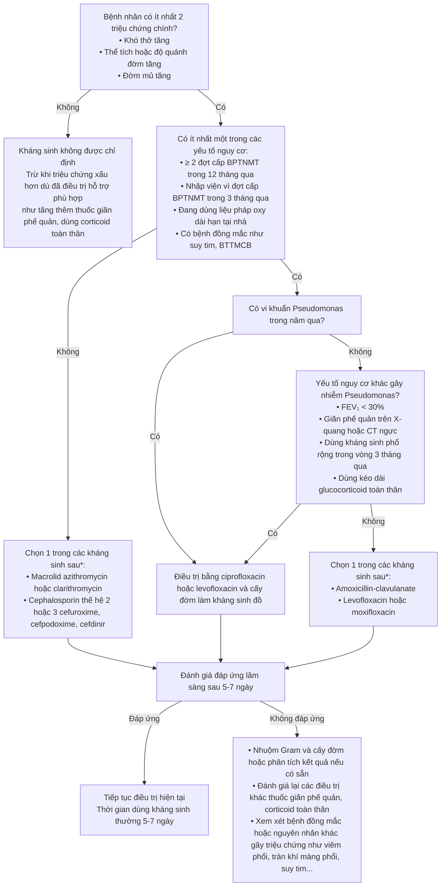

BỘ Y TẾ

**CỘNG HÒA XÃ HỘI CHỦ NGHĨA VIỆT NAM**
**Độc lập - Tự do - Hạnh phúc**

---

*Hà Nội, ngày 04 tháng 07 năm 2023*

### QUYẾT ĐỊNH
#### Về việc ban hành tài liệu chuyên môn “Hướng dẫn chẩn đoán và điều trị bệnh phổi tắc nghẽn mạn tính”

**BỘ TRƯỞNG BỘ Y TẾ**

- Căn cứ Luật Khám bệnh, chữa bệnh;
- Căn cứ Nghị định số 95/2022/NĐ-CP ngày 15/11/2022 của Chính phủ quy định chức năng, nhiệm vụ, quyền hạn và cơ cấu tổ chức của Bộ Y tế;
- Theo đề nghị của Cục trưởng Cục Quản lý khám, chữa bệnh.

**QUYẾT ĐỊNH:**

**Điều 1.** Ban hành kèm theo Quyết định này tài liệu chuyên môn “Hướng dẫn chẩn đoán và điều trị bệnh phổi tắc nghẽn mạn tính”.

**Điều 2.** Tài liệu chuyên môn “Hướng dẫn chẩn đoán và điều trị bệnh phổi tắc nghẽn mạn tính” được áp dụng tại các cơ sở khám bệnh, chữa bệnh trong cả nước.

**Điều 3.** Quyết định này có hiệu lực kể từ ngày ký, ban hành và thay thế Quyết định số 3874/QĐ-BYT ngày 26 tháng 06 năm 2018 của Bộ trưởng Bộ Y tế về việc ban hành tài liệu chuyên môn “Hướng dẫn chẩn đoán và điều trị bệnh phổi tắc nghẽn mạn tính”.

**Điều 4.** Các ông, bà: Chánh Văn phòng Bộ, Chánh Thanh tra Bộ, Cục trưởng và Vụ trưởng các Cục, Vụ thuộc Bộ Y tế, Giám đốc Sở Y tế các tỉnh, thành phố trực thuộc trung ương, Giám đốc các Bệnh viện trực thuộc Bộ Y tế, Thủ trưởng Y tế các ngành chịu trách nhiệm thi hành Quyết định này./.

| Nơi nhận | KT. BỘ TRƯỞNG   THỨ TRƯỞNG |
| :--- | :--- |
| - Như Điều 4; - Bộ trưởng (để b/c); - Các Thứ trưởng; - Cổng thông tin điện tử Bộ Y tế; Website Cục KCB; - Lưu: VT, KCB. | (Đã ký)  **Trần Văn Thuấn** |

---

# HƯỚNG DẪN CHẨN ĐOÁN VÀ ĐIỀU TRỊ BỆNH PHỔI TẮC NGHẼN MẠN TÍNH
*(Ban hành kèm theo Quyết định số 2767/QĐ-BYT ngày 04 tháng 07 năm 2023 của Bộ trưởng Bộ Y tế)*

**Hà Nội, 2023**

---

### THAM GIA BIÊN SOẠN VÀ THẨM ĐỊNH

*   **PGS.TS. Vũ Văn Giáp**
*   **PGS.TS. Chu Thị Hạnh**
*   **PGS.TS. Nguyễn Thanh Hồi**
*   **ThS. Nguyễn Thị Thanh Huyền**
*   **TS. Nguyễn Trọng Khoa**
*   **ThS. Trương Lê Vân Ngọc**
*   **TS. Phạm Hồng Nhung**
*   **PGS.TS. Nguyễn Viết Nhung**
*   **PGS.TS. Lê Thị Tuyết Lan**
*   **PGS.TS. Phan Thu Phương**
*   **ThS. Vũ Văn Thành**
*   **TS. Nguyễn Văn Thọ**
*   **BSCKII. Đặng Vũ Thông**

**THƯ KÝ**
*   **ThS. Hoàng Anh Đức**
*   **ThS. Nguyễn Thanh Huyền**
*   **ThS. Trương Lê Vân Ngọc**
*   **CN. Đỗ Thị Thư**

---

# LỜI NÓI ĐẦU

Bệnh phổi tắc nghẽn mạn tính (**BPTNMT**) là một trong những nguyên nhân hàng đầu gây bệnh tật và tử vong trên toàn thế giới cũng như tại Việt Nam dẫn đến gánh nặng kinh tế xã hội ngày càng gia tăng. Nguyên nhân phổ biến gây bệnh là hút thuốc lá, thuốc lào và ô nhiễm không khí.

Chẩn đoán **BPTNMT** nên được xem xét ở các bệnh nhân có các triệu chứng ho và khó thở mạn tính, xác định bệnh dựa vào đo chức năng hô hấp. Điều trị **BPTNMT** cần chú trọng đến cá thể hóa điều trị, điều trị các bệnh đồng mắc, điều trị dự phòng để tránh các đợt cấp và làm chậm quá trình tiến triển bệnh. Bên cạnh đó, các biện pháp khác như hỗ trợ cai nghiện thuốc lá, phục hồi chức năng hô hấp, giáo dục bệnh nhân cũng có vai trò quan trọng trong việc điều trị và quản lý bệnh nhân **BPTNMT**.

Nhằm chuẩn hóa, cập nhật chuyên môn về chẩn đoán, điều trị, quản lý bệnh nhân **BPTNMT** tại các cơ sở khám bệnh, chữa bệnh, đồng thời nâng cao năng lực cho các nhân viên y tế, Bộ Y tế đã ban hành Hướng dẫn chẩn đoán và điều trị bệnh phổi tắc nghẽn mạn tính năm 2023. Hội Hô hấp Việt Nam, các chuyên gia về hô hấp tại một số cơ sở khám bệnh, chữa bệnh với sự tâm huyết, trí tuệ và kinh nghiệm quý báu đã xây dựng Hướng dẫn, trên cơ sở kế thừa “Hướng dẫn chẩn đoán và điều trị bệnh phổi tắc nghẽn mạn tính” được ban hành tại Quyết định số 3874/QĐ-BYT ngày 26 tháng 06 năm 2018 của Bộ trưởng Bộ Y tế và cập nhật các khuyến cáo quốc tế.

Thay mặt Ban biên soạn trân trọng cảm ơn lãnh đạo Bộ Y tế đã chỉ đạo Biên soạn Hướng dẫn, xin cảm ơn, biểu dương và ghi nhận sự đóng góp công sức, trí tuệ, kinh nghiệm của lãnh đạo các bệnh viện, các giáo sư, phó giáo sư, tiến sĩ, bác sĩ chuyên khoa Hô hấp, thành viên của Hội đồng đã tham gia biên soạn, nghiệm thu tài liệu chuyên môn Hướng dẫn chẩn đoán và điều trị bệnh phổi tắc nghẽn mạn tính năm 2023.

Trong quá trình biên soạn tài liệu khó có thể tránh được các thiếu sót, chúng tôi rất mong nhận được các ý kiến đóng góp cho Hướng dẫn. Mọi góp ý đề nghị gửi về Cục Quản lý Khám chữa bệnh – Bộ Y tế, số 138A Giảng Võ – Ba Đình – Hà Nội.

Xin trân trọng cảm ơn.

*Hà Nội, năm 2023*  
**Chủ biên**  
**PGS.TS. Lương Ngọc Khuê**  
*Cục trưởng Cục Quản lý Khám, chữa bệnh*

---

# MỤC LỤC

*   **CHƯƠNG I. HƯỚNG DẪN CHẨN ĐOÁN VÀ ĐÁNH GIÁ BỆNH PHỔI TẮC NGHẼN MẠN TÍNH** (Trang 9)
    *   **1.1.** Đại cương (Trang 9)
    *   **1.2.** Chẩn đoán (Trang 9)
    *   **1.3.** Đánh giá bệnh phổi tắc nghẽn mạn tính (Trang 13)
    *   **1.4.** Chỉ định chuyển khám chuyên khoa (Trang 15)
*   **CHƯƠNG II. QUẢN LÝ VÀ ĐIỀU TRỊ BỆNH PHỔI TẮC NGHẼN MẠN TÍNH GIAI ĐOẠN ỔN ĐỊNH** (Trang 16)
    *   **2.1.** Biện pháp điều trị chung (Trang 16)
    *   **2.2.** Các thuốc điều trị bệnh phổi tắc nghẽn mạn tính (Trang 18)
    *   **2.3.** Hướng dẫn lựa chọn thuốc điều trị bệnh phổi tắc nghẽn mạn tính (Trang 19)
    *   **2.4.** Thở oxy dài hạn tại nhà (Trang 22)
    *   **2.5.** Thở máy không xâm nhập (Trang 23)
    *   **2.6.** Nội soi can thiệp và phẫu thuật (Trang 23)
    *   **2.7.** Theo dõi bệnh nhân (Trang 24)
*   **CHƯƠNG III. HƯỚNG DẪN CHẨN ĐOÁN VÀ ĐIỀU TRỊ ĐỢT CẤP BỆNH PHỔI TẮC NGHẼN MẠN TÍNH** (Trang 25)
    *   **3.1.** Đại cương (Trang 25)
    *   **3.2.** Nguyên nhân (Trang 25)
    *   **3.3.** Chẩn đoán (Trang 25)
    *   **3.4.** Hướng dẫn điều trị đợt cấp BPTNMT (Trang 28)
*   **CHƯƠNG IV. BỆNH ĐỒNG MẮC VỚI BỆNH PHỔI TẮC NGHẼN MẠN TÍNH** (Trang 37)
    *   **4.1.** Bệnh tim mạch (Trang 37)
    *   **4.2.** Bệnh hô hấp (Trang 40)
    *   **4.3.** Trào ngược dạ dày – thực quản (Trang 42)
    *   **4.4.** Hội chứng chuyển hóa và tiểu đường (Trang 43)
    *   **4.5.** Loãng xương (Trang 43)
    *   **4.6.** Lo âu và trầm cảm (Trang 44)
    *   **4.7.** Suy giảm nhận thức (Trang 44)
    *   **4.8.** BPTNMT như một thể đa bệnh (Trang 45)
*   **CHƯƠNG V. PHỤC HỒI CHỨC NĂNG HÔ HẤP VÀ CHĂM SÓC GIẢM NHẸ BỆNH PHỔI TẮC NGHẼN MẠN TÍNH** (Trang 46)
    *   **5.1.** Đại cương (Trang 46)
    *   **5.2.** Các thành phần của chương trình PHCN hô hấp (Trang 47)
    *   **5.3.** Xây dựng chương trình PHCN hô hấp (Trang 49)
    *   **5.4.** Chăm sóc giảm nhẹ ở bệnh nhân BPTNMT giai đoạn cuối đời (Trang 49)
*   **TÀI LIỆU THAM KHẢO** (Trang 52)
*   **PHỤ LỤC**
    *   **Phụ lục 1.** Danh mục thuốc cần thiết cho tuyến y tế cơ sở (Trang 55)
    *   **Phụ lục 2.** Đánh giá bệnh phổi tắc nghẽn mạn tính với bảng điểm CAT (COPD Assessment Test) (Trang 58)
    *   **Phụ lục 3.** Đánh giá bệnh phổi tắc nghẽn mạn tính với bảng điểm mMRC (Modified Medical Research Council) (Trang 59)
    *   **Phụ lục 4.** Cách sử dụng các dụng cụ phân phối thuốc (Trang 60)
    *   **Phụ lục 5.** Thở máy không xâm nhập ở bệnh nhân bệnh phổi tắc nghẽn mạn tính (Trang 69)
    *   **Phụ lục 6.** Kế hoạch hành động của bệnh nhân bệnh phổi tắc nghẽn mạn tính (Trang 73)
    *   **Phụ lục 7.** Xây dựng chương trình PHCN hô hấp 8 tuần (Trang 74)
    *   **Phụ lục 8.** Nghiệm pháp đi bộ 6 phút (Trang 76)
    *   **Phụ lục 9.** Quy trình lâm sàng từ xử trí đợt cấp đến điều trị duy trì bệnh phổi tắc nghẽn mạn tính (Trang 81)

---

# DANH MỤC BẢNG

*   **Bảng 1.1.** Bảng câu hỏi tầm soát BPTNMT ở cộng đồng (theo GOLD) (Trang 10)
*   **Bảng 1.2.** Chẩn đoán phân biệt BPTNMT với hen phế quản (Trang 13)
*   **Bảng 1.3.** Mức độ tắc nghẽn đường thở theo GOLD 2022 (Trang 14)
*   **Bảng 2.1.** Các nhóm thuốc chính điều trị BPTNMT (Trang 18)
*   **Bảng 2.2.** Lựa chọn thuốc theo phân nhóm ABCD của GOLD 2022 (Trang 19)
*   **Bảng 3.1.** Giá trị của các xét nghiệm trong đánh giá đợt cấp BPTNMT (Trang 26)
*   **Bảng 3.2.** Yếu tố xem xét nơi điều trị đợt cấp BPTNMT (Trang 29)
*   **Bảng 5.1.** Những lợi ích của chương trình PHCN hô hấp (Trang 46)
*   **Bảng 5.2.** Các nội dung giáo dục sức khỏe (Trang 48)
*   **Bảng 5.3.** Phác đồ điều trị khó thở bằng Morphin ở bệnh nhân BPTNMT giai đoạn cuối đời (Trang 51)

---

# DANH MỤC BIỂU ĐỒ/ HÌNH

*   **Biểu đồ 1.1.** Lưu đồ chẩn đoán BPTNMT theo GOLD 2022 (Trang 12)
*   **Biểu đồ 1.2.** Đánh giá BPTNMT theo nhóm ABCD (Theo GOLD 2022) (Trang 15)
*   **Biểu đồ 3.1.** Lựa chọn kháng sinh theo kinh nghiệm cho đợt cấp BPTNMT ngoại trú (Trang 31)
*   **Biểu đồ 3.2.** Lựa chọn kháng sinh theo kinh nghiệm cho đợt cấp BPTNMT nhập viện (Trang 35)
*   **Hình 4.1p.** Hướng dẫn sử dụng bình hít định liều (MDIs) (Trang 60)
*   **Hình 4.2p.** Buồng đệm có van và buồng đệm với mặt nạ (Trang 61)
*   **Hình 4.3p.** Hướng dẫn sử dụng buồng đệm với bình hít định liều (Trang 61)
*   **Hình 4.4p.** Hướng dẫn sử dụng Accuhaler (Trang 62)
*   **Hình 4.5p.** Hướng dẫn sử dụng Turbuhaler (Trang 63)
*   **Hình 4.6p.** Hướng dẫn sử dụng Respimat (Trang 69)
*   **Hình 4.7p.** Hướng dẫn sử dụng Breehaler (Trang 70)
*   **Hình 4.8p.** Máy khí dung và cách sử dụng (Trang 71)
*   **Hình 4.9p.** Hướng dẫn sử dụng bình hít bột khô Ellipta (Trang 72)
*   **Hình 4.10p.** Những lưu ý khi dùng bình hít bột khô Ellipta (Trang 73)

---

# DANH MỤC TỪ VIẾT TẮT

| Từ viết tắt | Nghĩa đầy đủ |
| :--- | :--- |
| **BPTNMT** | Bệnh phổi tắc nghẽn mạn tính |
| **CAT** | Bộ câu hỏi đánh giá BPTNMT (COPD Assessment Test) |
| **CLCS** | Chất lượng cuộc sống |
| **CT** | Cắt lớp vi tính |
| **CNHH** | Chức năng hô hấp |
| **FET** | Kỹ thuật thở ra gắng sức (Forced expiratory technique) |
| **FEV₁** | Thể tích thở ra gắng sức trong giây đầu tiên (Forced Expiratory Volume in One Second) |
| **FVC** | Dung tích sống gắng sức (Force vital capacity) |
| **GOLD** | Sáng kiến toàn cầu cho BPTNMT (Global Initiative for Chronic Obstructive Lung Disease) |
| **HPPQ** | Hồi phục phế quản |
| **HPQ** | Hen phế quản |
| **HRCT** | Chụp cắt lớp vi tính độ phân giải cao (High resolution computed tomography) |
| **ICS** | Corticosteroid dạng hít (Inhaled corticosteroid) |
| **KPT** | Khí phế thũng |
| **LABA** | Thuốc cường beta2 tác dụng kéo dài (Long-acting beta2-agonists) |
| **LAMA** | Thuốc kháng muscarinic tác dụng kéo dài (Long-acting muscarinic antagonist) |
| **mMRC** | Bộ câu hỏi của hội đồng nghiên cứu y khoa Anh sửa đổi (modified Medical Research Council) |
| **NTTĐ** | Nhịp tim tối đa |
| **PHCN** | Phục hồi chức năng |
| **SABA** | Thuốc cường beta2 tác dụng ngắn (Short-acting beta2-agonists) |
| **SAMA** | Thuốc kháng muscarinic tác dụng ngắn (Short-acting muscarinic antagonist) |
| **SGRQ** | Bộ câu hỏi đánh giá triệu chứng hô hấp Saint George (Saint George's Respiratory Questionnaire) |
| **THA** | Tăng huyết áp |

---

# CHƯƠNG I. HƯỚNG DẪN CHẨN ĐOÁN VÀ ĐÁNH GIÁ BỆNH PHỔI TẮC NGHẼN MẠN TÍNH

## 1.1. Đại cương

Bệnh phổi tắc nghẽn mạn tính (**BPTNMT**) là bệnh hô hấp phổ biến có thể phòng và điều trị được. Đây là bệnh lý không đồng nhất, đặc trưng bởi các triệu chứng hô hấp mạn tính (khó thở, ho, khạc đờm) và các đợt cấp do tình trạng bất thường của đường thở (viêm phế quản, viêm tiểu phế quản) và/hoặc phế nang (khí phế thũng) gây ra tắc nghẽn đường thở dai dẳng và tiến triển.

Nguyên nhân gây **BPTNMT** liên quan đến sự phơi nhiễm với các hạt hoặc khí độc hại và các yếu tố chủ thể bao gồm phổi kém phát triển khi còn nhỏ, đột biến gen *SERPINA1* gây ra thiếu hụt alpha 1 antitrypsin. Khói thuốc lá, thuốc lào là yếu tố nguy cơ chính; ô nhiễm không khí và khói chất đốt sinh hoạt cũng là yếu tố nguy cơ quan trọng gây **BPTNMT**. Các bệnh đồng mắc và đợt kịch phát làm nặng thêm tình trạng bệnh và tăng tử vong.

**BPTNMT** là một trong những nguyên nhân hàng đầu gây bệnh tật và tử vong trên toàn thế giới dẫn đến gánh nặng kinh tế xã hội ngày càng gia tăng. Dựa trên các nghiên cứu dịch tễ học, số ca mắc **BPTNMT** ước tính là khoảng 385 triệu năm 2010, với tỷ lệ mắc trên thế giới là 11,7% và khoảng 3 triệu ca tử vong hàng năm. Ở Việt Nam, nghiên cứu về dịch tễ học của **BPTNMT** năm 2009 cho thấy tỷ lệ mắc ở người > 40 tuổi là 4,2%. Với sự gia tăng tỷ lệ hút thuốc lá tại các nước đang phát triển và sự già hóa dân số ở những quốc gia phát triển, tỷ lệ mắc **BPTNMT** được dự đoán sẽ tăng cao trong những năm tới và đến năm 2030 ước tính có trên 4,5 triệu trường hợp tử vong hàng năm do **BPTNMT** và các rối loạn liên quan.

## 1.2. Chẩn đoán

### 1.2.1. Chẩn đoán định hướng áp dụng tại cơ sở y tế chưa được trang bị máy đo CNHH

Khai thác kỹ tiền sử tiếp xúc với các yếu tố nguy cơ gây bệnh, thăm khám lâm sàng và áp dụng bảng điểm lâm sàng để định hướng chẩn đoán:
- Bệnh hay gặp ở nam giới trên 40 tuổi.
- **Tiền sử:** Hút thuốc lá, thuốc lào (bao gồm cả hút thuốc chủ động và thụ động). Ô nhiễm môi trường trong và ngoài nhà: khói bếp, khói chất đốt, bụi nghề nghiệp (bụi hữu cơ, vô cơ), hơi, khí độc. Nhiễm khuẩn hô hấp tái diễn, di chứng lao phổi,... Tăng tính phản ứng đường thở (hen phế quản hoặc viêm phế quản co thắt).
- **Ho, khạc đờm kéo dài** không do các bệnh phổi khác như lao phổi, giãn phế quản,... là triệu chứng thường gặp. Lúc đầu có thể chỉ có ho ngắt quãng, sau đó ho dai dẳng hoặc ho hàng ngày (là biểu hiện viêm phế quản mạn: ho kéo dài ít nhất 3 tháng trong 1 năm và trong 2 năm liên tiếp), ho khan hoặc ho có đờm, thường khạc đờm về buổi sáng. Ho đờm mủ là một trong các dấu hiệu của đợt cấp do bội nhiễm

- **Khó thở**: Tiến triển nặng dần theo thời gian, lúc đầu chỉ có khó thở khi gắng sức, sau đó khó thở cả khi nghỉ ngơi và khó thở liên tục. Bệnh nhân “phải gắng sức để thở”, “khó thở, nặng ngực”, “cảm giác thiếu không khí, hụt hơi” hoặc “thở hổn hển”, thở khò khè. Khó thở tăng lên khi gắng sức hoặc nhiễm trùng đường hô hấp.
Bệnh nhân đến khám ở giai đoạn muộn có thể có biểu hiện mệt mỏi, biếng ăn, sụt cân, yếu hoặc teo cơ. Những dấu hiệu này có giá trị tiên lượng xấu nhưng cũng có thể là biểu hiện của bệnh đồng mắc BPTNMT như lao phổi hoặc ung thư phổi.

- **Khám phổi**:
  - **Giai đoạn sớm**: Khám phổi có thể bình thường. Nếu bệnh nhân có khí phế thũng có thể thấy lồng ngực hình thùng, gõ vang, rì rào phế nang giảm.
  - **Giai đoạn nặng hơn hoặc trong đợt cấp**: Khám phổi thấy rì rào phế nang giảm.
  - **Giai đoạn muộn**: Có thể thấy những biểu hiện của suy hô hấp mạn tính: Tím môi, tím đầu chi, thở nhanh, co kéo cơ hô hấp phụ, biểu hiện của suy tim phải (tĩnh mạch cổ nổi, phù 2 chân, gan to, phản hồi gan tĩnh mạch cổ dương tính).

Khi phát hiện bệnh nhân có các triệu chứng nghi ngờ BPTNMT như trên, cần chuyển bệnh nhân đến các cơ sở y tế có đủ điều kiện (tuyến huyện, tuyến tỉnh hoặc tuyến trung ương…) để làm thêm các thăm dò chẩn đoán nhằm chẩn đoán xác định và loại trừ những nguyên nhân khác có triệu chứng lâm sàng giống BPTNMT.

### Bảng 1.1. Bảng câu hỏi tầm soát BPTNMT ở cộng đồng (theo GOLD)

| STT | Câu hỏi | Chọn câu trả lời |
| :--- | :--- | :--- |
| 1 | Ông/bà có ho vài lần trong ngày ở hầu hết các ngày? | Có / Không |
| 2 | Ông/bà có khạc đờm ở hầu hết các ngày? | Có / Không |
| 3 | Ông/bà có dễ bị khó thở hơn những người cùng tuổi? | Có / Không |
| 4 | Ông/bà có trên 40 tuổi? | Có / Không |
| 5 | Ông/bà vẫn còn hút thuốc lá hoặc đã từng hút thuốc lá? | Có / Không |

- **Phát hiện sớm BPTNMT**: Các đối tượng trả lời “Có” từ 3 câu trở lên trong Bảng 1.1 nên được giới thiệu tới cơ sở y tế có đo chức năng hô hấp để chủ động phát hiện sớm BPTNMT.

### 1.2.2. Chẩn đoán xác định áp dụng cho cơ sở y tế đã được trang bị máy đo CNHH

Những bệnh nhân có tiền sử tiếp xúc với các yếu tố nguy cơ, có các dấu hiệu lâm sàng nghi ngờ mắc BPTNMT như đã mô tả ở trên, tùy theo tính có sẵn của trang thiết bị và mục đích đánh giá, cần được làm các xét nghiệm sau:

- **Đo chức năng hô hấp (CNHH)**: Kết quả đo CNHH là tiêu chuẩn vàng để chẩn đoán xác định và đánh giá mức độ tắc nghẽn đường thở của bệnh nhân BPTNMT.
  - Cần trang bị máy đo CNHH đảm bảo đủ tiêu chuẩn (xem phụ lục về tiêu chuẩn phòng quản lý) và phải được định chuẩn hằng ngày.
  - Kỹ thuật viên cần được đào tạo về đo CNHH và biết cách làm test hồi phục phế quản.
  - Để thiết lập chẩn đoán xác định, bệnh nhân cần phải ngừng thuốc giãn phế quản trước khi đo CNHH phổi ít nhất từ 4 - 6 giờ (đối với SABA, SAMA) hoặc 12 - 24 giờ đối với LABA, LAMA.
  - **Nhận định kết quả**:
    - Chẩn đoán xác định khi: Rối loạn thông khí tắc nghẽn không hồi phục hoàn toàn sau test hồi phục phế quản: Chỉ số $FEV_1/FVC < 70\%$ sau test HPPQ.
    - Thông thường bệnh nhân BPTNMT sẽ có kết quả test HPPQ âm tính (chỉ số $FEV_1$ tăng < 12% và < 200ml sau test hồi phục phế quản).
    - Dựa vào chỉ số $FEV_1$ giúp đánh giá mức độ tắc nghẽn đường thở (xem mục 1.3).
- **X-quang phổi**:
  - X-quang phổi nên được thực hiện trước khi đo CNHH để loại trừ các bệnh gây lây nhiễm như lao phổi.
  - BPTNMT ở giai đoạn sớm: Hình ảnh X-quang phổi có thể bình thường.
  - Giai đoạn muộn: Có thể có hình ảnh khí phế thũng: Trường phổi 2 bên tăng sáng không đều, cơ hoành hạ thấp và dẹt, có thể thấy cơ hoành hình bậc thang, khoang liên sườn giãn rộng, có thể có bóng (kén) khí hoặc mạch máu ở ngoại biên thưa thớt.
  - X-quang phổi giúp phát hiện một số bệnh phổi đồng mắc hoặc biến chứng của BPTNMT như: U phổi, giãn phế quản, lao phổi, tràn khí màng phổi, suy tim, bất thường khung xương lồng ngực, cột sống...
- **CLVT ngực độ phân giải cao (HRCT)**:
  - Giúp phát hiện sự hiện diện và mức độ khí phế thũng (giãn phế nang), bóng (kén) khí, phát hiện sớm ung thư phổi, giãn phế quản… đồng mắc với BPTNMT.
  - Đánh giá bệnh nhân trước khi chỉ định can thiệp giảm thể tích phổi bằng phẫu thuật hoặc đặt van phế quản một chiều và trước khi ghép phổi.
- **Điện tâm đồ (ECG)**: Ở giai đoạn muộn có thể thấy các dấu hiệu của tăng áp động mạch phổi và suy tim phải: Sóng P cao (> 2,5mm) nhọn đối xứng (P phế), trục phải (> 110°), dày thất phải.
- **Siêu âm tim**: Để phát hiện tăng áp lực động mạch phổi, suy tim phải giúp cho chẩn đoán biến chứng.
- **Đo SpO2 và khí máu động mạch**: Đánh giá mức độ suy hô hấp, hỗ trợ cho quyết định điều trị oxy hoặc thở máy. Đo SpO2 và xét nghiệm khí máu động mạch được chỉ định ở tất cả các bệnh nhân có dấu hiệu suy hô hấp.
- **Đo thể tích khí cặn, dung tích toàn phổi** (thể tích ký thân, pha loãng Helium, rửa Nitrogen…): Chỉ định khi bệnh nhân có tình trạng khí phế thũng nặng, giúp lựa chọn phương pháp điều trị và đánh giá hiệu quả điều trị.
- **Đo khuếch tán khí qua màng phế nang - mao mạch (DLCO)**: Bằng đo thể tích ký thân, pha loãng khí Helium… nếu bệnh nhân có triệu chứng khó thở nặng hơn mức độ tắc nghẽn khi đo bằng CNHH.
- **Đo thể tích ký thân**: Cần được chỉ định trong những trường hợp nghi ngờ rối loạn thông khí tắc nghẽn nhưng không phát hiện được bằng đo CNHH hoặc khi nghi ngờ rối loạn thông khí hỗn hợp.

### Tiêu chuẩn chẩn đoán xác định BPTNMT theo GOLD:

- **Triệu chứng**:
  - Khó thở
  - Khạc đờm
- **Phơi nhiễm với yếu tố nguy cơ**:
  - Hút thuốc lá, thuốc lào
  - Ô nhiễm môi trường trong, ngoài nhà
  - Tiếp xúc khói, khí, bụi nghề nghiệp
- **Đo chức năng hô hấp để chẩn đoán xác định**:
  - $FEV_1/FVC < 70\%$ sau test phục hồi phế quản.

*(Theo Biểu đồ 1.1. Lưu đồ chẩn đoán BPTNMT theo GOLD 2022)*

### 1.2.3. Chẩn đoán phân biệt

- **Lao phổi**: Gặp ở mọi lứa tuổi, ho kéo dài, khạc đờm hoặc có thể ho ra máu, sốt nhẹ về chiều, gầy sút cân... X-quang phổi: Tổn thương nhiều nốt đông đặc tụ đám hoặc dạng hang, thường ở đỉnh phổi. Xét nghiệm đờm hoặc dịch rửa phế quản: Nhuộm huỳnh quang thấy trực khuẩn kháng toan - cồn, hoặc Xpert MTB/RIF có vi khuẩn lao, hoặc thấy trực khuẩn lao khi nuôi cấy trên môi trường lỏng MGIT.
- **Giãn phế quản**: Ho khạc đờm tái đi tái lại, đờm đục hoặc đờm mủ nhiều, nghe phổi có ran nổ, ran ẩm khu trú vùng tổn thương. Chụp cắt lớp vi tính ngực độ phân giải cao giúp chẩn đoán xác định.
- **Suy tim ứ huyết**: Tiền sử tăng huyết áp, bệnh lý van tim; X-quang phổi: Bóng tim to, có thể có dấu hiệu phù phổi; đo chức năng hô hấp: Rối loạn thông khí hạn chế, không có tắc nghẽn; xét nghiệm pro-BNP tăng; suy tim có giảm chức năng tâm thu.
- **Viêm toàn tiểu phế quản lan tỏa (hội chứng xoang phế quản)**: Gặp ở cả 2 giới, hầu hết nam giới không hút thuốc, có viêm mũi xoang mạn tính. X-quang phổi và chụp cắt lớp vi tính độ phân giải cao: Nhiều nốt mờ nhỏ lan tỏa dạng trung tâm tiểu thùy.

### Bảng 1.2. Chẩn đoán phân biệt BPTNMT với hen phế quản

| Đặc điểm | Hen phế quản | BPTNMT |
| :--- | :--- | :--- |
| **Tuổi khởi phát** | Thường bắt đầu khi còn nhỏ | Xuất hiện thường ở người > 40 tuổi |
| **Triệu chứng lâm sàng** | Các triệu chứng biến đổi từng ngày. Thường xuất hiện vào ban đêm / sáng sớm. Ngoài cơn hen có thể hoàn toàn bình thường. | Các triệu chứng tiến triển nặng dần. Khó thở lúc đầu khi gắng sức, sau khó thở liên tục. Luôn có triệu chứng tại phổi. |
| **Tiền sử** | Tiền sử dị ứng thời tiết, dị ứng thức ăn, viêm khớp, và/hoặc chàm. Gia đình có người cùng huyết thống mắc hen. | Tiền sử hút thuốc lá, thuốc lào nhiều năm. |
| **Giới hạn luồng khí (CNHH)** | Giới hạn luồng khí dao động: $FEV_1$ dao động trong khoảng $\ge$ 12% và $\ge$ 200ml hoặc hồi phục hoàn toàn: $FEV_1/FVC \ge 70\%$ sau test hồi phục phế quản. | Rối loạn thông khí tắc nghẽn không phục hồi hoàn toàn: $FEV_1/FVC < 70\%$ sau test hồi phục phế quản. |
| **Biến chứng** | Hiếm khi có biến chứng tâm phế mạn hoặc suy hô hấp mạn. | Biến chứng tâm phế mạn hoặc suy hô hấp mạn tính thường xảy ra ở giai đoạn cuối. |

## 1.3. Đánh giá bệnh phổi tắc nghẽn mạn tính

Mục tiêu của đánh giá BPTNMT để xác định mức độ giới hạn của luồng khí thở, ảnh hưởng của bệnh đến tình trạng sức khỏe của người bệnh và nguy cơ đợt cấp trong tương lai.
Đánh giá BPTNMT dựa trên các khía cạnh sau: (Mức độ tắc nghẽn đường thở, độ nặng của triệu chứng hiện tại và sự ảnh hưởng của bệnh đối với sức khỏe và cuộc sống của bệnh nhân, tiền sử đợt cấp trong năm trước) và các bệnh lý đồng mắc.

### 1.3.1. Đánh giá mức độ tắc nghẽn đường thở

### Bảng 1.3. Mức độ tắc nghẽn đường thở theo GOLD 2022

| Phân độ | Mức độ | Giá trị $FEV_1$ sau test hồi phục phế quản |
| :--- | :--- | :--- |
| **GOLD 1** | Nhẹ | $FEV_1 \ge 80\%$ trị số lý thuyết |
| **GOLD 2** | Trung bình | $50\% \le FEV_1 < 80\%$ trị số lý thuyết |
| **GOLD 3** | Nặng | $30\% \le FEV_1 < 50\%$ trị số lý thuyết |
| **GOLD 4** | Rất nặng | $FEV_1 < 30\%$ trị số lý thuyết |

### 1.3.2. Đánh giá triệu chứng và ảnh hưởng của bệnh

Công cụ để đánh giá triệu chứng và sự ảnh hưởng của bệnh lên tình trạng sức khỏe của người bệnh:
- **Bộ câu hỏi về mức độ khó thở được hiệu chỉnh của Hội đồng Nghiên cứu Y khoa Anh (mMRC)** (phụ lục 3): Gồm 5 câu hỏi với điểm cao nhất là 4, điểm càng cao thì mức độ khó thở càng nhiều. mMRC < 2 được định nghĩa là ít triệu chứng, mMRC $\ge$ 2 được định nghĩa là nhiều triệu chứng.
- **Bộ câu hỏi CAT** (phụ lục 2): Gồm 8 câu hỏi, tổng điểm 40, điểm càng cao thì ảnh hưởng của bệnh tới tình trạng sức khỏe của bệnh nhân càng lớn. CAT < 10 được định nghĩa ít triệu chứng, ít ảnh hưởng; CAT $\ge$ 10 được định nghĩa nhiều triệu chứng, ảnh hưởng của bệnh nhiều; CAT $\ge$ 20 được định nghĩa rất nhiều triệu chứng. CAT đánh giá ảnh hưởng của BPTNMT lên tình trạng sức khỏe chung của bệnh nhân toàn diện hơn mMRC.

### 1.3.3. Đánh giá nguy cơ đợt cấp

Dựa vào tiền sử đợt cấp trong năm trước (số đợt cấp và mức độ nặng của đợt cấp) mà bệnh nhân được phân loại vào 2 nhóm nguy cơ:
- **Nguy cơ thấp**: Số đợt cấp/năm từ 0 - 1 đợt cấp nhẹ - trung bình (không phải nhập viện, không hoặc có sử dụng kháng sinh và/hoặc corticosteroid).
- **Nguy cơ cao**: Số đợt cấp/năm $\ge$ 2 đợt cấp nhẹ - trung bình hoặc $\ge$ 1 đợt cấp nặng phải nhập viện hoặc cấp cứu.

### 1.3.4. Đánh giá bệnh phổi tắc nghẽn mạn tính theo nhóm ABCD

Phân nhóm ABCD dựa vào:
- Mức độ triệu chứng, ảnh hưởng của bệnh (mMRC, CAT).
- Nguy cơ đợt cấp (tiền sử đợt cấp/năm, độ nặng đợt cấp).

BPTNMT được đánh giá tổ hợp theo biểu đồ 1.2:

**Biểu đồ 1.2. Đánh giá BPTNMT theo nhóm ABCD (Theo GOLD 2022)**

- **BPTNMT nhóm A - Nguy cơ thấp, ít triệu chứng**: Có 0 - 1 đợt cấp trong vòng 12 tháng qua (đợt cấp không nhập viện) và mMRC 0 - 1 hoặc CAT < 10.
- **BPTNMT nhóm B - Nguy cơ thấp, nhiều triệu chứng**: Có 0 - 1 đợt cấp trong vòng 12 tháng qua (đợt cấp không nhập viện) và mMRC $\ge$ 2 hoặc điểm CAT $\ge$ 10.
- **BPTNMT nhóm C - Nguy cơ cao, ít triệu chứng**: Có $\ge$ 2 đợt cấp trong vòng 12 tháng qua hoặc $\ge$ 1 đợt cấp nặng phải nhập viện hoặc phải cấp cứu và mMRC 0 - 1 hoặc điểm CAT < 10.
- **BPTNMT nhóm D - Nguy cơ cao, nhiều triệu chứng**: Có $\ge$ 2 đợt cấp trong vòng 12 tháng qua hoặc $\ge$ 1 đợt cấp phải nhập viện hoặc phải cấp cứu và mMRC $\ge$ 2 hoặc điểm CAT $\ge$ 10.

Sau khi đánh giá toàn diện, bệnh nhân nên được phân loại theo mức độ tắc nghẽn GOLD 1, 2, 3, 4 và nhóm ABCD. Ví dụ: Chẩn đoán: BPTNMT GOLD 4, nhóm B.

## 1.4. Chỉ định chuyển khám chuyên khoa

Bệnh nhân nên được xem xét chuyển tuyến trên để khám chuyên khoa Hô hấp trong một số tình huống lâm sàng sau:
- Bệnh nhân có triệu chứng lâm sàng và/hoặc X-quang ngực gợi ý BPTNMT nhưng kết quả Hô hấp ký không thỏa tiêu chuẩn chẩn đoán xác định.
- Bệnh nhân bị đợt cấp thường xuyên hoặc phải nhập viện nhiều lần dù đã được điều trị đầy đủ bằng các thuốc hiện có.
- Bệnh nhân cần được cá thể hóa điều trị dựa trên kiểu hình như: Hen chồng lấp BPTNMT, BPTNMT có căng phồng phổi quá mức, BPTNMT có khí phế thũng khu trú hoặc có bóng khí, suy hô hấp giảm oxy máu hoặc tăng $CO_2$ máu.
- Bệnh nhân BPTNMT có các bệnh đồng mắc khó điều trị (xem chương Bệnh đồng mắc).

# CHƯƠNG II: QUẢN LÝ VÀ ĐIỀU TRỊ BỆNH PHỔI TẮC NGHẼN MẠN TÍNH GIAI ĐOẠN ỔN ĐỊNH

- **Ngừng tiếp xúc với khói thuốc lá, thuốc lào, bụi, khói bếp rơm, củi, than, khí độc...**
- **Cai thuốc lá**: Là biện pháp rất quan trọng ngăn chặn BPTNMT tiến triển nặng lên. Trong cai thuốc lá, việc tư vấn cho người bệnh đóng vai trò then chốt, các thuốc hỗ trợ cai giúp người bệnh cai thuốc lá dễ dàng hơn.

### a) Chiến lược tư vấn người bệnh cai thuốc lá
Tìm hiểu lý do cản trở người bệnh cai thuốc lá: Sợ cai thuốc thất bại, hội chứng cai gây khó chịu, mất đi niềm vui hút thuốc, căng thẳng,...
- **Ask - Hỏi**: Xem tình trạng hút thuốc của người bệnh để có kế hoạch phù hợp.
- **Advise - Khuyên**: Đưa ra lời khuyên phù hợp và đủ sức thuyết phục người bệnh bỏ hút thuốc.
- **Assess - Đánh giá**: Xác định nhu cầu cai thuốc thực sự của người bệnh.
- **Assist - Hỗ trợ**: Giúp người bệnh xây dựng kế hoạch cai thuốc, tư vấn, hỗ trợ và chỉ định thuốc hỗ trợ cai nghiện thuốc lá nếu cần.
- **Arrange - Sắp xếp**: Có kế hoạch theo dõi, hỗ trợ trực tiếp hoặc gián tiếp để người bệnh cai được thuốc và tránh tái nghiện.

### b) Thuốc hỗ trợ cai thuốc lá
Việc dùng thuốc hỗ trợ cai thuốc lá giúp giảm nhẹ hội chứng cai thuốc và làm tăng tỷ lệ cai thuốc thành công. Các thuốc có thể chỉ định: Nicotine thay thế, bupropion, varenicline.

#### Nicotine thay thế
- **Chống chỉ định tương đối**: Ở bệnh nhân tim mạch có nguy cơ cao (vừa mới bị nhồi máu cơ tim cấp).
- **Các dạng thuốc**: Dạng xịt mũi, họng, viên ngậm, viên nhai, miếng dán da.
- **Thời gian dùng thuốc**: Tùy thuộc vào mức độ nghiện thuốc lá (mức độ phụ thuộc nicotine): Thông thường từ 2 - 4 tháng, có thể kéo dài hơn.
- **Tác dụng phụ**: Gây kích ứng da khi dán, khi uống có thể gây khô miệng, nấc, khó tiêu...

#### Bupropion
- **Tác dụng**: Tăng cường phóng thích noradrenergic và dopaminergic ở hệ thần kinh trung ương giúp làm giảm ham muốn hút thuốc.
- **Chống chỉ định**: Không dùng cho bệnh nhân động kinh, rối loạn tâm thần, rối loạn hành vi ăn uống, dùng thuốc nhóm IMAO, đang điều trị cai nghiện rượu, suy gan nặng.
- **Thời gian điều trị**: 7 - 9 tuần, có thể kéo dài 6 tháng.
- **Liều lượng**: Liều cố định không vượt quá 300 mg/ngày:
  - Tuần đầu: 150 mg/ngày uống buổi sáng;
  - Từ tuần 2 - 9: 300 mg/ngày chia 2 lần.
- **Tác dụng phụ**: Mất ngủ, khô miệng, nhức đầu, kích động, co giật.

#### Varenicline
- **Tác dụng**: Giảm triệu chứng khi cai thuốc lá và giảm sảng khoái khi hút thuốc.
- **Chống chỉ định tương đối**: Khi suy thận nặng (thanh thải Creatinine < 30 ml/phút).
- **Thời gian điều trị**: 12 tuần, có thể kéo dài đến 6 tháng.
- **Liều điều trị**:
  - Ngày 1 đến 3: 0,5 mg/ngày uống buổi sáng;
  - Ngày 4 đến 7: 1 mg/ngày chia 2 lần sáng - chiều;
  - Tuần 2 đến 12: 2 mg/ngày chia 2 lần sáng - chiều.
- **Tác dụng phụ**: Buồn nôn, rối loạn giấc ngủ, ác mộng, trầm cảm, thay đổi hành vi.

### 2.1.3. Tiêm vắc xin phòng nhiễm trùng đường hô hấp
- Nhiễm trùng đường hô hấp (cúm và viêm phổi...) là một trong các yếu tố nguy cơ gây đợt cấp BPTNMT. Việc tiêm phòng vắc xin có thể làm giảm các đợt cấp nặng và giảm tỷ lệ tử vong.
- Tiêm phòng vắc xin cúm vào đầu mùa thu và tiêm nhắc lại hàng năm cho các đối tượng mắc BPTNMT.
- Tiêm phòng vắc xin phế cầu mỗi 5 năm 1 lần và được khuyến cáo ở bệnh nhân mắc BPTNMT giai đoạn ổn định.
- WHO và CDC khuyến cáo tiêm phòng vắc xin SARS-CoV-2 (COVID-19) cho bệnh nhân BPTNMT (chứng cứ B). Ngoài ra, ở nhóm bệnh nhân không dung nạp vắc xin, mắc nhiều bệnh mạn tính (như bệnh phổi tắc nghẽn mạn tính) hoặc suy giảm miễn dịch có thể được dự phòng trước phơi nhiễm COVID-19 bằng kháng thể đơn dòng.
- Bệnh nhân BPTNMT chưa tiêm vắc xin Tdap (bạch hầu - uốn ván - ho gà) lần nào thì tiêm phòng 1 mũi và nhắc lại sau mỗi 10 năm, còn với bệnh nhân đã tiêm vắc xin Tdap sẽ tiêm liều nhắc lại sau 10 năm tính từ liều đã tiêm.

### 2.1.4. Phục hồi chức năng hô hấp:
(Xem chi tiết chương 5)

### 2.1.5. Các điều trị khác
- Vệ sinh mũi họng thường xuyên.
- Phát hiện sớm và điều trị kịp thời các nhiễm trùng tai mũi họng, răng hàm mặt.
- Phát hiện và điều trị các bệnh đồng mắc.

## 2.2. Các thuốc điều trị bệnh phổi tắc nghẽn mạn tính
- Thuốc giãn phế quản được coi là nền tảng trong điều trị triệu chứng BPTNMT.
- Ưu tiên các loại thuốc giãn phế quản tác dụng kéo dài, dùng đường phun hít hoặc xịt.
- Liều lượng và đường dùng của các thuốc này tùy thuộc vào mức độ và giai đoạn bệnh (tham khảo phụ lục thuốc điều trị bệnh phổi tắc nghẽn mạn tính).

### Bảng 2.1. Các nhóm thuốc chính điều trị BPTNMT

| Nhóm thuốc | Tên viết tắt | Hoạt chất |
| :--- | :--- | :--- |
| **Cường beta 2 adrenergic tác dụng ngắn** | SABA | Salbutamol, Terbutaline |
| **Cường beta 2 adrenergic tác dụng dài** | LABA | Indacaterol, Bambuterol |
| **Kháng cholinergic tác dụng ngắn** | SAMA | Ipratropium |
| **Kháng cholinergic tác dụng dài** | LAMA | Tiotropium |
| **Cường beta 2 adrenergic tác dụng ngắn + kháng cholinergic tác dụng ngắn** | SABA + SAMA | Ipratropium/salbutamol, Ipratropium/fenoterol |
| **Cường beta 2 adrenergic tác dụng dài + kháng cholinergic tác dụng dài** | LABA/LAMA | Indacaterol/Glycopyrronium, Olodaterol/Tiotropium, Vilanterol/Umeclidinium, Formoterol/Glycopyrronium |
| **Corticosteroid dạng hít + cường beta 2 adrenergic tác dụng dài** | ICS/LABA | Budesonide/Formoterol, Fluticasone/Vilanterol, Fluticasone/Salmeterol |
| **Corticosteroid dạng hít + kháng cholinergic tác dụng dài + cường beta 2 adrenergic tác dụng dài\*** | ICS/LABA/LAMA\* | Budesonide/Formoterol + Tiotropium, Budesonide/Formoterol + Glycopyrronium, Fluticasone/Salmeterol + Tiotropium, Fluticasone/Salmeterol + Glycopyrronium, Beclometasone/Formoterol + Tiotropium |

| Nhóm thuốc | Tên viết tắt | Hoạt chất |
| :--- | :--- | :--- |
| (tiếp tục nhóm **ICS/LABA/LAMA**) | | Beclometasone/Formoterol + Glycopyrronium\* Indacaterol/Glycopyronium + Fluticasone\* Olodaterol/Tiotropium + Fluticasone\* Vilanterol/Umeclidinium + Fluticasone\* |
| **Macrolide** | | Azithromycin |
| **Kháng PDE4** | | Roflumilast |
| **Methylxanthine** | | Theophyllin/Theostat |
| **Thuốc loãng đờm / kháng oxy hóa** | | Erdosteine, Carbocystein, N-acetylcysteine |

*\* Các phối hợp thuốc đơn và bộ đôi hiện được cấp phép sử dụng ở Việt Nam.*

## 2.3. Hướng dẫn lựa chọn thuốc điều trị bệnh phổi tắc nghẽn mạn tính

### 2.3.1. Lựa chọn phác đồ điều trị ban đầu

Thuốc giãn phế quản tác dụng ngắn nên được kê cho tất cả bệnh nhân để cắt cơn khó thở.

**Bảng 2.2. Lựa chọn thuốc theo phân nhóm ABCD của GOLD 2022**

| Số đợt cấp trong năm trước | mMRC 0–1, CAT < 10 | mMRC $\ge$ 2, CAT $\ge$ 10 |
| :--- | :--- | :--- |
| **$\ge$ 2 đợt cấp mức độ trung bình hoặc $\ge$ 1 đợt cấp nhập viện** | **Nhóm C** LAMA | **Nhóm D** LAMA hoặc LABA/LAMA\* hoặc ICS/LABA\*\* |
| **0 - 1 đợt cấp mức độ trung bình (không nhập viện)** | **Nhóm A** Một thuốc giãn phế quản | **Nhóm B** Một thuốc giãn phế quản kéo dài (LABA hoặc LAMA) |

*\* Nếu nhiều triệu chứng (CAT > 20)*
*\*\* Nếu BCAT/máu $\ge$ 300 tế bào/µL*

**Bệnh nhân nhóm A**
- Thuốc giãn phế quản được sử dụng khi cần thiết, thuốc giúp cải thiện triệu chứng khó thở.
- Có thể lựa chọn nhóm thuốc giãn phế quản tác dụng ngắn hoặc tác dụng dài.
- Tùy theo đáp ứng điều trị và mức độ cải thiện triệu chứng của bệnh nhân mà sẽ tiếp tục phác đồ điều trị hoặc đổi sang nhóm thuốc giãn phế quản khác.

**Bệnh nhân nhóm B**
- Lựa chọn điều trị tối ưu là thuốc giãn phế quản tác dụng kéo dài. Với bệnh nhân nhóm B, có thể lựa chọn khởi đầu điều trị với LABA hoặc LAMA. Không có bằng chứng để khuyến cáo sử dụng thuốc giãn phế quản tác dụng kéo dài nhóm nào giúp giảm triệu chứng tốt hơn nhóm nào. Lựa chọn thuốc tùy thuộc vào sự dung nạp và cải thiện triệu chứng của bệnh nhân.
- Đối với bệnh nhân vẫn còn khó thở dai dẳng khi dùng LABA hoặc LAMA đơn trị liệu, khuyến cáo sử dụng phối hợp hai nhóm thuốc giãn phế quản LABA/LAMA.
- Đối với bệnh nhân khó thở nhiều (CAT $\ge$ 20, và/hoặc mMRC $\ge$ 3), có thể cân nhắc điều trị khởi đầu ngay bằng phác đồ phối hợp hai thuốc giãn phế quản.
- Nếu phối hợp hai nhóm thuốc giãn phế quản LABA/LAMA mà không cải thiện triệu chứng, có thể cân nhắc hạ bậc điều trị với một thuốc giãn phế quản tác dụng kéo dài.
- Bệnh nhân nhóm B thường có bệnh đồng mắc, đặc biệt là các bệnh lý tim mạch, có nhiều triệu chứng, khó tiên lượng, cần được đánh giá và điều trị toàn diện bệnh đồng mắc.

**Bệnh nhân nhóm C**
- Khởi đầu điều trị bằng một loại thuốc giãn phế quản tác dụng kéo dài.
- Kết quả hai nghiên cứu so sánh đối đầu cho thấy LAMA có hiệu quả hơn LABA trong phòng ngừa đợt cấp, do đó khuyến cáo nên bắt đầu điều trị với LAMA.

**Bệnh nhân nhóm D**
- Khởi đầu điều trị bằng một LAMA do hiệu quả giảm triệu chứng và phòng ngừa đợt cấp.
- Với bệnh nhân có rất nhiều triệu chứng (điểm CAT > 20), đặc biệt có khó thở nhiều, giới hạn khả năng gắng sức, LABA/LAMA là lựa chọn đầu tay. Kết quả các nghiên cứu trên bệnh nhân cho thấy điều trị phác đồ LABA/LAMA kết hợp cho hiệu quả vượt trội so với đơn trị liệu.
- ICS/LABA nên được lựa chọn đầu tay nếu: Bạch cầu ái toan máu $\ge$ 300 tế bào/µL hoặc bệnh nhân có tiền sử hen. ICS có thể tăng nguy cơ viêm phổi, vì vậy việc dùng ICS ngay từ đầu chỉ khi lợi ích lâm sàng lớn hơn nguy cơ.

### 2.3.2. Chuyển đổi điều trị thuốc

Cần theo dõi sát bệnh nhân khi điều trị phác đồ thuốc ban đầu. Theo dõi điều trị thuốc nên tuân theo nguyên tắc: **Xem xét – Đánh giá – Điều chỉnh**.
- **Xem xét:** Triệu chứng và nguy cơ đợt cấp.
- **Đánh giá:** Kỹ thuật hít và sự tuân thủ điều trị, các biện pháp điều trị không dùng thuốc.
- **Điều chỉnh:** Chuyển đổi phác đồ điều trị thuốc, bao gồm lên hoặc xuống thang điều trị, thay đổi dụng cụ hít hoặc hoạt chất thuốc cùng nhóm.

Nếu bệnh nhân đáp ứng tốt với điều trị ban đầu, tiếp tục duy trì phác đồ đó. Nếu không đáp ứng, cần áp dụng theo nguyên tắc trên và chuyển đổi phác đồ điều trị nếu cần.

Sơ đồ chuyển đổi điều trị thuốc có thể áp dụng với bất kì bệnh nhân ở nhóm nào theo GOLD 2022 và không phụ thuộc nhóm ABCD ban đầu. Quyết định chuyển đổi dựa trên triệu chứng khó thở/hạn chế khả năng gắng sức hoặc đợt cấp của bệnh. Nếu bệnh nhân còn nhiều triệu chứng và nhiều đợt cấp, nên chọn chuyển đổi theo hướng giảm đợt cấp.

**Biểu đồ 2.1. Sơ đồ chuyển đổi điều trị thuốc**

*Lưu ý: ICS/LABA/LAMA là các phối hợp thuốc đơn và bộ đôi hiện được cấp phép sử dụng ở Việt Nam.*

Trường hợp bệnh nhân còn **khó thở** sau khi đã điều trị theo phác đồ ban đầu và tối ưu các biện pháp điều trị:
- Bệnh nhân đang được điều trị LABA hoặc LAMA đơn trị: khuyến cáo dùng LABA/LAMA. Nếu thuốc giãn phế quản tác dụng kéo dài thứ 2 được thêm không cải thiện triệu chứng, khuyến cáo dùng xuống một loại thuốc. Thay đổi dụng cụ hít hoặc hoạt chất thuốc cùng nhóm.
- Nếu bệnh nhân đang được điều trị ICS/LABA: Nâng bậc với phác đồ ICS/LABA/LAMA. Cách khác là chuyển ICS/LABA sang LABA/LAMA nếu chỉ định ICS ban đầu không phù hợp hoặc đáp ứng kém với ICS hoặc có tác dụng phụ nghiêm trọng.

Ở tất cả các giai đoạn, khó thở vì nguyên nhân khác (không do BPTNMT) cần được tìm kiếm và điều trị phù hợp. Kỹ thuật hít và tuân thủ điều trị cũng có thể là nguyên nhân gây đáp ứng không phù hợp với điều trị.

Trường hợp bệnh nhân còn **đợt cấp** sau khi đã điều trị theo phác đồ ban đầu và tối ưu các biện pháp điều trị:
- Nếu bệnh nhân đang được điều trị LABA hoặc LAMA đơn trị liệu: nâng bậc lên LABA/LAMA. ICS/LABA nên được lựa chọn nếu bệnh nhân có tiền sử mắc hen hoặc bạch cầu ái toan máu $\ge$ 300 tế bào/µL. Bệnh nhân có $\ge$ 2 đợt cấp trung bình/năm hoặc $\ge$ 1 đợt cấp nhập viện, và bạch cầu ái toan máu $\ge$ 100 tế bào/µL.
- Nếu bệnh nhân đang được điều trị LABA/LAMA: có thể áp dụng một trong hai hướng:
  - Nếu bạch cầu ái toan $\ge$ 100 tế bào/µL: nâng bậc với phác đồ ICS/LABA/LAMA.
  - Nếu bạch cầu ái toan < 100 tế bào/µL thì thêm Roflumilast hoặc Azithromycin.
- Nếu bệnh nhân đang được điều trị ICS/LABA: Nâng bậc với phác đồ ICS/LABA/LAMA, hoặc chuyển sang LABA/LAMA nếu đáp ứng kém hoặc có tác dụng phụ của ICS.
- Nếu bệnh nhân được điều trị ICS/LABA/LAMA, có thể xem xét:
  - Thêm nhóm Roflumilast với $FEV_1$ < 50% trị số dự đoán và viêm phế quản mạn tính, đặc biệt nếu bệnh nhân có $\ge$ 1 đợt cấp nhập viện trong năm trước.
  - Thêm nhóm macrolid: Azithromycin cho người từng hút thuốc, cần xem xét tới yếu tố vi khuẩn kháng thuốc trước khi quyết định điều trị.
  - Ngừng ICS: nếu có tác dụng phụ nghiêm trọng hoặc không hiệu quả. Tuy nhiên, ở bệnh nhân có bạch cầu ái toan $\ge$ 300 tế bào/µL, nếu dừng ICS có thể có nhiều đợt cấp hơn.

Phân tích hậu kiểm trên các nghiên cứu RCT cho thấy hiệu quả giảm tử vong của phối hợp bộ ba ICS/LABA/LAMA so với LABA/LAMA ở những bệnh nhân BPTNMT nhiều triệu chứng với tiền sử đợt cấp thường xuyên và/hoặc đợt cấp nặng.

## 2.4. Thở oxy dài hạn tại nhà

### 2.4.1. Mục tiêu
- Làm giảm khó thở và giảm công hô hấp do giảm kháng lực đường thở và giảm thông khí phút.
- Giảm tình trạng tăng áp động mạch phổi và tỷ lệ tâm phế mạn do cải thiện tình trạng thiếu oxy máu mạn tính, giảm hematocrit, cải thiện huyết động học phổi.

### 2.4.2. Chỉ định
BPTNMT có suy hô hấp mạn tính, thiếu oxy máu:
- $PaO_2 \le$ 55 mmHg hoặc $SaO_2 \le$ 88% trên hai mẫu máu trong vòng 3 tuần, bệnh nhân trong giai đoạn ổn định, ở trạng thái nghỉ ngơi, không thở oxy, đã sử dụng các biện pháp điều trị tối ưu.
- $PaO_2$ từ 56 - 59 mmHg hoặc $SaO_2 \le$ 88% kèm thêm một trong các biểu hiện:
  - Dấu hiệu suy tim phải.
  - Đa hồng cầu (hematocrit > 55%).
  - Tăng áp động mạch phổi đã được xác định (siêu âm Doppler tim...).

- Lưu lượng oxy: 1-3 lít/phút, thời gian thở oxy ít nhất 16-18 giờ/24 giờ.
- Đánh giá lại khí máu động mạch sau 30 phút để điều chỉnh lưu lượng oxy nhằm đạt PaO₂ từ 65 - 70 mmHg, tương ứng với SaO₂ tối ưu là 90 - 92% lúc nghỉ ngơi. Để tránh tăng CO₂ máu quá mức, khuyến cáo nên bắt đầu với lưu lượng thở oxy thấp (1 - 2 lít/phút).
- Sau 60-90 ngày điều trị với liệu pháp oxy, làm lại khí máu động mạch khi thở khí phòng hoặc thở oxy với lưu lượng đã cho để đánh giá hiệu quả thở oxy và xem xét ngừng oxy nếu được hoặc tiếp tục dùng, thay đổi lưu lượng nếu cần.

- Nguồn cung cấp oxy: Bao gồm bình oxy, máy chiết xuất oxy, ngoài ra còn có các bình oxy lỏng.
  - Bình oxy cổ điển: cồng kềnh và phải nạp thường xuyên. Thường dùng làm nguồn oxy dự phòng khi mất điện hoặc lúc bệnh nhân đi ra khỏi nhà.
  - Máy chiết xuất oxy từ khí trời: thuận tiện cho các bệnh nhân ít hoạt động.

## 2.5. Thở máy không xâm nhập

- **Thở máy không xâm nhập trong đợt cấp:**
  - Đây là một trong những biện pháp hỗ trợ hô hấp hiệu quả cho bệnh nhân BPTNMT trong đợt cấp. Nếu chỉ định sớm sẽ giảm tỷ lệ phải đặt nội khí quản. Chỉ định, chống chỉ định và hướng dẫn cụ thể xem thêm chương đợt cấp BPTNMT.
- **Thở máy không xâm nhập giai đoạn ổn định:**
  - Chỉ định thở máy không xâm nhập (BiPAP) đối với bệnh nhân BPTNMT giai đoạn ổn định có tăng $CO_2$ máu ban ngày ($PaCO_2 \ge$ 50 mmHg) and tiền sử nhập viện gần đây.
  - Bệnh nhân BPTNMT có ngừng thở khi ngủ (chồng lấp BPTNMT và ngừng thở khi ngủ) chỉ định thở máy áp lực dương liên tục (CPAP) giúp cải thiện thời gian sống thêm và giảm tần suất nhập viện.

## 2.6. Nội soi can thiệp và phẫu thuật

- Bệnh nhân BPTNMT bị khí phế thũng nặng, nội soi can thiệp giảm thể tích phổi cải thiện khả năng gắng sức, chất lượng cuộc sống và chức năng phổi 6-12 tháng sau can thiệp. Có thể lựa chọn: Đặt van một chiều, đặt coil hoặc đốt nhiệt.
- Phẫu thuật giảm thể tích phổi có thể chỉ định ở bệnh nhân ứ khí thùy trên.
- Ghép phổi được chỉ định cho bệnh nhân BPTNMT rất nặng (bệnh tiến triển, điểm BODE 7-10, không thể làm giảm thể tích phổi) khi có ít nhất một trong các tiêu chí:
  1. Tiền sử đợt cấp với tăng $CO_2$ máu cấp tính ($PaCO_2 >$ 50 mmHg);
  2. Tăng áp phổi và/hoặc tâm phế mạn mặc dù đã thở oxy;
  3. $FEV_1$ < 20% và DLCO < 20% hoặc kiểu hình khí phế thũng đồng nhất.

## 2.7. Theo dõi bệnh nhân

- Tái khám định kỳ 1 tháng 1 lần và cần đánh giá phân loại lại mức độ nặng để điều chỉnh phác đồ điều trị.
- Đo chức năng hô hấp mỗi 3 đến 6 tháng.
- Chụp X-quang tim phổi mỗi 6 tháng hoặc khi có các dấu hiệu của đợt cấp hoặc viêm phổi.
- Đánh giá triệu chứng: ho khạc đờm, khó thở, mệt mỏi, khả năng hoạt động, chất lượng giấc ngủ. Nên sử dụng bộ câu hỏi CAT. Phát hiện sớm các dấu hiệu của đợt cấp.
- Làm thêm một số xét nghiệm thường quy như công thức máu, sinh hóa máu,… để phát hiện, điều trị các biến chứng và các bệnh đồng mắc phối hợp (bệnh tim mạch, ung thư phổi, loãng xương, đái tháo đường...).
- Đánh giá khả năng hoạt động, hợp tác với thầy thuốc và tái hòa nhập cộng đồng.
- Giáo dục bệnh nhân về kỹ thuật sử dụng các dụng cụ phân phối thuốc, tuân thủ điều trị, tránh tiếp xúc với yếu tố nguy cơ và áp dụng các phương pháp dự phòng đợt cấp.
- Mỗi lần khám lại, cần yêu cầu bệnh nhân thực hiện thao tác sử dụng dụng cụ hít và kiểm tra hướng dẫn lại cho bệnh nhân kỹ thuật sử dụng các dụng cụ phân phối thuốc.

**Lưu ý đối với tuyến y tế cơ sở (xã/phường, quận/huyện):**
Tùy theo nguồn nhân lực và sự sẵn có của thuốc, máy móc phục vụ chẩn đoán và điều trị bệnh nhân, có thể triển khai:
- Quản lý bệnh nhân BPTNMT ở giai đoạn ổn định sau khi đã được tuyến trên chẩn đoán và có phác đồ điều trị.
- Hướng dẫn tư vấn bệnh nhân cai thuốc lá, ngừng tiếp xúc với các yếu tố nguy cơ.
- Hướng dẫn, kiểm tra việc dùng thuốc của bệnh nhân theo đơn của các cơ sở y tế tuyến tỉnh hoặc tuyến trung ương. Theo dõi và phát hiện các tác dụng phụ của thuốc, phát hiện các triệu chứng của đợt cấp và đáp ứng với điều trị (xem thêm chương đợt cấp) để kịp thời chuyển tuyến trên nếu thấy cần.
- Cần tạo điều kiện cho phép y tế tuyến cơ sở có các thuốc cơ bản điều trị lâu dài (LABA, LAMA, ICS/LABA…) để cấp thuốc cho bệnh nhân theo hướng dẫn của y tế tuyến trên.

# CHƯƠNG III: HƯỚNG DẪN CHẨN ĐOÁN VÀ ĐIỀU TRỊ ĐỢT CẤP BỆNH PHỔI TẮC NGHẼN MẠN TÍNH

## 3.1. Đại cương

Ở bệnh nhân BPTNMT, đợt cấp là tình trạng nặng lên trong vòng 14 ngày qua, được đặc trưng bởi khó thở và/hoặc ho khạc đờm, có thể kèm tăng tần số thở và/hoặc tăng nhịp tim, thường liên quan đến tăng đáp ứng viêm tại phổi hoặc toàn thân do nhiễm trùng phế quản hoặc do ô nhiễm không khí hoặc do tổn hại khác với phế quản.

Đợt cấp BPTNMT thường do các yếu tố kích phát làm tăng đáp ứng viêm trong phế quản, gây ra phù nề niêm mạc, tăng tiết đờm và co thắt phế quản. Tình trạng này sẽ gây giới hạn luồng khí thở, từ đó xuất hiện căng phồng phổi động quá mức và tạo cảm giác khó thở. Trong một đợt cấp, triệu chứng thường kéo dài 7-10 ngày, nhưng triệu chứng có thể dai dẳng hơn ở một số bệnh nhân. Đợt cấp làm giảm chất lượng cuộc sống, làm tăng tốc độ sụt giảm chức năng hô hấp phổi, gây nhập viện và thậm chí tử vong.

## 3.2. Nguyên nhân

- **Nguyên nhân do nhiễm trùng:** Đây là nguyên nhân thường gặp nhất, chiếm tới 70-80% nguyên nhân gây đợt cấp BPTNMT:
  - **Vi khuẩn:** Chiếm tới 50%, các vi khuẩn thường gặp là *Haemophilus influenzae*, *Streptococcus pneumoniae*, *Moraxella catarrhalis*, *Pseudomonas aeruginosa*. Bệnh nhân bị đợt cấp nặng phải nhập viện còn có thể nhiễm các vi khuẩn Gram âm không sinh men như *Acinetobacter baumannii*, *Stenotrophomonas maltophilia*, *Pseudomonas spp.*,...; các vi khuẩn đường ruột khác như *Escherichia coli*, *Klebsiella pneumoniae*, *Klebsiella aerogenes*, *Proteus spp.*,... và *Staphylococcus aureus* (kể cả chủng kháng methicillin). Gợi ý nguyên nhân nhiễm vi khuẩn khi bệnh nhân có đờm tăng và đờm mủ.
  - **Virus:** Thường gặp là virus gây bệnh cảm (rhinovirus, virus corona), cúm, á cúm, virus hợp bào hô hấp. Gợi ý nguyên nhân virus khi bệnh nhân có triệu chứng đường hô hấp trên: chảy mũi, nghẹt mũi, đau họng hoặc rát họng, ho; nếu có thêm triệu chứng toàn thân như sốt, lạnh run, mệt mỏi, đau cơ toàn thân sẽ gợi ý nguyên nhân cúm.
- **Không do nhiễm trùng:**
  - Ô nhiễm không khí (khói thuốc, tiếp xúc khói bụi nghề nghiệp, tiếp xúc bụi mịn).
  - Giảm nhiệt độ môi trường (trong và ngoài nhà) đột ngột; viêm có tăng bạch cầu ái toan; kỹ thuật hít thuốc điều trị duy trì không đúng, ngưng thuốc điều trị duy trì đột ngột.
  - Dùng thuốc an thần, thuốc ngủ.
- **Một số trường hợp không rõ căn nguyên.**

## 3.3. Chẩn đoán

### 3.3.1. Triệu chứng lâm sàng của đợt cấp BPTNMT

Bệnh nhân đã được chẩn đoán BPTNMT xuất hiện các triệu chứng nặng hơn thường ngày, hoặc các trường hợp tuổi trung niên chưa có chẩn đoán nhưng xuất hiện các triệu chứng định hướng:
- Khó thở tăng hoặc tăng tần số thở.
- Khạc đờm tăng và/hoặc thay đổi màu sắc của đờm: đờm chuyển thành đờm mủ.
- Nghe phổi thấy rì rào phế nang giảm, hoặc ran rít, ran ngáy lan tỏa 2 phổi.

Các biểu hiện khác có thể có hoặc không có tùy thuộc vào mức độ nặng của bệnh:
- Tim mạch: nặng ngực, nhịp nhanh, loạn nhịp. Các dấu hiệu của tâm phế mạn (phù, tĩnh mạch cổ nổi, gan to…).
- Triệu chứng toàn thân có thể có: sốt, rối loạn tri giác, trầm cảm, mất ngủ, giảm khả năng gắng sức...
- Trường hợp nặng có dấu hiệu suy hô hấp cấp: thở nhanh nông hoặc thở chậm, tím môi đầu chi, nói ngắt quãng, co kéo cơ hô hấp phụ, vã mồ hôi…

### 3.3.2. Các xét nghiệm cho đợt cấp BPTNMT tại bệnh viện

Với các dấu hiệu lâm sàng như đã mô tả ở trên, bệnh nhân có thể được làm một số xét nghiệm cần thiết để chẩn đoán xác định hoặc loại trừ chẩn đoán phân biệt và hỗ trợ cho điều trị.

**Bảng 3.1. Giá trị của các xét nghiệm trong đánh giá đợt cấp BPTNMT**

| Xét nghiệm | Có thể phát hiện |
| :--- | :--- |
| **Đo $SpO_2$** | Giảm oxy máu |
| **Khí máu động mạch** | Tăng $CO_2$ máu, giảm oxy máu Toan máu, kiềm máu |
| **X-quang phổi** | Giúp phân biệt viêm phổi, tràn khí màng phổi, tràn dịch màng phổi |
| **Công thức máu** | Thiếu máu, đa hồng cầu Tăng bạch cầu |
| **Xét nghiệm đờm** | Nhuộm Gram Cấy đờm và làm kháng sinh đồ |
| **Điện tim** | Rối loạn nhịp tim: nhịp nhanh, ngoại tâm thu, rung nhĩ… Thiếu máu cơ tim cục bộ |
| **Siêu âm tim** | Dấu hiệu suy tim phải, suy tim trái Giãn thất phải Tăng áp lực động mạch phổi |
| **Sinh hóa máu** | Rối loạn điện giải Rối loạn chức năng gan, thận; tăng hoặc hạ đường huyết, các rối loạn chuyển hóa Tăng BNP, NT-proBNP: suy tim |
| Xét nghiệm | Có thể phát hiện |
| :--- | :--- |
| **Tăng D-Dimer** | Huyết khối – tắc động mạch phổi |
| **Tăng các dấu ấn viêm** | Protein phản ứng C (CRP) |
| **Tăng Procalcitonin** | Nhiễm khuẩn |
| **Rối loạn thông khí tắc nghẽn không hồi phục hoàn toàn** | Đo chức năng hô hấp sau khi đợt cấp ổn định |

### 3.3.3. Chẩn đoán xác định đợt cấp BPTNMT

Đợt cấp BPTNMT thường được chẩn đoán xác định dựa vào các triệu chứng lâm sàng đã đề cập bên trên. Hoặc bệnh nhân đã được chẩn đoán BPTNMT và có triệu chứng đợt cấp theo tiêu chuẩn Anthonisen (1987): tình trạng xấu đi ít nhất 2 ngày liên tục của ≥ 2 triệu chứng chính gồm tăng khó thở, tăng lượng đờm, đờm chuyển thành đờm mủ (thay đổi màu sắc của đờm) hoặc tình trạng xấu đi của bất kỳ triệu chứng chính nào kể trên kèm tăng lên ≥ 2 ngày liên tục của bất kỳ triệu chứng phụ: đau họng; chảy nước mũi và/hoặc nghẹt mũi; sốt không có nguyên nhân khác.

Vì chẩn đoán đợt cấp BPTNMT chủ yếu dựa vào triệu chứng lâm sàng, trong khi đó, các triệu chứng này có thể xuất hiện ở những bệnh khác hoặc bệnh đồng mắc với BPTNMT. Do đó, bác sĩ có thể chỉ định thêm các xét nghiệm như trong **Bảng 3.1** để loại trừ các chẩn đoán phân biệt tương ứng của đợt cấp BPTNMT.

### 3.3.4. Đánh giá độ nặng và phân tầng nguy cơ của đợt cấp BPTNMT

**Phân loại độ nặng đợt cấp BPTNMT theo đề xuất Rome:**
- **Nhẹ:** 
  1. Khó thở VAS < 5
  2. Tần số thở < 24 lần/phút
  3. Nhịp tim < 95 lần/phút
  4. SpO₂ ≥ 92% khi thở khí trời (hoặc liều oxy hàng ngày của bệnh nhân) VÀ/HOẶC giảm ≤ 3% (nếu đã biết)
  5. CRP < 10 mg/L (nếu xét nghiệm được)
- **Trung bình** (khi thỏa mãn ít nhất 3 trong 5 tiêu chuẩn): 
  1. Khó thở VAS ≥ 5
  2. Tần số thở ≥ 24 lần/phút
  3. Nhịp tim ≥ 95 lần/phút
  4. SpO₂ < 92% khi thở khí trời (hoặc liều oxy hàng ngày của bệnh nhân) VÀ/HOẶC giảm > 3% (nếu đã biết)
  5. CRP ≥ 10 mg/L. Nếu có làm khí máu động mạch: PaO₂ ≤ 60 mmHg và/hoặc PaCO₂ > 45 mmHg nhưng không có toan hóa máu.
- **Nặng:** Khí máu động mạch có PaCO₂ > 45 mmHg và pH < 7,35.

*(Thang điểm khó thở trực quan VAS: từ 0 đến 10, với 0 là không khó thở, 10 là khó thở nhiều nhất mà bệnh nhân từng cảm nhận.)*

**Phân loại độ nặng đợt cấp BPTNMT theo tiêu chuẩn Anthonisen:**
- **Nặng:** Có đủ 3 triệu chứng chính gồm khó thở tăng, số lượng đờm tăng và đờm chuyển thành đờm mủ (đờm đổi màu).
- **Trung bình:** Có 2 trong số 3 triệu chứng chính gồm khó thở tăng, số lượng đờm tăng, đờm chuyển thành đờm mủ (đờm đổi màu).
- **Nhẹ:** Có 1 trong số 3 triệu chứng chính và có ít nhất 1 trong các triệu chứng sau: ho tăng; khò khè (thở rít) tăng; sốt không vì một nguyên nhân nào khác; có nhiễm khuẩn đường hô hấp trên (đau họng, chảy mũi nước) trong vòng 5 ngày trước; hoặc nhịp thở hoặc nhịp tim tăng > 20% so với ban đầu.

Phân loại độ nặng đợt cấp BPTNMT theo tiêu chuẩn Anthonisen chủ yếu dành cho các đợt cấp do nguyên nhân nhiễm trùng, để giúp bác sĩ quyết định có hay không chỉ định dùng kháng sinh.

**Đánh giá mức độ nặng đợt cấp BPTNMT khi nhập viện:**
- **Không suy hô hấp:** Nhịp thở 20 - 30 lần/phút; không co kéo cơ hô hấp phụ; không rối loạn ý thức; tình trạng oxy hóa máu được cải thiện khi được thở oxy với FiO₂: 28 - 35%.
- **Suy hô hấp cấp không đe dọa tính mạng:** Nhịp thở > 30 lần/phút; co kéo cơ hô hấp phụ; không rối loạn ý thức; tình trạng giảm oxy máu cải thiện khi thở oxy với FiO₂: 35 - 40%; PaCO₂: 50 - 60 mmHg.
- **Suy hô hấp cấp đe dọa tính mạng:** Nhịp thở > 30 lần/phút; co kéo cơ hô hấp phụ; rối loạn ý thức cấp tính; tình trạng giảm oxy máu có hoặc không cải thiện khi được thở oxy với FiO₂ > 40%; PaCO₂ > 60 mmHg, hoặc có toan hóa máu (pH ≤ 7,25).

**Các yếu tố tiên lượng nặng của đợt cấp BPTNMT:**
- Có bệnh đồng mắc (đặc biệt suy tim hoặc bệnh tim thiếu máu cục bộ).
- Nhập viện vì đợt cấp BPTNMT trong vòng 3 tháng trước.
- Có ≥ 2 đợt cấp BPTNMT nhẹ-trung bình trong năm trước.
- Đã được chẩn đoán BPTNMT có mức độ tắc nghẽn đường dẫn khí nặng hoặc rất nặng (FEV₁ < 50%).
- Đã có chỉ định thở oxy dài hạn, thở máy không xâm nhập tại nhà.
- ≥ 65 tuổi.

**Các yếu tố nguy cơ nhiễm *Pseudomonas aeruginosa*:**
- Có bằng chứng BPTNMT rất nặng (FEV₁ < 30%).
- Có vi khuẩn thường trú mạn tính hoặc đã phân lập được *Pseudomonas aeruginosa* trong đờm trước đây (đặc biệt trong vòng 12 tháng qua).
- Có giãn phế quản trên X-quang hoặc CT ngực.
- Dùng kháng sinh phổ rộng trong vòng 3 tháng qua.
- Có dùng kéo dài glucocorticoid toàn thân.

## 3.4. Hướng dẫn điều trị đợt cấp BPTNMT

**Mục tiêu điều trị đợt cấp BPTNMT:** Giảm thiểu ảnh hưởng tiêu cực của đợt cấp hiện tại và ngăn chặn sự xuất hiện của đợt cấp trong tương lai.

### 3.4.1. Quyết định nơi điều trị đợt cấp BPTNMT

Hơn 80% đợt cấp BPTNMT được điều trị ngoại trú. Việc quyết định nơi điều trị đợt cấp BPTNMT (**Bảng 3.2**) tùy thuộc vào nhiều yếu tố: cảm nhận mức độ khó thở của bệnh nhân, đánh giá sự cần thiết phải nhập viện của bác sĩ, điều kiện chăm sóc tại nhà hoặc tại bệnh viện, khoảng cách từ nhà bệnh nhân đến cơ sở y tế và bệnh đồng mắc.

Bác sĩ có thể dựa vào độ nặng đợt cấp BPTNMT theo đề xuất Rome để quyết định nơi điều trị cho bệnh nhân:
- Nhẹ: Ngoại trú.
- Trung bình: Khoa Nội.
- Nặng: Khoa Hô hấp hoặc Hồi sức tích cực (ICU).

#### Bảng 3.2. Yếu tố xem xét nơi điều trị đợt cấp BPTNMT

| Yếu tố | Ngoại trú | Khoa Nội | Khoa Hô hấp hoặc ICU |
| :--- | :---: | :---: | :---: |
| Đáp ứng tốt với xử trí ban đầu | + | | |
| Không đủ điều kiện chăm sóc tại nhà | | + | |
| Đáp ứng không tốt với xử trí ban đầu | | | + |
| Triệu chứng nhẹ (khó thở khi gắng sức, nhịp thở < 24 lần/phút, SpO₂ ≥ 92%, tỉnh táo) | + | | |
| Triệu chứng nặng (khó thở khi nghỉ ngơi, nhịp thở ≥ 24 lần/phút, SpO₂ < 92%) | | + | + |
| Triệu chứng nặng/rất nặng, không đáp ứng tốt khi xử trí cấp cứu | | | + |
| Có các bệnh đồng mắc nặng (suy tim, loạn nhịp mới xuất hiện) | | + | |
| Có triệu chứng thực thể mới xuất hiện (xanh tím, phù chi) | | + | + |
| Suy hô hấp cấp có co kéo cơ hô hấp phụ và rối loạn tri giác | | | + |
| Giảm oxy máu nặng dai dẳng (PaO₂ < 40 mmHg) và/hoặc toan máu nặng (pH < 7,25) | | | + |
| Cần thở máy không xâm nhập (NIV) | | | + |
| Huyết động không ổn định (cần sử dụng vận mạch) | | | + |

### 3.4.2. Điều trị ngoại trú đợt cấp BPTNMT

- **Thuốc giãn phế quản tác dụng ngắn:** Cường β₂ tác dụng ngắn dạng hít (SABA) kèm hoặc không kèm kháng cholinergic tác dụng ngắn dạng hít (SAMA) là thuốc điều trị ban đầu cho đợt cấp BPTNMT. Trong đợt cấp điều trị ngoại trú thì các thuốc này được dùng bằng bình hít định liều (MDI) kèm hoặc không kèm buồng đệm. Khí dung được chỉ định cho bệnh nhân có khó thở trong đợt cấp, có vấn đề phối hợp tay bóp miệng hít (lớn tuổi, bệnh lý thần kinh cơ, run cơ) và không có sẵn buồng đệm.
  *Tần suất và liều lượng:* Tùy theo nhu cầu giảm khó thở của bệnh nhân, thuốc được dùng khi khó thở hoặc chia 3-4 lần/ngày.
  *Ví dụ:*
    * Salbutamol MDI 100 µg: Liều 2-4 nhát/lần, mỗi 1 giờ cho 2-3 liều đầu, sau đó mỗi 2-4 giờ, sau đó mỗi 6-8 giờ tùy đáp ứng của bệnh nhân.
    * Fenoterol/ipratropium MDI 50/20 µg: Liều 2 nhát/lần, tần suất giống salbutamol MDI hoặc thưa hơn do ipratropium tác dụng kéo dài 6-8 giờ thay vì 4-6 giờ của salbutamol.

- **Thuốc giãn phế quản tác dụng kéo dài:** Tiếp tục dùng (nếu đã dùng) hoặc khởi động (nếu chưa dùng) các thuốc giãn phế quản tác dụng kéo dài như LABA và/hoặc LAMA hoặc ICS/LABA.

- **Thuốc glucocorticoids:**
  * Prednisone hoặc prednisolone hoặc methylprednisolone: 30-40 mg/ngày uống 1 lần.
  * Budesonide liều cao phun khí dung: Có thể là một lựa chọn thay thế cho glucocorticoid toàn thân trong trường hợp bệnh nhân sử dụng glucocorticoid toàn thân liều cao hoặc có nguy cơ khi sử dụng glucocorticoid toàn thân. Liều thông thường của budesonide trong đợt cấp BPTNMT là 4-8 mg/ngày, chia thành 2-4 lần/ngày, tối thiểu 5 ngày hoặc cho đến khi cải thiện về mặt lâm sàng.

- **Thuốc kháng sinh:** Dùng kháng sinh đường uống khi có bằng chứng nhiễm khuẩn: có cả 3 triệu chứng chính gồm tăng khó thở, tăng số lượng đờm, và đờm mủ; hoặc có triệu chứng đờm mủ và 1 trong 2 triệu chứng còn lại. Phác đồ điều trị kháng sinh cho đợt cấp BPTNMT khác với viêm phổi mắc phải cộng đồng. Lựa chọn kháng sinh cho đợt cấp điều trị ngoại trú theo **Biểu đồ 3.1**. Liều dùng các kháng sinh như sau:
  * Amoxicillin/clavulanic acid 875/125mg: 1 viên x 3 lần/ngày hoặc 2 viên x 2 lần/ngày.
  * Azithromycin 500mg: 1 viên/ngày.
  * Clarithromycin 500mg: 1 viên x 2 lần/ngày hoặc clarithromycin MR 500mg: 2 viên/ngày.
  * Cefuroxim axetil 0,5g: 1 viên x 2 lần/ngày.
  * Cefpodoxime 200mg: 1 viên x 2 lần/ngày.
  * Cefdinir 300mg: 1 viên x 2 lần/ngày.
  * Moxifloxacin 400mg: 1 viên/ngày.
  * Levofloxacin 500mg: 1-1,5 viên/ngày.
  * Ciprofloxacin 500mg: 1 viên x 2 lần/ngày.

Khi có nhiều nhóm kháng sinh để lựa chọn, chọn nhóm nào là tùy thuộc vào đặc điểm nhạy cảm kháng sinh của từng địa phương, đặc điểm bệnh nhân, tính có sẵn của thuốc, tương tác thuốc và tác dụng phụ của thuốc.
*Ví dụ:*
- **Amoxicillin/clavulanate** thường được ưu tiên lựa chọn cho điều trị ngoại trú vì có ưu điểm ít bị kháng thuốc hơn, nhưng có nhược điểm bị tác dụng phụ gây tiêu chảy.
- Nhóm **macrolid** ít được dùng hơn vì lo ngại nguy cơ *S. pneumoniae* hoặc *H. influenzae* đề kháng với thuốc cao hơn và nguy cơ kéo dài khoảng QT ở người có bệnh tim mạch.
- Nhóm **fluoroquinolon** hô hấp được Cục quản lý Dược Việt Nam từ tháng 4/2017 khuyến cáo hạn chế dùng cho đợt cấp BPTNMT trừ khi các thuốc kháng sinh khác bị chống chỉ định hoặc có nguy cơ thất bại, do nhóm thuốc này có khả năng gây ra các biến chứng (tuy hiếm gặp nhưng gây tàn phế) ở gân, cơ, xương, hệ thần kinh trung ương hoặc có nguy cơ cao vỡ phình động mạch lớn (tăng lên ở người lớn tuổi, bệnh thận mạn hoặc đang dùng glucocorticoid toàn thân).

#### Biểu đồ 3.1. Lựa chọn kháng sinh theo kinh nghiệm cho đợt cấp BPTNMT ngoại trú

*\* Chọn kháng sinh nào là tùy thuộc bệnh đồng mắc của bệnh nhân, tình hình nhạy cảm kháng sinh tại địa phương, tác nhân nhiễm khuẩn trước đó, tác dụng phụ hoặc tương tác thuốc. Nếu bệnh nhân đã dùng kháng sinh trong vòng 3 tháng trước, chọn loại kháng sinh khác nhóm kháng sinh vừa dùng.*

### 3.4.3. Điều trị nội trú đợt cấp BPTNMT

- **Thuốc giãn phế quản tác dụng ngắn:** Sử dụng thuốc giãn phế quản tác dụng ngắn tương tự với đợt cấp điều trị ngoại trú. Tuy nhiên, phần lớn bệnh nhân phải sử dụng thuốc bằng đường phun khí dung. Phun khí dung từng đợt sẽ tốt hơn phun khí dung liên tục; phun khí dung bằng máy nén khí chứ không dùng liều cao oxy để tránh nguy cơ tăng CO₂ máu trong đợt cấp BPTNMT.
  Nếu bệnh nhân phải thông khí cơ học, sử dụng các ống chuyển đổi (adaptor) hoặc máy phun khí dung dành cho máy thở (ví dụ hệ thống Aerogen Pro). Khi đợt cấp BPTNMT xuất hiện trong khi nhiễm COVID-19, hạn chế phun khí dung, nếu phải phun khí dung thì nên phun ở phòng hút áp lực âm để giảm thiểu nguy cơ lan truyền virus SARS-CoV-2.
  Liều thuốc giãn phế quản được chia ra 3-4 lần/ngày và dùng thêm khi cần.
  *Liều thông thường của salbutamol phun khí dung:* 1 ống 2,5mg/2,5ml (pha thêm NaCl 0,9% đủ 3-5 ml), dùng 4-6 lần/ngày và khi cần (tương đương 8 nhát salbutamol 100 µg MDI kèm buồng đệm). Hiệu quả giảm khó thở không tăng đáng kể khi tăng liều salbutamol từ 2,5 mg lên 5 mg, nhưng run cơ sẽ cao hơn ở liều 5 mg so với liều 2,5 mg. Khoảng liều salbutamol an toàn cho một lần phun khí dung là 2,5 - 5 mg.
  Lợi ích của phối hợp salbutamol hoặc fenoterol (SABA) với ipratropium (SAMA) phun khí dung rõ ràng nhất đối với bệnh nhân có tắc nghẽn đường dẫn khí nặng khi vào đợt cấp.
  *Liều thông thường:* 1 ống 2,5 ml salbutamol/ipratropium 2,5/0,5 mg hoặc 20 giọt (1 ml) fenoterol/ipratropium 0,50/0,25 mg (tương đương 4 nhát fenoterol/ipratropium MDI 50/20 µg kèm buồng đệm), dùng 3-4 lần/ngày và khi cần. Trong trường hợp bệnh nhân bị tắc nghẽn nặng, sự phân phối thuốc đến đường dẫn khí bị ảnh hưởng, xem xét tăng liều gấp đôi như 2 ống salbutamol/ipratropium 2,5/0,5 mg mỗi lần (tương đương 8 nhát fenoterol/ipratropium MDI 50/20 µg kèm buồng đệm).
  Các thuốc cường β₂ tác dụng ngắn dạng tiêm dưới da hoặc truyền tĩnh mạch (như terbutaline) (xem phụ lục 1 cho liều dùng) gây nhiều tác dụng phụ như rối loạn nhịp tim hoặc thiếu máu cơ tim nên hiếm khi dùng cho điều trị đợt cấp BPTNMT. Các thuốc này được xem xét cho từng trường hợp cụ thể khi SABA và/hoặc SAMA đường phun hít với liều tối đa mà tình trạng lâm sàng chưa cải thiện hoặc bệnh nhân đang thông khí cơ học nhưng cơ sở y tế không có dụng cụ để phun khí dung qua máy thở.
  Theophylline uống hoặc aminophylline truyền tĩnh mạch (xem phụ lục 1 cho liều dùng) được xem là thuốc điều trị hàng thứ 2 cho đợt cấp BPTNMT vì hiệu quả giãn phế quản tương đối kém và nguy cơ cao bị tác dụng phụ (đau đầu, mất ngủ, buồn nôn, nôn, run cơ, rối loạn nhịp). Tác dụng phụ của aminophylline tăng lên khi dùng kèm các thuốc giãn phế quản khác và glucocorticoid toàn thân, do đó, thuốc này chỉ dùng khi bệnh nhân không thể dùng SABA và/hoặc SAMA đường phun hít hoặc không đáp ứng với các thuốc giãn phế quản tác dụng ngắn khác.

- **Thuốc giãn phế quản tác dụng kéo dài:** Nếu bệnh nhân đã dùng các thuốc giãn phế quản tác dụng kéo dài như LABA và/hoặc LAMA hoặc ICS/LABA trước nhập viện thì nên tiếp tục dùng một khi bệnh nhân có thể dùng được bình hít. Nếu bệnh nhân chưa dùng thì nên sớm khởi động dùng trước khi cho bệnh nhân xuất viện.

- **Thuốc glucocorticoids:**
  Tùy mức độ suy hô hấp mà methylprednisolone đường tiêm mạch có thể dùng 40-80 mg/ngày, ngày 1-2 lần. Dùng đường tiêm mạch trong vài ngày đầu nếu bệnh nhân không dung nạp được bằng đường uống, sau đó chuyển sang đường uống. Thời gian dùng: 5-7 ngày, thường không quá 14 ngày. Khi đợt cấp BPTNMT xuất hiện trong lúc nhiễm COVID-19, glucocorticoid toàn thân cho đợt cấp BPTNMT nên được chỉ định sớm.
  Trong đợt cấp BPTNMT, đang có khuynh hướng dùng glucocorticoid toàn thân với thời gian ngắn nhất có thể và cho những bệnh nhân có khả năng hưởng lợi nhiều nhất từ glucocorticoid, như nhóm bệnh nhân có bạch cầu ái toan trong máu ≥ 300 tế bào/µL.
  Budesonide liều cao phun khí dung có thể là một lựa chọn thay thế cho glucocorticoid toàn thân, đặc biệt ở bệnh nhân có chống chỉ định hoặc có nguy cơ cao bị tác dụng phụ với glucocorticoid toàn thân. Liều thông thường của budesonide trong đợt cấp BPTNMT là 4-8 mg/ngày, chia thành 2-4 lần/ngày, tối thiểu 5 ngày hoặc cho đến khi cải thiện về mặt lâm sàng.

- **Thuốc kháng sinh:** Kháng sinh được chỉ định cho các trường hợp sau: có cả 3 triệu chứng chính gồm tăng khó thở, tăng số lượng đờm, và đờm mủ (đờm màu xanh hoặc vàng); hoặc có triệu chứng đờm mủ và 1 trong 2 triệu chứng còn lại; hoặc khi phải thông khí cơ học (xâm nhập hoặc không xâm nhập).
  Lựa chọn kháng sinh theo kinh nghiệm cho đợt cấp điều trị nội trú:
  - **Đối với bệnh nhân không có nguy cơ nhiễm *Pseudomonas*:** Xem xét lựa chọn moxifloxacin 400mg 1 lần/ngày hoặc levofloxacin 500-750mg 1 lần/ngày uống hoặc tiêm mạch (TM); hoặc ceftriaxon 1-2g x 1-2 lần/ngày hoặc cefotaxime 1-2g x 3 lần/ngày TM.
  - **Đối với bệnh nhân có nguy cơ nhiễm *P. aeruginosa*:** Xem xét chọn ciprofloxacin 400mg x 2-3 lần/ngày TM; ceftazidime 1-2g x 2-3 lần/ngày truyền tĩnh mạch (TTM) hoặc cefepime 1-2g x 2-3 lần/ngày TTM; piperacillin-tazobactam 4,5g x 4 lần/ngày TTM; imipenem 500mg x 4 TTM hoặc meropenem 1g x 3 TTM.
  - **Đối với bệnh nhân có yếu tố nguy cơ nhiễm *P. aeruginosa* đa kháng** (bạch cầu đa nhân trung tính < 500/mm³, tiền sử nhiễm *P. aeruginosa* đa kháng, hoặc cấy đờm ra *P. aeruginosa* có MIC > 1 mg/L): Phối hợp levofloxacin với amikacin 15-20mg/kg/ngày TTM hoặc colistin liều nạp 5mg/kg, sau đó 2,5mg/kg x 2 lần/ngày TTM.

  Bệnh nhân đang dùng kháng sinh đường tĩnh mạch nên xem xét chuyển sang đường uống một khi có thể uống được. Bệnh nhân có đáp ứng với kháng sinh đang dùng nếu giảm khó thở và giảm đờm mủ. Đổi kháng sinh theo kết quả kháng sinh đồ khi lâm sàng không cải thiện và vi khuẩn kháng với kháng sinh đang dùng (ưu tiên dùng kháng sinh phổ hẹp nếu được).
  *Ví dụ:* Tại Trung tâm Hô hấp Bệnh viện Bạch Mai, tỉ lệ phân lập được vi khuẩn trong đờm gây đợt cấp BPTNMT dao động từ 20-30% trong năm 2016 và 2018, tác nhân thường gặp theo thứ tự giảm dần: *Pseudomonas aeruginosa*, *Haemophilus influenzae*, *Streptococcus pneumoniae*, *Acinetobacter baumannii*, *Moraxella catarrhalis*, *Klebsiella pneumoniae*, *Stenotrophomonas maltophilia*, *Staphylococcus aureus*. Dữ liệu dược lâm sàng tại Bệnh viện Bạch Mai cho thấy, tỉ lệ đề kháng với các kháng sinh của *Pseudomonas aeruginosa* tại Khoa Hồi sức tích cực luôn cao hơn tại Trung tâm Hô hấp.

- **Điều trị cúm**: Được chỉ định trong vòng 3 ngày khởi phát bệnh nếu đợt cấp BPTNMT nghi bị kích phát bởi cúm (có bằng chứng lâm sàng và/hoặc xét nghiệm sinh học phân tử). Thuốc lựa chọn là oseltamivir 75 mg x 2 lần/ngày trong 5 ngày.
- **Điều trị dự phòng thuyên tắc tĩnh mạch sâu**: Heparin trọng lượng phân tử thấp có thể được xem xét cho các bệnh nhân nhập viện bị hạn chế vận động và không có yếu tố nguy cơ chảy máu, đặc biệt bệnh nhân nhập đơn vị hồi sức tích cực (ICU).

#### Hỗ trợ hô hấp
- **Thở oxy có kiểm soát**: Điều chỉnh liều oxy để đạt mục tiêu $SpO_2$ 88 - 92% hoặc $PaO_2$ 60 - 70 mmHg. Nên kiểm tra khí máu 30 - 60 phút sau khi bắt đầu thở oxy để đảm bảo đủ độ bão hòa oxy mục tiêu mà không làm tăng $CO_2$ máu và gây toan hóa máu. Lựa chọn dụng cụ cung cấp oxy tùy thuộc nhu cầu $FiO_2$ của bệnh nhân.
  + Ống thông mũi có thể cung cấp tốc độ dòng lên đến 6 L/phút với $FiO_2$ khoảng 40%; thoải mái và thuận tiện hơn cho bệnh nhân, đặc biệt là khi cho ăn bằng miệng.
  + Mặt nạ Venturi cho phép điều chỉnh chính xác $FiO_2$ với các nồng độ 24, 28, 31, 35, 40 hoặc 60%; phù hợp hơn cho những bệnh nhân có nguy cơ tăng $CO_2$ máu.
  + Mặt nạ có túi dự trữ có thể cung cấp $FiO_2$ lên đến 55% bằng cách sử dụng tốc độ dòng từ 6 - 10 L/phút.

### Biểu đồ 3.2. Lựa chọn kháng sinh theo kinh nghiệm cho đợt cấp BPTNMT nhập viện

- **Nghi ngờ viêm phổi (như sốt, tổn thương đông đặc trên X-quang ngực) hoặc nhiễm khuẩn nơi khác (như sốc nhiễm khuẩn)?**
  - **Có**: Đánh giá và điều trị viêm phổi và/hoặc nhiễm khuẩn nơi khác.
  - **Không**:
    - **Có yếu tố nguy cơ nhiễm *Pseudomonas aeruginosa*? (Xem lưu đồ ngoại trú)**
      - **Có**: Nhuộm Gram và cấy đờm làm kháng sinh đồ, chọn 1 trong các kháng sinh diệt *Pseudomonas*:
        + Ciprofloxacin
        + Cefepime
        + Ceftazidime
        + Piperacillin-tazobactam
        + Carbapenem nhóm 2
      - **Không**: Nhuộm Gram và cấy đờm làm kháng sinh đồ, chọn kháng sinh theo kinh nghiệm dựa vào đặc điểm bệnh nhân, tính nhạy cảm kháng sinh tại địa phương, tiền sử dùng kháng sinh (\*):
        + Một fluoroquinolone hô hấp (levofloxacin hoặc moxifloxacin) **HOẶC**
        + Một cephalosporin thế hệ 3 (ceftriaxone hoặc cefotaxime)

- **Đánh giá đáp ứng lâm sàng sau 48 - 72 giờ điều trị kháng sinh**:
  - **Có cải thiện**: Tiếp tục điều trị hiện tại. Thời gian dùng kháng sinh thường 7 - 10 ngày.
  - **Không cải thiện**:
    + Kiểm tra kết quả nhuộm Gram và cấy đờm (điều chỉnh kháng sinh khi có chỉ định).
    + Đánh giá lại các điều trị khác (thuốc giãn phế quản, corticoid toàn thân, thông khí cơ học).
    + Xem xét bệnh đồng mắc hoặc nguyên nhân khác gây triệu chứng (như viêm phổi, suy tim).

\(*) *Chọn kháng sinh nào là tùy thuộc bệnh đồng mắc của bệnh nhân, tình hình nhạy cảm kháng sinh tại địa phương, tác nhân nhiễm khuẩn trước đó, tác dụng phụ hoặc tương tác thuốc. Nếu bệnh nhân đã dùng kháng sinh trong vòng 3 tháng trước, chọn loại kháng sinh khác nhóm kháng sinh vừa dùng. Có thể cần phải điều chỉnh phác đồ cho các bệnh nhân bị nhiễm vi khuẩn cụ thể hoặc tiền sử nhiễm vi khuẩn kháng thuốc.*

### Thông khí nhân tạo không xâm nhập
Thông khí nhân tạo không xâm nhập (xem phụ lục 5) là chỉ định ưu tiên để điều trị suy hô hấp cấp nếu không có chống chỉ định, khi có ít nhất 1 trong số các tiêu chuẩn sau:
- Khó thở nặng với dấu hiệu mệt cơ hô hấp, tăng công thở hoặc cả hai, hô hấp bụng-ngực nghịch thường.
- Toan hô hấp: $pH \le 7,35$ và/hoặc $PaCO_2 \ge 45\text{ mmHg}$.
- Giảm oxy máu không đáp ứng với oxy liệu pháp phù hợp.

- Nếu sau 60 phút thông khí nhân tạo không xâm nhập, các thông số $PaCO_2$ tiếp tục tăng và $PaO_2$ tiếp tục giảm hoặc các triệu chứng lâm sàng tiếp tục xấu đi thì cần chuyển sang thông khí nhân tạo xâm nhập.
- **Chống chỉ định thông khí nhân tạo không xâm nhập**:
  + Ngừng thở, ngủ gà, rối loạn ý thức, không hợp tác.
  + Rối loạn huyết động: tụt huyết áp, loạn nhịp tim, nhồi máu cơ tim.
  + Nguy cơ hít phải dịch dạ dày, đờm nhiều, dính.
  + Mới phẫu thuật răng hàm mặt hoặc mổ dạ dày.
  + Bỏng, chấn thương đầu, mặt, béo phì quá nhiều.

- **Thông khí nhân tạo xâm nhập khi có các dấu hiệu sau**:
  + Ngừng tim phổi.
  + Rối loạn huyết động nặng và không đáp ứng với dịch truyền và thuốc vận mạch.
  + Thiếu oxy máu đe doạ tử vong: $PaO_2 < 40\text{ mmHg}$.
  + $pH < 7,25$, $PaCO_2 > 60\text{ mmHg}$.
  + Ngủ gà, rối loạn ý thức, kích động không kiểm soát được bằng thuốc an thần.
  + Rối loạn nhịp thất hoặc trên thất nặng.
  + Thông khí nhân tạo không xâm nhập thất bại.

- **Đánh giá trước khi ra viện và khuyến cáo theo dõi**:
  + Xem xét đầy đủ các dấu hiệu lâm sàng và xét nghiệm.
  + Kiểm tra phác đồ điều trị duy trì và hiểu biết của bệnh nhân.
  + Đánh giá lại các kỹ thuật sử dụng các dụng cụ phân phối thuốc.
  + Hướng dẫn sử dụng thuốc trong đợt cấp (glucocorticoid và thuốc kháng sinh).
  + Đánh giá nhu cầu điều trị duy trì và oxy dài hạn.
  + Có kế hoạch quản lý và theo dõi các bệnh đồng mắc.
  + Đảm bảo theo dõi: tái khám sớm < 4 tuần và muộn nhất < 12 tuần.
  + Nhận biết được các dấu hiệu lâm sàng bất thường.

# CHƯƠNG IV: BỆNH ĐỒNG MẮC VỚI BỆNH PHỔI TẮC NGHẼN MẠN TÍNH

Bệnh nhân BPTNMT thường có thêm những bệnh khác đồng thời, gọi là bệnh đồng mắc. Bệnh đồng mắc có thể ảnh hưởng đáng kể đến biểu hiện và tiên lượng của bệnh nhân BPTNMT. Bệnh đồng mắc thường gặp ở BPTNMT bất kỳ mức độ nặng nào.

Bệnh đồng mắc ảnh hưởng xấu đến BPTNMT và ngược lại, BPTNMT cũng là một trong những bệnh đồng mắc có tác động có hại đến kết cục của các bệnh lý khác.

Các bệnh đồng mắc thường gặp nhất ở người BPTNMT là:
- Bệnh tim mạch: tăng huyết áp, rung nhĩ, cuồng nhĩ (13%), suy tim ứ huyết (15,7%), bệnh mạch vành (30,2%);
- Bệnh nội tiết: tiểu đường (4%);
- Bệnh cơ xương;
- Rối loạn tâm lý: lo âu (13,8%);
- Ung thư phổi (9%).

Trong đó, các bệnh tim mạch, ung thư phổi có tác động lớn trên tỷ lệ tử vong gây ra do BPTNMT. Gần 50% bệnh nhân BPTNMT có ít nhất 3 bệnh đồng mắc hoặc nhiều hơn...

Dù có hoặc không có liên quan về cơ chế sinh bệnh giữa BPTNMT và các bệnh đồng mắc, điều trị BPTNMT phải bao gồm phát hiện và điều trị phù hợp các bệnh đồng mắc. Cần lưu ý là các bệnh đồng mắc có thể có triệu chứng kết hợp với BPTNMT và do đó bị bỏ qua, ví dụ: suy tim và ung thư phổi (với triệu chứng khó thở), trầm cảm (mệt, giảm hoạt động thể lực).

### Những bệnh đồng mắc thường gặp ở bệnh nhân BPTNMT:

#### 4.1. Bệnh tim mạch
Đây là nhóm bệnh đồng mắc thường gặp và quan trọng, với 5 bệnh chính: bệnh tim thiếu máu, suy tim, loạn nhịp tim, huyết áp cao và bệnh mạch máu ngoại biên.

##### 4.1.1. Tăng huyết áp
Là bệnh đồng mắc thường gặp ở bệnh nhân BPTNMT và có thể góp phần gây suy tim tâm trương và bệnh mạch vành. Khi xuất hiện suy tim do tăng huyết áp ở bệnh nhân BPTNMT sẽ góp phần gây hạn chế hoạt động thể lực, các triệu chứng của suy tim đôi khi khó phân biệt, dễ nhầm lẫn với triệu chứng của đợt cấp BPTNMT, và do vậy có thể góp phần làm gia tăng nguy cơ nhập viện ở các bệnh nhân. Các dữ liệu lâm sàng đều nhấn mạnh vai trò của kiểm soát huyết áp tối ưu ở bệnh nhân BPTNMT đồng mắc tăng huyết áp.

Tăng huyết áp khi xuất hiện ở bệnh nhân BPTNMT nên được điều trị đầy đủ, và theo đúng các khuyến cáo về điều trị tăng huyết áp. Hầu như không nhất thiết có điều trị khác biệt nào cho những bệnh nhân tăng huyết áp có kèm BPTNMT và tăng huyết áp không kèm BPTNMT. Các thuốc điều trị tăng huyết áp được ưu tiên lựa chọn ban đầu bao gồm: thuốc lợi tiểu nhóm thiazide, thuốc ức chế thụ thể angiotensin, thuốc chẹn kênh canxi tác dụng kéo dài. Trường hợp huyết áp tăng cao độ III hoặc có kèm các yếu tố nguy cơ cao như đái tháo đường, rối loạn mỡ máu, gia đình đã có người bị nhồi máu cơ tim... khi đó cần sử dụng dạng kết hợp ngay từ đầu nhằm nhanh chóng kiểm soát huyết áp.

Một số lưu ý về thuốc điều trị tăng huyết áp:
- **Thuốc ức chế men chuyển (ACEIs)**: Có thể gây ho nhưng không chống chỉ định.
- **Thuốc ức chế thụ thể angiotensin (ARBs)**: Không gây ho, có thể thay thế thuốc ức chế men chuyển.
- **Thuốc ức chế kênh calci**: Đối kháng sự co thắt của cơ trơn phế quản, có thể tăng hiệu quả của thuốc chủ vận $\beta_2$.
- **Thuốc lợi tiểu**: Lưu ý tác dụng giảm $K^+$ trong máu nhất là khi dùng chung thuốc chủ vận $\beta_2$ và corticoid toàn thân. Nên dùng kèm loại giữ $K^+$.

##### 4.1.2. Suy tim
**Chẩn đoán**: Triệu chứng của suy tim và BPTNMT có thể chồng lấp nhau như: khó thở, khó thở kịch phát về đêm, khó thở phải ngồi, nhất là khi không có dấu hiệu ứ nước và muối do dùng lợi tiểu và trong giai đoạn đầu của suy tim có phân suất tống máu còn bảo tồn.

Tình trạng loạn chức năng tâm trương có thể đi kèm với không dung nạp gắng sức và gây nhầm lẫn với đợt cấp BPTNMT. Các xét nghiệm tăng xác suất chẩn đoán suy tim:
- **Điện tâm đồ (ECG)**: Nếu hoàn toàn bình thường thì không thể có suy tim, nhưng lại không có ECG "điển hình" của suy tim.
- **BNP (Brain natriuretic peptide)**: $< 35\text{ pg/ml}$ hoặc **NT-proBNP (N-terminal pro-brain natriuretic peptide)**: $< 125\text{ pg/ml}$ thì không thể có suy tim. Trong bệnh cảnh khó thở cấp, điểm cắt được đề nghị cao hơn với NT-proBNP $< 300\text{ pg/mL}$ và BNP $< 100\text{ pg/mL}$.
- **X-quang**: Nguy cơ nhận định sai các bất thường và đánh giá thấp chỉ số tim - lồng ngực.
- **Siêu âm tim**: Là xét nghiệm chủ yếu và cần thiết để xác định suy tim, phân suất tống máu $< 40 - 50\%$.

**Những điểm lưu ý về điều trị**:
- Về nguyên tắc, không có sự khác biệt trong điều trị suy tim ở người có BPTNMT, gồm cả các thuốc ức chế $\beta$. Bệnh nhân nào không dung nạp thuốc ức chế $\beta$, có thể dùng ivabradine (khi nhịp tim $> 70/\text{phút}$) hoặc digoxin để giảm nguy cơ nhập viện vì suy tim.
- **Thuốc lợi tiểu**: Giảm triệu chứng khó thở và phù ở bệnh nhân suy tim ứ huyết. Lưu ý lợi tiểu dùng liều cao có thể gây kiềm chuyển hóa ở bệnh nhân BPTNMT làm giảm hô hấp.
- **Thuốc ức chế $\beta$**: Thuốc nhóm chẹn thụ thể $\beta_1$ được khuyên dùng do cải thiện được độ sống sót trong suy tim. Nên dùng loại chẹn thụ thể $\beta_1$ chọn lọc (bisoprolol, metoprolol succinate, và nebivolol). Nguyên tắc khởi đầu bằng liều thấp rồi tăng dần là rất quan trọng. Nhóm ức chế $\beta$ không chọn lọc không được sử dụng vì nguy cơ cao gây co thắt phế quản nhất là trong giai đoạn bắt đầu. (Riêng carvedilol cũng có tác dụng ức chế $\alpha$ nên có thể dùng).
- **Digoxin**: Làm giảm chức năng phổi do gây co mạch phổi. Rất ít khi dùng, trừ khi có rung nhĩ.
- **Statins**: Không có hiệu quả trên suy tim.
- **Điều trị suy tim trường hợp có phân suất tống máu giảm (reduced ejection fraction, REF)**: Có thể dùng các thuốc ức chế men chuyển (ACE), thuốc ức chế thụ thể (ARB), thuốc ức chế $\beta_1$ chọn lọc, và thuốc đối kháng thụ thể mineralocorticoid/aldosteron. Dùng liều tăng dần.
- **Điều trị suy tim trường hợp có phân suất tống máu bảo tồn (preserved ejection fraction, PEF)**: Dùng lợi tiểu để kiểm soát tình trạng ứ nước và muối, điều trị huyết áp cao và thiếu máu cơ tim, kiểm soát nhịp thất ở bệnh nhân có rung nhĩ.
- **Suy tim với phù phổi cấp**: Nên sử dụng thông khí không xâm lấn kèm theo điều trị quy chuẩn.

##### 4.1.3. Bệnh tim thiếu máu cục bộ
Các bệnh nhân BPTNMT có nguy cơ mắc bệnh mạch vành cao gấp 2 - 5 lần người không mắc BPTNMT. Cần lưu ý trên lâm sàng để tránh bỏ sót chẩn đoán.

Bệnh tim thiếu máu cục bộ là bệnh lý nên được xem xét ở tất cả các bệnh nhân BPTNMT. Các yếu tố nguy cơ tim mạch nên được đánh giá đầy đủ. Các yếu tố nguy cơ tim mạch hiện bao gồm:
- **Tuổi**: Nam $\ge 45$, nữ $\ge 55$ hoặc mãn kinh sớm mà không có liệu pháp thay thế estrogen.
- **Tiền sử gia đình mắc bệnh mạch vành sớm**: Nhồi máu cơ tim xác định hoặc đột tử trước 55 tuổi ở thân nhân nam F1 và trước 65 tuổi ở thân nhân nữ F1.
- **Hiện đang có hút thuốc lá**.
- **Tăng huyết áp**: Huyết áp $> 140/90\text{ mmHg}$ hoặc đang điều trị thuốc hạ huyết áp.
- **HDL cholesterol** $< 40\text{ mg/dL}$ ($1,03\text{ mmol/L}$).
- **Đái tháo đường**.

Với những bệnh nhân BPTNMT có kèm triệu chứng không loại trừ hoàn toàn bệnh tim thiếu máu cục bộ: Thường cần làm thêm điện tim đồ, điện tim gắng sức với dobutamine. Trường hợp bệnh nhân nhập viện vì đợt cấp BPTNMT: Cần làm thêm điện tim và troponin máu.

Trong thời gian có đợt cấp và trong vòng 90 ngày sau đợt cấp BPTNMT: Các bệnh nhân thường có tăng rõ rệt các biến cố tim mạch (tử vong, nhồi máu cơ tim, đột quỵ, cơn đau thắt ngực, thiếu máu cục bộ thoáng qua) ở những bệnh nhân có nguy cơ cao. Nhập viện vì đợt cấp BPTNMT có liên quan tới gia tăng tỷ lệ tử vong trong vòng 90 ngày do nhồi máu cơ tim, đột quỵ do thiếu máu, chảy máu nội sọ. Những bệnh nhân có bất thường troponin thường có tiên lượng xấu hơn và tăng tỷ lệ tử vong về sau.

Ngay khi có chẩn đoán bệnh tim thiếu máu cục bộ: Cần thực hiện điều trị theo các hướng dẫn hiện hành. Các điều trị bệnh tim thiếu máu cục bộ thường không liên quan tới điều trị BPTNMT. Tuy nhiên, cần lưu ý lựa chọn thuốc chẹn beta 1 chọn lọc khi cần dùng thuốc chẹn beta giao cảm.

##### 4.1.4. Loạn nhịp tim
Tần suất loạn nhịp tim ước tính khoảng 12 - 14% bệnh nhân BPTNMT, trong đó rung nhĩ thường gặp và liên quan trực tiếp đến $FEV_1$ và các đợt kịch phát. Khi tình trạng khó thở nặng lên thường hay có rung nhĩ, và rung nhĩ có thể là yếu tố thúc đẩy hoặc là hậu quả của một đợt kịch phát cấp. Có thể phản ánh sự hiện diện của bệnh tim thiếu máu.

Rung nhĩ không làm thay đổi điều trị BPTNMT. 3 nhóm thuốc LABA, kháng cholinergic và ICS là an toàn. Tuy nhiên, SABA và theophylline có thể thúc đẩy rung nhĩ và làm khó kiểm soát nhịp thất.

Thuốc chủ vận $\beta_2$: Dùng đường uống dài hạn gây nhiều tác dụng tim mạch không thuận lợi ở bệnh nhân có suy tim do tác dụng tăng tính dẫn truyền và tăng co bóp, và dễ dẫn đến loạn nhịp tim.

##### 4.1.5. Bệnh mạch máu ngoại biên
Bệnh mạch máu ngoại vi phát triển do tiến trình xơ vữa mạch máu, dẫn tới tắc các động mạch ở chân. Bệnh mạch ngoại vi cũng liên quan tới bệnh tim do xơ vữa, có thể gây ảnh hưởng nghiêm trọng tới hoạt động chức năng vùng bị ảnh hưởng và ảnh hưởng tới chất lượng cuộc sống ở bệnh nhân BPTNMT.

Bệnh nhân BPTNMT có đồng mắc bệnh mạch máu ngoại vi có tình trạng sức khỏe chung, khả năng gắng sức kém hơn so với những bệnh nhân không đồng mắc bệnh mạch máu ngoại vi. Do vậy, các bác sĩ cần lưu ý chẩn đoán bệnh mạch máu ngoại vi khi thăm khám, chẩn đoán BPTNMT.

#### 4.2. Bệnh hô hấp

##### 4.2.1. Ngưng thở tắc nghẽn khi ngủ
Giảm thông khí liên quan giấc ngủ, ngưng thở tắc nghẽn, ngưng thở trung ương... gặp ở khoảng 40% các bệnh nhân BPTNMT. Ngưng thở tắc nghẽn khi ngủ (OSA) mức độ nặng tới trung bình gặp ở 10 - 30% các bệnh nhân BPTNMT.

Hậu quả của BPTNMT khi có kèm theo OSA:
- Giảm độ bão hòa oxy khi ngủ, tổng thời gian ngủ có giảm oxy máu và tăng $CO_2$ máu nhiều hơn.
- Trong lúc ngưng thở khi ngủ: Oxy máu giảm nhiều hơn, loạn nhịp tim nhiều hơn.
- Tăng áp động mạch phổi.
- Tiên lượng kém hơn.

Cần nghĩ đến ngưng thở tắc nghẽn khi ngủ khi:
- Ngủ ngáy.
- Buồn ngủ ngày quá mức.
- Giảm oxy máu không tương xứng với mức độ tắc nghẽn.

**Chẩn đoán xác định**: Đo đa ký hô hấp hoặc đa ký giấc ngủ.

**Điều trị**: Xem xét thở máy không xâm nhập CPAP hoặc BiPAP, dụng cụ hàm mặt, điều trị oxy nếu cần để bảo đảm bão hòa oxy trên 90%.

##### 4.2.2. Ung thư phổi
Khói thuốc lá là yếu tố nguy cơ gây bệnh cho cả ung thư phổi và BPTNMT. Cả ung thư phổi và BPTNMT đều là những bệnh có nguy cơ mắc ở tuổi $> 40$. BPTNMT là yếu tố nguy cơ độc lập với ung thư phổi. BPTNMT và ung thư phổi chia sẻ với nhau rất nhiều các điểm chung trong cơ chế bệnh sinh.

Hầu hết các tổ chức ung thư đều có tình trạng viêm, và một số bệnh lý viêm mạn tính là yếu tố nguy cơ thúc đẩy sự phát triển của ung thư. Tình trạng viêm trong BPTNMT cũng có thể được xem là yếu tố nguy cơ thúc đẩy ung thư phổi, viêm trong BPTNMT gây sản xuất quá mức các yếu tố trung gian gây viêm như các yếu tố kích thích đại thực bào (M-CSF), các interleukin (IL) 1, 6, 8, 17... đều liên quan làm gia tăng sự xuất hiện và phát triển của ung thư phổi. BPTNMT cũng là yếu tố mấu chốt làm tăng nồng độ RNOS. Cơ chế chết theo chương trình trong ung thư phổi được điều tiết một phần bởi cơ chế dịch mã ty lạp thể (mtTFA). Các gen cho dịch mã này được methyl hóa trong bệnh cảnh BPTNMT.

Những bệnh nhân BPTNMT có mắc kèm ung thư phổi cũng gây khó khăn cho chẩn đoán và điều trị. Trường hợp BPTNMT nhóm C, D: Thường khá hạn chế khi chỉ định nội soi phế quản. Những bệnh nhân BPTNMT có giãn phế nang nhiều: Thường có nguy cơ tràn khí màng phổi cao hơn khi thực hiện sinh thiết phổi xuyên thành ngực.

Biện pháp dự phòng ung thư phổi tốt nhất (và cũng là dự phòng BPTNMT) là ngừng hút thuốc lá. Một số nghiên cứu sử dụng chụp cắt lớp vi tính ngực liều xạ thấp trong sàng lọc các bệnh nhân lớn tuổi (tuổi từ 55 tới 74, hiện đang hút thuốc, hoặc hút thuốc nhưng đã ngưng trong vòng 15 năm, với hút thuốc ít nhất 30 bao - năm) cho thấy hiệu quả cải thiện tỷ lệ tử vong.

**Các yếu tố nguy cơ phát triển ung thư phổi**:
- Tuổi $> 55$;
- Hút thuốc lá $> 30$ bao - năm;
- Có giãn phế nang trên phim chụp cắt lớp vi tính;
- Có rối loạn thông khí tắc nghẽn thể hiện bởi $FEV_1/FVC < 0.7$;
- Tiền sử gia đình có ung thư phổi.

Với những trường hợp có một trong các yếu tố nguy cơ nêu trên: Cần lưu ý bỏ thuốc lá sớm, và thực hiện sàng lọc chẩn đoán sớm ung thư phổi.

Lựa chọn phương pháp điều trị ung thư phổi ở bệnh nhân BPTNMT nhìn chung không khác các điều trị ung thư phổi không kèm BPTNMT. Tuy nhiên, cần luôn lưu ý đánh giá mức độ rối loạn thông khí tắc nghẽn. Thường không có chỉ định phẫu thuật cắt bỏ thùy phổi ở những trường hợp $FEV_1$ còn thấp hơn 1 lít.

##### 4.2.3. Giãn phế quản

Do 2 bệnh có cùng triệu chứng hô hấp không đặc hiệu và bất thường chức năng phổi tương tự, và mặt khác CNHH được sử dụng phổ biến hơn CLVT nên chẩn đoán giãn phế quản dễ bị bỏ sót ở bệnh nhân hút thuốc lá, có ho khạc đờm và hạn chế luồng khí. Giãn phế quản đồng mắc với BPTNMT có 2 đặc điểm nổi bật là lượng đờm hàng ngày nhiều và thường có nhiều đợt cấp, tần suất phát hiện *Pseudomonas aeruginosa* định cư trong phế quản cao, và nguy cơ tử vong do mọi nguyên nhân cao hơn. Khám phổi có thể nghe ran ứ đọng. X-quang ngực có thể thấy hình ảnh tổ ong hoặc hội chứng phế quản. Chụp CLVT ngực lớp mỏng 1 mm độ phân giải cao để chẩn đoán xác định.

Điều trị cả BPTNMT và giãn phế quản trong đó chú trọng kiểm soát nhiễm trùng cấp và mạn. Lưu ý trong trường hợp có giãn phế quản kèm theo thì ICS có thể không có chỉ định trong điều trị BPTNMT, đặc biệt ở bệnh nhân có vi khuẩn định cư trong cây phế quản và nhiễm trùng hô hấp dưới tái diễn, trừ khi bệnh nhân có eosinophil máu cao và/hoặc dấu hiệu của tăng phản ứng phế quản. Điều trị thay thế trong trường hợp này là macrolides hoặc roflumilast là điều trị có hiệu quả kháng viêm tăng bạch cầu đa nhân trung tính và bệnh nhân có ho khạc mạn tính.

### 4.2.4. Lao phổi

Việt Nam là nước có độ lưu hành bệnh lao cao. Lao là bệnh thường gặp, có thể có trước, hoặc sau khi có chẩn đoán BPTNMT. Lưu ý lao phổi mới hoặc tái phát có thể bỏ sót trong quá trình chăm sóc điều trị BPTNMT.

BPTNMT có nguy cơ cao bị lao phổi, và là bệnh đồng mắc đứng hàng thứ hai sau tiểu đường ở bệnh nhân lao. Tiền sử lao có tác động tiêu cực trên diễn tiến dài hạn của BPTNMT với tử vong sớm hơn và tăng tần suất các đợt kịch phát.

BPTNMT cũng thay đổi bệnh cảnh của lao và là yếu tố nguy cơ tăng bệnh tật và tử vong do lao. Khi có lao đồng mắc BPTNMT, cần điều trị song hành 2 bệnh. Không có điều trị khác biệt cho bệnh lao đồng mắc và ngược lại.

### 4.3. Trào ngược dạ dày – thực quản

Ước tính, tỷ lệ trào ngược dạ dày – thực quản (GERD) ở các bệnh nhân BPTNMT khá thay đổi, từ 19 - 78%, nhưng nhìn chung, tỷ lệ này cao hơn nhiều trong dân số chung (18%). Mặc dù cơ chế bệnh sinh không rõ ràng, nhưng nhiều nghiên cứu chỉ ra: GERD góp phần làm gia tăng tần suất đợt cấp BPTNMT. Bên cạnh đó, rất khó phân biệt các dấu hiệu hô hấp do GERD chưa được điều trị ổn định với các dấu hiệu hô hấp do BPTNMT chưa được điều trị tối ưu. Do vậy, khi điều trị BPTNMT có GERD đồng mắc, thường cần lưu tâm điều trị tối ưu cùng lúc cả hai bệnh.

Để chẩn đoán GERD ở bệnh nhân có BPTNMT, thường dựa vào các triệu chứng lâm sàng có trào ngược điển hình, cảm giác nóng rát sau xương ức. Một số trường hợp có thể không có triệu chứng trào ngược điển hình. Nội soi thực quản dạ dày hữu ích trong chẩn đoán GERD với hình ảnh viêm, loét thực quản do trào ngược, và được chia thành các mức độ A, B, C, D (theo phân loại Los Angeles), hoặc mức độ I, II, III, IV (theo phân loại Savary-Miller).

Tuy nhiên, cần lưu ý có khá nhiều trường hợp GERD không có tổn thương trên nội soi thực quản dạ dày. Đo pH thực quản sử dụng ống thông qua mũi, hoặc sử dụng viên nang gắn ở đầu xa thực quản, được kết nối không dây với các thiết bị nhận tín hiệu bên ngoài. Việc theo dõi pH thực quản giúp chẩn đoán, đồng thời đánh giá hiệu quả cải thiện pH thực quản sau điều trị.

Các thuốc ức chế bơm proton thường hiệu quả trong điều trị GERD. Một số nghiên cứu còn chỉ ra khả năng giảm tần suất đợt cấp BPTNMT khi điều trị GERD hiệu quả. Tuy nhiên, vai trò dự phòng các đợt cấp của điều trị GERD vẫn còn nhiều tranh cãi, và cần có thêm nhiều nghiên cứu chứng minh.

### 4.4. Hội chứng chuyển hóa và tiểu đường

Hội chứng rối loạn chuyển hóa gặp ở khoảng 30% bệnh nhân BPTNMT. Tỷ lệ đái tháo đường ở các bệnh nhân BPTNMT cao hơn rõ rệt so với các nhóm dân cư không mắc BPTNMT. Đái tháo đường đồng mắc làm gia tăng rõ rệt nguy cơ nhập viện và tỷ lệ tử vong.

Chẩn đoán xác định đái tháo đường ở các bệnh nhân BPTNMT vẫn dựa vào tiêu chuẩn chẩn đoán đái tháo đường của Hội Đái tháo đường Mỹ, trong đó:
- HbA1C ≥ 6.5%. HOẶC
- Glucose máu lúc đói ≥ 7 mmol/L. HOẶC
- Glucose máu sau ăn 2h ≥ 11.1 mmol/L.

Ngừng thuốc lá, điều trị BPTNMT tích cực, và điều trị tốt đái tháo đường là những biện pháp căn bản để cải thiện kết quả điều trị dài hạn ở các bệnh nhân BPTNMT đồng mắc đái tháo đường.

Đái tháo đường được điều trị theo các khuyến cáo hiện nay, và nhìn chung, được điều trị tương tự như các trường hợp đái tháo đường không kèm BPTNMT. Nên hạn chế sử dụng corticoid đường toàn thân trong trường hợp có đợt cấp BPTNMT đồng thời có hôn mê do đái tháo đường (tăng áp lực thẩm thấu, toan xeton, hoặc toan lactic).

### 4.5. Loãng xương

Là bệnh lý rất thường gặp ở các bệnh nhân BPTNMT. Các nghiên cứu tổng quan cho thấy, loãng xương gặp ở 38% bệnh nhân BPTNMT.

Các yếu tố nguy cơ của loãng xương bao gồm: BMI < 18.5 kg/m², suy nhược cơ thể, giãn phế nang. Trong khi đó, FEV₁ hầu như không liên quan tới bệnh lý này.

Hút thuốc lá, giảm hoạt động thể lực, nhẹ cân, nồng độ vitamin D thấp là những yếu tố góp phần gây loãng xương. Phát hiện sớm chỉ số khoáng của xương thấp và bắt đầu điều trị sớm là biện pháp căn bản ngăn ngừa gãy xương do loãng xương.

Chỉ số khoáng của xương thấp, gãy xương thường gặp ở các bệnh nhân BPTNMT, thậm chí ngay cả sau khi đã điều chỉnh các chỉ số: sử dụng corticoid, tuổi, số bao – năm, hiện đang hút thuốc, và các đợt cấp.

Việc chẩn đoán loãng xương ở bệnh nhân BPTNMT thường được hướng tới ở những bệnh nhân có yếu tố nguy cơ nêu trên, hình ảnh X-quang các xương ghi nhận dấu hiệu tăng thấu quang, và giảm mật độ các bè xương, xẹp, lún đốt sống. Đo mật độ xương toàn thân với phương pháp DEXA ghi nhận chỉ số T-Score < -2.5.

Mối liên quan giữa loãng xương với dùng corticoid đường phun – hít đã được ghi nhận qua một số nghiên cứu, tuy nhiên, trên nhiều nghiên cứu khác thì không thấy có mối liên quan này. Corticoid đường toàn thân làm gia tăng nghiêm trọng nguy cơ loãng xương, do vậy, nên tránh sử dụng corticoid trong điều trị các đợt cấp nếu có thể.

Loãng xương nên được điều trị đầy đủ theo các khuyến cáo hiện tại, các điều trị bao gồm: bổ sung canxi, vitamin D, thuốc nhóm bisphosphonat, hormon cận giáp. Trường hợp bệnh nhân đau nhiều được chỉ định sử dụng các thuốc giảm đau nhóm paracetamol, và có thể kết hợp các thuốc NSAID.

### 4.6. Trầm cảm và lo âu

Những bệnh nhân BPTNMT có nguy cơ cao bị trầm cảm và lo âu hơn những người hút thuốc không mắc BPTNMT và những người không hút thuốc. Trong nghiên cứu ECLIPSE kéo dài 3 năm, khảo sát tỷ lệ trầm cảm ở 2.118 bệnh nhân BPTNMT, 335 người hút thuốc không mắc BPTNMT và 243 người không hút thuốc. Kết quả cho thấy, tỷ lệ trầm cảm ở người BPTNMT là 26%, tỷ lệ trầm cảm ở người hút thuốc không mắc BPTNMT là 12% và ở người không hút thuốc là 7%. Những bệnh nhân có trầm cảm thường có tình trạng sức khỏe chung kém, và tiên lượng chung xấu hơn. Nghiên cứu phân tích hệ thống cho thấy các bệnh nhân BPTNMT có ý định tự sát nhiều gấp 1.9 lần so với những người không mắc BPTNMT.

Các nghiên cứu bổ sung thêm để xác định phương pháp tối ưu cho chẩn đoán và điều trị trầm cảm ở bệnh nhân BPTNMT chỉ ra phục hồi chức năng toàn diện được xem là hữu ích trong cải thiện trầm cảm và lo âu ở các bệnh nhân.

### 4.7. Suy giảm nhận thức

Một số nghiên cứu ghi nhận suy giảm nhận thức ở các bệnh nhân BPTNMT, trong đó đặc biệt lưu ý ở các bệnh nhân BPTNMT nặng. Khảo sát trên 4.150 bệnh nhân người lớn cho thấy, điểm nhận thức trung bình ở các bệnh nhân BPTNMT nặng thấp hơn rõ rệt những bệnh nhân BPTNMT không nặng, hoặc những người không có BPTNMT.

Suy giảm nhận thức có thể liên quan suy giảm các hoạt động cơ bản hàng ngày, và có liên quan tình trạng suy giảm sức khỏe chung. BPTNMT đồng mắc suy giảm nhận thức làm gia tăng rõ rệt tỷ lệ nhập viện và kéo dài thời gian nằm viện do điều trị đợt cấp BPTNMT.

Suy giảm nhận thức cũng ảnh hưởng tới hiệu quả điều trị BPTNMT, đặc biệt liên quan tới kỹ năng và tần suất dùng thuốc điều trị BPTNMT. Điều trị suy giảm nhận thức do vậy cần kết hợp điều trị BPTNMT với tập phục hồi chức năng, làm gia tăng hoạt động của bệnh nhân, qua đó kết nối với các thành viên trong gia đình và có thể tự thực hiện một số hoạt động cơ bản.

### 4.8. BPTNMT như một thể đa bệnh

Càng ngày càng gia tăng dân số lớn tuổi, do vậy, số người có từ hai bệnh mạn tính trở lên ngày càng tăng, và BPTNMT là bệnh lý thường gặp trong nhóm đa bệnh này. Những bệnh nhân đa bệnh, thường có triệu chứng lâm sàng cùng lúc của nhiều bệnh, do vậy, các triệu chứng lâm sàng cùng lúc giao thoa, và có thể do nhiều bệnh lý cùng gây ra, ví dụ khó thở vừa do BPTNMT, nhưng cũng do suy tim xung huyết.

Hiện không có bằng chứng rõ ràng về điều trị bệnh lý BPTNMT ở những bệnh nhân BPTNMT có bệnh đồng mắc khác biệt với điều trị BPTNMT không có bệnh đồng mắc. Tuy nhiên, cần lưu ý việc điều trị cần lưu tâm tới một số tương tác thuốc, và lựa chọn thuốc có tính đặc thù theo từng bệnh cảnh lâm sàng. Ví dụ không nên dùng thuốc chẹn beta không chọn lọc cho điều trị tăng huyết áp ở bệnh nhân BPTNMT, hoặc hạn chế dùng corticoid đường phun hít ở những bệnh nhân đồng mắc giãn phế quản, có đợt cấp của giãn phế quản thường xuyên.

# CHƯƠNG V: PHỤC HỒI CHỨC NĂNG HÔ HẤP VÀ CHĂM SÓC GIẢM NHẸ BỆNH PHỔI TẮC NGHẼN MẠN TÍNH

### 5.1.1. Định nghĩa

Theo Hội Lồng ngực Hoa Kỳ/Hiệp hội Hô hấp châu Âu 2013:
> “PHCN hô hấp là một can thiệp toàn diện dựa trên sự lượng giá cẩn thận người bệnh tiếp theo sau là chương trình điều trị phù hợp với từng người bệnh bao gồm tập vận động, giáo dục sức khỏe và thay đổi thái độ hành vi, được thiết kế nhằm cải thiện tình trạng thể chất và tâm lý của người bệnh hô hấp mạn tính và khuyến khích tuân thủ điều trị lâu dài”.

### 5.1.2. Mục tiêu

Giảm triệu chứng, cải thiện chất lượng cuộc sống và gia tăng các hoạt động thể chất và xã hội trong đời sống hàng ngày. Chương trình PHCN hô hấp đã được chứng minh mang lại nhiều lợi ích (Bảng 5.1).

**Bảng 5.1. Những lợi ích của chương trình PHCN hô hấp**

| Lợi ích | Mức độ bằng chứng |
| :--- | :--- |
| Cải thiện khó thở, tình trạng sức khỏe và khả năng vận động ở bệnh nhân ổn định. | Bằng chứng loại A |
| Giảm nhập viện trong số bệnh nhân vừa ra khỏi đợt cấp < 4 tuần. | Bằng chứng loại B |
| Giáo dục sức khỏe đơn thuần không đem lại hiệu quả. | Bằng chứng loại C |
| Tự quản lý bệnh kèm trao đổi với nhân viên y tế cải thiện tình trạng sức khỏe, giảm nhập viện. | Bằng chứng loại B |

### 5.1.3. Chỉ định và chống chỉ định

**Chỉ định:**
Chương trình PHCN hô hấp nên thực hiện ở tất cả những bệnh nhân BPTNMT ngay cả ở giai đoạn sớm. Đặc biệt, PHCN hô hấp cần thực hiện đối với các trường hợp sau dù đã được dùng thuốc tối ưu:
- Khó thở và các triệu chứng hô hấp mạn tính.
- Chất lượng cuộc sống kém, giảm tình trạng sức khỏe chung.
- Khó khăn khi thực hiện các sinh hoạt hàng ngày.
- Lo âu, trầm cảm.
- Suy dinh dưỡng.
- Tăng sử dụng dịch vụ y tế (đợt cấp và nhập viện nhiều, thăm khám nhiều lần…).
- Rối loạn trao đổi khí bao gồm hạ oxy máu.

**Chống chỉ định:**
- Có các vấn đề về chỉnh hình hoặc thần kinh có thể làm hạn chế khả năng đi lại hoặc phối hợp trong lúc tập vận động.
- Độ khó thở mMRC > 4.
- Có các bệnh phối hợp như bệnh tâm thần, bệnh tim mạch không ổn định.

## 5.2. Các thành phần của chương trình PHCN hô hấp

Chương trình PHCN hô hấp toàn diện bao gồm lượng giá bệnh nhân, tập vận động, tập cơ hô hấp, giáo dục sức khỏe và tự quản lý bệnh.

### 5.2.1. Lượng giá bệnh nhân

Trước khi tham gia chương trình PHCN hô hấp:
- Đo CNHH và phân nhóm ABCD theo GOLD.
- Đánh giá bệnh đồng mắc: tim mạch, cơ xương khớp, tâm thần kinh.
- Đánh giá khả năng gắng sức bằng các nghiệm pháp đi bộ 6 phút.
- Đo SpO₂ trước và sau gắng sức: nếu giảm > 4% sau gắng sức là có nguy cơ thiếu oxy máu khi gắng sức.
- Đánh giá sức cơ của các cơ hô hấp và cơ tứ đầu đùi.
- Đánh giá dinh dưỡng (cân nặng, khối nạc, % mỡ...).
- Đánh giá lo âu, trầm cảm...

### 5.2.2. Tập vận động

Là thành phần chủ yếu và bắt buộc của chương trình PHCN hô hấp và là cách tốt nhất để cải thiện hoạt động cơ xương ở bệnh nhân BPTNMT.

Phương thức tập luyện bao gồm tập sức bền (endurance), tập sức cơ (strength), các bài tập căng giãn, tập cơ hô hấp.
- **Tập sức bền:** tập chi dưới nhằm làm khỏe các cơ giúp đi lại và cải thiện hoạt động tim phổi. Tập chi trên giúp giảm bớt khó thở và giảm bớt nhu cầu thông khí trong các hoạt động dùng tay.
  - *Cách tập:*
    - Tập chi dưới: dùng thảm lăn (khởi đầu từ 800m/giờ, tăng dần cho đến 5 km/giờ) hoặc xe đạp lực kế (khởi đầu bằng 30 vòng/phút) hoặc đi bộ trên mặt phẳng.
    - Tập chi trên: dùng máy tập tay cơ công kế (arm cycle ergometer), nâng tạ tự do hoặc bằng băng đàn hồi.
- **Tập sức cơ:** lặp đi lặp lại nhiều lần cùng một động tác làm gia tăng khối cơ và sức cơ tại chỗ, nên vận động nhịp nhàng, tốc độ kiểm soát từ chậm đến trung bình, kết hợp với hít vào khi giãn cơ và thở ra khi co cơ. Các cơ nên tập: cơ tứ đầu đùi, cơ tam đầu, cơ nhị đầu, cơ Delta, cơ ngực lớn…
  - *Cách tập:*
    - Chi dưới: đạp xe, nâng chân, băng đàn hồi, bước bậc thang, bài tập ngồi đứng…
    - Chi trên: máy tập (khởi đầu 50 vòng/phút không kháng lực), nâng tạ tự do (khởi đầu: 1/4 kg – 1 kg), băng đàn hồi, ném bóng… Lặp lại 8 – 12 lần/động tác x 1 – 3 đợt/buổi tập x 2 - 3 ngày/tuần.
- **Các bài tập căng giãn:** cải thiện các bất thường về tư thế và dáng đứng có ảnh hưởng đến hoạt động hô hấp như cứng cột sống, lệch cột sống, nhô vai, lệch vai…; bao gồm cả chi trên lẫn chi dưới như bắp tay, bắp chân, khoeo chân, cổ, vai…
- **Tập cơ hô hấp:** tập vận động cơ hô hấp có thể được thêm vào bài tập vận động, giúp tăng cường hoạt động của cơ hô hấp và giảm bớt khó thở trong sinh hoạt hàng ngày. Tập cơ hô hấp chỉ định cho những bệnh nhân có bằng chứng hoặc nghi ngờ yếu cơ hô hấp. Dụng cụ tập cơ hô hấp là dụng cụ nhỏ gọn, giúp người bệnh tăng khả năng hít vào. Số lần tập trung bình: 30 lần/15 phút.

Cường độ tập luyện cần phù hợp với độ nặng của bệnh, mức độ hạn chế do triệu chứng bệnh, bệnh lý đi kèm và sự năng động của từng người bệnh. Thường sử dụng các điểm triệu chứng để điều chỉnh và duy trì mức độ vận động như:
- Thang điểm Borg: Điểm Borg 4 – 6 là mục tiêu thích hợp khi luyện tập.
- Nhịp tim trong lúc tập sao cho xấp xỉ 75% nhịp tim tối đa (NTTĐ) theo công thức: NTTĐ = 220 – tuổi.

Các biện pháp hỗ trợ để việc tập vận động có thể đạt hiệu quả tối ưu:
- Thuốc giãn phế quản trước khi tập vận động giúp cải thiện khả năng gắng sức.
- Thở oxy: đối với bệnh nhân giảm bão hòa oxy khi gắng sức, oxy giúp tăng khả năng gắng sức và giảm khó thở. Đối với bệnh nhân không hạ oxy máu khi gắng sức, oxy giúp gia tăng hiệu quả tập sức bền. Đối với bệnh nhân đang thở oxy dài hạn tại nhà nên tăng lưu lượng oxy khi vận động.
- Dụng cụ hỗ trợ đi lại: một số bệnh nhân nên sử dụng các dụng cụ như gậy, khung đẩy có bánh xe (wheeled walking aid) với tư thế chồm người ra phía trước với điểm tựa ở hai tay giúp giảm bớt khó thở và tăng khả năng gắng sức.

### 5.2.3. Giáo dục sức khỏe - kỹ năng tự xử trí bệnh

**Nội dung:** Các chủ đề giáo dục sức khỏe được liệt kê ở Bảng 5.2.

**Bảng 5.2. Các nội dung giáo dục sức khỏe**

| Giáo dục kiến thức | Giáo dục kỹ năng | Giáo dục hành vi |
| :--- | :--- | :--- |
| - Sinh lý hô hấp và sinh lý bệnh học của BPTNMT. - Đối phó với bệnh phổi mạn tính và các chuẩn bị cuối đời. - Du lịch, giải trí, tình dục. - Dinh dưỡng đúng cách. - Bảo toàn năng lượng và các cách đơn giản hóa công việc. | - Các phương pháp làm sạch phế quản. - Ích lợi của vận động và duy trì các tập luyện thể chất. - Các phương pháp tập thở. - Sử dụng thuốc đúng cách, bao gồm cả oxy. | - Phòng ngừa và chẩn đoán sớm đợt cấp BPTNMT. - Kiểm soát lo âu và sợ hãi, bao gồm cả phương pháp thư giãn và xử trí stress. - Cai thuốc lá. - Các phương pháp tập thở: bao gồm thở chúm môi, thở ra chủ động, các tư thế đối phó khó thở và cách phối hợp giữa tập thở và các hoạt động thường ngày. |
- **Các kỹ thuật làm sạch phế quản**: bao gồm ho hữu hiệu, kỹ thuật thở ra mạnh (forced expiratory technique – FET), dẫn lưu tư thế và vỗ rung.
Người bệnh được khuyến khích tham gia chủ động và hướng đến cuộc sống lành mạnh, tích cực với chất lượng cuộc sống cao. Hướng dẫn bệnh nhân biết sử dụng bảng kế hoạch điều trị cá nhân hóa được xây dựng trước đó để đối phó với các diễn biến sớm của đợt cấp. Cần xây dựng mối giao tiếp cởi mở, thân thiện và quan tâm, chú ý đến tâm tư tình cảm và nhu cầu thật sự của người bệnh, phát hiện những vấn đề về tâm lý thường gặp như lo âu, trầm cảm, mất tự tin, ngại giao tiếp.

### 5.3. Xây dựng chương trình PHCN hô hấp
PHCN hô hấp có thể tổ chức ngoại trú, nội trú hoặc tại nhà. PHCN hô hấp ngoại trú được áp dụng rộng rãi nhất, hiệu quả, an toàn, và tiện lợi, bao gồm > 20 buổi tập hay kéo dài 6 – 8 tuần với > 3 buổi tập mỗi tuần hoặc 2 buổi tại cơ sở y tế và 1 buổi tập tại nhà có giám sát. Mỗi buổi tập khoảng 20 - 30 phút; nếu bệnh nhân mệt có thể bố trí những khoảng nghỉ ngắn xen kẽ trong buổi tập. Một ví dụ thiết kế chương trình PHCN hô hấp kéo dài 8 tuần được trình bày trong phụ lục 8. PHCN hô hấp nội trú áp dụng cho hỗ trợ nhóm, thiếu sự phối hợp của các nhân viên y tế từ nhiều lĩnh vực, dụng cụ tập luyện không đồng nhất…

#### 5.3.2. PHCN hô hấp sau đợt cấp
PHCN hô hấp có thể khởi đầu sớm ngay trong đợt cấp khi bệnh nhân còn đang nằm viện. Khởi đầu PHCN hô hấp sớm < 3 tuần sau đợt cấp giúp cải thiện khả năng gắng sức, giảm triệu chứng, tăng chất lượng cuộc sống (CLCS), giảm tử vong và giảm tỉ lệ tái nhập viện.
- **Nếu bệnh nhân nặng, hôn mê, nằm ở khoa hồi sức/săn sóc đặc biệt**: chỉ tập vận động thụ động, cử động khớp, kéo dãn cơ, kích thích điện cơ – thần kinh.
- **Nếu bệnh nhân tỉnh táo**: Tập di chuyển trên giường $\rightarrow$ ngồi cạnh giường $\rightarrow$ ngồi ghế $\rightarrow$ đứng $\rightarrow$ bước đi trong phòng…

### 5.4. Chăm sóc giảm nhẹ ở bệnh nhân BPTNMT giai đoạn cuối đời

#### 5.4.1. Hỗ trợ dinh dưỡng
**Đánh giá dinh dưỡng**:
- Dựa vào cân nặng hoặc BMI: suy dinh dưỡng khi BMI < 21 kg/m², hoặc sụt cân ngoài ý muốn > 1% cân nặng trong 6 tháng gần đây, hoặc sụt cân ngoài ý muốn > 5% cân nặng trong 1 tháng gần đây.
- Dựa vào chỉ số khối không mỡ FFMI (*Fat free mass index*): khối không mỡ bao gồm các cơ quan, cơ, xương và nước, có thể được ước tính bằng đo bề dày nếp gấp da, đo kháng trở điện sinh học (*bio-electric impedance*). FFMI được tính bởi công thức:
  $$\text{FFMI} = \frac{\text{FFM}}{\text{Chiều cao}^2}$$
  Gọi là gầy đét khi FFMI < 16 kg/m² ở nam và < 15 kg/m² ở nữ.

**Điều chỉnh suy dinh dưỡng**:
- **Chế độ ăn**: tính toán nhu cầu năng lượng cơ bản (nam 24 kcal/kg/24h, nữ 22 kcal/kg/24h), có hiệu chỉnh các hệ số hoạt động, mức độ tắc nghẽn, phân bộ khẩu phần theo tỉ lệ đạm 1 g/kg/ngày; béo 20 – 30% và carbohydrat: 40 – 50% tổng năng lượng hàng ngày. Nên dùng khẩu phần giàu chất béo ở những bệnh nhân BPTNMT có tăng thán khí trong máu với $PaCO_2 > 50\text{ mmHg}$.
- **Dùng thuốc**: dùng steroids đồng hóa kết hợp với tập vận động, uống hoặc tiêm bắp, từ 2 - 6 tháng có thể giúp tăng khối không mỡ mà không tăng khối mỡ.

#### 5.4.2. Hỗ trợ tâm lý - xã hội
BPTNMT thường kèm theo tăng nguy cơ lo âu, trầm cảm và các rối loạn tâm thần khác, nhưng thường không được nhận biết và điều trị đúng mức. Các bệnh lý tâm thần kinh có sẵn cũng thường làm cho các rối loạn tâm lý nặng nề hơn.

**Đánh giá tình trạng tâm lý xã hội**:
Bằng các bảng câu hỏi tầm soát (*Hospital Anxiety and Depression Questionnaire* hay *Beck Depression Inventory*) và nhận biết các trạng thái tâm lý đa dạng của bệnh nhân như lo lắng, sợ hãi, giận dữ, tội lỗi, bất chấp, oán giận, buồn phiền, sầu khổ, vô dụng, tự cô lập, thất vọng…

**Xử trí**:
Những bệnh nhân rối loạn tâm lý trung bình và nặng nên được điều trị chuyên khoa. Các bệnh nhân còn lại nên được tư vấn hỗ trợ, hướng dẫn các kỹ năng đối phó với stress: tập thư giãn, thả lỏng cơ, yoga…

#### 5.4.3. Điều trị giảm nhẹ khó thở
Khó thở kháng trị với điều trị thông thường khá thường gặp, chiếm tỉ lệ 50% ở giai đoạn nặng, nhất là những năm cuối đời, ảnh hưởng nặng nề đến chất lượng cuộc sống và khiến cho người bệnh hầu như tàn phế. Ngoài các thuốc giãn phế quản kinh điển, điều trị giảm nhẹ hoặc xoa dịu khó thở bao gồm cả biện pháp dùng thuốc và không dùng thuốc.

- **Oxy liệu pháp**: Thở oxy liên tục ở bệnh nhân BPTNMT nặng có hạ oxy máu lúc nghỉ giúp giảm khó thở, giảm tử vong và cải thiện chất lượng cuộc sống; không có bằng chứng thở oxy giảm khó thở ở bệnh nhân BPTNMT nặng không có hạ oxy máu.
- **Thở máy không xâm nhập**: Thở máy không xâm nhập áp lực dương tại nhà được chỉ định cho bệnh nhân tăng $CO_2$ máu mạn tính ($PaCO_2 > 50\text{ mmHg}$) có thể giúp cải thiện thời gian sống còn.
- **Dẫn xuất thuốc phiện**: Thường dùng Morphin dạng viên uống phóng thích chậm liều trung bình 20 mg/ngày, điều chỉnh liều mỗi tuần trong 4 – 6 tuần đầu (Bảng 5.3), lưu ý dạng Morphin phun khí dung không có hiệu quả.

**Bảng 5.3. Phác đồ điều trị khó thở bằng Morphin ở bệnh nhân BPTNMT giai đoạn cuối đời**

| Nội dung | Hướng dẫn chi tiết |
| :--- | :--- |
| **Liều dùng** | - Khởi đầu với Morphin uống 0,5 mg, 2 lần/ngày $\times$ 2 ngày, sau đó tăng lên 0,5 mg uống mỗi 4 giờ đến hết tuần 1. - Nếu dung nạp, tăng liều lên 1 mg uống mỗi 4 giờ trong tuần 2; sau đó tăng thêm 1 mg/tuần cho đến khi đạt liều thấp nhất có hiệu quả giảm khó thở. - Khi liều ổn định đã đạt được (ví dụ: không thay đổi liều đáng kể trong 2 tuần và giảm khó thở), thay bằng Morphin dạng phóng thích chậm với liều tương đương. - Nếu bị nhiều tác dụng phụ của Morphin (nôn ói, lú lẫn...), có thể thay thế bằng Hydromorphin uống với liều tương đương (1 mg Hydromorphin = 5 mg Morphin). |
| **Lưu ý** | Cho thuốc chống táo bón và thuốc làm mềm phân để tránh táo bón do morphin. |

**Các biện pháp không dùng thuốc**:
Trong điều trị BPTNMT khi bệnh nhân vẫn có biểu hiện khó thở bất chấp các điều trị thuốc tối ưu, khi đó cần áp dụng thêm một số phương pháp bao gồm:
- **Tập thở**: bao gồm thở chúm môi và thở chậm theo nhịp.
- **Tư thế giúp giảm khó thở**: như ngồi chồm ra phía trước, đứng có điểm tựa.
- **Giáo dục sức khỏe thay đổi lối sống**: sống chậm, tiết kiệm năng lượng.
- **Quạt cầm tay đưa gió vào mặt**: tạo luồng gió thổi trực tiếp vào mặt. Phương pháp được chứng minh giúp giảm bớt cảm giác khó thở của người bệnh, nhất là khi đang có cơn khó thở kịch phát.

#### 5.4.4. Chuẩn bị cuối đời
Người bệnh và gia đình nên được hướng dẫn để có những chuẩn bị thích hợp về tâm lý và xã hội trong giai đoạn cuối của bệnh khi tình trạng sức khỏe giảm nhanh, triệu chứng khó kiểm soát và gia tăng các đợt cấp.

## TÀI LIỆU THAM KHẢO

1. **Nguyễn Thị Xuyên, Đinh Ngọc Sỹ, Nguyễn Viết Nhung và cộng sự (2010)**. *Nghiên cứu tình hình dịch tễ bệnh phổi phế quản tắc nghẽn mạn tính ở Việt Nam*. Tạp chí Y học thực hành (704), Số 2/2010.
2. **Bartlett J.G, Sethi S, Sexton D.J, et al. (2017)**. *Management of infection in exacerbations of chronic obstructive pulmonary disease*. UpToDate.
3. **Bộ Y tế (2014)**. *Hướng dẫn chẩn đoán và điều trị bệnh hô hấp*.
4. **Burge PS, Calverley PMA, Jones PW, Spencer S, Anderson JA, Maslen TK (2000)**. "Randomised, double blind, placebo controlled study of fluticasone propionate in patients with moderate to severe chronic obstructive pulmonary". *Br Med J*, 320, pp. 1297-1303.
5. **Rodriguez-Roisin R. (2003)**. "COPD exacerbations: definitions and clinical features". *Eur Respir J Suppl*, 41, 46s-53s.
6. **André S, Boleo-Tomé JP, et al. (2016)**. "Understanding COPD: A vision on phenotypes, comorbidities and treatment approach". *Rev Port Pneumol.*; 22(2):101–111.
7. **GOLD (2022)**. *Global strategy for the Diagnosis, Management, and Prevention of Chronic Obstructive Pulmonary Disease*. https://goldcopd.org/2022-gold-reports-2
8. **American Thoracic Society, European Respiratory Society ATS/ERS statement (2013)**. "Key concepts and Advances in Pulmonary Rehabilitation". *Am J Respir Crit Care Med*, Vol 188, Iss 8, pp. e13 – e64.
9. **American College of Chest Physicians, American Association of Cardiovascular and Pulmonary Rehabilitation (2007)**. "Pulmonary rehabilitation: Joint ACCP/AACVPR evidence-based practice guidelines". *Chest*; 131; 4S-42S.
10. **Magadle R, McConnell AK, Beckerman M, Weiner P (2007)**. "Inspiratory muscle training in pulmonary rehabilitation program in COPD patients". *Respir Med*; 101(7): 1500-5.
11. **O'Brien K, Geddes EL, Reid WD, Brooks D, Crowe J (2008)**. "Inspiratory muscle training compared with other rehabilitation interventions in chronic obstructive pulmonary disease: a systematic review update". *J Cardiopulm Rehabil Prev*; 28:38-41.
12. **Wilkinson T, Donaldson G, Hurst J, Seemungal T, Wedzicha J (2004)**. "Early therapy improves outcomes of exacerbations of chronic obstructive pulmonary disease". *Am J Respir Crit Care Med*; 169:398–1303.
13. **Guell R, Casan P, Belda J, Sangenis M, Morante F, Guyatt GH, Sanchis J (2000)**. "Long-term effects of outpatient rehabilitation of COPD: a randomized trial". *Chest*; 117:976–983.
14. **Marciniuk DD, Goodridge D, Hernandez P (2007)**. "Managing dyspnea in patients with advanced COPD: A Canadian Thoracic Society clinical practice guideline". *Can Respir J*; 18(2): 69-78.
15. **Bianchi R, Gigliotti F, Romagnoli I, Lanini B, Castellani C, Grazzini M, Scano G (2004)**. "Chest wall kinematics and breathlessness during pursedlip breathing in patients with COPD". *Chest*; 35:459–465.
16. **Ferreira IM, Brooks D, Lacasse Y, Goldstein RS (2000)**. "Nutritional support for individuals with COPD". *Chest*; 117:672 – 678.
17. **Creutzberg EC, Wouters EF, Mostert R, Weling-Scheepers CA, Schols AM (2003)**. "Efficacy of nutritional supplementation therapy in depleted patients with chronic obstructive pulmonary disease". *Nutrition*; 19:120–127.
18. **Dowson CA, Cuijer RG, Mulder RT (2004)**. *Chron Respir Dis*; 1:213–220.
19. **McCathie HC, Spence SH, Tate RL (2002)**. "Adjustment to chronic obstructive pulmonary disease: the importance of psychological factors". *Eur Respir J*; 19:47–53.
20. **Halil Ibrahim Yakan, Hakan Gunen, Erkan Pehlivan, Selma Aydogan (2017)**. "The role of Tuberculosis in COPD". *International Journal of COPD*; 12: 323-329.
21. **Jones PW, Harding G, Berry P, et al. (2009)**. "Development and first validation of the COPD Assessment Test". *Eur Respir J*; 34(3): 648-54.
22. **Klaus F. Rabe, Bianca Beghé and Leonardo M. Fabbri (2017)**. "Peripheral eosinophil count as a biomarker for the management of COPD: not there yet". *Eur Respir J*; 50(5): 1701763.
23. **Rabe KF, Martinez FJ, Ferguson GT, et al. (2020)**. "Triple inhaled therapy at two glucocorticoid doses in moderate-to-very severe COPD". *N Engl J Med*; 383(1):35-48.
24. **Martinez FJ, Rabe KF, Ferguson GT, et al. (2021)**. "Reduced All-Cause Mortality in the ETHOS Trial of Budesonide/Glycopyrrolate/Formoterol for Chronic Obstructive Pulmonary Disease. A Randomized, Double-Blind, Multicenter, Parallel-Group Study". *Am J Respir Crit Care Med*; 203(5):553-564.
25. **Plaza V, Álvarez F, Calle M, et al. (2017)**. “Consensus on the Asthma–COPD Overlap (ACO) Between the Spanish COPD Guidelines (GesEPOC) and the Spanish Guidelines on the Management of Asthma (GEMA)”. *Arch Bronconeumol.*; 53(8):443–449.
26. **Martinez-Garcia MA, Miravitlles M. (2017)**. "Bronchiectasis in COPD patients: more than a comorbidity?". *International Journal of COPD*; 12: 1401–1411.
27. **Divo M, Cote C, de Torres JP, et al. (2012)**. "Comorbidities and Risk of Mortality in Patient with Chronic Obstructive Pulmonary Diseases". *Am J Respir Crit Care Med*; Vol 186(2), pp. 155-161.
28. **Ngô Quý Châu và CS (2017)**. *Bản dịch GOLD tiếng Việt*. Nhà xuất bản Y học.
29. **Ngô Quý Châu và CS (2002)**. “Tình hình chẩn đoán và điều trị bệnh phổi tắc nghẽn mạn tính tại Khoa Hô hấp Bệnh viện Bạch Mai trong 5 năm 1996 - 2000”. *Thông tin Y học lâm sàng*, NXB Y học, tr. 50 - 58.
30. **Mirza S, Benzo R (2017)**. "Chronic Obstructive Pulmonary Disease Phenotypes: Implications for Care". *Mayo Clin Proc*; 92(7):1104-1112.
31. **Stoller J.K, Barnes P.J, Hollingsworth H (2017)**. "Management of exacerbations of chronic obstructive pulmonary disease". *UpToDate*.
32. **Weiss S.T, Stoller J.K, Hollingsworth H (2017)**. "Chronic obstructive pulmonary disease: Prognostic factors and comorbid conditions". *UpToDate*.
33. **WHO (2013)**. *Package of essential noncommunicable (PEN) disease interventions for primary health care in low-resource settings*.
34. **Yingmeng Ni and Guochao Shi (2017)**. "Phenotypes contribute to treatments". *Eur Respir J*; 49(5): 1700054.
35. **Wedzicha JA, Miravitlles M, Hurst JR, et al. (2017)**. "Management of COPD exacerbations: a European Respiratory Society/American Thoracic Society guideline". *Eur Respir J*; 49(3): 1600791.
36. **National Institute for Health and Care Excellence (NICE) Guideline (2018)**. *Chronic obstructive pulmonary disease (acute exacerbation): antimicrobial prescribing*. https://www.nice.org.uk/guidance/ng114 (Accessed on June 20, 2021).
37. **Crisafulli E, Barbeta E, Ielpo A, Torres A (2018)**. "Management of severe acute exacerbations of COPD: an updated narrative review". *Multidisciplinary Respiratory Medicine*; 13: 36.
38. **Sethi S, Murphy TF (2021)**. "Management of infection in exacerbations of chronic obstructive pulmonary disease". *UpToDate*. (Accessed on 20 June 2021).
39. **Pleasants RA, Wang T, Xu X, et al. (2018)**. "Nebulized Corticosteroids in the Treatment of COPD Exacerbations: Systematic Review, Meta-Analysis, and Clinical Perspective". *Respiratory Care*; 63(10):1302-1310.
40. **Echevarria C, Steer J, Wason J, Bourke S (2021)**. "Oxygen therapy and inpatient mortality in COPD exacerbation". *Emergency Medicine Journal: EMJ*; 38(3):170-177.
41. **Celli BR, Fabbri LM, Aaron SD, et al. (2021)**. "An Updated Definition and Severity Classification of COPD Exacerbations: The Rome Proposal". *Am J Respir Crit Care Med*; 204(11): 1251-1258.

## PHỤ LỤC 1. DANH MỤC THUỐC CẦN THIẾT CHO TUYẾN Y TẾ CƠ SỞ

Tuyến y tế cơ sở (Quận/huyện và trạm y tế xã, phường): sẽ thực hiện cấp phát thuốc và quản lý cho những bệnh nhân đã được tuyến trên chẩn đoán và chỉ định.

| Nhóm thuốc / Hoạt chất | Liều dùng |
| :--- | :--- |
| **Cường beta 2 tác dụng ngắn** | |
| - **Salbutamol** | - Ống 0,5 mg/ml; tiêm dưới da hoặc truyền tĩnh mạch - Salbutamol 5 mg/5 ml, truyền tĩnh mạch - Viên 2 mg, uống ngày 4 viên, chia 4 lần, hoặc - Nang khí dung 5 mg/2,5 ml hoặc 2,5 mg/2,5 ml, khí dung ngày 4 nang, chia 4 lần, hoặc - Salbutamol dạng xịt định liều 100 mcg/nhát, xịt ngày 4 lần, mỗi lần 2 nhát |
| - **Terbutaline** | - Terbutaline sulphate 0,5 mg/ml, ống 1 ml, tiêm dưới da hoặc truyền tĩnh mạch, mỗi lần ½ - 1 ống - Viên 5 mg, uống ngày 4 viên, chia 4 lần |
| **Cường beta 2 tác dụng kéo dài** | |
| - **Bambuterol** | Dạng viên, uống 1 - 2 viên/ngày |
| - **Indacaterol** | Dạng hít, 150 mcg/lần hít, ngày hít 1 lần |
| **Kháng cholinergic** | |
| - **Tiotropium** | Dạng phun hạt mịn, 2,5 mcg/lần hít, ngày hít 2 hít/lần vào buổi sáng |
| **Kết hợp cường beta 2 tác dụng ngắn và kháng cholinergic** | |
| - **Fenoterol/Ipratropium** | - Dạng dung dịch khí dung (1 ml chứa Fenoterol 0,50 mg / Ipratropium 0,25 mg): khí dung ngày 3 lần, mỗi lần pha 1 - 2 ml Fenoterol/Ipratropium với 3 ml natriclorua 0,9% - Dạng xịt định liều, 50/20 mcg/nhát: xịt ngày 3 lần, mỗi lần 2 nhát |
| - **Salbutamol/Ipratropium** | Nang 2,5 ml chứa salbutamol 2,5 mg, ipratropium bromide 0,5 mg. Khí dung ngày 3 - 6 nang, chia 3 lần |
| **Kết hợp cường beta 2 và kháng cholinergic tác dụng kéo dài** | |
| - **Indacaterol/Glycopyrronium** | Dạng hít, nang chứa Indacaterol 110 mcg / glycopyrronium 50 mcg. Hít ngày 1 nang vào buổi sáng |
| - **Olodaterol/Tiotropium** | Dạng phun hạt mịn. Liều 2,5 mcg / 2,5 mcg cho một liều hít; hít 2 liều vào buổi sáng |
| - **Vilanterol/Umeclidinium** | Dạng hít bột khô. Liều 62,5 mcg / 25 mcg cho 1 liều hít; hít 1 liều vào buổi sáng |
| **Methylxanthin** *(Chú ý: tổng liều bao gồm tất cả các thuốc nhóm methylxanthin không quá 10 mg/kg/ngày. Không dùng kèm thuốc nhóm macrolide vì nguy cơ độc tính gây biến chứng tim mạch)* | |
| - **Aminophylline** | Ống 240 mg. Pha 1 ống 240 mg với 100 ml glucose 5%, truyền tĩnh mạch chậm trong 20 - 30 phút. Duy trì: truyền tĩnh mạch 0,25 - 0,50 mg/kg/giờ tùy tuổi, chức năng gan, bệnh đồng mắc để đạt nồng độ theophylline huyết thanh khoảng 10 mcg/mL. |
| - **Theophylline phóng thích chậm (SR)** | Viên 0,1 g hoặc 0,3 g. Liều 10 mg/kg/ngày. Uống chia 2 lần. |
| - **Theophylline loại thường** | Viên 0,1 g. Liều uống 04 viên/ngày chia 4 lần. |
| **Glucocorticosteroids dạng phun hít** *(Chú ý: cần súc miệng sau sử dụng các thuốc dạng phun hít có chứa glucocorticosteroid)* | |
| - **Beclomethasone** | Dạng xịt chứa 100 mcg/liều. Xịt ngày 4 liều, chia 2 lần |
| - **Budesonide** | Nang khí dung 0,5 mg / 2 ml hoặc 1 mg / 2 ml. Khí dung ngày 4 - 8 nang, chia 2 - 4 lần |
| - **Fluticasone** | Nang 5 mg, khí dung ngày 2 - 4 nang, chia 2 - 4 lần |
| **Kết hợp cường beta 2 tác dụng kéo dài và Glucocorticosteroids** | |
| - **Formoterol/Budesonide** | Dạng ống hít hoặc xịt. Liều 160 mcg / 4,5 mcg cho 1 liều. Dùng 4 liều/ngày, chia 2 lần |
| - **Salmeterol/Fluticasone** | Dạng xịt hoặc hít. Liều 50 mcg / 250 mcg hoặc 25 mcg / 250 mcg cho 1 liều. Dùng ngày 2 - 4 liều, chia 2 lần. |
| - **Fluticasone/vilanterol** | Dạng ống hít. Liều 100 mcg / 25 mcg hoặc 200 mcg / 25 mcg cho 1 liều hít. Dùng 1 liều/ngày |
| **Glucocorticosteroids đường toàn thân** | |
| - **Prednisolon** | Viên 5 mg. Uống ngày 6 - 8 viên, uống 1 lần lúc 8h sau ăn sáng. |
| - **Methylprednisolon** | Viên 4 mg, 16 mg. Lọ tiêm tĩnh mạch 40 mg. Ngày tiêm 1 - 2 lọ. |
| **Chất ức chế Phosphodiesterase 4** | |
| - **Roflumilast** | 500 mcg. Uống 1 viên/ngày |
| **Kháng sinh** | |
| - **Nhóm beta lactam / betalactam + clavulanic** | Theo chỉ định lâm sàng |
| - **Nhóm Cephalosporin thế hệ 2 hoặc 3** | Theo chỉ định lâm sàng |
| - **Nhóm Macrolide** | Erythromycin, clarithromycin, azithromycin... |
| - **Nhóm Fluoroquinolone** | Levofloxacin, moxifloxacin, ciprofloxacin |

# PHỤ LỤC 2. ĐÁNH GIÁ BỆNH PHỔI TẮC NGHẼN MẠN TÍNH VỚI BẢNG ĐIỂM CAT (COPD ASSESSMENT TEST)

Thang điểm CAT gồm 8 câu hỏi, cho bệnh nhân tự đánh giá mức độ từ nhẹ tới nặng, mỗi câu đánh giá có 6 mức độ, từ 0 - 5, tổng điểm từ 0 -> 40.

Bác sĩ hướng dẫn bệnh nhân tự điền điểm phù hợp vào ô tương ứng. Bệnh nhân bị ảnh hưởng bởi bệnh tương ứng với mức độ điểm như sau:
- **40 - 31 điểm:** ảnh hưởng rất nặng
- **30 - 21 điểm:** ảnh hưởng nặng
- **20 - 11 điểm:** ảnh hưởng trung bình
- **≤ 10 điểm:** ít ảnh hưởng

### Bệnh phổi tắc nghẽn mạn tính của ông/bà như thế nào?

Bộ câu hỏi này sẽ giúp ông/bà và các nhân viên y tế đánh giá tác động của BPTNMT ảnh hưởng lên sức khỏe và cuộc sống hàng ngày của ông/bà. Nhân viên y tế sẽ sử dụng những câu trả lời của ông/bà và kết quả đánh giá để giúp họ nâng cao hiệu quả điều trị BPTNMT của ông/bà và giúp ông/bà được lợi ích nhiều nhất từ việc điều trị.

Đối với mỗi mục dưới đây, có các ô điểm số từ 0 đến 5, xin vui lòng đánh dấu (X) vào mô tả đúng nhất tình trạng hiện tại của ông/bà. Chỉ chọn một phương án trả lời cho mỗi câu.

---

# PHỤ LỤC 3. ĐÁNH GIÁ BỆNH PHỔI TẮC NGHẼN MẠN TÍNH VỚI BẢNG ĐIỂM mMRC (MODIFIED MEDICAL RESEARCH COUNCIL)

### Bảng điểm đánh giá khó thở mMRC

| Điểm | Mô tả mức độ khó thở |
| :---: | :--- |
| **0** | Chỉ khó thở khi hoạt động gắng sức mạnh |
| **1** | Khó thở khi đi vội trên đường bằng hay đi lên dốc nhẹ |
| **2** | Đi bộ chậm hơn người cùng tuổi vì khó thở hoặc phải dừng lại để thở khi đi cùng tốc độ với người cùng tuổi trên đường |
| **3** | Phải dừng lại để thở khi đi bộ khoảng 100m hay vài phút |
| **4** | Khó thở nhiều đến nỗi không thể ra khỏi nhà hoặc khó thở ngay cả khi thay quần áo |

---

# PHỤ LỤC 4. CÁCH SỬ DỤNG CÁC DỤNG CỤ PHÂN PHỐI THUỐC

### 1. Bình hít định liều (MDIs)

Bình hít định liều (MDIs) là thiết bị phun hít cầm tay dùng lực đẩy để phân bố thuốc. MDI có hộp kim loại có áp lực chứa thuốc dạng bột hoặc dung dịch, chất surfactant, propellant, van định liều. Hộp kim loại này được bọc bên ngoài bằng ống nhựa, có **ống ngậm**.

- **Ưu điểm của MDIs:** Dễ mang theo, khả năng phân bố đa liều, ít nguy cơ nhiễm khuẩn.
- **Nhược điểm:** Cần sự khởi động chính xác và phối hợp tốt giữa động tác nhấn thuốc với hít vào.

*Kiểm tra thuốc trong bình còn hay hết bằng cách:* Cho hộp thuốc vào trong một bát nước, nếu hộp thuốc nổi và nằm ngang trên mặt nước nghĩa là trong bình đã hết thuốc.

*Hình 4.1p. Hướng dẫn sử dụng bình hít định liều (MDIs)*

### 2. Buồng đệm

- **Ưu điểm:**
  - Giúp cải thiện phân bố thuốc, giảm lượng thuốc dính ở họng và mất vào không khí.
  - Hỗ trợ khi bệnh nhân phối hợp kém hoặc khó sử dụng bình hít đơn thuần.
- **Nhược điểm:** Dụng cụ cồng kềnh, diện tiếp xúc với vi khuẩn nhiều hơn, do lực tĩnh điện có thể giảm phân bố thuốc vào phổi.

**Buồng đệm có van:** Cho phép thuốc ở trong buồng đệm tới khi bệnh nhân hít thuốc vào qua van một chiều, ngăn bệnh nhân thở ra vào buồng đệm, cải thiện việc hít thuốc.

**Kỹ thuật:** Gần tương tự như trên, chỉ khác là thay vì ngậm trực tiếp vào đầu buồng đệm, bệnh nhi hít thuốc qua mặt nạ nối với buồng đệm.

*Hình 4.2p. Buồng đệm có van và buồng đệm với mặt nạ*  
*Hình 4.3p. Hướng dẫn sử dụng buồng đệm với bình hít định liều*

### 3. Bình hít bột khô Accuhaler

Bình hít bột khô (DPI) là thiết bị được kích hoạt bởi nhịp thở giúp phân bố thuốc ở dạng các phân tử chứa trong nang. Do không chứa chất đẩy nên kiểu hít này yêu cầu dòng thở thích hợp. Các DPI có khả năng phun thuốc khác nhau tùy thuộc sức kháng với lưu lượng thở.

- **Ưu điểm của DPI:** Được kích hoạt bởi nhịp thở, không cần buồng đệm, không cần giữ nhịp thở sau khi hít, dễ mang theo, không chứa chất đẩy.
- **Nhược điểm:** Đòi hỏi lưu lượng thở thích hợp để phân bố thuốc, có thể lắng đọng thuốc ở hầu họng và độ ẩm có thể làm thuốc vón cục dẫn đến giảm phân bố thuốc.

**Chú ý khi sử dụng:** Giữ bình khô, không thả vào nước, lau ống ngậm và làm khô ngay sau hít, không nuốt viên nang.

*Hình 4.4p. Hướng dẫn sử dụng Accuhaler*

### 4. Bình hít bột khô Turbuhaler

Ống hít có bộ đếm liều hiển thị chính xác lượng thuốc còn lại. Nếu không có bộ đếm liều, kiểm tra chỉ thị đỏ ở cửa sổ bên của thiết bị, khi thấy vạch đỏ là còn khoảng 20 liều.

*Hình 4.5p. Hướng dẫn sử dụng Turbuhaler*

### 5. Respimat

Respimat là một dụng cụ phân phối thuốc mới với thiết kế đặc biệt giúp tạo ra các hạt mịn dưới dạng phun sương.

*Hình 4.6p. Hướng dẫn sử dụng Respimat*

### 6. Breezhaler

Bộ Breezhaler gồm: Một ống hít Breezhaler; Vỉ thuốc chứa viên nang được sử dụng trong ống hít. Không sử dụng viên nang của dụng cụ Breezhaler với bất cứ ống hít nào khác, không sử dụng ống hít Breezhaler với bất cứ thuốc nang nào loại khác. Không nuốt viên nang. Bột chứa trong nang được sử dụng để hít.

*Hình 4.7p. Hướng dẫn sử dụng Breezhaler*

### 7. Khí dung

- **Máy khí dung** là thiết bị chuyển dung dịch thuốc thành dạng phun để tối ưu hóa sự lắng đọng thuốc ở đường hô hấp dưới. Các thuốc có thể sử dụng dưới dạng khí dung bao gồm corticosteroid, thuốc giãn phế quản, thuốc kháng cholinergic, kháng sinh, thuốc làm loãng đờm. Có 2 dạng máy khí dung là dạng khí nén và siêu âm.
- **Ưu điểm:** Sử dụng cho bệnh nhân yếu hoặc không thể sử dụng thuốc dạng xịt, hít; bệnh nhân không phối hợp động tác nhấn xịt và hít đồng thời, cho phép dùng liều thuốc lớn hơn.
- **Nhược điểm:** Cồng kềnh, thời gian cài đặt và sử dụng lâu hơn, giá thành cao hơn, có thể cần nguồn khí nén hoặc oxy (với máy phun tia).

**Các dụng cụ bao gồm:** Bộ nén khí, ống đựng thuốc, ống ngậm hoặc mask và dụng cụ đo liều thuốc.

*Hình 4.8p. Máy khí dung và cách sử dụng*

**Kỹ thuật sử dụng máy khí dung:**
- Đặt trên mặt phẳng.
- Lắp các bộ phận của máy và cắm nguồn điện.
- Rửa tay.
- Dùng ống nhỏ giọt hoặc ống tiêm sạch để lấy một lượng nước muối sinh lý 0,9% (theo liều lượng đã được bác sĩ quy định) cho vào cốc đựng thuốc. Nếu dùng loại thuốc đã pha sẵn thì không cần dùng nước muối.
- Dùng ống nhỏ giọt hoặc ống tiêm sạch để lấy một lượng thuốc (theo liều lượng đã được bác sĩ quy định) cho vào cốc đựng thuốc cùng với nước muối. Có thể dùng loại đã phân sẵn từng liều nhỏ trong ống nhựa.
- Đóng nắp.
- Gắn phần đầu của ống đựng thuốc với ống ngậm hoặc mask.
- Gắn phần cuối của ống đựng thuốc với ống nối phần nén khí.
- Đặt mặt nạ lên mặt và chỉnh dây cho mặt nạ áp sát vừa khít (hoặc đưa ống ngậm vào miệng).
- Bật máy và kiểm tra xem thuốc có được phun ra không.
- Thở chậm và sâu bằng miệng (hít vào sâu, ngưng lại 1-2 giây rồi thở ra) cho đến khi hết thuốc trong cốc đựng, khoảng 10-20 phút.
- Trong khi khí dung định kỳ theo dõi đáp ứng của bệnh nhân để kịp thời phát hiện các bất thường.
- Dừng máy ngay khi không thấy khí phun ra.

- **Các tác dụng phụ tại chỗ khi sử dụng máy khí dung:** Ho, khàn giọng, nhiễm nấm vùng hầu họng, kích thích niêm mạc hầu họng hoặc kích thích da mặt nếu sử dụng mặt nạ. Do đó khi sử dụng mặt nạ cần lắp vừa khít và sau khí dung nên súc miệng sạch.
- **Sau khi dùng:** Tháo mặt nạ hay ống ngậm, cốc đựng thuốc ra khỏi ống dẫn nhựa. Rửa mặt nạ, ống ngậm, cốc đựng thuốc dưới vòi nước, để khô. Lắp trở lại vào ống dẫn rồi mở công tắc cho máy chạy khoảng 10-20 giây để làm khô phía trong. Bầu khí dung, mặt nạ, ống ngậm, dây nối với máy khí dung là các dụng cụ dùng riêng cho từng bệnh nhân. Không được dùng chung để tránh lây nhiễm từ bệnh nhân này sang bệnh nhân khác.

### 8. Ellipta

Ellipta là dụng cụ phân phối thuốc dưới dạng bột khô bằng việc hít qua đường miệng.

*Hình 4.9. Hướng dẫn sử dụng bình hít bột khô Ellipta*  
*Hình 4.10. Những lưu ý khi dùng bình hít bột khô Ellipta*

---

# PHỤ LỤC 5. THỞ MÁY KHÔNG XÂM NHẬP Ở BỆNH NHÂN BỆNH PHỔI TẮC NGHẼN MẠN TÍNH

Thở máy không xâm nhập trong bệnh phổi tắc nghẽn mạn tính được sử dụng nhằm:
- Điều trị suy hô hấp cấp hoặc hỗ trợ điều trị đợt cấp bệnh phổi tắc nghẽn mạn tính.
- Thở hỗ trợ trong các trường hợp có suy hô hấp mạn tính.

Thở máy không xâm nhập có nhiều ưu điểm như tiện lợi, an toàn, dễ chịu, dễ sử dụng, giá thành thấp, tránh được đặt nội khí quản, giảm biến chứng nhiễm khuẩn hô hấp và giảm được ngày nằm viện điều trị.

### 2. Chỉ định của thông khí nhân tạo không xâm nhập (BiPAP) ở bệnh nhân BPTNMT

- **Trong đợt cấp** khi có ít nhất 2 tiêu chuẩn sau:
  - Khó thở vừa tới nặng có co kéo cơ hô hấp phụ và hô hấp nghịch thường.
  - Toan hô hấp: pH ≤ 7,35 và/hoặc $PaCO_2 \ge 45$ mmHg.
  - Tần số thở > 25 lần/phút.
  - Giảm oxy máu dai dẳng dù đã dùng oxy liệu pháp.
- **Trường hợp bệnh nhân có suy hô hấp mạn:** Khi $PaCO_2 \ge 50$ mmHg.

### 3. Chống chỉ định thông khí nhân tạo không xâm nhập

- **Toàn trạng:**
  - Không hợp tác, bệnh nhân trong tình trạng kích thích.
  - Có rối loạn ý thức.
  - Mệt cơ hô hấp.
- **Tuần hoàn:**
  - Tình trạng sốc hoặc rối loạn nhịp tim nặng.
  - Sau cấp cứu ngừng tuần hoàn.
- **Hô hấp:**
  - Tràn khí màng phổi chưa được dẫn lưu, chấn thương lồng ngực gây suy hô hấp nặng.
  - Tắc nghẽn đường hô hấp trên.
  - Ứ đọng đờm nhiều, ho khạc kém.
- **Nôn, rối loạn nuốt, xuất huyết tiêu hóa cao**, không có khả năng bảo vệ đường thở.
- **Bệnh lý thần kinh cơ cấp tính**.
- **Mới phẫu thuật răng hàm mặt** hoặc mổ dạ dày.
- **Bỏng, chấn thương đầu, mặt, béo phì quá nhiều**.

### 4. Các bước tiến hành

- **Chuẩn bị:**
  - **Phương tiện:** Máy thở không xâm nhập BiPAP.
  - **Người bệnh:** Được giải thích và hướng dẫn về cách thở máy BiPAP.
  - **Nhân viên y tế:** Bác sĩ và điều dưỡng được đào tạo và có kinh nghiệm trong điều trị thở máy không xâm nhập.

- **Tiến hành:**
  - Xem lại chỉ định, chống chỉ định của thở máy không xâm nhập.
  - **Đặt các thông số máy thở ban đầu:**
    - FiO2 để duy trì $SpO_2 \ge 92\%$.
    - Áp lực hỗ trợ (PS) = IPAP - EPAP; Áp lực chênh lệch giữa IPAP và EPAP nên duy trì khoảng $5	ext{ cmH}_2	ext{O}$, BiPAP thường bắt đầu IPAP/EPAP là $8/3	ext{ cmH}_2	ext{O}$ hoặc $10/5	ext{ cmH}_2	ext{O}$.
  - Đặt các mức giới hạn báo động: Mức đặt tùy theo tình trạng bệnh lý cụ thể của mỗi bệnh nhân.
  - Nối máy thở với bệnh nhân. Giữ và cố định mặt nạ cho bệnh nhân quen dần trong vòng 5-10 phút sau đó cố định mặt nạ sao cho đủ khít đảm bảo không rò khí nhưng không được quá chặt.
  - Theo dõi SpO2, mạch, huyết áp, nhịp thở. Làm xét nghiệm khí máu sau 30 phút đến 60 phút thở máy.
  - **Mục tiêu cần đạt được:**
    - $SpO_2 > 92\%$, $PaO_2 > 60$ mmHg.
    - PaCO2, pH bình thường hoặc ở mức chấp nhận được.
    - Nhịp thở ≤ 30 lần/phút.
  - **Điều chỉnh thông số máy thở:**
    - **PaO2 giảm:**
      - Tăng FiO2 mỗi 10% để đạt $SpO_2 > 92\%$.
      - Tăng IPAP mỗi lần $2	ext{ cmH}_2	ext{O}$ và EPAP mỗi lần $1	ext{ cmH}_2	ext{O}$, có thể tăng IPAP đến $20	ext{ cmH}_2	ext{O}$ (hoặc hơn nữa trong trường hợp không đáp ứng nhưng cần theo dõi sát lâm sàng và khí máu động mạch) và EPAP tăng đến $10 - 12	ext{ cmH}_2	ext{O}$.
    - **PaO2 tăng:** Giảm FiO2 mỗi 10% để đạt $SpO_2 > 92\%$.
    - **PaCO2 tăng (pH < 7,3):** Tăng IPAP và EPAP mỗi lần $2	ext{ cmH}_2	ext{O}$, có thể tăng IPAP đến $20	ext{ cmH}_2	ext{O}$ và EPAP tăng đến $10 - 12	ext{ cmH}_2	ext{O}$.
    - **PaCO2 giảm (pH > 7,45):** Giảm IPAP và EPAP mỗi lần $2	ext{ cmH}_2	ext{O}$.

- **Theo dõi thường xuyên:**
  - Hoạt động của máy thở, các áp lực đường thở, báo động.
  - Tình trạng chống máy: Xem bệnh nhân có hợp tác với máy thở không. Nếu bệnh nhân không hợp tác, cần giải thích, động viên và hướng dẫn cho bệnh nhân hợp tác.
  - Theo dõi thường xuyên: Mạch, huyết áp, điện tim (trên máy theo dõi), SpO2, ý thức.
  - Xét nghiệm khí trong máu: 12 - 24 giờ/lần - tùy theo tình trạng bệnh nhân, làm cấp cứu khi có diễn biến bất thường.
  - X-quang phổi: Chụp 1 - 2 ngày/lần, chụp cấp cứu khi có diễn biến bất thường.
  - Ý thức: Cần theo dõi ý thức xem bệnh nhân có tỉnh không (hôn mê: nguyên nhân toan hô hấp, suy hô hấp tiến triển nặng lên...), nếu bệnh nhân hôn mê, xử trí đặt nội khí quản thở máy xâm nhập.

- **Các biến chứng và cách xử trí:**
  - **Tụt huyết áp:**
    - Theo dõi huyết áp.
    - Xử trí: Truyền dịch, dùng thuốc vận mạch nếu cần.
  - **Tràn khí màng phổi:**
    - Biểu hiện: Bệnh nhân chống máy, SpO2 tụt, tràn khí dưới da, khám phổi có dấu hiệu tràn khí màng phổi.
    - Xử trí: Đặt dẫn lưu màng phổi cấp cứu.
  - **Nhiễm khuẩn liên quan thở máy:** Cần tuân thủ triệt để các nguyên tắc vô khuẩn bệnh viện để dự phòng. Điều trị kháng sinh sớm và theo nguyên tắc xuống thang khi xuất hiện nhiễm khuẩn.
  - **Loét/xuất huyết tiêu hóa do stress:** Dự phòng bằng thuốc ức chế bơm proton.

- **Đánh giá và điều chỉnh sau theo dõi:**
  - **Nếu bệnh nhân dung nạp tốt, các triệu chứng cải thiện:**
    - Tần số thở < 30 lần/phút.
    - Tần số tim < 120 lần/phút.
    - Không loạn nhịp tim.
    - Không còn cảm giác khó thở, không co kéo cơ hô hấp phụ.
    - Nếu SpO2 > 90%, duy trì các thông số, điều chỉnh mức FiO2 thấp nhất có thể được.
  - **Nếu bệnh nhân dung nạp máy không tốt, SpO2 < 90%:**
    - Tăng EPAP 2 - 3 cmH2O, chỉnh FiO2 giữ SpO2 > 90%.
    - Đánh giá lại mặt nạ, thay hay điều chỉnh nếu cần.
    - Nếu có biểu hiện yếu cơ, tăng IPAP 2 - 3 cmH2O.
    - Nếu tiếp tục < 90%: Tăng IPAP, EPAP lên 3 cmH2O.
  - **Đánh giá hiệu quả thở máy không xâm nhập:**
    - **Hiệu quả tốt:** Bệnh nhân ra khỏi tình trạng suy hô hấp và không còn chỉ định thở máy không xâm nhập.
    - **Thông khí không xâm nhập không hiệu quả:** Sau 60 phút thông khí, các thông số PaO2, SpO2 tiếp tục giảm hoặc các triệu chứng lâm sàng tiếp tục nặng lên, bệnh nhân khó chịu, không dung nạp. Tình trạng suy hô hấp không được cải thiện, khi đó cần kịp thời chỉ định đặt ống nội khí quản và tiến hành thông khí nhân tạo xâm nhập.
  - **Các biến chứng khác:**
    - Chướng bụng do khí lọt vào dạ dày.
    - Sặc vào phổi.
    - Ù tai.
    - Hở quanh mặt nạ, viêm kết mạc do khí thổi nhiều vào mắt bệnh nhân.
    - Bệnh nhân sợ khoảng kín và không thích nghi với mặt nạ.
    - Loét, hoại tử sống mũi do áp lực.
    - Khô đờm do không làm ẩm.
    - Chấn thương áp lực: Tràn khí màng phổi.
    - Giảm cung lượng tim do giảm tuần hoàn trở về.

---

# PHỤ LỤC 6. KẾ HOẠCH HÀNH ĐỘNG CỦA BỆNH NHÂN BỆNH PHỔI TẮC NGHẼN MẠN TÍNH

**Họ và tên bệnh nhân:** ........................................  
**Giới:** ..............  
**Tuổi:** ...............  
**Địa chỉ:** ...............................................................  
**Điện thoại:** ...............................  
**Điện thoại liên hệ:** ...............................  

---

### ZONE 1: SỨC KHỎE TỐT – THỞ BÌNH THƯỜNG
- Tràn đầy năng lượng.
- Sử dụng thuốc bình thường.
- Lượng đờm bình thường.

**Thuốc duy trì hàng ngày:**
| Tên thuốc | Liều dùng | Cách dùng |
| :--- | :--- | :--- |
| | | |

---

### ZONE 2: ĐỢT CẤP NHẸ – KHÓ THỞ HƠN
*(SỬ DỤNG THUỐC TĂNG CƯỜNG - CẦN ĐI KHÁM BÁC SỸ)*

**Triệu chứng:**
- Ho nhiều hơn.
- Sử dụng thuốc nhiều hơn bình thường.
- Đờm nhiều, đặc hơn bình thường.
- Ăn không ngon miệng.
- Màu sắc đờm thay đổi.
- Ngủ không ngon giấc.
- Thở ngắn, không thể đi bộ xa.
- Mệt mỏi.

**Thuốc tăng cường (cắt cơn/kháng sinh/corticoid theo hướng dẫn):**
| Thuốc tăng cường | Liều dùng | Cách dùng |
| :--- | :--- | :--- |
| | | |

---

### ZONE 3: ĐỢT CẤP NẶNG – KHÓ THỞ NẶNG
*(CẦN KHÁM CẤP CỨU NGAY)*

**Triệu chứng:**
- Khó thở ngay cả khi nghỉ ngơi.
- Lo lắng, sợ hãi.
- Buồn ngủ, ngủ gà.
- Dễ bị tỉnh giấc.
- Ho ra máu.
- Phù chân.
- Tức, nặng ngực.
- Lú lẫn, nói ngọng.

> [!IMPORTANT]
> **HÀNH ĐỘNG KHẨN CẤP:**
> - **KHÁM CẤP CỨU NGAY LẬP TỨC** hoặc gọi xe cấp cứu.
> - Đảm bảo hô hấp, duy trì độ bão hòa oxy (SpO2) trong khoảng **88 - 92%**.

---

# PHỤ LỤC 7. XÂY DỰNG CHƯƠNG TRÌNH PHCN HÔ HẤP 8 TUẦN

| Tuần | Giáo dục sức khỏe | Buổi 1 (Tại BV) | Buổi 2 (Tại BV hoặc tại nhà) | Buổi 3 (Tại BV hoặc tại nhà) |
| :--- | :--- | :--- | :--- | :--- |
| **Tuần 1** | | - Thở chúm môi - BT căng giãn - Sức bền: Xe đạp lực kế, thảm lăn, đi bộ... - Sức cơ: Băng đàn hồi | - Thở chúm môi - BT căng giãn - Sức bền: Xe đạp lực kế, thảm lăn, đi bộ... - Sức cơ: Băng đàn hồi | - Thở chúm môi - BT căng giãn - Sức bền: Xe đạp lực kế, thảm lăn, đi bộ... - Sức cơ: Băng đàn hồi |
| **Tuần 2** | Cách sử dụng các dụng cụ hít | - Thở chúm môi - BT căng giãn - Sức bền: Xe đạp lực kế, thảm lăn, đi bộ... - Sức cơ: Nâng tạ | - Thở chúm môi - BT căng giãn - Sức bền: Xe đạp lực kế, thảm lăn, đi bộ... - Sức cơ: Nâng tạ | - Thở chúm môi - BT căng giãn - Sức bền: Xe đạp lực kế, thảm lăn, đi bộ... - Sức cơ: Nâng tạ |
| **Tuần 3** | Tập vận động trong điều trị BPTNMT | - Thở cơ hoành - BT căng giãn - Sức bền: Xe đạp lực kế, thảm lăn, đi bộ... - Sức cơ: Ném bóng | - Thở cơ hoành - BT căng giãn - Sức bền: Xe đạp lực kế, thảm lăn, đi bộ... - Sức cơ: Ném bóng | - Thở cơ hoành - BT căng giãn - Sức bền: Xe đạp lực kế, thảm lăn, đi bộ... - Sức cơ: Ném bóng |
| **Tuần 4** | Tập thở và các phương pháp thông đờm | - Thở cơ hoành - BT căng giãn - Sức bền: Xe đạp lực kế, thảm lăn, đi bộ... - Sức cơ: BT ngồi đứng | - Thở cơ hoành - BT căng giãn - Sức bền: Xe đạp lực kế, thảm lăn, đi bộ... - Sức cơ: BT ngồi đứng | - Thở cơ hoành - BT căng giãn - Sức bền: Xe đạp lực kế, thảm lăn, đi bộ... - Sức cơ: BT ngồi đứng |
| **Tuần 5** | Dinh dưỡng trong BPTNMT | - Thở cơ hoành - BT căng giãn - Sức bền: Xe đạp lực kế, thảm lăn, đi bộ... - Sức cơ: Đi cầu thang | - Thở cơ hoành - BT căng giãn - Sức bền: Xe đạp lực kế, thảm lăn, đi bộ... - Sức cơ: Đi cầu thang | - Thở cơ hoành - BT căng giãn - Sức bền: Xe đạp lực kế, thảm lăn, đi bộ... - Sức cơ: Đi cầu thang |
| Tuần | Giáo dục sức khỏe | Buổi 1 (Tại BV) | Buổi 2 (Tại BV hoặc tại nhà) | Buổi 3 (Tại BV hoặc tại nhà) |
| :---: | :--- | :--- | :--- | :--- |
| **Tuần 6** | | - Ho hữu hiệu - FET - BT căng giãn - Sức bền: Xe đạp lực kế, thảm lăn, đi bộ... - Sức cơ: BT ngồi đứng | - Ho hữu hiệu - FET - BT căng giãn - Sức bền: Xe đạp lực kế, thảm lăn, đi bộ... - Sức cơ: Máy tập đa năng cơ tay | - Ho hữu hiệu - FET - BT căng giãn - Sức bền: Xe đạp lực kế, thảm lăn, đi bộ... - Sức cơ: Máy tập đa năng cơ tay |
| **Tuần 7** | | - Ho hữu hiệu - FET - BT căng giãn - Sức bền: Xe đạp lực kế, thảm lăn, đi bộ... - Sức cơ: Đi cầu thang | - Ho hữu hiệu - FET - BT căng giãn - Sức bền: Xe đạp lực kế, thảm lăn, đi bộ... - Sức cơ: Máy tập đa năng cơ chân | - Ho hữu hiệu - FET - BT căng giãn - Sức bền: Xe đạp lực kế, thảm lăn, đi bộ... - Sức cơ: Máy tập đa năng cơ chân |
| **Tuần 8** | Điều trị oxy tại nhà ở bệnh nhân BPTNMT | - Ho hữu hiệu - FET - BT căng giãn - Sức bền: Xe đạp lực kế, thảm lăn, đi bộ... - Sức cơ: Tập cơ hô hấp | - Ho hữu hiệu - FET - BT căng giãn - Sức bền: Xe đạp lực kế, thảm lăn, đi bộ... - Sức cơ: Tập cơ hô hấp | - Ho hữu hiệu - FET - BT căng giãn - Sức bền: Xe đạp lực kế, thảm lăn, đi bộ... - Sức cơ: Tập cơ hô hấp |

**Đánh giá sau phục hồi:**
- Thực hiện đo CAT, nghiệm pháp đi bộ.
- Tư vấn duy trì tập luyện tại nhà, tự quản lý bệnh.
- Cung cấp các phương tiện liên lạc, tư vấn từ xa, lịch tái khám.

*Viết tắt:*
- **BT:** Bài tập
- **FET:** Kỹ thuật thở ra mạnh (forced expiratory technique)

---

# PHỤ LỤC 8. NGHIỆM PHÁP ĐI BỘ 6 PHÚT

Các nghiệm pháp đi bộ là các nghiệm pháp gắng sức nhằm đo lường trạng thái chức năng hay khả năng của người bệnh, chủ yếu là khả năng liên quan đến việc thực hiện các hoạt động thường ngày, nhằm đánh giá đáp ứng của sự phối hợp chung của tất cả các hệ cơ quan có liên quan đến gắng sức như hệ hô hấp, hệ thống tuần hoàn, chuyển hóa cơ và hệ thần kinh cơ. Nghiệm pháp đi bộ 6 phút dễ thực hiện, dễ dung nạp và phản ánh tốt nhất các sinh hoạt hàng ngày nên được chọn lựa áp dụng nhiều nhất cho các bệnh nhân có bệnh lý tim - phổi.

#### 1. Chỉ định
Nghiệm pháp đi bộ 6 phút thường được sử dụng trong các trường hợp sau:
- **Đánh giá đáp ứng điều trị:**
  - Phẫu thuật cắt phổi.
  - Phẫu thuật cắt giảm thể tích phổi.
  - Phục hồi chức năng hô hấp.
  - BPTNMT.
  - Cao áp động mạch phổi.
  - Suy tim.
- **Trạng thái chức năng (đo 1 lần):**
  - BPTNMT.
  - Bệnh xơ nang.
  - Suy tim.
  - Bệnh mạch máu ngoại biên.
  - Bệnh xơ cơ.
  - Người già.
- **Dự đoán bệnh suất và tử vong:**
  - Suy tim.
  - BPTNMT.
  - Cao áp động mạch phổi nguyên phát.

#### 2. Chống chỉ định
##### 2.1. Chống chỉ định tuyệt đối
- Đau ngực không ổn định trong vòng một tháng trước đây.
- Nhồi máu cơ tim trong vòng một tháng trước đây.

##### 2.2. Chống chỉ định tương đối
- Nhịp tim lúc nghỉ > 120 lần/phút.

*Lưu ý:* Các trường hợp có chống chỉ định tương đối nên được xem xét lại bởi bác sĩ chỉ định nghiệm pháp và nên được khám, xử trí bởi bác sĩ chuyên khoa tim mạch. Điện tâm đồ thực hiện trong 6 tháng gần đây nên được xem xét.

#### 3. Chuẩn bị địa điểm và dụng cụ
##### 3.1. Địa điểm
- Hành lang thẳng có mái che, ít gió, ít người qua lại, nền gạch bằng phẳng dễ đi, chiều dài tối thiểu 30m.
- Nên có bờ tường dọc hai bên lối đi và vị trí thuận tiện để đến phòng cấp cứu gần nhất.
- Đầu và cuối đoạn đường có đặt cột mốc đánh dấu. Điểm khởi hành, chỗ vòng lại và đi tiếp đều được đánh dấu rõ trên mặt sàn.
- Đoạn đường đi được đánh dấu mỗi 3m.

*Lưu ý:* Tùy điều kiện cơ sở vật chất, có thể chấp nhận quãng đường đi 20 - 50m (thay vì 30m). Không sử dụng thảm lăn thay cho mặt sàn trong nghiệm pháp này.

##### 3.2. Các dụng cụ cần thiết
- Đồng hồ đếm ngược.
- Dụng cụ đếm vòng (nếu có).
- Cột mốc đánh dấu điểm đầu và cuối đoạn đường đi.
- Ghế ngồi có thể di chuyển theo lối đi bộ.
- Hồ sơ ghi chép (bao gồm thang điểm Borg về mệt và khó thở).
- Nguồn oxy.
- Máy đo huyết áp.
- Máy đo SpO2 (nếu cần).
- Điện thoại hoặc các phương tiện di chuyển đến phòng cấp cứu.
- Máy phá rung.
- **Thuốc cấp cứu:** Nitrat ngậm dưới lưỡi, Nifedipin 10mg ngậm dưới lưỡi, thuốc giãn phế quản cắt cơn Salbutamol dạng hít hoặc khí dung.

#### 4. Tiến hành
##### 4.1. Chuẩn bị bệnh nhân
- Người bệnh được hướng dẫn trước để mặc quần áo thích hợp.
- Sử dụng giày hoặc dép thuận tiện và quen thuộc (có thể không mang giày dép nếu thích).
- Có thể sử dụng gậy chống hoặc xe đi vốn đã quen thuộc.
- Sử dụng thuốc men như thường lệ nếu có.
- Có thể ăn nhẹ trước khi thực hiện nghiệm pháp.
- Không vận động mạnh hoặc gắng sức trong vòng 2 giờ trước nghiệm pháp.
- Người bệnh không cần khởi động trước khi thực hiện nghiệm pháp.

##### 4.2. Các bước tiến hành
- Người bệnh ngồi nghỉ trên ghế gần điểm khởi hành ít nhất 10 phút. Trong lúc đó, đo mạch, huyết áp, SpO2, kiểm tra lại các chống chỉ định và xem lại quần áo giày dép bệnh nhân có thích hợp không. Cho bệnh nhân đứng và tự ghi nhận điểm khó thở và mệt theo thang Borg ban đầu.
- Hướng dẫn người bệnh về cách tiến hành nghiệm pháp: Cách đi dọc theo quãng đường đánh dấu, vòng lại ở đoạn đầu và cuối quãng đường không do dự, dừng lại ngay khi có tiếng chuông báo hiệu đã hết thời gian 6 phút. Cần nhấn mạnh các điểm sau:
  - Người bệnh cần đi nhanh đến mức có thể được nhưng không được chạy.
  - Trong khi đi nếu cảm thấy mệt, khó thở có thể đi chậm lại hoặc dừng lại, đứng dựa tường nghỉ mệt và có thể tiếp tục đi ngay khi có thể.
  - Kỹ thuật viên nên đi thử một đoạn đường cho người bệnh quan sát.
- Cho người bệnh đứng tại điểm khởi hành. Vặn đồng hồ đếm ngược 6 phút, vặn dụng cụ đếm vòng (nếu có) về số 0 ngay lúc người bệnh bắt đầu đi.
- Lưu ý kỹ thuật viên không đi cùng với người bệnh, quan sát cẩn thận và bấm vào dụng cụ đếm vòng hoặc đánh dấu vào hồ sơ mỗi vòng người bệnh đi được. Chỉ được dùng giọng nói đều đều để hướng dẫn và thông báo cho người bệnh sau mỗi phút người bệnh đi được, tránh không khuyến khích động viên người bệnh bằng giọng nói hoặc bằng động tác hình thể trong lúc đi.
- Thông báo cho người bệnh biết khi còn 15 giây cuối cùng, hô to đứng lại khi đồng hồ reo và đánh dấu vị trí người bệnh đứng. Đưa ghế lại cho người bệnh ngồi nghỉ nếu người bệnh có vẻ mệt. Đo SpO2, nhịp tim và điểm Borg về mệt và khó thở sau nghiệm pháp.
- Nếu người bệnh cảm thấy mệt và dừng lại, cho người bệnh biết có thể dựa vào tường để nghỉ và có thể tiếp tục đi nếu bớt mệt. Không tắt đồng hồ trong lúc người bệnh nghỉ.
- **Chỉ định ngưng nghiệm pháp ngay lập tức** nếu bệnh nhân có một hay nhiều hơn các triệu chứng sau:
  - Đau ngực.
  - Khó thở nhiều và không cải thiện sau khi dừng lại vài phút.
  - Đau chân kiểu co thắt.
  - Choáng váng, lảo đảo.
  - Vã mồ hôi.
  - Nhợt nhạt hoặc tái mét.
- Nếu người bệnh dừng lại và từ chối đi tiếp trước khi hoàn tất 6 phút, hoặc có chỉ định ngưng nghiệm pháp, đưa ghế đến cho bệnh nhân ngồi, ghi vào hồ sơ khoảng đường đi được, thời điểm và lý do ngưng nghiệm pháp.
- Nếu người bệnh đang thở oxy dài hạn và cần phải sử dụng oxy trong lúc thực hiện nghiệm pháp, cần ghi rõ vào hồ sơ:
  - Liều oxy thường ngày và liều oxy lúc đi bộ (nếu khác nhau).
  - Cách bệnh nhân mang theo dụng cụ cung cấp oxy khi thực hiện nghiệm pháp.
- Ghi nhận khoảng cách đi bộ 6 phút bằng cách lấy số vòng đi được nhân với 60 mét rồi cộng với quãng đường cuối cùng.
- Ghi kết quả vào mẫu báo cáo kết quả nghiệm pháp đi bộ 6 phút.

#### Thang điểm khó thở và mệt mỏi Borg (Borg CR10 Scale)
| Điểm | Mức độ khó thở và mệt mỏi |
| :---: | :--- |
| **0** | Không khó thở chút nào (Nothing at all) |
| **0,5** | Khó thở rất, rất nhẹ (mới cảm thấy) (Very, very slight) |
| **1** | Khó thở rất nhẹ (Very slight) |
| **2** | Khó thở nhẹ (Slight) |
| **3** | Khó thở trung bình (Moderate) |
| **4** | Khó thở hơi nặng (Somewhat severe) |
| **5** | Khó thở nặng (Severe) |
| **6** | |
| **7** | Khó thở rất nặng (Very severe) |
| **8** | |
| **9** | Khó thở rất nặng, gần như hết mức (Very, very severe - Almost maximal) |
| **10** | Khó thở hết mức (tối đa) (Maximal) |

---

# MẪU KẾT QUẢ NGHIỆM PHÁP ĐI BỘ 6 PHÚT

- **Tên bệnh nhân:** .......................................................................... **Mã số:** .........................
- **Giới:** .................... **Chủng tộc:** .................... **Chiều cao:** .................... **Cân nặng:** ....................
- **Thuốc dùng trước khi thực hiện nghiệm pháp (liều dùng, cách dùng):** ..................................................................................................................................................
- **Oxy liệu pháp trong nghiệm pháp:** 
  - [ ] Không
  - [ ] Có, lưu lượng: .................... lít/phút
- **Loại dụng cụ cung cấp oxy:** ................................................................................................
- **Cách bệnh nhân mang theo:** ................................................................................................
- **Giờ bắt đầu:** .................... **Giờ kết thúc:** ....................
- **Điểm khó thở Borg:** 
  - Trước nghiệm pháp: .................... 
  - Sau nghiệm pháp: ....................
- **Điểm mệt mỏi Borg:** 
  - Trước nghiệm pháp: .................... 
  - Sau nghiệm pháp: ....................
- **SpO2:** Bắt đầu .................... %, kết thúc .................... %
- **Ngưng hoặc tạm dừng trước 6 phút:** 
  - [ ] Không
  - [ ] Có, lý do: ..........................................................................................................................
- **Các triệu chứng xuất hiện trong nghiệm pháp:**
  - [ ] Đau ngực
  - [ ] Chóng mặt
  - [ ] Đau ở hông, chân, bắp chân
  - [ ] Khác: ..............................................................................................................................
- **Số vòng đi được:** .................... **Quãng đường cuối cùng:** ....................
- **Khoảng cách đi bộ 6 phút:** (Số vòng $\times$ 60m) + Quãng đường cuối cùng = .................... m
- **Khoảng cách ước tính:** .................... m; **% ước tính:** .................... %
- **Nhận xét:** ............................................................................................................................................................................................................................................................

---

# PHỤ LỤC 9. QUY TRÌNH LÂM SÀNG TỪ XỬ TRÍ ĐỢT CẤP ĐẾN ĐIỀU TRỊ DUY TRÌ BỆNH PHỔI TẮC NGHẼN MẠN TÍNH

### 1. Bộ câu hỏi sàng lọc phát hiện sớm BPTNMT

#### Bảng 1. Bộ câu hỏi tầm soát BPTNMT ở cộng đồng (theo GOLD)
1. **Ông/bà có ho vài lần trong ngày ở hầu hết các ngày?**
2. **Ông/bà có khạc đờm ở hầu hết các ngày?**
3. **Ông/bà có dễ bị khó thở hơn những người cùng tuổi?**
4. **Ông/bà có trên 40 tuổi?**
5. **Ông/bà vẫn còn hút thuốc lá hoặc đã từng hút thuốc lá?**

*Hướng dẫn xử trí:* Nếu người bệnh trả lời **"Có" từ 3 câu trở lên** theo bảng câu hỏi của GOLD, người bệnh nên đi khám tại các cơ sở y tế để được đo chức năng hô hấp (CNHH) nhằm phát hiện sớm bệnh phổi tắc nghẽn mạn tính.

#### Bảng 2. Bộ câu hỏi PUMA sàng lọc BPTNMT
| STT | Thông số | Lựa chọn | Điểm |
| :---: | :--- | :--- | :---: |
| **1** | Giới tính | Nữ | 0 |
| | | Nam | 1 |
| **2** | Tuổi (năm) | 40 - 49 | 0 |
| | | 50 - 59 | 1 |
| | | $\ge$ 60 | 2 |
| **3** | Số bao thuốc/năm | < 20 | 0 |
| | | 20 - 30 | 1 |
| | | > 30 | 2 |
| **4** | Khó thở | Không | 0 |
| | | Có | 1 |
| **5** | Đờm mạn tính | Không | 0 |
| | | Có | 1 |
| **6** | Ho mạn tính | Không | 0 |
| | | Có | 1 |
| **7** | Đã từng đo CNHH | Không | 0 |
| | | Có | 1 |
| | **Tổng điểm** | | |

*Hướng dẫn xử trí:* Nếu tổng điểm PUMA **$\ge$ 5 điểm**, người bệnh nên đi khám tại các cơ sở y tế để được đo chức năng hô hấp (CNHH) nhằm phát hiện sớm bệnh phổi tắc nghẽn mạn tính.

---

### 2. Quy trình chẩn đoán và điều trị BPTNMT

##### **Bước 1: Đánh giá triệu chứng và yếu tố nguy cơ**
- **Triệu chứng:** Ho mạn tính, khạc đờm, khó thở.
- **Yếu tố nguy cơ:** Yếu tố chủ thể, hút thuốc lá, tiếp xúc ô nhiễm trong/ngoài nhà.

##### **Bước 2: Chẩn đoán xác định**
- Thực hiện đo CNHH: **FEV1/FVC < 70%** (sau test phục hồi phế quản).

##### **Bước 3: Đánh giá mức độ giới hạn luồng khí, triệu chứng và tiền sử đợt kịch phát**
- **Giới hạn luồng khí (phân loại mức độ GOLD):** FEV1 sau test phục hồi phế quản.
  - *GOLD 1:* FEV1 $\ge$ 80% trị số dự đoán.
  - *GOLD 2:* 50% $\le$ FEV1 < 80% trị số dự đoán.
  - *GOLD 3:* 30% $\le$ FEV1 < 50% trị số dự đoán.
  - *GOLD 4:* FEV1 < 30% trị số dự đoán.
- **Tiền sử đợt cấp (trong vòng 12 tháng qua):**
  - $\ge 2$ đợt cấp trung bình hoặc $\ge 1$ đợt cấp nhập viện: Nhóm C hoặc Nhóm D.
  - 0 hoặc 1 đợt cấp trung bình (không phải nhập viện): Nhóm A hoặc Nhóm B.
- **Đánh giá triệu chứng lâm sàng:**
  - mMRC 0 - 1 hoặc CAT < 10: Nhóm A hoặc Nhóm C.
  - mMRC $\ge$ 2 hoặc CAT $\ge$ 10: Nhóm B hoặc Nhóm D.

##### **Bước 4: Lựa chọn phác đồ điều trị ban đầu**
- **Liệu pháp dùng thuốc:**
  - **Nhóm A:** Một thuốc giãn phế quản (tác dụng ngắn hoặc tác dụng dài).
  - **Nhóm B:** Một thuốc giãn phế quản tác dụng kéo dài (LAMA hoặc LABA).
  - **Nhóm C:** LAMA.
  - **Nhóm D:** LAMA hoặc LABA/LAMA (nếu CAT > 20) hoặc ICS/LABA (nếu BCAT $\ge$ 300 tế bào/µL).
- **Liệu pháp không dùng thuốc:**
  - **Nhóm A:** Cai thuốc lá, hoạt động thể chất, tiêm vắc xin.
  - **Nhóm B, C, D:** Cai thuốc lá, hoạt động thể chất, phục hồi chức năng hô hấp, tiêm vắc xin.

##### **Bước 5: Đánh giá điều trị**
- Đánh giá thường xuyên: Triệu chứng khó thở, tần suất đợt cấp, tình trạng hút thuốc lá, mức độ phơi nhiễm yếu tố nguy cơ.
- Đánh giá và kiểm tra: Kỹ thuật hít thuốc và tuân thủ điều trị của bệnh nhân, mức độ hoạt động thể chất và tập thể dục, sự tham gia phục hồi chức năng hô hấp.
- Hướng dẫn kỹ thuật tự xử trí (xử trí khó thở, kế hoạch hành động).
- Thực hiện tiêm vắc xin phòng bệnh.
- Đo chức năng hô hấp (CNHH) mỗi 3 đến 6 tháng/lần.
- Quản lý các bệnh đồng mắc.
- Đánh giá nhu cầu thở oxy dài hạn, thông khí nhân tạo không xâm lấn (NIV), giảm thể tích phổi, hoặc chăm sóc giảm nhẹ.

##### **Bước 6: Theo dõi và điều chỉnh điều trị**
- Nếu đáp ứng tốt với liệu pháp khởi đầu: Tiếp tục duy trì phác đồ điều trị hiện tại.
- Nếu đáp ứng kém hoặc triệu chứng còn nhiều: Đánh giá lại triệu chứng khó thở và tần suất đợt kịch phát để tăng bậc, giảm bậc hoặc điều chỉnh nhóm thuốc thích hợp.

---

### 3. Điều chỉnh điều trị duy trì (Follow-up treatment)

#### **3.1. Liệu pháp dùng thuốc khi bệnh nhân tiếp tục xuất hiện đợt cấp**
- **Từ LABA hoặc LAMA đơn trị liệu:**
  - Nâng lên **LABA/LAMA**.
  - Hoặc nâng lên **ICS/LABA** nếu:
    - Bạch cầu ái toan trong máu (BCAT) $\ge$ 300 tế bào/µL.
    - Hoặc BCAT $\ge$ 100 tế bào/µL kèm theo $\ge$ 2 đợt cấp trung bình/năm hoặc $\ge$ 1 đợt cấp nhập viện.
- **Từ LABA/LAMA hoặc ICS/LABA:**
  - Nâng lên phác đồ bộ ba **ICS/LABA/LAMA** nếu:
    - Bạch cầu ái toan trong máu (BCAT) $\ge$ 100 tế bào/µL.
  - Nếu BCAT < 100 tế bào/µL hoặc đã sử dụng ICS/LABA/LAMA mà vẫn có đợt cấp:
    - Cân nhắc thêm **Roflumilast** (chỉ định cho bệnh nhân có FEV1 < 50% trị số dự đoán và kèm theo viêm phế quản mạn tính).
    - Cân nhắc thêm **Azithromycin** (ưu tiên đối với bệnh nhân đã từng hút thuốc lá).

#### **3.2. Liệu pháp không dùng thuốc theo phân nhóm triệu chứng**
- **Nhóm ưu thế khó thở (Triệu chứng khó thở dai dẳng):**
  - Giáo dục tự xử trí (kế hoạch hành động) kết hợp với:
    - Hướng dẫn kỹ thuật thở và bảo tồn năng lượng.
    - Chiến lược kiểm soát căng thẳng.
  - Khuyến khích tham gia chương trình phục hồi chức năng hô hấp (PR) và/hoặc chương trình hoạt động thể chất duy trì sau PR.
- **Nhóm ưu thế đợt cấp (Đợt kịch phát dai dẳng):**
  - Giáo dục tự xử trí (kế hoạch hành động) được cá thể hóa về:
    - Các biện pháp phòng tránh yếu tố khởi phát đợt cấp.
    - Cách theo dõi và kiểm soát triệu chứng khi diễn tiến xấu đi.
    - Cách thức và phương tiện liên lạc trong trường hợp xảy ra đợt kịch phát.

---

### 4. Xử trí đợt cấp BPTNMT

#### **4.1. Phân cấp điều trị đợt cấp BPTNMT**

##### **A. Điều trị tại nhà hoặc phòng khám (Đợt cấp nhẹ/trung bình)**
- **Triệu chứng đợt cấp:**
  1. Tăng khó thở.
  2. Tăng lượng đờm.
  3. Đờm đổi màu.
- **Xử trí ban đầu:**
  - Sử dụng thuốc giãn phế quản*.
  - Kháng sinh (nếu có dấu hiệu nhiễm khuẩn)**.
  - Corticosteroid***.
  - Sử dụng liệu pháp oxy hợp lý.
- **Theo dõi kết quả:**
  - **Cải thiện:** Hướng dẫn tiêu chuẩn ra viện, duy trì theo dõi và tái khám.
  - **Không cải thiện:** Chuyển nhập viện điều trị.

##### **B. Nhập viện điều trị (Đợt cấp nặng, không đe dọa tính mạng)**
- **Chỉ định nhập viện:**
  - Tình trạng khó thở nặng, không đáp ứng đầy đủ với điều trị cấp cứu ban đầu.
  - Triệu chứng nặng: Khó thở khi nghỉ ngơi, nhịp thở tăng cao, giảm độ bão hòa oxy, lú lẫn, ngủ gà.
  - Suy hô hấp cấp mới khởi phát hoặc nặng lên.
  - Xuất hiện triệu chứng thực thể mới (tím tái, phù ngoại vi...).
  - Thất bại với điều trị ngoại khoa/ban đầu.
  - Có các bệnh đồng mắc nặng (suy tim, rối loạn nhịp tim mới xuất hiện...).
  - Không có đủ điều kiện tự chăm sóc tại nhà.
- **Xử trí điều trị:**
  - Sử dụng thuốc giãn phế quản*.
  - Kháng sinh (nếu có nhiễm khuẩn)**.
  - Corticosteroid***.
  - Liệu pháp oxy hỗ trợ.
  - Cân nhắc chỉ định thông khí nhân tạo không xâm lấn (NIV) nếu cần.
  - Thực hiện đánh giá toàn diện lâm sàng và cận lâm sàng.
- **Theo dõi kết quả:**
  - **Cải thiện:** Đạt tiêu chuẩn ra viện.
  - **Không cải thiện:** Chuyển ICU hoặc tiến hành thông khí nhân tạo xâm lấn.

##### **C. Nhập khoa Hồi sức tích cực - ICU (Đợt cấp đe dọa tính mạng)**
- **Chỉ định nhập ICU:**
  - Khó thở nặng không đáp ứng với điều trị ban đầu tại viện.
  - Rối loạn tri giác rõ rệt (lú lẫn, ngủ lịm, hôn mê).
  - Thiếu oxy máu nặng, kéo dài ($PaO_2 < 40$ mmHg) và/hoặc toan hô hấp nặng ($pH < 7,25$) dù đã cung cấp đủ oxy và thở máy không xâm lấn.
  - Có nhu cầu thông khí nhân tạo xâm lấn ngay.
  - Tình trạng huyết động không ổn định.
- **Xử trí điều trị:**
  - Thông khí nhân tạo xâm lấn.
  - Kết hợp đầy đủ các biện pháp điều trị đợt cấp (thuốc giãn phế quản, kháng sinh, corticosteroid...).

#### **4.2. Tiêu chuẩn ra viện và theo dõi sau đợt cấp**

- **Tiêu chuẩn ra viện:**
  - Lâm sàng cải thiện rõ rệt, ổn định.
  - Đã đánh giá toàn diện lâm sàng và cận lâm sàng.
  - Xem xét và thiết lập liệu pháp điều trị duy trì lâu dài.
  - Kiểm tra và hướng dẫn kỹ thuật hít thuốc cho bệnh nhân.
  - Đánh giá nhu cầu oxy tại nhà, giảm dần/ngưng các thuốc điều trị đợt cấp (corticosteroid uống và/hoặc kháng sinh).
  - Kiểm soát tốt các bệnh đồng mắc.
  - Lên lịch tái khám trong vòng 1 - 3 tháng.

- **Theo dõi sau ra viện:**
  - **Theo dõi từ 1 - 4 tuần đầu sau ra viện:**
    - Đánh giá lại liệu pháp điều trị duy trì (cân nhắc sử dụng phác đồ có chứa ICS nếu có chỉ định).
    - Kiểm tra lại kỹ thuật hít/xịt thuốc.
    - Đánh giá nhu cầu cần thở oxy dài hạn tại nhà.
    - Đánh giá khả năng dung nạp gắng sức và tập thể dục.
    - Đánh giá mức độ triệu chứng bằng thang điểm CAT hoặc mMRC.
    - Đánh giá và kiểm soát các bệnh đồng mắc.
  - **Theo dõi từ 12 - 16 tuần tiếp theo sau ra viện:**
    - Thực hiện các nội dung đánh giá tương tự như giai đoạn 1 - 4 tuần.
    - Thực hiện đo chức năng hô hấp (CNHH) để đánh giá lại mức độ tắc nghẽn luồng khí.

##### **Ghi chú điều trị đợt cấp (Footnotes):**
- **(\*) Thuốc giãn phế quản:** Salbutamol 100mcg/liều xịt $\times$ 2-4 liều xịt/lần; hoặc Salbutamol 5mg khí dung 1 nang/lần; hoặc Terbutalin 5mg khí dung 1 nang/lần; hoặc Ipratropium 2,5ml khí dung 1 nang/lần; hoặc khí dung dạng kết hợp Fenoterol/Ipratropium $\times$ 2ml/lần khí dung; hoặc Salbutamol/Ipratropium 2,5ml khí dung 1 nang/lần.
- **(\*\*) Kháng sinh:** Lựa chọn thuốc điều trị theo hướng dẫn tại **Bảng 3**.
- **(\*\*\*) Corticosteroid:** Prednisolon (uống) 1mg/kg/ngày; hoặc Methylprednisolon 1mg/kg/ngày (uống hoặc tiêm tĩnh mạch); hoặc Budesonide khí dung liều 4-8mg/ngày.
  - *Thời gian điều trị:* Tối thiểu 5 ngày hoặc đến khi có cải thiện rõ trên lâm sàng.

---

### 5. Hướng dẫn điều trị duy trì BPTNMT sau đợt cấp

- **Bệnh nhân chưa điều trị duy trì (Khởi đầu điều trị):**
  - **Nhóm B** (Triệu chứng nhiều mMRC $\ge$ 2 hoặc CAT $\ge$ 10, ít đợt cấp): Khởi đầu bằng thuốc giãn phế quản tác dụng kéo dài **LABA** hoặc **LAMA**.
  - **Nhóm D** (Triệu chứng nhiều, nguy cơ đợt cấp cao $\ge$ 2 đợt cấp trung bình hoặc $\ge$ 1 đợt cấp nhập viện):
    - Khởi đầu bằng **LAMA** hoặc **LABA/LAMA** (nếu CAT > 20).
    - Cân nhắc sử dụng **ICS/LABA** ngay nếu chỉ số bạch cầu ái toan trong máu (BCAT) $\ge$ 300 tế bào/µL.
  - **Nhóm A** (Triệu chứng ít mMRC 0-1 hoặc CAT < 10, ít đợt cấp): Khởi đầu bằng một thuốc giãn phế quản.
- **Bệnh nhân đã điều trị duy trì trước đó (Tái khám hàng tháng):**
  - Đánh giá hiệu quả lâm sàng và các đợt kịch phát.
  - **Nếu triệu chứng khó thở (Dyspnea) là chủ yếu:**
    - Đang dùng LABA hoặc LAMA $\rightarrow$ chuyển sang phối hợp **LABA/LAMA**.
    - Đang dùng ICS/LABA $\rightarrow$ chuyển sang **ICS/LABA/LAMA** hoặc xem xét giảm bậc xuống **LABA/LAMA** nếu xảy ra tác dụng phụ (viêm phổi) hoặc kém đáp ứng với ICS.
  - **Nếu đợt cấp (Exacerbations) là chủ yếu:**
    - Đang dùng LABA hoặc LAMA $\rightarrow$ chuyển sang phối hợp **LABA/LAMA**. Hoặc nâng thẳng lên **ICS/LABA** nếu BCAT $\ge$ 300 tế bào/µL (hoặc BCAT $\ge$ 100 tế bào/µL kèm $\ge$ 2 đợt cấp trung bình hoặc $\ge$ 1 đợt cấp nhập viện).
    - Đang dùng LABA/LAMA $\rightarrow$ chuyển sang **ICS/LABA/LAMA** (nếu BCAT $\ge$ 100 tế bào/µL). Nếu BCAT < 100 tế bào/µL, cân nhắc thêm **Roflumilast** hoặc **Azithromycin**.
    - Đang dùng ICS/LABA $\rightarrow$ nâng lên **ICS/LABA/LAMA**.
  - *Lưu ý:* Cân nhắc giảm bậc điều trị ICS (xuống LABA/LAMA) nếu bệnh nhân xuất hiện viêm phổi tái diễn hoặc chẩn đoán ban đầu bằng ICS không chính xác, hoặc đáp ứng kém với điều trị ICS.

---

### Bảng 3. Hướng dẫn sử dụng kháng sinh trong đợt cấp BPTNMT

| Không nguy cơ nhiễm *Pseudomonas* | Nguy cơ nhiễm *P. aeruginosa* (\*) | Nguy cơ nhiễm *P. aeruginosa* đa kháng |
| :--- | :--- | :--- |
| - **Moxifloxacin** 400mg x 1 lần/ngày (uống)  hoặc - **Levofloxacin** 500-750mg x 1 lần/ngày (uống hoặc tiêm tĩnh mạch)  hoặc - **Ceftriaxon** 1-2g x 1-2 lần/ngày (tiêm tĩnh mạch)  hoặc - **Cefotaxime** 1-2g x 3 lần/ngày (truyền tĩnh mạch) | - **Ciprofloxacin** 400mg x 2-3 lần/ngày (tiêm tĩnh mạch)  hoặc - **Ceftazidime** 1-2g x 2-3 lần/ngày (truyền tĩnh mạch)  hoặc - **Cefepime** 1-2g x 2-3 lần/ngày (truyền tĩnh mạch)  hoặc - **Piperacillin-tazobactam** 4,5g x 3-4 lần/ngày (truyền tĩnh mạch)  hoặc - **Imipenem** 500mg x 4 lần/ngày (truyền tĩnh mạch) hoặc **Meropenem** 1g x 3 lần/ngày (truyền tĩnh mạch) | Phối hợp 1 trong các thuốc ở cột (\*) với một trong các thuốc sau: - **Amikacin** 15-20mg/kg/ngày (truyền tĩnh mạch)  hoặc - **Tobramycin** 5-7mg/kg/ngày (truyền tĩnh mạch)  hoặc - **Colistin** liều nạp 5mg/kg, sau đó 2,5mg/kg x 2 lần/ngày (truyền tĩnh mạch) |

**(\*) Các yếu tố xác định nguy cơ nhiễm *Pseudomonas aeruginosa*:**
- Mới nhập viện gần đây.
- Thường xuyên điều trị bằng kháng sinh ($\ge$ 4 đợt/năm).
- BPTNMT giai đoạn GOLD 4.
- Đã từng tìm thấy trực khuẩn mủ xanh (*P. aeruginosa*) trong đợt cấp trước hoặc phân lập được vi khuẩn này cư trú trong giai đoạn ổn định.
