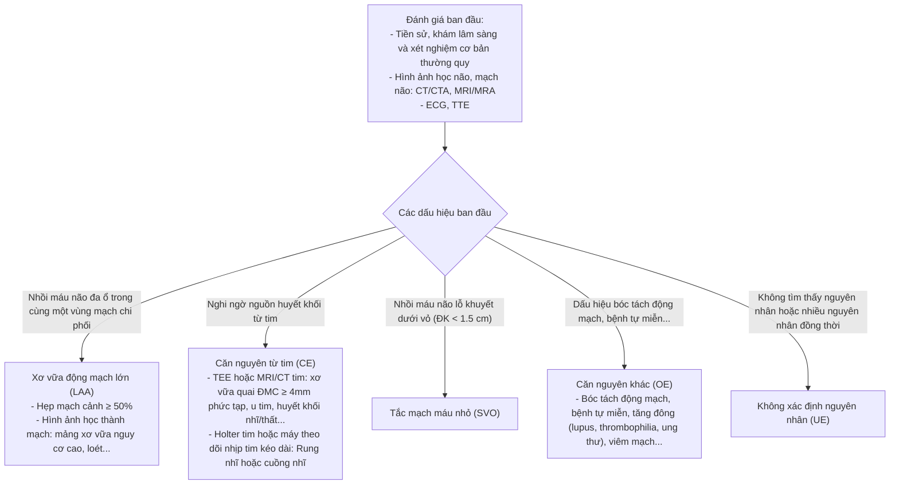
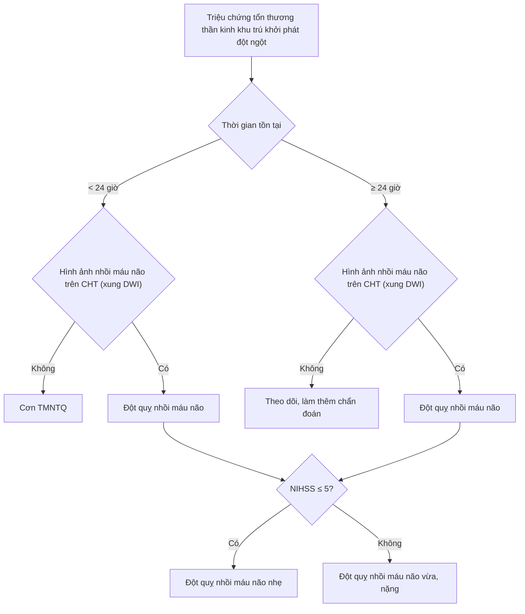
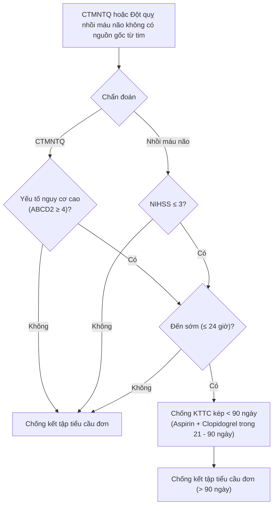
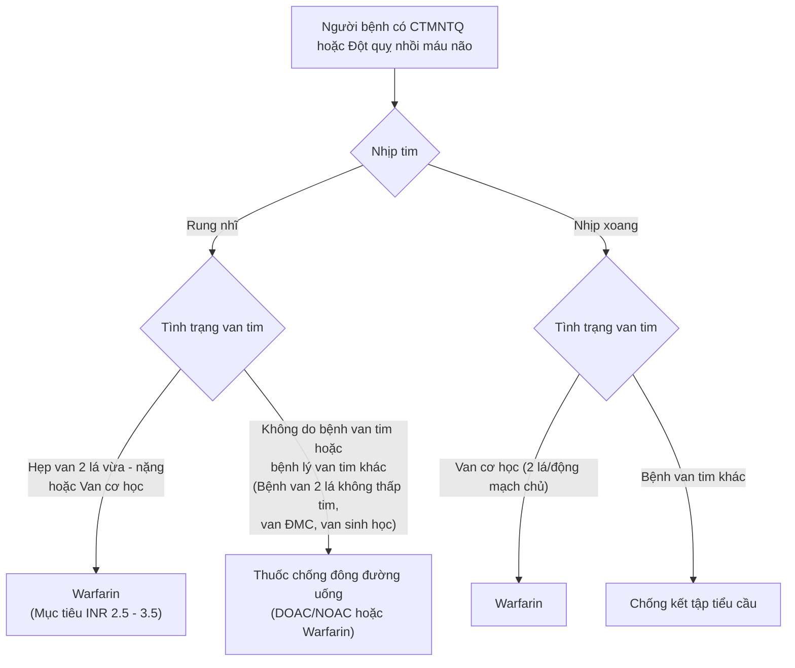
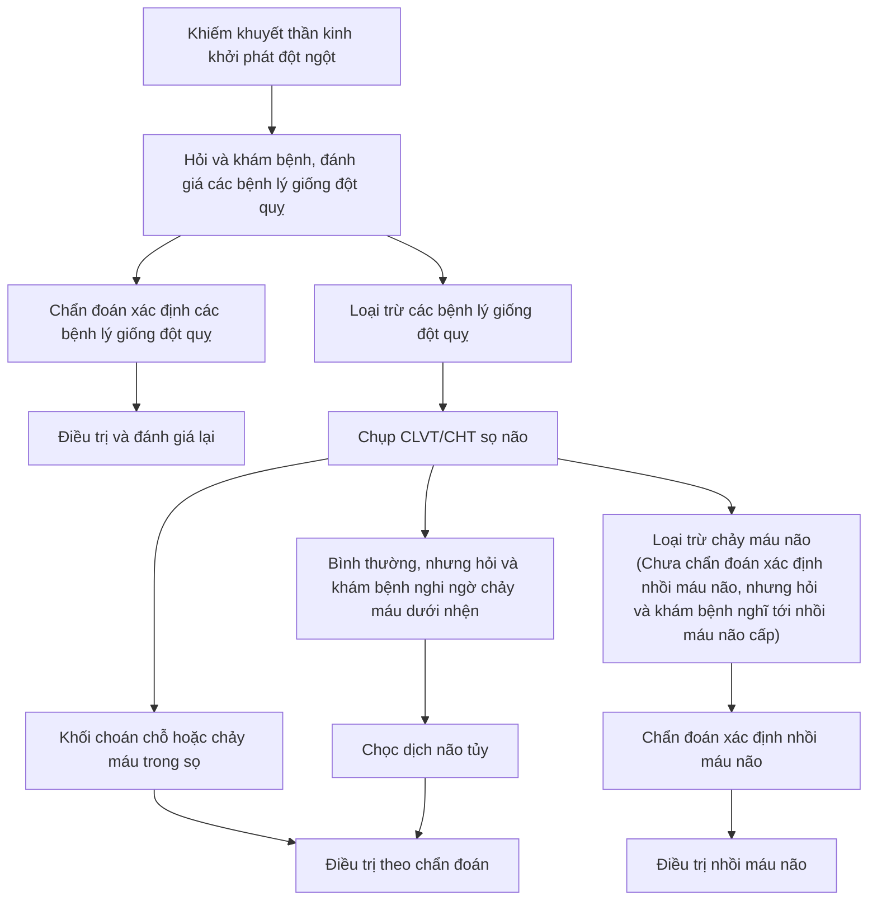
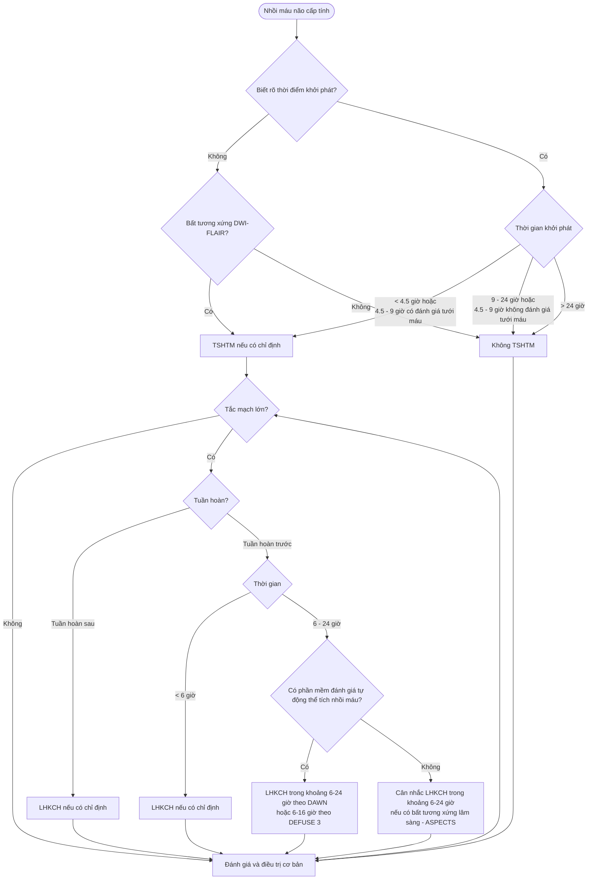
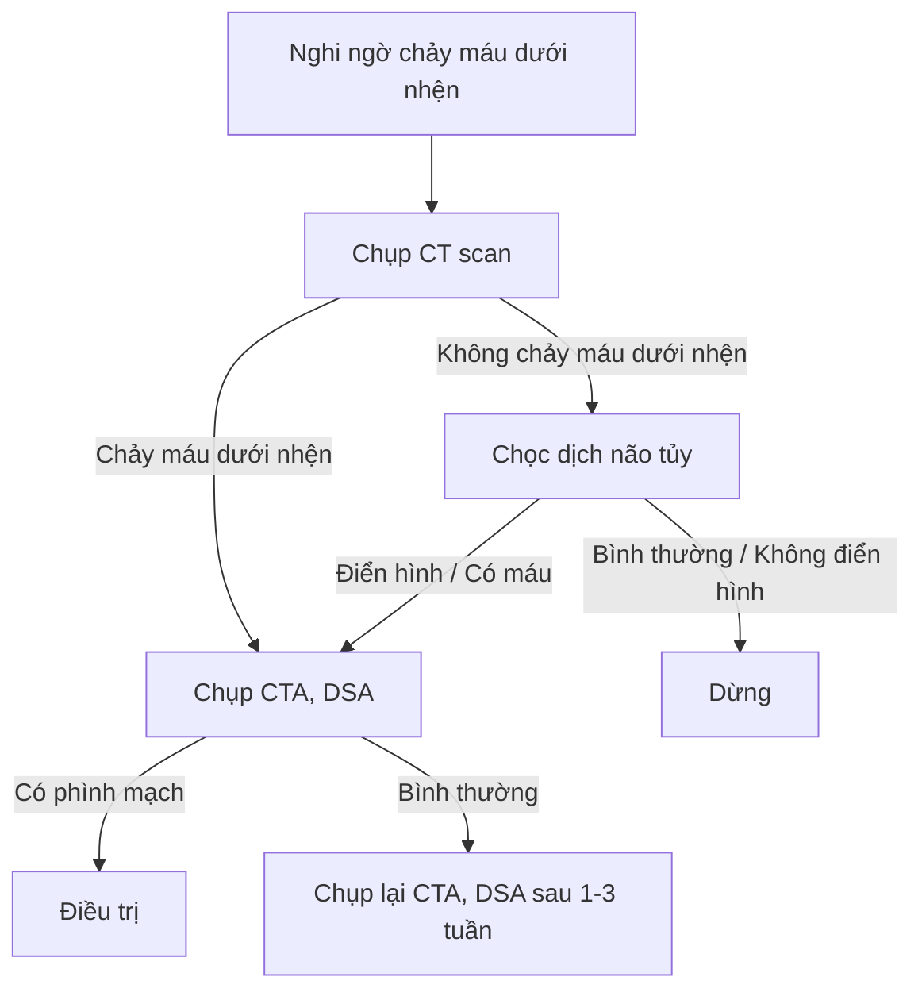
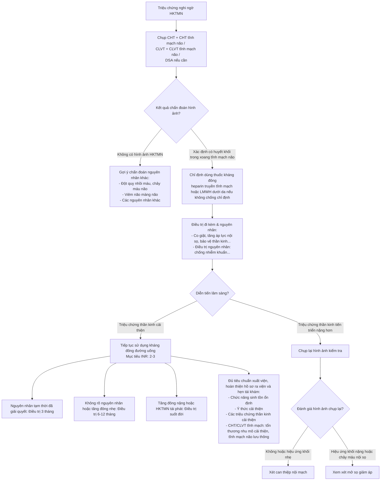
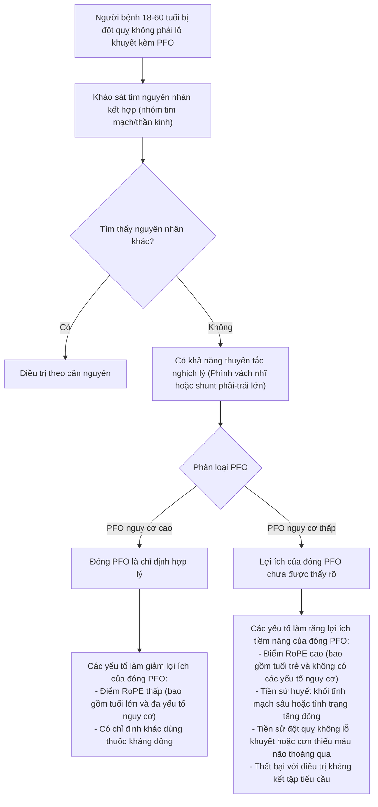
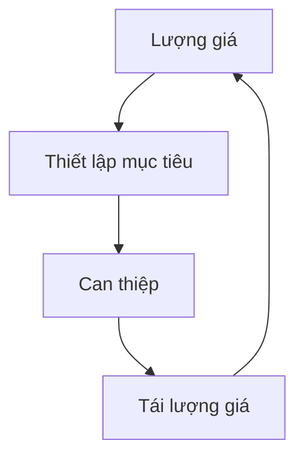

# BỘ Y TẾ
**Số: 3312/QĐ-BYT**

**CỘNG HÒA XÃ HỘI CHỦ NGHĨA VIỆT NAM**
**Độc lập - Tự do - Hạnh phúc**

*Hà Nội, ngày 05 tháng 11 năm 2024*

---

## QUYẾT ĐỊNH
### Về việc ban hành tài liệu chuyên môn "Hướng dẫn chẩn đoán và điều trị đột quỵ não"

#### BỘ TRƯỞNG BỘ Y TẾ

- Căn cứ Luật Khám bệnh, chữa bệnh năm 2023;
- Căn cứ Nghị định số 95/2022/NĐ-CP ngày 15 tháng 11 năm 2022 của Chính phủ quy định chức năng, nhiệm vụ, quyền hạn và cơ cấu tổ chức của Bộ Y tế;
- Theo đề nghị của Cục trưởng Cục Quản lý Khám, chữa bệnh.

### QUYẾT ĐỊNH:

**Điều 1.** Ban hành kèm theo Quyết định này tài liệu chuyên môn **"Hướng dẫn chẩn đoán và điều trị đột quỵ não"**.

**Điều 2.** Tài liệu chuyên môn **"Hướng dẫn chẩn đoán và điều trị đột quỵ não"** được áp dụng tại các cơ sở khám bệnh, chữa bệnh trong cả nước.

**Điều 3.** Quyết định này có hiệu lực kể từ ngày ký, ban hành và thay thế Quyết định số 5331/QĐ-BYT ngày 23 tháng 12 năm 2020 của Bộ trưởng Bộ Y tế về việc ban hành tài liệu chuyên môn **"Hướng dẫn chẩn đoán và xử trí đột quỵ não"**.

**Điều 4.** Các ông, bà: Chánh Văn phòng Bộ, Chánh Thanh tra Bộ, Cục trưởng và Vụ trưởng các Cục, Vụ thuộc Bộ Y tế, Giám đốc Sở Y tế các tỉnh, thành phố trực thuộc trung ương, Giám đốc các Bệnh viện trực thuộc Bộ Y tế, Thủ trưởng Y tế các ngành chịu trách nhiệm thi hành Quyết định này./.

**Nơi nhận:**
- Như Điều 4;
- Bộ trưởng (để b/c);
- Các Thứ trưởng;
- Cổng thông tin điện tử Bộ Y tế; Website Cục KCB;
- Lưu: VT, KCB.

**KT. BỘ TRƯỞNG**
**THỨ TRƯỞNG**

*(Đã ký)*

**Trần Văn Thuấn**

---

# HƯỚNG DẪN CHẨN ĐOÁN VÀ ĐIỀU TRỊ ĐỘT QUỴ NÃO
*(Ban hành kèm theo Quyết định số 3312/QĐ-BYT, ngày 05 tháng 11 năm 2024 của Bộ trưởng Bộ Y tế)*

**HÀ NỘI, 2024**

---

## DANH SÁCH BAN BIÊN SOẠN

### Chỉ đạo biên soạn
- **GS.TS. Trần Văn Thuấn** - Thứ trưởng Bộ Y tế

### Chủ biên
- **GS.TS. Nguyễn Văn Thông** - Chủ tịch Hội Đột quỵ Việt Nam
- **PGS.TS. Mai Duy Tôn** - Chủ tịch Hội Đột quỵ Thành phố Hà Nội, Giám đốc Trung tâm Đột quỵ - Bệnh viện Bạch Mai
- **PGS.TS. Nguyễn Huy Thắng** - Chủ tịch Liên chi Hội Đột quỵ Thành phố Hồ Chí Minh, Trưởng khoa Bệnh lý mạch máu não - Bệnh viện Nhân dân 115

### Tham gia biên soạn và thẩm định
- **GS.TS. Nguyễn Văn Thông** - Chủ tịch Hội Đột quỵ Việt Nam
- **PGS.TS. Lương Ngọc Khuê** - Nguyên Cục trưởng Cục Quản lý Khám, chữa bệnh - Bộ Y tế
- **TS. Nguyễn Trọng Khoa** - Phó Cục trưởng Cục Quản lý Khám, chữa bệnh - Bộ Y tế
- **PGS.TS. Mai Duy Tôn** - Chủ tịch Hội Đột quỵ thành phố Hà Nội, Giám đốc Trung tâm Đột quỵ - Bệnh viện Bạch Mai
- **PGS.TS. Nguyễn Huy Thắng** - Chủ tịch Hội Đột quỵ thành phố Hồ Chí Minh, Trưởng khoa Bệnh lý mạch máu não - Bệnh viện Nhân dân 115
- **PGS.TS. Nguyễn Hoàng Ngọc** - Phó Giám đốc Bệnh viện Trung ương Quân đội 108
- **PGS.TS. Phạm Nguyên Sơn** - Phó Chủ tịch Hội Tim mạch Việt Nam
- **TS. Trần Chí Cường** - Giám đốc Bệnh viện SIS Cần Thơ
- **TS. Nguyễn Thị Thu Huyền** - Phó Giám đốc Bệnh viện Hữu Nghị Việt Tiệp
- **PGS.TS. Lê Văn Trường** - Phó Giám đốc Bệnh viện Trung ương Quân đội 108
- **PGS.TS. Nguyễn Văn Chi** - Trung tâm Cấp cứu A9, Bệnh viện Bạch Mai
- **PGS.TS. Tạ Mạnh Cường** - Phó Viện trưởng Viện Tim mạch, Bệnh viện Bạch Mai
- **PGS.TS. Võ Hồng Khôi** - Giám đốc Trung tâm Thần kinh, Bệnh viện Bạch Mai
- **PGS.TS. Vũ Đăng Lưu** - Giám đốc Trung tâm Điện quang, Bệnh viện Bạch Mai
- **PGS.TS. Trần Anh Tuấn** - Phó Chủ tịch Hội Đột quỵ thành phố Hà Nội, Phó Giám đốc Trung tâm Điện quang, Bệnh viện Bạch Mai
- **TS. Đào Việt Phương** - Phó Giám đốc Trung tâm Đột quỵ, Bệnh viện Bạch Mai
- **TS. Trịnh Tiến Lực** - Phó Giám đốc Trung tâm Thần kinh, Bệnh viện Bạch Mai
- **PGS.TS. Lương Tuấn Khanh** - Giám đốc Trung tâm Phục hồi chức năng, Bệnh viện Bạch Mai
- **PGS.TS. Hoàng Bùi Hải** - Trưởng khoa Cấp cứu và Hồi sức tích cực, Bệnh viện Đại học Y Hà Nội
- **PGS.TS. Phạm Đình Đài** - Trưởng khoa Đột quỵ - Bệnh viện Quân y 103
- **TS. Nguyễn Anh Tài** - Trưởng khoa Nội Thần kinh, Bệnh viện Chợ Rẫy
- **TS. Trần Quang Thắng** - Trưởng khoa Cấp cứu và Đột quỵ, Bệnh viện Lão khoa Trung ương
- **TS. Nguyễn Bá Thắng** - Trưởng khoa Thần kinh, Bệnh viện Đại học Y Dược thành phố Hồ Chí Minh
- **TS. Nguyễn Văn Tuyển** - Chủ nhiệm khoa Đột quỵ - Phó Viện trưởng viện Thần Kinh, Bệnh viện Trung ương Quân Đội 108
- **PGS.TS. Nguyễn Đình Toàn** - Phó Chủ nhiệm bộ môn Nội, Đại học Y Dược Huế, Trung tâm Cấp cứu và Đột quỵ, Bệnh viện Đại học Y dược Huế
- **ThS. Lê Vũ Huỳnh** - Phó Trưởng khoa Đột quỵ, Bệnh viện đa khoa Trung ương Huế
- **ThS. Phạm Nguyên Bình** - Phó Trưởng khoa Bệnh lý mạch máu não, Bệnh viện Nhân dân 115
- **ThS. Trương Lê Vân Ngọc** - Trưởng phòng Nghiệp vụ - Bảo vệ sức khỏe cán bộ - Cục Quản lý Khám, chữa bệnh - Bộ Y tế
- **TS. Lê Quang Đức** - Chuyên viên Phòng Quản lý kinh doanh dược, Cục Quản lý Dược - Bộ Y tế

### Tổ thư ký
- **BSCKII. Nguyễn Tiến Dũng** - Phó Giám đốc Trung tâm Đột quỵ, Bệnh viện Bạch Mai
- **ThS. Trương Lê Vân Ngọc** - Trưởng phòng Nghiệp vụ - Bảo vệ sức khỏe cán bộ - Cục Quản lý Khám, chữa bệnh - Bộ Y tế
- **CN. Đỗ Thị Thư** - Cục Quản lý Khám, chữa bệnh - Bộ Y tế

---

## MỤC LỤC

1. Hướng dẫn chẩn đoán và điều trị đột quỵ nhẹ và cơn thiếu máu não thoáng qua ... 6
2. Hướng dẫn chẩn đoán và điều trị nhồi máu não cấp ... 16
3. Hướng dẫn chẩn đoán và điều trị chảy máu não ... 29
4. Hướng dẫn chẩn đoán và điều trị phình động mạch não vỡ ... 36
5. Hướng dẫn chẩn đoán và điều trị phình động mạch não chưa vỡ ... 47
6. Hướng dẫn chẩn đoán và điều trị huyết khối tĩnh mạch não ... 59
7. Hướng dẫn chẩn đoán và điều trị sa sút trí tuệ nguyên nhân mạch máu ... 70
8. Hướng dẫn chẩn đoán và điều trị dị dạng thông động tĩnh mạch não ... 79
9. Hướng dẫn sử dụng hình ảnh học trong chẩn đoán và điều trị nhồi máu não cấp ... 86
10. Hướng dẫn chẩn đoán và điều trị tiêu huyết khối trong nhồi máu não cấp ... 96
11. Hướng dẫn chẩn đoán và điều trị can thiệp nội mạch trong nhồi máu não cấp ... 107
12. Hướng dẫn chẩn đoán và điều trị dự phòng tái phát nhồi máu não theo căn nguyên ... 118
13. Phục hồi chức năng sau đột quỵ ... 130

---

## CHỮ VIẾT TẮT

| Chữ viết tắt | Ý nghĩa |
| :--- | :--- |
| **ASPECTS** | Thang điểm ASPECTS |
| **AVM** | Dị dạng động - tĩnh mạch |
| **CMN** | Chảy máu não |
| **CT/CLVT** | Cắt lớp vi tính |
| **CTMNTQ** | Cơn thiếu máu não thoáng qua |
| **ĐK** | Đường kính |
| **DNT** | Dịch não tủy |
| **DSA** | Chụp động mạch não số hóa xóa nền |
| **ECG** | Điện tâm đồ |
| **FFP** | Huyết tương tươi đông lạnh |
| **HATT** | Huyết áp tâm thu |
| **HK** | Huyết khối |
| **HKTMN** | Huyết khối tĩnh mạch não |
| **KKTTC** | Kháng kết tập tiểu cầu |
| **LHKCH/LHK** | Lấy huyết khối cơ học |
| **LMWH** | Heparin trọng lượng phân tử thấp |
| **MRI/CHT** | Cộng hưởng từ |
| **NIHSS** | Thang điểm NIHSS |
| **NMN** | Nhồi máu não |
| **NOAC/DOAC** | Chống đông đường uống thế hệ mới |
| **PCC** | Phức hợp prothrombin cô đặc |
| **PFO** | Còn lỗ bầu dục |
| **PHCN** | Phục hồi chức năng |
| **TIA** | Cơn thiếu máu não thoáng qua |
| **TMCB** | Thiếu máu cục bộ |
| **TSHTM/THK** | Tiêu sợi huyết tĩnh mạch / tiêu huyết khối |
| **TEE** | Siêu âm tim qua thực quản |
| **YTNC** | Yếu tố nguy cơ |

---

# HƯỚNG DẪN CHẨN ĐOÁN VÀ ĐIỀU TRỊ ĐỘT QUỴ NHẸ VÀ CƠN THIẾU MÁU NÃO THOÁNG QUA

## 1. ĐẠI CƯƠNG

### 1.1. Định nghĩa

#### 1.1.1. Đột quỵ nhẹ
**Đột quỵ nhẹ** là tình trạng đột quỵ nhồi máu não mà có điểm NIHSS (thang điểm đột quỵ của Viện sức khỏe Quốc gia Hoa Kỳ) $\le$ 5 điểm.

#### 1.1.2. Cơn thiếu máu não thoáng qua
**Cơn thiếu máu não thoáng qua (CTMNTQ)** được định nghĩa là sự khởi phát đột ngột triệu chứng thần kinh khu trú do thiếu máu não ở một khu vực hoặc võng mạc, và các triệu chứng này kéo dài không quá 24 giờ và không có sự hiện diện tổn thương nhồi máu não cấp trên hình ảnh cộng hưởng từ.

### 1.2. Dịch tễ học
Hàng năm tại Hoa Kỳ có 200.000 đến 500.000 trường hợp được chẩn đoán CTMNTQ. Tỷ lệ hiện mắc trong dân số chiếm 2,3% và 1/15 số người trên 65 tuổi có tiền căn CTMNTQ. Ở Anh, 150.000 trường hợp CTMNTQ xảy ra hàng năm. Theo báo cáo thống kê năm 2020 ở Hàn Quốc, 29,7% tổng số người bệnh nhồi máu não đến viện trong 24 giờ đầu là đột quỵ nhẹ và 7,4% các người bệnh đó bị rung nhĩ kèm theo nhồi máu não. Như vậy có đến ít nhất hơn một phần ba số người bệnh nhồi máu não cục bộ ở Hàn Quốc có mức độ nhẹ và người bệnh thiếu máu não thoáng qua trước đó có nhiều nguy cơ cao.

---

## 2. NGUYÊN NHÂN
- Xơ vữa động mạch lớn.
- Huyết khối tim.
- Tắc mạch nhỏ.
- Căn nguyên khác.
- Căn nguyên chưa xác định.

### Tiếp cận chẩn đoán nguyên nhân nhồi máu não theo Hội Đột quỵ Hoa Kỳ (phân loại TOAST)

---

## 3. CHẨN ĐOÁN

### 3.1. Lâm sàng
Một số dấu hiệu thần kinh khu trú điển hình có thể gặp và dễ bị bỏ qua như: méo miệng nhẹ, chóng mặt, thất điều, nói khó, rung giật nhãn cầu, rối loạn cảm giác một bên hoặc liệt nhẹ khu trú nửa người, liệt một tay hoặc chân, các triệu chứng có thể tiến triển nặng dần lên hoặc tiến triển nặng lên thành từng bậc.

Triệu chứng thần kinh khu trú gây khuyết tật được định nghĩa là khiếm khuyết thần kinh, nếu không cải thiện, sẽ ngăn cản người bệnh thực hiện các hoạt động cơ bản của cuộc sống hàng ngày (ví dụ: tắm/mặc quần áo, đi lại, vệ sinh và ăn uống) hoặc quay trở lại làm việc như thường ngày.

### 3.2. Cận lâm sàng

#### 3.2.1. Chẩn đoán hình ảnh
- **Cắt lớp vi tính sọ não không tiêm thuốc cản quang**: Phát hiện một số dấu hiệu sớm của nhồi máu não:
  - Mất phân biệt chất xám - chất trắng.
  - Giảm tỷ trọng nhân xám.
  - Giảm tỷ trọng vùng vỏ não, mất phân biệt rãnh cuộn não.
- **Cộng hưởng từ não - mạch não**:
  - Xác định vị trí và hình thái tổn thương nhu mô (tăng tín hiệu trên xung DWI và FLAIR), chảy máu chuyển dạng (giảm tín hiệu trên T2*).
  - Đánh giá mạch nội sọ qua xung TOF: vị trí hẹp/tắc/lóc tách.

#### 3.2.2. Chẩn đoán chức năng
- **Siêu âm tim qua thành ngực và qua thực quản**: Giúp xác định hẹp hai lá, bệnh lý van tim khác, suy tim, huyết khối buồng tim, còn lỗ bầu dục...
- **Điện tim và Holter điện tim**: Xác định rung nhĩ.
- **Siêu âm Doppler xuyên sọ**: Xác định tình trạng hẹp mạch nội sọ và phát hiện luồng thông phải - trái bằng test bong bóng khí.
- **Siêu âm Doppler mạch cảnh, động mạch đốt sống**: Xác định tình trạng vữa xơ, hẹp động mạch cảnh ngoài sọ.

#### 3.2.3. Các xét nghiệm máu
- Đánh giá công thức máu, CRP, PT, APTT, điện giải đồ, creatinine, glucose, HbA1c, lipid máu (Cholesterol toàn phần, LDL-Cholesterol, HDL-Cholesterol, ApoA, ApoB và Triglyceride máu), tốc độ máu lắng...
- Các xét nghiệm bệnh tự miễn như lupus, viêm mạch tự miễn, các yếu tố liên quan đến quá trình tăng đông như protein S, protein C, AT III...

### 3.3. Chẩn đoán xác định

#### 3.3.1. Cơn thiếu máu não thoáng qua
- Có triệu chứng tổn thương thần kinh khu trú, triệu chứng kéo dài < 24 giờ và không có hình ảnh tổn thương trên xung DWI của cộng hưởng từ não.

#### 3.3.2. Đột quỵ nhẹ
- Có triệu chứng tổn thương thần kinh khu trú, có hình ảnh tổn thương trên xung DWI của cộng hưởng từ não và điểm NIHSS $\le$ 5 điểm.

### 3.4. Chẩn đoán phân biệt
- Cần chẩn đoán phân biệt với một số bệnh có triệu chứng tương tự như đau nửa đầu, ngất, động kinh, cơn mất trí nhớ thoáng qua, cơn hạ glucose máu...

### Sơ đồ 1. Sơ đồ chẩn đoán cơn thiếu máu não thoáng qua và Đột quỵ nhồi máu não nhẹ (theo Hội Đột quỵ Hoa Kỳ)

---

## 4. ĐIỀU TRỊ

### 4.1. Nguyên tắc chung
- Điều trị dự phòng tái phát sớm nhất có thể.
- Điều trị căn nguyên và kiểm soát các yếu tố nguy cơ.

### 4.2. Mục tiêu điều trị
- CTMNTQ và đột quỵ nhẹ có nguy cơ tái phát sớm rất cao. Do vậy, mục tiêu điều trị CTMNTQ và đột quỵ nhẹ là làm giảm nguy cơ tái phát và tiến triển của bệnh.

### 4.3. Điều trị cụ thể

#### 4.3.1. Chống kết tập tiểu cầu
- **Chỉ định**: CTMNTQ hay đột quỵ nhẹ do xơ vữa mạch lớn, tắc mạch nhỏ hay chưa xác định rõ căn nguyên.
  - **CTMNTQ nguy cơ thấp (ABCD2 < 4)**:
    - Aspirin liều 81 - 325 mg/ngày, sau đó duy trì liều 81 - 100 mg/ngày.
    - Nếu tăng mẫn cảm với Aspirin hoặc viêm loét dạ dày thì chuyển sang:
      - Clopidogrel 75 mg/ngày hoặc
      - Aspirin 25 mg kết hợp với Dipyridamole 200 mg x 2 lần/ngày hoặc
      - Cilostazol 100 mg x 2 lần/ngày.
  - **Đối với CTMNTQ nguy cơ cao (ABCD2 ≥ 4) và đột quỵ nhẹ (NIHSS ≤ 3)**: Điều trị ngay lập tức, tối ưu trong 24 giờ đầu, có thể tối đa 7 ngày đầu:
    - Aspirin: Liều nạp 81 - 325 mg, sau đó duy trì liều 81 - 100 mg/ngày; kết hợp với:
    - Clopidogrel: Liều nạp 300 - 600 mg, sau đó duy trì 75 mg/ngày trong 21 - 90 ngày. Sau đó duy trì chống kết tập tiểu cầu đơn.
  - **Đối với CTMNTQ nguy cơ cao (ABCD2 ≥ 5) và đột quỵ nhẹ (NIHSS ≤ 5)**: Điều trị sớm, tối ưu trong 24 giờ đầu, có thể mở rộng đến tối đa 7 ngày đầu:
    - Aspirin liều 81 - 325 mg, sau đó duy trì liều 81 - 100 mg/ngày; kết hợp với:
    - Ticagrelor: Liều nạp 180 mg, sau 12 giờ dùng 90 mg. Sau đó duy trì 90 mg x 2 lần/ngày trong 30 ngày.
    - *Lưu ý*: Có nguy cơ chảy máu cao.

#### 4.3.2. Chống đông
- **Nhồi máu não hoặc CTMNTQ do rung nhĩ không có bệnh lý van tim**: Lựa chọn thuốc chống đông trực tiếp đường uống (DOAC/NOAC) như dabigatran, rivaroxaban, apixaban, edoxaban ưu tiên hơn kháng vitamin K.
- **Nhồi máu não hoặc CTMNTQ do căn nguyên tim: Van hai lá cơ học hoặc hẹp van hai lá mức độ trung bình đến nặng**: Sử dụng thuốc kháng vitamin K với mục tiêu INR từ 2,5 đến 3,5.
- **Nhồi máu não hoặc CTMNTQ do căn nguyên tim: Người bệnh đã phẫu thuật thay van hai lá hoặc van động mạch chủ sinh học**:
  - Thuốc kháng vitamin K: Mục tiêu INR 2 - 3 trong 3 - 6 tháng sau phẫu thuật đối với người bệnh có nguy cơ chảy máu thấp. Sau phẫu thuật 3 - 6 tháng, duy trì Aspirin 75 - 100 mg/ngày.

### Sơ đồ 2. Sơ đồ điều trị bằng thuốc chống kết tập tiểu cầu ở người bệnh có cơn thiếu máu não thoáng qua và Đột quỵ nhồi máu não (theo Hội Đột quỵ Hoa Kỳ)

### Sơ đồ 3. Sơ đồ khuyến cáo điều trị thuốc chống đông ở người bệnh có cơn thiếu máu não thoáng qua và Đột quỵ nhồi máu não (theo Hội Đột quỵ Hoa Kỳ)

#### 4.3.3. Điều trị căn nguyên và kiểm soát các yếu tố nguy cơ có thể thay đổi được
- **Tăng huyết áp**:
  - Mục tiêu: Huyết áp < 130/80 mmHg.
  - Lựa chọn thuốc huyết áp: Ưu tiên phối hợp 2 - 3 thuốc gồm ức chế thụ thể AT1 / ức chế men chuyển và lợi tiểu thiazide hoặc lợi tiểu giống thiazide.
- **Rối loạn lipid máu**:
  - Mục tiêu: LDL-C < 70 mg/dL (1,8 mmol/L).
  - Theo dõi sau 4 - 12 tuần, điều chỉnh liều mỗi 3 - 12 tháng.
  - Triglyceride cao: Phải tìm căn nguyên, thực hiện chế độ giảm glucid và rượu, sử dụng thêm Omega-3.
- **Đái tháo đường**: Mục tiêu HbA1c < 7%. Lựa chọn kết hợp các nhóm thuốc đái tháo đường phù hợp với nguy cơ bệnh lý tim mạch của người bệnh.
- **Béo phì**: Giảm cân và duy trì cân nặng mục tiêu (BMI < 23).
- **Ngưng thở khi ngủ**: Đeo máy CPAP hỗ trợ.
- **Hẹp xơ vữa mạch cảnh ngoại sọ**: Hẹp 50 - 99% có triệu chứng cân nhắc chỉ định đặt stent hoặc phẫu thuật bóc nội mạc kết hợp điều trị nội khoa tích cực. Cần tham vấn thêm chuyên gia.
- **Hẹp mạch nội sọ do lóc tách nội mạc**: Sử dụng Aspirin hoặc kháng vitamin K ít nhất 3 tháng. Cần tham vấn thêm chuyên gia.
- **Moyamoya**: Cân nhắc phẫu thuật bắc cầu nối hoặc sử dụng kháng kết tập tiểu cầu. Cần tham vấn thêm chuyên gia.
- **Rung nhĩ**:
  - Nếu có bệnh van tim: Dùng kháng vitamin K với mục tiêu INR 2,5 - 3,5.
  - Nếu không có bệnh van tim: Dùng kháng vitamin K hoặc thuốc chống đông đường uống thế hệ mới (NOAC/DOAC): apixaban, dabigatran, edoxaban, rivaroxaban.
- **Bệnh van tim**: Hẹp/hở nặng van 2 lá hoặc có van cơ học: Xem xét chỉ định phẫu thuật van và dùng kháng vitamin K mục tiêu INR 2,5 - 3,5.
- **Huyết khối nhĩ trái**: Dùng kháng vitamin K ít nhất 3 tháng.
- **Còn lỗ bầu dục (PFO)**: Cân nhắc can thiệp đóng lỗ thông. Cần tham vấn thêm chuyên gia.

#### 4.3.4. Thay đổi lối sống
- Tuân thủ điều trị, tái khám định kỳ, theo dõi, phát hiện sớm và kiểm soát tốt các yếu tố nguy cơ.
- Tập luyện thể dục thể thao thường xuyên.
- Tránh căng thẳng và không sử dụng các chất kích thích như rượu, bia, thuốc lá (kể cả thuốc lá điện tử).

### 4.4. Quản lý bệnh (tái khám)
- Tái khám để ghi nhận những cơn tương tự tại nhà, phát hiện những tác dụng phụ, biến chứng của thuốc để xử trí, điều chỉnh liều thuốc hoặc thay thế thuốc.

---

## 5. TIỀN TRIỂN VÀ BIẾN CHỨNG
- CTMNTQ và đột quỵ nhẹ có nguy cơ tái phát rất cao do đó cần điều trị dự phòng càng sớm càng tốt.
- CTMNTQ: Thang điểm ABCD2 giúp phân tầng nguy cơ tái phát đột quỵ: Nguy cơ thấp (0 - 3 điểm), nguy cơ cao (4 - 5 điểm) và nguy cơ rất cao (6 - 7 điểm).

### Bảng 1. Thang điểm ABCD2 theo Johnston

| Thành phần | Đặc điểm | Điểm số |
| :--- | :--- | :---: |
| **A (Age)** - Tuổi | $\ge$ 60 tuổi   < 60 tuổi | 1   0 |
| **B (Blood pressure)** - Huyết áp | Huyết áp tâm thu $\ge$ 140 mmHg và/hoặc Huyết áp tâm trương $\ge$ 90 mmHg | 1   0 |
| **C (Clinical features)** - Lâm sàng | Liệt nửa người   Nói ngọng, không liệt   Không ngọng, không liệt | 2   1   0 |
| **D1 (Duration)** - Thời gian | $\ge$ 60 phút   10 - 59 phút   < 10 phút | 2   1   0 |
| **D2 (Diabetes)** - Đái tháo đường | Có | 1   0 |

---

## 6. PHÒNG BỆNH:

- Kiểm soát tốt các yếu tố nguy cơ là các bệnh đồng mắc: tăng huyết áp, đái tháo đường, ...
- Chế độ ăn lành mạnh. Tăng cường vận động.
- Duy trì cân nặng lý tưởng.

## TÀI LIỆU THAM KHẢO

1. Guideline for the prevention of stroke in patients with stroke and transient ischemic attack (2021). AHA/ASA guideline. https://www.ahajournals.org/doi/10.1161/STR.0000000000000375.
2. Recent advances in the management of transient ischemic attacks (2021). https://www.ncbi.nlm.nih.gov/pmc/articles/PMC5658709.
3. Yakhkind A, McTaggart R.A, Jayaraman M.V, et al. (2016). Minor Stroke and Transient Ischemic Attack: Research and Practice, Frontiers in Neurology, 7. Doi: 10.3389/fneur.2016.00086.
4. KL Flurie, NS Rost (2021). Definition, etiology, and clinical manifestations of transient ischemic attack. https://www.uptodate.com.
5. Stroke: AHA/ASA Guidelines for the early management of patients with Acute Ischemic Stroke (2019). www.nursingcenter.com.
6. NS Rost (2021). Initial evaluation and management of transient ischemic attack and minor ischemic stroke. https://www.uptodate.com.
7. Hong-Kyun Park, Sang-Bae Ko, Keun-Hwa Jung, Min Uk Jang, Dae-Hyun Kim, Joon-Tae Kim, Jay Chol Choi, Hye Seon Jeong et al. (2022). Update of the Korean Clinical Practice Guidelines for Stroke: Antithrombotic Therapy for Patients with Acute Ischemic Stroke or Transient Ischemic Attack. Journal of Stroke 2022;24(1):166-175. Published online: January 31, 2022. DOI: https://doi.org/10.5853/jos.2021.02628

# HƯỚNG DẪN CHẨN ĐOÁN VÀ ĐIỀU TRỊ NHỒI MÁU NÃO CẤP

## 1. ĐẠI CƯƠNG

### 1.1. Khái niệm
**Nhồi máu não (NMN) cấp tính** là một dạng của đột quỵ não đặc trưng bởi tình trạng mất đột ngột dòng máu lưu thông tới một vùng của não, dẫn đến tổn thương nhu mô não và mất chức năng thần kinh tương ứng.

### 1.2. Tình hình bệnh tật
Đột quỵ não là bệnh lý có tỉ lệ mắc hàng năm rất cao, là một trong những nguyên nhân hàng đầu gây tử vong và khuyết tật trên thế giới, đa số các trường hợp đột quỵ não là nhồi máu não (ở Việt Nam tỷ lệ là 76,2%). Ước tính năm 2020 toàn thế giới có khoảng 11,71 triệu trường hợp đột quỵ não, trong đó có 7,59 triệu trường hợp nhồi máu não, có 7,08 triệu người chết do đột quỵ não, trong đó 3,48 triệu là nhồi máu não; 8-12% người bệnh bị nhồi máu não tử vong trong vòng 30 ngày. Tại Việt Nam, đột quỵ não là nguyên nhân gây tử vong hàng đầu trong giai đoạn 2009-2019 với mức tăng 9,1%.

## 2. NGUYÊN NHÂN
- Xin xem bài 1

## 3. CHẨN ĐOÁN

### 3.1. Lâm sàng
- Biểu hiện khởi phát hay gặp của nhồi máu não thường đột ngột với sự xuất hiện đơn độc hoặc phối hợp của các dấu hiệu và triệu chứng hay gặp sau:
  + Liệt nửa người, liệt một chi hoặc liệt tứ chi (hiếm gặp)
  + Mất hoặc giảm cảm giác nửa người
  + Mất thị lực một hoặc hai mắt
  + Khiếm khuyết trường thị giác
  + Nhìn đôi
  + Rối loạn ngôn ngữ
  + Liệt mặt
  + Thất điều
  + Chóng mặt (hiếm khi xuất hiện đơn độc)
  + Mất ngôn ngữ
  + Rối loạn tri giác đột ngột
- Thời điểm khởi phát triệu chứng hoặc thời điểm cuối cùng thấy người bệnh còn bình thường: là rất quan trọng để xét điều trị tái tưới máu. Nếu ngủ dậy đã có triệu chứng hoặc không có người chứng kiến thì gọi là đột quỵ không rõ thời điểm khởi phát.
- Khai thác tiền sử bệnh lý và dùng thuốc, chú ý các yếu tố nguy cơ của nhồi máu não.
- Đánh giá mức độ nặng của nhồi máu não bằng thang điểm đột quỵ của Viện Sức khỏe Quốc gia Hoa Kỳ (NIHSS) với 6 thành phần là tri giác, vận nhãn/thị trường, chức năng vận động, cảm giác và lãng quên, chức năng tiểu não và ngôn ngữ (xem phụ lục). NIHSS càng cao thì mức độ đột quỵ càng nặng.

### 3.2. Cận lâm sàng

#### 3.2.1. Chẩn đoán hình ảnh
Hình ảnh học thần kinh cần đánh giá ngay khi nhập viện đối với tất cả các người bệnh đột quỵ, bao gồm cắt lớp vi tính (CLVT) và/hoặc cộng hưởng từ (CHT).

##### a) Cắt lớp vi tính
- **CLVT sọ não không tiêm thuốc cản quang**:
  + Dấu hiệu sớm của nhồi máu não:
    * Giảm tỉ trọng các nhân xám
    * Xóa ranh giới chất trắng - chất xám
    * Dấu hiệu tăng đậm ở động mạch bị tắc
  + Đánh giá mức độ nặng của tổn thương nhu mô não thông qua thang điểm ASPECTS áp dụng cho tuần hoàn não trước và pc-ASPECTS áp dụng cho tuần hoàn não sau (xem phụ lục).
- **CLVT mạch máu não (từ 64 dãy trở lên)**:
  + Nhằm đánh giá:
    * Vị trí tắc mạch
    * Kích thước huyết khối
    * Tuần hoàn bàng hệ
    * Khả năng tiếp cận huyết khối khi can thiệp
- **CLVT tưới máu não**: tính các thể tích lõi nhồi máu và vùng tranh tối tranh sáng nhằm mở rộng cửa sổ điều trị tái thông mạch.

##### b) Cộng hưởng từ
- **Chụp cộng hưởng từ não mạch não không có thuốc đối quang từ**:
  + *Ưu điểm*: phát hiện tổn thương nhồi máu ở giai đoạn rất sớm.
    * Hình ảnh nhồi máu não cấp:
      - Xung ADC: giảm tín hiệu
      - Xung DWI: tăng tín hiệu
      - Xung FLAIR: giai đoạn sớm có thể chưa có tổn thương, giai đoạn sau tổn thương tăng tín hiệu sẽ dần hình thành trên FLAIR.
      - Xung T2*: đánh giá chảy máu não (hình ảnh giảm tín hiệu).
      - Xung TOF: đánh giá mạch máu não lớn.
  + *Nhược điểm*:
    * Không sẵn có ở nhiều cơ sở y tế
    * Thời gian chụp kéo dài, hình ảnh bị nhiễu nếu người bệnh không nằm yên.
    * Có các chống chỉ định: có máy tạo nhịp vĩnh viễn, van cơ học....
- **Chụp cộng hưởng từ tưới máu não**: tính các thể tích lõi nhồi máu và vùng tranh tối tranh sáng nhằm mở rộng cửa sổ điều trị tái thông mạch.

#### 3.2.2. Các chẩn đoán hình ảnh và thăm dò chức năng khác
- **Siêu âm Doppler xuyên sọ**: giúp đánh giá dòng chảy của các mạch máu đoạn gần như động mạch não giữa, động mạch cảnh đoạn trong sọ, hệ động mạch đốt sống - thân nền; ngoài ra còn có thể hỗ trợ chẩn đoán tình trạng còn lỗ bầu dục.
- **Siêu âm Doppler động mạch cảnh**: đánh giá hình thái và dòng chảy của các mạch máu ngoài sọ là động mạch cảnh, động mạch đốt sống.
- **Siêu âm Doppler tim (và/hoặc siêu âm tim qua thực quản)**: xác định các bệnh lý tim, van tim là căn nguyên gây đột quỵ: van tim cơ học, van tim sinh học, hẹp van hai lá...
- **Chụp cắt lớp vi tính/cộng hưởng từ tim**: xác định các nguyên nhân thuyên tắc từ tim nếu cần thiết.
- **Chụp động mạch não số hóa xóa nền**: giúp làm rõ và xác định các dấu hiệu nghi ngờ và/hoặc điều trị các tổn thương mạch máu như tắc mạch, hẹp, lóc tách, phình mạch...
- **Điện tâm đồ**: xác định các rối loạn nhịp gây đột quỵ: rung nhĩ, cuồng nhĩ.
- **Holter điện tâm đồ**: phát hiện rung nhĩ cơn đối với nhồi máu não chưa rõ căn nguyên.
- **Điện não đồ**: nếu nghi ngờ động kinh.

#### 3.2.3. Xét nghiệm
- Đường máu mao mạch.
- Tổng phân tích tế bào máu ngoại vi.
- **Đông máu**: thời gian prothrombin (PT), tỉ lệ prothrombin (PT%), thời gian thromboplastin một phần hoạt hóa (APTT), INR, fibrinogen, D-Dimer.
- **Sinh hóa máu**: chức năng thận (urê, creatinine), chức năng gan (ALT, AST), mỡ máu (cholesterol toàn phần, HDL-C, LDL-C, triglyceride), điện giải đồ, troponin T hoặc troponin I.
- Tổng phân tích nước tiểu.
- Xét nghiệm độc chất/ma túy ở những trường hợp nghi ngờ.
- Máu lắng, kháng thể kháng nhân (ANA), yếu tố dạng thấp (RF).
- Định lượng homocysteine máu, định lượng protein S, định lượng protein C.
- Cấy máu nếu nghi ngờ viêm nội tâm mạc nhiễm khuẩn.
- Các xét nghiệm di truyền nếu nghi ngờ có bệnh lý di truyền.

### 3.3. Chẩn đoán xác định
- Chẩn đoán xác định nhồi máu não cấp khi (xem Sơ đồ 1: Quy trình chẩn đoán nhồi máu não):
  + Lâm sàng: các triệu chứng khiếm khuyết thần kinh khu trú khởi phát đột ngột.
  + Cận lâm sàng: hình ảnh học thần kinh: loại trừ chảy máu não, chưa có tổn thương hoặc có các dấu hiệu sớm của nhồi máu não; không có hạ glucose máu.

### 3.4. Phân loại mức độ nặng nhồi máu não
Đánh giá mức độ nặng của nhồi máu não cấp thường dựa trên thang điểm NIHSS, một trong các cách phân loại theo điểm NIHSS. Đây là mức độ nhồi máu não theo lâm sàng và đánh giá ở những thời điểm nhất định. Mức độ nặng dựa trên biểu hiện lâm sàng thường thay đổi theo thời gian, theo các giai đoạn diễn tiến của nhồi máu não:
- **NIHSS = 0-5**: mức độ nhẹ
- **NIHSS = 6-10**: mức độ trung bình
- **NIHSS = 11-20**: mức độ vừa đến nặng
- **NIHSS > 20**: rất nặng, đe dọa tính mạng.

### 3.5. Chẩn đoán phân biệt

**Bảng 1: Một số bệnh lý phân biệt với nhồi máu não**

| Các bệnh lý | Các đặc trưng phân biệt |
| :--- | :--- |
| **Động kinh / Liệt Todd** | Liệt Todd là tình trạng liệt thoáng qua sau một cơn động kinh, tiến triển điển hình là hết liệt nhanh chóng. Nhưng cần thận trọng do các cơn động kinh có thể là thứ phát sau nhồi máu não. |
| **Ngất** | Không có các triệu chứng thần kinh kèm theo, hoặc có nhưng không kéo dài. |
| **Viêm não / màng não** | Các biểu hiện nhiễm trùng (sốt), các dấu hiệu màng não có thể kèm theo các tình trạng suy giảm miễn dịch; xác định bằng xét nghiệm dịch não tủy và/hoặc hình ảnh học thần kinh. |
| **Migraine** | Tiền sử các đợt bệnh tương tự, có dấu hiệu thoáng báo và nhức đầu; cần thận trọng do migraine cũng là yếu tố nguy cơ của nhồi máu não. |
| **U não / áp xe não** | Có các triệu chứng thần kinh, các dấu hiệu nhiễm trùng; phân biệt bằng hình ảnh học thần kinh. |
| **Tụ máu ngoài / dưới màng cứng** | Bệnh sử/tiền sử chấn thương, nghiện rượu, sử dụng thuốc chống đông, rối loạn đông máu; xác định bằng hình ảnh học thần kinh. |
| **Chảy máu não** | Khả năng cao là chảy máu não khi có hôn mê, cứng gáy, co giật, huyết áp tăng cao, nôn, đau đầu; xác định bằng hình ảnh học thần kinh. |
| **Chảy máu dưới nhện** | Đau đầu "sét đánh" xảy ra đột ngột, có các dấu hiệu màng não; xác định bằng hình ảnh học thần kinh, nếu bình thường thì chọc dịch não tủy. |
| **Huyết khối tĩnh mạch não** | Đau đầu tăng dần về mức độ kèm các triệu chứng thần kinh, tiền sử/bệnh sử có các yếu tố nguy cơ như uống thuốc tránh thai, nhiễm trùng lân cận...; xác định bằng hình ảnh học thần kinh có đánh giá hệ tĩnh mạch não. |
| **Hạ đường máu** | Tiền sử đái tháo đường; xác định bằng xét nghiệm đường máu. |
| **Hôn mê tăng áp lực thẩm thấu** | Tiền sử đái tháo đường; đường máu ở mức rất cao. |
| **Hạ natri máu** | Tiền sử dùng thuốc lợi tiểu, u não, dung nạp nước quá mức. |
| **Bệnh não tăng huyết áp** | Khởi phát bệnh từ từ; có các rối loạn chức năng não toàn thể, nhức đầu, sảng, tăng huyết áp, phù não. |
| **Bệnh não Wernicke** | Tiền sử nghiện rượu hoặc suy dinh dưỡng; tam chứng thất điều, liệt vận nhãn và lú lẫn. |
| **Viêm mê đạo** | Biểu hiện ưu thế là các triệu chứng tiền đình; thường không có các dấu hiệu thần kinh khu trú; có thể nhầm với đột quỵ tiểu não. |
| **Ngộ độc thuốc (lithium, phenytoin, carbamazepine)** | Tiền sử dùng thuốc; có thể xác định bằng các hội chứng ngộ độc tương ứng và định lượng nồng độ thuốc trong máu. Ngộ độc phenytoin và carbamazepine có thể biểu hiện thất điều, chóng mặt, buồn nôn và các phản xạ bất thường. |
| **Liệt Bell** | Chỉ có liệt dây VII ngoại biên đơn độc; thường ở độ tuổi trẻ hơn. |
| **Bệnh Ménière** | Tiền sử có các đợt bệnh tái phát, biểu hiện ưu thế là các triệu chứng chóng mặt, ù tai, điếc. |
| **Bệnh lý mất myelin (xơ cứng rải rác)** | Khởi phát bệnh từ từ; tiền sử nhiều đợt có các triệu chứng thần kinh ở các vùng giải phẫu khác nhau của hệ thần kinh trung ương. |
| **Rối loạn phân ly** | Không liệt các dây thần kinh sọ; các triệu chứng thần kinh không theo phân bố giải phẫu; tiền sử/bệnh sử hoặc kết quả khám mâu thuẫn. |

*Sơ đồ 1: Quy trình chẩn đoán nhồi máu não theo Hội Đột quỵ Hoa Kỳ 2019*

## 4. ĐIỀU TRỊ

### 4.1. Nguyên tắc chung
Khi phát hiện người bệnh đột quỵ cấp, cần nhanh chóng vận chuyển người bệnh an toàn đến cơ sở y tế có khả năng điều trị đột quỵ não với mục tiêu là giảm thiểu tối đa nguy cơ khuyết tật và tử vong cho người bệnh.

### 4.2. Mục tiêu điều trị
- Bảo tồn vùng tranh tối tranh sáng bằng các chiến lược tái tưới máu nếu có chỉ định.
- Kiểm soát các yếu tố nguy cơ và các bệnh lý đi kèm.
- Dự phòng tái phát, dự phòng và điều trị các biến chứng.
- Bảo vệ tế bào thần kinh.
- Phục hồi chức năng.

### 4.3. Điều trị cụ thể

#### 4.3.1. Kiểm soát đường thở, hô hấp, độ bão hòa oxy và dấu hiệu sinh tồn
- Đánh giá đường thở, hô hấp và tuần hoàn (ABC), kiểm soát đường thở và thông khí hỗ trợ khi cần thiết. Cho nằm ngửa đầu cao 30°. Nằm nghiêng tư thế an toàn nếu có rối loạn ý thức.
- Bổ dung oxy khi độ bão hòa oxy ≤ 94%, duy trì độ bão hòa oxy > 94%.
- Dùng thuốc hạ sốt (paracetamol) khi thân nhiệt > 38°C.

#### 4.3.2. Kiểm soát huyết áp
Theo dõi huyết áp một cách sát sao trong 24 giờ đầu kể từ khi khởi phát đột quỵ.

##### a) Có hạ huyết áp và giảm thể tích tuần hoàn
- Truyền dung dịch đẳng trương theo áp lực tĩnh mạch trung tâm.
- Khi đã đủ khối lượng tuần hoàn mà huyết áp vẫn không nâng lên được thì dùng các thuốc vận mạch như noradrenalin và/hoặc dobutamin.

##### b) Có tăng huyết áp
- **Nếu có chỉ định điều trị tiêu huyết khối đường tĩnh mạch**:
  + Hạ huyết áp xuống < 185/110 mmHg trước khi điều trị tiêu huyết khối đường tĩnh mạch.
  + Duy trì huyết áp < 180/105 mmHg trong 24 giờ đầu tiên sau khi điều trị tiêu huyết khối đường tĩnh mạch.
  + Không đặt mục tiêu hạ huyết áp tâm thu xuống mức 130-140 mmHg trong 72 giờ đầu tiên kể từ khi khởi phát.
- **Nếu không có chỉ định điều trị tiêu huyết khối đường tĩnh mạch**:
  + Nếu huyết áp < 220/110 mmHg: Không sử dụng thuốc hạ áp trong ít nhất 24 giờ đầu kể từ khi khởi phát, ngoại trừ người bệnh có bệnh mạch vành tiến triển, suy tim xung huyết, phình động mạch chủ, bệnh não tăng huyết áp, tiền sản giật hay sản giật.
  + Nếu huyết áp ≥ 220/120 mmHg: giảm 15% huyết áp tâm thu trong 24 giờ đầu.
- **Nếu có chỉ định lấy huyết khối cơ học**:
  + Duy trì huyết áp ≤ 185/110 mmHg trước khi làm can thiệp, duy trì ≤ 180/105 mmHg trong và sau can thiệp 24 giờ.
  + Không chủ động hạ huyết áp tâm thu xuống < 130 mmHg trong 24 giờ đầu sau can thiệp thành công.

##### c) Các thuốc điều trị tăng huyết áp và các chú ý khác
- Trong 24 giờ đầu, ưu tiên sử dụng thuốc hạ huyết áp đường tĩnh mạch ở các trường hợp có điều trị tái thông mạch máu do đòi hỏi phải đạt mục tiêu nhanh để điều trị càng sớm càng tốt, cụ thể như Bảng 2.
- Các trường hợp còn lại có thể dùng các thuốc hạ huyết áp đường uống để đạt mục tiêu điều trị và/hoặc dự phòng theo các khuyến cáo.

**Bảng 2: Các lựa chọn khi kiểm soát huyết áp ở người bệnh nhồi máu não cấp được điều trị tái thông mạch máu theo Hội Đột quỵ Hoa Kỳ 2019**

| Tình huống lâm sàng | Lựa chọn điều trị & Theo dõi |
| :--- | :--- |
| **Trước khi điều trị tái thông** (Nếu huyết áp > 185/110 mmHg) | - **Nicardipine**: 5 mg/giờ truyền tĩnh mạch, chỉnh liều 2,5 mg/giờ mỗi 5-15 phút, liều tối đa 15 mg/giờ. - Các thuốc khác có thể được chỉ định khi phù hợp. - **Lưu ý**: Không được điều trị tiêu huyết khối đường tĩnh mạch nếu huyết áp không được duy trì ≤ 185/110 mmHg. |
| **Trong và sau khi điều trị tái thông** (Nếu huyết áp tâm thu > 180-230 mmHg hoặc huyết áp tâm trương > 105-120 mmHg) | - **Theo dõi**: Mỗi 15 phút cho tới thời điểm 2 giờ sau khi bắt đầu điều trị tiêu huyết khối đường tĩnh mạch, sau đó mỗi 30 phút trong 6 giờ tiếp theo và mỗi giờ trong 16 giờ tiếp theo. - **Nicardipine**: 5 mg/giờ truyền tĩnh mạch, chỉnh liều 2,5 mg/giờ mỗi 5-15 phút, liều tối đa 15 mg/giờ. - Nếu huyết áp không kiểm soát được hoặc huyết áp tâm trương > 140 mmHg: Cân nhắc dùng **sodium nitroprusside** đường tĩnh mạch. |

#### 4.3.3. Điều trị tái thông mạch
##### a) Tiêu huyết khối đường tĩnh mạch
Điều trị chi tiết xin xem ở bài *Hướng dẫn chẩn đoán và điều trị Tiêu huyết khối trong nhồi máu não cấp*.

##### b) Tái tưới máu đường động mạch
Điều trị chi tiết xin xem ở bài *Hướng dẫn chẩn đoán và điều trị can thiệp nội mạch trong nhồi máu não cấp*.

#### 4.3.4. Kháng kết tập tiểu cầu
Điều trị chi tiết xin xem ở bài *Hướng dẫn chẩn đoán và điều trị phòng ngừa thứ phát nhồi máu não theo nguyên nhân*.

#### 4.3.5. Các thuốc statin
- **Mục tiêu điều trị**:
  + Giảm LDL-C 50% nồng độ so với mức nền và
  + LDL-C < 70 mg/dL (1,8 mmol/L).
- **Lựa chọn thuốc**:
  + Nhóm Statin:
    * Atorvastatin liều 20-80 mg/ngày
    * Các statin khác: rosuvastatin, simvastatin, pravastatin, ...
  + Cân nhắc phối hợp thêm ezetimibe.
  + Nếu vẫn không đạt mục tiêu với liều tối đa của statin và ezetimibe thì có thể cân nhắc dùng nhóm thuốc điều trị đích tác động PCSK9 (si-RNA hoặc kháng thể đơn dòng).

#### 4.3.6. Kiểm soát glucose máu
- **Hạ glucose máu**: Cần nhanh chóng bù đường khi glucose máu < 60 mg/dL (3,3 mmol/L).
- **Tăng glucose máu**: Điều trị khi glucose máu > 180 mg/dL (10 mmol/L) với mục tiêu điều trị là glucose máu trong khoảng 140-180 mg/dL (7,8-10 mmol/L).

#### 4.3.7. Xử trí phù não
- **Các dấu hiệu lâm sàng gợi ý phù não nặng** (mới xuất hiện hoặc tiến triển nặng hơn):
  + Phù não trên lều: giảm tri giác, giãn đồng tử, sụp mi.
  + Phù do nhồi máu tiểu não: giảm tri giác, mất phản xạ giác mạc, co đồng tử.
- **Các phương pháp làm giảm phù não**:
  + Mannitol đường tĩnh mạch: 1-2 g/kg trong 30-60 phút, có thể lặp lại mỗi 6-8 giờ.
  + Muối Natri ưu trương (3%, hoặc 5%, ...): thay thế khi người bệnh nằm điều trị khoa phòng hồi sức thần kinh.
  + Phẫu thuật mở sọ giảm áp: với nhồi máu não diện rộng có phù não đe dọa tính mạng.

#### 4.3.8. Xử trí cơn động kinh
- Không có chỉ định điều trị dự phòng tiên phát cơn động kinh sau đột quỵ, nhưng nên ngăn ngừa các cơn động kinh tiếp theo bằng thuốc chống động kinh.
- Một phần nhỏ người bệnh tiến triển thành động kinh mạn tính sau nhồi máu não, những trường hợp này xử trí tương tự như động kinh do các tổn thương thần kinh khác.

#### 4.3.9. Thuốc chống đông máu
Điều trị chi tiết xin xem thêm ở bài *Hướng dẫn chẩn đoán và điều trị phòng ngừa thứ phát nhồi máu não theo nguyên nhân*.

#### 4.3.10. Bảo vệ tế bào thần kinh
- Có thể dùng các thuốc bảo vệ tế bào thần kinh như: citicoline; peptid (cerebrolysin concentrate); saponin; cholin alfoscerate; phức hợp: succinic acid, nicotinamide, inosine và riboflavin sodium phosphat; piracetam... và các thuốc được cấp phép lưu hành sản phẩm và có phạm vi chỉ định.
### 4.3.11. Phục hồi chức năng, dự phòng và điều trị các biến chứng khác

Điều trị chi tiết xin xem thêm ở bài *Vật lý trị liệu sau đột quỵ*.

### 4.4. Quản lý bệnh

#### Theo dõi, tái khám
- Theo dõi và tái khám chuyên khoa đột quỵ định kỳ.
- Phục hồi chức năng.

---

### Sơ đồ 2: Quy trình điều trị nhồi máu não cấp theo Hội Đột quỵ Hoa Kỳ 2019

---

## 5. TIẾN TRIỂN VÀ BIẾN CHỨNG

### 5.1. Tiến triển
- Tiến triển và tiên lượng tùy thuộc vào các dạng và mức độ nặng của nhồi máu não.
- Thông thường, điểm NIHSS càng cao, tổn thương não càng rộng và vị trí nguy hiểm thì nguy cơ khuyết tật và tử vong càng cao.

### 5.2. Biến chứng
- **Biến chứng gần:** thoát vị não, chuyển dạng chảy máu, nhồi máu cơ tim, suy tim, khó nuốt, viêm phổi sặc, nhiễm trùng đường niệu, huyết khối tĩnh mạch sâu, thuyên tắc động mạch phổi, suy dinh dưỡng, loét do tỳ đè.
- **Biến chứng xa:** ngã, trầm cảm, sa sút trí tuệ, co cứng cơ, các biến chứng xương khớp.

---

## 6. PHÒNG BỆNH

### 6.1. Dự phòng tiên phát
- Dự phòng tiên phát: thay đổi lối sống, điều trị tăng huyết áp và đái tháo đường nếu có, điều trị rối loạn lipid máu bằng statin, bỏ thuốc lá, thuốc lào và tập thể dục.

### 6.2. Dự phòng thứ phát
- Thuốc kháng huyết khối (kháng kết tập tiểu cầu và kháng đông): duy trì lâu dài.
- Kiểm soát LDL-C mục tiêu $< 1,8 \text{ mmol/L}$.
- Kiểm soát các yếu tố nguy cơ đột quỵ:
  - Tăng huyết áp: mục tiêu huyết áp $< 130/80 \text{ mmHg}$.
  - Đái tháo đường: mục tiêu kiểm soát $\text{HbA1c} \le 7\%$.
  - Chế độ ăn lành mạnh.
  - Hoạt động thể chất.
- Xử trí nguyên nhân (Hội chẩn thêm ý kiến chuyên khoa phù hợp):
  - Hẹp van hai lá: nong van, thay van...
  - Hẹp động mạch cảnh trong (50-99%): đặt stent hoặc phẫu thuật bóc tách.
  - Còn lỗ bầu dục: hội chẩn chuyên khoa Tim mạch xét đóng lỗ bầu dục.

Chi tiết xin xem thêm ở bài *Hướng dẫn chẩn đoán và điều trị phòng ngừa thứ phát nhồi máu não theo nguyên nhân*.

---

### TÀI LIỆU THAM KHẢO

1. Tsao, C.W., et al. (2022), "Heart Disease and Stroke Statistics-2022 Update: A Report From the American Heart Association", *Circulation*, 145(8), pp. e153-e639.
2. GBD 2019 Diseases and Injuries Collaborators (2020), "Global burden of 369 diseases and injuries in 204 countries and territories, 1990-2019: a systematic analysis for the Global Burden of Disease Study 2019", *Lancet*, 396(10258), pp. 1204-1222.
3. Biller, J., Schneck, M.J., and Ruland, S. (2021), "Ischemic Cerebrovascular Disease", in Jankovic, J., et al., Editors, *Bradley's Neurology in Clinical Practice 8th Edition*, Elsevier Health Sciences, pp. 964-1013.
4. Powers, W.J., et al. (2019), "Guidelines for the Early Management of Patients With Acute Ischemic Stroke: 2019 Update to the 2018 Guidelines for the Early Management of Acute Ischemic Stroke: A Guideline for Healthcare Professionals From the American Heart Association/American Stroke Association", *Stroke*, 50(12), pp. e344-e418.
5. Sandset, E.C., et al. (2021), "European Stroke Organisation (ESO) guidelines on blood pressure management in acute ischaemic stroke and intracerebral haemorrhage", *Eur Stroke J*, 6(2), pp. XLVIII-LXXXIX.
6. Berge, E., et al. (2021), "European Stroke Organisation (ESO) guidelines on intravenous thrombolysis for acute ischaemic stroke", *Eur Stroke J*, 6(1), pp. I-LXII.
7. Turc, G., et al. (2019), "European Stroke Organisation (ESO) - European Society for Minimally Invasive Neurological Therapy (ESMINT) Guidelines on Mechanical Thrombectomy in Acute Ischaemic Stroke Endorsed by Stroke Alliance for Europe (SAFE)", *Eur Stroke J*, 4(1), pp. 6-12.
8. Turc, G., et al. (2022), "European Stroke Organisation (ESO)-European Society for Minimally Invasive Neurological Therapy (ESMINT) expedited recommendation on indication for intravenous thrombolysis before mechanical thrombectomy in patients with acute ischemic stroke and anterior circulation large vessel occlusion", *J Neurointerv Surg*, 14(3), p. 209.
9. Bouslama, M., et al. (2019), "Abstract 1: DAWN versus Modified Clinical-ASPECTS Mismatch Selection for Stroke Endovascular Therapy in the Early and Late Time Windows", *Stroke*, 50(Suppl_1): A1-A1.
10. Kleindorfer, D. O., et al. (2021), "2021 Guideline for the Prevention of Stroke in Patients With Stroke and Transient Ischemic Attack: A Guideline From the American Heart Association/American Stroke Association", *Stroke*, 52(7): e364-e467.

---

# HƯỚNG DẪN CHẨN ĐOÁN VÀ ĐIỀU TRỊ CHẢY MÁU NÃO

## 1. ĐẠI CƯƠNG

**Định nghĩa chảy máu não (CMN):**
Chảy máu não là hiện tượng máu chảy trực tiếp vào nhu mô não và/hoặc não thất mà căn nguyên không phải do chấn thương.

---

## 2. NGUYÊN NHÂN

### 2.1. Chảy máu nội sọ nguyên phát (80 - 85%)
- Chảy máu não do tăng huyết áp.
- Bệnh mạch máu dạng tinh bột.

### 2.2. Chảy máu nội sọ thứ phát (15 - 20%)
- Dị dạng mạch máu não vỡ: dị dạng thông động - tĩnh mạch não (AVM), phình động mạch não...
- Chảy máu do u não: u nguyên bào thần kinh đệm...
- Huyết khối xoang tĩnh mạch não.
- Chảy máu não do viêm động mạch hoặc tĩnh mạch.
- Chảy máu trong não do thuốc: rượu, amphetamin, cocain.
- Rối loạn đông máu:
  - Do thuốc chống đông, kháng kết tập tiểu cầu...
  - Do bệnh lý huyết học: giảm tiểu cầu, thiếu hụt yếu tố đông máu...

---

## 3. CHẨN ĐOÁN

### 3.1. Lâm sàng
- Biểu hiện lâm sàng tùy thuộc vị trí, tốc độ và chiều hướng lan rộng của chảy máu não.
- Bệnh khởi phát đột ngột. Các triệu chứng diễn biến nhanh và thường đạt tối đa sau 30 phút tới vài giờ.
- Triệu chứng hay gặp: đau đầu, buồn nôn, liệt nửa người, rối loạn ý thức.
- Giai đoạn toàn phát bệnh cảnh lâm sàng có thể gặp:
  - Rối loạn ý thức.
  - Tổn thương dây thần kinh sọ não: hay gặp liệt dây VII, dây III, dây II...
  - Liệt nửa người đối diện với bên ổ tổn thương.
  - Chảy máu não vùng đồi thị thường gây rối loạn cảm giác.
  - Chảy máu não ở vùng dưới vỏ não: các triệu chứng sẽ phụ thuộc vị trí tổn thương. Chảy máu não ở vùng thùy trán sau hay vùng đỉnh sẽ có triệu chứng thần kinh vận động hay rối loạn cảm giác sâu. Chảy máu thùy thái dương, thùy đỉnh hay thùy chẩm có thể có khuyết thị trường. Có thể có cơn động kinh khi chảy máu thùy trán, thùy thái dương hay thùy đỉnh.
  - Chảy máu não ở tiểu não: nhức đầu dữ dội vùng chẩm, thất điều, nôn. Nếu khối máu tụ lớn có thể gây rối loạn hô hấp, suy hô hấp, tụt kẹt hạnh nhân tiểu não dẫn đến tử vong.
  - Chảy máu thân não:
    - Rối loạn thần kinh thực vật: rối loạn thân nhiệt, rối loạn nhịp thở, rối loạn nuốt...
    - Đồng tử: các tổn thương ảnh hưởng trực tiếp hoặc gián tiếp đến thân não có thể gây giãn đồng tử bên đối diện.
    - Rối loạn cơ tròn.

### 3.2. Cận lâm sàng

#### 3.2.1. Chụp cắt lớp vi tính (CLVT) sọ não
- **Chụp cắt lớp vi tính sọ não không có thuốc cản quang:**
  - Hình ảnh ổ máu tụ tăng tỷ trọng từ 55 - 90 đơn vị Hounsfield (HU), thường có dạng tròn hoặc bầu dục, bờ rõ, có viền giảm tỷ trọng xung quanh do phù não.
  - Xác định thể tích khối máu tụ theo công thức của Broderick:
    $$V \text{ (cm}^3\text{)} = \frac{A \times B 	imes C}{2}$$
    - **A:** Đường kính lớn nhất của ổ máu tụ.
    - **B:** Đường kính lớn nhất vuông góc với A.
    - **C:** Đường kính tính bằng độ dày lát cắt của phim chụp nhân với số lát cắt quan sát thấy máu tụ.

*Hình ảnh 1: Chảy máu não trên phim chụp CLVT sọ não của người bệnh tại Bệnh viện Bạch Mai (No. 1964, M. 65Y).*

#### 3.2.2. Chụp cộng hưởng từ (CHT) não mạch não
- Có thể phát hiện các nguyên nhân gây chảy máu: cavernoma, u não chảy máu, vi chảy máu não...
- Cộng hưởng từ não mạch não có tiêm thuốc thì tĩnh mạch não là phương pháp tối ưu chẩn đoán huyết khối xoang tĩnh mạch não.

#### 3.2.3. Chụp mạch não và chụp động mạch não số hóa xóa nền
- **Chụp cắt lớp vi tính mạch máu (CTA):** xác định các nguyên nhân gây chảy máu: cavernoma, u não chảy máu, vi chảy máu não...
- **Chụp động mạch não số hóa xóa nền (DSA):** giúp chẩn đoán xác định và can thiệp các nguyên nhân gây chảy máu não.

#### 3.2.4. Xét nghiệm cơ bản
- Tổng phân tích tế bào máu ngoại vi.
- Sinh hóa máu: glucose, ure, creatinin, GOT, GPT, điện giải đồ.
- Chức năng đông máu: thời gian chảy máu, thời gian đông máu, định lượng prothrombin (PT), aPTT giúp phát hiện rối loạn đông máu. Định lượng INR hoặc yếu tố Xa nếu có thể.
- Xét nghiệm độc chất: rượu, cocain, ma túy tổng hợp...
- Điện tâm đồ: xác định có thiếu máu cục bộ cơ tim/nhồi máu cơ tim, loạn nhịp tim và phì đại buồng tim gợi ý bệnh cơ tim hay bệnh van tim.

### 3.3. Chẩn đoán xác định
- **Lâm sàng:** triệu chứng lâm sàng tùy thuộc khu vực chảy máu mà có biểu hiện điển hình.
- **Chụp cắt lớp vi tính sọ não không tiêm thuốc cản quang:** chẩn đoán xác định.
- **Chụp cắt lớp vi tính mạch máu não, cộng hưởng từ mạch máu não, chụp động mạch não số hóa xóa nền:** giúp chẩn đoán nguyên nhân.

### 3.4. Chẩn đoán phân biệt
- Nhồi máu não.
- Bệnh não tăng huyết áp.
- Hạ đường máu.
- Biến chứng của bệnh Migraine.
- Co giật.

---

## 4. ĐIỀU TRỊ

### 4.1. Nguyên tắc chung
- Người bệnh nên theo dõi và điều trị tại Đơn vị Hồi sức Thần kinh hoặc Đơn vị Đột quỵ.
- Theo dõi sát về lâm sàng và hình ảnh học để có xử trí phù hợp, kịp thời.
- Đánh giá căn nguyên chảy máu não bao gồm khảo sát mạch máu não nên được tiến hành càng sớm càng tốt để có chiến lược điều trị dự phòng phù hợp.

### 4.2. Mục tiêu điều trị
- Phẫu thuật (nếu có chỉ định).
- Cầm máu và ngăn ngừa sự lan rộng của khối máu tụ.
- Chống phù não.
- Điều trị triệu chứng.
- Điều trị và dự phòng biến chứng.
- Phục hồi chức năng.
- Điều trị và dự phòng các yếu tố nguy cơ kèm theo.

### 4.3. Điều trị cụ thể

**Cấp cứu theo quy trình ABC:**
- **Kiểm soát đường thở (Airway)**
- **Hỗ trợ hô hấp (Breathing)**
- **Kiểm soát tim mạch (Circulation)**

Cân nhắc đặt nội khí quản trong trường hợp suy hô hấp, đảm bảo duy trì nồng độ bão hòa oxy trong máu trên 94%.

#### 4.3.1. Phương pháp phẫu thuật
Hội chẩn với chuyên khoa phẫu thuật thần kinh để đưa ra chỉ định:
- **Phẫu thuật lấy khối máu tụ** kèm hoặc không mở nắp sọ giải chèn ép khi: khối máu tụ nhu mô trên lều lớn hoặc đè đẩy đường giữa và phù não rõ.
- **Dẫn lưu não thất ra ngoài** có hoặc không tiêu huyết khối não thất đối với chảy máu não thất: chảy máu não thất gây giãn não thất.
- **Chảy máu tiểu não** có ý thức xấu dần hoặc chèn ép thân não và/hoặc bị giãn não thất do tắc nghẽn. Điều trị ở những người bệnh này là phẫu thuật lấy khối máu tụ, có hoặc không kèm dẫn lưu não thất.

#### 4.3.2. Điều trị can thiệp nội mạch
Chỉ định đối với chảy máu não có nguyên nhân:
- Phình động mạch não.
- Dị dạng thông động - tĩnh mạch não (AVM).
- Rò động tĩnh mạch màng cứng não.

#### 4.3.3. Phương pháp không phẫu thuật

- **Kiểm soát huyết áp:**
  - Điều trị huyết áp sớm nhất có thể, tốt nhất không quá 2 giờ kể từ thời điểm khởi phát.
  - Trong 6 giờ đầu: duy trì $130 \text{ mmHg} < \text{HATT} < 150 \text{ mmHg}$ và HATT không giảm quá 90 mmHg so với ban đầu, duy trì ít nhất 7 ngày.
- **Tăng áp lực nội sọ (ICP):**
  - Theo dõi ICP cho các người bệnh có điểm Glasgow $< 8$ điểm.
  - Kê cao đầu giường 20 - 30 độ.
  - Sử dụng thêm giảm đau và an thần.
  - Cân nhắc tăng thông khí nếu cần. Mục tiêu $pCO_2$ máu 30 - 35 mmHg.
  - **Liệu pháp tăng thẩm thấu:**
    - Mannitol 20%: 0,5 - 1,5 g/kg liều nạp, liều duy trì 0,25 - 0,75 g/kg mỗi 4 - 6 giờ, truyền tĩnh mạch nhanh.
    - Dung dịch muối ưu trương $\ge 3\%$: mục tiêu nồng độ natri huyết thanh 145 - 155 mmol/L và áp lực thẩm thấu máu 300 - 320 mOsm/L. Theo dõi áp lực thẩm thấu hoặc natri huyết thanh và chức năng thận để điều chỉnh.
- **Kiểm soát mức glucose máu:** mục tiêu glucose 4 - 11 mmol/L.
- **Cầm máu và bệnh lý đông máu:**
  - Thiếu yếu tố đông máu hoặc giảm tiểu cầu: truyền yếu tố đông máu và khối tiểu cầu.
  - **Chảy máu não có INR tăng do dùng kháng vitamin K:**
    - Ngừng ngay thuốc kháng vitamin K.
    - Truyền vitamin K tĩnh mạch, mục tiêu INR $< 1,3$. Xét nghiệm INR mỗi 12 - 24 giờ để điều chỉnh.
    - Truyền huyết tương tươi đông lạnh (FFP) hoặc phức hợp prothrombin cô đặc (PCC).
  - **Chảy máu não đang dùng heparin (trọng lượng phân tử thấp hoặc không phân đoạn):**
    - Tiêm protamine sulfat trung hòa.
    - Liều protamine sulfat phụ thuộc vào liều heparin và thời gian dùng liều heparin cuối cùng trước đó.
  - **Chảy máu não đang dùng chống đông đường uống thế hệ mới (NOACs):**
    - Nếu người bệnh đang sử dụng dabigatran: chỉ định sử dụng idarucizumab để trung hòa tác dụng hoặc phức hợp prothrombin cô đặc (PCC).
    - Nếu người bệnh đang sử dụng thuốc đối kháng yếu tố Xa (như apixaban, rivaroxaban, edoxaban): chỉ định sử dụng phức hợp prothrombin cô đặc (PCC).
- **Điều trị các tình trạng co giật, sốt, suy hô hấp, rối loạn điện giải và thăng bằng kiềm toan.**
- **Hạ thân nhiệt** làm giảm hoặc ngăn ngừa phù não quanh khối máu tụ và cải thiện diễn biến lâm sàng.
- **Dự phòng và điều trị biến chứng:**
  - Rối loạn nuốt: sàng lọc, tập phục hồi chức năng sớm.
  - Cơn động kinh và thuốc chống động kinh: Cắt cơn bằng diazepam 10 mg hoặc phenytoin và phối hợp với thuốc kháng động kinh.
  - Huyết khối tĩnh mạch sâu và tắc mạch phổi:
    - Người bệnh vận động sớm.
    - Đeo băng áp lực ngắt quãng dự phòng huyết khối chi dưới.
    - Xem thêm "Hướng dẫn điều trị dự phòng thuyên tắc huyết khối tĩnh mạch" theo Quyết định số 3908/QĐ-BYT của Bộ Y tế.
  - Trầm cảm sau đột quỵ: sử dụng thuốc chống trầm cảm. Hội chẩn thêm chuyên khoa Tâm thần.
  - Chảy máu tiêu hóa: sử dụng thuốc PPIs và hội chẩn thêm chuyên khoa Tiêu hóa.
  - Nhiễm khuẩn: nuôi cấy dịch và sử dụng kháng sinh theo kháng sinh đồ.
  - Loét do tỳ đè: lăn trở người bệnh 3 giờ/lần, nằm đệm hơi. Phát hiện sớm và chăm sóc điểm loét.
  - Suy dinh dưỡng: hội chẩn chuyên gia dinh dưỡng để có chế độ ăn phù hợp.
- **Thuốc bảo vệ tế bào thần kinh:** có thể sử dụng các thuốc như: citicoline, peptid (cerebrolysin concentrate), cholin alfoscerate và các thuốc được cấp phép lưu hành sản phẩm và có phạm vi chỉ định.

---

## 5. TIẾN TRIỂN VÀ BIẾN CHỨNG

- Có 20% đến 30% người bệnh chảy máu não có khả năng sinh hoạt độc lập sau 6 tháng.
- Các yếu tố: tuổi cao, rối loạn ý thức và chảy máu não thất là yếu tố tiên lượng xấu.

### Bảng điểm ICH dự đoán tỷ lệ tử vong trong 30 ngày đầu (theo Hội Đột quỵ Hoa Kỳ)

| Tiêu chí | Mức độ | Điểm |
| :--- | :--- | :--- |
| **Điểm Glasgow (GCS)** | 3 - 4 | 2 |
| | 5 - 12 | 1 |
| | 13 - 15 | 0 |
| **Thể tích khối máu tụ** | $\ge 30\text{ ml}$ | 1 |
| | $< 30\text{ ml}$ | 0 |
| **Có máu trong não thất** | Có | 1 |
| | Không | 0 |
| **Vị trí chảy máu** | Dưới lều | 1 |
| | Trên lều | 0 |
| **Tuổi** | $\ge 80$ | 1 |
| | $< 80$ | 0 |

**Tỷ lệ tử vong dự đoán trong 30 ngày theo tổng điểm (0 - 6):**
- **0 điểm:** 0%
- **1 điểm:** 13%
- **2 điểm:** 26%
- **3 điểm:** 72%
- **4 điểm:** 97%
- **5 - 6 điểm:** 100%

---

## 6. DỰ PHÒNG TÁI PHÁT

- **Kiểm soát huyết áp:**
  - Mục tiêu HA $< 130/80\text{ mmHg}$.
  - Các nhóm thuốc huyết áp được khuyến cáo: lợi tiểu thiazide/thiazide-like, chẹn kênh canxi và ức chế men chuyển/ức chế thụ thể.
- **Duy trì lối sống lành mạnh:**
  - Chế độ ăn lành mạnh.
  - Kiểm soát cân nặng.
  - Ngừng hút thuốc lá và giảm caffeine.
  - Điều trị hội chứng ngưng thở khi ngủ.
- **Xử trí sớm các dị dạng mạch máu não khi chưa vỡ:** AVM, phình mạch não...

---

### TÀI LIỆU THAM KHẢO

1. Nguyễn Minh Hiện (2013), "Đột quỵ chảy máu não", *Đột quỵ não*, Nhà xuất bản Y học, tr. 196.
2. Nguyễn Văn Thông (2020), "Chăm sóc người bệnh đột quỵ chảy máu não", Trong cuốn *Chăm sóc và điều trị người bệnh đột quỵ*, Hội Đột quỵ Việt Nam, Nhà xuất bản Y học, tr. 230.
3. Tổ chức Đột quỵ Thế giới và Bộ Y tế Việt Nam (2008), *Chương trình đào tạo cơ bản điều trị đột quỵ*, Hà Nội 23-4.
4. AHA/ASA (American Heart Association/American Stroke Association) (2012), "Guidelines for the Prevention, Detection, Evaluation and Management of High Blood Pressure in Adults".
5. Kistler P., Ropper A. (2008), "Cerebrovascular disease", in Fauci and Longo, eds, *Harrison's Principles of Internal Medicine*, New York, McGraw-Hill (17th ed), pp. 7919-7984.
6. Michael Brainin, Wolf-Dieter Heiss (2019), "Chảy máu não", Trong cuốn *Đột quỵ não sinh lý bệnh và cập nhật điều trị*, Ấn bản lần thứ 3, Biên dịch: Nguyễn Quang Tuấn, Nguyễn Văn Chi, Mai Duy Tôn, Nhà xuất bản Y học.
7. BMJ Best Practice (2021), "Stroke due to spontaneous intracerebral haemorrhage".
8. Sandset E.C., Anderson C.S., Bath P.M., et al. (2021), "European Stroke Organisation (ESO) guidelines on blood pressure management in acute ischaemic stroke and intracerebral haemorrhage", *Eur Stroke J*, 6(2), pp. 48-89.

---

# HƯỚNG DẪN CHẨN ĐOÁN VÀ ĐIỀU TRỊ PHÌNH ĐỘNG MẠCH NÃO VỠ

## 1. ĐẠI CƯƠNG

### 1.1. Khái niệm
- Phình động mạch não hay còn gọi là phình mạch não: là tình trạng một vị trí của động mạch não bị phình, giãn to ra do nhiều nguyên nhân khác nhau.
- Phình mạch não vỡ: phình mạch não tiến triển thầm lặng gần như không có biểu hiện triệu chứng cho đến khi vỡ gây máu chảy vào khoang dưới nhện và/hoặc nhu mô não và/hoặc não thất.

### 1.2. Phân loại
Phình mạch não chia làm ba loại gồm:
- Phình mạch hình túi: thường gặp nhất, chiếm 98%.
- Phình mạch hình thoi.
- Phình bóc tách.

### 1.3. Tình hình bệnh tật
- Tỷ lệ mắc bệnh khoảng 1,5 - 8%, trung bình là 5% ở Hoa Kỳ và các nước châu Âu, châu Mỹ. Tuổi thường gặp từ 40 - 65. Nữ giới có tỷ lệ cao hơn nam giới 1,6 lần. Tỷ lệ vỡ phình mạch não trung bình khoảng 1 - 2% trong số người mắc.

---

## 2. NGUYÊN NHÂN

- Phình động mạch não hình thành có thể do:
  - Tổn thương vi mô của thành động mạch não trong quá trình vữa xơ động mạch, do dòng chảy bất thường ở vị trí phân chia của các động mạch.
  - Hậu quả của sự gia tăng huyết động (ở các vị trí phân chia động mạch), quá trình viêm và yếu tố di truyền.
  - Tăng huyết áp, uống nhiều rượu, hút thuốc lá và một số nguyên nhân khác như nấm, nhiễm khuẩn, chấn thương, nghiện ma túy (đặc biệt là cocain) gây viêm, phóng xạ và u.
- Nguy cơ cao vỡ phình mạch gồm:
  - Tiền sử chảy máu dưới nhện.
  - Tuổi từ 40 đến 65, nữ cao hơn nam 1,6 lần.
  - Phình động mạch não kích thước 4 - 7 mm.
  - Phình động mạch não có nhiều thùy (phình mạch mẹ con).\n
- **Phình động mạch thông trước và đỉnh động mạch thân nền**
- **Phình động mạch cổ nhỏ**, tỷ lệ kích thước đáy túi phình/kích thước cổ túi phình > 1,6 có nguy cơ vỡ cao.
- **Phình mạch kết hợp với dị dạng động - tĩnh mạch (AVM)**, nhất là phình mạch nằm trên động mạch nuôi khối AVM.

## 3. CHẨN ĐOÁN

### 3.1. Lâm sàng

**Bệnh cảnh lâm sàng chảy máu dưới nhện:**
- 10% số người bệnh tử vong mà không kịp cấp cứu.
- Đau đầu dữ dội, cảm giác như "đau đầu sét đánh", đau như muốn "vỡ tung đầu", đau lan xuống vùng gáy chẩm.
- Nôn: là triệu chứng thường gặp.
- Rối loạn ý thức, hồi phục nhanh sau một khoảng thời gian ngắn với những trường hợp chảy máu ít.
- Các triệu chứng khác: co giật, mất thăng bằng, giảm thị lực (ít giá trị).
- Khám: có các dấu hiệu màng não, trong đó dấu hiệu cứng gáy là dấu hiệu thường gặp có giá trị chẩn đoán cao.

**Bệnh cảnh lâm sàng đột quỵ chảy máu nội sọ:**
- Thường gặp chảy máu não ở thùy trán (vỡ phình động mạch thông trước), thùy thái dương vùng khe Sylvius (nơi phân chia M1, M2 của động mạch não giữa).
- Lâm sàng: liệt nửa người không đồng đều, rối loạn tâm thần, tổn thương các dây thần kinh sọ não, hội chứng tăng áp lực trong sọ.

### 3.2. Cận lâm sàng

- **Các xét nghiệm thường quy:**
  - Công thức máu, đông máu toàn bộ.
  - Chức năng gan thận, điện giải đồ, glucose, men tim, nước tiểu, điện tim, siêu âm tim, chụp X-quang tim phổi.
- **Chọc dịch não tủy:** có máu hoặc các thành phần thoái biến từ hemoglobin (xanthochromia) là tiêu chuẩn vàng chẩn đoán chảy máu dưới nhện khi lâm sàng nghi ngờ chảy máu dưới nhện mà cắt lớp vi tính hoặc cộng hưởng từ không phát hiện ra.
- **Chẩn đoán hình ảnh:**
  - **Chụp cắt lớp vi tính (CLVT):**
    - Phát hiện 99% ở ngày đầu, 85% trường hợp chảy máu dưới nhện trong 5 ngày đầu.
    - Hình ảnh của máu trong khoang dưới nhện là: tăng tỷ trọng ở quanh đa giác Willis, khe rãnh cuộn não, quanh cầu-cuống não, có thể thấy hình ảnh máu trong não thất.
    - Phân độ Fisher trên CLVT nhằm mục đích tiên lượng co thắt mạch.
  - **Chụp cộng hưởng từ (CHT):**
    - Nhận dạng chảy máu khoang dưới nhện, trong não thất qua một số xung như T2, FLAIR, T1, T2*, SWI.
    - Trên xung mạch TOF-3D cho phép xác định túi phình và liên quan của các nhánh mạch lân cận quanh cổ phình mạch.
    - MRA có giá trị hơn CLVT trong theo dõi sau nút coil.

#### Phân độ theo Fisher và Fisher sửa đổi

| Độ | Điểm Fisher (Cổ điển) | Dự đoán co mạch | Điểm Fisher sửa đổi | Dự đoán co mạch (sửa đổi) |
| :---: | :--- | :---: | :--- | :---: |
| **0** | | | Không thấy máu dưới nhện và máu trong não thất | 0% |
| **1** | Không có máu | 21% | Độ dày của máu < 1 mm, không có tràn máu vào não thất | 24% |
| **2** | Độ dày của máu < 1 mm | 25% | Độ dày của máu < 1 mm, có tràn máu vào não thất | 33% |
| **3** | Độ dày của máu > 1 mm | 37% | Độ dày của máu > 1 mm, không có tràn máu vào não thất | 33% |
| **4** | Chảy máu dưới nhện có tràn máu vào não thất | 31% | Độ dày của máu > 1 mm, có tràn máu vào não thất | 40% |

- **Chụp mạch máu não số hóa xóa nền (DSA):**
  - Là tiêu chuẩn vàng để chẩn đoán các bệnh mạch máu não.
  - DSA phát hiện chính xác phình mạch não và can thiệp điều trị.
  - Chụp DSA để tránh bỏ sót phình mạch, nhất là các phình mạch dưới 3 mm. Các trường hợp chụp DSA không thấy phình mạch nên chụp lại sau 1-2 tuần, 1 tháng, sau 3 tháng nếu không thấy mới loại trừ do phình mạch.
  - **Các dấu hiệu dự đoán phình mạch vỡ trên DSA:**
    - Phình mạch nhăn nhúm, có núm (hình búp hồng).
    - Co mạch lân cận (mạch máu gần cổ phình mạch hoặc gần phình mạch).
    - Trường hợp phình mạch nhiều vị trí và khó xác định phình nào vỡ thì trên DSA có thể giúp xác định túi phình vỡ với dấu hiệu đọng thuốc cản quang, cho thấy túi phình mới thay đổi cấu trúc và huyết động.

### 3.3. Chẩn đoán xác định

Chẩn đoán xác định dựa vào:
- **Lâm sàng:** đau đầu dữ dội, buồn nôn, nôn, gáy cứng.
- **Dịch não tủy:** nghiệm pháp 3 ống có máu hoặc sản phẩm thoái biến của hemoglobin.
- **Cắt lớp vi tính sọ não không tiêm thuốc cản quang hoặc cộng hưởng từ não mạch não:** có hình ảnh của máu trong khoang dưới nhện.
- **Cắt lớp vi tính mạch máu não, cộng hưởng từ não mạch não hoặc chụp động mạch não số hóa xóa nền:** thấy phình mạch não vỡ.

### 3.4. Phân chia mức độ lâm sàng

Đánh giá mức độ lâm sàng chảy máu dưới nhện lúc vào viện theo thang điểm Hunt-Hess hoặc theo thang điểm của liên đoàn phẫu thuật thần kinh thế giới: World Federation of Neurological Surgeons (WFNS).

#### Phân độ lâm sàng theo thang điểm Hunt-Hess

| Độ | Triệu chứng |
| :---: | :--- |
| **I** | Nhức đầu vừa phải, cứng gáy nhẹ |
| **II** | Nhức đầu nhiều, cứng gáy, liệt một dây thần kinh sọ não |
| **III** | Ý thức ngủ gà, lú lẫn, liệt vận động vừa |
| **IV** | Hôn mê, liệt nửa người nặng, co cứng mất não sớm và rối loạn thần kinh thực vật |
| **V** | Hôn mê sâu, co cứng mất não và hấp hối |

#### Phân độ lâm sàng theo thang điểm WFNS

| Độ | Triệu chứng |
| :---: | :--- |
| **I** | Glasgow 15 điểm, không có rối loạn vận động |
| **II** | Glasgow 13-14 điểm, không có rối loạn vận động |
| **III** | Glasgow 13-14 điểm, có rối loạn vận động |
| **IV** | Glasgow 7-12 điểm, có hoặc không có rối loạn vận động |
| **V** | Glasgow 3-6 điểm, có hoặc không có rối loạn vận động |

### 3.5. Chẩn đoán phân biệt

- **Vỡ AVM:** chụp cắt lớp vi tính mạch máu não (CTA), cộng hưởng từ mạch máu não (MRA) hoặc chụp động mạch não số hóa xóa nền (DSA) giúp chẩn đoán phân biệt.
- **Viêm màng não mủ:** lâm sàng có sốt và dịch não tủy giúp chẩn đoán phân biệt.

#### Quy trình chẩn đoán và điều trị vỡ phình mạch não (theo De Oliveira Manoel)

## 4. ĐIỀU TRỊ

### 4.1. Nguyên tắc chung

- Điều trị càng sớm càng tốt, ngăn chặn chảy máu tái phát đồng thời hạn chế các biến chứng khác.
- Xử trí phình động mạch não vỡ càng sớm càng tốt bằng phẫu thuật hoặc can thiệp nội mạch. Ưu tiên sử dụng can thiệp nội mạch.

### 4.2. Mục tiêu điều trị

- Điều trị triệt de phình mạch não.
- Kiểm soát và hạn chế các biến chứng khác.
- Phục hồi chức năng sớm.

### 4.3. Điều trị cụ thể

#### 4.3.1. Điều trị nội khoa khi người bệnh nhập viện

- Đảm bảo hô hấp với **SpO2 ≥ 94%**.
- **Kiểm soát huyết áp:**
  - Mục tiêu huyết áp tâm thu về **dưới 160 mmHg** hoặc huyết áp trung bình **dưới 110 mmHg** cần được tiến hành ngay lập tức đối với vỡ phình mạch não.
  - Các thuốc sử dụng: labetalol, nicardipin.
- **Giảm đau đầu:**
  - Fentanyl kết hợp với midazolam.
  - Đau nhẹ có thể dùng paracetamol.
- **Trường hợp chảy máu dưới nhện mà trước đó người bệnh đang dùng kháng đông:**

| Thuốc đang dùng | Tác nhân đảo ngược | Cơ chế hoạt động của tác nhân đảo ngược | Liều lượng |
| :--- | :--- | :--- | :--- |
| **Thuốc kháng vitamin K** | Phức hợp prothrombin (PCC) (PCC 3 hoặc 4 yếu tố) | Thay thế các yếu tố II, IX, X, và VII; protein C, S và Z trong các sản phẩm khác | 25-50 U/kg tiêm tĩnh mạch |
| **Dabigatran** | Idarucizumab | Đối kháng trực tiếp dabigatran | 5g bolus tĩnh mạch |
| **Kháng kết tập tiểu cầu** | Tiểu cầu hoặc Desmopressin | Desmopressin làm tăng giải phóng yếu tố von Willebrand trong tiểu cầu, do đó làm tăng khả năng đông máu của yếu tố VIII | 0,4 mcg/kg |

*Chú thích đơn vị:* g (gram), mcg (microgam), kg (kilôgam), mg (miligam), h (giờ), U (đơn vị).

- Với các người bệnh kích thích vật vã nhiều cần chủ động cho ngủ dưới kiểm soát của thở máy đảm bảo tốt thông khí phổi.
- **Chống co thắt mạch não:**
  - Nimodipin đường uống sớm ngay sau khi chảy máu dưới nhện với liều 60mg cho mỗi 4 giờ, có thể dùng đường tĩnh mạch.
  - Nên dùng sớm ngay cả trước can thiệp phình mạch, kéo dài đến ngày 21.
- **Điều chỉnh rối loạn điện giải đồ:** thường gặp giảm natri và kali máu.

#### 4.3.2. Điều trị phình mạch

##### a. Phẫu thuật kẹp cổ phình mạch bằng clip (clipping)
- Phẫu thuật được ưu tiên chỉ định cho những phình mạch trong các trường hợp sau:
  - Phình mạch có mạch nhánh phức tạp tại cổ phình mạch, cổ rộng, những phình mạch mà phương pháp can thiệp không thể tiếp cận được.
  - Phình mạch ở 2 vị trí (não giữa nơi phân chia M1-M2 và não trước), kèm theo có máu tụ lớn thì ưu tiên phẫu thuật kẹp clip đồng thời lấy máu tụ giải chèn ép.
  - Tràn máu não thất cấp tính: chỉ định đặt dẫn lưu não thất ra ngoài càng sớm càng tốt ngay sau can thiệp phình mạch giúp cải thiện phục hồi chức năng tốt hơn.
- Trường hợp máu tụ nhu mô não sau vỡ phình mạch cần xử trí phình mạch kết hợp với phẫu thuật lấy bỏ khối máu tụ, nếu khối máu tụ ảnh hưởng đến chức năng sống của người bệnh.

##### b. Can thiệp nội mạch bằng vòng xoắn kim loại (coiling)
- Coiling có tỷ lệ chảy máu thấp hơn clipping nhưng tỷ lệ tái thông phình mạch cao hơn clipping.
- Với tất cả các người bệnh vỡ phình mạch có các tiêu chí sau được ưu tiên chỉ định bằng phương pháp coiling:
  - Mức độ lâm sàng Hunt-Hess từ I-III.
  - Cổ phình mạch não hẹp.
  - Không có máu tụ nhu mô hay tràn máu não thất gây giãn não thất.
- **Chống chỉ định tương đối:**
  - Người bệnh có rối loạn đông cầm máu.
  - Chảy máu dưới nhện mức độ nặng Hunt-Hess và WFNS độ V.
  - Người bệnh có bệnh nội khoa nặng kèm theo (suy thận, suy tim, suy gan).
  - Những người bệnh không thể tìm được đường vào động mạch đùi.
  - Dị ứng với thuốc cản quang và chống chỉ định với heparin.
  - Người bệnh tuổi quá cao (>80 tuổi), cần cân nhắc tùy từng cá thể.
  - Người bệnh chống chỉ định với gây mê nội khí quản.
- **Mục tiêu can thiệp phình mạch:**
  - *Mục tiêu lý tưởng:* Loại bỏ hoàn toàn phình mạch bao gồm thân túi phình và cổ túi phình.
  - *Khi mục tiêu lý tưởng khó đạt được:* Chấp nhận coiling tắc túi phình không hoàn toàn (tắc túi phình con, tắc yếu điểm trên thân túi phình, có thể còn thừa cổ) và lập kế hoạch điều trị triệt để phình mạch sau khi người bệnh đã qua giai đoạn cấp.

#### 4.3.3. Điều trị tiếp theo

##### a. Giai đoạn ngay sau can thiệp
- **Giai đoạn cấp:** điều trị dự phòng và các biến chứng: chống phù não, thông khí, tim mạch, phòng co mạch, rối loạn nước điện giải, tràn máu não thất.
  - *Biến chứng sau gây mê:* theo dõi sát người bệnh trong vòng 24 - 48 giờ với các chỉ số: tần số thở, SpO2, biến chứng do thuốc gây mê, nguy cơ tắc đường thở, huyết áp, mạch. Thông thường ngay sau can thiệp người bệnh cần được giải mê và duy trì thuốc an thần với liều gây ngủ.
  - *Biến chứng tắc mạch:* ý thức người bệnh, các triệu chứng thần kinh khu trú mới xuất hiện.
  - Theo dõi và xử trí tại nơi chọc động mạch đùi (ít nhất sau 10 giờ).
  - Vận động và phục hồi chức năng sớm ngay sau khi người bệnh tỉnh và có tình trạng lâm sàng cho phép.
- **Chống co thắt mạch:** sử dụng nimodipin sớm với liều 60mg trong mỗi 4 giờ cho đến 21 ngày đường uống hoặc truyền tĩnh mạch.
- Điều chỉnh rối loạn điện giải đồ nếu có.

##### b. Giai đoạn sau khi người bệnh tạm ổn định
- Điều trị để đạt được 3 yêu cầu: đảm bảo tưới máu não, kiểm soát được chảy máu tái phát và chống co thắt mạch não.
- Ở giai đoạn này tiếp tục theo dõi tình trạng co mạch, nhồi máu não sau co mạch, tràn máu não thất và rối loạn điện giải, các biến chứng nhiễm khuẩn, tình trạng dinh dưỡng của người bệnh.

##### c. Đánh giá kết quả điều trị
Hai thang điểm thường được sử dụng: thang điểm Rankin sửa đổi mRS (modified Rankin scale) và thang tiên lượng Glasgow GOS (Glasgow outcome scale).

#### Thang điểm Rankin sửa đổi (theo Hội Đột quỵ Hoa Kỳ)

| Độ | Đặc điểm lâm sàng |
| :---: | :--- |
| **0** | Không để lại triệu chứng |
| **1** | Không có di chứng thực sự dù còn các triệu chứng nhẹ, có khả năng làm mọi công việc hàng ngày |
| **2** | Di chứng nhẹ: người bệnh không thể hoàn thành tất cả mọi hoạt động như trước kia, có khả năng tự phục vụ, không cần sự giúp đỡ của người khác |
| **3** | Di chứng vừa: người bệnh cần có sự giúp đỡ nhất định, nhưng có thể đi lại được mà không cần trợ giúp |
| **4** | Di chứng tương đối nặng: người bệnh không tự đi lại được, không tự phục vụ được nếu không được giúp đỡ |
| **5** | Di chứng nặng: người bệnh liệt giường, rối loạn cơ vòng |
| **6** | Tử vong |

- Kết quả lâm sàng tốt: điểm Rankin 0-2; xấu: điểm Rankin 3-5; tử vong: điểm Rankin 6.

#### Thang điểm tiên lượng Glasgow (GOS) (theo Hội Đột quỵ Hoa Kỳ)

| Điểm | Mức độ hồi phục | Tiêu chuẩn đánh giá |
| :---: | :--- | :--- |
| **1** | Tử vong | Tử vong |
| **2** | Sống thực vật | Không có khả năng tiếp xúc với môi trường xung quanh (sống thực vật) |
| **3** | Tàn tật nặng | Người bệnh có ý thức nhưng hoàn toàn phụ thuộc vào người khác trong hoạt động |
| **4** | Tàn tật trung bình | Người bệnh có thể có cuộc sống độc lập, không có hoặc chỉ có thiếu sót thần kinh nhẹ |
| **5** | Hồi phục tốt | Người bệnh có cuộc sống độc lập, không có hoặc chỉ có thiếu sót thần kinh nhẹ |

- Kết quả tốt: điểm GOS từ 4 - 5; kết quả xấu: điểm GOS 2 - 3; tử vong: điểm GOS bằng 1.

### 4.4. Quản lý bệnh (tái khám)

- Theo dõi xa sau can thiệp nhằm mục đích theo dõi tái thông phình mạch.
- Thời gian theo dõi theo định kỳ: 3, 6, 12, 36 tháng.
- Phương pháp kiểm tra: sử dụng chủ yếu cộng hưởng từ mạch não hoặc cắt lớp vi tính mạch máu não hoặc chụp động mạch não số hóa xóa nền.

## 5. TIẾN TRIỂN VÀ BIẾN CHỨNG

### 5.1. Chảy máu tái phát
- Là biến chứng thần kinh rất nguy hiểm.
- Chảy máu tái phát sớm trong những giờ đầu sau lần chảy máu đầu tiên khoảng 18% số người bệnh, 75% trong số này xuất hiện vào 2 giờ đầu (tái phát rất sớm).
- Khi chảy máu tái phát 50% số người bệnh sẽ tử vong, số còn lại sống phụ thuộc.
- **Lâm sàng chảy máu tái phát:**
  - Cơn đau đầu lặp lại, huyết áp tăng cao, nôn và rối loạn ý thức hoặc rối loạn ý thức nặng lên, có thể xảy ra động kinh. Việc trì hoãn can thiệp sẽ làm gia tăng chảy máu tái phát và đồng nghĩa với việc gia tăng tỷ lệ tử vong và khuyết tật.
- Chụp cắt lớp vi tính sọ não thấy hình ảnh số lượng máu tăng so với lần chụp trước, máu xuất hiện ở vị trí mới mà lần trước không có (trừ máu ở não thất).
- Để phòng tránh chảy máu tái phát, cần nhanh chóng phát hiện và xử trí phình mạch.

### 5.2. Tràn dịch não
- Tràn dịch não cấp trong vòng 24 giờ đầu, mạn tính thường xuất hiện sau 10 ngày.
- **Lâm sàng:** rối loạn ý thức và suy giảm chức năng trí tuệ tiến triển trong nhiều ngày hoặc nhiều tuần sau khi chảy máu dưới nhện.
- Chụp cắt lớp vi tính sọ não không tiêm thuốc cản quang có giãn não thất.
- Đối với người bệnh tràn dịch não cấp tính có triệu chứng, đặt dẫn lưu não thất ra ngoài và/hoặc dẫn lưu ổ bụng phải được tiến hành khẩn cấp.
- Đối với người bệnh tràn dịch não mạn tính có triệu chứng cần dẫn lưu não thất lâu dài để giúp người bệnh cải thiện chức năng thần kinh.

### 5.3. Chảy máu não
- **Lâm sàng:** rối loạn ý thức, liệt nửa người, có thể tổn thương các dây thần kinh sọ não.
- Chụp cắt lớp vi tính sọ não không tiêm thuốc cản quang: thấy hình ảnh tăng tỷ trọng trong nhu mô não, thường gặp ở hai vị trí là thùy trán do vỡ phình mạch thông trước, thùy thái dương do vỡ phình mạch não giữa.

### 5.4. Co thắt mạch
- **Lâm sàng:** rối loạn ý thức, các triệu chứng thần kinh khu trú như liệt, thường xảy ra vào ngày thứ ba sau khi chảy máu và có thể kéo dài tới ba tuần.
- **Co mạch cấp tính toàn thể:** đây là biến chứng nguy hiểm thường là tử vong xuất hiện vào thời điểm chảy máu tái phát.
- Chẩn đoán co thắt mạch máu não, đánh giá mức độ nặng và theo dõi diễn tiến có thể bằng: cắt lớp vi tính mạch máu não và/hoặc cắt lớp vi tính tưới máu não, cộng hưởng từ não mạch não, chụp động mạch não số hóa xóa nền, siêu âm Doppler xuyên sọ, đo điện não liên tục.
- Điều trị và dự phòng co thắt mạch não bằng nimodipine đường uống phải bắt đầu sớm ngay sau chảy máu dưới nhện. Đối với trường hợp co thắt mạch não nặng có thể cân nhắc nâng huyết áp tâm thu chủ động (không quá 160 mmHg), điều trị giãn mạch não đường động mạch, nong mạch máu não bằng bóng.

### 5.5. Rối loạn chức năng tim
- Chảy máu dưới nhện thường đi kèm với tăng huyết áp, rối loạn nhịp tim, rối loạn chức năng cơ tim và phù phổi do thần kinh.
- Các bất thường về điện tâm đồ như (QT kéo dài, bất thường tái phân cực) với tỷ lệ 25-100%, rối loạn chức năng thất trái 8-30% trường hợp.
- Dạng tổn thương tim nghiêm trọng nhất là hội chứng đờ cơ tim do thần kinh, đặc trưng rối loạn chức năng tâm thu thất trái, sốc tim, phù phổi, các rối loạn này có thể hồi phục.

### 5.6. Các biến chứng khác
Rối loạn ý thức, ngừng tim, động kinh, mất điện giải chủ yếu Na+ và K+.

## 6. PHÒNG BỆNH

Dự phòng phình mạch vỡ là phát hiện phình mạch não sớm và cân nhắc điều trị khi chưa vỡ nhằm hạn chế vỡ gây chảy máu dưới nhện.

## TÀI LIỆU THAM KHẢO

1. BỘ Y TẾ số 25/QĐ-BYT. (2013), "Hướng dẫn quy trình kỹ thuật Chẩn đoán hình ảnh và điện quang can thiệp"
2. Vergouwen, de Haan R.J., Vermeulen M., Roos Y.B. (2007), "Aneurysmal subarachnoid haemorrhage and the anaesthetist", British Journal of Anaesthesia, Volume 99, pp. 102-108
3. Wanke I., Dorfler A., Forsting M. 2008, "Intracranial Vascular Malformations and Aneurysms (from Diagnostic Work-Up to Endovascular Therapy)", Springer, USA.
4. Latchaw., Kucharczyk., Moseley. (2005), Imaging of the Nervous System (Diagnostic and therapeutic Application), Volume I, II Elsevier Mosby, USA.
5. Morris, P. Pearse. Practical Neuroangiography, 2nd Edition. Lippincott Williams & Wilkins 2007
6. Sima Patel, Amay Parikh & Okorie Nduka Okorie. (2021), "Subarachnoid hemorrhage in the emergency department". International Journal of Emergency Medicine volume 14, Article number: 31.
7. De Oliveira Manoel AL, Mansur A, Murphy A. 2014, "Aneurysmal subarachnoid haemorrhage from a neuroimaging perspective". Crit Care. 2014 Nov 13;18.

# HƯỚNG DẪN CHẨN ĐOÁN VÀ ĐIỀU TRỊ PHÌNH ĐỘNG MẠCH NÃO CHƯA VỠ

## 1. ĐẠI CƯƠNG

### 1.1. Khái niệm

Phình động mạch não hay còn gọi là phình mạch não: là tại một vị trí của động mạch não bị phình, giãn to ra do nhiều nguyên nhân khác nhau.

Phình động mạch não chưa vỡ (UIAs = Unruptured Intracranial Aneurysms) là tình trạng bệnh thường gặp ở trạng thái không triệu chứng hoặc có triệu chứng do khối phình chèn ép xung quanh.

### 1.2. Tình hình bệnh

Phình động mạch não chưa vỡ (UIAs) là bệnh khá phổ biến trên thế giới, được tìm thấy ở khoảng 3% người trưởng thành (trung bình 50 tuổi). Phần lớn UIA sẽ không bị vỡ. Hàng năm, có khoảng 1% số người có phình động mạch não bị vỡ.

Đến nay, Việt Nam chưa có nghiên cứu số lượng lớn trong cộng đồng về lĩnh vực này.

## 2. NGUYÊN NHÂN

Cơ chế bệnh sinh của phình động mạch não có liên quan đến sự bất thường cấu trúc của
thành mạch máu não, mặc dù nguyên nhân của những bất thường này có thể rất đa dạng.

Tính toàn vẹn của lớp cơ chun trong bị tổn hại, với các bất thường lớp chun giữa và lớp áo ngoài. Tổn thương khuyết cơ chun của lớp áo giữa và sức hỗ trợ tối thiểu của nhu mô não cận bên làm tăng khả năng tác động bệnh lý của áp lực dòng máu mạn tính trên thành động mạch.

Những rối loạn cấu trúc khu trú và sự mất liên tục của cấu trúc bình thường tại vị trí phân nhánh của mạch máu có thể giải thích cho xu hướng hình thành túi phình động mạch tại các vị trí này. Phình động mạch xa có thể nhỏ hơn so với các vị trí gần ở nền sọ, tuy nhiên nguy cơ vỡ có thể không giống nhau do độ dày thành động mạch chính tương đối mỏng hơn.

Sự phát triển tự nhiên của phình động mạch não vẫn là một chủ đề còn nhiều tranh cãi. Có nhiều yếu tố tương tác lẫn nhau trong quá trình diễn biến của phình động mạch não, chẳng hạn như xơ vữa động mạch hoặc tăng huyết áp, các khiếm khuyết bẩm sinh liên quan đến các bất thường mạch máu khác nhau. Những bất thường của lớp chun trong có thể là bẩm sinh hoặc thoái hóa. Nhiều bệnh có liên quan đến chứng phình động mạch não, bao gồm những bệnh sau đây:

- Bệnh thận đa nang di truyền trội trên nhiễm sắc thể thường
- Loạn sản xơ cơ
- Hội chứng Osler-Weber-Rendu
- Hội chứng Marfan
- Moya Moya
- Rối loạn collagen loại III
- Nhiễm khuẩn...

Yếu tố di truyền gia đình đã được ghi nhận trong khoảng 2% số người bệnh phình động mạch não.

Phình mạch não do nhiễm trùng thường xảy ra ở các nhánh xa của động mạch não giữa (75-80% trường hợp).

Phình động mạch do chấn thương có thể nằm ở các nhánh vỏ não ngoại vi, thứ phát do tiếp xúc với bản xương sọ hoặc gãy xương sọ liên quan đến chấn thương sọ não mở hoặc kín.

Phình hoặc dị dạng tĩnh mạch Galen có thể gây não úng thủy do tắc nghẽn dẫn lưu, hoặc có thể suy tim sung huyết ở trẻ sơ sinh.

# 3. CHẨN ĐOÁN

## 3.1. Lâm sàng

Biểu hiện lâm sàng của phình mạch não chưa vỡ rất thay đổi, phần lớn không triệu chứng vì kích thước nhỏ. Các trường hợp kích thước trung bình, lớn hoặc khổng lồ có thể gây ra các triệu chứng sau:

- **Đau đầu:** thường không đặc hiệu và rõ ràng, đau nhức sau hốc mắt. Đặc biệt, các trường hợp phình lóc tách tự nhiên hoặc do chấn thương kín, nhất là ở giai đoạn dọa vỡ thường gây triệu chứng đau đầu liên tục, từng cơn và không thể giảm đau bằng điều trị nội khoa.
- **Chèn ép dây thần kinh sọ não:**
  - Khối phình động mạch thông trước kích thước lớn có thể gây chèn ép dây thần kinh số II, gây giảm dần hoặc thậm chí mất thị lực 1 bên hoặc 2 bên.
  - Khối phình động mạch thông sau chèn ép dây thần kinh số III, gây triệu chứng sụp mi và giãn đồng tử cùng bên. Triệu chứng này là dấu hiệu túi phình tăng kích thước và áp lực trong lòng túi, đe dọa vỡ gây chảy máu dưới nhện.
  - Khối phình lớn của động mạch cảnh trong đoạn xoang hang có thể gây liệt vận nhãn do chèn ép các dây thần kinh số III, IV và VI, hoặc đau nửa mặt do chèn ép dây thần kinh số V.
  - Khối phình lớn động mạch đốt sống thân nền chèn ép dây thần kinh IX, X, XI, gây rối loạn nuốt...
- **Chèn ép nhu mô não:** phình động mạch khổng lồ có thể chèn ép nhu mô não, dẫn đến các triệu chứng thần kinh khu trú.

## 3.2. Cận lâm sàng

Các xét nghiệm máu thường không có giá trị chẩn đoán. Tuy nhiên, nếu người bệnh có tình trạng nhiễm trùng hoặc phình mạch hình nấm, cần loại trừ viêm nội tâm mạc nhiễm khuẩn.

Chẩn đoán cận lâm sàng chủ yếu dựa vào chẩn đoán hình ảnh chụp cắt lớp vi tính mạch máu não, cộng hưởng từ mạch não và chụp động mạch não số hóa xóa nền.

### 3.2.1. Chụp cắt lớp vi tính sọ não và mạch máu não (CTA)

Hình ảnh gián tiếp của các phình mạch kích thước lớn và khổng lồ: có thể phát hiện hình ảnh vôi hóa thành túi phình, huyết khối bám thành phình động mạch khổng lồ hoặc khuyết mòn xương nền sọ. Phù nề xung quanh và phản ứng viêm có thể được ghi nhận khi dùng thuốc cản quang sau chụp không cản quang.

Hình ảnh trực tiếp của phình mạch não trong chụp CTA cản quang động mạch não: có thể phát hiện phình động mạch 1-2 mm, cung cấp đánh giá chi tiết về hình thái giải phẫu cũng như mối quan hệ với mạch chính và chiều rộng cổ túi phình. CTA có thể phát hiện hơn 95% phình động mạch được xác định trên chụp động mạch thông thường. CTA có thể vượt trội so với MRA.

### 3.2.2. Chụp cộng hưởng từ sọ não và mạch máu não (MRA)

Cường độ tín hiệu không đồng nhất trong thành phình mạch có thể được nhìn thấy với huyết khối ở các độ tuổi khác nhau, mặc dù MRI tương đối không nhạy trong tình huống thành túi phình bị canxi hóa.

Phình động mạch giãn gập khúc và phình động mạch khổng lồ được xác định dễ dàng bằng MRI. Sự hiện diện của dòng chảy rối có thể giúp phân biệt các phình mạch này với các tổn thương dạng khối khác, nhưng dòng chảy chậm và hỗn loạn có thể cản trở hình ảnh trên MRA.

MRA có thể cung cấp hình ảnh 3 chiều đáng tin cậy của các phình động mạch não từ 3-4 mm hoặc lớn hơn.

MRA sử dụng đối quang từ có thể phát hiện các dạng dòng chảy và dòng chảy chậm. Trong khi MRA đối quang từ thích hợp hơn đối với phình động mạch lớn, kỹ thuật thời gian bay 3 chiều (TOF 3D) thích hợp hơn đối với phình động mạch nhỏ.

### 3.2.3. Chụp mạch não số hóa xóa nền (DSA)

Đây là tiêu chuẩn vàng chẩn đoán phình động mạch não nói riêng và các bệnh mạch máu não nói chung.

DSA và chụp xoay tái tạo 3 chiều có giá trị xác định và mô tả đặc điểm chi tiết của phình động mạch não: số lượng, vị trí, kích thước và hình thái phình mạch.

Thực hiện chụp 4 nhánh động mạch hệ cảnh trong và sống nền để xác định và không bỏ sót phình mạch nhiều vị trí.

DSA có khả năng loại trừ các hình ảnh phình mạch dương tính giả trên CTA và MRA, đồng thời phát hiện những phình mạch không được xác nhận trên CTA và MRA (âm tính giả).

## 3.3. Chẩn đoán xác định

- Chẩn đoán xác định người bệnh bị phình động mạch chưa vỡ dựa vào lâm sàng và hình ảnh. Triệu chứng lâm sàng, nếu có, chỉ có giá trị gợi ý và chỉ có thể khẳng định chẩn đoán bằng hình ảnh.
- Hình ảnh mạch máu trên MRA và CTA có độ tin cậy cao với những phình mạch kích thước từ 5 mm trở lên, tuy nhiên có thể bỏ sót hoặc đánh giá thiếu chi tiết với những phình mạch nhỏ hơn.
- Hình ảnh mạch máu DSA phối hợp chụp xoay và tái tạo 3 chiều là tiêu chuẩn vàng chẩn đoán xác định phình động mạch não chưa vỡ.

## 3.4. Phân loại

Có thể phân loại phình động mạch não chưa vỡ theo các tiêu chí sau:

### 3.4.1. Phân loại theo vị trí
- Thuộc hệ cảnh trong hoặc hệ đốt sống thân nền:
  - Động mạch cảnh trong đoạn xoang hang, đoạn mắt, đoạn thông sau, màng mạch, đoạn tận.
  - Động mạch não trước, thông trước, quanh chai hoặc chai bờ.
  - Động mạch não giữa.
  - Động mạch đốt sống đoạn cuối, thân nền, não sau.

### 3.4.2. Phân loại theo kích thước
- Phình động mạch não kích thước nhỏ: < 5 mm
- Phình động mạch não kích thước trung bình: 5 - 10 mm
- Phình động mạch não kích thước lớn: 10,1 - 25 mm
- Phình động mạch não khổng lồ: > 25 mm

### 3.4.3. Phân loại theo hình thái
- Phình hình túi (saccular aneurysm)
- Phình hình thoi (fusiform aneurysm)
- Phình lóc tách (dissection aneurysm)
- Phình giả (false/pseudo aneurysm)
- Phình giãn gập khúc (dolichoectatic aneurysm)

### 3.4.4. Phân loại theo cổ túi
- Phình mạch cổ rộng: đường kính cổ túi > 4 mm và/hoặc tỷ lệ đường kính thân túi/đường kính cổ túi < 2.

### 3.4.5. Phân loại theo vị trí tương quan với động mạch chính
- Phình thành bên (side wall aneurysm)
- Phình ngã ba (bifurcation aneurysm)

## 3.5. Chẩn đoán phân biệt

- Khi đã có hình ảnh DSA và tái tạo 3 chiều thì có thể khẳng định chẩn đoán phình mạch não chưa vỡ.
- Khi chỉ có hình ảnh MRA và/hoặc CTA: cần phân biệt với những cấu trúc giả phình động mạch như gốc các nhánh mạch lớn (gốc nhánh thông sau, gốc động mạch mắt...), hoặc gập khúc hay cuộn tròn (loop) động mạch...

# 4. ĐIỀU TRỊ

## 4.1. Nguyên tắc chung

- Chỉ định đảm bảo an toàn tính mạng được đặt lên hàng đầu, tránh tối đa rủi ro liên quan đến phương pháp điều trị phình động mạch não.
- Đảm bảo hiệu quả tốt nhất ngay sau điều trị, trong ngắn hạn và dài hạn trong việc ngăn chặn và dự phòng biến cố chảy máu do vỡ phình động mạch não. Hạn chế tối đa tình trạng tái phát phải điều trị lại hoặc bổ sung.

## 4.2. Mục tiêu điều trị

Mục tiêu điều trị người bệnh phình động mạch não chưa vỡ phụ thuộc tình trạng cụ thể của mỗi cá thể.

- Với người bệnh có nguy cơ cao bị vỡ hoặc dọa vỡ: điều trị sớm nhằm ngăn chặn ngay biến cố chảy máu do vỡ phình động mạch não.
- Với người bệnh có túi phình kích thước lớn gây đau đầu và/hoặc chèn ép thần kinh sọ (dây II, III, IV, VI): mục tiêu điều trị là làm giảm và triệt tiêu triệu chứng hiện tại, sau đó như một hệ quả tất yếu là nhằm dự phòng biến cố vỡ phình mạch gây chảy máu khoang dưới nhện.

## 4.3. Điều trị cụ thể

### 4.3.1. Điều trị nội khoa

Điều trị nội khoa chủ yếu nhằm điều trị các yếu tố nguy cơ gây vỡ túi phình như tăng huyết áp, bệnh phổi phế quản, ...

Đối với phình mạch não chưa vỡ do nhiễm trùng, điều trị kháng sinh và chống viêm là cần thiết song song với biện pháp can thiệp nội mạch sớm để loại trừ túi phình động mạch não vì nguy cơ chảy máu rất cao.

### 4.3.2. Điều trị triệt để

#### 4.3.2.1. Chỉ định và chống chỉ định

Chỉ định điều trị triệt để phình động mạch não chưa vỡ cho những người bệnh thuộc một trong các tình huống lâm sàng sau:

a. Phình động mạch não có dấu hiệu dọa vỡ: đau đầu bất thường, kéo dài nhiều ngày, có thể liên tục hoặc từng cơn, phù hợp với hình ảnh CTA, MRA và/hoặc DSA có phình mạch với hình thái dễ vỡ, đặc biệt những phình mạch bóc tách ở đoạn cuối V4 của động mạch đốt sống.

b. Phình động mạch não có triệu chứng: chèn ép dây thần kinh sọ và gây đau đầu dai dẳng.

c. Phình động mạch não tiến triển: tăng kích thước và thay đổi hình thái trong quá trình theo dõi.

d. Phình động mạch não ổn định, không triệu chứng: nằm ở các vị trí hay bị vỡ như động mạch thông trước (AcomA), động mạch cảnh trong đoạn thông sau (PcomA), đoạn màng mạch trước (AChoA), đoạn cạnh và trên mấu giường (Para/Supraclinoid), ngã ba não giữa (MCA bifurcation), đoạn cuối V4 động mạch đốt sống, đỉnh thân nền (Basilar tip).

Nguyên tắc chung khi chỉ định điều trị triệt để cho người bệnh bị phình động mạch não chưa vỡ là tiên lượng nguy cơ tai biến điều trị thấp hơn nguy cơ chảy máu tự nhiên do vỡ phình mạch.

Chống chỉ định tương đối điều trị khi tình trạng toàn thân nặng, nhiều bệnh phối hợp, suy tim, suy gan, suy thận, nhiễm trùng.., hoặc khi tổn thương phình động mạch não quá phức tạp, vượt quá khả năng điều trị thực tế.

#### 4.3.2.2. Các phương pháp điều trị triệt để

Hiện tại có 2 phương pháp điều trị triệt để phình động mạch não là phẫu thuật và can thiệp nội mạch.

##### a. Điều trị phẫu thuật

Phẫu thuật là phương pháp kinh điển nhất trong điều trị phình động mạch não kể cả chưa vỡ và đã vỡ.

Phẫu thuật điều trị phình động mạch não chưa vỡ bao gồm các kỹ thuật sau:

- Kẹp túi phình bằng clips (clipping): đây là phương pháp phổ biến nhất, được chỉ định cho phần lớn người bệnh có tổn thương phình động mạch não.
- Kẹp động mạch chính (parent artery) trước - sau túi phình và cầu nối ngoài sọ - trong sọ (EC-IC bypass) vượt qua túi phình: chỉ định cho các trường hợp phình khổng lồ động mạch cảnh trong đoạn nền sọ.

**Hình 1.** Vi phẫu thuật kẹp túi phình bằng clip và kiểm soát kết quả phẫu thuật bằng phương pháp sử dụng huỳnh quang ICG. *(Nguồn: Brain Aneurysm Foundation)*

Phẫu thuật kẹp túi phình bằng clips được thực hiện dưới gây mê nội khí quản, kiểm soát huyết áp chủ động trong mổ, phẫu thuật viên đặt tư thế đầu người bệnh và chọn đường mở hộp sọ phù hợp với từng vị trí của túi phình cụ thể, sử dụng kính hiển vi phẫu thuật và các dụng cụ vi phẫu thuật mạch máu não để bộc lộ cổ túi phình hoặc toàn bộ thân phình mạch hình thoi và cuối cùng sử dụng 1 hoặc nhiều clip để kẹp túi phình ở cổ, ngăn chặn dòng máu từ động mạch chính vào túi phình và loại trừ phình mạch ra khỏi tuần hoàn não.

Phẫu thuật kẹp clip động mạch chính để loại bỏ túi phình trước và sau cổ túi, đồng thời làm cầu nối ngoài sọ và trong sọ, là phương pháp khó khăn phức tạp hơn, cần thực hiện tốt miệng nối trong sọ mà thông thường là nhánh động mạch thái dương nông nối tận bên với động mạch não giữa đoạn M2-M3.

*(Chú thích sơ đồ: Donor flow, EC-IC bypass, Superficial temporal artery)*

**Hình 2.** Phẫu thuật kẹp loại bỏ túi phình và cầu nối ngoài sọ - trong sọ phục hồi tưới máu não. *(Nguồn: Brain Sciences-MDPI)*

##### b. Điều trị can thiệp nội mạch

Can thiệp nội mạch là phương pháp hiện đại, có thể điều trị triệt để phình động mạch não chưa vỡ và đã vỡ.

Các hình thái kỹ thuật của can thiệp nội mạch điều trị phình động mạch não chưa vỡ bao gồm:

- Nút túi phình bằng vòng xoắn kim loại đơn thuần, sử dụng 1 hoặc 2 ống thông: đây là hình thái cơ bản và kinh điển nhất của phương pháp can thiệp nội mạch điều trị phình động mạch não.
- Nút túi phình bằng vòng xoắn kim loại có bóng chèn cổ túi (balloon remodeling technique): được chỉ định cho túi phình cổ rộng.
- Nút túi phình bằng vòng xoắn kim loại có stent hỗ trợ (stent assisted coiling): được chỉ định cho túi phình cổ rộng hoặc hình thoi.
- Nút túi phình bằng vòng xoắn kim loại đồng thời phá hủy động mạch chính (parent artery obliteration): thường chỉ định cho phình hình thoi và lóc tách động mạch đốt sống đoạn V4.
- Phá hủy động mạch chính cùng túi phình khổng lồ (parent artery proximal obliteration): chỉ định túi phình khổng lồ động mạch cảnh trong với điều kiện nhánh thông trước và thông sau hoạt động tốt. Kỹ thuật này sử dụng bóng latex được gắn trên ống thông để làm tắc động mạch chính ngay trước cổ túi phình.
- Triệt tiêu túi phình bằng stent chuyển hướng dòng chảy (flow diverter stent) có hoặc không kèm theo nút hỗ trợ bằng vòng xoắn kim loại (coils assisted flow diverter stenting).

**Hình 3.** Các hình thái kỹ thuật cơ bản của phương pháp can thiệp nội mạch điều trị phình động mạch não: nút túi phình bằng vòng xoắn kim loại đơn thuần, có bóng chèn cổ túi và có stent hỗ trợ. *(Nguồn: Ohio Stroke / Endovascular coiling)*

**Hình 4.** Kỹ thuật nút phình hình thoi, lóc tách đồng thời phá hủy đoạn cuối V4 đốt sống (1a); dòng máu vào động mạch thân nền qua động mạch đốt sống bên đối diện (1b) ở người bệnh tại Bệnh viện Trung ương Quân đội 108.

**Hình 5.** Kỹ thuật phá hủy động mạch chính mang túi phình khổng lồ bằng bóng ở người bệnh tại Bệnh viện Trung ương Quân đội 108.

##### Theo dõi sau can thiệp

- Trong 24 giờ đầu sau can thiệp: cần theo dõi tình trạng ý thức, triệu chứng thần kinh khu trú, huyết động, hô hấp và vị trí chọc động mạch.
- Các tai biến biến chứng có thể xảy ra trong và sau can thiệp: chảy máu não, huyết khối cấp gây nhồi máu não, chảy máu vị trí chọc động mạch, dị ứng thuốc cản quang, nhiễm khuẩn....
- Điều trị nội khoa sau can thiệp: kiểm soát huyết áp, giảm đau, an thần khi cần thiết, và các trường hợp đặt stent chuyển dòng hoặc stent hỗ trợ nút phình bằng vòng xoắn kim loại phải được duy trì thuốc chống kết tập tiểu cầu. Sử dụng các dung dịch đẳng trương, như nước muối sinh lý, để giảm thiểu phù não.
- Điều trị hoặc dự phòng co giật, chống nhiễm trùng đường tiết niệu, phòng ngừa huyết khối tĩnh mạch, dự phòng viêm loét dạ dày.
- Chụp lại CT não hoặc CTA/MRA mạch máu não ngay khi có hoặc nghi ngờ có triệu chứng thần kinh bất thường.
- Băng ép và bất động bên chân có vị trí chọc động mạch trong 6-8 giờ, sau đó tháo băng ép khi đã an toàn cầm máu.
- Giả phình động mạch muộn sau can thiệp 1-2 tuần tại vị trí chọc động mạch cần được theo dõi bằng siêu âm doppler, có thể xử trí bằng cách băng ép lại hoặc hội chẩn chuyên khoa phẫu thuật mạch máu nếu cần.

## 3.2. Quản lý bệnh (tái khám) người bệnh phình động mạch não chưa vỡ

### 3.2.1. Theo dõi định kỳ và khám lại

**Lâm sàng:** theo dõi các triệu chứng cơ năng như đau đầu, hoa mắt chóng mặt, các hoạt động tư duy và thể chất hàng ngày, triệu chứng thần kinh khu trú... Thông thường sẽ kiểm tra lần đầu sau can thiệp hoặc phẫu thuật 1 tháng. Sau đó, theo dõi lâu dài định kỳ 6 tháng đến 1 năm một lần.

**Hình ảnh:** kiểm tra kết quả ngắn hạn sau 1 tháng và dài hạn sau 1 năm hoặc xa hơn nữa tình trạng túi phình đã được loại trừ hoàn toàn ra khỏi tuần hoàn não hay còn tồn dư hoặc tái thông hoặc tiến triển cổ túi phình. Phương pháp chẩn đoán hình ảnh thường được sử dụng nhiều nhất là cộng hưởng từ mạch máu não (1.5-3.0 Tesla). Khi có nghi ngờ, cần chỉ định chụp mạch não để xác định.

### 3.2.2. Can thiệp lại hoặc bổ sung

**Can thiệp lại:** khi còn tồn dư hoặc tái thông trong lòng túi phình trong quá trình theo dõi.

**Can thiệp bổ sung:** khi chưa nút kín hoàn toàn túi phình từ lần đầu, hoặc còn túi phình khác chưa can thiệp/phẫu thuật, hoặc phát sinh tổn thương phình mạch mới (de novo aneurysms),....

# 5. TIẾN TRIỂN VÀ BIẾN CHỨNG

## 5.1. Tiến triển

Bệnh phình động mạch não có chiều hướng tiến triển theo thời gian, nhưng không giống nhau về tốc độ, hình thái phát triển giữa từng cá thể.

Các phình động mạch não chưa vỡ có thể tiến triển theo 4 chiều hướng sau đây:

- Không thay đổi hình thái và kích thước đáng kể trong thời gian dài, không triệu chứng trong suốt cuộc đời người bệnh.
- Tăng dần về kích thước, không bị vỡ, nhưng gây chèn ép các dây thần kinh sọ và cấu trúc nhu mô não.
- Tăng dần kích thước, thay đổi hình thái, và vỡ gây chảy máu khoang dưới nhện, nhu mô não, não thất.
- Kích thước tăng không đáng kể, nhưng bị vỡ gây chảy máu khoang dưới nhện.

## 5.2. Biến chứng

Biến chứng là túi phình bị vỡ gây chảy máu dưới nhện. Phần lớn người bệnh bị vỡ phình động mạch não đều không biết đã có túi phình.

## 5.3. Tiên lượng

Khi phát hiện người bệnh có tổn thương phình động mạch não chưa vỡ, cần phân tích tổng hợp các yếu tố cụ thể của người bệnh để tiên lượng nguy cơ. Trong thực hành lâm sàng, có thể dùng thang điểm PHASES để tiên lượng nguy cơ vỡ phình động mạch não trong 5 năm và có thái độ xử trí phù hợp.

### Bảng 1. Thang điểm PHASES tiên lượng nguy cơ vỡ phình mạch não hàng năm (theo Jacoba P. Greving)

| Tiêu chí | Điểm |
| --- | --- |
| **Phân bố dân cư** | |
| - Bắc Mỹ, Châu Âu (ngoài Phần Lan) | 0 |
| - Nhật Bản | 3 |
| - Phần Lan | 5 |
| **Tăng huyết áp** | |
| - Không | 0 |
| - Có | 1 |
| **Tuổi** | |
| - < 70 | 0 |
| - ≥ 70 | 1 |
| **Kích thước phình** | |
| - < 7.0 mm | 0 |
| - 7.0 - 9.9 mm | 3 |
| - 10.0 - 19.9 mm | 6 |
| - ≥ 20 mm | 10 |

### Bảng 1. Thang điểm PHASES tiên lượng nguy cơ vỡ phình mạch não hàng năm (theo Jacoba P. Greving)

| Tiêu chí | Điểm |
| --- | --- |
| **Phân bố dân cư** | |
| - Bắc Mỹ, Châu Âu (ngoài Phần Lan) | 0 |
| - Nhật Bản | 3 |
| - Phần Lan | 5 |
| **Tăng huyết áp** | |
| - Không | 0 |
| - Có | 1 |
| **Tuổi** | |
| - < 70 | 0 |
| - ≥ 70 | 1 |
| **Kích thước phình** | |
| - < 7.0 mm | 0 |
| - 7.0 - 9.9 mm | 3 |
| - 10.0 - 19.9 mm | 6 |
| - ≥ 20 mm | 10 |
| **Chảy máu dưới nhện trước đây do vỡ phình khác** | |
| - Không | 0 |
| - Có | 1 |
| **Vị trí phình động mạch não** | |
| - Động mạch cảnh trong | 0 |
| - Động mạch não giữa | 2 |
| - Động mạch não trước/thông sau, tuần hoàn sau | 4 |

Tổng điểm thấp nhất là 0, cao nhất là 22. Mỗi điểm sẽ tương ứng với 1 tỷ lệ bị vỡ trong 5 năm. Ví dụ tỷ lệ vỡ trong 5 năm là 0,4% với PHASES 0 điểm, là 2,5% với PHASES 7 điểm, 17,8% nếu PHASES 22 điểm... (cần sử dụng phần mềm online để tính điểm và nhận kết quả tiên lượng tự động).

## 6. PHÒNG BỆNH

Hiện tại chưa có phương pháp dự phòng để tránh mắc bệnh. Khám và sàng lọc bằng các phương pháp chẩn đoán hình ảnh không xâm lấn (cắt lớp vi tính mạch máu não và cộng hưởng từ mạch máu não) có vai trò rất quan trọng, nên chỉ định cho những người có tiền sử gia đình bị phình mạch não đã vỡ hoặc chưa vỡ.

Cần điều trị dự phòng để hạn chế các yếu tố làm tăng nguy cơ gây vỡ phình mạch não như tăng huyết áp, bệnh hô hấp gây khó thở hoặc ho nhiều, tránh gắng sức và sử dụng các chất rượu bia gây tăng huyết áp...

# TÀI LIỆU THAM KHẢO

1. B. Gregory Thompson, MD; Robert D. Brown, Jr, MD, MPH, FAHA et al. Guidelines for the Management of Patients With Unruptured Intracranial Aneurysms - A Guideline for Healthcare Professionals From the American Heart Association/American Stroke Association. Stroke. 2015; 46:2368-2400. DOI: 10.1161/STR.0000000000000070.
2. Philippe Bijlenga, MD, PhD; Renato Gondar, MD; Sabine Schilling, PhD; et al. PHASES Score for the Management of Intracranial Aneurysm A Cross-Sectional Population-Based Retrospective Study. Stroke. 2017; 48:2105-2112. DOI: 10.1161/STROKEAHA.117.017391.
3. Nima Etminan, Diana Aguiar de Sousa, Cindy Tiseo et al. European Stroke Organisation (ESO) guidelines on management of unruptured intracranial aneurysms. European Stroke Journal 2022, Vol. 7(3) LXXXI-CVI.
4. Bum-soo Kim, MD. Unruptured Intracranial Aneurysm: Screening, Prevalence and Risk Factors. Neurointervention 2021; 16:201-203.
5. Mohamed M. Salem, MD, MPH; Georgios A. Maragkos, MD; Santiago Gomez-Paz et al. Trends of Ruptured and Unruptured Aneurysms Treatment in the United States in Post-ISAT Era: A National Inpatient Sample Analysis. J Am Heart Assoc. 2021; 10:016998. DOI: 10.1161/JAHA.120.016998.
6. Justiina Huhtakangas, Jussi Numminen, Johanna Pekkola, Mika Niemelä & Miikka Korja. Screening of unruptured intracranial aneurysms in 50 to 60-year-old female smokers: a pilot study. Scientific Reports (2021) 11:23729.
7. Peng Qi, Xin Feng, Jun Lu, Junjie Wang, Shen Hu, Daming Wang. Morphological Irregularity of Unruptured Intracranial Aneurysms is More Related with Aneurysm Size Rather Than Cerebrovascular Atherosclerosis: A Case-Control Study. Clinical Interventions in Aging 2021:16 665-674.
8. Victor Volovici, Iris S. Verploegh, Pieter Jan van Doormaal et al. Growth of Unruptured Aneurysms: A Meta-analysis of Natural History and Endovascular Studies. 2021. DOI: https://doi.org/10.21203/rs.3.rs-228958/v1.
9. Hyun Jin Han, MD, Woosung Lee, MD, Junhyung Kim, MD, et al. Intracranial Aneurysms: Long-Term Follow-up Study of Subarachnoid Hemorrhage Survivors. Neurosurgery, 2021, 364, https://doi.org/10.1093/neuros/364.
10. Bartos R, Lodin J, Hejčl A, Humhej L, et al. Bypass Procedure Performed in the Field of a Decompressive Craniectomy in the Case of an MCA Dissecting Aneurysm: Case Report and Review of the Literature. Brain Sci. 2020 Dec 29;11(1):29.

# HƯỚNG DẪN CHẨN ĐOÁN VÀ ĐIỀU TRỊ HUYẾT KHỐI TĨNH MẠCH NÃO

## 1. ĐẠI CƯƠNG

Huyết khối tĩnh mạch não (HKTMN) là bệnh lý huyết khối của hệ thống tĩnh mạch não, bao gồm huyết khối các xoang tĩnh mạch nông, xoang tĩnh mạch não sâu cũng như các tĩnh mạch vùng vỏ não.

HKTMN chiếm khoảng 0,5 - 1% tổng số các người bệnh đột quỵ não. HKTMN gặp ở người trẻ nhiều hơn, tuổi trung bình 33 tuổi, nữ chiếm 2/3, đặc biệt là ở phụ nữ mang thai, hậu sản, dùng thuốc tránh thai kéo dài hoặc các tình trạng tăng đông, trong đó thuốc tránh thai đường uống kéo dài ở phụ nữ lứa tuổi sinh đẻ là nguyên nhân thường gặp.

## 2. NGUYÊN NHÂN

### 2.1. Sinh lý bệnh

Có hai cơ chế bệnh sinh của HKTMN khác nhau:

- **Tắc nghẽn xoang tĩnh mạch** dẫn đến tăng áp lực tĩnh mạch, giảm áp lực tưới máu mao mạch và tăng thể tích máu não. Sự giãn nở của các tĩnh mạch não đóng một vai trò quan trọng trong giai đoạn đầu của HKTMN.
- **Huyết khối tĩnh mạch não hoặc xoang màng cứng** cản trở sự lưu thông thoát máu từ nhu mô não, dẫn đến tổn thương nhu mô não (nhồi máu và/hoặc chảy máu não), đồng thời làm tăng áp lực tĩnh mạch và mao mạch dẫn đến sự phá vỡ hàng rào máu não gây ra hiện tượng phù mạch, rò rỉ huyết tương vào khoảng kẽ. Khi áp lực tĩnh mạch tiếp tục tăng, có thể xảy ra phù não cục bộ và chảy máu tĩnh mạch do vỡ tĩnh mạch hoặc mao mạch. Tăng áp lực tĩnh mạch có thể dẫn đến tăng áp lực trong lòng mạch và giảm áp lực tưới máu não, dẫn đến giảm lưu lượng máu não. Hệ quả là điều này cho phép nước đi vào trong tế bào do bơm Na+/K+ ATPase không hoạt động, và hậu quả là phù nề do nhiễm độc tế bào.

Tác động khác của HKTMN là làm suy giải hấp thu dịch não tủy và hậu quả là tăng áp lực nội sọ. Áp lực nội sọ tăng cao thường xảy ra hơn nếu có huyết khối xoang tĩnh mạch dọc trên, nhưng cũng có thể xảy ra với huyết khối xoang tĩnh mạch ngang.

### 2.2. Nguyên nhân và các yếu tố nguy cơ

#### 2.2.1. Tăng đông máu

- Dùng thuốc tránh thai.
- Các tác nhân hóa trị liệu: một số loại thuốc được sử dụng để điều trị ung thư (ví dụ: L-asparaginase và cisplatin).
- Bệnh huyết khối do di truyền: thiếu antithrombin, thiếu protein C hoặc thiếu protein S, yếu tố V Leiden biến thể bệnh lý, G20210A - một biến thể bệnh lý của gen prothrombin, tăng homocysteine.
- Nhiễm COVID-19 và huyết khối liên quan đến vắc-xin COVID-19.

#### 2.2.2. Bệnh lý viêm, tự miễn

- Nhiễm trùng dẫn tới HKTMN chiếm từ 6 đến 12% các trường hợp trong các nghiên cứu về HKTMN ở người lớn. Nhiễm trùng tại chỗ (ví dụ liên quan đến tai, xoang, miệng, mặt hoặc cổ) thường gặp hơn nhiễm trùng toàn thân.
- Các bệnh tự miễn có thể gây ra HKTMN, bao gồm lupus ban đỏ hệ thống, bệnh Behçet, u hạt kèm theo viêm đa tuyến, viêm tắc nghẽn mạch máu, bệnh viêm ruột và bệnh sarcoidosis.

#### 2.2.3. Chấn thương sọ não

Chấn thương sọ não là nguyên nhân ít phổ biến hơn của HKTMN.

#### 2.2.4. Huyết khối tĩnh mạch khác của cơ thể

Có thể tìm thấy ở khoảng một nửa số người bệnh trưởng thành mắc bệnh HKTMN. Do đó, cần tiến hành tìm kiếm kỹ lưỡng các nguyên nhân khác ngay cả khi một yếu tố nguy cơ cụ thể được xác định ở một người bệnh nhất định.

#### 2.2.5. Không có nguyên nhân xác định

Không tìm thấy nguyên nhân hoặc yếu tố nguy cơ của HKTMN ở một số ít trẻ em (≤10%) và người lớn (13%). Ở người bệnh HKTMN cao tuổi, tỷ lệ các trường hợp không xác định được các yếu tố nguy cơ cao hơn (37%) so với ở người lớn dưới 65 tuổi (10%).

## 3. CHẨN ĐOÁN

### 3.1. Lâm sàng

Triệu chứng lâm sàng của HKTMN rất đa dạng, tùy theo mức độ và vị trí tĩnh mạch bị tắc, khởi phát có thể cấp tính, bán cấp hoặc mạn tính. Các triệu chứng lâm sàng bao gồm:

- **Hội chứng tăng áp lực nội sọ**: nhức đầu, nhìn mờ, giảm thị lực do phù gai thị, rối loạn ý thức.
- **Các triệu chứng do tổn thương não khu trú**: dấu hiệu thần kinh khu trú, co giật (có thể đi kèm hoặc không đi kèm với triệu chứng thần kinh khu trú), các triệu chứng tổn thương chức năng não bộ (rối loạn trí nhớ, tư duy, cảm xúc). Các biểu hiện ít gặp hơn như chảy máu khoang dưới nhện và liệt nhiều dây thần kinh sọ, cơn thiếu máu cục bộ thoáng qua.

Các triệu chứng và dấu hiệu lâm sàng trong HKTMN phụ thuộc vào một số yếu tố, bao gồm tuổi và giới, vị trí và số lượng các tĩnh mạch bị tắc, tổn thương nhu mô não và khoảng thời gian từ khi khởi phát HKTMN đến khi xuất hiện triệu chứng. Ở trẻ em, hôn mê và co giật là những biểu hiện lâm sàng chính, đặc biệt ở trẻ sơ sinh.

#### 3.1.1. Nhức đầu

Nhức đầu thường là triệu chứng đầu tiên của HKTMN và có thể là triệu chứng duy nhất hoặc có thể xảy ra trước các triệu chứng và dấu hiệu khác vài ngày đến vài tuần. Nhức đầu có thể khu trú hoặc lan tỏa. Nhức đầu do tăng áp lực nội sọ do HKTMN thường đặc trưng bởi cơn đau đầu dữ dội, tăng hơn khi thực hiện động tác Valsalva và khi nằm nghiêng.

Vị trí nhức đầu không có mối liên hệ với vị trí xoang tĩnh mạch bị tắc hoặc các tổn thương nhu mô. Nhức đầu khởi phát với HKTMN thường từ từ, tăng dần trong vài ngày. Tuy nhiên, một số người bệnh HKTMN có những cơn nhức đầu dữ dội bùng nổ đột ngột (tức là nhức đầu "sét đánh") giống như chảy máu dưới nhện. Nhức đầu do HKTMN cũng có thể giống với chứng đau nửa đầu.

#### 3.1.2. Hội chứng tăng áp lực nội sọ

Có thể xảy ra hiện tượng giảm thị lực, đồng thời với các đợt tăng cường độ nhức đầu. Tăng áp lực nội sọ thường xảy ra ở những người bệnh có biểu hiện mạn tính hơn là ở những người bệnh có biểu hiện cấp tính. Những người bệnh mắc bệnh kéo dài có thể thấy phù gai thị khi soi đáy mắt.

#### 3.1.3. Dấu hiệu thần kinh khu trú

Liệt 1 chi, liệt nửa người, đôi khi cả hai bên là tổn thương thần kinh khu trú thường xuyên nhất liên quan đến HKTMN. Rối loạn ngôn ngữ có thể xảy ra sau huyết khối xoang, đặc biệt khi các xoang bên trái bị ảnh hưởng. Rối loạn cảm giác và khiếm khuyết thị trường ít phổ biến hơn.

#### 3.1.4. Co giật

Co giật toàn thể hoặc cục bộ, có thể ở trạng thái động kinh. Các đặc điểm liên quan đến co giật bao gồm tổn thương nhu mô não trên lều và huyết khối tĩnh mạch vỏ não, và thiếu hụt khả năng vận động.

#### 3.1.5. Triệu chứng khác

Các trường hợp nặng của HKTMN có thể gây rối loạn ý thức và rối loạn chức năng nhận thức, chẳng hạn như mê sảng, thờ ơ.

**Đặc điểm lâm sàng một số vị trí HKTMN thường gặp:**

- **Huyết khối xoang tĩnh mạch dọc trên (39 - 62%)**: Hay gặp nhất, người bệnh có cơn co giật cục bộ hay toàn thể hóa, liệt một chân sau lan sang hai chân, rối loạn ý thức, có thể có hội chứng màng não, hội chứng tăng áp nội sọ, phù nề gai thị.
- **Huyết khối xoang ngang (44 - 73%)**: Đau nhức tai, chảy dịch tai, đau sưng hạch bạch huyết vùng cổ gáy cùng bên, cứng gáy. Nguyên nhân thường do viêm tai giữa, viêm tai xương chũm...
- **Huyết khối tĩnh mạch xoang hang (1,3 - 1,7%)**: Đau nhức hố mắt, phù nề gai thị, lồi mắt, lồi kết mạc, chảy máu quanh hốc mắt, liệt các dây vận nhãn chung gây sụp mi, lác, nhìn đôi, có thể bị một mắt hay cả hai mắt.
- **Huyết khối tĩnh mạch vỏ não (3,7 - 17,1%)**: Thường có cơn động kinh cục bộ, rối loạn ý thức, hội chứng tăng áp nội sọ, liệt nửa người, rối loạn ngôn ngữ.

### 3.2. Cận lâm sàng

#### 3.2.1. Hình ảnh học

**a) Cắt lớp vi tính sọ não không tiêm thuốc cản quang và cắt lớp vi tính tĩnh mạch não**

Cắt lớp vi tính sọ não bình thường trong 30% các trường hợp HKTMN, và hầu hết dấu hiệu là không đặc hiệu.

Cắt lớp vi tính sọ não có các dấu hiệu trực tiếp của HKTMN như sau:
- **Chụp cắt lớp vi tính (CLVT) không cản quang**: Dấu hiệu delta đặc, có biểu hiện tăng đậm độ hình tam giác bên trong xoang dọc trên. Hình ảnh nhồi máu não không phù hợp với các khu vực tưới máu của động mạch não. Cũng có thể thấy hình ảnh của nhồi máu kết hợp chảy máu.
- **Chụp cắt lớp vi tính tĩnh mạch não**: Dấu hiệu delta rỗng là hình ảnh đặc trưng của huyết khối xoang dọc trên, do tăng tỷ trọng của các tĩnh mạch bàng hệ trong thành của xoang dọc trên, xung quanh cục huyết khối không ngấm thuốc cản quang. Hình ảnh huyết khối gây choán chỗ hay tắc xoang tĩnh mạch não.

*Hình 1: Dấu hiệu delta đặc trên phim CLVT thường (a) và dấu hiệu delta rỗng trên phim CLVT tiêm thuốc cản quang (b) (Nguồn: CoreEm.net)*

Một số tổn thương có thể biến mất ("nhồi máu biến mất") ở các hình ảnh CLVT sọ não khi theo dõi dọc, và các tổn thương mới có thể xuất hiện.

*Hình 2: Tổn thương nhồi máu không theo phân vùng cấp máu của động mạch kết hợp chảy máu não (c), hình ảnh mất liên tục ở xoang tĩnh mạch dọc trên (d) ở người bệnh tại Bệnh viện Bạch Mai*

**b) Cộng hưởng từ sọ não (CHT) và cộng hưởng từ tĩnh mạch não**

CHT sử dụng hình ảnh T2* kết hợp với chụp tĩnh mạch (MRV) là phương pháp hình ảnh nhạy nhất để chẩn đoán huyết khối tĩnh mạch não. Các đặc điểm của tín hiệu CHT phụ thuộc vào tuổi của huyết khối:
- Trong 5 ngày đầu tiên, các xoang bị tắc nghẽn xuất hiện đồng tín hiệu trên T1, giảm tín hiệu trên T2.
- Sau 5 ngày, huyết khối tĩnh mạch trở nên rõ ràng hơn: tăng tín hiệu trên T1 và T2.
- Các tổn thương nhu mô não thứ phát bao gồm phù não hoặc nhồi máu tĩnh mạch là giảm tín hiệu trên T1 và tăng trên T2.
- Chụp CHT tĩnh mạch: Rất hữu ích để thấy tắc xoang tĩnh mạch não: có hình ảnh mất tín hiệu dòng chảy trong các xoang tĩnh mạch bị tắc do huyết khối.

*Hình 3: Hình tăng tín hiệu trên T1 và T2; CHT tĩnh mạch có hình ảnh mất tín hiệu dòng chảy trong xoang tĩnh mạch ngang bên phải.*

**c) Chụp động mạch số hóa xóa nền (DSA)**

Chụp động mạch não số hóa xóa nền đặc hiệu hơn cắt lớp vi tính tĩnh mạch não hay cộng hưởng từ tĩnh mạch não nhưng thường không cần thiết. Chỉ định khi chụp cắt lớp vi tính hay cộng hưởng từ nghi ngờ hoặc không xác định được chẩn đoán.

Trên phim chụp động mạch não số hóa xóa nền thấy sự kết thúc đột ngột của tĩnh mạch vỏ não được bao quanh bởi các "tĩnh mạch nút chai" giãn và ngoằn ngoèo.

Hình ảnh điển hình khác có thể không thấy được toàn bộ hoặc một phần của xoang tĩnh mạch, thoát máu chậm kèm theo đảo ngược dòng chảy trong tĩnh mạch.

*Hình 4: Hình ảnh huyết khối xoang dọc trên trên phim chụp DSA ở người bệnh tại Bệnh viện Bạch Mai*

#### 3.2.2. Xét nghiệm khác

Các xét nghiệm máu thường quy bao gồm công thức máu, sinh hóa máu, thời gian prothrombin và thời gian thromboplastin nên được chỉ định cho những người bệnh nghi ngờ HKTMN. Những xét nghiệm này có thể cho thấy sự hiện diện của các yếu tố nguy cơ góp phần vào sự phát triển của HKTMN như tình trạng tăng đông máu, nhiễm trùng.

**a) D-dimer**

Nồng độ D-dimer trong huyết tương tăng cao (> 500 µg/L) hỗ trợ chẩn đoán HKTMN, nhưng D-dimer bình thường cũng không hoàn toàn loại trừ chẩn đoán HKTMN.

**b) Xét nghiệm dịch não tủy**

Xét nghiệm dịch não tủy được chỉ định nếu nghi ngờ căn nguyên viêm hệ thần kinh trung ương. Các bất thường dịch não tủy không đặc hiệu và có thể bao gồm tăng bạch cầu lympho, tăng số lượng hồng cầu và tăng protein; những bất thường này hiện diện ở 30 - 50% người bệnh HKTMN.

**c) Xét nghiệm đánh giá tình trạng tăng đông máu**

Các xét nghiệm gợi ý nguyên nhân tăng đông: Giảm protein S, protein C hoặc antithrombin III, kháng thể kháng phospholipid, bất thường về fibrinogen máu, tăng yếu tố VIII, đột biến yếu tố V Leiden (gây nên kháng protein C) và đột biến prothrombin G20210A. Huyết khối cấp tính có thể làm giảm tạm thời nồng độ antithrombin, protein C và protein S, do đó, ý nghĩa của việc kiểm tra những rối loạn này trong giai đoạn cấp tính của HKTMN bị hạn chế. Trong thực tế lâm sàng, nên xét nghiệm protein C, protein S và antithrombin ít nhất 2 tuần sau khi ngừng sử dụng thuốc kháng đông đường uống.

Không tìm thấy căn nguyên cơ bản hoặc yếu tố nguy cơ của HKTMN ở khoảng 13% người bệnh trưởng thành. Tuy nhiên, vẫn phải tiếp tục tìm kiếm nguyên nhân ngay cả sau giai đoạn cấp tính của HKTMN, vì một số người bệnh có thể có tình trạng như hội chứng kháng phospholipid, đa hồng cầu, tăng tiểu cầu, bệnh ác tính được phát hiện vài tuần hoặc vài tháng sau giai đoạn cấp tính.

Nếu kết quả bất thường trong các xét nghiệm kháng thể chống đông máu lupus, kháng cardiolipin, hoặc kháng thể kháng beta-2 glycoprotein-I, thì xét nghiệm nên được thực hiện lại sau 12 tuần, vì chẩn đoán hội chứng kháng phospholipid đòi hỏi hai lần dương tính đối với các dấu ấn sinh học này.

Ở những người bệnh trên 40 tuổi mà không xác định được căn nguyên, nên thực hiện tầm soát các bệnh lý ung thư. Ở những người bệnh bị nhiễm trùng huyết hoặc sốt và không có nguyên nhân nhiễm trùng rõ ràng, nên thực hiện chọc dò thắt lưng.

### 3.3. Chẩn đoán xác định

Nên nghi ngờ chẩn đoán HKTMN ở những người bệnh có một hoặc nhiều dấu hiệu sau:
- Khởi phát triệu chứng nhức đầu với các đặc điểm khác với kiểu thông thường (ví dụ: tiến triển hoặc thay đổi tần suất cơn, mức độ nghiêm trọng) ở những người bệnh bị đau đầu nguyên phát trước đó.
- Các triệu chứng hoặc dấu hiệu của tăng áp lực nội sọ.
- Rối loạn ý thức.
- Các triệu chứng và dấu hiệu thần kinh khu trú, đặc biệt là những triệu chứng và dấu hiệu không phù hợp với phân bố mạch máu cụ thể hoặc những triệu chứng liên quan đến nhiều mạch máu chi phối.
- Co giật.

Ngoài ra, chẩn đoán HKTMN nên đặt ra ở những người bệnh có các đặc điểm hình ảnh thần kinh không điển hình trên cắt lớp vi tính sọ não hoặc cộng hưởng từ não, như nhồi máu não không theo chi phối động mạch não, nhồi máu não có chuyển dạng chảy máu hoặc chảy máu não thùy có nguồn gốc không rõ ràng. Trong các trường hợp này, chẩn đoán HKTMN phải đặt ra đối với những người bệnh có các yếu tố nguy cơ đã biết, bao gồm các tình trạng huyết khối, sử dụng thuốc tránh thai, mang thai và thời kỳ hậu sản, bệnh ác tính, nhiễm trùng và chấn thương đầu, ngay cả khi hình ảnh cắt lớp vi tính sọ não ban đầu bình thường.

**Chẩn đoán xác định:** Bằng hình ảnh có huyết khối trong xoang tĩnh mạch não.

### 3.4. Chẩn đoán nguyên nhân

#### 3.4.1. Nguyên nhân nhiễm khuẩn

Nhiễm khuẩn vùng đầu mặt, hố mắt, viêm tai giữa, viêm tai xương chũm, viêm xoang (8,2%); nhiễm trùng thần kinh trung ương (2,1%).

#### 3.4.2. Nguyên nhân không nhiễm khuẩn

Dùng thuốc tránh thai (54,3%); sau sinh (13,8%); mang thai (6,3%); liệu pháp hormone thay thế (4,3%); ung thư (7,4%); tình trạng tăng đông do di truyền (22,4%) hoặc mắc phải (15,7%) như hội chứng kháng phospholipid; thiếu hụt protein C, protein S; biến đổi gen của yếu tố V Leiden.

Các yếu tố nguy cơ khác ít gặp hơn như: Bệnh collagen, bệnh hồng cầu hình liềm, bệnh đa hồng cầu, chấn thương sọ não, thông động mạch cảnh xoang hang, rối loạn tăng sinh tủy xương, mất nước, hội chứng thận hư... Bên cạnh đó vẫn còn 20 - 35% bệnh huyết khối tĩnh mạch não chưa xác định được nguyên nhân.

### 3.5. Chẩn đoán phân biệt

#### 3.5.1. Chẩn đoán phân biệt nguyên nhân hội chứng tăng áp nội sọ

Viêm màng não, chảy máu màng não, co mạch sau chảy máu màng não, hội chứng co
mạch não có hồi phục.

### 3.5.2. Chẩn đoán phân biệt triệu chứng thần kinh khu trú
Đột quỵ, u não, viêm não...

### 3.5.3. Chẩn đoán phân biệt tổn thương trên chẩn đoán hình ảnh
Đột quỵ não, u não; viêm não; nhiễm độc...

# 4. ĐIỀU TRỊ

## 4.1. Nguyên tắc chung
- Ly giải huyết khối hoặc lấy huyết khối.
- Phòng ngừa huyết khối tiến triển.
- Điều trị tình trạng tăng áp lực nội sọ, co giật và các biến chứng khác.

## 4.2. Mục tiêu điều trị
- Với mục tiêu nhằm điều trị tình trạng huyết khối cơ bản, để ngăn ngừa huyết khối tĩnh mạch ở các bộ phận khác của cơ thể, đặc biệt là thuyên tắc phổi và ngăn ngừa sự tái phát của HKTMN.

## 4.3. Điều trị cụ thể

### Sơ đồ chẩn đoán và điều trị huyết khối tĩnh mạch não (Theo Hội đột quỵ Hoa Kỳ năm 2011)

**Chi tiết Sơ đồ Chẩn đoán và Điều trị Huyết khối tĩnh mạch não:**
1. **Triệu chứng nghi ngờ HKTMN** -> Thực hiện chẩn đoán hình ảnh: CHT + CHT tĩnh mạch não / CLVT + CLVT tĩnh mạch não / DSA (nếu cần).
2. **Đánh giá hình ảnh học:**
   - **Không có hình ảnh HKTMN:** Gợi ý chẩn đoán nguyên nhân khác (Đột quỵ nhồi máu, chảy máu não; Viêm não màng não; Các nguyên nhân khác).
   - **Chẩn đoán xác định có huyết khối trong xoang tĩnh mạch não:**
     - Chỉ định dùng thuốc kháng đông (heparin truyền tĩnh mạch hoặc LMWH dưới da), nếu không có chống chỉ định.
     - Điều trị các triệu chứng đi kèm: co giật, tăng áp lực nội sọ, bảo vệ thần kinh...
     - Điều trị nguyên nhân: chống nhiễm khuẩn...
3. **Đánh giá tiến triển lâm sàng:**
   - **Trường hợp triệu chứng thần kinh cải thiện:**
     - Kháng đông đường uống tiếp tục sử dụng. Mục tiêu INR: 2-3.
       - HKTMN có nguyên nhân tạm thời đã giải quyết được: 03 tháng.
       - HKTMN không rõ nguyên nhân hoặc tăng đông nhẹ: 06-12 tháng.
       - Tăng đông nặng, HKTMN tái phát: kháng đông suốt đời.
     - Người bệnh đủ tiêu chuẩn xuất viện, hoàn thiện hồ sơ ra viện, ghi lịch khám lại. Tiêu chuẩn bao gồm:
       - Chức năng sinh tồn: hô hấp, tim mạch, nhiệt độ ổn định.
       - Ý thức cải thiện.
       - Các triệu chứng thần kinh cải thiện.
       - CHT tĩnh mạch hoặc CLVT tĩnh mạch: tổn thương nhu mô não cải thiện, tĩnh mạch não lưu thông.
   - **Trường hợp triệu chứng thần kinh tiến triển nặng hơn:**
     - Chụp lại hình ảnh kiểm tra:
       - **Không hoặc hiệu ứng khối nhẹ trên hình ảnh chụp lại:** Xét can thiệp nội mạch.
       - **Hiệu ứng nặng hoặc chảy máu nội sọ trên hình ảnh chụp lại:** Xem xét mở sọ giảm áp.

### 4.3.1. Điều trị thuốc kháng đông
Đối với hầu hết người bệnh HKTMN chống đông máu bằng LMWH tiêm dưới da hoặc heparin tiêm tĩnh mạch cho người bệnh trưởng thành không có chống chỉ định.

Nhồi máu não hoặc chảy máu não, hoặc chảy máu dưới nhện do HKTMN không phải là chống chỉ định điều trị chống đông máu. Ưu tiên dùng LMWH trừ khi người bệnh có khả năng phải can thiệp xâm lấn như phẫu thuật, hoặc có chống chỉ định với LMWH như suy thận.

Thường khởi đầu bằng heparin trọng lượng phân tử thấp (LMWH) hoặc heparin không phân đoạn trong giai đoạn cấp tính. Kháng vitamin K đường uống dùng sau giai đoạn cấp tính, khi đạt đến INR 2-3 thì ngừng heparin trọng lượng phân tử thấp (LMWH) hoặc heparin không phân đoạn.

Điều trị bằng thuốc kháng đông đường uống thế hệ mới (DOACs): dabigatran và rivaroxaban:
- **Dabigatran**: 150 mg/lần x 2 lần/ngày, duy trì tối thiểu 6 tháng.
- **Rivaroxaban**: 20 mg/ngày, duy trì tối thiểu trong 6 tháng.

Trường hợp người bệnh có thai, LMWH được khuyến cáo điều trị trong suốt thai kỳ và ít nhất 6 tháng sau sinh và theo dõi phát hiện các biến chứng chảy máu.

### 4.3.2. Điều trị tiêu huyết khối
Tiêu huyết khối thường sử dụng nếu lâm sàng tiếp tục xấu đi mặc dù dùng kháng đông hoặc nếu người bệnh tăng áp lực nội sọ tiến triển mặc dù đã điều trị tích cực.

### 4.3.3. Lấy huyết khối cơ học
Chỉ định cho người bệnh bị HKTMN có dấu hiệu lâm sàng tiến triển xấu mặc dù đã được chống đông đầy đủ bằng LMWH tiêm dưới da hoặc heparin tiêm tĩnh mạch, tiêu huyết khối nội mạch. Can thiệp lấy huyết khối cơ học tại các trung tâm có kinh nghiệm có thể cân nhắc.

### 4.3.4. Điều trị các biến chứng

**a) Điều trị tăng áp lực nội sọ**
- Cần tuân thủ các nguyên tắc chung để kiểm soát tăng ICP, bao gồm: kê cao đầu giường, an thần nhẹ khi cần, thực hiện liệu pháp thẩm thấu (mannitol hoặc nước muối ưu trương), tăng thông khí (mục tiêu của PaCO₂ từ 30 đến 35 mmHg), theo dõi áp lực nội sọ.
- **Phẫu thuật mở sọ giải áp**: Chỉ định khi vùng nhồi máu não rộng hay khối máu tụ kích thước lớn gây tăng áp lực nội sọ. Ở những người bệnh nguy cơ thoát vị não do tổn thương bán cầu một bên, phẫu thuật mở sọ giải áp có thể hiệu quả.
- Ở những người bệnh có tăng áp lực nội sọ mạn tính, điều trị thành công tăng áp nội sọ có thể ngăn ngừa giảm thị lực và giải quyết triệu chứng đau đầu. Acetazolamide có thể xem xét trong điều trị tăng áp lực nội sọ ở người bệnh HKTMN.

**b) Điều trị động kinh**
- Dùng thuốc chống động kinh ngay khi xuất hiện cơn đầu tiên, giảm và ngừng thuốc sau khi nguyên nhân huyết khối xoang được giải quyết. Không dùng thuốc chống động kinh để dự phòng khi chưa xuất hiện cơn.
- Trẻ nhỏ bị HKTMN có thể có tần suất co giật cao hơn trẻ lớn hơn hoặc người lớn. Có thể xem xét ghi điện não liên tục cho trẻ bị HKTMN đang hôn mê hoặc thở máy.
- Khi sử dụng dự phòng bằng thuốc chống co giật, valproate hoặc levetiracetam được ưu tiên hơn là phenytoin vì chúng có ít tương tác dược lý hơn với thuốc chống đông kháng vitamin K đường uống (ví dụ warfarin).

**c) Điều trị nhiễm trùng**
- Điều trị kháng sinh là bắt buộc bất cứ khi nào bị viêm màng não, hoặc nhiễm trùng cấu trúc lân cận, chẳng hạn như viêm tai giữa hoặc viêm xương chũm.

**d) Bảo vệ tế bào thần kinh**
- Có thể cân nhắc khi người bệnh có tổn thương thần kinh khu trú.
- Thuốc có thể chọn như: peptid (cerebrolysin concentrate), choline alfoscerate, citicolin.
- Đối với các bệnh viêm liên quan như bệnh Behcet, lupus, hoặc viêm mạch máu, điều trị bằng glucocorticoid có thể cân nhắc.

## 4.4. Quản lý bệnh (tái khám)
Kháng đông đường uống tiếp tục sử dụng sau giai đoạn cấp tính để ngăn ngừa huyết khối tĩnh mạch nơi khác và tái phát huyết khối tĩnh mạch não. Mục tiêu INR: 2-3.
- Huyết khối tĩnh mạch não liên quan đến yếu tố nguy cơ tạm thời đã giải quyết được nguyên nhân: sử dụng thuốc kháng đông 03 tháng.
- Huyết khối tĩnh mạch não không rõ nguyên nhân hoặc tăng đông nhẹ: sử dụng thuốc kháng đông 06-12 tháng.
- Tăng đông nặng hoặc huyết khối tĩnh mạch tái phát: sử dụng thuốc kháng đông suốt đời.

**Các nhóm bệnh đặc biệt liên quan tới HKTMN:**
- **Bệnh ung thư**: Cần phải dùng thuốc kháng đông lâu dài, nhưng nếu có chống chỉ định (ví dụ độ thanh thải creatinin < 30 ml/phút), thì heparin trọng lượng phân tử thấp (LMWH) thường được ưu tiên hơn là thuốc kháng vitamin K đường uống.
- **Người bệnh suy thận mạn tính**: Nếu có chống chỉ định dùng thuốc kháng đông đường uống thế hệ mới thì có thể sử dụng thay thế bằng thuốc kháng vitamin K (ví dụ, warfarin).
- **Trẻ em**: Một số thuốc chống đông máu đã được sử dụng bao gồm thuốc kháng vitamin K, heparin không phân đoạn, hoặc LMWH.

# 5. TIẾN TRIỂN VÀ BIẾN CHỨNG
HKTMN có tiên lượng tốt, hồi phục hoàn toàn khoảng 75%, tuy nhiên có khoảng 15% người bệnh tử vong hoặc sống phụ thuộc. Các yếu tố tiên lượng nặng bao gồm nữ giới, tuổi cao, rối loạn ý thức hoặc hôn mê, chảy máu nội sọ, phù não lớn, nhiễm trùng. Hậu quả xa có thể trầm cảm, sa sút trí tuệ. Tỷ lệ tái phát 2-7% với HKTMN, 4-7% HKTMN kết hợp huyết khối tĩnh mạch khác.

### Thang điểm tiên lượng HKTMN (ISCVT) theo Ferro JM:

| Đặc điểm | Có (Điểm) | Không (Điểm) |
| :--- | :---: | :---: |
| Ung thư | 2 | 0 |
| Hôn mê | 2 | 0 |
| Rối loạn ý thức nhưng chưa đến mức hôn mê | 1 | 0 |
| Huyết khối tĩnh mạch sâu | 2 | 0 |
| Chảy máu não | 1 | 0 |
| Nữ giới | 1 | 0 |
| **Tổng điểm** | \- | **Từ 0 - 9 điểm** |

*Đánh giá:* < 3 điểm tiên lượng tốt, ≥ 3 điểm tiên lượng xấu.

# TÀI LIỆU THAM KHẢO

1. Leonardo Ulivi, Martina Squitieri, Hannah Cohen, Peter Cowley, David J Werring (2020), "Cerebral venous thrombosis: a practical guide", *Pract Neurol* 2020; 20:356-367.
2. José M Ferro, Marie-Germaine Bousser, Patricia Canha, Jonathan M Coutinho, Isabelle Crassard (2017), "European Stroke Organization guideline for the diagnosis and treatment of cerebral venous thrombosis - Endorsed by the European Academy of Neurology", *European Stroke Journal* 2017, Vol. 2(3) 195-221.
3. Cheryl Bushnell, Gustavo Saposnik (2014), "Evaluation and management of cerebral venous thrombosis", *Continuum (Minneap Minn)* 2014; 20(2); 335-351.
4. Gustavo Saposnik, Fernando Barinagarrementeria, Robert D. Brown, et al (2011), "Diagnosis and management of cerebral venous thrombosis: A statement for healthcare professionals from the American Heart Association/American Stroke Association", *Stroke*, 42:1158-1192.
5. Saposnik G, Barinagarrementiria F, Brown R D, Bushnell C D, Cucchiara B, Cushman M, et al. (2011), "Diagnosis and Management of Cerebral Venous Thrombosis", *Stroke*, 42 (4): p.1158-1192.
6. Ferro JM, Bacelar-Nicolau H, et al. (2009), ISCVT and VENOPORT investigators. "Risk score to predict the outcome of patients with cerebral vein and dural sinus thrombosis", *Cerebrovasc Dis.* 2009;28(1):39-44.

# HƯỚNG DẪN CHẤN ĐOÁN VÀ ĐIỀU TRỊ SA SÚT TRÍ TUỆ NGUYÊN NHÂN MẠCH MÁU

## 1. ĐẠI CƯƠNG
Sa sút trí tuệ là tình trạng bệnh lý biểu hiện với suy giảm chức năng nhận thức - suy nghĩ, ghi nhớ và lý luận làm ảnh hưởng đến hoạt động sống hằng ngày.

Sa sút trí tuệ căn nguyên mạch máu là nguyên nhân thường gặp thứ hai của sa sút trí tuệ ở người cao tuổi sau bệnh Alzheimer. Tần suất bệnh cao ở nam giới và thường bắt đầu sau tuổi 70. Bệnh thường gặp ở những người có các yếu tố nguy cơ mạch máu và ở những người đã từng bị đột quỵ.

Sa sút trí tuệ căn nguyên mạch máu chiếm khoảng 15% đến 20% các trường hợp sa sút trí tuệ ở Bắc Mỹ và Châu Âu, với ước tính cao hơn khoảng 30% ở Châu Á. Tỷ lệ sa sút trí tuệ dao động từ 5% đến 34% sau 1 năm nếu do TIA hoặc đột quỵ nặng.

## 2. NGUYÊN NHÂN
Sa sút trí tuệ căn nguyên mạch máu thường xảy ra khi nhiều ổ nhồi máu não hoặc chảy máu não gây ra mất tế bào thần kinh hoặc tổn thương sợi trục đủ nhiều để làm giảm chức năng của não.

Các tổn thương gây sa sút trí tuệ căn nguyên mạch máu bao gồm:
- Nhồi máu ổ khuyết đa ổ.
- Sa sút trí tuệ do nhồi máu não tái phát nhiều lần.
- Sa sút trí tuệ do nhồi máu não một ổ ở vị trí chiến lược: nhồi máu não xảy ra tại một khu vực quan trọng của não (ví dụ: hồi góc, đồi thị).
- Sa sút trí tuệ do bệnh Binswanger (bệnh não do xơ vữa động mạch dưới vỏ): biến thể hiếm gặp của chứng sa sút trí tuệ do tổn thương mạch nhỏ có liên quan đến tăng huyết áp nặng, kém được kiểm soát và bệnh mạch máu toàn thân. Nó gây ra tổn thương lan tỏa và không đều các sợi trục và myelin với sự tăng sinh tế bào thần kinh đệm lan rộng, mất nhu mô do nhồi máu não, hoặc mất nguồn cấp máu của chất trắng của não.
- Sa sút trí tuệ căn nguyên mạch máu do di truyền (ví dụ: CADASIL).

Một phân tích tổng hợp có hệ thống cho thấy đột quỵ chảy máu cũng liên quan đến tăng nguy cơ PSD. Thiếu máu cục bộ não mạn tính do giảm tưới máu gây ra bởi các bệnh lý tim mạch có thể gây tổn thương tế bào thần kinh và các bất thường tổng hợp protein có thể làm tăng nguy cơ sa sút trí tuệ.

Sa sút trí tuệ còn có thể do những thay đổi thần kinh không khu trú được tìm thấy ở những người bệnh bị cơn thiếu máu não thoáng qua (TIA).

## 3. CHẨN ĐOÁN

## 3.1. Triệu chứng và dấu hiệu
Sa sút trí tuệ do mạch máu thường sẽ tiến triển, nhưng tốc độ và kiểu suy giảm nhận thức, cũng như sự chậm lại của các kỹ năng vận động và sự thay đổi tâm trạng có thể khác nhau. Một vài người có thể bị mất trí nhớ, trong khi những người khác có thể có những thay đổi chủ yếu về tâm trạng và hành vi.

Tùy thuộc vào vị trí và mức độ bị ảnh hưởng của não, các triệu chứng sẽ có sự khác nhau và có thể trùng lặp với các triệu chứng của những loại bệnh sa sút trí tuệ khác.

Các triệu chứng của sa sút trí tuệ do nhồi máu não đa ổ có thể diễn ra từ từ và không đột ngột như sa sút trí tuệ sau đột quỵ cấp, có thể nhận thấy sự suy giảm dần dần trong một số khía cạnh của lời nói và ngôn ngữ, trong khi lời nói sẽ đột ngột thay đổi ngay sau cơn đột quỵ.

Sa sút trí tuệ căn nguyên mạch máu dưới vỏ do tổn thương các mạch máu nhỏ (bao gồm nhồi máu ổ khuyết đa ổ và sa sút trí tuệ do bệnh Binswanger) có khuynh hướng gây ra thiếu sót chức năng nhẹ, kín đáo, sau đó tăng dần.

Giống như mọi bệnh sa sút trí tuệ, người bệnh ở trong các giai đoạn cuối sẽ biểu hiện những thay đổi nhận thức toàn bộ và sẽ phụ thuộc vào sự chăm sóc của người khác. Các triệu chứng thông thường của chứng sa sút trí tuệ sau đột quỵ gồm:
- Lú lẫn và khó khăn trong việc giải quyết vấn đề.
- Khó chú ý và tập trung.
- Các vấn đề với việc học tập và ghi nhớ.
- Lập kế hoạch và tổ chức kém.
- Các thay đổi trong tâm trạng bao gồm việc mất hứng thú với các hoạt động thường ngày.
- Khó tìm ra từ thích hợp.
- Các triệu chứng vận động bao gồm vụng về và dáng đi chậm chạp hoặc không vững.

**Đánh giá nhận thức bằng các test:**
- **MMSE (Mini Mental State Examination)**: tương đối dễ thực hiện, có thể đánh giá trên nhiều lĩnh vực nhận thức khác nhau. Nếu test MMSE đánh giá được dưới 24/30 thì có thể chẩn đoán suy giảm nhận thức.
- **MOCA (Montreal Cognitive Assessment)**: có giá trị phát hiện cao hơn trong trường hợp suy giảm nhận thức căn nguyên mạch máu, đặc biệt trên các lĩnh vực tập trung, chú ý và điều hành. Tuy nhiên, test MOCA dễ bị ảnh hưởng bởi trình độ học vấn, hiểu biết của người bệnh.

## 3.2. Cận lâm sàng chẩn đoán SSTT mạch máu

**Đặc điểm hình ảnh thần kinh:**
- Các bất thường về hình ảnh thần kinh liên quan đến PSD là teo não, nhồi máu não đa ổ, tổn thương chất trắng và chảy máu não thường thấy khi chụp cắt lớp vi tính (CLVT) và chụp cộng hưởng từ (CHT) sa sút trí tuệ căn nguyên mạch máu. Những thay đổi nghiêm trọng về chất trắng trên các hình ảnh thần kinh cho thấy nguy cơ tăng PSD.
- Hình ảnh chức năng bằng Fluorine-18-Fluorodeoxyglucose Positron Emission Tomography (FDG-PET) đánh giá lưu lượng máu não và chuyển hóa glucose. Đây là thăm dò rất hữu ích trong việc phân biệt giữa sa sút trí tuệ căn nguyên mạch máu và bệnh Alzheimer. Hình ảnh cộng hưởng từ chức năng có thể phát hiện sự gián đoạn của các con đường cholinergic ở người bệnh PSD.

**Đặc điểm di truyền:**
- Yếu tố di truyền có thể là yếu tố nguy cơ độc lập của PSD. Hầu hết chúng liên quan đến chuyển hóa lipid, angiotensin và viêm. Các gen đa hình α-1-antichymotrypsin, gen enzym chuyển đổi angiotensin và gen Apolipoprotein E (APOE) đã được nghiên cứu.
- Dạng phổ biến nhất của chứng sa sút trí tuệ căn nguyên mạch máu di truyền là bệnh di truyền trội thể não (CADASIL) và bệnh động mạch lặn thể thân não với nhồi máu dưới vỏ và bệnh não chất trắng (CARASIL) có liên quan đến NOTCH3 và gen HTRA1.

**Đặc điểm của dấu ấn sinh học:**
- Các dấu ấn sinh học trong dịch não tủy nhạy cảm đối với bệnh Alzheimer, chẳng hạn như peptide Aβ-42 và protein Tau, nhưng độ đặc hiệu thấp đối với sa sút trí tuệ căn nguyên mạch máu. Hiện tại, không có dấu ấn sinh học cụ thể nào được chứng minh để phân biệt bệnh Alzheimer với PSD.

## 3.3. Chẩn đoán sa sút trí tuệ căn nguyên mạch máu
Chẩn đoán người bệnh sa sút trí tuệ do mạch máu cũng tương tự như các hội chứng sa sút trí tuệ khác. Nói chung chẩn đoán bệnh sa sút trí tuệ đòi hỏi tất cả những điều sau đây:
- Các triệu chứng nhận thức hoặc hành vi (neuropsychiatric) ảnh hưởng đến khả năng làm việc hoặc thực hiện các hoạt động hàng ngày thông thường.
- Các triệu chứng này biểu hiện bằng sự suy giảm so với các mức độ hoạt động trước đó.
- Những triệu chứng này không do mê sảng hoặc rối loạn tâm thần.

Các yếu tố cho thấy sa sút trí tuệ do mạch (hoặc bệnh Alzheimer kèm theo bệnh mạch não) bao gồm:
- Bằng chứng của các đợt nhồi máu não.
- Các đặc điểm lâm sàng đặc trưng của sa sút trí tuệ căn nguyên mạch máu (rối loạn chức năng điều hành nổi trội, mất trí nhớ nhẹ hoặc không có).
- Chụp CLVT và CHT có thể cho thấy nhiều ổ nhồi máu ở bán cầu ưu thế và các cấu trúc của hệ viền, nhiều ổ nhồi máu ổ khuyết hoặc các tổn thương chất trắng xung quanh não thất mở rộng vào trong vùng chất trắng ở sâu.

### Tiêu chuẩn chẩn đoán sa sút trí tuệ theo DSM-5 (2013)

**A. Có bằng chứng suy giảm nhận thức đáng kể ở ít nhất 2 trong các lĩnh vực nhận thức** (sự tập trung chú ý, chức năng điều hành, học tập và trí nhớ, chức năng ngôn ngữ, thị giác không gian và nhận thức xã hội) dựa trên:
1. Than phiền của người bệnh, hoặc của người thân, hoặc ghi nhận bởi bác sĩ về sự suy giảm rõ rệt chức năng nhận thức của người bệnh, và
2. Suy giảm đáng kể trong biểu hiện nhận thức, tốt nhất là được xác định bằng các test tâm thần kinh đã được chuẩn hóa hoặc nếu không thì dựa trên đánh giá lâm sàng có chất lượng khác.

**B. Suy giảm nhận thức làm ảnh hưởng đến tính độc lập** trong các hoạt động hằng ngày (tức là cần sự hỗ trợ tối thiểu ở các hoạt động sống phức tạp như trả hóa đơn, dùng thuốc điều trị,...).

**C. Người bệnh không đang bị mê sảng**, lú lẫn cấp.

**D. Suy giảm nhận thức không phải do nguyên nhân tâm thần kinh khác** (ví dụ trầm cảm hay tâm thần phân liệt).

### Tiêu chuẩn chẩn đoán sa sút trí tuệ căn nguyên mạch máu (DSM-5)

**A. Thỏa mãn tiêu chuẩn chẩn đoán SSTT.**

**B. Đặc tính lâm sàng nhất quán với nguyên nhân mạch máu**, được gợi ý bởi một trong hai biểu hiện sau:
1. Khởi phát của suy giảm nhận thức là tạm thời liên quan đến các biến cố mạch máu não.
2. Bằng chứng của suy giảm nhận thức trội hơn trong các hoạt động chú ý phức tạp (bao gồm cả tốc độ xử lý) và chức năng điều hành thùy trán.

**C. Có bằng chứng tồn tại của các bệnh lý mạch máu não** từ tiền sử, khám lâm sàng và/hoặc hình ảnh học thần kinh đủ để quy kết cho thiếu sót thần kinh nhận thức.

**D. Triệu chứng không được giải thích phù hợp hơn** bởi các bệnh lý tại não hoặc bệnh lý hệ thống khác.

### Tiêu chuẩn chẩn đoán sa sút trí tuệ căn nguyên mạch máu theo VAS-COG

Tiêu chuẩn gồm hai nội dung:
- Chẩn đoán xác định suy giảm nhận thức.
- Xác định căn nguyên mạch máu tiềm tàng.

**Chẩn đoán xác định suy giảm nhận thức:** 7 lĩnh vực của nhận thức bao gồm:
- Tập trung chú ý.
- Điều hành.
- Học tập và trí nhớ.
- Ngôn ngữ.
- Trí giác vận động.
- Thói quen, nhận thức bản thể.

### Rối loạn nhận thức nhẹ

**A. Sự suy giảm nhận thức được ghi nhận đáng kể** trong một hoặc nhiều lĩnh vực nhận thức (triệu chứng nhận thức) được chứng minh bằng những điều sau đây:
- Than phiền của người bệnh, người cung cấp thông tin hoặc bác sĩ lâm sàng về mức độ suy giảm nhẹ so với mức trước đó.

- Bằng chứng về suy giảm nhận thức dựa trên khám đánh giá nhận thức (khám lâm sàng hoặc test chức năng nhận thức) trong một hoặc nhiều lĩnh vực nhận thức. Mức độ giảm thường trong khoảng 1-2 độ lệch chuẩn (hoặc trong khoảng 3-16%) so với những người ở độ tuổi tương tự, giới tính, giáo dục và nền tảng văn hóa xã hội, khi có đánh giá test nhận thức, hoặc mức độ tương đương theo đánh giá của bác sĩ lâm sàng.
B. Suy giảm nhận thức không gây cản trở sự độc lập của người bệnh (các hoạt động cụ thể của cuộc sống hàng ngày vẫn được duy trì), tuy nhiên người bệnh có thể cần nỗ lực lớn hơn để duy trì sự độc lập đó.

### Sa sút trí tuệ (Rối loạn nhận thức nghiêm trọng)

A. Bằng chứng về sự suy giảm nhận thức được ghi nhận đáng kể một hoặc nhiều lĩnh vực nhận thức được chứng minh dựa trên:
- Than phiền của người bệnh, người cung cấp thông tin hoặc bác sĩ lâm sàng về mức độ suy giảm nhẹ so với mức trước đó.
- Bằng chứng về suy giảm nhận thức dựa trên khám đánh giá nhận thức (khám lâm sàng hoặc test chức năng nhận thức) trong một hoặc nhiều lĩnh vực nhận thức. Mức độ giảm thường từ hai độ lệch chuẩn trở lên dưới mức trung bình (hoặc dưới phần trăm thứ 3) so với những người ở độ tuổi tương tự, giới tính, giáo dục và nền tảng văn hóa xã hội, khi có đánh giá test nhận thức, hoặc mức độ tương đương theo đánh giá của bác sĩ lâm sàng.

B. Suy giảm nhận thức gây cản trở sự độc lập của người bệnh (VD: người bệnh không tự thực hiện được các công việc phức tạp hơn như quản lý tài chính hoặc thuốc men).

#### Xác định căn nguyên mạch máu tiềm tàng
Các tổn thương nhu mô não của căn nguyên mạch máu: bệnh lý mạch máu lớn hoặc xơ vữa, bệnh lý mạch máu nhỏ, chảy máu não, các tổn thương nhu mô do giảm tưới máu.

#### Tiêu chuẩn chẩn đoán căn nguyên mạch máu tiềm tàng:
A. Có ít nhất một trong các dấu hiệu lâm sàng sau:
1. Suy giảm nhận thức xuất hiện liên quan đến một hay nhiều biến cố mạch máu (khởi phát đột ngột, từng đợt tương ứng với mỗi lần tái phát biến cố mạch máu, suy giảm nhận thức không hồi phục hoàn toàn sau 3 tháng. Tuy nhiên, trường hợp nhồi máu dưới vỏ có thể khởi phát và diễn biến từ từ tăng dần). Các bằng chứng của biến cố mạch máu bao gồm:
   a. Tiền sử đột quỵ có mối liên quan về thời gian với suy giảm nhận thức.
   b. Các thiếu sót thần kinh khu trú (liệt nửa người, liệt mặt, dấu hiệu Babinski, rối loạn cảm giác, rối loạn giả hành tuỷ, rối loạn nuốt, rối loạn tiểu tiện).
2. Trường hợp suy giảm các chức năng nhận thức (tập trung chú ý, điều hành), **KHÔNG** có tiền sử đột quỵ, cần có thêm ít nhất 1 trong số các biểu hiện lâm sàng sau:
   a. Rối loạn tư thế dáng đi xuất hiện sớm (thường xuyên, dễ gây ngã).
   b. Rối loạn tiểu tiện xuất hiện sớm, thường xuyên không phải do bệnh lý tiết niệu.
   c. Thay đổi nhân cách: thờ ơ, trầm cảm, đơ cứng.

B. Bằng chứng về hình ảnh học bệnh lý mạch máu, ít nhất một trong các dấu hiệu sau:
- Một ổ nhồi máu lớn có thể gây suy giảm nhận thức nhẹ hoặc từ ổ nhồi máu lớn có thể gây sa sút trí tuệ.
- Nhồi máu vùng "chiến lược": đồi thị, nhân xám có thể gây sa sút trí tuệ.
- Nhồi máu não ổ khuyết (từ 2 ổ trở lên) trừ vùng thân não.
- Tổn thương chất trắng lan tỏa.
- Chảy máu não vùng "chiến lược" hoặc ít nhất 2 ổ chảy máu não.
- Kết hợp các biểu hiện ở trên.

#### Tiêu chuẩn loại trừ:
1. **Tiền sử:**
   a. Suy giảm trí nhớ khởi phát sớm, mất trí nhớ tiến triển hoặc các chức năng nhận thức khác, ví dụ ngôn ngữ (thất ngôn xuyên vỏ cảm giác), vận động (thất dụng), tri giác mà không có tổn thương khu trú trên hình ảnh học sọ não hoặc biến cố mạch máu.
   b. Hội chứng Parkinson khởi phát sớm.
   c. Các bệnh lý thần kinh nguyên phát khác (xơ cứng rải rác, viêm não, ngộ độc...) có thể gây suy giảm nhận thức.
2. **Hình ảnh học:**
   a. Không có các tổn thương do bệnh lý mạch máu trên cắt lớp vi tính/cộng hưởng từ sọ não.
3. **Các bệnh lý nội khoa khác** có thể dẫn đến suy giảm trí nhớ hoặc chức năng nhận thức khác (ngộ độc, u não, viêm não, trầm cảm...)
4. **(Còn đang nghiên cứu)** Sự xuất hiện các marker sinh học của bệnh Alzheimer (Aβ, protein Tau) có thể là tiêu chuẩn loại trừ suy giảm nhận thức căn nguyên mạch máu.

## 4. ĐIỀU TRỊ
Không có phương pháp điều trị cụ thể hoặc được chấp thuận đối với sa sút trí tuệ căn nguyên mạch máu. Việc kiểm soát các yếu tố nguy cơ ảnh hưởng đến sức khỏe tim mạch được khuyến khích để ngăn chặn sự tiến triển của bệnh:
- Kiểm soát huyết áp
- Điều trị hạ cholesterol
- Kiểm soát đường huyết tương (90 đến 150 mg/dL)
- Ngừng hút thuốc
- Tránh béo phì

### 4.1. Điều trị không dùng thuốc
Người bệnh sa sút trí tuệ căn nguyên mạch máu khuyến khích kết hợp một lối sống lành mạnh.
Một chế độ ăn nhiều hoa quả và rau, cá, hạn chế chất béo và muối là rất quan trọng. Tập thể dục, tránh hút thuốc và uống rượu bia có thể làm giảm nguy cơ đột quỵ hoặc tổn thương mạch máu não thêm.

### 4.2. Điều trị bằng thuốc
Thuốc kháng men cholinesterase và memantine có thể hữu ích trong điều trị triệu chứng sa sút trí tuệ.
Chất ức chế cholinesterase có thể cải thiện chức năng nhận thức.
Memantine, một chất đối vận NMDA (N-metyl-D-aspartate), có thể giúp làm chậm sự mất chức năng nhận thức ở những người bệnh mắc chứng sa sút trí tuệ trung bình và nặng và có tác dụng cộng hưởng khi sử dụng cùng với chất ức chế cholinesterase.
Tuy nhiên, hiệu quả của chất ức chế cholinesterase và memantine là không chắc chắn trong sa sút trí tuệ do mạch.

#### 4.2.1. Thuốc kháng men acetylcholinesterase
Theo Hội Đột quỵ Hoa Kỳ:

| Khuyến cáo | Mức độ bằng chứng | Hạng khuyến cáo |
| :--- | :---: | :---: |
| Thuốc kháng men acetylcholinesterase (**donepezil**) có hiệu quả lâm sàng cải thiện chức năng nhận thức và nên dùng trong điều trị SSTT mạch máu mức độ nhẹ đến trung bình. | - | A |
| Thuốc kháng men acetylcholinesterase (**galantamine**) có hiệu quả lâm sàng cải thiện chức năng nhận thức và nên dùng trong điều trị SSTT mạch máu đi kèm bệnh Alzheimer (SSTT hỗn hợp) mức độ nhẹ đến trung bình. | - | - |

#### 4.2.2. Memantine

| Khuyến cáo | Mức độ bằng chứng | Hạng khuyến cáo |
| :--- | :---: | :---: |
| **Memantine** có hiệu quả lâm sàng làm chậm mất chức năng nhận thức trong điều trị SSTT mạch máu nhưng không cải thiện nhận thức đáng kể, có thể xem xét dùng điều trị SSTT mạch máu mức độ nhẹ đến trung bình. | I | - |

#### 4.2.3. Thuốc tăng trưởng thần kinh và các thuốc khác
Các nhóm thuốc tăng trưởng thần kinh như piracetam, vinpocetine, citicoline, Ginkgo biloba EGb 761, peptid (cerebrolysin concentrate) đều có các cơ chế tác động lên gia tăng chức năng nhận thức.

| Thuốc | Khuyến cáo | Mức độ bằng chứng | Hạng khuyến cáo |
| :--- | :--- | :---: | :---: |
| **Piracetam** | Trên BN lớn tuổi có SSTT mức độ nhẹ đến trung bình, piracetam có thể làm thay đổi chỉ số ấn tượng chung (GIC), còn các chức năng nhận thức thì không cải thiện. | IV | GPP |
| **Vinpocetine** | Trên SSTT mạch máu và thoái hóa mức độ nhẹ đến trung bình, vinpocetine 30-60mg/ngày có thể cải thiện chức năng nhận thức và ấn tượng chung. | II | B |
| **Citicoline** | Trên SSTT mạch máu mức độ nhẹ đến trung bình, citicoline có hiệu quả dương tính lên chức năng nhận thức, hành vi và ấn tượng chung. | I và II | B |
| **Ginkgo biloba EGb 761** | Trên bệnh Alzheimer và SSTT mạch máu mức độ nhẹ đến trung bình, Ginkgo biloba EGb 761 liều 240mg/ngày có hiệu quả cải thiện nhận thức và hành vi khi theo dõi điều trị 24 tuần. | II | - |
| **Peptid (Cerebrolysin concentrate)** | Trên SSTT mạch máu mức độ nhẹ đến trung bình, peptid (cerebrolysin concentrate) có hiệu quả trong cải thiện chức năng nhận thức và chức năng tổng thể. | I và II | B |

### 4.3. Tập luyện chức năng nhận thức
Có 3 hình thức tập luyện liên quan chức năng nhận thức, bao gồm:
- Huấn luyện nhận thức.
- Phục hồi nhận thức.
- Kích thích nhận thức.

## 5. PHÒNG NGỪA
Thay đổi lối sống là tổng hợp các liệu pháp phòng ngừa, trong đó loại trừ yếu tố nguy cơ mạch máu như chế độ ăn uống khỏe mạnh, ổn định huyết áp, đường huyết, bỏ thuốc lá, tập thể dục là những phương pháp hữu hiệu cho phòng ngừa SSTT liên quan bệnh lý mạch máu não.

| Khuyến cáo | Mức độ bằng chứng | Hạng khuyến cáo |
| :--- | :---: | :---: |
| Can thiệp đa yếu tố, bao gồm chế độ ăn uống khỏe mạnh, ổn định huyết áp, đường huyết, bỏ thuốc lá, tập thể dục, tập luyện nhận thức có thể duy trì hoặc cải thiện chức năng nhận thức người cao tuổi. | II | B |

## TÀI LIỆU THAM KHÁO
1. Rizzi L, Rosset I, Roriz-Cruz M. Global epidemiology of dementia: Alzheimer's and vascular types. Biomed Res Int. 2014;
2. Chan KY, Wang W, Wu JJ, Liu L, Theodoratou E, Car J, Middleton L, Russ TC, Global Health Epidemiology Reference Group (GHERG). Epidemiology of Alzheimer's disease and other forms of dementia in China, 1990-2010: a systematic review and analysis. Lancet. 2013; 381:2016-2023.
3. Pendlebury ST, Rothwell PM; Oxford Vascular Study. Incidence and prevalence of dementia associated with transient ischaemic attack and stroke: analysis of the population-based oxford vascular study. Lancet Neurol. 2019; 18:248-258. doi: 10.1016/S1474-4422(18)30442-3
4. Post-stroke Dementia: Epidemiology, Mechanisms and Management. Gwo-Chi Hua, Yi-Min Chen*. International Journal of Gerontology, Volume 11, Issue 4, December 2017, Pages 210-214.
5. C.S. Ivan, S. Seshadri, A. Beiser, et al. Dementia after stroke: the Framingham study, Stroke, 35 (2004), pp. 1264-1268.
6. S.T. Pendlebury, P.M. Rothwell, Prevalence, incidence, and factors associated with pre-stroke and post-stroke dementia: a systematic review and meta-analysis, Lancet Neurol, 8 (2009), pp. 1006.
7. J.C. de la Torre, Cardiovascular risk factors promote brain hypoperfusion leading to cognitive decline and dementia, Cardiovasc Psychiatry Neurol, 2012.
8. Frank J. Wolters and M. Arfan Ikram, Epidemiology of Vascular Dementia, Arteriosclerosis, Thrombosis, and Vascular Biology. 2019;39:1542-1549.
9. Hội bệnh Alzheimer và rối loạn thần kinh nhận thức Việt Nam, Hướng dẫn chẩn đoán và điều trị sa sút trí tuệ 2018.
10. Malouf R, et al. Donepezil for vascular cognitive impairment (Review). The Cochrane Library 2004, Issue 1.
11. Birks J, Craig D. Galantamine for vascular cognitive impairment. Cochrane Database of Systematic Reviews 2006, Issue 1. Publication status and date: New search for studies and content updated (no change to conclusions), published in Issue 4, 2013.
12. McShane R, Areosa Sastre A, Minakaran N. Memantine for dementia. Cochrane Database of Systematic Reviews 2006, Issue 2. Publication status and date: Edited (no change to conclusions), published in Issue 1, 2009.
13. Flicker L, Grimley Evans J. Piracetam for dementia or cognitive impairment. Cochrane Database of Systematic Reviews 2004, Issue 1.
14. Vinpocetine for cognitive impairment and dementia. Cochrane Database of Systematic Reviews 2003, Issue 1.
15. Alvarez-Sabin, et al. Long-Term Treatment with Citicoline May Improve Poststroke Vascular Cognitive Impairment. Cerebrovasc Dis 2013;35: 146-154.
16. Gauthier S, et al. Efficacy and tolerability of Ginkgo biloba extract EGb 761® in dementia: a systematic review and meta-analysis of randomized placebo-controlled trials. Clinical Interventions in Aging 2014:9 2065-2077.
17. Chen N, Yang M, Guo J, Zhou M, Zhu C, He L. Cerebrolysin for vascular dementia. Cochrane Database of Systematic Reviews 2013, Issue 1.
18. Bahar-Fuchs A, Clare L, Woods B. Cognitive training and cognitive rehabilitation for mild to moderate Alzheimer's disease and vascular dementia. Cochrane Database of Systematic Reviews 2013, Issue 6.
19. Kivipelto M, et al. The Finnish Geriatric Intervention Study to Prevent Cognitive Impairment and Disability (FINGER): Study design and progress. Alzheimer's & Dementia 9 (2013) 657-665.

# HƯỚNG DẪN CHẨN ĐOÁN VÀ ĐIỀU TRỊ DỊ DẠNG THÔNG ĐỘNG TĨNH MẠCH NÃO

## 1. ĐẠI CƯƠNG
Dị dạng động - tĩnh mạch (arteriovenous malformation - AVM) não là một tổn thương mạch máu. Bệnh nguyên thực sự của AVM hầu như chưa xác định được. AVM có tính chất rất đa dạng về số lượng, kích cỡ và cấu trúc mạch máu.

### 1.1. Tần suất
Trên cộng đồng tại Scotland cho thấy tỷ lệ mang AVM ở những người trưởng thành là 18/100.000 dân (< 0,02%). Ở Đức, trên 2500 người khỏe mạnh (phục vụ trong quân đội không quân của Đức) được tiến hành chụp cộng hưởng từ sọ não, nghiên cứu này cho thấy tỷ lệ người mang AVM não cao gấp 10 lần so với nghiên cứu ở Scotland. Trong thực hành lâm sàng phẫu thuật thần kinh các bệnh lý mạch máu não, người ta nhận thấy người mang phình mạch não cao gấp 10 lần so với người mang AVM, đây cũng là con số tương đồng so với nhiều trung tâm mạch máu não khác và so với nghiên cứu tại Đức.

AVM thường xuất hiện như là một tổn thương đơn độc. AVM đa ổ xuất hiện trong 0,3 - 3,2% trong các trường hợp. AVM đa ổ có thể xuất hiện tự phát, nhưng chúng thường đi kèm với các bất thường mạch máu dưới da và ngoài sọ. Ví dụ như hội chứng Rendu - Osler - Weber và hội chứng Wyburn - Mason. Tuy nhiên, về các biểu hiện lâm sàng, các đặc điểm về tuổi - giới và phân bố về mặt giải phẫu thì tương tự như những người bệnh mang tổn thương đơn độc.

Về vị trí: có sự phân bố tương tự nhau giữa bán cầu 2 bên. Khoảng 65% tổn thương liên quan đến bán cầu đại não, 15% nằm ở các cấu trúc sâu ở đường giữa và 20% ở hố sau. Nằm ở các vùng não chức năng (vỏ não cảm giác - vận động, thị giác, dưới đồi, đồi thị, bao trong, thân não, cuống não, tiểu não) trên 71% các trường hợp.

### 1.2. Tần suất AVM mới được chẩn đoán
Tần suất AVM mới được chẩn đoán ước lượng khoảng 1/100.000 dân/năm (thay đổi từ 0,89 - 1,34/100.000 dân/năm). Tỷ lệ này gia tăng theo thời gian, có lẽ do sự tiến bộ của các phương tiện hình ảnh học không xâm lấn.

### 1.3. Tỷ lệ tử vong
Tỷ lệ tử vong hàng năm ở những người mang AVM là 0,7 - 2,9% trong các nghiên cứu cộng đồng khác nhau.

## 2. CHẨN ĐOÁN

### 2.1. Triệu chứng lâm sàng

#### 2.1.1. Chảy máu não
Chảy máu não do vỡ AVM vẫn là một biểu hiện lâm sàng thường gặp nhất, khoảng 50 - 70% người bệnh AVM tại thời điểm được chẩn đoán.

Biểu hiện lâm sàng: triệu chứng của chảy máu não (xem bài Hướng dẫn chẩn đoán và điều trị chảy máu não).

Những AVM có biểu hiện chảy máu não thường có đặc điểm: kích thước nhỏ, dẫn lưu tĩnh mạch sâu và nằm ở sâu. Ngoài ra, còn có những đặc điểm khác cần lưu ý như:
- Không nằm trong khu vực ranh giới
- Nằm ở dưới lều/trên lều
- Có túi phình đi kèm hay không, tăng huyết áp
- Ít/nhiều tĩnh mạch dẫn lưu
- Tĩnh mạch dẫn lưu hẹp
- Áp lực cao ở động mạch nuôi

#### 2.1.2. Động kinh
Sau chảy máu não, động kinh là triệu chứng thường gặp thứ hai của AVM, với tỷ lệ 18 - 35% (trung bình 26%) ở những người bệnh vào viện được chẩn đoán AVM vì động kinh.

Đặc điểm giải phẫu của AVM làm tăng nguy cơ xuất hiện động kinh gồm:
- Kích thước lớn
- Nidus hoặc động mạch nuôi nằm ở vỏ não
- AVM nằm ở thái dương

Tỷ lệ động kinh kháng trị thuốc ở những người bệnh mang AVM là 18%.

#### 2.1.3. Các triệu chứng khác
Các biểu hiện lâm sàng ít gặp hơn để chẩn đoán được AVM là:
- Đau đầu mạn tính (không liên quan đến chảy máu não) khoảng 6 - 14%.
- Dấu thần kinh khu trú (thoáng qua, cố định hoặc tiến triển) do khối choán chỗ hoặc rối loạn huyết động học 3 - 10%.

#### 2.1.4. Nguy cơ chảy máu não
Chảy máu não là một biến chứng nặng nề nhất và thường đe dọa tính mạng nhất ở những người bệnh mang AVM. Dự phòng chảy máu não được xác định là một mục tiêu chính của điều trị AVM. Vì thế, cần phải xác định yếu tố nguy cơ dự đoán vỡ AVM trong tương lai. Điều trị một AVM phức tạp đi kèm với nguy cơ để lại di chứng nặng nề cũng như là tử vong, nguy cơ do điều trị này không nên vượt quá nguy cơ chảy máu não trong suốt cuộc đời của những người mang AVM không điều trị.

Để đánh giá nguy cơ AVM vỡ, các yếu tố về giải phẫu của AVM và các yếu tố liên quan đến bệnh đồng mắc cần được lưu ý. Nguy cơ vỡ AVM dưới lều trong 5 năm đầu tiên sau khi được chẩn đoán là 11,6%/năm, mặc dù tỷ lệ vỡ hàng năm của các AVM nói chung trong nghiên cứu này là 2,4%. Khi chúng ta tính nguy cơ chảy máu não trong cả cuộc đời của những AVM không điều trị dựa vào nguy cơ chảy máu não hàng năm, chúng ta không nên cộng dồn chúng lại theo số năm còn lại của cuộc đời. Chúng ta sẽ tính nguy cơ này theo công thức:

Lấy nguy cơ chảy máu não hằng năm hằng định là 2 - 4%, thì nguy cơ chảy máu não ít nhất một lần trong suốt cuộc đời được tính theo công thức:
a = 1 - b^x

Trong đó:
- a là nguy cơ chảy máu não ít nhất một lần trong đời.
- b là nguy cơ không chảy máu não hằng năm. Nguy cơ không chảy máu não hằng năm lại bằng 1 - nguy cơ chảy máu não hằng năm.
- x là số năm mong đợi còn lại trong đời.

Ví dụ: Nếu chọn nguy cơ chảy máu não hằng năm trung bình là 3% và số năm mong đợi còn lại trong đời là 25, thì kết quả nguy cơ chảy máu não ít nhất một lần trong đời được tính như sau:
a = 1 - (1 - 0,03)^25 = 1 - 0,97^25 = 0,53 = 53%

Một công thức đơn giản hóa về ước lượng nguy cơ chảy máu não ít nhất một lần trong đời là: a = 105 - tuổi.

Nguy cơ chảy máu não sẽ cao nhất trong năm đầu tiên sau khi được chẩn đoán. Tiền sử chảy máu não trước đó là yếu tố hằng định nhất để tiên đoán nguy cơ vỡ của AVM trong tương lai, tiền sử chảy máu não trước đó sẽ làm tăng nguy cơ vỡ lên 3 lần trong 5 năm đầu tiên sau khi được chẩn đoán so với người bệnh mang AVM không có tiền sử chảy máu não trước đó.

AVM nằm ở sâu, dưới lều và dẫn lưu tĩnh mạch sâu là những yếu tố nguy cơ rõ rệt. AVM kèm theo túi phình dường như cũng làm tăng nguy cơ chảy máu não, mặc dù có nhiều báo cáo công bố một cách mơ hồ về điều này.

Tác động của kích cỡ AVM đối với nguy cơ chảy máu não vẫn còn là một câu hỏi. Ảnh hưởng của tuổi và giới lên nguy cơ chảy máu não là không rõ ràng.

## 2.5. Phân loại AVM não

### Phân loại theo Spetzler và Martin (1986)
Phân loại Spetzler và Martin (1986) để phân độ AVM theo độ khó của phẫu thuật và nguy cơ khuyết tật/tử vong của phẫu thuật. Phân độ AVM dựa vào kích cỡ, tĩnh mạch dẫn lưu, vùng não chức năng được xác định trên chụp mạch não, cắt lớp vi tính (CT scan), cộng hưởng từ (MRI).

| Đặc điểm | Điểm |
| :--- | :---: |
| **Kích cỡ AVM** | |
| - Nhỏ (< 3 cm) | 1 |
| - Trung bình (3 - 6 cm) | 2 |
| - Lớn (> 6 cm) | 3 |
| **Vùng não chức năng** | |
| - Vùng ít chức năng / Không chức năng | 0 |
| - Vùng có chức năng | 1 |
| **Tĩnh mạch dẫn lưu** | |
| - Nông | 0 |
| - Sâu | 1 |

- **Kích cỡ tổn thương**: Kích cỡ AVM được đánh giá bằng cách đo đường kính ngang lớn nhất của nidus được xác định trên chụp mạch não.
- **Vị trí tổn thương**: Được xác định trên cắt lớp vi tính hoặc cộng hưởng từ.
  - Những vùng não được phân loại là vùng não chức năng nếu tổn thương sẽ gây mất chức năng thần kinh nghiêm trọng. Những vùng não chức năng bao gồm: vùng vỏ não cảm giác - vận động, ngôn ngữ, thị giác, đồi thị, dưới đồi, bao trong, thân não, cuống tiểu não và các nhân sâu ở tiểu não.
  - Những vùng não ít chức năng là những vùng khi tổn thương sẽ không gây thiếu hụt thần kinh, ví dụ như: phần trước của thùy trán hoặc thùy thái dương, vỏ não tiểu não.
- **Tĩnh mạch dẫn lưu**: Tĩnh mạch dẫn lưu được xác định trên chụp mạch não.
  - Tĩnh mạch dẫn lưu được gọi là nông nếu tất cả tĩnh mạch dẫn lưu đi qua hệ thống tĩnh mạch vỏ não.
  - Tĩnh mạch dẫn lưu được gọi là sâu nếu bất kỳ hoặc tất cả tĩnh mạch dẫn lưu đi qua hệ thống tĩnh mạch dẫn lưu sâu (tĩnh mạch não trong,...).

Hướng dẫn điều trị theo phân độ Spetzler và Martin gồm:
- Đối với grade I và II: Phẫu thuật lấy toàn bộ khối AVM là phương pháp điều trị chính yếu.
- Đối với grade IV và V: Phẫu thuật lấy bỏ khối AVM đơn thuần là không khả thi.
- Xạ phẫu đơn thuần: Lựa chọn điều trị cho những AVM nhỏ < 3 cm grade I hoặc II nếu giải phẫu mạch máu không phù hợp cho phẫu thuật.
- Lựa chọn điều trị cho grade II - V: Phối hợp các phương pháp nhằm điều trị triệt để nidus của AVM, sử dụng can thiệp nút tắc trước khi phẫu thuật hoặc xạ phẫu.
- Can thiệp nút mạch gây tắc điều trị hỗ trợ (không gây tắc hoàn toàn) có thể hữu ích cho những động kinh kháng trị với các thuốc chống động kinh hoặc khi thiếu hụt thần kinh khu trú được nghĩ là do lưu lượng cao hoặc tăng áp lực tĩnh mạch.

### Phân loại theo Nataf

Phân loại đánh giá nguy cơ chảy máu não. Có 5 tham số hình ảnh học mạch máu để xác định nguy cơ chảy máu não và được chia làm 4 phân độ.
- **Grade I**: Không có yếu tố nguy cơ.
  - **A**: Có tăng sinh tĩnh mạch.
  - **B**: Không có tăng sinh tĩnh mạch.
- **Grade II**: Hẹp tĩnh mạch hoặc trào ngược tĩnh mạch.
- **Grade III**: Chỉ dẫn lưu tĩnh mạch sâu.
- **Grade IV**: Túi phình trong hoặc cạnh nidus.

*Phiên giải kết quả*: Grade Ia có 13% chảy máu não, grade Ib - 38%, grade II - 48% chảy máu não, grade III và IV có 90% chảy máu não.

## 3. ĐIỀU TRỊ

### 3.1. Nguyên tắc chung

Mục tiêu chính trong điều trị AVM là loại hoàn toàn AVM ra khỏi vòng tuần hoàn, vì thế phòng tránh được nguy cơ chảy máu não trong tương lai, trong khi đó phải giảm thiểu được nguy cơ tai biến và biến chứng của việc điều trị.

Các phương pháp điều trị AVM hiện nay gồm:
- Vi phẫu sọ não,
- Can thiệp nội mạch nút tắc và
- Xạ phẫu.

Phẫu thuật là phương pháp triệt để nhất để loại bỏ hoàn toàn tổn thương, tuy nhiên, có những tình huống phải phối hợp nhiều phương pháp để có được kết quả tối ưu và đôi khi đó lại là lựa chọn khả thi.

Vì thế đứng trước một người bệnh mang AVM phải xác định mục tiêu điều trị ngay từ đầu, đặc biệt là những AVM phức tạp, chúng ta nên đưa ra một chiến lược thực tế và khả thi trước khi bắt đầu nhằm chữa khỏi hoàn toàn mà ít tai biến, biến chứng nhất.

So với phẫu thuật, có lẽ can thiệp nội mạch nút tắc và xạ phẫu là công cụ an toàn hơn trong trường hợp loại bỏ hoàn toàn khối AVM là không thể hoặc nguy cơ cao khi cố gắng lấy AVM bằng phẫu thuật đơn thuần. Điều trị đa mô thức chỉ nên được sử dụng khi nó có tác dụng hiệp đồng thực sự và nguy cơ cộng gộp các tai biến, biến chứng của các phương pháp điều trị nằm ở mức chấp nhận được để giúp chúng ta có thể đạt được mục tiêu chữa khỏi hoàn toàn.

Trung tâm điều trị AVM phải có đủ ba phương thức điều trị trên, bởi vì có những AVM thích hợp nhất với phương thức điều trị này mà không phù hợp cho phương thức kia. Đồng thời, trung tâm điều trị AVM nên có đội ngũ bác sĩ có chuyên môn cao và kinh nghiệm trên cả ba lĩnh vực phẫu thuật, gây tắc nội mạch và xạ phẫu.

**Tiêu chuẩn điều trị triệt căn AVM**:
Để chứng minh AVM được loại bỏ hoàn toàn khi:
- **a. Chụp mạch DSA là tiêu chuẩn vàng**:
  Hình ảnh dị dạng động tĩnh mạch không còn xuất hiện trên DSA bao gồm động mạch nuôi, lõi dị dạng (nidus) và tĩnh mạch dẫn lưu (hình ảnh lõi dị dạng và tĩnh mạch dẫn lưu không xuất hiện trong thì động mạch và thì mao mạch khi khảo sát DSA mạch máu não khu vực mang AVM trước đó).
- **b. Cộng hưởng từ có thuốc đối quang từ**:
  Tiêu chuẩn tắc hoàn toàn AVM trên cộng hưởng từ:
  - Không còn thấy hình ảnh AVM trên TOF 3D (hoặc MRA có thuốc), không còn hiện tượng ngấm thuốc lõi AVM trên xung T1 có thuốc và
  - Không còn thấy hình ảnh trống tín hiệu (flow void) của AVM trên xung T2 (so sánh với hình trước điều trị).

Tuy nhiên, AVM được loại bỏ hoàn toàn tại một thời điểm nhất định vẫn có thể tái phát tại vị trí cũ trong quá trình theo dõi. Do đó khái niệm điều trị triệt căn AVM có thể xem như tương đương với tình trạng AVM được loại bỏ hoàn toàn tạm thời và trong thời gian theo dõi sau đó không có dấu hiệu tái phát.

### 3.2. Điều trị AVM vỡ

Với AVM vỡ: Chỉ định điều trị đối với một AVM đã vỡ. Tiền sử AVM đã vỡ là yếu tố nguy cơ vỡ tái phát rất cao, vì thế cần phải điều trị kể cả những người bệnh lớn tuổi để dự phòng chảy máu não trong tương lai.

Chảy máu não do vỡ AVM thường là chảy máu nhu mô não, vì vậy phẫu thuật lấy khối máu tụ là chỉ định cần thiết để cứu sống người bệnh.
- Trường hợp người bệnh có khối AVM lớn và phức tạp vỡ gây chảy máu não có thể đe dọa tính mạng người bệnh, thì lúc đó cần phẫu thuật cấp cứu lấy máu tụ ngay. Mục tiêu phẫu thuật đơn thuần là lấy máu tụ còn việc xử lý AVM sẽ được làm ở thì hai sau khi chúng ta có trong tay cộng hưởng từ, hình chụp mạch máu não và có thể có gây tắc hỗ trợ trước mổ, thường sẽ được làm trong vòng vài ngày sau đó.
- Đối với những AVM nhỏ thường có thể lấy bỏ luôn trong một thì bởi phẫu thuật lấy máu tụ cấp cứu.
- Đối với AVM phức tạp, chảy máu não không nhiều và chưa có chỉ định phẫu thuật cấp cứu lấy máu tụ, sau khi làm các hình ảnh học cần thiết và can thiệp nội mạch hỗ trợ sẽ lên kế hoạch phẫu thuật trong vòng vài ngày sau.
- Chỉ định phẫu thuật lấy khối AVM sau khi can thiệp nội mạch hỗ trợ nếu cần thiết là phương pháp điều trị được ưa chuộng nhất đối với những trường hợp vỡ AVM phức tạp.
- Ý nghĩa của lấy bỏ khối AVM vỡ sẽ tạo điều kiện cho việc phục hồi chức năng của người bệnh, vì thế, cần chỉ định mổ sớm nếu khả thi và an toàn bởi những nhà phẫu thuật thần kinh và gây mê thần kinh có kinh nghiệm.
- Can thiệp nội mạch một thì có vai trò trong tình huống khối máu tụ trong não không nhiều, không cần thiết phải mổ lấy khối máu tụ và có thể gây tắc hoàn toàn AVM trong một thì.
- Xạ phẫu có tác dụng khá chậm, chỉ nên thực hiện đối với những AVM sâu mà việc phẫu thuật không thể nào tiếp cận được.

### 3.3. Điều trị AVM chưa vỡ

Điều trị AVM chưa vỡ vẫn còn nhiều bàn cãi.

Mục đích điều trị AVM là loại trừ nguy cơ chảy máu não trong tương lai, nên ý nghĩa điều trị đối với những người bệnh này là dự phòng.

Những người bệnh trẻ tuổi cần có thái độ điều trị tích cực hơn vì nguy cơ vỡ cộng dồn lại theo thời gian trong suốt cuộc đời người bệnh sẽ cao hơn và khả năng phục hồi đối với những biến chứng (nếu có) sẽ tốt hơn những người bệnh lớn tuổi.

Yếu tố chìa khóa cho việc điều trị dự phòng là nguy cơ của việc điều trị thấp hơn nguy cơ không điều trị trong suốt thời gian còn lại của cuộc đời người bệnh. Sau khi người bệnh đã nghe sự tư vấn của bác sĩ điều trị, người bệnh mong muốn được điều trị bởi vì tâm lý của họ như mang một quả bom trong đầu và có thể vỡ bất cứ lúc nào hơn là sợ các tai biến, biến chứng của thủ thuật. Thời gian thực hiện điều trị do người bệnh quyết định.

Phẫu thuật lấy bỏ hoàn toàn khối AVM có thể có hiệu quả trên người bệnh có động kinh, ngay cả những người bệnh động kinh kháng thuốc.

AVM chưa vỡ Spetzler - Martin grade I - II: Nên điều trị đặc biệt ở những người bệnh trẻ tuổi hoặc trẻ em.

AVM chưa vỡ Spetzler - Martin grade III vẫn chưa có sự thống nhất vì nguy cơ điều trị cao đặc biệt là những AVM nằm ở vùng não chức năng nên cần phải tư vấn cẩn thận cho người bệnh.

AVM chưa vỡ Spetzler - Martin grade IV - V nên điều trị bảo tồn bằng việc theo dõi cẩn thận.

### TÀI LIỆU THAM KHẢO

1. Christophe Cognard, Laurent Spelle và Laurent Pierot (2008), "Pial Arteriovenous Malformations", *Intracranial Vascular Malformations and Aneurysms*, 2nd edition, Springer, pp 51 - 120.
2. James Vincent Byrne (2012), "Vascular Malformations of the Brain", *Tutorials in Endovascular Neurosurgery and Interventional Neuroradiology*, Springer, pp 169 - 194.
3. John B. Weigele, Riyadh N. Alokaili và Robert W. Hurst (2012), "Endovascular Management of Brain Arteriovenous Malformations", *Neurointerventional Management: Diagnosis and Treatment*, 2nd edition, Informa, pp 374 - 403.
4. Mark R. Harrigan, John P. Deveikis (2013), "Arteriovenous Malformation", *Handbook of Cerebrovascular Disease and Neurointerventional Technique*, 2nd edition, Springer, pp 571 - 602.
5. Mark S. Greenberg (2010), "Arteriovenous Malformation", *Handbook of Neurosurgery*, 7th edition, Thiemes, pp 1098 - 1117.
6. William L. Young and Tomoki Hashimoto (2015), "Arteriovenous Malformation Hemodynamics and Vascular Remodeling", *Surgical Endovascular Neuroradiology: Theory and Clinical Practice*, 1st edition, Springer, pp 235 - 244.

# HƯỚNG DẪN SỬ DỤNG HÌNH ẢNH HỌC TRONG CHẦN ĐOÁN VÀ ĐIỀU TRỊ NHỒI MÁU NÃO CẤP

## 1. ĐẠI CƯƠNG

Tại Việt Nam, theo số liệu thống kê từ Bộ Y tế, mỗi năm có hơn 200.000 ca đột quỵ. Trong đó, nhồi máu não chiếm tỷ lệ cao nhất khoảng 76,2% các trường hợp đột quỵ.

Hình ảnh học với những bước phát triển vượt bậc đã góp phần thúc đẩy sự tiến bộ trong chuyên ngành đột quỵ. Từ những kĩ thuật đơn giản, thường quy như chụp cắt lớp vi tính không tiêm thuốc cản quang nhằm chẩn đoán nhồi máu não, đánh giá mức độ nặng đến các kĩ thuật hình ảnh học cao cấp cắt lớp vi tính (CLVT) tưới máu não hay cộng hưởng từ (CHT) tưới máu não cho phép xác định chính xác thể tích lõi nhồi máu và vùng tranh tối tranh sáng. Có thể nói hình ảnh học đóng vai trò cực kì thiết yếu trong chẩn đoán và điều trị nhồi máu não cấp.

## 2. VAI TRÒ CỦA HÌNH ẢNH HỌC

Trong chẩn đoán và điều trị nhồi máu não cấp, các phương tiện hình ảnh học có thể được sử dụng là chụp cắt lớp vi tính không tiêm thuốc cản quang, CLVT mạch máu não, CHT sọ não, CLVT/CHT tưới máu não. Từng kĩ thuật hình ảnh học đều nhằm trả lời các câu hỏi chính sau:
- **2.1. Chụp CLVT không tiêm thuốc cản quang**: Có các chống chỉ định điều trị tái thông hay không bao gồm chảy máu não hay nhồi máu não diện rộng? Hình ảnh học có gợi ý tình trạng giả đột quỵ (ví dụ u não, áp xe não)?
- **2.2. CLVT mạch máu não**: Có tình trạng tắc động mạch lớn cần can thiệp nội mạch hay không?
- **2.3. CLVT tưới máu não/CHT não (xung DWI)**: Thể tích lõi nhồi máu là bao nhiêu?
- **2.4. CLVT tưới máu não/CHT tưới máu não**: Thể tích vùng tranh tối tranh sáng, thể tích vùng thiếu máu nguy cơ cao tiến triển thành nhồi máu nếu không được tái thông kịp thời.

Để dễ nhớ và thu thập đầy đủ thông tin, các câu hỏi này có thể được tóm tắt gọn thành 4 chữ **P** - **p**arenchyma (nhu mô não), **p**pipes (mạch máu não), **p**erfusion (tưới máu não), **p**penumbra (vùng tranh tối tranh sáng).

## 3. CHỤP CẮT LỚP VI TÍNH

### 3.1. Chụp cắt lớp vi tính không tiêm thuốc cản quang

Chụp cắt lớp vi tính không tiêm thuốc cản quang là chọn lựa đầu tiên để đánh giá nhồi máu não cấp tính nhờ các ưu điểm: Nhanh, phổ biến, chi phí thấp, và chính xác trong việc phát hiện ra chảy máu não hoặc các trường hợp giả đột quỵ (áp-xe não, u não...).

Độ nhạy phát hiện nhồi máu não cấp của chụp cắt lớp vi tính không tiêm thuốc cản quang trong 3 giờ đầu sau khi khởi phát đột quỵ là 20% và trong 24 giờ đầu là 57 - 71%.

Để tăng độ nhạy, chúng ta có thể điều chỉnh cửa sổ nhu mô não (độ rộng cửa sổ và trung tâm cửa sổ) thu hẹp hơn. Thông thường nhằm tăng độ tương phản, giữ ở mức 30/30.

#### 3.1.1. Dấu hiệu thay đổi sớm trên hình ảnh cắt lớp vi tính trong nhồi máu não cấp

Chụp cắt lớp vi tính không tiêm thuốc cản quang còn giúp chẩn đoán nhồi máu não thông qua phát hiện các dấu hiệu thay đổi sớm nhồi máu não:
- **Dấu hiệu xóa mờ nhân đậu**: Nhân đậu bị phù do thiếu máu thì đậm độ giảm bằng vùng dưới vỏ nên không còn phân biệt được rõ và tùy theo mức độ tổn thương sẽ dẫn đến hiện tượng xóa mờ có thể một phần hay toàn thể nhân đậu.
- **Dấu hiệu ruy băng thùy đảo**: Đây là lớp vỏ não của thùy đảo, bình thường thấy lớp này rõ do phía trong là lớp chất trắng, có đậm độ thấp hơn trong khi phía ngoài là dịch não tủy trong khe Sylvius lại có màu đen. Vùng thùy đảo nhạy cảm với nhồi máu não vùng chi phối động mạch não giữa. Khi vỏ não vùng thùy đảo bị phù nề thì giảm đậm độ và không còn phân biệt được.
- **Mất dấu hiệu vỏ não vùng khe Sylvius hoặc thu hẹp khe Sylvius**: Khe Sylvius được nhận rõ trên chụp cắt lớp vi tính không tiêm thuốc cản quang nhờ chứa dịch não tủy. Khi thùy đảo bị phù nề thì lớp dịch này giảm bề dày hay mất hẳn nên không còn phân biệt được. Dấu hiệu này thường đi kèm dấu xóa mờ nhân đậu và dấu ruy băng thùy đảo.
- **Dấu hiệu mất ranh giới chất trắng - chất xám ở vỏ não và mờ rãnh vỏ não**: Hiện tượng phù làm chất xám (30 HU) giảm đậm độ giống như chất trắng dưới vỏ (20 HU). Các rãnh vỏ não bị phù sẽ khó phân biệt do giảm lượng dịch não tủy tại các rãnh này. Đây là hai dấu hiệu thường xuất hiện chung và rất quan trọng vì giúp đánh giá được độ rộng của vùng nhồi máu.
- **Dấu hiệu tăng quang động mạch**: Do huyết khối trong lòng mạch máu, có thể gặp tại động mạch não giữa và các nhánh, đoạn tận động mạch cảnh trong, động mạch thân nền. Dấu hiệu này có độ đặc hiệu cao nhưng độ nhạy kém, chỉ khoảng 52%. Cần lưu ý trong trường hợp dấu hiệu xuất hiện đối xứng hai bên (khi có tình trạng vôi hóa, tăng tốc độ lắng máu), bên có huyết khối phải tăng quang nhiều hơn mới có ý nghĩa.

*Các chú thích trong Hình 1*:
- Xóa rãnh vỏ não trái
- Tăng quang ĐM não giữa
- Xóa ruy băng thùy đảo phải
- Xóa mờ nhân đậu

**Hình 1**. Các dấu hiệu thay đổi sớm trên CLVT trong nhồi máu não cấp (Nguồn: *Radiology.key*)

#### 3.1.2. Thang điểm ASPECTS

Chụp CLVT không tiêm thuốc cản quang giúp đánh giá độ rộng của vùng nhồi máu não thông qua thang điểm ASPECTS (The Alberta stroke program early CT score). Thang điểm dựa trên hai lát cắt chụp cắt lớp vi tính: Lát cắt thứ nhất ngang vùng đồi thị - nhân nền; lát cắt thứ hai phía trên lát thứ nhất và ở phía trên nhân nền. Với ASPECTS, vùng phân bố của động mạch não giữa được chia thành mười phần bao gồm bốn vùng dưới vỏ (nhân đuôi - caudate (C), nhân đậu - lentiform (L), thùy đảo - insular (I), bao trong - internal capsule (IC)) và sáu vùng vỏ (M1, M2, M3 tương ứng nhánh trước, giữa và sau của động mạch não giữa và M4, M5, M6 tương ứng các nhánh trên nhưng ở cao hơn). Mỗi một vùng giảm đậm độ sẽ bị trừ đi một điểm tương ứng. Do đó, vùng phân bố của động mạch não giữa hoàn toàn bình thường sẽ nhận được điểm số "10" và vùng phân bố của động mạch não giữa bị nhồi máu hoàn toàn là điểm "0".

**Hình 2**. Các phần của thang điểm ASPECTS theo Phillip A. Barber

Tuy vậy, việc nhận định vùng nhu mô não giảm đậm độ, nhất là dấu hiệu giảm đậm độ sớm, dựa trên quan sát trực tiếp phụ thuộc rất nhiều vào kinh nghiệm của bác sĩ điện quang nên dễ dẫn đến tính thiếu nhất quán.

Nhồi máu não cấp do tắc mạch lớn hệ tuần hoàn trước trong cửa sổ 6 giờ:
- ASPECTS ≥ 6 điểm: Có chỉ định lấy huyết khối cơ học.
- ASPECTS 3-5 điểm: Nên chỉ định can thiệp lấy huyết khối cơ học.
- ASPECTS 0-2 điểm: Không nên chỉ định can thiệp lấy huyết khối.

Nhồi máu não cấp do tắc mạch lớn hệ tuần hoàn trước trong cửa sổ 6 - 12 giờ:
- ASPECTS 3-5 điểm: Có thể chỉ định can thiệp lấy huyết khối cơ học sau khi tham khảo ý kiến chuyên gia.

### 3.2. Chụp cắt lớp vi tính mạch máu não có tiêm thuốc cản quang

Chụp cắt lớp vi tính mạch máu não có tiêm thuốc cản quang là một phương pháp chẩn đoán được chỉ định đầu tiên cho những người bệnh có các dấu hiệu và triệu chứng nhồi máu não cấp tính. Kĩ thuật này khảo sát hệ thống mạch máu từ cung động mạch chủ đến não, cung cấp thông tin chi tiết về hệ thống mạch máu trong và ngoài sọ, giúp phát hiện tắc hẹp hệ thống động mạch nội sọ (độ nhạy 97 - 100% và độ đặc hiệu 98 - 100%) và ngoài sọ (độ nhạy 95 - 97% và độ đặc hiệu là 90 - 99%). Mục đích của chụp mạch máu não có tiêm thuốc cản quang:
- Đánh giá tốt hơn nhu mô não.
- Chẩn đoán xác định vị trí tắc động mạch, đo kích thước huyết khối.
- Đánh giá mức độ tuần hoàn bàng hệ nhằm tiên lượng khả năng phục hồi nhu mô não sau điều trị tái thông.
- Khảo sát hệ thống mạch máu từ cung động mạch chủ đến não nhằm xem xét khả năng tiếp cận mạch máu não mục tiêu khi điều trị can thiệp nội mạch, các bất thường giải phẫu học, phát hiện bóc tách động mạch.

*Các chú thích trong Hình 3*:
- ĐM cảnh
- ĐM cảnh trong trái
- ĐM não giữa nhánh góc
- ĐM não giữa đoạn M1
- ĐM não giữa

**Hình 3**. Hình ảnh tắc mạch máu qua chụp mạch máu não tiêm thuốc cản quang

Nguy cơ suy thận do thuốc cản quang rất thấp, do đó có thể chỉ định chụp mạch máu não có tiêm thuốc cản quang trước mà không cần chờ kết quả xét nghiệm chức năng thận.

## 4. CỘNG HƯỞNG TỪ NÃO

Trong nhồi máu não cấp, cộng hưởng từ có giá trị chẩn đoán vượt trội hơn chụp cắt lớp vi tính không tiêm thuốc cản quang, với độ đặc hiệu tương đương (98% so với 97%) nhưng độ nhạy cao hơn (83% so với 26%). Tuy nhiên, không phải tất cả các đơn vị đột quỵ đều có thể trang bị máy cộng hưởng từ; tốn nhiều thời gian chụp làm kéo dài cửa sổ điều trị; người bệnh cần hợp tác nằm im để tránh các nhiễu ảnh do cử động (khó đáp ứng trong trường hợp đột quỵ nặng kèm rối loạn tri giác) và không có các chống chỉ định cộng hưởng từ như dị vật kim loại, máy tạo nhịp... Các xung cộng hưởng từ quan trọng trong chẩn đoán nhồi máu não cấp: DWI, ADC, FLAIR, gradient T2*, MRA.

### 4.1. Chuỗi xung DWI, ADC và FLAIR

Chuỗi xung DWI là tiêu chuẩn vàng để chẩn đoán nhồi máu não với độ nhạy lên đến 99% và độ đặc hiệu 92%. Trong các tổn thương nhồi máu não cấp, tình trạng phù tế bào gây

hạn chế khuếch tán phân tử nước và dẫn đến hình ảnh tăng tín hiệu (sáng) trên xung DWI, giảm tín hiệu (tối) trên ADC là khu vực hạn chế khuếch tán. Kích thước của tổn thương trên xung DWI là yếu tố dự đoán chính xác nhất cho thể tích vùng nhồi máu sau cùng.

**Hình 4.** Hình ảnh DWI và ADC trong nhồi máu não diễn tiến theo thời gian *(Nguồn: Functional Neuroradiology)*

Trong đột quỵ nhồi máu não, trên xung FLAIR sẽ biểu hiện hình ảnh tăng tín hiệu. Trong khoảng 6 giờ đầu, nếu chưa thấy hình ảnh tăng tín hiệu trên FLAIR thì khả năng 90% người bệnh này có thời điểm khởi phát đột quỵ trong vòng 3 giờ đầu tiên. Do đó, trên các người bệnh đột quỵ không rõ giờ khởi phát, nếu có bất tương xứng tăng tín hiệu trên DWI nhưng chưa bất thường trên xung FLAIR, thì ước lượng giờ khởi phát đột quỵ vẫn còn nằm trong cửa sổ 4,5 giờ và chỉ định tiêu huyết khối tĩnh mạch.

**Hình 5.** Hình ảnh bất tương xứng giữa DWI (hình trái: tăng tín hiệu vùng hạch nền) và FLAIR (hình phải: chưa ghi nhận thay đổi tín hiệu) *(Nguồn: Bệnh viện Bạch Mai)*

### 4.2. Chuỗi xung gradient echo T2*

Cộng hưởng từ xung gradient echo T2* rất nhạy và chính xác để phát hiện tình trạng chảy máu não cấp. Bên cạnh đó, chuỗi xung này còn có thể phát hiện tình trạng vi chảy máu. Các vi chảy máu thường không có biểu hiện trên lâm sàng và được xem là yếu tố liên quan đến việc làm tăng nguy cơ chảy máu não sau điều trị tiêu huyết khối.

**Hình 6.** Hình ảnh chảy máu não cấp đồi thị phải trên T2* (GRE) *(Nguồn: Bệnh viện Bạch Mai)*

### 4.3. Chụp cộng hưởng từ mạch máu não

Chụp cộng hưởng từ mạch máu não được sử dụng để xác định và phát hiện vị trí động mạch lớn bị tắc nghẽn. Đối với người bệnh không thể chụp mạch máu não có tiêm thuốc cản quang do chống chỉ định, kĩ thuật TOF 3D không sử dụng thuốc cản từ càng có vai trò quan trọng. Tuy nhiên, kĩ thuật TOF 3D rất nhạy với nhiễu do cử động và có khuynh hướng đánh giá quá mức mức độ hẹp mạch máu. Do đó, cộng hưởng từ mạch máu có bơm thuốc cản từ sẽ giúp khắc phục tình trạng này, cho hình ảnh hệ động mạch trong và ngoài sọ chính xác hơn. Thông thường trong bệnh cảnh đột quỵ cấp, xung MRA TOF 3D được ưu tiên sử dụng do tốn ít thời gian thực hiện hơn.

## 5. HÌNH ẢNH HỌC TƯỚI MÁU NÃO

Tắc cấp tính một động mạch nội sọ làm giảm lưu lượng máu tới vùng não do động mạch đó chi phối. Vùng thiếu máu não cục bộ này có hai vùng: vùng trung tâm với lưu lượng máu não thấp dưới 10 ml/100 gam não/phút sẽ hoại tử trong vài giờ và không hồi phục; vùng xung quanh có lưu lượng máu thấp từ 20 - 30 ml/100 gam não/phút, các tế bào não không hoạt động điện nhưng vẫn duy trì hoạt động sống tế bào, vùng này được gọi là vùng tranh tối tranh sáng. Việc xác định chính xác vùng mô não hoại tử và vùng mô não có thể phục hồi có ý nghĩa rất lớn trong việc điều trị tái thông và điều này có thể thực hiện được với sự hỗ trợ của hình ảnh học tưới máu não.

### 5.1. Các thông số trong hình ảnh học tưới máu não

Phần mềm tính toán của máy sẽ đưa ra bản đồ mã hóa màu sắc các tham số gồm lưu lượng máu não (CBF), thể tích máu não (CBV), thời gian vận chuyển trung bình (MTT: mean transit time) và thời gian nồng độ thuốc qua mô đạt đỉnh (TTP).

#### 5.1.1. Lưu lượng máu não (Cerebral Blood Flow - CBF)

Lưu lượng máu não là thể tích dòng máu não qua một đơn vị mô não (100 g) trong một đơn vị thời gian (phút). CBF có đơn vị tính là ml/100g/phút. Nhu mô não bình thường có CBF từ 50 - 60 ml/100g/phút. Khi vùng não có CBF giảm < 30% so với bên bình thường thì được xem như vùng lõi hoại tử.

**Hình 7.** Lưu lượng máu não CBF (vùng lõi nhồi máu có CBF < 30%) *(Nguồn: Radiology.key)*

#### 5.1.2. Thể tích máu não (Cerebral Blood Volume - CBV)

Là tổng thể tích máu trong một đơn vị mô não (100 g). Đơn vị của CBV là ml/100 g. Vùng lõi nhồi máu sẽ có CBV giảm < 40% so với bên bình thường. Vùng tranh tối tranh sáng sẽ có CBV bình thường hoặc thậm chí tăng do cơ chế tự điều hòa mạch máu.

**Hình 8.** Thể tích máu não CBV (vùng lõi nhồi máu có CBV < 40%) *(Nguồn: Radiology.key)*

#### 5.1.3. Thời gian vận chuyển trung bình (Mean Transit Time - MTT)

Là thời gian trung bình để máu di chuyển từ động mạch sang tĩnh mạch. Khi xảy ra tình trạng tắc nghẽn lưu thông, tình trạng đáp ứng giãn mạch bù trừ sẽ làm tăng MTT.

**Hình 9.** Thời gian vận chuyển trung bình MTT tăng trong nhồi máu não thuộc động mạch não giữa trái *(Nguồn: Radiology.key)*

#### 5.1.4. Thời gian nồng độ thuốc qua mô đạt đỉnh (Time To Peak - TTP)

Thời gian từ lúc bắt đầu tiêm thuốc cản quang/tương phản từ đến lúc đạt nồng độ thuốc tối đa ở vùng mô não. Khi mạch máu bị hẹp hay tắc nghẽn sẽ làm tăng TTP. Vùng mô não có TTP > 6 giây (Tmax > 6 giây) được xem là vùng mô giảm tưới máu đe dọa hoại tử.

**Hình 10.** Thời gian nồng độ thuốc qua mô đạt đỉnh TTP tăng trong nhồi máu não thuộc động mạch não giữa trái *(Nguồn: Radiology.key)*

### 5.2. Xác định vùng lõi nhồi máu trên hình ảnh học tưới máu não

Trên CLVT tưới máu não, vùng lõi nhồi máu được xác định là vùng nhu mô não có CBV < 2 ml/100g não hoặc CBF < 30% so với bên bình thường. Cộng hưởng từ là phương pháp có độ nhạy cao nhất, được xem là tiêu chuẩn vàng để đánh giá vùng lõi nhồi máu dựa trên chuỗi xung khuếch tán (DWI) và bản đồ ADC (ngưỡng < 620 x 10⁻⁶ mm²/s).

### 5.3. Xác định vùng lõi nhồi máu trên hình ảnh học tưới máu não

Chuỗi xung tưới máu được dùng phối hợp với chuỗi xung khuếch tán để tìm ra vùng tranh tối tranh sáng. Vùng lõi nhồi máu thực sự là vùng tăng tín hiệu trên DWI, là vùng đã hoại tử không còn khả năng hồi phục. Vùng bất thường trên PWI là vùng giảm tưới máu nguy cơ, bao gồm lõi nhồi máu ở trung tâm và vùng tranh tối tranh sáng bao xung quanh. Như vậy, vùng tranh tối tranh sáng là vùng bất tương xứng giữa PWI và DWI (vùng tranh tối tranh sáng = PWI - DWI).

**Hình 11.** Vùng lõi nhồi máu nhỏ trên DWI (màu đỏ), vùng giảm tưới máu nguy cơ trên PWI (màu xanh). Vùng bất tương xứng giữa PWI và DWI gọi là vùng tranh tối tranh sáng *(Nguồn: Bệnh viện Bạch Mai)*

Ngoài ra, khái niệm về sự bất tương xứng trên hình ảnh học tưới máu não còn đề cập đến tỷ số bất tương xứng là tỷ số giữa vùng giảm tưới máu nguy cơ / vùng lõi nhồi máu.

**Hình 12.** Hình ảnh cộng hưởng từ tưới máu não. Thể tích vùng lõi nhồi máu nhỏ trên DWI (màu hồng) 11 ml, vùng giảm tưới máu nguy cơ trên PWI (màu xanh) 68 ml, vùng bất tương xứng giữa PWI và DWI gọi là vùng tranh tối tranh sáng 57 ml, tỷ số bất tương xứng 6.2 *(Nguồn: Bệnh viện Bạch Mai)*

### 5.4. Chỉ định điều trị can thiệp nội mạch dựa trên hình ảnh học tưới máu não

Chỉ định điều trị can thiệp nội mạch trong cửa sổ mở rộng (trên 6 giờ) dựa trên 1 trong 2 tiêu chuẩn hình ảnh học tưới máu não:

#### 5.4.1. Tiêu chuẩn DAWN (6 - 24 giờ)

- **Người bệnh ≥ 80 tuổi:** NIHSS ≥ 10 và thể tích lõi hoại tử < 21 ml.
- **Người bệnh < 80 tuổi:** NIHSS ≥ 10 và thể tích lõi hoại tử < 31 ml hoặc NIHSS ≥ 20 và thể tích lõi hoại tử < 51 ml.

#### 5.4.2. Tiêu chuẩn DEFUSE III (6 - 16 giờ)

- Người bệnh 18 - 90 tuổi
- NIHSS ≥ 6
- Thể tích lõi hoại tử < 70 ml
- Vùng tranh tối tranh sáng thể tích ≥ 15 ml
- Tỷ số bất tương xứng ≥ 1.8

## 6. SỬ DỤNG HÌNH ẢNH HỌC TRONG NHỒI MÁU NÃO CẤP

### 6.1. Chụp cắt lớp vi tính hay cộng hưởng từ

Cả hai kĩ thuật chẩn đoán hình ảnh học đều cung cấp các thông tin cần thiết trong việc ra quyết định điều trị cấp: loại trừ chảy máu não, đánh giá được vùng lõi nhồi máu và vùng tranh tối tranh sáng, mạch máu não và tuần hoàn bàng hệ. Mỗi kĩ thuật lại có ưu và nhược điểm riêng. Ngoài ra việc lựa chọn kĩ thuật nào còn phụ thuộc vào cơ sở vật chất của từng đơn vị đột quỵ cũng như bệnh cảnh lâm sàng. Do đó trên từng người bệnh cụ thể, chúng ta sẽ lựa chọn kĩ thuật tối ưu nhất với mục tiêu quan trọng nhất là giúp chẩn đoán nhanh, chính xác và không làm trì hoãn thời gian điều trị cấp.

### 6.2. Lưu đồ sử dụng hình ảnh học

1. **Chụp CLVT không tiêm thuốc:**
   - Nếu **có chảy máu não**: Xử trí theo phác đồ chảy máu não.
   - Nếu **không chảy máu não**:
     - Tiến hành **CLVT đánh giá nhồi máu não**:
       - Xác định các thay đổi sớm trên CLVT.
       - Đánh giá điểm **ASPECTS**: Nếu ASPECTS ≤ 2, không cần khảo sát thêm.
       - Nếu **ASPECTS ≥ 7**: Chỉ định **TIÊU HUYẾT KHỐI**.
     - Tiến hành **chụp cắt lớp vi tính mạch máu (CTA)**:
       - Đánh giá tình trạng tắc mạch máu lớn (ICA, MCA M1/M2, BA).
       - Đánh giá tuần hoàn bàng hệ và đường đi của hệ mạch máu.

2. **Nếu xác định có tắc động mạch lớn:**
   - **Trong cửa sổ ≤ 6 giờ (hoặc 6 - 12 giờ):**
     - Nếu **ASPECTS trên CLVT ≥ 6**: **Can thiệp nội mạch**.
     - Nếu **ASPECTS trên CLVT từ 3 - 5**: Cần tham khảo thêm ý kiến chuyên gia.
   - **Trong cửa sổ 6 - 24 giờ:**
     - Tiến hành **CLVT / CHT tưới máu não**.
     - Đánh giá **bất tương xứng** (tỷ số thể tích penumbra/lõi ≥ 1.8 và thể tích penumbra - lõi ≥ 15 ml):
       - Nếu **Không**: **Điều trị nội khoa**.
       - Nếu **Có**:
         - Đánh giá tiếp **lõi hoại tử** (thể tích < 70 ml):
           - Nếu **Có** (thỏa mãn): **Can thiệp nội mạch**.
           - Nếu **Không**: **Điều trị nội khoa**.

# HƯỚNG DẪN CHẨN ĐOÁN VÀ ĐIỀU TRỊ TIÊU HUYẾT KHỐI TRONG NHỒI MÁU NÃO CẤP

## 1. ĐẠI CƯƠNG

Nhồi máu não cấp tính đặc trưng bởi tình trạng mất đột ngột dòng máu lưu thông tới một vùng của não, dẫn đến tổn thương nhu mô não và mất chức năng thần kinh tương ứng. Nhồi máu não để lại nhiều di chứng nặng nề, ảnh hưởng cuộc sống, công việc của người bệnh.

Điều trị trong giai đoạn tối cấp bao gồm tiêu huyết khối đường tĩnh mạch và can thiệp nội mạch lấy huyết khối trong trường hợp nhồi máu não do tắc động mạch não lớn. Tiêu huyết khối đường tĩnh mạch là biện pháp điều trị tái tưới máu hệ thống duy nhất được chấp thuận hiện nay. Tiêu huyết khối đường động mạch không còn được sử dụng rộng rãi do những tiến bộ của biện pháp can thiệp nội mạch.

## 2. NGUYÊN NHÂN

Có 5 nhóm nguyên nhân lớn gây nhồi máu não:
- Căn nguyên tắc mạch máu nhỏ.
- Căn nguyên xơ vữa mạch máu lớn: xơ vữa mạch máu > 50%.
- Căn nguyên huyết khối tim: rung nhĩ, cuồng nhĩ, huyết khối buồng nhĩ, u nhầy nhĩ trái, còn lỗ bầu dục...
- Căn nguyên xác định khác: bệnh tự miễn, bệnh huyết học, tăng đông...
- Căn nguyên chưa xác định.

*(Tham khảo bài "Hướng dẫn chẩn đoán và điều trị nhồi máu não cấp")*

## 3. CHẨN ĐOÁN

Xem bài "Hướng dẫn chẩn đoán và điều trị nhồi máu não cấp".

## 4. ĐIỀU TRỊ TIÊU HUYẾT KHỐI

### 4.1. Thuốc tiêu huyết khối

- Hiện nay, chỉ các tác nhân đặc hiệu fibrin được khuyến cáo sử dụng để tiêu huyết khối ở người bệnh nhồi máu não. Các chất này bao gồm: **alteplase**, **tenecteplase**, trong đó, alteplase được sử dụng rộng rãi hơn.
- **Cơ chế hoạt động của thuốc tiêu huyết khối:**
  Các thuốc tiêu huyết khối là chất hoạt hóa plasminogen mô tái tổ hợp có khả năng hoạt hóa plasminogen thành plasmin - là chất có hoạt tính phân giải fibrin và fibrinogen, từ đó làm tan cục máu đông, tái thông mạch máu bị tắc nghẽn do huyết khối.
  Alteplase có thời gian bán thải ngắn (4 - 6 phút). Trong khi đó, tenecteplase, do có một số thay đổi về cấu trúc phân tử, có thời gian bán thải dài hơn (20 - 24 phút) và đặc hiệu với fibrin hơn, do đó cho phép sử dụng liều bolus tĩnh mạch và giảm thiểu nguy cơ biến chứng.

**Hình 1.** Cơ chế hoạt động của thuốc tiêu huyết khối:
- **Plasminogen** (dưới tác dụng của các chất hoạt hóa như alteplase, tenecteplase) $\rightarrow$ **Plasmin**.
- **Fibrinogen** (dưới tác dụng của Thrombin) $\rightarrow$ **Fibrin**.
- **Plasmin** có hoạt tính phân giải Fibrinogen thành các **Sản phẩm thoái giáng** và phân giải Fibrin thành các **Sản phẩm phân tách Fibrin**.

### 4.2. Chỉ định điều trị tiêu huyết khối

#### 4.2.1. Tuổi trên 18 tuổi

Chưa có dữ liệu về tính an toàn và hiệu quả của tiêu huyết khối đường tĩnh mạch ở người bệnh dưới 18 tuổi. Đối với người bệnh trên 80 tuổi, cần thận trọng hơn trong điều trị.

#### 4.2.2. Các triệu chứng khởi phát đột quỵ rõ ràng dưới 270 phút trước khi dùng thuốc tiêu huyết khối.

Điều trị tiêu huyết khối đường tĩnh mạch trong 3 giờ đầu và gần đây mở rộng cửa sổ điều trị lên 4,5 giờ đã được áp dụng thường quy tại Hoa Kỳ cũng như tại châu Âu. Vì vậy, việc xác định chính xác thời gian khởi phát đột quỵ là rất quan trọng.

#### 4.2.3. Chẩn đoán nhồi máu não với các dấu hiệu thiếu sót về thần kinh rõ ràng và định lượng được.

Người bệnh đột quỵ não phải được đánh giá theo thang điểm NIHSS. Chỉ định tiêu huyết khối cho những người bệnh có NIHSS ≤ 5 điểm và có triệu chứng thần kinh khu trú gây tàn tật hoặc NIHSS > 5 điểm.

### 4.3. Chống chỉ định điều trị tiêu huyết khối

#### 4.3.1. Tiền sử chấn thương đầu nghiêm trọng trong vòng 3 tháng.

#### 4.3.2. Chảy máu não hoặc tiền sử chảy máu não

Các vi chảy máu trên hình ảnh CHT sọ não: Số lượng vi chảy máu > 10 làm tăng nguy cơ chảy máu não khi tiêu huyết khối. Tuy nhiên, nếu số lượng vi chảy máu ≤ 10 thì việc điều trị tiêu huyết khối vẫn an toàn và thường được khuyến cáo.

#### 4.3.3. Triệu chứng gợi ý chảy máu dưới nhện.

Triệu chứng đau đầu dữ dội, như sét đánh, ...

#### 4.3.4. Phẫu thuật nội sọ, hoặc tuỷ sống trong vòng 3 tháng.

#### 4.3.5. Chảy máu trong đang hoạt động, chảy máu tạng cấp

Người bệnh có dấu hiệu mất máu cấp, nguồn chảy máu chưa được kiểm soát, và chảy máu đang hoạt động ở vị trí không băng ép được.

#### 4.3.6. Ung thư đường tiêu hóa hoặc chảy máu tiêu hóa trong vòng 21 ngày gần đây.

#### 4.3.7. Tăng huyết áp chưa kiểm soát được (Huyết áp tâm thu ≥ 185 mmHg hoặc huyết áp tâm trương ≥ 110 mmHg).

Cần kiểm soát ở mức huyết áp tâm thu < 185 mmHg, huyết áp tâm trương < 110 mmHg để giảm thiểu biến chứng chảy máu.

#### 4.3.8. Số lượng tiểu cầu < 100 G/L

Với người bệnh không có tiền sử và lâm sàng không có dấu hiệu gợi ý (chảy máu dưới da...), điều trị tiêu huyết khối có thể bắt đầu khi chưa có kết quả xét nghiệm số lượng tiểu cầu. Dừng tiêu huyết khối nếu xét nghiệm có kết quả số lượng tiểu cầu < 100 G/L.

#### 4.3.9. Đang sử dụng thuốc chống đông với INR > 1,7 hoặc PT > 15 giây

#### 4.3.10. Sử dụng Heparin với aPTT > 40s hoặc LMWH liều điều trị

Trong trường hợp người bệnh đang sử dụng heparin trọng lượng phân tử thấp liều dự phòng, thỏa mãn tiêu chuẩn sử dụng thuốc tiêu huyết khối, việc điều trị tiêu huyết khối vẫn được chỉ định.

#### 4.3.11. Người bệnh đang sử dụng các thuốc chống đông ức chế thrombin hoặc ức chế trực tiếp yếu tố Xa có bằng chứng ảnh hưởng đến đông máu như APTT, INR, ECT, TT hoặc Xa

Thuốc ức chế trực tiếp thrombin như dabigatran, thuốc ức chế yếu tố Xa như rivaroxaban, apixaban, edoxaban... là các thuốc chống đông đường uống và không cần theo dõi điều trị. Điều trị tiêu huyết khối tĩnh mạch cho những người bệnh sử dụng các thuốc ức chế thrombin hoặc yếu tố Xa khi các xét nghiệm APTT, INR, số lượng tiểu cầu, ECT, TT hoặc yếu tố Xa bình thường (anti-Xa < 0.5 U/ml hoặc thời gian thrombin TT < 60s) hoặc người bệnh sử dụng liều chống đông cuối cùng trước khi dùng thuốc tiêu huyết khối > 48 giờ.

Trong trường hợp người bệnh đang dùng thuốc chống đông loại dabigatran, bị nhồi máu não cấp < 4,5 giờ, có chỉ định tiêu huyết khối, idarucizumab (tổng liều 5g, đường tĩnh mạch) có thể được sử dụng để trung hòa tác dụng chống đông. Sau đó, ngay lập tức tiến hành tiêu huyết khối đường tĩnh mạch cho người bệnh.

#### 4.3.12. Viêm nội tâm mạc nhiễm khuẩn

Tiêu huyết khối ở người bệnh có dấu hiệu nghi ngờ viêm nội tâm mạc nhiễm khuẩn không được khuyến cáo. Các dấu hiệu nghi ngờ người bệnh viêm nội tâm mạc nhiễm khuẩn: sốt kéo dài không rõ nguyên nhân, kèm tiếng thổi ở tim hoặc các tổn thương trên da như nốt Osler, hồng ban Janeway...

#### 4.3.13. Lóc tách quai động mạch chủ và động mạch não đoạn nội sọ

Nghi ngờ người bệnh lóc tách quai động mạch chủ khi có các triệu chứng như: đau ngực, lan sau lưng, liệt thuần túy 1 tay (không liệt chân, không liệt thần kinh sọ) hoặc có chênh áp 2 tay. Trong trường hợp nghi ngờ, có thể tiến hành chụp CLVT đánh giá động mạch chủ.

Lóc tách động mạch não đoạn nội sọ không phải là chống chỉ định tuyệt đối, làm tăng nguy cơ biến cố chảy máu (chảy máu nội sọ, chảy máu dưới nhện) khi tiêu huyết khối. Cần hội chẩn chuyên gia trước khi đưa ra chỉ định.

#### 4.3.14. U nội sọ trong trục: là chống chỉ định của tiêu huyết khối. Với người bệnh có u nội sọ ngoài trục, điều trị tiêu huyết khối có thể được cân nhắc tiến hành ở người bệnh có chỉ định. Cần hội chẩn chuyên gia trước khi đưa ra chỉ định.

#### 4.3.15. Chọc dò động mạch ở những vị trí không thể ép được trong vòng 7 ngày gần đây.

#### 4.3.16. Nhồi máu não diện rộng (vùng tổn thương > 1/3 nửa bán cầu)

### 4.4. Một số trường hợp đặc biệt

#### 4.4.1. Đột quỵ não nhẹ (NIHSS ≤ 5) với khiếm khuyết thần kinh gây tàn tật.

Khiếm khuyết thần kinh gây tàn tật rõ ràng được xác định là sự ngăn cản người bệnh thực hiện các hoạt động cơ bản của cuộc sống hàng ngày (ví dụ như tắm, đi bộ, đi vệ sinh và ăn uống) hoặc trở lại làm việc, bao gồm:
- Bán manh hoàn toàn ≥ 2 trên thang điểm đột quỵ của Viện Sức khỏe Quốc gia Hoa Kỳ (NIHSS) câu 3
- Thất ngôn nặng ≥ 2 trên NIHSS câu hỏi 9
- Triệt tiêu và mất chú ý ≥ 1 trên NIHSS câu 11
- Bất kỳ mức độ liệt, không có khả năng chống lại trọng lực ≥ 2 trong câu hỏi NIHSS 5 hoặc 6
- Bất kỳ khiếm khuyết thần kinh dẫn đến tổng NIHSS > 5
- Bất kỳ khiếm khuyết thần kinh khác còn lại nguy cơ gây khuyết tật được đánh giá bởi người bệnh, gia đình hoặc bác sĩ điều trị.

Những người bệnh nhồi máu não nhẹ với khiếm khuyết thần kinh gây tàn tật cũng có chỉ định tiêu huyết khối.

#### 4.4.2. Tiền sử nhồi máu não trong vòng 3 tháng

Đối với người bệnh có tiền sử nhồi máu não trong vòng 3 tháng, đặc biệt là nhồi máu não nặng, việc sử dụng thuốc tiêu huyết khối có nguy cơ gây hại cho người bệnh, do đó không được khuyến cáo thực hiện thường quy.
Tuy nhiên, có thể cân nhắc tiến hành tiêu huyết khối ở người bệnh nhồi máu não nhỏ, xảy ra quá 1 tháng hoặc hồi phục lâm sàng tốt. Cần tham khảo ý kiến chuyên gia.

#### 4.4.3. Khởi phát có dấu hiệu co giật.

Nếu bạn cho rằng khiếm khuyết thần kinh có thể do đột quỵ nhồi máu não, ngay cả khi có cơn co giật lúc khởi phát, chúng ta có thể chụp cộng hưởng từ sọ não xác định tổn thương thiếu máu hoặc chụp cắt lớp vi tính mạch máu tìm mạch tổn thương trước khi quyết định điều trị tiêu huyết khối cho người bệnh.

#### 4.4.4. Đường máu < 50 mg/dL (< 2,8 mmol/L)

Sau khi điều trị hạ đường huyết, nếu các khiếm khuyết thần kinh vẫn còn tồn tại kéo dài thì người bệnh nên được chụp CHT sọ não để đánh giá các tổn thương sọ não đi kèm để qua đó đánh giá nguy cơ - lợi ích cân nhắc tiêu huyết khối cho người bệnh.

#### 4.4.5. Chọc dịch não tủy trong vòng 7 ngày: không phải là chống chỉ định của điều trị tiêu huyết khối.

#### 4.4.6. Tiền sử chấn thương lớn, phẫu thuật lớn trong vòng 14 ngày

Các người bệnh nhồi máu não cấp có tiền sử chấn thương hoặc phẫu thuật lớn không liên quan vùng đầu trong vòng 14 ngày có thể sử dụng thuốc tiêu huyết khối sau khi...

được cân nhắc cẩn thận. Cần tham khảo ý kiến chuyên gia.

#### 4.4.7. Tiền sử chảy máu tiêu hóa hoặc đường tiết niệu
Nguy cơ chảy máu tái phát là thấp ở người bệnh có tiền sử chảy máu tiêu hóa hoặc đường tiết niệu (trừ trường hợp chảy máu đường tiêu hóa trong vòng 21 ngày). Do đó có thể cân nhắc dùng thuốc tiêu huyết khối ở nhóm người bệnh này. Cần tham khảo ý kiến chuyên gia.

#### 4.4.8. Lóc tách động mạch cảnh đoạn ngoài sọ
Việc tiêu huyết khối tĩnh mạch ở người bệnh này là an toàn và có chỉ định.

#### 4.4.9. Có bệnh lý nội sọ: khối u tân sinh ngoài trục, dị dạng động tĩnh mạch hoặc túi phình mạch
- Tiêu huyết khối không nên điều trị với các khối u não trong trục đang tiến triển.
- Với người bệnh có phình mạch não < 10 mm chưa vỡ, chưa can thiệp, sử dụng thuốc tiêu huyết khối nên được cân nhắc.
- Với người bệnh phình mạch lớn hơn ≥ 10 mm hoặc dị dạng động tĩnh mạch não chưa vỡ, chưa can thiệp, tiêu huyết khối không được chỉ định thực hiện thường quy. Cần tham khảo ý kiến chuyên gia.
- Đối với người bệnh có phình mạch não hoặc dị dạng động tĩnh mạch não đã được điều trị quá 3 tháng, trước khi điều trị tiêu huyết khối nên chụp cắt lớp vi tính mạch máu não để khẳng định phình/dị dạng mạch não đã được bít tắc hoàn toàn cũng như cân nhắc nguy cơ - lợi ích khi điều trị tiêu huyết khối. Cần tham khảo ý kiến chuyên gia.

#### 4.4.10. Nhồi máu cơ tim
- **Nhồi máu cơ tim cấp:** Với người bệnh có đồng thời nhồi máu não cấp và nhồi máu cơ tim cấp, có thể tiến hành tiêu huyết khối liều nhồi máu não, sau đó tiến hành can thiệp mạch vành qua da.
- **Nhồi máu cơ tim trong vòng 3 tháng:** Nguy cơ chủ yếu là tràn dịch màng ngoài tim và viêm màng ngoài tim chảy máu. Nguy cơ này xảy ra với các nhồi máu cơ tim xuyên thành mới hoặc phẫu thuật tim hở, nhưng một nhồi máu cơ tim nhỏ hơn, thậm chí xảy ra gần đây thường được cho là an toàn.
- **Tiền sử nhồi máu cơ tim ST chênh lên trong vòng 7 ngày:** Chống chỉ định tiêu huyết khối.
- **Tiền sử nhồi máu cơ tim ST chênh lên trong vòng từ sau 7 ngày đến 3 tháng:** Có thể xem xét tiêu huyết khối sau khi cân nhắc các yếu tố như kích thước vùng nhồi máu cơ tim, có tiền sử can thiệp tái thông mạch vành hay không và đặc điểm trên siêu âm tim.
- **Tiền sử nhồi máu cơ tim ST không chênh lên trong vòng 3 tháng:** Có thể tiến hành tiêu huyết khối cho người bệnh nhồi máu não đủ tiêu chuẩn.

#### 4.4.11. Phụ nữ
**a. Phụ nữ đang mang thai**
Có thể cân nhắc dùng thuốc tiêu huyết khối ở phụ nữ có thai sau khi bác sĩ lâm sàng đánh giá cẩn thận lợi ích/nguy cơ của từng người bệnh và giải thích kỹ về lợi ích/nguy cơ cho người bệnh (nếu được) và gia đình người bệnh. Có thể hội chẩn với bác sĩ sản phụ khoa để đánh giá và dự phòng biện pháp xử trí.

**b. Phụ nữ giai đoạn hậu sản**
Có thể cân nhắc dùng thuốc tiêu huyết khối ở phụ nữ đang trong giai đoạn hậu sản sau khi bác sĩ lâm sàng đánh giá cẩn thận lợi ích/nguy cơ của từng người bệnh và giải thích kỹ về lợi ích/nguy cơ cho người bệnh (nếu được) và gia đình người bệnh. Có thể hội chẩn với bác sĩ sản phụ khoa để đánh giá và dự phòng biện pháp xử trí.

**c. Phụ nữ đang hành kinh**
Nếu người bệnh không có tiền sử rong kinh hoặc dấu hiệu thiếu máu rõ ràng hoặc tụt huyết áp, việc sử dụng thuốc tiêu huyết khối có thể được cân nhắc sau khi đánh giá lợi ích/nguy cơ. Trong trường hợp cần thiết, có thể hội chẩn với bác sĩ sản phụ khoa để đánh giá và dự phòng biện pháp xử trí mất máu.

#### 4.4.12. Trẻ em
Alteplase đường tĩnh mạch có thể là lựa chọn cho một số trẻ em, đặc biệt là thanh thiếu niên (tuổi ≥ 13 tuổi) bị nhồi máu não cấp được thăm khám và điều trị tại các trung tâm đột quỵ. Cần tham khảo ý kiến chuyên gia.

## 4.5. Mở rộng cửa sổ thời gian tiêu huyết khối
Sử dụng thuốc tiêu huyết khối alteplase có thể mang lại lợi ích khi tiến hành ở một số người bệnh nhồi máu não ngoài 4,5 giờ được lựa chọn cẩn thận bằng tiêu chuẩn hình ảnh học sọ não. Các tiêu chuẩn lựa chọn bao gồm:

### 4.5.1. Nhồi máu não thức giấc (không rõ thời gian khởi phát)
Lựa chọn tiêu huyết khối ở người bệnh thỏa mãn đồng thời các tiêu chuẩn:

**a. Chụp CHT sọ não**
- Trong vòng 4,5 giờ từ khi phát hiện đột quỵ.
- Có thay đổi tín hiệu trên DWI nhưng không có tổn thương trên FLAIR.
- Tổn thương trên DWI ≤ 1/3 vùng cấp máu của động mạch não giữa.
- NIHSS ≤ 25.
- Không có kế hoạch can thiệp lấy huyết khối đường động mạch.

*Mốc thời gian trong đột quỵ thức giấc:*
- Đi ngủ / thời gian cuối cùng còn bình thường -> Thức giấc có triệu chứng đột quỵ (< 4,5 giờ) -> Tiêu huyết khối (> 4,5 giờ).

**Hình 2. Mốc thời gian trong đột quỵ thức giấc theo Hội Đột quỵ Châu Âu**

**b. Chụp CLVT/CHT tưới máu não:**
- Trong vòng 9 giờ kể từ điểm giữa giấc ngủ.
- Có bất tương xứng giữa lõi nhồi máu và vùng giảm tưới máu trên CLVT/CHT tưới máu não:
  - Thể tích lõi nhồi máu < 70 mL
  - Tỷ lệ vùng giảm tưới máu/lõi nhồi máu > 1,2
  - Vùng tranh tối tranh sáng > 10 mL
- Trong đó:
  - Vùng lõi nhồi máu: CBF < 30% (CLVT tưới máu) hoặc ADC < 620 µm²/s (CHT tưới máu)
  - Vùng giảm tưới máu: Tmax > 6s.
- Không có kế hoạch can thiệp lấy huyết khối đường động mạch.

*Mốc thời gian trong mở rộng cửa sổ thời gian 4,5 - 9 giờ:*
- Đi ngủ -> Giữa giấc ngủ -> Thức giấc có triệu chứng đột quỵ (< 9 giờ từ giữa giấc ngủ) -> Tiêu huyết khối (> 4,5 giờ).

**Hình 3. Mốc thời gian trong mở rộng cửa sổ thời gian 4,5 - 9 giờ theo Hội Đột quỵ Châu Âu**

### 4.5.2. Nhồi máu não 4,5 - 9 giờ (thời gian khởi phát rõ)
Người bệnh nhồi máu não cấp có thời gian khởi phát rõ ràng, trong khoảng 4,5 - 9 giờ có thể dùng thuốc tiêu huyết khối đường tĩnh mạch nếu thỏa mãn:
- Có bất tương xứng giữa lõi nhồi máu và vùng giảm tưới máu trên CLVT/CHT tưới máu não:
  - Thể tích lõi nhồi máu < 70 mL
  - Tỷ lệ vùng giảm tưới máu/lõi nhồi máu > 1,2
  - Vùng tranh tối tranh sáng > 10 mL
- Trong đó:
  - Vùng lõi nhồi máu: CBF < 30% (CLVT tưới máu) hoặc ADC < 620 µm²/s (CHT tưới máu)
  - Vùng giảm tưới máu: Tmax > 6s.
- Không có kế hoạch can thiệp lấy huyết khối đường động mạch.

## 4.6. Liều thuốc tiêu huyết khối

### 4.6.1. Liều chuẩn
Sử dụng liều alteplase 0,9 mg/kg, tổng liều tối đa 90 mg.
Tiêm tĩnh mạch 10% trong 1 phút. Truyền tĩnh mạch 90% còn lại trong 60 phút.
Theo dõi sát tình trạng của người bệnh trong và 24 giờ sau sử dụng thuốc tiêu huyết khối.

### 4.6.2. Liều 0,6 mg/kg
Liều 0,6 mg/kg hiện tại có thể được ưu tiên sử dụng ở những người bệnh nguy cơ chảy máu chuyển dạng cao (Xem phần 4.4).
Liều thuốc 0,6 mg/kg, tổng liều tối đa 60 mg, được tiêm tĩnh mạch 15% trong 1 phút và truyền tĩnh mạch 85% còn lại trong 60 phút.

## 4.7. Tiêu huyết khối bằng Tenecteplase (TNK)
- **Cơ chế tác dụng:** Tenecteplase cũng là một chất hoạt hóa plasminogen tái tổ hợp. Tenecteplase có một số thay đổi về cấu trúc phân tử so với alteplase, do đó có thời gian bán thải dài hơn (20-24 phút) và đặc hiệu với fibrin hơn. Tenecteplase cho phép sử dụng đường tiêm tĩnh mạch, một liều.
- **Liều thuốc:** 0,25 mg/kg, tối đa 25 mg, tiêm tĩnh mạch.
- **Chỉ định:**
  - Người bệnh nhồi máu não cấp < 4,5 giờ đủ điều kiện tiêu huyết khối: Tenecteplase được khuyến cáo sử dụng, là biện pháp điều trị an toàn và hiệu quả tương đương khi so với alteplase.
  - Người bệnh nhồi máu não cấp do tắc động mạch lớn < 4,5 giờ đủ điều kiện tiêu huyết khối: Tenecteplase được khuyến cáo sử dụng, trước khi tiến hành can thiệp lấy huyết khối bằng dụng cụ cơ học.
  - Người bệnh nhồi máu não cấp lúc thức giấc hoặc không rõ thời gian khởi phát VÀ thỏa mãn các tiêu chuẩn lựa chọn dựa trên hình ảnh học nâng cao (Mục 4.5): Cân nhắc sử dụng Tenecteplase để điều trị tiêu huyết khối cho người bệnh.

## 4.8. Mục tiêu thời gian trong điều trị tiêu huyết khối
"Thời gian là não".

Thời gian cửa - kim ≤ 60 phút là chuẩn mực để đạt được điều trị nhanh chóng với thuốc tiêu huyết khối tĩnh mạch. Dòng thời gian trong bệnh viện sau đây được đề xuất là mục tiêu cho tất cả các người bệnh bị nhồi máu não cấp đủ điều kiện điều trị bằng thuốc tiêu huyết khối tĩnh mạch:
- Bác sĩ khám và đánh giá lâm sàng (10 phút đầu tiên từ khi đến).
- Liên hệ với chuyên gia đột quỵ hoặc thần kinh (nhóm đột quỵ) (≤ 15 phút).
- Chụp cắt lớp vi tính sọ não (CLVT) hoặc chụp cộng hưởng từ (CHT) (≤ 25 phút).
- Đánh giá hình ảnh thần kinh (≤ 45 phút).
- Bắt đầu điều trị alteplase tĩnh mạch (< 60 phút).

Ở các trung tâm, đơn vị đột quỵ lớn, thời gian cửa - kim cần rút ngắn hơn, cố gắng đạt mục tiêu < 45 phút, thậm chí 30 phút để tối ưu hóa kết quả điều trị cho người bệnh nhồi máu não.

# 5. THEO DÕI VÀ XỬ LÝ BIẾN CHỨNG
- Ở người bệnh nhồi máu não cấp có chỉ định dùng thuốc tiêu huyết khối, tiêu huyết khối **PHẢI** được tiến hành càng sớm càng tốt.
- Tình trạng huyết áp, ý thức phải được theo dõi sát, đặc biệt là trong và 24 giờ sau dùng thuốc tiêu huyết khối.
- Cần chuẩn bị dụng cụ sẵn sàng để xử lý các biến cố có thể xảy ra (Chảy máu chuyển dạng có triệu chứng, phản vệ, nghẽn tắc đường thở...).
- Các thủ thuật xâm lấn như đặt sonde dạ dày, bàng quang hoặc artline động mạch nên trì hoãn lại, ưu tiên sử dụng thuốc tiêu huyết khối.

## 5.1. Theo dõi huyết áp
Phải kiểm soát huyết áp tâm thu < 185 mmHg và huyết áp tâm trương < 110 mmHg trước khi bắt đầu tiêu huyết khối.
Duy trì huyết áp tâm thu < 180 mmHg và huyết áp tâm trương < 105 mmHg trong và 24 giờ sau dùng thuốc tiêu huyết khối.
Một số lựa chọn để kiểm soát huyết áp ở người bệnh tiêu huyết khối đường tĩnh mạch:

| Tình huống lâm sàng | Biện pháp xử trí / Kiểm soát huyết áp |
| :--- | :--- |
| **Người bệnh thỏa mãn tiêu chuẩn tiêu huyết khối, trừ huyết áp > 185/110 mmHg** | - Dùng **Nicardipin** 5 mg/giờ tĩnh mạch, chỉnh liều 2,5 mg/giờ mỗi 5-15 phút, tối đa 15 mg/giờ. - Khi đạt huyết áp mục tiêu, điều chỉnh để duy trì giới hạn huyết áp; hoặc - Nếu không duy trì được huyết áp ≤ 185/110 mmHg: Không dùng thuốc tiêu huyết khối. |
| **Kiểm soát huyết áp trong và sau dùng thuốc tiêu huyết khối (duy trì huyết áp ≤ 185/110 mmHg)** | - Theo dõi huyết áp mỗi 15 phút trong 2 giờ đầu tiên, sau đó mỗi 30 phút trong 6 giờ tiếp theo và mỗi giờ trong 16 giờ sau đó. - Nếu huyết áp tâm thu > 180-230 mmHg hoặc tâm trương > 105-120 mmHg: Dùng **Nicardipin** 5 mg/giờ tĩnh mạch, chỉnh liều 2,5 mg/giờ mỗi 5-15 phút, tối đa 15 mg/giờ; hoặc - Nếu không kiểm soát được huyết áp hoặc huyết áp tâm trương > 140 mmHg: Cân nhắc dùng **nitroprusside** đường tĩnh mạch. |

## 5.2. Theo dõi ý thức và đánh giá triệu chứng thần kinh
Sau khi bắt đầu tiêu huyết khối, theo dõi ý thức và đánh giá triệu chứng thần kinh mỗi 15 phút trong 2 giờ đầu, mỗi 30 phút trong 6 giờ tiếp theo và mỗi giờ cho đến 24 giờ sau tiêu huyết khối.

Khi xuất hiện các triệu chứng như: đau đầu dữ dội, tăng huyết áp cấp tính, nôn, buồn nôn, hoặc tình trạng thần kinh ý thức xấu đi, cần **DỪNG** thuốc tiêu huyết khối và chụp CLVT sọ não cấp.

## 5.3. Xử lý biến chứng chảy máu nội sọ có triệu chứng trong 24 giờ sau tiêu huyết khối
- Dừng truyền thuốc alteplase.
- Xét nghiệm tổng phân tích tế bào máu, đông máu cơ bản (PT, aPTT, Fibrinogen), nhóm máu và chéo máu.
- Lĩnh và truyền Cryo (chứa yếu tố VIII): 10 U (300-400 mL) truyền trong 10-30 phút. Có thể truyền liều bổ sung nếu nồng độ fibrinogen vẫn < 150 mg/dL.
- Tranexamic acid 1000 mg truyền trong 10 phút hoặc ε-aminocaproic acid 4 - 5 g trong 1 giờ, sau đó 1 g/giờ truyền tới khi kiểm soát được chảy máu.
- Hội chẩn chuyên gia huyết học và phẫu thuật thần kinh nếu cần thiết.
- Tiến hành các biện pháp hỗ trợ khác: kiểm soát huyết áp, áp lực nội sọ, thân nhiệt, đường máu.

## 5.4. Kiểm soát phản vệ - phù thanh quản sau tiêu huyết khối
Biến chứng phản vệ - phù thanh quản có thể xảy ra, đặc biệt ở nhóm người bệnh đang dùng thuốc ức chế men chuyển (ACEI).

Các biện pháp xử lý bao gồm:
- Dừng truyền alteplase và ACEI.
- Kiểm soát đường thở (đặt ống nội khí quản, ống mũi - khí quản...).
- Methylprednisolone 125 mg tiêm tĩnh mạch.
- Diphenhydramine 50 mg tiêm tĩnh mạch.
- Kháng histamin H2 (Ranitidine 50 mg tĩnh mạch hoặc famotidine 20 mg tĩnh mạch).
- Dùng adrenalin nếu cần thiết.

## TÀI LIỆU THAM KHẢO
1. Powers W.J., Rabinstein A.A., Ackerson T., et al. (2019). Guidelines for the Early Management of Patients With Acute Ischemic Stroke: 2019 Update to the 2018 Guidelines for the Early Management of Acute Ischemic Stroke: A Guideline for Healthcare Professionals From the American Heart Association/American Stroke Association. *Stroke*, 50(12), e344-e418.
2. Berge E., Whiteley W., Audebert H., et al. (2021). European Stroke Organisation (ESO) guidelines on intravenous thrombolysis for acute ischaemic stroke. *Eur Stroke J*, 6(1), 1-LXII.
3. Kremer C., Gdovinova Z., Bejot Y., et al. (2022). European Stroke Organisation guidelines on stroke in women: Management of menopause, pregnancy and postpartum. *Eur Stroke J*, 23969873221078696.
4. Jamary Oliveira-Filho and PhD Owen B Samuels (2022). Approach to reperfusion therapy for acute ischemic stroke. [UpToDate](https://www.uptodate.com/contents/approach-to-reperfusion-therapy-for-acute-ischemic-stroke?search=stroke&source=search_result&selectedTitle=5~150&usage_type=default&display_rank=5#H938416610).

# HƯỚNG DẪN CHẨN ĐOÁN VÀ ĐIỀU TRỊ CAN THIỆP NỘI MẠCH TRONG NHỒI MÁU NÃO CẤP

## 1. ĐẠI CƯƠNG
Kể từ năm 2015, một kỷ nguyên mới trong điều trị đột quỵ cấp đã bắt đầu: 5 thử nghiệm lâm sàng ngẫu nhiên có đối chứng (RCTs) bao gồm MR CLEAN, SWIFT-PRIME, EXTEND-IA, ESCAPE và REVASCAT đã liên tục chứng minh rằng can thiệp lấy huyết khối cơ học (LHK) bên cạnh việc điều trị nội khoa tối ưu (có hoặc không dùng THK) giúp cải thiện kết quả lâm sàng ở người bệnh đột quỵ tuần hoàn trước cấp tính có tắc mạch lớn so với chỉ điều trị nội khoa tối ưu. Sự cải thiện kết quả lâm sàng là do can thiệp lấy huyết khối cơ học bởi vì không có sự khác biệt về tỷ lệ dùng tiêu huyết khối tĩnh mạch trong nhóm can thiệp và nhóm điều trị nội khoa tối ưu đơn thuần. Cũng từ đây, can thiệp lấy huyết khối cơ học đã trở thành điều trị tiêu chuẩn cho các người bệnh bị đột quỵ thiếu máu não do tắc động mạch lớn.

## 2. CHẨN ĐOÁN

### 2.1. Lâm sàng
Xem bài: *Hướng dẫn chẩn đoán và điều trị nhồi máu não cấp*.

### 2.2. Chẩn đoán hình ảnh
Xem bài: *Hướng dẫn chẩn đoán và điều trị nhồi máu não cấp*.

### 2.3. Tiêu chuẩn lựa chọn người bệnh cho lấy huyết khối cơ học

#### 2.3.1. Các tiêu chuẩn chung cho tắc động mạch lớn tuần hoàn trước
Đối với các người bệnh nhồi máu não cấp do tắc động mạch lớn và có thể điều trị trong vòng 24 giờ kể từ thời điểm người bệnh còn bình thường, LHK cơ học được thực hiện có thể kết hợp hoặc không với tiêu huyết khối đường tĩnh mạch nếu đáp ứng các tiêu chuẩn sau:
- Hình ảnh nhu mô não (CLVT có hay không có cản quang hoặc CHT khuếch tán) cho thấy có sự khác biệt "bất tương xứng" đáng kể giữa vùng tranh tối - tranh sáng với lõi nhồi máu, và loại trừ chảy máu não.
- Hình ảnh mạch máu não (CLVT mạch máu hoặc CHT mạch máu) cho thấy tắc động mạch lớn ở đoạn gần của vòng tuần hoàn trước.
- Người bệnh có khiếm khuyết thần kinh dai dẳng và có nguy cơ khuyết tật: NIHSS ≥ 6 điểm.
- LHK có thể được thực hiện trong vòng 24 giờ kể từ thời điểm trước đó mà người bệnh bình thường.

#### 2.3.2. Lấy huyết khối trong vòng 6 giờ với lõi nhồi máu nhỏ
Đối với các người bệnh với lõi nhồi máu nhỏ và có thể bắt đầu điều trị trong vòng 6 giờ kể từ khi khởi phát triệu chứng thì chúng ta sử dụng các tiêu chuẩn để lấy huyết khối cơ học dựa theo các tiêu chuẩn:
- Chẩn đoán nhồi máu não cấp: dựa lâm sàng và hình ảnh học.
- Khiếm khuyết thần kinh với điểm NIHSS ≥ 6.
- Điểm ASPECTS ≥ 6 (trên CLVT không tiêm hoặc CHT khuếch tán).
- Tắc động mạch lớn nội sọ: bao gồm đoạn tận động mạch cảnh trong (ICA), hoặc đoạn M1 hay đầu M2 của động mạch não giữa (MCA), hoặc đoạn A1 hay A2 của động mạch não trước (ACA) được chỉ ra trên CLVT mạch máu, CHT mạch máu hay chụp mạch số hóa xóa nền.
- Tuổi ≥ 18.
- Không có khuyết tật nặng ở lần đột quỵ trước (mRS ≤ 1).

**LHK cũng có thể chỉ định trong một số tình huống:**
- Nhồi máu não cấp ở người bệnh tắc đoạn M2 hoặc đoạn M3 MCA nếu có thể chọc ĐM đùi trong vòng 6 giờ kể từ thời điểm khởi phát.
- Nhồi máu não cấp ở người bệnh tắc ICA hoặc đoạn M1 MCA có mRS trước đột quỵ > 1, ASPECTS < 6, NIHSS < 6 nếu có thể chọc ĐM đùi trong vòng 6 giờ kể từ thời điểm khởi phát.
- Nhồi máu não cấp ở người bệnh tắc ACA, VA, BA, PCA nếu có thể chọc ĐM đùi trong vòng 6 giờ kể từ thời điểm khởi phát.

#### 2.3.3. Lấy huyết khối từ 6 cho tới 24 giờ với lõi nhồi máu nhỏ

**Chỉ định LHK cho người bệnh nhồi máu não cấp do tắc động mạch lớn hệ tuần hoàn trước trong cửa sổ 6-24 giờ thỏa mãn tiêu chuẩn sau:**
- Không có khuyết tật nặng trước đó, mRS ≤ 1.
- Diện tích nhồi máu não không quá 1/3 diện tích của MCA trên CLVT hoặc CHT.
- Tắc mạch nội sọ bao gồm cảnh trong và đoạn M1 của MCA.
- Có sự bất tương xứng giữa lâm sàng - lõi nhồi máu theo tuổi:
  - Tuổi ≥ 80: NIHSS ≥ 10 và lõi nhồi máu < 21 mL.
  - Tuổi < 80: NIHSS từ 10 tới 19 và lõi nhồi máu < 31 mL.
  - Tuổi < 80: NIHSS ≥ 20 và lõi nhồi máu < 51 mL.

**Chỉ định LHK cho người bệnh nhồi máu não cấp do tắc động mạch lớn hệ tuần hoàn trước trong cửa sổ 6-24 giờ thỏa mãn tiêu chuẩn sau:**
- NIHSS ≥ 6 điểm.
- Không có khuyết tật nặng trước đó, mRS ≤ 2.
- Tắc động mạch cảnh trong và/hoặc tắc đoạn M1 được chỉ ra trên CHT hoặc cắt lớp vi tính mạch máu.
- Có sự bất tương xứng trên cắt lớp vi tính tưới máu hoặc CHT được xác định:
  - Thể tích lõi thiếu máu cục bộ < 70 mL.
  - Tỷ lệ thể tích vùng thiếu máu/lõi nhồi máu > 1,8.
  - Thể tích vùng thiếu máu trừ vùng lõi nhồi máu > 15 mL.

#### 2.3.4. Lấy huyết khối trong vòng 24 giờ với lõi nhồi máu lớn
Nhồi máu não diện rộng hay lõi nhồi máu lớn được xác định khi điểm ASPECTS < 6 hoặc thể tích trên 50 mL.

Chỉ định can thiệp lấy huyết khối cơ học được mở rộng với người bệnh đột quỵ cấp trong cửa sổ 24 giờ với thể tích thiếu máu rộng (ASPECTS 3-5 hoặc V > 50 mL) và còn sự khác biệt "bất tương xứng" đáng kể giữa vùng tranh tối - tranh sáng với lõi nhồi máu.

Các tiêu chuẩn lựa chọn người bệnh cho lấy huyết khối với lõi nhồi máu lớn gồm:
- Chẩn đoán lâm sàng nhồi máu não cấp.
- Khiếm khuyết thần kinh với điểm NIHSS ≥ 6.
- Tuổi ≥ 18.
- Không có khuyết tật nặng trước đó, mRS ≤ 1.
- Tắc đoạn tận động mạch cảnh trong (ICA) và/hoặc đoạn M1 của động mạch não giữa (MCA).
- Thỏa mãn tiêu chuẩn hình ảnh học sau:
  - Điểm ASPECTS 3-5 điểm (được đánh giá bởi các bác sĩ điện quang nhiều kinh nghiệm). Hoặc

- Điểm ASPECTS ≥ 6 và CTP lõi ≥ 50 ml và tỉ số thể tích vùng Tmax > 6s/thể tích lõi nhồi máu > 1,2.
- Cửa sổ 6 giờ đầu từ thời điểm cuối cùng người bệnh còn bình thường. Có thể mở rộng chỉ định LHK cửa sổ 6-12 giờ nhưng cần thảo luận tiên lượng với gia đình và tham khảo ý kiến chuyên gia.

### 2.3.5. Đột quỵ vòng tuần hoàn sau

Mặc dù các lợi ích chưa chắc chắn, lấy huyết khối cơ học có thể là một lựa chọn điều trị hợp lý cho các người bệnh có đột quỵ cấp do tắc động mạch thân nền, động mạch đốt sống, hay các động mạch não sau khi được thực hiện ở các trung tâm có chuyên môn phù hợp.

Các tiêu chuẩn lựa chọn người bệnh cho lấy huyết khối thân nền gồm:
- Thiếu hụt thần kinh NIHSS ≥ 6 điểm.
- Không có khuyết tật hoặc khuyết tật nhẹ trước đó mRS ≤ 2.
- Tắc động mạch thân nền trong vòng 12 giờ được chỉ ra trên CHT hoặc CLVT mạch máu.
- Tuổi từ 18 tới 80.

## 3. ĐIỀU TRỊ

### 3.1. Nguyên tắc chung

Sử dụng các dụng cụ can thiệp để tái thông dòng chảy của mạch máu não bị tắc thông qua can thiệp nội mạch ít xâm lấn.

### 3.2. Mục tiêu điều trị

Tái tưới máu thành công mạch máu bị tắc một cách nhanh chóng và giảm thiểu nguy cơ biến chứng can thiệp và chuyển dạng chảy máu sau tái thông.

### 3.3. Điều trị cụ thể

#### 3.3.1. Chuẩn bị

##### 3.3.1.1. Người thực hiện
- Bác sĩ can thiệp thần kinh.
- Bác sĩ phụ.
- Kỹ thuật viên điện quang.
- Điều dưỡng.
- Bác sĩ, kỹ thuật viên gây mê.

##### 3.3.1.2. Phương tiện
- Máy chụp mạch số hóa xóa nền (DSA).
- Máy bơm điện chuyên dụng.
- Phim, máy in phim, hệ thống lưu trữ hình ảnh.
- Bộ áo chì, tạp dề, che chắn tia X.

##### 3.3.1.3. Thuốc
- Thuốc gây tê tại chỗ.
- Thuốc gây mê toàn thân.
- Thuốc chống đông.
- Thuốc trung hòa thuốc chống đông.
- Thuốc đối quang I-ốt tan trong nước.
- Dung dịch sát khuẩn da, niêm mạc.

##### 3.3.1.4. Vật tư y tế thông thường
- Bơm tiêm 6 ml, 10 ml, 20 ml, 50 ml.
- Bơm tiêm dành cho máy bơm điện.
- Bơm áp lực nong bóng nội mạch.
- Nước cất hoặc nước muối sinh lý.
- Găng tay, áo, mũ, khẩu trang phẫu thuật.
- Bộ dụng cụ can thiệp vô trùng: dao, kéo, kẹp, 4 bát kim loại, khay quả đậu, khay đựng dụng cụ.
- Bông, gạc, băng dính phẫu thuật.
- Hộp thuốc và dụng cụ cấp cứu tai biến thuốc đối quang.

##### 3.3.1.5. Vật tư y tế đặc biệt
- Kim chọc động mạch đùi 18G.
- Bộ ống đặt lòng động mạch đùi 8F.
- Dây dẫn tiêu chuẩn 0.03 inch.
- Ống thông chụp mạch não 5F.
- Ống thông dẫn đường 5F.
- Vi ống thông 2.7F.
- Vi dây dẫn 0.014 inch.
- Ống hút huyết khối đường kính từ 3F tới 6F.
- Stent kéo huyết khối đường kính 4 mm - 6 mm, chiều dài từ 20 mm - 40 mm.
- Bóng nong mạch cảnh đoạn ngoại sọ và bóng nong mạch nội sọ.
- Các stent nội mạch điều trị hẹp mạch ngoại sọ và nội sọ.
- Bộ dây nối chữ Y và đường truyền áp lực.

##### 3.3.1.6. Chuẩn bị người bệnh
- Người đại diện về luật pháp của người bệnh được giải thích kỹ về thủ thuật để phối hợp với thầy thuốc.
- Tùy thuộc sự hợp tác của người bệnh cũng như tiên lượng mức độ khó của thủ thuật mà quyết định gây tê tại chỗ hoặc gây mê nội khí quản.
- Tại phòng can thiệp: người bệnh nằm ngửa, lắp máy theo dõi nhịp thở, mạch, huyết áp, điện tâm đồ, SpO2. Sát trùng da sau đó phủ khăn phủ vô khuẩn có lỗ.

##### 3.3.1.7. Phiếu xét nghiệm
- Hồ sơ bệnh án điều trị nội trú.
- Có phiếu chỉ định thực hiện thủ thuật đã được thông qua.
- Phim ảnh chụp mạch não bằng CLVT, CHT hoặc DSA trước đó (nếu có).

#### 3.3.2. Các bước tiến hành

##### 3.3.2.1. Vô cảm trước can thiệp
An thần tỉnh thức hoặc gây mê toàn thân có thể được sử dụng để an thần người bệnh trong quá trình thực hiện lấy huyết khối cơ học. Kỹ thuật gây mê nên được lựa chọn dựa trên các yếu tố nguy cơ, sở thích, và kinh nghiệm ở từng trung tâm.

#### 3.3.3. Kiểm soát huyết áp

Huyết áp tâm thu nên được duy trì giữa 150 tới 180 mmHg trước khi tái tưới máu, và huyết áp tâm thu mục tiêu nên < 140 mmHg sau khi tái tưới máu đạt được với lấy huyết khối cơ học. Tuy nhiên, khoảng huyết áp tâm thu tối ưu với lấy huyết khối cơ học vẫn chưa được xác định, và chỉ có một vài dữ liệu để hướng dẫn việc quản lý người bệnh trong thủ thuật.

Rất nhiều người bệnh chuẩn bị lấy huyết khối cơ học thì đã được điều trị trước đó với tiêu huyết khối đường tĩnh mạch trong những giờ đầu tiên của đột quỵ khởi phát nên huyết áp cần được kiểm soát với huyết áp tâm thu/tâm trương duy trì ở mức ≤ 180/105 mmHg trong thủ thuật và trong vòng 24 giờ sau truyền alteplase. Điều này cũng hợp lý đối với các người bệnh không dùng tiêu huyết khối trước đó bởi huyết áp cao hơn có thể làm tăng nguy cơ chảy máu chuyển dạng ngay cả khi không dùng tiêu huyết khối.

Việc duy trì huyết áp tâm thu ≥ 150 mmHg có thể hữu ích giúp duy trì tuần hoàn bàng hệ thích hợp trong thời gian mà mạch máu lớn vẫn còn đang bị tắc. Một khi việc tái tưới máu đã đạt được với lấy huyết khối cơ học, một huyết áp thấp hơn (tức là huyết áp tâm thu < 140 mmHg) là mục tiêu hợp lý.

##### 3.3.3.1. Quy trình chung
Mở đường vào ở động mạch đùi chung, thường là bên phải, đặt bộ tiếp cận lòng mạch cỡ 8F.

Đặt ống thông dẫn đường vào lòng động mạch bị tắc (đoạn gốc động mạch cảnh trong với vòng tuần hoàn trước và động mạch đốt sống đoạn V2-3 với vòng tuần hoàn sau). Các ống thông được nối với bơm áp lực liên tục dung dịch NaCl 0,9%.

Chụp hoặc bơm thuốc qua ống thông để xác định vị trí đầu gần của huyết khối.

Tiếp cận vị trí huyết khối để lấy huyết khối bằng hút đơn thuần hoặc bằng stent thu hồi hoặc phối hợp hút và stent thu hồi.

Bơm thuốc cản quang và chụp lại trực tiếp qua ống thông dẫn đường để xác định tình trạng tái thông mạch máu theo thang điểm mTICI.

Thang độ tái thông mạch não sau điều trị cải biên (mTICI) gồm:
- **Độ 0**: Không tái thông.
- **Độ 1**: Có dòng chảy đi qua vị trí tắc nhưng không có tưới máu nhánh xa.
- **Độ 2a**: Tái tưới máu xuôi dòng được ít hơn 50% ở vùng cấp máu động mạch mục tiêu.
- **Độ 2b**: Tái tưới máu xuôi dòng được nhiều hơn 50% nhưng không hoàn toàn ở vùng cấp máu động mạch mục tiêu.
- **Độ 3**: Tái tưới máu hoàn toàn ở vùng cấp máu động mạch mục tiêu.

Tái thông thành công thường được định nghĩa khi mức độ tái thông đạt được từ mTICI 2b tới mTICI 3. Các trường hợp mạch máu còn bị tắc, tiến hành đưa ống hút/stent lên lấy huyết khối các lần tiếp theo cho đến khi lưu thông bình thường.

Có thể điều trị phối hợp qua đường động mạch bằng nimodipine 10 mg nếu có co thắt mạch hoặc dùng thuốc tiêu huyết khối nếu có tắc các nhánh mạch tận mà không thể lấy huyết khối bằng stent.

Vị trí mở động mạch đùi được đóng lại bằng băng ép thường quy hoặc bằng dụng cụ đóng động mạch.

##### 3.3.3.2. Kỹ thuật lấy huyết khối bằng stent kéo huyết khối
Sau khi một ống thông dẫn được đặt ở đoạn gần các động mạch cảnh trong (hoặc đốt sống) thì một vi ống thông nhỏ hơn được sử dụng để đi qua vị trí có huyết khối. Vi ống thông này sau đó được rút lại để thả một stent thu hồi phủ qua đoạn mạch chứa huyết khối. Sau khoảng 2 đến 4 phút chờ đợi để stent nở tốt áp sát vào huyết khối thì stent sẽ được kéo ra khỏi thành mạch kết hợp với hút áp lực âm ở ống thông dẫn. Chụp mạch sau đó được tiến hành để đánh giá mức độ tái thông. Nếu mạch máu chưa được tái thông thì một lần kéo huyết khối bằng stent thu hồi tiếp theo sẽ được tiến hành theo các bước tương tự.

Đối với phương pháp này, nên ưu tiên sử dụng ống thông dẫn có đầu gắn bóng. Bóng được nong lên để tắc mạch tạm thời ở đoạn gần động mạch cảnh trong trước khi bắt đầu thu hồi stent để hạn chế trôi huyết khối và tăng tỷ lệ tái thông.

Sự lựa chọn kích cỡ của stent thu hồi để lấy huyết khối cơ học tùy thuộc vào vị trí tắc mạch (động mạch não giữa, động mạch cảnh trong hay động mạch đốt sống-thân nền) và đường kính lòng mạch ở từng cá thể. Hiện tại các loại stent thu hồi được chế tạo có đường kính dao động từ 3 mm cho tới 6 mm và độ dài dao động từ 15 mm cho tới 44 mm. Đường kính của stent thu hồi được chọn phù hợp với đường kính của mạch máu, tức là các mạch máu nhỏ sẽ dùng các stent thu hồi cỡ nhỏ. Chiều dài của stent được chọn sao cho stent thu hồi có thể phủ qua tối đa cục huyết khối.

##### 3.3.3.3. Kỹ thuật lấy huyết khối bằng ống hút huyết khối
Kỹ thuật hút huyết khối trực tiếp được phát triển gần đây nhờ sự tiến bộ trong sản xuất ra các ống hút huyết khối có đường kính lớn hơn cũng như tính linh hoạt cao hơn so với trước đây. Các ống hút huyết khối hiện tại có đường kính dao động từ 3F cho tới 6F. Một ống hút có kích cỡ phù hợp với đường kính lòng mạch sẽ được đưa lên tiếp cận áp sát với cục huyết khối rồi sau đó việc hút huyết khối được thực hiện ngay lập tức qua hệ thống hút liên tục với áp lực âm để lấy cục huyết khối ra khỏi lòng mạch. Chụp mạch sau đó được tiến hành để đánh giá mức độ tái thông. Nếu mạch máu chưa được tái thông thì một lần hút huyết khối đơn thuần tiếp theo sẽ được tiến hành theo các bước tương tự hoặc cân nhắc kết hợp với stent kéo huyết khối nếu hút đơn thuần không hiệu quả.

##### 3.3.3.4. Kỹ thuật lấy huyết khối bằng phối hợp ống hút và stent
Kỹ thuật kết hợp của ống hút huyết khối và stent thu hồi được ra đời do nhu cầu của một phương pháp lấy huyết khối giải cứu sau khi hút huyết khối đơn thuần không thành công hoặc có thể áp dụng kỹ thuật kết hợp ngay từ đầu để tăng tỷ lệ tái thông và giảm tỷ lệ trôi huyết khối. Một ống hút huyết khối được sử dụng như một ống thông đỡ trung gian để lên tiếp cận và thả một stent kéo huyết khối tại vị trí tắc mạch. Sau khoảng thời gian đợi từ 2 đến 4 phút để stent kéo huyết khối nở thì kết hợp với hút áp lực âm qua ống hút huyết khối (kỹ thuật Solumbra) cả hai dụng cụ cùng được kéo một lúc ra khỏi lòng mạch. Chụp mạch sau đó được tiến hành để đánh giá mức độ tái thông. Nếu mạch máu chưa được tái thông thì một lần phối hợp hút và kéo huyết khối tiếp theo sẽ được tiến hành theo các bước tương tự.

Kỹ thuật này có thể chia thành 2 nhóm dựa vào cách thu hồi dụng cụ:
- **Phối hợp kiểu Solumbra hoặc tương tự**: Kéo stent và huyết khối vào hết trong lòng ống hút trước khi thu hồi. Ưu điểm: hạn chế trôi huyết khối trong quá trình thu hồi. Nhược điểm: có thể xé huyết khối trong quá trình kéo stent và huyết khối vào trong lòng ống hút, dẫn tới phải tái thông nhiều lần hoặc huyết khối trôi tắc các nhánh xa. Kỹ thuật có thể áp dụng lấy huyết khối ở thân M2 (Đặt ống hút ở cuối đoạn M1, stent thả qua huyết khối ở thân M2, kéo stent vào trong lòng ống hút sau 3-5 phút, sau đó thu ống hút). Trong trường hợp này, sẽ giảm thiểu tối đa nguy cơ trôi huyết khối vào động mạch não trước (một khi xảy ra có thể làm người bệnh nặng hơn, khó tái thông và nguy cơ chảy máu do tái thông thường cao).
- **Phối hợp kiểu CAPTIVE hoặc tương tự**: Không thu hết stent và huyết khối vào trong lòng ống hút mà đầu ống hút giữ đoạn đầu stent và huyết khối trong quá trình thu về. Ưu điểm: hạn chế xé huyết khối, tối ưu khả năng của cả ống hút và stent, có thể áp dụng với huyết khối nhiều, huyết khối đoạn dài (2 - 4 cm). Nhược điểm: có thể trôi huyết khối trong quá trình thu hồi. Để khắc phục nhược điểm có thể dùng ống thông dẫn gắn bóng và bơm bóng tắc mạch tạm thời trong quá trình thu hồi. Kỹ thuật này có thể áp dụng đối với các trường hợp huyết khối kéo dài (như tắc đoạn dài động mạch cảnh trong, tắc đoạn tận động mạch cảnh trong kéo dài đến đoạn M1 động mạch não giữa, tắc đoạn M1 động mạch não giữa kéo đến thân M2). Khi đó ống hút sẽ phụ trách hút huyết khối đoạn gần và phần xa của huyết khối sẽ được kéo bằng stent.

##### 3.3.3.5. Kỹ thuật nong bóng có hoặc không kèm đặt stent nội mạch
Nong bóng có hoặc không kèm đặt stent nội mạch được tiến hành với hai mục đích chính gồm mở đường vào để tiếp cận lấy huyết khối nội sọ (tắc gốc động mạch cảnh trong) hoặc để tái thông lòng mạch (tắc các động mạch nội sọ) trong trường hợp tắc mạch do căn nguyên xơ vữa hẹp mạch mà không thể tái thông bằng lấy huyết khối đơn thuần.

**Chống đông trước và trong thủ thuật**: Các thuốc chống đông gồm kháng kết tập tiểu cầu và thuốc chống đông máu được sử dụng tùy thuộc vào từng trường hợp cụ thể như chỉ nong bóng đơn thuần hay nong bóng kết hợp đặt stent, người bệnh có dùng tiêu huyết khối đường tĩnh mạch trước đó không, nguy cơ chuyển dạng chảy máu có cao không do lõi nhồi máu rộng trước can thiệp, hay người bệnh đã dùng thuốc chống đông máu do một bệnh lý khác trước can thiệp hay chưa.

Với can thiệp bổ trợ ở gốc cảnh trong, một ống thông dẫn đường được đặt ở động mạch cảnh chung. Tái thông đoạn gốc động mạch cảnh trong hay đốt sống trong trường hợp bị tắc bằng vi ống thông và vi dây dẫn. Đặt một vi dây dẫn dài trong động mạch cảnh trong hoặc đốt sống để có thể đổi các dụng cụ. Một bóng nong mạch với kích cỡ phù hợp (thường nhỏ hơn 10% - 20% đường kính lòng mạch) được lựa chọn sau đó đưa lên tiếp cận tại vị trí hẹp mạch thông qua vi dây dẫn dài. Bóng được nong một cách từ từ với kiểm soát chặt chẽ áp lực bơm dưới chế độ Roadmap để đạt đường kính mong đợi trong khoảng 10 - 15 giây sau đó làm xẹp bóng. Trong trường hợp nong gốc động mạch cảnh cần chuẩn bị sẵn thuốc atropin để tiêm tĩnh mạch ngay khi có dấu hiệu nhịp chậm do kích thích tiểu thể cảnh. Chụp lại đánh giá mức độ tái thông lòng mạch sau khi nong bóng. Trong nong bóng đơn thuần thì việc dùng kháng kết tập tiểu cầu trước hay trong can thiệp là không bắt buộc. Trong trường hợp cần đặt stent động mạch thì bóng được rút ra khỏi lòng sau khi nong mạch. Kích cỡ của stent được chọn bằng hoặc lớn hơn đường kính lòng mạch một chút để stent có thể áp sát vào thành mạch. Stent được đưa lên dưới trợ giúp của vi dây dẫn dài. Vị trí đặt stent được chọn dưới chế độ roadmap. Sau khi bung stent, tiến hành chụp mạch đánh giá lại và có thể tiến hành nong bóng trong lòng stent nếu cần. Thuốc kháng kết tập tiểu cầu nên được dùng trong trường hợp cho phép để tránh nguy cơ hình thành huyết khối cấp trong lòng stent và cần cân nhắc lợi ích - nguy cơ đối với việc làm tăng nguy cơ chuyển dạng chảy máu sau can thiệp.

Với can thiệp bổ trợ ở động mạch nội sọ, đặt một vi dây dẫn dài trong động mạch mang để có thể dẫn đường đưa bóng nong hay stent nội mạch lên. Một bóng nong mạch với kích cỡ phù hợp (thường nhỏ hơn 10% - 20% đường kính lòng mạch) được lựa chọn sau đó đưa lên tiếp cận tại vị trí hẹp mạch qua vi dây dẫn dài. Bóng được nong một cách từ từ với kiểm soát chặt chẽ áp lực bơm dưới chế độ roadmap để đạt đường kính mong đợi trong khoảng 10 - 15 giây sau đó làm xẹp bóng. Chụp lại đánh giá mức độ tái thông lòng mạch sau mỗi lần nong bóng. Chụp đánh giá lại sau khi nong bóng từ 10 tới 20 phút để đánh giá hiệu quả nong bóng và khả năng tái tắc lại của mạch máu. Trong nong bóng đơn thuần thì việc dùng kháng kết tập tiểu cầu trước hay trong can thiệp là không bắt buộc. Đặt stent nội sọ cấp tính được chỉ định khi mà nong bóng nội mạch đơn thuần không đạt được tái thông. Kích cỡ của stent được chọn với kích cỡ nhỏ hơn 10% - 20% lòng mạch. Stent được đưa lên dưới trợ giúp của vi dây dẫn dài. Vị trí đặt stent được chọn dưới chế độ roadmap. Sau khi bung stent, tiến hành chụp mạch đánh giá lại và có thể tiến hành nong bóng trong lòng stent nếu cần. Với đặt stent nội sọ thì kháng kết tập tiểu cầu thường bắt buộc phải dùng trong can thiệp để tránh nguy cơ huyết khối cấp gây tắc lòng stent, tuy nhiên việc này cần được cân nhắc kỹ lưỡng giữa lợi ích - nguy cơ của việc chuyển dạng chảy máu sau tái thông mạch.

### Những lưu ý và thách thức khi tiến hành can thiệp lấy huyết khối

Mặc dù can thiệp nội mạch lấy huyết khối là cứu cánh của tắc mạch máu lớn, tuy nhiên không phải lúc nào cũng có thể tái thông một cách an toàn và hiệu quả.

Trên thực tế, tái thông thường gặp rất nhiều khó khăn trong các trường hợp như bóc tách động mạch cảnh trong đoạn trong hay ngoài sọ, tắc song song trong và ngoài sọ, tắc do nhiều huyết khối, tắc cấp trên nền hẹp mạn tính, mạch máu xơ vữa tắc hẹp nhiều đoạn...

Một vấn đề thách thức khác trong quá trình can thiệp là huyết khối trôi gây tắc các nhánh xa, các động mạch não khác mà trước đó không liên quan. Tắc các nhánh mới hoặc nhánh xa không phải lúc nào cũng có thể tái thông, và việc tái thông thường làm tăng nguy cơ thủ thuật.

Nhiều trường hợp tái thông động mạch não giữa hoàn toàn nhưng sau đó người bệnh bị nhồi máu toàn bộ bán cầu não do trong quá trình tái thông huyết khối trôi gây tắc động mạch não trước cùng bên và không thể hoặc không được tái thông. Điều tương tự cũng có thể xảy ra ở những trường hợp tái thông động mạch cảnh trong đoạn ngoài sọ.

Một số hướng tiếp cận được áp dụng phổ biến để tăng hiệu quả, giảm biến chứng và rút ngắn thời gian thủ thuật:
- **Tắc đoạn M1 động mạch não giữa do huyết khối**: Ưu tiên hút huyết khối bằng ống hút lòng rộng nếu việc đưa ống hút đến vị trí tắc là không quá khó khăn. Với những ống thông lòng rộng thế hệ mới thì việc đưa đầu ống hút tiếp cận huyết khối đoạn M1 thường khá dễ dàng.
- **Tắc động mạch cảnh trong do huyết khối**: Ưu tiên sử dụng ống thông dẫn gắn bóng để hạn chế trôi huyết khối vào các nhánh xa (động mạch não giữa, não trước).
- **Đối với trường hợp nhiều huyết khối ở đoạn gần**: Ưu tiên sử dụng ống thông dẫn gắn bóng và ống hút huyết khối lòng rộng.
- **Đối với trường hợp huyết khối tắc nhánh xa**: Tái thông là cần thiết nếu đó là nhánh xa quan trọng (cấp máu cho vùng có chức năng quan trọng hay cung cấp bàng hệ cho các khu vực đang thiếu máu), tuy nhiên phải cân bằng lợi ích và nguy cơ (chảy máu não là nguy cơ lớn nhất khi tái thông các nhánh xa).

## 3.4. Các biến cố bất lợi và xử trí

### 3.4.1. Thoát thuốc ngoại mạch trong can thiệp
- **Nguyên nhân**: Do dây dẫn, ống thông hoặc stent kéo huyết khối gây thủng hoặc rách thành mạch máu trong quá trình can thiệp.
- **Xử trí**: Khi thấy có thoát thuốc trong can thiệp cần nhanh chóng tiến hành trung hòa heparin (protamin sulfat tiêm tĩnh mạch, liều được tính theo 1 mg protamin sulfat tiêm tĩnh mạch chậm trung hòa được 100 đơn vị heparin khi dùng heparin được 15 phút trước đó, tối đa 50 mg/liều). Nếu thoát thuốc nhiều khó có thể tự cầm thì cần phải sử dụng bóng chẹn mạch nội sọ để cầm máu hoặc bít vị trí tổn thương bằng vật liệu gây tắc mạch (vòng xoắn kim loại, keo...).
- Nếu chảy máu mức độ ít không gây triệu chứng: Theo dõi, điều trị nội khoa.
- Nếu chảy máu gây hiệu ứng khối lớn cần phẫu thuật dẫn lưu máu tụ.

### 3.4.2. Bóc tách mạch máu
- Với lóc tách khu trú, cân nhắc dùng chống đông aspirin theo chỉ định ý kiến chuyên khoa lâm sàng.
- Với lóc tách rộng gây tắc mạch, cân nhắc can thiệp đặt stent nội mạch để tái thông mạch máu nếu có chỉ định.

### 3.4.3. Di trú, đứt vật liệu can thiệp
Dùng dụng cụ chuyên biệt lấy dị vật. Trường hợp không lấy được xem xét theo dõi hoặc hội chẩn chuyên khoa xét phẫu thuật.

### 3.4.4. Co thắt mạch
- Trường hợp co thắt mạch nặng, gây giảm dòng chảy đáng kể, cân nhắc bơm thuốc giãn mạch chọn lọc đường động mạch: bơm 2 mg nimodipine hòa trong nước muối sinh lý bơm chậm qua ống thông trong 10-15 phút và lặp lại cho đến khi giãn mạch hiệu quả.
- Chú ý huyết áp trong quá trình bơm nimodipine. Nếu tụt huyết áp cần phối hợp với các thuốc vận mạch, theo dõi và kiểm soát huyết áp một cách chặt chẽ.

### 3.4.5. Máu tụ vùng bẹn / giả phình động mạch đùi
- Băng ép chỗ chọc cẩn thận, bất động chân ít nhất 8 tiếng. Nếu có giả phình mạch đùi tiến hành siêu âm Doppler đánh giá kích thước giả phình. Nếu giả phình nhỏ hơn 2 cm cân nhắc băng ép và theo dõi. Nếu giả phình lớn hơn 2 cm hoặc băng ép không hiệu quả cân nhắc phẫu thuật đóng vị trí tổn thương động mạch đùi.

### 3.4.6. Chảy máu khoang sau phúc mạc
Đây là biến chứng ít gặp trong can thiệp nhưng lại là biến chứng nặng nguy cơ đe dọa tính mạng người bệnh. Sau can thiệp cần theo dõi sát các triệu chứng đau bụng, đau vùng bẹn và tình trạng mất máu sau can thiệp. Nếu nghi ngờ có chảy máu sau phúc mạc cần tiến hành chụp CLVT bụng khẳng định chẩn đoán. Tùy mức độ mất máu mà tiến hành bù dịch/máu đảm bảo tuần hoàn và hội chẩn phẫu thuật cấp cầm máu điều trị.

## TÀI LIỆU THAM KHẢO
1. GBD 2019 Stroke Collaborators. Global, regional, and national burden of stroke and its risk factors, 1990-2019: a systematic analysis for the Global Burden of Disease Study 2019. Lancet Neurol. 2021;20(10):795-820.
2. Mai DT, Dao XC, Luong NK, et al. Current State of Stroke Care in Vietnam. Stroke: Vascular and Interventional Neurology. 2022 Mar;2(2):e000331.
3. National Institute of Neurological Disorders and Stroke rt-PA Stroke Study Group. Tissue plasminogen activator for acute ischemic stroke. N Engl J Med. 1995 Dec;333(24):1581-1588.
4. Goyal M, Menon BK, van Zwam WH, et al. Endovascular thrombectomy after large-vessel ischaemic stroke: a meta-analysis of individual patient data from five randomised trials. The Lancet. 2016;387(10029):1723-1731.
5. O'Donnell MJ, Chin SL, Rangarajan S, et al. Global and regional effects of potentially modifiable risk factors associated with acute stroke in 32 countries (INTERSTROKE): a case-control study. Lancet. 2016;388(10046):761-775.
6. Barber PA, Demchuk AM, Zhang J, Buchan AM. Validity and reliability of a quantitative computed tomography score in predicting outcome of hyperacute stroke before thrombolytic therapy. ASPECTS Study Group. Alberta Stroke Programme Early CT Score. Lancet. 2000; 355(9216): 1670-1674.
7. Latchaw RE, Alberts MJ, Lev MH, et al. Recommendations for imaging of acute ischemic stroke: a scientific statement from the American Heart Association. Stroke. 2009; 40(11):3646-3678.
8. Powers WJ, Rabinstein AA, Ackerson T, et al. Guidelines for the Early Management of Patients With Acute Ischemic Stroke: 2019 Update to the 2018 Guidelines for the Early Management of Acute Ischemic Stroke: A Guideline for Healthcare Professionals From the American Heart Association/American Stroke Association. Stroke. 2019; 50(12): e344-e418.
9. Yoshimura S, Sakai N, Yamagami H, et al. Endovascular Therapy for Acute Stroke with a Large Ischemic Region. N Engl J Med. 2022;386(14): 1303-1313.
10. Sarraj A, Hassan AE, Abraham MG, et al. Trial of Endovascular Thrombectomy for Large Ischemic Strokes. N Engl J Med. 2023;10.1056/NEJMoa2214403.
11. Huo X, Ma G, Tong X, et al. Trial of Endovascular Therapy for Acute Ischemic Stroke with Large Infarct. N Engl J Med. 2023;10.1056/NEJMoa2213379.
12. Xu J, Chen X, Chen S, et al. Endovascular treatment for basilar artery occlusion: a meta-analysis. Stroke Vasc Neurol. 2022; svn-2022-001740.

# HƯỚNG DẪN CHẨN ĐOÁN VÀ ĐIỀU TRỊ DỰ PHÒNG TÁI PHÁT NHỒI MÁU NÃO THEO CĂN NGUYÊN

## 1. ĐẠI CƯƠNG
Nhồi máu não (NMN) cấp tính là một dạng của đột quỵ não đặc trưng bởi tình trạng mất đột ngột dòng máu lưu thông tới một vùng của não, dẫn đến tổn thương nhu mô não và mất chức năng thần kinh tương ứng.

Theo báo cáo thống kê năm 2020 ở Hàn Quốc, 29,7% tổng số người bệnh nhồi máu não đến viện trong 24 giờ đầu là đột quỵ nhẹ và 7,4% người bệnh đó bị rung nhĩ kèm theo. Như vậy có đến ít nhất hơn một phần ba số người bệnh nhồi máu não ở Hàn Quốc có mức độ nhẹ và người bệnh thiếu máu não thoáng qua trước đó có nhiều nguy cơ cao tiến triển hoặc tái phát đột quỵ sớm.

## 2. NGUYÊN NHÂN
Nguyên nhân nhồi máu não được phân thành các nhóm sau:
- Xơ vữa động mạch lớn
- Huyết khối tim
- Tắc mạch nhỏ
- Căn nguyên khác
- Căn nguyên chưa xác định

## 3. ĐỘT QUY DO XƠ VỮA ĐỘNG MẠCH LỚN

### 3.1. Đại cương
Xơ vữa động mạch lớn, cụ thể là xơ vữa động mạch cảnh ngoài sọ hoặc xơ vữa hẹp động mạch nội sọ là một trong các nguyên nhân chính của nhồi máu não và cơn thiếu máu cục bộ thoáng qua. Xơ vữa động mạch cảnh chiếm khoảng 10-15% tất cả các trường hợp. Xơ vữa động mạch nội sọ hoặc bệnh động mạch nội sọ do xơ vữa là bệnh lý đặc trưng bởi sự hình thành, tiến triển, và gây biến chứng của các mảng xơ vữa động mạch ở các nhánh động mạch lớn nội sọ. Xơ vữa động mạch nội sọ có thể là nguyên nhân phổ biến nhất của nhồi máu não ở người gốc Á và cũng rất thường gặp ở người Hispanic và người gốc Phi.

Các người bệnh có hẹp động mạch nội sọ có triệu chứng đối mặt với một nguy cơ rất cao tái phát nhồi máu não, dù đã được điều trị nội khoa tích cực.

Động mạch nội sọ có những đặc trưng giải phẫu riêng dẫn tới việc quá trình xơ vữa động mạch nội sọ tạo ra các tác động khác biệt như tác động trên huyết động. Mức độ hẹp là một yếu tố dự đoán nguy cơ tái phát đột quỵ trong vùng tưới máu của nó, tỉ lệ tái phát 1 năm có thể đến 18% ở các người bệnh hẹp ≥70%.

### 3.2. Cơ chế đột quỵ do xơ vữa động mạch lớn
**Thuyên tắc từ động mạch tới động mạch:**
- Là cơ chế ưu thế gây đột quỵ ở người bệnh hẹp động mạch ngoài sọ, đồng thời cũng là một trong những cơ chế chính ở người bệnh hẹp động mạch trong sọ.
- Một số đặc điểm của mảng xơ vữa không ổn định được thấy có thể gây ra thuyên tắc:
  - Mảng xơ bị ăn mòn hoặc có vết loét thường gặp hơn trên các người bệnh xơ vữa động mạch cảnh có triệu chứng so với hẹp không triệu chứng.
  - Chảy máu trong mảng xơ vữa cũng là đặc điểm góp phần làm mất ổn định mảng xơ.

**Tắc mạch do huyết khối tại chỗ:**
- Tại vị trí xơ vữa hình thành quá nhiều huyết khối có thể làm tắc hoàn toàn lòng động mạch.

**Tắc động mạch nhánh:**
- Các mảng xơ vữa ở động mạch nội sọ có thể làm tắc lỗ ra của các động mạch nhánh, gây ra nhồi máu não ở vùng dưới vỏ. Bệnh học gây tắc các động mạch nhánh được ghi nhận gồm vi bóc tách, chảy máu trong mảng xơ, và các vật liệu chứa tiểu cầu - fibrin.
- Tắc động mạch nhánh là cơ chế quan trọng của bệnh động mạch lớn nội sọ, thường được thấy ở nhồi máu tuần hoàn sau hơn là tuần hoàn trước, và là cơ chế chính của nhồi máu thân não.

**Giảm tưới máu:**
- Khi quá trình xơ vữa động mạch tiến triển, mảng xơ sẽ phát triển vào trong và làm hẹp dần lòng mạch máu và làm giảm tưới máu ở vùng xa sau chỗ hẹp.
- Dù giảm tưới máu là một cơ chế đột quỵ quan trọng, rất hiếm gặp đột quỵ đơn thuần do cơ chế này trên thực tế; thường gặp hơn là giảm tưới máu đóng vai trò cộng thêm cho các cơ chế khác trong bệnh sinh đột quỵ.

### 3.3. Chẩn đoán
**Siêu âm Doppler động mạch cảnh**
- Hình ảnh siêu âm 2 chiều về lòng động mạch và thành mạch giúp đánh giá mức độ hẹp và đặc tính của mảng xơ vữa.
- Khảo sát Doppler sẽ phát hiện các rối loạn huyết động ở chỗ hẹp động mạch, bao gồm gia tăng tốc độ dòng chảy và thay đổi phổ dòng chảy.

**Siêu âm Doppler xuyên sọ**
- Doppler xuyên sọ có thể khảo sát đoạn xa động mạch cảnh trong, đoạn gần động mạch não giữa, và động mạch não trước ở khoảng 80% các người bệnh đột quỵ. Các cửa sổ khác qua lỗ chẩm và ổ mắt có thể cho phép khảo sát động mạch thân nền và động mạch mắt.
- Doppler xuyên sọ đánh giá mức độ hẹp của động mạch nội sọ thông qua thông số chính là tốc độ dòng chảy. Động mạch bị hẹp lại, lúc đầu tốc độ dòng chảy sẽ tăng dần cho đến khi hẹp quá nặng thì tốc độ dòng chảy sẽ giảm.

**CTA - Chụp mạch máu bằng cắt lớp vi tính**
- Hình ảnh cắt lớp vi tính mạch máu có độ phân giải khá tốt, độ hẹp có thể đo được trực tiếp trên hình ảnh tái tạo hoặc hình nguồn.
- Nhược điểm của cắt lớp vi tính mạch máu là khó hiển thị rõ đoạn động mạch cảnh vùng xương đá và xoang hang, do nhiễu từ các cấu trúc xương xung quanh.

**MRA - Chụp mạch máu bằng cộng hưởng từ**
- Thường kỹ thuật chụp mạch máu TOF được áp dụng chủ yếu cho các động mạch nội sọ, còn cộng hưởng từ mạch máu có thuốc tương phản khảo sát tốt hệ động mạch ngoài sọ và bổ sung thông tin cho TOF ở các động mạch trong sọ.

**DSA - Chụp mạch máu kỹ thuật số xóa nền**
- DSA là tiêu chuẩn vàng trong khảo sát hình ảnh lòng mạch của hệ thống mạch máu trong và ngoài sọ.
- Ưu thế chính của DSA:
  - Độ phân giải về không gian cao và bản chất động học của hình ảnh xóa nền so với hình ảnh tĩnh của CTA và MRA truyền thống. Hình ảnh động học của DSA giúp hiển thị các chi tiết về tuần hoàn bàng hệ vốn không thể thấy rõ trên hình ảnh CTA tĩnh và thường không thấy được trên MRA TOF.
  - Có thể chọn lọc khảo sát một động mạch cụ thể, để hiển thị chính xác hơn về vị trí chỗ tắc, thường ở xa hơn so với vị trí ghi nhận trên CTA tĩnh do ứ trệ dòng chảy ở các động mạch đã bị tắc đầu cuối.
- DSA ứng dụng trong đột quỵ khi cần can thiệp nội mạch hoặc nghi ngờ bất thường mạch máu khác chưa được làm rõ bằng các kỹ thuật không xâm lấn.

**VW cộng hưởng từ - Cộng hưởng từ thành mạch (Vessel-Wall MR Imaging)**
- Các bệnh lý thành mạch cần chỉ định cộng hưởng từ thành mạch bao gồm:
  - Xơ vữa động mạch
  - Viêm mạch
  - Lóc tách động mạch
  - Bệnh Moyamoya
  - Phình động mạch não

### 3.4. Điều trị dự phòng tái phát đột quỵ ở người bệnh xơ vữa hẹp động mạch cảnh trong đoạn ngoài sọ
- Điều trị dự phòng tái phát đột quỵ ở các người bệnh xơ vữa hẹp động mạch cảnh ngoài sọ bao gồm:
  - **Điều trị nội khoa:**
    - Thuốc kháng kết tập tiểu cầu
    - Statin và các thuốc hạ cholesterol khác
    - Kiểm soát các yếu tố nguy cơ
  - **Điều trị tái thông mạch cảnh:**
    - Phẫu thuật bóc nội mạc động mạch cảnh hoặc
    - Can thiệp đặt stent động mạch cảnh.

#### 3.4.1. Can thiệp tái thông mạch cảnh
**Tóm tắt xử trí theo Hội Đột quỵ Hoa Kỳ:**
- Ở người bệnh bị cơn thoáng thiếu máu não hoặc đột quỵ không khuyết tật trong vòng 6 tháng qua kèm hẹp động mạch cảnh trong nặng (70%-99%) cùng bên, cần xem xét phẫu thuật bóc nội mạc động mạch cảnh (CEA) để phòng ngừa nguy cơ đột quỵ tái phát. Có thể cân nhắc thực hiện kỹ thuật này ở người bệnh có cơn thoáng thiếu máu não hoặc đột quỵ gần đây với hẹp động mạch cảnh trong mức độ trung bình (50-69%), tuỳ các yếu tố nguy cơ khác của người bệnh như tuổi, giới, và bệnh kèm theo.
- Trong trường hợp hẹp động mạch cảnh trong có triệu chứng ≥ 70% trên các khảo sát không xâm lấn hoặc >50% trên DSA, với nguy cơ biến chứng can thiệp nội mạch trung bình hoặc thấp, CAS được coi là lựa chọn thay thế cho CEA để phòng ngừa đột quỵ tái phát, đặc biệt là ở các người bệnh có bệnh lý tim mạch quan trọng kèm theo tiềm ẩn nguy cơ biến cố tim mạch khi phẫu thuật bóc nội mạc động mạch cảnh.
- Ở người bệnh tuổi ≥ 70 có chỉ định tái thông động mạch cảnh trong, ưu tiên lựa chọn CEA hơn CAS là hợp lý để giảm tỉ lệ đột quỵ quanh thủ thuật. CEA cũng được ưu tiên chọn hơn CAS khi có chỉ định thực hiện trong vòng 1 tuần kể từ khi bị đột quỵ, cũng để giảm tỉ lệ đột quỵ quanh thủ thuật.
- CEA hoặc CAS khi có chỉ định cần được thực hiện sớm trong vòng 2 tuần kể từ khi xảy ra biến cố mạch máu não, nhằm tăng cơ hội phòng tránh đột quỵ.

#### 3.4.2. Điều trị nội khoa tích cực
**Điều trị bằng thuốc kháng tiểu cầu:**
- Ở người bệnh nhồi máu não do xơ vữa động mạch lớn nội sọ cũng như các người bệnh nhồi máu não không do căn nguyên tim nói chung, thuốc kháng huyết khối dự phòng tái phát đột quỵ được ưu tiên chỉ định là thuốc kháng kết tập tiểu cầu, không nên sử dụng thuốc kháng đông.
- Thuốc kháng kết tập tiểu cầu có thể sử dụng là aspirin 50 - 325 mg mỗi ngày, clopidogrel 75 mg, cilostazol 100 mg, hoặc phối hợp aspirin 25 mg và dipyridamole 200 mg giải phóng kéo dài.
- Có thể dùng thuốc kháng tiểu cầu kép kết hợp aspirin và clopidogrel cho các người bệnh mới bị đột quỵ nhẹ (NIHSS ≤ 5) hoặc cơn thoáng thiếu máu não nguy cơ cao (ABCD2 ≥ 4), lưu ý thời điểm khởi đầu dùng thuốc phải càng sớm càng tốt, tốt nhất trong vòng 24 giờ và tối đa là 7 ngày từ khi khởi phát, tiếp tục dùng đến 21 hoặc tối đa là 90 ngày, sau đó chuyển sang đơn trị liệu.
- Ticagrelor kết hợp với aspirin cũng có thể được xem xét sử dụng cho các người bệnh đột quỵ nhẹ (NIHSS ≤ 5) hoặc cơn thoáng thiếu máu não nguy cơ cao (ABCD2 ≥ 6) hoặc hẹp có triệu chứng ≥ 30% động mạch cảnh trong hoặc ngoài sọ, khởi đầu trong vòng 24 giờ và duy trì không quá 30 ngày để phòng ngừa tái phát đột quỵ.

**Điều trị tăng huyết áp**
- Ở các người bệnh đột quỵ hoặc cơn thoáng thiếu máu não có tăng huyết áp, cần điều trị với huyết áp mục tiêu < 130/80 mmHg để giảm nguy cơ đột quỵ tái phát và các biến cố mạch máu.

**Điều chỉnh rối loạn lipid máu:**

**Bảng 1. Nhóm người bệnh nguy cơ rất cao mắc các biến cố tim mạch do xơ vữa trong tương lai theo Hội Tim Mạch Hoa Kỳ**

*Nguy cơ rất cao bao gồm tiền sử nhiều biến cố bệnh tim mạch do xơ vữa (ASCVD) quan trọng hoặc một biến cố bệnh tim mạch do xơ vữa quan trọng kèm tình trạng nhiều yếu tố nguy cơ cao.*

| Các biến cố bệnh tim mạch do xơ vữa (ASCVD) quan trọng | Các yếu tố nguy cơ cao |
| :--- | :--- |
| - Tiền sử nhồi máu não - Hội chứng vành cấp gần đây (trong vòng 12 tháng) - Tiền sử nhồi máu cơ tim (ngoài hội chứng vành cấp nêu trên) - Bệnh động mạch ngoại biên có triệu chứng | - Tuổi ≥ 65 - Tăng cholesterol máu có tính gia đình dị hợp tử - Đái tháo đường - Tăng huyết áp - Bệnh thận mạn (eGFR 15 - 59 mL/phút/1,73 m²) - Hiện hút thuốc lá |

- Ở người bệnh nhồi máu não không có bệnh mạch vành, không có nguồn gốc từ tim, và mức LDL-C > 100 mg/dL, có chỉ định atorvastatin đến 80 mg mỗi ngày để giảm nguy cơ tái phát đột quỵ.
- Ở người bệnh nhồi máu não hoặc cơn thoáng thiếu máu não và có bệnh lý xơ vữa động mạch (bao gồm xơ vữa hẹp động mạch cảnh ngoài sọ, động mạch nội sọ, động mạch cảnh, động mạch vành), cần điều trị hạ lipid máu bằng statin và có thể kèm ezetimibe nếu cần để đạt mục tiêu LDL-C < 70 mg/dL để giảm nguy cơ các biến cố tim mạch quan trọng.
- Với người bệnh nhồi máu não có nguy cơ rất cao (đột quỵ kèm bệnh tim mạch do xơ vữa hoặc kèm đa yếu tố nguy cơ cao), đã dùng tối đa liều statin và ezetimibe dung nạp được mà vẫn có LDL-C > 70 mg/dL, có thể sử dụng thuốc ức chế PCSK9/nhóm thuốc điều trị đích tác động PCSK9 (si-RNA hoặc kháng thể đơn dòng) để phòng ngừa các biến cố tim mạch do xơ vữa.

#### 3.4.3. Điều trị dự phòng tái phát đột quỵ ở người bệnh xơ vữa hẹp động mạch lớn nội sọ

**a. Thuốc kháng huyết khối được chỉ định là aspirin chứ không phải thuốc kháng đông kháng vitamin K**
- Ở người bệnh nhồi máu não hoặc cơn thoáng thiếu máu não do hẹp nặng (50%-99%) động mạch nội sọ do xơ vữa, nên sử dụng aspirin 325 mg/ngày chứ không nên dùng thuốc kháng đông uống cho mục đích phòng ngừa tái phát nhồi máu não và tử vong do tim mạch.

**b. Trong một số trường hợp có thể sử dụng thuốc kháng tiểu cầu kép ngắn hạn**
- Đối với người bệnh nhồi máu não hoặc cơn thoáng thiếu máu não liên quan đến xơ vữa hẹp động mạch nội sọ, nên dùng thuốc kháng kết tập tiểu cầu kép hơn là đơn trị liệu, với đối tượng và thời gian sử dụng giới hạn, cụ thể như dưới đây:
  - Có thể sử dụng kết hợp clopidogrel 75 mg với aspirin kéo dài đến tối đa 90 ngày để giảm nguy cơ tái phát đột quỵ ở người bệnh mới bị gần đây (trong vòng 30 ngày) đột quỵ hoặc cơn thoáng thiếu máu não do hẹp nặng (70-99%) một động mạch lớn nội sọ.
  - Có thể xem xét kết hợp ticagrelor 90 mg x 2 lần/ngày cùng với aspirin cho các người bệnh mới bị (trong vòng 24 giờ) đột quỵ nhẹ hoặc cơn thoáng thiếu máu não nguy cơ cao đồng thời có hẹp >30% động mạch lớn nội sọ cùng bên, kéo dài không quá 30 ngày, để có thể giảm nguy cơ tái phát đột quỵ.
  - Ở người bệnh đột quỵ hoặc cơn thoáng thiếu máu não do hẹp 50-99% một động mạch lớn nội sọ, có thể xem xét dùng kết hợp cilostazol 200 mg/ngày kết hợp với aspirin hoặc clopidogrel nhằm giảm nguy cơ đột quỵ tái phát.

**c. Can thiệp tạo hình và đặt stent động mạch nội sọ hẹp**
- Ở người bệnh bị đột quỵ hoặc cơn thoáng thiếu máu não do hẹp nặng (70%-99%) động mạch lớn nội sọ, không nên thực hiện can thiệp tạo hình mạch máu và đặt stent như một trị liệu đầu tay, ngay cả đối với các người bệnh xảy ra đột quỵ hoặc cơn thoáng thiếu máu não khi đang uống một thuốc kháng huyết khối.
- Không nên can thiệp tạo hình động mạch và đặt stent cho người bệnh đột quỵ hoặc cơn thiếu máu não thoáng qua do hẹp trung bình (50%-69%) một động mạch lớn nội sọ vì nguy cơ biến cố bất lợi và tử vong cao hơn điều trị nội khoa đơn thuần.
- Ở người bệnh bị hẹp nặng (70%-99%) một động mạch lớn nội sọ và có triệu chứng tiến triển nặng hoặc tái phát đột quỵ hoặc cơn thiếu máu não thoáng qua dù đã điều trị nội khoa tối ưu (sử dụng kết hợp aspirin và clopidogrel, kiểm soát huyết áp tâm thu <140 mmHg và dùng statin hiệu lực mạnh), có thể xem xét can thiệp nội mạch (tạo hình mạch máu đơn thuần và/hoặc đặt stent) để ngăn chặn đột quỵ ở vùng tưới máu của động mạch hẹp, dù tới nay lợi ích vẫn chưa chắc chắn.

**d. Phẫu thuật bắc cầu cảnh ngoài - cảnh trong**
- Ở người bệnh đột quỵ hoặc cơn thoáng thiếu máu não do hẹp 50-99% hoặc tắc một động mạch lớn nội sọ, không nên thực hiện phẫu thuật bắc cầu cảnh ngoài - cảnh trong.

**e. Kiểm soát tích cực các yếu tố nguy cơ**

- Ở người bệnh **đột quỵ** hoặc **cơn thoáng thiếu máu não** do hẹp 30% đến 99% động mạch lớn nội sọ, nên duy trì huyết áp tâm thu **< 140 mmHg**, để phòng ngừa tái phát đột quỵ và các biến cố mạch máu khác.
- Nên xác định người bệnh có hẹp động mạch nội sọ do xơ vữa có triệu chứng là nhóm nguy cơ rất cao và cần sử dụng **statin** để đạt mục tiêu **LDL cholesterol < 55 mg/dL** (1,4 mmol/l).

# 4. ĐỘT QUỴ DO HUYẾT KHỐI TIM

## 4.1. Đại cương
Các nguyên nhân gây lấp mạch từ tim phổ biến nhất là **rung nhĩ**, bao gồm rung nhĩ mạn tính, rung nhĩ vĩnh viễn, lẫn rung nhĩ cơn.

**Bảng 2. Các bệnh lý tim mạch gây nhồi máu não do huyết khối tim (theo Hội Đột quỵ Hoa Kỳ)**

| Nhóm nguy cơ | Các bệnh lý tim mạch gây nhồi máu não do huyết khối tim |
| :--- | :--- |
| **Nguy cơ cao** | - Rung nhĩ kéo dài - Rung nhĩ cơn - Hội chứng suy nút xoang - Cuồng nhĩ kéo dài - Nhồi máu cơ tim gần đây (< 1 tháng) - Bệnh van động mạch chủ hoặc van hai lá hậu thấp - Van tim cơ học hoặc sinh học - Suy tim sung huyết (với EF < 30%) - Bệnh cơ tim giãn - Viêm nội tâm mạc tạo huyết khối không nhiễm trùng - Viêm nội tâm mạc nhiễm khuẩn - U nhầy nhĩ trái |
| **Nguy cơ thấp** | - Vôi hóa van hai lá - Còn lỗ bầu dục (PFO - patent foramen ovale) - Phình vách liên nhĩ |

## 4.2. Chẩn đoán
- **Siêu âm tim** (qua thành ngực/qua thực quản) giúp chẩn đoán: còn lỗ bầu dục (PFO), u nhầy, viêm nội tâm mạc, và huyết khối trong buồng tim, huyết khối trong nhĩ trái, mảng xơ vữa cung động mạch chủ, bất thường van tim nhân tạo, bệnh van tim, bất thường thành nhĩ, và các khối u trong tim.
- **Điện tâm đồ** là khảo sát đơn giản có thể chẩn đoán rung nhĩ ở người bệnh đột quỵ. **Holter điện tâm đồ** lâu dài hơn ở người bệnh đột quỵ chưa rõ nguyên nhân sẽ tăng khả năng phát hiện rung nhĩ.
- Nguy cơ đột quỵ ở người bệnh rung nhĩ được đánh giá bằng thang điểm **CHADS2** và **CHA2DS2-VASc**.

**Bảng 3. Thang điểm CHADS2 và CHA2DS2-VASc (theo Hội Đột quỵ Hoa Kỳ)**

### Thang điểm CHADS2
| Tiêu chí CHADS2 | Điểm |
| :--- | :---: |
| **C** (Congestive heart failure) - Suy tim sung huyết | 1 |
| **H** (Hypertension) - Tăng huyết áp | 1 |
| **A** (Age ≥ 75) - Tuổi ≥ 75 | 1 |
| **D** (Diabetes) - Đái tháo đường | 1 |
| **S** (Stroke/TIA) - Đột quỵ/Cơn thoáng thiếu máu não | 2 |

### Thang điểm CHA2DS2-VASc
| Tiêu chí CHA2DS2-VASc | Điểm |
| :--- | :---: |
| **C** (Congestive heart failure) - Suy tim sung huyết | 1 |
| **H** (Hypertension) - Tăng huyết áp | 1 |
| **A** (Age ≥ 75) - Tuổi ≥ 75 | 2 |
| **D** (Diabetes) - Đái tháo đường | 1 |
| **S** (Stroke/TIA) - Đột quỵ/Cơn thoáng thiếu máu não | 2 |
| **V** (Vascular disease) - Bệnh mạch máu (tiền căn nhồi máu cơ tim, bệnh động mạch ngoại biên, hoặc xơ vữa động mạch chủ) | 1 |
| **A** (Age 65-74) - Tuổi 65-74 | 1 |
| **S**c (Sex category - female) - Giới tính nữ | 1 |

## 4.3. Điều trị dự phòng tái phát đột quỵ do rung nhĩ
Ở người bệnh đột quỵ hoặc cơn thoáng thiếu máu não kèm rung nhĩ không có hẹp van hai lá trung bình đến nặng và không có van tim cơ học:
- **Thuốc kháng huyết khối** được chỉ định để giảm nguy cơ tái phát đột quỵ là **thuốc kháng đông đường uống**. Các thuốc kháng đông uống hiện có gồm thuốc kháng vitamin K (warfarin, acenocoumarol) và các thuốc **DOACs** (apixaban, dabigatran, edoxaban, rivaroxaban). Thuốc kháng đông uống được chỉ định bất kể rung nhĩ là từng cơn, dai dẳng, hoặc vĩnh viễn.
- Các thuốc **DOACs** được ưu tiên lựa chọn hơn thuốc kháng vitamin K để giảm nguy cơ tái phát đột quỵ ở người bệnh rung nhĩ không có bệnh van tim, đặc biệt được khuyến cáo sử dụng ở các người bệnh không thể duy trì INR trong khoảng điều trị khi dùng thuốc kháng vitamin K.
- Với người bệnh bị **cơn thiếu máu não thoáng qua**, nên khởi đầu thuốc kháng đông ngay ngày đầu sau biến cố cơn thoáng thiếu máu não này. Với người bệnh bị **đột quỵ với nguy cơ chuyển dạng chảy máu thấp**, thời điểm xem xét khởi đầu thuốc kháng đông là giữa ngày 2 và ngày 14 sau khởi phát đột quỵ. Nếu người bệnh đột quỵ có **nguy cơ chuyển dạng chảy máu cao**, nên trì hoãn thời điểm khởi đầu dùng kháng đông đến sau 14 ngày.
- Ở người bệnh có chống chỉ định dùng thuốc kháng đông lâu dài nhưng có thể dùng được ít nhất 45 ngày, có thể lựa chọn can thiệp qua da **bít tiểu nhĩ trái** để giảm nguy cơ tái phát đột quỵ và xuất huyết.
- Ở người bệnh **cuồng nhĩ** bị đột quỵ hoặc cơn thoáng thiếu máu não, có chỉ định dùng thuốc kháng đông tương tự với người bệnh rung nhĩ để giảm nguy cơ tái phát đột quỵ.

## 4.4. Điều trị dự phòng đột quỵ liên quan bệnh van tim
- **Chỉ định dùng thuốc kháng vitamin K**: Người bệnh nhồi máu não hoặc cơn thoáng thiếu máu não có rung nhĩ kèm bệnh van tim (hẹp van hai lá mức độ trung bình đến nặng, hoặc van tim cơ học bất kỳ), khuyến nghị sử dụng thuốc kháng vitamin K (warfarin, acenocoumarol) để giảm nguy cơ tái phát đột quỵ.
- **Dùng kháng vitamin K kết hợp thêm aspirin**: Aspirin 75-100 mg/ngày được chỉ định kèm với kháng vitamin K với INR mục tiêu 3.0 (từ 2,5 - 3,5) để giảm nguy cơ tạo huyết khối và tái phát đột quỵ hoặc cơn thoáng thiếu máu não ở các người bệnh có van hai lá cơ học và có tiền sử nhồi máu não hoặc cơn thoáng thiếu máu não trước khi được thay van. Đối với các người bệnh có tiền sử nhồi máu não hoặc cơn thoáng thiếu máu não và van động mạch chủ cơ học, ngoài thuốc kháng vitamin K được khuyến nghị với INR mục tiêu là 3.0 (từ 2,5 - 3,5), có thể xem xét thêm aspirin 75-100 mg/ngày.
- **Dùng thuốc kháng tiểu cầu đơn thuần**:
  - Thuốc kháng kết tập tiểu cầu được chỉ định sử dụng để dự phòng tái phát ở các người bệnh đột quỵ hoặc cơn thoáng thiếu máu não có bệnh van động mạch chủ tự nhiên hoặc bệnh van hai lá không do thấp và không có rung nhĩ và không có chỉ định nào khác của thuốc kháng đông.
  - Aspirin dài hạn được khuyến cáo sử dụng hơn là kháng đông dài hạn ở các người bệnh có nhồi máu não hoặc cơn thoáng thiếu máu não và có van hai lá hoặc van động mạch chủ sinh học.
- **Người bệnh có viêm nội tâm mạc nhiễm khuẩn chỉ định phẫu thuật sớm**: Ở người bệnh nhồi máu não hoặc cơn thoáng thiếu máu não bị viêm nội tâm mạc nhiễm khuẩn, nên chỉ định phẫu thuật sửa van tim sớm (trong thời gian nằm viện, trước khi hoàn tất liệu trình kháng sinh đủ liều) nếu không có chảy máu não hoặc nhồi máu não quá lớn, trong trường hợp:
  - Có thuyên tắc tái phát và mảng sùi vẫn tồn tại dù đã điều trị kháng sinh phù hợp, hoặc
  - Có mảng sùi di động chiều dài > 10 mm trên van tự nhiên tim trái, hoặc
  - Có thể xem xét nếu có chỉ định phẫu thuật khác.
- **Trì hoãn phẫu thuật van tim** ở người bệnh viêm nội tâm mạc nhiễm trùng có nhồi máu não nặng hoặc có chảy máu não, nếu người bệnh có huyết động ổn định, thời gian trì hoãn ít nhất 4 tuần.

## 4.5. Điều trị dự phòng đột quỵ liên quan còn lỗ bầu dục
**Sơ đồ hướng dẫn xử trí nhồi máu não kèm PFO** (PFO: còn lỗ bầu dục; TMCB: thiếu máu cục bộ; CRP: C-reactive protein; DSA: chụp mạch máu kỹ thuật số xóa nền; DNT: dịch não tuỷ) - *Theo Hội Đột quỵ Hoa Kỳ*

### Chi tiết sơ đồ khảo sát và xử trí:
- **Đối tượng**: Người bệnh 18 - 60 tuổi bị đột quỵ không phải lỗ khuyết kèm PFO.
- **Khảo sát tìm nguyên nhân kết hợp (phối hợp nhóm tim mạch / thần kinh)**:
  - MRI não xác nhận nhồi máu não.
  - MRA hoặc CTA mạch máu não trong và ngoài sọ.
  - Siêu âm tim có cản âm hoặc các khảo sát hình ảnh tim nâng cao khác.
  - Đánh giá sớm tìm huyết khối tĩnh mạch sâu.
  - Theo dõi điện tim kéo dài tìm rung nhĩ cơn.
  - Xem xét sàng lọc độc chất, CRP, kháng thể antiphospholipid, và các xét nghiệm khác nếu có chỉ định.
  - Xem xét thực hiện nếu phù hợp: cấy máu, xét nghiệm tăng đông, viêm mạch, có thể chụp DSA, chọc DNT, các nguyên nhân hiếm gặp khác bao gồm khảo sát gene.
- **Kết quả khảo sát**:
  - **Tìm thấy nguyên nhân khác**: Điều trị theo căn nguyên.
  - **Không tìm thấy nguyên nhân khác**: Có khả năng thuyên tắc nghịch lý (phình vách nhĩ hoặc shunt phải-trái lớn).
    - **PFO nguy cơ cao**: Đóng PFO là chỉ định hợp lý.
      - *Các yếu tố làm giảm lợi ích của đóng PFO*: Điểm RoPE thấp, bao gồm tuổi lớn và đa yếu tố nguy cơ; Có chỉ định khác dùng thuốc kháng đông.
    - **PFO nguy cơ thấp**: Lợi ích của đóng PFO chưa được thấy rõ.
      - *Các yếu tố làm tăng lợi ích tiềm năng của đóng PFO*:
        - Điểm RoPE cao, bao gồm tuổi trẻ và không có các yếu tố nguy cơ.
        - Tiền sử huyết khối tĩnh mạch sâu hoặc tình trạng tăng đông.
        - Tiền sử đột quỵ không lỗ khuyết hoặc cơn thiếu máu não thoáng qua.
        - Thất bại với điều trị kháng kết tập tiểu cầu.

**Tóm tắt xử trí:**
Người bệnh xem xét chỉ định đóng PFO là người bệnh **18 - 60 tuổi**, bị nhồi máu não không phải dạng lỗ khuyết, không xác định nguyên nhân dù đã khảo sát đầy đủ và còn lỗ bầu dục (PFO), cụ thể như sau:
- Quyết định đóng lỗ bầu dục cần được thực hiện qua thảo luận phối hợp giữa người bệnh, bác sĩ tim mạch, và bác sĩ thần kinh, lưu ý cân nhắc mức độ đóng góp nhân quả của PFO với đột quỵ.
- Nên xem xét đóng lỗ bầu dục bằng dụng cụ qua đường ống thông với các PFO có các đặc tính giải phẫu nguy cơ cao, kết hợp với dùng thuốc kháng tiểu cầu dài hạn để dự phòng đột quỵ tái phát.
- Lợi ích của đóng lỗ bầu dục bằng dụng cụ qua ống thông kết hợp thuốc kháng kết tập tiểu cầu dài hạn so với chỉ điều trị thuốc kháng kết tập tiểu cầu đơn thuần là không rõ ở người bệnh còn PFO không có nguy cơ cao.
- Chưa rõ lợi ích của việc đóng lỗ bầu dục bằng dụng cụ qua ống thông có hơn điều trị bằng thuốc kháng vitamin K hay không ở các người bệnh này.

# 5. ĐỘT QUY DO BỆNH LÝ MẠCH MÁU NHỎ
- Bệnh lý mạch máu nhỏ là cơ chế bệnh sinh phổ biến, gây ra khoảng **20% - 30%** các trường hợp nhồi máu não.
- Đặc trưng của nhóm này là tổn thương nhồi máu não dưới vỏ với đường kính **< 15 mm**, còn gọi là các **lỗ khuyết**, trên người bệnh có biểu hiện lâm sàng là các **hội chứng lỗ khuyết**.
- Hai yếu tố nguy cơ chính được ghi nhận trong bệnh mạch máu nhỏ là **tăng huyết áp** và **đái tháo đường**.
- So với các phân nhóm đột quỵ khác, đột quỵ do bệnh mạch máu nhỏ có tỷ lệ tử vong thấp hơn, nhưng tỷ lệ tái phát trong một năm cũng không nhỏ, ước tính khoảng **4% tới 11%**.
- Bệnh lý mạch máu nhỏ và nhồi máu lỗ khuyết còn là nguyên nhân quan trọng gây **suy giảm nhận thức do mạch máu** và **sa sút trí tuệ mạch máu**.
- **Điều trị dự phòng đột quỵ thứ phát** sau đột quỵ do bệnh lý mạch máu nhỏ bao gồm:
  - Kiểm soát các yếu tố nguy cơ: tăng huyết áp, đái tháo đường...
  - Sử dụng thuốc kháng kết tập tiểu cầu như với các nhồi máu não không do huyết khối tim khác.

# 6. ĐỘT QUY DO CÁC CĂN NGUYÊN KHÁC

## 6.1. Lóc tách động mạch
- Lóc tách động mạch cảnh hoặc động mạch đốt sống ngoài sọ có thể xảy ra tự phát hoặc do chấn thương, là căn nguyên ít gặp của nhồi máu não.
- Cơ chế phổ biến nhất gây đột quỵ trong bệnh cảnh này là **thuyên tắc từ-động-mạch-tới-động-mạch**, với nguồn thuyên tắc là cục huyết khối trong lòng mạch.
- Ở người bệnh nhồi máu não hoặc cơn thoáng thiếu máu não sau lóc tách động mạch cảnh hoặc động mạch đốt sống ngoài sọ, có chỉ định dùng thuốc kháng huyết khối, có thể là **aspirin** hoặc **warfarin**, ít nhất 3 tháng để phòng ngừa tái phát đột quỵ hoặc cơn thoáng thiếu máu não.
- Ở người bệnh tái phát dù đã điều trị thuốc kháng huyết khối, có thể xem xét **can thiệp nội mạch** để phòng ngừa tái phát đột quỵ hoặc cơn thoáng thiếu máu não.

## 6.2. Bệnh moyamoya
- Ở người bệnh có bệnh moyamoya và tiền sử nhồi máu não hoặc cơn thoáng thiếu máu não, chỉ định **phẫu thuật tái lập mạch máu** bằng phương pháp bắc cầu trực tiếp hoặc gián tiếp có thể có lợi cho phòng ngừa nhồi máu não hoặc cơn thoáng thiếu máu não.
- Việc dùng **thuốc kháng tiểu cầu**, điển hình là dùng **aspirin đơn trị liệu**, có thể hợp lý để phòng ngừa nhồi máu não hoặc cơn thoáng thiếu máu não.

# TÀI LIỆU THAM KHẢO

1. Bonati LH, Kakkos S, Berkefeld J, et al. European Stroke Organisation guideline on endarterectomy and stenting for carotid artery stenosis. *European Stroke Journal* 2021, Vol. 6(2) I-XLVII.
2. Psychogios M, Brehm A, López-Cancio E, et al. European Stroke Organisation guidelines on treatment of patients with intracranial atherosclerotic disease. *European Stroke Journal* 2022, Vol. 7(3) XLII-LXXX.
3. Kleindorfer DO, Towfighi A, Chaturvedi S, et al. 2021 Guideline for the Prevention of Stroke in Patients With Stroke and Transient Ischemic Attack. A Guideline From the American Heart Association/American Stroke Association; *Stroke*. 2021;52:00-00.
4. Kim JS. Pathophysiology of transient ischaemic attack and ischaemic stroke. In: Norrving B., Kennard C. *Oxford Textbook of Stroke and Cerebrovascular Disease*. Oxford University Press, 2014: 35-50.
5. Bruce Campbell and Stephen Davis, Diagnosing transient ischaemic attack and stroke, In: Norrving B, Oxford University Press 2014, pp. 94-105.
6. Mazzacane F, Mazzoleni V, Scola E, et al. Vessel Wall Magnetic Resonance Imaging in Cerebrovascular Diseases. *Diagnostics* 2022, 12, 258. https://doi.org/10.3390/diagnostics12020258
7. Gao P., Wang T., Wang D, et al. Effect of Stenting Plus Medical Therapy vs Medical Therapy Alone on Risk of Stroke and Death in Patients With Symptomatic Intracranial Stenosis: The CASSISS Randomized Clinical Trial. *JAMA*. 2022;328(6):534-542.
8. Naylor R et al., European Society for Vascular Surgery (ESVS) 2023 Clinical Practice Guidelines on the Management of Atherosclerotic Carotid and Vertebral Artery Disease, *European Journal of Vascular and Endovascular Surgery*, https://doi.org/10.1016/j.ejvs.2022.04.011.
9. Steffel J, Collins R, Antz M, et al. 2021 European Heart Rhythm Association Practical Guide on the Use of Non-Vitamin K Antagonist Oral Anticoagulants in Patients with Atrial Fibrillation. *Europace* (2021) 00, 1-65. doi: 10.1093/europace/euab065.

# PHỤC HỒI CHỨC NĂNG SAU ĐỘT QUỴ

## 1. CÁC VẤN ĐỀ KHIẾM KHUYẾT SAU ĐỘT QUỴ

### 1.1. Khiếm khuyết vận động
- **Liệt**: Liệt là một trong các khuyết tật phổ biến nhất sau đột quỵ. Trên 80% người bệnh đột quỵ có yếu/liệt vận động, trong đó 1/3 không có khả năng đi lại, 1/3 tàn tật nặng. Giảm hoặc mất vận động chủ động thường xảy ra ở một bên cơ thể đối diện với bên não bị tổn thương, có thể ảnh hưởng ở mặt, tay, chân hoặc toàn bộ một bên cơ thể. Người bệnh đột quỵ bị liệt có thể gặp khó khăn khi thực hiện các hoạt động sinh hoạt hàng ngày.
- **Hiện tượng đồng động (synergy)**: Là những vận động không tự chủ và không có ý thức của các cơ bên liệt, xảy ra cùng với các vận động tự chủ.
- **Tăng trương lực cơ - co cứng (spasticity)**: Phản xạ gân xương tăng, đa động, lan tỏa, rung giật (clonus), cơn co thắt... mẫu co cứng kiểu tháp: ưu thế ở các nhóm cơ gấp ở chi trên và các cơ duỗi ở chi dưới.
- **Các rối loạn vận động khác**: Triệu chứng ngoại tháp, các cử động bất thường, loạn trương lực cơ khu trú (đặc biệt ở các ngón chân).

### 1.2. Các khiếm khuyết khác

#### 1.2.1. Rối loạn thăng bằng, điều hợp

#### 1.2.2. Các rối loạn cảm giác nông và sâu
Người bệnh đột quỵ có thể mất/giảm cảm giác sờ, đau, nhiệt độ. Người bệnh rối loạn cảm giác nặng có thể mất khả năng nhận biết một phần cơ thể. Một số người bệnh có cảm giác đau, tê, ngứa hoặc như bị châm chích gọi là các dị cảm. Đôi khi xuất hiện hội chứng đau mạn tính do tổn thương hệ thần kinh (bệnh lý đau do thần kinh). Ở một số người bệnh, con đường dẫn truyền cảm giác trong não bị tổn thương dẫn tới dẫn truyền tín hiệu sai lạc gây ra cảm giác đau ở chi hoặc một bên cơ thể bị rối loạn cảm giác. Hội chứng đau phổ biến nhất là hội chứng đau vùng đồi thị (do tổn thương vùng đồi thị - là vị trí trung gian dẫn truyền cảm giác đau từ cơ thể đến não). Rối loạn cảm giác sâu (tư thế vị trí, cảm thụ bản thể, lập thể tri giác...) gây nên các vấn đề về thăng bằng và vận động.

#### 1.2.3. Rối loạn đại tiểu tiện
Tiểu không tự chủ gặp ở cả giai đoạn sớm và muộn sau đột quỵ gây ảnh hưởng tới chất lượng sống, tăng nguy cơ nhiễm khuẩn tiết niệu, ngã gãy xương, mất ngủ và đột quỵ tái phát. Cơ chế: do mất tính liên tục đường dẫn truyền thần kinh từ vỏ não và/hoặc cầu não; hoặc do sự mất cân bằng giữa vỏ não và trung tâm tiểu tiện ở cầu não.
Rối loạn đại tiện hay gặp nhất sau đột quỵ là táo bón và đại tiện không tự chủ. Tỷ lệ táo bón dao động trong khoảng từ 22,9% đến 60%, trong khi tỷ lệ đại tiện không tự chủ dao động từ 31% đến 40% trong hai tuần sau đột quỵ và từ 9% đến 15% trong giai đoạn mạn tính. Rối loạn đại tiểu tiện có thể gây ra bởi đa yếu tố như: tổn thương vùng thân não, thùy trán, rối loạn vận động và cảm giác, người bệnh nằm một chỗ, rối loạn nhận thức, rối loạn cảm xúc...

#### 1.2.4. Các rối loạn về thị giác và thị trường
Các rối loạn về thị trường (bán manh), thị lực, liệt cơ vận nhãn... gây khó khăn cho quá trình phục hồi chức năng.

#### 1.2.5. Rối loạn nuốt
Khoảng **42% - 67%** người bệnh bị rối loạn nuốt trong vòng 3 ngày đầu sau đột quỵ. **25% - 50%** bị rối loạn nuốt vào bất kỳ thời điểm nào trong diễn tiến bệnh lý đột quỵ (theo Hội Đột quỵ Hoa Kỳ, 2000). Hít sặc vào phổi là biến chứng nặng nhất của rối loạn nuốt. Khoảng 2/3 trường hợp hít sặc sau đột quỵ là thầm lặng. Tỷ lệ tử vong sau đột quỵ do viêm phổi liên quan đến hít sặc tăng lên 3% trong 3 tháng, 6% trong năm đầu.

#### 1.2.6. Các rối loạn giao tiếp, ngôn ngữ
Khoảng một nửa số người sống sót sau đột quỵ bị rối loạn giọng nói và ngôn ngữ. Rối loạn ngôn ngữ và lời nói gây khó khăn trong giao tiếp giữa người bệnh và nhân viên phục hồi chức năng hoặc người chăm sóc trong giai đoạn đầu của đột quỵ, dẫn đến khó đánh giá toàn diện người bệnh.
Thất ngôn thường xảy ra khi tổn thương bán cầu ưu thế và có thể được phân loại dựa trên sự trôi chảy, hiểu và lặp lại.
Thất ngôn được chia thành hai loại chính:
- **Thất ngôn lưu loát**: Giọng nói và cấu trúc câu tương đối nguyên vẹn nhưng thiếu ý nghĩa.
- **Thất ngôn không lưu loát**: Quá trình tạo giọng nói bị dừng lại và tốn nhiều công sức, ngữ pháp bị suy giảm, nhưng các từ nội dung có thể bảo tồn.
  - *Thất ngôn toàn bộ*: Suy giảm khả năng trôi chảy, suy giảm khả năng hiểu và suy giảm khả năng lặp lại.
  - *Thất ngôn Broca*: Được đặc trưng bởi sự suy giảm khả năng lưu loát và lặp lại, trong khi khả năng hiểu tương đối bị hạn chế.
  - *Thất ngôn Wernicke*: Rất trôi chảy, nhưng khả năng lặp lại và khả năng hiểu đều bị suy giảm.
  - *Thất ngôn xuyên vỏ vận động*: Những người bệnh bị suy giảm khả năng nói trôi chảy và khả năng hiểu (như trong thất ngôn Broca) nhưng có thể lặp lại được.
  - *Thất ngôn xuyên vỏ cảm giác*: Những người bệnh có khả năng nói trôi chảy bình thường, sự lặp lại nguyên vẹn nhưng khả năng hiểu kém (như trong thất ngôn Wernicke).

#### 1.2.7. Các rối loạn nhận thức
Suy giảm nhận thức rất thường gặp sau đột quỵ. Khoảng 30% người bệnh sẽ tiến triển thành sa sút trí tuệ sau 1 năm khởi phát đột quỵ.
Dựa trên các lĩnh vực của nhận thức, rối loạn nhận thức bao gồm:
- Giảm khả năng tập trung, chú ý, định hướng không gian thời gian.

- Suy giảm khả năng học tập, ghi nhớ, suy giảm trí nhớ hay sa sút trí tuệ.
- Rối loạn chức năng điều hành.
- Rối loạn thị giác không gian: như hội chứng lãng quên nửa người hay lãng quên không gian bên liệt,...
- Rối loạn ngôn ngữ: thất ngôn.
- Rối loạn cảm xúc, hành vi xã hội.

### 1.2.8. Các rối loạn về cảm xúc, hành vi, thái độ, cách cư xử

Nhiều người bệnh sau đột quỵ xuất hiện cảm giác sợ hãi, lo lắng, thất vọng, giận dữ, buồn bã và một cảm giác đau buồn do suy giảm thể chất và tinh thần. Các cảm giác này là phản ứng tự nhiên với sang chấn tâm lý do đột quỵ. Một số rối loạn cảm xúc và thay đổi tính tình là do tác động vật lý của tổn thương não. Trầm cảm là rối loạn hay gặp nhất, với các biểu hiện như rối loạn giấc ngủ, thay đổi cảm giác ngon miệng dẫn tới sụt cân hoặc tăng cân, thờ ơ, hạn chế giao tiếp xã hội, hay cáu gắt, mệt mỏi, tự ti, suy nghĩ tự tử. Trầm cảm sau đột quỵ có thể điều trị bằng thuốc chống trầm cảm và tư vấn tâm lý.

## 2. NHÓM PHỤC HỒI CHỨC NĂNG ĐA CHUYÊN NGÀNH

Điểm quan trọng của phục hồi chức năng đột quỵ là đưa ra một chương trình phối hợp đa ngành. Một nhóm phục hồi chức năng đột quỵ đa ngành cơ bản cần bao gồm các chuyên gia có kinh nghiệm về phục hồi chức năng đột quỵ (theo NICE, 2013):

- Bác sĩ
- Điều dưỡng
- Kỹ thuật viên vật lý trị liệu
- Kỹ thuật viên hoạt động trị liệu
- Kỹ thuật viên ngôn ngữ trị liệu
- Kỹ thuật viên chỉnh hình
- Chuyên gia tâm lý học lâm sàng
- Nhân viên công tác xã hội
- Chuyên viên dinh dưỡng

Nhóm phục hồi chức năng đa chuyên ngành kết hợp các kỹ năng về y học, điều dưỡng và các chuyên ngành sức khỏe khác có thể liên quan đến các dịch vụ xã hội, giáo dục và hướng nghiệp để lượng giá, điều trị, đánh giá lại định kỳ, lập kế hoạch xuất viện và theo dõi.

Nhóm phục hồi chức năng đa chuyên ngành sử dụng các kỹ năng và kinh nghiệm của các chuyên gia từ các lĩnh vực khác nhau, mỗi lĩnh vực tiếp cận người bệnh theo quan điểm riêng trong các buổi tư vấn, tập luyện, điều trị riêng biệt.

### 2.1. Bác sĩ phục hồi chức năng

Là một thành viên của nhóm đa chuyên ngành cho các người bệnh đột quỵ, các bác sĩ phục hồi chức năng phối hợp chăm sóc y tế toàn diện, hỗ trợ người bệnh đột quỵ và gia đình họ trong việc lựa chọn điều trị; phòng ngừa các biến chứng và tái phát của đột quỵ. Các bác sĩ cũng cần phối hợp chặt chẽ với những thành viên khác của nhóm đa chuyên ngành khi người bệnh xuất viện, chuyển tuyến (các bệnh viện tuyến tỉnh/huyện, các bệnh viện PHCN, các phòng khám tư nhân và phòng khám khác tại địa phương...).

### 2.2. Điều dưỡng

Vai trò của điều dưỡng đột quỵ:
- Lượng giá điều dưỡng toàn diện.
- Theo dõi người bệnh.
- Sàng lọc rối loạn nuốt.
- Lượng giá nguy cơ loét ép và xử lý tổn thương da.
- Lượng giá về bàng quang và đường ruột, xử lý tiểu tiện không tự chủ.
- Phòng ngừa và kiểm soát các biến chứng thứ phát.
- Trợ giúp di chuyển.
- Xử lý đau.
- Chăm sóc điều dưỡng 24 giờ.
- Tham gia lập kế hoạch xuất viện.
- Trợ giúp và giáo dục cho người bệnh và gia đình/người chăm sóc.

### 2.3. Kỹ thuật viên vật lý trị liệu

Trong phục hồi chức năng đột quỵ, vật lý trị liệu sử dụng các can thiệp thể chất có kỹ năng để hồi phục vận động chức năng, giảm khiếm khuyết và hạn chế hoạt động, và gia tăng tối đa chất lượng cuộc sống sau đột quỵ. Vật lý trị liệu cũng hỗ trợ điều trị các vấn đề hô hấp và cơ xương (ví dụ như đau vai), và phòng ngừa và điều trị các biến chứng sau đột quỵ. Các kỹ thuật viên vật lý trị liệu thường tham gia vào chăm sóc và phục hồi các người bệnh đột quỵ ở tất cả các giai đoạn (cấp tính và mạn tính) trong nhiều hoàn cảnh bao gồm phòng cấp cứu, đơn vị chăm sóc tích cực, đơn vị đột quỵ, khoa nội tổng hợp và nội thần kinh, khoa PHCN, người bệnh ngoại trú tại bệnh viện, các phòng khám tư và tại nhà của người bệnh.

### 2.4. Kỹ thuật viên hoạt động trị liệu

Các kỹ thuật viên hoạt động trị liệu làm việc với những người bệnh đột quỵ nhằm tối ưu khả năng tham gia và độc lập của người bệnh với tất cả các hoạt động hàng ngày (bao gồm tự chăm sóc như tắm rửa, mặc quần áo, ăn uống, kết hợp với giải trí và nghề nghiệp). Điều này có thể đạt được một cách trực tiếp thông qua gia tăng sự hồi phục chức năng (bao gồm cả chức năng vận động, nhận thức hoặc nhận cảm) hoặc bằng thay đổi thích nghi nhiệm vụ hoặc môi trường. Các kỹ thuật viên hoạt động trị liệu tiến hành can thiệp dựa trên lượng giá các vấn đề riêng của mỗi người bệnh trong cả giai đoạn cấp và giai đoạn phục hồi chức năng.

### 2.5. Kỹ thuật viên ngôn ngữ trị liệu

Kỹ thuật viên ngôn ngữ trị liệu là một phần không thể tách rời của nhóm chăm sóc đột quỵ. Lĩnh vực chuyên môn của họ là lượng giá, xử lý các vấn đề về nuốt (khó nuốt) và các rối loạn giao tiếp thường xảy ra sau đột quỵ.

Kỹ thuật viên ngôn ngữ trị liệu tham gia vào chăm sóc điều trị đột quỵ ở tất cả các giai đoạn trong quá trình hồi phục nhưng việc lượng giá và điều trị khó khăn về nuốt cần được bắt đầu càng sớm càng tốt sau khởi phát cấp. Họ cần phối hợp chặt chẽ với tất cả các nhân viên y tế có liên quan khác và người bệnh đột quỵ cùng với gia đình/người chăm sóc.

### 2.6. Kỹ thuật viên chỉnh hình

Kỹ thuật viên chỉnh hình phối hợp làm việc cùng với kỹ thuật viên vật lý trị liệu/hoạt động trị liệu để lượng giá người bệnh đột quỵ nếu cần một loại dụng cụ chỉnh hình cụ thể. Dụng cụ này có thể là nẹp chỉnh hình để duy trì/gia tăng tầm vận động/tạo thuận vận động ở một khớp, trợ giúp đi lại (ví dụ như nẹp cổ bàn chân để nâng đỡ bàn chân) và hỗ trợ vận động chức năng (ví dụ như gắn vào một cái thìa để giúp người bệnh tự ăn). Cần theo dõi chặt chẽ dụng cụ nhằm đảm bảo dụng cụ được lắp đặt phù hợp, dễ chịu và đạt mục đích của nó.

### 2.7. Nhân viên công tác xã hội

Nhân viên công tác xã hội hỗ trợ, tư vấn và cung cấp thông tin cho những người bệnh đột quỵ và gia đình của họ về những lựa chọn để tối ưu sự thoải mái về thể chất, tinh thần và xã hội. Họ cũng có thể chịu trách nhiệm tổ chức các nguồn lực của cộng đồng, thực hiện phương pháp điều trị PHCN đơn giản ở cộng đồng và trợ giúp người khuyết tật tiếp cận các mạng lưới an sinh xã hội.

Một số người bệnh cần được tư vấn và thông tin từ nhân viên xã hội sớm trong quá trình chăm sóc vì các vấn đề về tài chính, mối quan hệ hoặc nhà ở. Nhân viên công tác xã hội cần phải có hiểu biết rộng về các nguồn lực trong cộng đồng để họ có thể tư vấn cho nhóm đa chuyên ngành và người bệnh về những gì người bệnh có thể có khi xuất viện.

### 2.8. Nhà tâm lý học lâm sàng

Nhiều người bệnh bị đột quỵ nặng có thay đổi về cảm xúc, tính cách và khả năng nhận thức suy giảm một phần. Những vấn đề này có thể làm cho người thân/gia đình lo lắng và là một trong những nguyên nhân gây các rối loạn liên quan đến căng thẳng.

Nhà tâm lý học lâm sàng làm việc với những người bệnh đột quỵ bị các khiếm khuyết về trí tuệ/nhận thức, khó khăn về hành vi và hoạt động hàng ngày, các vấn đề về cảm xúc và quan hệ giữa các cá nhân. Họ cũng làm việc với gia đình/người chăm sóc để điều chỉnh và hiểu về các khiếm khuyết về nhận thức của người thân của người bệnh.

### 2.9. Chuyên viên dinh dưỡng

Các chuyên viên dinh dưỡng làm việc với những người bệnh đột quỵ và gia đình/người chăm sóc cần điều trị dinh dưỡng y học bao gồm chế độ ăn uống, cần thay đổi kết cấu và cho ăn qua ống thông cũng như những người có nguy cơ hoặc bị suy dinh dưỡng. Họ cũng giáo dục và tư vấn để thay đổi các yếu tố nguy cơ và xử lý các bệnh kèm theo ở những người bệnh có nhu cầu chế độ ăn uống đa dạng (ví dụ như đái tháo đường, tăng lipid máu, cao huyết áp và khó nuốt).

Nhóm đa chuyên khoa cũng có thể được mở rộng để bao gồm các bác sĩ tâm thần, bác sĩ nhãn khoa cũng như các trợ lý kỹ thuật viên tuỳ theo từng trường hợp người bệnh và khả năng sẵn có.

## 3. CÁC NGUYÊN TẮC PHỤC HỒI CHỨC NĂNG ĐỘT QUY

- Các lĩnh vực quan trọng của phục hồi chức năng cho người bệnh đột quỵ là: can thiệp sớm; lượng giá và xử lý các khiếm khuyết, lượng giá và gia tăng tối đa các chức năng (nhận thức, vận động, giao tiếp, tự chăm sóc), lượng giá và xử lý các tình trạng bệnh, tổn thương phối hợp; chỉ định và cung cấp các dụng cụ trợ giúp, dụng cụ thích nghi phù hợp.
- Các hướng dẫn hiện nay về điều trị phục hồi chức năng sau đột quỵ kết luận rằng việc cung cấp một chương trình phục hồi chức năng toàn diện với các thiết bị, liều lượng và thời gian đầy đủ là cần thiết cho việc chăm sóc người bệnh đột quỵ.
- Phục hồi chức năng sau đột quỵ nên được diễn ra trong một môi trường nhiều yếu tố kích thích nhằm tạo thuận cho quá trình tái cấu trúc các tế bào thần kinh và cải thiện phục hồi chức năng. Môi trường phục hồi chức năng nên bao gồm các bài tập phù hợp, cá thể hóa, tạo động lực và tập theo tác vụ chuyên biệt để người bệnh tập luyện có hiệu quả, thúc đẩy sự hồi phục các kỹ năng vận động.
- Người bệnh đột quỵ cần được tạo điều kiện để luyện tập một cách chủ động chứ không phải thụ động, để có cơ hội tiếp cận các bài tập và kỹ thuật tập tích cực, cải thiện quá trình học vận động, tính mềm dẻo thần kinh và thích nghi.
- Các bài tập theo tác vụ hiện nay được coi là hiệu quả nhất trong việc phục hồi chức năng sinh hoạt hàng ngày sau đột quỵ. Quá trình học vận động thông qua các bài tập theo tác vụ phụ thuộc vào cơ chế của tính mềm dẻo và khả năng thích nghi của hệ thần kinh trung ương và những thay đổi sinh lý thích nghi. Các bài tập theo tác vụ giúp kích thích sự học hỏi các kỹ năng, tăng cường sức mạnh, sức bền cơ và cả thể lực. Đồng thời cũng giúp cải thiện các hoạt động chức năng và thúc đẩy sự thích nghi, giảm thiểu các biến chứng do bất động lâu ngày, tăng cường trao đổi chất, tăng cường tái cấu trúc não và tính mềm dẻo thần kinh sau đột quỵ.
- Hiệu quả của quá trình học tập kỹ năng được đánh giá bằng số lần người bệnh thực hiện thành công các tác vụ. Đặc biệt, để cải thiện chức năng đi lại sau đột quỵ, các bài tập cần phải mang tính cá nhân, tập theo chức năng, tăng tiến dần về độ khó, đủ về cường độ, tần số và thời gian.
- Mục đích của phục hồi chức năng thần kinh là đưa ra một khung các can thiệp dựa trên bằng chứng giúp cải thiện chức năng sinh hoạt hằng ngày, điều này là cực kỳ quan trọng đối với người bệnh, giúp họ tái hòa nhập cuộc sống (ví dụ: hoạt động nghề nghiệp, tự chăm sóc bản thân, làm việc nhà, vui chơi, thực hiện vai trò trong gia đình và/hoặc với người thân).

## 4. QUY TRÌNH PHỤC HỒI CHỨC NĂNG

Theo Langhorne và cộng sự, phục hồi chức năng sau đột quỵ được cá thể hóa bao gồm:
- **Lượng giá:** Khám và lượng giá, xác định nhu cầu của người bệnh.
- **Thiết lập mục tiêu:** Trên cơ sở lượng giá, lập mục tiêu cá nhân, các mục tiêu có tính thực tế và khả thi. Đây có thể là các mục tiêu ngắn hạn, trung hạn và dài hạn. Xây dựng một kế hoạch để đạt được các mục tiêu này.
- **Can thiệp:** Can thiệp cá thể và hiệu quả, hỗ trợ người bệnh trong quá trình phục hồi để đạt được những mục tiêu đề ra.
- **Tái lượng giá:** Lượng giá tiến triển của người bệnh nhằm xem xét can thiệp có đạt được các mục tiêu đã thống nhất hay không. Nếu không đạt thì có thể xem xét lại các mục tiêu và điều chỉnh các can thiệp.

### 4.1. Lượng giá

- Khuyến cáo sử dụng các công cụ đo lường với các biểu mẫu ghi điểm tương ứng để lượng giá khách quan các khía cạnh như các triệu chứng thần kinh và các hậu quả chức năng của đột quỵ.
- Khi bắt đầu trị liệu, bác sĩ/kỹ thuật viên cần biết về hoạt động chức năng của người bệnh trước khi bị bệnh và hiện tại, sự hiện diện của các khiếm khuyết và giới hạn/hạn chế, hỗ trợ xã hội hiện có và các mong muốn của người bệnh. Nếu không có sẵn thông tin, bác sĩ/kỹ thuật viên cần hỏi người bệnh để xác định và đánh giá mức độ của các khiếm khuyết chức năng như tình trạng yếu liệt, tầm vận động, điều hợp, cảm giác thân thể, cũng như các giới hạn hoạt động như dịch chuyển, khả năng đi lại, sự khéo léo của tay và sinh hoạt hàng ngày. Nếu người bệnh không thể cung cấp các thông tin cần thiết, bác sĩ/kỹ thuật viên có thể hỏi vợ/chồng hoặc người chăm sóc của người bệnh.
- Hướng dẫn khuyên sử dụng một số công cụ để đánh giá chức năng được khuyến cáo cho lượng giá khách quan các khiếm khuyết về chức năng cơ thể, giới hạn các hoạt động và hạn chế sự tham gia, cũng như các yếu tố môi trường cản trở và tạo thuận. Các công cụ này cho phép lượng giá các lĩnh vực điều trị có liên quan đến người bệnh ở mức độ các hoạt động và sự tham gia, như sự khéo léo của tay, đi và các khả năng có liên quan, sinh hoạt hàng ngày cơ bản và sinh hoạt hàng ngày phức tạp có sử dụng công cụ và chất lượng cuộc sống. Ở mức độ các chức năng cơ thể, các công cụ này có thể liên quan đến các chức năng thần kinh, các chức năng về thể chất, tâm lý, tâm thần kinh và mệt mỏi (KNGF, 2014).
- Cần lượng giá tình trạng dinh dưỡng và chức năng nuốt, lượng giá nguy cơ các biến chứng hô hấp và nguy cơ hình thành loét ép.
- Có thể phân loại các biến chứng và di chứng sau đột quỵ cấp theo Phân loại quốc tế về chức năng của Tổ chức y tế thế giới WHO (ICF). Phân loại ICF gồm 3 mục chính: cấu trúc chức năng, các hoạt động và sự tham gia; 2 mục nhỏ khác, tất cả cho biết một cách tổng thể ảnh hưởng của đột quỵ đến người bệnh về:
  + Cấu trúc và chức năng.
  + Các hoạt động (liên quan đến các công việc và hành động của người bệnh).
  + Sự tham gia (bao gồm các tình huống trong cuộc sống).
- ICF cũng cung cấp thêm thông tin về hoàn cảnh và các yếu tố môi trường của người bệnh.

### 4.2. Can thiệp Phục hồi chức năng

Sự hồi phục sau đột quỵ không phải là một đường thẳng, mà theo một đường cong, và hầu hết hồi phục xảy ra trong những ngày tháng đầu tiên. Quá trình hồi phục bao gồm bốn giai đoạn, đan xen lẫn nhau và không được phân chia một cách rõ ràng:
- Giai đoạn (tối) cấp (0 - 24 giờ).
- Giai đoạn bán cấp:
  + Giai đoạn phục hồi sớm (24 giờ - 3 tháng).
  + Giai đoạn phục hồi muộn (3 - 6 tháng).
- Giai đoạn mạn tính (> 6 tháng).

Phục hồi chức năng người bệnh đột quỵ có thể chia thành 3 giai đoạn: Đầu tiên là chăm sóc cấp cứu tại các đơn vị đột quỵ và phục hồi chức năng sớm trong những giờ đầu tiên. Giai đoạn 2 là chuyển người bệnh đến các cơ sở phục hồi chức năng chuyên khoa hoặc về nhà, cuối cùng là phục hồi chức năng cộng đồng và tái hòa nhập.

#### 4.2.1. Giai đoạn (tối) cấp

Trong giai đoạn cấp tính, việc kết hợp chăm sóc điều dưỡng, phục hồi chức năng và xử lý y học cấp rất quan trọng. Bác sĩ và kỹ thuật viên phục hồi chức năng sẽ khám, lượng giá ngay tại giường và ra chỉ định tập:
- Tập vật lý trị liệu bằng các bài tập thụ động hoặc chủ động nhẹ nhàng.
- Đặt tư thế đúng, thích hợp và xoay trở thường xuyên.
- Giữ vệ sinh tốt/phòng ngừa loét do đè ép.
- Phòng ngừa nhiễm trùng hô hấp, vật lý trị liệu hô hấp (nếu có viêm phổi).
- Tạo thuận lợi cho nuốt được an toàn, tập nuốt các loại thức ăn trong chỉ định nhằm phòng ngừa sặc và viêm phổi do hít.
- Tập hoạt động trị liệu đơn giản (như lau mặt, cầm thìa, cốc...).
- Tư vấn dinh dưỡng, duy trì cung cấp dịch và dinh dưỡng tốt.
- Tâm lý trị liệu.

#### 4.2.2. Giai đoạn bán cấp

- Sau giai đoạn cấp, các hướng dẫn khuyến cáo những người bệnh ở giai đoạn sớm cần phải được trị liệu phục hồi chức năng càng nhiều tùy theo mong muốn và khả năng chịu đựng của họ. Thời gian được khuyến cáo là tối thiểu ít nhất 45 phút đến 60 phút mỗi ngày cho mỗi phương pháp điều trị (Vật lý trị liệu, Hoạt động trị liệu, Ngôn ngữ trị liệu...).
- Đối với những người không thể tiếp cận các dịch vụ phục hồi chức năng, do những hạn chế về địa lý và tài chính, các đợt phục hồi chức năng nội trú tích cực được khuyến cáo để tăng cường tối đa sự hồi phục (ví dụ ở Khoa Phục hồi chức năng, Bệnh viện Phục hồi chức năng). Các tài liệu cho thấy cần tập phục hồi chức năng càng nhiều càng tốt trong 6 tháng đầu sau đột quỵ mặc dù sự hồi phục vẫn có thể xảy ra sau thời gian này. Phục hồi chức năng liên tục có thể giúp phòng ngừa các biến chứng thứ phát.
- Đột quỵ không chỉ là một tình trạng cấp tính mà còn gây ra các khiếm khuyết, giới hạn hoạt động và hạn chế sự tham gia kéo dài. Để xử lý tốt nhất nhiều loại rối loạn về thể chất, nhận thức, và cảm xúc... người bệnh đột quỵ cần được chăm sóc phục hồi chức năng kết hợp liên tục bắt đầu tại bệnh viện ở giai đoạn cấp và chủ động theo dõi, hỗ trợ người bệnh khi họ chuyển qua các giai đoạn phục hồi chức năng bán cấp và mạn tính.
- Sau khi ra khỏi khoa cấp cứu, các biện pháp sau đây được xem là một phần của chăm sóc phục hồi chức năng người bệnh đột quỵ đã ổn định. Những biện pháp này có thể được thực hiện tại bệnh viện hoặc ở cộng đồng:
  - Tư thế trị liệu.
  - Vận động sớm, rời giường sớm.
  - Xử lý những thay đổi trong trương lực cơ, co cứng.
  - Xử lý các rối loạn cảm giác.
  - Xử lý các khó khăn trong giao tiếp.
  - Tạo thuận cho nuốt an toàn, xử lý rối loạn nuốt.
  - Tạo thuận phục hồi chức năng chi trên.
  - Cải thiện cơ lực.
  - Cải thiện dáng đi, thăng bằng và di chuyển.
  - Cải thiện sức bền và sức khỏe chung.
  - Khuyến khích các hoạt động sinh hoạt hàng ngày (ADL).
  - Phòng ngừa và xử lý co rút.
  - Xử lý đau, bán trật khớp vai.
  - Xử lý đau thần kinh.
  - Xử lý phù nề chi.
  - Xử lý mệt mỏi sau đột quỵ.
  - Xử lý các thay đổi về nhận thức.
  - Xử lý các rối loạn về tâm trạng, cảm xúc, hành vi và trầm cảm.
  - Ngăn ngừa huyết khối tĩnh mạch sâu, thuyên tắc mạch phổi.
  - Xử lý loét do tỳ ép.
  - Xử lý nhiễm trùng.
  - Phòng ngừa ngã.
  - Xử lý vấn đề tiểu tiện không tự chủ.
  - Xử lý các vấn đề về thị giác.
  - Một số kỹ thuật kích thích não không xâm lấn: Kích thích điện 1 chiều xuyên sọ (tDCS), kích thích từ trường xuyên sọ (rTMS).
  - Sử dụng thuốc hỗ trợ.

Một số khuyến cáo của Hội Tim mạch và Hội Đột quỵ Hoa Kỳ:

**a. Vận động sớm, rời giường sớm**

Vật lý trị liệu và phục hồi chức năng nên được thực hiện sớm, ngay khi người bệnh còn đang nằm trên giường bệnh, thường 24-48 giờ sau đột quỵ khi tình trạng người bệnh cho phép (mức độ bằng chứng B).

**Khuyến cáo:**

- Phục hồi chức năng sớm cho các người bệnh đột quỵ được khuyến cáo thực hiện trong các cơ sở tổ chức mô hình chăm sóc đột quỵ đa chuyên ngành.
- Vận động rất sớm với cường độ cao trong vòng 24 giờ sau đột quỵ

có thể làm giảm kết quả tốt ở 3 tháng sau đột quỵ và không được khuyến cáo.

**b. Phòng ngừa loét do đè ép và phòng ngừa co rút**

**Khuyến cáo:**

| Khuyến cáo | Phân loại | Mức độ bằng chứng |
| :--- | :---: | :---: |
| Trong thời gian nằm viện, thường xuyên đánh giá nguy cơ loét bằng các thang điểm khách quan ví dụ như thang điểm Braden | I | C |
| Giảm thiểu hoặc loại trừ ma sát da, giảm thiểu áp lực lên da, cung cấp các bề mặt nâng đỡ, tránh ẩm ướt quá mức và duy trì cung cấp chất dinh dưỡng và nước đầy đủ để phòng ngừa tổn thương da. Lăn trở thường xuyên, vệ sinh da tốt, sử dụng đệm nằm và đệm ngồi xe lăn | I | A |
| Tư vấn về loét do tì đè cho nhân viên, người bệnh, người chăm sóc | I | A |
| Đặt tư thế vai bên liệt ở tư thế xoay ngoài tối đa khi người bệnh nằm hoặc ngồi mỗi ngày 30 phút | IIa | B |
| Có thể cân nhắc nẹp nghỉ cho cổ tay/bàn tay để kéo giãn và xử lý co cứng đối với người bệnh mất vận động bàn tay chủ động | IIb | B |
| Cân nhắc sử dụng nẹp bột chu kỳ hoặc nẹp cố định có điều chỉnh để giảm co rút khuỷu tay và cổ tay từ nhẹ đến vừa | IIb | B |
| Có thể cân nhắc phẫu thuật giải phóng cơ cánh tay trước, cơ cánh tay quay và cơ nhị đầu trong trường hợp co rút khuỷu và gây đau | IIb | B |
| Nẹp nghỉ cổ chân sử dụng ban đêm và khi đứng hỗ trợ có thể cân nhắc để phòng ngừa co rút cổ chân | IIb | B |

**c. Sàng lọc và xử lý rối loạn nuốt**

**Khuyến cáo:**

| Khuyến cáo | Phân loại | Mức độ bằng chứng |
| :--- | :---: | :---: |
| Khuyến cáo sàng lọc nuốt sớm cho người bệnh đột quỵ cấp để xác định rối loạn nuốt hoặc hít sặc dẫn đến viêm phổi, suy dinh dưỡng, mất nước và các biến chứng khác | I | B |
| Sàng lọc rối loạn nuốt do chuyên gia ngôn ngữ trị liệu hoặc nhân viên y tế được đào tạo thực hiện | I | B |
| Đánh giá nuốt trước khi người bệnh bắt đầu ăn, uống hoặc uống thuốc | I | B |
| Đánh giá bằng dụng cụ được chỉ định cho những người bệnh nghi ngờ hít sặc | I | B |
| Lựa chọn phương pháp đánh giá (nội soi ống mềm, ghi video có thuốc cản quang) dựa trên sự sẵn có tại cơ sở y tế | IIa | B |
| Nên thực hiện quy trình vệ sinh miệng để làm giảm nguy cơ hít sặc phổi sau đột quỵ | I | B |
| Cho ăn bằng ống thông nên bắt đầu trong vòng 7 ngày sau đột quỵ ở những người bệnh không thể nuốt an toàn | I | A |
| Ống thông dạ dày qua mũi nên được sử dụng ngắn hạn (2-3 tuần) để hỗ trợ dinh dưỡng cho người bệnh không thể nuốt an toàn | I | B |
| Ống thông dạ dày qua da nên được đặt ở những người bệnh mất khả năng nuốt an toàn mạn tính | I | B |
| Cân nhắc bổ sung dinh dưỡng cho những người bệnh nuôi dưỡng kém hoặc nguy cơ suy dinh dưỡng | IIa | B |
| Phối hợp các nguyên lý mềm dẻo thần kinh trong phục hồi chức năng / can thiệp rối loạn nuốt | IIa | B |
| Các biện pháp can thiệp hành vi có thể được cân nhắc như là một phần trong điều trị rối loạn nuốt | IIa | B |
| Châm cứu có thể được cân nhắc như là một phương pháp điều trị bổ sung cho rối loạn nuốt | IIb | B |

**d. Phòng ngừa, xử lý đau vai, bán trật khớp vai bên liệt**

**Khuyến cáo:**

| Khuyến cáo | Phân loại | Mức độ bằng chứng |
| :--- | :---: | :---: |
| Hướng dẫn người bệnh và người nhà về đau vai và chăm sóc vai sau đột quỵ (ví dụ tầm vận động, đặt tư thế), đặc biệt trước khi ra viện | IIa | A |
| Tiêm botulinum toxin có thể có ích làm giảm co cứng nặng ở các cơ vùng vai | IIa | A |
| Dùng thuốc điều biến thần kinh là hợp lý cho những người bệnh đau vai bên liệt có dấu hiệu và triệu chứng lâm sàng đau thần kinh (tăng cảm, dị cảm) | IIa | A |
| Cân nhắc đặt tư thế và sử dụng dụng cụ hoặc băng treo nâng đỡ khớp vai trong bán trật khớp vai | IIa | C |
| Có thể cân nhắc sử dụng kích thích điện thần kinh cơ (NMES) (kích thích bề mặt hay trong cơ) trong đau vai | IIb | B |
| Có thể cân nhắc sử dụng siêu âm để chẩn đoán tổn thương mô mềm vùng vai | IIb | B |
| Lợi ích của châm cứu như là điều trị bổ sung trong đau vai bên liệt có giá trị không chắc chắn | IIb | B |
| Lợi ích của tiêm corticoid dưới mỏm cùng vai hoặc ổ khớp vai ở những người bệnh có viêm vùng này chưa được xác lập rõ | IIb | C |
| Phong bế thần kinh trên vai có thể được cân nhắc như là một điều trị bổ sung cho đau vai bên liệt | IIb | C |
| Phẫu thuật cắt gân cơ ngực lớn, cơ lưng rộng, cơ tròn lớn hoặc cơ dưới vai có thể cân nhắc cho người bệnh liệt nửa người và hạn chế tầm vận động khớp vai nặng | IIb | C |
| Không khuyến cáo các bài tập sử dụng ròng rọc cao phía trên đầu | III | A |

**e. Xử lý co cứng**

**Khuyến cáo:**

| Khuyến cáo | Phân loại | Mức độ bằng chứng |
| :--- | :---: | :---: |
| Khuyến cáo tiêm botulinum toxin vào các cơ mục tiêu ở chi trên để làm giảm co cứng, cải thiện tầm vận động thụ động và chủ động, cải thiện mặc quần áo, vệ sinh và đặt tư thế chi | I | A |
| Khuyến cáo tiêm botulinum toxin vào các cơ mục tiêu ở chi dưới để làm giảm co cứng ảnh hưởng đến chức năng dáng đi | I | A |
| Thuốc chống co cứng đường uống có thể có ích trong loạn trương lực cơ co cứng toàn thể nhưng có thể gây ra tác dụng an thần do liều hạn chế hoặc các tác dụng phụ khác | IIb | B |
| Các tác nhân vật lý như kích thích điện thần kinh cơ hoặc dụng cụ rung đặt tại cơ co cứng có thể cải thiện co cứng tạm thời như là một liệu pháp phục hồi chức năng bổ sung | IIb | B |
| Liệu pháp bơm baclofen trong màng cứng có thể có ích trong trường hợp co cứng nặng không đáp ứng với các điều trị khác | IIb | B |
| Không khuyến cáo sử dụng nẹp hoặc băng để phòng ngừa co cứng cổ tay và ngón tay sau đột quỵ | III | A |

**f. Phục hồi chức năng vận động và đi lại**

**Khuyến cáo:**

| Khuyến cáo | Phân loại | Mức độ bằng chứng |
| :--- | :---: | :---: |
| Vận động tích cực, lặp đi lặp lại, tập theo tác vụ được khuyến cáo cho tất cả người bệnh hạn chế đi lại sau đột quỵ | I | A |
| Nẹp dưới gối được khuyến cáo cho người bệnh sau đột quỵ có khiếm khuyết dáng đi (ví dụ bàn chân rủ) | I | A |
| Phối hợp tập luyện tim mạch và tập mạnh cơ được cân nhắc để phục hồi khả năng đi lại và các tác vụ liên quan đến dáng đi | IIa | A |
| Kích thích điện thần kinh cơ cân nhắc như là biện pháp thay thế nẹp dưới gối trong bàn chân rủ | IIa | A |
| Tập đi trên thảm lăn có hoặc không có nâng đỡ trọng lượng hoặc tập đi trên bề mặt phối hợp với phục hồi chức năng cổ điển có thể phù hợp để phục hồi khả năng đi lại | IIb | B |
| Cân nhắc tập phục hồi chức năng thường quy phối hợp với tập robot để cải thiện chức năng vận động và đi lại sau đột quỵ | IIb | B |
| Tập đi với các thiết bị cơ học (thảm lăn, khung tập đi cơ điện..) có nâng đỡ trọng lượng có thể cân nhắc sớm cho người bệnh đột quỵ không có khả năng đi lại | IIb | B |
| Không có đủ bằng chứng để khuyến cáo châm cứu tạo thuận cho phục hồi vận động và đi lại | IIb | B |
| Hiệu quả của kích thích điện qua da trong việc phối hợp với các hoạt động hàng ngày trong cải thiện đi lại, sức mạnh chi dưới và tốc độ đi là không chắc chắn | IIb | B |
| Lợi ích của phản hồi sinh học thông qua điện cơ trong tập luyện dáng đi sau đột quỵ là không chắc chắn | IIb | B |
| Tập với môi trường thực tế ảo có thể hiệu quả trong cải thiện dáng đi | IIb | B |
| Hiệu quả của các phương pháp sinh lý thần kinh (ví dụ: liệu pháp phát triển thần kinh, tạo thuận thần kinh cơ cảm thụ bản thể) so với các phương pháp khác trong tái tập luyện sau đột quỵ cấp chưa được xác lập | IIb | B |

**g. Phục hồi chức năng chi trên**

**Khuyến cáo:**

| Khuyến cáo | Phân loại | Mức độ bằng chứng |
| :--- | :---: | :---: |
| Nên tập các hoạt động chức năng, các bài tập theo tác vụ, trong đó các tác vụ được phân theo khả năng của mỗi cá nhân, tập lặp đi lặp lại và tăng dần độ khó | I | A |
| Tất cả người bệnh đột quỵ não nên được tập các hoạt động sinh hoạt hàng ngày cơ bản được thiết kế riêng cho nhu cầu của mỗi cá nhân và phù hợp với hoàn cảnh cụ thể khi ra viện | I | A |
| Tất cả người bệnh đột quỵ não nên được tập các hoạt động sinh hoạt hàng ngày có công cụ được thiết kế riêng cho nhu cầu của mỗi cá nhân và phù hợp với hoàn cảnh cụ thể khi ra viện | I | B |
| Phương pháp tập cưỡng bức được cân nhắc sử dụng cho những người bệnh đột quỵ | IIa | A |
| Tập với robot được cân nhắc để tập tích cực hơn cho người bệnh liệt chi trên từ vừa đến nặng | IIa | A |
| Kích thích điện thần kinh cơ được cân nhắc sử dụng cho người bệnh có một chút vận động chủ động tại những tháng đầu sau đột quỵ não hoặc cho những người bệnh bị bán trật khớp vai | IIa | A |
| Tập thực hành theo tâm trí, gương trị liệu được cân nhắc sử dụng như là phương pháp bổ sung cho các bài tập phục hồi chức năng chi trên | IIa | A |
| Các bài tập mạnh cơ được cân nhắc sử dụng để bổ sung cho các bài tập chức năng theo tác vụ | IIa | B |
| Tập với môi trường thực tế ảo cũng được coi là một phương pháp tập luyện vận động chi trên | IIa | B |
| Tái tập luyện cảm giác để cải thiện chức năng phân biệt cảm giác có thể được cân nhắc cho người bệnh đột quỵ bị mất cảm giác | IIa | B |
| Các thiết bị tập luyện hai tay có thể có ích cho tập chi trên | IIb | B |
| Châm cứu không được khuyến cáo để cải thiện hoạt động sinh hoạt hàng ngày và các hoạt động chi trên | III | B |

**h. Phục hồi chức năng thăng bằng, điều hợp**

**Khuyến cáo:**

| Khuyến cáo | Phân loại | Mức độ bằng chứng |
| :--- | :---: | :---: |
| Nên có một chương trình tập thăng bằng cho người bệnh đột quỵ bị thăng bằng kém, mức độ tự tin thăng bằng thấp và sợ ngã hoặc nguy cơ ngã cao | I | A |
| Nên chỉ định và lắp cho người bệnh đột quỵ một dụng cụ hoặc nẹp trợ giúp phù hợp để cải thiện thăng bằng | I | A |
| Nên lượng giá thăng bằng, mức độ tự tin thăng bằng và nguy cơ ngã cho những người bệnh đột quỵ | I | C |
| Các bài tập vị thế và tập theo tác vụ có thể được cân nhắc trong phục hồi chức năng thất điều | IIb | C |

**i. Dụng cụ trợ giúp, nẹp chỉnh hình và xe lăn**

**Khuyến cáo:**

| Khuyến cáo | Phân loại | Mức độ bằng chứng |
| :--- | :---: | :---: |
| Các dụng cụ trợ giúp đi lại (ví dụ: gậy chống, khung tập đi) nên được sử dụng để giúp cho người bệnh khi khiếm khuyết dáng đi, thăng bằng cũng như cần cho việc đi lại hiệu quả và an toàn | I | B |
| Nẹp dưới gối nên được sử dụng cho khớp cổ chân không ổn định hoặc bị yếu nhóm cơ gấp mu chân | I | B |
| Xe lăn nên được sử dụng cho người không thể đi lại được hoặc bị hạn chế khả năng đi bộ | I | B |
| Các dụng cụ thích nghi và dụng cụ trợ giúp nên được sử dụng vì lý do an toàn và chức năng nếu các phương pháp giúp thực hiện hoạt động/tác vụ khác không có sẵn hoặc người bệnh không thể học hoặc nếu như cần lưu ý tới sự an toàn của người bệnh | I | C |

**k. Phục hồi chức năng rối loạn nhận thức, trí nhớ, mất thực dụng, hội chứng thờ ơ lãng quên**

**Khuyến cáo:**

| Khuyến cáo | Phân loại | Mức độ bằng chứng |
| :--- | :---: | :---: |
| Khuyến cáo tập luyện trong môi trường giàu kích thích làm tăng các hoạt động nhận thức | I | A |
| Sử dụng các phương pháp phục hồi chức năng nhận thức để cải thiện sự chú ý, trí nhớ, lãng quên thị giác và chức năng điều hành | IIa | B |
| Sử dụng các chiến lược tập luyện nhận thức như thực hành, bù trừ và các kỹ thuật thích nghi làm tăng sự độc lập | IIa | A |
| Các chiến lược bù trừ có thể cân nhắc để cải thiện trí nhớ bao gồm các chiến lược bên trong (ví dụ hình ảnh thị giác, sự sắp đặt có ý nghĩa, thực hành giãn cách) và công nghệ trợ giúp trí nhớ bên ngoài (ví dụ sách vở, máy tính, các dụng cụ khác) | IIb | B |
| Một vài dạng tập luyện trí nhớ chuyên biệt ví dụ quá trình thúc đẩy toàn bộ trí nhớ không gian-thị giác và xây dựng một khung có nghĩa cho trí nhớ dựa trên lời nói | IIb | B |
| Liệu pháp âm nhạc có thể phù hợp để cải thiện trí nhớ lời nói | IIb | B |
| Việc tập luyện có thể cân nhắc như là liệu pháp bổ sung để cải thiện nhận thức và trí nhớ sau đột quỵ | IIb | C |
| Tập với môi trường thực tế ảo có thể cân nhắc cho việc học lời nói, thị giác và không gian, nhưng hiệu quả chưa xác lập rõ | IIb | C |
| Kích thích điện một chiều xuyên sọ cực dương lên vỏ não trước trán phía sau ngoài làm cải thiện trí nhớ làm việc vẫn còn thử nghiệm | III | B |
| Khuyến cáo khám sàng lọc các khiếm khuyết về nhận thức cho tất cả người bệnh đột quỵ, trước khi ra viện | I | B |
| Khuyến cáo chiến lược tập luyện tư thế, cử chỉ, điệu bộ cho người bệnh mất thực dụng | IIb | B |
| Có thể khuyến cáo tập theo tác vụ cho người mất thực dụng có hoặc không có vấn đề tâm thần | IIb | B |
| Có thể áp dụng các can thiệp lặp lại từ trên xuống dưới và từ dưới lên trên như lăng kính thích nghi, máy quét thị giác, kích thích thị động lực, mô phỏng thực tế ảo, kích hoạt chi, hình ảnh trong tâm trí và kích thích rung vùng cổ kết hợp với lăng kính thích nghi để cải thiện các triệu chứng lãng quên nửa người | IIa | A |
| Kích thích từ trường xuyên sọ lặp lại có thể được cân nhắc để cải thiện các triệu chứng lãng quên nửa người | IIb | B |

Các phương pháp kích thích não không xâm lấn: đã có nhiều bằng chứng rõ rệt về hiệu quả của các phương pháp kích thích não không xâm lấn, đặc biệt là phương pháp kích thích điện 1 chiều xuyên sọ và phương pháp kích thích từ trường xuyên sọ làm tăng cường tính mềm dẻo của hệ thần kinh sau tổn thương não cấp và mạn giúp cải thiện chức năng sinh hoạt hàng ngày sau đột quỵ não.

**Vai trò của thuốc trong phục hồi chức năng đột quỵ:** một số thuốc có tác dụng bảo vệ thần kinh, dinh dưỡng và tăng tính mềm dẻo thần kinh, tham gia vào quá trình bảo vệ thần kinh; phục hồi thần kinh, thúc đẩy quá trình tái sửa chữa và tái học tập của não, đặc biệt khi được phối hợp với quy trình phục hồi chức năng chuẩn. Có thể sử dụng peptid (cerebrolysin concentrate); phức hợp: succinic acid, nicotinamide, inosine và riboflavin sodium phosphat; choline alphoscerate; citicoline; saponin; piracetam; vinpocetine và các thuốc được cấp phép lưu hành sản phẩm và có phạm vi chỉ định.

#### 4.2.3. Theo dõi y tế và phục hồi chức năng sau xuất viện

Sau khi xuất viện, người khuyết tật sau đột quỵ cần được theo dõi trong vòng 72 giờ bởi nhóm đa chuyên ngành để lượng giá các nhu cầu của người bệnh và xây dựng các kế hoạch can thiệp.

Bên cạnh theo dõi y học, những người bệnh đột quỵ sẽ cần được tiếp tục điều trị phục hồi chức năng khi xuất viện sau tình trạng cấp tính. Khi được ra viện, công tác phục hồi chức năng được tiến hành tại các đơn vị phục hồi chức năng ngoại trú, các cơ sở điều dưỡng và quan trọng là có chương trình phục hồi chức năng tại nhà đối với người bệnh. Cần giải thích và khuyến cáo về cách thức và địa điểm để tiếp cận các dịch vụ phục hồi chức năng cho người bệnh đột quỵ và gia đình/người chăm sóc trước khi xuất viện. Nếu có thể, cần thông báo cho một cơ sở phục hồi chức năng cụ thể về tình trạng sắp xuất viện để hỗ trợ theo dõi người bệnh đột quỵ.

#### 4.2.4. Hình thức phục hồi chức năng tại nhà / cộng đồng

Phục hồi chức năng khi xuất viện sau giai đoạn cấp cần phải được tiếp tục với một trong hai hình thức sau:

**a. Phục hồi chức năng dựa vào viện / trung tâm**

Phục hồi chức năng dựa vào viện có thể được thực hiện tại khoa điều trị ngoại trú của bệnh viện địa phương (như là Bệnh viện Phục hồi chức năng) hoặc cơ sở y tế ở cộng đồng (ví dụ như phòng khám tư nhân hoặc các phòng khám khác ở địa phương).

Phục hồi chức năng có thể được thực hiện bởi các kỹ thuật viên. Khuyến khích người bệnh đột quỵ phải chủ động trong phục hồi chức năng để tăng cường sự hồi phục và chức năng. Sự tham gia của người bệnh đột quỵ và gia đình/người chăm sóc rất cần thiết để đảm bảo rằng các bài tập có thể được tiếp tục thực hiện ở nhà và sử dụng hết mức các chiến lược chức năng nhằm đạt được khả năng độc lập tại nhà và cộng đồng.

**b. Phục hồi chức năng tại nhà**

Các dịch vụ phục hồi chức năng hướng đến người bệnh đột quỵ đang sống ở nhà giúp cải thiện sự độc lập trong sinh hoạt hàng ngày của người bệnh.

Phục hồi chức năng tại nhà cho phép can thiệp phục hồi chức năng có mục đích hơn với người bệnh đột quỵ, tập trung giải quyết các vấn đề thực tế và chức năng mà người bệnh đột quỵ và gia đình/người chăm sóc gặp phải ở nhà và cộng đồng.

Có thể phát triển các hình thức phục hồi chức năng tại nhà sử dụng những nguồn lực sẵn có ở địa phương và thay đổi thích ứng ngôi nhà nếu cần thiết.

Nếu có thể, một nhân viên công tác xã hội/nhân viên phục hồi chức năng cộng đồng được đào tạo sơ bộ có thể đi kèm với kỹ thuật viên để trợ giúp tiếp tục thực hiện và theo dõi các bài tập khi kỹ thuật viên không thể trực tiếp điều trị cho người bệnh đột quỵ.

### TÀI LIỆU THAM KHẢO

1. Bộ Y tế - Hướng dẫn chẩn đoán điều trị, phục hồi chức năng cho người bệnh đột quỵ. - 2018
2. Winstein CJ, Stein J, Arena R et al - Guidelines for Adult Stroke Rehabilitation and Recovery: A Guideline for Healthcare Professionals From the American Heart Association/American Stroke Association - Stroke 2016; 47: e98-169
3. National Institute for Health and Care Excellence (NICE) Guidelines. Stroke Rehabilitation: Long term Rehabilitation After Stroke (2013)
4. Brainin M, Heiss WD - Textbook of Stroke Medicine - Third Edition 2019, Cambridge, 833-876
5. Carr J, Shephard R. Optimizing functional motor recovery after stroke. In: Mehrholz J ed. Physical Therapy for the Stroke Patient: Early Stage Rehabilitation, Stuttgart: Thieme; 2012:51-133
6. Carr J, Shephard R. Stroke Rehabilitation Guidelines for Exercises and Training. London: Butterworth Heinemann; 2003
7. Wolf SL, Kwakkel G, Bayley M, McDonnell MN. Best practice for arm recovery post stroke: an international application. Physiotherapy 2016; 102:1-4
8. Langhorne P, Bernhardt J, Kwakkel G. Stroke rehabilitation. Lancet 2011, 377:1693-1702
9. KNGF (2014) Clinical Practice Guideline for Physical Therapy in patients with stroke. Retrieved from: https://www.fysionetevidencebased.nl/images/pdfs/guidelines_in_english/stroke_practice_guidelines_2014.pdf
10. Scottish Intercollegiate Guidelines Network (SIGN) (2010) Management of patients with stroke: Rehabilitation, prevention and management of complications, and discharge planning. A national clinical guideline. http://www.sign.ac.uk/assets/sign118.pdf
11. Beghi E, Binder H, Birle C, Bornstein N, Diserens K, Groppa S, Homberg V, Lisnic V, Pugliatti M, Randall G, Saltuari L, Strilciuc S, Vester J, Muresanu D. European Academy of Neurology and European Federation of Neurorehabilitation Societies guideline on pharmacological support in early motor rehabilitation after acute ischemic stroke. Eur J Neurol 2021, Jun 21.