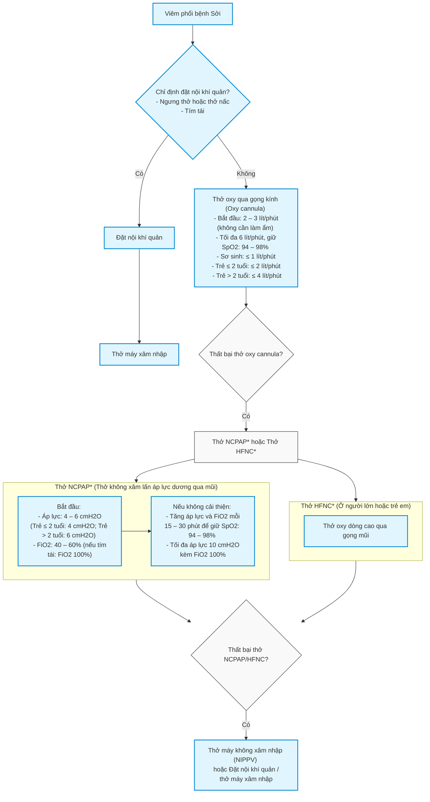

# HƯỚNG DẪN CHẨN ĐOÁN VÀ ĐIỀU TRỊ BỆNH SỞI
*(Ban hành kèm theo Quyết định số 1019/QĐ-BYT, ngày 26 tháng 3 năm 2025 của Bộ trưởng Bộ Y tế)*

Hà Nội, 2025

---

## MỤC LỤC
- DANH SÁCH BAN BIÊN SOẠN
- 1. ĐẠI CƯƠNG
- 2. CHẨN ĐOÁN BỆNH SỞI
- 3. ĐIỀU TRỊ SỞI
- 4. CHĂM SÓC ĐIỀU DƯỠNG
- 5. DỰ PHÒNG VÀ KIỂM SOÁT LÂY NHIỄM

---

## DANH SÁCH BAN BIÊN SOẠN
**“HƯỚNG DẪN CHẨN ĐOÁN VÀ ĐIỀU TRỊ BỆNH SỞI”**

### Chỉ đạo biên soạn
- **GS.TS. Trần Văn Thuấn** – Thứ trưởng Bộ Y tế (Chỉ đạo biên soạn)

### Chủ biên
- **PGS.TS. Nguyễn Thanh Hùng** – Giám đốc Bệnh viện Nhi Đồng 1 (Chủ biên)

### Thành viên ban biên soạn
- **TS. Nguyễn Trọng Khoa** – Phó Cục trưởng Cục Quản lý Khám, chữa bệnh, Bộ Y tế
- **PGS.TS. Trần Minh Điển** – Giám đốc Bệnh viện Nhi Trung ương, Chủ tịch Hội Nhi khoa Việt Nam
- **GS.TS. Phạm Nhật An** – Phó Chủ tịch Hội Nhi khoa Việt Nam
- **TS. Nguyễn Văn Vĩnh Châu** – Phó Giám đốc Sở Y tế Thành phố Hồ Chí Minh
- **BSCKII. Nguyễn Trung Cấp** – Phó Giám đốc Bệnh viện Bệnh Nhiệt đới Trung ương
- **TS. Cao Việt Tùng** – Phó Giám đốc Bệnh viện Nhi Trung ương
- **BSCKII. Nguyễn Minh Tiến** – Phó Giám đốc Bệnh viện Nhi Đồng Thành phố Hồ Chí Minh
- **TS.BSCKII. Ngô Ngọc Quang Minh** – Phó Giám đốc Bệnh viện Nhi Đồng 1
- **PGS.TS. Trần Văn Giang** – Phó Viện trưởng Viện Đào tạo và Nghiên cứu Bệnh Nhiệt đới, Bệnh viện Nhiệt đới Trung ương
- **PGS.TS. Nguyễn Hoàng Anh** – Giám đốc Trung tâm DI & ADR quốc gia, Trường Đại học Dược Hà Nội
- **PGS.TS. Đỗ Duy Cường** – Giám đốc Trung tâm Bệnh nhiệt đới, Bệnh viện Bạch Mai
- **TS. Nguyễn Văn Lâm** – Giám đốc Trung tâm Bệnh Nhiệt đới, Bệnh viện Nhi Trung ương
- **PGS.TS. Phạm Văn Quang** – Trưởng khoa Hồi sức Tích cực – Chống độc, Bệnh viện Nhi Đồng 1
- **PGS.TS. Phùng Nguyễn Thế Nguyên** – Trưởng khoa Hồi sức Nhiễm, Bệnh viện Nhi Đồng 1
- **TS. Lê Quốc Hùng** – Trưởng khoa Bệnh nhiệt đới, Bệnh viện Chợ Rẫy
- **TS. Phan Tứ Quý** – Trưởng khoa Cấp cứu – Hồi sức tích cực – Chống độc trẻ em, Bệnh viện Bệnh nhiệt đới Thành phố Hồ Chí Minh
- **TS. Lê Kiến Ngãi** – Trưởng khoa Dự phòng và Kiểm soát nhiễm khuẩn, Bệnh viện Nhi Trung ương
- **TS. Trần Anh Tuấn** – Trưởng khoa Hô hấp, Bệnh viện Nhi Đồng 1
- **BSCKII. Nguyễn Thị Hồng Lan** – Trưởng khoa Nhi C, Bệnh viện Bệnh nhiệt đới Thành phố Hồ Chí Minh
- **BSCKII. Dư Tuấn Quy** – Trưởng khoa Nhiễm, Bệnh viện Nhi Đồng 1
- **TS. Lê Nguyễn Thanh Nhàn** – Trưởng Phòng chỉ đạo tuyến, Bệnh viện Nhi Đồng 1
- **BSCKII. Đinh Tấn Phương** – Trưởng khoa Cấp cứu, Bệnh viện Nhi Đồng 1
- **TS. Đỗ Châu Việt** – Trưởng khoa Hồi sức tích cực Nhiễm, Bệnh viện Nhi Đồng 2
- **BSCKII. Phạm Thái Sơn** – Trưởng khoa Hồi sức tích cực, Bệnh viện Nhi Đồng 2
- **ThS. Trương Lê Vân Ngọc** – Trưởng phòng Nghiệp vụ – Bảo vệ sức khỏe cán bộ, Cục Quản lý Khám, chữa bệnh, Bộ Y tế
- **ThS. Lê Thị Thanh Thủy** – Trưởng khoa Kiểm soát Nhiễm khuẩn, Bệnh viện Nhi Đồng 1
- **TTND. BS. Bạch Văn Cam** – Cố vấn chuyên môn cao cấp, Bệnh viện Nhi Đồng 1
- **BS. Trương Hữu Khanh** – Cố vấn chuyên môn Khoa nhiễm – Thần kinh, Bệnh viện Nhi Đồng 1
- **ThS. Nguyễn Đình Qui** – Phó khoa Nhiễm, Bệnh viện Nhi Đồng 2
- **BSCKII. Bùi Nguyễn Thành Long** – Phó Trưởng phòng Nghiệp Vụ Y, Sở Y tế Thành phố Hồ Chí Minh
- **BSCKII. Nguyễn Thành Đạt** – Phó Trưởng phòng Kế hoạch tổng hợp, Bệnh viện Nhi Đồng 2
- **BSCKII. Lưu Thanh Bình** – Phó Trưởng phòng Phòng Chỉ đạo tuyến, Bệnh viện Nhi Đồng 2
- **ThS. Bùi Thị Thúy** – Phó trưởng phòng Kế hoạch tổng hợp, Bệnh viện Bệnh Nhiệt đới Trung ương
- **ThS. Nguyễn Mai Hương** – Chuyên viên chính Cục Bà mẹ và Trẻ em, Bộ Y tế
- **ThS. Lê Kim Dung** – Chuyên viên chính phòng Nghiệp vụ và Bảo vệ sức khỏe cán bộ, Cục Quản lý Khám, chữa bệnh, Bộ Y tế
- **BS. Nguyễn Bá Đăng** – Chuyên viên Phòng Kiểm soát bệnh truyền nhiễm, Cục Y tế dự phòng
- **ThS. Phạm Hùng Tiến** – Phòng Nghiệp vụ – Bảo vệ sức khỏe cán bộ, Cục Quản lý Khám, chữa bệnh, Bộ Y tế
- **DS. Đỗ Thị Ngát** – Chuyên viên Phòng Nghiệp vụ – Bảo vệ sức khỏe cán bộ, Cục Quản lý Khám, chữa bệnh, Bộ Y tế
- **ĐDCKI. Lê Thị Uyên Ly** – Điều dưỡng trưởng khoa Hồi sức Tích cực – Chống độc, Bệnh viện Nhi Đồng 1
- **ThS. ĐD. Trần Nguyễn Ái Nương** – Điều dưỡng trưởng khoa Hồi sức Nhiễm, Bệnh viện Nhi Đồng 1

---

## 1. ĐẠI CƯƠNG
Bệnh Sởi là bệnh truyền nhiễm cấp tính, lây lan mạnh do vi rút Sởi (họ *Morbillivirus*) gây ra, bệnh có thể gây các biến chứng nặng dẫn đến tử vong. Bệnh thường gặp ở trẻ dưới 3 tuổi, người lớn chưa tiêm hoặc tiêm phòng chưa đầy đủ.

Vi rút Sởi chứa RNA sợi đơn, với hai protein chính là hemagglutinin (H) và fusion (F) quan trọng trong đáp ứng miễn dịch. Kháng thể trung hòa chủ yếu tác động lên protein H, còn protein F giúp hạn chế sự phát triển vi rút. Theo Tổ chức Y tế Thế giới (WHO), vi rút Sởi được phân thành 8 nhóm (A-H) và 23 kiểu gen, hỗ trợ theo dõi sự lây lan dịch bệnh.

Sởi lây qua đường không khí, giọt bắn hoặc tiếp xúc trực tiếp với dịch tiết hô hấp. Các triệu chứng điển hình bao gồm sốt, viêm long đường hô hấp, viêm kết mạc và phát ban. Bệnh có thể gây biến chứng nguy hiểm như viêm phổi, viêm não, viêm tai giữa, viêm loét giác mạc hoặc tiêu chảy, thậm chí tử vong.

Chẩn đoán bệnh Sởi thường dựa vào xét nghiệm kháng thể IgM, trong đó 50-70% trường hợp dương tính ngay từ ngày đầu phát ban và đạt 100% sau 3 ngày phát ban.

Vắc xin phòng ngừa Sởi có hiệu quả phòng bệnh cao, phần lớn trẻ bệnh Sởi là chưa tiêm ngừa vắc xin Sởi. Mặc dù đã có vắc xin phòng bệnh, nhưng tỷ lệ mắc Sởi hiện nay tại Việt Nam cũng như trên thế giới vẫn được Tổ chức Y tế Thế giới quan tâm, tiếp tục coi là vấn đề y tế toàn cầu.

---

## 2. CHẨN ĐOÁN BỆNH SỞI

### 2.1. Lâm sàng

#### 2.1.1. Thể điển hình
Diễn biến lâm sàng thể điển hình qua 4 giai đoạn:
- **Giai đoạn ủ bệnh:** Từ 7 đến 21 ngày (trung bình 10 ngày), triệu chứng xuất hiện sau khi phơi nhiễm 10 - 14 ngày.
- **Giai đoạn khởi phát (giai đoạn viêm long):** Trong 2 - 4 ngày. Trong giai đoạn này người bệnh sốt cao, viêm long đường hô hấp trên (ho, chảy mũi) và viêm kết mạc. Có thể thấy hạt Koplik là các hạt nhỏ có kích thước 0,5 - 1 mm màu trắng/xám có quầng ban đỏ nổi gồ lên trên bề mặt niêm mạc má (phía trong miệng, ngang răng hàm trên). Hạt Koplik thường xuất hiện một ngày trước phát ban và tồn tại 2 - 3 ngày sau khi ban xuất hiện.
- **Giai đoạn toàn phát:** Kéo dài 2 - 5 ngày. Thường sau khi sốt cao 3 - 4 ngày người bệnh bắt đầu phát ban dạng dát sẩn, khi căng da thì ban biến mất, xuất hiện từ sau tai, sau gáy, trán, mặt, cổ dần lan đến thân mình và tứ chi, cả ở lòng bàn tay và gan bàn chân. Ban có thể hợp lại đặc biệt là ở vùng mặt và thân mình. Khi ban mọc hết toàn thân thì thân nhiệt giảm dần.
- **Giai đoạn phục hồi:** Ban nhạt màu dần rồi sang màu xám, bong vảy phấn sẫm màu, để lại vết thâm vằn da hổ và biến mất theo thứ tự như khi xuất hiện. Nếu không xuất hiện biến chứng thì bệnh tự khỏi. Có thể có ho kéo dài 1 - 2 tuần sau khi hết ban.

*Hình 1. Diễn biến lâm sàng bệnh Sởi thể điển hình (Kèm theo triệu chứng đặc trưng như hạt Koplik, ho, chảy mũi)*  
*(Nguồn: WHO. Manual for the laboratory diagnosis of measles and rubella infection)*

#### 2.1.2. Thể không điển hình
- Biểu hiện lâm sàng có thể **sốt nhẹ thoáng qua**, **viêm long nhẹ** và **phát ban ít**, toàn trạng tốt. Thể này dễ bị bỏ qua, dẫn đến lây lan bệnh cho mọi người xung quanh mà không biết.
- Người bệnh cũng có thể **sốt cao liên tục**, **phát ban không điển hình**, **phù nề tứ chi**, **đau mỏi toàn thân**, thường có **viêm phổi nặng** kèm theo.

### 2.2. Cận lâm sàng

#### 2.2.1. Xét nghiệm cơ bản
- **Công thức máu:** Thường giảm tổng số bạch cầu, giảm bạch cầu lympho, có thể giảm tiểu cầu.
- **X-quang phổi:** Có thể thấy viêm phổi kẽ; có thể tổn thương nhu mô phổi khi có bội nhiễm.
- **Khí máu động mạch:** Khi có suy hô hấp.
- **Xét nghiệm đánh giá đáp ứng viêm:** Ferritin, LDH, Interleukin khi Sởi có biến chứng nhiễm khuẩn nặng.

#### 2.2.2. Xét nghiệm chẩn đoán nhiễm Sởi
- **Xét nghiệm huyết thanh học:** Xét nghiệm IgM từ ngày thứ 3 sau khi phát ban. Nếu xét nghiệm IgM Sởi âm tính mà triệu chứng lâm sàng vẫn nghi ngờ Sởi thì có thể làm lại lần 2 sau 72 giờ, hoặc chỉ định PCR Sởi qua bệnh phẩm dịch tỵ hầu.
- **Xét nghiệm PCR phát hiện vi rút Sởi:** Chỉ định sớm trong giai đoạn viêm long hoặc phân lập vi rút từ máu và dịch mũi họng trong giai đoạn sớm của bệnh.

### 2.3. Yếu tố nguy cơ bệnh diễn tiến nặng
- **Trẻ < 12 tháng**.
- **Người chưa tiêm phòng vắc xin** hoặc tiêm không đầy đủ.
- **Suy giảm miễn dịch** bẩm sinh hoặc mắc phải.
- **Bệnh nền nặng**.
- **Suy dinh dưỡng nặng**.
- **Thiếu vitamin A**.
- **Phụ nữ mang thai**.

### 2.4. Chẩn đoán bệnh Sởi

#### 2.4.1. Ca bệnh nghi ngờ
Ca bệnh nghi ngờ mắc Sởi khi có các dấu hiệu sau:
- Tiền sử tiếp xúc với người bệnh Sởi trong vòng 7 - 21 ngày hoặc sống trong vùng dịch Sởi lưu hành.
- Triệu chứng lâm sàng nghi ngờ Sởi (sốt và viêm long đường hô hấp trên).

#### 2.4.2. Ca bệnh lâm sàng
Chẩn đoán ca bệnh Sởi trên lâm sàng khi người bệnh có các triệu chứng sau:
- Sốt.
- Ho, chảy nước mũi hoặc viêm kết mạc.
- Có hạt Koplik hoặc phát ban dạng Sởi.

#### 2.4.3. Chẩn đoán xác định
- Ca bệnh nghi ngờ hoặc ca bệnh lâm sàng mắc Sởi, **VÀ**
- Có xét nghiệm kháng thể IgM hoặc PCR dương tính với Sởi.

### 2.5. Chẩn đoán phân biệt
- **Nhiễm Rubella:** Phát ban không có trình tự, ít khi có viêm long.
- **Bệnh Kawasaki:** Phát ban kèm đỏ mắt không có nung mủ; màng nhầy vùng miệng, môi và cổ họng bị kích thích; hạch bạch huyết vùng cổ sưng; sưng tấy, bong da bàn tay, bàn chân.
- **Nhiễm Enterovirus:** Phát ban không có trình tự, hay kèm rối loạn tiêu hoá.
- **Bệnh do Mycoplasma pneumoniae:** Sốt nhẹ, đau đầu và viêm phổi không điển hình.
- **Bệnh sốt mò:** Có vết loét hoại tử do côn trùng đốt.
- **Phản ứng dị ứng:** Kèm theo ngứa, tăng bạch cầu ái toan.
- **Nhiễm EBV:** Hay kèm theo tăng bạch cầu đơn nhân.
- **Viêm màng não mủ** (khi có bệnh cảnh lâm sàng biến chứng thần kinh): Sốt, nhức đầu, nôn ói, dấu hiệu màng não kèm dịch não tủy đục, tăng protein, đường giảm, tăng bạch cầu đa nhân.

### 2.6. Phân độ bệnh Sởi

#### 2.6.1. Sởi không biến chứng
- Tỉnh táo
- Ăn bú tốt
- Không khó thở

#### 2.6.2. Sởi có biến chứng
- Viêm tai giữa
- Viêm thanh quan (Viêm thanh khí phế quản)
- Viêm loét miệng
- Viêm phổi
- Tiêu chảy cấp
- Viêm não tủy rải rác cấp tính (ADEM)
- Nhiễm trùng huyết, sốc nhiễm trùng
- Viêm kết mạc, viêm loét giác mạc
- Viêm não xơ cứng toàn thể bán cấp thường sau 7 - 10 năm

### 2.7. Chẩn đoán biến chứng

#### 2.7.1. Viêm phổi
- Viêm phổi là **nguyên nhân tử vong phổ biến nhất** ở bệnh nhân Sởi. Viêm phổi có thể xảy ra do: **viêm phổi tế bào khổng lồ** do vi rút Sởi gây trực tiếp, hoặc do **nhiễm trùng bội nhiễm** do vi khuẩn.
- Sau viêm phổi do Sởi nặng, bệnh nhân có thể tiến triển đến **viêm tiểu phế quản tắc nghẽn** (Bronchiolitis Obliterans) và tử vong. Ở trẻ sơ sinh và trẻ nhỏ, bệnh Sởi thường gây ra các biến chứng nặng về hô hấp, bao gồm: **viêm thanh khí phế quản** (Croup), **viêm khí quản**, **viêm tiểu phế quản**.

#### 2.7.2. Biến chứng tai - mũi - họng
- **Viêm tai giữa cấp** là biến chứng phổ biến nhất của bệnh Sởi.
- **Viêm xoang** và **viêm xương chũm** cũng có thể xảy ra.
- Có thể có **áp xe sau họng** liên quan đến Sởi.

#### 2.7.3. Biến chứng tiêu hóa
- **Tiêu chảy** và **nôn trớ** thường gặp trong giai đoạn cấp tính. **Mất nước** có thể xảy ra do giảm lượng thức ăn đưa vào liên quan đến viêm miệng, tiêu chảy, hoặc cả hai, đặc biệt ở trẻ nhỏ.
- **Viêm ruột thừa** hoặc **đau bụng** có thể xảy ra do tắc nghẽn lòng ruột thừa liên quan đến tăng sản mô lympho.

#### 2.7.4. Biến chứng thần kinh
- **Co giật do sốt:** Xảy ra ở < 3% trẻ mắc Sởi.
- **Viêm não do Sởi:** Tỷ lệ mắc từ 1 - 3/1.000 ca, nguy cơ cao hơn ở thanh thiếu niên và người lớn so với trẻ nhỏ. Viêm não hậu nhiễm Sởi là biến chứng qua trung gian miễn dịch, không phải do vi rút trực tiếp gây tổn thương hệ thần kinh. Triệu chứng viêm não do Sởi: co giật, lơ mơ, kích thích vật vã, hôn mê. Xét nghiệm dịch não tủy: tăng bạch cầu lympho, tăng protein dịch não tủy.
- **Viêm não ở bệnh nhân suy giảm miễn dịch:** Có liên quan đến tổn thương não trực tiếp do vi rút.
- **Viêm não bán cấp do Sởi:** Xuất hiện 1 - 10 tháng sau nhiễm Sởi ở bệnh nhân AIDS, ung thư máu hoặc dùng thuốc ức chế miễn dịch.

#### 2.7.5. Viêm não xơ cứng toàn thể bán cấp
**Viêm não xơ cứng toàn thể bán cấp** (Subacute Sclerosing Panencephalitis - SSPE) thường gặp ở trẻ mắc Sởi trước 2 tuổi, 75% bệnh nhân SSPE bị Sởi trước 4 tuổi. Tỷ lệ mắc SSPE giảm đáng kể sau khi chương trình tiêm chủng Sởi được triển khai.

#### 2.7.6. Khởi phát bệnh lao
Nhiễm Sởi có thể **ức chế đáp ứng miễn dịch qua trung gian tế bào**, làm giảm phản ứng tuberculin khi xét nghiệm Mantoux. Ở những bệnh nhân đang nhiễm lao tiềm ẩn, nhiễm Sởi có thể tăng nguy cơ kích hoạt **bệnh lao phổi**.

#### 2.7.7. Nhiễm trùng huyết / Sốc nhiễm trùng
- **Nhiễm trùng huyết** được xác nhận khi có tình trạng đáp ứng viêm toàn thân và suy chức năng các cơ quan.
- **Sốc nhiễm trùng** được xác nhận khi người bệnh có tình trạng nhiễm trùng huyết và kèm suy chức năng tuần hoàn dai dẳng không đáp ứng bù dịch đầy đủ. Khi phát hiện, bệnh nhân cần được điều trị kịp thời bằng kháng sinh phù hợp và liệu pháp hồi sức tích cực.

#### 2.7.8. Các biến chứng khác
- **Bệnh Sởi thể xuất huyết (Black Measles):** Hiện nay hiếm gặp, nhưng từng là một thể Sởi rất nặng, với biểu hiện phát ban xuất huyết, thường dẫn đến tử vong.
- **Viêm giác mạc:** Tổn thương biểu mô giác mạc cũng có thể gặp nhưng hồi phục sau 1 - 2 tuần sau khi hết Sởi.

---

## 3. ĐIỀU TRỊ SỞI

### 3.1. Nguyên tắc điều trị
- Điều trị theo phân loại và sàng lọc người bệnh Sởi hoặc nghi ngờ Sởi.
- Cách ly ca bệnh ngay khi nghi ngờ mắc Sởi.
- Uống vitamin A liều cao.
- Điều trị triệu chứng.
- Phát hiện và điều trị sớm các biến chứng.
- Đảm bảo dinh dưỡng.
- Không sử dụng corticoid đường toàn thân khi chưa loại trừ Sởi.

*(Xem Phụ lục 1: Lưu đồ phân loại và sàng lọc người bệnh Sởi, nghi ngờ Sởi tại cơ sở y tế)*

### 3.2. Điều trị cụ thể

#### 3.2.1. Điều trị bệnh Sởi không biến chứng
- Có thể điều trị ngoại trú.
- Cách ly ca bệnh tại nhà: Nằm phòng riêng, hạn chế tiếp xúc, đeo khẩu trang thường xuyên.
- Uống vitamin A liều cao: Tất cả trẻ bị Sởi với hai liều cách nhau 24 giờ. Nếu có dấu hiệu thiếu vitamin A hoặc suy dinh dưỡng nặng, bổ sung liều thứ ba sau 4 - 6 tuần.

**Bảng 1: Liều bổ sung vitamin A trong bệnh Sởi cho trẻ em**

| Nhóm tuổi | Liều vitamin A (IU/liều) | Số lần uống |
| :--- | :---: | :--- |
| Trẻ < 6 tháng | 50.000 IU | Uống 2 lần cách nhau 24 giờ |
| Trẻ 6 - 12 tháng | 100.000 IU | Uống 2 lần cách nhau 24 giờ |
| Trẻ > 12 tháng | 200.000 IU | Uống 2 lần cách nhau 24 giờ |
| Bổ sung liều thứ 3 | Theo tuổi | Sau 4 - 6 tuần |

Dựa trên bằng chứng từ nghiên cứu ở trẻ em và lý thuyết về lợi ích của bổ sung vitamin A, có khả năng vitamin A cũng có giá trị trong điều trị bệnh Sởi ở người lớn, đặc biệt là ở những nhóm quần thể có nguy cơ thiếu hụt vitamin A.

Phụ nữ trong độ tuổi sinh sản nghi ngờ thiếu vitamin A chỉ nên được điều trị với liều thấp nhưng thường xuyên hơn để tránh nguy cơ gây quái thai, liều khuyến nghị: Vitamin A đường uống: 5.000 IU/ngày, trong ít nhất 4 tuần. Cân nhắc dùng vitamin A ở phụ nữ có thai khi có biểu hiện thiếu vitamin A (biểu hiện quáng gà hay định lượng nồng độ Retinol thấp).

##### Điều trị triệu chứng và nâng đỡ
- **Sốt:**
  - Paracetamol uống hoặc nhét hậu môn 10 - 15 mg/kg x 4 lần/ngày hoặc Ibuprofen uống liều 5 - 10 mg/kg/lần x 3 lần/ngày nếu sốt > 38,5°C.
  - Lau mát khi sốt co giật: 3 vị trí (trán, 2 nách, 2 bên bẹn).
- Dinh dưỡng đầy đủ theo lứa tuổi, tiếp tục bú mẹ.
- Vệ sinh da, mắt, mũi, miệng.
- Tái khám mỗi 2 - 3 ngày cho đến khi hết sốt hoặc khám lại ngay khi có dấu hiệu nặng.

##### Hướng dẫn dấu hiệu nặng cần tái khám ngay
Người bệnh cần tái khám ngay khi có ≥ 1 dấu hiệu:
- Không ăn uống được hoặc bỏ bú.
- Nôn mọi thứ.
- Tím tái.
- Thở nhanh.
- Rối loạn tri giác.

##### Hướng dẫn khác
- Phòng ngừa lây nhiễm chéo: Không đến nơi công cộng, nghỉ học 4 ngày sau phát ban.
- Tiêm vắc xin Sởi cho người bị phơi nhiễm Sởi.

#### 3.2.2. Điều trị bệnh Sởi có biến chứng
Xem xét nhập viện điều trị cho ca bệnh Sởi có biến chứng.
Đảm bảo khu vực điều trị bệnh Sởi là khu cách ly riêng theo quy định, người bệnh tuân thủ theo hướng dẫn phòng ngừa chuẩn.
Hỗ trợ hô hấp khi suy hô hấp. *(Xem Phụ lục 2: Lưu đồ hỗ trợ hô hấp bệnh Sởi)*
Uống vitamin A liều cao: Xem liều lượng vitamin A phần điều trị bệnh Sởi không biến chứng.
Chăm sóc tai, mắt, mũi, miệng, da.

##### 3.2.2.1. Viêm tai giữa cấp
- Rửa tai, làm khô tai nếu có chảy mủ tai.
- Paracetamol hoặc Ibuprofen giảm đau, hạ sốt.
- Kháng sinh ban đầu: **Amoxicillin** hoặc **Amoxicillin - acid clavulanic** uống.

##### 3.2.2.2. Viêm kết mạc mủ
- Rửa mắt hoặc lau mắt bằng **Natri clorua 0,9%**.
- Kháng sinh phổ rộng nhỏ mắt hoặc tra mắt: **Ciprofloxacin** hoặc **Ofloxacin** hoặc **Levofloxacin**.

##### 3.2.2.3. Viêm loét giác mạc
- Chuyển khám và điều trị chuyên khoa mắt.
- Kháng sinh: **Amoxicillin - acid clavulanic** uống hoặc **Cefotaxim** hoặc **Ceftriaxon** tĩnh mạch.
- Vệ sinh mắt theo hướng dẫn.
- Kháng sinh phổ rộng nhỏ mắt hoặc tra mắt: **Ciprofloxacin** hoặc **Ofloxacin** hoặc **Levofloxacin**.
- Không sử dụng các chế phẩm tra, nhỏ mắt có chứa thành phần corticoid.

##### 3.2.2.4. Viêm miệng và loét miệng
- Vệ sinh miệng, súc miệng với **Natri clorua 0,9%** kèm đánh răng sau mỗi bữa ăn và ít nhất 4 lần/ngày.
- Thức ăn để nguội tránh đau.
- Loét miệng: **Amoxicillin** uống kèm **Metronidazol** uống liều **7,5 mg/kg/lần**, ngày 3 lần, trong 5 ngày.
- Nhiễm nấm Candida: **Nystatin** uống trong 7 ngày.

##### 3.2.2.5. Viêm thanh khí phế quản
- Hỗ trợ hô hấp: Tùy theo mức độ suy hô hấp.
- Khí dung **Adrenalin** khi có biểu hiện co thắt, phù nề thanh khí quản.

##### 3.2.2.6. Viêm phổi

###### Hỗ trợ hô hấp tùy theo mức độ suy hô hấp
- **SpO2 < 94%** cần cho trẻ thở hỗ trợ oxy qua gọng kính (thở oxy cannula). Khi thất bại thở oxy cannula: Thở áp lực dương liên tục qua mũi (**NCPAP**).
- Nếu không có sẵn NCPAP, xem xét thở **HFNC** khi thất bại thở oxy cannula.
- Khi thất bại thở oxy, thở áp lực dương liên tục qua mũi: Đặt nội khí quản - thở máy. *(Xem Phụ lục 2: Lưu đồ hỗ trợ hô hấp viêm phổi bệnh Sởi)*

###### Kháng sinh

Tác nhân vi khuẩn gây viêm phổi bội nhiễm ở bệnh Sởi thường gặp là Phế cầu, *Haemophilus influenzae*, Tụ cầu.
- **Kháng sinh ban đầu:**
  - Amoxicillin – acid clavulanic (Uống) hoặc Cefotaxim hoặc Ceftriaxon (TM).
  - Khi thất bại với oxy cannula: Phối hợp thêm Oxacillin (TM) hoặc Cloxacillin (TM) nếu nghi MSSA hoặc Vancomycin (TM) nếu nghi MRSA.
- **Kháng sinh sau 48 giờ nếu không đáp ứng kháng sinh ban đầu:**
  - Cefotaxim hoặc Ceftriaxon phối hợp Vancomycin.
  - Hoặc Ceftazidim hoặc Cefepim hoặc Levofloxacin hoặc Imipenem hoặc Meropenem phối hợp Vancomycin/Linezolid (nếu đã điều trị Vancomycin).

###### Viêm phổi bệnh viện do tác nhân vi khuẩn đa kháng
Các tác nhân đa kháng thường gặp: *Acinetobacter baumannii*, *Pseudomonas aeruginosa*, *Klebsiella pneumoniae* ESBL (+), *Escherichia coli* ESBL (+), *Staphylococcus aureus* kháng Methicillin (MRSA).
- **Kháng sinh ban đầu:**
  - Sử dụng 1 loại kháng sinh kháng *Pseudomonas*: Ceftazidim hoặc Cefepim hoặc Levofloxacin phối hợp Amikacin hoặc Tobramycin hoặc kháng sinh còn nhạy cảm với chủng *Pseudomonas* đang lưu hành tại bệnh viện.
  - Phối hợp kháng sinh kháng MRSA: Vancomycin.
- **Chọn lựa kháng sinh tiếp theo sau 48 giờ:**
  - Lâm sàng cải thiện → tiếp tục kháng sinh.
  - Lâm sàng xấu hơn và kết quả vi khuẩn (-) hoặc (+) nhưng kháng kháng sinh đang sử dụng → Phối hợp thêm Colistin trong trường hợp nghi vi khuẩn *Acinetobacter* hoặc đổi kháng sinh (Linezolid nếu đã điều trị Vancomycin) và kèm xét nghiệm lại vi sinh. *(Xem thêm phần 3.2.2.9: Viêm phổi nặng có biến chứng suy hô hấp (PaO2/FiO2 < 300))*
- **Chỉ định màng trao đổi oxy ngoài cơ thể (ECMO):** khi các giải pháp hồi sức thông lệ không hiệu quả kèm suy tuần hoàn, suy đa tạng khác. Cần thực hiện tại các đơn vị hồi sức nhi khoa có đủ thiết bị, nhân lực, quy trình kỹ thuật ECMO.

##### 3.2.2.8. Viêm não cấp tính
- **Chống co giật:** Diazepam, tiêm TM chậm liều: 0,25 mg/kg.
- **Chống phù não:**
  - Nằm đầu cao 30°, cổ thẳng (nếu không có tụt huyết áp).
  - Thở oxy cannula 2 – 6 lít/phút.
  - Đặt nội khí quản sớm để thở máy khi điểm Glasgow < 10 điểm và tăng thông khí giữ PaO2 từ 80 – 100 mmHg và PaCO2 từ 35 – 40 mmHg.
  - Hạn chế dịch sử dụng 75% nhu cầu cơ bản.
  - Natri clorua 3% liều 3 – 5 ml/kg/lần truyền tĩnh mạch trong vòng 30 phút, lặp lại mỗi 6 – 8 giờ hoặc truyền liên tục nếu cần với tốc độ 0,5 – 1,5 ml/kg/giờ và giữ Na máu: 145 – 150 mmol/L (không quá 160 mmol/L). Cần lưu ý đảm bảo tốc độ tăng Na máu không quá 0,5 mEq/L/giờ. Hoặc sử dụng Mannitol 20% liều 0,5 – 1 g/kg, truyền tĩnh mạch trong 15 – 30 phút.
- **Truyền tĩnh mạch Immunoglobulin** (xem thêm phần 3.2.2.9).
- **Cân nhắc chỉ định corticoid đường toàn thân.**

##### 3.2.2.9. Chỉ định globulin miễn dịch đường tĩnh mạch (IVIG)
- **Chỉ định:**
  - Tình trạng nhiễm trùng nặng kèm theo bằng chứng tăng đáp ứng viêm.
  - Suy hô hấp tiến triển nhanh.
  - Viêm não.
- **Liều dùng:** IVIG tĩnh mạch 0,25 g/kg/ngày × 3 ngày liên tiếp (tổng liều có thể 1 g/kg, dùng từ 2 – 4 ngày). Truyền tĩnh mạch chậm trong 8 – 10 giờ.

### 3.3. Phân cấp điều trị
Bệnh Sởi khả năng lây nhiễm cao nên hạn chế chuyển cấp điều trị. Phân cấp điều trị như sau:
- **Trạm y tế xã và phòng khám tư nhân:**
  - Khám và điều trị ngoại trú người bệnh Sởi không biến chứng.
  - Chuyển tuyến đối với bệnh Sởi có biến chứng hoặc có suy giảm miễn dịch hoặc có bệnh nền nặng.
- **Bệnh viện huyện, bệnh viện tư nhân:**
  - Khám và điều trị người bệnh Sởi không có biến chứng và bệnh Sởi có biến chứng.
  - Chuyển cấp điều trị đối với người bệnh Sởi có biến chứng viêm phổi cần thở oxy, viêm não, nhiễm khuẩn huyết hoặc có suy giảm miễn dịch hoặc có bệnh nền nặng.
- **Bệnh viện đa khoa tỉnh, đa khoa khu vực, bệnh viện chuyên khoa Nhiễm hoặc Nhi:**
  - Khám và điều trị người bệnh Sởi không có biến chứng và bệnh Sởi có biến chứng.
  - Hội chẩn, hướng dẫn tuyến trước điều trị các trường hợp nặng hoặc khó điều trị.

---

## 4. CHĂM SÓC ĐIỀU DƯỠNG
*(Xem Phụ lục 3: Lưu đồ chăm sóc người bệnh Sởi)*

---

## 5. DỰ PHÒNG VÀ KIỂM SOÁT LÂY NHIỄM

### 5.1. Quản lý người bệnh và dự phòng lây truyền

#### 5.1.1. Quản lý người bệnh
- Người bệnh Sởi phải được hạn chế tiếp xúc tại nhà hoặc tại cơ sở điều trị theo nguyên tắc cách ly đối với bệnh lây truyền qua không khí, giọt bắn hoặc tiếp xúc trực tiếp với dịch tiết đường hô hấp.
- Thời gian hạn chế tiếp xúc từ lúc nghi mắc Sởi cho đến ít nhất 4 ngày sau khi bắt đầu phát ban. Đối với người suy giảm miễn dịch, cân nhắc thời gian cách ly dài hơn.
- Người bệnh nằm phòng thoáng, thông khí tốt.
- Không để người bệnh Sởi trong thời gian hạn chế tiếp xúc tham gia các sinh hoạt tập thể.
- Đảm bảo dinh dưỡng, nâng cao thể trạng để tăng sức đề kháng giảm bớt nguy cơ biến chứng.

#### 5.1.2. Dự phòng lây nhiễm
- Người chưa có tiêm phòng Sởi, người không mắc bệnh thì không nên tiếp xúc với người bệnh Sởi. Nếu bắt buộc phải tiếp xúc: mang khẩu trang và vệ sinh tay sau khi tiếp xúc với người bệnh.
- Nhân viên y tế: cần được tiêm phòng Sởi đầy đủ nếu không có chống chỉ định. Hạn chế việc tiếp xúc gần khi không cần thiết. Khi cần tiếp xúc thì mang khẩu trang có độ lọc cao và vệ sinh tay sau khi tiếp xúc với người bệnh.
- Vệ sinh môi trường: Giữ thông thoáng môi trường nơi làm việc, học tập, sinh hoạt; Vệ sinh thường xuyên các bề mặt nơi ở, sinh hoạt, làm việc, học tập. Khi có người bệnh Sởi xuất hiện, sử dụng hoá chất khử khuẩn có nồng độ clo hoạt tính 0,05% để vệ sinh các bề mặt.
- Tuyên truyền tăng cường vệ sinh thân thể, mũi họng, giữ ấm, nâng cao thể trạng để tăng cường sức đề kháng, đặc biệt trong mùa dịch Sởi.

**Định nghĩa phơi nhiễm:** Khi tiếp xúc người bệnh đã chẩn đoán Sởi trong vòng 4 ngày trước hoặc sau phát ban, thuộc một trong các tình huống sau:
- Tiếp xúc trực tiếp (mặt đối mặt) bất kể thời gian tiếp xúc.
- Ở chung phòng với người bệnh ít nhất 15 phút. Đối với người có suy giảm miễn dịch thì không có tiêu chuẩn thời gian tiếp xúc hoặc vào phòng của người bệnh mới rời.

Nhóm phơi nhiễm cần được lưu ý, đặc biệt trong cơ sở y tế, cần được truy vết và giám sát cẩn thận, hỏi kỹ các yếu tố nguy cơ, tiền sử tiêm phòng Sởi.

**Chú ý một số biện pháp dự phòng sau phơi nhiễm:**
- Tiêm vắc xin Sởi (vắc xin Sởi đơn, hoặc vắc xin có chứa thành phần Sởi) trong vòng 72 giờ cho bệnh nhân > 9 tháng tuổi, có tiền sử khỏe mạnh chưa tiêm vắc xin Sởi hoặc đã tiêm được 1 mũi trên 28 ngày.
- Sử dụng Immune Globulin (IG) đường truyền tĩnh mạch, hoặc tiêm bắp hoặc tiêm dưới da:
  - **Chỉ định Immune Globulin dự phòng sau phơi nhiễm:**
    - Người suy giảm miễn dịch nặng (Mới ghép tế bào gốc trong vòng 12 tháng hoặc suy giảm miễn dịch nguyên phát nặng hoặc tình trạng không gammaglobulin nặng kéo dài IgG < 3 g/L).
    - Trẻ em dưới 9 tháng có bệnh lý nền nặng đang tiến triển.
    - Xem xét chỉ định đối với phụ nữ mang thai.
  - **Thời gian:** trong vòng 3 – 6 ngày đầu phơi nhiễm.
  - **Lưu ý:** Không dùng Immune Globulin khi trẻ đã được điều trị IVIG trong vòng 1 tháng hoặc đã tiêm phòng đủ 2 mũi vắc xin Sởi.
  - **Liều lượng:** Theo thông tin hướng dẫn chỉ định của thuốc. Với trẻ suy giảm miễn dịch có thể tăng liều gấp đôi.

### 5.2. Phòng bệnh chủ động bằng vắc xin
- Sử dụng vắc xin Sởi đơn hoặc vắc xin có thành phần Sởi kết hợp rubella hoặc kết hợp với quai bị và rubella. Lịch tiêm theo chương trình Tiêm chủng mở rộng.
- Tiêm vắc xin phòng Sởi cho các đối tượng khác hoặc khi có đợt bùng phát dịch Sởi theo khuyến cáo và hướng dẫn của từng địa phương.

---

## TÀI LIỆU THAM KHẢO
1. Bộ Y tế. Hướng dẫn chẩn đoán và điều trị bệnh Sởi (Ban hành kèm theo Quyết định số: 1327/QĐ-BYT ngày 18 tháng 04 năm 2014 của Bộ trưởng Bộ Y tế). Hà Nội: Bộ Y tế.
2. World Health Organization (WHO). Manual for the laboratory diagnosis of measles and rubella virus infection [Internet]. 2nd ed. Geneva: WHO; [cited 2024 Feb 4]. Available from: https://iris.who.int/bitstream/handle/10665/70211/WHO_IVB_07.01_eng.pdf.
3. World Health Organization (WHO). Guide for clinical case management and infection prevention and control during a measles outbreak. Geneva: WHO; 2020. Licence: CC BY-NC-SA 3.0 IGO.
4. World Health Organization (WHO). Measles Outbreak Guide. Geneva: WHO; 2021. Licence: CC BY-NC-SA 3.0 IGO.
5. Centers for Disease Control and Prevention (CDC). Measles: Postexposure Prophylaxis. In: Atkinson W, Hamborsky J, Wolfe S, editors. Epidemiology and Prevention of Vaccine-Preventable Diseases (“Pink Book”). 12th ed. 2nd printing. Washington, DC: Public Health Foundation; 2012. p. 186. Available from: http://www.cdc.gov/vaccines/pubs/pinkbook/meas.html.
6. California Department of Public Health (CDPH). Immune Globulin for Measles Postexposure Prophylaxis [Internet]. [cited 2024 Feb 4]. Available from: https://www.cdph.ca.gov/Programs/CID/DCDC/CDPH%20Document%20Library/Immunization/Measles-IGPEPQuicksheet.pdf.
7. Kliegman RM, Weiss SL, Tissières P, et al. Measles. In: Kliegman RM, editor. Nelson Textbook of Pediatrics. 22nd ed. Philadelphia: Elsevier; 2024. Volume 1. Part VII, Chapter 293. p. 1958-1963.
8. Carroll CL, Napolitano NR, Pons-Òdena M, et al. Noninvasive respiratory support for pediatric acute respiratory distress syndrome: From the Second Pediatric Acute Lung Injury Consensus Conference. Pediatr Crit Care Med. 2023 Feb;24(Suppl 1 2S):S135–S147.
9. Executive Summary of the Second International Guidelines for the Diagnosis and Management of Pediatric Acute Respiratory Distress Syndrome (PALICC-2): Erratum. Pediatr Crit Care Med. 2024 Mar 1;25(3):e175.
10. Bhalla A, Baudin F, Takeuchi M, et al. Monitoring in pediatric acute respiratory distress syndrome: From the Second Pediatric Acute Lung Injury Consensus Conference. Pediatr Crit Care Med. 2023 Feb;24(Suppl 1 2S):S112–S123.
11. Singer M, Deutschman CS, Seymour CW, et al. The third international consensus definitions for sepsis and septic shock (Sepsis-3). *JAMA*. 2016;315(8):801–810.
12. The UK Health Security Agency. National measles guidelines July 2024. Available from: https://assets.publishing.service.gov.uk/media/66a0ce1449b9c0597fdb03a6/20240704_national-measles-guidelines-July-2024.pdf

---

## Phụ lục 1. Lưu đồ phân loại và sàng lọc người bệnh sởi, nghi ngờ sởi tại cơ sở y tế
*(Nguồn: WHO (2020). Guide for clinical case management and infection prevention and control during a measles outbreak)*

---

## PHỤ LỤC 2: LƯU ĐỒ HỖ TRỢ HÔ HẤP VIÊM PHỔI BỆNH SỞI

*Người bệnh phải nằm phòng cách ly Sởi.*

---

## PHỤ LỤC 3: LƯU ĐỒ CHĂM SÓC NGƯỜI BỆNH SỞI
### ĐÁNH GIÁ NGƯỜI BỆNH
*(Bệnh sử, thăm khám, dấu hiệu sinh tồn, SpO2, tri giác, tiền sử tiêm chủng và tiếp xúc sởi, cân nặng)*

| Hạng mục | SỞI KHÔNG BIẾN CHỨNG (Điều trị ngoại trú) | SỞI CÓ BIẾN CHỨNG: Viêm thanh quản / Viêm tai giữa / Viêm kết mạc / Tiêu chảy cấp (Nhập viện) | SỞI CÓ BIẾN CHỨNG: Viêm phổi (Nhập viện) | SỞI CÓ BIẾN CHỨNG: Viêm não (Nhập viện) |
| :--- | :--- | :--- | :--- | :--- |
| **Hướng dẫn / Can thiệp chăm sóc** | - **Chăm sóc tại nhà** - Thực hiện y lệnh:   + Uống kháng sinh (nếu có toa)   + Uống Vitamin A (toa)   + Uống Paracetamol hoặc Ibuprofen (toa) - Dinh dưỡng đầy đủ theo tuổi, bú mẹ. - Vệ sinh da, mắt, mũi, miệng. - Hướng dẫn phòng ngừa lây chéo: cách ly phòng riêng, hạn chế tiếp xúc, không đến nơi công cộng, nghỉ học 4 ngày sau phát ban. - Tiêm vắc xin Sởi cho người phơi nhiễm chưa tiêm chủng. | - **Thân nhân/Nhân viên y tế:** Mang khẩu trang. - **Chăm sóc:**   + Rửa tai, mắt bằng NaCl 0,9% (nếu chảy mủ/kết mạc mủ)   + Nhỏ/tra mắt kháng sinh phổ rộng (nếu có chỉ định)   + Thức ăn mềm, nguội (tránh đau miệng)   + Cho uống Oresol (tiêu chảy) - **Thực hiện y lệnh (YL):**   + Kháng sinh uống/TB/TM   + Phun khí dung Adrenaline (viêm thanh quản)   + Vitamin A uống/sonde dạ dày   + Truyền dịch (tiêu chảy/mất nước)   + Thuốc hạ sốt - Dinh dưỡng đường miệng/TM. - Thực hiện xét nghiệm. - Phòng ngừa lây chéo. - Hướng dẫn tiêm chủng Sởi cho người phơi nhiễm chưa tiêm chủng. | - **Thân nhân/Nhân viên y tế:** Mang khẩu trang. - **Chăm sóc:**   + Nằm đầu cao   + Hút đàm mũi miệng   + Thở oxy cannula (nếu có)   + Thiết lập đường truyền tĩnh mạch ngoại biên   + Chăm sóc tai, mắt, mũi, miệng, da - **Thực hiện y lệnh (YL):**   + Thở oxy cannula / Phụ bác sĩ thở NCPAP hoặc đặt NKQ   + Kháng sinh TM   + IVIG truyền TM   + Vitamin A uống/sonde dạ dày   + Truyền dịch   + Hạ sốt Paracetamol HM/TM - Dinh dưỡng đường miệng/TM. - Thực hiện xét nghiệm. - Phòng ngừa lây chéo. - Hướng dẫn tiêm chủng Sởi cho người phơi nhiễm chưa tiêm chủng. | - **Thân nhân/Nhân viên y tế:** Mang khẩu trang. - **Chăm sóc:**   + Nằm nghiêng bên (khi co giật)   + Hút đàm mũi miệng   + Đặt đường truyền tĩnh mạch ngoại biên   + Vệ sinh mắt, mũi, miệng, da - **Thực hiện y lệnh (YL):**   + Diazepam TM (khi co giật)   + Phụ bác sĩ đặt NKQ (nếu có chỉ định)   + Kháng sinh TM   + IVIG truyền TM   + Natri clorua 3% hoặc Mannitol 20% (chống phù não)   + Vitamin A sonde dạ dày   + Truyền dịch - Dinh dưỡng qua sonde dạ dày/TM. - Thực hiện xét nghiệm. - Phòng ngừa lây chéo. - Hướng dẫn tiêm chủng Sởi cho người phơi nhiễm chưa tiêm chủng. |
| **Theo dõi** | - **Tái khám theo hẹn:** Mỗi 2 – 3 ngày cho đến khi hết sốt. - **Theo dõi dấu hiệu nặng cần tái khám ngay:**   + Không ăn uống được/bỏ bú   + Nôn mọi thứ   + Tím tái   + Thở nhanh   + Rối loạn tri giác | - **Theo dõi:**   + Dấu hiệu sinh tồn (DHST), SpO2 mỗi 2 – 4 giờ trong 6 giờ đầu, sau đó mỗi 8 – 12 giờ.   + Tri giác, lượng dịch xuất nhập. - Hướng dẫn thân nhân dấu hiệu nặng cần báo điều dưỡng (ĐD), bác sĩ (BS) xử trí ngay. | - **Theo dõi:**   + DHST, SpO2 mỗi 15 – 30 phút trong giờ đầu, sau đó mỗi 2 – 6 giờ trong 24 giờ.   + Tri giác, lượng dịch xuất nhập. - Hướng dẫn thân nhân dấu hiệu nặng cần báo ĐD, BS xử trí ngay. | - **Theo dõi:**   + DHST, SpO2, tri giác mỗi 15 – 30 phút khi có co giật / phù não cấp, sau đó mỗi 2 – 6 giờ.   + Lượng dịch xuất nhập. - Hướng dẫn thân nhân dấu hiệu nặng cần báo ĐD, BS xử trí ngay. |
| **Lượng giá can thiệp** | - Tỉnh táo. - Ăn bú tốt. - Không khó thở. | - Hết sốt, hết đau tai, hết chảy mủ tai. - Hết đỏ mắt/mủ mắt. - Hết tiêu chảy, không mất nước. | - SpO2 trong giới hạn bình thường. - Thở êm, không co kéo. - Phổi thông khí tốt, giảm ran. | - Hết co giật. - Tri giác cải thiện, tỉnh táo. - Dấu hiệu sinh tồn ổn định. |

#### PHÂN LOẠI LƯỢNG GIÁ CHI TIẾT
- **Sởi không biến chứng:**
  - Tỉnh táo
  - Ăn bú tốt
  - Không khó thở
- **Sởi có biến chứng:**
  - Viêm thanh quản
  - Viêm tai giữa
  - Viêm phổi
  - Viêm kết mạc, viêm loét giác mạc
  - Tiêu chảy cấp
  - Viêm não
  - Nhiễm khuẩn huyết / sốc nhiễm khuẩn
